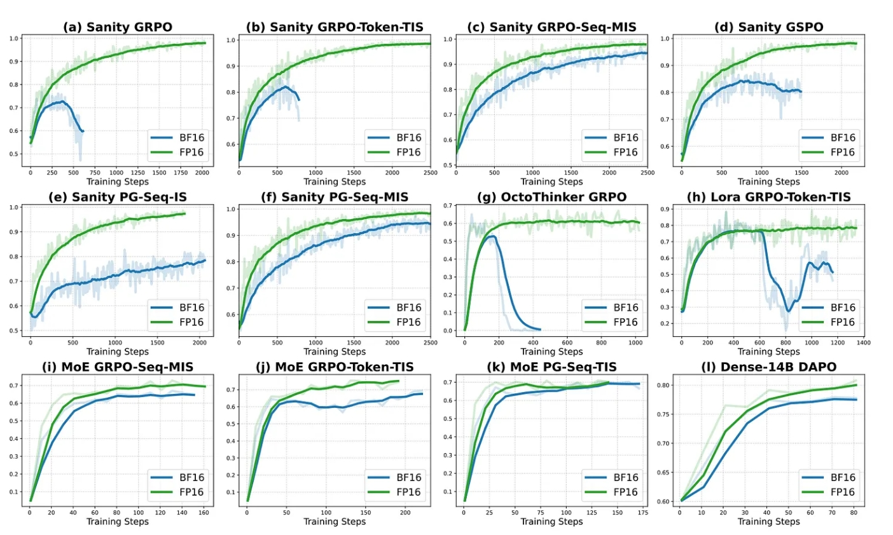

# BF16 vs FP16 for Reinforcement Learning: Where Are We?

> **Based on arXiv:2510.26788** — *Defeating the Training-Inference Mismatch via FP16*

[](https://arxiv.org/abs/2510.26788)
[](LICENSE)

---

## Abstract

**BF16's reduced mantissa precision introduces subtle rounding errors during autoregressive generation that compound catastrophically in reinforcement learning pipelines.** When rollouts (inference) and training execute on different engines—e.g., vLLM vs PyTorch FSDP—BF16 rounding inconsistencies cause **policy divergence, biased gradients, and reward collapse**.

**Solution:** Migrating to **FP16** (10-bit mantissa) achieves **24× lower KL divergence**, **1.5–2× faster convergence**, and **stable training curves** without algorithmic modifications.

---

## Table of Contents

1. [Critical Findings](#critical-findings)
2. [Experimental Evidence](#experimental-evidence)
3. [Floating-Point Fundamentals](#floating-point-fundamentals)
4. [Why RL Demands Mantissa Precision](#why-rl-demands-mantissa-precision)
5. [Training-Inference Mismatch Analysis](#training-inference-mismatch-analysis)
6. [Inference Data Type Considerations](#inference-data-type-considerations)
7. [Implementation Guidelines](#implementation-guidelines)
8. [When BF16 Remains Viable](#when-bf16-remains-viable)
9. [FAQ](#faq)
10. [Common Misconceptions](#common-misconceptions)
11. [Citation](#citation)

---

## Critical Findings

### The Core Problem

BF16 (7-bit mantissa) cannot reliably distinguish between close action logits (e.g., 10.231 vs 10.237), causing:

- **Policy Drift**: Rollout policy diverges from training policy
- **Gradient Bias**: Importance sampling ratios become unreliable
- **Reward Collapse**: Training destabilizes after 150–600 steps
- **Deployment Gap**: Production behavior differs from training

### Key Metrics Comparison

| Metric | BF16 | FP16 | Improvement |
|--------|------|------|-------------|
| Token-level KL Divergence | 7.64 | 0.32 | **24× reduction** |
| Training Stability | Collapses @ 150–600 steps | Stable convergence | — |
| Convergence Speed | Stagnates or regresses | Reaches near-perfect accuracy | **1.5–2× faster** |
| Workaround Cost | FP32 inference (≈3× compute) | Native FP16 (1×) | **3× overhead eliminated** |

---

## Experimental Evidence

### Setup

- **Hardware**: NVIDIA A100 GPUs
- **Frameworks**: VeRL, Oat, DeepSpeed, vLLM
- **Algorithms**: GRPO, GSPO (Group Relative Policy Optimization)
- **Datasets**: 1,460 MATH problems, AIME 2024

### Observed Behavior



```
BF16 Training Curve (Reward Collapse):
Reward  │    ╱╲
        │   ╱  ╲___
        │  ╱       ╲___  ← Collapse @ 150–600 steps
        │ ╱            ╲___
        └──────────────────────► Steps

FP16 Training Curve (Stable Convergence):
Reward  │              ╱────────
        │           ╱
        │        ╱
        │     ╱  ← Stable → Near-perfect accuracy
        │  ╱
        └──────────────────────► Steps
```

---

## Floating-Point Fundamentals

### IEEE 754 Format Specifications

#### FP16 (Half Precision)

```
Structure: [1 sign bit | 5 exponent bits | 10 mantissa bits]
Bias:      15
Range:     ±6.55×10⁴
Precision: 2⁻¹⁰ ≈ 0.001 (≈0.1% relative error)
```

**Characteristics**:
- High resolution (1024 mantissa divisions)
- Limited dynamic range
- Ideal for bounded numerical domains (RL logits, Q-values)

#### BF16 (Brain Float 16)

```
Structure: [1 sign bit | 8 exponent bits | 7 mantissa bits]
Bias:      127
Range:     ±3.4×10³⁸ (same as FP32)
Precision: 2⁻⁷ ≈ 0.008 (≈0.8% relative error)
```

**Characteristics**:
- Wide dynamic range (matches FP32)
- Coarse resolution (128 mantissa divisions)
- Suitable for extreme gradient distributions (LLM pretraining)

### Precision Analogy

#### Visual Comparison: FP16 vs BF16

```
FP16 = Vernier Caliper (High Precision, Limited Range)
┌─────────────────────────────────────────────────────────┐
│  0.00   0.01   0.02   0.03   0.04   0.05   0.06  [mm]  │
│   │      │      │      │      │      │      │           │
│   ├──┼──┼┼──┼──┼┼──┼──┼┼──┼──┼┼──┼──┼┼──┼──┼┤          │
│   │  │  ││  │  ││  │  ││  │  ││  │  ││  │  │           │
│   └──┴──┴┴──┴──┴┴──┴──┴┴──┴──┴┴──┴──┴┴──┴──┴┘          │
│     10 bits mantissa → 1024 fine divisions             │
│     Can distinguish: 10.231 vs 10.237 ✓                │
└─────────────────────────────────────────────────────────┘
Range: 0–65 cm  |  Precision: 0.01 mm


BF16 = Tape Measure (Wide Range, Coarse Precision)
┌──────────────────────────────────────────────────────────┐
│   0     10     20     30     40     50     60    [cm]   │
│   │      │      │      │      │      │      │            │
│   ├──────┼──────┼──────┼──────┼──────┼──────┤           │
│   │      │      │      │      │      │      │            │
│   └──────┴──────┴──────┴──────┴──────┴──────┘           │
│      7 bits mantissa → 128 coarse divisions             │
│      10.231 → 10.2  |  10.237 → 10.2  (same!) ✗        │
└──────────────────────────────────────────────────────────┘
Range: 0–100 m  |  Precision: 1 cm
```

#### Numeric Example: Logit Rounding

```
True Policy Logits:  [10.231, 10.237, 10.225]
                           ↓         ↓         ↓
FP16 (10-bit mantissa):  [10.2305, 10.2368, 10.2251]  ✓ Ranking preserved
                           ↓         ↓         ↓
BF16 (7-bit mantissa):   [10.234,  10.234,  10.234 ]  ✗ All collapsed!
                           └─────────┴─────────┘
                            Indistinguishable
                         → Random action selection
                         → Policy collapse
```

| Format | Analogy | Resolution | Range | Use Case |
|--------|---------|------------|-------|----------|
| **FP16** | Vernier caliper | 0.01 mm (1024 divisions) | 0–65 cm | Precision machining |
| **BF16** | Tape measure | 1 cm (128 divisions) | 0–100 m | Construction |

**RL Implication**: Policy optimization requires **precision** (distinguishing 10.231 vs 10.237), not **range** (representing 10³⁸).

### Two-Dimensional Understanding of Precision: Range vs Density

**Precision** actually comprises two independent dimensions:

#### 1️⃣ Measurement Range = Exponent Bits Determine

| Format | Exponent Bits | Numerical Range | Analogy |
|--------|--------------|-----------------|----------|
| **FP16** | 5 bits | ±6.55×10⁴ (2¹⁵) | 0-150mm Vernier caliper |
| **BF16** | 8 bits | ±3.4×10³⁸ (2¹²⁷) | 0-50m Steel tape measure |
| **FP32** | 8 bits | ±3.4×10³⁸ (2¹²⁷) | 0-50m Laser rangefinder |

**Meaning**: The **maximum/minimum representable value**

#### 2️⃣ Numerical Density = Mantissa Bits Determine

| Format | Mantissa Bits | Division Density | Minimum Distinguishable Difference |
|--------|--------------|------------------|-----------------------------------|
| **FP16** | 10 bits | 2⁻¹⁰ ≈ 0.001 | **1024 divisions** |
| **BF16** | 7 bits | 2⁻⁷ ≈ 0.008 | **128 divisions** |
| **FP32** | 23 bits | 2⁻²³ ≈ 0.00000012 | **8388608 divisions** |

**Meaning**: **Number of tick marks** within the same length segment

---

#### Why RL Needs "High Density" Not "Large Range"?

##### Actual Numerical Range Requirements:

```python
# Typical numerical ranges in RL training:
logits = [-2.3, 1.5, 0.8]        # Typical range: [-10, 10]
probs = softmax(logits)          # [0.01, 0.53, 0.46] → Fixed in [0, 1]
advantage = 3.2                  # Typical range: [-20, 20]
value_estimate = 15.7            # Typical range: [-50, 50]
reward = 1.0                     # Usually in [-10, 10]

# BF16's large range (±3.4×10³⁸) is completely wasted!
# We will never compute π(a) = 10²⁰ or Q(s,a) = 10³⁰
```

**Conclusion**: FP16's range (±65,504) is more than sufficient for RL
- Range redundancy = 65,504 / 100 = **655× margin**
- RL never needs BF16's 10³⁸ range

##### Actual Numerical Density Requirements:

```python
# Minimum probability difference that must be distinguished:
π(a₁) = 0.312  # Action 1 probability
π(a₂) = 0.308  # Action 2 probability
Δπ = 0.004     # Must distinguish this difference!

# BF16 density check:
ε_bf16 = 2**(-7) = 0.0078
0.0078 > 0.004  # ❌ Not fine enough, rounds both actions to same value

# FP16 density check:
ε_fp16 = 2**(-10) = 0.00098
0.00098 < 0.004  # ✅ Fine enough to clearly distinguish both actions
```

---

#### Measurement Tool Analogy: Distinguishing Part Lengths

**Task**: Measure two parts, distinguish 31.2 mm vs 30.8 mm (0.4 mm difference)

| Tool | Max Range | Minimum Division | Can Distinguish 0.4mm? | Corresponds To |
|------|-----------|------------------|----------------------|----------------|
| **Vernier Caliper** | 0-150 mm | 0.01 mm (1024 divisions) | ✅ Clearly measurable | **FP16** |
| **Steel Tape** | 0-50 m | 1 mm (128 divisions) | ❌ Both "~31 mm", indistinguishable | **BF16** |
| **Laser Rangefinder** | 0-100 m | 0.001 mm (8M divisions) | ✅ Over-precise (wasteful) | **FP32** |

**RL Training Scenario**:
- Like a precision machining workshop, needs **caliper's density**
- Doesn't need construction site's **tape measure range**
- Probability difference 0.004 is like part difference 0.4mm, must measure precisely

---

#### Probability Distribution Visualization Comparison

```
Scenario: Three-action probability distribution
π(a₁)=0.312, π(a₂)=0.308, π(a₃)=0.380

┌──────────────────────────────────────────────────────────┐
│ FP16 (1024 divisions) - Vernier Caliper                  │
├──────────────────────────────────────────────────────────┤
│ 0.312 → Division 319 ✓                                   │
│ 0.308 → Division 315 ✓  4 divisions apart, clearly distinct │
│ 0.380 → Division 389 ✓                                   │
│                                                          │
│ Action ranking: a₃ > a₁ > a₂  ← Correct!                │
└──────────────────────────────────────────────────────────┘

┌──────────────────────────────────────────────────────────┐
│ BF16 (128 divisions) - Steel Tape                        │
├──────────────────────────────────────────────────────────┤
│ 0.312 → Division 40 (actual 0.3125) ✗                    │
│ 0.308 → Division 39 (actual 0.3047) ✗  Both blurred between 39-40 │
│ 0.380 → Division 49 (actual 0.3828) ✗                    │
│                                                          │
│ Action ranking: May become a₃ ≈ a₁ ≈ a₂  ← Wrong! Random │
└──────────────────────────────────────────────────────────┘
```

---

#### Mathematical Proof: FP16 Range Sufficient + BF16 Density Insufficient

##### 1. FP16 Range Verification ✅

```python
# Extreme values in RL:
max_logit = 15.0      # Rarely exceeds ±10 in actual training
max_prob = 1.0        # Probability naturally ≤ 1
max_advantage = 100.0 # Advantage rarely > 100
max_value = 1000.0    # Value function rarely > 1000

# FP16 max value check:
fp16_max = 65504
margin = fp16_max / max_value  # 65504 / 1000 = 65.5× safety margin

# Conclusion: FP16 range redundancy of 65-655×, completely sufficient!
```

##### 2. BF16 Density Verification ❌

```python
# Policy gradient formula: ∇J = E[∇log π(a|s) · A(s,a)]
# Key: Need to precisely compute probability ratio π(a₁) vs π(a₂)

# Real case:
π_a1 = 0.312  # Action 1 probability
π_a2 = 0.308  # Action 2 probability
ratio = π_a1 / π_a2 = 1.013  # Importance sampling ratio

# After BF16 rounding:
π_a1_bf16 = 0.3125  # round(0.312 * 128) / 128
π_a2_bf16 = 0.3125  # round(0.308 * 128) / 128
ratio_bf16 = 0.3125 / 0.3125 = 1.000  # ❌ Ratio vanishes!

# After FP16 rounding:
π_a1_fp16 = 0.312012  # round(0.312 * 1024) / 1024
π_a2_fp16 = 0.308105  # round(0.308 * 1024) / 1024
ratio_fp16 = 0.312012 / 0.308105 = 1.0127  # ✅ Precision maintained!
```

---

#### Summary Formula

```
RL Precision Requirement = Numerical Density (mantissa) >> Numerical Range (exponent)

┌─────────┬──────────┬──────────┬────────────────┐
│ Format  │  Range   │ Density  │ RL Suitability │
├─────────┼──────────┼──────────┼────────────────┤
│  FP16   │  2¹⁵     │  2⁻¹⁰    │ ✅ Perfect fit  │
│         │ (enough) │ (needed) │   Range OK     │
│         │          │          │   Density OK   │
├─────────┼──────────┼──────────┼────────────────┤
│  BF16   │  2¹²⁷    │  2⁻⁷     │ ❌ Mismatch     │
│         │ (wasted) │(lacking) │   Range excess │
│         │          │          │   Density poor │
├─────────┼──────────┼──────────┼────────────────┤
│  FP32   │  2¹²⁷    │  2⁻²³    │ ✅ Over-kill    │
│         │ (wasted) │ (wasted) │   3× cost      │
└─────────┴──────────┴──────────┴────────────────┘

Key Insights:
• Range requirement: RL values always in [-100, 100] → FP16's ±65504 more than enough
• Density requirement: Need to distinguish Δπ ≈ 0.004 → Need ε < 0.001 → FP16 meets it, BF16 doesn't
```

---

## Why RL Demands Mantissa Precision

### Mechanistic Analysis

1. **Logit Sensitivity**: Policy logits differ by <0.01 in well-trained models
2. **Softmax Amplification**: Small rounding errors → altered action probabilities
3. **Rollout Accumulation**: Errors compound over 100–1000 token sequences
4. **Engine Mismatch**: vLLM (inference) vs PyTorch (training) handle BF16 rounding differently
5. **Gradient Corruption**: Biased importance sampling ratios → incorrect policy updates

### Concrete Example

```python
import math

def softmax(logits):
    m = max(logits)
    exp_vals = [math.exp(x - m) for x in logits]
    return [e / sum(exp_vals) for e in exp_vals]

# Ground truth logits
true_logits = [10.231, 10.237, 10.225]

# FP16 simulation (10-bit mantissa)
fp16_logits = [round(x * 1024) / 1024 for x in true_logits]
# → [10.2305, 10.2368, 10.2251] ✅ Ranking preserved

# BF16 simulation (7-bit mantissa)
bf16_logits = [round(x * 128) / 128 for x in true_logits]
# → [10.2344, 10.2344, 10.2344] ❌ All identical!

print("FP16 probs:", softmax(fp16_logits))  # Meaningful distribution
print("BF16 probs:", softmax(bf16_logits))  # Uniform → random sampling
```

**Result**: BF16 collapses distinct actions into identical probabilities, forcing the agent into random exploration.

---

## Training-Inference Mismatch Analysis

### Root Cause

Different execution engines implement BF16 arithmetic with micro-variations in:
- Fused operation kernels (e.g., Flash Attention)
- Rounding strategies (round-to-even vs truncation)
- Precision of intermediate accumulations

Over long sequences (512–2048 tokens), these differences cause **exponential divergence** in policy outputs.

### Quantitative Impact

| Measurement | BF16 | FP16 |
|-------------|------|------|
| Per-token KL (rollout vs training) | 7.64 | 0.32 |
| Cumulative KL @ 1000 tokens | ~7640 | ~320 |
| Policy collapse threshold | 150–600 steps | None observed |

### Mitigation Strategies (Ranked by Effectiveness)

1. **✅ Use FP16 End-to-End** (Recommended)
   - Eliminates mismatch at source
   - Negligible overflow risk for RL domains
   - Requires loss scaling (trivial with AMP)

2. **⚠️ FP32 Inference + BF16 Training**
   - Removes mismatch but incurs 3× compute cost
   - Still exposes training to BF16 precision loss

3. **❌ Algorithmic Fixes (Temperature, Entropy Bonuses)**
   - Cannot compensate for fundamental precision deficit
   - Masks symptoms without addressing root cause

---

## Inference Data Type Considerations

### ⚠️ Important Context: Two Different Scenarios

This section addresses **LLM inference** scenarios, which differ from **RL training** scenarios discussed earlier:

| Scenario | BF16 | FP16 | Reasoning |
|----------|------|------|-----------|
| **RL Training + Inference** | ❌ Avoid | ✅ **Recommended** | Requires mantissa precision for policy gradients |
| **LLM Inference (BF16-trained)** | ✅ **Recommended** | ❌ May fail | Requires dynamic range for pre-trained weights |
| **LLM Inference (FP16-trained)** | ❌ May fail | ✅ **Recommended** | Match training dtype |

### Critical Principle: Match Training and Inference Dtypes

**For pre-trained LLMs** (not RL): Always use the **same dtype** for inference as was used during training:
- BF16-trained models (e.g., Gemma 3, Llama trained on TPU) → BF16 inference
- FP16-trained models → FP16 inference
- Mixed-precision trained → Maintain same autocast strategy

**For RL pipelines**: Use FP16 end-to-end regardless of pre-trained base model dtype (see main recommendations above).

### Case Study: Gemma 3 Inference Failure

**Background**: Google's Gemma 3 was trained on TPUs with BF16 optimization. Attempts to run inference in FP16 resulted in catastrophic failure:

| Inference Dtype | Memory (GB) | Output Quality | Speed |
|-----------------|-------------|----------------|-------|
| **FP16** | 8.322 | ❌ **Complete failure** (only EOS tokens) | Fast |
| **FP32** | 16.426 | ✅ Stable, accurate | Slow |
| **BF16** | 8.254 | ✅ Stable, accurate | Fast |
| **AMP (FP16→FP32)** | 11.029 | ✅ Stable, accurate | Moderate |

**Root Cause**: BF16-trained models contain weight values and activations that exceed FP16's range (±6.5×10⁴). Direct conversion causes:
- **Overflow**: Large values → `inf`
- **Underflow**: Small gradients → `0`
- **NaN propagation**: Invalid operations corrupt computation graph

### Solution: AMP Mixed-Precision Inference

When hardware lacks BF16 support but the model requires it:

```python
import torch

# Load FP16 weights to save memory
model = load_model(dtype=torch.float16)

# Run critical ops in FP32 to prevent overflow
with torch.cuda.amp.autocast(dtype=torch.float32):
    output = model(input_ids)  # Computation upcast to FP32
    logits = output.logits     # Still memory-efficient
```

**Benefits**:
- ✅ Numerical stability (FP32 computation)
- ✅ Memory efficiency (FP16 storage)
- ✅ No model retraining required
- ⚠️ 30% slower than native BF16, but 40% faster than pure FP32

### Hardware Compatibility Matrix

| GPU Architecture | Native BF16 | Recommended Dtype | Fallback Strategy |
|------------------|-------------|-------------------|-------------------|
| **A100 / H100** | ✅ Yes | BF16 or FP16 | — |
| **V100** | ❌ No | FP16 + AMP | Mixed-precision |
| **RTX 40xx** | ✅ Yes | BF16 (RL) / FP16 (CV) | — |
| **RTX 30xx** | ❌ No | FP16 + AMP | Avoid BF16 models |

### Deployment Checklist

```python
# 1. Check model's native dtype
original_dtype = next(model.parameters()).dtype
print(f"Model trained in: {original_dtype}")

# 2. Verify hardware capabilities
if torch.cuda.is_bf16_supported():
    inference_dtype = torch.bfloat16
else:
    print("⚠️ BF16 not supported, using AMP")
    inference_dtype = torch.float16  # + autocast wrapper

# 3. Test numerical stability
test_output = model.generate(test_input)
assert not torch.isnan(test_output).any(), "NaN detected!"
assert not torch.isinf(test_output).any(), "Inf detected!"

# 4. Benchmark memory and latency
memory_used = torch.cuda.max_memory_allocated() / 1e9
print(f"Peak memory: {memory_used:.2f} GB")
```

---

## Implementation Guidelines

### Recommended: FP16 with AMP

```python
import torch
from torch.cuda.amp import autocast, GradScaler

# Initialize model and optimizer
model = MyRLPolicy().half()  # Convert to FP16
optimizer = torch.optim.AdamW(model.parameters(), lr=1e-5)
scaler = GradScaler()  # Automatic loss scaling

for batch in dataloader:
    with autocast(dtype=torch.float16):
        logits, values = model(batch.states)
        loss = compute_rl_loss(logits, values, batch.actions, batch.returns)
    
    scaler.scale(loss).backward()
    scaler.step(optimizer)
    scaler.update()
    optimizer.zero_grad(set_to_none=True)
```

### Best Practices

- **Monitor KL Divergence**: Track `rollout_policy_kl` vs `training_policy_kl` per batch
- **Gradient Clipping**: Use `torch.nn.utils.clip_grad_norm_(model.parameters(), max_norm=1.0)`
- **Avoid Unnecessary Casts**: Keep embeddings in FP16; don't upcast to FP32 unless overflow occurs
- **Loss Scaling**: Start with scale factor 2¹⁶, reduce on overflow (AMP handles automatically)

### Debugging Checklist

```python
# 1. Verify model dtype
assert next(model.parameters()).dtype == torch.float16

# 2. Check inference engine dtype consistency
rollout_logits = vllm_model.generate(...)
assert rollout_logits.dtype == torch.float16

# 3. Measure policy divergence
kl_div = torch.nn.functional.kl_div(
    torch.log_softmax(rollout_logits, dim=-1),
    torch.softmax(training_logits, dim=-1),
    reduction='batchmean'
)
assert kl_div < 1.0  # Should be <0.5 for FP16
```

---

## When BF16 Remains Viable

### Why SFT Works with BF16 but RL Doesn't

The fundamental difference lies in **learning paradigms and gradient sources**:

#### Supervised Fine-Tuning (SFT) — BF16 Compatible

**Ground Truth Supervision**:
- Each sample has a **deterministic label** (correct token)
- Loss function: `CrossEntropy(logits, label)`
- Gradient direction **determined by labels**, not probability differences

**Robustness to Rounding**:
```python
# SFT: Predicting next token with label = 42
logits = [10.231, 10.237, 10.225, ...]  # Token 42 has highest logit

# BF16 rounding: [10.234, 10.234, 10.234, ...]
# ✅ Still predicts token 42 (top-1 accuracy preserved)
# ✅ Gradient direction: ∇L pushes token 42 higher, others lower
```

**Key Characteristics**:
- **Top-1 robustness**: Only relative ranking matters, not absolute probabilities
- **Independent samples**: Each gradient computed independently, no accumulation
- **Wide numerical range**: Activations span 10⁻⁸–10⁸ (requires BF16's dynamic range)
- **Deterministic convergence**: Loss monotonically decreases toward zero

---

#### Reinforcement Learning (RL) — Requires FP16

**Trial-and-Error Exploration**:
- No ground truth labels—agent learns from **delayed, sparse rewards**
- Policy gradient: `∇J = E[log π(a|s) · A(s,a)]`
- Gradient depends on **probability differences**, not labels

**Catastrophic Rounding**:
```python
# RL: Selecting actions based on advantage signals
π(a1|s) = 0.31  # Action 1 probability
π(a2|s) = 0.38  # Action 2 probability (better by 0.07)
A(a1) = +0.23   # Advantage for action 1
A(a2) = +0.31   # Advantage for action 2

# Gradient contributions:
∇J_a1 = log(0.31) × 0.23 = -0.269
∇J_a2 = log(0.38) × 0.31 = -0.300

# BF16 rounds both probabilities to 0.34:
∇J_a1_bf16 = log(0.34) × 0.23 = -0.248  # ❌ Wrong weight
∇J_a2_bf16 = log(0.34) × 0.31 = -0.335  # ❌ Ratio destroyed
```

**Key Vulnerabilities**:
- **Probability ranking critical**: Agent must distinguish 0.31 vs 0.38 to prefer better actions
- **Exponential error accumulation**: 1000-step rollout → KL divergence 7640 (vs 320 for FP16)
- **Tight numerical range**: Logits ∈ [−10, 10] (BF16's extra range wasted)
- **Non-stationary optimization**: Policy changes after each update, errors compound

---

#### Comparative Analysis

| Dimension | SFT (BF16 ✅) | RL (FP16 Required ⚠️) |
|-----------|---------------|------------------------|
| **Learning signal** | Deterministic labels | Stochastic rewards |
| **Gradient source** | `∂L/∂logits` (label-driven) | `π(a) · A(a)` (probability-weighted) |
| **Error tolerance** | ±0.008 negligible (top-1 robust) | ±0.008 destroys action ranking |
| **Accumulation** | None (independent samples) | Exponential (sequential decisions) |
| **Numerical range** | 10⁻⁸–10⁸ (needs BF16) | [−10, 10] (FP16 sufficient) |
| **Convergence** | Monotonic decrease | Stochastic, exploration-dependent |

**Analogy**:
- **SFT**: Multiple-choice exam with answer key—only need to pick the correct option (top-1). Even if scores 87 and 89 both round to 88, the correct answer is still identifiable.
- **RL**: Open-ended research with no answers—must judge "paper A scored 87, paper B scored 89, so B is better." If precision rounds both to 88, **cannot distinguish quality**.

---

### Acceptable Use Cases for BF16

| Domain | Rationale | Evidence |
|--------|-----------|----------|
| **LLM Pretraining/SFT** | Deterministic labels, wide gradient range (10⁻⁸–10⁸) | GPT-3, Llama proven stable |
| **Computer Vision** | Classification logits well-separated (>1.0 gap) | ResNet, ViT convergence unaffected |
| **Short-Sequence RL** | <100 tokens minimize accumulation | Atari (single-frame) stable |
| **H100+ Hardware** | Hardware-optimized BF16 pipelines reduce mismatch | Empirical validation required |

### Migration Checklist if Retaining BF16

1. **Validate Stability**: Plot reward curves for ≥1000 steps, check for collapse
2. **Measure KL**: Ensure rollout-training KL <2.0 (vs <0.5 for FP16)
3. **Long-Sequence Testing**: Stress-test with 2048-token episodes
4. **Hardware Profiling**: Confirm engine-specific BF16 consistency

---

## FAQ

### Q1: Why not just use FP32 everywhere?

**A**: FP32 is 2× slower and uses 2× memory vs FP16. For RL, FP16 provides sufficient precision (2⁻¹⁰ ≈ 0.001) while maintaining throughput. FP32 is overkill unless debugging extreme numerical instability.

### Q2: Does FP16 cause overflow in RL?

**A**: Rarely. RL values (logits, Q-values, advantages) typically reside in [−10, 10]. FP16's range (±6.5×10⁴) is more than adequate. Use loss scaling (AMP) to prevent gradient underflow.

### Q3: My BF16 training doesn't collapse—should I still switch?

**A**: Possibly. Check:
- Are sequences <200 tokens? (Short tasks hide the issue)
- Are action logits well-separated (>0.1 gaps)? (Coarse tasks tolerate BF16)
- Is your inference engine identical to training? (Single-engine setups reduce mismatch)

Even without collapse, FP16 may converge faster and yield higher final performance.

### Q4: Can I mix FP16 (training) + BF16 (inference)?

**A**: **No**. This reintroduces the mismatch problem. Keep dtypes consistent across rollout and training.

### Q5: Does this apply to offline RL?

**A**: Partially. Offline RL avoids rollout-training mismatch but still benefits from FP16's precision for:
- Q-value estimation (SAC, TD3)
- Policy gradient computation (IQL, CQL)

### Q6: How to monitor for mismatch in production?

```python
# Log KL divergence between rollout and training policies
def log_policy_divergence(rollout_logits, training_logits):
    kl = F.kl_div(
        F.log_softmax(rollout_logits, dim=-1),
        F.softmax(training_logits, dim=-1),
        reduction='batchmean'
    )
    wandb.log({"policy_kl": kl})
    
    # Alert if divergence exceeds threshold
    if kl > 2.0:
        logging.warning(f"High policy divergence: {kl:.2f}")
```

### Q7: Impact on LoRA/QLoRA fine-tuning?

**A**: **Critical**. Low-rank adapters amplify mantissa errors. FP16 is strongly recommended for:
- QLoRA (4-bit quantization + LoRA)
- RL fine-tuning of LLMs (RLHF, RLAIF)

### Q8: Does this affect model-based RL (world models)?

**A**: Yes. World model predictions accumulate errors over rollout horizons (10–50 steps). FP16 maintains sharper state distributions.

### Q9: Can I use BF16 for some layers and FP16 for others?

**A**: Technically yes, but **not recommended**. Complexity outweighs benefits. If specific layers overflow (rare), upcast only those to FP32.

### Q10: How to validate FP16 on my hardware?

```bash
# Measure FP16 vs BF16 throughput
python benchmark.py --dtype float16 --batch_size 64
python benchmark.py --dtype bfloat16 --batch_size 64

# Check for numerical anomalies
pytest tests/test_dtype_stability.py --dtype float16
```

### Q11: Can I convert a BF16-trained model to FP16 for inference?

**A**: **Extremely risky**. As demonstrated by Gemma 3, BF16 models may contain values outside FP16's range (±6.5×10⁴). Safe options:
1. **Best**: Use BF16 inference if hardware supports it (A100, H100, RTX 40xx)
2. **Acceptable**: Use AMP mixed-precision (FP16 storage + FP32 compute)
3. **Last Resort**: Pure FP32 inference (2× memory cost)

**Never** directly load BF16 weights as FP16 without testing—models may output only garbage or EOS tokens.

### Q12: Why does my model work in training but fail in inference with the same dtype?

**A**: Check for **engine differences**:
- Training: PyTorch FSDP with `torch.nn.functional` ops
- Inference: vLLM/TensorRT with optimized fused kernels

Even with identical dtypes, different engines handle rounding/accumulation differently. Solutions:
- Use the same inference engine as training (e.g., both vLLM)
- Monitor KL divergence between engines
- If divergence >2.0, switch to FP32 or retrain with inference engine

---

## Common Misconceptions

| Misconception | Reality |
|---------------|----------|
| **"BF16 = FP32 range → Always safer"** | RL doesn't need FP32's range. Policy logits live in [−10, 10]. BF16 sacrifices precision for unused headroom. |
| **"Precision differences are negligible"** | In single-step inference, yes. Across 1000-step RL rollouts, rounding errors compound exponentially. |
| **"Loss scaling fixes BF16 issues"** | Loss scaling prevents underflow, not precision loss. BF16's 7-bit mantissa cannot represent 10.231 ≠ 10.237 regardless of scaling. |
| **"Switching optimizers compensates for dtype choice"** | Adam vs SGD affects convergence rate, not numerical precision. Optimizer choice cannot recover lost mantissa bits. |
| **"BF16 trains faster than FP16"** | On modern GPUs (A100, H100), FP16 and BF16 have identical throughput. FP16 avoids mismatch-induced instability, **reducing total wall-clock time** to convergence. |
| **"Multiple dtype casts don't hurt"** | Each FP32 → BF16 → FP16 cast introduces rounding. TRL + QLoRA pipelines suffer from 3–4 round-trip conversions before training even begins. |
| **"FP16 always overflows"** | With loss scaling (standard in AMP), FP16 overflow is rare in RL. Monitor for `inf`/`NaN` in gradients; if persistent, investigate model architecture, not dtype. |
| **"H100 makes dtype choice irrelevant"** | H100 accelerates BF16 ops but doesn't eliminate precision limitations. FP16 remains superior for RL on all hardware. |
| **"Any 16-bit dtype works for inference if the model fits in memory"** | As shown by Gemma 3, loading BF16 weights as FP16 causes complete inference failure (only EOS tokens). **Dtype mismatch between training and inference is catastrophic**, not just a performance issue. |
| **"AMP is only for training, not inference"** | AMP mixed-precision is a valid inference strategy when:<br>• Hardware lacks native BF16 (e.g., V100, RTX 30xx)<br>• Model was trained in BF16 but deployment GPU doesn't support it<br>• You need to balance memory (FP16 storage) and stability (FP32 compute) |

---

## Citation

```bibtex
@article{fp16_defeats_mismatch_2024,
  title   = {Defeating the Training-Inference Mismatch via FP16},
  author  = {[Author Names]},
  journal = {arXiv preprint arXiv:2510.26788},
  year    = {2024},
  month   = {October},
  url     = {https://arxiv.org/abs/2510.26788}
}

---

## License

MIT License — See [LICENSE](LICENSE) for details.

---

<div align="center">

**If this guide helped stabilize your RL training, please ⭐ star this repository!**

**Prefer FP16 for RL** 🎯 | **Avoid BF16 Training-Inference Mismatch** ⚠️

</div>
