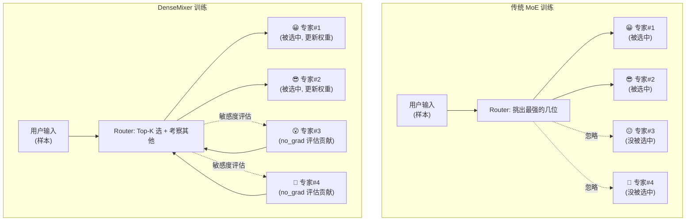

# DenseMixer: Better MoE Fine-Tuning

DenseMixer 是一种面向 MoE（Mixture-of-Experts）模型的训练增强插件。它在保持推理 Top-K 稀疏前向的同时，通过直通估计器（STE）和敏感度信号，让路由器从 **所有专家** 获得梯度反馈，从而减少梯度偏置、提升专家利用率与训练稳定性。   兼容全参微调、LoRA、QLoRA，零侵入集成，工程落地简单。

## **背景**

**传统 MoE 训练的问题**：

- Router 仅在 Top‑K 激活专家中回传梯度，未激活专家梯度恒为 0。 
- 导致 Router 学到的信息有偏，高方差更新，容量利用不足。
- 激活集变化时性能容易震荡。

**DenseMixer 的解决方案**：

- 前向依旧 Top‑K 激活，保证推理效率。

- 反向时：  

​		为未激活专家执行一次 no_grad 前向，估计它们对降低 loss 的潜在贡献（敏感度信号）。  

​		用直通估计器 STE，让路由梯度透明化，将这些敏感度信号反馈到 Router 更新。 

- 支持归一化与非归一化路由的稳定反向规则。

**##** **核心区别对比（漫画版）**

```


