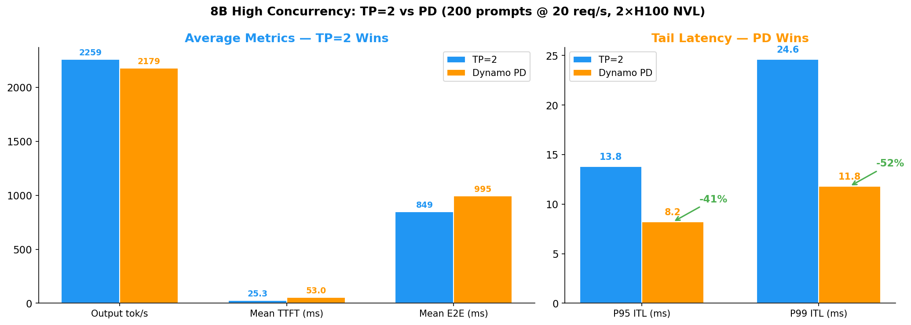
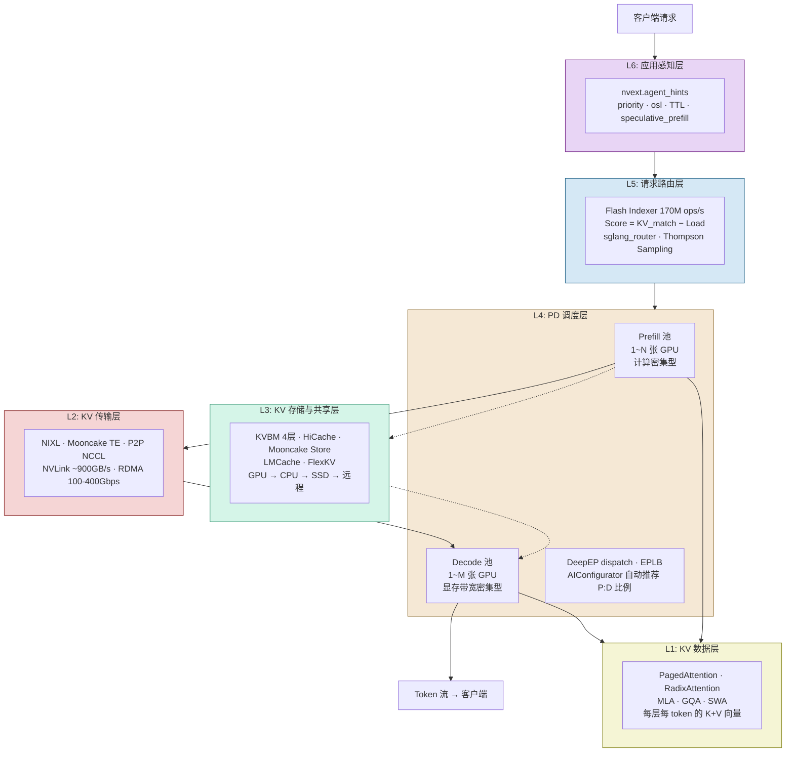
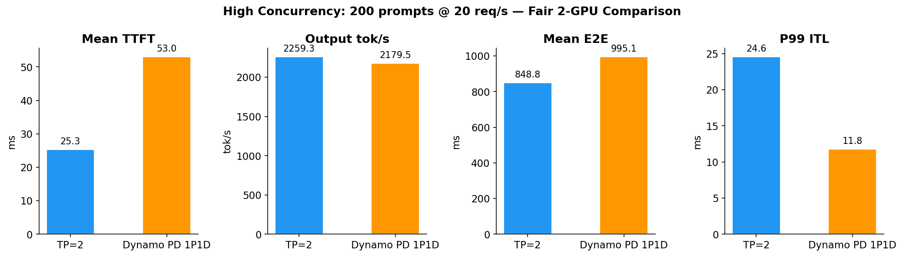
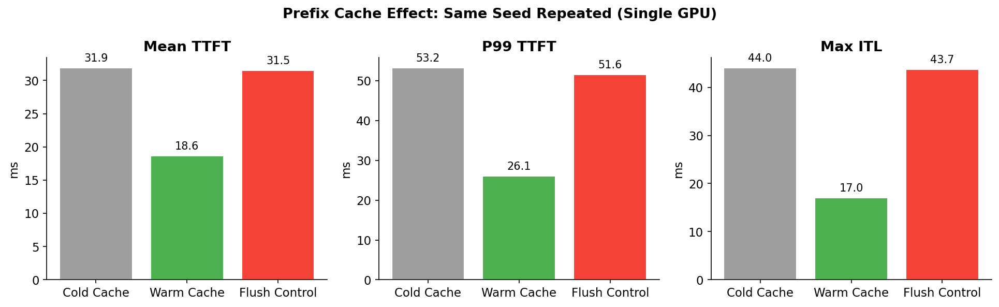
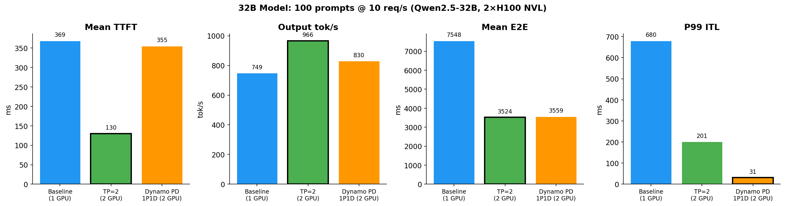
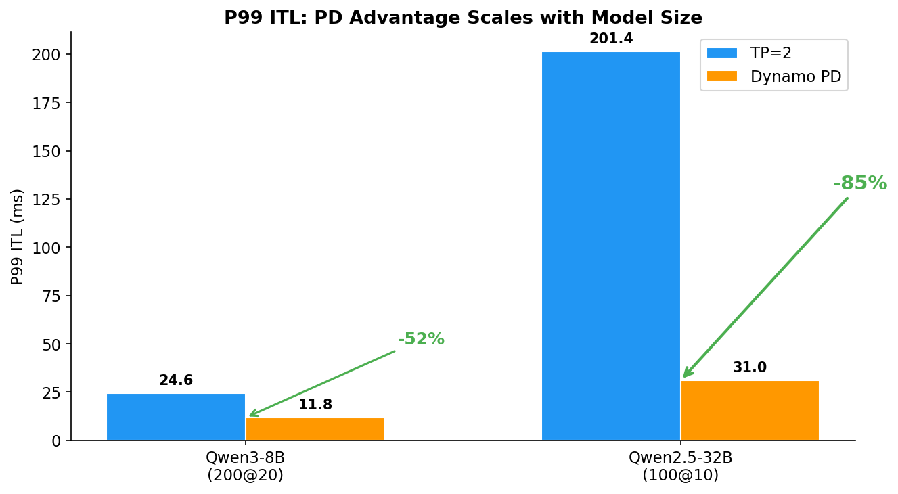

# LLM 推理分离架构：六层技术栈、生态全景与实测

> **作者**：魏新宇 (Xinyu Wei)  
> **日期**：2026-04-20（Benchmark）| 2026-05-03（架构分析）  
> **硬件**：Azure NC80adis_H100_v5（2× NVIDIA H100 NVL 95830 MiB，NV12 NVLink）  
> **技术栈**：SGLang 0.5.10.post1 + NVIDIA Dynamo 1.0.1 + NIXL 1.0.1 + NATS v2.11.3 + etcd v3.5.21

[English Version](README.md)

---

## 一句话结论

**第一部分 — 架构**：推理分离技术栈有 **6 层**（KV 数据 → KV 传输 → KV 存储 → PD 调度 → 请求路由 → 应用感知），**6 大实现**（Dynamo、SGLang、Mooncake、vLLM、DeepSeek、大厂自研）。它们不是竞争关系 — 生产部署是从不同层选组件拼装。

PD 分离的价值不止于尾部延迟：**(1)** P99 ITL 可预测、可承诺 SLO，**(2)** Prefill 和 Decode 池独立扩缩容（加 Decode GPU 不动 Prefill），**(3)** 可混用不同 GPU SKU（算力型做 Prefill，大显存型做 Decode）。

**第二部分 — 实测**：在 2×H100 NVL 上用 Qwen3-8B 和 Qwen2.5-32B 测试了 NVIDIA Dynamo PD 分离：
- **TP=2**：吞吐量和 TTFT 最优。同节点 NVLink 首选。
- **Prefix Cache**：ROI 最高 — 41% TTFT 下降，零配置。
- **PD 分离**：仅尾部延迟胜出 — P99 ITL **8B -52%**、**32B -85%**。优势随模型增大。
- **Chunked Prefill**：不可关闭 — 关闭后 TTFT 爆炸 4.7×。



---


---

## 为什么需要推理分离


Coding agent 正在大规模写生产代码：[Stripe 每周 1300+ PRs](https://stripe.dev/blog/minions-stripes-one-shot-end-to-end-coding-agents)、[Ramp 30% 合并 PRs 来自 agent](https://www.infoq.com/news/2026/01/ramp-coding-agent-platform/)、[Spotify 每月 650+ agent 生成的 PRs](https://engineering.atspotify.com/2025/11/spotifys-background-coding-agent-part-1)。这些工作流背后的推理栈承受着巨大的 KV cache 压力。

NVIDIA 分析了 Claude Code session，发现了 **Write-Once-Read-Many (WORM)** 访问模式：第一次 API 调用将对话前缀写入 KV cache 后，后续每次调用命中 **85-97% cache**。Agent 团队更进一步 — 4 个 Opus 队友的聚合 cache 命中率达 **97.2%**，读写比达 **11.7×**。

但并非所有 KV block 价值相同：

| Block 类型 | 复用模式 | 保留价值 |
|:---|:---|:---|
| System prompt + tool 定义 | 每轮复用 | **最高** |
| 对话历史 | 后续轮次，递增 | 高 |
| 思考/推理 token（`<think>`） | 循环关闭后不再复用（占输出 ~40%） | **接近零** |
| 子 Agent KV | 1-3 轮后 Agent 死亡 | **接近零** |

默认 LRU 驱逐对所有 block 一视同仁。2-30 秒的 tool call 等待可能导致 agent 的整个前缀被驱逐，恢复时必须全量重算。传统推理引擎解决了 kernel 调度 — **Dynamo 解决的是 agent 感知的缓存管理**。

*来源：[Full-Stack Optimizations for Agentic Inference with NVIDIA Dynamo](https://developer.nvidia.com/blog/full-stack-optimizations-for-agentic-inference-with-nvidia-dynamo/) — Figure 1、KV 复用表、Claude Code 分析。*

---

## 架构：六层技术栈


LLM 推理分离不是一项单一技术 — 而是 6 层技术栈，每层解决不同问题：

```
┌─────────────────────────────────────────────────────┐
│ L6: 应用感知层                                        │
│     Agent hints / priority / TTL / session lifecycle │
├─────────────────────────────────────────────────────┤
│ L5: 请求路由层                                        │
│     KV-aware routing / Flash Indexer / 负载均衡       │
├─────────────────────────────────────────────────────┤
│ L4: PD 调度层                                         │
│     哪个 GPU 做 Prefill、哪个做 Decode、怎么分配请求    │
├─────────────────────────────────────────────────────┤
│ L3: KV 存储与共享层                                    │
│     多层存储(GPU→CPU→SSD→远程) / 跨 worker 共享       │
├─────────────────────────────────────────────────────┤
│ L2: KV 传输层                                         │
│     GPU 间 KV 数据的物理搬运（RDMA/NVLink/TCP）        │
├─────────────────────────────────────────────────────┤
│ L1: KV 数据层                                         │
│     Transformer 每层每 token 的 Key+Value 向量        │
└─────────────────────────────────────────────────────┘
```

**一个请求如何流经全部 6 层：**



| 层 | 解决什么问题 | 关键技术 |
|:---|:---|:---|
| **L1: KV 数据** | KV Cache 是什么、多大、怎么算 | PagedAttention、RadixAttention、MLA、GQA、SWA |
| **L2: KV 传输** | Prefill GPU 的 KV 怎么搬到 Decode GPU | NIXL、Mooncake Transfer Engine、P2P NCCL |
| **L3: KV 存储** | KV 存哪里、多层级、跨 worker 共享 | KVBM（4层）、HiCache、Mooncake Store、LMCache、FlexKV |
| **L4: PD 调度** | 哪个 GPU 做 P、哪个做 D | `--disaggregation-mode`、Dynamo Frontend、DeepEP（MoE expert dispatch）、EPLB |
| **L5: 请求路由** | 新请求发给谁（考虑 KV 缓存+负载） | Flash Indexer（170M ops/s）、sglang_router、Thompson Sampling |
| **L6: 应用感知** | 推理系统理解 Agent 生命周期 | nvext.agent_hints、cache_control TTL、`<think>` 检测 |

### 六大实现及覆盖层级

这些实现**不是互斥竞争** — 它们在不同层运作，可以组合使用：

```
          L1    L2    L3    L4    L5    L6
          数据   传输   存储   调度   路由   应用
━━━━━━━━━━━━━━━━━━━━━━━━━━━━━━━━━━━━━━━━━━
Dynamo     ·    ██    ██    ██    ██    ██   ← L2-L6 全栈
SGLang     ·    ██    ██    ██    ██    ·    ← L2-L5
Mooncake   ·    ██    ██    ·     ·     ·    ← L2-L3（基础设施层）
vLLM       ·    ██    ██    ██    ·     ·    ← L2-L4（通过 Connector 插件）
DeepSeek   ·    ⚠️    ██    ██    ██    ·    ← L2-L5（L2 KV 传输未开源）
大厂自研    ·    ██    ██    ██    ██    ██   ← 各自闭环
━━━━━━━━━━━━━━━━━━━━━━━━━━━━━━━━━━━━━━━━━━
```

**生产部署 = 每层选一个组件拼装**：
- `PagedAttention + NIXL + KVBM + Dynamo Frontend + Flash Indexer + agent_hints`
- `RadixAttention + Mooncake TE + HiCache + SGLang disagg + sglang_router`
- `PagedAttention + NixlConnector + LMCache + vLLM disagg + llm-d`
- `MLA + 内部 KV 传输 + 内部存储 + PD+EPLB+TBO + 内部路由`

### L3 KV 存储不只是 PD 分离才需要

常见误解：KV 存储/共享（L3）只有 PD 分离才需要。实际上 L3 服务于 5 个独立场景：

| 场景 | 需要 PD？ | 需要 L3？ | 原因 |
|:---|:---:|:---:|:---|
| **Agent 工具调用**（等 2-30 秒） | ❌ | ✅ | KV 被 LRU 驱逐 → 卸载到 CPU/SSD → 回来时 prefetch |
| **多 Worker 共享前缀** | ❌ | ✅ | 4 个 worker 重算同一 system prompt → 共享存储算一次读 4 次 |
| **长上下文溢出** | ❌ | ✅ | 128K token 的 KV 超出 GPU 显存 → 冷 block 卸载 |
| **PD 分离** | ✅ | ✅ | Prefill 写 KV 到共享层 → Decode 读取 |
| **弹性扩缩容** | ❌ | ✅ | 新 worker 从共享存储加载已有 session 的 KV |

### KV Cache 在 GPU 上的分布

KV Cache 的位置取决于并行策略：

| 策略 | KV 位置 | PD 传输复杂度 |
|:---|:---|:---|
| **单卡** | 全在 1 张 GPU | 简单：1 对 1 |
| **TP=8** | 分布在 8 张 GPU（按 attention head 切分） | **8 对 8**：每张 Prefill GPU 传给对应 Decode GPU |
| **TP=8 + DP=2** | 16 张 GPU | **16 对 16** |
| **EP=16（MoE）** | 16 张 GPU，每卡不同 expert | 不规则：每层每 token KV 位置不同 |

对于采用 hybrid attention（SWA + Global Attention）的万亿参数 MoE 模型，PD 传输尤其复杂 — 不同层产生不同大小的 KV block。

### 生产环境的 P:D 比例 — 不是 1:1

常见问题：Prefill GPU 和 Decode GPU 各要多少？答案**不是 1:1** — 因为 Prefill 和 Decode 的计算特性完全不同：

```
Prefill: 一次性处理所有 input tokens → 计算密集 → 几十~几百 ms 完成
Decode:  每次只生成 1 个 token → 显存带宽密集 → 持续数秒到数十秒

时间线（1P:1D）：
Prefill GPU: ██░░░░░░░░░░░░░░░░░░  （忙 200ms，空闲 39.8s 等下一个请求）
Decode GPU:  ░░████████████████████ （持续忙 40s）
→ Prefill GPU 99% 空闲，浪费。
```

生产部署使用 **xP:yD 比例**，由 ISL/OSL 和 SLO 目标决定：

| 来源 | 模型 | P:D 比例（节点） | P:D 比例（GPU） | ISL | 说明 |
|:---|:---|:---|:---|:---|:---|
| **SGLang Blog（2025-05）** | DeepSeek-V3 | 4P : 9D 节点 | 32:72 GPU ≈ **1:2.25** | 2K | 12 节点 × 8 H100，开源复现 |
| **DeepSeek 官方** | DeepSeek-V3 | 未公开 | 18 decode 节点 | — | 官方 profile data 已公开 |
| **AIConfigurator** | 任意模型 | 自动推荐 | 按 ISL/OSL/SLO 变化 | 任意 | 秒级搜索数万种配置 |

**比例取决于 ISL/OSL**：
- 长输入短输出（摘要）→ Prefill 重 → 比例接近 **1:1 甚至 2:1**
- 短输入长输出（Agent/聊天）→ Decode 重 → 比例接近 **1:2 ~ 1:4**（估算范围；仅 1:2.25 经过实测验证）
- 正确做法：**用 AIConfigurator 自动推荐，不要手动猜**

**AIConfigurator**（[GitHub](https://github.com/ai-dynamo/aiconfigurator)，[Blog](https://developer.nvidia.com/blog/removing-the-guesswork-from-disaggregated-serving/)）自动推荐最优 P:D 比例：

```bash
aiconfigurator cli default \
  --model-path nvidia/Qwen3-32B-NVFP4 \
  --total-gpus 64 --system b200_sxm \
  --isl 15000 --osl 500 \
  --ttft 1000 --tpot 15 \
  --backend auto  # 同时对比 TRT-LLM、SGLang、vLLM
```

它把推理分解为各个操作，在目标 GPU 上分别测量，然后重组估算端到端性能 — 秒级搜索数万种配置，不占用 GPU。Mooncake 和阿里已贡献了 SGLang 和 vLLM 后端支持。

*来源：[Removing the Guesswork from Disaggregated Serving](https://developer.nvidia.com/blog/removing-the-guesswork-from-disaggregated-serving/) — NVIDIA Developer Blog, 2026-03*

---

---

## PD 分离工作原理（我们的实际部署）


上图展示了我们的实际部署。请求流程：

1. **Client → Frontend**：Dynamo 的 Rust Frontend（端口 8000）接收请求。KV 感知路由器查询 Flash Indexer 选择最优 worker。
2. **Prefill Worker (GPU 0)**：为输入 token 计算 KV cache（1024 tokens → 32B 约 369ms）。使用 `--disaggregation-mode prefill`，CUDA:0。
3. **NIXL KV 传输**：计算好的 KV cache 通过 NIXL 经 NVLink（~900 GB/s 双向）从 GPU 0 传输到 GPU 1。这增加了 TTFT 延迟，但实现了物理隔离。
4. **Decode Worker (GPU 1)**：从传输的 KV cache 生成输出 token（~26ms/token）。使用 `--disaggregation-mode decode`，CUDA:1。**这张 GPU 永远不执行 prefill kernel** — 所以 P99 ITL 保持 31ms，不受新请求负载影响。

**条件性分离（Conditional Disaggregation）**：VllmWorker 不会把所有请求都发给远程 PrefillWorker。`max_local_prefill_length` 参数控制阈值 — token 数 ≤ 阈值的请求在本地 prefill，超过阈值才派发到专用 PrefillWorker。这样可以避免短 prompt 承受不必要的 NIXL 传输开销。（来源：[GTC Tutorial S73042](https://www.nvidia.com/en-us/on-demand/) P38）

```yaml
# 官方 disagg 配置（来自 GTC Tutorial S73042）
VllmWorker:
  conditional-disagg: true              # 启用条件性路由
  max_local_prefill_length: 10          # ≤10 tokens: 本地 prefill; >10: 远程
  remote_prefill: true
  kv-transfer-config: '{"kv_connector":"DynamoNixlConnector"}'
```

| 组件 | 作用 | 为什么需要 | 我们的版本 |
|:---|:---|:---|:---|
| **Dynamo Frontend** | Rust HTTP 服务器。接收所有客户端请求，处理 `nvext.agent_hints`，通过 KV 感知路由器 + Flash Indexer 把请求分发到最优 worker。 | 没有它，客户端就得知道哪张 GPU 做 prefill、哪张做 decode。Frontend 抽象了这些—客户端只管发到 8000 端口。 | Dynamo 1.0.1 |
| **NATS** | 轻量级发布-订阅消息总线。各组件通过 NATS 宣告自己的状态（“我是 prefill worker，我已就绪”），Frontend 订阅这些消息来发现 worker。 | Worker 和 Frontend 需要动态发现彼此，NATS 提供实时服务发现，不需硬编码 IP。 | v2.11.3 (JetStream) |
| **etcd** | 分布式键值存储。存储 worker 元数据（哪些 worker 存在、它们的角色、端点）和 Dynamo 配置。Worker 启动时自动注册到 etcd。 | 路由器需要一个一致的、共享的 worker 注册表。etcd 在多节点场景提供这个能力。单节点可用 `--discovery-backend file` 替代。 | v3.5.21 |
| **NIXL** | 数据传输库。在 GPU 之间（或 GPU 和 CPU/存储之间）移动 KV cache block。底层用 UCX 自动选择最优传输（NVLink/IB RDMA/RoCE/TCP）。 | Prefill 在 GPU 0 算完 KV 后，KV 数据必须物理移动到 GPU 1 才能开始 decode。NIXL 以最小开销完成这个传输。 | nixl 1.0.1 |
| **SGLang Workers** | 实际的推理引擎。每个 worker 加载完整模型，通过 `--disaggregation-mode` 指定做 prefill 还是 decode。管理 KV cache、attention 计算和 token 生成。 | 做数学计算的“大脑”。Dynamo 负责编排，SGLang 负责实际 GPU 计算。 | SGLang 0.5.10 |

> **关于 KVBM**：Dynamo 的 KV Block Manager (KVBM) — 支持四层 KV 存储（GPU → CPU → NVMe → 远程）— 目前仅在 TensorRT-LLM 后端可用（`--kv-transfer-config kvbm`）。SGLang 后端在 PD 模式中使用 NIXL 进行 KV 传输。KVBM + SGLang 在 [Dynamo 特性矩阵](https://docs.nvidia.com/dynamo/resources/feature-matrix) 中标记为 🚧（开发中）。

### PD 分离的网络前提

NIXL（KV 传输库）使用 [UCX](https://github.com/openucx/ucx) 作为默认后端，**自动选择最优传输方式**：

| 部署场景 | KV 传输路径 | 网络要求 | 性能 |
|:---|:---|:---|:---|
| **同节点**（我们的场景） | NVLink via UCX CUDA IPC | 无需网络 | ~900 GB/s (NVL12) |
| **跨节点生产** | RDMA via UCX verbs | **InfiniBand 或 RoCE v2** | 100-400 Gbps，零拷贝 |
| **AWS 跨节点** | EFA via UCX | AWS Elastic Fabric Adapter | AWS 原生 RDMA |
| **TCP 回退** | TCP via UCX | 普通以太网 | 能跑但**不适合生产** — 非零拷贝，延迟高 |

> **⚠️ 重要说明：本 Repo 在单节点（2×H100 NVL）上验证 PD 分离，KV 传输走 NVLink — 不涉及网络。** 生产环境多节点 PD 部署**必须使用 RDMA 网络（InfiniBand、RoCE v2 或 AWS EFA）**，否则 KV 传输延迟会抵消 PD 的延迟优势。基于 TCP 的 KV 传输技术上可通过 UCX 实现，但额外的 GPU→CPU→TCP→CPU→GPU 拷贝开销会抵消 PD 的延迟收益。所有 NVIDIA Dynamo 多节点 recipe 均假定 RDMA 网络。
>
> *来源：[NIXL Blog](https://developer.nvidia.com/blog/enhancing-distributed-inference-performance-with-the-nvidia-inference-transfer-library/) — "supports AWS with EFA networking... Azure with RDMA networking"；[NIXL GitHub](https://github.com/ai-dynamo/nixl) — UCX 默认后端，`--with-verbs` (IB/RoCE)。*

### KV 传输栈：数据实际怎么搞

```
Dynamo PD 分离
  │ Prefill worker 算完 KV cache，需要发给 Decode worker
  ▼
NIXL (NVIDIA Inference Xfer Library — NVIDIA 推理传输库)
  │ 统一数据传输 API — 抽象了内存类型和传输方式
  │ 来源：https://github.com/ai-dynamo/nixl
  ▼
UCX (Unified Communication X — 统一通信框架)        [默认后端]
  │ 通信框架 — 自动选择硬件最优传输方式
  │ 来源：https://github.com/openucx/ucx
  ▼
```

**缩写词表**：

| 缩写 | 全称 | 是什么 |
|:---|:---|:---|
| **NIXL** | NVIDIA Inference Xfer (Transfer) Library | KV cache 在 GPU/存储之间的数据传输库 |
| **UCX** | Unified Communication X | 底层通信框架，自动选择最优传输方式 |
| **NVLink** | NVIDIA NVLink | 同节点内 GPU 间高带宽互联 |
| **IB** | InfiniBand | 跨节点高性能网络，支持 RDMA |
| **RDMA** | Remote Direct Memory Access（远程直接内存访问） | 零拷贝数据传输 — GPU 直接读写远程内存，不经 CPU |
| **RoCE** | RDMA over Converged Ethernet | 在无损以太网上跑 RDMA 协议 |
| **EFA** | Elastic Fabric Adapter | AWS 原生 RDMA 网络（EC2 实例用） |
| **KVBM** | KV Block Manager | Dynamo 的四层 KV 存储管理器（GPU→CPU→NVMe→远程） |
| **NATS** | （非缩写） | 轻量消息总线，Dynamo 服务发现用 ([nats.io](https://nats.io)) |
| **etcd** | （来自 "/etc distributed"，非缩写） | 分布式键值存储，worker 注册和配置用 |

---

---

## 什么时候用（和不用）PD 分离

> **⚠️ 诚实评估**：我们的 2×H100 NVL 环境是一个 **概念验证**，验证 PD 分离能端到端跑通。这不是生产代表性部署。在单节点 NVLink 环境下，TP 在每个平均指标上都严格优于 PD。PD 的真正价值在于多节点部署（16+ GPU 跨 2+ 台机器）+ RDMA 网络，prefill 和 decode 池可以独立扩缩容。

基于实测数据 + Dynamo 设计意图：

| 场景 | 用 PD？ | 原因 |
|:---|:---:|:---|
| 小模型（8B-13B）+ 单节点 NVLink | **不用** | TP 严格更好。Prefill 不是瓶颈。 |
| 中型模型（30B）+ 2 卡 NVLink | **不用** | PD 赢 P99 ITL 85%，但输吐量 14%。TP + Chunked Prefill 是更好的权衡。 |
| 单节点 8 卡（如 8×H100 NVLink） | **不用** | TP=8 已经最小化 prefill 时间。4P4D 浪费一半 GPU。Chunked Prefill 用零成本解决 80% 的 ITL 问题。 |
| 大模型（70B+）+ **多节点** + RDMA | **用** | Prefill 计算密集，跨节点 KV 通过 IB/RoCE 传输，独立池扩缩容降低成本。 |
| 严格 P99 ITL SLO（< 10ms）+ 多节点 | **用** | PD 防止集群中 prefill 抢占 decode。 |
| Agent 场景 + tool call（2-30 秒间隔） | **用** | PD + KV cache 钉住防止 tool call 间隔期驱逐。 |
| 成本敏感，追求最大吐量/美元 | **不用** | TP 以更简单架构给出相同或更好吐量。 |

**Prefill 时间规则**：如果单卡 prefill 你的典型输入长度 < 30ms（我们 8B 在 1024 token），PD 增加开销而无收益。在 ~370ms（我们 32B 在 1024 token）时，你处于交叉点 — 但仅限多节点场景（节点间没有 NVLink）。单节点有 NVLink 时，**始终优先 TP + Chunked Prefill** 而非 PD。

---

---

## 第三种方案：Chunked Prefill

PD 分离通过**物理隔离**（不同 GPU）解决 prefill-decode 互相干扰。但有更便宜的替代方案：**Chunked Prefill**，SGLang 默认开启。

### 问题

GPU 一次只能跑**一个 kernel**。kernel 启动后必须跑完，不能暂停、不能抢占。如果 32K token 的 prefill 作为一个 kernel 启动，耗时 ~2 秒。这 2 秒内所有其他请求的 decode 被阻塞。

### 解法

把 32K prefill 切成多个 chunk（如每 chunk 1024 tokens）。每个 chunk 是一次独立的 kernel launch。两次 kernel 之间，调度器可以插入其他请求：

```
不切碎：
  kernel: Attention(32K tokens) → 2000ms，其他请求干等

切碎（chunk=1024）：
  kernel 1: Attention(1024 tokens)                → 60ms
  kernel 2: Attention(1024 tokens + 新请求)        → 62ms
  kernel 3: Attention(1024 tokens + decode batch)  → 63ms
  ...（共 32 个 kernel，其他请求穿插执行）
```

原理和操作系统的时间片轮转一样：GPU 不能多任务，但把一个长任务切成多个短任务后，调度器在每个短任务之间都有决策机会。

### KV Cache 正确性

Chunked prefill 产生的 KV Cache 与完整 prefill **数学上完全等价**。每个 token 的 K 和 V 只取决于该 token 本身 + 前面所有 token + 模型权重。分几次算和一次算，结果一样。Chunk 2 从缓存中读取 chunk 1 已存好的 KV（PagedAttention 支持非连续读取），看到的上下文完全相同。

### Chunked Prefill vs PD 分离

| | Chunked Prefill | PD 分离 |
|:---|:---|:---|
| **原理** | 一个 GPU 上时间片切分 | 不同 GPU 物理隔离 |
| **ITL 稳定性** | 好（无长时间卡顿） | 最好（零干扰） |
| **额外硬件** | 不需要 | 需要额外 GPU + NATS/etcd/NIXL |
| **TTFT 影响** | 略升（被切碎） | 可能升（KV 传输 + 排队） |
| **配置难度** | 零（SGLang 默认开启） | 复杂部署 |

**Chunked Prefill 是"穷人的 PD"** — 用 0% 的成本解决 80% 的问题。我们的 benchmark 使用了 SGLang 默认的 chunked prefill（`--chunked-prefill-size 8192`），所以 TP=2 高并发的 P99 ITL（24.6ms）已经不算太差。如果关掉 chunked prefill，ITL 尖刺会严重得多，PD 的优势会更明显。

**实测数据（结果 5）**：在 32B 上，关闭 chunked prefill 导致 TTFT 从 369ms 爆炸到 1729ms（+4.7×），P95 ITL 从 258ms 改善到 155ms（-40%）。吐量下降 17%。净 E2E 基本持平 — 确认 chunked prefill 用略差的 ITL 换取显著更好的 TTFT 和吐量。详见[结果 5](#结果-5优化消融实验--fp8-kv-cache-和-chunked-prefill)。
---


---

## 测试环境

| 项目 | 值 |
|:---|:---|
| **VM** | Azure NC80adis_H100_v5，2× NVIDIA H100 NVL 95830 MiB |
| **互联** | NV12 NVLink（节点内，~900 GB/s 双向） |
| **模型** | Qwen3-8B FP16 (16GB) — 结果 1-3；Qwen2.5-32B-Instruct FP16 (65GB，占 H100 VRAM 89%) — 结果 4-5 |
| **引擎** | SGLang 0.5.10.post1，FlashInfer 0.6.7.post3，PyTorch 2.9.1+cu128 |
| **Dynamo** | ai-dynamo 1.0.1，nixl 1.0.1，NATS v2.11.3，etcd v3.5.21 |
| **Benchmark** | `sglang.bench_serving`，random 数据集，1024 输入 / 256 输出 tokens |
| **8B 负载** | 50 prompts @ 5 req/s（低并发），200 @ 20（高并发） |
| **32B 负载** | 100 prompts @ 10 req/s |
| **测试配置** | 单卡、TP=2、Prefix Cache（cold/warm/flush）、Dynamo PD 1P1D、FP8 KV、Chunked 开/关 |

---

## 结果 1：低并发（50 prompts @ 5 req/s）


| 指标 | 单卡 | TP=2 | Dynamo PD 1P1D |
|:---|:---:|:---:|:---:|
| **Output tok/s** | 541 | **559** | 540 |
| **Mean TTFT** | 43.4 ms | **32.5 ms** | 49.6 ms |
| **Mean E2E** | 871 ms | **576 ms** | 828 ms |
| **P99 ITL** | 35.3 ms | 13.2 ms | **12.5 ms** |

**分析**：
- **TP=2 全面碾压** — 通过 NVLink 将模型切分到 2 张 GPU，每层计算量减半。TTFT 下降 25%，E2E 下降 34%。
- **PD 的 TTFT 甚至比单卡差**（+14%）— 因为 GPU 0 完成 prefill 后，KV cache 必须通过 NIXL 传输到 GPU 1 才能开始 decode，每个请求额外增加 ~6ms 开销。
- **PD 唯一赢的：P99 ITL**（12.5 ms vs 13.2 ms）— decode worker 永不被新请求的 prefill 打断。

**TP=2 为什么赢**：Qwen3-8B 16GB 远低于单卡 H100 的 95GB 容量。模型是计算密集型而非显存密集型。TP=2 直接减半每卡计算量。PD 按角色分（prefill vs decode），但当单卡 prefill 只要 ~30ms 时，用整张卡做 prefill 是浪费。

---

## 结果 2：高并发 — 公平 2 卡对比（200 prompts @ 20 req/s）

公平对比：两种配置都用恰好 2 张 GPU。



| 指标 | TP=2 | Dynamo PD 1P1D | PD vs TP=2 |
|:---|:---:|:---:|:---|
| **Output tok/s** | **2259** | 2179 | -3.5% |
| **Mean TTFT** | **25.3 ms** | 53.0 ms | +109% |
| **Mean E2E** | **849 ms** | 995 ms | +17% |
| **P99 ITL** | 24.6 ms | **11.8 ms** | **-52%** |
| **P95 ITL** | 13.8 ms | **8.2 ms** | **-40%** |

> **公平性说明**：TP=2 使用 `--backend sglang`（原生 `/generate` API），Dynamo PD 使用 `--backend sglang-oai-chat`（`/v1/chat/completions`）。这是结构性限制——Dynamo frontend 只暴露 OpenAI 兼容端点。chat API 的 JSON 解析、chat template、streaming 开销无法与 PD 架构开销分离。

**核心发现**：即使在 4 倍负载下，格局不变——**TP=2 赢平均值，PD 赢尾部延迟**。P99 ITL 差距扩大到 -52%，确认了 PD 的价值主张：decode worker 永不被 prefill 抢占。

---

## 结果 3：Prefix Cache — ROI 最高的优化

不需要额外 GPU，不需要 Dynamo，不需要任何基础设施。只需重复相同的 prompt。



| 指标 | Cold Cache | Warm Cache | Flush 对照 | Cache 收益 |
|:---|:---:|:---:|:---:|:---|
| **Mean TTFT** | 31.9 ms | **18.7 ms** | 31.5 ms | **-41%** |
| **P99 TTFT** | 53.2 ms | **26.1 ms** | 51.6 ms | **-51%** |
| **Max ITL** | 44.0 ms | **17.0 ms** | 43.7 ms | **-61%** |

Flush 对照组（R3）和 Cold（R1）完全一致——证明 Warm cache 的收益来自真实的 cache 命中。SGLang 的 RadixAttention prefix cache 默认开启。

**Agent 场景意义**：多轮对话中，system prompt + 对话历史每轮都重复。Prefix cache 跳过重计算它们的 KV，免费获得 41% TTFT 下降。

---

## 结果 4：32B 模型 — 模型尺寸会改变结论吗？

以上结果均基于 Qwen3-8B（16GB）。一个自然的问题：PD 在更大的模型上会不会更有价值？我们测试了 **Qwen2.5-32B-Instruct**（65GB FP16）— 占满单张 H100 NVL 95GB VRAM 的 89%。

**测试参数**：100 prompts @ 10 req/s，1024 输入 / 256 输出 tokens（与 8B 相同的 token 长度；由于 32B 每 token 慢 ~4×，降低了请求率）。



| 指标 | Baseline (1 GPU) | TP=2 (2 GPU) | PD 1P1D (2 GPU) | PD vs TP=2 |
|:---|:---:|:---:|:---:|:---|
| **Output tok/s** | 749 | **966** | 830 | -14% |
| **Mean TTFT** | 369 ms | **130 ms** | 355 ms | +173% |
| **Mean E2E** | 7548 ms | **3524 ms** | 3559 ms | +1% |
| **P95 ITL** | 258 ms | 82 ms | **29 ms** | **-65%** |
| **P99 ITL** | 680 ms | 201 ms | **31 ms** | **-85%** |

> **公平性说明**：TP=2 使用 `--backend sglang`（原生 `/generate`），PD 使用 `--backend sglang-oai-chat`（`/v1/chat/completions`）。这是结构性限制 — Dynamo frontend 只暴露 OpenAI 兼容端点。chat API 开销约 5-20ms，远小于 225ms TTFT 差距，不改变任何结论方向。

**TP=2 仍然赢吐量和 TTFT** — 与 8B 相同的模式。两张 GPU 各跑一半模型，prefill 从 ~369ms 降到 ~65ms。

**PD 的 ITL 优势随模型增大而扩大** — 这是核心发现：

| 模型 | P99 ITL (TP=2) | P99 ITL (PD) | PD 优势 | 负载 |
|:---|:---:|:---:|:---|:---|
| Qwen3-8B | 24.6 ms | 11.8 ms | -52% | 200 @ 20 req/s |
| Qwen2.5-32B | 201 ms | 31 ms | **-85%** | 100 @ 10 req/s |



为什么？TP=2 两张 GPU 同时处理 prefill 和 decode。模型增大 4×，每个 chunked-prefill kernel 运行时间也增大 ~4×，decode 在 chunk 间的停顿更长。PD 的 decode 卡零 prefill 干扰，无论模型多大 P99 ITL 都保持在 10-30ms。

**E2E 基本持平**（3524 vs 3559 ms，+1%）。PD 的 TTFT 劣势（NIXL KV 传输开销）被其 decode 一致性优势抵消。~250 个 decode 步骤 × ~26ms/token 主导总延迟。

**32B 模型处于 PD 交叉点**：单卡 TTFT = 369ms 说明 prefill 真正计算密集（vs 8B 的 43ms）。70B+ 模型需 4+ GPU，prefill 更重，PD 价值进一步增强。

---

## 结果 5：优化消融实验 — FP8 KV Cache 和 Chunked Prefill

两个常见推理优化，在 Qwen2.5-32B 单卡基线上独立测试（100 prompts @ 10 req/s，1024/256 tokens）。

### FP8 KV Cache

| 指标 | BF16 KV（默认） | FP8 KV | Δ |
|:---|:---:|:---:|:---|
| **Output tok/s** | 749 | 741 | -1% |
| **Mean TTFT** | 369 ms | 393 ms | +6% |
| **Mean E2E** | 7548 ms | 7717 ms | +2% |
| **P99 ITL** | 680 ms | 594 ms | -13% |

FP8 KV cache（`--kv-cache-dtype fp8_e5m2`）将 KV 存储从 16-bit 压缩到 8-bit，KV 内存占用减半。但不改变 attention kernel 的计算精度 — 运算仍然是 BF16/FP16。

**结果**：在 1024 token 上下文下无可测量的性能收益。内存节省仅在 KV cache 成为瓶颈时才重要 — 通常是超长上下文（8K+）或高并发 KV 占满显存时。

**FP8 KV 何时有意义**：长上下文（8K-128K 输入）、显存紧张的 GPU、或 70B+ 模型每 GB VRAM 都很珍贵的场景。

### Chunked Prefill 开 vs 关

| 指标 | Chunked 开（默认） | Chunked 关 | Δ |
|:---|:---:|:---:|:---|
| **Output tok/s** | 749 | 618 | **-17%** |
| **Mean TTFT** | 369 ms | 1729 ms | **+369% (4.7×)** |
| **Mean E2E** | 7548 ms | 7332 ms | -3% |
| **P95 ITL** | 258 ms | 155 ms | **-40%** |
| **P99 ITL** | 680 ms | 341 ms | **-50%** |


经典的 **TTFT vs ITL 权衡**：

- **关闭 chunked prefill**（`--chunked-prefill-size -1`）：每个 1024-token prefill 作为单个不可中断的 kernel 执行（~369ms）。执行期间所有 decode batch 被阻塞。后续 prefill 请求也排队。结果：TTFT 爆炸到 1729ms。但 decode 阶段不受干扰 — P95 ITL 降至 155ms。

- **开启 chunked prefill**（默认，`--chunked-prefill-size 8192`）：prefill 被切成 chunk，调度器在 chunk 间穿插 decode batch。TTFT 保持低位。但 decode token 偶尔等待 prefill chunk — P95 ITL 升至 258ms。

**吐量**：chunked 开比关快 21%（749 vs 618 tok/s），因为调度器能在 chunk 间隙塞入 decode 工作。

**E2E 基本持平** — TTFT 改善和 ITL 恶化相互抵消。

---

---

## 部署方式

Dynamo 支持三种部署方式（[来源](https://github.com/ai-dynamo/dynamo#quick-start)）：

| 方式 | 适用场景 | 跨节点 PD？ | 我们的经验 |
|:---|:---|:---:|:---|
| **PyPI** (`pip install ai-dynamo`) | 开发/测试、单节点、快速迭代 | 否（仅单节点） | ✅ 已测 — 需要 SGLang 兼容 patch、手动装 NATS/etcd |
| **Docker** (`nvcr.io/nvidia/ai-dynamo/sglang-runtime`) | 单节点、干净环境、无依赖问题 | 否（仅单节点） | ✅ 已测 — 一切预配置，无需兼容 patch |
| **Kubernetes** (DynamoGraphDeployment CRD + Grove) | **生产多节点**、自动扩缩容、故障恢复 | **是** — 需 RDMA 网络 | ❌ 未测 — 需要 K8s 集群 + GPU operator |

> 生产多节点 PD 分离推荐使用 **Kubernetes**。K8s 处理 worker 调度、拓扑感知放置（Grove）、自动扩缩容（Planner）和故障恢复。见 [Dynamo K8s 部署指南](https://github.com/ai-dynamo/dynamo/blob/main/docs/kubernetes/README.md) 和 [生产 recipe](https://github.com/ai-dynamo/dynamo/tree/main/recipes)。

### K8s PD 分离：如何工作

Dynamo 使用 `DynamoGraphDeployment` CRD（自定义资源定义）在 K8s 上定义 PD 分离。YAML 定义三个 service — Frontend、Prefill Worker、Decode Worker — 各自独立的 replicas 和 GPU 资源。

现成 SGLang disagg recipe：[`nemotron-3-super-fp8/sglang/disagg/deploy.yaml`](https://github.com/ai-dynamo/dynamo/tree/main/recipes/nemotron-3-super-fp8/sglang/disagg) — YAML 结构与模型无关（改 `--model-path` 即可用任何模型）。

**简化结构**（来自上述 recipe，加了注释）：

```yaml
apiVersion: nvidia.com/v1alpha1
kind: DynamoGraphDeployment
metadata:
  name: my-model-sglang-disagg
spec:
  backendFramework: sglang
  services:
    Frontend:
      componentType: frontend
      replicas: 1
      # KV 感知路由选择最优 worker
      args: python3 -m dynamo.frontend --router-mode kv --http-port 8000
      image: nvcr.io/nvidia/ai-dynamo/sglang-runtime:1.0.0

    prefill:
      componentType: worker
      subComponentType: prefill     # <-- 声明这是 prefill worker
      replicas: 1                   # 可独立于 decode 扩缩
      resources:
        limits: { gpu: "2" }       # 每个 prefill worker TP=2
      args:
        - --model-path <your-model>
        - --tp 2
        - --disaggregation-mode prefill
        - --disaggregation-transfer-backend nixl    # KV 通过 NIXL 传输
        - --disaggregation-bootstrap-port 12345     # 跨节点 worker 发现

    decode:
      componentType: worker
      subComponentType: decode      # <-- 声明这是 decode worker
      replicas: 1
      resources:
        limits: { gpu: "2" }       # 每个 decode worker TP=2
      args:
        - --model-path <your-model>
        - --tp 2
        - --disaggregation-mode decode
        - --disaggregation-transfer-backend nixl
        - --disaggregation-bootstrap-port 12345
```

**K8s 部署步骤**（来源：[recipes README](https://github.com/ai-dynamo/dynamo/tree/main/recipes#quick-start)）：

```bash
# 1. 安装 Dynamo K8s Platform (~10 min)
# 见：https://github.com/ai-dynamo/dynamo/blob/main/docs/kubernetes/README.md

# 2. 下载模型
kubectl apply -f <model>/model-cache/ -n $NAMESPACE
kubectl wait --for=condition=Complete job/model-download -n $NAMESPACE --timeout=6000s

# 3. 部署 PD 分离
kubectl apply -f <model>/sglang/disagg/deploy.yaml -n $NAMESPACE

# 4. 测试
kubectl port-forward svc/<name>-frontend 8000:8000 -n $NAMESPACE
curl http://localhost:8000/v1/chat/completions -d '{"model": "<name>", "messages": [{"role": "user", "content": "Hello!"}]}'
```

> **⚠️ 我们未测试 K8s 部署。** 上述 YAML 和步骤来自 Dynamo 官方 recipe（[来源](https://github.com/ai-dynamo/dynamo/tree/main/recipes/nemotron-3-super-fp8/sglang/disagg)）。我们的单节点 PyPI/Docker 部署使用了相同的 `--disaggregation-mode` 和 `--disaggregation-transfer-backend nixl` 参数。

### 单容器 vs 生产 K8s：架构对比

我们的 PoC 把**所有组件跑在一个 Docker 容器里** — 这是测试简化，不是生产部署方式：

```
我们的 PoC（单容器）:                   生产 K8s（多 Pod）:
│  KV 传输: NVLink (同机 GPU)    │             RDMA / InfiniBand / RoCE
```

| 方面 | 我们的 PoC（单容器） | 生产 K8s（多 Pod） |
|:---|:---|:---|
| **组件** | 5 个进程在 1 个容器 | 每个 service = 独立 Pod |
| **GPU 隔离** | `CUDA_VISIBLE_DEVICES=0/1` | K8s GPU 资源限制 per Pod |
| **KV 传输** | NVLink（同机，~900 GB/s） | RDMA via IB/RoCE（跨节点） |
| **扩缩容** | 固定 1 prefill + 1 decode | 独立 replica 扩缩 |
| **容错** | 容器死 = 全部死 | Pod 重启 + 请求迁移 |
| **服务发现** | 容器内 etcd + NATS | K8s 原生或共享 etcd 集群 |

---

## 官方部署路径：dynamo CLI

官方 Dynamo 部署使用 CLI 驱动的工作流 + Python graph 定义（来源：[GTC Tutorial S73042](https://www.nvidia.com/en-us/on-demand/) P25-P29）：

```bash
# Step 1: 安装
uv pip install ai-dynamo[all]

# Step 2: 快速测试（单命令启动推理）
dynamo run out=vllm deepseek-ai/DeepSeek-R1-Distill-Llama-8B

# Step 3: 服务化（从 Python 图定义构建服务）
dynamo serve graphs.disagg:Frontend -f configs/disagg.yaml

# Step 4: 容器化（EA）
dynamo build --containerize hello_world:Frontend

# Step 5: 部署到 K8s（Coming Soon）
dynamo deploy
```

**Graph 定义**（来源：GTC Tutorial S73042 P35）：
```python
# graphs/disagg.py — 定义 PD 分离拓扑
Frontend.link(Processor).link(VllmWorker).link(PrefillWorker)
```

进程管理由 `circusd` 处理（`dynamo serve` 自动启动）。关闭：`kill_tree $(pgrep circusd)`。

> **注意**：我们的 benchmark 使用底层组件启动（`python3 -m dynamo.*`），因为 `dynamo serve` + SGLang 后端在 ai-dynamo 1.0.1 上有兼容性问题。生产环境推荐使用官方 `dynamo serve` graph 方式。

---

## 从 PyPI 部署 Dynamo PD（非 Docker）

我们不用 Docker，纯 pip 包部署了 Dynamo。需要解决三个兼容性问题。

### 基础设施

```bash
# NATS（Dynamo 服务发现的消息总线）
wget -qO nats.tar.gz https://github.com/nats-io/nats-server/releases/download/v2.11.3/nats-server-v2.11.3-linux-amd64.tar.gz
tar xzf nats.tar.gz && cp nats-server-v2.11.3-linux-amd64/nats-server /usr/local/bin/
nats-server -js &

# etcd（分布式配置存储）
wget -qO etcd.tar.gz https://github.com/etcd-io/etcd/releases/download/v3.5.21/etcd-v3.5.21-linux-amd64.tar.gz
tar xzf etcd.tar.gz && cp etcd-v3.5.21-linux-amd64/etcd /usr/local/bin/
etcd &
```

### Dynamo + SGLang 兼容性 Patch

`ai-dynamo==1.0.1` 从 `sglang.srt.utils` 导入 `get_local_ip_auto`、`get_zmq_socket`、`maybe_wrap_ipv6_address`。但 SGLang 0.5.10 将前两者移到了 `sglang.srt.utils.network` 未 re-export，`maybe_wrap_ipv6_address` 则完全不存在。

**修复**：Patch `sglang/srt/utils/__init__.py`：
```python
# 追加到 sglang/srt/utils/__init__.py 末尾
from sglang.srt.utils.network import get_local_ip_auto, get_zmq_socket
def maybe_wrap_ipv6_address(addr):
    return f"[{addr}]" if ":" in addr and not addr.startswith("[") else addr
```

### 启动 PD 分离

```bash
# Frontend（Rust HTTP server + KV 感知路由）
python3 -m dynamo.frontend --router-mode kv --router-reset-states &

# Prefill worker — GPU 0
CUDA_VISIBLE_DEVICES=0 DYN_SYSTEM_PORT=8081 python3 -m dynamo.sglang \
  --model-path /path/to/model --served-model-name Qwen3-8B \
  --page-size 64 --tp 1 --disaggregation-mode prefill --host 0.0.0.0 \
  --kv-events-config '{"publisher":"zmq","topic":"kv-events","endpoint":"tcp://*:5557"}' \
  --disaggregation-transfer-backend nixl &

# Decode worker — GPU 1
CUDA_VISIBLE_DEVICES=1 DYN_SYSTEM_PORT=8083 python3 -m dynamo.sglang \
  --model-path /path/to/model --served-model-name Qwen3-8B \
  --page-size 64 --tp 1 --disaggregation-mode decode --host 0.0.0.0 \
  --kv-events-config '{"publisher":"zmq","topic":"kv-events","endpoint":"tcp://*:5560"}' \
  --disaggregation-transfer-backend nixl &
```

Dynamo 响应中包含 `nvext.worker_id`，分别标明 `prefill_worker_id` 和 `decode_worker_id`——证明这是真正的 PD 分离，不是简单负载均衡。

### 已知问题

| 问题 | 解决方案 |
|:---|:---|
| Dynamo GitHub `main` 需要 `ai-dynamo-runtime==1.1.0`（未发布） | 用 PyPI：`pip install ai-dynamo==1.0.1` |
| SGLang 0.5.10 API 与 Dynamo 1.0.1 不兼容 | Patch `__init__.py`（见上文） |
| `nixl` 不随 `ai-dynamo` 自动安装 | `pip install nixl` 单独安装 |
| Dynamo frontend 只暴露 OpenAI API | benchmark 必须用 `sglang-oai-chat` 后端 |

---

## Docker 部署 Dynamo PD（推荐）

Docker 路径显著更简单 — 无需兼容性 patch、无需手动安装 NATS/etcd，一切预配置。

```bash
# 拉取预构建容器（55.7 GB）
docker pull nvcr.io/nvidia/ai-dynamo/sglang-runtime:1.0.1

# 启动容器（GPU 访问 + 模型挂载）
docker run -d --name dynamo --runtime=nvidia --network host --ipc=host \
  -v /path/to/models:/models \
  nvcr.io/nvidia/ai-dynamo/sglang-runtime:1.0.1 sleep infinity

# 单卡推理（无 Dynamo 编排）
docker exec -d dynamo python3 -m sglang.launch_server \
  --model-path /models/Qwen2.5-32B-Instruct --port 8000 --host 0.0.0.0

# PD 分离（需要 NATS + etcd + frontend + 2 个 worker）
docker exec -d dynamo bash -c "nats-server -js & etcd &"
docker exec -d dynamo python3 -m dynamo.frontend --router-mode kv --router-reset-states --http-port 8000
docker exec -d -e CUDA_VISIBLE_DEVICES=0 -e DYN_SYSTEM_PORT=8081 dynamo python3 -m dynamo.sglang \
  --model-path /models/Qwen2.5-32B-Instruct --served-model-name QWEN32B \
  --page-size 64 --tp 1 --disaggregation-mode prefill --host 0.0.0.0 \
  --kv-events-config '{"publisher":"zmq","topic":"kv-events","endpoint":"tcp://*:5557"}' \
  --disaggregation-transfer-backend nixl
docker exec -d -e CUDA_VISIBLE_DEVICES=1 -e DYN_SYSTEM_PORT=8083 dynamo python3 -m dynamo.sglang \
  --model-path /models/Qwen2.5-32B-Instruct --served-model-name QWEN32B \
  --page-size 64 --tp 1 --disaggregation-mode decode --host 0.0.0.0 \
  --kv-events-config '{"publisher":"zmq","topic":"kv-events","endpoint":"tcp://*:5560"}' \
  --disaggregation-transfer-backend nixl
```

**Docker vs PyPI 性能一致性验证**：

| 指标 | Docker Baseline (1 GPU) | PyPI Baseline (C1) | Docker PD (2 GPU) | PyPI PD (C6) |
|:---|:---:|:---:|:---:|:---:|
| **Output tok/s** | 750 | 749 | 820 | 830 |
| **Mean TTFT** | 326 ms | 369 ms | 506 ms | 355 ms |
| **Mean E2E** | 7545 ms | 7548 ms | 3774 ms | 3559 ms |
| **P95 ITL** | 259 ms | 258 ms | **30 ms** | 29 ms |
| **P99 ITL** | 391 ms | 680 ms | **47 ms** | 31 ms |

吞吐和 ITL 在测量噪声范围内。Docker 路径消除了所有 PyPI 兼容性问题（SGLang API patch、NIXL 手动安装、NATS/etcd 二进制文件），同时提供相同性能。

> **注意**：Docker 使用 `--runtime=nvidia`（不是 `--gpus all`），需要 `--ipc=host` 以支持 PyTorch 共享内存。容器包含 SGLang、Dynamo、NATS、etcd、NIXL 及所有依赖。

---

## 复现步骤

```bash
# 1. 搭建环境（安装 SGLang + Dynamo + NATS + etcd + 下载两个模型）
bash scripts/setup.sh

# 2. 跑 8B benchmark（结果 1-3：单卡、TP=2、Prefix Cache、PD、高并发）
bash scripts/run_8b.sh

# 3. 跑 32B benchmark（结果 4-5：baseline、FP8 KV、Chunked 消融、TP=2、PD）
bash scripts/run_32b.sh
```

Docker 部署命令见上方 [Docker 部署章节](#docker-部署-dynamo-pd推荐)。

原始 benchmark 日志在 `data/` 目录。

---

## 从 Benchmark 到生产
### NVIDIA 官方 Benchmark 与我们实测的对比

[GTC Tutorial S73042](https://www.nvidia.com/en-us/on-demand/)（演讲者：Neelay Shah, Harry Kim, Tanmay Verma, Ryan Olson）提供了 NVIDIA 官方 benchmark 数据。与我们的独立实测对比：

| 来源 | 功能 | 模型 | 硬件 | ISL/OSL | 结果 |
|:---|:---|:---|:---|:---|:---|
| **NVIDIA** | PD 分离 | Llama 70B FP8 | 1× HGX H100 | 3K/150 | **1.3×** 吞吐量 |
| **NVIDIA** | PD 分离 | Llama 70B FP8 | 2× HGX H100 | 3K/150 | **2×** 吞吐量 |
| **我们** | PD 分离 | Qwen3-8B FP16 | 2× H100 NVL | 1K/256 | -0.3% 吞吐量, **-52% P99 ITL** |
| **我们** | PD 分离 | Qwen2.5-32B FP16 | 2× H100 NVL | 1K/256 | -14% 吞吐量, **-85% P99 ITL** |
| **NVIDIA** | KV 路由 | R1 Distilled 70B | 2×8 H100s, 100K req | — | **3× TTFT**, **2× E2E** |
| **我们** | Prefix Cache | Qwen3-8B | 1× H100 | 1K/256 | **-41% TTFT** |
| **NVIDIA** | 内存管理 | 8B, 80 用户 | 1× H100 | 1K/100 | **1.6× TTFT** |
| **NVIDIA** | NIXL | 8B, 1P:1D | 2×8 H100s | — | **1.8× TTFT**, **1.15× 吞吐量** |

**对账**：NVIDIA 的 1.3-2× 吞吐量提升来自 70B 模型在专用 HGX 节点上、ISL:OSL=20:1（3000/150）— prefill 密集型工作负载，正是 PD 的最佳场景。我们的 8B/32B 模型 ISL:OSL=4:1（1024/256）prefill 占比更低，所以吞吐量增益微小。但我们的 ITL 稳定性发现（-52% 到 -85% P99 ITL）是补充性的 — NVIDIA 关注吞吐量，我们度量了 decode 稳定性。两者结合在大小规模上都验证了架构。

### 生产特性映射
我们的 benchmark 在 2 张 GPU 上测试 Dynamo 的 PD 分离 — 这是最小可能的部署。在生产中，Dynamo 的软件栈解决的是只在规模化时才出现的问题：

| 实测结果 | 物理原因 | Dynamo 生产特性 |
|:---|:---|:---|
| PD P99 ITL **-85%** (32B) | Decode 卡零 prefill 干扰 | Layer 3: NIXL KV transfer 实现物理隔离 |
| Prefix Cache **-41%** TTFT | RadixAttention 前缀命中 | Layer 2: KV 感知路由确保多轮请求命中同一 worker |
| Chunked 关 → TTFT **+4.7×** | Prefill kernel 不可抢占 | SGLang 调度；Layer 1 `priority` hint 在此基础上加请求级排序 |
| FP8 KV @1024 无效 | KV 不是显存瓶颈 | Layer 3: 四层存储在 8K+ 上下文或显存紧张 GPU 才关键 |
| PD ITL 优势随模型增大 (-52% → -85%) | Prefill kernel 更重 | PD + 多节点是 70B+ 模型的设计目标 |

使用 Dynamo + [NeMo Agent Toolkit](https://github.com/NVIDIA/NeMo-Agent-Toolkit) 在 Hopper 上跑 Llama 3.1，实现了 **4× TTFT 降低 + 1.5× 吐量提升**，其 Thompson Sampling bandit 路由器配合优先级标记在显存压力下实现 **63% p50 TTFT 降低**。*（NVIDIA 报告数据，我们未独立验证。来源：[Dynamo 1.0 Blog](https://developer.nvidia.com/blog/nvidia-dynamo-1-production-ready/)，[NeMo Agent Toolkit 集成](https://github.com/NVIDIA/NeMo-Agent-Toolkit/tree/develop/examples/dynamo_integration)。）*

---

## 结论

1. **PD 分离不是万能的** — 它用平均性能换尾部延迟稳定性。小模型 + NVLink 场景下，TP 在每个平均指标上严格优于 PD。

2. **PD 的价值随模型增大而增强**。8B 时 PD 改善 P99 ITL 52%，32B 时跳到 85%。物理原因：更大模型让 prefill kernel 更重，TP 上 decode 停顿更严重 — PD 的专用 decode 卡免疫模型尺寸。

3. **Prefix Cache 是 Agent/多轮场景下 ROI 最高的优化**：41% TTFT 下降，零配置，零额外硬件。

4. **Chunked Prefill 不可关闭**：32B 上关闭导致 4.7× TTFT 回退。ITL 改善（40%）不值得吐量损失（17%）和 TTFT 爆炸。保持开启。

5. **FP8 KV Cache 取决于上下文长度**：1024 token 无收益，但对长上下文（8K+）或显存紧张场景重要。

6. **Dynamo 的价值在大规模生产**，不在小模型 benchmark。它的真正优势 — 跨数十个 worker 的 KV 感知路由、Agent 生命周期管理、四层 KV 存储 — 无法在 2 张 GPU 上展现。

7. **工程挑战是真实的**：从 PyPI 部署 Dynamo 需要 NATS + etcd + NIXL + SGLang 兼容 patch。Docker 路径（`nvcr.io/nvidia/dynamo`）在生产中显著更容易。

8. **Dynamo 的价值在软件栈，不仅仅是 PD 分离**。Agent hints、KV 感知路由、选择性缓存保留、四层 KV 存储是生产 agent workload 中 Dynamo 相比 vanilla SGLang 的核心优势。

9. **对于生产 agent workload**（多轮对话 + tool call），这些特性值得部署复杂性。对于单次批量推理，vanilla SGLang 或 vLLM 更简单且同样高效。
