# Distributed Training Parallelism: DP, TP, PP, ZeRO & NCCL Internals

> **A comprehensive guide to distributed parallelism strategies for Large Language Model training and inference, covering theory, implementation, and GPU communication internals.**

This guide provides clear, diagram-driven explanations of all major parallelism strategies, their PyTorch/DeepSpeed implementations, and the underlying NCCL communication mechanisms. It answers the most frequently confused questions: *What exactly do TP, PP, and ZeRO each split? How does NCCL coordinate GPUs? When should you use which strategy?*

## Table of Contents

### Part I: Parallelism Strategies

- [The Big Picture](#the-big-picture)
- [Data Parallelism (DP)](#data-parallelism-dp)
- [Tensor Parallelism (TP)](#tensor-parallelism-tp)
- [Pipeline Parallelism (PP)](#pipeline-parallelism-pp)
- [ZeRO (Zero Redundancy Optimizer)](#zero-zero-redundancy-optimizer)
- [The Critical Difference: TP vs ZeRO](#the-critical-difference-tp-vs-zero)
- [Fully Sharded Data Parallel (FSDP)](#fully-sharded-data-parallel-fsdp)
- [Expert Parallelism & MoE](#expert-parallelism--moe)

### Part II: Combining Strategies

- [Parallelism Taxonomy & Hybrid Combinations](#parallelism-taxonomy--hybrid-combinations)
- [3D Parallelism: TP × PP × DP](#3d-parallelism-tp--pp--dp)
- [Communication Patterns Comparison](#communication-patterns-comparison)
- [Training vs Inference: Different Priorities](#training-vs-inference-different-priorities)
- [Decision Guide: When to Use What](#decision-guide-when-to-use-what)
- [Real-World Example: Training Llama-3 405B](#real-world-example-training-llama-3-405b)

### Part III: NCCL & GPU Communication Internals

- [Deep Learning Architecture Stack](#deep-learning-architecture-stack)
- [Multi-GPU Training Challenges](#multi-gpu-training-challenges)
- [NCCL: Role and Architecture](#nccl-role-and-architecture)
- [NCCL Collective Operations](#nccl-collective-operations)
- [MPI for Multi-Node Training](#mpi-for-multi-node-training)
- [NCCL Startup Process](#nccl-startup-process)
- [NCCL Algorithms: Ring, Tree, CollNet](#nccl-algorithms-ring-tree-collnet)
- [Ring AllReduce Walkthrough](#ring-allreduce-walkthrough)
- [NVLink Advantages](#nvlink-advantages)
- [NCCL's "3 Heads, 15 Arms"](#nccls-3-heads-15-arms)
- [NCCL Protocols: LL, LL128, Simple](#nccl-protocols-ll-ll128-simple)
- [DGX Superpod Architecture](#dgx-superpod-architecture)
- [NCCL Execution & Log Analysis](#nccl-execution--log-analysis)
- [NCCL Environment Variables](#nccl-environment-variables)
- [NCCL Troubleshooting](#nccl-troubleshooting)

### [References](#references)

---

# Part I: Parallelism Strategies

---

## The Big Picture

All parallelism strategies solve the same fundamental problem: **a single GPU doesn't have enough memory or compute power to handle a large model**. But they approach it from different angles:

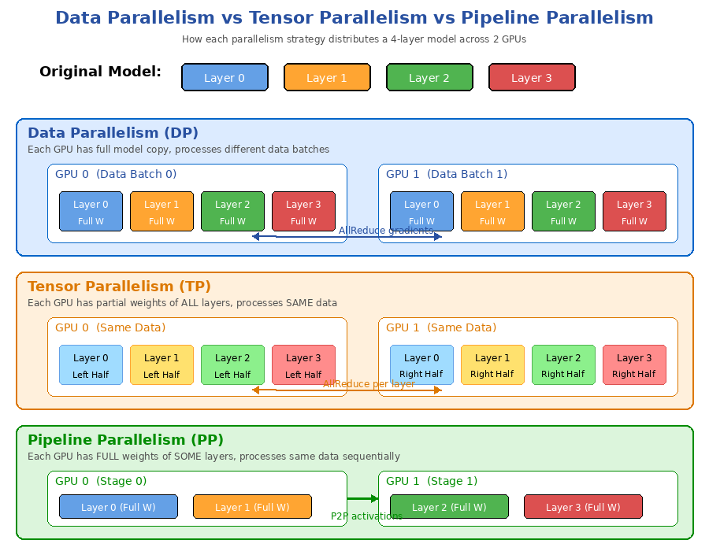

| Strategy | What It Splits | Each GPU Processes | Communication |
|----------|---------------|-------------------|---------------|
| **DP** (Data Parallelism) | **Data batches** | Different data, full model | AllReduce gradients |
| **TP** (Tensor Parallelism) | **Weight matrices** within each layer | Same data, partial weights | AllReduce per layer |
| **PP** (Pipeline Parallelism) | **Layer groups** across stages | Same data, full layers (subset) | P2P activations at boundaries |
| **ZeRO** | **Model states** (W/G/OS) for storage | Different data, reconstructed full weights | AllGather before compute |

**Key Insight**: TP and PP split **how the model computes** (model parallelism). ZeRO splits **how the model is stored** (memory optimization on top of data parallelism).

The relationship between data parallelism and model parallelism can be visualized:

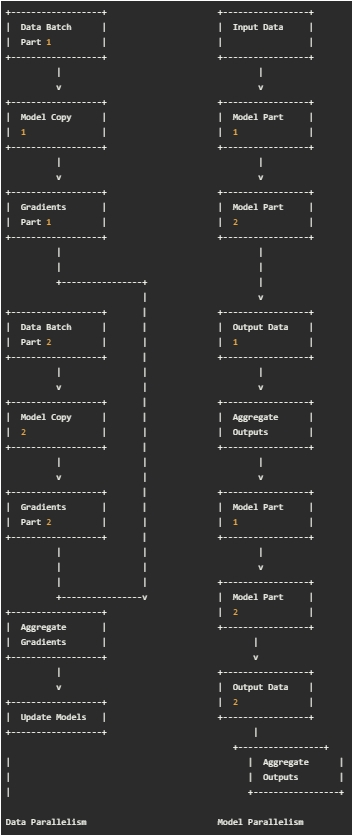

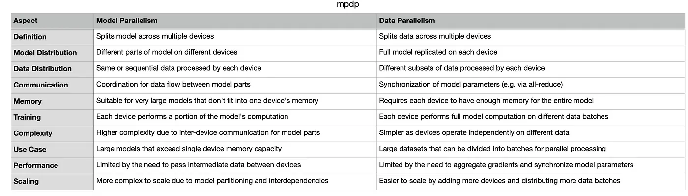

- **DP** has good compute/communication efficiency, but poor memory efficiency (each device holds a full model copy).
- **MP** has good memory efficiency, but communication efficiency can suffer due to cross-partition synchronization.
- **ZeRO-DP** aims to achieve the best of both: maintaining memory efficiency by partitioning model states (rather than replicating them as in DP), while preserving compute/communication efficiency through dynamic communication strategies.

---

## Data Parallelism (DP)

**Core Idea**: Replicate the entire model on every GPU. Each GPU processes a different slice of the training data.

### How It Works

```
Global Batch = [B0, B1, B2, B3]   (e.g., 1024 samples)

GPU 0: Full Model Copy → processes B0 (256 samples) → local gradients G0
GPU 1: Full Model Copy → processes B1 (256 samples) → local gradients G1
GPU 2: Full Model Copy → processes B2 (256 samples) → local gradients G2
GPU 3: Full Model Copy → processes B3 (256 samples) → local gradients G3

                    ↓ AllReduce ↓
           G_avg = (G0 + G1 + G2 + G3) / 4
                    ↓
           All GPUs update parameters with G_avg
```

### Communication Pattern

- **When**: Once after backward pass (per training step)
- **What**: AllReduce on gradients
- **Volume**: 2M per step (M = model size, ring AllReduce)
- **Bandwidth need**: Medium

### Pros and Cons

| Pros | Cons |
|------|------|
| Simple to implement | Each GPU must hold full model copy |
| No model modification needed | Memory inefficient (N copies of model) |
| Linear speedup with more GPUs | Limited by single-GPU memory |
| Works well with any model | Gradient sync can be bottleneck |

### Variants

- **DP** (PyTorch DataParallel): Uses python threads, GPU0 as master → load imbalance
- **DDP** (DistributedDataParallel): Multi-process, each GPU independent → preferred
- **FSDP** (Fully Sharded Data Parallel): PyTorch's ZeRO implementation

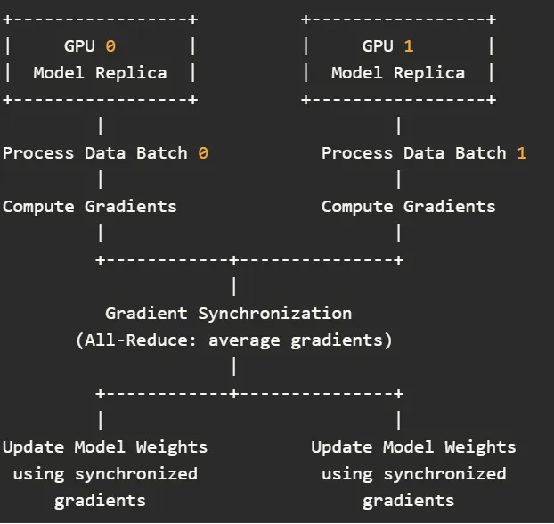

PyTorch provides built-in support for data parallelism through `torch.nn.DataParallel` and `torch.nn.parallel.DistributedDataParallel` (DDP). DDP is preferred for its better scalability and efficiency in multi-node setups.

### PyTorch Implementation

```python
import torch
import torch.nn as nn
import torch.optim as optim

# Define your model
model = nn.Linear(10, 1)

# Wrap the model with DataParallel
model = nn.DataParallel(model)

# Move the model to GPU
model = model.cuda()

# Define loss and optimizer
criterion = nn.MSELoss()
optimizer = optim.SGD(model.parameters(), lr=0.01)

# Dummy data
inputs = torch.randn(64, 10).cuda()
targets = torch.randn(64, 1).cuda()

# Forward pass
outputs = model(inputs)
loss = criterion(outputs, targets)

# Backward pass and optimization
loss.backward()
optimizer.step()
```

---

## Tensor Parallelism (TP)

**Core Idea**: Split each layer's weight matrix across GPUs. Each GPU computes a **partial result** and they synchronize to get the full output.

### How It Works — MLP Layer Example

For a linear layer `Y = XW + b` with weight matrix `W ∈ R^{d_in × d_out}`:

```
Column-parallel split (TP=2):

W = [W_left | W_right]     (split along output dimension)

GPU 0: Y_left  = X × W_left     → partial output
GPU 1: Y_right = X × W_right    → partial output

         ↓ AllReduce ↓
    Y_full = concat or reduce(Y_left, Y_right)
```

For multi-head attention, it's even more natural since heads are already independent:

```
Attention with 32 heads, TP=2:

GPU 0: Heads 0-15  → partial attention output
GPU 1: Heads 16-31 → partial attention output

         ↓ AllReduce ↓
       Full attention output
```

### Communication Pattern

- **When**: Every layer (both forward and backward)
- **What**: AllReduce on activations (per-layer intermediate results)
- **Volume**: Very high (communication at every layer)
- **Bandwidth need**: Very high → **requires NVLink** (300-900 GB/s)

### Why TP Needs NVLink

A typical Transformer layer requires **2 AllReduce operations** (one for MLP, one for attention). For a 94-layer model, that's **188 AllReduce operations per forward pass**, and the same for backward. If using Ethernet (~25 Gbps), the communication overhead would dominate compute time.

**Rule of thumb**: TP should only be used **within a single node** connected by NVLink.

### Pros and Cons

| Pros | Cons |
|------|------|
| Reduces per-GPU memory proportionally | Requires very high bandwidth (NVLink) |
| Each GPU computes partial work → faster | Communication at every layer |
| Natural fit for attention heads | Must modify model architecture |
| Reduces activation memory | TP degree limited by number of attention heads |

### Why TP Does Not Split Input Data

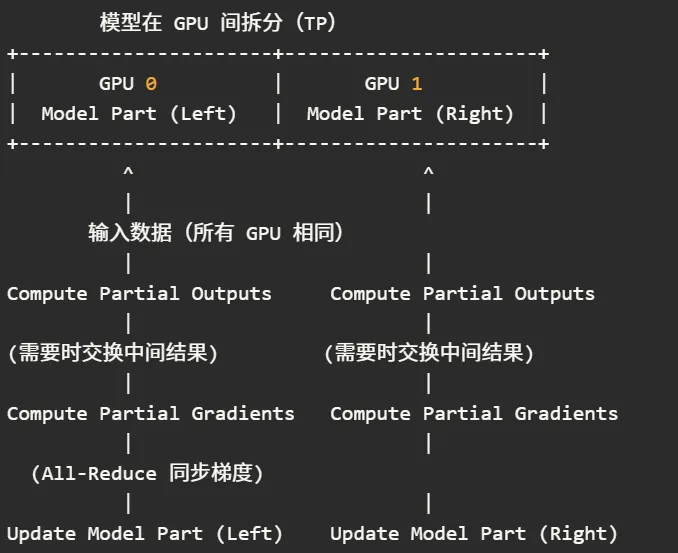

In tensor parallelism, **input data is typically not split — every GPU processes the same input data**. The reasons are:

**1. Model computation requires complete input data**

- **Completeness requirement**: Model operations, especially matrix multiplications, need the full input to compute correctly.
- **Split parameters on full input**: Although model parameters are split, they still need to operate on the full input data to produce correct intermediate results.

**2. Splitting data would increase communication and complexity**

- **Data deficiency**: Splitting input data means each GPU lacks part of the input, missing necessary information for computation.
- **Increased communication**: To compensate, GPUs would need frequent data exchange, increasing network overhead and implementation complexity.

**Example illustration:**

Suppose we have a large weight matrix `W` of size `[M, N]`, column-split across 2 GPUs:
- **GPU 0**: Holds W's first half `[M, N/2]`
- **GPU 1**: Holds W's second half `[M, N/2]`

With **unsplit input** `x [Batch, N]`:
- GPU 0 computes: `y0 = x × W0ᵀ` → partial output
- GPU 1 computes: `y1 = x × W1ᵀ` → partial output
- Combine: `y = y0 + y1`

If we **split input** instead (`x_left [Batch, N/2]`, `x_right [Batch, N/2]`):
- GPU 0 cannot compute `y0 = x × W0ᵀ` because x dimensions don't match W0 — it's missing the other half.
- GPUs would need to exchange input fragments, defeating the purpose.

**Combining TP + DP**: To scale both model size and throughput:
- GPUs are divided into DP groups; within each group, TP is used.
- Input data is split across DP groups (not within TP groups).

### PyTorch Implementation

```python
import torch
import torch.distributed as dist

def tensor_parallel_matmul(a, b, devices):
    # a is divided row-wise, b is shared across devices
    a_shard = a.chunk(len(devices), dim=0)
    results = []
    for i, dev in enumerate(devices):
        a_device = a_shard[i].to(dev)
        b_device = b.to(dev)
        results.append(torch.matmul(a_device, b_device))
    return torch.cat(results, dim=0)

# Example usage:
a = torch.randn(1000, 512)
b = torch.randn(512, 256)
devices = ['cuda:0', 'cuda:1']
result = tensor_parallel_matmul(a, b, devices)
```

Frameworks like [Megatron-LM](https://github.com/NVIDIA/Megatron-LM) and [DeepSpeed](https://www.deepspeed.ai/) provide production-grade tensor parallelism implementations for PyTorch.

---

## Pipeline Parallelism (PP)

**Core Idea**: Assign different **groups of complete layers** to different GPUs. Data flows through the pipeline from first stage to last stage.

### How It Works

```
94-layer model with PP=2:

GPU 0 (Stage 0): Layer 0 ~ Layer 46    ← complete weights for these layers
GPU 1 (Stage 1): Layer 47 ~ Layer 93   ← complete weights for these layers

Forward: Input → GPU0 computes layers 0-46 → send activations → GPU1 computes layers 47-93 → Output
Backward: Same path in reverse, send gradients of activations
```

### The Pipeline Bubble Problem

With naive PP, only one GPU is active at a time (huge waste):

```
Naive PP (no micro-batching):

GPU0: [F0 ][    idle    ][B0 ]
GPU1: [idle][F1 ][B1 ][idle]
              ↑ bubble ↑
```

**Micro-batching** (GPipe/1F1B schedule) alleviates this by splitting the batch into smaller chunks:

```
1F1B Schedule (4 micro-batches):

GPU0: [F0][F1][F2][F3][B0][B1][B2][B3]
GPU1:     [F0][F1][F2][F3][B0][B1][B2][B3]
              ↑ smaller bubble ↑
```

### Communication Pattern

- **When**: Only at stage boundaries (between layer groups)
- **What**: Point-to-point (P2P) send/recv of activations
- **Volume**: Low (only activations at boundary layers)
- **Bandwidth need**: Low → **Ethernet is sufficient**

### Pros and Cons

| Pros | Cons |
|------|------|
| Low communication overhead | Pipeline bubble (idle time) |
| Works over low-bandwidth links (Ethernet) | Increased latency for single requests |
| Each GPU holds complete layers | Load balancing across stages |
| No model architecture changes | Micro-batching adds complexity |

### PP for Training vs Inference

| Aspect | Training | Inference |
|--------|----------|-----------|
| **Micro-batch benefit** | Fills bubble (independent samples) | Only helps throughput (tokens are sequential) |
| **Bubble impact** | Reduced by 1F1B schedule | Unavoidable for single-request latency |
| **When to use** | When nodes can't hold full model | When single GPU can't hold model |

### Gradient Synchronization in PP

| Scenario | AllReduce Needed? | Notes |
|----------|-------------------|-------|
| Single-copy pipeline | No | Each layer is on exactly 1 GPU; gradients are inherently exclusive |
| PP + DP (replicas within stage) | Yes | Same-layer replicas must sync gradients; same as traditional DDP |
| PP + ZeRO/FSDP hybrid | Yes | Additional Reduce-Scatter / All-Gather on top of replica sync |

### Diagrams

**Pure Pipeline Parallelism:**

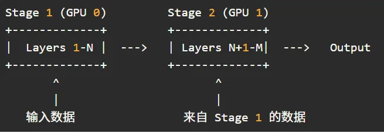

**Pipeline Parallelism Combined with Data Parallelism:**

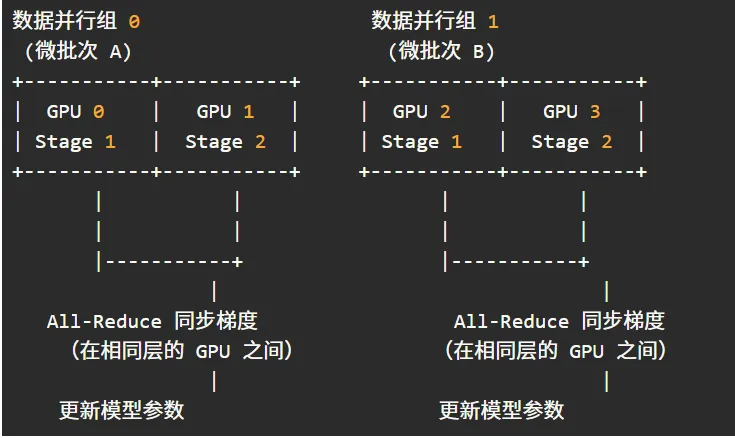

### PyTorch Implementation

```python
import torch.nn as nn
from torch.distributed.pipeline.sync import Pipe

# Define two sequential segments of a model
segment1 = nn.Sequential(
    nn.Linear(1024, 2048),
    nn.ReLU(),
    nn.Linear(2048, 2048)
)

segment2 = nn.Sequential(
    nn.Linear(2048, 2048),
    nn.ReLU(),
    nn.Linear(2048, 1024)
)

# Combine segments and split across devices using Pipe
model = nn.Sequential(segment1, segment2)
model = Pipe(model, devices=['cuda:0', 'cuda:1'], chunks=4)

# Simulated input batch
inputs = torch.randn(16, 1024).to('cuda:0')
outputs = model(inputs)
```

---

## ZeRO (Zero Redundancy Optimizer)

**Core Idea**: In standard DP, every GPU redundantly stores a full copy of model parameters (W), gradients (G), and optimizer states (OS). ZeRO **partitions** these across GPUs to save memory, while **reconstructing** them on-the-fly when needed for computation.

> **ZeRO is NOT model parallelism. It's memory-optimized data parallelism.** Each GPU still processes different data batches and computes with full model weights — it just doesn't *store* everything all the time.

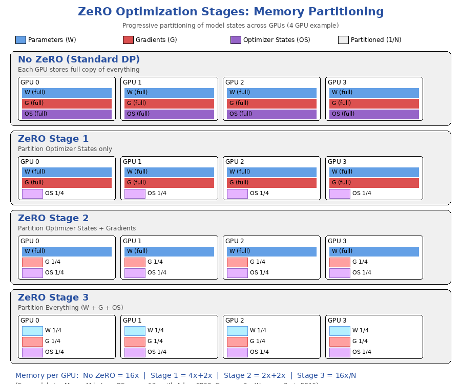

### Memory Breakdown (FP16 model with Adam optimizer)

For a model with M parameters:

| Component | Per-Parameter Memory | Total for M params |
|-----------|---------------------|-------------------|
| Parameters (W) in FP16 | 2 bytes | 2M |
| Gradients (G) in FP16 | 2 bytes | 2M |
| Adam Optimizer States | 12 bytes (FP32 W copy + momentum + variance) | 12M |
| **Total** | **16 bytes** | **16M** |

With standard DP on N GPUs: **each GPU stores 16M** → total memory = 16M × N (massive waste!)


### ZeRO Stage 1: Optimizer State Partitioning

**What's partitioned**: Only optimizer states (OS)

```
4 GPUs, Model M:

GPU 0: W (full 2M) + G (full 2M) + OS_0 (3M)     = 7M bytes
GPU 1: W (full 2M) + G (full 2M) + OS_1 (3M)     = 7M bytes
GPU 2: W (full 2M) + G (full 2M) + OS_2 (3M)     = 7M bytes
GPU 3: W (full 2M) + G (full 2M) + OS_3 (3M)     = 7M bytes

vs. Standard DP: 16M per GPU → Stage 1 saves ~56% memory
```

**Communication**: Same as DDP (AllReduce gradients) + AllGather for updated parameters

Behind the scenes, ZeRO partitions optimizer states into N parts. Each device is responsible for updating 1/N of the optimizer states and the corresponding 1/N of parameters. At the end of each training step, parameters are synchronized via all-gather. For mixed precision training, memory requirement becomes `4P + 12P/N`, which approaches `4P` for large N — a 4× reduction vs. standard DP's `16P`.

### ZeRO Stage 2: + Gradient Partitioning

**What's partitioned**: Optimizer states + Gradients

```
4 GPUs, Model M:

GPU 0: W (full 2M) + G_0 (0.5M) + OS_0 (3M)      = 5.5M bytes
GPU 1: W (full 2M) + G_1 (0.5M) + OS_1 (3M)      = 5.5M bytes

vs. Standard DP: 16M per GPU → Stage 2 saves ~66% memory
```

**Communication**: Replaces AllReduce with Reduce-Scatter (each GPU gets its gradient shard)

Each device only needs 1/N of the gradients during backpropagation. Furthermore, once a gradient partition is consumed, it can be released. Memory becomes `2P + (2P + 12P)/N`, approaching `2P` for large N — an 8× reduction.

### ZeRO Stage 3: + Parameter Partitioning

**What's partitioned**: Optimizer states + Gradients + Parameters (everything!)

```
4 GPUs, Model M:

GPU 0: W_0 (0.5M) + G_0 (0.5M) + OS_0 (3M)       = 4M bytes
GPU 1: W_1 (0.5M) + G_1 (0.5M) + OS_1 (3M)       = 4M bytes

vs. Standard DP: 16M per GPU → Stage 3 saves ~75% memory
```

**Communication**: All-Gather (collect full W before each layer's forward/backward) + Reduce-Scatter (distribute gradients)

Each device stores only 1/N of parameters: `16P/N` per device. Communication per forward pass is P (each device broadcasts P/N to N devices), repeated for backward pass, plus P for gradient Reduce-Scatter. **Total communication = 3P**, which is 1.5× classic DP.

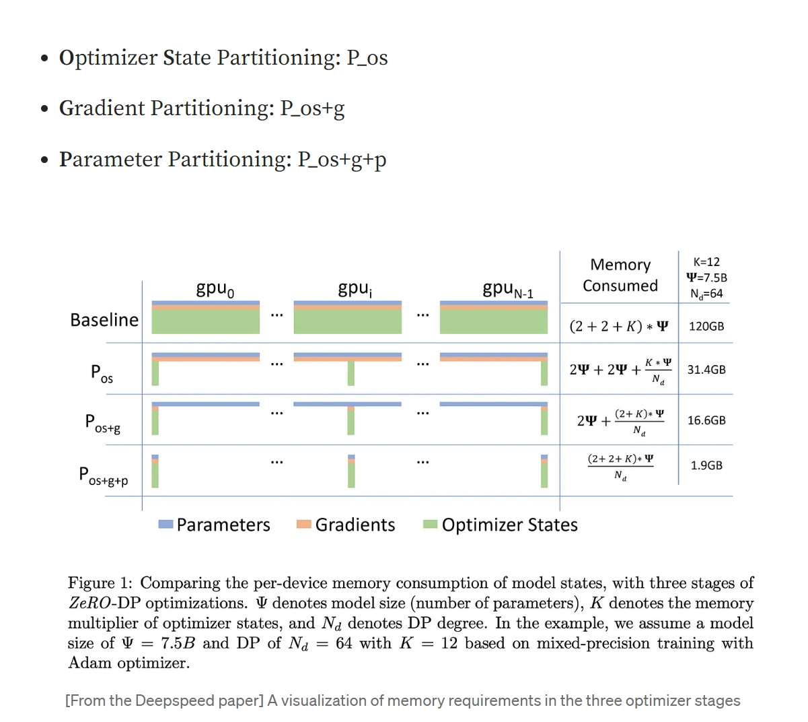

**How ZeRO-3 handles forward pass**:
```
For each layer L:
  1. All-Gather: Reconstruct full W of layer L from all GPU shards
  2. Compute: Y = f(X, W_full)     ← same math as single GPU!
  3. Discard: Drop the gathered W (only keep own shard)
  4. Move to next layer
```

### Why ZeRO Cannot Shard Activations

While ZeRO can partition gradients, optimizer states, and parameters, it **cannot shard activations**. This is a fundamental distinction:

**Activations cannot be sharded because:**

1. **Activations are intermediate states of forward propagation**: Each layer's activation depends on the previous layer's activation. They must be retained on the computing device for use during backpropagation.

2. **Backpropagation depends on activations**: During backpropagation, saved activations from forward pass are required to compute gradients. Sharding activations across devices would require frequent inter-device data transfers, causing enormous communication overhead and reducing training efficiency.

**Gradients and optimizer states CAN be sharded because:**

1. **They are global in nature**: Gradients are partial derivatives of the loss with respect to model parameters — they can be independently computed on different devices and then aggregated. Optimizer states (momentum, second-order momentum, etc.) are auxiliary variables related to model parameters that can be independently stored and updated on different devices.

2. **Reduced redundant storage**: By sharding and distributing gradients and optimizer states, ZeRO reduces redundant storage on each device. Each device only needs to store and compute a portion, then perform global aggregation when needed.

### ZeRO Communication Volume Summary

| Stage | Memory per GPU | Communication per Step | vs. Classic DP |
|-------|---------------|----------------------|----------------|
| Classic DP | 16P | 2P | 1× |
| ZeRO-1 (OS) | 4P + 12P/N | 2P | 1× |
| ZeRO-2 (OS+G) | 2P + (2P+12P)/N | 2P | 1× |
| ZeRO-3 (OS+G+P) | 16P/N | 3P | 1.5× |

DeepSpeed ZeRO remains a data-parallel paradigm but eliminates model state redundancy behind the scenes. The communication is distributed: parameters exist on a node only when needed and are discarded after use, maintaining the memory savings discussed above.

### DeepSpeed Implementation

```python
import torch
import torch.nn as nn
import deepspeed

class LargeModel(nn.Module):
    def __init__(self, input_dim, hidden_dim, output_dim):
        super(LargeModel, self).__init__()
        self.fc1 = nn.Linear(input_dim, hidden_dim)
        self.relu = nn.ReLU()
        self.fc2 = nn.Linear(hidden_dim, output_dim)

    def forward(self, x):
        x = self.relu(self.fc1(x))
        return self.fc2(x)

model = LargeModel(1024, 4096, 10)

ds_config = {
    "train_batch_size": 32,
    "optimizer": {
        "type": "Adam",
        "params": { "lr": 0.001 }
    },
    "zero_optimization": {
        "stage": 2,
        "allgather_partitions": True,
        "reduce_scatter": True,
        "allgather_bucket_size": 2e8,
        "overlap_comm": True
    }
}

model_engine, optimizer, _, _ = deepspeed.initialize(model=model, config=ds_config)
inputs = torch.randn(32, 1024).to(model_engine.local_rank)
outputs = model_engine(inputs)
loss = outputs.mean()
model_engine.backward(loss)
model_engine.step()
```

---

## The Critical Difference: TP vs ZeRO

This is the most commonly confused point. Both TP and ZeRO-3 split weights across GPUs. But the computation model is fundamentally different:

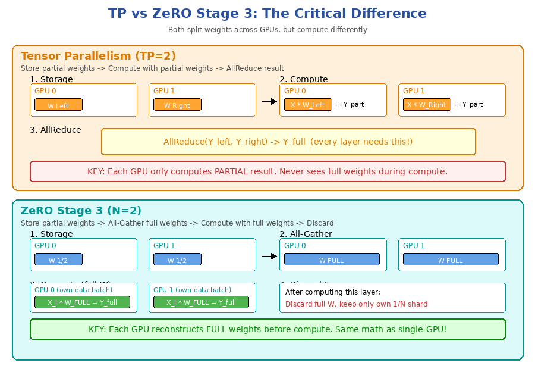

| Aspect | Tensor Parallelism (TP) | ZeRO Stage 3 |
|--------|------------------------|---------------|
| **Splits** | Weight matrix within each layer | Weight shards for storage |
| **During compute** | Each GPU uses **partial weights** | Each GPU reconstructs and uses **full weights** |
| **Data processed** | **Same data** across TP group | **Different data** per GPU (data parallelism) |
| **Communication type** | AllReduce (per layer, merge partial results) | All-Gather (per layer, reconstruct weights) |
| **Model modification** | Required (split Linear, Attention) | Not required |
| **Nature** | **Model parallelism** | **Memory-optimized data parallelism** |
| **Analogy** | Workers each build **part** of a car, then assemble | Workers each **borrow the full toolkit**, build their own car, return tools |

### Why This Matters

1. **TP reduces compute per GPU** (each does partial matrix multiply) → good for latency
2. **ZeRO doesn't reduce compute** (each does full matrix multiply) → same latency as single GPU
3. **TP requires high bandwidth** (sync at every layer) → needs NVLink
4. **ZeRO's All-Gather can be prefetched** (overlap with compute) → more flexible

---

## Fully Sharded Data Parallel (FSDP)

FSDP is PyTorch's native implementation of ZeRO-3 concepts. It provides maximum memory efficiency by sharding parameters, gradients, and optimizer states.

### How FSDP Works

1. **Parameter Sharding**: Each weight tensor, gradient tensor, and optimizer state is evenly split into N shards across N GPUs. Each GPU only stores its own shard, reducing resident memory to 1/N.

2. **Forward Pass**: When a layer is about to compute, FSDP uses **All-Gather** to temporarily reconstruct the full parameters on each GPU. After computation, the gathered parameters are immediately released.

3. **Backward Pass**: After generating full gradients, FSDP immediately performs **Reduce-Scatter** — this both aggregates gradients and distributes them back to their respective shards. Each GPU keeps only its own gradient shard.

4. **Parameter Update**: The optimizer (e.g., AdamW) updates locally on each shard independently. After update, temporary buffers are released, returning memory to the minimal "one shard only" state.

5. **Mixed Precision** (FP16/BF16 + FP32 master weights): Gradients first participate in Reduce-Scatter at low precision, then accumulate to FP32 master weights locally. If gradient normalization or clipping requiring global L2-norm is enabled, an additional All-Gather/All-Reduce is needed.

### FSDP Communication Logic

| Phase | Primary Communication | Purpose |
|-------|----------------------|---------|
| Forward start | **All-Gather parameter shards** | Assemble full weights for layer computation |
| Backward end | **Reduce-Scatter gradients** | Aggregate gradients and distribute to shards |
| (Optional) Mixed precision post-processing | All-Reduce / All-Gather | Gradient normalization, clipping, or other global operations |

> Compared to traditional data parallelism, FSDP splits the "big All-Reduce" into "forward All-Gather + backward Reduce-Scatter". Total communication volume is the same, but peak memory usage is lower and can overlap with computation.

---

## Expert Parallelism & MoE

### Background and Core Concepts

1. **Sparse Activation**: A single forward pass only routes to K experts (K ≪ M total experts), so compute is proportional to K, but the model can stack M ≫ K parameters for capacity.
2. **Parallel Challenge**: Routing All-to-All and expert gradient synchronization demand high bandwidth; must be combined with data parallelism, tensor parallelism, and ZeRO to scale.
3. **DeepSpeed** provides integrated MoE-Layer, Balanced-Gate, Expert-Parallel, and ZeRO-3 support.

### MoE Workflow

| Step | Process | Primary Communication |
|------|---------|----------------------|
| ① **Gate Routing** | Gate produces Top-K expert indices for each token | All-to-All (token redistribution) |
| ② **Expert Forward** | Selected experts compute independently | None if experts are across GPUs; parameter sync if replicated |
| ③ **Expert Backward** | Reverse-route gradients by token-to-expert mapping | All-to-All (same as ①) |
| ④ **Gradient Sync** | a. Expert weights: All-Reduce across same-name experts<br>b. Non-expert weights: All-Reduce across DP group | All-Reduce |
| ⑤ **Parameter Update** | Can stack ZeRO/FSDP for sharded updates | Reduce-Scatter / All-Gather (ZeRO-3) |

> The two All-to-All operations in steps ① and ③ are the **most bandwidth-intensive** part of MoE training.

### Common Combinations

1. **E + D** (most common): All-to-All ×2; expert All-Reduce; backbone DDP All-Reduce.
2. **E + Z** (memory-constrained): Add ZeRO-3 sharding to both backbone and expert parameters.
3. **E + D + TP** (100B+ LLMs): Backbone uses tensor parallelism; experts use expert parallelism. TP P2P/All-Gather + MoE All-to-All.
4. **E + D + Z** (DeepSpeed recommended): Communication = E+D All-to-All & All-Reduce + ZeRO-3 Gather/Scatter.

### MoE Diagrams

**Expert Parallelism with Data Parallelism (EP=2, DP=2):**

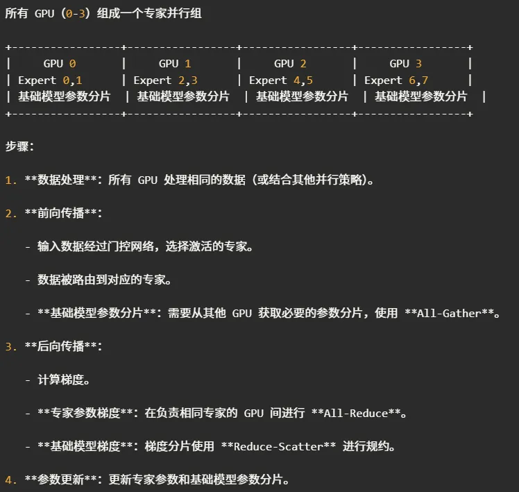

**Expert + Model Parallelism (EP + TP, DP=2):**

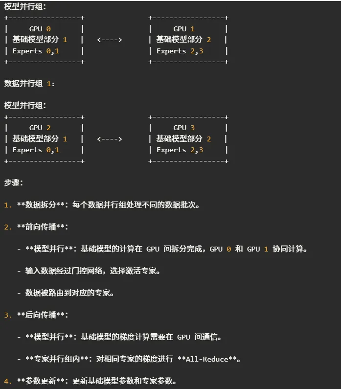

**Expert Parallelism + ZeRO (EP=2, DP=2 + ZeRO):**

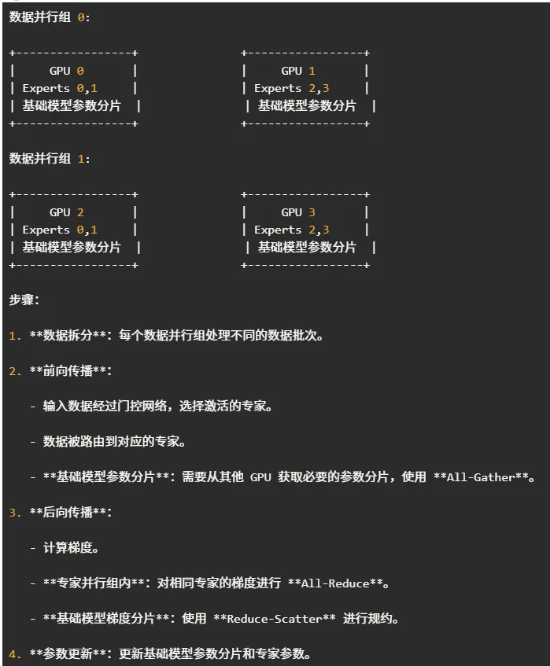

**Full Expert Distribution (8 experts across 4 GPUs):**

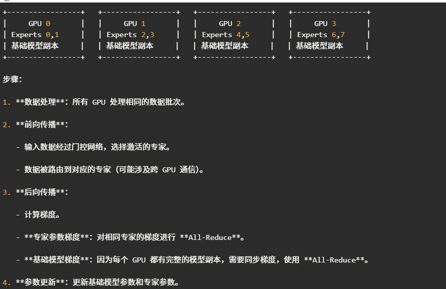

### DeepSpeed MoE Implementation

```python
from deepspeed.moe.layer import MoE
import deepspeed, torch.nn as nn

class MoEBlock(nn.Module):
    def __init__(self, d_model=2048, num_experts=32, k=2):
        super().__init__()
        self.moe = MoE(hidden_size=d_model,
                       expert_group_size=num_experts,
                       k=k,
                       expert_fn=lambda: nn.Linear(d_model, d_model))

    def forward(self, x):
        out, _ = self.moe(x)
        return out

model = MoEBlock()

ds_cfg = {
    "train_batch_size": 64,
    "zero_optimization": { "stage": 2 },
    "moe": {
        "enabled": True,
        "num_experts": 32,
        "k": 2,
        "expert_parallel_size": 8
    }
}

engine, optimizer, _, _ = deepspeed.initialize(model=model, config=ds_cfg)
```

### MoE Key Takeaways

- **MoE performance ceiling is often constrained by All-to-All bandwidth** — NVLink / 200 Gb IB is recommended hardware.
- When expert count ≫ GPU count, proper `expert_parallel_size` and **Balanced-Gate** settings can significantly reduce load imbalance.
- If memory is the bottleneck, prioritize ZeRO-3 on backbone; expert layers with sparse activation can retain full copies first, then shard if necessary.

---

# Part II: Combining Strategies

---

## Parallelism Taxonomy & Hybrid Combinations

### Parallelism Paradigm Comparison

| Paradigm | Primary Problem Solved | Forward/Routing Communication | Backward/Update Communication | Typical Implementation |
|----------|----------------------|------------------------------|------------------------------|----------------------|
| **D – Data Parallel** | Throughput | – | All-Reduce (gradients) | PyTorch DDP |
| **TP – Tensor Parallel** | Oversized single-layer weights | P2P / All-Gather (activations) | Reduce-Scatter / All-Reduce | Megatron-LM |
| **PP – Pipeline Parallel** | Deep model memory; throughput boost | Micro-batch streaming; only activations cross stages | All-Reduce within stage (if replicated) | PyTorch Pipe / DeepSpeed-PP |
| **SP – Sequence Parallel** | Long sequence attention | All-Gather (cross-slice Q/K/V) | Reduce-Scatter / All-Reduce | Megatron-SP |
| **E – Expert Parallel** | Sparse high-capacity MoE | All-to-All (token → expert routing) | All-Reduce (same-expert gradients) | DeepSpeed-MoE |
| **Z – ZeRO 1/2/3** | Memory optimization | Stage-3: All-Gather (parameter shards) | Reduce-Scatter (gradients) | DeepSpeed-ZeRO |

### Common Hybrid Paradigms

| Combination | Goal | Forward/Routing Comm | Backward/Update Comm | Typical Implementation |
|-------------|------|---------------------|---------------------|----------------------|
| **TP + D** | Wide layers + throughput | Same as TP | TP internal + D inter-group gradient All-Reduce | Megatron-LM |
| **PP + D** | Deep layers + throughput | Micro-batch streaming | Intra-stage All-Reduce | DeepSpeed-PP + DDP |
| **E + D** | MoE + throughput | All-to-All | Expert All-Reduce + D inter-group All-Reduce | DeepSpeed-MoE |
| **E + D + Z** | MoE + memory optimization | All-to-All + parameter All-Gather | Expert All-Reduce + ZeRO comm | DeepSpeed-ZeRO-MoE |
| **E + D + TP** | 100B+ LLM | TP-P2P + All-to-All | TP Reduce-Scatter + respective All-Reduce | Megatron-DeepSpeed |

**Key principle**: Whenever the same layer is "replicated" across multiple GPUs, gradient All-Reduce is required within that replica group — regardless of which other parallelism paradigms (PP, TP, MoE) are in use.

---

## 3D Parallelism: TP × PP × DP

For training the largest models (100B+), a single parallelism strategy isn't enough. **3D Parallelism** combines all three:

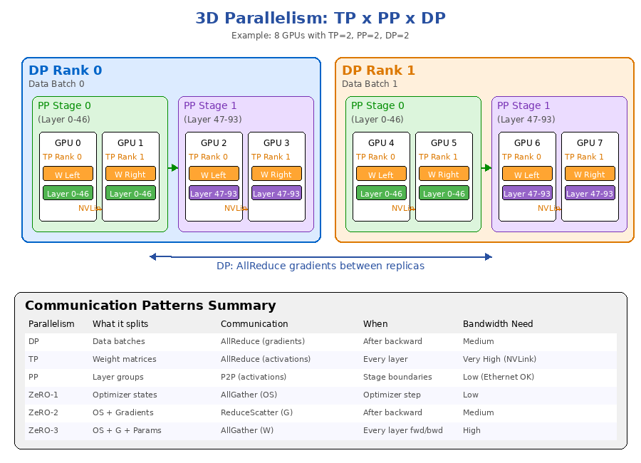

### How They Combine

```
Total GPUs = TP_size × PP_size × DP_size

Example: 8 GPUs, TP=2, PP=2, DP=2

                    DP Rank 0                    DP Rank 1
              ┌────────────────────┐      ┌────────────────────┐
PP Stage 0    │ GPU0(TP0) GPU1(TP1)│      │ GPU4(TP0) GPU5(TP1)│
(Layer 0-46)  │  ←── NVLink ──→   │      │  ←── NVLink ──→   │
              ├────────────────────┤      ├────────────────────┤
PP Stage 1    │ GPU2(TP0) GPU3(TP1)│      │ GPU6(TP0) GPU7(TP1)│
(Layer 47-93) │  ←── NVLink ──→   │      │  ←── NVLink ──→   │
              └────────────────────┘      └────────────────────┘
                         ↕ AllReduce gradients (DP) ↕
```

### Communication Hierarchies

| Dimension | Bandwidth Need | Typical Interconnect | Communication |
|-----------|---------------|---------------------|---------------|
| **TP** (within node) | Highest | NVLink (600-900 GB/s) | AllReduce every layer |
| **PP** (across nodes) | Low | Ethernet (10-100 Gbps) | P2P at stage boundaries |
| **DP** (across replicas) | Medium | Ethernet/InfiniBand | AllReduce gradients once per step |

### ZeRO + 3D Parallelism

When combining ZeRO with PP+TP:
- **ZeRO-1** (optimizer sharding) works well with PP+TP
- **ZeRO-2** (+ gradient sharding) has performance issues with PP due to extra Reduce-Scatter per micro-batch
- **ZeRO-3** (+ parameter sharding) typically not combined with PP/TP (redundant and adds communication)

---

## Communication Patterns Comparison

| Parallelism | Collective Op | When | Volume per Step | Can Overlap with Compute? |
|-------------|--------------|------|-----------------|--------------------------|
| **DP/DDP** | AllReduce | After backward | 2M (ring) | Yes (gradient bucketing) |
| **TP** | AllReduce | Every layer (fwd+bwd) | 2 × L × activation_size | No (on critical path) |
| **PP** | P2P Send/Recv | Stage boundaries | activation_size_per_boundary | Partially (1F1B) |
| **ZeRO-1** | AllGather + ReduceScatter | Optimizer step | M | Yes |
| **ZeRO-2** | ReduceScatter | After backward | M | Yes |
| **ZeRO-3** | AllGather + ReduceScatter | Every layer (fwd+bwd) | 3M total (fwd AG + bwd AG + bwd RS) | Yes (prefetch) |

Where: M = model size, L = number of layers.

---

## Training vs Inference: Different Priorities

| Aspect | Training | Inference |
|--------|----------|-----------|
| **Primary goal** | Maximize throughput (samples/sec) | Minimize latency (ms/token) |
| **Parallelism priority** | DP > TP > PP | TP > PP > DP |
| **Why DP is preferred in training** | Lowest communication, linear scaling | Not applicable (single input) |
| **Why TP is preferred in inference** | — | Reduces per-GPU compute, lowers latency |
| **ZeRO relevance** | Very useful (saves memory for larger batches) | ZeRO-Inference exists but less common |
| **PP trade-off** | Acceptable bubble, micro-batch helps | Adds latency (pipeline bubble per token) |

### Why Training Prefers DP

- Each GPU processes independent data → minimal communication (just gradients at end)
- Communication can overlap with backward computation (gradient bucketing)
- Linear throughput scaling: 2× GPUs ≈ 2× throughput

### Why Inference Prefers TP

- Single request → can't split data (no DP benefit)
- TP reduces per-GPU computation → lower latency
- NVLink bandwidth handles per-layer AllReduce efficiently

---

## Decision Guide: When to Use What

### Model fits on single GPU
```
→ Just use DDP (Data Parallel) for training
→ Single GPU for inference
```

### Model doesn't fit on single GPU

**Single node (NVLink available)**:
```
→ Training: TP first, add ZeRO-1/2 if needed
→ Inference: TP (degree = number of GPUs)
```

**Multi-node (Ethernet between nodes)**:
```
→ Training: TP within node + PP across nodes + DP for scaling
→ Inference: TP within node + PP across nodes
```

**Memory still insufficient**:
```
→ Add ZeRO-3 (caution: high communication for Stage 3)
→ Consider ZeRO-Offload (offload to CPU/NVMe)
```

### Quick Decision Table

| Scenario | Recommended Strategy |
|----------|---------------------|
| 7B model, 1 node 8×H100 | DDP (training) / TP=1 (inference) |
| 70B model, 1 node 8×H100 | TP=8 (inference) / TP=8 + ZeRO-1 (training) |
| 70B model, 2 nodes 4×H100 | TP=4 + PP=2 |
| 405B model, 8 nodes 8×H100 | TP=8 + PP=4 + DP=2 |
| 405B model, 192 nodes 8×H100 | TP=8 + PP=4 + DP=48 (Llama-3 actual config) |

---

## Real-World Example: Training Llama-3 405B

Meta's Llama-3 405B was trained on **16,384 H100 GPUs** using 3D parallelism:

| Dimension | Value | Details |
|-----------|-------|---------|
| **TP** | 8 | Within each node (8×H100 NVSwitch, 900 GB/s) |
| **PP** | 4 (16 for context extension) | Across 4 nodes per pipeline |
| **DP** | 512 (128 for context extension) | 16384 / (8 × 4) = 512 DP replicas |

### Per-GPU View

```
Total parameters: 405B
Per TP group (8 GPUs): 405B (shared, each holds 1/8 of each layer's weights)
Per PP stage (TP group handles some layers):
  - Pipeline has 4 stages → each stage ≈ 126B / 4 = ~31.5B parameters
  - With TP=8: each GPU holds ~31.5B / 8 = ~3.9B parameters
  - In FP16: ~3.9B × 2 bytes = ~7.8 GB for weights alone

Memory breakdown per GPU:
  Parameters (FP16):     ~7.8 GB
  Gradients (FP16):      ~7.8 GB
  Optimizer (FP32):      ~23.4 GB (Adam: 3× param FP32)
  Activations & KV:      ~30-40 GB
  ──────────────────────────────
  Total:                 ~70-80 GB / 80 GB H100
```

---

# Part III: NCCL & GPU Communication Internals

---

## Deep Learning Architecture Stack

The deep learning stack from bottom to top:

```
  +---------------------+
  |      Model          |  ← Model layer (e.g., Phi3-Vision)
  +---------------------+
            |
            v
  +---------------------+
  |  DeepSpeed/vLLM     |  ← Specific framework (e.g., vLLM for Transformer optimization)
  +---------------------+
            |
            v
  +---------------------+
  |   Transformer       |  ← Specific neural network architecture
  +---------------------+
            |
            v
  +---------------------+
  |      PyTorch        |  ← Deep learning framework
  +---------------------+
            |
            v
  +---------------------+
  |      Python         |  ← Programming language
  +---------------------+
            |
            v
  +---------------------+
  |       CUDA          |  ← Low-level compute acceleration library
  +---------------------+
```

---

## Multi-GPU Training Challenges

### Algorithm Challenges

- Data parallelism or model parallelism
- Synchronous or asynchronous
- Large batches affect model accuracy
- Warmup and learning rate scheduling (linear warmup, LARC/LARS...)
- Adding noise to gradients
- Optimizer selection (SGD, Momentum, Adam, RMSProp...)
- Balancing speed and accuracy


### Engineering Challenges

- Imbalanced CPU and GPU performance scaling
- Scale up first (NVLink), then scale out through NICs
- Matching and selecting V100/A100, NVLink, NVSwitch, DGX, 10G/25G/100G/200G
- Mixed precision, GPUDirect RDMA (IB/RoCE)
- Offloading some OPs from CPU to GPU (data preprocessing, Allreduce)
- Gradient compression for communication efficiency
- Training framework selection (Horovod, TensorFlow, PaddlePaddle, PyTorch...)
- Building, managing, and scheduling distributed GPU training clusters


NCCL can solve many of the communication challenges in algorithm design.

---

## NCCL: Role and Architecture

### Single GPU Training Data Flow

In single GPU training, raw data (images, audio, etc.) is stored in a database. Gradients are used to update parameters, which are then combined with the next batch for another iteration, repeating until convergence.


### NCCL in Distributed Training

In data-parallel distributed training, each GPU produces its own gradients from its own data. These gradients must be merged and summed — requiring an AllReduce operation. NCCL provides efficient parallel gradient communication. After AllReduce, each GPU obtains the reduced gradient and updates its parameters.


NCCL buffers reside on GPU memory and support multiple network interconnects.

### NCCL's Position in the DL Stack

NCCL sits above GPU/CUDA and below training frameworks. It works alongside cuDNN and cuBLAS to provide deep learning library support.


### NCCL API Structure

NCCL APIs are organized into five categories:
1. NCCL Communicator creation, destruction, fault tolerance
2. Same as above (lifecycle management)
3. Five collective operations: AllReduce, AllGather, Broadcast, Reduce, ReduceScatter
4. Point-to-point operations: send and receive
5. Combined/grouped operations (merging collective communications)

Where:
- AllReduce = AllGather + ReduceScatter
- Broadcast and Reduce are inverses of each other


---

## NCCL Collective Operations

### Reduce

One rank receives the reduced result from all ranks' input values. For example, four values across four ranks are summed and sent to root rank 2.


### Broadcast

All ranks receive data from one root rank.


### AllReduce

Each rank receives the reduced result across all ranks' input values.


### AllGather

Each rank receives aggregated data from all ranks, in rank order.


### ReduceScatter

Input values are reduced across ranks, each rank receives a portion of the reduced result.


### Point-to-Point Operations

- **Send/Receive**: One-to-one communication
- **Gather**: Many-to-one
- **Scatter**: One-to-many


---

## MPI for Multi-Node Training

### Prerequisites for Distributed GPU Jobs

1. Hardware: Compute servers, network
2. Code: Parallelism division and implementation
3. MPI: For launching multi-process jobs across nodes, message passing
4. Passwordless SSH access
5. Unified user information (UID/GID)
6. Unified file system
7. Unified software stack (consistent NCCL and CUDA versions across nodes)
8. `mpicc` for code compilation
9. Launch: `mpirun -np 16 -H node1:8,node2:8 ./application`

### Two Launch Methods

**Method 1: MPI**

MPI (Message Passing Interface) is a classic parallel task execution method, heavily used in HPC for decades. It has 6 basic functions:


MPI requires passwordless SSH between nodes and is launched from a single node. The `-H` flag specifies compute nodes and process counts.

**Method 2: IP + Port (torchrun)**

This method is simpler — no passwordless SSH needed. Just specify the master IP and port on each node:

```bash
# On node 1
NCCL_DEBUG=INFO python -m torch.distributed.launch --nproc_per_node=8 --nnodes=2 \
    --node_rank=0 --master_addr="192.168.1.1" --master_port=12355 train.py

# On node 2
NCCL_DEBUG=INFO python -m torch.distributed.launch --nproc_per_node=8 --nnodes=2 \
    --node_rank=1 --master_addr="192.168.1.1" --master_port=12355 train.py
```

### NCCL vs MPI

NCCL (NVIDIA Collective Communication Library) handles optimized GPU-to-GPU communication within a server. MPI handles cross-server task scheduling. When NGC launches tests with MPI, the underlying communication uses NCCL. MPI only does process management and launch.


### GPUDirect RDMA (GDR)

NV_PEER_MEM is required for cross-node MPI with GDR. This module is loaded on every node. When using GDR, GPU and NIC must be under the same PCIe root complex — if too far apart, performance may actually degrade. DGX1 and DGX A100 require GPU and NIC under the same PCIe switch.


---

## NCCL Startup Process

NCCL has two startup modes:

**Mode 1: Launch only on Worker 0**

NCCL first spawns a root thread, which provides port and IP to NCCL, then NCCL broadcasts to all ranks.


**Mode 2: Launch on all parallel workers**

In this mode, NCCL initializes rank independently on each worker, then passes rank IP and port to the bootstrap root thread.


All ranks then exchange information to form ring or tree topologies:


### NCCL Bootstrap

NCCL Bootstrap uses TCP/IP sockets to connect ranks within a job, providing an out-of-band channel for exchanging information. Bootstrap operations remain available throughout the NCCL communicator's lifecycle, primarily used during initialization and for dynamic send/recv connections. Currently no encryption or security measures. Use `NCCL_SOCKET_IFNAME` to ensure NCCL uses a network interface private to the parallel job.

### NCCL's Four Working Steps

1. **Topology Detection** — Build full GPU cluster topology
2. **Graph Search** — Find optimal communication architecture (ring or tree)
3. **Graph Connect** — Connect GPUs across nodes using PCI, NVLink, or GDR
4. **CUDA Kernel** — Optimize reductions and copies, minimize SM usage


**Step 1: Topology Discovery**

NCCL discovers: IB, NVLink, NVLink Switch interconnects (including NVLink to CPU, e.g., Power9 and Grace CPU). VM configurations including link bandwidth information are also detected.


**Step 2: Graph Generation**

After topology discovery, NCCL generates graphs. NCCL calculates different models by default, estimates latency based on hardware, network conditions, and node count, then selects the fastest option. Ring has higher bandwidth; tree has lower latency.


**Step 3: Graph Connect**

Collective communication is established through GPU kernels. NCCL uses write operations (more efficient). Connections use PCI, NVLink, or GDR.


With GDR, cross-node buffers don't need to be allocated in host memory — device memory is used directly. However, a CPU process is still needed to initiate RDMA copy operations.

---

## NCCL Algorithms: Ring, Tree, CollNet

NCCL has three communication algorithms:

- **Ring**: Higher bandwidth, but also higher latency
- **Tree**: Lower latency, but bandwidth may not saturate
- **CollNet**: Enables in-network reductions, but requires specialized IB switches

### Ring Algorithm

Ring is easier to achieve full bandwidth. Good topology detection is critical for ring performance — it needs an optimal ring path.


In traditional ring broadcast, data is not chunked, so total latency scales with GPU count.


Optimization: split data into messages. With sufficiently large data and many messages, node count becomes negligible.


### Tree (Double Binary Tree)

Trees are always used in pairs. The purpose of tree pairs is to ensure balanced send/receive per node. Two trees are offset by one position, so most nodes send and receive twice each.


### CollNet (SHARP)

CollNet uses SHARP technology — reductions happen inside the switch itself.


**SHARP advantages** vs. Tree: Send data once, receive final result (no intermediate results); effective double bandwidth with fewer hops; lower latency.


### Ring Channel Configuration

**Intra-node:**
- NVLink-based systems: Always create double channels to saturate NVLink bandwidth (e.g., DGX-1V: 6×2=12; DGX A100: 12×2=24)
- PCIe-based systems: Always 2 channels

**Inter-node:**
- Always double channels based on NIC count: 2 × number of NICs


### Tree Types

NCCL tree has three subtypes:

- **Basic Tree**: All NIC traffic flows to/from the same GPU
- **Balanced Tree**: NIC traffic split between two GPUs (tree parent + one child on first GPU, second child on second GPU)
- **Split Tree**: NIC traffic split between two GPUs (tree parent on first GPU, tree children on second GPU)


Balanced tree is the most common default; basic tree is used only when GPU count is small. CollNet depends on switch support.

---

## Ring AllReduce Walkthrough

AllReduce is the most frequently used NCCL operation in deep learning distributed training. The goal is to efficiently reduce data across all machines and distribute the result to every machine.


### Step-by-Step with 4 GPUs

Data is split into chunks to minimize copy overhead and maximize concurrent bandwidth.


**Step 1**: Each GPU copies its data to the next GPU in the ring.


**Step 2**: Each GPU accumulates the received data with its own data, then passes the result to the next GPU.


**Step 3**: After 3 rounds of communication (for 4 GPUs), each GPU has the sum of 3 other GPUs' data. This completes the Reduce-Scatter phase.


**Steps 4-6**: Broadcast phase — each GPU sends its completed reduction chunk to the next GPU.


**Processing remaining chunks**: The same process repeats for each data chunk.


**Final result**: AllReduce complete — every GPU has the globally reduced data.


The entire process: Reduce → Scatter → Broadcast.


---

## NVLink Advantages

Understanding ring network limitations helps explain why DGX uses NVLink for data transfer.

### Single-Node NVLink GPU System (V100 Example)

Two NUMA nodes with 8 GPUs total. Each GPU has 6 NVLink connections. Total unidirectional bandwidth: 150 GB/s.


### Best Practice

For multi-GPU communication: intra-node uses NVLink, inter-node uses RDMA.


### H100 NVLink Switch

H100 introduces NVLink Switch connectivity, with AlltoAll becoming a new direction.


---

## NCCL's "3 Heads, 15 Arms"

NCCL can be described by three dimensions and 15 implementations:

**NCCL Communication Functions** (business-facing, e.g., AllReduce for distributed training):
1. Collective: Broadcast, Reduce, AllGather, ReduceScatter, AllReduce
2. Point-to-Point: send/recv, scatter, gather, all-to-all

**NCCL Algorithms**: Ring, Tree, CollNet

**NCCL Protocols**: LL, LL128, Simple

In most cases, NCCL automatically selects the optimal algorithm and protocol. But understanding the communication functions is critical for correct usage and configuration.

---

## NCCL Protocols: LL, LL128, Simple

- **LL (Low Latency)**: Relies on 8-byte atomic stores (4B data / 4B flag). Maximum bandwidth is 50% of peak because 50% of payload is flags.
- **LL128**: Relies on 128-byte stores being seen in order (120B data / 8B flag). Can achieve 95% of peak bandwidth.
- **Simple**: No flags — raw data transfer.

> Flags indicate that a data segment's tail has been delivered and is ready for consumption in the pipeline's next stage.
> LL128's performance depends on communication method (PCI or NVLink) and buffer location (GPU memory or system memory).

### Algorithm × Protocol Combinations

8 choices × 3 protocols = {Ring, Tree, CollNet} × {LL, LL128, Simple} (CollNet doesn't support LL128).

NCCL builds latency and bandwidth models for each algorithm based on channel count and speed, then selects optimally:
- **Large messages**: Ring is bandwidth-optimal, but small messages are latency-dominated and latency increases linearly with scale.
- **Large scale**: Tree has better latency, but for very large messages, Trees can't achieve peak bandwidth due to SM overhead — so Rings are used.

---

## DGX Superpod Architecture

DGX Superpod is NVIDIA's GPU cluster reference architecture. The logical architecture divides into compute servers and admin management servers.


Compute servers stack: OS → CUDA → RoCE/IB → RDMA → NCCL/MPI.

Admin servers include: Provisioning Node, Login Node, Monitor Node, Load Balancing Node, UFM Node.


Distributed system requirements:
- Passwordless SSH, unified file system, unified UID/GID, unified software stack
- MPI, NCCL, nv_peer_mem, SHARP (optional)
- Slurm or K8s scheduler
- MPI + Containers

---

## NCCL Execution & Log Analysis

### Running NCCL Tests

```bash
mpirun -bind-to none -H node1:1,node2:1 \
    -x CUDA_VISIBLE_DEVICES=** \
    -x LD_LIBRARY_PATH \
    -x NCCL_IB_HCA=* \
    -x NCCL_DEBUG=INFO \
    -mca btl_openib_allow_ib true \
    ~/nccl-tests/build/all_reduce_perf -b 8 -e 128M -f2 -g8
```

- `NCCL_IB_HCA`: Select specific IB cards for communication
- `-b 8 -e 128M`: Message size from 8 bytes to 128MB, doubling each step
- `-g 8`: GPU count (can be 1 process per GPU or multiple GPUs per process)
- `NCCL_SOCKET_IFNAME`: Specify Ethernet card for initialization

### Reading NCCL Logs

Channel information shows the generated ring topology. NCCL only outputs information for the first 20 ranks.


Example: 4 nodes, 8 NICs each, each NIC forms 2 trees = 16 trees total. Tree numbers in brackets `[0-15]`:

```
NCCL INFO Trees [0] 19/-1/-1->18->17 [1] 19/-1/-1->18->16 ...
```


Visualization tool: https://github.com/ROCmSoftwarePlatform/rccl/tree/develop/tools/TopoVisual


### P2P Transport Labels

P2P transport is intra-node:
- **PIX**: Connected to the same PCIe switch
- **PXB**: Connected via multiple PCIe switches or NVLink
- **PHB, NODE, SYS**: Cross NUMA nodes, uses shared memory

### Performance Metrics

- **algbw** (algorithm bandwidth): Does not fully represent hardware performance
- **busbw** (bus bandwidth): Better reflects actual hardware performance
- **in-place**: Send and receive use the same buffer
- **out-of-place**: Send and receive use different buffers


### NCCL XML Files

**Graph XML** (`NCCL_GRAPH_DUMP_FILE=graph.xml`):
- `id="0"`: Ring information
- `id="1"`: Tree information
- `id="2"`: CollNet information
- Each channel contains data flow sequences; for multi-node, it starts from NIC input, through GPU, to NIC output.


**Topology XML** (`NCCL_TOPO_DUMP_FILE=topo.xml`): Dumps server topology structure.

Both files can be manually modified and force-loaded, but this is **strongly not recommended**. In the vast majority of cases, these files are only for review.

### Channel Count Summary

- **Without SHARP**: Ring and Tree channels = 2 × NIC count
- **With SHARP**: Ring, Tree, and CollNet channels = 3 × NIC count

---

## NCCL Environment Variables

| Variable | Purpose |
|----------|---------|
| **NCCL_SOCKET_IFNAME** | Specify which IP interface for communication |
| **NCCL_IB_HCA** | Specify RDMA interfaces (e.g., `mlx5_0:1,mlx5_1:1`, `^mlx5_1:2` to exclude) |
| **NCCL_CROSS_NIC** | Control cross-NIC usage (0=same NIC, 1=allow different, 2=prefer same) |
| **NCCL_IB_GID_INDEX** | GID for RoCE mode |
| **NCCL_IB_TC** | InfiniBand traffic class |
| **NCCL_COLLNET_ENABLE** | Enable CollNet plugin |
| **NCCL_P2P_LEVEL** | P2P usage threshold (LOC/NVL/PIX/PXB/PHB/SYS, 0-5) |
| **NCCL_NET_GDR_LEVEL** | GPU Direct RDMA threshold (0-5, from disabled to cross-NUMA) |
| **NCCL_MAX_NCHANNELS** | Limit number of channels (reduces CUDA blocks used for communication) |
| **NCCL_DEBUG** | Debug output level (VERSION, WARN, INFO) |

### NCCL_P2P_LEVEL Details

| Value | Meaning |
|-------|---------|
| LOC / 0 | Never use P2P (always disabled) |
| NVL | Use P2P when GPUs connected via NVLink |
| PIX / 1 | Use P2P when GPUs on same PCIe switch |
| PXB / 2 | Use P2P when GPUs connected through PCIe switches (multi-hop) |
| PHB / 3-4 | Use P2P when GPUs in same NUMA node (traffic through CPU) |
| SYS / 5 | Use P2P across NUMA nodes (may cross SMP interconnect e.g., QPI/UPI) |

### NCCL_NET_GDR_LEVEL Details

| Value | Meaning |
|-------|---------|
| 0 | No GPU Direct RDMA |
| 1 | GDR when GPU and NIC on same PCIe switch |
| 2 | GDR when GPU and NIC connected through PCIe switches |
| 3 | GDR when GPU and NIC under same PCIe root complex (may go through CPU) |
| 4 | GDR within same NUMA node, even across PCIe root complexes |
| 5 | GDR across NUMA nodes including SMP interconnect |

---

## NCCL Troubleshooting

Reference: https://docs.nvidia.com/deeplearning/sdk/nccl-developer-guide/docs/troubleshooting.html

### Common Error Types

- **ncclUnhandledCudaError / ncclSystemError**: An external library call failed
- **ncclInvalidArgument / ncclInvalidUsage**: Programming error in the application using NCCL

Set `NCCL_DEBUG=WARN` to get explicit warning messages before errors are returned.


### Debugging Steps

1. **Verify intra-node GPU-GPU connectivity**:
```bash
cd /usr/local/cuda/samples/1_Utilities/p2pBandwidthLatencyTest
sudo make
./p2pBandwidthLatencyTest
```

2. **Verify GDR for Mellanox IB/RoCE**:
```bash
lsmod | grep nv_peer_mem
```

3. **PCI Access Control Services (ACS)**: IO virtualization (VT-d / IOMMU) can redirect all PCI P2P traffic to the CPU root complex, causing severe performance degradation or hangs. Disable ACS if experiencing performance issues.

4. **Topology detection**: NCCL relies on `/sys` to discover GPU PCI topology, speed, CPU affinity, and NICs. When running in VMs or containers, ensure `/sys` is properly mounted.

5. **Network interface selection**: NCCL automatically detects network interfaces. If some interfaces are up but cannot communicate between nodes, NCCL may try to use them and fail. Use `NCCL_SOCKET_IFNAME` to specify the correct interface.

6. **NIC affinity issues**: NCCL typically selects the closest NIC to each GPU. In extreme scheduling cases (e.g., GPU0 on server1 using mlx5_0, GPU7 on server2 using mlx5_7), IPoIB or RoCE configurations may conflict. Use `NCCL_IB_HCA` to force specific NIC usage.

---

## References

- [ZeRO: Memory Optimizations Toward Training Trillion Parameter Models](https://arxiv.org/abs/1910.02054) (Rajbhandari et al., 2019)
- [Megatron-LM: Training Multi-Billion Parameter Language Models Using Model Parallelism](https://arxiv.org/abs/1909.08053) (Shoeybi et al., 2019)
- [GPipe: Efficient Training of Giant Neural Networks using Pipeline Parallelism](https://arxiv.org/abs/1811.06965) (Huang et al., 2018)
- [Efficient Large-Scale Language Model Training on GPU Clusters Using Megatron-LM](https://arxiv.org/abs/2104.04473) (Narayanan et al., 2021)
- [DeepSpeed ZeRO++: A leap in speed for LLM and chat model training](https://www.microsoft.com/en-us/research/blog/deepspeed-zero-a-leap-in-speed-for-llm-and-chat-model-training-with-4x-less-communication/) (Microsoft Research, 2023)
- [HuggingFace: Efficient Training on Multiple GPUs](https://huggingface.co/docs/transformers/perf_train_gpu_many)
- [The Llama 3 Herd of Models](https://arxiv.org/abs/2407.21783) (Meta, 2024)
- [ZeRO-DP: Distributed Training for Large Models](https://pub.towardsai.net/deepspeed-zero-dp-distributed-training-for-large-models-20aa1d74d9bb)
- [PyTorch TensorBoard Profiler Tutorial](https://pytorch.org/tutorials/intermediate/tensorboard_profiler_tutorial.html)
- [Training Deep Learning Models at Ultra Scale Using PyTorch](https://medium.com/gitconnected/training-deep-learning-models-at-ultra-scale-using-pytorch-74c6cbaa814b)
- [Technologies Behind Distributed Deep Learning: AllReduce](https://tech.preferred.jp/en/blog/technologies-behind-distributed-deep-learning-allreduce/)
- [NVIDIA NCCL Developer Guide](https://docs.nvidia.com/deeplearning/sdk/nccl-developer-guide/docs/troubleshooting.html)
- [RCCL Topology Visualization Tool](https://github.com/ROCmSoftwarePlatform/rccl/tree/develop/tools/TopoVisual)
