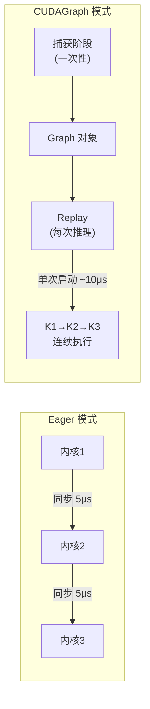
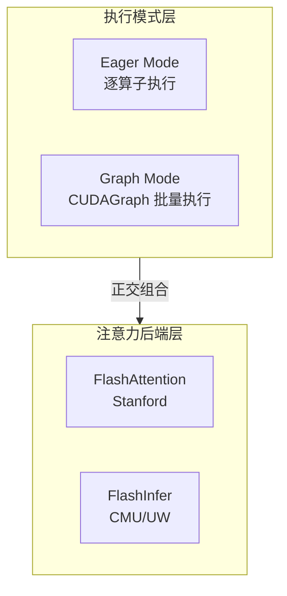
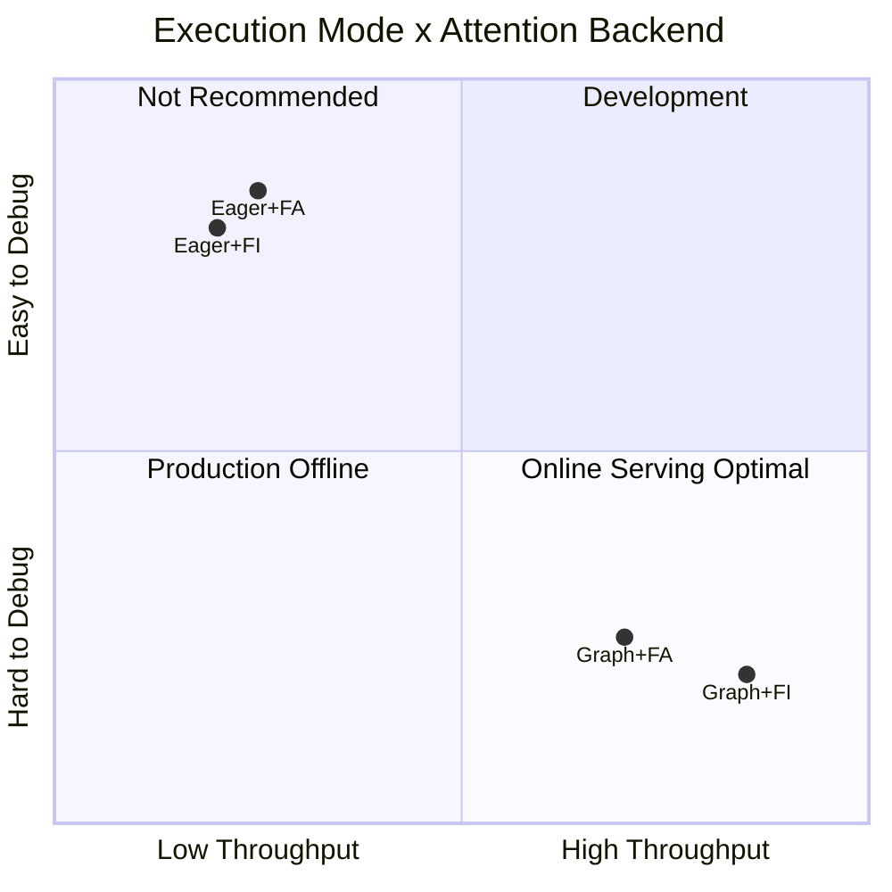

# FlashInfer vs FlashAttention 性能对比测试

> 全面对比 FlashInfer 和 FlashAttention 作为 vLLM 注意力后端在不同 GPU、批量大小、序列长度和执行模式下的性能表现。

## 🎯 核心发现

| 条件 | 胜出 | 差距 | 建议 |
|------|------|------|------|
| **CUDAGraph + 长序列** | FlashInfer | **+9~15%** | 生产部署 |
| CUDAGraph + 短序列 | FlashInfer | +1% | 默认选择 |
| Eager 模式（任何配置） | FlashAttention | +1~7% | 开发调试 |
| 大批量 (128) + Eager | FlashAttention | +11.8% | 批处理 |

**结论**:
- **生产环境（启用 CUDAGraph）**: 使用 FlashInfer（vLLM 默认）- 长序列场景快 **9-15%**
- **开发环境（enforce_eager=True）**: FlashAttention 稍快

### 跨 GPU 验证（鲁棒性）

| 配置 | A100 (Ampere) | RTX 6000 (Blackwell, 3次平均) | 结论 |
|------|--------------|-------------------------------|------|
| 长序列 + CUDAGraph | **FI +15.4%** | **FI +9.3%** | ✅ **一致：FI 胜出** |
| 短序列 + CUDAGraph | FI +1.2% | FI +0.9% | ✅ 一致 |
| 中批量 + CUDAGraph | FI +1.3% | FA +4.1% | ⚠️ 因架构而异 |

---

## 🧠 技术背景

### FlashInfer 和 FlashAttention 是什么？

两者都是 Transformer 模型的优化注意力内核实现：

| 方面 | FlashAttention | FlashInfer |
|------|---------------|------------|
| **来源** | Stanford/Tri Dao | CMU/UW |
| **主要聚焦** | 训练 + 推理 | 推理服务 |
| **核心优化** | IO 感知注意力 | Paged KV cache, CUDAGraph |
| **内存效率** | O(N) 替代 O(N²) | O(N) + 动态批处理 |

### 为什么 CUDAGraph 很重要

#### CPU-GPU 内核启动开销分析

在传统 Eager 执行模式下，每个 CUDA 内核调用都需要完整的启动流程：

| 阶段 | CPU 操作 | GPU 状态 | 开销 |
|------|---------|---------|------|
| 1 | 准备内核参数 | 等待 | ~1μs |
| 2 | 调用 CUDA API | 接收指令 | ~2μs |
| 3 | 同步等待 | 执行内核 | ~2μs |
| **合计** | | | **~5μs/内核** |

**量化影响**：Llama-7B 单次 Decode 涉及 300+ 内核调用，启动开销 = 5μs × 300 = 1.5ms，而实际计算仅需 2-3ms，**启动开销占比 30-40%**。

#### CUDAGraph 工作原理



#### 关键约束条件

| 约束 | 说明 | LLM 推理兼容性 |
|------|------|---------------|
| **静态拓扑** | 计算图结构必须固定 | ✅ Transformer 前向传播拓扑固定 |
| **固定 Shape** | 张量形状在录制时确定 | ⚠️ vLLM 通过分桶处理 |
| **无动态分支** | 禁止 if/while 运行时分支 | ✅ 推理无动态分支 |
| **内存绑定** | 张量地址在图生命周期内固定 | ✅ vLLM 预分配内存池 |

#### 性能收益

| 指标 | Eager 模式 | CUDAGraph | 改善 |
|------|-----------|-----------|------|
| 内核启动 | N 次 × 5μs | 1 次 × 10μs | **N:1** |
| Decode 延迟 | ~4ms | ~1.5ms | **2.5x** |
| GPU 利用率 | 60-70% | 85-95% | +25% |

FlashInfer 专门为 CUDAGraph 捕获进行了优化，这就是为什么启用 CUDAGraph 时它比 FlashAttention 更快。

---

## 🔧 Eager vs Graph 执行模式

### 执行范式对比

| 特性 | Eager 执行 | Graph 执行 |
|------|-----------|-----------|
| **执行时机** | 逐算子即时执行 | 预编译后批量执行 |
| **调试支持** | ✅ 完整堆栈追踪 | ⚠️ 仅图级错误 |
| **动态控制流** | ✅ 支持 if/while | ❌ 不支持 |
| **启动开销** | 高（每算子同步） | 低（整图同步） |

### vLLM 配置

```python
from vllm import LLM

# Graph 模式（默认，生产推荐）
llm = LLM(model="Qwen/Qwen2.5-7B-Instruct")

# Eager 模式（调试时使用）
llm = LLM(model="Qwen/Qwen2.5-7B-Instruct", enforce_eager=True)
```

---

## 🔗 执行模式与注意力后端的组合关系

### 架构分层



**关键概念**：执行模式和注意力后端是**正交维度**，可自由组合。

### 四种组合性能（A100 实测）



| 组合 | 吞吐量 (tok/s) | vs 基准 | 适用场景 |
|------|---------------|---------|----------|
| Eager + FA | 682 | 基准 | 开发调试 |
| Eager + FI | 675 | -1% | 不推荐 |
| Graph + FA | 1,522 | +123% | 生产（离线批处理） |
| **Graph + FI** | **1,757** | **+158%** | **生产（在线服务）** ✅ |

### vLLM 配置示例

```python
import os
from vllm import LLM

# 组合 1: Eager + FA（开发调试）
os.environ["VLLM_ATTENTION_BACKEND"] = "FLASH_ATTN"
llm = LLM(model="Qwen/Qwen2.5-7B-Instruct", enforce_eager=True)

# 组合 2: Graph + FA（生产-离线批处理）
os.environ["VLLM_ATTENTION_BACKEND"] = "FLASH_ATTN"
llm = LLM(model="Qwen/Qwen2.5-7B-Instruct")

# 组合 3: Graph + FI（生产-在线服务）✅ vLLM 默认
llm = LLM(model="Qwen/Qwen2.5-7B-Instruct")
```

---

## 🖥️ 测试环境

### 硬件

| GPU | 架构 | 显存 | 计算能力 |
|-----|------|------|---------|
| NVIDIA H100 NVL | Hopper | 94GB HBM3 | SM90 |
| NVIDIA A100 80GB PCIe | Ampere | 80GB HBM2e | SM80 |
| NVIDIA RTX Pro 6000 | Blackwell | 96GB | SM120 |

### 软件

| 组件 | A100 | RTX 6000 |
|------|------|----------|
| vLLM | 0.10.2 | 0.13.0 |
| FlashInfer | 0.5.3 | 0.6.0rc2 |
| FlashAttention | 2.8.3 | 2.8.3 |
| PyTorch | 2.8.0+cu128 | 2.9.0+cu128 |

### 测试模型

- **模型**: `Qwen/Qwen2.5-0.5B-Instruct`
- **原因**: 小模型以隔离注意力内核性能（避免内存瓶颈）

---

## 📊 测试结果

### 测试 1: 多 GPU 对比（Eager 模式）

**配置**: 128 请求, max_tokens=256, enforce_eager=True, 3 次平均

| GPU | FlashInfer (tok/s) | FlashAttention (tok/s) | 胜出 | 差距 |
|-----|-------------------|----------------------|------|------|
| H100 NVL | 9,893 | 10,334 | FA | +4.5% |
| A100 80GB | 8,780 | 9,260 | FA | +5.5% |
| RTX Pro 6000 | 9,845 | 10,300 | FA | +4.6% |

**结论**: Eager 模式下，FlashAttention 一致领先 4-5%。

### 测试 2: 批量大小扫描（A100, Eager 模式）

**配置**: A100 80GB, enforce_eager=True, 3 次平均

| 批量大小 | FlashInfer (tok/s) | FlashAttention (tok/s) | 胜出 | 差距 |
|----------|-------------------|----------------------|------|------|
| 1 | 72 | 75 | FA | +4.3% |
| 8 | 556 | 557 | FA | +0.2% |
| 32 | 1,978 | 2,015 | FA | +1.9% |
| 128 | 7,014 | 7,949 | FA | +11.8% |

**结论**: Eager 模式下，批量越大 FlashAttention 优势越明显。

### 测试 3: CUDAGraph + 序列长度（A100）

**配置**: A100 80GB, batch=8, 各 1 次

| 配置 | FlashInfer (tok/s) | FlashAttention (tok/s) | 胜出 | 差距 |
|------|-------------------|----------------------|------|------|
| 短序列 (256 tok), Eager | 675 | 682 | FA | +1.1% |
| 短序列 (256 tok), CUDAGraph | 1,647 | 1,628 | **FI** | +1.2% |
| 长序列 (1024 tok), Eager | 663 | 671 | FA | +1.2% |
| **长序列 (1024 tok), CUDAGraph** | **1,757** | **1,522** | **FI** | **+15.4%** |
| 中批量 (32×512), CUDAGraph | 6,176 | 6,095 | **FI** | +1.3% |

**关键发现**: FlashInfer 的优势在启用 CUDAGraph 后显现，尤其是长序列场景下吞吐量高 **15.4%**。

### 测试 4: RTX Pro 6000 鲁棒性测试（3 次平均）

**配置**: RTX Pro 6000 Blackwell, vLLM 0.13.0, FlashInfer 0.6.0rc2, **3 次平均**

| 配置 | FlashInfer (tok/s) | FlashAttention (tok/s) | 胜出 | 差距 |
|------|-------------------|----------------------|------|------|
| 短序列 (256), CUDAGraph | 2,644 | 2,620 | **FI** | +0.9% |
| **长序列 (1024), CUDAGraph** | **2,290** | **2,096** | **FI** | **+9.3%** |
| 中批量 (32×512), CUDAGraph | 8,723 | 9,100 | FA | +4.1% |

<details>
<summary>📈 原始数据（每项 3 次）</summary>

```json
{
  "Short_CUDAGraph": {
    "FLASHINFER": [2600.1, 2696.3, 2636.4],
    "FLASH_ATTN": [2613.1, 2638.4, 2607.6]
  },
  "Long_CUDAGraph": {
    "FLASHINFER": [2407.0, 2110.6, 2352.9],
    "FLASH_ATTN": [2617.1, 1843.0, 1827.6]
  },
  "Medium_CUDAGraph": {
    "FLASHINFER": [8958.7, 8548.1, 8662.2],
    "FLASH_ATTN": [9139.5, 9129.2, 9030.3]
  }
}
```

</details>

**验证**: RTX 6000 (Blackwell 架构) 确认了 A100 的发现 - **FlashInfer 在长序列 + CUDAGraph 场景下快 9.3%**。

---

## 🔬 分析

### 为什么 FlashInfer 在 CUDAGraph 下胜出

1. **优化的图捕获**: FlashInfer 内核专为 CUDAGraph 友好设计
2. **Paged Attention**: 图重放时更好的内存访问模式
3. **内核融合**: 更多操作融合到更少的内核启动中

### 为什么 FlashAttention 在 Eager 模式下胜出

1. **更低的内核启动开销**: FlashAttention 内核可能有稍低的单次启动成本
2. **更简单的执行路径**: 没有图捕获开销

### CUDAGraph 加速倍数

| 配置 | Eager | CUDAGraph | 加速 |
|------|-------|-----------|------|
| FlashInfer (短序列) | 675 | 1,647 | **2.44x** |
| FlashInfer (长序列) | 663 | 1,757 | **2.65x** |
| FlashAttention (短序列) | 682 | 1,628 | 2.39x |
| FlashAttention (长序列) | 671 | 1,522 | 2.27x |

FlashInfer 从 CUDAGraph 获益更多（2.44-2.65x）比 FlashAttention（2.27-2.39x）。

---

## 🚀 快速开始

### 依赖

```bash
pip install vllm>=0.10.2 flashinfer flash-attn
```

### 运行测试

```bash
# 克隆仓库
git clone https://github.com/davidsajare/flashinfer-vs-flashattention-benchmark.git
cd flashinfer-vs-flashattention-benchmark

# 基础对比（eager 模式）
python scripts/benchmark_vllm.py --model Qwen/Qwen2.5-0.5B-Instruct --output results.json

# 批量大小扫描
python scripts/benchmark_batch_sweep.py --quick --output batch_sweep.json

# 高级测试（CUDAGraph + 长序列）
python scripts/benchmark_advanced.py --output advanced.json

# 鲁棒性测试（3 次运行）
python scripts/robust_test.py --output robust.json
```

### 手动设置后端

```bash
# 使用 FlashInfer（vLLM 默认）
export VLLM_ATTENTION_BACKEND=FLASHINFER

# 使用 FlashAttention
export VLLM_ATTENTION_BACKEND=FLASH_ATTN
```

---

## 💡 选型建议

| 使用场景 | 推荐后端 | 原因 |
|----------|---------|------|
| **生产服务** | FlashInfer（默认） | CUDAGraph + 长序列快 9-15% |
| **开发调试** | FlashAttention | Eager 模式稍快 |
| **批量推理任务** | FlashAttention | 大批量 + Eager 更好 |
| **交互式对话** | FlashInfer | CUDAGraph 延迟更低 |

### vLLM 配置示例

```python
from vllm import LLM

# 生产环境（启用 CUDAGraph - 默认）
llm = LLM(model="your-model")  # 默认使用 FlashInfer

# 开发环境（禁用 CUDAGraph 便于调试）
llm = LLM(model="your-model", enforce_eager=True)
# 考虑: export VLLM_ATTENTION_BACKEND=FLASH_ATTN
```

---

## ⚠️ 重要说明

### enforce_eager 的影响

`enforce_eager=True` 会禁用 CUDAGraph，导致：
- 允许更简单的调试（无图捕获问题）
- 允许动态张量形状
- **吞吐量降低 2-2.5 倍**

大多数生产环境测试**不应该**使用 `enforce_eager=True`。

### 版本兼容性

| vLLM 版本 | FlashInfer | FlashAttention | 备注 |
|-----------|------------|----------------|------|
| 0.10.x | 0.5.3 | 2.8.x | A100 测试 |
| 0.12.x | 0.5.3 | 2.8.x | 已测试 |
| 0.13.x | 0.6.0rc2 | 2.8.x | RTX 6000 测试 |

---

## 📁 仓库结构

```
flashinfer-vs-flashattention-benchmark/
├── README.md                      # 英文文档
├── README-CN.md                   # 中文文档
├── scripts/
│   ├── benchmark_vllm.py          # 基础 FI vs FA 对比
│   ├── benchmark_batch_sweep.py   # 批量大小扫描测试
│   ├── benchmark_advanced.py      # CUDAGraph + 长序列测试
│   └── robust_test.py             # 3 次鲁棒性测试
└── results/
    ├── h100_results.json          # H100 测试结果
    ├── a100_results.json          # A100 测试结果
    ├── a100_batch_sweep.json      # 批量扫描结果
    ├── a100_advanced.json         # A100 CUDAGraph 结果
    ├── rtx6000_results.json       # RTX 6000 eager 模式结果
    ├── rtx6000_advanced.json      # RTX 6000 CUDAGraph 结果
    └── rtx6000_robust.json        # RTX 6000 3 次鲁棒性结果
```

---

## 📚 参考资料

- [FlashInfer GitHub](https://github.com/flashinfer-ai/flashinfer)
- [FlashAttention GitHub](https://github.com/Dao-AILab/flash-attention)
- [vLLM 文档](https://docs.vllm.ai/)
- [FlashAttention 论文](https://arxiv.org/abs/2205.14135)
- [FlashInfer 论文](https://arxiv.org/abs/2501.01005)

---

*作者: 魏新宇 (Microsoft AI GBB) | 测试时间: 2026-01-02/03*
