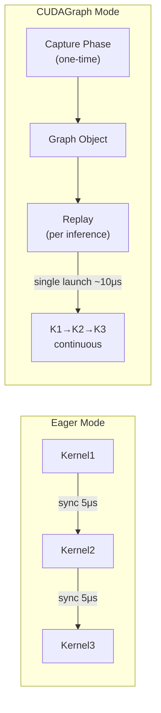
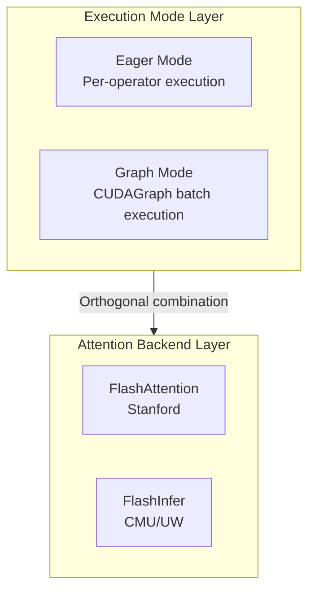
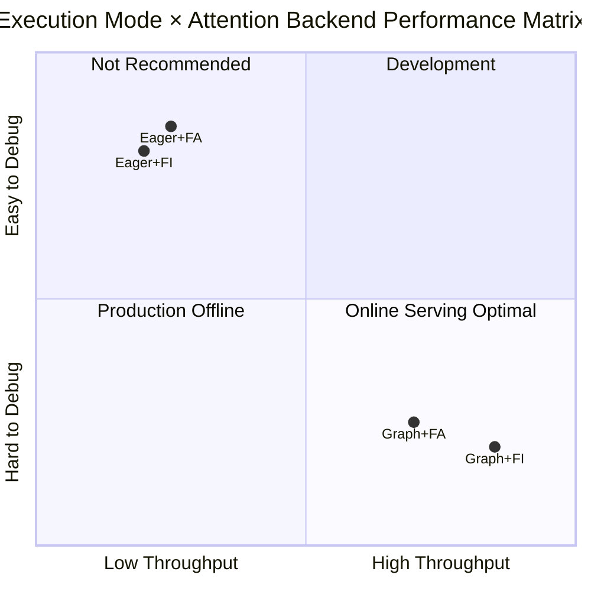

# FlashInfer vs FlashAttention Benchmark

> Comprehensive benchmark comparing FlashInfer and FlashAttention as vLLM attention backends across different GPUs, batch sizes, sequence lengths, and execution modes.

## 🎯 Key Findings

| Condition | Winner | Margin | Recommendation |
|-----------|--------|--------|----------------|
| **CUDAGraph + Long Sequence** | FlashInfer | **+9~15%** | Production serving |
| CUDAGraph + Short Sequence | FlashInfer | +1% | Default choice |
| Eager Mode (any config) | FlashAttention | +1~7% | Development/debugging |
| Large Batch (128) + Eager | FlashAttention | +11.8% | Batch processing |

**Bottom Line**:
- **Production (CUDAGraph enabled)**: Use FlashInfer (vLLM default) - **9-15% faster** on long sequences
- **Development (enforce_eager=True)**: FlashAttention slightly faster

### Cross-GPU Validation (Robustness)

| Config | A100 (Ampere) | RTX 6000 (Blackwell, 3-run avg) | Conclusion |
|--------|--------------|--------------------------------|------------|
| Long seq + CUDAGraph | **FI +15.4%** | **FI +9.3%** | ✅ **Consistent: FI wins** |
| Short seq + CUDAGraph | FI +1.2% | FI +0.9% | ✅ Consistent |
| Medium batch + CUDAGraph | FI +1.3% | FA +4.1% | ⚠️ Varies by arch |

---

## 🧠 Technical Background

### What are FlashInfer and FlashAttention?

Both are optimized attention kernel implementations for transformer models:

| Aspect | FlashAttention | FlashInfer |
|--------|---------------|------------|
| **Origin** | Stanford/Tri Dao | CMU/UW |
| **Primary Focus** | Training + Inference | Inference serving |
| **Key Optimization** | IO-aware attention | Paged KV cache, CUDAGraph |
| **Memory Efficiency** | O(N) instead of O(N²) | O(N) + dynamic batching |

### Why CUDAGraph Matters

#### CPU-GPU Kernel Launch Overhead Analysis

In traditional Eager execution mode, each CUDA kernel call requires the complete launch process:

| Phase | CPU Operation | GPU State | Overhead |
|-------|--------------|-----------|----------|
| 1 | Prepare kernel args | Wait | ~1μs |
| 2 | Call CUDA API | Receive command | ~2μs |
| 3 | Synchronize | Execute kernel | ~2μs |
| **Total** | | | **~5μs/kernel** |

**Quantitative Impact**: Llama-7B single Decode involves 300+ kernel calls, launch overhead = 5μs × 300 = 1.5ms, while actual computation only takes 2-3ms, **launch overhead accounts for 30-40%**.

#### CUDAGraph Working Principle



#### Key Constraints

| Constraint | Description | LLM Inference Compatibility |
|------------|-------------|----------------------------|
| **Static Topology** | Compute graph structure must be fixed | ✅ Transformer forward pass is fixed |
| **Fixed Shape** | Tensor shapes determined at capture | ⚠️ vLLM handles via bucketing |
| **No Dynamic Branches** | No if/while runtime branches | ✅ No dynamic branches in inference |
| **Memory Binding** | Tensor addresses fixed during graph lifetime | ✅ vLLM pre-allocates memory pools |

#### Performance Benefits

| Metric | Eager Mode | CUDAGraph | Improvement |
|--------|-----------|-----------|-------------|
| Kernel launches | N × 5μs | 1 × 10μs | **N:1** |
| Decode latency | ~4ms | ~1.5ms | **2.5x** |
| GPU utilization | 60-70% | 85-95% | +25% |

FlashInfer is specifically optimized for CUDAGraph capture, which is why it outperforms FlashAttention when CUDAGraph is enabled.

---

## 🔧 Eager vs Graph Execution Modes

### Execution Paradigm Comparison

| Feature | Eager Execution | Graph Execution |
|---------|----------------|-----------------|
| **Timing** | Per-operator immediate | Pre-compiled batch |
| **Debug Support** | ✅ Full stack trace | ⚠️ Graph-level errors only |
| **Dynamic Control Flow** | ✅ Supports if/while | ❌ Not supported |
| **Launch Overhead** | High (per-op sync) | Low (graph-level sync) |

### vLLM Configuration

```python
from vllm import LLM

# Graph mode (default, recommended for production)
llm = LLM(model="Qwen/Qwen2.5-7B-Instruct")

# Eager mode (for debugging)
llm = LLM(model="Qwen/Qwen2.5-7B-Instruct", enforce_eager=True)
```

---

## 🔗 Execution Mode and Attention Backend Combinations

### Architecture Layers



**Key Concept**: Execution mode and attention backend are **orthogonal dimensions** that can be freely combined.

### Four Combinations Performance (A100 Measured)



| Combination | Throughput (tok/s) | vs Baseline | Use Case |
|-------------|-------------------|-------------|----------|
| Eager + FA | 682 | Baseline | Development |
| Eager + FI | 675 | -1% | Not recommended |
| Graph + FA | 1,522 | +123% | Production (batch offline) |
| **Graph + FI** | **1,757** | **+158%** | **Production (online serving)** ✅ |

### vLLM Configuration Examples

```python
import os
from vllm import LLM

# Combination 1: Eager + FA (Development)
os.environ["VLLM_ATTENTION_BACKEND"] = "FLASH_ATTN"
llm = LLM(model="Qwen/Qwen2.5-7B-Instruct", enforce_eager=True)

# Combination 2: Graph + FA (Production - batch offline)
os.environ["VLLM_ATTENTION_BACKEND"] = "FLASH_ATTN"
llm = LLM(model="Qwen/Qwen2.5-7B-Instruct")

# Combination 3: Graph + FI (Production - online serving) ✅ vLLM default
llm = LLM(model="Qwen/Qwen2.5-7B-Instruct")
```

---

## 🖥️ Test Environment

### Hardware

| GPU | Architecture | Memory | Compute Capability |
|-----|--------------|--------|-------------------|
| NVIDIA H100 NVL | Hopper | 94GB HBM3 | SM90 |
| NVIDIA A100 80GB PCIe | Ampere | 80GB HBM2e | SM80 |
| NVIDIA RTX Pro 6000 | Blackwell | 96GB | SM120 |

### Software

| Component | A100 | RTX 6000 |
|-----------|------|----------|
| vLLM | 0.10.2 | 0.13.0 |
| FlashInfer | 0.5.3 | 0.6.0rc2 |
| FlashAttention | 2.8.3 | 2.8.3 |
| PyTorch | 2.8.0+cu128 | 2.9.0+cu128 |

### Test Model

- **Model**: `Qwen/Qwen2.5-0.5B-Instruct`
- **Reason**: Small model to isolate attention kernel performance (not memory-bound)

---

## 📊 Benchmark Results

### Test 1: Multi-GPU Comparison (Eager Mode)

**Config**: 128 requests, max_tokens=256, enforce_eager=True, 3 runs averaged

| GPU | FlashInfer (tok/s) | FlashAttention (tok/s) | Winner | Margin |
|-----|-------------------|----------------------|--------|--------|
| H100 NVL | 9,893 | 10,334 | FA | +4.5% |
| A100 80GB | 8,780 | 9,260 | FA | +5.5% |
| RTX Pro 6000 | 9,845 | 10,300 | FA | +4.6% |

**Conclusion**: In eager mode, FlashAttention consistently wins by 4-5%.

### Test 2: Batch Size Sweep (A100, Eager Mode)

**Config**: A100 80GB, enforce_eager=True, 3 runs averaged

| Batch Size | FlashInfer (tok/s) | FlashAttention (tok/s) | Winner | Margin |
|------------|-------------------|----------------------|--------|--------|
| 1 | 72 | 75 | FA | +4.3% |
| 8 | 556 | 557 | FA | +0.2% |
| 32 | 1,978 | 2,015 | FA | +1.9% |
| 128 | 7,014 | 7,949 | FA | +11.8% |

**Conclusion**: FlashAttention advantage grows with batch size in eager mode.

### Test 3: CUDAGraph + Sequence Length (A100)

**Config**: A100 80GB, batch=8, 1 run each

| Config | FlashInfer (tok/s) | FlashAttention (tok/s) | Winner | Margin |
|--------|-------------------|----------------------|--------|--------|
| Short (256 tok), Eager | 675 | 682 | FA | +1.1% |
| Short (256 tok), CUDAGraph | 1,647 | 1,628 | **FI** | +1.2% |
| Long (1024 tok), Eager | 663 | 671 | FA | +1.2% |
| **Long (1024 tok), CUDAGraph** | **1,757** | **1,522** | **FI** | **+15.4%** |
| Medium Batch (32×512), CUDAGraph | 6,176 | 6,095 | **FI** | +1.3% |

**Key Insight**: FlashInfer's advantage emerges with CUDAGraph enabled, especially for long sequences where it achieves **15.4% higher throughput**.

### Test 4: RTX Pro 6000 Robustness Test (3-run Average)

**Config**: RTX Pro 6000 Blackwell, vLLM 0.13.0, FlashInfer 0.6.0rc2, **3 runs averaged**

| Config | FlashInfer (tok/s) | FlashAttention (tok/s) | Winner | Margin |
|--------|-------------------|----------------------|--------|--------|
| Short seq (256), CUDAGraph | 2,644 | 2,620 | **FI** | +0.9% |
| **Long seq (1024), CUDAGraph** | **2,290** | **2,096** | **FI** | **+9.3%** |
| Medium batch (32×512), CUDAGraph | 8,723 | 9,100 | FA | +4.1% |

<details>
<summary>📈 Raw data (3 runs each)</summary>

```json
{
  "Short_CUDAGraph": {
    "FLASHINFER": [2600.1, 2696.3, 2636.4],
    "FLASH_ATTN": [2613.1, 2638.4, 2607.6]
  },
  "Long_CUDAGraph": {
    "FLASHINFER": [2407.0, 2110.6, 2352.9],
    "FLASH_ATTN": [2617.1, 1843.0, 1827.6]
  },
  "Medium_CUDAGraph": {
    "FLASHINFER": [8958.7, 8548.1, 8662.2],
    "FLASH_ATTN": [9139.5, 9129.2, 9030.3]
  }
}
```

</details>

**Validation**: The RTX 6000 (Blackwell architecture) confirms the A100 finding - **FlashInfer wins by 9.3% on long sequences with CUDAGraph**.

---

## 🔬 Analysis

### Why FlashInfer Wins with CUDAGraph

1. **Optimized Graph Capture**: FlashInfer kernels are designed to be CUDAGraph-friendly
2. **Paged Attention**: Better memory access patterns during graph replay
3. **Kernel Fusion**: More operations fused into fewer kernel launches

### Why FlashAttention Wins in Eager Mode

1. **Lower Kernel Launch Overhead**: FlashAttention kernels may have slightly lower per-launch cost
2. **Simpler Execution Path**: Without graph capture overhead

### CUDAGraph Speedup Factor

| Config | Eager | CUDAGraph | Speedup |
|--------|-------|-----------|---------|
| FlashInfer (short) | 675 | 1,647 | **2.44x** |
| FlashInfer (long) | 663 | 1,757 | **2.65x** |
| FlashAttention (short) | 682 | 1,628 | 2.39x |
| FlashAttention (long) | 671 | 1,522 | 2.27x |

FlashInfer benefits more from CUDAGraph (2.44-2.65x) than FlashAttention (2.27-2.39x).

---

## 🚀 Quick Start

### Requirements

```bash
pip install vllm>=0.10.2 flashinfer flash-attn
```

### Run Benchmark

```bash
# Clone repo
git clone https://github.com/davidsajare/flashinfer-vs-flashattention-benchmark.git
cd flashinfer-vs-flashattention-benchmark

# Basic comparison (eager mode)
python scripts/benchmark_vllm.py --model Qwen/Qwen2.5-0.5B-Instruct --output results.json

# Batch size sweep
python scripts/benchmark_batch_sweep.py --quick --output batch_sweep.json

# Advanced test (CUDAGraph + long sequence)
python scripts/benchmark_advanced.py --output advanced.json

# Robustness test (3 runs)
python scripts/robust_test.py --output robust.json
```

### Set Backend Manually

```bash
# Use FlashInfer (default in vLLM)
export VLLM_ATTENTION_BACKEND=FLASHINFER

# Use FlashAttention
export VLLM_ATTENTION_BACKEND=FLASH_ATTN
```

---

## 💡 Recommendations

| Use Case | Recommended Backend | Reason |
|----------|---------------------|--------|
| **Production serving** | FlashInfer (default) | +9-15% with CUDAGraph + long seq |
| **Development/debugging** | FlashAttention | Slightly faster in eager mode |
| **Batch inference jobs** | FlashAttention | Better at large batch + eager |
| **Interactive chat** | FlashInfer | Better latency with CUDAGraph |

### vLLM Configuration

```python
from vllm import LLM

# Production (CUDAGraph enabled - default)
llm = LLM(model="your-model")  # Uses FlashInfer by default

# Development (disable CUDAGraph for debugging)
llm = LLM(model="your-model", enforce_eager=True)
# Consider: export VLLM_ATTENTION_BACKEND=FLASH_ATTN
```

---

## ⚠️ Important Notes

### enforce_eager Impact

The `enforce_eager=True` flag disables CUDAGraph, which:
- Allows easier debugging (no graph capture issues)
- Enables dynamic tensor shapes
- **Reduces throughput by 2-2.5x**

Most production benchmarks should **NOT** use `enforce_eager=True`.

### Version Compatibility

| vLLM Version | FlashInfer | FlashAttention | Notes |
|--------------|------------|----------------|-------|
| 0.10.x | 0.5.3 | 2.8.x | Tested on A100 |
| 0.12.x | 0.5.3 | 2.8.x | Tested |
| 0.13.x | 0.6.0rc2 | 2.8.x | Tested on RTX 6000 |

---

## 📁 Repository Structure

```
flashinfer-vs-flashattention-benchmark/
├── README.md                      # English documentation
├── README-CN.md                   # Chinese documentation
├── scripts/
│   ├── benchmark_vllm.py          # Basic FI vs FA comparison
│   ├── benchmark_batch_sweep.py   # Batch size sweep test
│   ├── benchmark_advanced.py      # CUDAGraph + long sequence test
│   └── robust_test.py             # 3-run robustness test
└── results/
    ├── h100_results.json          # H100 test results
    ├── a100_results.json          # A100 test results
    ├── a100_batch_sweep.json      # Batch sweep results
    ├── a100_advanced.json         # A100 CUDAGraph results
    ├── rtx6000_results.json       # RTX 6000 eager mode results
    ├── rtx6000_advanced.json      # RTX 6000 CUDAGraph results
    └── rtx6000_robust.json        # RTX 6000 3-run robustness results
```

---

## 📚 References

- [FlashInfer GitHub](https://github.com/flashinfer-ai/flashinfer)
- [FlashAttention GitHub](https://github.com/Dao-AILab/flash-attention)
- [vLLM Documentation](https://docs.vllm.ai/)
- [FlashAttention Paper](https://arxiv.org/abs/2205.14135)
- [FlashInfer Paper](https://arxiv.org/abs/2501.01005)

---

*Author: Xinyu Wei (Microsoft AI GBB) | Tested: 2026-01-02/03*
