# Foundry Agent Post-Training: From Distillation to Reinforcement Learning

[](https://learn.microsoft.com/azure/ai-foundry/)
[](https://build.microsoft.com)
[](https://github.com/microsoft/Build26-BRK232-train-and-deploy-custom-oss-reasoning-models-with-foundry)
[](#the-three-layer-training-system)

A systematic technical breakdown of the agent post-training pipeline announced at Microsoft Build 2026 — covering distillation, supervised fine-tuning (SFT), reinforcement fine-tuning (RFT), and the new Foundry Low-Level Training API. Based on sessions BRK231 and BRK232. **Result: Qwen3-32B achieves 86.9% retail_quality at ~$0.50/M tokens — surpassing GPT-5.4 (65% at $15/M).**

> **Author**: Xinyu Wei (魏新宇) — Microsoft AI GBB

[中文版](README-CN.md) | English | [Official BRK232 Code Repo](https://github.com/microsoft/Build26-BRK232-train-and-deploy-custom-oss-reasoning-models-with-foundry) (Microsoft)

---

## Why This Matters

Agents consume **20–30x more tokens per turn** than traditional chat interactions. When a third of enterprise apps plan to embed agentic AI within two years, the cost equation breaks. Fine-tuning is **10x more cost-efficient** than using generic frontier models:

<div align="center">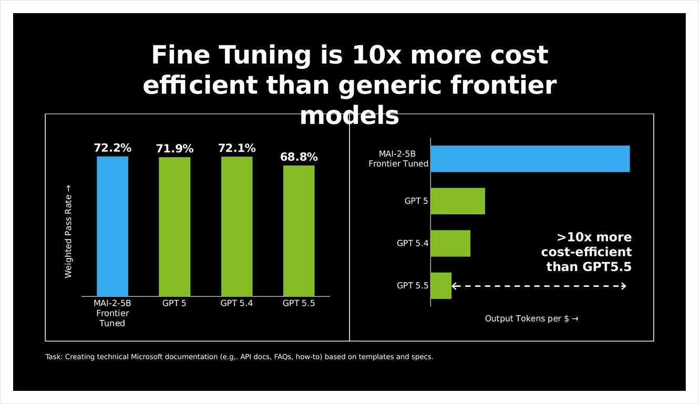</div>

> Source: BRK232 Slide 3 — MAI-2-5B Frontier Tuned achieves comparable quality to GPT-5.x at >10x cost efficiency (95 output tokens/$ vs 10–26). Task: creating technical Microsoft documentation.

| Dimension | Before (Frontier Model) | After (Fine-Tuned Small Model) |
|:----------|:----------------------|:------------------------------|
| **Cost** | GPT-5.4 @ $15/M tokens | GPT-4.1 mini fine-tuned @ ~$0.50/M |
| **Latency** | 2–6 seconds per turn | Sub-second streaming |
| **Quality** | 65–74% task accuracy | **84–87% task accuracy** (surpasses frontier) |
| **IP** | Your domain knowledge trains the frontier lab's weights | Your IP stays in your custom model |

> "Agents helped us make this slide deck. Agents helped us make this demo. Half of teams already have some kind of production agent today. The problem: agents consume 20 to 30 times more tokens per turn."
> — Alicia Frame, Product Lead for Model Customization, Microsoft Foundry ([BRK231](https://build.microsoft.com/en-US/sessions/BRK231))

---

## Table of Contents

- [The Optimization Journey](#the-optimization-journey)
- [The Three-Layer Training System](#the-three-layer-training-system)
- [Layer 1: Distillation + SFT — Learning by Copying](#layer-1-distillation--sft--learning-by-copying)
- [Layer 2: Reinforcement Fine-Tuning (RFT) — Learning from Mistakes](#layer-2-reinforcement-fine-tuning-rft--learning-from-mistakes)
- [Layer 3: Low-Level Training API — Full Algorithm Control](#layer-3-low-level-training-api--full-algorithm-control)
- [The Economics: Walking Through the Numbers](#the-economics-walking-through-the-numbers)
- [The Leaderboard: Quality Progression](#the-leaderboard-quality-progression)
- [Real-World Production Deployments](#real-world-production-deployments)
- [Coding Agents for Fine-Tuning](#coding-agents-for-fine-tuning)
- [When to Use What](#when-to-use-what)
- [From Training to Deployment](#from-training-to-deployment)
- [Getting Started](#getting-started)
- [Key Resources](#key-resources)
- [Running on Azure](#running-on-azure)
- [Related Repos](#related-repos)
- [Key Technologies Deep Dive](#key-technologies-deep-dive)
- [Official Repo Walkthrough](#official-repo-walkthrough)
- [Cross-Session Analysis](#cross-session-analysis-training-vs-serving-vs-agent-operations)
- [The Continuous Improvement Playbook](#the-continuous-improvement-playbook)

---

## The Optimization Journey

Before fine-tuning enters the picture, agent optimization follows a natural progression in Foundry — from prompting to context management to tools to fine-tuning:

<div align="center">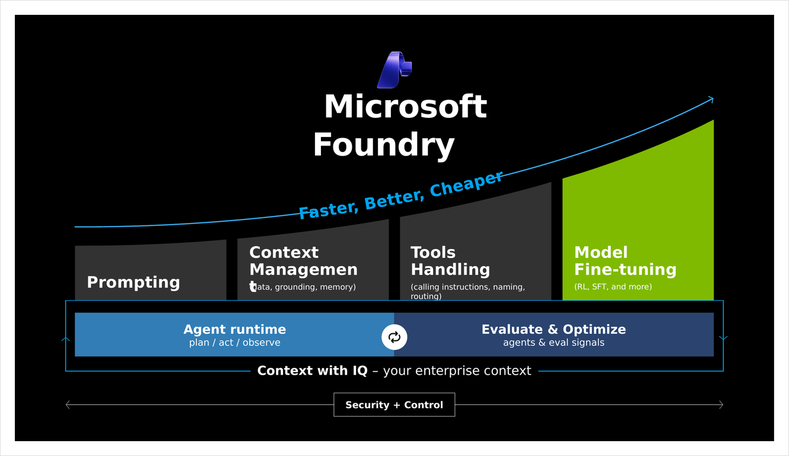</div>

> Source: BRK232 Slide 5 — "Faster, Better, Cheaper" optimization stack. Bottom to top: Prompting → Context Management (data, grounding, memory) → Tools Handling (calling instructions, naming, routing) → **Model Fine-tuning** (RL, SFT, and more). The Agent runtime (plan/act/observe) sits on top, with Evaluate & Optimize as the feedback loop.

Fine-tuning is **not the first thing you reach for** — it's the optimization step after your agent is functionally correct but economically unviable or too slow.

> "We've been working on fine-tuning for a while, and I feel like people are finally starting to listen. About half of developers say that they want to replace their out-of-the-box models with fine-tuning."
> — Alicia Frame ([BRK231](https://build.microsoft.com/en-US/sessions/BRK231))

---

## The Three-Layer Training System

Build 2026 revealed three distinct entry points for model customization in Foundry — from "I just want to click a button" to "give me the raw gradient API":

<div align="center">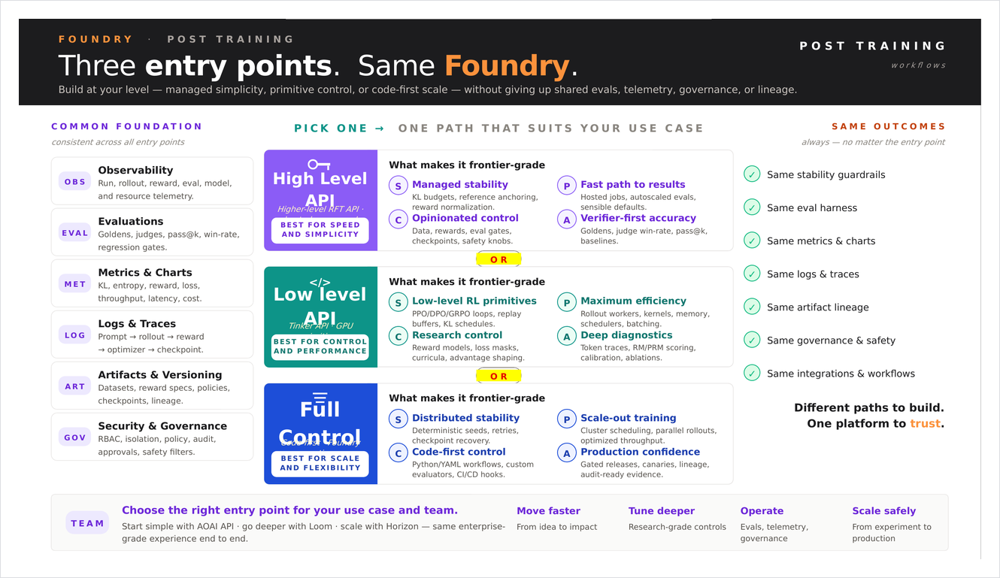</div>

> Source: BRK232 Slide 20 — "Three entry points. Same Foundry." High-Level API (managed fine-tuning, one-click SFT/RFT), Low-Level API (`create_session` / `sample` / `train`), and Full Control (bring your own framework, Ray/DeepSpeed/custom).

The progression from simple distillation to full algorithmic control follows a clear cost-quality-effort curve:

<div align="center">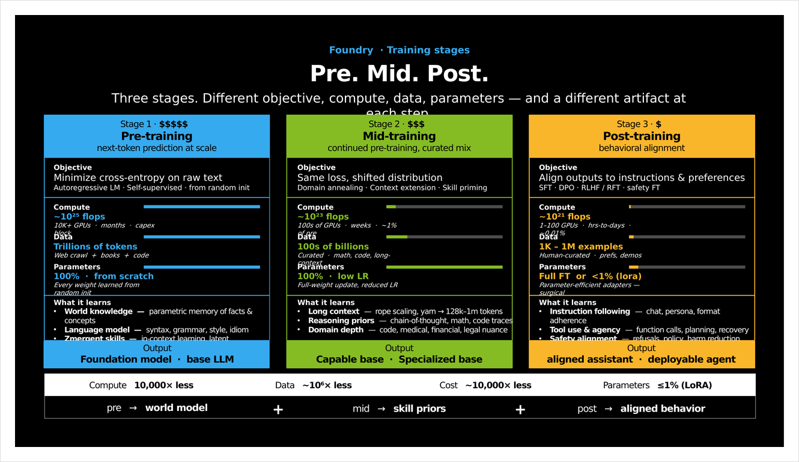</div>

> Source: BRK232 Slide 16 — "Pre. Mid. Post." Pre-training ($$$$$, months) creates the base model. Mid-training ($$$, weeks) adds domain capabilities. Post-training ($, hours) aligns outputs to instructions and preferences using SFT, DPO, RLHF, or RFT.

| Layer | Effort | Control | Who It's For | Key API |
|:------|:------:|:-------:|:-------------|:--------|
| **1. Managed SFT** | Low | Low | Any developer | Foundry UI or SDK |
| **2. RFT** | Medium | Medium | ML engineers | Foundry SDK + custom graders |
| **3. Low-Level API** | High | Full | AI scientists | `client.sample()` + `client.train()` |

> SFT: "Don't reward what wins. **Teach what to do.**"
> RFT: "Don't teach what to do. **Reward what wins.**"
> — BRK232 Slides, Chris Lauren

### Training Execution Models: Who Manages the GPUs?

The three training *methods* (SFT, RFT, Low-Level API) are separate from the three *execution modes* that determine where GPU compute comes from. RFT, for example, can run via either the managed path or the code-first path:

| Execution Mode | GPU Compute Source | User Provisions Cluster? | On-Stage Evidence |
|:---------------|:-------------------|:------------------------:|:------------------|
| **Managed Fine-Tuning** (Layers 1–2) | Foundry-managed | No | "fire and forget" — BRK232 transcript |
| **Code-First / Ray / SLIME** (Layer 2 advanced) | User's own Azure GPU quota (e.g., 4× ND96 H100) | Yes — cluster provisioning, Ray, networking | "expert heavy-duty work" — BRK232 transcript |
| **Low-Level Training API** (Layer 3) | Foundry-managed | No — "no cluster, no nothing" | "the server manages all the infra" — BRK232 transcript |

The BRK232 session explicitly distinguished the latter two execution models. For the Code-First path, the speaker described provisioning clusters, managing Ray, and debugging network topology as "expert heavy-duty work." For the Low-Level Training API, the speaker emphasized: *"The previous one you need to have GPUs. Everybody may not have GPUs but everybody has a laptop."*

> **Evidence boundary**: The public Build transcript proves that Foundry manages the GPU cluster for the Low-Level Training API path. It does not expose the exact underlying capacity source or quota model.

The slide below shows the four categories of additional control available when the managed pipeline isn't enough — custom rewards, custom rollout environments, custom data curation, and full hyperparameter control:

<div align="center">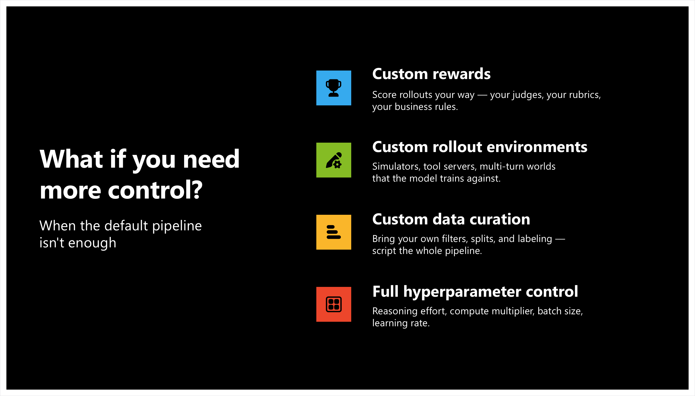</div>

> Source: BRK232 Slide 23 — "What if you need more control?" Four dimensions: custom rewards (your judges, rubrics, business rules), custom rollout environments (simulators, tool servers, multi-turn worlds), custom data curation (your filters, splits, labeling), and full hyperparameter control (reasoning effort, compute multiplier, batch size, learning rate).

> **Note on acronyms**: SFT = Supervised Fine-Tuning. RFT = Reinforcement Fine-Tuning. GRPO = Group Relative Policy Optimization. SLIME = Scalable Language Model Inference and Multi-Environment training. SGLang = a high-throughput serving/inference engine. TRL = Transformer Reinforcement Learning (Hugging Face library).

The rest of this document walks through each layer with concrete examples — using the same retail return scenario (a customer service agent processing refunds) that both sessions used on stage.

---

## Layer 1: Distillation + SFT — Learning by Copying

### How It Works

Distillation takes a large, smart "teacher" model (e.g., GPT-5.4) and uses its production traces to train a smaller, cheaper "student" model.

```
Production Agent (GPT-5.4)
         │
         ▼
    Capture Traces
    (1,000+ conversations with tool calls)
         │
         ▼
    Foundry auto-curates:
    • Remove duplicates
    • Filter non-interesting conversations  
    • Redact PII
         │
         ▼
    Supervised Fine-Tuning
    (Student: GPT-4.1 mini or nano)
         │
         ▼
    Fine-tuned model deployed
    (Same quality, fraction of cost)
```

### The Trace-to-Training Pipeline

The on-stage demo showed the complete SFT → RFT submission pipeline in a single VS Code notebook — dataset configuration, compute selection, and job chaining all in Python:

<div align="center">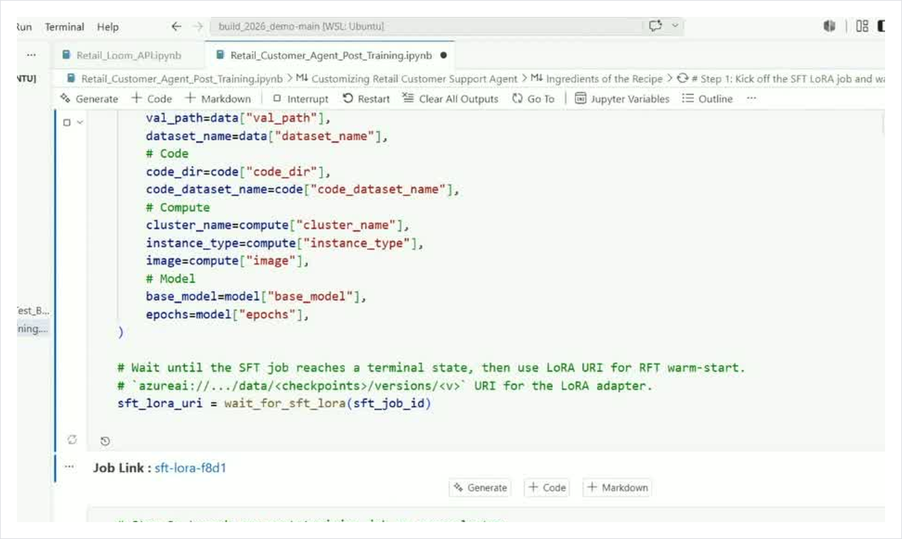</div>

> Source: BRK232 on-stage demo — SFT job submission (top) chains into RFT job submission (bottom) via `wait_for_sft_lora()`. [Watch session](https://build.microsoft.com/en-US/sessions/BRK232)

What makes Foundry's approach unique is the **trace → dataset → training** pipeline is integrated end-to-end:

1. **Hosted Agents capture traces automatically** — every tool call, every response, every trajectory is logged
2. **"Create Dataset" button** converts raw traces into training-ready datasets — the Foundry UI shows the three usage choices (Evaluation / SFT / RFT) and lets you filter by date range and sample count:

<div align="center">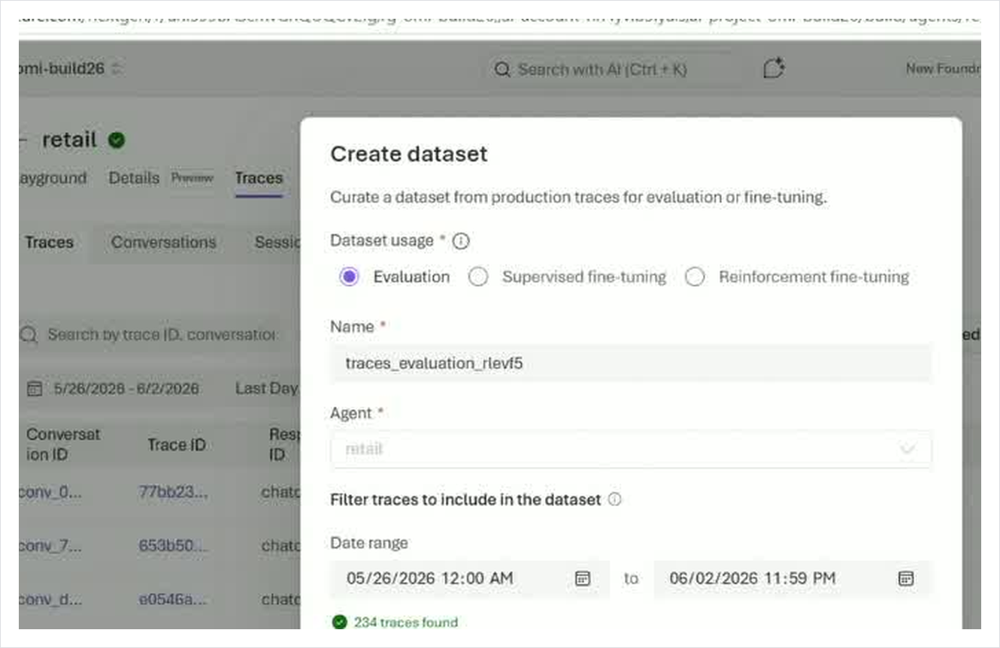</div>

> Source: BRK231 on-stage demo — Foundry Portal "Create dataset" modal on the Agent Traces blade. 234 traces found in the 2026-05-26 to 2026-06-02 window. Dataset usage choices: Evaluation, Supervised fine-tuning, or Reinforcement fine-tuning. [Watch session](https://build.microsoft.com/en-US/sessions/BRK231)

3. **One-click SFT** from the Foundry UI — select model, select tier, start training

### Training Tiers and Cost

| Tier | Cost | Speed | Data Residency | Use Case |
|:-----|:-----|:------|:--------------|:---------|
| **Developer Preview** | **50% off** (spot VMs) | Slower | — | Experimentation |
| **Standard** | Full price | Fast | — | Production |
| **Data Zone** | Full price | Fast | US residency guaranteed | Regulated industries |

> "The median supervised fine-tuning job on our platform costs about a dollar. It's not super expensive."
> — Alicia Frame ([BRK231](https://build.microsoft.com/en-US/sessions/BRK231))

### SFT Ceiling

Distillation can never exceed the teacher's quality. If your teacher model scores 74%, your distilled student will approach but not surpass that ceiling. This is where Layer 2 comes in.

The BRK232 slide illustrates the SFT mechanism using the retail demo scenario — Mark's polo return. One ticket, one expert-written response, the model imitates it token by token:

<div align="center">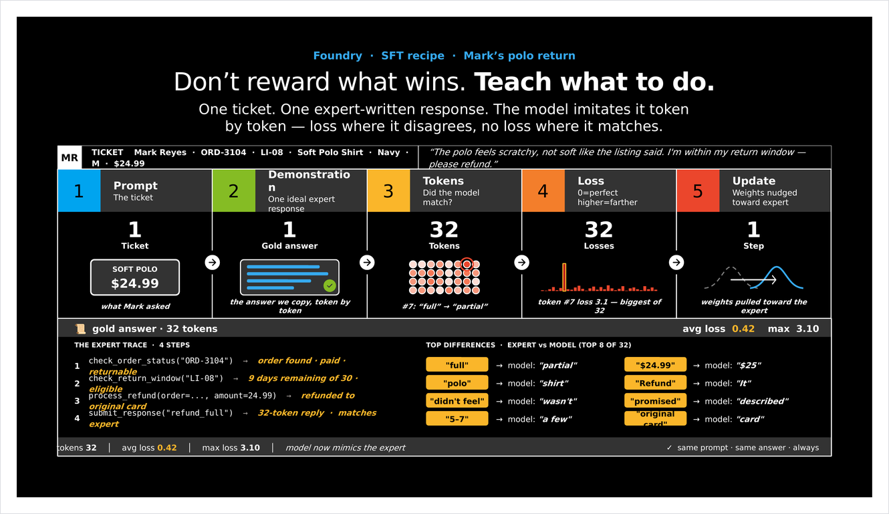</div>

> Source: BRK232 Slide 18 — "Don't reward what wins. Teach what to do." The expert trace calls 4 tools in order (`check_order_status` → `check_return_window` → `process_refund` → `submit_response`). The model's 32 tokens are compared token-by-token against the gold answer. Token #7: expert says "full", model says "partial" — loss 3.10 (highest of 32). Average loss 0.42. Weights are nudged toward the expert.

---

## Layer 2: Reinforcement Fine-Tuning (RFT) — Learning from Mistakes

RFT uses a fundamentally different data model than SFT. The official BRK232 slide shows the full spectrum — any data source can drive any behavior:

<div align="center">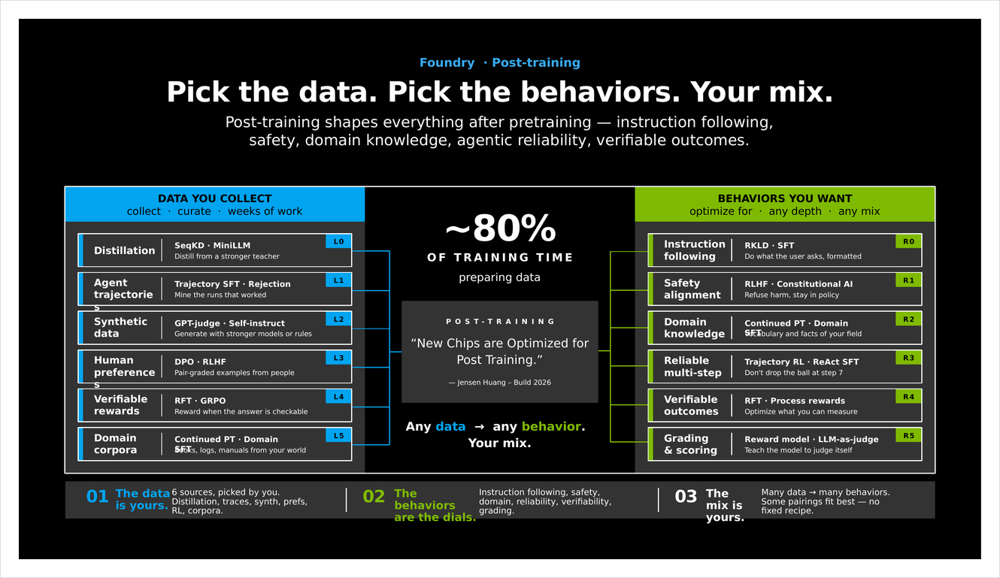</div>

> Source: BRK232 Slide 17 — "Pick the data. Pick the behaviors." Left: data sources (traces, synthetic data, human labels, model-generated rollouts, tool outputs, reward signals). Right: target behaviors (instruction following, tool calling, reasoning chains, style/format, safety alignment, domain expertise). Any combination is valid.

### The Key Difference

In SFT, the model copies the teacher's answers. In RFT, the model **learns from its own mistakes**. The BRK232 slide makes this vivid — same ticket (Mark's polo return), completely different learning mechanism:

<div align="center">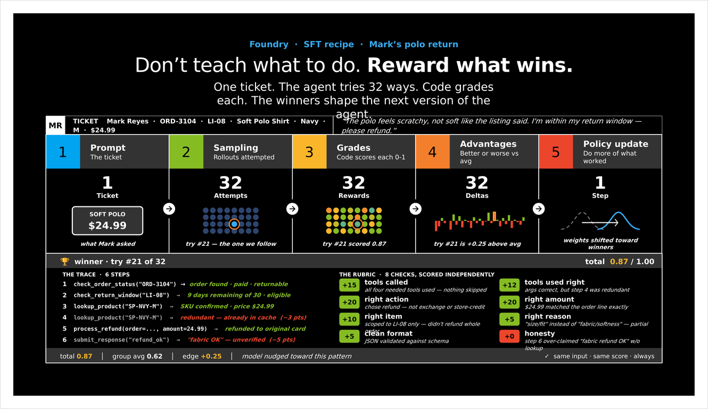</div>

> Source: BRK232 Slide 19 — "Don't teach what to do. Reward what wins." Same ticket, but now the agent tries 32 ways. Try #21 scores 0.87 (winner): 6 tool calls, 8 rubric checks (tools called +15, right action +20, right item +10, clean format +5, tools used right +12, right amount +20, right reason +5, honesty +0). Step 4 was redundant (-3 pts), step 6 over-claimed (-5 pts). The model is nudged toward this pattern.

```
SFT:  Teacher says "call tool A, then B, then C"
      → Student memorizes: "A → B → C"
      → Can't improve beyond teacher

RFT:  Model tries calling tools on its own
      → Grader: "That was 40% correct"  
      → Model: "Let me try differently"
      → Grader: "That was 85% correct"
      → Model learns the better strategy
```

### The Rollout-Grade-Reinforce Loop

For each prompt, the model generates **multiple sample responses** (rollouts). The grader scores them. The training process reinforces the patterns that led to high-scoring responses and discourages the patterns behind low-scoring ones.

<div align="center">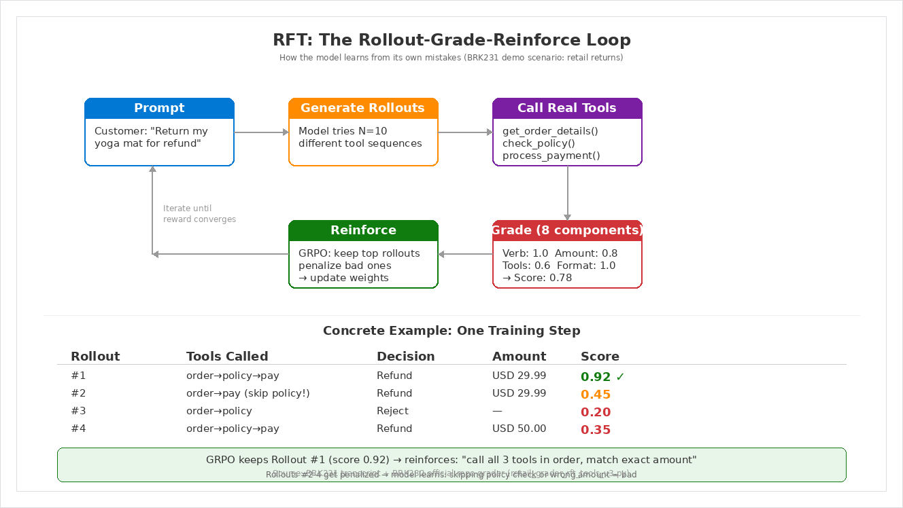</div>

> Source: Flow synthesized from BRK231 transcript. Concrete example uses the same retail return grader from BRK232's [`retail_grader_rft_tools_v3.py`](https://github.com/microsoft/Build26-BRK232-train-and-deploy-custom-oss-reasoning-models-with-foundry/blob/main/src/post-training-recipe/demo-artifacts/code/retail_grader_rft_tools_v3.py).

During the live demo, the **Foundry Rollout Browser** showed training reward trending upward across 20 rollouts — with drill-down into individual prompts, per-sample scores, and side-by-side answer comparison:

<div align="center">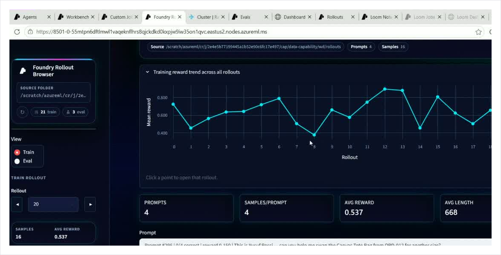</div>

> Source: BRK232 on-stage demo — Streamlit Rollout Browser running as a Foundry job service on port 8501. Shows reward curve, prompt-level breakdown, and conversation trace viewer.

The evaluation results in Foundry Portal confirmed the trained model's quality — `retail_quality` scores hitting 0.990 across test scenarios:

<div align="center">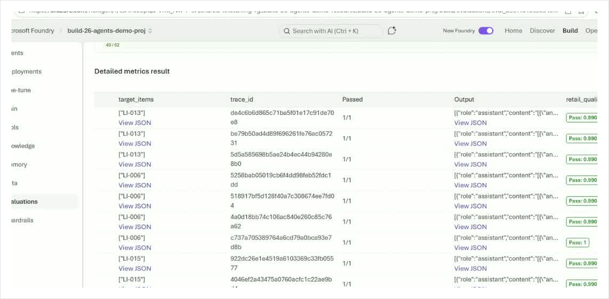</div>

> Source: BRK232 on-stage demo — Foundry Evaluations blade showing per-trace `retail_quality` scores for the fine-tuned model. 49/50 scenarios passed at 0.990+.

Let's walk through one training step with a concrete example. The customer asks: *"I want to return my yoga mat for a refund."* The model generates 4 rollouts, each trying different tool-calling strategies:

| Rollout | Tools Called | Decision | Amount | Score | Why |
|:--------|:-----------|:---------|:------:|:-----:|:----|
| #1 | order → policy → payment | Refund | $29.99 | **0.92** ✅ | All tools called in order, correct amount |
| #2 | order → payment (skipped policy!) | Refund | $29.99 | 0.45 | Right answer but skipped policy check |
| #3 | order → policy | Reject | — | 0.20 | Wrong decision — item is returnable |
| #4 | order → policy → payment | Refund | $50.00 | 0.35 | Right tools but wrong amount |

**GRPO** (Group Relative Policy Optimization) keeps Rollout #1 and uses it to reinforce the pattern: "call all three tools in the correct order, match the exact refund amount." Rollouts #2–4 get penalized, teaching the model that skipping policy checks or returning wrong amounts leads to low scores.

Over hundreds of training steps, the model internalizes these patterns — and can eventually handle edge cases the teacher model never encountered.

### Grader Design: The Make-or-Break Factor

The quality of your grader **determines whether RFT works**. The BRK232 slide makes this explicit — the eval IS the product spec:

<div align="center">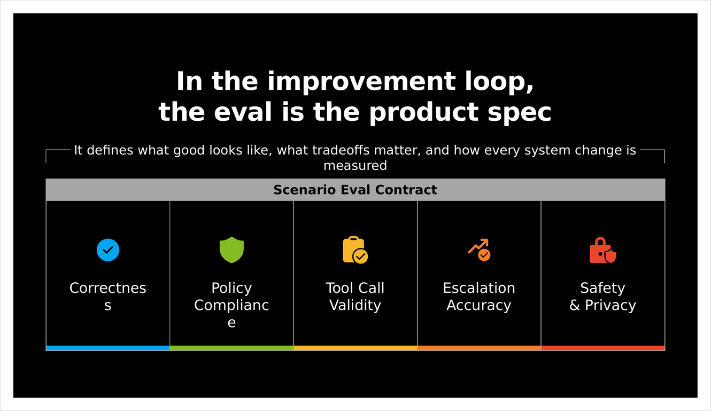</div>

> Source: BRK232 Slide 9 — "In the improvement loop, the eval is the product spec." The Scenario Eval Contract defines five dimensions: what the scenario tests, how an evaluator measures quality, what the rubric defines as "good," what scenarios exist in the dataset, and the minimum pass threshold.

The BRK232 demo used an 8-component weighted grader for the retail return scenario:

| Component | Weight | What It Checks |
|:----------|:------:|:--------------|
| Verb accuracy | High | Correct action (refund vs reject) |
| Item accuracy | Medium | Correct item identified |
| Reason quality | Medium | Appropriate justification |
| Format compliance | 20% | Downstream-compatible output format |
| Amount accuracy | High | Dollar amount within tolerance |
| Tool coverage | Medium | Required tools actually called |
| Workflow integrity | Medium | Logical tool call sequence |
| Overall integrity | Low | No hallucinated information |

> Source: [`retail_grader_rft_tools_v3.py`](https://github.com/microsoft/Build26-BRK232-train-and-deploy-custom-oss-reasoning-models-with-foundry/blob/main/src/post-training-recipe/demo-artifacts/code/retail_grader_rft_tools_v3.py)

> "The quality of your grader is basically going to determine whether this works or not. If there's no signal, if your grader is just like 'Everything is wrong' or 'Everything is right', there's nowhere to go."
> — Alicia Frame ([BRK231](https://build.microsoft.com/en-US/sessions/BRK231))

### Reward Hacking: The Trap to Watch

A failure mode discovered during development: the model learned to **never call any tools** because it was being penalized for calling the wrong tool. The monitoring signals:

| Metric | Healthy | Reward Hacking |
|:-------|:--------|:--------------|
| Tool calls per rollout | Stable or growing | Dropping to zero |
| Reasoning tokens over time | Gradually decreasing | Erratic or flatlined |
| KL divergence | Gradual increase | Spike |
| Reward | Steady climb | Sudden jump then plateau |

### RFT Caveat: Verifiable Tasks Only

RFT requires a **verifiable grader** — you need to be able to score whether the model's output is correct. Tasks like:
- ✅ Refund processing (correct amount? correct action?)
- ✅ SQL generation (does the query return correct results?)
- ✅ Code generation (do the tests pass?)
- ❌ Creative writing (no objective score)
- ❌ Open-ended conversation (no ground truth)

---

## Layer 3: Low-Level Training API — Full Algorithm Control

BRK231 showed the key architectural distinction between the two training paths — **Path A (Managed)** is a closed loop where Foundry runs everything, while **Path B (Interactive)** puts the practitioner in the loop every step:

<div align="center">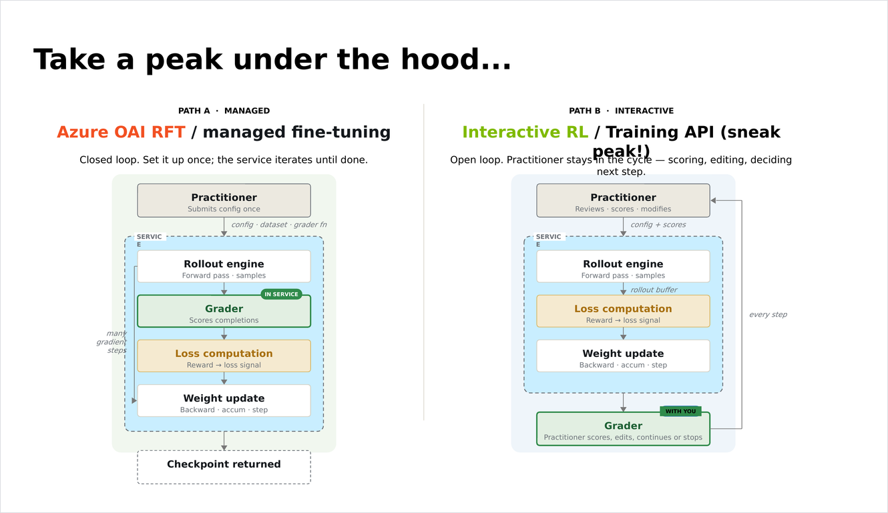</div>

> Source: BRK231 Slide 19 — "Take a peek under the hood." Left: Path A (Azure OAI RFT / managed fine-tuning) — closed loop, submit config once, service iterates until done. Right: Path B (Interactive RL / Training API) — open loop, practitioner reviews, scores, modifies every step. Note the Grader position: in Path A it's inside the service; in Path B it's **with you**.

### "PyTorch as a Service"

The Low-Level Training API architecture was revealed on stage — **"A small Python loop. A huge GPU cluster. Three calls between them"**:

<div align="center">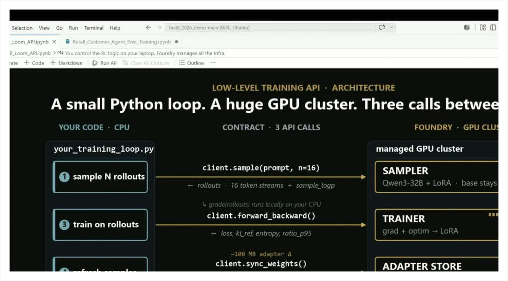</div>

> Source: BRK232 on-stage slide — Your local `training_loop.py` makes 3 API calls (`client.sample()`, `client.forward_backward()`, `client.sync_weights()`) to a managed GPU cluster running Sampler + Trainer + Adapter Store.

The Foundry Portal shows the training session in real time — checkpoint creation, weight sync events, gradient norms, and job completion status:

<div align="center">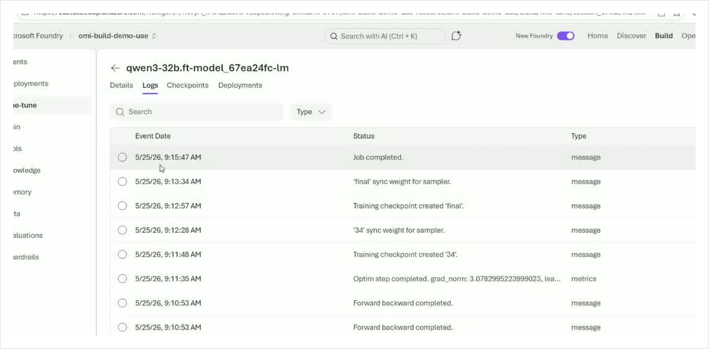</div>

> Source: BRK232 on-stage demo — Fine-tune session logs for `qwen3-32b.ft-model` showing `optim_step`, `forward_backward`, `sync_weight`, and checkpoint creation events.

For AI scientists who need full control, Foundry's Low-Level Training API provides three primitives while managing all GPU infrastructure:

| What You Control | What Foundry Manages |
|:----------------|:--------------------|
| Rollout strategy | GPU cluster provisioning |
| Grader logic (any language) | Distributed training orchestration |
| Loss computation | Model weight sync between nodes |
| Curriculum scheduling | vLLM/SGLang configuration |
| Algorithm (GRPO, PPO, DPO, custom) | Checkpoint storage |
| Hyperparameters | Networking between training and sampling nodes |

### The Three Primitives

```python
# 1. Provision LoRA adapter on GPU cluster
session = client.create_session(model="Qwen/Qwen3-32B", cluster="h100-4node")

# 2. Multi-turn rollouts — model calls real tools during sampling
rollouts = client.sample(prompts=batch, num_samples=10, tools=tool_defs)

# 3. Gradient update — server-side, you never download full weights
client.train(rollouts=rollouts, rewards=grader.score(rollouts), algorithm="grpo")
```

The training loop runs on **your laptop** (or an Azure VM for long sessions). GPU compute for `sample()` and `train()` happens on Azure. The architecture has two nodes: a **training node** (forward/backward pass, gradients) and a **sampling node** (rollout generation). `sync()` synchronizes LoRA weights between them.

Here's what it looks like in practice — the on-stage demo launched a training session from a local terminal with `./launcher.sh`, showing the full hyperparameter configuration (lr=5e-5, group_size=16, lora_rank=32, max_iters=25):

<div align="center">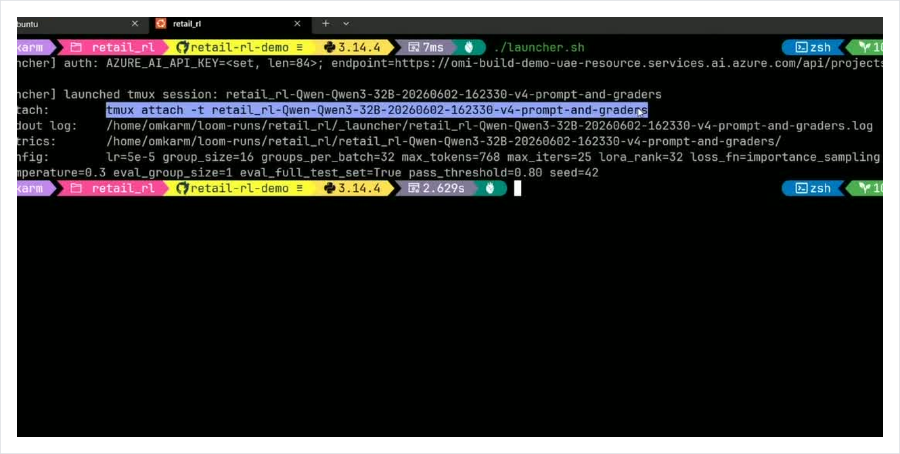</div>

> Source: BRK231 on-stage demo — Local terminal running `./launcher.sh` for `retail_rl-Qwen-Qwen3-32B`. Config shows `lr=5e-5`, `group_size=16`, `groups_per_batch=32`, `max_tokens=768`, `lora_rank=32`, `max_iters=25`, `loss_fn=importance_sampling`, `eval_every=2`, `seed=42`. The session connects to a Foundry project endpoint via `AZURE_AI_API_KEY`.

### Demo Results (BRK232 Stage 3)

| Model | retail_quality | Δ from base | Cost Tier |
|:------|:-------------:|:-----------:|:---------:|
| Qwen3-32B base | 58.1% | — | $ |
| o4-mini RFT | 82.3% | — | $$ |
| **Qwen3-32B Low-Level RFT** | **86.9%** | **+28.8pp** | **$** |

> Source: [BRK232 Official Repo](https://github.com/microsoft/Build26-BRK232-train-and-deploy-custom-oss-reasoning-models-with-foundry)

The local Run Dashboard (exposed by the BRK232 `dashboard.py` Streamlit app) showed the full training telemetry — reward/correct curves, gradient norm + entropy, KL divergence, and the "Group Composition" stacked chart that visualizes how "all-good" rollouts overtake "all-bad" ones as training progresses:

<div align="center">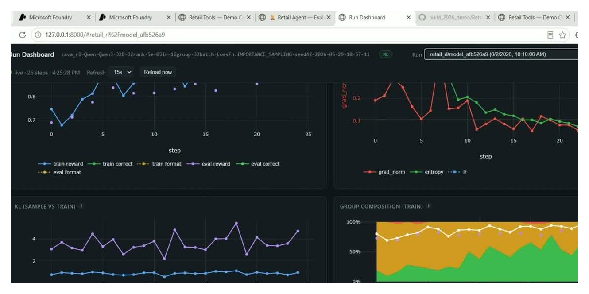</div>

> Source: BRK231 on-stage demo — Low-Level Training API Run Dashboard at `127.0.0.1:8000`. Top-left: train/eval reward+correct. Top-right: gradient norm + entropy + learning rate. Bottom-left: KL divergence (v1/v2). Bottom-right: Group Composition showing all-bad (red) → mixed (orange) → all-good (green) transition over 26 training steps.

### What the Low-Level API Enables That Managed RFT Cannot

- **Curriculum learning**: start with simple prompts, gradually increase difficulty
- **Custom algorithms**: not limited to GRPO — implement PPO, DPO, or novel approaches
- **Mid-training intervention**: change strategy, adjust grader, modify sampling while running
- **Any grader language**: C#, Python, external APIs — not limited to Foundry's grader format
- **Environmental interactions**: execute rollouts against real-world tools, not just simulated ones
- **Full telemetry**: KL divergence, entropy, gradient norm, group composition — all visible locally

---

## The Economics: Walking Through the Numbers

Retail returns scenario: US online returns market is $900B. Assume 1M requests/day at scale.

### Per-Request Cost

| Model | Tokens/Request | Price/M tokens | Per-Request Cost | Annual Cost (1M req/day) |
|:------|:-------------:|:-------------:|:---------------:|:-----------------------:|
| GPT-5.4 | 12,000 | $15.00 | $0.180 | **$65.7M** |
| o4-mini | 12,000 | $2.50 | $0.030 | $10.9M |
| GPT-4.1 mini SFT | 8,000 | $0.50 | $0.004 | **$1.5M** |
| Qwen3-32B RFT | 6,000 | $0.50 | $0.003 | **$1.1M** |

> *Token counts are scenario estimates: frontier models use longer system prompts (~12K tokens); fine-tuned models bake instructions into weights, reducing token consumption (~6–8K). Pricing from [Azure OpenAI pricing](https://azure.microsoft.com/pricing/details/cognitive-services/openai-service/).*

Fine-tuned models consume fewer tokens (instructions baked into weights, no long prompt needed) + each token is cheaper. Compound effect:

**GPT-5.4 → Qwen3-32B RFT: ~60x cost reduction, with quality 22 percentage points higher.**

### Training Cost

| Item | Cost |
|:-----|:-----|
| SFT median | ~$1 (Developer tier: $0.50) |
| RFT (4-node H100, 100 rollouts) | ~$50–200 |
| Low-Level API session (Qwen3-32B, 4×H100) | ~$200–500 |
| Developer tier hosting (experimentation) | **$0** (no hosting fee) |

> Source: SFT median cost from Alicia Frame quote in [BRK231](https://build.microsoft.com/en-US/sessions/BRK231). RFT and Low-Level API estimates based on on-stage demo cost analysis ($419 total for the full demo run).

---

## The Leaderboard: Quality Progression

The hill-climbing data from the session shows quality improving at **every stage** of the post-training loop:

<div align="center">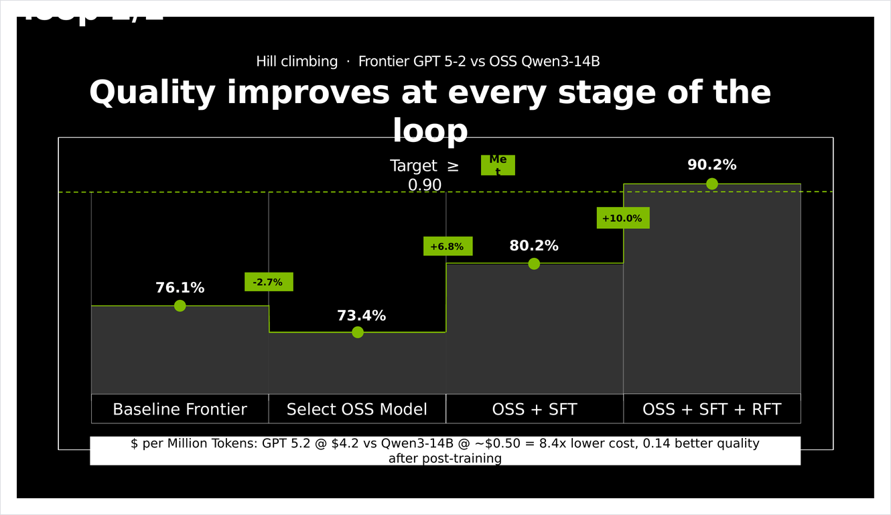</div>

> Source: BRK232 Slide 14 — This chart tracks **Qwen3-14B** through the post-training stages. The leaderboard table below tracks the **full model portfolio** (including GPT-5.4, o4-mini, GPT-4.1 mini, and Qwen3-32B) on the same `retail_quality` metric. Absolute values differ because the 14B and 32B runs used different model sizes and evaluation checkpoints.

The complete demo tracked quality across all fine-tuning iterations:

| Stage | Model | retail_quality | Cost/M tokens | Notes |
|:------|:------|:-------------:|:-------------:|:------|
| Baseline | GPT-5.4 | 65% | $15.00 | Teacher model |
| Baseline | o4-mini | 65% | $2.50 | Smaller but same quality |
| Baseline | GPT-4.1 mini | ~40% | $0.50 | Not viable without fine-tuning |
| Baseline | GPT-4.1 nano | ~35% | $0.10 | Not viable without fine-tuning |
| **Layer 1** | GPT-4.1 mini SFT | **74%** | $0.50 | Distillation from GPT-5.4 traces |
| **Layer 2** | o4-mini RFT | **84%** | $1.00 | Surpasses the teacher |
| **Layer 3** | Qwen3-32B RFT | **86.9%** | ~$0.50 | Open-source model, full control |

Key insight: **the final leaderboard winner is an open-source model (Qwen3-32B) trained with the most effort (Low-Level API), at the lowest cost, with the highest quality.**

### What the On-Stage Demo Actually Cost

The Azure Cost Analysis blade showed the total Managed Compute cost for the entire BRK232 demo session — **~$419** split across H100 and A100 accelerators:

<div align="center">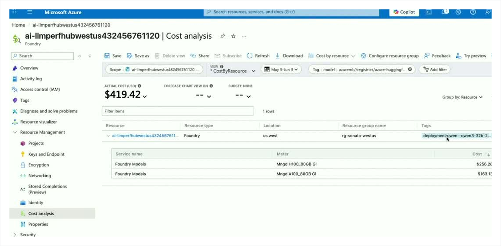</div>

> Source: BRK232 on-stage demo — Azure Portal Cost Analysis for the Foundry resource, filtered by `deployment:qwen--qwen3-32b-2...`, date range May 5 – Jun 3, 2026. Breakdown: Foundry Models / Mngd H100_80GB GI = **$256.28**, Foundry Models / Mngd A100_80GB GI = **$163.13**. This covers both training compute and inference serving during the demo period.

---

## Real-World Production Deployments

| Customer | Technique | Result | Source |
|:---------|:---------|:-------|:-------|
| **Decagon AI** | Distillation + SFT | Customer support agents on smaller, cheaper, faster models | BRK231 |
| **Discovery Bank** | Distillation + SFT | Banking app latency: **6s → 1.5s** | BRK231 |
| **DocuSign** | Distillation | **50% cost reduction** in AI document processing | BRK231 |
| **Harvey** | Fine-tuning | Legal AI agents with domain-specific tool calling | BRK231 |
| **UiPath** | Fine-tuning | Automation agents with enterprise workflow knowledge | BRK231 |

---

## Coding Agents for Fine-Tuning

BRK231 demonstrated a fine-tuning skill for GitHub Copilot that automates the entire pipeline through natural language:

```
User: "I have a hosted agent at <endpoint>. 
       Grade it on tool-calling accuracy with partial credit. 
       Then distill to a cheaper, faster model."

Copilot Fine-Tuning Skill:
  ① Creates a custom grader (partial credit for tool calls)
  ② Evaluates teacher model → 78% pass rate  
  ③ Evaluates base smaller models → poor performance
  ④ Kicks off distillation fine-tuning (picks model + hyperparameters automatically)
  ⑤ Returns leaderboard: fine-tuned 4.1 mini matches teacher quality
  ⑥ If results are worse → iterates (more data, different experiment)
```

Available as: **GitHub Copilot for Azure** skill, or standalone fine-tuning skill download.

---

## When to Use What

| Situation | Start Here | Why |
|:----------|:-----------|:----|
| Agent works but costs too much | **Layer 1: SFT** | Distill frontier traces to cheap model. Median job costs ~$1 |
| Teacher model quality isn't good enough | **Layer 2: RFT** | Model learns from own mistakes, surpasses teacher |
| Need custom RL algorithm or curriculum | **Layer 3: Low-Level API** | Full control over training loop, Foundry manages GPUs |
| No production traces yet | **Collect traces first** | Deploy with frontier model, accumulate 1,000+ trajectories |
| Don't have a gradable task | **Prompt engineering + Agent Optimizer** | RFT requires verifiable outcomes |
| Tried fine-tuning and made it worse | **Use fine-tuning coding agent** | It picks hyperparameters and iterates automatically |

---

## From Training to Deployment

Once your model is trained (via any of the three layers), BRK232 showed the complete path to production:

**Step 1: Register the trained model** — Upload weights, register from a training job, or import from Hugging Face:

<div align="center">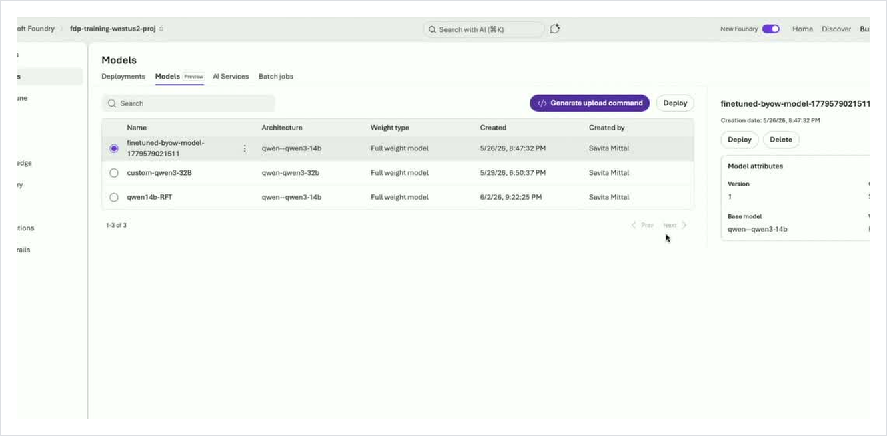</div>

> Source: BRK232 on-stage demo — Foundry Models page showing three registered custom models: `finetuned-byow-model` (Qwen3-14B), `custom-qwen3-32B`, and `qwen14b-RFT`.

**Step 2: Choose your deployment path** — The official slide shows the complete picture — BYOW vs BYOC, both converging to the same Foundry endpoint:

<div align="center">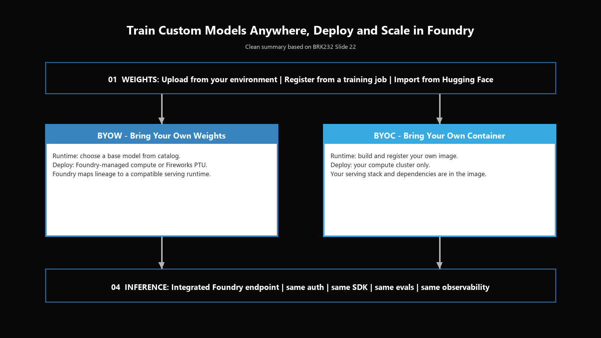</div>

> Source: BRK232 Slide 22 — "Train custom models anywhere, deploy and scale in Foundry." BYOW path: catalog runtime → Managed Compute / Fireworks. BYOC path: custom image → your cluster. Both share the same inference endpoint, auth, SDK, evals, agents, and observability.

The BRK232 slide below details the full custom model lifecycle on Managed Compute — where models come from (upload / training job / Hugging Face), what formats are supported (full weights / LoRA adapters), what asset types ship (BYOW vs BYOC), and where they run (Managed Compute / Fireworks PTU):

<div align="center">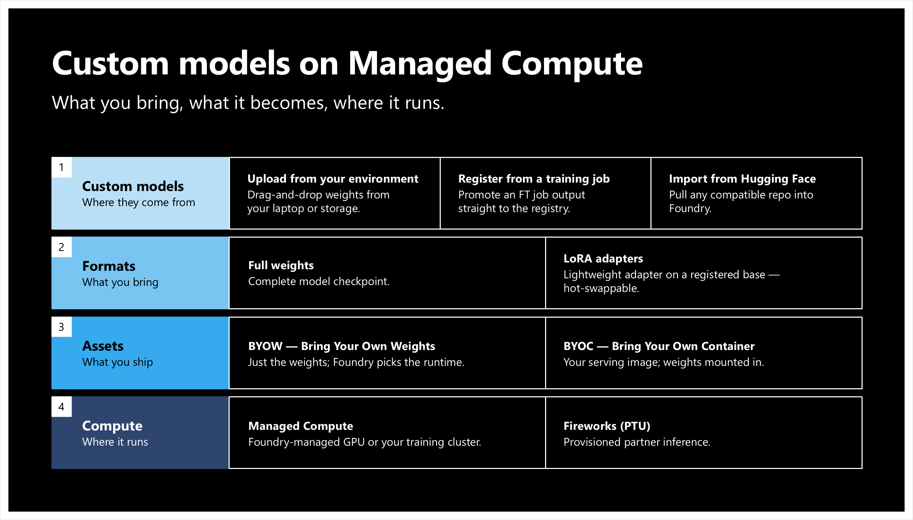</div>

> Source: BRK232 Slide 33 — "Custom models on Managed Compute: What you bring, what it becomes, where it runs." Four columns: (1) Custom models — upload from your environment, register from a training job, or import from Hugging Face. (2) Formats — full weights or LoRA adapters. (3) Assets — BYOW (Foundry picks the runtime) or BYOC (your serving image, weights mounted in). (4) Compute — Managed Compute (Foundry-managed GPU or your training cluster) or Fireworks (PTU).

In the on-stage transcript, BRK232 described custom containers as part of the custom-model deployment story: *"You can bring custom models with custom containers that have highly optimized runtimes using things like speculative decoding or draft models."* — Chris Lauren, BRK232. Supported runtime and compute combinations should be verified against the [product documentation](https://learn.microsoft.com/azure/ai-foundry/).

Foundry also offers **Managed Compute** as a dedicated serving substrate for open-source models — now in Public Preview:

<div align="center">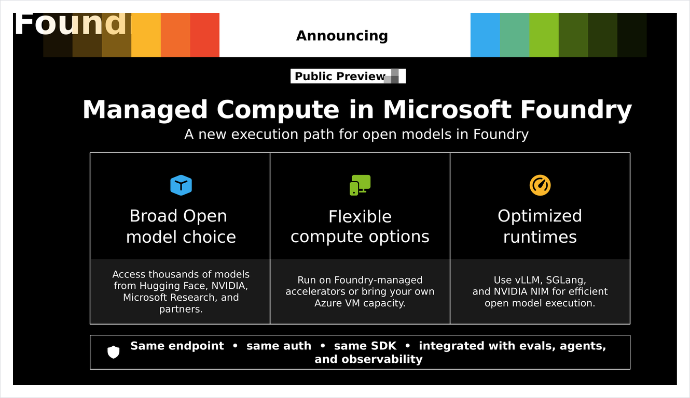</div>

> Source: BRK232 Slide 21 — "Managed Compute in Microsoft Foundry — Public Preview." Broad model choice (fine-tuned, open-source, custom), Flexible compute (A100/H100/MI300X), Optimized runtimes (vLLM), same endpoint/auth/SDK/evals/agents/observability.

The Foundry Model Catalog has 45+ models deployable via Managed Compute — the demo searched for "32b" models to find the right Qwen3 variant:

<div align="center">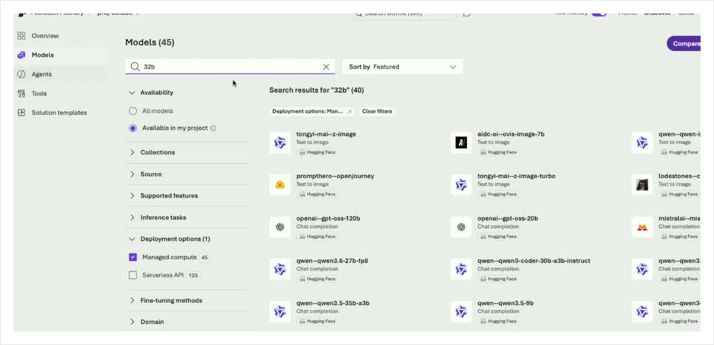</div>

> Source: BRK232 on-stage demo — Foundry Model Catalog filtered by "Deployment options: Managed Compute" showing 45 models. Left sidebar shows filter facets: Availability, Collections, Source, Supported Features, Inference Tasks, Deployment Options (Managed Compute: 45, Serverless API: 125), Fine-tuning Methods, Domain, Industry.

The Deploy dialog specifies deployment type ("Global Managed Compute"), deployment template ("qwen--qwen3-32b--40k-nvidia-h100"), and confirms the hardware: **"vLLM on 1 × NVIDIA H100 80 GB at 40K context length"**:

<div align="center">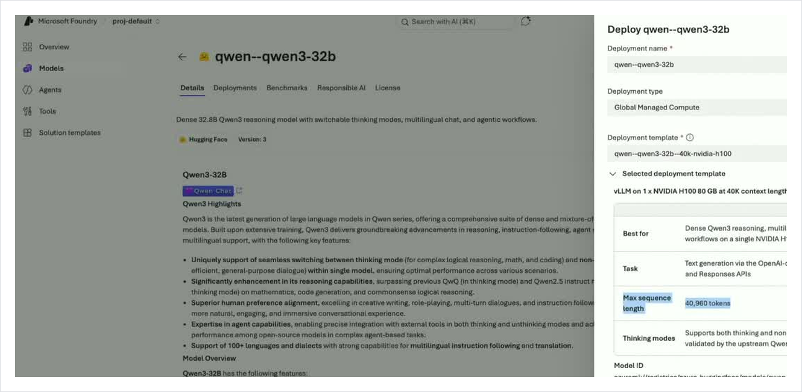</div>

> Source: BRK232 on-stage demo — Deploy dialog for `qwen--qwen3-32b`. Deployment type: Global Managed Compute. Template: `qwen--qwen3-32b--40k-nvidia-h100`. Task: Chat Completions and Responses APIs. Max sequence length: 40,960 tokens. Thinking modes supported.

**Step 3: Deploy to a Foundry endpoint** — Same auth, SDK, evals, and observability as any Foundry model:

<div align="center">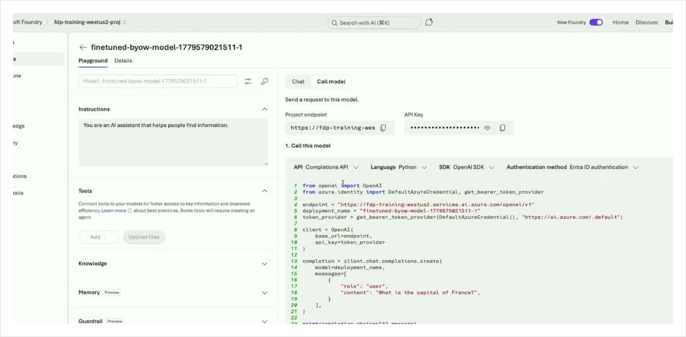</div>

> Source: BRK232 on-stage demo — Foundry Playground for the deployed fine-tuned model, with project endpoint, API key, and Python code snippet using the OpenAI SDK.

**Step 4: Connect to an agent** — The fine-tuned model powers a Foundry hosted agent with tools, knowledge, memory, and guardrails:

<div align="center">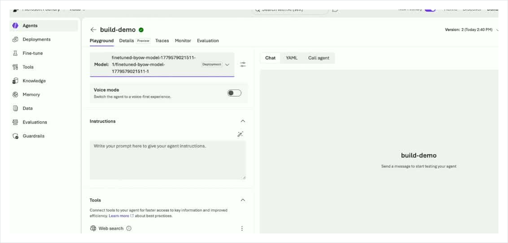</div>

> Source: BRK232 on-stage demo — Foundry Agent page `build-demo` using the fine-tuned BYOW model as its backbone, with Web Search tool, Knowledge, Memory, and Guardrails panels.

---

## Getting Started

### Quick Start (Layer 1 — 5 minutes in Foundry UI)

1. Deploy a Hosted Agent with your frontier model
2. Collect 1,000+ traces through normal usage
3. Click **Create Dataset** → **Start Fine-Tuning**
4. Evaluate the fine-tuned model against baseline
5. Deploy if quality meets or exceeds the original

### Full Pipeline (Clone official BRK232 repo)

```bash
git clone https://github.com/microsoft/Build26-BRK232-train-and-deploy-custom-oss-reasoning-models-with-foundry.git
cd Build26-BRK232-train-and-deploy-custom-oss-reasoning-models-with-foundry
pip install --pre -r src/requirements.txt
```

| Stage | Notebook | Model | Technique |
|:------|:---------|:------|:----------|
| 1 | `src/post-training-sft-recipe/retail_sft_submit.ipynb` | Qwen3-32B | SFT (SLIME + Ray + TRL) |
| 2 | `src/Retail_Customer_Agent_Post_Training.ipynb` | Qwen3-14B | GRPO RFT (warm-started from Stage 1 LoRA) |
| 3 | `src/Retail_Customer_Agent_Training_API.ipynb` | Qwen3-32B | Low-Level API (Private Preview) |

> ⚠️ **Stage 1–2 GPU compute required**: 4 nodes of H100 or A100 (your own Azure GPU quota). Start small to validate.
>
> ⚠️ **Stage 3 (Low-Level API)**: No BYO GPU quota needed — Foundry manages the GPU cluster. Requires [Private Preview access](https://aka.ms/FoundryTrainingPrPrSignup).

---

## Key Resources

### Session Recordings
| Session | Title | Speakers |
|:--------|:------|:---------|
| [BRK231](https://build.microsoft.com/en-US/sessions/BRK231) | Deploy. Observe. Learn. RL for production agents | Alicia Frame, Omkar More |
| [BRK232](https://build.microsoft.com/en-US/sessions/BRK232) | Post-Training OSS Reasoning Models in Foundry | Chris Lauren, Vijay Aski, Manoj Bableshwar |
| [BRK230](https://build.microsoft.com/en-US/sessions/BRK230) | Build smarter AI systems as models and costs evolve | Yina Arenas, Naomi Moneypenny |

### Code & Documentation
| Resource | Link |
|:---------|:-----|
| BRK232 Official Code Repo | [github.com/microsoft/Build26-BRK232-...](https://github.com/microsoft/Build26-BRK232-train-and-deploy-custom-oss-reasoning-models-with-foundry) |
| BRK231 Official Repo | [github.com/microsoft/Build26-BRK231](https://github.com/microsoft/Build26-BRK231) |
| Foundry Fine-Tuning Concepts | [learn.microsoft.com](https://learn.microsoft.com/azure/ai-foundry/concepts/fine-tuning-overview) |
| SLIME Framework | [github.com/THUDM/slime](https://github.com/THUDM/slime) |
| Low-Level API Preview Signup | [aka.ms/FoundryTrainingPrPrSignup](https://aka.ms/FoundryTrainingPrPrSignup) |
| Foundry Discord (50K+ devs) | [aka.ms/foundry/discord](https://aka.ms/foundry/discord) |
| Training Notebooks | [aka.ms/TrainingBuild2026](https://aka.ms/TrainingBuild2026) |

### Technology Stack
| Component | Role |
|:----------|:-----|
| [Microsoft Foundry](https://learn.microsoft.com/azure/ai-foundry/) | Control plane for training, evaluation, deployment |
| [SLIME](https://github.com/THUDM/slime) + [Ray](https://www.ray.io/) | Async GRPO training framework |
| [SGLang](https://github.com/sgl-project/sglang) | High-throughput rollout engine |
| [TRL (HuggingFace)](https://huggingface.co/docs/trl) | SFT training with prompt masking |
| [Qwen3-14B / Qwen3-32B](https://huggingface.co/Qwen) | Open-source reasoning base models |
| [Streamlit](https://streamlit.io/) | Live training dashboard |

---

## Running on Azure

| Component | Azure Service | SKU / Tier |
|:----------|:-------------|:----------|
| Training control plane | Microsoft Foundry | Standard |
| SFT compute | Foundry Custom Code training (BYO AML GPU quota) | 4× ND96amsr_A100_v4 or ND96r_H100_v5 |
| RFT compute | Foundry Custom Code training (BYO AML GPU quota) | 4× ND96r_H100_v5 (recommended) |
| Low-Level API compute | Foundry Fine-Tuning Low-Level API (Foundry-managed GPU) | H100 cluster (Private Preview) |
| Model hosting | Foundry Managed Compute | Dedicated GPU (hourly metered) |
| Evaluation | Foundry Evaluations | Included |
| Traces & observability | Foundry Tracing + Azure Monitor | Included |
| Agent runtime | Foundry Hosted Agents | GA (July 2026) |

> Source: [BRK232 Official Repo — Prerequisites](https://github.com/microsoft/Build26-BRK232-train-and-deploy-custom-oss-reasoning-models-with-foundry#prerequisites)

---

## Related Repos

| Repo | Relationship |
|:-----|:------------|
| [4-Steps-of-AOAI-E2E-Fine-Tuning](https://github.com/david-xinyuwei/david-share/tree/master/Deep-Learning/4-Steps-of-AOAI-E2E-Fine-Tuning-best-practice) | Foundation: E2E fine-tuning on Azure OpenAI (SFT basics). This repo extends the story to **agent-specific post-training with RL** |
| [AI-Foundry-Model-Performance](https://github.com/david-xinyuwei/david-share/tree/master/Deep-Learning/AI-Foundry-Model-Performance) | Complementary: Model benchmarking that feeds into the "which model to fine-tune" decision |
| [BF16-FP16-RL](https://github.com/david-xinyuwei/david-share/tree/master/Deep-Learning/BF16-FP16-RL) | Background: Precision formats in RL training — relevant to understanding GPU efficiency in GRPO |
| [Budget-Forcing-Inference](https://github.com/david-xinyuwei/david-share/tree/master/Deep-Learning/Budget-Forcing-Inference) | Related: Token budget control at inference time — the "after fine-tuning" optimization step |

---

## Key Technologies Deep Dive

The BRK232 demo builds on several key technologies. Here is what each one does and why it matters for the post-training pipeline.

### SLIME Framework

[SLIME](https://github.com/THUDM/slime) (Scalable Language Model Inference and Multi-Environment training) is the open-source framework that powers both the SFT and RFT recipes in the BRK232 repo. It runs on [Ray](https://www.ray.io/) for distributed training and uses [SGLang](https://github.com/sgl-project/sglang) as the high-throughput rollout engine.

Why SLIME matters for this demo:
- **Multi-turn tool-use rollouts**: Unlike standard RL frameworks that generate one response per prompt, SLIME supports multi-turn agent trajectories where the model calls tools, receives results, reasons, and calls more tools
- **Async GRPO**: The rollout engine and the training engine run asynchronously — while batch N is training, batch N+1 is already sampling rollouts
- **Ray native**: Scales from 1 to N nodes without code changes. The demo uses 4 nodes of H100/A100

### GRPO — Group Relative Policy Optimization

GRPO is the RL algorithm used in both Layer 2 (managed RFT) and Layer 3 (Low-Level API). It differs from PPO in a key way:

| Aspect | PPO | GRPO |
|:-------|:----|:-----|
| **Baseline** | Separate value network (critic) | Group mean of sampled rewards |
| **Memory** | Must train critic alongside policy | No critic — saves ~50% GPU memory |
| **Signal** | Advantage = reward - value estimate | Advantage = reward - group mean |
| **Stability** | Clip ratio + KL penalty | Clip ratio + KL penalty |

In practice: for each prompt, GRPO generates `group_size` rollouts (default 16 in the demo), scores them all, then uses the group mean as the baseline. Rollouts above the mean get reinforced; rollouts below get penalized. No critic network needed.

### Ray Distributed Training Architecture

The BRK232 training runs use Ray to distribute work across 4 GPU nodes:

```
┌─────────────────────────────────────────┐
│  Ray Head Node                            │
│  ┌────────────┐  ┌────────────────────┐ │
│  │  Trainer    │  │  SGLang Sampler     │ │
│  │  (forward/  │  │  (rollout           │ │
│  │  backward)  │  │   generation)       │ │
│  └────────────┘  └────────────────────┘ │
│       │                     │              │
│       └─────── sync() ─────┘              │
└─────────────────────────────────────────┘
┌─────────────────────────────────────────┐
│  Ray Worker Nodes (3x)                    │
│  Each: 8x H100 80GB or 8x A100 80GB      │
│  Role: tensor-parallel inference shards   │
└─────────────────────────────────────────┘
```

Key config from the demo's `submit_job.py`: `distributionType: Ray`, head node port `6379`, instance type `Singularity.ND96r_H100_v5` (4 nodes).

### Managed Compute — Inference Engines and Accelerators

When the trained model is deployed to production, Foundry Managed Compute supports:

| Inference Engine | Use Case | Source |
|:----------------|:---------|:-------|
| **vLLM** | Runtime used in the BRK232 deploy demo ("vLLM on 1× NVIDIA H100 80 GB") | BRK232 Slide 21 + deploy dialog |
| **SGLang / NVIDIA NIM** | Mentioned as optimized runtimes for open-model execution; in the BRK232 demo, runtime selection is exposed through deployment templates rather than a separate engine picker | BRK232 Slide 21 + deploy dialog |

| Accelerator | Managed Compute SKU | Typical Use |
|:-----------|:-------------------|:------------|
| **NVIDIA H100 80GB** | `H100_80GB` | Default for Qwen3-32B+ and high-throughput inference |
| **NVIDIA A100 80GB** | `A100_80GB` | Cost-effective for smaller models (Qwen3-14B) |
| **AMD MI300X 192GB** | `MI_300_192GB` | Large-context or very large models (rolling out) |

> Source: BRK232 Slide 21 (Managed Compute announcement), BRK232 deploy dialog, and Azure Cost Analysis showing both H100 and A100 charges.

### The Retail Demo Environment

The BRK232 demo uses a **deterministic retail return environment** with 4 tools and an 8-component grader. The environment is fully contained in the [official repo](https://github.com/microsoft/Build26-BRK232-train-and-deploy-custom-oss-reasoning-models-with-foundry/tree/main/src/post-training-recipe/demo-artifacts/code):

| Component | File | What It Does |
|:----------|:-----|:------------|
| Environment | `retail_env.py` | Dispatches deterministic tools, tracks episode state |
| Tools | `retail_tools.py` | `get_order_details`, `check_resolution_policy`, `process_refund`, `lookup_product` |
| Grader | `retail_grader_rft_tools_v3.py` | 8-component weighted scoring: verb, item, reason, format, amount, tool coverage, workflow, integrity |
| Reward | `retail_reward.py` | Calls grader, shapes scalar reward signal for GRPO |
| Training | `retail_slime_train.py` | SLIME entrypoint — launches Ray + GRPO inside Foundry container |
| Dashboard | `dashboard.py` | Streamlit rollout browser on port 8501 during training |

The tools are **deterministic** — same input always produces same output. This is critical for RL: the reward signal must be stable, not noisy from stochastic tool responses.

---

## Official Repo Walkthrough

The [BRK232 official repo](https://github.com/microsoft/Build26-BRK232-train-and-deploy-custom-oss-reasoning-models-with-foundry) contains the complete source code shown in the session. Here is the structure:

```
src/
├── post-training-sft-recipe/          # Stage 1: SFT
│   ├── retail_sft_submit.ipynb           # Entry notebook
│   ├── slime_sft_setup.py               # setup_env, submit_job, tail_rollouts
│   ├── recipe/
│   │   └── submit_sft.py                  # Job payload sent to Foundry
│   ├── demo-artifacts/
│   │   ├── code/sft_retail.py             # HF TRL SFT script (inside container)
│   │   └── data/                          # retail_train_sft.jsonl + retail_val_sft.jsonl
│   └── reports/extract_rollouts.py       # Inspect rollout outputs
├── post-training-recipe/              # Stage 2: RFT (GRPO)
│   ├── submit_job.py                    # Builds CommandJob + submits
│   ├── helpers.py                       # Dataset upload, GPU layout, submission
│   └── demo-artifacts/
│       ├── code/
│       │   ├── retail_env.py              # Deterministic retail environment
│       │   ├── retail_tools.py            # 4 deterministic tools
│       │   ├── retail_grader_rft_tools_v3.py  # 8-component weighted grader
│       │   ├── retail_reward.py           # Reward shaping for GRPO
│       │   ├── retail_slime_train.py      # SLIME + Ray entrypoint
│       │   └── dashboard.py               # Streamlit rollout browser
│       └── data/                          # retail_train.jsonl + retail_val.jsonl
├── post-training-experimentation/      # Local grader testing
│   ├── grader_demo.py                   # Quick grader test
│   ├── debug_grader.py                  # Debug grader edge cases
│   └── grader_eval_helpers.py           # Evaluation utilities
├── Retail_Customer_Agent_Post_Training.ipynb    # Stage 2 entry notebook
├── Retail_Customer_Agent_Training_API.ipynb     # Stage 3 entry notebook
├── Retail_Customer_Agent_Grader_Test_Bed.ipynb  # Grader testing notebook
├── slime_rl_setup.py                # setup_env, submit_job, job_status
└── requirements.txt                 # Python dependencies
```

### How to Reproduce

**Prerequisites**:
- A [Microsoft Foundry](https://learn.microsoft.com/azure/ai-foundry/) project with GPU compute attached
- 4 nodes of NVIDIA H100 (`ND96r_H100_v5`) or A100 (`ND96amsr_A100_v4`)
- User-assigned managed identity (UAI) + storage connection name
- Python 3.11+, Azure CLI signed in
- Low-Level API (Stage 3) requires [Private Preview access](https://aka.ms/FoundryTrainingPrPrSignup)

**Step-by-step**:

```bash
# 1. Clone and install
git clone https://github.com/microsoft/Build26-BRK232-train-and-deploy-custom-oss-reasoning-models-with-foundry.git
cd Build26-BRK232-train-and-deploy-custom-oss-reasoning-models-with-foundry
pip install --pre -r src/requirements.txt \
  --extra-index-url https://pkgs.dev.azure.com/azure-sdk/public/_packaging/azure-sdk-for-python/pypi/simple
az login

# 2. Stage 1 — SFT (Qwen3-32B)
# Open src/post-training-sft-recipe/retail_sft_submit.ipynb
# Set your project name, select cluster (h100 or a100), submit

# 3. Stage 2 — RFT/GRPO (Qwen3-14B, warm-started from Stage 1 LoRA)
# Open src/Retail_Customer_Agent_Post_Training.ipynb
# Set project_endpoint, storage_connection_name, managed_identity_*, submit

# 4. Stage 3 — Low-Level API (Qwen3-32B, Private Preview)
# Open src/Retail_Customer_Agent_Training_API.ipynb
# Set AZURE_AI_API_KEY + PROJECT_ENDPOINT, run cells top-to-bottom

# 5. Test grader locally (no GPU needed)
python src/post-training-experimentation/grader_demo.py
```

> ⚠️ **Override all defaults**: The baked-in values reference the internal Foundry pilot project used for the demo. You must override `project_endpoint`, `managed_identity_*`, `storage_connection_name`, dataset URIs, and `compute_cluster` before submitting.

---

## Cross-Session Analysis: Training vs Serving vs Agent Operations

Our analysis of 7 Build 2026 sessions reveals that BRK232 is best understood as part of a lifecycle, not a standalone topic:

| Surface | Sessions | What It Covers |
|:--------|:---------|:---------------|
| **Learning data** | BRK231, BRK232 | Traces → datasets → evaluation/SFT/RFT data |
| **Training** | BRK231, BRK232 | `CommandJob`, Train blade, SFT/RFT jobs, Low-Level Training API |
| **Serving** | DEM320, BRK232 bridge, BRK230 | Managed Compute deployment, deployment templates, same endpoint/auth/SDK |
| **Agent operations** | BRK241, BRK252, BRK230 | Hosted agents, traces, evals, optimizer, ROI |

The key architectural insight:

> **BRK232 creates or improves the model. Managed Compute is one product path to serve supported open/custom models in production.** Avoid saying "BRK232 is Managed Compute" — it blurs the distinction.

The lifecycle forms a continuous loop:

```
Production agent traces
  → Foundry datasets / graders / evals
  → SFT / RFT / Low-Level Training API
  → Improved model artifact
  → Deployment (Managed Compute / Fireworks / BYOC)
  → Inference endpoint consumed by agents
  → Traces, evals, monitoring, optimizer
  → Next training dataset (loop back)
```

> Source: Cross-session analysis based on BRK231, BRK232, DEM320, BRK230, BRK234, BRK241, and BRK252 slides, transcripts, and demo repos. Full analysis: [Build-2026-Keynote-Deep-Dive](https://github.com/david-xinyuwei/david-share/tree/master/Deep-Learning/Foundry-Agent-Post-Training-Deep-Dive/../../../Build-2026-Keynote-Deep-Dive).

---

## The Continuous Improvement Playbook

BRK232 closed with the complete lifecycle — from model selection through continuous improvement:

<div align="center">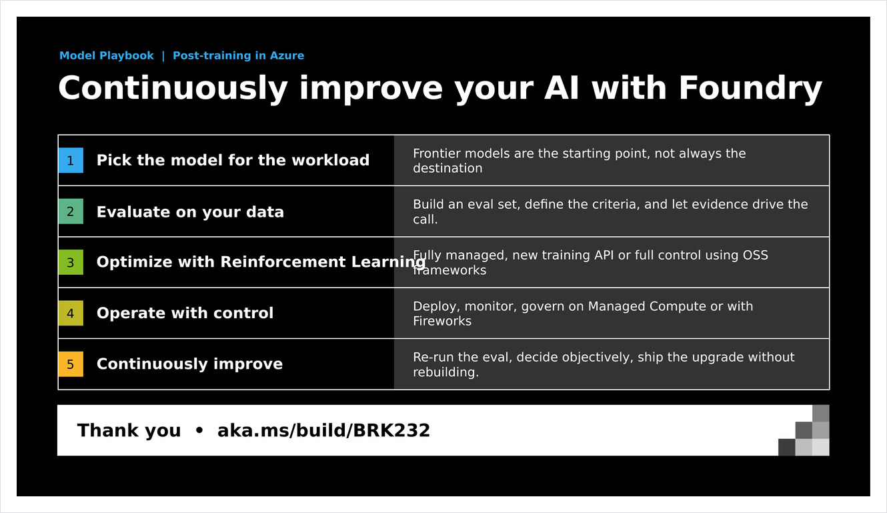</div>

> Source: BRK232 Slide 23 — "Continuously improve your AI." Five-step playbook: Pick model → Evaluate → Optimize with RL → Operate with control → Continuously improve. The loop never ends — production traces feed back into the next training cycle.

---

*Based on BRK231 official transcript, BRK232 official code repo, BRK232 official slides, BRK230 session content, and Build 2026 materials. Accessed June 3–8, 2026.*
