# GPU 架构深潜：从 3D 渲染到 AI 推理 — 一个推理工程师的 GPU 全景指南

> **作者**: 魏新宇 (Xinyu Wei)
>
> **核心命题**: GPU 为 3D 渲染而生，AI 推理是"意外的受益者"。理解渲染的设计哲学，就理解了 GPU 为什么天生适合 AI。
>
> **本文特色**: 用作者在 LLM/Diffusion 推理优化领域的**实测数据**验证渲染技术与 AI 推理的深层关联。同时提供从零实现的软件光栅化器和光线追踪器，可直观对比两种渲染方法的效果差异。

---

## Executive Summary

| 渲染设计决策 | AI 推理中的对应技术 | 作者实测证据 |
|:---|:---|:---|
| 分块渲染（Tiled Rendering） | FlashAttention 分块计算 | FlashInfer 在 32K 时比 FA 快 9-15% ([链接](https://github.com/david-xinyuwei/david-share/tree/master/Deep-Learning/FlashInfer-vs-FlashAttention-Benchmark)) |
| Z-Buffer 逐像素内存管理 | PagedAttention 逐块 KV Cache | KV Cache 六级深潜 ([链接](https://github.com/david-xinyuwei/david-share/tree/master/Deep-Learning/KV-Cache-Deep-Dive)) |
| Mipmap 多精度 LOD | Speculative Decoding 草稿验证 | EAGLE3 加速 2.67x ([链接](https://github.com/david-xinyuwei/david-share/tree/master/Deep-Learning/Speculative-Decoding-EAGLE3)) |
| Z-fighting 精度闪烁 | BF16 精度累积误差 | fuse_lora SSIM 差 2-18% ([链接](https://github.com/david-xinyuwei/david-share/tree/master/DL-Algorithm-Insights/LoRA-Merge-Quality-Impact)) |
| 帧缓冲复用上一帧 | KV Cache 缓存 Key/Value | GQA/MLA 四架构对比 ([链接](https://github.com/david-xinyuwei/david-share/tree/master/Deep-Learning/KV-Cache-Deep-Dive)) |
| 光追 Monte Carlo 降噪 | Diffusion DDPM 去噪 | 蒸馏 40步→8步 ([链接](https://github.com/david-xinyuwei/david-share/tree/master/DL-Algorithm-Insights/Diffusion-Distillation)) |

### 如何阅读本文

上面这张表是结论 — 但为什么渲染和 AI 推理会用同一套招数？因为它们面对的是**同一类工程约束**：

1. **算力便宜，显存带宽贵** → 两边各自独立发明了"分块"（Tiled Rendering / FlashAttention），把数据留在片上高速 SRAM 里算完。
2. **显存稀缺且大小不可预测** → 两边各自独立发明了"按需分页"（Z-Buffer / PagedAttention），不预留最坏情况的缓冲区。
3. **大部分工作用粗略近似就够了，只有少数情况需要全精度** → 两边各自独立发明了"先粗后精"（Mipmap LOD / Speculative Decoding 先猜后验）。
4. **有限数值精度在迭代计算中会累积误差** → 两边都吃过亏也都找到了补偿方法（Z-fighting 的解法：增加深度位数；BF16 的解法：在精度损失前合并权重）。
5. **每次都从头算太浪费** → 两边都缓存中间结果（帧缓冲复用 / KV Cache）。
6. **瓶颈操作模式固定时，就做成专用硬件** → Rasterizer Unit、RT Core、Tensor Core 都是这个原则的实例。

GPU 不是"碰巧"适合 AI。**渲染 30 年积累的工程智慧 — 分块、缓存、近似、专用硬件 — 正是 AI 推理今天在用的同一套方法论。** 第 1-6 章构建渲染侧的知识体系，第 7 章用实测数据将每个渲染概念映射到对应的 AI 技术。

---

## 1. 第一原理：为什么 3D 要变成 2D？

**因为显示器是 2D 的。** 屏幕是一块平面像素矩阵（如 3840×2160），3D 场景必须被"压"成 2D 图像。

这和人眼一样：现实世界是 3D 的，但视网膜是 2D 曲面 — 3D 光线经晶状体投影到视网膜上变成 2D 信号，大脑再"脑补"出深度感。

> **容易混淆的方向**：3D→2D 是**渲染**（本文主题），2D→3D 是**重建**（如 NeRF / 3D Gaussian Splatting，见第 8 章）。光栅化和光线追踪都是 3D→2D 的方法，**不是** 2D→3D。

**为什么三角形是万物基本单位？** 任意 3 点必然共面（唯一确定一个平面），但 4 点不一定——第 4 个点可能"翘"出平面。

```
3 个点 → 一定在同一个平面上：        4 个点 → 第 4 个点可能不共面：

      A ●                                 A ●
     ╱   ╲    ← 不管这 3 个点在哪，      ╱   ╲
    ╱     ╲      总能找到一个平面        ╱  D●  ╲  ← D 可能在 ABC 平面
   ●───────●     穿过它们               ╱  ↗    ╲    上方或下方"翘着"
   B       C                           ●───────●
                                       B       C
```

**生活中的例子**：三条腿的桌子永远不会晃（3 点确定一个平面），四条腿的桌子经常一条腿悬空晃动（4 点不一定共面）。如果用四边形做基本图元，4 点不共面时面会"扭曲折叠"，渲染出来就是错的。三角形不存在这个问题 — **所以 GPU 只处理三角形**。一个游戏角色可能由几十万个三角形拼成。

---

## 2. Graphics Pipeline 5 步详解

> **Pipeline 是什么？** 直译"管道/管线"，实际意思是**工厂流水线**。和普通流程的区别：流水线上**每一步可以同时干活** — 第 1 步处理三角形 5 的同时，第 2 步在处理三角形 4，第 3 步在处理三角形 3……就像汽车装配线上同时有很多车在不同工位。

3D→2D 渲染的核心是 **5 次坐标变换**，每步是一次 4×4 矩阵乘法。

> **类比**：想象你在拍照片。你要做的事情是：① 把物体摆好位置（模型变换）② 把相机架好对着物体（摄像机变换）③ 透过镜头看“远小近大”（透视投影）④ 裁掉取景框外的部分（裁剪）⑤ 冲印成照片（视口变换）。

```
模型坐标 → [Model Transform] → 世界坐标 → [Camera Transform] → 摄像机坐标
→ [Projection] → NDC → [Clipping] → [Viewport] → 屏幕像素
```

> **类比：拍照片。** ① 把物体摆好位置（Model Transform）② 把相机架好对着物体（Camera Transform）③ 透过镜头看"远小近大"（透视投影）④ 裁掉取景框外的部分（裁剪）⑤ 冲印成照片（视口变换）。

### 2.1 第 1 步：模型变换（Model Transform）— "把物体摆到场景里"

**要解决的问题**：3D 物体是不同的美工分别做的。做树的人把树根放在 (0,0,0)，做车的人把车中心放在 (0,0,0)。如果不统一坐标，所有东西都堆在原点重叠了。

> **什么是"世界坐标"？** 说白了就是**这张图片的全局坐标**。叫"世界"只是因为游戏行业把场景叫"World"。就像城市地图上的经纬度——不管你在北京还是纽约建的房子，最终都要标注在同一张地图上才能一起看。
>
> - **本地坐标**（Local/Model）= 每个物体自己的内部坐标（"沙发左边 1 米"）
> - **世界坐标**（World）= 这个场景的全局坐标（"北京市朝阳区建国路 100 号"）
> - **Model Transform** = 把本地坐标转成全局坐标（查这栋房子在城市地图上的地址）
>
> **一个世界坐标系对应一个场景（Scene），一个场景渲染出一帧画面。** 不同的关卡/场景各自有自己的世界坐标系，互不相干。

 **Model Transform 包含三种操作**，解决三个问题：

```
不统一坐标（都在原点）：        Model Transform 后（各就各位）：

    🌳🧑🚗  ← 全堆在 (0,0,0)        🌳              🧑           🚗
    重叠成一坨！                    (10,0,5)       (12,0,5)     (20,0,8)
                                    树在左边        人站在树下    车停在右边
```

| 操作 | 解决什么 | 例子 |
|:---|:---|:---|
| **平移** (Translation) | 物体放到全局坐标的什么位置 | 龙放到天空中 (500, 200, 0) |
| **旋转** (Rotation) | 物体朝哪个方向 | 骑士转身骑上龙背 |
| **缩放** (Scale) | 物体多大 / 统一单位 | 中国美工用厘米做的龙缩放到米 |

这三种操作都能用一个 4×4 矩阵表示，**而且可以合并成一个矩阵一步算完**。

**为什么是 4×4 而不是 3×3？** 3×3 矩阵只能做旋转和缩放，**不能做平移**。加一个维度（齐次坐标）后，平移也变成矩阵乘法，所有变换统一为矩阵相乘。

### 2.2 第 2 步：摄像机变换（Camera Transform）— "从哪个角度拍"

同一个场景，从不同位置和角度看会得到完全不同的画面。Camera Transform 回答的问题是：**"我站在哪里、看向哪里？"**

数学上的做法不是移动摄像机，而是**固定摄像机、移动整个世界**（结果完全一样，但计算更方便）—— 让摄像机在原点 (0,0,0)，朝 -Z 方向看。

### 2.3 第 3 步：透视投影（Projection）— "近大远小"

**"近大远小"的数学本质**：每个点的 x 和 y 坐标**除以它的 z（深度）**。

```
z 大（远）→ 除以大数 → x,y 变小 → 在画面上显示得小
z 小（近）→ 除以小数 → x,y 保持大 → 在画面上显示得大
```

> **类比**：你透过窗户看外面。窗户就是 2D 的"投影面"。远处的房子在窗户上只占一小块，近处的树占一大块。

这一步把 3D 的视锥体（Frustum，截锥形 —— 摄像机能看到的锥形空间）映射为标准立方体 NDC (Normalized Device Coordinates) [-1,1]³。

### 2.4 第 4 步：裁剪（Clipping）— "框外的扔掉"

摄像机看不到的东西不需要画：你身后的、太远的、太偏左/右/上/下的 → 全部丢弃。半截在画面里的三角形 → 裁成只留画面内的部分。

**为什么在 NDC 空间裁剪？** 因为视锥体已经变成了标准立方体，裁剪判断只需要比较 x, y, z 是否在 [-1, 1] 范围内 —— 比在原始截锥体空间简单得多。

### 2.5 第 5 步：视口变换（Viewport）— "数学坐标变成像素"

前 4 步算完后，坐标是 [-1, 1] 的抽象数字。你的屏幕是 1920×1080 像素。视口变换就是把 [-1,1] 映射到 [0,1920] × [0,1080]。

> **类比**：这一步就是**冲洗照片** —— 把底片（数学坐标）印到照片纸（屏幕像素）上。

### 2.6 为什么是矩阵？为什么可以合并？

5 步中的每一步都可以写成一个 4×4 矩阵乘以坐标。好处是 **5 个矩阵可以预先乘成 1 个矩阵**：

```
不优化：每个顶点做 5 次矩阵乘法
  v × M1 × M2 × M3 × M4 × M5

优化后：先算 M = M1 × M2 × M3 × M4 × M5（一次性）
  然后每个顶点只做：v × M（一次乘法）

一个游戏角色有 10 万个顶点。5 次 vs 1 次 → 省 80% 计算量。
```

**这就是 GPU 存在的原因：大规模并行矩阵运算。** 几百万个顶点 × 同一个矩阵 → 完美的并行任务。

**一张图总结 5 步**：

```
你的3D模型（树在原点）
    │
    │ ① 模型变换："摆到世界里 (100,50,200) 的位置"
    ▼
世界坐标（树在山坡上）
    │
    │ ② 摄像机变换："从这个角度看"
    ▼
摄像机坐标（树在摄像机正前方）
    │
    │ ③ 透视投影："近大远小，压成2D"
    ▼
NDC 坐标（-1 到 1 的抽象2D坐标）
    │
    │ ④ 裁剪："框外的扔掉"
    │
    │ ⑤ 视口变换："映射到 1920×1080 屏幕"
    ▼
屏幕像素坐标（树在屏幕上的位置 → 交给光栅化涂色）
```

### 管线 5 步配图

**管线总览**（来源：[Wikimedia Commons](https://commons.wikimedia.org/wiki/File:Graphics_pipeline_2_en.svg)，CC BY-SA）：

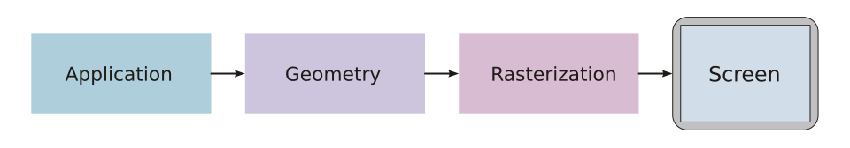

**几何管线详细**（来源：[Wikimedia Commons](https://commons.wikimedia.org/wiki/File:Geometry_pipeline_en.svg)，CC BY-SA）：

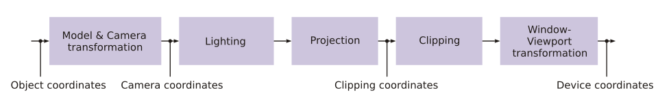

**摄像机变换**（来源：[Wikimedia Commons](https://commons.wikimedia.org/wiki/File:View_transform.svg)，CC BY-SA）：

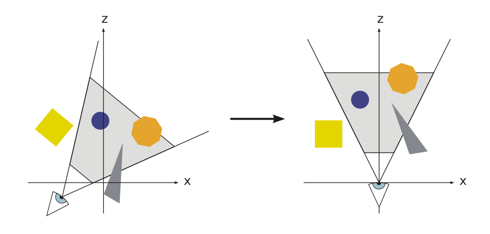

*左：摄像机在世界中的位置和朝向 | 右：变换后摄像机在原点，世界围绕它移动*

**裁剪**（来源：[Wikimedia Commons](https://commons.wikimedia.org/wiki/File:Cube_clipping.svg)，CC BY-SA）：

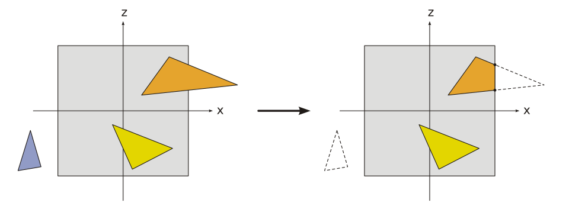

*蓝色三角形完全在视锥外 → 丢弃 | 橙色三角形部分在内 → 裁剪出新顶点*

**视口变换**（来源：[Wikimedia Commons](https://commons.wikimedia.org/wiki/File:Screen_Mapping.svg)，CC BY-SA）：

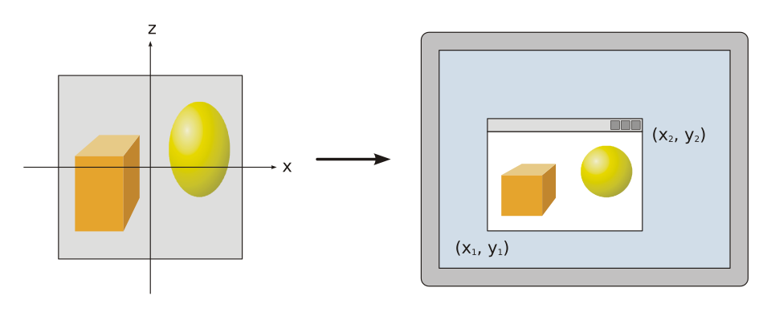

*NDC [-1,1] 映射到屏幕像素坐标*

### 透视投影矩阵

（来源：Wikipedia [Graphics Pipeline](https://en.wikipedia.org/wiki/Graphics_pipeline)）：

```
P = | f/aspect  0    0                        0                       |
    | 0         f    0                        0                       |
    | 0         0    (far+near)/(near-far)    2*far*near/(near-far)   |
    | 0         0    -1                       0                       |

其中 f = 1/tan(FOV/2)
```

### E1 软件光栅化器实测

从零用 Python 实现完整 5 步管线：

| 步骤 | 耗时 | 占比 |
|:---|---:|---:|
| Model Transform | 37.61 ms | 2.8% |
| Camera Transform | 0.16 ms | 0.0% |
| Projection | 12.55 ms | 0.9% |
| Viewport | 0.03 ms | 0.0% |
| **Rasterization** | **1296.47 ms** | **96.3%** |
| 总计 | 1346.81 ms | 100% |

> **关键发现**: 光栅化本身占总时间的 **96%**。矩阵变换很快，像素填充很慢。**这就是为什么 GPU 要把光栅化做成固定功能硬件 — 它是瓶颈。**

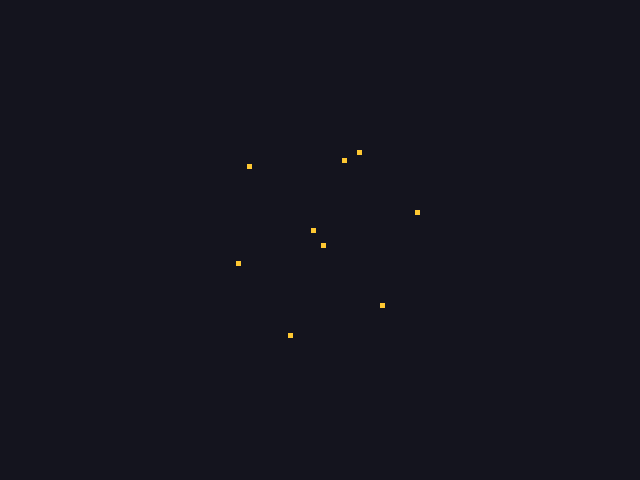

*E1 实验：640×480 分辨率，12 个顶点、14 个三角形经过 5 步变换后投影到屏幕上的位置*

---

## 3. 两条渲染路线：光栅化 vs 光线追踪

### 3.1 光栅化（Rasterization）

**什么是光栅化？** 一句话：**把三角形变成像素。**

屏幕是一块像素网格（比如 1920×1080 = 207 万个小格子）。管线前 4 步已经算出了每个三角形的屏幕坐标。现在的问题是：**哪些格子被这个三角形盖住了？盖住的格子涂什么颜色？**

换个方式说。你面前有一张**白纸**（屏幕），上面画了很多小格子（像素）。现在我告诉你："请在这张纸上画一个三角形，三个角的位置是 (100,50)、(200,300)、(50,250)"。你怎么画？你会拿起笔，找到这三个点，然后**把三角形内部的所有格子涂上颜色**。

```
          (100,50)
            ★
           ╱ ╲
          ╱   ╲
         ╱ ███ ╲
        ╱ █████ ╲
       ╱ ███████ ╲
      ★───────────★
  (50,250)      (200,300)

█ = 被三角形覆盖的像素 → 涂成三角形的颜色
空白 = 没被覆盖 → 保持背景色
```

**你刚才做的事情就叫"光栅化"。** "光栅"（Raster）来自德语，意思是"网格" — 光栅化就是把矢量图形（三角形坐标）变成光栅图像（像素网格里的颜色值）。

> **类比：十字绣。** 设计师画了一个三角形图案（= 三个坐标点），你拿到一块有网格的布（= 像素网格），需要在网格上把三角形内部的每个格子绣上对应颜色的线。这个"一格一格绣"的过程就是光栅化。

**为什么要"填充"而不是只"画边"？** 因为真实世界的物体是实心的，不是骨架。只画边线（线框渲染）无法区分前后遮挡，也无法显示材质颜色和光照明暗 — 填充后才能看起来像真实物体。

```
线框（只画边）：              填充（光栅化）：

      ╱╲                         ╱╲
     ╱  ╲                       ╱██╲
    ╱    ╲                     ╱████╲
   ╱      ╲                   ╱██████╲
  ╱________╲                 ╱████████╲

只能看到骨架                  看到实心面 → 像真实物体
前后面全透 → 分不清遮挡       前面挡住后面 → 正确的遮挡
```

**具体怎么做？** 用 **Edge Function**（边缘函数：一个数学公式，判断一个点是否在三角形内部）检测每个像素是否被三角形覆盖，然后用 **Z-Buffer**（深度缓冲区：记录每个像素最近的三角形距离，解决“前面的物体挡住后面的”问题）解决前后遮挡。

```python
# 伪代码 (来源：Scratchapixel CC BY-NC-ND 4.0)
for each triangle in scene:
    project vertices to screen
    compute bounding box
    for each pixel in bounding box:
        if pixel inside triangle (edge function):
            depth = interpolate z
            if depth < zbuffer[pixel]:
                zbuffer[pixel] = depth
                framebuffer[pixel] = shade(triangle)
```

**Z-Buffer 为什么赢了 Painter's Algorithm？** Painter's 按深度排序从远到近画（像画家），但无法处理互相穿透的三角形。Z-Buffer 逐像素比较深度，不需要排序，能处理任何遮挡。

**GPU 中的角色分工**：
- **Rasterizer Unit（固定功能）**: 做三角形→像素的覆盖测试
- **ROP（Render Output Unit，固定功能）**: Z-Buffer 深度测试 + Alpha 混合
- **CUDA Core（可编程）**: 跑 Vertex Shader 和 Fragment Shader — 计算顶点位置和像素颜色

> **易混淆点纠正**: CUDA Core **不直接做光栅化**！光栅化的"像素覆盖测试"由固定功能的 Rasterizer Unit 完成。CUDA Core 做的是 Shader 中的可编程计算（如光照、纹理采样）。

**E1 实验渲染结果**：

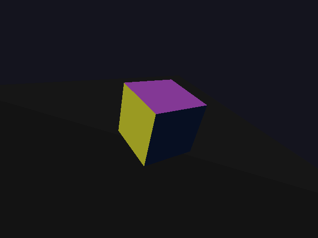

*软件光栅化器：彩色立方体（6 面 12 三角形）+ 灰色地面（2 三角形），Lambert 着色*

**Z-Buffer 深度图可视化**：

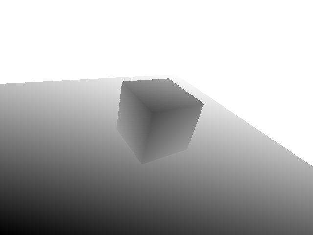

*近深远浅，立方体轮廓清晰 — 验证 Z-Buffer 深度排序正确*

### 3.2 光线追踪（Ray Tracing）

**什么是光线追踪？** 光栅化是“每个三角形问：我盖住了哪些像素？”，光线追踪反过来：**“每个像素问：我看到了什么物体？”**

> **类比：光栅化像“投影仪投射幻灯片到幕布上”（从物体到屏幕），光线追踪像“从你的眼睛射出一根激光笔，看它打到了什么东西上”（从屏幕到物体）。**

**为什么需要光线追踪？** 因为光栅化的光影是“假的”（用各种近似算法模拟），而光线追踪模拟光线的真实物理行为（反射、折射、阴影），所以看起来更真实。代价是慢 1-2 个数量级。

**原理**: 从摄像机逐像素射出光线 → 找最近交点 → 计算光照 + **阴影光线**（从交点向光源发一条光线，检查中间有没有东西挡住 — 有就是阴影，没有就被照亮）+ **反射光线**（光线打到镜面后弹开，继续追踪 — 这就是为什么镜子里能看到东西）。

**Ray-Sphere 求交**（解二次方程，来源：Wikipedia [Ray Tracing](https://en.wikipedia.org/wiki/Ray_tracing_(graphics))）：

```
||origin + t·dir - center||² = r²
→ t² + 2t(v·d) + (v·v - r²) = 0
→ 判别式 Δ = b² - 4ac
  Δ < 0: 不相交 | Δ = 0: 相切 | Δ > 0: 两个交点取较近的
```

**Ray-Triangle 求交**: Möller-Trumbore 算法 (1997)，用叉积和点积计算重心坐标。

**GPU 中的角色分工**：
- **RT Core（固定功能）**: 做 **BVH**（Bounding Volume Hierarchy，“包围盒层级结构” — 把数百万个三角形按空间位置分组装进嵌套的盒子里，光线先测试是否击中大盒子，再测小盒子，最后才测具体三角形 — 这样就不需要对每条光线检查所有三角形）遍历 + Ray-Triangle 求交
- **CUDA Core（可编程）**: 跑光照计算 Shader（Lambert/Phong/PBR）

> **RT Core 只做一件事**: 快速找到光线和三角形的交点。光照、阴影、反射的逻辑仍由 CUDA Core 上的 Shader 完成。RT Core 是加速瓶颈操作的 ASIC。

**E2 光追展示场景**（反射 + 阴影 + 多光源）：

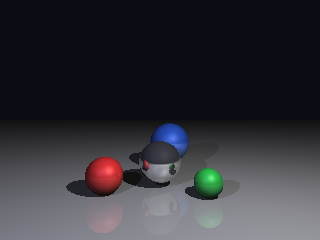

*4 个球体：银色镜面球清晰反射其他球体 + 阴影投射在地面 + 双光源照明*

| 参数 | 值 |
|:---|:---|
| 分辨率 | 320×240 |
| 主光线数 | 76,800 |
| 最大反射深度 | 3 次 |
| 渲染时间 | 4.68 秒 |
| 每像素 | 60.9 µs |

### 3.3 效果对比

| 效果 | 光栅化 | 光线追踪 |
|:---|:---|:---|
| **实体几何渲染** | ✅ 看家本领 — 三角形填充 + Z-Buffer 遮挡 | ✅ 光线-物体求交 + 深度排序 |
| **纹理贴图** | ✅ 看家本领 — UV 映射、Mipmap 过滤 | ✅ 在交点处采样纹理 |
| **直接光照（Phong/Lambert）** | ✅ 看家本领 — 逐顶点或逐像素 Shader 计算 | ✅ 在交点处计算 |
| **法线贴图 / 凹凸贴图** | ✅ 看家本领 — Fragment Shader 中扰动法线 | ✅ 在交点处扰动法线 |
| **SSAO（环境光遮蔽）** | ✅ 屏幕空间深度采样，实时 | ⚠️ 不需要 — 全局光照天然包含 AO |
| **阴影** | ⚠️ Shadow Map（边缘可能有锯齿；大场景需要级联） | ✅ 阴影光线遮挡测试（柔和准确） |
| **镜面反射** | ⚠️ Cube Map / SSR（只能反射屏幕内可见物体） | ✅ 递归反射光线（物理正确） |
| **折射 / 玻璃** | ⚠️ 屏幕空间扭曲（近似） | ✅ Snell's Law + 折射光线 |
| **全局光照** | ⚠️ 预烘焙 Light Probe / Light Map（仅静态） | ✅ Path Tracing Monte Carlo（动态） |
| **焦散** | ❌ 无法模拟 | ✅ 光线聚焦自然产出 |
| **速度** | ✅ **实时 60-240 fps** | ❌ 慢 1-2 个数量级 |
| **硬件成熟度** | ✅ 30+ 年优化，固定功能 Rasterizer Unit | ⚠️ RT Core 自 2018 起，仍在演进中 |

> **核心结论**：光栅化能出色完成绝大多数日常渲染任务（几何、纹理、直接光照、法线贴图），且保持实时速度。光线追踪的优势在于需要**物理追踪光路**的效果 — 反射、折射、柔和阴影、全局光照、焦散。现代游戏采用**混合方案**：先光栅化出基础画面，再选择性地对收益最大的效果（通常是反射和阴影）做光线追踪增强。

### 3.4 E3 像素级对比实验

同一场景（彩色立方体 + 地面），E1 光栅化 vs E2 光追，640×480：

| 指标 | 值 | 含义 |
|:---|:---|:---|
| MSE | 3577.58 | 差异显著 |
| SSIM | -0.07 | 两种方法产生了视觉上完全不同的结果 |
| 完全相同像素 | 0.1% | 仅深色背景 |
| 中等差异 | 60.1% | 几何一致但光照模型不同 |
| **大差异** | **38.2%** | **集中在阴影区域** |

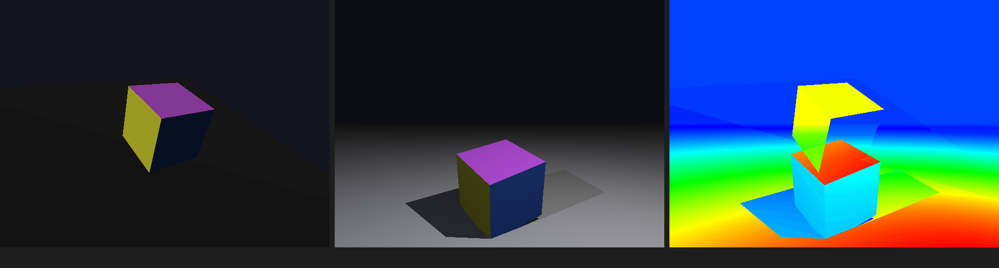

*左：E1 光栅化（无阴影）| 中：E2 光追（有阴影+双光源）| 右：差异热力图*

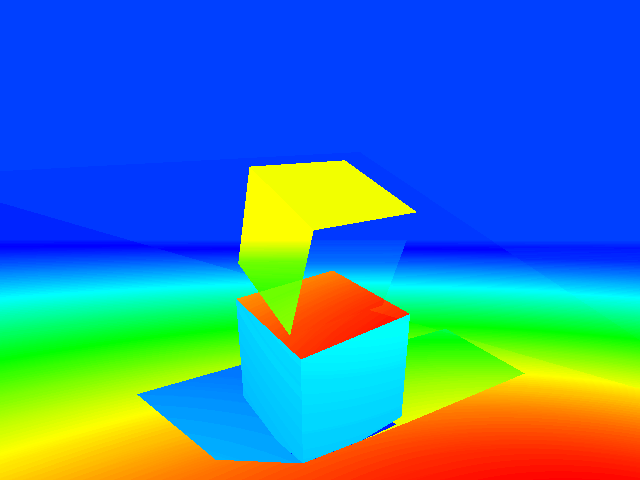

*蓝色=相似 | 红/橙=差异大 — 差异主要在地面阴影区域和立方体受光面*

**E2 对比场景渲染**（与 E1 同视角的光追版本）：

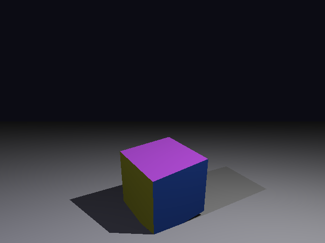

*同一立方体场景的光追渲染 — 注意地面上的阴影投射和更自然的光照*

**速度对比**:

| 方法 | 640×480 渲染时间 | 比率 |
|:---|:---:|:---:|
| E1 光栅化 | 1.3 秒 | 1x |
| E2 光追 | 169 秒 | **130x 慢** |

> **核心结论**: 光追以 **130 倍的性能代价** 换取物理真实的光影。这就是 RT Core 存在的意义 — 硬件加速将这个代价降低到可接受的范围。

### 3.5 E4 Blender EEVEE vs Cycles

使用 Blender 3.0.1 在 Azure A10 VM 上渲染同一场景：

| 引擎 | 类型 | Samples | 渲染时间 | 设备 |
|:---|:---|:---:|:---:|:---|
| **EEVEE** | 光栅化 | 32 | **2.37 秒** | GPU (OpenGL) |
| **Cycles** | 光追 (Path Tracing) | 64 | **7.24 秒** | CPU (回退) |

**EEVEE 渲染结果**（光栅化）：

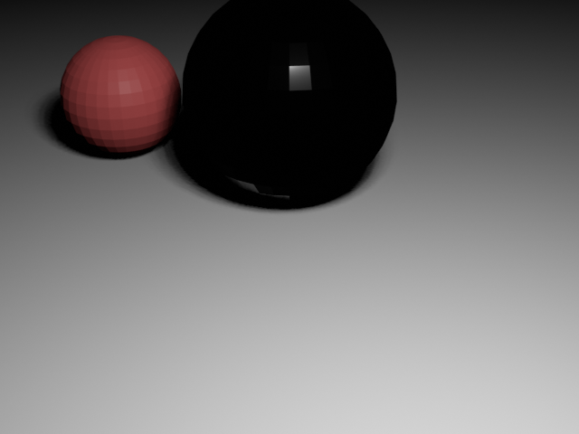

*EEVEE：金属球近乎黑色是因为 Metallic=1.0 但 EEVEE 的 Screen-Space Reflection 只能反射屏幕内可见的物体*

> **Azure vGPU 发现**: A10-24Q 是虚拟化 GPU，nvidia-smi 显示 GPU 利用率 0% — Blender Cycles 无法识别 vGPU 为 CUDA 渲染设备，完全回退到 CPU。Cycles headless 模式还存在色彩管理问题（"Filmic" view transform 未找到），导致输出全黑。这说明 **vGPU 和物理 GPU 在图形渲染兼容性上有显著差异**。

---

## 4. GPU 架构演进：从渲染专用机到 AI 通用加速器

```
1990s   固定管线 — 硬件只能做预定义的渲染步骤（不可编程）
2001    可编程 Shader (GeForce 3) — Vertex/Pixel Shader 可编程
2006    统一着色器 (GeForce 8) — CUDA 诞生 → GPGPU → AI 的起点
2017    Tensor Core (Volta V100) — 矩阵乘法硬件加速 → DL 训练爆发
2018    RT Core (Turing RTX 20) — BVH+求交硬件 → 实时光追
2020    3rd gen Tensor Core (A100) — TF32/BF16/INT8, 结构化稀疏 2:4
2022    4th gen Tensor Core (H100) — FP8, Transformer Engine
2024    5th gen Tensor Core (B200) — FP4, Confidential Computing
```

**最核心的设计模式**：当某个操作成为瓶颈且模式固定 → **做成专用硬件**。

| 演进阶段 | 渲染领域 | AI 领域 | 共同模式 |
|:---|:---|:---|:---|
| 通用 CPU | CPU 做所有渲染 | CPU 做所有 ML | 灵活但慢 |
| 可编程 GPU | CUDA Core 跑 Shader | CUDA Core 跑 CUDA kernel | 并行加速 |
| 专用 ASIC | RT Core（BVH+求交） | Tensor Core（矩阵乘法） | 瓶颈操作 → 专用硬件 |

---

## 5. GPU 三种核心在渲染和 AI 中的完整角色

### 5.1 三种核心对比

| 维度 | CUDA Core | RT Core | Tensor Core |
|:---|:---|:---|:---|
| **硬件类型** | 通用 ALU（可编程） | 固定功能 ASIC | 固定功能矩阵乘单元 |
| **核心操作** | 浮点加减乘除 | BVH 遍历 + Ray-Triangle 求交 | 4×4 矩阵乘法 (GEMM) |
| **渲染中做什么** | Vertex Shader + Fragment Shader（计算顶点位置、光照、纹理采样） | 光线追踪的加速结构遍历（找光线和三角形的交点） | DLSS 的神经网络推理（超分辨率 + 帧生成） |
| **AI 中做什么** | 通用 CUDA 计算（数据预处理、非矩阵操作） | —（不用于 AI） | 所有矩阵密集操作（Attention 的 QK^T、FFN 的线性层） |
| **可编程性** | ✅ 完全可编程 | ❌ 不可编程 | ❌ 不可编程（固定尺寸矩阵乘） |
| **引入时间** | 2006 (GeForce 8 / G80) | 2018 (Turing / RTX 20) | 2017 (Volta / V100) |

### 5.2 一帧游戏画面中三种 Core 的协作

```
一帧渲染流程（现代混合渲染管线）:

CUDA Core  ──→ 运行 Vertex Shader：计算顶点位置
    ↓
固定功能 Rasterizer Unit ──→ 三角形→像素覆盖测试
    ↓
CUDA Core  ──→ 运行 Fragment Shader：计算像素颜色（材质+光照）
    ↓
ROP (固定功能) ──→ Z-Buffer 深度测试 + Alpha 混合 → 基础画面完成
    ↓
RT Core ──→ 对选定效果（反射/阴影/全局光照）做光线追踪增强
    ↓
CUDA Core ──→ 光追命中后的光照计算 Shader
    ↓
Tensor Core ──→ DLSS：低分辨率输入 + 运动向量 + 上一帧 → AI 超分到高分辨率
    ↓
Tensor Core ──→ DLSS Frame Gen：AI "凭空"生成中间帧 → 帧率翻倍
    ↓
输出 → 显示器
```

> **关键理解**: 三种 Core 不是选一个用，而是**在同一帧中串联协作**。CUDA Core 负责可编程的灵活计算，RT Core 加速光追的瓶颈操作，Tensor Core 做 AI 推理补偿性能损失。

### 5.3 数据中心 GPU vs 游戏 GPU

| GPU | CUDA Core | Tensor Core | RT Core | 定位 |
|:---|:---:|:---:|:---:|:---|
| **H100** SXM | 16,896 | 528 (4th gen) | ❌ **没有** | 纯 AI 训练推理 |
| **A100** | 6,912 | 432 (3rd gen) | ❌ **没有** | 纯 AI 训练推理 |
| **A10** | 9,216 | 288 (3rd gen) | ✅ 72 (2nd gen) | 推理 + 图形混合 |
| **RTX 4090** | 16,384 | 512 (4th gen) | ✅ 128 (3rd gen) | 游戏 + AI |
| **RTX 5090** | 21,760 | 680 (5th gen) | ✅ 170 (4th gen) | 游戏 + AI |

来源：NVIDIA 官方产品规格

> **洞察**: 数据中心 GPU（H100/A100）**完全没有 RT Core** — 它们的芯片面积全部给了 Tensor Core 和 CUDA Core。**GPU 不是一种硬件，而是根据工作负载定制的芯片家族。** A10 是少数三种 Core 都有的"跨界"GPU，这也是它被用于 Azure NV 系列（图形 + 推理混合工作负载）的原因。

---

## 6. DLSS：Tensor Core 在渲染中的角色 — 渲染 × AI 的第一个大规模融合

### 6.1 DLSS 是什么

DLSS（Deep Learning Super Sampling）在 Tensor Core 上运行一个**时序反馈神经网络**，将低分辨率渲染帧超分辨率到高分辨率，并可生成中间帧提升帧率。

**核心思路**: GPU 花大量时间做的是"像素填充"（光栅化/光追）。DLSS 的策略是 — **少渲染一些像素（如只渲 1080p），用 AI 补回去（补到 4K）**。

### 6.2 DLSS 代际演进

| 版本 | 年份 | 核心技术 | 突破 |
|:---:|:---:|:---|:---|
| 1.0 | 2019 | 每游戏单独训练 CNN | 第一次在游戏中用 AI 做超分 |
| 2.0 | 2020 | **通用时序反馈网络** + 运动向量 + 前帧信息 | 一个模型适配所有游戏（质的飞跃） |
| 3.0 | 2022 | + **帧生成**（AI "凭空"生成中间帧） | 从超分辨率扩展到帧率提升 |
| 4.0 | 2025 | Multi Frame Generation（一次最多 3 帧） | 帧率可提升 8x |
| 4.5 | 2025 | Dynamic Multi Frame Generation | 动态调整生成帧数 |

### 6.3 DLSS 核心算法

```
输入：
  - 低分辨率当前帧（如 1080p）
  - 运动向量（Motion Vector）：每个像素从上一帧到当前帧的位移
  - 上一帧的高分辨率结果（如 4K）

网络：时序卷积网络，在 Tensor Core 上推理
  - 延迟要求：<2ms/帧（游戏要求 60fps = 16.6ms/帧，DLSS 只能占一小部分）
  - 精度：FP16（Tensor Core 原生支持）

输出：高分辨率当前帧（如 4K）
```

来源：https://www.nvidia.com/en-us/geforce/technologies/dlss/ 、https://developer.nvidia.com/blog/nvidia-dlss-4-5-delivers-super-resolution-upgrades-and-new-dynamic-multi-frame-generation/

### 6.4 DLSS 的意义

| 维度 | 意义 |
|:---|:---|
| **对游戏** | 用 AI 补回光追的性能损失 — 开光追+DLSS 比不开光追还快 |
| **对 AI** | 证明 Tensor Core 不仅能训练模型，还能在**实时应用**中做推理（<2ms 硬约束） |
| **对硬件设计** | 推动了 Tensor Core 在消费级 GPU 中的普及（RTX 20 系列起） |

> **DLSS 和 LLM 推理用的是同一个硬件**: Tensor Core 做 FP16 矩阵乘法。区别只在延迟要求 — DLSS 需要 <2ms，LLM 推理通常容忍数十到数百毫秒。

---

## 7. ★ 核心章节：渲染设计 × AI 推理 — 用工程数据验证的 6 个深层关联

### 7.1 分块渲染 ↔ FlashAttention — IO-aware Tiling

**渲染**: Tiled Rendering 将屏幕分成小块（如 16×16 像素），每块的三角形列表独立处理，避免全局内存带宽瓶颈。

**AI**: FlashAttention 将 Q/K/V 矩阵分块，在 SRAM 中完成 Softmax 计算，避免将中间结果写回 HBM。

**作者实测**: FlashInfer 在 A100/32K 序列时比 FlashAttention 快 9-15%。来源：[FlashInfer-vs-FlashAttention-Benchmark](https://github.com/david-xinyuwei/david-share/tree/master/Deep-Learning/FlashInfer-vs-FlashAttention-Benchmark)

**共同原理**: **把计算搬到数据旁边，而非把数据搬到计算旁边。** 在 GPU 上，计算便宜，内存访问昂贵。

### 7.2 Z-Buffer ↔ PagedAttention — 按需内存管理

**渲染**: Z-Buffer 逐像素按需写入深度值，不预分配整个场景的内存。

**AI**: PagedAttention（vLLM）将 KV Cache 按页（block）分配，不预分配最大序列长度的连续内存。

**作者实测**: GQA/MLA/Hybrid Attention/Hybrid Mamba 四种架构的 KV Cache 大小差异超过 10 倍。来源：[KV-Cache-Deep-Dive](https://github.com/david-xinyuwei/david-share/tree/master/Deep-Learning/KV-Cache-Deep-Dive)

**共同原理**: **内存是稀缺资源，按需分配优于预分配。** Z-Buffer 的"先到先写"策略和 PagedAttention 的"用时再分"策略异曲同工。

### 7.3 Mipmap/LOD ↔ Speculative Decoding — 先粗后精

**渲染**: 远处物体用低分辨率纹理（Mipmap 低级 LOD），近处用高分辨率。节省带宽。

**AI**: Speculative Decoding 用小模型（draft model）快速生成多个候选 token，再用大模型一次性验证/拒绝。

**作者实测**: EAGLE3 在 Qwen 模型上实现 2.67x 加速（官方权重）。来源：[Speculative-Decoding-EAGLE3](https://github.com/david-xinyuwei/david-share/tree/master/Deep-Learning/Speculative-Decoding-EAGLE3)

**共同原理**: **先用便宜的近似，再用昂贵的精确验证。** 大多数情况下近似就够了，只在需要时才调用高精度。

### 7.4 Z-fighting ↔ BF16 精度问题 — 有限精度的工程后果

**渲染**: Z-Buffer 通常 16-bit 或 24-bit 精度。两个三角形深度极其接近时，精度不够导致像素闪烁（Z-fighting）。

**AI**: BF16 只有 7-bit 尾数。Diffusion 模型的多步 ODE 求解中，BF16 舍入误差在 8-50 步中累积放大，导致 `fuse_lora` 和 `set_adapters` 两种 LoRA 加载方式产生可测量的图像质量差异。

**作者实测**: 蒸馏 8 步 + CFG=4 时，fuse_lora SSIM=1.0 vs set_adapters SSIM=0.88-0.91。误差来源：BF16 浮点运算路径不同（27% merge-time + 73% inference-path）。来源：[LoRA-Merge-Quality-Impact](https://github.com/david-xinyuwei/david-share/tree/master/DL-Algorithm-Insights/LoRA-Merge-Quality-Impact)

**共同原理**: **有限精度在累积计算中放大误差，步数越少越敏感。** Z-Buffer 的解决方案是增加精度（24-bit/32-bit）；AI 的解决方案是 fuse_lora（在精度损失前合并权重）。

### 7.5 帧缓冲 ↔ KV Cache — 缓存中间结果

**渲染**: DLSS 利用上一帧（Frame Buffer）+ 运动向量生成高分辨率输出，不从零渲染每帧。

**AI**: KV Cache 缓存已计算的 Key/Value 张量，生成下一 token 只需计算新 Q 与缓存的 K/V 做 Attention。

**作者实测**: Qwen3.5-122B MoE 模型的 KV Cache 在 FP8 量化下减少约 50% VRAM。来源：[Qwen3.5-122B-Azure-vs-AWS-Benchmark](https://github.com/david-xinyuwei/david-share/tree/master/Deep-Learning/Qwen3.5-122B-Azure-vs-AWS-Benchmark)

**共同原理**: **缓存中间结果，用空间换时间。** 帧缓冲和 KV Cache 都面临"缓存什么、何时淘汰"的设计决策。

### 7.6 光追 Monte Carlo ↔ Diffusion DDPM — 随机到有序

**渲染**: Path Tracing 对每个像素随机采样多条光路（Monte Carlo 积分），结果有噪声 → 用降噪器平滑。

**AI**: Diffusion 从纯高斯噪声开始，逐步去噪还原图像。蒸馏通过让学生模型学习教师的多步轨迹，压缩步数。

**作者实测**: 扩散模型蒸馏将 40 步去噪压缩到 8 步（ODE 轨迹蒸馏），速度提升 5 倍但质量可量化下降。来源：[Diffusion-Distillation](https://github.com/david-xinyuwei/david-share/tree/master/DL-Algorithm-Insights/Diffusion-Distillation)

**共同原理**: **从随机到有序的迭代过程，步数和质量的权衡。** Path Tracing 增加 samples 降低噪声；Diffusion 增加 steps 提升质量。两者都可以通过"蒸馏/预计算"减少迭代次数。

---

## 8. 2D→3D 重建：渲染的逆问题

渲染是 3D→2D（确定性过程，有唯一解）。2D→3D 是反过来（不确定过程，需要 AI "猜"）。

| 方法 | 输入 | 核心思想 | 速度 |
|:---|:---|:---|:---|
| **NeRF** (2020) | N 张照片 | MLP 拟合 5D 辐射场 (x,y,z,θ,φ)→(r,g,b,σ) | 慢（秒级/帧） |
| **3D Gaussian Splatting** (2023) | N 张照片 | 数百万个 3D 高斯椭球"泼"到屏幕上 | **快 100x**（实时） |
| **单图深度估计** | 1 张照片 | 大规模数据学习透视/遮挡等视觉先验 | 实时 |
| **生成式 3D** | 文字/图片 | Diffusion + 多视角重建 | 秒-分钟级 |

来源：Wikipedia [Neural Radiance Field](https://en.wikipedia.org/wiki/Neural_radiance_field) + [Gaussian Splatting](https://en.wikipedia.org/wiki/Gaussian_splatting)

---

## Running on Azure

**本文实验环境**：

| 项目 | 值 |
|:---|:---|
| VM | Azure 1a10vm (Standard_NV6ads_A10_v5) |
| GPU | NVIDIA A10-24Q (vGPU, Ampere, Compute 8.6) |
| 驱动 | 550.144.06 |
| OS | Ubuntu 22.04.5 LTS |
| Blender | 3.0.1 |
| Python | 3.10.12 |
| 位置 | Canada Central |

**第 7 章跨项目引用的实测数据来自**：

| 项目 | GPU | 链接 |
|:---|:---|:---|
| FlashInfer-vs-FA | A100 80GB | [链接](https://github.com/david-xinyuwei/david-share/tree/master/Deep-Learning/FlashInfer-vs-FlashAttention-Benchmark) |
| KV-Cache-Deep-Dive | 原理分析 | [链接](https://github.com/david-xinyuwei/david-share/tree/master/Deep-Learning/KV-Cache-Deep-Dive) |
| EAGLE3 | H100 | [链接](https://github.com/david-xinyuwei/david-share/tree/master/Deep-Learning/Speculative-Decoding-EAGLE3) |
| LoRA-Merge-Quality | H100 | [链接](https://github.com/david-xinyuwei/david-share/tree/master/DL-Algorithm-Insights/LoRA-Merge-Quality-Impact) |
| Diffusion-Distillation | H100 | [链接](https://github.com/david-xinyuwei/david-share/tree/master/DL-Algorithm-Insights/Diffusion-Distillation) |
| Qwen3.5-122B | H100 | [链接](https://github.com/david-xinyuwei/david-share/tree/master/Deep-Learning/Qwen3.5-122B-Azure-vs-AWS-Benchmark) |

**复现实验**：

```bash
pip install numpy Pillow

# E1: 软件光栅化器（5 步管线 + Edge Function + Z-Buffer）
python3 scripts/e1_software_rasterizer.py --width 640 --height 480

# E2: 光线追踪器（反射+阴影）
python3 scripts/e2_ray_tracer.py --width 320 --height 240 --scene showcase --max-depth 3

# E2: 同场景对比版（无反射，用于 E3）
python3 scripts/e2_ray_tracer.py --width 640 --height 480 --scene match_e1 --max-depth 0

# E3: 像素级对比（MSE/SSIM + 差异热力图）
pip install scikit-image
python3 scripts/e3_compare_results.py \
  --img1 results/e1_rasterizer/e1_final_render.png \
  --img2 results/e2_raytracer/e2_match_e1_render.png

# E4: Blender EEVEE vs Cycles（需要 Blender + xvfb）
xvfb-run -a blender -b -P scripts/e4_blender_benchmark.py
```

---

## 来源

| 内容 | 来源 |
|:---|:---|
| Graphics Pipeline | Wikipedia [Graphics Pipeline](https://en.wikipedia.org/wiki/Graphics_pipeline) |
| 光栅化算法 | [Scratchapixel](https://www.scratchapixel.com/lessons/3d-basic-rendering/rasterization-practical-implementation/overview-rasterization-algorithm.html) (CC BY-NC-ND 4.0) |
| 光线追踪 | Wikipedia [Ray Tracing](https://en.wikipedia.org/wiki/Ray_tracing_(graphics)) |
| 渲染总论 | Wikipedia [Rendering](https://en.wikipedia.org/wiki/Rendering_(computer_graphics)) |
| DLSS | [NVIDIA DLSS](https://www.nvidia.com/en-us/geforce/technologies/dlss/) |
| DLSS 4.5 | [NVIDIA Developer Blog](https://developer.nvidia.com/blog/nvidia-dlss-4-5-delivers-super-resolution-upgrades-and-new-dynamic-multi-frame-generation/) |
| RT Core 架构 | [NVIDIA Turing In-Depth](https://developer.nvidia.com/blog/nvidia-turing-architecture-in-depth/) |
| GPU 规格 | NVIDIA 官方产品页面 |
| NeRF / 3DGS | Wikipedia [Neural Radiance Field](https://en.wikipedia.org/wiki/Neural_radiance_field) + [Gaussian Splatting](https://en.wikipedia.org/wiki/Gaussian_splatting) |
| 渲染×AI 关联 | 作者实测数据（第 7 章各子节来源链接） |
