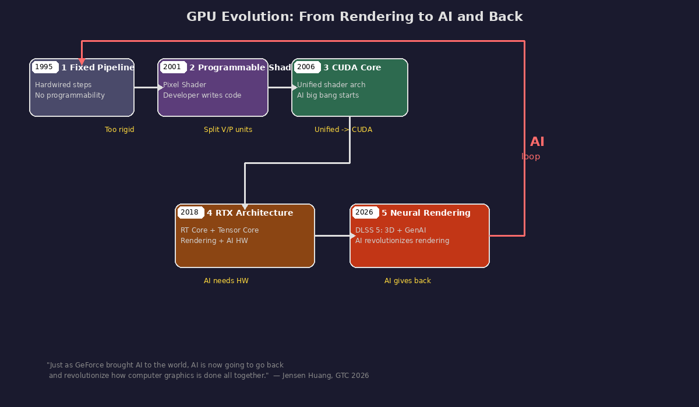
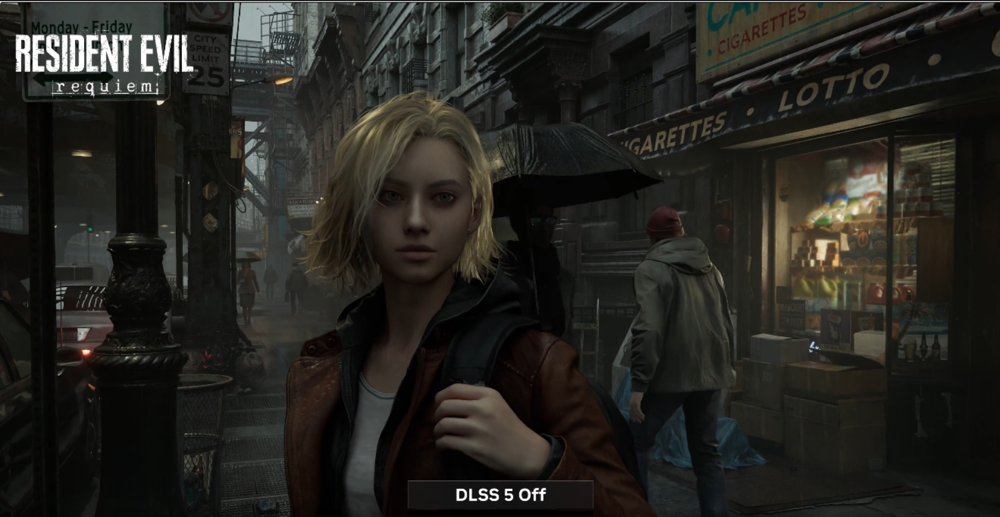
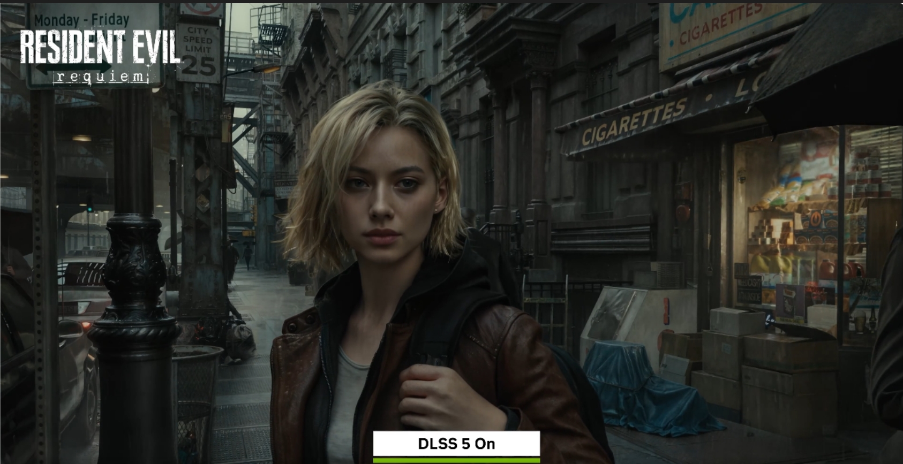

# GPU Architecture Deep Dive: From 3D Rendering to AI Inference — A GPU Panoramic Guide for Inference Engineers

> **Author**: Xinyu Wei
>
> **Core Thesis**: GPUs were born for 3D rendering; AI inference is the "accidental beneficiary." Understanding the design philosophy of rendering reveals why GPUs are naturally suited for AI.
>
> **Jensen Huang, GTC 2026**: *"Just as GeForce brought AI to the world, AI is now going to go back and revolutionize how computer graphics is done all together."* — GPUs were born for rendering, which gave birth to AI; AI is now revolutionizing rendering in return. This closed loop is the main thread of this article.
>
> **Main Thread — Five-Step GPU Evolution & Rendering↔AI Closed Loop**:
> ```
> ①Fixed Pipeline (1995)  →  ②Programmable Shader (2001)  →  ③Unified into CUDA Core (2006)
>   Every step hardwired       Developers can finally write     Vertex/Pixel Shader merged
>   Can't change, only tweak   code to decide pixel shading     into one general programmable core
>                                                                          
>                    v
>   ④ RTX: RT Core + Tensor Core (2018)  →  ⑤ Neural Rendering / DLSS 5 (2026)
>     Ray tracing accel (RT Core) +           3D graphics × generative AI fusion
>     AI inference (Tensor Core)              AI revolutionizes rendering back --→ loop 🔄
>     GPU has rendering + AI dedicated HW for the first time
> ```
> Driving force at each step: ①Too rigid → ②Programmable but split → ③Unified → CUDA → AI big bang → ④AI needs dedicated HW → ⑤AI gives back to rendering
>
> 
>
> **What Makes This Article Unique**: The author validates the deep connections between rendering techniques and AI inference using **real benchmark data** from LLM/Diffusion inference optimization work. It also provides from-scratch implementations of a software rasterizer and ray tracer, allowing direct visual comparison of the two rendering approaches.

---

## Executive Summary

| Rendering Design Decision | Corresponding AI Inference Technique | Author's Benchmark Evidence |
|:---|:---|:---|
| Tiled Rendering | FlashAttention Tiled Computation | FlashInfer 9-15% faster than FA at 32K ([link](https://github.com/david-xinyuwei/david-share/tree/master/Deep-Learning/FlashInfer-vs-FlashAttention-Benchmark)) |
| Z-Buffer Per-Pixel Memory Management | PagedAttention Per-Block KV Cache | KV Cache Six-Level Deep Dive ([link](https://github.com/david-xinyuwei/david-share/tree/master/Deep-Learning/KV-Cache-Deep-Dive)) |
| Mipmap Multi-Resolution LOD | Speculative Decoding Draft Verification | EAGLE3 2.67x Speedup ([link](https://github.com/david-xinyuwei/david-share/tree/master/Deep-Learning/Speculative-Decoding-EAGLE3)) |
| Z-fighting Precision Flickering | BF16 Precision Accumulation Error | fuse_lora SSIM diff 2-18% ([link](https://github.com/david-xinyuwei/david-share/tree/master/DL-Algorithm-Insights/LoRA-Merge-Quality-Impact)) |
| Frame Buffer Reuse from Previous Frame | KV Cache Key/Value Caching | GQA/MLA Four-Architecture Comparison ([link](https://github.com/david-xinyuwei/david-share/tree/master/Deep-Learning/KV-Cache-Deep-Dive)) |
| Ray Tracing Monte Carlo Denoising | Diffusion DDPM Denoising | Distillation 40→8 steps ([link](https://github.com/david-xinyuwei/david-share/tree/master/DL-Algorithm-Insights/Diffusion-Distillation)) |

### How to Read This Article

The table above is the punchline — but why do rendering and AI inference share the same bag of tricks? Because they face **the same class of engineering constraints**:

1. **Compute is cheap, memory bandwidth is expensive** → Both independently invented "tiling" (Tiled Rendering / FlashAttention) to keep data in fast on-chip SRAM.
2. **Memory is scarce and unpredictable in size** → Both independently invented "on-demand paging" (Z-Buffer / PagedAttention) instead of pre-allocating worst-case buffers.
3. **Most work can be approximated cheaply; only a few cases need full precision** → Both independently invented "coarse-then-fine" (Mipmap LOD / Speculative Decoding draft-then-verify).
4. **Finite numerical precision accumulates errors over iterative steps** → Both suffer and both compensate (Z-fighting fix: increase depth bits; BF16 fix: fuse weights before precision loss).
5. **Recomputing from scratch every iteration is wasteful** → Both cache intermediate results (Frame Buffer reuse / KV Cache).
6. **When a bottleneck operation has a fixed pattern, it becomes dedicated hardware** → Rasterizer Unit, RT Core, Tensor Core are all instances of this principle.

GPUs are not "accidentally" good at AI. **The 30 years of engineering wisdom accumulated in rendering — tiling, caching, approximation, dedicated hardware — are the very same methodologies that AI inference uses today.** Chapters 1-6 build up the rendering side of this story; Chapter 7 maps each rendering concept to its AI counterpart with real benchmark data.

---

## 1. First Principles: Why Does 3D Need to Become 2D?

**Because displays are 2D.** A screen is a flat pixel matrix (e.g., 3840×2160), and a 3D scene must be "flattened" into a 2D image.

This mirrors how human vision works: the real world is 3D, but the retina is a 2D curved surface — 3D light rays are projected onto the retina through the lens to become 2D signals, and the brain "fills in" the depth perception.

> **Easy to confuse**: 3D→2D is **rendering** (the topic of this article); 2D→3D is **reconstruction** (e.g., NeRF / 3D Gaussian Splatting, see Chapter 8). Both rasterization and ray tracing are 3D→2D methods, **not** 2D→3D.

**Why are triangles the fundamental building block?** Any 3 points are guaranteed to be coplanar (they uniquely determine a plane), but 4 points may not — the 4th point might "stick out" of the plane.

```
3 points → always on the same plane:      4 points → the 4th may not be coplanar:

      A ●                                       A ●
     ╱   ╲    ← No matter where these          ╱   ╲
    ╱     ╲      3 points are, a plane         ╱  D●  ╲  ← D might be above or
                                             B       C
```

**Real-life example**: A 3-legged table never wobbles (3 points determine a plane); a 4-legged table often has one leg hovering (4 points may not be coplanar). If quadrilaterals were used as the primitive, the face would "twist and fold" when the 4 points aren't coplanar, resulting in incorrect rendering. Triangles don't have this problem — **that's why GPUs only process triangles**. A single game character can be composed of hundreds of thousands of triangles.

**Every 3D object in the GPU is a triangle mesh**: The smooth spheres, human faces, and cars you see are all composed of thousands of tiny triangles inside the GPU — more triangles means a closer approximation to smooth:

```
What you see: a smooth sphere        What the GPU sees: thousands of triangles

      ████                                ╱╲╱╲
    ████████                             ╱╲╱╲╱╲
   ██████████                           ╱╲╱╲╱╲╱╲
    ████████                             ╲╱╲╱╲╱╲
      ████                                ╲╱╲╱
```

> **Triangles are the computer's approximation of the physical world, not physical reality.** Real object surfaces are continuously smooth, but computers can only store discrete numbers, so they must use enough small triangles to "approximate" continuous surfaces. Why triangles? ① Any curved surface can be approximated by enough triangles to be indistinguishable to the naked eye ② The math for ray-triangle intersection is simple ③ GPU hardware has been optimized for triangle processing for 30 years. If better surface representations with hardware support emerge in the future (e.g., NURBS mathematical surfaces, Voxels, 3D Gaussian Splatting), triangles could be replaced — but they remain the industry standard today.

---

## 2. Graphics Pipeline: 5 Steps in Detail

> **What is a Pipeline?** In this context, it means an **assembly line**. Unlike a sequential process, on an assembly line **every stage works simultaneously** — Stage 1 processes triangle 5 while Stage 2 processes triangle 4, and Stage 3 processes triangle 3… just like a car assembly line where multiple cars are at different stations at the same time.

The core of 3D→2D rendering is **5 coordinate transformations**, each being a 4×4 matrix multiplication.

> **Analogy**: Imagine you're taking a photograph. You need to: ① Position the object (Model Transform) ② Set up the camera pointing at the object (Camera Transform) ③ Look through the lens for "closer=bigger, farther=smaller" (Perspective Projection) ④ Crop out everything outside the viewfinder (Clipping) ⑤ Print the photo (Viewport Transform).

```
Model Coordinates → [Model Transform] → World Coordinates → [Camera Transform] → Camera Coordinates
→ [Projection] → NDC → [Clipping] → [Viewport] → Screen Pixels
```

> **Analogy: Taking a photograph.** ① Position the object (Model Transform) ② Set up the camera (Camera Transform) ③ Look through the lens — "closer=bigger" (Perspective Projection) ④ Crop outside the viewfinder (Clipping) ⑤ Print the photo (Viewport Transform).

### 2.1 Step 1: Model Transform — "Place Objects in the Scene"

**Problem to solve**: 3D objects are created by different artists independently. The tree artist places the tree root at (0,0,0); the car artist places the car center at (0,0,0). Without a unified coordinate system, everything piles up at the origin.

> **What is "World Coordinates"?** It's simply the **global coordinate system for this image**. It's called "world" because the game industry calls scenes "World." Think of latitude/longitude on a city map — no matter whether you built a house in Beijing or New York, they all need to be plotted on the same map to be viewed together.
>
> - **Local Coordinates** (Local/Model) = each object's own internal coordinates ("1 meter left of the sofa")
> - **World Coordinates** (World) = the global coordinates for this scene ("100 Jianguo Road, Chaoyang District, Beijing")
> - **Model Transform** = converting local coordinates to global coordinates (finding this building's address on the city map)
>
> **One world coordinate system corresponds to one Scene, and one Scene renders one frame.** Different levels/scenes have their own independent world coordinate systems.

**Model Transform includes three operations** that solve three problems:

```
Without unified coordinates (all at origin):    After Model Transform (in position):

    🌳🧑🚗  ← All piled at (0,0,0)              🌳              🧑           🚗
    Overlapping mess!                          (10,0,5)       (12,0,5)     (20,0,8)
                                               Tree on left    Person       Car on right
                                                               under tree
```

| Operation | What It Solves | Example |
|:---|:---|:---|
| **Translation** | Where to place the object in global coordinates | Dragon placed in the sky at (500, 200, 0) |
| **Rotation** | Which direction the object faces | Knight turns to mount the dragon |
| **Scale** | How big the object is / unit unification | A dragon modeled in centimeters scaled to meters |

All three operations can be represented by a single 4×4 matrix, **and they can be combined into one matrix and computed in a single step**.

**Why 4×4 instead of 3×3?** A 3×3 matrix can only do rotation and scaling, **not translation**. Adding one dimension (homogeneous coordinates) turns translation into matrix multiplication too, unifying all transformations as matrix products.

### 2.2 Step 2: Camera Transform — "From What Angle to Shoot"

The same scene looks completely different when viewed from different positions and angles. Camera Transform answers the question: **"Where am I standing, and where am I looking?"**

Mathematically, instead of moving the camera, we **fix the camera and move the entire world** (the result is identical, but computation is simpler) — placing the camera at the origin (0,0,0), looking in the -Z direction.

### 2.3 Step 3: Perspective Projection — "Closer = Bigger, Farther = Smaller"

**The mathematical essence of perspective**: each point's x and y coordinates are **divided by its z (depth)**.

```
Large z (far) → divided by large number → x,y become small → appears small on screen
Small z (near) → divided by small number → x,y stay large → appears large on screen
```

> **Analogy**: Looking out through a window. The window is the 2D "projection plane." A building far away occupies only a small area on the window, while a nearby tree takes up a large area.

This step maps the 3D frustum (the truncated cone-shaped space the camera can see) to the standard cube NDC (Normalized Device Coordinates) [-1,1]³.

### 2.4 Step 4: Clipping — "Discard What's Outside the Frame"

Things the camera can't see don't need to be drawn: behind you, too far, too far left/right/up/down → all discarded. A triangle partially inside the frame → clipped to retain only the visible portion.

**Why clip in NDC space?** Because the frustum has already been transformed into a standard cube, so clipping decisions only require checking whether x, y, z fall within [-1, 1] — much simpler than clipping in the original frustum space.

### 2.5 Step 5: Viewport Transform — "Math Coordinates Become Pixels"

After the first 4 steps, coordinates are abstract numbers in [-1, 1]. Your screen is 1920×1080 pixels. The viewport transform maps [-1,1] to [0,1920] × [0,1080].

> **Analogy**: This step is **printing the photograph** — transferring the negative (math coordinates) onto photo paper (screen pixels).

### 2.6 Why Matrices? Why Can They Be Combined?

Each of the 5 steps can be expressed as a 4×4 matrix multiplied by coordinates. The benefit is that **5 matrices can be pre-multiplied into 1**:

```
Unoptimized: each vertex undergoes 5 matrix multiplications
  v × M1 × M2 × M3 × M4 × M5

Optimized: compute M = M1 × M2 × M3 × M4 × M5 once
  then each vertex only needs: v × M (one multiplication)

A game character has 100,000 vertices. 5 times vs 1 time → 80% computation saved.
```

**This is the reason GPUs exist: massive parallel matrix operations.** Millions of vertices × the same matrix → a perfectly parallel task.

**Summary of all 5 steps in one diagram**:

```
Your 3D model (tree at origin)
    │
    │ ① Model Transform: "place at position (100,50,200) in the world"
    ▼
World Coordinates (tree on the hillside)
    │
    │ ② Camera Transform: "view from this angle"
    ▼
Camera Coordinates (tree directly ahead of camera)
    │
    │ ③ Perspective Projection: "closer=bigger, flatten to 2D"
    ▼
NDC Coordinates (abstract 2D coordinates from -1 to 1)
    │
    │ ④ Clipping: "discard what's outside the frame"
    │
    │ ⑤ Viewport Transform: "map to 1920×1080 screen"
    ▼
Screen Pixel Coordinates (tree's position on screen → hand off to rasterization for coloring)
```

### Pipeline 5-Step Illustrations

**Pipeline Overview** (Source: [Wikimedia Commons](https://commons.wikimedia.org/wiki/File:Graphics_pipeline_2_en.svg), CC BY-SA):


**Geometry Pipeline Detail** (Source: [Wikimedia Commons](https://commons.wikimedia.org/wiki/File:Geometry_pipeline_en.svg), CC BY-SA):


**Camera Transform** (Source: [Wikimedia Commons](https://commons.wikimedia.org/wiki/File:View_transform.svg), CC BY-SA):


*Left: Camera position and orientation in the world | Right: After transform, camera at origin, world moves around it*

**Clipping** (Source: [Wikimedia Commons](https://commons.wikimedia.org/wiki/File:Cube_clipping.svg), CC BY-SA):


*Blue triangle entirely outside frustum → discarded | Orange triangle partially inside → clipped with new vertices*

**Viewport Transform** (Source: [Wikimedia Commons](https://commons.wikimedia.org/wiki/File:Screen_Mapping.svg), CC BY-SA):


*NDC [-1,1] mapped to screen pixel coordinates*

### Perspective Projection Matrix

(Source: Wikipedia [Graphics Pipeline](https://en.wikipedia.org/wiki/Graphics_pipeline)):

```
P = | f/aspect  0    0                        0                       |
    | 0         f    0                        0                       |
    | 0         0    (far+near)/(near-far)    2*far*near/(near-far)   |
    | 0         0    -1                       0                       |

where f = 1/tan(FOV/2)
```

### E1 Software Rasterizer Benchmark

A complete 5-step pipeline implemented from scratch in Python:

| Step | Duration | Proportion |
|:---|---:|---:|
| Model Transform | 37.61 ms | 2.8% |
| Camera Transform | 0.16 ms | 0.0% |
| Projection | 12.55 ms | 0.9% |
| Viewport | 0.03 ms | 0.0% |
| **Rasterization** | **1296.47 ms** | **96.3%** |
| Total | 1346.81 ms | 100% |

> **Key Finding**: Rasterization alone accounts for **96%** of total time. Matrix transforms are fast; pixel filling is slow. **This is why GPUs implement rasterization as fixed-function hardware — it's the bottleneck.**


*E1 experiment: 640×480 resolution, 12 vertices and 14 triangles projected onto the screen after 5 transformation steps*

### Shaders: The Programmable Soul of the Rasterization Pipeline

Two stages in the 5-step pipeline are **programmable** (Shaders); the rest are fixed-function hardware:

```
Vertex data → [Vertex Shader ✏️] → Transformed vertices
                ↓
        Fixed-function Rasterizer ⚙️ → Triangles become pixels (coverage test)
                ↓
        [Fragment Shader ✏️] → What color for each pixel
                ↓
           ROP ⚙️ → Z-Buffer + output to screen

✏️ = Programmable (developer writes code)   ⚙️ = Fixed function (hardwired)
```

| Shader | Pipeline Stage | What It Does |
|:---|:---|:---|
| **Vertex Shader** | Very beginning | Coordinate transforms for each vertex (Model → World → Camera → Projection) |
| **Fragment Shader** (= Pixel Shader) | After rasterization | What color for each pixel (lighting, textures, materials) |

Before 2001, these two stages were also fixed-function — the hardware had hardcoded lighting and texture algorithms that developers couldn't change. NVIDIA introduced the programmable Pixel Shader in GeForce 3, letting developers write their own code for "how to shade this pixel" for the first time. Jensen Huang reflected on this moment at GTC 2026: *"A perfectly unobvious invention to make an accelerator programmable, the world's first programmable accelerator, the pixel shader."* (Source: GTC 2026 Keynote, 11:25)

**This is the starting point of the entire causal chain**:

```
Rasterization needs Shaders → Shaders become programmable (2001)
    → Vertex Shader + Fragment Shader unified into one programmable core (2006)
    → This "unified programmable core" becomes the CUDA Core
    → CUDA programming model is born
    → AI researchers discover GPUs can accelerate deep learning
    → The big bang of AI
```

---

## 3. Two Rendering Paths: Rasterization vs Ray Tracing

### 3.1 Rasterization

**What is rasterization?** In one sentence: **turning triangles into pixels.**

The screen is a pixel grid (e.g., 1920×1080 = 2.07 million cells). The first 4 pipeline steps have already computed each triangle's screen coordinates. Now the question is: **which cells does this triangle cover? What color should those cells be?**

Put another way: you have a **blank sheet of paper** (the screen) with a grid drawn on it (pixels). You're told: "Draw a triangle on this paper with corners at (100,50), (200,300), and (50,250)." You pick up a pen, find these three points, and **fill in all the grid cells inside the triangle with color**.

```
          (100,50)
            ★
           ╱ ╲
          ╱   ╲
         ╱ ███ ╲
        ╱ █████ ╲
       ╱ ███████ ╲
  (50,250)      (200,300)

█ = pixels covered by the triangle → colored with the triangle's color
blank = not covered → keep background color
```

**What you just did is called "rasterization."** "Raster" comes from German, meaning "grid" — rasterization converts vector graphics (triangle coordinates) into a raster image (color values in a pixel grid).

> **Analogy: Cross-stitch.** A designer draws a triangle pattern (= three coordinate points), and you receive a gridded fabric (= pixel grid). You need to stitch the corresponding colored thread into every grid cell inside the triangle. This "cell by cell stitching" process is rasterization.

**Why "fill" rather than just "draw edges"?** Because real-world objects are solid, not wireframes. Drawing only edges (wireframe rendering) can't distinguish front from back, nor display material colors and lighting — only after filling can objects look realistic.

```
Wireframe (edges only):               Filled (rasterized):

      ╱╲                                   ╱╲
     ╱  ╲                                 ╱██╲
    ╱    ╲                               ╱████╲
   ╱      ╲                             ╱██████╲
  ╱________╲                           ╱████████╲

Only skeleton visible                  Solid face visible → looks like a real object
Front and back transparent → no        Front occludes back → correct occlusion
occlusion
```

**How does it work?** Using **Edge Function** (a mathematical formula that determines whether a point is inside a triangle) to test each pixel for coverage, then using **Z-Buffer** (a depth buffer that records the nearest triangle distance for each pixel, solving the "front objects occlude back objects" problem) for occlusion.

```python
# Pseudocode (Source: Scratchapixel CC BY-NC-ND 4.0)
for each triangle in scene:
    project vertices to screen
    compute bounding box
    for each pixel in bounding box:
        if pixel inside triangle (edge function):
            depth = interpolate z
            if depth < zbuffer[pixel]:
                zbuffer[pixel] = depth
                framebuffer[pixel] = shade(triangle)
```

**Why did Z-Buffer win over Painter's Algorithm?** Painter's sorts by depth and draws back-to-front (like a painter), but can't handle mutually intersecting triangles. Z-Buffer compares depth per-pixel without sorting and handles any occlusion.

**Role assignment in the GPU**:
- **Rasterizer Unit (fixed function)**: Triangle→pixel coverage testing
- **ROP (Render Output Unit, fixed function)**: Z-Buffer depth test + Alpha blending
- **CUDA Core (programmable)**: Runs Vertex Shader and Fragment Shader — computing vertex positions and pixel colors

> **Clarification**: CUDA Cores **don't directly perform rasterization**! The "pixel coverage test" of rasterization is done by the fixed-function Rasterizer Unit. CUDA Cores handle the programmable computation in Shaders (e.g., lighting, texture sampling).

**E1 Experiment Render Result**:


*Software rasterizer: colored cube (6 faces, 12 triangles) + gray ground plane (2 triangles), Lambert shading*

**Z-Buffer Depth Map Visualization**:


*Near=bright, far=dark; cube outline is crisp — verifying correct Z-Buffer depth sorting*

### 3.2 Ray Tracing

**What is ray tracing?** Rasterization asks "for each triangle: which pixels do I cover?" Ray tracing asks the reverse: **"for each pixel: what object do I see?"**

> **Analogy: Rasterization is like "a projector casting a slide onto a screen" (from object to screen); ray tracing is like "shooting a laser pointer from your eye to see what it hits" (from screen to object).**

**Why shoot rays in reverse, from the eye outward?** In reality, light travels from the light source → bounces off objects → eventually enters your eye. But if you simulated all rays emitted from the light source, 99.99% would never reach the eye — totally wasted computation. By reversing the direction and shooting from the eye, **every ray corresponds to exactly one pixel on screen**, with zero waste.

**Why do we need ray tracing?** Because rasterization's lighting is "faked" (using various approximation algorithms), while ray tracing simulates the real physical behavior of light (reflection, refraction, shadows), producing more realistic results. The cost is 1-2 orders of magnitude slower.

**Principle**: Shoot rays from the camera pixel-by-pixel → find nearest intersection → compute lighting + **shadow rays** (shoot a ray from the intersection toward the light source; if something blocks it, it's in shadow; if not, it's illuminated) + **reflection rays** (when a ray hits a mirror surface, it bounces and continues tracing — this is why you can see things in mirrors).

**Complete tracing path of a single ray**:

```
Camera (your eye)
  │
  │ ① Primary ray: shot from eye, finds the first object hit (e.g., a mirror)
  ▼
Mirror surface (intersection point A)
  │
  ├─ ② Shadow ray: from point A toward the light source
  │     → Is something blocking the path? Yes = shadow, No = illuminated
  │
  ├─ ③ Reflection ray: bounces off mirror, continues flying → hits a red sphere (point B)
  │     │
  │
  └─ ④ Refraction ray (if glass): passes through the surface and continues...
```

> **Every single ray** (primary, reflection, shadow, refraction) needs to answer the same question: **when this ray flies out, which triangle does it hit first?** A scene contains millions of triangles, but a ray only hits the nearest one. One primary ray per pixel means 2 million rays for a 1920×1080 screen, and each may bounce multiple times — this is why ray tracing is slow, and why RT Core hardware acceleration is needed.

**Ray-Sphere Intersection** (solving a quadratic equation, Source: Wikipedia [Ray Tracing](https://en.wikipedia.org/wiki/Ray_tracing_(graphics))):

```
||origin + t·dir - center||² = r²
→ t² + 2t(v·d) + (v·v - r²) = 0
→ discriminant Δ = b² - 4ac
  Δ < 0: no intersection | Δ = 0: tangent | Δ > 0: two intersections, take the closer one
```

**Ray-Triangle Intersection**: Möller-Trumbore algorithm (1997), using cross products and dot products to compute barycentric coordinates.

**Role assignment in the GPU**:
- **RT Core (fixed function)**: **BVH** (Bounding Volume Hierarchy — groups millions of triangles by spatial location into nested boxes; rays first test against large boxes, then smaller ones, and finally against specific triangles — this avoids checking every ray against every triangle) traversal + Ray-Triangle intersection
- **CUDA Core (programmable)**: Runs lighting computation Shaders (Lambert/Phong/PBR)

> **RT Core does exactly one thing**: quickly find the intersection between a ray and triangles. Lighting, shadow, and reflection logic is still handled by Shaders on CUDA Cores. RT Core is an ASIC that accelerates the bottleneck operation.

**RT Core accelerates "finding," not "computing"**:

| Step | Who Does It | Why |
|:---|:---|:---|
| When this ray flies out, which triangle does it hit? | **RT Core** (fixed function) | Fixed pattern, millions of times per frame → dedicated hardware is tens of times faster |
| After hitting, what color to compute, which direction to reflect/refract? | **CUDA Core** (programmable) | Logic is flexible, different materials have different shading algorithms |

> Whether the ray is a primary ray from the eye, a reflection ray bouncing off a mirror, or a shadow ray probing toward a light source — **any ray that needs to find an intersection goes to RT Core.** Faster intersection finding means faster overall ray tracing.

**E2 Ray Tracing Showcase Scene** (reflection + shadows + multiple lights):


*4 spheres: silver mirror sphere clearly reflects other spheres + shadow cast on the ground + dual light illumination*

| Parameter | Value |
|:---|:---|
| Resolution | 320×240 |
| Primary rays | 76,800 |
| Max reflection depth | 3 bounces |
| Render time | 4.68 seconds |
| Per pixel | 60.9 µs |

### 3.3 Visual Comparison

| Effect | Rasterization | Ray Tracing |
|:---|:---|:---|
| **Solid geometry rendering** | ✅ Native strength — triangle fill + Z-Buffer occlusion | ✅ Ray-object intersection + depth sorting |
| **Texture mapping** | ✅ Native strength — UV mapping, Mipmap filtering | ✅ Texture sampling at intersection point |
| **Direct lighting (Phong/Lambert)** | ✅ Native strength — per-vertex or per-pixel Shader | ✅ Computed at intersection point |
| **Normal mapping / Bump mapping** | ✅ Native strength — perturb normals in Fragment Shader | ✅ Perturb normals at intersection |
| **SSAO (Ambient Occlusion)** | ✅ Screen-space depth sampling, real-time | ⚠️ Not needed — GI naturally includes AO |
| **Shadows** | ⚠️ Shadow Map (can alias at edges; needs cascading for large scenes) | ✅ Shadow ray occlusion test (soft & accurate) |
| **Mirror Reflection** | ⚠️ Cube Map / SSR (only reflects on-screen objects) | ✅ Recursive reflection rays (physically correct) |
| **Refraction / Glass** | ⚠️ Screen-space distortion (approximation) | ✅ Snell's Law + refraction rays |
| **Global Illumination** | ⚠️ Prebaked Light Probes / Light maps (static only) | ✅ Path Tracing Monte Carlo (dynamic) |
| **Caustics** | ❌ Cannot simulate | ✅ Light focusing naturally produced |
| **Speed** | ✅ **Real-time 60-240 fps** | ❌ 1-2 orders of magnitude slower |
| **Hardware maturity** | ✅ 30+ years of optimization, fixed-function Rasterizer Unit | ⚠️ RT Core since 2018, still evolving |

> **Key takeaway**: Rasterization handles the vast majority of everyday rendering tasks (geometry, textures, direct lighting, normal maps) excellently and at real-time speed. Ray tracing's advantage is in effects that require **physically tracing light paths** — reflections, refractions, soft shadows, GI, and caustics. Modern games use a **hybrid approach**: rasterize the base image, then selectively ray trace the effects that benefit most (typically reflections and shadows).

### 3.4 E3 Pixel-Level Comparison Experiment

Same scene (colored cube + ground plane), E1 rasterization vs E2 ray tracing, 640×480:

| Metric | Value | Meaning |
|:---|:---|:---|
| MSE | 3577.58 | Significant difference |
| SSIM | -0.07 | The two methods produce visually completely different results |
| Identical pixels | 0.1% | Only dark background |
| Moderate difference | 60.1% | Geometrically consistent but different lighting models |
| **Large difference** | **38.2%** | **Concentrated in shadow regions** |


*Left: E1 rasterization (no shadows) | Center: E2 ray tracing (shadows + dual lights) | Right: Difference heatmap*


*Blue=similar | Red/orange=large difference — differences mainly in ground shadow regions and cube lit faces*

**E2 Comparison Scene Render** (ray tracing version at the same viewing angle as E1):


*Same cube scene rendered with ray tracing — note the shadow cast on the ground and more natural lighting*

**Speed Comparison**:

| Method | 640×480 Render Time | Ratio |
|:---|:---:|:---:|
| E1 Rasterization | 1.3 sec | 1x |
| E2 Ray Tracing | 169 sec | **130x slower** |

> **Core Conclusion**: Ray tracing trades a **130x performance penalty** for physically accurate lighting and shadows. This is the raison d'être of RT Core — hardware acceleration reduces this penalty to an acceptable range.

### 3.5 E4 Blender EEVEE vs Cycles

Using Blender 3.0.1 on an Azure A10 VM to render the same scene:

| Engine | Type | Samples | Render Time | Device |
|:---|:---|:---:|:---:|:---|
| **EEVEE** | Rasterization | 32 | **2.37 sec** | GPU (OpenGL) |
| **Cycles** | Ray Tracing (Path Tracing) | 64 | **7.24 sec** | CPU (fallback) |

**EEVEE Render Result** (rasterization):


*EEVEE: The metallic sphere appears nearly black because Metallic=1.0 but EEVEE's Screen-Space Reflection can only reflect objects visible on screen*

> **Azure vGPU Discovery**: A10-24Q is a virtualized GPU; nvidia-smi shows GPU utilization at 0% — Blender Cycles cannot recognize the vGPU as a CUDA rendering device and falls back entirely to CPU. Cycles headless mode also has a color management issue ("Filmic" view transform not found), causing all-black output. This demonstrates that **vGPUs and physical GPUs have significant differences in graphics rendering compatibility**.

---

## 4. GPU Architecture Evolution: From Rendering-Only Machine to General AI Accelerator

> The following evolutionary narrative references Jensen Huang's GTC 2026 Keynote (Source: GTC 2026 Keynote transcript), combined with public product specifications.

### Jensen's Four-Step Narrative

At GTC 2026, Jensen told the story of how GPUs went from rendering to AI, and from AI back to rendering, in four steps:

**Step 1: Programmable Shader (2001) → The GeForce Revolution**

> *"25 years ago, we invented the programmable shader."* — 11:18
> *"The pixel shader led to, of course, the revolution of GeForce."* — 12:22

GPUs transformed from fixed-function rendering machines to programmable parallel processors. This seemed like merely a rendering improvement, but it gave GPUs the DNA of "general-purpose computing" for the first time.

**Step 2: CUDA (2006) → The Big Bang of AI**

> *"5 years later, the invention of CUDA."* — 11:37
> *"GeForce brought CUDA to the world."* — 12:42
> *"GeForce enabled Alex Krizshevsky and Ilya Sutskever and Jeff Hinton, Andrew Ng to discover that the GPU could be their friend in accelerating deep learning. It started the big bang of AI."* — 12:44

Vertex Shader and Fragment Shader were unified into CUDA Cores (unified shader architecture), and the CUDA programming model was born. NVIDIA shipped CUDA on GeForce to every computer — the deep learning pioneers used these consumer GPUs to start the AI revolution.

**Step 3: RTX = Programmable Shading + Hardware Ray Tracing + AI (2018)**

> *"We decided that we would fuse programmable shading and introduce two new ideas. Ray tracing, hardware ray tracing."* — 13:02
> *"Imagine, about 10 years ago, we thought that AI would revolutionize computer graphics."* — 13:17

The RTX architecture added RT Cores (ray tracing acceleration) and Tensor Cores (AI inference acceleration) alongside CUDA Cores — **GPUs had dedicated hardware for both rendering and AI for the first time**.

**Step 4: Neural Rendering = 3D Graphics + Generative AI Fusion (2026)**

> *"Just as GeForce brought AI to the world, AI is now going to go back and revolutionize how computer graphics is done all together."* — 13:23
> *"We call it Neural Rendering, the fusion of 3D graphics and artificial intelligence."* — 13:39

DLSS 5 fuses controllable 3D graphics (structured data) with generative AI (probabilistic computing). Rendering evolves from "deterministic pixel computation" to "AI-assisted probabilistic generation." The rendering→AI→rendering loop is now complete.

### Technical Timeline

```
1990s   Fixed pipeline — Hardware could only perform predefined rendering steps (not programmable)
2001    Programmable Shaders (GeForce 3) — Vertex/Pixel Shaders became programmable → "GeForce revolution"
2006    Unified Shaders (GeForce 8) — CUDA born → GPGPU → "the starting point of the AI big bang"
2016    DGX-1 (Pascal) — World's first computer designed for deep learning
2017    Tensor Core (Volta V100) — Matrix multiplication hardware acceleration → DL training explosion
2018    RT Core (Turing RTX 20) — BVH + intersection hardware → real-time ray tracing + DLSS 1.0
2020    3rd gen Tensor Core (A100) — TF32/BF16/INT8, structured sparsity 2:4
2022    4th gen Tensor Core (H100) — FP8, Transformer Engine → "launched the Generative AI era"
2024    Blackwell (B200) — NVLink-72, FP4 → redefined AI supercomputing system architecture
2026    Vera Rubin — 3.6 exaflops, 5x Blackwell → DLSS 5 / Neural Rendering
```

**The most fundamental design pattern**: When an operation becomes a bottleneck and its pattern is fixed → **make it dedicated hardware**.

| Evolution Stage | Rendering Domain | AI Domain | Common Pattern |
|:---|:---|:---|:---|
| General CPU | CPU does all rendering | CPU does all ML | Flexible but slow |
| Programmable GPU | CUDA Core runs Shaders | CUDA Core runs CUDA kernels | Parallel acceleration |
| Dedicated ASIC | RT Core (BVH + intersection) | Tensor Core (matrix multiplication) | Bottleneck operation → dedicated hardware |
| AI Fusion | Neural Rendering / DLSS 5 | LLM inference / Diffusion | Rendering × AI bidirectional fusion |

---

## 5. Three GPU Core Types: Complete Roles in Rendering and AI

### 5.1 Three Core Types Compared

| Dimension | CUDA Core | RT Core | Tensor Core |
|:---|:---|:---|:---|
| **Hardware Type** | General ALU (programmable) | Fixed-function ASIC | Fixed-function matrix multiply unit |
| **Core Operation** | Floating-point add/sub/mul/div | BVH traversal + Ray-Triangle intersection | 4×4 matrix multiply (GEMM) |
| **Role in Rendering** | Vertex Shader + Fragment Shader (compute vertex positions, lighting, texture sampling) | Acceleration structure traversal for ray tracing (finding ray-triangle intersections) | DLSS neural network inference (super-resolution + frame generation) |
| **Role in AI** | General CUDA computation (data preprocessing, non-matrix operations) | — (not used for AI) | All matrix-intensive operations (Attention QK^T, FFN linear layers) |
| **Programmability** | ✅ Fully programmable | ❌ Not programmable | ❌ Not programmable (fixed-size matrix multiply) |
| **Introduced** | 2006 (GeForce 8 / G80) | 2018 (Turing / RTX 20) | 2017 (Volta / V100) |

### 5.2 Three Core Types Working Together in One Game Frame

```
One frame rendering pipeline (modern hybrid rendering):

CUDA Core  ──→ Run Vertex Shader: compute vertex positions
    ↓
Fixed-function Rasterizer Unit ──→ Triangle → pixel coverage testing
    ↓
CUDA Core  ──→ Run Fragment Shader: compute pixel color (material + lighting)
    ↓
ROP (fixed function) ──→ Z-Buffer depth test + Alpha blending → base image complete
    ↓
RT Core ──→ Ray trace selected effects (reflections/shadows/global illumination)
    ↓
CUDA Core ──→ Post-hit lighting computation Shader
    ↓
Tensor Core ──→ DLSS: low-res input + motion vectors + previous frame → AI upscale to high-res
    ↓
Tensor Core ──→ DLSS Frame Gen: AI generates intermediate frames "from nothing" → frame rate doubled
    ↓
Output → Display
```

> **Key Understanding**: The three core types are not used one at a time, but **work in series within the same frame**. CUDA Cores handle flexible programmable computation, RT Cores accelerate the ray tracing bottleneck, and Tensor Cores perform AI inference to compensate for performance loss.

### 5.3 Data Center GPUs vs Gaming GPUs

| GPU | CUDA Cores | Tensor Cores | RT Cores | Positioning |
|:---|:---:|:---:|:---:|:---|
| **H100** SXM | 16,896 | 528 (4th gen) | ❌ **None** | Pure AI training & inference |
| **A100** | 6,912 | 432 (3rd gen) | ❌ **None** | Pure AI training & inference |
| **A10** | 9,216 | 288 (3rd gen) | ✅ 72 (2nd gen) | Inference + graphics hybrid |
| **RTX 4090** | 16,384 | 512 (4th gen) | ✅ 128 (3rd gen) | Gaming + AI |
| **RTX 5090** | 21,760 | 680 (5th gen) | ✅ 170 (4th gen) | Gaming + AI |

Source: NVIDIA official product specifications

> **Insight**: Data center GPUs (H100/A100) have **no RT Cores at all** — their die area is entirely allocated to Tensor Cores and CUDA Cores. **A GPU is not a single type of hardware, but a family of chips customized for specific workloads.** A10 is one of the few GPUs with all three core types, which is why it's used in Azure NV-series (graphics + inference hybrid workloads).

---

## 6. DLSS: Tensor Core's Role in Rendering — The First Large-Scale Fusion of Rendering × AI

### 6.1 What Is DLSS

DLSS (Deep Learning Super Sampling) — the name says it all: use **Deep Learning** to do **Super Sampling** (upscaling). It runs a **temporal feedback neural network** on Tensor Cores, upscaling low-resolution rendered frames to high resolution and optionally generating intermediate frames to boost frame rate.

**Plain English**: Drawing a 4K frame is too slow for the GPU (especially with ray tracing on), so DLSS's approach is — **only draw a 1080p image, and let AI fill in the 4K version.** It's like taking a blurry low-res photo, and the DLSS AI says: "Based on these pixel colors, what the last frame looked like, and where each pixel moved — I can guess what the high-res version should be."

**Why is "ray tracing + DLSS" faster than "no ray tracing at all"?** The arithmetic:

```
No ray tracing: GPU rasterizes full 4K resolution               → e.g., 60fps

Ray tracing but no DLSS: 4K rasterization + 4K ray tracing      → drops to 30fps (RT is expensive)

Ray tracing + DLSS: only render 1080p raster + 1080p RT + AI upscale to 4K → 80fps
                    ↑                                                        ↑
                    only 1/4 of the pixels                     savings > RT cost
```

> DLSS lets the GPU render only 1/4 of the pixels (1080p = 1/4 of 4K pixel count). **The computation saved far exceeds what ray tracing consumes.** Net result: better image quality (physically correct reflections/shadows from ray tracing) and higher frame rate.

**Roles of three Core types in DLSS**:

| Core | Role in DLSS |
|:---|:---|
| **Tensor Core** | Run the super-resolution neural network (FP16 matrix multiply) — **the core of DLSS** |
| CUDA Core | Data preprocessing (prepare motion vectors, assemble input tensors, etc.) |
| RT Core | Unrelated to DLSS itself, but frequently used together (RT provides realistic lighting, DLSS recovers performance) |

> This is why DLSS only works on RTX GPUs — only the RTX series has Tensor Cores. Older GPUs (GTX series) lack Tensor Cores and cannot run DLSS.

### 6.2 DLSS Generational Evolution

| Version | Year | Core Technology | Breakthrough |
|:---:|:---:|:---|:---|
| 1.0 | 2019 | Per-game individually trained CNN | First use of AI for super-resolution in games |
| 2.0 | 2020 | **Universal temporal feedback network** + motion vectors + previous frame info | One model fits all games (qualitative leap) |
| 3.0 | 2022 | + **Frame Generation** (AI generates intermediate frames "from nothing") | Expanded from super-resolution to frame rate boosting |
| 4.0 | 2025 | Multi Frame Generation (up to 3 frames at once) | Frame rate can increase up to 8x |
| 4.5 | 2025 | Dynamic Multi Frame Generation | Dynamic adjustment of generated frame count |
| **5.0** | **2026** | **Neural Rendering = 3D graphics + generative AI fusion** | **No longer just super-resolution, but AI-generated near-photorealistic imagery** |

> **Jensen Huang, GTC 2026**: "We call it Neural Rendering, the fusion of 3D graphics and artificial intelligence." — DLSS 5 fuses controllable 3D graphics (structured data) with generative AI (probabilistic computing), redefining what "good imagery" means through AI.

### 6.3 DLSS Core Algorithm

```
Input:
  - Low-resolution current frame (e.g., 1080p)
  - Motion Vectors: per-pixel displacement from previous frame to current frame
  - Previous frame's high-resolution result (e.g., 4K)

Network: Temporal convolutional network, inference on Tensor Cores
  - Latency requirement: games require 60fps = 16.6ms/frame, DLSS is just one pipeline step and must complete in a very short fraction of that
  - Precision: FP16 (natively supported by Tensor Cores)

Output: High-resolution current frame (e.g., 4K)
```

Source: https://www.nvidia.com/en-us/geforce/technologies/dlss/ , https://developer.nvidia.com/blog/nvidia-dlss-4-5-delivers-super-resolution-upgrades-and-new-dynamic-multi-frame-generation/

### 6.4 Significance of DLSS

| Dimension | Significance |
|:---|:---|
| **For Gamers** | Ray tracing looks stunning but is too slow; DLSS lets you have both — more realistic image quality (with ray tracing) and higher frame rate. Without DLSS, ray tracing would be a beautiful feature nobody dares to enable |
| **For the AI Industry** | DLSS is the first large-scale deployed AI inference application in the consumer space with hard real-time constraints — each frame's rendering budget is only ~16ms, and DLSS inference must complete in a small fraction, or the game stutters |
| **For Hardware Design** | NVIDIA included Tensor Cores in the RTX 20 series, and DLSS gave consumer-grade Tensor Cores a killer application — every gamer who buys an RTX GPU uses Tensor Cores |

> **DLSS and LLM inference use the same hardware**: Tensor Cores performing FP16 matrix multiplication. The difference is latency requirements — DLSS must complete in milliseconds (part of the real-time rendering pipeline), while LLM inference typically tolerates tens to hundreds of milliseconds.
>
> **DLSS is the first large-scale success story of rendering × AI fusion** — it proved that AI is not just an offline tool for training models, but can deliver tangible, visible value in real-time scenarios.

### 6.5 DLSS 5 Visual Comparison: Resident Evil Requiem

The following two screenshots are from the NVIDIA GTC 2026 Keynote demo, showing the same scene and viewpoint with DLSS 5 off and on (Source: GTC 2026 Keynote):

**DLSS 5 Off** (traditional rasterization + ray tracing):



**DLSS 5 On** (Neural Rendering = 3D graphics + generative AI):



**Comparison Analysis**:

| Dimension | DLSS 5 Off | DLSS 5 On |
|:---|:---|:---|
| **Skin texture** | Slightly "plasticky," pores and micro-surface detail not natural enough | More natural subsurface scattering, skin tone approaches photographic quality |
| **Hair** | Strands appear rigid, specular highlight distribution unnatural | Softer, more natural, richer gloss and layering |
| **Overall lighting** | Correct but has a noticeable "CG look" | Approaches cinematic photography quality, no longer looks like a "game" |
| **Background atmosphere** | Buildings clear but lighting somewhat harsh | Rain fog and lights have more realistic "atmospheric depth" |
| **Fundamental difference** | Deterministic output of 3D rendering | **Fusion of structured 3D data + probabilistic AI generation** |

> **This is no longer just "super-resolution"** — DLSS 5's Neural Rendering fuses the precise control of traditional 3D graphics (geometry, physically correct lighting) with the "imagination" of generative AI (supplementing micro-details that traditional rendering cannot efficiently compute), transforming imagery from "good-looking CG" to "indistinguishable-from-photograph realism." As Jensen said at GTC 2026: *"We combined 3D graphics, structured data, with generative AI, probabilistic computing. One of them is completely predictive. The other one, probabilistic, yet highly realistic."*

---

## 7. ★ Core Chapter: Rendering Design × AI Inference — 6 Deep Connections Validated with Engineering Data

### 7.1 Tiled Rendering ↔ FlashAttention — IO-aware Tiling

**Rendering**: Tiled Rendering divides the screen into small blocks (e.g., 16×16 pixels), with each block's triangle list processed independently, avoiding global memory bandwidth bottlenecks.

**AI**: FlashAttention tiles Q/K/V matrices, completing Softmax computation in SRAM to avoid writing intermediate results back to HBM.

**Author's benchmark**: FlashInfer is 9-15% faster than FlashAttention on A100 at 32K sequence length. Source: [FlashInfer-vs-FlashAttention-Benchmark](https://github.com/david-xinyuwei/david-share/tree/master/Deep-Learning/FlashInfer-vs-FlashAttention-Benchmark)

**Common principle**: **Move computation to the data, not data to the computation.** On GPUs, computation is cheap; memory access is expensive.

### 7.2 Z-Buffer ↔ PagedAttention — On-Demand Memory Management

**Rendering**: Z-Buffer writes depth values per-pixel on demand, without pre-allocating memory for the entire scene.

**AI**: PagedAttention (vLLM) allocates KV Cache in pages (blocks) on demand, without pre-allocating contiguous memory for the maximum sequence length.

**Author's benchmark**: KV Cache sizes across GQA/MLA/Hybrid Attention/Hybrid Mamba architectures differ by over 10x. Source: [KV-Cache-Deep-Dive](https://github.com/david-xinyuwei/david-share/tree/master/Deep-Learning/KV-Cache-Deep-Dive)

**Common principle**: **Memory is a scarce resource; on-demand allocation is better than pre-allocation.** Z-Buffer's "first-come, first-write" strategy and PagedAttention's "allocate when needed" strategy are two sides of the same coin.

### 7.3 Mipmap/LOD ↔ Speculative Decoding — Coarse First, Fine Later

**Rendering**: Distant objects use low-resolution textures (low Mipmap LOD level), nearby objects use high resolution. Saves bandwidth.

**AI**: Speculative Decoding uses a small model (draft model) to quickly generate multiple candidate tokens, then the large model verifies/rejects them in one pass.

**Author's benchmark**: EAGLE3 achieves 2.67x speedup on Qwen models (official weights). Source: [Speculative-Decoding-EAGLE3](https://github.com/david-xinyuwei/david-share/tree/master/Deep-Learning/Speculative-Decoding-EAGLE3)

**Common principle**: **Use cheap approximation first, then expensive precise verification.** In most cases the approximation suffices; high precision is invoked only when needed.

### 7.4 Z-fighting ↔ BF16 Precision Issues — Engineering Consequences of Finite Precision

**Rendering**: Z-Buffer typically has 16-bit or 24-bit precision. When two triangles have extremely close depths, insufficient precision causes pixel flickering (Z-fighting).

**AI**: BF16 has only 7-bit mantissa. In Diffusion models' multi-step ODE solving, BF16 rounding errors accumulate across 8-50 steps, causing measurable image quality differences between `fuse_lora` and `set_adapters` LoRA loading methods.

**Author's benchmark**: With distilled 8 steps + CFG=4, fuse_lora SSIM=1.0 vs set_adapters SSIM=0.88-0.91. Error source: different BF16 floating-point computation paths (27% merge-time + 73% inference-path). Source: [LoRA-Merge-Quality-Impact](https://github.com/david-xinyuwei/david-share/tree/master/DL-Algorithm-Insights/LoRA-Merge-Quality-Impact)

**Common principle**: **Finite precision amplifies errors in cumulative computation; fewer steps = more sensitive.** Z-Buffer's solution is to increase precision (24-bit/32-bit); AI's solution is fuse_lora (merge weights before precision loss occurs).

### 7.5 Frame Buffer ↔ KV Cache — Caching Intermediate Results

**Rendering**: DLSS leverages the previous frame (Frame Buffer) + motion vectors to produce high-resolution output, without rendering each frame from scratch.

**AI**: KV Cache stores previously computed Key/Value tensors; generating the next token only requires computing the new Q against cached K/V for Attention.

**Author's benchmark**: Qwen3.5-122B MoE model's KV Cache with FP8 quantization reduces VRAM by approximately 50%. Source: [Qwen3.5-122B-Azure-vs-AWS-Benchmark](https://github.com/david-xinyuwei/david-share/tree/master/Deep-Learning/Qwen3.5-122B-Azure-vs-AWS-Benchmark)

**Common principle**: **Cache intermediate results, trading space for time.** Both frame buffers and KV Cache face the design decision of "what to cache and when to evict."

### 7.6 Ray Tracing Monte Carlo ↔ Diffusion DDPM — From Random to Ordered

**Rendering**: Path Tracing randomly samples multiple light paths per pixel (Monte Carlo integration); the result is noisy → smoothed with a denoiser.

**AI**: Diffusion starts from pure Gaussian noise, gradually denoising to recover the image. Distillation lets a student model learn the teacher's multi-step trajectory, compressing the number of steps.

**Author's benchmark**: Diffusion model distillation compresses 40 denoising steps to 8 (ODE trajectory distillation), achieving 5x speedup with quantifiable quality degradation. Source: [Diffusion-Distillation](https://github.com/david-xinyuwei/david-share/tree/master/DL-Algorithm-Insights/Diffusion-Distillation)

**Common principle**: **An iterative process from random to ordered, with a tradeoff between steps and quality.** Path Tracing increases samples to reduce noise; Diffusion increases steps to improve quality. Both can reduce iterations through "distillation/precomputation."

---

## 8. 2D→3D Reconstruction: The Inverse Problem of Rendering

Rendering is 3D→2D (a deterministic process with a unique solution). 2D→3D is the reverse (an ill-posed problem that requires AI to "guess").

| Method | Input | Core Idea | Speed |
|:---|:---|:---|:---|
| **NeRF** (2020) | N photographs | MLP fits a 5D radiance field (x,y,z,θ,φ)→(r,g,b,σ) | Slow (seconds/frame) |
| **3D Gaussian Splatting** (2023) | N photographs | Millions of 3D Gaussian ellipsoids "splatted" onto the screen | **100x faster** (real-time) |
| **Monocular Depth Estimation** | 1 photograph | Large-scale data learns perspective/occlusion visual priors | Real-time |
| **Generative 3D** | Text/image | Diffusion + multi-view reconstruction | Seconds to minutes |

Source: Wikipedia [Neural Radiance Field](https://en.wikipedia.org/wiki/Neural_radiance_field) + [Gaussian Splatting](https://en.wikipedia.org/wiki/Gaussian_splatting)

---

## 9. Conclusion: From Pixel Shader to Neural Rendering — A Closed Loop

Looking back at the entire article, GPU evolution is not linear but a **closed loop**:

```
 Pixel Shader (Ch2)               CUDA → Deep Learning (Ch4)   Neural Rendering (Ch6)
 Rasterization (Ch3.1)            FlashAttention (Ch7.1)    DLSS 5 = 3D + GenAI
 Ray Tracing (Ch3.2)              PagedAttention (Ch7.2)
 RT Core (Ch5)                    Tensor Core (Ch5)
```

1. **Rendering gave birth to GPU programmability** (Chapter 2) — The rasterization pipeline needed flexible Shaders; Shaders became programmable cores; programmable cores were unified into CUDA Cores
2. **CUDA Cores gave birth to AI** (Chapter 4) — GeForce brought CUDA to the world; deep learning pioneers used consumer GPUs to start the AI big bang
3. **Rendering and AI face the same hardware constraints and independently invented the same solutions** (Chapter 7) — Tiling, on-demand allocation, coarse-then-fine, caching, dedicated hardware
4. **AI is revolutionizing rendering in return** (Chapter 6) — DLSS uses Tensor Cores to run neural networks to recover ray tracing's performance loss; Neural Rendering fuses 3D graphics with generative AI

Jensen Huang summarized this closed loop in one sentence at GTC 2026:

> *"Just as GeForce brought AI to the world, AI is now going to go back and revolutionize how computer graphics is done all together."*

**This is why understanding rendering = understanding AI inference.** They are not two separate fields, but two manifestations of the same engineering problem in different eras — sharing the same hardware, the same methodologies, and the same evolutionary path.

---

## Running on Azure

**Experiment environment for this article**:

| Item | Value |
|:---|:---|
| VM | Azure 1a10vm (Standard_NV6ads_A10_v5) |
| GPU | NVIDIA A10-24Q (vGPU, Ampere, Compute 8.6) |
| Driver | 550.144.06 |
| OS | Ubuntu 22.04.5 LTS |
| Blender | 3.0.1 |
| Python | 3.10.12 |
| Region | Canada Central |

**Chapter 7 cross-project benchmark data comes from**:

| Project | GPU | Link |
|:---|:---|:---|
| FlashInfer-vs-FA | A100 80GB | [link](https://github.com/david-xinyuwei/david-share/tree/master/Deep-Learning/FlashInfer-vs-FlashAttention-Benchmark) |
| KV-Cache-Deep-Dive | Theoretical analysis | [link](https://github.com/david-xinyuwei/david-share/tree/master/Deep-Learning/KV-Cache-Deep-Dive) |
| EAGLE3 | H100 | [link](https://github.com/david-xinyuwei/david-share/tree/master/Deep-Learning/Speculative-Decoding-EAGLE3) |
| LoRA-Merge-Quality | H100 | [link](https://github.com/david-xinyuwei/david-share/tree/master/DL-Algorithm-Insights/LoRA-Merge-Quality-Impact) |
| Diffusion-Distillation | H100 | [link](https://github.com/david-xinyuwei/david-share/tree/master/DL-Algorithm-Insights/Diffusion-Distillation) |
| Qwen3.5-122B | H100 | [link](https://github.com/david-xinyuwei/david-share/tree/master/Deep-Learning/Qwen3.5-122B-Azure-vs-AWS-Benchmark) |

**Reproduce experiments**:

```bash
pip install numpy Pillow

# E1: Software rasterizer (5-step pipeline + Edge Function + Z-Buffer)
python3 scripts/e1_software_rasterizer.py --width 640 --height 480

# E2: Ray tracer (reflection + shadows)
python3 scripts/e2_ray_tracer.py --width 320 --height 240 --scene showcase --max-depth 3

# E2: Same-scene comparison version (no reflection, for E3)
python3 scripts/e2_ray_tracer.py --width 640 --height 480 --scene match_e1 --max-depth 0

# E3: Pixel-level comparison (MSE/SSIM + difference heatmap)
pip install scikit-image
python3 scripts/e3_compare_results.py \
  --img1 results/e1_rasterizer/e1_final_render.png \
  --img2 results/e2_raytracer/e2_match_e1_render.png

# E4: Blender EEVEE vs Cycles (requires Blender + xvfb)
xvfb-run -a blender -b -P scripts/e4_blender_benchmark.py
```

---

## References

| Content | Source |
|:---|:---|
| Graphics Pipeline | Wikipedia [Graphics Pipeline](https://en.wikipedia.org/wiki/Graphics_pipeline) |
| Rasterization Algorithm | [Scratchapixel](https://www.scratchapixel.com/lessons/3d-basic-rendering/rasterization-practical-implementation/overview-rasterization-algorithm.html) (CC BY-NC-ND 4.0) |
| Ray Tracing | Wikipedia [Ray Tracing](https://en.wikipedia.org/wiki/Ray_tracing_(graphics)) |
| Rendering Overview | Wikipedia [Rendering](https://en.wikipedia.org/wiki/Rendering_(computer_graphics)) |
| DLSS | [NVIDIA DLSS](https://www.nvidia.com/en-us/geforce/technologies/dlss/) |
| DLSS 4.5 | [NVIDIA Developer Blog](https://developer.nvidia.com/blog/nvidia-dlss-4-5-delivers-super-resolution-upgrades-and-new-dynamic-multi-frame-generation/) |
| RT Core Architecture | [NVIDIA Turing In-Depth](https://developer.nvidia.com/blog/nvidia-turing-architecture-in-depth/) |
| GPU Specifications | NVIDIA official product pages |
| NeRF / 3DGS | Wikipedia [Neural Radiance Field](https://en.wikipedia.org/wiki/Neural_radiance_field) + [Gaussian Splatting](https://en.wikipedia.org/wiki/Gaussian_splatting) |
| Rendering × AI Connections | Author's benchmark data (see per-section source links in Chapter 7) |
