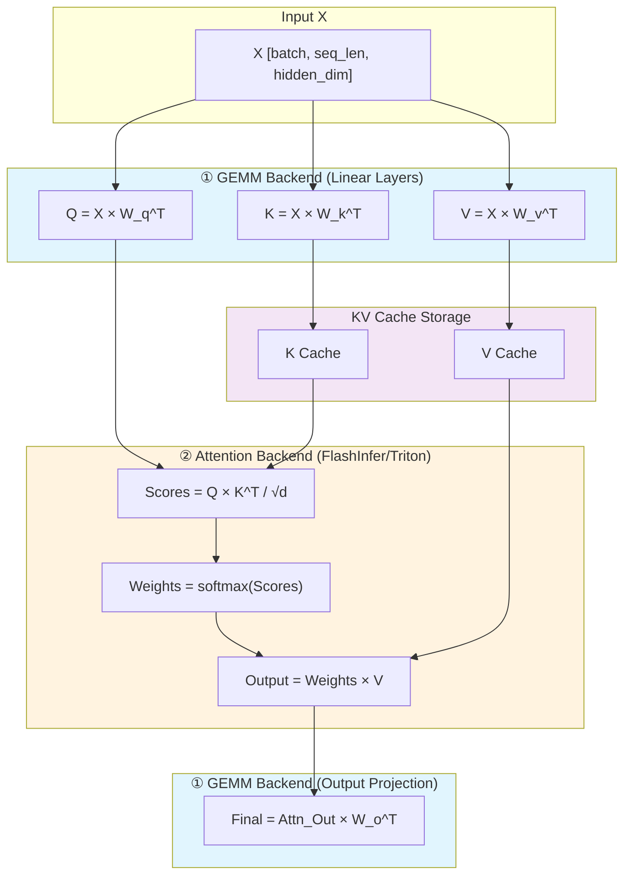
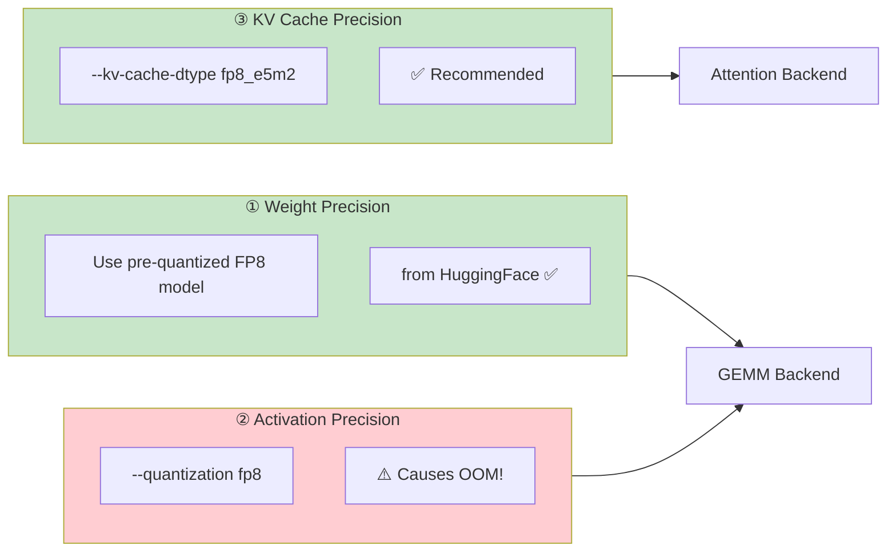

# FP8 Validation On 3 GPUs

> Validating FP8 inference performance across GPU architectures: H100, A100, and RTX PRO 6000

## 🎯 Overview

This benchmark compares **H100 native FP8 Tensor Core** vs **A100 Marlin kernel (weight-only FP8)** across different workload patterns. Key finding: **H100 FP8 achieves 41% speedup in compute-bound scenarios, outperforming A100's 29%**.

### Key Results

| Scenario | H100 FP8 Speedup | A100 FP8 Speedup | Winner |
|----------|------------------|------------------|--------|
| Memory-bound (Single Prefill) | +30% | +54% | A100 |
| **Compute-bound (50 Concurrent)** | **+41%** | +29% | **H100** |
| **H100 Forced Marlin** | **-44%** | N/A | ❌ Slower than BF16 |

---

## 🧠 Technical Architecture

### FP8 Implementation Difference

```
┌──────────────────────────────────────────────────────────────┐
│  H100: Native FP8 Tensor Core (W8A8)                         │
│  ┌─────────┐    ┌──────────────┐    ┌─────────┐             │
│  │ Weight  │ -> │ FP8 Tensor   │ -> │ Output  │             │
│  │ (FP8)   │    │ Core GEMM    │    │ (BF16)  │             │
│  └─────────┘    └──────────────┘    └─────────┘             │
│  ✓ True low-precision compute (W8A8)                         │
│  ✓ Doubled FLOPS: FP8 TFLOPS > BF16 TFLOPS                   │
├──────────────────────────────────────────────────────────────┤
│  A100: Marlin Kernel (Weight-Only FP8 Dynamic Dequant)       │
│  ┌─────────┐    ┌──────────────┐    ┌─────────┐             │
│  │ Weight  │ -> │ Dynamic      │ -> │ Output  │             │
│  │ (FP8)   │    │ Dequant+GEMM │    │ (BF16)  │             │
│  └─────────┘    └──────────────┘    └─────────┘             │
│  ✓ Memory bandwidth saving only, compute still BF16          │
│  ✗ A100 lacks FP8 Tensor Core hardware                       │
└──────────────────────────────────────────────────────────────┘
```

### Key Concept: Dynamic Dequantization

**Marlin** is a high-performance CUDA kernel developed by IST-DASLab. Its core function is **dynamic dequantization**:

```
Storage: FP8 weights (compressed, saves memory bandwidth)
    ↓
Runtime: Dynamic dequantization → BF16 (on-the-fly)
    ↓
Compute: BF16 GEMM (NOT FP8 compute!)
```

| Term | Meaning | Marlin's Role |
|------|---------|---------------|
| Dynamic Quantization | Convert activation high→low precision at inference | ❌ Not this |
| **Dynamic Dequantization** | Convert weights low→high precision at inference | ✅ Exactly this |
| Weight-only Quantization | Only compress weights, keep activation high precision | ✅ Also this |

### Why Different Results?

| Bottleneck | H100 Advantage | A100 Advantage |
|------------|----------------|----------------|
| Memory-bound | - | Marlin saves 50% bandwidth |
| Compute-bound | Native FP8 doubles FLOPS | - |

---
## 🔧 FP8 Inference Deep Dive: Components and Backends

### Transformer Self-Attention: Where GEMM and Attention Happen



### What Is GEMM? (General Matrix Multiply)

**GEMM = Weight × Activation (矩阵乘法)**

In a Linear layer: `Output = Input × Weight^T + Bias`

```
Example (Qwen2.5-14B, hidden_dim=5120):

Input (Activation): [1, 512, 5120]     ← 1 sample, 512 tokens
      ×
Weight:             [5120, 5120]^T     ← W_q (or W_k, W_v, W_o)
      =
Output:             [1, 512, 5120]     ← becomes Q (or K, V)
```

| Term | Meaning | Examples in Transformer |
|------|---------|------------------------|
| **Weight** | Model parameters | W_q, W_k, W_v, W_o, FFN weights |
| **Activation** | Input/intermediate values | X, Q, K, V, attention output |
| **GEMM** | Weight × Activation | Q=X×W_q, K=X×W_k, V=X×W_v |

### Three Independently Controllable FP8 Components



| Component | What It Is | Affects Which Backend | How to Control |
|-----------|------------|----------------------|----------------|
| **Weight** | Model weights (W_q, W_k, W_v, W_o...) | GEMM | Use pre-quantized FP8 model ✅ |
| **Activation** | Runtime values (X, Q, K, V...) | GEMM | `--quantization fp8` ⚠️ OOM! |
| **KV Cache** | Stored K and V for decoding | Attention | `--kv-cache-dtype fp8_e5m2` ✅ |

> ⚠️ **Critical Lesson**: Runtime quantization (`--quantization fp8`) causes OOM and high error rate. Always use **pre-quantized FP8 models** instead!

### Two Backend Types: GEMM vs Attention

| Backend | What It Computes | Operations | Control Parameter |
|---------|------------------|------------|-------------------|
| **GEMM Backend** | Linear layer projections | Q=X×W_q, K=X×W_k, V=X×W_v, Out×W_o | `--fp8-gemm-backend cutlass/cublas` |
| **Attention Backend** | Self-attention mechanism | Q×K^T, softmax, ×V | `--attention-backend flashinfer/triton` |

**Key Insight**: 
- **GEMM** uses **Weight × Activation** → affected by model precision and `--quantization`
- **Attention** uses **Q × K^T × V** → affected by `--kv-cache-dtype`

### H100 Native FP8 vs A100 Marlin: The Real Difference

| GPU | Weight | Activation | Actual GEMM Compute |
|-----|--------|------------|---------------------|
| **H100 (Native FP8)** | FP8 | FP8 | **FP8 × FP8 → FP8 Tensor Core** (2x FLOPS!) |
| **A100 (Marlin)** | FP8→dequant→BF16 | BF16 | BF16 × BF16 → BF16 GEMM (no speedup) |

```
H100 Native FP8:
  Weight(FP8) × Activation(FP8) = FP8 Tensor Core GEMM
  → True low-precision compute, FLOPS doubled!

A100 Marlin (Weight-Only FP8):
  Weight(FP8) → Dequant → BF16 × Activation(BF16) = BF16 GEMM
  → Only saves memory bandwidth, compute is still BF16
```

### SGLang vs vLLM Parameter Reference (Source Code Verified)

**SGLang Parameters:**

| Component | Parameter | Values | Source |
|-----------|-----------|--------|--------|
| Weight | `--dtype` | `auto`, `float16`, `bfloat16`, `float8_e4m3fn` | server_args.py |
| KV Cache | `--kv-cache-dtype` | `auto`, `fp8_e5m2`, `fp8_e4m3` | server_args.py |
| Attention | `--attention-backend` | `flashinfer`, `triton`, `torch_native`, `fa3` | server_args.py |
| GEMM | `--fp8-gemm-backend` | `cutlass`, `cublas` | server_args.py |

**vLLM Parameters:**

| Component | Parameter | Values | Source |
|-----------|-----------|--------|--------|
| Weight | `--dtype` | `auto`, `float16`, `bfloat16`, `float8_e4m3fn` | engine_args.py |
| KV Cache | `--kv-cache-dtype` | `auto`, `fp8`, `fp8_e5m2`, `fp8_e4m3` | engine_args.py |
| Attention | `VLLM_ATTENTION_BACKEND` (env var) | `FLASH_ATTN`, `FLASHINFER`, `XFORMERS`, `TRITON_ATTN` | selector.py |
| Execution | `--enforce-eager` | `True`/`False` | engine_args.py |

### Triton Clarification: OpenAI Triton ≠ NVIDIA Triton!

| Project | OpenAI Triton | NVIDIA Triton |
|---------|---------------|---------------|
| **Type** | GPU programming language | Inference server |
| **Purpose** | Write custom CUDA kernels | Model deployment & serving |
| **Code** | `@triton.jit` decorator | Docker container |
| **Used in SGLang** | ✅ For attention kernel | ❌ Not related |

### Internal Compute Precision

> **Key Finding**: Even with FP8/FP16 input, **ALL backends use FP32 for intermediate computation** (e.g., softmax, accumulation)!

Source code evidence (from SGLang's `triton_flashinfer_cudnn.py`):
```python
attn_logits = torch.empty(
    (batch_size, head_num_q, num_kv_splits, head_dim + 1),
    dtype=torch.float32,  # ← Forced FP32 for numerical stability
    device="cuda",
)
```
---


## 🚀 Quick Start

### Requirements

| Dependency | Version |
|------------|---------|
| vLLM | ≥ 0.12.0 |
| CUDA | ≥ 12.0 |
| GPU | H100 or A100 |

### Run Benchmark

```bash
# Clone this repo
git clone https://github.com/xinyuwei/H100-A100-FP8-Benchmark.git
cd H100-A100-FP8-Benchmark

# Start vLLM server (BF16 baseline)
vllm serve Qwen/Qwen2.5-14B-Instruct --port 8080 --max-model-len 4096

# Run benchmark
python benchmark.py --mode prefill   # Single request prefill
python benchmark.py --mode decode    # 50 concurrent decode

# Restart with FP8
pkill -f vllm
vllm serve Qwen/Qwen2.5-14B-Instruct --port 8080 --max-model-len 4096 --quantization fp8

# Run benchmark again
python benchmark.py --mode prefill
python benchmark.py --mode decode
```

---

## 📊 Detailed Results

### Test Environment

| Config | H100 | A100 |
|--------|------|------|
| GPU Model | NVIDIA H100 NVL 96GB | NVIDIA A100 80GB |
| Driver | 535.274.02 | 535.x |
| vLLM | 0.12.0 | 0.12.0 |
| Model | Qwen/Qwen2.5-14B-Instruct | Same |

### Scenario 1: Memory-Bound (~4K Token Prefill)

| GPU | BF16 | FP8 | Speedup |
|-----|------|-----|--------|
| H100 (Native) | 14,157 tok/s | 18,392 tok/s | 1.30x |
| H100 (Forced Marlin) | 14,157 tok/s | 7,936 tok/s | **0.56x** |
| A100 | 2,759 tok/s | 4,253 tok/s | 1.54x |

### Scenario 2: Compute-Bound (50 Concurrent Decode) ⭐

| GPU | BF16 | FP8 | Speedup |
|-----|------|-----|---------|
| **H100** | 2,901 tok/s | **4,094 tok/s** | **1.41x** |
| A100 | 1,683 tok/s | 2,169 tok/s | 1.29x |

### Absolute Performance

| Metric | H100 FP8 | A100 FP8 | H100/A100 |
|--------|----------|----------|-----------|  
| Prefill | 18,392 tok/s | 4,253 tok/s | **4.3x** |
| Decode | 4,094 tok/s | 2,169 tok/s | **1.9x** |

---

## 🔬 NVIDIA Official Quantization Recommendations

### Recommendations by GPU Architecture

| GPU Architecture | Recommended Quantization | Notes |
|------------------|--------------------------|-------|
| **Blackwell (B100/B200)** | NVFP4 | Latest 4-bit floating point |
| **Hopper (H100/H200)** | **FP8 (W8A8)** | Native FP8 Tensor Core |
| **Ampere (A100/A10)** | INT8 SmoothQuant | No FP8 hardware! |
| General/Older GPUs | INT4 Weight-Only | Save memory |

> ⚠️ **Important**: NVIDIA's official TensorRT-LLM documentation explicitly labels "FP8 (Hopper)". FP8 on A100 is NOT an officially recommended solution.

### Official Quantization Options for A100

| Method | Precision | Compute Type | Official Support |
|--------|-----------|--------------|------------------|
| INT8 SmoothQuant | W8A8 | INT8 Tensor Core | ✅ Recommended |
| INT8 Weight-Only | W8A16 | BF16 GEMM | ✅ Supported |
| INT4 Weight-Only | W4A16 | BF16 GEMM | ✅ Supported |
| GPTQ/AWQ | W4A16 | BF16 GEMM | ✅ Supported |
| **FP8** | W8A8 | - | ❌ **Hopper+ only** |

### vLLM's A100 FP8 Implementation (Unofficial)

```
vLLM A100 + --quantization fp8 = Marlin kernel FP8 dynamic dequantization

This is a community solution, NOT NVIDIA official:
- Uses Marlin for FP8 → BF16 dequantization
- Compute is still BF16 GEMM
- Effective in memory-bound scenarios
```

### Dynamic Dequantization vs Static Quantization

| Type | Representative | Weight Source | Quantization Timing | Characteristics |
|------|---------------|---------------|---------------------|----------------|
| **Dynamic Dequant** | Marlin FP8 | Original BF16 model | Runtime conversion | No preprocessing needed |
| **Static Quantization** | GPTQ, AWQ | Pre-quantized model | Offline calibration | Need specialized quantized models |

### Dynamic Dequantization Technologies (Similar to Marlin)

| Technology | Source | Supported Precision | Features |
|------------|--------|---------------------|----------|
| **Marlin** | IST-DASLab | FP8, INT4 | Fastest, vLLM default |
| ExLlamaV2 | turboderp | INT4 (GPTQ) | Consumer GPU optimized |
| bitsandbytes | Tim Dettmers | INT8, INT4 | Simple and easy to use |
| TensorRT-LLM | NVIDIA | FP8, INT8, INT4 | Official, highly optimized |

---

## ⚠️ Pitfalls

### Issue 1: H100 forced Marlin is 44% SLOWER than BF16
- **Cause**: Marlin adds dequant overhead, doesn't use native FP8 Tensor Core
- **Solution**: Never force Marlin on H100, let vLLM auto-select native FP8
- **How to force (for testing only)**: `export VLLM_TEST_FORCE_FP8_MARLIN=1`

### Issue 2: Pre-quantized FP8 model shows A100 with higher speedup
- **Cause**: Pre-quantized FP8 (compressed-tensors) uses weight-only compression, H100 doesn't use native FP8 Tensor Core
- **Solution**: Use `--quantization fp8` for dynamic quantization to trigger native FP8

### Issue 3: Prefix cache causes misleading results
- **Cause**: vLLM enables prefix caching by default, repeated prompts hit cache
- **Solution**: Use random prefix for each request

### Issue 4: H100 shows lower FP8 speedup ratio than A100
- **Cause**: Testing memory-bound scenario where Marlin's bandwidth saving is more effective
- **Solution**: Test compute-bound scenarios (high concurrency, long context)

---

## 💡 Recommendations

| Use Case | Recommendation | Reason |
|----------|----------------|--------|
| High-concurrency service (>50 QPS) | H100 + FP8 | Compute-bound, native FP8 shines |
| Long context (32K+) | H100 + FP8 | Attention O(n²), compute-bound |
| Low concurrency | Either + FP8 | Both benefit from FP8 |
| Cost-sensitive | A100 + FP8 | Good price-performance |

---

## 🆕 RTX PRO 6000 (Blackwell) Benchmark with SGLang

> Test Date: 2025-12-19 | Framework: SGLang 0.5.6 + FlashInfer 0.5.3

### Test Environment

| Config | Value |
|--------|-------|
| GPU | NVIDIA RTX PRO 6000 48GB vGPU (Blackwell) |
| VM SKU | Azure NC RTX PRO 6000 |
| Driver | 580.105.08 (vGPU R580) |
| CUDA | 13.0 |
| Framework | SGLang 0.5.6.post2 |
| FlashInfer | 0.5.3 |

### Test Models

| Model | Precision | Size |
|-------|-----------|------|
| Qwen/Qwen2.5-14B-Instruct | BF16 | ~28GB |
| RedHatAI/Qwen2.5-14B-Instruct-FP8-dynamic | FP8 | ~15GB |

### Test Command

```bash
# Start SGLang server (best config)
python -m sglang.launch_server \
    --model-path RedHatAI/Qwen2.5-14B-Instruct-FP8-dynamic \
    --attention-backend triton \
    --kv-cache-dtype fp8_e5m2 \
    --tp 1 --port 30000

# Run benchmark
python -m sglang.bench_serving --backend sglang \
    --num-prompts 200 --random-input-len 512 --random-output-len 128 \
    --random-range-ratio 0.0 --host 127.0.0.1 --port 30000
```

### Configuration Matrix Results (Full Metrics)

| # | Model | Attention | KV Cache | Output tok/s | Peak tok/s | TTFT (ms) | ITL (ms) | vs Best |
|---|-------|-----------|----------|-------------:|----------:|----------:|--------:|--------:|
| 1 | BF16 | FlashInfer | auto | 1,579.49 | 4,605 | 2,502.87 | 33.47 | 67.1% |
| 2 | BF16 | Triton | auto | 1,584.47 | 4,761 | 2,609.91 | 33.38 | 67.4% |
| 3 | BF16 | FlashInfer | fp8_e5m2 | 1,622.54 | 5,081 | 2,579.67 | 31.33 | 69.0% |
| 4 | BF16 | Triton | fp8_e5m2 | 1,618.93 | 4,938 | 2,229.31 | 31.25 | 68.8% |
| 5 | **FP8** | FlashInfer | auto | 2,257.79 | 5,651 | 1,672.62 | 25.53 | 96.0% |
| 6 | **FP8** | Triton | auto | 2,262.62 | 5,651 | 1,473.74 | 25.44 | 96.2% |
| 7 | **FP8** | FlashInfer | fp8_e5m2 | 2,337.92 | 6,121 | 1,699.20 | 22.88 | 99.4% |
| 8 | **FP8** | **Triton** | **fp8_e5m2** | **2,352.61** | **6,225** | 1,519.09 | **22.87** | **100%** 🏆 |

> **Metrics Explained**: 
> - **Output tok/s**: Average output throughput (main comparison metric)
> - **Peak tok/s**: Maximum observed throughput during test
> - **TTFT**: Time To First Token (prefill latency in milliseconds)
> - **ITL**: Inter-Token Latency (per-token generation time in milliseconds)

### Key Findings

| Factor | Performance Impact |
|--------|-------------------|
| **FP8 Pre-quantized Model** | **+43%** (most significant!) |
| KV Cache FP8 | +2-4% |
| FlashInfer vs Triton | <1% (negligible on Blackwell) |

### RTX PRO 6000 vs H100 vs A100 Summary

| GPU | Architecture | FP8 Support | Framework | BF16 tok/s | FP8 tok/s | Speedup |
|-----|--------------|-------------|-----------|------------|-----------|---------|
| **H100** | Hopper | ✅ Native | vLLM | 2,901 | 4,094 | **+41%** |
| **RTX PRO 6000** | Blackwell | ✅ Native | SGLang | 1,579 | 2,353 | **+49%** |
| A100 | Ampere | ❌ Marlin | vLLM | 1,683 | 2,169 | +29% |

> ⚠️ Note: H100/A100 tested with vLLM, RTX PRO 6000 with SGLang. Direct comparison should consider framework differences.

### RTX PRO 6000 Best Practice

```bash
# 🏆 Optimal config for RTX PRO 6000 (2,353 tok/s)
python -m sglang.launch_server \
    --model-path RedHatAI/Qwen2.5-14B-Instruct-FP8-dynamic \
    --attention-backend triton \
    --kv-cache-dtype fp8_e5m2 \
    --tp 1
```

---

## 📚 References

### Official Documentation
- [NVIDIA TensorRT-LLM Quantization Guide](https://nvidia.github.io/TensorRT-LLM/reference/precision.html) - Official quantization recommendations
- [NVIDIA Transformer Engine FP8 Guide](https://docs.nvidia.com/deeplearning/transformer-engine/user-guide/examples/fp8_primer.html)
- [vLLM FP8 Quantization](https://docs.vllm.ai/en/latest/quantization/fp8.html)

### Hardware Architecture
- [NVIDIA H100 Tensor Core GPU](https://www.nvidia.com/en-us/data-center/h100/)
- [NVIDIA A100 Tensor Core GPU](https://www.nvidia.com/en-us/data-center/a100/)

### Quantization Technologies
- [Marlin: Mixed-Precision LLM Kernel](https://github.com/IST-DASLab/marlin) - Dynamic dequantization kernel
- [SmoothQuant Paper](https://arxiv.org/abs/2211.10438) - INT8 W8A8 quantization
- [GPTQ Paper](https://arxiv.org/abs/2210.17323) - INT4 weight quantization
- [AWQ Paper](https://arxiv.org/abs/2306.00978) - Activation-aware quantization

---

*Author: Xinyu Wei (Microsoft AI and Apps GBB Architect) | Verified: 2025-12-19*
