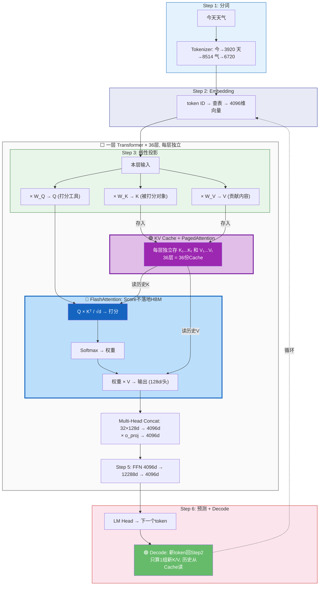
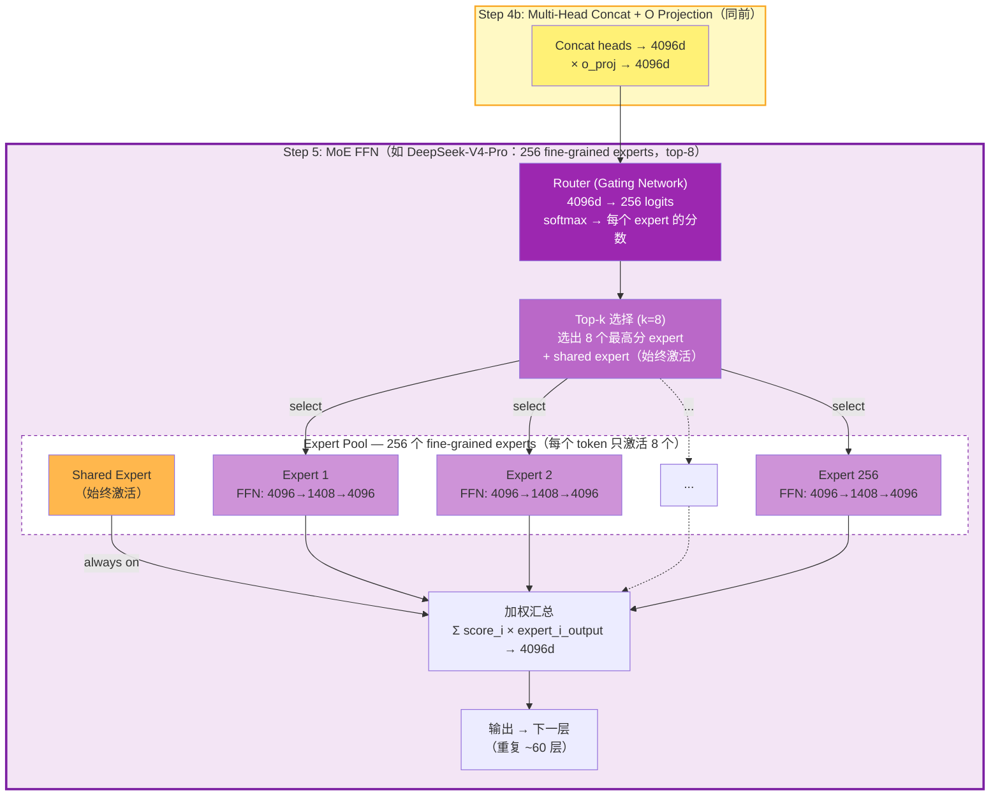
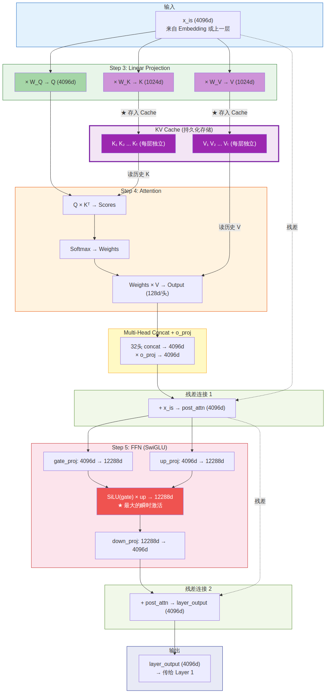

# KV Cache 深度解析：从原理到实战

> **A Deep Dive into KV Cache: From Fundamentals to Production Sizing**

[English Version](README.md)

---

## Executive Summary

KV Cache 是 LLM 推理（Inference）中**最关键的内存消耗来源**。理解 KV Cache 的原理和计算方法，是做好 LLM 部署、GPU 选型、VRAM 估算的基础。

本文由浅入深分为 6 个层级：

| 层级 | 主题 | 你将学到 |
|:---:|------|---------|
| **L0** | 零基础入门 | 不需要任何前置知识，用一个例子从头到尾走通 LLM 推理全过程和 KV Cache |
| **L1** | KV Cache 是什么 | 从 Attention 机制推导出 KV Cache 的诞生原因 |
| **L2** | KV Cache 有多大 | 通用公式推导 + 实际模型数值计算 |
| **L3** | 四种减少 KV Cache 的架构 | GQA → Hybrid Attention → MLA → Hybrid Mamba |
| **L4** | 量化对 KV Cache 的影响 | Weight 量化释放空间、KV Cache 量化、敏感层分析 |
| **L5** | 生产部署 VRAM 估算 | 实测验证 + GPU 选型决策树 |

**核心结论（四模型 KV Cache 对比，32K tokens, BF16, batch=1）**：

| Model | Architecture | Attention Layers | KV Cache | vs Baseline |
|-------|-------------|:---:|:---:|:---:|
| Qwen3-30B-A3B | Standard GQA | 48/48 (100%) | **3.00 GiB** | baseline |
| GLM-4.7-Flash | Compressed MLA | 47/47 (100%) | **1.65 GiB** | −45% |
| Qwen3.5-35B-A3B | Hybrid Attention | 10/40 (25%) | **0.625 GiB** | −79% |
| Nemotron-3-Nano-30B | Hybrid Mamba+Attn | 6/52 (12%) | **0.19 GiB** | −94% |

> 数据来源：HuggingFace config.json 参数 + Python 脚本计算。验证脚本见 [scripts/kv_cache_calculator.py](scripts/kv_cache_calculator.py)。

---

## L0: 零基础入门——用一个例子走通全过程

> 如果你已经了解 Transformer 的基本原理，可以跳过本章直接看 L1。

### LLM 整个推理过程就干了一件事：给定前面的字，猜下一个字

```
输入: "今天天气"
模型猜: "真" (概率最高)
输入变成: "今天天气真"
模型猜: "好" (概率最高)
输入变成: "今天天气真好"
模型猜: "！" (概率最高)
```

就是一个字一个字蹦出来的。每次只猜一个。那怎么猜？靠下面 6 步。

### Step 1: 把字变成编号

模型不认字，只认数字。这一步叫**分词（Tokenize）**。

```
"今天天气" → [3920, 8514, 8514, 6720]
```

就像一本字典："今"排在第 3920 页，"天"排在第 8514 页。这一步纯查字典，没有任何"智能"，在 CPU 上完成。

### Step 2: 把编号变成一长串特征数字

模型有一张大表（**Embedding 表**），15 万行，每行 4096 个数字。用编号当行号，取对应行：

```
第 3920 行 → [0.12, -0.34, 0.56, ..., 0.23]   ← 4096 个数字，代表"今"
第 8514 行 → [0.45, 0.23, -0.11, ..., -0.05]   ← 代表"天"
```

> **向量**就是一组有序的数字。4096 个数字排成一列 = 一个 4096 维向量。

**为什么要这一步？** 编号 3920 和 8514 之间没有数学关系。但这 4096 个数字是训练出来的——语义相近的字（如"好"和"棒"）的向量会很接近，不相关的字会很远。把编号变成有含义的数字，后面才能做运算。

### Step 3: 把每个字的向量拆成三份——分别用于"找人"和"传话"

接下来要让每个字去看看前面的字，从中获取上下文信息。但直接用 Embedding 做这件事效果差——因为 4096 维的 Embedding 是个大杂烩，一组数字要同时满足"打分"和"贡献内容"两个不同需求，两头都做不好。

**解决方案**：把同一个 Embedding 拆成三组不同的数字，各管各的：

- **Q** = 专门用于**给别人打分**的一组数字。当前 token 的 Q 会和每个历史 token 的 K 做点积，点积结果就是分数——决定了"前面每个字对我有多重要"
- **K** = 专门用于**被别人打分**的一组数字。K 被动地等着别人的 Q 来量，自己不主动做任何事
- **V** = 专门用于**被选中后贡献到输出**的一组数字。K 管的是"该不该选我"，V 管的是"选了我之后，我贡献什么到最终预测"

```
"气" 的 4096 个数字
```

> **为什么 Q 有 32 头而 K/V 只有 8 头？** 这就是 GQA（Grouped-Query Attention）——每 4 个 Q 头共享 1 组 K/V，减少 KV Cache 大小而几乎不损失质量。L0 阶段可以只记住：Q 比 K/V 多，具体原理见 L2.4。

> **为什么 K 和 V 要分开？** 让打分结果准确需要的数字（K），和让最终预测猜对字需要的数字（V），不是同一组。如果让一组数字同时伺候"打分"和"预测"两个需求，两头都做不好。拆开后各管各的，效果更好。

> **V 里面到底是什么内容？** V 的 128 个数字没有人类能读懂的明确含义。它编码的是：在当前这一层、给定当前上下文、该 token 能为后续计算提供的最有用的信息——可能包括词语搭配的统计规律（"天"后面常跟"气/空/花"）、在句子中的角色（"天气"的前半部分）、帮助后续层判断语境的特征等。具体是什么由训练决定，人类无法直接解读。

> **权重矩阵** W_Q、W_K、W_V 就是三张数字表格，里面的数字是训练时自动学出来的。三张表格的"配方"不同，所以从同一个 Embedding 中提取出的 Q、K、V 三组数字也不同——各自服务于一个独立的需求。

**这一步叫线性投影（Linear Projection）。**

### Step 4: Q 给 K 打分，然后按分数从 V 中取内容——这就是 Attention（注意力）

模型在猜"今天天气"后面的字，需要让"气"去看前面所有字，搞清楚上下文。

**第一步：Q 给每个 K 打分（Score）**

"气"拿自己的 Q，去和每个历史字的 K 做**点积**（两组 128 个数字对应位相乘再加一起，得一个分数）。**Q 和 K 配对 → 一个 Q 对多个 K，逐个打分。** 分数高 = 这个历史字对当前字重要：

```
"气"的Q × "今"的K = 0.3  ← Q 问的和"今"的 K 不太匹配
"气"的Q × "天"的K = 0.8  ← 很匹配（天气是一个词）
"气"的Q × "天"的K = 0.7  ← 也匹配
"气"的Q × "气"的K = 0.5  ← 一般
```

**第二步：归一化（Softmax）**

把分数变成百分比（加起来 = 100%），同时放大差距——大的更大、小的更小：

```
[0.3, 0.8, 0.7, 0.5] → [10%, 35%, 30%, 25%]
```

**第三步：按分数从 V 中取内容（加权平均）**

用百分比从每个字的 V 中按比例取内容（**注意：取的是 V 不是 K——K 管打分，V 管内容，各管各的**）：

```
输出 = 10% × "今"的V + 35% × "天"的V + 30% × "天"的V + 25% × "气"的V
```

**"气"现在拿到了融合了上下文的新向量**——主要包含"天"的信息（35%+30%=65%），因为"天气"是一个整体。

### Step 5: 独立消化——FFN（前馈神经网络）

Attention 是字与字之间的**交流**。FFN 是每个字**独立消化吸收**刚收到的信息：

```
交流后的向量 → × 矩阵₁ → 激活函数（引入非线性：如负数变0，让模型能学复杂关系）→ × 矩阵₂ → 输出
```

> 为什么需要激活函数？如果只有矩阵乘法（线性运算），不管叠多少层都等价于一层。加了激活函数，模型才能学到弯曲的、复杂的关系。

**一层 = Attention（交流）+ FFN（消化）。** 一共叠 36 层，信息被反复"交流→消化"，理解越来越深：

```
第 0 层: 理解字面意思（"天"+"气"="天气"）
第 15 层: 理解语境（在讨论天气状况）
第 35 层: 综合判断（下一个字应该是"真/不/很"之类的）
```

### Step 6: 猜字——LM Head（语言模型头）

36 层过完后，最后一个字"气"的向量已经融合了全句的理解。做最后一次矩阵乘法：

```
4096 个数字 × 矩阵(4096×150000) = 150000 个数字
                                      ↓
                     每个数字对应词汇表中一个字的概率
                          取最高的 → "真"
```

输出"真"。

### KV Cache 在这个例子中的作用

猜完"真"后，要继续猜下一个字。输入变成"今天天气真"，需要重新跑 Step 4。

**问题**：Step 4 打分需要每个历史字的 K，传话需要每个历史字的 V。如果不缓存，每猜一个字都要把"今""天""天""气""真"的 K 和 V 全部重新算——**重复劳动**。

**KV Cache 就是把算过的 K 和 V 存起来**：

```
猜"真"时:   算了 今K 天K 天K 气K      → 存进 Cache
猜"好"时:   Cache 已有历史 K，只新算 真K → 追加到 Cache
猜"！"时:   Cache 已有历史 K，只新算 好K → 追加到 Cache
```

| | 不缓存 | 有 KV Cache |
|---|---|---|
| 每猜一个字要算几个 K/V | **所有字都重新算** | **只算 1 个新字** |
| 速度 | 越来越慢（字越多算越多） | 恒定快（每次只算 1 个） |
| 代价 | 无 | Cache 越来越大，**占 GPU 显存** |

**这就是 KV Cache 的全部：存起来不重复算，用显存换速度。**

---

## L1: KV Cache 到底是什么？

### 1.1 从一句话的完整处理过程说起

以 "今天天气" 为例（与 L0 相同的例子，这里加入技术细节），模型处理这句话经历以下步骤：

**Step 1: 分词（Tokenize）** — 纯文本操作，不涉及向量

Tokenizer 把字符串切成子串，然后查**词表**（纯文本→整数的映射字典）转成整数 ID：

```
"今"   → 3920
"天"   → 8514
"天"   → 8514
"气"   → 6720
```

词表就是一个字典 `{"今": 3920, "天": 8514, ...}`，没有向量、没有浮点数。这一步在 CPU 上完成。

**Step 2: Embedding 查表** — 整数 → 浮点向量

模型的**第一层权重**是一张 Embedding 表（shape: `[词表大小 × hidden_size]`，如 `[152064 × 4096]`）。用 token ID 当行号，取对应那一行：

```
3920  → x₁ = [0.12, -0.34, 0.56, 0.78, ...]   ← 4096 个浮点数，代表"今"
8514  → x₂ = [0.45, 0.23, -0.11, 0.67, ...]   ← 代表"天"
6720  → x₄ = [0.33, 0.17, -0.08, 0.51, ...]   ← 代表"气"
```

> **为什么需要这一步？** 整数 ID 不能做数学运算（8856 - 8831 = 25 没有语义含义），但浮点向量可以做点积、矩阵乘法、比较相似度。Embedding 表就是"整数→向量"的桥梁。

Embedding 表本身是模型权重的一部分，在训练中学习到的。数学上等价于 one-hot 向量乘以矩阵（实际实现用直接查行，更快）。

**Step 3: 线性投影（Linear Projection）** — 产生 Q、K、V

> **什么是线性投影？** 就是矩阵乘法。把一个 4096 维的向量乘以一个 4096×128 的矩阵，变成 128 维的向量。"线性"是因为只有乘法和加法，没有弯曲（非线性函数）。"投影"是因为从高维空间（4096）投射到低维空间（128），类似于从 3D 物体投影出 2D 影子——保留了部分信息，丢弃了其他。

每一层有三个**训练好的权重矩阵** W_Q、W_K、W_V（模型参数的一部分，推理时固定不变）。每个 token 的 embedding 分别乘以这三个矩阵：

$$Q_t = x_t W_Q, \quad K_t = x_t W_K, \quad V_t = x_t W_V$$

同一个 embedding x_t，过三个不同的矩阵，得到三组不同的数字。三个矩阵就像三套不同的"滤镜"——对同一张照片（embedding）用不同滤镜拍，得到三张侧重不同特征的照片（Q、K、V）。

**Step 4: Attention（注意力）计算** — Q 和 K 配对打分，然后用 V 传内容

> **什么是 Attention？** 字面意思就是"注意力"——让模型决定生成当前 token 时，应该**关注**前面哪些 token。计算分三小步：
>
> 1. **打分**：用当前 token 的 Q 和每个历史 token 的 K 做**点积**（两组数字对应位置相乘再相加，得到一个分数）。分数越高 = 越相关。
> 2. **归一化（Softmax）**：把所有分数转成概率（加起来 = 1）。Softmax 做的就是 $e^{x_i} / \sum e^{x_j}$——让大的分数变更大，小的变更小，然后归一化。效果类似于"放大差距后投票"。
> 3. **加权求和**：用归一化后的概率对所有历史 token 的 V 做加权平均。概率高的 token 贡献多，低的贡献少。最终输出 = 融合了上下文信息的新向量。

$$\text{score}_{t,j} = \frac{Q_t \cdot K_j^\top}{\sqrt{d_k}} \quad \text{（除以} \sqrt{d_k} \text{防止点积数值太大导致 softmax 梯度消失）}$$

$$\text{output}_t = \sum_j \text{softmax}(\text{score}_{t,:})_j \cdot V_j$$

**Step 5: FFN（Feed-Forward Network，前馈神经网络）+ 下一层**

> **什么是 FFN？** 就是两次矩阵乘法夹一个激活函数。
>
> 但在进入 FFN 之前，还缺一步：Attention 的输出是**按头（head）分开的**——32 个头各产出 128d。需要先**拼接（concat）**回 4096d，再过一个输出投影矩阵（o_proj）。这个 4096d 才是 FFN 的输入：
>
> ```
> 每头 Attention 输出 (128d) → 拼接 32 个头 → 4096d → × o_proj → 4096d
>   → × 矩阵₁ (gate_proj + up_proj, 4096→12288) → 激活函数(SiLU) → × 矩阵₂ (down_proj, 12288→4096) → 4096d
> ```
>
> **激活函数**（如 SiLU/ReLU）是一个简单的非线性变换——比如 ReLU 就是"负数变 0，正数不变"。加了它模型才能学到弯曲的、复杂的关系，否则多少层矩阵乘法叠起来都等价于一层（线性叠加还是线性）。
>
> FFN 可以理解为每个 token 的"独立思考"——Attention 是 token 之间交流信息，FFN 是每个 token 独立消化吸收这些信息。

每一层 = Attention + FFN。36 层叠起来，信息被反复"交流→消化→交流→消化"，越来越深入理解。

**Step 6: LM Head（语言模型头）— 预测下一个 token**

> **什么是 LM Head？** 就是最后一个矩阵乘法。把 36 层处理完的 4096 维向量映射到词表大小（如 15 万维），每一维对应词表中一个 token 的概率分。取概率最高的那个 token 就是模型的预测结果。
>
> ```
> 第 36 层输出 (4096维) → × W_head (4096×152064) → logits (152064维)
>                                                      ↓
>                                          取 argmax → token ID → 查词表 → "，"
> ```

**完整流程图（Step 1 → Step 6，含三大优化技术标注）：**



> 🖼️ 如果 Mermaid 无法渲染，请查看 PNG 版本：[cn-full-pipeline.png](images/cn-full-pipeline.png)

**图中三大优化技术：**

| 颜色 | 技术 | 位置 | 作用 |
|:---:|------|------|------|
| 🟣 紫色 | **PagedAttention** | KV Cache 存储 | 分页管理 HBM，减少碎片，提高并发 |
| 🔵 蓝色 | **FlashAttention** | Score→Softmax→×V | Score 在 Shared Memory 中算，不落地 HBM |
| 🟢 绿色 | **KV Cache** | Decode 循环 | 历史 K/V 不重复算，每步只算 1 组新 K/V |

> **为什么 KV Cache 占显存这么大？** 不只是因为 token 数多——还要乘以层数。36 层 = 36 份独立的 KV Cache，每层单独存所有历史 token 的 K 和 V。这也是 KV Cache 公式中有 $L$（层数）的原因。
>
> **为什么每层的 KV Cache 不能复用？** 因为每层算出的 K 和 V 是不同的数字：(1) 每层的输入不同——第 0 层输入是 Embedding，第 1 层输入是第 0 层的输出…同一个 token 在每层的表示完全不同；(2) 每层有独立的 W_K 和 W_V 权重矩阵——36 套独立参数。输入不同 × 权重不同 = 结果完全不同 → 每层必须独立存储。HuggingFace transformers 源码中，`DynamicCache` 存储的是 "a list of CacheLayer, one for each layer"——每层一个独立的 CacheLayer 对象。
>
> **例外**：部分新架构（如 Gemma3n）有 `num_kv_shared_layers` 参数——共享权重的层不需要独立 KV Cache。但这是特殊架构设计，标准 Transformer（Qwen3/GPT/LLaMA）不适用。

### MoE 变体：当 Step 5 变成 Mixture-of-Experts

上面的 Step 5 展示的是 **Dense FFN** —— 每层一个共享 FFN，处理所有 token。现代大模型常常把它换成 **MoE（Mixture-of-Experts）**：多个并行 FFN，每个 token 只激活几个。Steps 1-4（KV Cache、Attention）**完全相同**；只有 Step 5 变了。



**与 Dense FFN 的关键差异**：

| 维度 | Dense FFN（LLaMA、Qwen3-dense） | MoE FFN（DeepSeek-V4、Mixtral） |
|------|:-------------------------------:|:-------------------------------:|
| 每层 FFN 数量 | 1 个大 FFN（如 4096→12288→4096） | N 个并行小 FFN（如 256 × 4096→1408→4096） |
| 每个 token 计算量 | 全部 FFN 参数都用 | 只激活 top-k expert（如 8/256 + 1 shared） |
| 总参数量 | 较小 | 大得多（如 V4-Pro 总 1.6T / 激活 49B） |
| 每 token 推理成本 | 与总参数成正比 | 与激活参数成正比 |
| KV Cache | 相同（Steps 1-4 不变） | 相同（Steps 1-4 不变） |

> 🔗 这里的 MoE expert 是**架构层面**的概念——一个由 router 选中的 FFN 子网络。这与后训练范式（如 On-Policy Distillation）里的"领域专家"完全不同——后者每个"专家"是一个完整的独立模型。详见 [Multi-Expert-OPD-Distillation](https://github.com/david-xinyuwei/david-share/tree/master/DL-Algorithm-Insights/Multi-Expert-OPD-Distillation) 对这一区别的深入讨论。

### 1.2 权重矩阵里有什么？

Q、K、V 三个权重矩阵里**就是一堆训练出来的浮点数**。以下是从真实 Qwen3-0.6B 模型文件中读取的实际数字：

```
W_Q (q_proj.weight) [2048 × 1024] = 2,097,152 个数字:
  [+0.0034, -0.0035, -0.0127, +0.0204, +0.0143, ...]
  [-0.0244, +0.0081, +0.0006, +0.0209, +0.0007, ...]
  ...

W_K (k_proj.weight) [1024 × 1024] = 1,048,576 个数字:
  [-0.0166, -0.0762, -0.0302, +0.0334, +0.0571, ...]
  [+0.0226, -0.0537, -0.0520, +0.0645, +0.0182, ...]
  ...

W_V (v_proj.weight) [1024 × 1024] = 1,048,576 个数字:
  [+0.0121, -0.0033, +0.0005, -0.0051, -0.0552, ...]
  [+0.0105, -0.0015, -0.0024, -0.0001, +0.0131, ...]
  ...
```

**三个矩阵的结构完全一样**（都是浮点数表格），**区别来自训练过程**——它们在 Attention 计算图中的位置不同，导致训练时梯度不同，最终收敛到不同的数字：

- W_Q 的产物在 QKᵀ 的**左边** → 训练时梯度迫使它学会提取"查找需求"
- W_K 的产物在 QKᵀ 的**右边** → 梯度迫使它学会提取"身份特征"
- W_V 的产物在 weight × V 的**右边** → 梯度迫使它学会提取"需要传递的语义内容"

矩阵乘法（x × W_K）的本质是**对 embedding 各维度做加权求和**——W_K 每一行的数字决定了"从 4096 维 embedding 中，哪些维度放大、哪些维度忽略、怎么混合成 128 维的 K 向量"。三个矩阵就是三套不同的"混合配比"。

> **V 不是 Embedding 的原始内容**。V 是 Embedding 经过 W_V 加工后的版本——W_V 决定了"从 Embedding 中提取什么信息来传递"。如果不同层的 W_V 不同（事实如此），每层 Attention 可以选择性传递不同方面的信息。

### 1.3 KV Cache 到底缓存了什么？

**KV Cache 缓存的是每层每个历史 token 的 K 向量和 V 向量**——即 x_t × W_K 和 x_t × W_V 的乘积结果。

**不是** Attention Score（QKᵀ），**不是** Attention Weight（softmax 后的概率），**不是**原始 Embedding x_t。

```
KV Cache 存的东西:
Layer 0:  { K: [K₁, K₂, ..., Kₜ],  V: [V₁, V₂, ..., Vₜ] }
Layer 1:  { K: [K₁, K₂, ..., Kₜ],  V: [V₁, V₂, ..., Vₜ] }
...
Layer 35: { K: [K₁, K₂, ..., Kₜ],  V: [V₁, V₂, ..., Vₜ] }
```

每个 K_i 和 V_i 是一个 `[num_kv_heads × head_dim]` 的浮点向量。

**缓存 K 和 V 而不缓存 Q 和 Score 的原因：**

| 东西 | 能缓存吗？ | 原因 |
|------|:---------:|------|
| **K** | ✅ | K_j = x_j × W_K，x_j 和 W_K 都不随后续 token 变化，一旦算出就固定 |
| **V** | ✅ | 同上，V_j = x_j × W_V 也是固定的 |
| **Q** | ❌ | Q_t 属于当前 token，每步都是新的，没法复用 |
| **Score** | ❌ | Score = Q × Kᵀ，Q 每步都变 → Score 必须每步重算 |

### 1.4 Prefill 和 Decode 两个阶段

推理分为两个阶段：

| 阶段 | 发生什么 | KV Cache 变化 |
|:---:|--------|-----------|
| **Prefill** | 用户输入的 prompt 一次性并行处理 | Cache 填入所有 prompt token 的 K、V |
| **Decode** | 逐个生成新 token | 每步追加 1 组新的 K、V |

以 "今天天气" 为例：

```
Prefill: 4个token并行处理 → Cache = [K₁...K₄, V₁...V₄]
Decode Step 1: 生成 "真"  → 只算 K₅V₅，追加到 Cache
Decode Step 2: 生成 "好"  → 只算 K₆V₆，追加到 Cache
Decode Step 3: 生成 "！"  → 只算 K₇V₇，追加到 Cache
```

**Decode 阶段每一步只需要算 1 个 token 的 K、V。** 前面所有历史 token 的 K、V 直接从 Cache 取。这就是 KV Cache 节省算力的核心机制。

### 1.5 KV Cache 的代价：GPU 显存

| | 无 Cache | 有 KV Cache |
|---|:---:|:---:|
| 每步 K,V 计算量 | $O(t)$ | $O(1)$ |
| 总计算量（T 步） | $O(T^2)$ | $O(T)$ |
| 额外内存 | 0 | $O(T)$ — Cache 随序列增长 |

**KV Cache = 用线性内存换掉二次计算。** Cache 只增不减（直到对话结束），每生成一个 token 就追加一组 K、V。这就是为什么长上下文推理需要大量 GPU 显存。

> **一句话总结**：KV Cache 存的是每层每个历史 token 的 Key 和 Value 投影向量（x_t × W_K 和 x_t × W_V 的乘积结果）。它们在 Attention 计算之前通过线性投影产生，一旦算出就不再变化，因此可以缓存给后续 token 复用。

---

## L2: KV Cache 有多大？

### 2.1 通用公式推导

对于一个标准的 Transformer 模型，KV Cache 的大小取决于：

| 符号 | 含义 | 示例（Qwen3-8B） |
|------|------|:---------:|
| $L$ | 层数（num_hidden_layers） | 36 |
| $H_{kv}$ | KV Head 数量（num_key_value_heads） | 8 |
| $D$ | Head 维度（head_dim） | 128 |
| $T$ | 序列长度（context length） | 32,768 |
| $B$ | 批大小（concurrent sequences） | 1 |
| $b$ | 每个元素的字节数（BF16=2, FP8=1） | 2 |

每一层每个 token 需要存储：
- **K** 向量：$H_{kv} \times D$ 个元素
- **V** 向量：$H_{kv} \times D$ 个元素
- 合计：$2 \times H_{kv} \times D$ 个元素

$$\boxed{\text{KV Cache (bytes)} = L \times 2 \times H_{kv} \times D \times T \times B \times b}$$

### 2.2 实际计算：Qwen3-8B

```
KV per token = 36 × 2 × 8 × 128 × 2 = 147,456 bytes ≈ 144 KiB/token

Context 1K   → 144 KiB × 1,024   = 144 MiB
Context 32K  → 144 KiB × 32,768  = 4.5 GiB
Context 128K → 144 KiB × 131,072 = 18.0 GiB
```

**注意**：Qwen3-8B 的模型权重（BF16）约 16.4 GB。也就是说：

| Context Length | Model Weights | KV Cache | Total VRAM | 占比 |
|:-:|:-:|:-:|:-:|:-:|
| 1K | 16.4 GB | 0.14 GiB | ~16.6 GB | KV 占 ~1% |
| 32K | 16.4 GB | 4.5 GiB | ~21 GB | KV 占 ~22% |
| 128K | 16.4 GB | 18.0 GiB | ~35 GB | KV 占 **52%** |

> **关键洞察**：在长上下文场景中，KV Cache 占用的显存**超过模型权重本身**。KV Cache 才是真正的 "VRAM Killer"。

### 2.3 KV Cache 随 Context Length 线性增长

$$\text{KV Cache} \propto T$$

上下文翻倍 → KV Cache 翻倍。这是一个**线性关系**，没有优化空间（在标准架构下）。

### 2.4 MHA vs MQA vs GQA

全称：
- **MHA**（Multi-Head Attention）：K、V head 数 = Q head 数（如 LLaMA-1）
- **MQA**（Multi-Query Attention）：所有 Q head 共享 1 组 K、V（如 Falcon）
- **GQA**（Grouped-Query Attention）：每 $g$ 个 Q head 共享 1 组 K、V（如 LLaMA-3、Qwen3）

| 类型 | $H_{kv}$ | KV Cache 比 MHA | 质量 |
|------|:-------:|:---:|:---:|
| MHA | = $H_q$（如 32） | 1× | 最好 |
| GQA | $H_q / g$（如 8） | $1/g$（如 1/4） | 接近 MHA |
| MQA | 1 | $1/H_q$（如 1/32） | 略有下降 |

GQA 是当前的**主流选择**：在几乎不损失质量的前提下，将 KV Cache 压缩到 MHA 的 $1/g$。

#### 四种注意力机制深入对比

继续用"今天天气"的例子。"气"要和前面的"今""天""天"做 Attention，假设模型有 4 个 Q 头，head_dim=4：

"气"经过 W_Q 产生 4 个不同的 Q（4 种"提问视角"）：
```
Q_head_0 = [0.8, 0.1, -0.5, 0.3]   ← 可能在关注"词语搭配"
Q_head_1 = [0.2, 0.9, 0.1, -0.4]   ← 可能在关注"时间修饰"
Q_head_2 = [-0.3, 0.4, 0.7, 0.2]   ← 可能在关注"句法结构"
Q_head_3 = [0.5, -0.2, 0.3, 0.8]   ← 可能在关注"位置关系"
```

四种机制的区别就在于：**"今""天""天"各自产生几组 K 和 V 来配合这 4 个 Q？**

**MHA（Multi-Head Attention）：每个 Q 头配独立的 K/V**

每个历史 token 产生 4 组独立的 K 和 V，各头完全独立打分：

```
"天" 的 K/V：
  K_天_head0, V_天_head0  ← 专门给 Q_head_0 用
  K_天_head1, V_天_head1  ← 专门给 Q_head_1 用
  K_天_head2, V_天_head2  ← 专门给 Q_head_2 用
  K_天_head3, V_天_head3  ← 专门给 Q_head_3 用

Q_head_0 × K_天_head0 → 分数（"气"从"词语搭配"视角看"天"有多重要）
Q_head_1 × K_天_head1 → 分数（"气"从"时间修饰"视角看"天"有多重要）
...各自独立

KV Cache: 每个历史 token 存 4K + 4V = 8 个向量
```

**MQA（Multi-Query Attention）：所有 Q 头共享 1 组 K/V**

每个历史 token 只产生 1 组 K 和 V，4 个不同的 Q 都去和这同一组 K 打分：

```
"天" 的 K/V：
  K_天_shared, V_天_shared  ← 只有这一组，4 个 Q 都用它

Q_head_0 × K_天_shared = 0.95  ← "词语搭配"视角打分
Q_head_1 × K_天_shared = 0.10  ← "时间修饰"视角打分
Q_head_2 × K_天_shared = -0.53 ← "句法结构"视角打分
Q_head_3 × K_天_shared = 0.41  ← "位置关系"视角打分

→ 4 个 Q 不同 → 打出的分数不同 → 取 V 的加权不同 → 输出不同
→ 但"天"只提供了一套"身份信息"（K）和"内容"（V）

KV Cache: 每个历史 token 存 1K + 1V = 2 个向量（MHA 的 1/4）
```

**GQA（Grouped-Query Attention）：每组 Q 头共享 1 组 K/V**

4 个 Q 头分成 2 组，每组共享 1 组 K/V。组内共享，组间独立：

```
"天" 的 K/V：
  K_天_group0, V_天_group0  ← Q_head_0 和 Q_head_1 共用
  K_天_group1, V_天_group1  ← Q_head_2 和 Q_head_3 共用

组 0：Q_head_0 × K_天_group0 = 0.72  （"词语搭配"视角）
     Q_head_1 × K_天_group0 = 0.25  （"时间修饰"视角）
     → 同一个 K，不同 Q，不同分数

组 1：Q_head_2 × K_天_group1 = -0.41 （"句法结构"视角）
     Q_head_3 × K_天_group1 = 0.63  （"位置关系"视角）
     → 另一个 K，不同 Q，不同分数

KV Cache: 每个历史 token 存 2K + 2V = 4 个向量（MHA 的 1/2）
```

实际模型如 Qwen3-8B：32 个 Q 头，8 个 KV 头 → 每 4 个 Q 共享 1 组 KV → KV Cache = MHA 的 1/4。

**MLA（Multi-head Latent Attention）：不存完整 K/V，存压缩 latent**

思路完全不同——不减 K/V 头数，而是不存完整的 K 和 V：

```
标准方式（MHA/GQA）：
  "天" → × W_K → K_天 (128d)  → 存入 Cache
  "天" → × W_V → V_天 (128d)  → 存入 Cache
  推理时直接读 K_天 和 V_天

MLA 方式：
  "天" → × W_compress → latent_天 (576d) → 存入 Cache（只存这个！）
  推理时：latent_天 → × W_decompress_K → K_天 → 打分
          latent_天 → × W_decompress_V → V_天 → 取内容
```

GLM-4.7-Flash 每层存 576 个数而非 1024 个，压缩到 56%。代价是推理时多一次解压矩阵乘法。

**演进路线**：

```
MHA（每头独立 KV）→ KV Cache 太大
  ↓
MQA（全部共享 1 组 KV）→ Cache 最小，但质量损失
  ↓
GQA（分组共享）→ 折中方案 ← 当前主流
  ↓
MLA（压缩存储 + 按需解压）→ 正交优化，可与 GQA 思路结合
```

> **数学验证**（Qwen3-8B，32 Q 头，BF16）：
> - MHA: 36 × 2 × 32 × 128 × 2 = 589,824 bytes/token = 576 KiB → @32K = **18 GiB**
> - GQA (8 KV 头): 36 × 2 × 8 × 128 × 2 = 147,456 bytes/token = 144 KiB → @32K = **4.5 GiB**
> - 比值 = 4.5/18 = **1/4**——GQA 帮省了 75% 的 KV Cache

---

## L3: 四种减少 KV Cache 的架构

当前最先进的 ~30B 参数 MoE 模型采用了四种不同的策略来减少 KV Cache。它们和 L2.4 中讲的四种注意力机制的对应关系：

| 模型 | L2.4 注意力类型 | Attention 层的策略 | 非 Attention 层的策略 | KV Cache 压缩效果 |
|------|---------|---------|----------|:---:|
| Qwen3-30B-A3B | **GQA** | 48/48 层全用 GQA | 无 | baseline |
| GLM-4.7-Flash | **MLA** | 47/47 层全用 MLA | 无 | −45% |
| Qwen3.5-35B-A3B | **GQA** + Linear Attention | 10/40 层用 GQA | 30 层用 Linear Attention（无 KV Cache） | −79% |
| Nemotron-3-Nano-30B | **GQA** + Mamba (SSM) | 6/52 层用 GQA | 46 层用 Mamba（无 KV Cache） | −94% |

> **关键洞察**：Qwen3.5 和 Nemotron 的 KV Cache 极小，不是因为它们的 Attention 类型更先进（两者都用标准 GQA），而是因为它们**大幅减少了使用 Attention 的层数**——用不需要 KV Cache 的 Linear Attention / Mamba 替代了大部分层。

#### 两个正交维度理解 KV Cache 优化

减少 KV Cache 有两个独立的维度，可以自由组合：

```
维度 1（层内）：单个 Attention 层内部，KV 头怎么组织？
              MHA → GQA → MQA → MLA
              （减少每层存的 KV 大小）

维度 2（层间）：模型的多层中，哪些层用 Attention？
              全部用 Attention → Hybrid（部分层用替代机制）
              （减少产生 KV Cache 的层数）
```

| | 全部层 Attention | Hybrid（部分层替代） |
|---|---|---|
| **GQA** | Qwen3-30B（48层全 GQA） | Qwen3.5（10层 GQA + 30层 Linear），Nemotron（6层 GQA + 46层 Mamba） |
| **MLA** | GLM-4.7（47层全 MLA） | 理论上可行，尚未见实际模型 |

#### 为什么有些层可以不用 Attention？

在传统 Transformer（GPT/LLaMA/Qwen3）中，**每层都有 Attention**，每层都有 W_Q/W_K/W_V 矩阵，每层都产生 KV Cache。这是 2023 年之前的默认设计。

2024-2025 年出现的 **Hybrid 架构打破了这个默认**——用不需要 KV Cache 的替代机制替换了大部分层：

| 机制 | 怎么获取上下文 | 历史存储 | KV Cache? |
|------|---------|---------|:---:|
| **标准 Attention** | Q 逐一和每个历史 K 打分，按分数取 V | 存每个 token 的 K 和 V | **需要，$O(T)$ 增长** |
| **Linear Attention** | 把历史压缩到固定大小的状态矩阵 S，每步更新 S | 固定大小的 S | **不需要，$O(1)$** |
| **Mamba (SSM)** | 用选择性状态空间模型更新固定大小的隐藏状态 h | 固定大小的 h | **不需要，$O(1)$** |

Linear Attention 和 Mamba 的**代价**是：历史信息被“有损压缩”到固定大小的状态中，无法像标准 Attention 那样**精确回看任意历史 token**。

#### 为什么 Hybrid 是最佳方案？

模型有两种需求：
- **大部分时候**：“大致知道前面说了什么”就够了 → Linear Attention / Mamba 能胜任（便宜，无 KV Cache）
- **偶尔需要**：“精确回看某个具体历史 token” → 必须用标准 Attention（贵，需要 KV Cache）

Hybrid = 大部分层用便宜的 + 少数层用贵的 = **省 KV Cache + 保留精确回看能力**。例如 Qwen3.5 每隔 4 层放一个 full_attention 层，定期给模型一个机会精确回看完整历史。

以下逐一分析。

### 3.1 Standard GQA — Qwen3-30B-A3B

**最经典的方案**：所有层都使用 GQA，每层都有完整的 KV Cache。

```
Qwen3-30B-A3B (HuggingFace config):
  num_hidden_layers:      48
  num_key_value_heads:    4
  head_dim:               128

KV per token = 48 × 2 × 4 × 128 × 2 = 98,304 bytes = 96 KiB
KV @ 32K     = 96 KiB × 32,768 = 3.0 GiB
```

**优势**：实现简单，推理引擎兼容性最好。
**劣势**：KV Cache 最大。

### 3.2 Hybrid Linear + Full Attention — Qwen3.5-35B-A3B

**核心思路**：不是所有层都需要 Full Attention。用 **Linear Attention**（无需 KV Cache）替代大部分层，仅保留少量 Full Attention 层。

```
Qwen3.5-35B-A3B (HuggingFace config):
  num_hidden_layers:      40
  layer_types:            10 full_attention + 30 linear_attention
  num_key_value_heads:    2
  head_dim:               256

KV per token = 10 × 2 × 2 × 256 × 2 = 20,480 bytes = 20 KiB
KV @ 32K     = 20 KiB × 32,768 = 0.625 GiB
```

**为什么有效？**
- **Linear Attention** 层使用循环（recurrent）机制，维护固定大小的状态，不随序列长度增长
- 只有 10/40 = **25%** 的层需要 KV Cache
- KV Cache 压缩比：$(10 \times 2 \times 256) / (48 \times 4 \times 128)$ = **20.8%** of Qwen3

**代价**：
- Linear Attention 层的表达能力弱于 Full Attention
- 这些层**对量化高度敏感**（INT4 量化后精度显著下降）

### 3.3 Multi-head Latent Attention (MLA) — GLM-4.7-Flash

**核心思路**：不存完整的 K 和 V 向量，而是存一个**低秩压缩表示**（latent），推理时再解压。

在标准 Attention 中，每层需要存储：
- K: $H_{kv} \times D$ 个元素
- V: $H_{kv} \times D$ 个元素

MLA 将其压缩为：
- **一个 latent 向量**：$r_{kv}$ 维（kv_lora_rank）
- **加上 RoPE 部分**：$d_{rope}$ 维（qk_rope_head_dim）

$$\text{MLA per token per layer} = (r_{kv} + d_{rope}) \times b$$

```
GLM-4.7-Flash (HuggingFace config):
  num_hidden_layers:      47
  kv_lora_rank:           512
  qk_rope_head_dim:       64

Latent width = 512 + 64 = 576
KV per token = 47 × 576 × 2 = 54,144 bytes ≈ 52.9 KiB
KV @ 32K     = 52.9 KiB × 32,768 = 1.65 GiB
```

**为什么有效？**
- 标准 GQA 每层存 $2 \times H_{kv} \times D$ 个元素（如 Qwen3: $2 \times 4 \times 128 = 1024$）
- MLA 每层只存 576 个元素 → **压缩到 56%**
- 但 GLM 有 47 层全部使用 MLA，没有"跳过"某些层，所以总量仍 > Qwen3.5

**代价**：
- 推理时需要额外的矩阵乘法来"解压" latent → K, V
- 推理引擎需要专门适配 MLA（vLLM 已支持）

### 3.4 Hybrid Mamba + Attention — Nemotron-3-Nano-30B

**最激进的方案**：用 **Mamba（SSM，状态空间模型）** 替代绝大部分 Attention 层。Mamba 层不需要任何 KV Cache。

```
Nemotron-3-Nano-30B (HuggingFace config):
  num_hidden_layers:        52
  hybrid_override_pattern:  MEMEM*EMEMEM*EMEMEM*EMEMEM*EMEMEM*EMEMEMEM*EMEMEMEME
  attention layers (*):     6
  num_key_value_heads:      2
  head_dim:                 128

KV per token = 6 × 2 × 2 × 128 × 2 = 6,144 bytes = 6 KiB
KV @ 32K     = 6 KiB × 32,768 = 0.1875 GiB ≈ 192 MiB
```

**为什么有效？**
- 52 层中只有 6 层（**11.5%**）是 Attention → KV Cache 极小
- Mamba 层使用固定大小的循环状态（recurrent state），不随 T 增长

**代价**：
- Mamba 层有自己的 recurrent state（本文未计入，约 ~100-200 MiB）
- 在需要精确"回看"长距离 token 的任务上，纯 Mamba 可能不如 Attention
- 推理引擎兼容性较窄（需要 Mamba kernel 支持）

### 3.5 对比总结

以下是四种架构在 32K context、BF16、batch=1 下的 KV Cache 对比：

| Rank | Model | Per-Token | KV @ 32K | Compression | Strategy |
|:---:|-------|:---:|:---:|:---:|------|
| 1 | Nemotron-3-Nano-30B | 6 KiB | 0.19 GiB | **94%↓** | 仅 12% 层用 Attention |
| 2 | Qwen3.5-35B-A3B | 20 KiB | 0.625 GiB | **79%↓** | 仅 25% 层用 Full Attention |
| 3 | GLM-4.7-Flash | 53 KiB | 1.65 GiB | **45%↓** | MLA 低秩压缩每层 |
| 4 | Qwen3-30B-A3B | 96 KiB | 3.00 GiB | baseline | 全部层标准 GQA |

> **关键洞察**："减少参与 Attention 的层数"（Hybrid 策略）比"压缩每层存储"（MLA 策略）更有效。Nemotron 和 Qwen3.5 都通过大幅减少 Attention 层实现了最大压缩。

> **🔗 这 4 种架构之外还有第三维度。** DeepSeek-V4（2026）引入了 **CSA + HCA**——序列长度压缩，每 m 个 Token 压缩为 1 个 KV Entry + 稀疏 Top-k 选择。这是与本节两个维度正交的第三维度。详见 [Long-Context-Efficient-Attention](https://github.com/david-xinyuwei/david-share/tree/master/DL-Algorithm-Insights/Long-Context-Efficient-Attention)。

---

## L4: 量化对 KV Cache 的影响

### 4.1 Weight 量化间接帮助 KV Cache

量化模型权重不会直接减少 KV Cache 的大小（KV Cache 精度由推理引擎控制），但会**释放 GPU 显存**给 KV Cache 使用：

```
Example: Qwen3-8B on 24GB GPU

BF16 weights:  16.4 GB     INT4 weights:  ~5 GB
Remaining:      7.6 GB     Remaining:     19 GB
KV headroom:   ~7 GB       KV headroom:   ~18 GB (2.4× more!)
Max context:   ~48K        Max context:   ~125K
```

量化从 BF16 → INT4 释放了 **~11 GB** 显存空间，可以支撑从 48K 到 125K 的上下文，或者同时处理更多并发请求。

### 4.2 KV Cache 量化

推理引擎（如 vLLM）支持将 KV Cache 本身从 BF16 降低到 FP8：

$$\text{FP8 KV Cache} = \text{BF16 KV Cache} \times 0.5$$

| KV dtype | Qwen3-8B @ 32K | 质量影响 |
|:---:|:---:|:---:|
| BF16 (2 bytes) | 4.5 GiB | baseline |
| FP8 (1 byte) | 2.25 GiB | 通常可忽略 |

在 vLLM 中启用 FP8 KV Cache：

```bash
vllm serve Qwen/Qwen3-8B --kv-cache-dtype fp8
```

### 4.3 量化敏感层：哪些不能碰？

来自 Qwen3.5 量化实测的关键发现（来源：Benjamin Marie, Kaitchup）：

| 组件 | 能否 INT4 量化？ | 原因 |
|------|:---:|------|
| MLP 层 | ✅ 可以 | 对量化鲁棒 |
| Full Attention 层 | ✅ 可以 | 对量化较鲁棒 |
| **Linear Attention 层** | ❌ 避免 | 量化后精度显著下降 |
| **Shared Expert** (MoE) | ❌ 避免 | 量化后整体精度崩塌 |
| Embedding / LM Head | ❌ 默认保留 16-bit | 量化工具默认不动 |

**实践命令（AutoRound，保留 Linear Attention 层为 16-bit）**：

```bash
auto-round-best --model Qwen/Qwen3.5-9B \
                --scheme "W4A16" \
                --ignore_layers "linear_attn" \
                --output_dir Qwen3.5-9B \
                --enable_torch_compile
```

### 4.4 量化模型的意外行为："过度思考"

一个反直觉的发现：4-bit 量化的 Reasoning 模型会**生成更多的思考 token**，导致在受限的最大上下文长度下回答被截断。

| Model | Thinking ON truncation rate (AIME25) |
|-------|:---:|
| Qwen3.5-9B（原始 BF16） | ~30% |
| Qwen3.5-9B（INT4 量化） | ~70% |

**机制（推测）**：量化引入的细微精度损失可能影响模型的"何时停止思考"判断，导致 reasoning 循环更长。

**应对策略**：给量化模型设置更高的 `--max-model-len`，或使用 `max_completion_tokens` 限制生成长度。

---

## L5: 生产部署 VRAM 估算

### 5.1 VRAM 总公式

$$\boxed{\text{Total VRAM} = W + K + O}$$

| 符号 | 含义 | 估算方法 |
|------|------|---------|
| $W$ | 模型权重 | params × bytes_per_param（8B × 2 = 16 GB for BF16） |
| $K$ | KV Cache | $L \times 2 \times H_{kv} \times D \times T \times B \times b$（用本文 L2 公式） |
| $O$ | Runtime Overhead | ~10% of $W$（CUDA kernels, activations, fragmentation） |

### 5.2 实测验证（Azure H100 NVL 95GB）

以下使用 **Azure H100 NVL 95GB GPU VM** + **vLLM 0.19.0** 实测，验证公式准确性。

**测试环境**：
- GPU: NVIDIA H100 NVL, 95,830 MiB (93.6 GiB)
- Driver: 595.58.03, CUDA 13.2
- Model: Qwen/Qwen3-8B, BF16
- vLLM: 0.19.0, `--max-model-len 32768 --gpu-memory-utilization 0.95`

**启动命令**：

```bash
python -m vllm.entrypoints.openai.api_server \
    --model Qwen/Qwen3-8B \
    --dtype bfloat16 \
    --max-model-len 32768 \
    --gpu-memory-utilization 0.95
```

**实测结果**：

| 阶段 | VRAM Used | 说明 |
|------|:---------:|------|
| 模型加载完毕 | **16,565 MiB (16.18 GiB)** | BF16 权重 + runtime overhead |
| vLLM 完全启动 | **92,049 MiB (89.89 GiB)** | 权重 + KV Cache pool 预分配 |
| vLLM 报告 KV 可用内存 | **70.72 GiB** | 用于 KV Cache 的空间 |
| vLLM 报告 KV 容量 | **514,944 tokens** | 最大可缓存 token 数 |

**公式验证**：

| 指标 | 公式预测 | 实测 | 误差 |
|------|:-------:|:----:|:----:|
| 模型权重 | 8.19B × 2 = 16.38 GB | 16.57 GB | +1.2% |
| KV 每 token | 36 × 2 × 8 × 128 × 2 = 144 KiB | — | — |
| KV 总量验证 | 514,944 × 144 KiB = **70.72 GiB** | vLLM 报告 **70.72 GiB** | <0.01% |
| 24K token 推理 | — | 0.1s（H100 + FlashAttention v3） | — |

> **结论**：公式计算与实测完美吻合。KV Cache per-token = 144 KiB 的理论值，在 vLLM 的实际 KV pool 分配中得到精确验证。

### 5.3 Concurrency 的影响

KV Cache 随并发线性增长：

$$K_{total} = K_{per\_sequence} \times B$$

| Batch Size | KV Cache (Qwen3-8B, 32K) | Total VRAM |
|:---:|:---:|:---:|
| 1 | 4.5 GiB | ~23 GB |
| 4 | 18.0 GiB | ~37 GB |
| 8 | 36.0 GiB | ~55 GB |

> 这就是为什么高并发场景需要 80 GB GPU（A100/H100）或多 GPU tensor parallelism。

### 5.4 GPU 选型决策树

```
Q1: 模型权重（BF16）能放进单GPU吗？
│
│   │     （GPU VRAM − Weights − 10% overhead ≥ KV Cache for target context × concurrency）
│   │
│   │         (vllm --dp N)
│   │
│             选项B: 降低 max context length (--max-model-len)
│             选项C: 使用 FP8 KV Cache (--kv-cache-dtype fp8)
│             选项D: 升级到更大显存 GPU
│
          注意: N 必须能整除 num_attention_heads
```

---

## Appendix A: Score Matrix / FlashAttention / PagedAttention 关系

理解 KV Cache 后，还需要理清它和其他三个概念的关系。

### A.1 四个概念的分类

| 分类 | 概念 | 是什么 |
|:---:|------|------|
| **数据** | **Score Matrix** | Q × Kᵀ 的点积结果，T×T 的分数表。临时计算，用完就扔 |
| **数据** | **KV Cache** | K 和 V 向量的持久存储，在 HBM 中，持续整个对话 |
| **优化技术** | **FlashAttention** | 优化 **Score** 的计算方式——分块在 Shared Memory 中算，Score 不落地 HBM |
| **优化技术** | **PagedAttention** | 优化 **KV Cache** 的存储方式——分页管理 HBM，减少显存碎片 |

**FlashAttention 优化的是 Score，PagedAttention 优化的是 KV Cache。两者不冲突，vLLM 同时使用。**

### A.2 Score Matrix vs KV Cache

Score 矩阵是 KV Cache 的**消费者**——Score 的计算需要读取 KV Cache 中的 K。

| 对比 | **Score Matrix** | **KV Cache** |
|------|:---:|:---:|
| 是什么 | Q 和 K 的点积结果（T×T 表格） | K 和 V 向量本身 |
| 生命周期 | 每步重算，用完就扔 | 持续整个对话 |
| 大小随序列 | $O(T^2)$ | $O(T)$ |
| 存在哪 | 标准: HBM；FlashAttention: Shared Memory | HBM |
| 能缓存吗 | ❌ 每步 Q 变了必须重算 | ✅ 历史 K、V 不变 |

### A.3 FlashAttention: Score 不落地 HBM

**问题**：标准 Attention 在 HBM 中 materialize 完整的 T×T Score 矩阵。32K context → Score = 32K × 32K × 2 bytes = **2 GB**，反复读写 HBM 是带宽瓶颈。

**解决方案**：把 Q、K、V 分块（tile）加载到 GPU 的 **Shared Memory**（每个 SM ~200 KB 的片上高速存储），在 Shared Memory 中完成 Score 计算 + softmax + 乘 V，**只把最终 Output 写回 HBM**。

```
标准 Attention:
  HBM → 算完整 Score (T×T) → 写 HBM → 读 Score → softmax → 写 HBM → 读 × V → 写 HBM
  （Score 矩阵在 HBM 中反复读写）

FlashAttention:
  HBM → 搬一小块 Q,K 到 Shared Memory → 算 Score tile → online softmax → 乘 V tile → 写 Output
  （Score 从头到尾没进过 HBM）
```

**Online Softmax**：普通 softmax 需要先看到整行所有 Score（求 max 和 sum），但分块后每次只看到一小块。FlashAttention 用 online softmax 算法——维护 running max 和 running sum，每个 tile 更新一次，最终数学上等价于完整 softmax。

**Prefill vs Decode 的区别**：
- **Prefill**（处理 prompt）：Q 是长序列，Q/K/V 都需要分块
- **Decode**（逐 token 生成）：Q 只有 1 个 token（1×128），不需要分块；只有 K/V 的序列维度分块

### A.4 PagedAttention: KV Cache 分页管理

**问题**：KV Cache 需要连续内存。多请求并发时，请求结束释放的内存留下"洞"（碎片），新请求要连续空间但找不到 → OOM，即使总空闲够。

**解决方案**：像操作系统虚拟内存一样，把 HBM 切成固定大小的 Page（如每页存 16 个 token 的 KV）。每个请求的 KV Cache 可以分散在不连续的 Page 上，通过 Page Table 管理。

| | 无 PagedAttention | 有 PagedAttention |
|---|---|---|
| KV 存储 | 每请求一块连续内存 | 不连续的 Page |
| 碎片 | 严重 | 几乎没有 |
| 显存利用率 | ~50-70% | **~95%+** |
| 并发能力 | 低 | **同显存多 2-4x 请求** |

### A.5 三者如何协作（vLLM）

```
1. 新 token → 线性投影 → K₆, V₆
2. K₆, V₆ 存入 KV Cache → PagedAttention 决定放哪个 Page
3. Q₆ × [K₁...K₆]ᵀ → Score → FlashAttention 分块在 Shared Memory 算
4. Score → online softmax → × V → Output 写回 HBM
```

| 技术 | 作用对象 | 优化了什么 | 来源 |
|------|---------|----------|------|
| KV Cache | K, V 向量 | 省计算（不重复算历史 K,V） | Transformer 原始设计 |
| FlashAttention | Score 计算 | 省带宽（Score 不经过 HBM） | Tri Dao, Stanford 2022 |
| PagedAttention | KV Cache 存储 | 省显存（解决碎片问题） | vLLM, UC Berkeley 2023 |

---

## Appendix B: NVIDIA Groq 3 LPX — SRAM-First 异构推理架构与 KV Cache

> 数据来源：NVIDIA Developer Blog（[Inside NVIDIA Groq 3 LPX](https://developer.nvidia.com/blog/inside-nvidia-groq-3-lpx-the-low-latency-inference-accelerator-for-the-nvidia-vera-rubin-platform)）、[NVIDIA LPX 产品页](https://www.nvidia.com/en-us/data-center/lpx/)、Groq 官方博客（[Inside the LPU](https://groq.com/blog/inside-the-lpu-deconstructing-groq-speed)）。GTC 2026 发布。

### B.1 背景：NVIDIA 与 Groq 的合作

NVIDIA 在 GTC 2026（2026-03）发布了 **NVIDIA Groq 3 LPX**——这是 NVIDIA Vera Rubin 平台的第七颗芯片。据报道（[IEEE Spectrum](https://spectrum.ieee.org/nvidia-groq-3)），NVIDIA 与 Groq 的 IP 授权交易发生在 2025 年末，将 Groq 的 Tensor Streaming Processor (TSP) 架构集成到 NVIDIA 的数据中心平台中。

### B.2 核心架构：SRAM-First + 确定性执行

Groq 3 LPU 的核心设计理念是 **SRAM 作主存储（不是缓存）**：

| 特性 | Groq 3 LPU (每芯片) | Groq 3 LPX (整柜) |
|------|:---:|:---:|
| **SRAM 容量** | 500 MB | 128 GB (256 芯片) |
| **SRAM 带宽** | 150 TB/s | 40 PB/s |
| **Scale-up 带宽** | 2.5 TB/s | 640 TB/s |
| **FP8 算力** | 1.2 PFLOPS | 315 PFLOPS |
| **DRAM**| 通过 Fabric Expansion Logic | 每托盘最大 256 GB |

**与 GPU 的关键区别**：

| | GPU (Rubin) | LPU (Groq 3) |
|---|---|---|
| **主存储** | HBM（片外，带宽 ~TB/s 级） | **SRAM（片上，带宽 ~PB/s 级）** |
| **调度模式** | 运行时动态调度 | **编译时静态确定到每个时钟周期** |
| **数据移动** | 硬件缓存层次管理 | **编译器显式调度** |
| **延迟特性** | 有抖动（缓存未命中/资源竞争） | **确定性，极低抖动** |

### B.3 权重、激活、KV Cache 分别存在哪？

官方原文：
> *"A flat, SRAM-first memory architecture where 500 MB of high-speed on-chip SRAM serves as the primary working storage for inference. The compiler and runtime place the active working set, **including weights, activations, and KV state**, into on-chip memory and move data explicitly."*

| 数据 | 存储位置 | 特点 |
|------|---------|------|
| **权重** | 片上 SRAM（跨多芯片分布）| 静态，编译时确定布局 |
| **激活** | 片上 SRAM（“传送带”流动）| 动态，用完可覆盖，占用固定 |
| **KV Cache** | 片上 SRAM | 动态增长，随上下文增大 |

**激活**的好消息：它不是累积的——Layer 0 的激活传给 Layer 1 后可以被覆盖，不像 KV Cache 需要一直留着。

**KV Cache** 是 SRAM 容量的核心挑战：一个柜 128 GB SRAM 要同时装权重 + 激活 + KV Cache。对于万亿参数模型 + 百万 token 上下文，SRAM 单独装不下——这就是为什么需要异构架构。

### B.4 异构推理：Rubin GPU + LPX LPU 协作

**关键洞察：不是 LPX 单独工作，而是与 Rubin GPU 分工协作。**

NVIDIA 的架构是 **Attention-FFN Disaggregation (AFD)**：

```
Prefill 阶段（处理长 prompt，构建 KV Cache）
    → 由 Rubin GPU 执行（HBM 大容量 + 高算力）

Decode 阶段（逐 token 生成）
    ├─ Attention（读 KV Cache） → Rubin GPU（KV Cache 存在 HBM 中）
    └─ FFN/MoE（权重计算） → LPX LPU（权重存在 SRAM 中，极低延迟）
    → 中间激活在 GPU ↔ LPU 之间传递
```

| 阶段 | 执行者 | 原因 |
|------|---------|------|
| **Prefill** | Rubin GPU | 需要处理大量输入 + 构建 KV Cache，需要 HBM 大容量 |
| **Decode Attention** | Rubin GPU | 需要读取整个 KV Cache，KV Cache 存在 HBM 中 |
| **Decode FFN/MoE** | LPX LPU | 权重存在 SRAM，150 TB/s 带宽，极低延迟 |

**这解释了为什么 LPX 不需要单独解决 KV Cache 的存储问题**——KV Cache 留在 Rubin GPU 的 HBM 中，LPX 只负责 FFN/MoE 的权重计算。

### B.5 NVIDIA Dynamo 编排层

NVIDIA Dynamo 负责：
- 请求分类与路由（吞吐优先 vs 延迟优先）
- Prefill/Decode 分离调度
- AFD 循环中 GPU ↔ LPU 间的激活传递
- KV-aware routing（感知 KV Cache 位置的调度）

### B.6 与本文的关联

| 本文概念 | LPX 架构中的体现 |
|---------|------------------|
| **KV Cache 每层独立** | √ KV Cache 存在 GPU HBM 中，不受 SRAM 容量限制 |
| **FlashAttention** | √ Decode Attention 在 GPU 上执行，可用 FlashAttention |
| **PagedAttention** | √ KV Cache 在 GPU HBM 中，可用 PagedAttention 管理 |
| **FFN 维度** (4096d→12288d→4096d) | √ FFN/MoE 卸载到 LPU，权重在 SRAM，SRAM 带宽比 HBM 高 ~10x |
| **Multi-Head Concat + o_proj** | √ Concat 后的激活是 GPU↔LPU 间传递的“中间张量” |

> **一句话总结**：NVIDIA Groq 3 LPX 通过 SRAM 的极端带宽（150 TB/s/芯片）解决 decode 阶段 FFN/MoE 的延迟瘦颈，而 KV Cache 留在 Rubin GPU 的 HBM 中——这是一个 GPU+LPU 异构协作的架构，不是 LPU 单打独斗。

---

## Appendix C: 一层 Decoder 的激活生命周期——哪些保留、哪些丢弃、哪些被优化

> 以 Qwen3-8B Layer 0 处理 token "气"为例（32 头，head_dim=128，hidden_size=4096，intermediate_size=12288）

### C.1 15 个激活的完整命运



| # | 激活名称 | 维度 | 命运 | FA 优化？ | PA 优化？ |
|:-:|---------|:---:|:---:|:---:|:---:|
| ① | x_气（本层输入） | 4096d | ➡️ 残差连接后释放 | — | — |
| ② | Q_total | 4096d | 🗑️ 打分后丢弃 | — | — |
| ③ | **K_total** | 1024d | **🟣 存入 KV Cache** | — | **✅ PA 管存储** |
| ④ | **V_total** | 1024d | **🟣 存入 KV Cache** | — | **✅ PA 管存储** |
| ⑤ | **Scores (Q×Kᵀ)** | **seq×seq** | 🗑️ 丢弃 | **⚡ FA 不落地 HBM** | — |
| ⑥ | **Softmax Weights** | **seq×seq** | 🗑️ 丢弃 | **⚡ FA 不落地 HBM** | — |
| ⑦ | Attn Output（per head）| 128d×32 | 🗑️ 丢弃 | **⚡ FA 分块累积** | — |
| ⑧ | Concat 结果 | 4096d | 🗑️ 丢弃 | — | — |
| ⑨ | o_proj Output | 4096d | 🗑️ 丢弃 | — | — |
| ⑩ | post_attn（残差后） | 4096d | ➡️ 残差连接后释放 | — | — |
| ⑪ | gate_proj 输出 | **12288d** | 🗑️ 丢弃 | — | — |
| ⑫ | up_proj 输出 | **12288d** | 🗑️ 丢弃 | — | — |
| ⑬ | ffn_mid（SiLU×up） | **12288d** | 🗑️ 丢弃 | — | — |
| ⑭ | down_proj 输出 | 4096d | 🗑️ 丢弃 | — | — |
| ⑮ | layer_output | 4096d | **🔵 传给 Layer 1** | — | — |

**统计**：15 个激活中 — 🟣 持久化 2 个（K/V）| 🔵 传给下层 1 个 | ➡️ 残差后释放 2 个 | 🗑️ 用完即丢 10 个

### C.2 FlashAttention 与 PagedAttention 的作用域——零重叠

```
15 个激活
```

**FA 消除的 HBM IO 量化**（Qwen3-8B, seq=32K, BF16）：

| 中间激活 | 标准 Attention | FlashAttention |
|---------|:---:|:---:|
| ⑤ Score 矩阵 (seq×seq) | 写 + 读 = 137.4 GB | **0**（SRAM 不落地）|
| ⑥ Softmax 结果 (seq×seq) | 写 + 读 = 137.4 GB | **0**（SRAM 不落地）|
| **消除的 HBM IO 总量** | — | **274.9 GB** |

### C.3 KV Cache 与激活的关系

**从计算概念上**：KV Cache ⊂ 激活——K 和 V 都是 forward pass 的中间计算结果，它们本身就是激活。

**从内存管理上**：KV Cache 被"挑出来"独立管理，与瞬时激活的行为完全不同：

| 特性 | 瞬时激活（②⑤⑥⑧...） | KV Cache（③④） |
|------|:---:|:---:|
| 生命周期 | 当前步骤内用完即丢 | 整个对话期间持续累积 |
| 内存增长 | 不增长（固定大小） | 随 token 数线性增长 |
| 管理方式 | 常规 CUDA 内存分配/释放 | PagedAttention 分页管理 |

**类比**：激活是流水线上的半成品——加工完传给下一步就不保留。KV Cache 是从流水线上挑出来放进仓库的零件——虽然曾在流水线上，但现在身份是"库存"。

### C.4 layer_output：从"只知道自己"到"融合了上下文的理解"

Layer 0 之前："气"的向量只包含"气"自己的初始特征。

Layer 0 之后：还是 4096d 的向量（格式不变），但数值完全不同——已经融合了"天"的信息（通过 Attention 知道"天气"是一个词），并经过 FFN 独立消化。

```
Layer 0:  "气"知道了"天气"是一个词
Layer 15: "气"理解了"在讨论天气状况"
Layer 35: "气"判断出下一个字应该是"真/好/不"
```

**layer_output 只传给下一层——它是"纵向"的（层间传递）。**

### C.5 为什么 KV Cache 还要单独存？——"纵向"vs"横向"

```
"气" 在 Layer 0 产生了两样东西：

纵向（层间）：layer_output → 传给 Layer 1 → "气"自己继续往深走
横向（跨步骤）：K_气, V_气 → 存入 Cache → 留给未来所有新 token

两个方向，两种用途，缺一不可。
```

| | layer_output（纵向） | KV Cache（横向） |
|---|---|---|
| **服务对象** | "气"**自己**——继续往深层走 | **未来所有新 token**——在 Layer 0 做 Attention 时用 |
| **时间维度** | 当前步骤内，层间传递 | 跨步骤，整个对话期间 |
| **生命周期** | Layer 1 用完后释放 | 对话结束才释放 |

当未来 token "真"到达 Layer 0 时：
```
Q_真 × [K_今, K_天, K_天, K_气, K_真]ᵀ → 打分
                              ↑ 这个 K_气 就是从 Cache 读的！
```

如果不缓存，"真"在 Layer 0 做 Attention 时就需要把"今天天气"全部重新过 Layer 0 的 W_K 和 W_V——重复计算。**KV Cache 就是把这个重复计算省掉的。**

### C.6 GPU SRAM vs Groq LPU SRAM——不是同一种东西

| | GPU 的 SRAM (Shared Memory) | Groq LPU 的 SRAM (MEM block) |
|---|---|---|
| **容量** | **几十~几百 KB**（per SM） | **500 MB**（per chip） |
| **差距** | — | **约 1000 倍** |
| **定位** | 暂存区（配角） | **主存储（替代 HBM）** |
| **谁管** | FA kernel 手动管理 | 编译器静态分配 |
| **能装 KV Cache？** | ❌ 太小（KB 级装不下 GB 级） | ✅ 设计上就是用来装的 |

- **FlashAttention** 是一种**软件优化**：让 GPU 的小 SRAM（KB 级）高效处理 Attention 中间结果
- **Groq LPU** 是一种**硬件架构**：用大 SRAM（500 MB 级）作主存储，同时每个计算托盘还配有 DRAM（最大 256 GB）用于容纳更大的模型和工作集

两者不是同一件事。FA 不能让 KV Cache "进入" GPU 的 SRAM——SRAM 太小了。Groq 的 SRAM 能装 KV Cache，是因为硬件上就给了 500 MB/芯片；更大的工作集可以溢出到 DRAM。

---

## Reproducing

### Environment

```bash
pip install requests
```

### KV Cache Calculator

计算任意 HuggingFace 模型的 KV Cache 大小：

```bash
# Standard GQA model
python scripts/kv_cache_calculator.py Qwen/Qwen3-8B

# Hybrid attention model
python scripts/kv_cache_calculator.py Qwen/Qwen3.5-35B-A3B

# MLA model
python scripts/kv_cache_calculator.py zai-org/GLM-4.7-Flash

# Hybrid Mamba model
python scripts/kv_cache_calculator.py nvidia/NVIDIA-Nemotron-3-Nano-30B-A3B-BF16

# Custom parameters
python scripts/kv_cache_calculator.py Qwen/Qwen3-8B \
    --context-length 131072 \
    --batch-size 4 \
    --dtype-bytes 1  # FP8
```

### Expected Output (Qwen3-8B)

```
Model: Qwen/Qwen3-8B
Architecture: gqa
  layers:                        36
  num_kv_heads:                   8
  head_dim:                     128
  per_token_bytes:          147456
  per_token_kib:             144.0
  context_length:            32768
  total_gib:                4.5000

  >>> KV Cache = 4.5000 GiB (4.8318 GB) for 32768 tokens, batch=1
```

### Script List

| Script | Purpose |
|--------|---------|
| [kv_cache_calculator.py](scripts/kv_cache_calculator.py) | Calculate KV cache size for any HuggingFace model |

---

## Project Information

| Item | Detail |
|------|--------|
| **Project** | KV Cache Deep Dive — From Fundamentals to Production |
| **Author** | 魏新宇 (Xinyu Wei) |
| **Date** | 2026-04 |
| **Primary Sources** | Benjamin Marie (Kaitchup), HuggingFace model configs |
| **Verified With** | Python calculation + HuggingFace config.json API |
