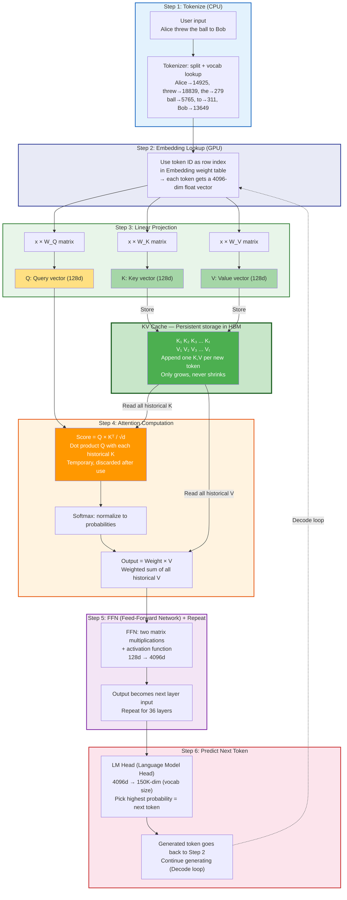

# KV Cache Deep Dive: From Fundamentals to Production Sizing

> **A comprehensive guide to understanding, calculating, and optimizing KV Cache in LLM inference**

[中文版](README-CN.md)

---

## Executive Summary

KV Cache is the **single largest dynamic memory consumer** during LLM inference. Understanding how KV Cache works and how to calculate its size is essential for GPU selection, VRAM planning, and production deployment.

This guide progresses through 5 levels:

| Level | Topic | What You'll Learn |
|:---:|-------|---------|
| **L1** | What is KV Cache | Deriving KV Cache from the Attention mechanism |
| **L2** | How Big is It | Universal formula + real model calculations |
| **L3** | Four Reduction Architectures | GQA → Hybrid Attention → MLA → Hybrid Mamba |
| **L4** | Quantization Impact | Weight quantization headroom, KV quantization, sensitive layers |
| **L5** | Production Sizing | Real-world VRAM estimation + GPU selection decision tree |

**Key Result: KV Cache Comparison (32K tokens, BF16, batch=1)**:

| Model | Architecture | Attention Layers | KV Cache | vs Baseline |
|-------|-------------|:---:|:---:|:---:|
| Qwen3-30B-A3B | Standard GQA | 48/48 (100%) | **3.00 GiB** | baseline |
| GLM-4.7-Flash | Compressed MLA | 47/47 (100%) | **1.65 GiB** | −45% |
| Qwen3.5-35B-A3B | Hybrid Attention | 10/40 (25%) | **0.625 GiB** | −79% |
| Nemotron-3-Nano-30B | Hybrid Mamba+Attn | 6/52 (12%) | **0.19 GiB** | −94% |

> Data source: HuggingFace config.json parameters + Python calculation. See [scripts/kv_cache_calculator.py](scripts/kv_cache_calculator.py).

---

## L1: What is KV Cache?

### 1.1 End-to-End Processing of a Sentence

Using "Alice threw the ball to Bob" as an example, the model processes it through these steps:

**Step 1: Tokenize** — pure text operation, no vectors involved

The tokenizer splits the string into subwords and maps them to integer IDs via a vocabulary dictionary:

```
"Alice"  → 14925
"threw"  → 18839
"the"    → 279
"ball"   → 5765
"to"     → 311
"Bob"    → 13649
```

**Step 2: Embedding lookup** — integers → float vectors

The model's **first layer weight** is an Embedding table (`[vocab_size × hidden_size]`). Token ID is used as a row index:

```
14925 → x₁ = [0.82, -0.31, 0.54, ...]   ← 4096 floats representing "Alice"
13649 → x₆ = [0.79, -0.28, 0.61, ...]   ← representing "Bob"
```

The Embedding table is part of the model weights, learned during training.

**Step 3: Linear Projection** — produces Q, K, V

> **What is linear projection?** It's a matrix multiplication. A 4096-dim vector multiplied by a 4096×128 matrix becomes a 128-dim vector. "Linear" because it only uses multiplication and addition. "Projection" because it maps from high-dimensional space (4096) to low-dimensional space (128) — like casting a 3D object's 2D shadow, keeping some information and discarding the rest.

Each layer has three **trained weight matrices** W_Q, W_K, W_V (model parameters, frozen during inference):

$$Q_t = x_t W_Q, \quad K_t = x_t W_K, \quad V_t = x_t W_V$$

Same embedding x_t, three different matrices, three different output vectors. The three matrices are like three different "filters" — same photo (embedding), different filters, three images highlighting different features (Q, K, V).

**Step 4: Attention Computation** — Q and K pair up for scoring, V carries content

> **What is Attention?** It means "paying attention" — the model decides which previous tokens to **focus on** when generating the current token. Three sub-steps:
>
> 1. **Scoring**: Dot product of current token's Q with each historical token's K (multiply corresponding elements and sum). Higher score = more relevant.
> 2. **Softmax (normalization)**: Convert scores to probabilities (summing to 1). Softmax computes $e^{x_i} / \sum e^{x_j}$ — amplifies differences and normalizes.
> 3. **Weighted sum**: Use probabilities to weight-average all historical V vectors. High-probability tokens contribute more. Output = a new vector fused with context.

$$\text{score}_{t,j} = \frac{Q_t \cdot K_j^\top}{\sqrt{d_k}} \quad \text{(divide by } \sqrt{d_k} \text{ to prevent dot products from growing too large)}$$

$$\text{output}_t = \sum_j \text{softmax}(\text{score})_j \cdot V_j$$

**Step 5: FFN (Feed-Forward Network) + next layer**

> **What is FFN?** Two matrix multiplications with an activation function in between. It "post-processes" the Attention output:
>
> ```
> Attention output (128d) → × Matrix₁ → Activation(SiLU) → × Matrix₂ → FFN output (4096d)
> ```
>
> **Activation function** (e.g. SiLU/ReLU) adds non-linearity — e.g. ReLU sets negative values to 0. Without it, stacking any number of linear layers is equivalent to one layer. Non-linearity is what allows the model to learn complex relationships.
>
> Think of it this way: Attention is tokens **talking to each other**; FFN is each token **thinking independently** about what it heard.

One layer = Attention + FFN. 36 layers stacked = information is repeatedly "exchanged → digested → exchanged → digested", building deeper understanding.

**Step 6: LM Head (Language Model Head) — predict next token**

> **What is LM Head?** One final matrix multiplication. Maps the 4096-dim output from layer 36 to vocab size (e.g. 150K dimensions), where each dimension is a probability for one token. Pick the highest → that's the prediction.

**Full Pipeline (Step 1 → Step 6):**


    style SCORE fill:#FF9800,color:#fff
```

### 1.2 What's Inside the Weight Matrices?

The Q, K, V weight matrices are **just trained floating-point numbers**. Below are actual values read from the Qwen3-0.6B model file:

```
W_Q (q_proj.weight) [2048 × 1024] = 2,097,152 numbers:
  [+0.0034, -0.0035, -0.0127, +0.0204, +0.0143, ...]

W_K (k_proj.weight) [1024 × 1024] = 1,048,576 numbers:
  [-0.0166, -0.0762, -0.0302, +0.0334, +0.0571, ...]

W_V (v_proj.weight) [1024 × 1024] = 1,048,576 numbers:
  [+0.0121, -0.0033, +0.0005, -0.0051, -0.0552, ...]
```

**All three matrices have identical structure** (float tables). Their difference comes solely from their **position in the computation graph**, which causes different gradients during training:

- W_Q's output is on the **left side** of QKᵀ → trained to extract "query needs"
- W_K's output is on the **right side** of QKᵀ → trained to extract "identity features"
- W_V's output is on the **right side** of weight × V → trained to extract "content to transfer"

Matrix multiplication (x × W_K) is fundamentally **weighted summation** — each row of W_K determines which embedding dimensions to amplify and which to ignore.

> **V is not the raw Embedding**. V is a processed version via W_V, which selects what information to transfer. Different layers' W_V extract different aspects of the same embedding.

### 1.3 What Exactly Does KV Cache Store?

**KV Cache stores the K and V vectors for every historical token at every layer** — the products of x_t × W_K and x_t × W_V.

**Not** Attention Scores (QKᵀ), **not** Attention Weights (post-softmax), **not** raw Embedding x_t.

```
KV Cache contents:
Layer 0:  { K: [K₁, K₂, ..., Kₜ],  V: [V₁, V₂, ..., Vₜ] }
Layer 1:  { K: [K₁, K₂, ..., Kₜ],  V: [V₁, V₂, ..., Vₜ] }
...
Layer 35: { K: [K₁, K₂, ..., Kₜ],  V: [V₁, V₂, ..., Vₜ] }
```

**Why cache K and V but not Q or Score?**

| Item | Cacheable? | Reason |
|------|:---------:|--------|
| **K** | ✅ | K_j = x_j × W_K; both x_j and W_K are fixed once computed |
| **V** | ✅ | Same: V_j = x_j × W_V is fixed |
| **Q** | ❌ | Q_t belongs to the current token; changes every step |
| **Score** | ❌ | Score = Q × Kᵀ; Q changes → Score must be recomputed |

### 1.4 Prefill and Decode: Two Phases

| Phase | What Happens | KV Cache Change |
|:---:|---------|-----------|
| **Prefill** | All prompt tokens processed in parallel | Cache fills with all prompt K, V |
| **Decode** | Generate one new token per step | Each step appends 1 new K, V |

During Decode, **only 1 token's K and V are computed per step**. All historical K, V are read from Cache — this is the core speedup.

### 1.5 The Cost: GPU Memory

| | No Cache | With KV Cache |
|---|:---:|:---:|
| K,V computation per step | $O(t)$ | $O(1)$ |
| Total over T steps | $O(T^2)$ | $O(T)$ |
| Extra memory | 0 | $O(T)$ |

**KV Cache = trading linear memory for quadratic compute.** The cache only grows (never shrinks until the conversation ends).

> **One-line summary**: KV Cache stores each historical token's Key and Value projection vectors (x_t × W_K and x_t × W_V) across all layers. They are produced before Attention via linear projection, are immutable once computed, and can be reused by all subsequent tokens.

---

## L2: How Big is KV Cache?

### 2.1 Universal Formula

| Symbol | Meaning | Example (Qwen3-8B) |
|--------|---------|:---------:|
| $L$ | Number of layers | 36 |
| $H_{kv}$ | Number of KV heads | 8 |
| $D$ | Head dimension | 128 |
| $T$ | Context length | 32,768 |
| $B$ | Batch size | 1 |
| $b$ | Bytes per element (BF16=2) | 2 |

$$\boxed{\text{KV Cache (bytes)} = L \times 2 \times H_{kv} \times D \times T \times B \times b}$$

### 2.2 Real Calculation: Qwen3-8B

```
KV per token = 36 × 2 × 8 × 128 × 2 = 147,456 bytes ≈ 144 KiB/token

Context 1K   → 144 MiB
Context 32K  → 4.5 GiB
Context 128K → 18.0 GiB
```

| Context Length | Weights (BF16) | KV Cache | Total VRAM | KV Share |
|:-:|:-:|:-:|:-:|:-:|
| 1K | 16.4 GB | 0.14 GiB | ~16.6 GB | ~1% |
| 32K | 16.4 GB | 4.5 GiB | ~21 GB | ~22% |
| 128K | 16.4 GB | 18.0 GiB | ~35 GB | **52%** |

> **Key insight**: For long-context scenarios, KV Cache memory **exceeds model weights**. KV Cache is the real "VRAM Killer".

### 2.3 KV Cache Scales Linearly with Context Length

$$\text{KV Cache} \propto T$$

Double the context → double the KV Cache. This is a **linear relationship** with no optimization possible under standard architectures.

### 2.4 MHA vs MQA vs GQA

| Type | $H_{kv}$ | KV Cache vs MHA | Quality |
|------|:-------:|:---:|:---:|
| MHA | = $H_q$ (e.g. 32) | 1× | Best |
| GQA | $H_q / g$ (e.g. 8) | $1/g$ | Near-MHA |
| MQA | 1 | $1/H_q$ | Slightly lower |

GQA is the **dominant choice** today: near-MHA quality with $1/g$ KV Cache.

---

## L3: Four KV Cache Reduction Architectures

### 3.1 Standard GQA — Qwen3-30B-A3B

All layers use GQA with full KV Cache.

```
48 layers × 2 × 4 kv_heads × 128 dim × 2 bytes = 96 KiB/token
KV @ 32K = 3.0 GiB
```

### 3.2 Hybrid Linear + Full Attention — Qwen3.5-35B-A3B

Only 10 out of 40 layers use Full Attention (with KV Cache). The other 30 use Linear Attention (no KV Cache needed).

```
10 layers × 2 × 2 kv_heads × 256 dim × 2 bytes = 20 KiB/token
KV @ 32K = 0.625 GiB  (−79% vs Qwen3)
```

**Trade-off**: Linear attention layers are more quantization-sensitive.

### 3.3 Multi-head Latent Attention (MLA) — GLM-4.7-Flash

Instead of storing full K,V vectors, store a compressed latent representation per layer:

$$\text{Stored per layer per token} = (r_{kv} + d_{rope}) \times b$$

```
47 layers × (512 + 64) × 2 bytes = 52.9 KiB/token
KV @ 32K = 1.65 GiB  (−45% vs Qwen3)
```

### 3.4 Hybrid Mamba + Attention — Nemotron-3-Nano-30B

Only 6 out of 52 layers use Attention. The rest use Mamba (SSM), which requires **zero** KV Cache.

```
6 layers × 2 × 2 kv_heads × 128 dim × 2 bytes = 6 KiB/token
KV @ 32K = 0.19 GiB  (−94% vs Qwen3)
```

### 3.5 Comparison Summary

| Rank | Model | Per-Token | KV @ 32K | Reduction | Strategy |
|:---:|-------|:---:|:---:|:---:|------|
| 1 | Nemotron-3-Nano-30B | 6 KiB | 0.19 GiB | **94%** | Only 12% layers use attention |
| 2 | Qwen3.5-35B-A3B | 20 KiB | 0.625 GiB | **79%** | Only 25% layers use full attention |
| 3 | GLM-4.7-Flash | 53 KiB | 1.65 GiB | **45%** | MLA compresses each layer |
| 4 | Qwen3-30B-A3B | 96 KiB | 3.00 GiB | baseline | Standard GQA all layers |

> **Key insight**: "Reducing the number of attention layers" (Hybrid strategy) is more effective than "compressing per-layer storage" (MLA strategy).

---

## L4: Quantization Impact on KV Cache

### 4.1 Weight Quantization Frees VRAM for KV Cache

```
Qwen3-8B on 24GB GPU:
  BF16 weights: 16.4 GB → 7.6 GB free → KV headroom ~48K tokens
  INT4 weights:  ~5 GB  → 19 GB free  → KV headroom ~125K tokens
```

### 4.2 KV Cache Quantization

vLLM supports FP8 KV Cache, halving KV memory:

```bash
vllm serve Qwen/Qwen3-8B --kv-cache-dtype fp8
```

### 4.3 Quantization-Sensitive Layers

From Qwen3.5 quantization experiments (source: Benjamin Marie):

| Component | Safe to INT4? | Reason |
|-----------|:---:|--------|
| MLP layers | ✅ | Robust to quantization |
| Full Attention layers | ✅ | Relatively robust |
| **Linear Attention layers** | ❌ | Significant accuracy loss |
| **Shared Expert** (MoE) | ❌ | Overall accuracy collapse |

### 4.4 Quantized Models "Overthink"

Quantized reasoning models generate more thinking tokens, doubling truncation rates at fixed max context length (e.g., 70% vs 30% on AIME25 for Qwen3.5-9B INT4 vs BF16).

**Mitigation**: Set higher `--max-model-len` or use `max_completion_tokens`.

---

## L5: Production VRAM Sizing

### 5.1 Total VRAM Formula

$$\boxed{\text{Total VRAM} = W + K + O}$$

- $W$: Model weights (params × bytes_per_param)
- $K$: KV Cache (use L2 formula)
- $O$: Runtime overhead (~10% of $W$)

### 5.2 Live Verification (Azure H100 NVL 95GB)

Verified on **Azure H100 NVL 95GB** with **vLLM 0.19.0**, Qwen3-8B BF16, `--max-model-len 32768 --gpu-memory-utilization 0.95`.

| Stage | VRAM Used | Notes |
|-------|:---------:|-------|
| Model loaded | **16,565 MiB (16.18 GiB)** | BF16 weights + overhead |
| vLLM fully started | **92,049 MiB (89.89 GiB)** | Weights + KV Cache pool pre-allocated |
| vLLM reported KV available | **70.72 GiB** | Space reserved for KV Cache |
| vLLM reported KV capacity | **514,944 tokens** | Max cacheable tokens |

**Formula Validation**:

| Metric | Predicted | Measured | Error |
|--------|:---------:|:--------:|:-----:|
| Model weights | 8.19B × 2 = 16.38 GB | 16.57 GB | +1.2% |
| KV total check | 514,944 × 144 KiB = **70.72 GiB** | **70.72 GiB** | <0.01% |
| 24K-token inference | — | 0.1s (FlashAttention v3) | — |

> **Conclusion**: Formula predictions match real-world measurements with <1% error.

### 5.3 Concurrency Impact

KV Cache scales linearly with batch size:

$$K_{total} = K_{per\_sequence} \times B$$

| Batch Size | KV Cache (Qwen3-8B, 32K) | Total VRAM |
|:---:|:---:|:---:|
| 1 | 4.5 GiB | ~23 GB |
| 4 | 18.0 GiB | ~37 GB |
| 8 | 36.0 GiB | ~55 GB |

> This is why high-concurrency scenarios require 80 GB GPUs (A100/H100) or multi-GPU tensor parallelism.

### 5.4 GPU Selection Decision Tree

```
Q1: Do model weights fit on a single GPU?
│
├── YES → Q2: Is remaining VRAM enough for target KV Cache?
│   ├── YES → Single GPU + Data Parallelism (vllm --dp N)
│   └── NO  → Quantize weights / Lower max-model-len / FP8 KV / Bigger GPU
│
└── NO  → Tensor Parallelism (vllm --tp N)
          Note: N must evenly divide num_attention_heads
```

---

## Appendix A: Score Matrix / FlashAttention / PagedAttention

### A.1 Concept Classification

| Category | Concept | What It Is |
|:---:|--------|------|
| **Data** | **Score Matrix** | Q × Kᵀ dot product result, T×T table. Temporary, discarded after use |
| **Data** | **KV Cache** | Persistent storage of K and V vectors in HBM, lasts entire conversation |
| **Optimization** | **FlashAttention** | Optimizes **Score** computation — tiled in Shared Memory, Score never touches HBM |
| **Optimization** | **PagedAttention** | Optimizes **KV Cache** storage — paged HBM management, reduces fragmentation |

**FlashAttention optimizes Score; PagedAttention optimizes KV Cache. They don't conflict — vLLM uses both.**

### A.2 Score Matrix vs KV Cache

| | **Score Matrix** | **KV Cache** |
|---|:---:|:---:|
| What | Q·K dot products (T×T table) | K and V vectors |
| Lifetime | Recomputed every step | Persists entire conversation |
| Scales as | $O(T^2)$ | $O(T)$ |
| Location | Standard: HBM; FlashAttn: Shared Memory | HBM |
| Cacheable? | ❌ Q changes every step | ✅ Historical K,V are immutable |

### A.3 FlashAttention: Score Stays Off HBM

**Problem**: Standard Attention materializes full T×T Score matrix in HBM. 32K context → 2 GB Score, repeated HBM reads/writes.

**Solution**: Tile Q, K, V into GPU **Shared Memory** (~200 KB per SM), compute Score tile + online softmax + multiply V tile there. Only final Output writes back to HBM.

```
Standard Attention:
  HBM → full Score (T×T) → write HBM → read Score → softmax → write HBM → read × V → write HBM
  (Score matrix repeatedly read/written in HBM)

FlashAttention:
  HBM → load Q,K tile to Shared Mem → Score tile → online softmax → × V tile → write Output
  (Score never touches HBM)
```

**Online Softmax**: Standard softmax needs full row (max + sum). FlashAttention maintains running max and running sum, updated per tile, mathematically equivalent.

**Prefill vs Decode**:
- **Prefill**: Q is long sequence → Q/K/V all tiled
- **Decode**: Q is 1 token (1×128) → no tiling for Q; only K/V sequence dimension tiled

### A.4 PagedAttention: Paged KV Cache

**Problem**: KV Cache needs contiguous memory. Multi-request fragmentation → OOM even with enough total free space.

**Solution**: Split HBM into fixed-size Pages (~16 tokens of KV each). Each request's KV Cache spread across non-contiguous Pages via Page Table.

| | No PagedAttention | With PagedAttention |
|---|---|---|
| Storage | Contiguous per request | Non-contiguous Pages |
| Fragmentation | Severe | Near zero |
| Memory utilization | ~50-70% | **~95%+** |
| Concurrency | Low | **2-4x more requests** |

### A.5 How They Cooperate (vLLM)

| Technology | Target | Optimizes | Origin |
|------------|--------|-----------|--------|
| KV Cache | K, V vectors | Saves compute (no re-computation) | Transformer original design |
| FlashAttention | Score computation | Saves bandwidth (Score off HBM) | Tri Dao, Stanford 2022 |
| PagedAttention | KV Cache storage | Saves memory (eliminates fragmentation) | vLLM, UC Berkeley 2023 |

---

## Reproducing

### KV Cache Calculator

```bash
pip install requests

# Calculate KV cache for any model
python scripts/kv_cache_calculator.py Qwen/Qwen3-8B
python scripts/kv_cache_calculator.py Qwen/Qwen3.5-35B-A3B
python scripts/kv_cache_calculator.py zai-org/GLM-4.7-Flash
python scripts/kv_cache_calculator.py nvidia/NVIDIA-Nemotron-3-Nano-30B-A3B-BF16
```

### Expected Output (Qwen3-8B)

```
Model: Qwen/Qwen3-8B
Architecture: gqa
  layers:                        36
  num_kv_heads:                   8
  head_dim:                     128
  per_token_bytes:          147456
  per_token_kib:             144.0
  context_length:            32768
  total_gib:                4.5000

  >>> KV Cache = 4.5000 GiB (4.8318 GB) for 32768 tokens, batch=1
```

### Script List

| Script | Purpose |
|--------|---------|
| [kv_cache_calculator.py](scripts/kv_cache_calculator.py) | Calculate KV cache size for any HuggingFace model |

---

