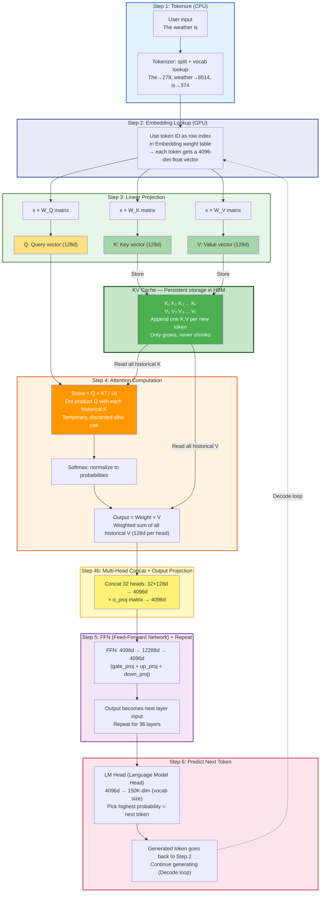

# KV Cache Deep Dive: From Fundamentals to Production Sizing

> **A comprehensive guide to understanding, calculating, and optimizing KV Cache in LLM inference**

[中文版](README-CN.md)

---

## Executive Summary

KV Cache is the **single largest dynamic memory consumer** during LLM inference. Understanding how KV Cache works and how to calculate its size is essential for GPU selection, VRAM planning, and production deployment.

This guide progresses through 6 levels:

| Level | Topic | What You'll Learn |
|:---:|-------|---------|
| **L0** | Zero-Prerequisite Intro | Walk through the entire LLM inference + KV Cache with one example, no prior knowledge needed |
| **L1** | What is KV Cache | Deriving KV Cache from the Attention mechanism |
| **L2** | How Big is It | Universal formula + real model calculations |
| **L3** | Four Reduction Architectures | GQA → Hybrid Attention → MLA → Hybrid Mamba |
| **L4** | Quantization Impact | Weight quantization headroom, KV quantization, sensitive layers |
| **L5** | Production Sizing | Real-world VRAM estimation + GPU selection decision tree |

**Key Result: KV Cache Comparison (32K tokens, BF16, batch=1)**:

| Model | Architecture | Attention Layers | KV Cache | vs Baseline |
|-------|-------------|:---:|:---:|:---:|
| Qwen3-30B-A3B | Standard GQA | 48/48 (100%) | **3.00 GiB** | baseline |
| GLM-4.7-Flash | Compressed MLA | 47/47 (100%) | **1.65 GiB** | −45% |
| Qwen3.5-35B-A3B | Hybrid Attention | 10/40 (25%) | **0.625 GiB** | −79% |
| Nemotron-3-Nano-30B | Hybrid Mamba+Attn | 6/52 (12%) | **0.19 GiB** | −94% |

> Data source: HuggingFace config.json parameters + Python calculation. See [scripts/kv_cache_calculator.py](scripts/kv_cache_calculator.py).

---

## L0: Zero-Prerequisite Introduction — One Example, Full Pipeline

> If you already understand Transformer basics, skip to L1.

### The entire LLM inference does one thing: given previous tokens, predict the next one

```
Input: "The weather is"
Model predicts: "nice" (highest probability)
Input becomes: "The weather is nice"
Model predicts: "today" (highest probability)
Input becomes: "The weather is nice today"
Model predicts: "!" (highest probability)
```

One token at a time. Only one. How? Through 6 steps below.

### Step 1: Turn words into numbers

The model doesn't understand text — only numbers. This step is called **Tokenization**.

```
"The weather is" → [279, 8514, 374]
```

Like a dictionary: "The" is on page 279, "weather" on page 8514. Pure dictionary lookup, no intelligence, runs on CPU.

### Step 2: Turn numbers into feature vectors

The model has a large table (**Embedding table**): 150K rows, each row containing 4096 numbers. Use the token ID as row index:

```
Row 279  → [0.12, -0.34, 0.56, ..., 0.23]   ← 4096 numbers representing "The"
Row 8514 → [0.45, 0.23, -0.11, ..., -0.05]   ← representing "weather"
```

> A **vector** is just an ordered list of numbers. 4096 numbers in a column = a 4096-dimensional vector.

**Why this step?** IDs 279 and 8514 have no mathematical relationship. But these 4096 numbers are trained — semantically similar words (e.g. "good" and "great") have similar vectors, unrelated words are far apart. Converting IDs to meaningful numbers enables subsequent math.

### Step 3: Split each vector into three parts — for "scoring" and "contributing"

Next, each token needs to look at previous tokens to gather context. But using the raw Embedding directly works poorly — the 4096-dim Embedding is a grab-bag, one set of numbers trying to serve both "scoring" and "contributing content" simultaneously, doing neither well.

**Solution**: Split the same Embedding into three different sets of numbers, each serving one purpose:

- **Q** = Numbers dedicated to **scoring others**. The current token's Q is dot-producted with every historical token's K — the result is a score that determines "how important is each previous token to me"
- **K** = Numbers dedicated to **being scored by others**. K passively waits for others' Q to measure it
- **V** = Numbers dedicated to **contributing to output when selected**. K determines "should I be selected?", V determines "after being selected, what do I contribute to the final prediction"

```
"is" (4096 numbers)
    ├── × W_Q matrix → Q = [128 numbers/head × 32 heads]  ← tool for scoring others
    ├── × W_K matrix → K = [128 numbers/head × 8 heads]   ← object to be scored
    └── × W_V matrix → V = [128 numbers/head × 8 heads]   ← content contributed when selected
```

> **Why does Q have 32 heads but K/V only 8?** This is GQA (Grouped-Query Attention) — every 4 Q heads share 1 set of K/V, reducing KV Cache size with almost no quality loss. For L0, just remember: Q has more heads than K/V. Details in L2.4.

> **Why separate K and V?** The numbers needed for accurate scoring (K) and the numbers needed for correct prediction (V) aren't the same. If one set of numbers serves both "scoring" and "prediction", neither works well. Separating them lets each focus on its own job.

> **What's actually in V?** V's 128 numbers have no human-readable meaning. They encode: in the current layer, given current context, the most useful information this token can provide for subsequent computation — possibly including word co-occurrence patterns ("weather" is often followed by "is/forecast/today"), the token's role in the sentence ("weather" as part of "weather forecast"), and features that help subsequent layers determine context. What exactly is determined by training; humans cannot directly interpret it.

> **Weight matrices** W_Q, W_K, W_V are three number tables whose values are learned during training. Three different "recipes" extract three different sets of numbers from the same Embedding — each serving an independent purpose.

**This step is called Linear Projection.**

### Step 4: Q scores K, then retrieves content from V — this is Attention

The model is predicting what comes after "The weather is", so "is" needs to look at all previous tokens to understand context.

**First: Q scores each K**

"is" takes its Q and dot-products with every historical token's K (multiply corresponding positions of two 128-number sets, then sum — yielding one score). **Q pairs with K → one Q scores multiple Ks.** High score = this historical token matters:

```
"is"'s Q × "The"'s K     = 0.3  ← not very relevant
"is"'s Q × "weather"'s K = 0.8  ← very relevant (weather is a phrase)
"is"'s Q × "is"'s K      = 0.5  ← moderate
```

**Second: Normalize (Softmax)**

Convert scores to percentages (summing to 100%), amplifying differences — big gets bigger, small gets smaller:

```
[0.3, 0.8, 0.5] → [15%, 55%, 30%]
```

**Third: Retrieve content from V by scores (weighted average)**

Use percentages to proportionally take content from each token's V (**note: taking from V not K — K handles scoring, V handles content, each its own job**):

```
output = 15% × "The"'s V + 55% × "weather"'s V + 30% × "is"'s V
```

**"is" now has a new vector fused with context** — mainly containing "weather"'s information (55%), because "weather is" is a phrase.

### Step 5: Independent digestion — FFN (Feed-Forward Network)

Attention is tokens **talking to each other**. FFN is each token **independently digesting** what it just received:

```
Post-attention vector → × Matrix₁ → Activation function (non-linearity: e.g. negatives→0, enables learning complex relationships) → × Matrix₂ → output
```

> Why activation functions? With only matrix multiplications (linear operations), no matter how many layers you stack, it's equivalent to one layer. Adding activation functions enables the model to learn curved, complex relationships.

**One layer = Attention (exchange) + FFN (digest).** Stack 36 layers, information repeatedly "exchanged → digested", understanding deepens:

```
Layer 0:  Understands literal meaning ("weather" + "is" = talking about weather)
Layer 15: Understands context (discussing weather conditions)
Layer 35: Synthesizes judgment (next token should be "nice/bad/cold" etc.)
```

### Step 6: Predict — LM Head (Language Model Head)

After 36 layers, the last token "is"'s vector has fused the entire sentence's understanding. One final matrix multiplication:

```
4096 numbers × matrix(4096×150000) = 150000 numbers
                                        ↓
                       Each number = probability for one vocab token
                            Pick highest → "nice"
```

Output: "nice".

### KV Cache in this example

After predicting "nice", the model continues predicting the next token. Input becomes "The weather is nice", requiring Step 4 again.

**Problem**: Step 4 scoring needs every historical token's K, content retrieval needs every historical token's V. Without caching, predicting each new token requires recomputing K and V for "The", "weather", "is", "nice" — **redundant work**.

**KV Cache stores previously computed K and V**:

```
Predicting "nice":  Computed The_K weather_K is_K    → stored in Cache
Predicting "today": Cache has history K, only compute nice_K → append to Cache
Predicting "!":     Cache has history K, only compute today_K → append to Cache
```

| | No Cache | With KV Cache |
|---|---|---|
| K/V computed per step | **All tokens recomputed** | **Only 1 new token** |
| Speed | Slower and slower (more tokens = more compute) | Constant (always compute 1) |
| Cost | None | Cache keeps growing, **uses GPU memory** |

**That's all KV Cache is: store to avoid recomputation, trade memory for speed.**

---

## L1: What is KV Cache?

### 1.1 End-to-End Processing of a Sentence

Using "The weather is" as the same example from L0 (now with technical detail), the model processes it through these steps:

**Step 1: Tokenize** — pure text operation, no vectors involved

The tokenizer splits the string into subwords and maps them to integer IDs via a vocabulary dictionary:

```
"The"      → 279
"weather"  → 8514
"is"       → 374
```

**Step 2: Embedding lookup** — integers → float vectors

The model's **first layer weight** is an Embedding table (`[vocab_size × hidden_size]`). Token ID is used as a row index:

```
279  → x₁ = [0.12, -0.34, 0.56, ...]   ← 4096 floats representing "The"
8514 → x₂ = [0.45, 0.23, -0.11, ...]   ← representing "weather"
374  → x₃ = [0.33, 0.17, -0.08, ...]   ← representing "is"
```

The Embedding table is part of the model weights, learned during training.

**Step 3: Linear Projection** — produces Q, K, V

> **What is linear projection?** It's a matrix multiplication. A 4096-dim vector multiplied by a 4096×128 matrix becomes a 128-dim vector. "Linear" because it only uses multiplication and addition. "Projection" because it maps from high-dimensional space (4096) to low-dimensional space (128) — like casting a 3D object's 2D shadow, keeping some information and discarding the rest.

Each layer has three **trained weight matrices** W_Q, W_K, W_V (model parameters, frozen during inference):

$$Q_t = x_t W_Q, \quad K_t = x_t W_K, \quad V_t = x_t W_V$$

Same embedding x_t, three different matrices, three different output vectors. The three matrices are like three different "filters" — same photo (embedding), different filters, three images highlighting different features (Q, K, V).

**Step 4: Attention Computation** — Q and K pair up for scoring, V carries content

> **What is Attention?** It means "paying attention" — the model decides which previous tokens to **focus on** when generating the current token. Three sub-steps:
>
> 1. **Scoring**: Dot product of current token's Q with each historical token's K (multiply corresponding elements and sum). Higher score = more relevant.
> 2. **Softmax (normalization)**: Convert scores to probabilities (summing to 1). Softmax computes $e^{x_i} / \sum e^{x_j}$ — amplifies differences and normalizes.
> 3. **Weighted sum**: Use probabilities to weight-average all historical V vectors. High-probability tokens contribute more. Output = a new vector fused with context.

$$\text{score}_{t,j} = \frac{Q_t \cdot K_j^\top}{\sqrt{d_k}} \quad \text{(divide by } \sqrt{d_k} \text{ to prevent dot products from growing too large)}$$

$$\text{output}_t = \sum_j \text{softmax}(\text{score})_j \cdot V_j$$

**Step 5: FFN (Feed-Forward Network) + next layer**

> **What is FFN?** Two matrix multiplications with an activation function in between. It "post-processes" the Attention output.
>
> But first, Attention outputs must be reassembled: each head produces a 128d vector, all heads are **concatenated** back to 4096d, then multiplied by an output projection matrix (o_proj). This 4096d vector is what enters FFN:
>
> ```
> Per-head attention output (128d each) → Concat 32 heads → 4096d → × o_proj → 4096d
>   → × Matrix₁ (gate_proj + up_proj, 4096→12288) → Activation(SiLU) → × Matrix₂ (down_proj, 12288→4096) → 4096d
> ```
>
> **Activation function** (e.g. SiLU/ReLU) adds non-linearity — e.g. ReLU sets negative values to 0. Without it, stacking any number of linear layers is equivalent to one layer. Non-linearity is what allows the model to learn complex relationships.
>
> Think of it this way: Attention is tokens **talking to each other**; FFN is each token **thinking independently** about what it heard.

One layer = Attention + FFN. 36 layers stacked = information is repeatedly "exchanged → digested → exchanged → digested", building deeper understanding.

**Step 6: LM Head (Language Model Head) — predict next token**

> **What is LM Head?** One final matrix multiplication. Maps the 4096-dim output from layer 36 to vocab size (e.g. 150K dimensions), where each dimension is a probability for one token. Pick the highest → that's the prediction.

**Full Pipeline (Step 1 → Step 6):**



> 🖼️ If Mermaid doesn't render, see the PNG version: [en-full-pipeline.png](images/en-full-pipeline.png)

> **Why is KV Cache so large?** Not just because of token count — multiply by layer count. Each of the 36 layers independently stores all historical K and V vectors. That's why the KV Cache formula has $L$ (number of layers).
>
> **Why can't layers share KV Cache?** Because each layer computes different K and V: (1) each layer's input is different — layer 0 receives embeddings, layer 1 receives layer 0's output, etc.; (2) each layer has its own W_K and W_V weight matrices. Different input × different weights = completely different K/V tensors. In HuggingFace transformers, `DynamicCache` stores "a list of CacheLayer, one for each layer" — verified from source code.
>
> **Exception**: Some newer architectures (e.g. Gemma3n) have `num_kv_shared_layers` — layers that share weights, so their KV Cache entries can be reused. But this is a special design, not standard Transformer behavior.

### 1.2 What's Inside the Weight Matrices?

The Q, K, V weight matrices are **just trained floating-point numbers**. Below are actual values read from the Qwen3-0.6B model file:

```
W_Q (q_proj.weight) [2048 × 1024] = 2,097,152 numbers:
  [+0.0034, -0.0035, -0.0127, +0.0204, +0.0143, ...]

W_K (k_proj.weight) [1024 × 1024] = 1,048,576 numbers:
  [-0.0166, -0.0762, -0.0302, +0.0334, +0.0571, ...]

W_V (v_proj.weight) [1024 × 1024] = 1,048,576 numbers:
  [+0.0121, -0.0033, +0.0005, -0.0051, -0.0552, ...]
```

**All three matrices have identical structure** (float tables). Their difference comes solely from their **position in the computation graph**, which causes different gradients during training:

- W_Q's output is on the **left side** of QKᵀ → trained to extract "query needs"
- W_K's output is on the **right side** of QKᵀ → trained to extract "identity features"
- W_V's output is on the **right side** of weight × V → trained to extract "content to transfer"

Matrix multiplication (x × W_K) is fundamentally **weighted summation** — each row of W_K determines which embedding dimensions to amplify and which to ignore.

> **V is not the raw Embedding**. V is a processed version via W_V, which selects what information to transfer. Different layers' W_V extract different aspects of the same embedding.

### 1.3 What Exactly Does KV Cache Store?

**KV Cache stores the K and V vectors for every historical token at every layer** — the products of x_t × W_K and x_t × W_V.

**Not** Attention Scores (QKᵀ), **not** Attention Weights (post-softmax), **not** raw Embedding x_t.

```
KV Cache contents:
Layer 0:  { K: [K₁, K₂, ..., Kₜ],  V: [V₁, V₂, ..., Vₜ] }
Layer 1:  { K: [K₁, K₂, ..., Kₜ],  V: [V₁, V₂, ..., Vₜ] }
...
Layer 35: { K: [K₁, K₂, ..., Kₜ],  V: [V₁, V₂, ..., Vₜ] }
```

**Why cache K and V but not Q or Score?**

| Item | Cacheable? | Reason |
|------|:---------:|--------|
| **K** | ✅ | K_j = x_j × W_K; both x_j and W_K are fixed once computed |
| **V** | ✅ | Same: V_j = x_j × W_V is fixed |
| **Q** | ❌ | Q_t belongs to the current token; changes every step |
| **Score** | ❌ | Score = Q × Kᵀ; Q changes → Score must be recomputed |

### 1.4 Prefill and Decode: Two Phases

| Phase | What Happens | KV Cache Change |
|:---:|---------|-----------|
| **Prefill** | All prompt tokens processed in parallel | Cache fills with all prompt K, V |
| **Decode** | Generate one new token per step | Each step appends 1 new K, V |

During Decode, **only 1 token's K and V are computed per step**. All historical K, V are read from Cache — this is the core speedup.

### 1.5 The Cost: GPU Memory

| | No Cache | With KV Cache |
|---|:---:|:---:|
| K,V computation per step | $O(t)$ | $O(1)$ |
| Total over T steps | $O(T^2)$ | $O(T)$ |
| Extra memory | 0 | $O(T)$ |

**KV Cache = trading linear memory for quadratic compute.** The cache only grows (never shrinks until the conversation ends).

> **One-line summary**: KV Cache stores each historical token's Key and Value projection vectors (x_t × W_K and x_t × W_V) across all layers. They are produced before Attention via linear projection, are immutable once computed, and can be reused by all subsequent tokens.

---

## L2: How Big is KV Cache?

### 2.1 Universal Formula

| Symbol | Meaning | Example (Qwen3-8B) |
|--------|---------|:---------:|
| $L$ | Number of layers | 36 |
| $H_{kv}$ | Number of KV heads | 8 |
| $D$ | Head dimension | 128 |
| $T$ | Context length | 32,768 |
| $B$ | Batch size | 1 |
| $b$ | Bytes per element (BF16=2) | 2 |

$$\boxed{\text{KV Cache (bytes)} = L \times 2 \times H_{kv} \times D \times T \times B \times b}$$

### 2.2 Real Calculation: Qwen3-8B

```
KV per token = 36 × 2 × 8 × 128 × 2 = 147,456 bytes ≈ 144 KiB/token

Context 1K   → 144 MiB
Context 32K  → 4.5 GiB
Context 128K → 18.0 GiB
```

| Context Length | Weights (BF16) | KV Cache | Total VRAM | KV Share |
|:-:|:-:|:-:|:-:|:-:|
| 1K | 16.4 GB | 0.14 GiB | ~16.6 GB | ~1% |
| 32K | 16.4 GB | 4.5 GiB | ~21 GB | ~22% |
| 128K | 16.4 GB | 18.0 GiB | ~35 GB | **52%** |

> **Key insight**: For long-context scenarios, KV Cache memory **exceeds model weights**. KV Cache is the real "VRAM Killer".

### 2.3 KV Cache Scales Linearly with Context Length

$$\text{KV Cache} \propto T$$

Double the context → double the KV Cache. This is a **linear relationship** with no optimization possible under standard architectures.

### 2.4 MHA vs MQA vs GQA

| Type | $H_{kv}$ | KV Cache vs MHA | Quality |
|------|:-------:|:---:|:---:|
| MHA | = $H_q$ (e.g. 32) | 1× | Best |
| GQA | $H_q / g$ (e.g. 8) | $1/g$ | Near-MHA |
| MQA | 1 | $1/H_q$ | Slightly lower |

GQA is the **dominant choice** today: near-MHA quality with $1/g$ KV Cache.

#### Four Attention Mechanisms: Deep Comparison

Continuing with our "The weather is" example. "is" needs to attend to "The" and "weather". Assume 4 Q heads, head_dim=4:

"is" produces 4 different Q vectors through W_Q (4 different "query perspectives"):
```
Q_head_0 = [0.8, 0.1, -0.5, 0.3]   ← may focus on "word collocations"
Q_head_1 = [0.2, 0.9, 0.1, -0.4]   ← may focus on "temporal modifiers"
Q_head_2 = [-0.3, 0.4, 0.7, 0.2]   ← may focus on "syntactic structure"
Q_head_3 = [0.5, -0.2, 0.3, 0.8]   ← may focus on "position relationships"
```

The difference between the four mechanisms is: **how many sets of K and V does each historical token ("The", "weather") produce to serve these 4 Q heads?**

**MHA (Multi-Head Attention): Each Q head gets its own K/V**

Each historical token produces 4 independent K/V sets, one per head:

```
"weather"'s K/V:
  K_weather_head0, V_weather_head0  ← exclusively for Q_head_0
  K_weather_head1, V_weather_head1  ← exclusively for Q_head_1
  K_weather_head2, V_weather_head2  ← exclusively for Q_head_2
  K_weather_head3, V_weather_head3  ← exclusively for Q_head_3

Q_head_0 × K_weather_head0 → score ("is" evaluates "weather" from "collocation" perspective)
Q_head_1 × K_weather_head1 → score ("is" evaluates "weather" from "temporal" perspective)
...each fully independent

KV Cache: each historical token stores 4K + 4V = 8 vectors
```

**MQA (Multi-Query Attention): All Q heads share 1 set of K/V**

Each historical token produces only 1 K/V set; all 4 different Q heads score against the same K:

```
"weather"'s K/V:
  K_weather_shared, V_weather_shared  ← only one set, all 4 Q heads use it

Q_head_0 × K_weather_shared = 0.95  ← "collocation" perspective score
Q_head_1 × K_weather_shared = 0.10  ← "temporal" perspective score
Q_head_2 × K_weather_shared = -0.53 ← "syntactic" perspective score
Q_head_3 × K_weather_shared = 0.41  ← "position" perspective score

→ 4 different Q → 4 different scores → different weighted V → different outputs
→ But "weather" only provides one set of "identity" (K) and "content" (V)

KV Cache: each historical token stores 1K + 1V = 2 vectors (1/4 of MHA)
```

**GQA (Grouped-Query Attention): Each group of Q heads shares 1 set of K/V**

4 Q heads split into 2 groups, each sharing 1 K/V set. Within-group sharing, between-group independent:

```
"weather"'s K/V:
  K_weather_group0, V_weather_group0  ← Q_head_0 and Q_head_1 share this
  K_weather_group1, V_weather_group1  ← Q_head_2 and Q_head_3 share this

Group 0: Q_head_0 × K_weather_group0 = 0.72  ("collocation" perspective)
         Q_head_1 × K_weather_group0 = 0.25  ("temporal" perspective)
         → Same K, different Q, different scores

Group 1: Q_head_2 × K_weather_group1 = -0.41 ("syntactic" perspective)
         Q_head_3 × K_weather_group1 = 0.63  ("position" perspective)
         → Different K, different Q, different scores

KV Cache: each historical token stores 2K + 2V = 4 vectors (1/2 of MHA)
```

Real example: Qwen3-8B has 32 Q heads, 8 KV heads → every 4 Q heads share 1 KV set → KV Cache = 1/4 of MHA.

**MLA (Multi-head Latent Attention): Store compressed latent, not full K/V**

Completely different approach — doesn't reduce K/V head count, instead doesn't store full K and V:

```
Standard (MHA/GQA):
  "weather" → × W_K → K_weather (128d)  → store in Cache
  "weather" → × W_V → V_weather (128d)  → store in Cache
  At inference: directly read K_weather and V_weather

MLA:
  "weather" → × W_compress → latent_weather (576d) → store in Cache (only this!)
  At inference: latent_weather → × W_decompress_K → K_weather → scoring
                latent_weather → × W_decompress_V → V_weather → content retrieval
```

GLM-4.7-Flash stores 576 numbers per layer instead of 1024, compressing to 56%. The cost is one extra decompression matrix multiplication at inference.

**Evolution path**:

```
MHA (independent KV per head) → KV Cache too large
  ↓
MQA (all heads share 1 KV) → Smallest Cache, but quality loss
  ↓
GQA (grouped sharing) → Best tradeoff ← current mainstream
  ↓
MLA (compressed storage + on-demand decompression) → Orthogonal optimization
```

> **Math verification** (Qwen3-8B, 32 Q heads, BF16):
> - MHA: 36 × 2 × 32 × 128 × 2 = 589,824 bytes/token = 576 KiB → @32K = **18 GiB**
> - GQA (8 KV heads): 36 × 2 × 8 × 128 × 2 = 147,456 bytes/token = 144 KiB → @32K = **4.5 GiB**
> - Ratio = 4.5/18 = **1/4** — GQA saves 75% of KV Cache

---

## L3: Four KV Cache Reduction Architectures

Four state-of-the-art ~30B MoE models use different strategies to reduce KV Cache. Here's how they map to the attention mechanisms from L2.4:

| Model | L2.4 Attention Type | Attention Layer Strategy | Non-Attention Layer Strategy | KV Cache Reduction |
|------|---------|---------|----------|:---:|
| Qwen3-30B-A3B | **GQA** | 48/48 layers all GQA | None | baseline |
| GLM-4.7-Flash | **MLA** | 47/47 layers all MLA | None | −45% |
| Qwen3.5-35B-A3B | **GQA** + Linear Attention | 10/40 layers GQA | 30 layers Linear Attention (no KV Cache) | −79% |
| Nemotron-3-Nano-30B | **GQA** + Mamba (SSM) | 6/52 layers GQA | 46 layers Mamba (no KV Cache) | −94% |

> **Key insight**: Qwen3.5 and Nemotron have tiny KV Cache not because their attention type is more advanced (both use standard GQA), but because they **drastically reduced the number of layers using Attention** — replacing most layers with Linear Attention / Mamba that need no KV Cache.

#### Two Orthogonal Dimensions for KV Cache Optimization

Reducing KV Cache has two independent dimensions that can be freely combined:

```
Dimension 1 (within layer): Inside a single Attention layer, how are KV heads organized?
              MHA → GQA → MQA → MLA
              (reduce per-layer KV size)

Dimension 2 (across layers): Across the model's layers, which layers use Attention?
              All layers Attention → Hybrid (some layers use alternatives)
              (reduce number of layers producing KV Cache)
```

| | All Layers Attention | Hybrid (some layers replaced) |
|---|---|---|
| **GQA** | Qwen3-30B (48 layers all GQA) | Qwen3.5 (10 GQA + 30 Linear), Nemotron (6 GQA + 46 Mamba) |
| **MLA** | GLM-4.7 (47 layers all MLA) | Theoretically possible, no real model yet |

#### Why Can Some Layers Skip Attention?

In traditional Transformers (GPT/LLaMA/Qwen3), **every layer has Attention** with W_Q/W_K/W_V matrices, and every layer produces KV Cache. This was the default before 2023.

**Hybrid architectures (2024-2025) broke this default** — replacing most layers with KV-Cache-free alternatives:

| Mechanism | How It Gets Context | History Storage | KV Cache? |
|------|---------|---------|:---:|
| **Standard Attention** | Q scores each historical K, weighted sum of V | Stores every token's K and V | **Yes, $O(T)$ growth** |
| **Linear Attention** | Compresses history into fixed-size state matrix S, updated each step | Fixed-size S | **No, $O(1)$** |
| **Mamba (SSM)** | Selective state space model updates fixed-size hidden state h | Fixed-size h | **No, $O(1)$** |

The **tradeoff** of Linear Attention and Mamba: history is "lossy-compressed" into a fixed-size state — they cannot precisely recall any arbitrary historical token like standard Attention can.

#### Why Hybrid Is the Best Approach

Models need two capabilities:
- **Most of the time**: "roughly knowing what was said before" is enough → Linear Attention / Mamba can handle this (cheap, no KV Cache)
- **Occasionally**: "precisely recall a specific historical token" → must use standard Attention (expensive, needs KV Cache)

Hybrid = most layers use the cheap option + a few layers use the expensive one = **save KV Cache + retain precise recall**. For example, Qwen3.5 places one full_attention layer every 4 layers, periodically giving the model a chance to precisely review complete history.

### 3.1 Standard GQA — Qwen3-30B-A3B

All layers use GQA with full KV Cache.

```
48 layers × 2 × 4 kv_heads × 128 dim × 2 bytes = 96 KiB/token
KV @ 32K = 3.0 GiB
```

### 3.2 Hybrid Linear + Full Attention — Qwen3.5-35B-A3B

Only 10 out of 40 layers use Full Attention (with KV Cache). The other 30 use Linear Attention (no KV Cache needed).

```
10 layers × 2 × 2 kv_heads × 256 dim × 2 bytes = 20 KiB/token
KV @ 32K = 0.625 GiB  (−79% vs Qwen3)
```

**Trade-off**: Linear attention layers are more quantization-sensitive.

### 3.3 Multi-head Latent Attention (MLA) — GLM-4.7-Flash

Instead of storing full K,V vectors, store a compressed latent representation per layer:

$$\text{Stored per layer per token} = (r_{kv} + d_{rope}) \times b$$

```
47 layers × (512 + 64) × 2 bytes = 52.9 KiB/token
KV @ 32K = 1.65 GiB  (−45% vs Qwen3)
```

### 3.4 Hybrid Mamba + Attention — Nemotron-3-Nano-30B

Only 6 out of 52 layers use Attention. The rest use Mamba (SSM), which requires **zero** KV Cache.

```
6 layers × 2 × 2 kv_heads × 128 dim × 2 bytes = 6 KiB/token
KV @ 32K = 0.19 GiB  (−94% vs Qwen3)
```

### 3.5 Comparison Summary

| Rank | Model | Per-Token | KV @ 32K | Reduction | Strategy |
|:---:|-------|:---:|:---:|:---:|------|
| 1 | Nemotron-3-Nano-30B | 6 KiB | 0.19 GiB | **94%** | Only 12% layers use attention |
| 2 | Qwen3.5-35B-A3B | 20 KiB | 0.625 GiB | **79%** | Only 25% layers use full attention |
| 3 | GLM-4.7-Flash | 53 KiB | 1.65 GiB | **45%** | MLA compresses each layer |
| 4 | Qwen3-30B-A3B | 96 KiB | 3.00 GiB | baseline | Standard GQA all layers |

> **Key insight**: "Reducing the number of attention layers" (Hybrid strategy) is more effective than "compressing per-layer storage" (MLA strategy).

---

## L4: Quantization Impact on KV Cache

### 4.1 Weight Quantization Frees VRAM for KV Cache

```
Qwen3-8B on 24GB GPU:
  BF16 weights: 16.4 GB → 7.6 GB free → KV headroom ~48K tokens
  INT4 weights:  ~5 GB  → 19 GB free  → KV headroom ~125K tokens
```

### 4.2 KV Cache Quantization

vLLM supports FP8 KV Cache, halving KV memory:

```bash
vllm serve Qwen/Qwen3-8B --kv-cache-dtype fp8
```

### 4.3 Quantization-Sensitive Layers

From Qwen3.5 quantization experiments (source: Benjamin Marie):

| Component | Safe to INT4? | Reason |
|-----------|:---:|--------|
| MLP layers | ✅ | Robust to quantization |
| Full Attention layers | ✅ | Relatively robust |
| **Linear Attention layers** | ❌ | Significant accuracy loss |
| **Shared Expert** (MoE) | ❌ | Overall accuracy collapse |

### 4.4 Quantized Models "Overthink"

Quantized reasoning models generate more thinking tokens, doubling truncation rates at fixed max context length (e.g., 70% vs 30% on AIME25 for Qwen3.5-9B INT4 vs BF16).

**Mitigation**: Set higher `--max-model-len` or use `max_completion_tokens`.

---

## L5: Production VRAM Sizing

### 5.1 Total VRAM Formula

$$\boxed{\text{Total VRAM} = W + K + O}$$

- $W$: Model weights (params × bytes_per_param)
- $K$: KV Cache (use L2 formula)
- $O$: Runtime overhead (~10% of $W$)

### 5.2 Live Verification (Azure H100 NVL 95GB)

Verified on **Azure H100 NVL 95GB** with **vLLM 0.19.0**, Qwen3-8B BF16, `--max-model-len 32768 --gpu-memory-utilization 0.95`.

| Stage | VRAM Used | Notes |
|-------|:---------:|-------|
| Model loaded | **16,565 MiB (16.18 GiB)** | BF16 weights + overhead |
| vLLM fully started | **92,049 MiB (89.89 GiB)** | Weights + KV Cache pool pre-allocated |
| vLLM reported KV available | **70.72 GiB** | Space reserved for KV Cache |
| vLLM reported KV capacity | **514,944 tokens** | Max cacheable tokens |

**Formula Validation**:

| Metric | Predicted | Measured | Error |
|--------|:---------:|:--------:|:-----:|
| Model weights | 8.19B × 2 = 16.38 GB | 16.57 GB | +1.2% |
| KV total check | 514,944 × 144 KiB = **70.72 GiB** | **70.72 GiB** | <0.01% |
| 24K-token inference | — | 0.1s (FlashAttention v3) | — |

> **Conclusion**: Formula predictions match real-world measurements with <1% error.

### 5.3 Concurrency Impact

KV Cache scales linearly with batch size:

$$K_{total} = K_{per\_sequence} \times B$$

| Batch Size | KV Cache (Qwen3-8B, 32K) | Total VRAM |
|:---:|:---:|:---:|
| 1 | 4.5 GiB | ~23 GB |
| 4 | 18.0 GiB | ~37 GB |
| 8 | 36.0 GiB | ~55 GB |

> This is why high-concurrency scenarios require 80 GB GPUs (A100/H100) or multi-GPU tensor parallelism.

### 5.4 GPU Selection Decision Tree

```
Q1: Do model weights fit on a single GPU?
│
├── YES → Q2: Is remaining VRAM enough for target KV Cache?
│   ├── YES → Single GPU + Data Parallelism (vllm --dp N)
│   └── NO  → Quantize weights / Lower max-model-len / FP8 KV / Bigger GPU
│
└── NO  → Tensor Parallelism (vllm --tp N)
          Note: N must evenly divide num_attention_heads
```

---

## Appendix A: Score Matrix / FlashAttention / PagedAttention

### A.1 Concept Classification

| Category | Concept | What It Is |
|:---:|--------|------|
| **Data** | **Score Matrix** | Q × Kᵀ dot product result, T×T table. Temporary, discarded after use |
| **Data** | **KV Cache** | Persistent storage of K and V vectors in HBM, lasts entire conversation |
| **Optimization** | **FlashAttention** | Optimizes **Score** computation — tiled in Shared Memory, Score never touches HBM |
| **Optimization** | **PagedAttention** | Optimizes **KV Cache** storage — paged HBM management, reduces fragmentation |

**FlashAttention optimizes Score; PagedAttention optimizes KV Cache. They don't conflict — vLLM uses both.**

### A.2 Score Matrix vs KV Cache

| | **Score Matrix** | **KV Cache** |
|---|:---:|:---:|
| What | Q·K dot products (T×T table) | K and V vectors |
| Lifetime | Recomputed every step | Persists entire conversation |
| Scales as | $O(T^2)$ | $O(T)$ |
| Location | Standard: HBM; FlashAttn: Shared Memory | HBM |
| Cacheable? | ❌ Q changes every step | ✅ Historical K,V are immutable |

### A.3 FlashAttention: Score Stays Off HBM

**Problem**: Standard Attention materializes full T×T Score matrix in HBM. 32K context → 2 GB Score, repeated HBM reads/writes.

**Solution**: Tile Q, K, V into GPU **Shared Memory** (~200 KB per SM), compute Score tile + online softmax + multiply V tile there. Only final Output writes back to HBM.

```
Standard Attention:
  HBM → full Score (T×T) → write HBM → read Score → softmax → write HBM → read × V → write HBM
  (Score matrix repeatedly read/written in HBM)

FlashAttention:
  HBM → load Q,K tile to Shared Mem → Score tile → online softmax → × V tile → write Output
  (Score never touches HBM)
```

**Online Softmax**: Standard softmax needs full row (max + sum). FlashAttention maintains running max and running sum, updated per tile, mathematically equivalent.

**Prefill vs Decode**:
- **Prefill**: Q is long sequence → Q/K/V all tiled
- **Decode**: Q is 1 token (1×128) → no tiling for Q; only K/V sequence dimension tiled

### A.4 PagedAttention: Paged KV Cache

**Problem**: KV Cache needs contiguous memory. Multi-request fragmentation → OOM even with enough total free space.

**Solution**: Split HBM into fixed-size Pages (~16 tokens of KV each). Each request's KV Cache spread across non-contiguous Pages via Page Table.

| | No PagedAttention | With PagedAttention |
|---|---|---|
| Storage | Contiguous per request | Non-contiguous Pages |
| Fragmentation | Severe | Near zero |
| Memory utilization | ~50-70% | **~95%+** |
| Concurrency | Low | **2-4x more requests** |

### A.5 How They Cooperate (vLLM)

| Technology | Target | Optimizes | Origin |
|------------|--------|-----------|--------|
| KV Cache | K, V vectors | Saves compute (no re-computation) | Transformer original design |
| FlashAttention | Score computation | Saves bandwidth (Score off HBM) | Tri Dao, Stanford 2022 |
| PagedAttention | KV Cache storage | Saves memory (eliminates fragmentation) | vLLM, UC Berkeley 2023 |

---

## Appendix B: NVIDIA Groq 3 LPX — SRAM-First Heterogeneous Inference Architecture and KV Cache

> Sources: NVIDIA Developer Blog ([Inside NVIDIA Groq 3 LPX](https://developer.nvidia.com/blog/inside-nvidia-groq-3-lpx-the-low-latency-inference-accelerator-for-the-nvidia-vera-rubin-platform)), [NVIDIA LPX Product Page](https://www.nvidia.com/en-us/data-center/lpx/), Groq Blog ([Inside the LPU](https://groq.com/blog/inside-the-lpu-deconstructing-groq-speed)). Announced at GTC 2026.

### B.1 Background: NVIDIA and Groq Cooperation

NVIDIA announced **NVIDIA Groq 3 LPX** at GTC 2026 (March 2026)—the seventh chip of the NVIDIA Vera Rubin platform. According to reports ([IEEE Spectrum](https://spectrum.ieee.org/nvidia-groq-3)), NVIDIA's IP licensing deal with Groq occurred in late 2025, integrating Groq's Tensor Streaming Processor (TSP) architecture into NVIDIA's data center platform.

### B.2 Core Architecture: SRAM-First + Deterministic Execution

The Groq 3 LPU's core design: **SRAM as primary storage (not cache)**:

| Metric | Groq 3 LPU (per chip) | Groq 3 LPX (full rack) |
|------|:---:|:---:|
| **SRAM Capacity** | 500 MB | 128 GB (256 chips) |
| **SRAM Bandwidth** | 150 TB/s | 40 PB/s |
| **Scale-up Bandwidth** | 2.5 TB/s | 640 TB/s |
| **FP8 Compute** | 1.2 PFLOPS | 315 PFLOPS |
| **DRAM** | Via Fabric Expansion Logic | Up to 256 GB per tray |

**Key Differences vs GPU**:

| | GPU (Rubin) | LPU (Groq 3) |
|---|---|---|
| **Primary Storage** | HBM (off-chip, ~TB/s bandwidth) | **SRAM (on-chip, ~PB/s bandwidth)** |
| **Scheduling** | Runtime dynamic scheduling | **Compile-time static, down to clock cycles** |
| **Data Movement** | Hardware cache hierarchies | **Compiler-explicit scheduling** |
| **Latency** | Variable (cache misses, contention) | **Deterministic, minimal jitter** |

### B.3 Where Are Weights, Activations, and KV Cache Stored?

Official quote:
> *"A flat, SRAM-first memory architecture where 500 MB of high-speed on-chip SRAM serves as the primary working storage for inference. The compiler and runtime place the active working set, **including weights, activations, and KV state**, into on-chip memory and move data explicitly."*

| Data | Storage Location | Characteristics |
|------|---------|------|
| **Weights** | On-chip SRAM (distributed across chips) | Static, layout determined at compile time |
| **Activations** | On-chip SRAM ("conveyor belt" flow) | Dynamic, overwritable after use, fixed footprint |
| **KV Cache** | On-chip SRAM | Dynamic growth, scales with context |

**Activations** don't accumulate—Layer 0's activations can be overwritten once passed to Layer 1.

**KV Cache** is the core SRAM challenge: 128 GB rack SRAM must hold weights + activations + KV Cache simultaneously. For trillion-parameter models + million-token context, SRAM alone isn't enough—hence the heterogeneous architecture.

### B.4 Heterogeneous Inference: Rubin GPU + LPX LPU Cooperation

**Key insight: LPX doesn't work alone—it cooperates with Rubin GPUs via Attention-FFN Disaggregation (AFD).**

```
Prefill phase (process long prompt, build KV Cache)
    → Rubin GPU (HBM large capacity + high compute)

Decode phase (per-token generation)
    ├─ Attention (read KV Cache) → Rubin GPU (KV Cache in HBM)
    └─ FFN/MoE (weight computation) → LPX LPU (weights in SRAM, ultra-low latency)
    → Intermediate activations exchanged between GPU ↔ LPU
```

| Phase | Executor | Why |
|------|---------|------|
| **Prefill** | Rubin GPU | Needs large input processing + KV Cache building, requires HBM capacity |
| **Decode Attention** | Rubin GPU | Needs full KV Cache access, KV Cache stored in HBM |
| **Decode FFN/MoE** | LPX LPU | Weights in SRAM, 150 TB/s bandwidth, ultra-low latency |

**This explains why LPX doesn't need to solve KV Cache storage alone**—KV Cache stays in Rubin GPU HBM, LPX handles FFN/MoE weight computation only.

### B.5 NVIDIA Dynamo Orchestration

NVIDIA Dynamo handles:
- Request classification and routing (throughput-first vs latency-first)
- Prefill/Decode disaggregated scheduling
- Activation transfer in the AFD loop between GPU ↔ LPU
- KV-aware routing (scheduling aware of KV Cache location)

### B.6 Connection to This Article

| Concept in This Article | How It Appears in LPX Architecture |
|---------|------------------|
| **KV Cache per-layer independence** | √ KV Cache stored in GPU HBM, not constrained by SRAM |
| **FlashAttention** | √ Decode Attention runs on GPU, can use FlashAttention |
| **PagedAttention** | √ KV Cache in GPU HBM, manageable by PagedAttention |
| **FFN dimensions** (4096d→12288d→4096d) | √ FFN/MoE offloaded to LPU, weights in SRAM with ~10x bandwidth vs HBM |
| **Multi-Head Concat + o_proj** | √ Post-concat activations are the "interim tensors" exchanged between GPU↔LPU |

> **One-line summary**: NVIDIA Groq 3 LPX uses extreme SRAM bandwidth (150 TB/s per chip) to solve decode-phase FFN/MoE latency, while KV Cache stays in Rubin GPU HBM—a GPU+LPU heterogeneous cooperation architecture, not LPU working alone.

---

## Appendix C: Activation Lifecycle in One Decoder Layer — What's Kept, Discarded, and Optimized

> Example: Qwen3-8B Layer 0 processing token "is" (32 heads, head_dim=128, hidden_size=4096, intermediate_size=12288)

### C.1 The Fate of All 15 Activations


| # | Activation | Dims | Fate | FA? | PA? |
|:-:|-----------|:---:|:---:|:---:|:---:|
| ① | x_is (layer input) | 4096d | ➡️ Released after residual | — | — |
| ② | Q_total | 4096d | 🗑️ Discarded after scoring | — | — |
| ③ | **K_total** | 1024d | **🟣 Stored in KV Cache** | — | **✅ PA manages storage** |
| ④ | **V_total** | 1024d | **🟣 Stored in KV Cache** | — | **✅ PA manages storage** |
| ⑤ | **Scores (Q×Kᵀ)** | **seq×seq** | 🗑️ Discarded | **⚡ FA: stays in SRAM** | — |
| ⑥ | **Softmax Weights** | **seq×seq** | 🗑️ Discarded | **⚡ FA: stays in SRAM** | — |
| ⑦ | Attn Output (per head) | 128d×32 | 🗑️ Discarded | **⚡ FA: block-accumulate** | — |
| ⑧ | Concat result | 4096d | 🗑️ Discarded | — | — |
| ⑨ | o_proj output | 4096d | 🗑️ Discarded | — | — |
| ⑩ | post_attn (after residual) | 4096d | ➡️ Released after residual | — | — |
| ⑪ | gate_proj output | **12288d** | 🗑️ Discarded | — | — |
| ⑫ | up_proj output | **12288d** | 🗑️ Discarded | — | — |
| ⑬ | ffn_mid (SiLU×up) | **12288d** | 🗑️ Discarded | — | — |
| ⑭ | down_proj output | 4096d | 🗑️ Discarded | — | — |
| ⑮ | layer_output | 4096d | **🔵 Passed to Layer 1** | — | — |

**Summary**: Of 15 activations — 🟣 Persisted 2 (K/V) | 🔵 Passed to next layer 1 | ➡️ Released after residual 2 | 🗑️ Discarded immediately 10

### C.2 FlashAttention vs PagedAttention Scope — Zero Overlap

```
15 activations
├── ③④ K/V → PagedAttention (how KV Cache is stored in HBM — paging, defragmentation)
├── ⑤⑥⑦ Score/Softmax/Output → FlashAttention (how attention is computed — in SRAM, off HBM)
└── Remaining 10 → Normal HBM read/write, no special optimization
```

**Quantified HBM IO savings by FA** (Qwen3-8B, seq=32K, BF16):

| Intermediate Activation | Standard Attention | FlashAttention |
|---------|:---:|:---:|
| ⑤ Score matrix (seq×seq) | Write + Read = 137.4 GB | **0** (stays in SRAM) |
| ⑥ Softmax result (seq×seq) | Write + Read = 137.4 GB | **0** (stays in SRAM) |
| **Total HBM IO eliminated** | — | **274.9 GB** |

### C.3 Relationship Between KV Cache and Activations

**Computationally**: KV Cache ⊂ Activations — K and V are intermediate results of the forward pass; they are activations.

**In memory management**: KV Cache is "extracted" and managed independently, behaving entirely differently from transient activations:

| Property | Transient activations (②⑤⑥⑧...) | KV Cache (③④) |
|------|:---:|:---:|
| Lifetime | Discarded within current step | Accumulates throughout entire conversation |
| Memory growth | Fixed (constant size) | Grows linearly with token count |
| Management | Standard CUDA alloc/free | PagedAttention paged management |

**Analogy**: Activations are semi-finished products on an assembly line — processed and passed on, not stored. KV Cache is parts pulled off the line and placed in a warehouse — they were once on the line, but now they're "inventory".

### C.4 layer_output: From "Knowing Only Itself" to "Fused Context Understanding"

Before Layer 0: "is"'s vector contains only its own initial features.

After Layer 0: Still a 4096d vector (format unchanged), but values are completely different — now fused with "weather"'s information (via Attention, "is" knows "weather is" is a phrase) and independently digested by FFN.

```
Layer 0:  "is" learned that "weather is" is a phrase
Layer 15: "is" understands "discussing weather conditions"
Layer 35: "is" judges the next token should be "nice/bad/cold"
```

**layer_output only passes to the next layer — it flows "vertically" (between layers).**

### C.5 Why KV Cache Must Be Stored Separately — "Vertical" vs "Horizontal"

```
"is" at Layer 0 produces two things:

Vertical (between layers): layer_output → passed to Layer 1 → "is" continues deeper
Horizontal (across steps): K_is, V_is → stored in Cache → left for all future tokens

Two directions, two purposes, both essential.
```

| | layer_output (vertical) | KV Cache (horizontal) |
|---|---|---|
| **Serves** | "is" **itself** — continues to deeper layers | **All future tokens** — used when they do Attention at Layer 0 |
| **Time dimension** | Within current step, between layers | Across steps, entire conversation |
| **Lifetime** | Released after Layer 1 uses it | Released when conversation ends |

When future token "nice" reaches Layer 0:
```
Q_nice × [K_The, K_weather, K_is, K_nice]ᵀ → scores
                             ↑ This K_is is read from Cache!
```

Without caching, "nice" at Layer 0 would need to recompute K and V for "The", "weather", "is" through W_K and W_V — redundant work. **KV Cache eliminates this redundancy.**

### C.6 GPU SRAM vs Groq LPU SRAM — Not the Same Thing

| | GPU SRAM (Shared Memory) | Groq LPU SRAM (MEM block) |
|---|---|---|
| **Capacity** | **Tens to hundreds of KB** (per SM) | **500 MB** (per chip) |
| **Gap** | — | **~1000x** |
| **Role** | Scratch pad (supporting role) | **Primary storage (replaces HBM)** |
| **Managed by** | FA kernel manually | Compiler static allocation |
| **Can hold KV Cache?** | ❌ Too small (KB vs GB) | ✅ Designed for it |

- **FlashAttention** is a **software optimization**: makes GPU's small SRAM (KB) efficiently handle attention intermediates
- **Groq LPU** is a **hardware architecture**: uses large SRAM (500 MB) as primary storage, plus each compute tray includes DRAM (up to 256 GB) for larger models and working sets

These are not the same thing. FA cannot put KV Cache "into" GPU SRAM — it's too small. Groq's SRAM can hold KV Cache because the hardware provides 500 MB per chip; larger working sets can spill to DRAM.

---

## Reproducing

### Environment

```bash
pip install requests
```

### KV Cache Calculator

```bash
pip install requests

# Calculate KV cache for any model
python scripts/kv_cache_calculator.py Qwen/Qwen3-8B
python scripts/kv_cache_calculator.py Qwen/Qwen3.5-35B-A3B
python scripts/kv_cache_calculator.py zai-org/GLM-4.7-Flash
python scripts/kv_cache_calculator.py nvidia/NVIDIA-Nemotron-3-Nano-30B-A3B-BF16
```

### Expected Output (Qwen3-8B)

```
Model: Qwen/Qwen3-8B
Architecture: gqa
  layers:                        36
  num_kv_heads:                   8
  head_dim:                     128
  per_token_bytes:          147456
  per_token_kib:             144.0
  context_length:            32768
  total_gib:                4.5000

  >>> KV Cache = 4.5000 GiB (4.8318 GB) for 32768 tokens, batch=1
```

### Script List

| Script | Purpose |
|--------|---------|
| [kv_cache_calculator.py](scripts/kv_cache_calculator.py) | Calculate KV cache size for any HuggingFace model |

---

## Project Information

| Item | Detail |
|------|--------|
| **Project** | KV Cache Deep Dive — From Fundamentals to Production |
| **Author** | 魏新宇 (Xinyu Wei) |
| **Date** | 2026-04 |
| **Primary Sources** | Benjamin Marie (Kaitchup), HuggingFace model configs |
| **Verified With** | Python calculation + HuggingFace config.json API |
