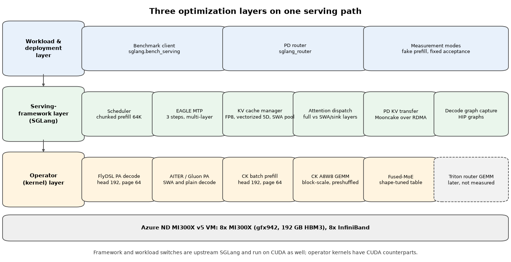
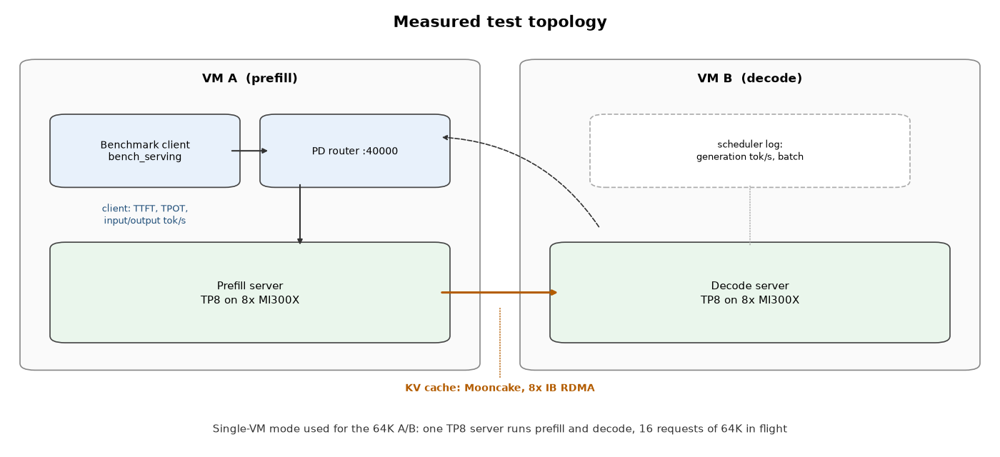

# LLM Inference Optimization on Azure GPU VMs

[](#architecture-and-test-setup)
[](upstream/SOURCES.lock.json)
[](#measured-results-on-mi300x)
[](https://github.com/david-xinyuwei/david-share/actions/workflows/llm-inference-optimization-ci.yml)

**How much faster can a 1M-context MoE model be served on the same GPUs, and which layer does the work?** This repository takes MiMo-V2.5-Pro (384 routed experts, hybrid sliding-window + grouped-query attention, 3-layer MTP) on Azure ND MI300X v5 VMs and shows every optimization in its serving stack. The optimizations fall into three layers: the serving framework, the operator (kernel) layer, and the workload and deployment layer. For each one you get the switch that turns it on, the code change in a pinned public commit where there is one, what it does to model output, and, where it was measured, how far it moved MI300X against MI300X itself.

How much faster the optimized stack is than the baseline stack, measured on MI300X against MI300X itself:

<!-- BEGIN GENERATED: cumulative -->
| Measured on MI300X | Before → after | Factor |
|---|---|---:|
| Decode graph capture, one switch<br>16K/1K, 16 in flight, baseline stack | 107.4 → 334.0 tok/s | **3.11×** |
| 128K prefill, 1 request, 8 GPUs<br>one VM → 1P1D prefill server | 6,915 → 16,390 tok/s | **2.37×** |
| Decode time per token, 64 in flight<br>MTP at fixed acceptance 3, lower is better | 45.86 → 17.00 ms | **2.70×** |
| Decode time per token, 64 in flight<br>MTP at actual acceptance, lower is better | 45.86 → 30.07 ms | **1.53×** |
| 64K prefill, 4 in flight<br>baseline prompts averaged 60,610 tokens | 13,919 → 19,023 tok/s | **1.37×** |
| 8K prefill, 4 in flight<br>baseline prompts averaged 7,792 tokens | 16,644 → 20,781 tok/s | **1.25×** |
<!-- END GENERATED: cumulative -->

<!-- BEGIN GENERATED: glance -->
- Single optimizations on an otherwise fixed stack: decode at 64K context **+25.65%** from the block-scale FP8 GEMM and unified-verify switches (in-session A/B); 8K prefill **+24.32%** from a shape-tuned fused-MoE table ([details](#what-single-optimizations-added)).
- The factors do not multiply: each row compares a different pair of runs. Workload and topology of every row are in [Baseline to optimized stack](#baseline-to-optimized-stack-the-cumulative-gain). No performance number compares MI300X with another accelerator.
<!-- END GENERATED: glance -->

The framework and workload layers transfer unchanged to NVIDIA GPUs, and each operator-layer technique names its CUDA counterpart.

Author: Xinyu Wei · [中文](README_CN.md) · [Results](#measured-results-on-mi300x) · [Three layers](#the-three-optimization-layers) · [Reproduce](#reproduce-in-your-environment) · [Tests](#tests-and-offline-checks)

## Start Here

| Goal | Entry |
|---|---|
| See the total gain from the baseline to the optimized stack | [Baseline to optimized stack](#baseline-to-optimized-stack-the-cumulative-gain) |
| See what single optimizations added | [What single optimizations added](#what-single-optimizations-added) |
| See how throughput changes from 8K to 256K context | [How throughput changes with context length](#how-throughput-changes-with-context-length) |
| Check accuracy on public benchmarks | [Accuracy measured on the optimized kernels](#accuracy-measured-on-the-optimized-kernels) |
| Find one technique: switch, code, evidence, effect on output | [The Three Optimization Layers](#the-three-optimization-layers) |
| Apply the same method on NVIDIA GPUs | [Porting the method to NVIDIA GPUs](#porting-the-method-to-nvidia-gpus) and the `cuda-hopper-pd` profile |
| Deploy the optimized stack on your MI300X VMs | [Reproduce in Your Environment](#reproduce-in-your-environment) |
| Check the published numbers without a GPU | [Tests and Offline Checks](#tests-and-offline-checks) |

## What This Repository Delivers

- **Serving engine and kernels** — owned by the upstream SGLang, AMD AITER, Composable Kernel and FlyDSL projects; the MiMo-specific commits are AMD engineering work in public forks. Here: pinned commit identities and the full patch of every commit discussed ([`upstream/`](upstream/)).
- **Optimization method and measurements** — this repository. Measured MI300X before/after comparisons with projected raw benchmark output ([`evidence/`](evidence/)), a per-technique explanation with code excerpts, and the boundaries of every number.
- **Launch configuration** — this repository. Machine-readable profiles for the measured MI300X stack and an NVIDIA template ([`profiles/`](profiles/)), rendered into commands with single-technique ablation ([`tools/render_launch.py`](tools/render_launch.py)).
- **Deployment** — this repository. A Dockerfile that builds the pinned runtime from public sources, a script that runs each server role as its own container, a readiness check and a settings template ([`docker/`](docker/)).
- **Checks** — this repository. Offline tests and CI that recompute every published number from the committed evidence.

You supply: Azure ND MI300X v5 capacity (two VMs for the PD path, one for the single-VM path), the MiMo-V2.5-Pro checkpoint, and a container host with RDMA access.

Not provided: model weights, the private raw logs behind the projected evidence (their SHA-256 is recorded), comparisons with other accelerators, accuracy results with the FP8 KV cache on, and any measured NVIDIA run. What each optimization can do to accuracy, and how to check it, is covered in [Which optimizations can change model output](#which-optimizations-can-change-model-output).

## Measured Results on MI300X

Every number compares MI300X with MI300X. Read this section top-down: first the total gain from the baseline stack to the optimized stack, then what single optimizations added, then the detail of each comparison. The FP8 KV cache was on in the optimized runs, and the captured environment of the stage-pair runs shows INT8 Quick Reduce on. Both are lossy, and their accuracy effect is not measured here; see [Which optimizations can change model output](#which-optimizations-can-change-model-output).

### Baseline to optimized stack: the cumulative gain

**Question.** With every optimization on, how much faster is the same model on the same MI300X VMs than on the first stack that served it?

**Input.** Baseline stack, the first configuration that served the model: SGLang v0.5.11 with Triton FP8 GEMM, no speculative decoding and the default KV cache type. Its decode and 128K prefill points used Triton attention; its 8K/64K prefill points already used AITER attention. Its 128K prefill point ran on one VM; all its other points ran on the same two-VM 1P1D layout as the optimized runs. Optimized stack: the stack of the [stage pair](#stage-pair-shape-tuned-fused-moe-table) below, with AITER attention, the CK FP8 GEMM, FP8 KV, EAGLE MTP, the tuned fused-MoE table and 1P1D over eight InfiniBand ports. The one-switch row compares two runs of the baseline stack in the same session.

The factors of this comparison are in the table at the top of the page.

The decode factor depends strongly on how often MTP draft tokens are accepted. The optimized throughput runs fixed the acceptance at three tokens per step, which is favorable. A related run on an older build of the same stack, with the acceptance the draft model actually achieved on the same random prompts, gives a reference point. Both are shown per point ("Actual MTP" and "Fixed MTP 3"; the factor under each value is against the baseline):

<!-- BEGIN GENERATED: cumulative-decode -->
| Metric | Baseline<br>16K in | Actual<br>MTP | Fixed<br>MTP 3 |
|---|---:|---:|---:|
| TPOT ms<br>at 32 | 29.41 | 23.20<br>1.27× | 13.65<br>2.15× |
| TPOT ms<br>at 64 | 45.86 | 30.07<br>1.53× | 17.00<br>2.70× |
| tok/s<br>at 32 | 658 | 1,238<br>1.88× | 1,936<br>2.94× |
| tok/s<br>at 64 | 1,396 | 1,645<br>1.18× | 2,458<br>1.76× |
<!-- END GENERATED: cumulative-decode -->

**Boundary.** This is a before/after, not an A/B: kernels, library versions and launch settings changed together, so the factors belong to the whole stack, not to one change. The baseline decode used 16K input tokens and the optimized runs 8K. A shorter context makes each decode step cheaper, so part of the decode factor comes from the workload, not the stack. The actual-acceptance run used an earlier AITER build without the tuned fused-MoE table and without unified verify, and random prompts are hard to draft, so it says little about acceptance on real traffic. The baseline 8K and 64K prompts averaged 7,792 and 60,610 tokens against exactly 8,192 and 65,536 in the optimized runs, so those two factors are approximate. The baseline 128K point ran on one VM with prefill and decode in one server, the optimized point on the prefill server of 1P1D; both prefill on 8 GPUs. The baseline decode and 128K values come from a summary report; the graph-capture pair and the baseline 8K/64K prefill points are raw client output. The baseline client stopped requests at about 340 of 1,024 output tokens, so the graph-capture factor compares those two runs with each other only. Sources and hashes are in [`evidence/runs.json`](evidence/runs.json) and [`evidence/raw-manifest.json`](evidence/raw-manifest.json).

### What single optimizations added

Each row isolates one change on an otherwise fixed stack. An A/B changes named switches inside one session. A stage pair repeats the same captured launch and benchmark scripts before and after one library update. These runs fixed MTP acceptance at three draft tokens, so read them as relative gains, not as production throughput. The first row is scheduler generation throughput; the other two are client-side input and output throughput.

**Input.** Each row names its workload, concurrency and topology; the full input of each comparison is in its own section below.

<!-- BEGIN GENERATED: headline -->
| What changed | Before → after (tok/s) | Change |
|---|---|---:|
| CK FP8 GEMM + unified verify<br>64K/1K decode, batch 16, one VM<br>*A/B, two switches, N=2* | 743 → 934 | **+25.65%** |
| Tuned fused-MoE table<br>8K prefill, concurrency 4, 1P1D<br>*stage pair, N=1* | 16,716 → 20,781 | **+24.32%** |
| Tuned fused-MoE table<br>8K/1K decode, concurrency 128, 1P1D<br>*stage pair, N=1* | 2,209 → 2,487 | **+12.56%** |
<!-- END GENERATED: headline -->

**Boundary.** Each gain belongs to the change named in its row, on the stack it was measured on. The rows were measured on different stacks and workloads, so they do not multiply into the cumulative factors above.

### Controlled A/B: block-scale FP8 GEMM path at 64K context

**Question.** On one MI300X VM, how much steady-state decode throughput does the final GEMM and verify path add at long context?

**Input.** Each request carries exactly 65,536 input token IDs and generates 1,024 tokens; 16 requests are in flight so the scheduler holds a batch of 16. MTP runs with a fixed acceptance of three draft tokens (`SGLANG_SIMULATE_ACC_LEN=3`, `SGLANG_SIMULATE_ACC_METHOD=match-expected`). The KV pool is enlarged with `--mem-fraction-static 0.95` so that sixteen 64K contexts fit at once. Throughput is the scheduler's generation rate while all 16 requests are running; the first full-batch sample of each run is the prefill-to-decode transition and is excluded by a rule fixed before the runs.

**What varied.** Two environment variables, switched together: the optimized arm adds `SGLANG_USE_AITER_CK_BLOCKSCALE_BPRESHUFFLE=1` and `SGLANG_AITER_UNIFIED_VERIFY=1`. Host, container, image, model, flags, benchmark command and KV setting are identical, each arm gets two fresh-service runs, and the two arms ran back-to-back.

<!-- BEGIN GENERATED: ab-table -->
| Arm | Run 1, run 2 | Mean |
|---|---:|---:|
| Baseline | 740.29, 745.95 | 743.12 |
| Optimized | 931.58, 935.92 | 933.75 |
| Change |  | **+25.65%** |
<!-- END GENERATED: ab-table -->

The two runs of each arm agree within 1%, so the difference is far outside run-to-run noise. Both arms in scheduler generation tokens per second. Dividing the batch by the throughput gives the time each of the 16 requests waits per token:

<!-- BEGIN GENERATED: ab-tpot -->
| Arm | Implied TPOT (ms) |
|---|---:|
| Baseline | 21.53 |
| Optimized | 17.14 |
| Change | **-20.42%** |
<!-- END GENERATED: ab-tpot -->

The implied TPOT is `1000 × 16 / tok/s`, not a client-measured latency.

**Boundary.** The two variables were switched together, so the gain belongs to the pair, not to either flag alone. The run is single-VM with prefill and decode in one server; it says nothing about PD deployments. The raw samples are in [`evidence/raw/ab-64k-bs16.json`](evidence/raw/ab-64k-bs16.json) and trace back to the audit file whose SHA-256 is recorded there.

### Stage pair: shape-tuned fused-MoE table

**Question.** In the two-VM PD deployment, what did the MiMo-specific fused-MoE tuning table change?

**Input.** Prefill: random prompts of 8,192 or 65,536 tokens, output 1 token, 16 prompts at concurrency 4, one warmup request, cache flushed, seed 12345. Decode: random prompts of 8,192 tokens with 1,024 output tokens, 256 prompts at concurrency 16 to 128, 32 warmup requests, cache flushed, seed 12345. The exact client arguments of every run are kept in [`evidence/raw/`](evidence/raw/).

**What varied.** AITER moved from `fc96a4f` to a build that adds the tuned table from [`d725746`](https://github.com/sammysun0711/aiter/commit/d725746a0f8c233d8e46e2771a7c8dbcd06e40d9) (the served CSV has the same SHA-256 as the file in that commit). The prefill launch script, the router script and both benchmark scripts have the same SHA-256 in both runs, and the captured environment lines of the decode server match. The full decode launch script was hashed only in the after run, and the sglang commit only in the before run, so the attribution to the table is strong but not proven by an in-session A/B.

Prefill, measured at the client (throughput rounded to whole tokens; exact values in `evidence/measurements.json`):

<!-- BEGIN GENERATED: stage-prefill -->
| Input tokens | tok/s<br>before → after | Change |
|---:|---:|---:|
| 8,192 | 16,716 → 20,781 | **+24.32%**<br>TTFT -15.15% |
| 65,536 | 17,254 → 19,023 | **+10.25%**<br>TTFT -9.36% |
<!-- END GENERATED: stage-prefill -->

Decode, same runs:

<!-- BEGIN GENERATED: stage-decode -->
| Concurrency | tok/s<br>before → after | Change |
|---:|---:|---:|
| 16 | 1,299 → 1,332 | **+2.52%**<br>TPOT +1.79% |
| 32 | 1,911 → 1,936 | **+1.33%**<br>TPOT +1.11% |
| 64 | 2,188 → 2,458 | **+12.33%**<br>TPOT +12.58% |
| 128 | 2,209 → 2,487 | **+12.56%**<br>TPOT +14.05% |
<!-- END GENERATED: stage-decode -->

Prefill gains come with shorter time to first token. At decode concurrency 64 and 128 the table raises output throughput by about an eighth while TPOT rises by a similar amount: the server holds more requests per step, so each request waits a little longer per token but the batch as a whole finishes sooner.

**Boundary.** Each point is one run before and one run after, not an interleaved A/B. The 256K prefill point is excluded from both runs: with `--context-length 262144`, a 262,144-token prompt plus MiMo's special tokens does not fit, and the server can answer with error payloads that the client still counts as successes. A separate attempt to measure the same table with `AITER_BYPASS_TUNE_CONFIG=1` as the baseline hit a GPU memory fault at 64K and was rejected, so no in-session A/B of this table exists.

### Where decode saturates: concurrency ladder

**Question.** Past which client concurrency does the 1P1D decode path stop gaining throughput, and what does extra concurrency cost?

**Input.** The same 8K-in / 1K-out decode workload and stack as the before run above, 256 prompts per point, client concurrency 16 to 256.

<!-- BEGIN GENERATED: ladder -->
| In flight<br>(observed) | Output<br>tok/s | TPOT<br>(ms) | TTFT (s)<br>mean / P99 |
|---:|---:|---:|---:|
| 16<br>(15.8) | 1,322 | 10.79 | 1.2 / 7.1 |
| 32<br>(30.9) | 1,914 | 13.37 | 2.8 / 14.1 |
| 64<br>(59.5) | 2,199 | 15.49 | 11.9 / 27.6 |
| 96<br>(84.0) | 2,201 | 15.06 | 23.7 / 40.8 |
| 128<br>(104.6) | 2,204 | 14.83 | 33.4 / 54.4 |
| 192<br>(135.4) | 2,203 | 14.72 | 47.9 / 81.3 |
| 256<br>(151.8) | 2,208 | 14.60 | 55.5 / 107.3 |
<!-- END GENERATED: ladder -->

Throughput reaches its plateau at concurrency 64. Above that, TPOT stays flat while mean and P99 time to first token keep growing: additional requests wait longer before their first token instead of adding throughput. The observed concurrency (in brackets, the client's time-averaged number of requests in flight) also stops following the configured value. That is consistent with the server's running-request limit and KV capacity taking over, but these runs have no scheduler trace to confirm it.

**Boundary.** One run per point on the stack before the tuned MoE table. The saturation point moves with context length, KV capacity and `--max-running-requests`, so measure it again for any other configuration.

### How throughput changes with context length

**Question.** On the optimized PD stack, how do prefill speed and the decode batch change as the context grows from 8K to 256K tokens?

**Input.** Two VMs in 1P1D with the image of the optimized stack and `--context-length 262151`. Prefill: random prompts with one output token, 16 requests per point, client concurrency 1 to 8; the 256K points send exact token IDs. Decode: 1,024 output tokens with MTP at a fixed acceptance of 3. The decode batch and the generation rate come from the decode server's scheduler log (`#running-req`), not from the client. The table lists prefill at one request and decode at the highest client concurrency measured for that length; the decode columns show the batch the server actually ran and its total generation rate, and that rate divided by the batch.

<!-- BEGIN GENERATED: context-table -->
| Input | Prefill tok/s<br>1 request | Decode batch<br>steady / peak | Decode tok/s<br>total / each |
|---|---:|---:|---:|
| 8K | 16,835 | 51 / 54<br>128 in flight | 2,333<br>45.8 |
| 64K | 18,057 | 4 / 5<br>96 in flight | 288<br>71.9 |
| 128K | 16,390 | 1 / 1<br>32 in flight | 138<br>138.2 |
| 192K | 13,827 | 1 / 1<br>16 in flight | 125<br>125.0 |
| 256K | 12,632 | 1 / 1<br>4 in flight | 128<br>127.8 |
<!-- END GENERATED: context-table -->

Prefill holds between about 12,600 and 18,100 input tokens per second across the whole range, so one 256K prompt is ready in about 21 seconds. Decode behaves differently. At 64K the decode server keeps only 4 to 5 requests running with 96 in flight, and from 128K on it runs one request at a time, even with 32 in flight. Each request still decodes quickly, 125 to 140 tokens per second, but the server's total falls from about 2,300 tokens per second at 8K to about 130. At long context the KV pool, not kernel speed, sets the throughput; see [Sizing the decode batch from KV capacity](#sizing-the-decode-batch-from-kv-capacity).

**Boundary.** The 8K and 64K rows come from one measurement series and the 128K to 256K rows from a second one on the same image; every point is a single run. The 256K prefill point with four requests in flight was rejected after two service lifecycles hit GPU memory-access faults, so no value is reported for it. The 256K decode row uses 261,120 input tokens so that the 1,024 output tokens still fit the context. Decode ran at a fixed MTP acceptance of 3, which is favorable.

### Adding a second prefill replica

**Question.** When prefill is the bottleneck, how much does a second complete TP8 server behind the same router add?

**Input.** Two replicas: two VMs, each running one ordinary TP8 server of the optimized stack (no PD mode), both registered with one `sglang_router` using round-robin; 32 requests per point. One server: the prefill server of the 1P1D deployment in the same measurement series; 16 requests per point. Random prompts with one output token in both. The table compares one and two requests in flight on each.

<!-- BEGIN GENERATED: replicas-table -->
| Input tokens | One server<br>1 → 2 in flight | Two replicas<br>1 → 2 in flight |
|---:|---:|---:|
| 8,192 | 16,835 → 19,618<br>1.17× | 20,752 → 41,202<br>**1.99×** |
| 65,536 | 18,057 → 19,860<br>1.10× | 19,695 → 38,984<br>**1.98×** |
| 262,144 | 12,382 → 12,378<br>1.00× | 12,783 → 25,064<br>**1.96×** |
<!-- END GENERATED: replicas-table -->

One server gains 0% to 17% from a second request in flight, because both requests share the same eight GPUs. Two replicas nearly double, because the second request lands on the idle replica; time to first token stays where it was (3.33 s and 3.35 s at 64K). Going further, to 8 or 16 in flight, adds at most 13% more (8K) and nothing at 64K and 256K.

**Boundary.** This measures prefill capacity with output length 1. The replicas were plain servers and the single-server reference was a PD prefill server, so the two columns differ in serving mode as well as in replica count. It is not a 2P1D result: no decode server and no KV transfer were in the loop. Each point is one run.

### What is not measured here

Decode graph capture was measured only on the baseline stack, without MTP and the AITER kernels; its share in the optimized stack is not isolated. The FlyDSL paged-attention decode kernel, the vectorized 5D KV layout, page 64 and the head-192 prefill tile are part of the final pinned runtime, but no published Microsoft run isolates them, so this page reports no speed-up for them. Their code changes are explained in [The Three Optimization Layers](#the-three-optimization-layers); measuring them follows the same A/B method on the single-VM profile.

## Architecture and Test Setup



A request enters at the workload layer (the benchmark client and, in PD mode, the router), is scheduled by SGLang, and is executed by the kernels of the operator layer. The framework decides which kernel a layer uses; the kernels decide how fast that layer runs; the workload layer decides whether the measurement is representative. The dashed box is a later commit that is not part of any measured configuration.



The stage pair and the concurrency ladder ran on two ND MI300X v5 VMs: VM A hosts the prefill server (TP8), the PD router and the benchmark client; VM B hosts the decode server (TP8); the KV cache moves from prefill to decode through Mooncake over eight InfiniBand ports. Client metrics (TTFT, TPOT, input and output tokens per second) are taken by `sglang.bench_serving` on VM A. The 64K A/B ran on one VM with a single TP8 server doing both prefill and decode, measured from the scheduler log.

## The Three Optimization Layers

Start with the overview: one row per technique, with what it did on MI300X and whether it can change model output. Each name links to a card with the switch, the NVIDIA counterpart, the code, the evidence and the effect on output, followed by an explanation and, where there is one, the real diff.

<!-- BEGIN GENERATED: technique-overview -->
**Serving-framework layer**

| Technique | What it did on MI300X | Output |
|---|---|---|
| [Per-layer attention dispatch for hybrid SWA + GQA](#per-layer-attention-dispatch-for-hybrid-swa--gqa) | partly on, not isolated | same math |
| [FP8 KV cache in a vectorized 5D page layout](#fp8-kv-cache-in-a-vectorized-5d-page-layout) | partly on, not isolated | lossy |
| [AITER unified attention for MTP target verify](#aiter-unified-attention-for-mtp-target-verify) | +25.65% decode, with CK GEMM (A/B) | same math |
| [Multi-layer EAGLE MTP speculative decoding and verifier fixes](#multi-layer-eagle-mtp-speculative-decoding-and-verifier-fixes) | on, not isolated | exact if correct |
| [Chunked prefill, page size and SWA pool sizing](#chunked-prefill-page-size-and-swa-pool-sizing) | final runtime, not measured | same math |
| [Decode graph capture (HIP graphs)](#decode-graph-capture-hip-graphs) | 3.11× decode (A/B) | same math |

**Operator (kernel) layer**

| Technique | What it did on MI300X | Output |
|---|---|---|
| [FlyDSL paged-attention decode kernel (head 192, page 64)](#flydsl-paged-attention-decode-kernel-head-192-page-64) | final runtime, not measured | same math |
| [Block-scale FP8 GEMM with pre-shuffled weights](#block-scale-fp8-gemm-with-pre-shuffled-weights) | +25.65% decode, with unified verify (A/B) | same math |
| [INT8 Quick Reduce for tensor-parallel all-reduce](#int8-quick-reduce-for-tensor-parallel-all-reduce) | on, not isolated | lossy |
| [Shape-tuned fused-MoE kernel table](#shape-tuned-fused-moe-kernel-table) | 8K prefill +24.32%, decode +12.56% (stage pair) | same math |
| [Head-192, page-64 FP8 batch-prefill tile](#head-192-page-64-fp8-batch-prefill-tile) | final runtime, not measured | same math |
| [Mixed-precision Triton router (MoE gate) GEMM](#mixed-precision-triton-router-moe-gate-gemm) | later commit, not measured | lossy |

**Workload and deployment layer**

| Technique | What it did on MI300X | Output |
|---|---|---|
| [Prefill/decode disaggregation (1P1D) over RDMA](#prefilldecode-disaggregation-1p1d-over-rdma) | on, not isolated | same math |
| [Prefill replicas behind one router (DP=2)](#prefill-replicas-behind-one-router-dp2) | 8K prefill 1.99× (two replicas) | same math |
| [Fake prefill for decode-only measurement](#fake-prefill-for-decode-only-measurement) | not used in the published runs | test method only |
| [Fixed MTP acceptance for performance runs](#fixed-mtp-acceptance-for-performance-runs) | on, not isolated | test method only |
| [Concurrency ladder against the saturation point](#concurrency-ladder-against-the-saturation-point) | finds the plateau (ladder) | test method only |
<!-- END GENERATED: technique-overview -->

"On, not isolated" means the switch was on in the published runs but its own share was not measured; "partly on" means only part of it was, for example the AITER backend but not the FlyDSL split; "final runtime, not measured" means it is in the pinned runtime whose throughput this repository does not report.

### Serving-framework layer

#### Per-layer attention dispatch for hybrid SWA + GQA

<!-- BEGIN GENERATED: card-attention-dispatch -->
- **Switch on MI300X**: `--attention-backend aiter`; full-attention verify goes to FlyDSL, SWA/sink layers and plain decode stay on AITER
- **On NVIDIA**: `--attention-backend fa3` or `flashinfer`; split per layer wherever one kernel does not cover both window types
- **Code**: [ba15db1](https://github.com/sammysun0711/sglang/commit/ba15db1a576dcdc8d51ba15bd069b9fd1f748d97), [0cfc48b](https://github.com/sammysun0711/sglang/commit/0cfc48b0e374d7e84c122f739182a39feea56d46)
- **Evidence**: AITER backend on in measured runs; FlyDSL split only in the pinned runtime
- **Effect on output**: same math. Different kernels for full and sliding-window layers; each computes exact attention.
<!-- END GENERATED: card-attention-dispatch -->

MiMo-V2.5-Pro mixes full-attention layers with sliding-window layers that also carry attention sinks. No single paged-attention kernel was fastest for both, so the backend decides per layer. During MTP target verification, full-attention layers go to the FlyDSL kernel while SWA and sink layers stay on the AITER path:

<!-- BEGIN GENERATED: excerpt-flydsl-layer-split -->
Diff excerpt from [`sammysun0711/sglang@ba15db1`](https://github.com/sammysun0711/sglang/commit/ba15db1a576dcdc8d51ba15bd069b9fd1f748d97), file `python/sglang/srt/layers/attention/aiter_backend.py` (local copy: [sammysun0711__sglang__ba15db1.patch](upstream/patches/sammysun0711__sglang__ba15db1.patch)).

```diff
+                    is_swa_layer = (
+                        layer.sliding_window_size is not None
+                        and layer.sliding_window_size > -1
+                    )
+                    use_flydsl = (
+                        getattr(self, "_use_flydsl_pa_decode", False)
+                        and not is_swa_layer
+                        and sinks is None
+                    )
+                    target_verify_fn = (
+                        forward_target_verify_flydsl_5d
+                        if use_flydsl
+                        else forward_target_verify_vectorized_5d
+                    )
```
<!-- END GENERATED: excerpt-flydsl-layer-split -->

The same idea removes a copy on the prefill side: commit [`0cfc48b`](https://github.com/sammysun0711/sglang/commit/0cfc48b0e374d7e84c122f739182a39feea56d46) hands cached-prefill batches straight to the page-64 kernel instead of gathering the paged KV into a dense buffer first.

#### FP8 KV cache in a vectorized 5D page layout

<!-- BEGIN GENERATED: card-fp8-kv-5d -->
- **Switch on MI300X**: `--kv-cache-dtype fp8_e4m3` + `SGLANG_AITER_KV_CACHE_LAYOUT=vectorized_5d`
- **On NVIDIA**: `--kv-cache-dtype fp8_e4m3`; FA3/FlashInfer paged layouts already keep a 16-byte inner vector
- **Code**: [78cd40c](https://github.com/sammysun0711/sglang/commit/78cd40c7a5102524536daf9a3178426777174d2d), [e11c515](https://github.com/sammysun0711/sglang/commit/e11c5155f0845079211c2a4d0b8a4ab3669039f9), [10a9401](https://github.com/sammysun0711/aiter/commit/10a94012efc1260dfdf16ba2f52fbda40a518a17)
- **Evidence**: FP8 KV on in measured runs; 5D layout only in the pinned runtime
- **Effect on output**: lossy. K and V are stored in FP8 E4M3 (3 mantissa bits) with one scale per tensor, so every cached token loses precision; the 5D layout itself only reorders bytes.
<!-- END GENERATED: card-fp8-kv-5d -->

At 1M context the KV cache, not the weights, decides how many requests fit. FP8 E4M3 storage halves the bytes per token. The vectorized 5D layout then reorders each page so that the innermost dimension is exactly one 16-byte vector, which lets every lane of a wavefront load its slice with one wide instruction:

<!-- BEGIN GENERATED: excerpt-kv-5d-vector-width -->
Diff excerpt from [`sammysun0711/sglang@78cd40c`](https://github.com/sammysun0711/sglang/commit/78cd40c7a5102524536daf9a3178426777174d2d), file `python/sglang/srt/mem_cache/memory_pool.py` (local copy: [sammysun0711__sglang__78cd40c.patch](upstream/patches/sammysun0711__sglang__78cd40c.patch)).

```diff
+        if layout == "vectorized_5d":
+            # X is the inner vectorization width in the SHUFFLE layout,
+            # determined by the STORAGE dtype (not the compute dtype) since
+            # it controls how many elements fit in 16 bytes of the on-pool
+            # tensor. For fp8 storage X=16, for bf16/fp16 X=8.
+            self._kv_vector_x = 16 // self.store_dtype.itemsize
```
<!-- END GENERATED: excerpt-kv-5d-vector-width -->

The same commit lets the MTP draft model keep an ordinary token-major (NHD) pool while the target model uses the 5D pool, because the draft kernels do not read the 5D layout. On NVIDIA the flag `--kv-cache-dtype fp8_e4m3` is identical and the paged layouts of FA3 and FlashInfer already keep a 16-byte inner vector for 128-bit loads, so only the principle carries over, not the flag.

#### AITER unified attention for MTP target verify

<!-- BEGIN GENERATED: card-unified-verify -->
- **Switch on MI300X**: `SGLANG_AITER_UNIFIED_VERIFY=1` on the decode server
- **On NVIDIA**: not needed; CUDA attention backends verify with their own kernels
- **Code**: no code change (configuration only)
- **Evidence**: measured A/B, together with the CK GEMM path
- **Effect on output**: same math. Selects which attention kernel verifies draft tokens; same exact attention.
<!-- END GENERATED: card-unified-verify -->

During MTP target verification, the decode server checks four positions per request at once. `SGLANG_AITER_UNIFIED_VERIFY=1` sends that step to AITER's unified attention kernel instead of the generic path. It is configuration only, and it was switched together with the CK GEMM path in the 64K A/B, so the gain belongs to the pair.

#### Multi-layer EAGLE MTP speculative decoding and verifier fixes

<!-- BEGIN GENERATED: card-eagle-mtp -->
- **Switch on MI300X**: `--speculative-algorithm EAGLE --speculative-num-steps 3 --speculative-eagle-topk 1 --speculative-num-draft-tokens 4 --enable-multi-layer-eagle`
- **On NVIDIA**: same flags
- **Code**: [db840d9](https://github.com/sammysun0711/sglang/commit/db840d935a9f7097dbeb5f1b0dba4d261057a2bd), [f26ae30](https://github.com/sammysun0711/sglang/commit/f26ae30063143411f3ae552af1830fa46e3ee0fd), [878fff1](https://github.com/sammysun0711/sglang/commit/878fff15647fe3dabb32aa3a335b0ad16e3ee878)
- **Evidence**: on in measured runs with fixed acceptance; f26ae30 and 878fff1 only in the pinned runtime
- **Effect on output**: exact if correct. Speculative decoding keeps the target model's output distribution only if verification is right. On HIP, sampled verification silently fell back to greedy until 878fff1, so temperature had no effect.
<!-- END GENERATED: card-eagle-mtp -->

MiMo ships three MTP layers, so each decode step drafts three tokens and verifies four. Speculative decoding only pays if the draft and target agree often, and on ROCm three bugs kept agreement low or results wrong: the draft-extend step read the full-attention pool instead of the SWA pool and used a different kernel than target verify ([`db840d9`](https://github.com/sammysun0711/sglang/commit/db840d935a9f7097dbeb5f1b0dba4d261057a2bd)); verification results could differ between TP ranks and desynchronize collectives ([`f26ae30`](https://github.com/sammysun0711/sglang/commit/f26ae30063143411f3ae552af1830fa46e3ee0fd)); and on HIP, sampled (non-greedy) verification silently fell back to the greedy verifier, so `temperature` had no effect ([`878fff1`](https://github.com/sammysun0711/sglang/commit/878fff15647fe3dabb32aa3a335b0ad16e3ee878), opt-in through `SGLANG_MIMO_EAGLE_HIP_NONGREEDY_VERIFY=1`). The flags are the same on CUDA.

#### Chunked prefill, page size and SWA pool sizing

<!-- BEGIN GENERATED: card-memory-sizing -->
- **Switch on MI300X**: `--chunked-prefill-size 65536 --page-size 64 --swa-full-tokens-ratio 0.01`
- **On NVIDIA**: same flags; re-derive the values from HBM size and kernel page support
- **Code**: no code change (configuration only)
- **Evidence**: measured runs used chunk 32768 and page 32
- **Effect on output**: same math. Chunk and page sizes change how work is split, not what is computed; the SWA ratio only sizes the pool.
<!-- END GENERATED: card-memory-sizing -->

These are configuration, not code, but they decide whether the kernels above run at all. The final runtime uses `--chunked-prefill-size 65536`, `--page-size 64` (the page size the FlyDSL and CK kernels were written for) and `--swa-full-tokens-ratio 0.01`, which shrinks the sliding-window pool to 1% of the full-attention pool because SWA layers only ever need the last window of tokens. The freed HBM goes to the full-attention KV pool and therefore to longer contexts.

#### Decode graph capture (HIP graphs)

<!-- BEGIN GENERATED: card-decode-graph-capture -->
- **Switch on MI300X**: on by default on the decode server: do not pass `--disable-cuda-graph` there (the prefill server keeps it)
- **On NVIDIA**: same default with CUDA graphs; `--cuda-graph-max-bs` bounds the captured batch sizes
- **Code**: no code change (configuration only)
- **Evidence**: measured A/B on the baseline stack (Triton attention, no MTP)
- **Effect on output**: same math. The captured graph replays the same kernels; it removes launch overhead, not arithmetic.
<!-- END GENERATED: card-decode-graph-capture -->

A decode step runs hundreds of small kernels, and at small batch the time to launch them is comparable to the time they run. SGLang captures each decode batch size once as a HIP graph (a CUDA graph on NVIDIA) and afterwards replays the whole step with one launch. The baseline stack ran with it off (`--disable-cuda-graph`, a workaround for a multi-node hang); turning it back on for the decode server was the largest single step measured here, while the prefill server keeps `--disable-cuda-graph` because prefill batches are large and irregular. The capture needs HBM for each captured batch size, so it competes with the KV pool.

### Operator layer

#### FlyDSL paged-attention decode kernel (head 192, page 64)

<!-- BEGIN GENERATED: card-flydsl-pa-decode -->
- **Switch on MI300X**: `SGLANG_AITER_PA_DECODE_IMPL=flydsl` + `SGLANG_FLYDSL_PA_NUM_PARTITIONS=16`
- **On NVIDIA**: CuTe DSL or FlashInfer decode; partitions correspond to split-KV
- **Code**: [c99d5cd](https://github.com/sammysun0711/FlyDSL/commit/c99d5cd97864c11e459cff9169d387d312790782), [ba15db1](https://github.com/sammysun0711/sglang/commit/ba15db1a576dcdc8d51ba15bd069b9fd1f748d97), [a2fd773](https://github.com/sammysun0711/sglang/commit/a2fd773ab43f960f5f2c29b5c592b0ca43c5ba8f)
- **Evidence**: pinned runtime; kernel not measured in isolation
- **Effect on output**: same math. Exact paged attention. The two fixed defects (unstaged query elements, 32-bit offset overflow) produced wrong output, not small drift, which is why the kernel refuses untested shapes.
<!-- END GENERATED: card-flydsl-pa-decode -->

FlyDSL is a Python DSL on MLIR in which a kernel is written as layouts (how a tensor is split across lanes, waves and tiles) rather than as index arithmetic; the compiler generates the addressing. The MiMo decode kernel had two defects at MiMo's shape, both fixed in [`c99d5cd`](https://github.com/sammysun0711/FlyDSL/commit/c99d5cd97864c11e459cff9169d387d312790782) and later merged upstream in ROCm/FlyDSL [#1064](https://github.com/ROCm/FlyDSL/commit/ed9885eca4ffc45e2ec1dc45fa00824baa6b56d3).

With head size 192, each of 16 lanes stages 12 query elements. The old rule rounded that to one 8-element load, so a third of every query row never reached LDS and the output contained NaNs. The fix loads 12 elements as three 4-element (64-bit) loads:

<!-- BEGIN GENERATED: excerpt-flydsl-query-load -->
Diff excerpt from [`sammysun0711/FlyDSL@c99d5cd`](https://github.com/sammysun0711/FlyDSL/commit/c99d5cd97864c11e459cff9169d387d312790782), file `kernels/attention/pa_decode_tile.py` (local copy: [sammysun0711__FlyDSL__c99d5cd.patch](upstream/patches/sammysun0711__FlyDSL__c99d5cd.patch)).

```diff
         # Per-lane Q chunk (QCHUNK 16-bit elems) fetched in QLOAD_UNIT-wide
-        # pieces (128b max per buffer load): head_dim=256 needs 2 pieces.
-        QLOAD_UNIT = QCHUNK if QCHUNK < 8 else 8
+        # pieces (128b max per buffer load).  Use 64-bit loads when QCHUNK is
+        # not divisible by 8: head_dim=192 gives QCHUNK=12 and therefore needs
+        # three 4-element loads.  Rounding it down to one 8-element load leaves
+        # one third of every query row unstaged in LDS.
+        QLOAD_UNIT = 8 if QCHUNK % 8 == 0 else 4
         N_QLOADS = QCHUNK // QLOAD_UNIT
         _q_copy_op = fx.rocdl.BufferCopy128b() if QLOAD_UNIT == 8 else fx.rocdl.BufferCopy64b()
         _q_load_chunk = _make_flat_loader(query_ptr, Q_DTYPE, QLOAD_UNIT, _q_copy_op)
```
<!-- END GENERATED: excerpt-flydsl-query-load -->

Physical page ids fit in 32 bits, but a byte offset computed from them does not once a single KV cache exceeds 2 GiB, which it does at 1M context. The fix promotes the page id to 64 bits before any offset arithmetic:

<!-- BEGIN GENERATED: excerpt-flydsl-int64-offset -->
Diff excerpt from [`sammysun0711/FlyDSL@c99d5cd`](https://github.com/sammysun0711/FlyDSL/commit/c99d5cd97864c11e459cff9169d387d312790782), file `kernels/attention/pa_decode_tile.py` (local copy: [sammysun0711__FlyDSL__c99d5cd.patch](upstream/patches/sammysun0711__FlyDSL__c99d5cd.patch)).

```diff
         def _k_ops(phys, a):
+            # Physical page ids fit in i32, but their byte/element offsets do
+            # not once an individual KV cache grows beyond 2 GiB.
+            phys = fx.Int64(phys)
             within_page_tok = (a * c16 + lane16) % block_size
```
<!-- END GENERATED: excerpt-flydsl-int64-offset -->

On the SGLang side ([`ba15db1`](https://github.com/sammysun0711/sglang/commit/ba15db1a576dcdc8d51ba15bd069b9fd1f748d97)) the kernel is opt-in and refuses to start on any shape it was not validated for, instead of silently producing wrong attention:

<!-- BEGIN GENERATED: excerpt-flydsl-dispatch-gate -->
Diff excerpt from [`sammysun0711/sglang@ba15db1`](https://github.com/sammysun0711/sglang/commit/ba15db1a576dcdc8d51ba15bd069b9fd1f748d97), file `python/sglang/srt/layers/attention/aiter_backend.py` (local copy: [sammysun0711__sglang__ba15db1.patch](upstream/patches/sammysun0711__sglang__ba15db1.patch)).

```diff
+        incompatibilities = []
+        if self.use_mla:
+            incompatibilities.append("MLA is unsupported")
+        if self.topk != 1:
+            incompatibilities.append(f"top-k must be 1, got {self.topk}")
+        if self.page_size != 64:
+            incompatibilities.append(f"page size must be 64, got {self.page_size}")
+        if self.max_context_len > 1_048_576:
+            incompatibilities.append(
+                "maximum context must not exceed 1,048,576 tokens, got "
+                f"{self.max_context_len}"
+            )
+        if (self.num_head, self.num_kv_head, self.head_dim) != (16, 1, 192):
+            incompatibilities.append(
+                "TP-local shape must be 16Q/1KV/head-192, got "
+                f"{self.num_head}Q/{self.num_kv_head}KV/head-{self.head_dim}"
+            )
+        if self.input_dtype != torch.bfloat16:
+            incompatibilities.append(
+                f"model dtype must be BF16, got {self.input_dtype}"
+            )
+        if self.kv_cache_dtype != fp8_dtype:
+            incompatibilities.append(
+                f"KV cache dtype must be FP8 E4M3, got {self.kv_cache_dtype}"
+            )
+        if not is_gfx942_supported():
+            incompatibilities.append("phase 1 is validated only on gfx942")
+        if incompatibilities:
+            raise RuntimeError(
+                "SGLANG_AITER_PA_DECODE_IMPL=flydsl is incompatible with this "
+                "target backend: " + "; ".join(incompatibilities)
+            )
```
<!-- END GENERATED: excerpt-flydsl-dispatch-gate -->

[`a2fd773`](https://github.com/sammysun0711/sglang/commit/a2fd773ab43f960f5f2c29b5c592b0ca43c5ba8f) makes the number of context partitions configurable (8, 16, 24 or 32); the final runtime uses 16 so that long contexts are split across enough workgroups to occupy the 304 compute units. Upstream [#1065](https://github.com/ROCm/FlyDSL/commit/e46db6020b4560de82a7136d78cc33a5186338f4) later added BF16 KV and different K and V head sizes, so MiMo's 128-wide value head no longer has to be padded to 192. The NVIDIA counterpart of this kind of layout-first kernel is CuTe DSL; the partition count corresponds to split-KV.

#### Block-scale FP8 GEMM with pre-shuffled weights

<!-- BEGIN GENERATED: card-ck-a8w8-gemm -->
- **Switch on MI300X**: `SGLANG_USE_AITER_CK_BLOCKSCALE_BPRESHUFFLE=1`
- **On NVIDIA**: DeepGEMM (`SGLANG_ENABLE_JIT_DEEPGEMM=1`) or CUTLASS block-scale GEMM
- **Code**: [2f9b9ae](https://github.com/sammysun0711/sglang/commit/2f9b9aedf32977bc5d088a86ec0a73bcf432a4d0), [fc96a4f](https://github.com/sammysun0711/aiter/commit/fc96a4f9f5f3e931cbb9de275c8aa01136417500)
- **Evidence**: measured A/B, together with unified verify
- **Effect on output**: same math. Both the Triton path and the CK path quantize activations to FP8 per 1x128 block against the same FP8 block-scale checkpoint; the switch changes the kernel, not the precision.
<!-- END GENERATED: card-ck-a8w8-gemm -->

MiMo's linear layers are FP8 with one scale per 128-wide block. On gfx942 SGLang used a Triton kernel for this GEMM. Commit [`2f9b9ae`](https://github.com/sammysun0711/sglang/commit/2f9b9aedf32977bc5d088a86ec0a73bcf432a4d0) adds a switch that selects AITER's Composable Kernel implementation instead, with the weights shuffled once at load time into the layout the matrix cores read:

<!-- BEGIN GENERATED: excerpt-ck-gemm-select -->
Diff excerpt from [`sammysun0711/sglang@2f9b9ae`](https://github.com/sammysun0711/sglang/commit/2f9b9aedf32977bc5d088a86ec0a73bcf432a4d0), file `python/sglang/srt/layers/quantization/fp8_utils.py` (local copy: [sammysun0711__sglang__2f9b9ae.patch](upstream/patches/sammysun0711__sglang__2f9b9ae.patch)).

```diff
     elif _use_aiter_gfx95:
         use_triton = use_aiter_triton_gemm_w8a8_tuned_gfx950(n, k)
+    elif _use_aiter_ck_blockscale_bpreshuffle_gfx942:
+        use_triton = False
+    elif _use_aiter_ck_blockscale_gfx942:
+        use_triton = False
     else:
         use_triton = True
 
+    # The weight-preshuffled CK kernel consumes a transposed activation scale.
+    use_bpreshuffle = not use_triton and (
+        _use_aiter_bpreshuffle_gfx95 or _use_aiter_ck_blockscale_bpreshuffle_gfx942
+    )
+
```
<!-- END GENERATED: excerpt-ck-gemm-select -->

AITER [`fc96a4f`](https://github.com/sammysun0711/aiter/commit/fc96a4f9f5f3e931cbb9de275c8aa01136417500) adds per-shape tile configurations for MiMo's GEMM sizes on a 304-CU MI300X. This path is one of the two switches in the measured A/B above; the other is unified verify, so the gain is not attributed to the GEMM alone. On NVIDIA the same role is played by DeepGEMM (`SGLANG_ENABLE_JIT_DEEPGEMM=1`) or CUTLASS block-scale FP8 GEMM, whose pre-packed weights correspond to the pre-shuffle.

#### INT8 Quick Reduce for tensor-parallel all-reduce

<!-- BEGIN GENERATED: card-int8-quick-reduce -->
- **Switch on MI300X**: `ROCM_QUICK_REDUCE_QUANTIZATION=INT8` (set by the base image; `NONE` turns it off)
- **On NVIDIA**: no default equivalent; NCCL and the SGLang custom all-reduce sum in full precision
- **Code**: no code change (configuration only)
- **Evidence**: on in the measured throughput runs, inherited from the base image; not isolated
- **Effect on output**: lossy. Tensor-parallel all-reduces that go through Quick Reduce are quantized to INT8 before the partial sums from the 8 GPUs are added.
<!-- END GENERATED: card-int8-quick-reduce -->

Tensor parallelism sums partial results from the 8 GPUs after every attention and MoE block. Quick Reduce is an all-reduce for ROCm in SGLang's custom all-reduce path; with `ROCM_QUICK_REDUCE_QUANTIZATION=INT8` it quantizes what it sends to INT8, so fewer bytes cross the GPU links. The captured environment of the stage-pair runs shows it on; the base image sets it, not a launch script; see the warning in [Which optimizations can change model output](#which-optimizations-can-change-model-output).

#### Shape-tuned fused-MoE kernel table

<!-- BEGIN GENERATED: card-tuned-fused-moe -->
- **Switch on MI300X**: `mimo_v2_5_pro_b16_tuned_fmoe.csv` in AITER
- **On NVIDIA**: Triton fused-MoE JSON from `tuning_fused_moe_triton.py`
- **Code**: [d725746](https://github.com/sammysun0711/aiter/commit/d725746a0f8c233d8e46e2771a7c8dbcd06e40d9)
- **Evidence**: measured stage pair
- **Effect on output**: same math. Chooses among existing fused-MoE kernels per token count; the model math is unchanged.
<!-- END GENERATED: card-tuned-fused-moe -->

A MoE layer's cost depends on how many tokens land in one batch. AITER can pick a different fused-MoE kernel per token count, and [`d725746`](https://github.com/sammysun0711/aiter/commit/d725746a0f8c233d8e46e2771a7c8dbcd06e40d9) records the winner of an offline search for MiMo's expert shape (hidden size 6,144, expert intermediate size 256 per TP rank, 384 experts, top-8):

<!-- BEGIN GENERATED: moe-table -->
| Tokens | Kernel | Time (µs) | TFLOPS |
|---:|---|---:|---:|
| 2,048 | A | 703.2 | 219.9 |
| 4,096 | B | 1,069.8 | 289.1 |
| 8,192 | B | 1,412.0 | 438.0 |
| 16,384 | B | 2,680.7 | 461.4 |
| 32,768 | B | 4,816.4 | 513.6 |

Every row uses block_m = 64; time and TFLOPS are the tuner's own measurement at each token count. Kernel letters:

- A = `fmoe_bf16_blockscaleFp8_g1u1_vs_silu_64x256`
- B = `fmoe_bf16_blockscaleFp8_g1u1_vs_ps_silu_64x256`
<!-- END GENERATED: moe-table -->

From 4,096 tokens on, the search picks kernel B (the `_ps_` variant), and achieved TFLOPS keep rising with batch size. The table changes only which kernel runs, not the model math. The NVIDIA equivalent is SGLang's Triton fused-MoE configuration, generated per expert count, size, dtype and GPU with `benchmark/kernels/fused_moe_triton/tuning_fused_moe_triton.py`.

#### Head-192, page-64 FP8 batch-prefill tile

<!-- BEGIN GENERATED: card-ck-prefill-tile -->
- **Switch on MI300X**: CK patch shipped in AITER `3f4ab48`, dispatched only for the exact shape
- **On NVIDIA**: check that the paged prefill path does not fall back to gather-then-dense
- **Code**: [3f4ab48](https://github.com/sammysun0711/aiter/commit/3f4ab482a2986919c784e469e23cfac7f93bb153), [0cfc48b](https://github.com/sammysun0711/sglang/commit/0cfc48b0e374d7e84c122f739182a39feea56d46)
- **Evidence**: pinned runtime, not throughput-tested here
- **Effect on output**: same math. Replaces the padded head-256 path with an exact head-192 tile.
<!-- END GENERATED: card-ck-prefill-tile -->

[`3f4ab48`](https://github.com/sammysun0711/aiter/commit/3f4ab482a2986919c784e469e23cfac7f93bb153) ships a temporary Composable Kernel patch that adds a batch-prefill tile for exactly MiMo's shape (head 192, FP8 or BF16, page 64, vectorized layout) and keeps the padded head-256 path as the fallback. Together with the cached-prefill route in the framework layer, long cached prefixes are read in place from the paged cache.

#### Mixed-precision Triton router (MoE gate) GEMM

<!-- BEGIN GENERATED: card-mixed-router-gemm -->
- **Switch on MI300X**: `SGLANG_MIMO_MIXED_ROUTER=1` for router batches of at least 2,048 tokens
- **On NVIDIA**: the same Triton kernel compiles for CUDA; re-tune block sizes
- **Code**: [1f9bb2b](https://github.com/sammysun0711/sglang/commit/1f9bb2b4c55cdc7bd5de1ac7977f76afab101a97)
- **Evidence**: later commit, not measured
- **Effect on output**: lossy. Router weights drop from FP32 to FP16 and activations from BF16 to FP16 before accumulation. Router logits pick the top-8 experts, so a small change can flip which experts a token uses.
<!-- END GENERATED: card-mixed-router-gemm -->

The MoE router multiplies every token's hidden state by a 384 × 6,144 weight in FP32. [`1f9bb2b`](https://github.com/sammysun0711/sglang/commit/1f9bb2b4c55cdc7bd5de1ac7977f76afab101a97) adds an opt-in Triton kernel for batches of at least 2,048 tokens that keeps a cached FP16 copy of the router weight, converts BF16 activation tiles to FP16 in registers, and still accumulates and returns FP32:

<!-- BEGIN GENERATED: excerpt-router-gate -->
Diff excerpt from [`sammysun0711/sglang@1f9bb2b`](https://github.com/sammysun0711/sglang/commit/1f9bb2b4c55cdc7bd5de1ac7977f76afab101a97), file `python/sglang/srt/models/mimo_v2.py` (local copy: [sammysun0711__sglang__1f9bb2b.patch](upstream/patches/sammysun0711__sglang__1f9bb2b.patch)).

```diff
     def forward(self, hidden_states):
+        if (
+            get_bool_env_var("SGLANG_MIMO_MIXED_ROUTER")
+            and hidden_states.is_cuda
+            and hidden_states.dtype == torch.bfloat16
+            and hidden_states.shape[0] >= 2048
+        ):
+            from sglang.srt.layers.moe.mixed_router_gemm import mixed_router_gemm
+
+            if self._mixed_router_weight is None:
+                self._mixed_router_weight = self.weight.detach().to(torch.float16)
+            return mixed_router_gemm(hidden_states, self._mixed_router_weight)
```
<!-- END GENERATED: excerpt-router-gate -->

<!-- BEGIN GENERATED: excerpt-router-kernel-dot -->
Diff excerpt from [`sammysun0711/sglang@1f9bb2b`](https://github.com/sammysun0711/sglang/commit/1f9bb2b4c55cdc7bd5de1ac7977f76afab101a97), file `python/sglang/srt/layers/moe/mixed_router_gemm.py` (local copy: [sammysun0711__sglang__1f9bb2b.patch](upstream/patches/sammysun0711__sglang__1f9bb2b.patch)).

```diff
+    accumulator = tl.zeros((BLOCK_M, BLOCK_N), dtype=tl.float32)
+    for k_start in range(0, K, BLOCK_K):
+        x = tl.load(
+            x_ptrs,
+            mask=(offs_m[:, None] < M) & (k_start + offs_k[None, :] < K),
+            other=0.0,
+        )
+        weight = tl.load(
+            weight_ptrs,
+            mask=(offs_n[None, :] < N) & (k_start + offs_k[:, None] < K),
+            other=0.0,
+        )
+        accumulator = tl.dot(
+            x.to(tl.float16), weight, acc=accumulator, out_dtype=tl.float32
+        )
+        x_ptrs += BLOCK_K * stride_xk
+        weight_ptrs += BLOCK_K * stride_wk
```
<!-- END GENERATED: excerpt-router-kernel-dot -->

This commit sits on a later branch and is not in the pinned runtime, so no number on this page includes it. Because the kernel is plain Triton, it compiles for CUDA as well; only the block sizes need re-tuning.

### Workload and deployment layer

#### Prefill/decode disaggregation (1P1D) over RDMA

<!-- BEGIN GENERATED: card-pd-disaggregation -->
- **Switch on MI300X**: `--disaggregation-mode prefill|decode --disaggregation-transfer-backend mooncake` + `sglang_router --pd-disaggregation`
- **On NVIDIA**: same flags; mooncake or nixl over GPUDirect RDMA
- **Code**: no code change (configuration only)
- **Evidence**: on in measured runs, not isolated
- **Effect on output**: same math. The KV cache is copied between servers byte for byte.
<!-- END GENERATED: card-pd-disaggregation -->

Prefill is compute-bound and decode is memory-bound, and a long prefill stalls every decode step that shares its GPUs. The PD deployment gives each phase its own TP8 server and moves the KV cache with Mooncake over eight InfiniBand ports. Two operational facts matter more than the flags: the container needs `--privileged`, `/dev/mem` and `CAP_SYS_ADMIN`, otherwise Mooncake silently falls back from RDMA to TCP; and the router must only be started after both servers report ready. The flags are identical on NVIDIA with the `mooncake` or `nixl` transfer backend.

#### Prefill replicas behind one router (DP=2)

<!-- BEGIN GENERATED: card-prefill-replicas -->
- **Switch on MI300X**: one complete TP8 server per VM, both registered with one `sglang_router`
- **On NVIDIA**: same router and flags; each replica needs its own full model copy
- **Code**: no code change (configuration only)
- **Evidence**: measured: 1 against 2 requests in flight on two replicas
- **Effect on output**: same math. Each request runs entirely on one replica; nothing is split or approximated.
<!-- END GENERATED: card-prefill-replicas -->

The router hands each request to one complete TP8 server, so no collective crosses the VMs, and two replicas nearly double prefill once two requests are in flight ([measured](#adding-a-second-prefill-replica)). The price is a full model copy per replica. This is why replication came first here:

- **TP8 per VM** is the stable base: each VM has eight GPUs and the model's eight KV heads map one per GPU.
- **Expert parallelism** (EP), inside one VM or across VMs, is not part of any configuration measured here. Replication adds prefill capacity without new collectives; EP changes how every MoE layer communicates, so test it as its own A/B, not as a switch.

#### Fake prefill for decode-only measurement

<!-- BEGIN GENERATED: card-fake-prefill -->
- **Switch on MI300X**: decode server `--disaggregation-transfer-backend fake`; client `--fake-prefill`
- **On NVIDIA**: same upstream SGLang feature
- **Code**: no code change (configuration only)
- **Evidence**: in the pinned runtime's scripts; not used in the published runs
- **Effect on output**: test method only. The decode server starts from a KV cache that was never computed from the prompt.
<!-- END GENERATED: card-fake-prefill -->

To study the decode kernels without a prefill server, the decode server runs with `--disaggregation-mode decode --disaggregation-transfer-backend fake` and the client adds `--fake-prefill`. The decode server then starts every request as if the KV had arrived. This isolates decode throughput at long context, where a real prefill would dominate the wall time, and it is an upstream SGLang feature on both platforms.

#### Fixed MTP acceptance for performance runs

<!-- BEGIN GENERATED: card-simulated-acceptance -->
- **Switch on MI300X**: `SGLANG_SIMULATE_ACC_LEN=3 SGLANG_SIMULATE_ACC_METHOD=match-expected`
- **On NVIDIA**: same upstream SGLang variables
- **Code**: no code change (configuration only)
- **Evidence**: on in measured runs, not isolated
- **Effect on output**: test method only. Draft tokens are accepted by rule, not by the model, so the generated text is not the model's output.
<!-- END GENERATED: card-simulated-acceptance -->

`SGLANG_SIMULATE_ACC_LEN=3` makes every MTP step accept exactly three draft tokens. That removes acceptance noise from kernel measurements and makes runs comparable with each other, but it overstates throughput for a real workload. Accuracy runs must unset both variables, and throughput measured with a fixed acceptance should never be quoted as production throughput.

#### Concurrency ladder against the saturation point

<!-- BEGIN GENERATED: card-concurrency-ladder -->
- **Switch on MI300X**: `bench_serving --max-concurrency 16 ... 256` with fixed prompts, warmup and seed
- **On NVIDIA**: same client
- **Code**: no code change (configuration only)
- **Evidence**: measured ladder
- **Effect on output**: test method only. A load pattern, not a model change.
<!-- END GENERATED: card-concurrency-ladder -->

Throughput only means something at a stated load. Sweep client concurrency with fixed prompts, warmup and seed until output throughput stops rising, then report that plateau together with its TTFT; the [ladder above](#where-decode-saturates-concurrency-ladder) is an example. Past the plateau, extra concurrency only adds queueing time.

#### Exact inputs and context headroom

Random-prompt benchmarks re-tokenize text, so the server-side length can drift. For long-context points, pass token IDs (`--tokenize-prompt`) and account for the model's special tokens: MiMo adds four, so 65,532 supplied IDs give exactly 65,536 server-side tokens. Leave the same headroom in `--context-length`, otherwise the longest point can "succeed" with error payloads, which is why the 256K point above is excluded.

#### Sizing the decode batch from KV capacity

A label such as "batch 16" can mean four different things, and at long context they drift apart:

- **Client concurrency**: how many requests the client keeps in flight (`--max-concurrency`).
- **Prefill batch**: how many new requests and prompt tokens one prefill step takes, bounded by `--chunked-prefill-size` (one request's chunk), `--max-prefill-tokens` (tokens per step) and `--prefill-max-requests`.
- **Decode batch**: how many requests generate a token in one decode step; the server logs it as `#running-req`.
- **Admission limit**: `--max-running-requests`, an upper bound and not a promise.

The decode batch is bounded by the KV pool: the tokens of all running requests (input, generated tokens and reserve) have to fit. For identical requests the batch is at most `floor(KV pool tokens / (input + output tokens))`, and pages, MTP state and reserves make it lower in practice. More client concurrency or a higher `--max-running-requests` cannot push the batch past that bound. Two measurements on these VMs show it:

- With `--mem-fraction-static 0.95` one TP8 VM has a full-attention KV pool of 1,442,464 tokens. Sixteen requests of 64K input and 1K output need 1,064,960 tokens, 74% of the pool, so all sixteen decode together; that is the setup of the [64K A/B](#controlled-ab-block-scale-fp8-gemm-path-at-64k-context).
- The PD decode server runs at `--mem-fraction-static 0.85` and holds 4 to 5 requests at 64K and one from 128K on ([context table](#how-throughput-changes-with-context-length)).

Size memory and topology for context length × batch before tuning kernels, and report `#running-req` next to client concurrency.

#### Fresh-service repeats

Every accepted A/B arm is run twice on a freshly started server. Agreement within about 1% (see the A/B table) is what allows a 25% difference to be called real; a single run per arm would not. For a new context length, test one request first, then several in sequence, then several at once, then a fresh-service repeat; a point that fails on the way is published as rejected, not estimated.

### Which optimizations can change model output

A throughput gain only counts if the answers stay the same. Every technique above does one of four things to the numbers, and the class decides what has to be checked before it goes to production. The optimized throughput runs had FP8 KV and fixed MTP acceptance on, and the stage-pair runs record INT8 Quick Reduce on. The [accuracy scores below](#accuracy-measured-on-the-optimized-kernels) come from the same kernels with real MTP acceptance but with the FP8 KV cache off, so no published accuracy result covers FP8 KV.

Each card above ends with the technique's effect on output. Grouped by class:

<!-- BEGIN GENERATED: precision-summary -->
- **Lossy — check accuracy before production**. Fewer bits somewhere on the data path. Can shift outputs systematically and must be checked with an accuracy benchmark before production. [FP8 KV cache in a vectorized 5D page layout](#fp8-kv-cache-in-a-vectorized-5d-page-layout); [INT8 Quick Reduce for tensor-parallel all-reduce](#int8-quick-reduce-for-tensor-parallel-all-reduce); [Mixed-precision Triton router (MoE gate) GEMM](#mixed-precision-triton-router-moe-gate-gemm)
- **Output-preserving only if the implementation is correct**. Designed to leave the output distribution unchanged, but only if the implementation is correct; a bug changes outputs without any error message. [Multi-layer EAGLE MTP speculative decoding and verifier fixes](#multi-layer-eagle-mtp-speculative-decoding-and-verifier-fixes)
- **Same arithmetic, different kernel or layout**. Same arithmetic contract; only kernel, layout or schedule changes. Results can differ in the last bits because the summation order changes, not systematically. [Per-layer attention dispatch for hybrid SWA + GQA](#per-layer-attention-dispatch-for-hybrid-swa--gqa); [AITER unified attention for MTP target verify](#aiter-unified-attention-for-mtp-target-verify); [Chunked prefill, page size and SWA pool sizing](#chunked-prefill-page-size-and-swa-pool-sizing); [Decode graph capture (HIP graphs)](#decode-graph-capture-hip-graphs); [FlyDSL paged-attention decode kernel (head 192, page 64)](#flydsl-paged-attention-decode-kernel-head-192-page-64); [Block-scale FP8 GEMM with pre-shuffled weights](#block-scale-fp8-gemm-with-pre-shuffled-weights); [Shape-tuned fused-MoE kernel table](#shape-tuned-fused-moe-kernel-table); [Head-192, page-64 FP8 batch-prefill tile](#head-192-page-64-fp8-batch-prefill-tile); [Prefill/decode disaggregation (1P1D) over RDMA](#prefilldecode-disaggregation-1p1d-over-rdma); [Prefill replicas behind one router (DP=2)](#prefill-replicas-behind-one-router-dp2)
- **Benchmark methods — never score their output**. Outputs produced in this mode are not model answers and must never be scored for accuracy. [Fake prefill for decode-only measurement](#fake-prefill-for-decode-only-measurement); [Fixed MTP acceptance for performance runs](#fixed-mtp-acceptance-for-performance-runs); [Concurrency ladder against the saturation point](#concurrency-ladder-against-the-saturation-point)
<!-- END GENERATED: precision-summary -->

INT8 Quick Reduce deserves a separate warning. None of the launch scripts used in the measured runs sets it: the `rocm/sgl-dev` base image exports `ROCM_QUICK_REDUCE_QUANTIZATION=INT8`, the captured environment of the measured runs shows it (hash in [`evidence/runs.json`](evidence/runs.json)), and every server started from that image inherits it. The profiles in this repository export it explicitly so that the inherited value is visible and can be ablated; the accuracy role of the pinned runtime sets it back to `NONE`. The same base-image ENV mechanism also silently overrode a Dockerfile ARG during the clean build, which is why every pin there carries a `PIN_` prefix.

#### Accuracy measured on the optimized kernels

**Question.** With the optimized kernels and real MTP acceptance, does the model still answer public benchmarks correctly?

**Input.** Two VMs, each running one independent TP8 server (prefill and decode in one server) with the kernels of the optimized stack: AITER attention, the CK block-scale FP8 GEMM, the tuned fused-MoE table (hash-checked before start) and multi-layer EAGLE MTP at the acceptance the draft model actually achieves (the fixed-acceptance variables are unset and checked). FP8 weights, KV cache at the model's default precision (no `--kv-cache-dtype`), page size 1, 1M context. AIME runs at temperature 1.0, top-p 0.95 and up to 65,536 tokens with thinking on; the other five run at temperature 0 and up to 16,384 tokens. Each benchmark was scored on its first questions in their original order, with the number of passes shown. A response that hit the token limit empty counts as wrong.

<!-- BEGIN GENERATED: accuracy-table -->
| Benchmark | Scored | Accuracy |
|---|---|---:|
| AIME24_25 | first 16 questions × 1 pass | **100.00%**<br>16 / 16 |
| CMMLU | first 128 questions × 3 passes | **89.84%**<br>345 / 384 |
| MinervaMath | first 1,536 questions × 3 passes | **97.61%**<br>4,498 / 4,608 |
| MMLU-Pro | first 512 questions × 2 passes | **89.36%**<br>915 / 1,024 |
| MMLU-Redux | first 512 questions × 3 passes | **96.22%**<br>1,478 / 1,536 |
| SuperGPQA | first 512 questions × 1 pass | **70.31%**<br>360 / 512 |
<!-- END GENERATED: accuracy-table -->

**Boundary.** These are absolute scores on subsets (3,216 questions and 8,080 scored responses in total), not an A/B. No run with the optimizations off was scored, so the table shows that the optimized kernels and real-acceptance MTP produce sound answers, not that they change nothing. Two lossy switches are not covered: the FP8 KV cache was off, and the effective Quick Reduce setting was not recorded (the launcher did not set it; the base image exports INT8). The first questions of a benchmark can be easier or harder than the whole set, and 16 AIME questions say little on their own. FP8 KV and Quick Reduce are checked with the procedure below.

**Kernel-level numerical checks.** The upstream commits add tests that compare each MiMo-specific kernel with a PyTorch reference at MiMo's shape (head 192, page 64, FP8 KV, query length 4), including a 2 GiB offset case. They need an MI300X to run and were not run for this repository:

<!-- BEGIN GENERATED: numerical-tests -->
- [`ROCm/FlyDSL@e46db60`](https://github.com/ROCm/FlyDSL/commit/e46db6020b4560de82a7136d78cc33a5186338f4) `tests/kernels/test_pa.py::test_tile_pa_vectorized_5d_matches_torch`
- [`ROCm/FlyDSL@e46db60`](https://github.com/ROCm/FlyDSL/commit/e46db6020b4560de82a7136d78cc33a5186338f4) `tests/kernels/test_pa.py::test_pa_decode_ps_rejects_unsupported_bf16_asymmetric_paths`
- [`ROCm/FlyDSL@e46db60`](https://github.com/ROCm/FlyDSL/commit/e46db6020b4560de82a7136d78cc33a5186338f4) `tests/kernels/test_pa.py::test_pa_decode_ps_rejects_non_divisible_gqa_heads`
- [`ROCm/FlyDSL@ed9885e`](https://github.com/ROCm/FlyDSL/commit/ed9885eca4ffc45e2ec1dc45fa00824baa6b56d3) `tests/kernels/test_pa.py::test_fp8_head_dim_192_matches_torch`
- [`ROCm/FlyDSL@ed9885e`](https://github.com/ROCm/FlyDSL/commit/ed9885eca4ffc45e2ec1dc45fa00824baa6b56d3) `tests/kernels/test_pa.py::test_fp8_cache_offset_above_2gib`
- [`sammysun0711/FlyDSL@c99d5cd`](https://github.com/sammysun0711/FlyDSL/commit/c99d5cd97864c11e459cff9169d387d312790782) `tests/kernels/test_pa.py::test_mimo_v25_pro_head_192_accuracy`
- [`sammysun0711/aiter@10a9401`](https://github.com/sammysun0711/aiter/commit/10a94012efc1260dfdf16ba2f52fbda40a518a17) `op_tests/triton_tests/test_pa_decode_gluon.py::test_mimo_head_192_full_context_regression`
- [`sammysun0711/aiter@3f4ab48`](https://github.com/sammysun0711/aiter/commit/3f4ab482a2986919c784e469e23cfac7f93bb153) `op_tests/test_batch_prefill.py::test_batch_prefill_mimo_fp8_vectorized_page64`
<!-- END GENERATED: numerical-tests -->

A kernel test proves the kernel matches its reference on the tested shapes. It does not measure how FP8 storage or INT8 reduction moves end-to-end answers; that needs a model-level check.

**How to check a lossy switch on your model (not run here).** Use the accuracy role of the pinned runtime, which runs with real MTP acceptance and Quick Reduce off, and change one lossy switch per arm. The FP8 KV arm is not strictly single-variable: FlyDSL decode only works with FP8 KV, so that arm also moves the target-verify kernel back to AITER.

```bash
# Arm A: FP8 KV cache (as served)
python tools/render_launch.py --profile rocm-mi300x-single --role server > arm_a.sh
# Arm B: BF16 KV cache. FlyDSL decode requires FP8 KV, so the renderer makes you remove both.
python tools/render_launch.py --profile rocm-mi300x-single --role server --ablate fp8-kv-5d --ablate flydsl-pa-decode > arm_b.sh
# Quick Reduce: run arm A a second time with ROCM_QUICK_REDUCE_QUANTIZATION=INT8 exported before the server command.
```

Against each arm, run the evaluation tools shipped in the pinned SGLang, at temperature 0, on public datasets:

```bash
python3 -m sglang.test.run_eval --port 30001 --eval-name gsm8k --num-examples 1319
python3 -m sglang.test.run_eval --port 30001 --eval-name mmlu --num-examples 2000
python3 -m sglang.test.run_eval --port 30001 --eval-name gpqa
```

Run arm A twice first. The difference between those two runs is a rough noise floor for screening; a gap between arms that stays inside it is not an effect of the switch. Before publishing a conclusion, repeat each arm several times and report a confidence interval. Do not score anything produced with `fake-prefill` or `simulated-acceptance` switched on.

### Common misconceptions

- **"A faster kernel makes the model that much faster."** The FlyDSL kernel only runs for full-attention layers during target verification (see the dispatch excerpt); SWA and sink layers and the other operators keep their old cost, so any kernel speed-up is diluted by that share.
- **"The tuned MoE table improves both throughput and latency."** At decode concurrency 64 and 128 throughput rose by about 12% while TPOT also rose by 12.6–14.1%: the table trades per-token latency for batch throughput.
- **"More client concurrency means more throughput."** The ladder plateaus at concurrency 64; beyond it only time to first token grows.
- **"If the launch script does not set a precision switch, it is off."** `ROCM_QUICK_REDUCE_QUANTIZATION=INT8` comes from the base image's ENV and was on in the measured runs although none of their launch scripts sets it. Read the process environment, not the script.
- **"A 100% success count means every request worked."** With too small a `--context-length`, oversized prompts can return error payloads that the client counts as successes; the context headroom rule catches this.

### Porting the method to NVIDIA GPUs

The framework and workload layers are upstream SGLang: PD disaggregation, fake prefill, fixed acceptance, EAGLE MTP, FP8 KV, chunked prefill and the SWA ratio use the same flags on CUDA. The operator layer changes implementation but not method: pick the attention kernel per layer type, use a block-scale FP8 GEMM with pre-packed weights, and re-run the fused-MoE tuning for your GPU. [`profiles/cuda-hopper-pd.json`](profiles/cuda-hopper-pd.json) encodes that mapping and renders the same roles as the MI300X profile:

```bash
python tools/render_launch.py --profile cuda-hopper-pd --role decode
python tools/render_launch.py --profile cuda-hopper-pd --role decode --ablate ck-a8w8-gemm
```

The CUDA profile is a template (`TEMPLATE_NOT_MEASURED`). Re-derive page size and the SWA ratio from your GPU's HBM, and measure each technique with the same A/B discipline before relying on it.

## Reproduce in Your Environment

Deploy the optimized stack from the repository's Dockerfile: build the image once, push it to your registry, and run every server as its own container from that image. Two routes use the same image. **One VM** runs a single TP8 server with the final runtime's settings. **Two VMs in 1P1D** run the prefill/decode topology behind the measured throughput. Checking the published numbers without a GPU is a separate path, described in [Tests and Offline Checks](#tests-and-offline-checks).

**1. Check each VM.** Azure ND MI300X v5 with the ROCm driver and Docker (with BuildKit) installed.

```bash
rocm-smi --showproductname   # eight GPU[0] ... GPU[7] entries naming MI300X
ibv_devinfo -l               # 1P1D: eight RDMA devices, mlx5_ib0 ... mlx5_ib7
show_gids                    # 1P1D: the GID index for MC_GID_INDEX (3 on the measured VMs)
df -h /mnt/models            # room for the weights (about 1 TB) on the local NVMe volume
docker buildx version
```

Serve the weights from the VM's local NVMe volume: every container start reads them in full. Local NVMe on these VMs is temporary storage and is lost when the VM is deallocated, so keep the durable copy elsewhere (for example in Azure Blob Storage) and stage it to NVMe after each allocation.

**2. Get the deployment files and the model on every VM.** The download is pinned to revision `7208274`, the last commit that changed the weights or the modelling code (later commits change only the model card), so every VM and every later redeploy loads the same files. The launch uses `--trust-remote-code` because the model ships its own modelling code; review the code at the revision you pin.

```bash
git clone --filter=blob:none --sparse https://github.com/david-xinyuwei/david-share.git
cd david-share && git sparse-checkout set Deep-Learning/LLM-Inference-Optimization-on-Azure-GPU-VMs
cd Deep-Learning/LLM-Inference-Optimization-on-Azure-GPU-VMs
export MODELS=/mnt/models
export MODEL_REPO=        # the model's Hugging Face repository id, from its model card
hf download "$MODEL_REPO" --revision 7208274e94787a92d7261675fb1de56ccb0e94b5 --local-dir "$MODELS/MiMo-V2.5-Pro"
cp docker/mimo.env.example docker/mimo.env
```

Fill in [`docker/mimo.env`](docker/mimo.env.example) and copy the same file to every VM. It holds every setting the servers read: the image digest (from step 3), the model path inside the container and, for 1P1D, the two VM addresses, the RDMA devices and the GID index. The host commands below load it with `set -a; . docker/mimo.env; set +a`; the containers receive it with `--env-file`.

**3. Build the image once and push it.** On any x86-64 machine with BuildKit, one of the VMs included:

```bash
export ACR_NAME=          # your Azure Container Registry
REGISTRY="$ACR_NAME.azurecr.io"
az acr login --name "$ACR_NAME"
docker buildx build --platform linux/amd64 --tag "$REGISTRY/mimo-mi300x:$(git rev-parse --short=12 HEAD)" \
  --metadata-file build-meta.json --push docker/
DIGEST=$(python3 -c "import json; print(json.load(open('build-meta.json'))['containerimage.digest'])")
echo "IMAGE=$REGISTRY/mimo-mi300x@$DIGEST"   # put this line into docker/mimo.env on every VM
```

Then, on every VM: `set -a; . docker/mimo.env; set +a; docker pull "$IMAGE"`.

The [Dockerfile](docker/Dockerfile) starts from a digest-pinned public base image, checks out SGLang `878fff1`, AITER `3f4ab48` with Composable Kernel `af7118e` and its bundled patch, installs FlyDSL `0.2.4` from PyPI and the FlyDSL kernels at `c99d5cd`, and stops if the wheel hash, the CK commit or the final imports do not match. The tag records the source commit; running by digest means both VMs, and every later restart, use the same image. A clean build takes about six minutes once the base image is cached and produces a 27.9 GB image.

**4. Render the launch scripts.** The profiles turn the measured configuration into one script per role; hosts, paths and devices stay variables that the container reads from `docker/mimo.env`.

One VM:

```bash
mkdir -p run
python3 tools/render_launch.py --profile rocm-mi300x-single --role server > run/server.sh
```

1P1D (render on each VM, or once and copy `run/`):

```bash
mkdir -p run
python3 tools/render_launch.py --profile rocm-mi300x-pd --role prefill --ablate simulated-acceptance > run/prefill.sh
python3 tools/render_launch.py --profile rocm-mi300x-pd --role decode --ablate simulated-acceptance > run/decode.sh
python3 tools/render_launch.py --profile rocm-mi300x-pd --role router > run/router.sh
```

These are serving settings, not benchmark settings. `--ablate simulated-acceptance` removes the fixed MTP acceptance used for the measurements, so MTP keeps only the draft tokens the model actually accepts. The one-VM `server` role already runs with real acceptance and with Quick Reduce off. The 1P1D scripts keep INT8 Quick Reduce as in the measured runs; add `--ablate int8-quick-reduce` to sum in full precision until you have [checked accuracy](#which-optimizations-can-change-model-output) on your workload.

**5. Start the servers.** One VM:

```bash
set -a; . docker/mimo.env; set +a
bash docker/run-role.sh server run/server.sh
bash docker/wait-ready.sh 127.0.0.1 30001 3600 mimo-server
```

1P1D:

```bash
set -a; . docker/mimo.env; set +a
bash docker/run-role.sh prefill run/prefill.sh                         # on VM A
bash docker/run-role.sh decode run/decode.sh                           # on VM B
bash docker/wait-ready.sh "$PREFILL_HOST" 30000 3600 mimo-prefill      # on VM A
bash docker/wait-ready.sh "$DECODE_HOST" 30001 3600                    # on VM A
bash docker/run-role.sh router run/router.sh                           # on VM A, after both print READY
```

[`docker/run-role.sh`](docker/run-role.sh) starts each role as a named container (`mimo-server`, `mimo-prefill`, `mimo-decode`, `mimo-router`) whose main process is the server itself: it restarts on failure up to three times, rotates its logs, mounts the model read-only and reads its settings from the env file. Only the GPU roles get the host access that RDMA and AITER need (`--privileged`, host IPC, `/dev/kfd`, `/dev/dri`, `/dev/mem`, `CAP_SYS_ADMIN`), so run them only on dedicated GPU VMs. [`docker/wait-ready.sh`](docker/wait-ready.sh) polls `/server_info`, which does not generate tokens, prints the KV capacity the server reports, and stops early when the named container has exited. The first start of a container compiles AITER JIT kernels and loads the weights; allow tens of minutes.

All containers use host networking, and the servers listen on every interface. Allow ports 30000 and 30001 only between the two VMs' private addresses, keep port 40000 private as well, and put an authenticated gateway in front of it if clients outside the VMs need access.

**6. Confirm the optimizations are active, then send a request.** One VM:

```bash
docker logs mimo-server 2>&1 | grep -m1 module_gemm_a8w8_blockscale_bpreshuffle   # CK block-scale GEMM
docker logs mimo-server 2>&1 | grep -m1 mimo_v2_5_pro_b16_tuned_fmoe              # tuned fused-MoE table
curl -s --retry 30 --retry-connrefused --retry-delay 10 http://127.0.0.1:30001/v1/chat/completions \
  -H 'Content-Type: application/json' \
  -d '{"model": "default", "messages": [{"role": "user", "content": "What is 17 * 23? Reply with the number."}], "max_tokens": 1024, "temperature": 0}'
```

1P1D, on VM A for the prefill server and the request, on VM B for the decode server:

```bash
docker logs mimo-decode 2>&1 | grep -m1 module_gemm_a8w8_blockscale_bpreshuffle   # CK block-scale GEMM
docker logs mimo-prefill 2>&1 | grep -m1 mimo_v2_5_pro_b16_tuned_fmoe             # tuned fused-MoE table
docker logs mimo-prefill 2>&1 | grep -i mooncake | grep -m3 mlx5_ib                # RDMA devices in use
docker logs mimo-prefill 2>&1 | grep -i mooncake | grep -i -m3 tcp                 # expect no output
curl -s --retry 30 --retry-connrefused --retry-delay 10 http://127.0.0.1:40000/v1/chat/completions \
  -H 'Content-Type: application/json' \
  -d '{"model": "default", "messages": [{"role": "user", "content": "What is 17 * 23? Reply with the number."}], "max_tokens": 1024, "temperature": 0}'
```

Done when every check prints what its comment says and the reply's `choices[0].message.content` contains `391` with `finish_reason` `stop`.

**7. Operate.**

- **Logs:** `docker logs -f mimo-decode`.
- **Restart:** `docker restart mimo-decode` keeps the AITER kernels compiled inside the container; `docker rm` discards them, and the next start compiles again.
- **Crashes, hangs and reboots:** the containers restart after a crash, up to three times. They do not come back after a VM or Docker restart, and a hung server is not restarted. For unattended operation, run the step 5 commands from systemd or an orchestrator that also checks readiness.
- **Upgrade or roll back:** build and push a new image (step 3) and update `IMAGE` in `docker/mimo.env`. On each VM remove the role containers with `docker rm -f`, then repeat step 5: servers first, router last. Roll back by restoring the previous digest. With one pair of servers this is a maintenance window: requests in flight fail and serving pauses until the new containers are ready. To avoid it, start a second pair from the new digest, check it, and then switch the router.
- **Stop:** `docker rm -f mimo-router mimo-prefill` on VM A and `docker rm -f mimo-decode` on VM B, or `docker rm -f mimo-server` on one VM. Then deallocate the VMs (`az vm deallocate`); a shutdown from inside the VM keeps the compute billed. Deallocation also clears local NVMe, so the next allocation starts with step 1's staging.

**Reproduce the published numbers.** The throughput on this page was measured with MTP at a fixed acceptance of 3. To compare with it, render prefill and decode without `--ablate simulated-acceptance`, restart those two containers, and run the benchmark client as a throw-away container on VM A:

```bash
python3 tools/render_launch.py --profile rocm-mi300x-pd --role bench-decode > run/bench-decode.sh
python3 tools/render_launch.py --profile rocm-mi300x-pd --role bench-prefill > run/bench-prefill.sh
CONCURRENCY=64 bash docker/run-role.sh bench run/bench-decode.sh | tee decode_c64.log
INPUT_LEN=8192 bash docker/run-role.sh bench run/bench-prefill.sh | tee prefill_8k.log
python3 tools/bench_log.py project decode_c64.log -o my_decode_c64.txt
python3 tools/bench_log.py parse my_decode_c64.txt
```

Done when `Successful requests` equals the prompt count (256 for decode, 16 for prefill). Without `--dataset-path`, `bench_serving` downloads the ShareGPT file it samples text from, so an offline host needs a local copy. Use this configuration for measurement only.

**Measure one change.** Render the same role with one technique removed, replace only that container, and run the identical client command twice per arm. This example removes the two switches of the published A/B on the 1P1D decode server; it illustrates the method and does not repeat the single-VM 64K experiment recorded in [`evidence/runs.json`](evidence/runs.json):

```bash
python3 tools/render_launch.py --profile rocm-mi300x-pd --role decode --ablate ck-a8w8-gemm --ablate unified-verify > run/decode-baseline.sh
docker rm -f mimo-decode && bash docker/run-role.sh decode run/decode-baseline.sh
```

**What has been run.** On a CPU-only VM with Docker: the image build of step 3 from a clean context, with `--metadata-file` and `--load` instead of `--push` ([`evidence/docker-build.json`](evidence/docker-build.json), [`evidence/deploy-check.json`](evidence/deploy-check.json)); the router role started by `run-role.sh` from a rendered script, with the router as the container's main process and `docker stop` returning in 0.5 s; `wait-ready.sh` against a stand-in `/server_info`; and the benchmark role's variable pass-through and read-only model mount. Not run yet: the push and the pull by digest, the GPU roles (server, prefill, decode), and the checks and request of step 6. Those follow the recorded launch configuration. The runtime this Dockerfile builds is also newer than the stack behind the measured throughput, which each measurement section names.

### Failures that are easy to misread

These are operational observations from bringing this stack up on MI300X, not measurements; only the graph-capture item has a number published here. The first group only makes a run slower while the server keeps working.

- **KV transfer falls back to TCP.** Without `--privileged`, `/dev/mem` and `CAP_SYS_ADMIN` in the container, Mooncake quietly uses TCP instead of RDMA. Tokens stay correct and throughput drops. Make "RDMA initialized" a start-up check.
- **Graph capture off on the decode server.** With `--disable-cuda-graph` the decode server ran at a third of its throughput in the [baseline A/B](#baseline-to-optimized-stack-the-cumulative-gain) and printed nothing unusual. Diff every launcher against a known-good one before a run.
- **Two copies of a kernel library in one image.** The same AITER version imported from a different directory behaved differently. Check the import path and the kernel names in the server log, not only the version.
- **A tuned table that is never hit.** AITER logs `default` for fused-MoE shapes without a tuned row. Check the start-up log for the shapes that matter.

The second group stops or stalls the server, but the cause is easy to misread:

- **Multithreaded weight loading hangs.** On the PD servers, tensor-parallel ranks hung in page-fault handling while loading weights with several threads; `--model-loader-extra-config '{"enable_multithread_load": false}'` fixed it.
- **Overlap scheduling on the prefill server.** It hit a HIP illegal-address error, so the throughput runs use `--disable-overlap-schedule`.
- **Health probes that generate tokens.** By default SGLang's `/health` generates a real token (`SGLANG_ENABLE_HEALTH_ENDPOINT_GENERATION`); frequent polling stalled the prefill server's detokenizer. Set it to `0` and poll `/server_info` instead.
- **A per-step all-gather times out near 200K tokens.** At data-parallel size 1, the existing SGLang switch `SGLANG_SCHEDULER_SKIP_ALL_GATHER=1` avoided it.
- **Values copied from another GPU's configuration.** A `--chunked-prefill-size` taken over from a different system failed at start-up. Derive such values from this runtime's limits.

## Tests and Offline Checks

Check the published numbers on any machine with Python 3.10 or newer, no GPU needed, from the directory cloned in step 2 of the previous section:

```bash
python -m unittest discover -s tests -v
python tools/build_evidence.py --check
python tools/build_readme.py --check
```

Done when all tests pass and both checks print `PASS`. What each check covers:

- `python -m unittest discover -s tests -v` — upstream patches match their SHA-256 lock; every projected log parses and matches the manifest; published deltas recompute from absolute values; launch rendering and ablation behave as documented on both platforms; the container start script builds the expected `docker run` for each role and the readiness check accepts only JSON (these two run on Linux and macOS); READMEs contain no private or out-of-scope content.
- `python tools/build_evidence.py --check` — `evidence/measurements.json` equals a fresh build from `evidence/raw/` and `evidence/runs.json`.
- `python tools/build_readme.py --check` — every generated table, list and code excerpt in both READMEs equals a fresh render from the evidence and the pinned patches.
- `python tools/draw_diagrams.py --check` — the committed PNGs have the SHA-256 recorded in `images/SOURCES.json`.
- `python tools/check_repo.py` — links and images resolve, headings follow the reader order, every table has at most four columns, English and Chinese generated blocks carry the same numbers, and no private paths, hosts or out-of-scope comparisons appear.

The same commands run in CI on Ubuntu and Windows with Python 3.10 and 3.12 ([workflow](../../.github/workflows/llm-inference-optimization-ci.yml)). None of these checks starts a GPU or a server: they prove that the published numbers follow from the committed evidence, not that a new run would reproduce them. The deployment in the previous section is the only route that runs the stack.

## Limits, Assets and Sources

**Limits.**

- `LOCAL_MEASUREMENT`: the A/B and the stage pair each cover one workload shape. Other context lengths, concurrencies and batch compositions were not measured with the same controls.
- `LOCAL_MEASUREMENT`: throughput was measured with a fixed MTP acceptance of three tokens. Real workloads accept fewer draft tokens on average, so their throughput is lower.
- `NOT_MEASURED`: the final runtime (FlyDSL decode, vectorized 5D KV, page 64, 1M context) has no Microsoft throughput run published here, and neither does the mixed-precision router GEMM.
- `NOT_MEASURED`: the accuracy effect of the lossy switches (FP8 KV cache, INT8 Quick Reduce, mixed-precision router) was not measured; the throughput runs had the first two on. [Subset accuracy of the optimized kernels](#accuracy-measured-on-the-optimized-kernels) was measured with the FP8 KV cache off. The procedure above covers FP8 KV and Quick Reduce; the router change needs its own A/B on a runtime that contains commit `1f9bb2b`.
- `NOT_MEASURED`: nothing here was run on NVIDIA GPUs. The CUDA profile is a mapping of upstream switches.
- `SOURCE_FACT`: the FlyDSL, CK and MTP shape gates in the excerpts limit each kernel to MiMo's shape (16 query heads and 1 KV head per rank, head 192, page 64, gfx942). Another model needs its own validation, not just the flags.

**Assets.**

- [`evidence/runs.json`](evidence/runs.json) — run identities, topology, controlled variables and script hashes.
- [`evidence/raw/`](evidence/raw/) — projected sources: `sglang.bench_serving` output (workload arguments and result block of every run), the A/B samples from the scheduler-log audit, the long-context and replica result tables, the per-response accuracy scores, and the baseline client results and summary.
- [`evidence/raw-manifest.json`](evidence/raw-manifest.json) — SHA-256 of each private raw log and of its public projection.
- [`evidence/measurements.json`](evidence/measurements.json) — all comparisons, built by `tools/build_evidence.py`.
- [`evidence/docker-build.json`](evidence/docker-build.json) — receipt of the clean Docker build: commit, Dockerfile hash, builder, image id and the step lines of the log.
- [`evidence/deploy-check.json`](evidence/deploy-check.json) — receipt of the container checks on a CPU-only VM: which deployment steps ran, what was observed, which were not run, and the hashes of the scripts tested.
- [`upstream/`](upstream/) — full patches of every commit discussed and `SOURCES.lock.json` (hash, license, layer, whether it is in the pinned runtime).
- [`profiles/`](profiles/) — technique catalog, measured MI300X profiles and the NVIDIA template.
- [`tools/`](tools/) — log projection and parsing, evidence and README builders, launch renderer, diagram generator, public-content audit.
- [`tests/`](tests/) — offline tests.
- [`docker/`](docker/) — the Dockerfile, the per-role container start script, the readiness check and the settings template.
- [`images/`](images/) — diagrams and their hash ledger.

**Upstream commits.**

<!-- BEGIN GENERATED: upstream-table -->
- [`ROCm/FlyDSL@e46db60`](https://github.com/ROCm/FlyDSL/commit/e46db6020b4560de82a7136d78cc33a5186338f4) — [Kernel][PA] Support BF16 vectorized KV with asymmetric K/V head dim (#1065)  
  Operator (kernel) layer · upstream follow-up, not in the pinned runtime
- [`ROCm/FlyDSL@ed9885e`](https://github.com/ROCm/FlyDSL/commit/ed9885eca4ffc45e2ec1dc45fa00824baa6b56d3) — [Bugfix][PA] Fix D192 query staging and 64-bit cache offsets (#1064)  
  Operator (kernel) layer · upstream follow-up, not in the pinned runtime
- [`sammysun0711/FlyDSL@c99d5cd`](https://github.com/sammysun0711/FlyDSL/commit/c99d5cd97864c11e459cff9169d387d312790782) — Fix head-192 PA decode accuracy and long-context for MiMo-V2.5-Pro  
  Operator (kernel) layer · pinned runtime, not throughput-tested here
- [`sammysun0711/aiter@10a9401`](https://github.com/sammysun0711/aiter/commit/10a94012efc1260dfdf16ba2f52fbda40a518a17) — fix(pa_decode_gluon): correct head-192 persistent MTP decode  
  Operator (kernel) layer · pinned runtime, not throughput-tested here
- [`sammysun0711/aiter@3f4ab48`](https://github.com/sammysun0711/aiter/commit/3f4ab482a2986919c784e469e23cfac7f93bb153) — feat (MHA): Optimize MiMo FP8 page-64 batch prefill with a head-192 CK specialization  
  Operator (kernel) layer · pinned runtime, not throughput-tested here
- [`sammysun0711/aiter@d725746`](https://github.com/sammysun0711/aiter/commit/d725746a0f8c233d8e46e2771a7c8dbcd06e40d9) — add tuend moe (#5)  
  Operator (kernel) layer · in the measured runs
- [`sammysun0711/aiter@fc96a4f`](https://github.com/sammysun0711/aiter/commit/fc96a4f9f5f3e931cbb9de275c8aa01136417500) — Add MiMO-v2.5-Pro ck a8w8 blockscale gemm tuned config on MI300X (gfx942 304 CU)  
  Operator (kernel) layer · in the measured runs
- [`sammysun0711/sglang@0cfc48b`](https://github.com/sammysun0711/sglang/commit/0cfc48b0e374d7e84c122f739182a39feea56d46) — feat(MHA): Route MiMo cached prefill directly to AITER page-64 attention  
  Serving-framework layer · pinned runtime, not throughput-tested here
- [`sammysun0711/sglang@1f9bb2b`](https://github.com/sammysun0711/sglang/commit/1f9bb2b4c55cdc7bd5de1ac7977f76afab101a97) — (feat): Add opt-in mixed-precision Triton router GEMM for MiMo prefill  
  Operator (kernel) layer · later branch, not in any runtime here
- [`sammysun0711/sglang@2f9b9ae`](https://github.com/sammysun0711/sglang/commit/2f9b9aedf32977bc5d088a86ec0a73bcf432a4d0) — Add env variable SGLANG_USE_AITER_CK_BLOCKSCALE and SGLANG_USE_AITER_CK_BLOCKSCALE_BPRESHUFFLE to use ck a8w8 gemm on gfx942 instead of triton a8w8 gemm  
  Serving-framework layer · in the measured runs
- [`sammysun0711/sglang@78cd40c`](https://github.com/sammysun0711/sglang/commit/78cd40c7a5102524536daf9a3178426777174d2d) — fix(speculative): isolate AITER MTP draft KV layout and graph metadata  
  Serving-framework layer · pinned runtime, not throughput-tested here
- [`sammysun0711/sglang@878fff1`](https://github.com/sammysun0711/sglang/commit/878fff15647fe3dabb32aa3a335b0ad16e3ee878) — bugfix(MTP): Fix HIP non-greedy EAGLE verification for MTP topk=1 (tree_topk) speculative decoding  
  Serving-framework layer · pinned runtime, not throughput-tested here
- [`sammysun0711/sglang@a2fd773`](https://github.com/sammysun0711/sglang/commit/a2fd773ab43f960f5f2c29b5c592b0ca43c5ba8f) — feat(flydsl pa decode): add configurable FlyDSL partition counts  
  Serving-framework layer · pinned runtime, not throughput-tested here
- [`sammysun0711/sglang@ba15db1`](https://github.com/sammysun0711/sglang/commit/ba15db1a576dcdc8d51ba15bd069b9fd1f748d97) — feat: Add opt-in FlyDSL paged decode for MiMo EAGLE verification  
  Serving-framework layer · pinned runtime, not throughput-tested here
- [`sammysun0711/sglang@db840d9`](https://github.com/sammysun0711/sglang/commit/db840d935a9f7097dbeb5f1b0dba4d261057a2bd) — [AMD] Fix aiter SWA handling in draft_extend_v2 for MTP speculative decoding  
  Serving-framework layer · in the measured runs
- [`sammysun0711/sglang@e11c515`](https://github.com/sammysun0711/sglang/commit/e11c5155f0845079211c2a4d0b8a4ab3669039f9) — feat(aiter attention backend): use Gluon PA for vectorized-5D target verification  
  Serving-framework layer · pinned runtime, not throughput-tested here
- [`sammysun0711/sglang@f26ae30`](https://github.com/sammysun0711/sglang/commit/f26ae30063143411f3ae552af1830fa46e3ee0fd) — fix(EAGLE verification): sync result across TP ranks  
  Serving-framework layer · pinned runtime, not throughput-tested here
<!-- END GENERATED: upstream-table -->

**Sources.** [SGLang](https://github.com/sgl-project/sglang) · [AITER](https://github.com/ROCm/aiter) · [FlyDSL](https://github.com/ROCm/FlyDSL) · [Composable Kernel](https://github.com/ROCm/composable_kernel) · [Mooncake](https://github.com/kvcache-ai/Mooncake) · [Azure ND MI300X v5 series](https://learn.microsoft.com/azure/virtual-machines/sizes/gpu-accelerated/ndmi300xv5-series). Patches keep their upstream licenses (Apache-2.0 for SGLang and FlyDSL, MIT for AITER); see [`upstream/SOURCES.lock.json`](upstream/SOURCES.lock.json).
