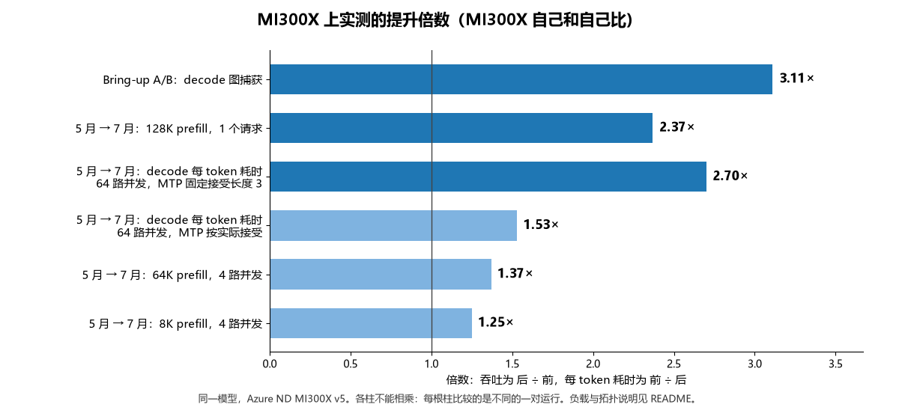
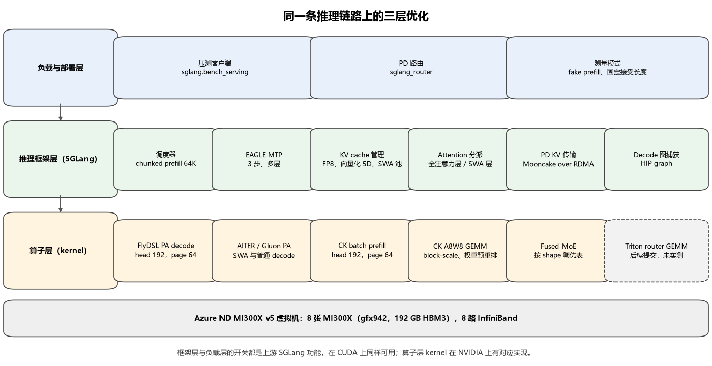
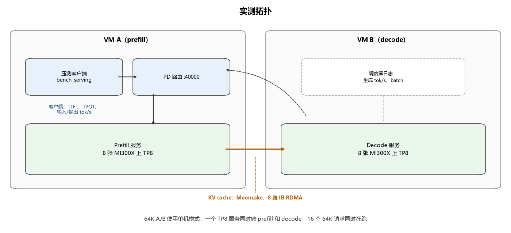

# 在 Azure GPU 虚拟机上优化大模型推理

[](#架构与测试环境)
[](upstream/SOURCES.lock.json)
[](#mi300x-实测结果)
[](https://github.com/david-xinyuwei/david-share/actions/workflows/llm-inference-optimization-ci.yml)

**同样的 GPU，一个支持 1M 上下文的 MoE 模型到底能提速多少？提速又落在哪一层？** 本仓库以 Azure ND MI300X v5 虚拟机上的 MiMo-V2.5-Pro 为例（384 个路由专家、滑动窗口与 GQA 混合注意力、3 层 MTP），把推理链路上用到的全部优化手段逐项讲清楚。这些手段分属三层：推理框架层、算子层、负载与部署层。每一项都给出打开它的开关、固定 commit 里真实的代码改动（有代码改动的话）、它对模型输出的影响；实测过的项目还给出它让 MI300X 相对 MI300X 自己快了多少。



<!-- BEGIN GENERATED: glance -->
- 从 bring-up 到优化后的栈：**128K prefill 提速 2.37×**（8 张 GPU）；**decode 每 token 耗时 45.86 → 17.00 ms（缩短 2.70×）**，64 路并发、MTP 固定接受长度 3（按实际接受的参考运行为 30.07 ms，缩短 1.53×）。
- bring-up 阶段一个开关带来 **3.11× decode 吞吐**：让 decode 服务重放 HIP graph。
- block-scale FP8 GEMM 与 unified verify 两个开关让 64K 上下文 decode **+25.65%**（同一会话 A/B）；按 shape 调优的 fused-MoE 表让 8K prefill **+24.32%**。
- 这些倍数不能相乘：每个倍数比较的是不同的一对运行。本页没有任何性能数字拿 MI300X 和其他加速器比较。
<!-- END GENERATED: glance -->

框架层和负载层可以原样搬到 NVIDIA GPU 上，算子层每一项都写明了 CUDA 上的对应实现。

作者：Xinyu Wei · [English](README.md) · [实测结果](#mi300x-实测结果) · [三层优化](#三层优化逐项拆解) · [复现](#客户如何复现) · [测试](#测试与离线校验)

## 从这里开始

| 想做什么 | 入口 |
|---|---|
| 看从 bring-up 到优化后总共快了多少 | [从 bring-up 到优化后](#从-bring-up-到优化后累计提升) |
| 看单项优化各自带来多少 | [单项优化各自带来多少](#单项优化各自带来多少) |
| 查某一项优化：开关、代码、证据、对输出的影响 | [三层优化逐项拆解](#三层优化逐项拆解) |
| 把这套方法用到 NVIDIA GPU 上 | [迁移到 NVIDIA GPU](#迁移到-nvidia-gpu)，以及 `cuda-hopper-pd` profile |
| 在 MI300X 上重建 runtime、重跑压测 | [客户如何复现](#客户如何复现) |
| 不用 GPU 核对已发布的数字 | [测试与离线校验](#测试与离线校验) |

## 本仓库做了什么、提供什么

- **推理引擎与 kernel**——归上游 SGLang、AMD AITER、Composable Kernel、FlyDSL 项目；MiMo 专用的提交是 AMD 工程师在公开 fork 中完成的。这里提供固定的 commit 身份，以及文中讨论的每个 commit 的完整 patch（[`upstream/`](upstream/)）。
- **优化方法与实测数据**——本仓库。MI300X 优化前后的实测对比，附原始压测输出的公开投影（[`evidence/`](evidence/)）；逐项技术解读和代码摘录；每个数字的适用边界。
- **启动配置**——本仓库。实测 MI300X 栈的机器可读 profile 和一份 NVIDIA 模板（[`profiles/`](profiles/)），可渲染成启动命令，并支持单项消融（[`tools/render_launch.py`](tools/render_launch.py)）。
- **Runtime 重建**——本仓库。从公开源码重建固定版本 runtime 的 Dockerfile（[`docker/`](docker/)）。
- **校验**——本仓库。离线测试和 CI，从已提交的证据重新算出每个发布的数字。

你需要自备：Azure ND MI300X v5 容量（PD 路线两台，单机路线一台）、MiMo-V2.5-Pro 权重，以及能访问 RDMA 的容器宿主机。

不提供：模型权重；证据投影背后的私有原始日志（只记录其 SHA-256）；与其他加速卡的比较；这套栈的端到端准确率结果；任何 NVIDIA 上的实测。每项优化会对准确率产生什么影响、怎么核对，见[哪些优化可能改变模型输出](#哪些优化可能改变模型输出)。

## MI300X 实测结果

所有数字都是 MI300X 和 MI300X 自己比。建议从上往下读：先看从第一版能跑的部署到优化后的总提升，再看单项优化各自带来多少，最后是每组对比的细节。优化后的测试打开了 FP8 KV cache，阶段对比那几次运行记录的环境显示 INT8 Quick Reduce 也是打开的。两者都有损，它们对准确率的影响本仓库没有测，见[哪些优化可能改变模型输出](#哪些优化可能改变模型输出)。

### 从 bring-up 到优化后：累计提升

**问题。** 所有优化都打开以后，同一个模型、同一批 MI300X 虚拟机，比第一版能跑起来的栈快多少？

**输入。** Bring-up（2026-05-08 至 05-10）：SGLang v0.5.11、Triton FP8 GEMM，不开投机解码，KV cache 用默认类型。Decode 和 128K prefill 测点用 Triton attention；早期 8K/64K prefill 测点已经在用 AITER attention。早期 128K prefill 测点跑在一台 VM 上，其余早期测点和优化后一样是两台 VM 的 1P1D。优化后（2026-07-13 至 07-20）：下文[阶段对比](#阶段对比按-shape-调优的-fused-moe-表)用的栈，即 AITER attention、CK FP8 GEMM、FP8 KV、EAGLE MTP、调优 fused-MoE 表，1P1D 走 8 路 InfiniBand。单开关那一行比较的是 bring-up 同一轮会话里的两次运行。

<!-- BEGIN GENERATED: cumulative -->
| MI300X 上实测 | 优化前 → 后 | 倍数 |
|---|---|---:|
| Decode 图捕获，单开关<br>16K/1K，16 路并发，bring-up | 107.4 → 334.0 tok/s | **3.11×** |
| 128K prefill，1 个请求，8 张 GPU<br>单机 → 1P1D 的 prefill 服务 | 6,915 → 16,390 tok/s | **2.37×** |
| Decode 每 token 耗时，64 路并发<br>MTP 固定接受长度 3，越低越好 | 45.86 → 17.00 ms | **2.70×** |
| Decode 每 token 耗时，64 路并发<br>MTP 按实际接受，越低越好 | 45.86 → 30.07 ms | **1.53×** |
| 64K prefill，4 路并发<br>bring-up 的 prompt 平均 60,610 token | 13,919 → 19,023 tok/s | **1.37×** |
| 8K prefill，4 路并发<br>bring-up 的 prompt 平均 7,792 token | 16,644 → 20,781 tok/s | **1.25×** |
<!-- END GENERATED: cumulative -->

Decode 的倍数在很大程度上取决于 MTP 草稿 token 的接受率。优化后的吞吐测试把接受长度固定为每步 3 个 token，这是偏乐观的条件；同一套栈的一个较早版本，在同样的随机 prompt 上按草稿模型实际达到的接受率跑过一次，可作参考点。两者逐点列出（每个数值下方是相对 bring-up 的倍数）：

<!-- BEGIN GENERATED: cumulative-decode -->
| 指标 | Bring-up<br>16K 输入 | 按实际<br>接受 | 固定接受<br>长度 3 |
|---|---:|---:|---:|
| TPOT ms<br>并发 32 | 29.41 | 23.20<br>1.27× | 13.65<br>2.15× |
| TPOT ms<br>并发 64 | 45.86 | 30.07<br>1.53× | 17.00<br>2.70× |
| tok/s<br>并发 32 | 658 | 1,238<br>1.88× | 1,936<br>2.94× |
| tok/s<br>并发 64 | 1,396 | 1,645<br>1.18× | 2,458<br>1.76× |
<!-- END GENERATED: cumulative-decode -->

**边界。** 这是跨两个月的前后对比，不是 A/B：kernel、库版本和启动参数是一起变的，所以倍数属于整套栈，不属于某一项改动。Bring-up 的 decode 输入是 16K token，优化后是 8K。上下文越短，每步 decode 越便宜，所以 decode 倍数里有一部分来自负载差异，而不是栈本身。按实际接受的那次运行用的是 2026-06-25 的 AITER，没有调优 fused-MoE 表，也没开 unified verify，而且随机 prompt 很难猜中，所以它说明不了真实流量上的接受率。Bring-up 的 8K 和 64K prompt 平均为 7,792 和 60,610 个 token，7 月是正好 8,192 和 65,536，所以这两个倍数是近似值。早期 128K 测点跑在一台 VM 上，prefill 和 decode 在同一个服务里；7 月的测点跑在 1P1D 的 prefill 服务上；两者都用 8 张 GPU 做 prefill。Bring-up 的 decode 和 128K 数值来自汇总报告；图捕获这一对以及早期 8K/64K prefill 测点是公开的客户端原始输出。Bring-up 的客户端在大约 340 个输出 token（请求的是 1,024）时就结束了请求，所以图捕获的倍数只能在这两次运行之间比较。来源和哈希见 [`evidence/runs.json`](evidence/runs.json) 和 [`evidence/raw-manifest.json`](evidence/raw-manifest.json)。

### 单项优化各自带来多少

每一行只在其余不变的栈上改一处。A/B 是同一轮测试里只改指定的开关；阶段对比是两个日期重复同一套已记录的启动和压测脚本，中间只更新了一个库。这些测试把 MTP 接受长度固定为 3 个草稿 token，所以应当看作相对提升，而不是生产吞吐。第一行是调度器的生成吞吐，后两行是客户端测得的输入和输出吞吐。

**输入。** 每一行都写明了负载、并发和拓扑；每组对比的完整输入见下面对应的小节。

<!-- BEGIN GENERATED: headline -->
| 改了什么 | 优化前 → 优化后（tok/s） | 变化 |
|---|---|---:|
| CK FP8 GEMM + unified verify<br>64K/1K decode，batch 16，单机<br>*两开关 A/B，各 2 次* | 743 → 934 | **+25.65%** |
| 调优 fused-MoE 表<br>8K prefill，并发 4，1P1D<br>*阶段对比，各 1 次* | 16,716 → 20,781 | **+24.32%** |
| 调优 fused-MoE 表<br>8K/1K decode，并发 128，1P1D<br>*阶段对比，各 1 次* | 2,209 → 2,487 | **+12.56%** |
<!-- END GENERATED: headline -->

**边界。** 每一行的收益只属于该行写明的改动，以及它当时所在的栈。各行是在不同的栈和负载上测的，不能相乘得出上面的累计倍数。

### 受控 A/B：64K 上下文下的 block-scale FP8 GEMM 路径

**问题。** 单台 MI300X 虚拟机上，最终版的 GEMM 与 verify 路径在长上下文下能带来多少稳态 decode 吞吐？

**输入。** 每个请求正好携带 65,536 个输入 token ID，生成 1,024 个 token；同时有 16 个请求在跑，调度器保持 batch 16。MTP 以固定接受 3 个草稿 token 的方式运行（`SGLANG_SIMULATE_ACC_LEN=3`、`SGLANG_SIMULATE_ACC_METHOD=match-expected`）。用 `--mem-fraction-static 0.95` 扩大 KV 池，保证 16 个 64K 上下文能同时放下。吞吐取的是 16 个请求全部在跑时调度器日志里的生成速率；每次运行的第一个满 batch 采样跨越 prefill 到 decode 的切换，按测试前定好的规则剔除。

**变量。** 两个环境变量，一起打开：优化组加上 `SGLANG_USE_AITER_CK_BLOCKSCALE_BPRESHUFFLE=1` 和 `SGLANG_AITER_UNIFIED_VERIFY=1`。主机、容器、镜像、模型、启动参数、压测命令和 KV 设置完全相同；每组各起两次全新服务，两组背靠背连续跑完。

<!-- BEGIN GENERATED: ab-table -->
| 组别 | 第 1、2 次 | 均值 |
|---|---:|---:|
| 基线 | 740.29、745.95 | 743.12 |
| 优化后 | 931.58、935.92 | 933.75 |
| 变化 |  | **+25.65%** |
<!-- END GENERATED: ab-table -->

每组两次运行之间差异都在 1% 以内，而两组差距远超这个波动。两组都是调度器的生成吞吐（tok/s）。用 batch 除以吞吐，就是 16 个请求里每一个等一个 token 的时间：

<!-- BEGIN GENERATED: ab-tpot -->
| 组别 | 折算 TPOT（ms） |
|---|---:|
| 基线 | 21.53 |
| 优化后 | 17.14 |
| 变化 | **-20.42%** |
<!-- END GENERATED: ab-tpot -->

折算 TPOT 按 `1000 × 16 / tok/s` 计算，不是客户端实测的延迟。

**边界。** 两个变量是一起打开的，收益属于这一对开关，不能拆给其中任何一个。测试是单机、prefill 和 decode 在同一个服务里完成，不能推到 PD 部署上。原始采样值在 [`evidence/raw/ab-20260718-64k-bs16.json`](evidence/raw/ab-20260718-64k-bs16.json)，可以追溯到其中登记的公开审计文件。

### 阶段对比：按 shape 调优的 fused-MoE 表

**问题。** 在双机 PD 部署里，MiMo 专用的 fused-MoE 调优表改变了什么？

**输入。** Prefill：随机 prompt，长度 8,192 或 65,536 token，输出 1 个 token，16 个 prompt，并发 4，1 个预热请求，清缓存，seed 12345。Decode：随机 prompt 8,192 token，输出 1,024 token，256 个 prompt，并发 16 到 128，32 个预热请求，清缓存，seed 12345。每次运行的完整客户端参数都保存在 [`evidence/raw/`](evidence/raw/)。

**变量。** AITER 从 `fc96a4f` 升级到加入了 [`d725746`](https://github.com/sammysun0711/aiter/commit/d725746a0f8c233d8e46e2771a7c8dbcd06e40d9) 调优表的版本（实际加载的 CSV 与该 commit 中的文件 SHA-256 相同）。两个日期的 prefill 启动脚本、router 脚本和两份压测脚本 SHA-256 完全一致，decode 服务记录下来的环境变量行也一致。decode 启动脚本的完整哈希只在第二个日期记录过，sglang commit 只在第一个日期记录过，所以把差异归到这张表上证据很强，但还没有同一轮内的 A/B 来证明。

Prefill，客户端测得（吞吐取整；精确值见 `evidence/measurements.json`）：

<!-- BEGIN GENERATED: stage-prefill -->
| 输入 token | tok/s 优化前 → 后 | 变化 |
|---:|---:|---:|
| 8,192 | 16,716 → 20,781 | **+24.32%**<br>TTFT -15.15% |
| 65,536 | 17,254 → 19,023 | **+10.25%**<br>TTFT -9.36% |
<!-- END GENERATED: stage-prefill -->

Decode，同一批运行：

<!-- BEGIN GENERATED: stage-decode -->
| 并发 | tok/s 优化前 → 后 | 变化 |
|---:|---:|---:|
| 16 | 1,299 → 1,332 | **+2.52%**<br>TPOT +1.79% |
| 32 | 1,911 → 1,936 | **+1.33%**<br>TPOT +1.11% |
| 64 | 2,188 → 2,458 | **+12.33%**<br>TPOT +12.58% |
| 128 | 2,209 → 2,487 | **+12.56%**<br>TPOT +14.05% |
<!-- END GENERATED: stage-decode -->

Prefill 吞吐上去的同时，首 token 时间也缩短了。Decode 在并发 64 和 128 时，输出吞吐提升了约八分之一，TPOT 也差不多涨了同样的幅度：服务每一步同时处理的请求更多，单个请求每个 token 多等一点，但整批完成得更快。

**边界。** 每个点在每个日期只跑了一次，不是交错进行的 A/B。两个日期都剔除了 256K prefill 点：在 `--context-length 262144` 下，262,144 token 的 prompt 加上 MiMo 的特殊 token 放不下，服务端可能返回错误内容，而客户端仍然记为成功。后来曾尝试用 `AITER_BYPASS_TUNE_CONFIG=1` 作为基线在同一轮里做 A/B，64K 时出现 GPU 内存访问错误，结果被判无效，所以这张表目前没有同一轮内的 A/B。

### Decode 在哪里饱和：并发阶梯

**问题。** 1P1D 的 decode 路径，客户端并发加到多少以后吞吐就不再增长？多出来的并发代价是什么？

**输入。** 与上面阶段对比第一个日期相同的负载（8K 输入 / 1K 输出）和相同的栈，每个点 256 个 prompt，客户端并发 16 到 256。

<!-- BEGIN GENERATED: ladder -->
| 并发<br>（实测） | Output<br>tok/s | TPOT<br>（ms） | TTFT（s）<br>均值 / P99 |
|---:|---:|---:|---:|
| 16 (15.8) | 1,322 | 10.79 | 1.2 / 7.1 |
| 32 (30.9) | 1,914 | 13.37 | 2.8 / 14.1 |
| 64 (59.5) | 2,199 | 15.49 | 11.9 / 27.6 |
| 96 (84.0) | 2,201 | 15.06 | 23.7 / 40.8 |
| 128 (104.6) | 2,204 | 14.83 | 33.4 / 54.4 |
| 192 (135.4) | 2,203 | 14.72 | 47.9 / 81.3 |
| 256 (151.8) | 2,208 | 14.60 | 55.5 / 107.3 |
<!-- END GENERATED: ladder -->

并发到 64 时吞吐进入平台期。再往上，TPOT 基本不变，平均和 P99 首 token 时间却一直增长：多出来的请求没有带来吞吐，只是更晚拿到第一个 token。实测并发（括号内，客户端按时间平均的在途请求数）也不再跟随配置值增长。这与服务端的最大运行请求数和 KV 容量开始起作用相符，但这些运行没有调度器 trace 可以证实。

**边界。** 每个点只跑一次，而且是在加入调优 MoE 表之前的栈上测的。饱和点会随上下文长度、KV 容量和 `--max-running-requests` 变化，换配置就要重新测。

### 本仓库没有测的部分

Decode 图捕获只在 bring-up 阶段测过，当时还没有 MTP 和 AITER kernel；它在优化后栈里的贡献没有单独拆分。FlyDSL paged-attention decode kernel、向量化 5D KV 布局、page 64 和 head 192 的 prefill tile 都在最终固定的 runtime 里，但微软已发布的测试没有单独测过它们，所以本页不给出它们的加速数字。它们的代码改动在[三层优化逐项拆解](#三层优化逐项拆解)里讲清楚了；要测它们，可以在单机 profile 上按同样的 A/B 方法去做。

## 架构与测试环境



请求从负载层进入（压测客户端，PD 模式下还有 router），由 SGLang 调度，最终由算子层的 kernel 执行。框架层决定每一层用哪个 kernel，kernel 决定这一层跑多快，负载层决定这次测量有没有代表性。虚线框是后续提交，不在任何实测配置里。



阶段对比和并发阶梯跑在两台 ND MI300X v5 上：VM A 上是 prefill 服务（TP8）、PD router 和压测客户端，VM B 上是 decode 服务（TP8），KV cache 通过 Mooncake 走 8 路 InfiniBand 从 prefill 传到 decode。客户端指标（TTFT、TPOT、输入和输出 tok/s）由 VM A 上的 `sglang.bench_serving` 采集。64K A/B 则在单机上完成：一个 TP8 服务同时做 prefill 和 decode，吞吐取自调度器日志。

## 三层优化逐项拆解

先看总览：每项技术一行，写明它在 MI300X 上的效果，以及会不会改变模型输出。点名字跳到这一项的卡片：开关、NVIDIA 上的对应做法、代码、证据、对输出的影响，后面是解释，有 diff 的附上真实 diff。

<!-- BEGIN GENERATED: technique-overview -->
**推理框架层**

| 优化手段 | 在 MI300X 上的效果 | 对输出 |
|---|---|---|
| [混合 SWA + GQA 的逐层 attention 分派](#混合-swa--gqa-的逐层-attention-分派) | 部分已打开，未单独拆分 | 算术不变 |
| [FP8 KV cache + 向量化 5D 分页布局](#fp8-kv-cache--向量化-5d-分页布局) | 部分已打开，未单独拆分 | 有损 |
| [MTP target verify 使用 AITER unified attention](#mtp-target-verify-使用-aiter-unified-attention) | decode +25.65%，与 CK GEMM 合计（A/B） | 算术不变 |
| [多层 EAGLE MTP 投机解码及校验修复](#多层-eagle-mtp-投机解码及校验修复) | 已打开，未单独拆分 | 实现正确则不变 |
| [Chunked prefill、page size 与 SWA 池容量](#chunked-prefillpage-size-与-swa-池容量) | 在最终 runtime 中，未实测 | 算术不变 |
| [Decode 图捕获（HIP graph）](#decode-图捕获hip-graph) | decode 3.11×（A/B） | 算术不变 |

**算子层**

| 优化手段 | 在 MI300X 上的效果 | 对输出 |
|---|---|---|
| [FlyDSL paged-attention decode kernel（head 192，page 64）](#flydsl-paged-attention-decode-kernelhead-192page-64) | 在最终 runtime 中，未实测 | 算术不变 |
| [权重预重排的 block-scale FP8 GEMM](#权重预重排的-block-scale-fp8-gemm) | decode +25.65%，与 unified verify 合计（A/B） | 算术不变 |
| [张量并行 all-reduce 使用 INT8 Quick Reduce](#张量并行-all-reduce-使用-int8-quick-reduce) | 已打开，未单独拆分 | 有损 |
| [按 shape 调优的 fused-MoE kernel 表](#按-shape-调优的-fused-moe-kernel-表) | 8K prefill +24.32%，decode +12.56%（阶段对比） | 算术不变 |
| [head 192、page 64 的 FP8 batch-prefill tile](#head-192page-64-的-fp8-batch-prefill-tile) | 在最终 runtime 中，未实测 | 算术不变 |
| [混合精度 Triton router（MoE gate）GEMM](#混合精度-triton-routermoe-gategemm) | 后续提交，未实测 | 有损 |

**负载与部署层**

| 优化手段 | 在 MI300X 上的效果 | 对输出 |
|---|---|---|
| [Prefill/Decode 分离（1P1D），KV 走 RDMA](#prefilldecode-分离1p1dkv-走-rdma) | 已打开，未单独拆分 | 算术不变 |
| [Fake prefill：只测 decode](#fake-prefill只测-decode) | 已发布的测试中未使用 | 仅测试方法 |
| [性能测试固定 MTP 接受长度](#性能测试固定-mtp-接受长度) | 已打开，未单独拆分 | 仅测试方法 |
| [按饱和点设计并发阶梯](#按饱和点设计并发阶梯) | 找到饱和点（并发阶梯） | 仅测试方法 |
<!-- END GENERATED: technique-overview -->

「已打开，未单独拆分」指这个开关在已发布的测试中是打开的，但没有单独测出它的贡献；「部分已打开」指只有其中一部分是打开的，例如 AITER backend 打开了，FlyDSL 分派没有；「在最终 runtime 中，未实测」指它属于固定的最终 runtime，而本仓库没有发布这个 runtime 的吞吐。

### 推理框架层

#### 混合 SWA + GQA 的逐层 attention 分派

<!-- BEGIN GENERATED: card-attention-dispatch -->
- **MI300X 上的开关**：`--attention-backend aiter`；全注意力层的 verify 走 FlyDSL，SWA/sink 层和普通 decode 留在 AITER
- **NVIDIA 上**：`--attention-backend fa3` 或 `flashinfer`；凡是一个 kernel 覆盖不了两种窗口类型的地方，都按层拆开
- **代码**：[ba15db1](https://github.com/sammysun0711/sglang/commit/ba15db1a576dcdc8d51ba15bd069b9fd1f748d97), [0cfc48b](https://github.com/sammysun0711/sglang/commit/0cfc48b0e374d7e84c122f739182a39feea56d46)
- **证据**：实测时已开 AITER 后端；FlyDSL 分派只在固定 runtime 中
- **对输出的影响**：算术不变。全注意力层和滑动窗口层用不同 kernel，每个都计算精确 attention。
<!-- END GENERATED: card-attention-dispatch -->

MiMo-V2.5-Pro 同时有全注意力层和带 attention sink 的滑动窗口层，没有哪一个 paged-attention kernel 在两种层上都最快，所以由后端按层分派。在 MTP target verify 阶段，全注意力层交给 FlyDSL kernel，SWA 层和 sink 层留在 AITER 路径上：

<!-- BEGIN GENERATED: excerpt-flydsl-layer-split -->
摘自 [`sammysun0711/sglang@ba15db1`](https://github.com/sammysun0711/sglang/commit/ba15db1a576dcdc8d51ba15bd069b9fd1f748d97) 的 diff，文件 `python/sglang/srt/layers/attention/aiter_backend.py`（本地副本：[sammysun0711__sglang__ba15db1.patch](upstream/patches/sammysun0711__sglang__ba15db1.patch)）。

```diff
+                    is_swa_layer = (
+                        layer.sliding_window_size is not None
+                        and layer.sliding_window_size > -1
+                    )
+                    use_flydsl = (
+                        getattr(self, "_use_flydsl_pa_decode", False)
+                        and not is_swa_layer
+                        and sinks is None
+                    )
+                    target_verify_fn = (
+                        forward_target_verify_flydsl_5d
+                        if use_flydsl
+                        else forward_target_verify_vectorized_5d
+                    )
```
<!-- END GENERATED: excerpt-flydsl-layer-split -->

同样的思路也省掉了 prefill 端的一次拷贝：commit [`0cfc48b`](https://github.com/sammysun0711/sglang/commit/0cfc48b0e374d7e84c122f739182a39feea56d46) 把带缓存前缀的 prefill 直接交给 page-64 kernel，不再先把分页 KV 拼成一块连续缓冲区。

#### FP8 KV cache + 向量化 5D 分页布局

<!-- BEGIN GENERATED: card-fp8-kv-5d -->
- **MI300X 上的开关**：`--kv-cache-dtype fp8_e4m3` + `SGLANG_AITER_KV_CACHE_LAYOUT=vectorized_5d`
- **NVIDIA 上**：`--kv-cache-dtype fp8_e4m3`；FA3/FlashInfer 的分页布局本来就保留 16 字节内层向量
- **代码**：[78cd40c](https://github.com/sammysun0711/sglang/commit/78cd40c7a5102524536daf9a3178426777174d2d), [e11c515](https://github.com/sammysun0711/sglang/commit/e11c5155f0845079211c2a4d0b8a4ab3669039f9), [10a9401](https://github.com/sammysun0711/aiter/commit/10a94012efc1260dfdf16ba2f52fbda40a518a17)
- **证据**：实测时已开 FP8 KV；5D 布局只在固定 runtime 中
- **对输出的影响**：有损。K、V 以 FP8 E4M3（3 位尾数）存储，每个张量一个缩放系数，每个缓存 token 都会损失精度；5D 布局本身只是重排字节。
<!-- END GENERATED: card-fp8-kv-5d -->

到了 1M 上下文，决定能同时放多少请求的是 KV cache，而不是权重。FP8 E4M3 存储让每个 token 的字节数减半。向量化 5D 布局再把每一页重新排列，让最内层维度正好是一个 16 字节的向量，这样一个 wavefront 里每个 lane 用一条宽加载指令就能取到自己那一段：

<!-- BEGIN GENERATED: excerpt-kv-5d-vector-width -->
摘自 [`sammysun0711/sglang@78cd40c`](https://github.com/sammysun0711/sglang/commit/78cd40c7a5102524536daf9a3178426777174d2d) 的 diff，文件 `python/sglang/srt/mem_cache/memory_pool.py`（本地副本：[sammysun0711__sglang__78cd40c.patch](upstream/patches/sammysun0711__sglang__78cd40c.patch)）。

```diff
+        if layout == "vectorized_5d":
+            # X is the inner vectorization width in the SHUFFLE layout,
+            # determined by the STORAGE dtype (not the compute dtype) since
+            # it controls how many elements fit in 16 bytes of the on-pool
+            # tensor. For fp8 storage X=16, for bf16/fp16 X=8.
+            self._kv_vector_x = 16 // self.store_dtype.itemsize
```
<!-- END GENERATED: excerpt-kv-5d-vector-width -->

同一个 commit 还让 MTP 草稿模型继续使用普通的按 token 排列（NHD）的 KV 池，而目标模型使用 5D 池，因为草稿用的 kernel 读不了 5D 布局。在 NVIDIA 上，`--kv-cache-dtype fp8_e4m3` 这个开关完全一样；FA3 和 FlashInfer 的分页布局本来就保留 16 字节内层向量以便 128 位加载，所以能搬过去的是原理，而不是开关。

#### MTP target verify 使用 AITER unified attention

<!-- BEGIN GENERATED: card-unified-verify -->
- **MI300X 上的开关**：decode 服务上设 `SGLANG_AITER_UNIFIED_VERIFY=1`
- **NVIDIA 上**：不需要；CUDA 的 attention 后端用自己的 kernel 做 verify
- **代码**：无代码改动（仅配置）
- **证据**：实测 A/B，与 CK GEMM 路径一起打开
- **对输出的影响**：算术不变。只决定用哪个 attention kernel 校验草稿 token，计算的仍是精确 attention。
<!-- END GENERATED: card-unified-verify -->

MTP 做 target verify 时，decode 服务要一次校验每个请求的 4 个位置。`SGLANG_AITER_UNIFIED_VERIFY=1` 把这一步交给 AITER 的 unified attention kernel，而不是通用路径。它只是配置；在 64K A/B 里它和 CK GEMM 路径一起打开，所以收益属于这两个开关的组合。

#### 多层 EAGLE MTP 投机解码及校验修复

<!-- BEGIN GENERATED: card-eagle-mtp -->
- **MI300X 上的开关**：`--speculative-algorithm EAGLE --speculative-num-steps 3 --speculative-eagle-topk 1 --speculative-num-draft-tokens 4 --enable-multi-layer-eagle`
- **NVIDIA 上**：同一组开关
- **代码**：[db840d9](https://github.com/sammysun0711/sglang/commit/db840d935a9f7097dbeb5f1b0dba4d261057a2bd), [f26ae30](https://github.com/sammysun0711/sglang/commit/f26ae30063143411f3ae552af1830fa46e3ee0fd), [878fff1](https://github.com/sammysun0711/sglang/commit/878fff15647fe3dabb32aa3a335b0ad16e3ee878)
- **证据**：实测时以固定接受长度打开；f26ae30、878fff1 只在固定 runtime 中
- **对输出的影响**：实现正确则不变。投机解码只有在校验正确时才保持目标模型的输出分布。在 HIP 上，878fff1 之前采样校验会悄悄退回贪心，temperature 实际不起作用。
<!-- END GENERATED: card-eagle-mtp -->

MiMo 自带 3 层 MTP，每个 decode 步起草 3 个 token、一次校验 4 个。投机解码只有在草稿和目标模型经常一致时才划算，而在 ROCm 上有三个问题让一致率偏低甚至结果出错：draft-extend 读的是全注意力池而不是 SWA 池，用的 kernel 也和 target verify 不同（[`db840d9`](https://github.com/sammysun0711/sglang/commit/db840d935a9f7097dbeb5f1b0dba4d261057a2bd)）；各 TP rank 的校验结果可能不一致，导致集合通信错位（[`f26ae30`](https://github.com/sammysun0711/sglang/commit/f26ae30063143411f3ae552af1830fa46e3ee0fd)）；在 HIP 上，采样（非贪心）校验会悄悄退回贪心校验，`temperature` 实际不起作用（[`878fff1`](https://github.com/sammysun0711/sglang/commit/878fff15647fe3dabb32aa3a335b0ad16e3ee878)，需通过 `SGLANG_MIMO_EAGLE_HIP_NONGREEDY_VERIFY=1` 显式打开）。这些开关在 CUDA 上相同。

#### Chunked prefill、page size 与 SWA 池容量

<!-- BEGIN GENERATED: card-memory-sizing -->
- **MI300X 上的开关**：`--chunked-prefill-size 65536 --page-size 64 --swa-full-tokens-ratio 0.01`
- **NVIDIA 上**：同一组开关；具体数值按 HBM 容量和 kernel 支持的 page size 重新推算
- **代码**：无代码改动（仅配置）
- **证据**：实测时为 chunk 32768、page 32
- **对输出的影响**：算术不变。chunk 和 page 大小改变的是切分方式，不是计算内容；SWA 比例只决定池子大小。
<!-- END GENERATED: card-memory-sizing -->

这几项是配置而不是代码，但它们决定上面那些 kernel 能不能跑起来。最终 runtime 用 `--chunked-prefill-size 65536`、`--page-size 64`（FlyDSL 和 CK kernel 就是按这个 page size 写的）和 `--swa-full-tokens-ratio 0.01`。最后这一项把滑动窗口池压到全注意力池的 1%，因为 SWA 层永远只需要最后一个窗口的 token，省下来的 HBM 给了全注意力 KV 池，也就换来了更长的上下文。

#### Decode 图捕获（HIP graph）

<!-- BEGIN GENERATED: card-decode-graph-capture -->
- **MI300X 上的开关**：decode 服务上默认打开：不要给 decode 服务传 `--disable-cuda-graph`（prefill 服务保留该参数）
- **NVIDIA 上**：默认行为相同，使用 CUDA graph；`--cuda-graph-max-bs` 限定捕获的 batch 上限
- **代码**：无代码改动（仅配置）
- **证据**：bring-up 阶段实测 A/B（Triton attention，无 MTP）
- **对输出的影响**：算术不变。捕获的图重放的是同一批 kernel；省掉的是 launch 开销，算术不变。
<!-- END GENERATED: card-decode-graph-capture -->

一个 decode step 要跑几百个小 kernel，batch 小的时候，launch 它们的时间和它们实际运行的时间差不多。SGLang 对每个 decode batch size 先捕获一次 HIP graph（NVIDIA 上是 CUDA graph），之后整步只需一次 launch 重放。MI300X bring-up 早期为了绕开多机挂起问题用 `--disable-cuda-graph` 关掉了它；在 decode 服务上重新打开，是本页实测到的最大的一步。prefill 服务仍保留 `--disable-cuda-graph`，因为 prefill 的 batch 大且不规则。每个被捕获的 batch size 都要占 HBM，会和 KV 池争显存。

### 算子层

#### FlyDSL paged-attention decode kernel（head 192，page 64）

<!-- BEGIN GENERATED: card-flydsl-pa-decode -->
- **MI300X 上的开关**：`SGLANG_AITER_PA_DECODE_IMPL=flydsl` + `SGLANG_FLYDSL_PA_NUM_PARTITIONS=16`
- **NVIDIA 上**：CuTe DSL 或 FlashInfer 的 decode kernel；partition 数对应 split-KV
- **代码**：[c99d5cd](https://github.com/sammysun0711/FlyDSL/commit/c99d5cd97864c11e459cff9169d387d312790782), [ba15db1](https://github.com/sammysun0711/sglang/commit/ba15db1a576dcdc8d51ba15bd069b9fd1f748d97), [a2fd773](https://github.com/sammysun0711/sglang/commit/a2fd773ab43f960f5f2c29b5c592b0ca43c5ba8f)
- **证据**：在固定 runtime 中；kernel 未单独测试
- **对输出的影响**：算术不变。精确 paged attention。已修复的两个缺陷（query 元素未搬入、32 位偏移溢出）产生的是错误输出，而不是小幅漂移，所以这个 kernel 会拒绝没测过的 shape。
<!-- END GENERATED: card-flydsl-pa-decode -->

FlyDSL 是构建在 MLIR 上的 Python DSL，写 kernel 时描述的是布局（一个张量如何切分到 lane、wave 和 tile 上），而不是手写下标运算，地址由编译器生成。MiMo 的 decode kernel 在 MiMo 的 shape 上有两个缺陷，都在 [`c99d5cd`](https://github.com/sammysun0711/FlyDSL/commit/c99d5cd97864c11e459cff9169d387d312790782) 中修复，之后合入上游 ROCm/FlyDSL [#1064](https://github.com/ROCm/FlyDSL/commit/ed9885eca4ffc45e2ec1dc45fa00824baa6b56d3)。

head size 为 192 时，16 个 lane 各自要搬 12 个 query 元素。旧规则把它舍成一次 8 元素加载，于是每行 query 有三分之一没有进 LDS，输出出现 NaN。修复后改为三次 4 元素（64 位）加载：

<!-- BEGIN GENERATED: excerpt-flydsl-query-load -->
摘自 [`sammysun0711/FlyDSL@c99d5cd`](https://github.com/sammysun0711/FlyDSL/commit/c99d5cd97864c11e459cff9169d387d312790782) 的 diff，文件 `kernels/attention/pa_decode_tile.py`（本地副本：[sammysun0711__FlyDSL__c99d5cd.patch](upstream/patches/sammysun0711__FlyDSL__c99d5cd.patch)）。

```diff
         # Per-lane Q chunk (QCHUNK 16-bit elems) fetched in QLOAD_UNIT-wide
-        # pieces (128b max per buffer load): head_dim=256 needs 2 pieces.
-        QLOAD_UNIT = QCHUNK if QCHUNK < 8 else 8
+        # pieces (128b max per buffer load).  Use 64-bit loads when QCHUNK is
+        # not divisible by 8: head_dim=192 gives QCHUNK=12 and therefore needs
+        # three 4-element loads.  Rounding it down to one 8-element load leaves
+        # one third of every query row unstaged in LDS.
+        QLOAD_UNIT = 8 if QCHUNK % 8 == 0 else 4
         N_QLOADS = QCHUNK // QLOAD_UNIT
         _q_copy_op = fx.rocdl.BufferCopy128b() if QLOAD_UNIT == 8 else fx.rocdl.BufferCopy64b()
         _q_load_chunk = _make_flat_loader(query_ptr, Q_DTYPE, QLOAD_UNIT, _q_copy_op)
```
<!-- END GENERATED: excerpt-flydsl-query-load -->

物理页号用 32 位放得下，但一旦单个 KV cache 超过 2 GiB（1M 上下文时就会超过），由页号算出的字节偏移就会溢出。修复是在任何偏移运算之前先把页号提升到 64 位：

<!-- BEGIN GENERATED: excerpt-flydsl-int64-offset -->
摘自 [`sammysun0711/FlyDSL@c99d5cd`](https://github.com/sammysun0711/FlyDSL/commit/c99d5cd97864c11e459cff9169d387d312790782) 的 diff，文件 `kernels/attention/pa_decode_tile.py`（本地副本：[sammysun0711__FlyDSL__c99d5cd.patch](upstream/patches/sammysun0711__FlyDSL__c99d5cd.patch)）。

```diff
         def _k_ops(phys, a):
+            # Physical page ids fit in i32, but their byte/element offsets do
+            # not once an individual KV cache grows beyond 2 GiB.
+            phys = fx.Int64(phys)
             within_page_tok = (a * c16 + lane16) % block_size
```
<!-- END GENERATED: excerpt-flydsl-int64-offset -->

在 SGLang 一侧（[`ba15db1`](https://github.com/sammysun0711/sglang/commit/ba15db1a576dcdc8d51ba15bd069b9fd1f748d97)），这个 kernel 需要显式打开；遇到没有验证过的 shape 会直接拒绝启动，而不是悄悄算出错误的 attention：

<!-- BEGIN GENERATED: excerpt-flydsl-dispatch-gate -->
摘自 [`sammysun0711/sglang@ba15db1`](https://github.com/sammysun0711/sglang/commit/ba15db1a576dcdc8d51ba15bd069b9fd1f748d97) 的 diff，文件 `python/sglang/srt/layers/attention/aiter_backend.py`（本地副本：[sammysun0711__sglang__ba15db1.patch](upstream/patches/sammysun0711__sglang__ba15db1.patch)）。

```diff
+        incompatibilities = []
+        if self.use_mla:
+            incompatibilities.append("MLA is unsupported")
+        if self.topk != 1:
+            incompatibilities.append(f"top-k must be 1, got {self.topk}")
+        if self.page_size != 64:
+            incompatibilities.append(f"page size must be 64, got {self.page_size}")
+        if self.max_context_len > 1_048_576:
+            incompatibilities.append(
+                "maximum context must not exceed 1,048,576 tokens, got "
+                f"{self.max_context_len}"
+            )
+        if (self.num_head, self.num_kv_head, self.head_dim) != (16, 1, 192):
+            incompatibilities.append(
+                "TP-local shape must be 16Q/1KV/head-192, got "
+                f"{self.num_head}Q/{self.num_kv_head}KV/head-{self.head_dim}"
+            )
+        if self.input_dtype != torch.bfloat16:
+            incompatibilities.append(
+                f"model dtype must be BF16, got {self.input_dtype}"
+            )
+        if self.kv_cache_dtype != fp8_dtype:
+            incompatibilities.append(
+                f"KV cache dtype must be FP8 E4M3, got {self.kv_cache_dtype}"
+            )
+        if not is_gfx942_supported():
+            incompatibilities.append("phase 1 is validated only on gfx942")
+        if incompatibilities:
+            raise RuntimeError(
+                "SGLANG_AITER_PA_DECODE_IMPL=flydsl is incompatible with this "
+                "target backend: " + "; ".join(incompatibilities)
+            )
```
<!-- END GENERATED: excerpt-flydsl-dispatch-gate -->

[`a2fd773`](https://github.com/sammysun0711/sglang/commit/a2fd773ab43f960f5f2c29b5c592b0ca43c5ba8f) 让上下文 partition 数可配（8、16、24 或 32）。最终 runtime 用 16，让长上下文拆到足够多的 workgroup 上，把 304 个计算单元占满。上游 [#1065](https://github.com/ROCm/FlyDSL/commit/e46db6020b4560de82a7136d78cc33a5186338f4) 后来又支持了 BF16 KV 以及 K、V 不同的 head size，MiMo 128 维的 value head 不必再补齐到 192。这类先写布局的 kernel，在 NVIDIA 上对应的是 CuTe DSL；partition 数对应 split-KV。

#### 权重预重排的 block-scale FP8 GEMM

<!-- BEGIN GENERATED: card-ck-a8w8-gemm -->
- **MI300X 上的开关**：`SGLANG_USE_AITER_CK_BLOCKSCALE_BPRESHUFFLE=1`
- **NVIDIA 上**：DeepGEMM（`SGLANG_ENABLE_JIT_DEEPGEMM=1`）或 CUTLASS 的 block-scale GEMM
- **代码**：[2f9b9ae](https://github.com/sammysun0711/sglang/commit/2f9b9aedf32977bc5d088a86ec0a73bcf432a4d0), [fc96a4f](https://github.com/sammysun0711/aiter/commit/fc96a4f9f5f3e931cbb9de275c8aa01136417500)
- **证据**：实测 A/B，与 unified verify 一起打开
- **对输出的影响**：算术不变。Triton 路径和 CK 路径都按 1x128 块把激活量化成 FP8，权重都是同一份 FP8 block-scale checkpoint；这个开关换的是 kernel，不是精度。
<!-- END GENERATED: card-ck-a8w8-gemm -->

MiMo 的线性层是 FP8，每 128 宽的块一个缩放系数。在 gfx942 上，SGLang 原本用 Triton kernel 做这个 GEMM。Commit [`2f9b9ae`](https://github.com/sammysun0711/sglang/commit/2f9b9aedf32977bc5d088a86ec0a73bcf432a4d0) 加了一个开关，改用 AITER 里的 Composable Kernel 实现，并在加载时把权重一次性重排成矩阵核心读取的布局：

<!-- BEGIN GENERATED: excerpt-ck-gemm-select -->
摘自 [`sammysun0711/sglang@2f9b9ae`](https://github.com/sammysun0711/sglang/commit/2f9b9aedf32977bc5d088a86ec0a73bcf432a4d0) 的 diff，文件 `python/sglang/srt/layers/quantization/fp8_utils.py`（本地副本：[sammysun0711__sglang__2f9b9ae.patch](upstream/patches/sammysun0711__sglang__2f9b9ae.patch)）。

```diff
     elif _use_aiter_gfx95:
         use_triton = use_aiter_triton_gemm_w8a8_tuned_gfx950(n, k)
+    elif _use_aiter_ck_blockscale_bpreshuffle_gfx942:
+        use_triton = False
+    elif _use_aiter_ck_blockscale_gfx942:
+        use_triton = False
     else:
         use_triton = True
 
+    # The weight-preshuffled CK kernel consumes a transposed activation scale.
+    use_bpreshuffle = not use_triton and (
+        _use_aiter_bpreshuffle_gfx95 or _use_aiter_ck_blockscale_bpreshuffle_gfx942
+    )
+
```
<!-- END GENERATED: excerpt-ck-gemm-select -->

AITER [`fc96a4f`](https://github.com/sammysun0711/aiter/commit/fc96a4f9f5f3e931cbb9de275c8aa01136417500) 为 304 CU 的 MI300X 补充了 MiMo 各 GEMM 尺寸的 tile 配置。上面实测的 A/B 同时打开了两个开关，这条路径是其一，另一个是 unified verify，所以收益不能全部算在 GEMM 头上。在 NVIDIA 上承担同样角色的是 DeepGEMM（`SGLANG_ENABLE_JIT_DEEPGEMM=1`）或 CUTLASS 的 block-scale FP8 GEMM，它们的权重预打包就相当于这里的预重排。

#### 张量并行 all-reduce 使用 INT8 Quick Reduce

<!-- BEGIN GENERATED: card-int8-quick-reduce -->
- **MI300X 上的开关**：`ROCM_QUICK_REDUCE_QUANTIZATION=INT8`（基础镜像默认设置；设为 `NONE` 即关闭）
- **NVIDIA 上**：默认没有对应功能；NCCL 和 SGLang 自定义 all-reduce 都按全精度求和
- **代码**：无代码改动（仅配置）
- **证据**：实测吞吐时已打开，继承自基础镜像；未单独拆分
- **对输出的影响**：有损。走 Quick Reduce 的张量并行 all-reduce，会先把各卡的部分和量化成 INT8，再在 8 张卡之间相加。
<!-- END GENERATED: card-int8-quick-reduce -->

张量并行在每个 attention 和 MoE 块之后都要把 8 张 GPU 的部分结果加起来。Quick Reduce 是 SGLang 自定义 all-reduce 路径里给 ROCm 用的 all-reduce；设置 `ROCM_QUICK_REDUCE_QUANTIZATION=INT8` 后，它把要发送的数据量化成 INT8，GPU 之间传的字节更少。阶段对比那几次运行记录的环境显示它是打开的；设置它的是基础镜像，不是启动脚本；见[哪些优化可能改变模型输出](#哪些优化可能改变模型输出)里的提醒。

#### 按 shape 调优的 fused-MoE kernel 表

<!-- BEGIN GENERATED: card-tuned-fused-moe -->
- **MI300X 上的开关**：AITER 里的 `mimo_v2_5_pro_b16_tuned_fmoe.csv`
- **NVIDIA 上**：用 `tuning_fused_moe_triton.py` 生成的 Triton fused-MoE JSON
- **代码**：[d725746](https://github.com/sammysun0711/aiter/commit/d725746a0f8c233d8e46e2771a7c8dbcd06e40d9)
- **证据**：实测阶段对比
- **对输出的影响**：算术不变。按 token 数在已有 fused-MoE kernel 中选择，模型计算不变。
<!-- END GENERATED: card-tuned-fused-moe -->

MoE 层的开销取决于一个 batch 里落了多少 token。AITER 可以按 token 数选用不同的 fused-MoE kernel，[`d725746`](https://github.com/sammysun0711/aiter/commit/d725746a0f8c233d8e46e2771a7c8dbcd06e40d9) 记录的是针对 MiMo 专家 shape（hidden size 6,144，单个 TP rank 看到的专家中间维度 256，384 个专家，top-8）离线搜索出的最优结果：

<!-- BEGIN GENERATED: moe-table -->
| Token 数 | Kernel | 耗时（µs） | TFLOPS |
|---:|---|---:|---:|
| 2,048 | A | 703.2 | 219.9 |
| 4,096 | B | 1,069.8 | 289.1 |
| 8,192 | B | 1,412.0 | 438.0 |
| 16,384 | B | 2,680.7 | 461.4 |
| 32,768 | B | 4,816.4 | 513.6 |

每一行的 block_m 都是 64；耗时和 TFLOPS 是调优器自己在每个 token 数下测到的值。Kernel 字母含义：

- A = `fmoe_bf16_blockscaleFp8_g1u1_vs_silu_64x256`
- B = `fmoe_bf16_blockscaleFp8_g1u1_vs_ps_silu_64x256`
<!-- END GENERATED: moe-table -->

从 4,096 个 token 起，搜索都选中了 kernel B（带 `_ps_` 的变体），而且 batch 越大实际 TFLOPS 越高。这张表只改变跑哪个 kernel，不改变模型计算。NVIDIA 上的对应做法是 SGLang 的 Triton fused-MoE 配置，用 `benchmark/kernels/fused_moe_triton/tuning_fused_moe_triton.py` 按专家数、尺寸、数据类型和 GPU 分别生成。

#### head 192、page 64 的 FP8 batch-prefill tile

<!-- BEGIN GENERATED: card-ck-prefill-tile -->
- **MI300X 上的开关**：AITER `3f4ab48` 自带的 CK patch，只对这个精确 shape 分派
- **NVIDIA 上**：确认分页 prefill 路径没有退回到「先 gather 再算稠密 attention」
- **代码**：[3f4ab48](https://github.com/sammysun0711/aiter/commit/3f4ab482a2986919c784e469e23cfac7f93bb153), [0cfc48b](https://github.com/sammysun0711/sglang/commit/0cfc48b0e374d7e84c122f739182a39feea56d46)
- **证据**：在固定 runtime 中，本仓库未测吞吐
- **对输出的影响**：算术不变。去掉补齐到 head 256 的路径，改用精确的 head-192 tile。
<!-- END GENERATED: card-ck-prefill-tile -->

[`3f4ab48`](https://github.com/sammysun0711/aiter/commit/3f4ab482a2986919c784e469e23cfac7f93bb153) 带了一个临时的 Composable Kernel patch，专门为 MiMo 的 shape（head 192、FP8 或 BF16、page 64、向量化布局）增加一个 batch-prefill tile，同时保留补齐到 head 256 的旧路径作为兜底。配合框架层的缓存前缀直通，长的缓存前缀可以直接在分页缓存里原地读取。

#### 混合精度 Triton router（MoE gate）GEMM

<!-- BEGIN GENERATED: card-mixed-router-gemm -->
- **MI300X 上的开关**：`SGLANG_MIMO_MIXED_ROUTER=1`，用于 token 数不少于 2,048 的 router batch
- **NVIDIA 上**：同一个 Triton kernel 在 CUDA 上也能编译；重新调 block 大小即可
- **代码**：[1f9bb2b](https://github.com/sammysun0711/sglang/commit/1f9bb2b4c55cdc7bd5de1ac7977f76afab101a97)
- **证据**：后续提交，未实测
- **对输出的影响**：有损。router 权重从 FP32 降到 FP16，激活从 BF16 转成 FP16 后再累加。router logits 决定选哪 8 个专家，微小变化就可能换掉 token 用的专家。
<!-- END GENERATED: card-mixed-router-gemm -->

MoE router 要把每个 token 的 hidden state 乘上一个 384 × 6,144 的 FP32 权重。[`1f9bb2b`](https://github.com/sammysun0711/sglang/commit/1f9bb2b4c55cdc7bd5de1ac7977f76afab101a97) 为 token 数不少于 2,048 的 batch 加了一个可选的 Triton kernel：缓存一份 FP16 的 router 权重，在寄存器里把 BF16 激活转成 FP16，累加和输出仍然是 FP32：

<!-- BEGIN GENERATED: excerpt-router-gate -->
摘自 [`sammysun0711/sglang@1f9bb2b`](https://github.com/sammysun0711/sglang/commit/1f9bb2b4c55cdc7bd5de1ac7977f76afab101a97) 的 diff，文件 `python/sglang/srt/models/mimo_v2.py`（本地副本：[sammysun0711__sglang__1f9bb2b.patch](upstream/patches/sammysun0711__sglang__1f9bb2b.patch)）。

```diff
     def forward(self, hidden_states):
+        if (
+            get_bool_env_var("SGLANG_MIMO_MIXED_ROUTER")
+            and hidden_states.is_cuda
+            and hidden_states.dtype == torch.bfloat16
+            and hidden_states.shape[0] >= 2048
+        ):
+            from sglang.srt.layers.moe.mixed_router_gemm import mixed_router_gemm
+
+            if self._mixed_router_weight is None:
+                self._mixed_router_weight = self.weight.detach().to(torch.float16)
+            return mixed_router_gemm(hidden_states, self._mixed_router_weight)
```
<!-- END GENERATED: excerpt-router-gate -->

<!-- BEGIN GENERATED: excerpt-router-kernel-dot -->
摘自 [`sammysun0711/sglang@1f9bb2b`](https://github.com/sammysun0711/sglang/commit/1f9bb2b4c55cdc7bd5de1ac7977f76afab101a97) 的 diff，文件 `python/sglang/srt/layers/moe/mixed_router_gemm.py`（本地副本：[sammysun0711__sglang__1f9bb2b.patch](upstream/patches/sammysun0711__sglang__1f9bb2b.patch)）。

```diff
+    accumulator = tl.zeros((BLOCK_M, BLOCK_N), dtype=tl.float32)
+    for k_start in range(0, K, BLOCK_K):
+        x = tl.load(
+            x_ptrs,
+            mask=(offs_m[:, None] < M) & (k_start + offs_k[None, :] < K),
+            other=0.0,
+        )
+        weight = tl.load(
+            weight_ptrs,
+            mask=(offs_n[None, :] < N) & (k_start + offs_k[:, None] < K),
+            other=0.0,
+        )
+        accumulator = tl.dot(
+            x.to(tl.float16), weight, acc=accumulator, out_dtype=tl.float32
+        )
+        x_ptrs += BLOCK_K * stride_xk
+        weight_ptrs += BLOCK_K * stride_wk
```
<!-- END GENERATED: excerpt-router-kernel-dot -->

这个提交在后来的分支上，不在固定的 runtime 里，本页任何数字都不包含它。因为是纯 Triton kernel，它在 CUDA 上同样能编译，只需要重新调 block 大小。

### 负载与部署层

#### Prefill/Decode 分离（1P1D），KV 走 RDMA

<!-- BEGIN GENERATED: card-pd-disaggregation -->
- **MI300X 上的开关**：`--disaggregation-mode prefill|decode --disaggregation-transfer-backend mooncake` + `sglang_router --pd-disaggregation`
- **NVIDIA 上**：同一组开关；通过 GPUDirect RDMA 使用 mooncake 或 nixl
- **代码**：无代码改动（仅配置）
- **证据**：实测时已打开，未单独拆分
- **对输出的影响**：算术不变。KV cache 在两个服务之间逐字节拷贝。
<!-- END GENERATED: card-pd-disaggregation -->

Prefill 受算力限制，decode 受访存限制；一次长 prefill 会拖住同一组 GPU 上的每一个 decode 步。PD 部署让两个阶段各用一个 TP8 服务，KV cache 通过 Mooncake 走 8 路 InfiniBand 传输。比开关更重要的是两件运维上的事：容器必须带 `--privileged`、`/dev/mem` 和 `CAP_SYS_ADMIN`，否则 Mooncake 会悄悄从 RDMA 退回 TCP；router 必须等两个服务都就绪后再启动。在 NVIDIA 上，这些开关完全相同，传输后端可选 `mooncake` 或 `nixl`。

#### Fake prefill：只测 decode

<!-- BEGIN GENERATED: card-fake-prefill -->
- **MI300X 上的开关**：decode 服务 `--disaggregation-transfer-backend fake`；客户端 `--fake-prefill`
- **NVIDIA 上**：上游 SGLang 的同一功能
- **代码**：无代码改动（仅配置）
- **证据**：在固定 runtime 的脚本里；已发布的测试没有用到
- **对输出的影响**：仅测试方法。decode 服务从一份并非由 prompt 算出来的 KV cache 开始。
<!-- END GENERATED: card-fake-prefill -->

想在没有 prefill 服务的情况下研究 decode kernel，就让 decode 服务带上 `--disaggregation-mode decode --disaggregation-transfer-backend fake`，客户端加 `--fake-prefill`。这样 decode 服务会把每个请求当作 KV 已经到位直接开始解码。在长上下文下，真实 prefill 会占掉大部分时间，这个办法能把 decode 吞吐单独拎出来；它是上游 SGLang 的功能，两个平台都能用。

#### 性能测试固定 MTP 接受长度

<!-- BEGIN GENERATED: card-simulated-acceptance -->
- **MI300X 上的开关**：`SGLANG_SIMULATE_ACC_LEN=3 SGLANG_SIMULATE_ACC_METHOD=match-expected`
- **NVIDIA 上**：上游 SGLang 的同一组变量
- **代码**：无代码改动（仅配置）
- **证据**：实测时已打开，未单独拆分
- **对输出的影响**：仅测试方法。草稿 token 按规则被接受，而不是由模型决定，生成的文本不是模型的输出。
<!-- END GENERATED: card-simulated-acceptance -->

`SGLANG_SIMULATE_ACC_LEN=3` 让每个 MTP 步都正好接受 3 个草稿 token。这样 kernel 测量不受接受率波动影响，不同日期的结果可以直接比较，但对真实负载来说吞吐会偏高。准确率测试必须去掉这两个变量；用固定接受长度测出的吞吐，不能当作生产吞吐引用。

#### 按饱和点设计并发阶梯

<!-- BEGIN GENERATED: card-concurrency-ladder -->
- **MI300X 上的开关**：`bench_serving --max-concurrency 16 ... 256`，固定 prompt、预热请求和 seed
- **NVIDIA 上**：同一个客户端
- **代码**：无代码改动（仅配置）
- **证据**：实测并发阶梯
- **对输出的影响**：仅测试方法。一种加载方式，不改变模型。
<!-- END GENERATED: card-concurrency-ladder -->

吞吐只有在说明负载时才有意义。固定 prompt、warmup 和 seed，逐级提高客户端并发，直到输出吞吐不再上升，再把这个平台值连同它的 TTFT 一起报告；[上文的并发阶梯](#decode-在哪里饱和并发阶梯)就是例子。过了平台期，多加的并发只会增加排队时间。

#### 精确输入与上下文余量

随机 prompt 压测会把文本重新分词，服务端的实际长度可能漂移。长上下文测点应直接传 token ID（`--tokenize-prompt`），并把模型的特殊 token 算进去：MiMo 会加 4 个，所以传 65,532 个 ID 才是服务端正好 65,536 个 token。`--context-length` 也要留同样的余量，否则最长的测点可能带着错误内容被记为「成功」，上面 256K 点被剔除正是这个原因。

#### 全新服务重复测

每个被采纳的 A/B 组都在全新启动的服务上跑两次。两次结果相差约 1% 以内（见 A/B 表），才能说 25% 的差距是真的；每组只跑一次是说明不了问题的。

### 哪些优化可能改变模型输出

吞吐提升的前提是答案不变。上面每一项技术对数值的影响可以归成四类，类别决定了上线前要核对什么。优化后的吞吐测试打开了 FP8 KV 和固定 MTP 接受长度，阶段对比那几次运行还记录到 INT8 Quick Reduce 是打开的；本仓库没有发布这套配置的准确率结果。

上面每张卡片最后一行写了该项对输出的影响。按类别归总：

<!-- BEGIN GENERATED: precision-summary -->
- **有损——上线前必须核对准确率**。数据通路上某处用了更少的比特，可能让输出产生系统性偏移，上线前必须用准确率基准核对。 [FP8 KV cache + 向量化 5D 分页布局](#fp8-kv-cache--向量化-5d-分页布局)；[张量并行 all-reduce 使用 INT8 Quick Reduce](#张量并行-all-reduce-使用-int8-quick-reduce)；[混合精度 Triton router（MoE gate）GEMM](#混合精度-triton-routermoe-gategemm)
- **只有实现正确时才不改变输出**。设计上不改变输出分布，但前提是实现正确；一旦有 bug，输出会变而且不报错。 [多层 EAGLE MTP 投机解码及校验修复](#多层-eagle-mtp-投机解码及校验修复)
- **算术不变，只换 kernel 或布局**。算术约定不变，只换 kernel、布局或调度。求和顺序变了，结果可能在最后几位有差异，但不是系统性偏差。 [混合 SWA + GQA 的逐层 attention 分派](#混合-swa--gqa-的逐层-attention-分派)；[MTP target verify 使用 AITER unified attention](#mtp-target-verify-使用-aiter-unified-attention)；[Chunked prefill、page size 与 SWA 池容量](#chunked-prefillpage-size-与-swa-池容量)；[Decode 图捕获（HIP graph）](#decode-图捕获hip-graph)；[FlyDSL paged-attention decode kernel（head 192，page 64）](#flydsl-paged-attention-decode-kernelhead-192page-64)；[权重预重排的 block-scale FP8 GEMM](#权重预重排的-block-scale-fp8-gemm)；[按 shape 调优的 fused-MoE kernel 表](#按-shape-调优的-fused-moe-kernel-表)；[head 192、page 64 的 FP8 batch-prefill tile](#head-192page-64-的-fp8-batch-prefill-tile)；[Prefill/Decode 分离（1P1D），KV 走 RDMA](#prefilldecode-分离1p1dkv-走-rdma)
- **测试方法——生成内容不能算分**。这种模式下生成的内容不是模型的回答，绝不能拿来算准确率。 [Fake prefill：只测 decode](#fake-prefill只测-decode)；[性能测试固定 MTP 接受长度](#性能测试固定-mtp-接受长度)；[按饱和点设计并发阶梯](#按饱和点设计并发阶梯)
<!-- END GENERATED: precision-summary -->

INT8 Quick Reduce 要单独提醒。实测时用的启动脚本都没有设置它：`rocm/sgl-dev` 基础镜像自带 `ROCM_QUICK_REDUCE_QUANTIZATION=INT8`，实测时记录下来的容器环境里就有它（哈希见 [`evidence/runs.json`](evidence/runs.json)），从这个镜像启动的每个服务都会继承。本仓库的 profile 把它显式写了出来，让这个继承值可见、可以消融；固定 runtime 的准确率角色把它重新设成 `NONE`。在干净构建时，同样的基础镜像 ENV 机制还悄悄覆盖了 Dockerfile 的一个 ARG，所以那里的每个版本参数都加了 `PIN_` 前缀。

**kernel 级数值检查。** 上游提交为每个 MiMo 专用 kernel 加了测试，在 MiMo 的 shape（head 192、page 64、FP8 KV、query 长度 4）上与 PyTorch 参考实现比对，其中包括 2 GiB 偏移的用例。这些测试需要 MI300X，本仓库没有运行：

<!-- BEGIN GENERATED: numerical-tests -->
- [`ROCm/FlyDSL@e46db60`](https://github.com/ROCm/FlyDSL/commit/e46db6020b4560de82a7136d78cc33a5186338f4) `tests/kernels/test_pa.py::test_tile_pa_vectorized_5d_matches_torch`
- [`ROCm/FlyDSL@e46db60`](https://github.com/ROCm/FlyDSL/commit/e46db6020b4560de82a7136d78cc33a5186338f4) `tests/kernels/test_pa.py::test_pa_decode_ps_rejects_unsupported_bf16_asymmetric_paths`
- [`ROCm/FlyDSL@e46db60`](https://github.com/ROCm/FlyDSL/commit/e46db6020b4560de82a7136d78cc33a5186338f4) `tests/kernels/test_pa.py::test_pa_decode_ps_rejects_non_divisible_gqa_heads`
- [`ROCm/FlyDSL@ed9885e`](https://github.com/ROCm/FlyDSL/commit/ed9885eca4ffc45e2ec1dc45fa00824baa6b56d3) `tests/kernels/test_pa.py::test_fp8_head_dim_192_matches_torch`
- [`ROCm/FlyDSL@ed9885e`](https://github.com/ROCm/FlyDSL/commit/ed9885eca4ffc45e2ec1dc45fa00824baa6b56d3) `tests/kernels/test_pa.py::test_fp8_cache_offset_above_2gib`
- [`sammysun0711/FlyDSL@c99d5cd`](https://github.com/sammysun0711/FlyDSL/commit/c99d5cd97864c11e459cff9169d387d312790782) `tests/kernels/test_pa.py::test_mimo_v25_pro_head_192_accuracy`
- [`sammysun0711/aiter@10a9401`](https://github.com/sammysun0711/aiter/commit/10a94012efc1260dfdf16ba2f52fbda40a518a17) `op_tests/triton_tests/test_pa_decode_gluon.py::test_mimo_head_192_full_context_regression`
- [`sammysun0711/aiter@3f4ab48`](https://github.com/sammysun0711/aiter/commit/3f4ab482a2986919c784e469e23cfac7f93bb153) `op_tests/test_batch_prefill.py::test_batch_prefill_mimo_fp8_vectorized_page64`
<!-- END GENERATED: numerical-tests -->

kernel 测试证明的是 kernel 在测过的 shape 上与参考实现一致，并不能衡量 FP8 存储或 INT8 求和对端到端答案的影响；那需要模型级的检查。

**如何在你的模型上检查一个有损开关（本仓库未运行）。** 用固定 runtime 的准确率角色（真实 MTP 接受、Quick Reduce 关闭），每组只改一个有损开关。FP8 KV 这一组不是严格的单变量：FlyDSL decode 只支持 FP8 KV，所以这组同时把 target verify 的 kernel 换回了 AITER。

```bash
# A 组：FP8 KV cache（线上配置）
python tools/render_launch.py --profile rocm-mi300x-single --role server > arm_a.sh
# B 组：BF16 KV cache。FlyDSL decode 依赖 FP8 KV，渲染器会要求两者一起去掉。
python tools/render_launch.py --profile rocm-mi300x-single --role server --ablate fp8-kv-5d --ablate flydsl-pa-decode > arm_b.sh
# Quick Reduce：在启动命令前 export ROCM_QUICK_REDUCE_QUANTIZATION=INT8，再跑一次 A 组。
```

对每一组，用固定版本 SGLang 自带的评测工具、temperature 0、在公开数据集上跑：

```bash
python3 -m sglang.test.run_eval --port 30001 --eval-name gsm8k --num-examples 1319
python3 -m sglang.test.run_eval --port 30001 --eval-name mmlu --num-examples 2000
python3 -m sglang.test.run_eval --port 30001 --eval-name gpqa
```

先把 A 组跑两遍，两遍之间的差可以当作初筛用的粗略噪声下限；两组之间的差落在这个范围内，就不能算是开关带来的影响。要发布结论，每组应重复多次并给出置信区间。打开 `fake-prefill` 或 `simulated-acceptance` 时生成的任何内容都不能拿来算分。

### 常见误解

- **「kernel 快多少倍，模型就快多少倍。」** FlyDSL kernel 只在 target verify 阶段的全注意力层上运行（见上面的分派代码），SWA 层、sink 层和其他算子的开销没变，kernel 的加速会被这部分占比稀释。
- **「调优 MoE 表同时改善了吞吐和延迟。」** decode 并发 64 和 128 时吞吐提升约 12%，TPOT 同时上升 12.6%–14.1%：这张表是用单 token 延迟换整批吞吐。
- **「客户端并发越高，吞吐越高。」** 并发阶梯在 64 就到平台期，再往上只有首 token 时间在增长。
- **「启动脚本没设的精度开关，就是关着的。」** `ROCM_QUICK_REDUCE_QUANTIZATION=INT8` 来自基础镜像的 ENV，实测时用的启动脚本都没有设置它，但它是打开的。要看进程环境，而不是看脚本。
- **「成功数 100% 就说明每个请求都正常。」** `--context-length` 太小时，超长 prompt 可能返回错误内容却被客户端记为成功；上下文余量规则就是为了拦住这种情况。

### 迁移到 NVIDIA GPU

框架层和负载层都是上游 SGLang：PD 分离、fake prefill、固定接受长度、EAGLE MTP、FP8 KV、chunked prefill 和 SWA 比例在 CUDA 上用的是同一组开关。算子层换的是实现，方法不变：按层类型选 attention kernel，用权重预打包的 block-scale FP8 GEMM，并在你自己的 GPU 上重新跑 fused-MoE 调优。[`profiles/cuda-hopper-pd.json`](profiles/cuda-hopper-pd.json) 把这套对应关系写成了配置，渲染出的角色与 MI300X profile 一致：

```bash
python tools/render_launch.py --profile cuda-hopper-pd --role decode
python tools/render_launch.py --profile cuda-hopper-pd --role decode --ablate ck-a8w8-gemm
```

CUDA profile 只是模板（`TEMPLATE_NOT_MEASURED`）。page size 和 SWA 比例要按你的 GPU 显存重新推算；每一项技术在采用之前，都应该按同样的 A/B 规则测一遍。

## 客户如何复现

离线路径在任何装有 Python 3.10 及以上版本的机器上都能跑；GPU 路径需要 Azure ND MI300X v5 虚拟机。

**1. 获取仓库并核对证据（不需要 GPU）。**

```bash
git clone --filter=blob:none --sparse https://github.com/david-xinyuwei/david-share.git
cd david-share
git sparse-checkout set Deep-Learning/LLM-Inference-Optimization-on-Azure-GPU-VMs
cd Deep-Learning/LLM-Inference-Optimization-on-Azure-GPU-VMs
python -m unittest discover -s tests -v
python tools/build_evidence.py --check
python tools/build_readme.py --check
```

全部测试通过、两个检查都输出 `PASS` 即完成。

**2. 在每台虚拟机上构建 runtime。** Dockerfile 按 digest 固定基础镜像，并检出最终固定 runtime 的 commit（本仓库没有测它的吞吐；已发布的测试用的是各节里写明的早期栈）：SGLang `878fff1`，AITER `3f4ab48`（含 Composable Kernel `af7118e` 及其自带 patch），PyPI 上的 FlyDSL `0.2.4`，以及 `c99d5cd` 的 FlyDSL kernel。

```bash
docker build -t mimo-mi300x:public docker/
DATA=/path/with/models bash docker/docker-run.sh
docker exec -it sglang bash
```

FlyDSL wheel 的哈希、composable_kernel 的 commit 或最后的 import 检查任何一项对不上，构建都会失败。2026-09-28 在干净环境里构建成功（BuildKit，基础镜像已缓存时约 6 分钟，镜像 27.9 GB），构建回执见 [`evidence/docker-build-20260928.json`](evidence/docker-build-20260928.json)。容器需要很大的宿主机权限（`--privileged`、宿主机网络和 IPC、`/dev/kfd`、`/dev/dri`、`/dev/mem`、`CAP_SYS_ADMIN`），因为 RDMA 和 AITER 路径要用到；只在专用的 GPU 虚拟机上运行。第一次启动服务时要编译 AITER JIT 模块，会比之后的启动明显慢。

**3. 渲染启动命令。** Profile 里所有主机、路径和设备名都是变量：

```bash
export MODEL_PATH=/data/models/MiMo-V2.5-Pro
export PREFILL_HOST=<prefill 机的 IB 地址> DECODE_HOST=<decode 机的 IB 地址>
export IB_DEVICES=mlx5_ib0,mlx5_ib1,mlx5_ib2,mlx5_ib3,mlx5_ib4,mlx5_ib5,mlx5_ib6,mlx5_ib7
export MC_GID_INDEX=3
python tools/render_launch.py --profile rocm-mi300x-pd --role prefill > prefill.sh   # 在 VM A 上运行
python tools/render_launch.py --profile rocm-mi300x-pd --role decode  > decode.sh    # 在 VM B 上运行
python tools/render_launch.py --profile rocm-mi300x-pd --role router  > router.sh    # 在 VM A 上，两个服务就绪后运行
```

先启动 `prefill.sh` 和 `decode.sh`，等两边都能响应 `curl -fsS http://<host>:<port>/health`，再启动 `router.sh`。`MC_GID_INDEX=3` 在实测机器上是对的，你的机器请用 `show_gids` 确认。

**4. 跑压测并验收。**

```bash
CONCURRENCY=64 bash -c "$(python tools/render_launch.py --profile rocm-mi300x-pd --role bench-decode)" | tee decode_c64.log
INPUT_LEN=8192 bash -c "$(python tools/render_launch.py --profile rocm-mi300x-pd --role bench-prefill)" | tee prefill_8k.log
python tools/bench_log.py project decode_c64.log -o my_decode_c64.txt
python tools/bench_log.py parse my_decode_c64.txt
```

`Successful requests` 等于 prompt 数（decode 256，prefill 16），并且服务端日志显示预期路径，即为完成：CK 路径加载了 `module_gemm_a8w8_blockscale_bpreshuffle`，AITER 启动时打印了 `mimo_v2_5_pro_b16_tuned_fmoe.csv`，Mooncake 用的是 RDMA 而不是 TCP。不传 `--dataset-path` 时，`bench_serving` 会下载它用来抽取随机文本的 ShareGPT 文件；离线机器请传本地副本。

**5. 做 A/B。** 渲染同一个角色、去掉指定技术，只重启这一个服务，然后用完全相同的客户端命令每组跑两次。第一行在 PD profile 上去掉已发布 A/B 改过的两个开关；这只是在 PD 拓扑上的示意性消融，并不是重复那次单机 64K 实验，那次实验的配置记录在 [`evidence/runs.json`](evidence/runs.json)：

```bash
python tools/render_launch.py --profile rocm-mi300x-pd --role decode --ablate ck-a8w8-gemm --ablate unified-verify > decode_baseline.sh
python tools/render_launch.py --profile rocm-mi300x-pd --role decode --ablate simulated-acceptance > decode_real_acceptance.sh
```

只要打开了固定 MTP 接受长度，渲染出的命令都会带一段警告；第二行演示如何切回真实接受。

单机的最终 runtime（FlyDSL decode、page 64、1M 上下文）请用 `--profile rocm-mi300x-single`，角色有 `decode`（fake prefill）、`server`（真实接受，用于准确率）和 `bench-decode`；设 `INPUT_IDS=65532` 可以得到服务端正好 64K 的输入。

**6. 停止。** 在每台机器上执行 `docker rm -f sglang`。用完后请释放（deallocate）虚拟机；只在系统里关机，计算资源仍然计费。

第 2 步已在干净环境中重放：镜像能构建，固定的 commit 都检出正确，runtime 的 import 都能通过。那次构建是在没有 GPU 的虚拟机上做的，所以第 3 到第 5 步（启动服务和压测）没有重放，它们是根据记录下来的 runtime 身份和实测启动脚本整理的。

## 测试与离线校验

- `python -m unittest discover -s tests -v`——上游 patch 与 SHA-256 锁一致；每份日志投影都能解析且与清单一致；发布的变化率能从绝对值重算；启动命令渲染和消融在两个平台上都符合文档；README 不含私有内容或超出范围的比较。
- `python tools/build_evidence.py --check`——`evidence/measurements.json` 与从 `evidence/raw/`、`evidence/runs.json` 重新构建的结果完全一致。
- `python tools/build_readme.py --check`——两份 README 里每张生成的表、列表和每段代码摘录，都与从证据和固定 patch 重新渲染的结果一致。
- `python tools/draw_diagrams.py --check`——已提交的 PNG 的 SHA-256 与 `images/SOURCES.json` 记录一致。
- `python tools/check_repo.py`——链接和图片都能解析，标题顺序符合读者动线，每张表最多四列，中英文生成块里的数字一致，没有私有路径、主机名或超出范围的比较。

CI 在 Ubuntu 和 Windows、Python 3.10 与 3.12 上运行同一组命令（[workflow](../../.github/workflows/llm-inference-optimization-ci.yml)）。这些检查都不会启动 GPU 或服务：它们证明的是「已发布的数字确实来自已提交的证据」，而不是「重新跑一遍能得到同样的结果」。上一节的 GPU 路径才是唯一的重新执行途径。

## 边界、目录与资料

**边界。**

- `LOCAL_MEASUREMENT`：A/B 和阶段对比各自只覆盖一种负载 shape，其他上下文长度、并发和 batch 组成没有在同样的控制条件下测过。
- `LOCAL_MEASUREMENT`：吞吐是在 MTP 固定接受 3 个 token 的条件下测的。真实负载平均接受的草稿 token 更少，吞吐会更低。
- `NOT_MEASURED`：最终 runtime（FlyDSL decode、向量化 5D KV、page 64、1M 上下文）没有在这里发布微软自己的吞吐测试，混合精度 router GEMM 也没有。
- `NOT_MEASURED`：有损开关（FP8 KV cache、INT8 Quick Reduce、混合精度 router）对准确率的影响没有测；吞吐测试时前两个是打开的。上面的步骤覆盖 FP8 KV 和 Quick Reduce；router 的改动需要在包含提交 `1f9bb2b` 的 runtime 上单独做 A/B。
- `NOT_MEASURED`：这里没有任何内容在 NVIDIA GPU 上跑过，CUDA profile 只是上游开关的对应关系。
- `SOURCE_FACT`：摘录中 FlyDSL、CK 和 MTP 的 shape 检查把每个 kernel 限定在 MiMo 的 shape 上（每个 rank 16 个 query head、1 个 KV head，head 192，page 64，gfx942）。换一个模型需要重新验证，不是改改开关就行。

**目录。**

- [`evidence/runs.json`](evidence/runs.json)——每次运行的身份、拓扑、控制变量和脚本哈希。
- [`evidence/raw/`](evidence/raw/)——各数据源的投影：`sglang.bench_serving` 输出（每次运行的负载参数和结果块）、公开审计文件中的 A/B 采样值，以及 bring-up 汇总。
- [`evidence/raw-manifest.json`](evidence/raw-manifest.json)——每份私有原始日志及其公开投影的 SHA-256。
- [`evidence/measurements.json`](evidence/measurements.json)——全部对比结果，由 `tools/build_evidence.py` 生成。
- [`evidence/docker-build-20260928.json`](evidence/docker-build-20260928.json)——干净 Docker 构建的回执：commit、Dockerfile 哈希、构建器、镜像 id 以及日志里的各步记录。
- [`upstream/`](upstream/)——文中讨论的每个 commit 的完整 patch，以及 `SOURCES.lock.json`（哈希、许可证、所属层、是否在固定 runtime 中）。
- [`profiles/`](profiles/)——技术目录、实测的 MI300X profile 和 NVIDIA 模板。
- [`tools/`](tools/)——日志投影与解析、证据和 README 生成器、启动命令渲染、画图、公开内容审计。
- [`tests/`](tests/)——离线测试。
- [`docker/`](docker/)——从公开源码重建 runtime 以及启动容器的脚本。
- [`images/`](images/)——示意图及其哈希台账。

**上游提交。**

<!-- BEGIN GENERATED: upstream-table -->
- [`ROCm/FlyDSL@e46db60`](https://github.com/ROCm/FlyDSL/commit/e46db6020b4560de82a7136d78cc33a5186338f4) — [Kernel][PA] Support BF16 vectorized KV with asymmetric K/V head dim (#1065)  
  算子层 · 上游后续提交，不在固定 runtime 中
- [`ROCm/FlyDSL@ed9885e`](https://github.com/ROCm/FlyDSL/commit/ed9885eca4ffc45e2ec1dc45fa00824baa6b56d3) — [Bugfix][PA] Fix D192 query staging and 64-bit cache offsets (#1064)  
  算子层 · 上游后续提交，不在固定 runtime 中
- [`sammysun0711/FlyDSL@c99d5cd`](https://github.com/sammysun0711/FlyDSL/commit/c99d5cd97864c11e459cff9169d387d312790782) — Fix head-192 PA decode accuracy and long-context for MiMo-V2.5-Pro  
  算子层 · 在固定 runtime 中，本仓库未测吞吐
- [`sammysun0711/aiter@10a9401`](https://github.com/sammysun0711/aiter/commit/10a94012efc1260dfdf16ba2f52fbda40a518a17) — fix(pa_decode_gluon): correct head-192 persistent MTP decode  
  算子层 · 在固定 runtime 中，本仓库未测吞吐
- [`sammysun0711/aiter@3f4ab48`](https://github.com/sammysun0711/aiter/commit/3f4ab482a2986919c784e469e23cfac7f93bb153) — feat (MHA): Optimize MiMo FP8 page-64 batch prefill with a head-192 CK specialization  
  算子层 · 在固定 runtime 中，本仓库未测吞吐
- [`sammysun0711/aiter@d725746`](https://github.com/sammysun0711/aiter/commit/d725746a0f8c233d8e46e2771a7c8dbcd06e40d9) — add tuend moe (#5)  
  算子层 · 在实测 runtime 中
- [`sammysun0711/aiter@fc96a4f`](https://github.com/sammysun0711/aiter/commit/fc96a4f9f5f3e931cbb9de275c8aa01136417500) — Add MiMO-v2.5-Pro ck a8w8 blockscale gemm tuned config on MI300X (gfx942 304 CU)  
  算子层 · 在实测 runtime 中
- [`sammysun0711/sglang@0cfc48b`](https://github.com/sammysun0711/sglang/commit/0cfc48b0e374d7e84c122f739182a39feea56d46) — feat(MHA): Route MiMo cached prefill directly to AITER page-64 attention  
  推理框架层 · 在固定 runtime 中，本仓库未测吞吐
- [`sammysun0711/sglang@1f9bb2b`](https://github.com/sammysun0711/sglang/commit/1f9bb2b4c55cdc7bd5de1ac7977f76afab101a97) — (feat): Add opt-in mixed-precision Triton router GEMM for MiMo prefill  
  算子层 · 后续分支，不在任何 runtime 中
- [`sammysun0711/sglang@2f9b9ae`](https://github.com/sammysun0711/sglang/commit/2f9b9aedf32977bc5d088a86ec0a73bcf432a4d0) — Add env variable SGLANG_USE_AITER_CK_BLOCKSCALE and SGLANG_USE_AITER_CK_BLOCKSCALE_BPRESHUFFLE to use ck a8w8 gemm on gfx942 instead of triton a8w8 gemm  
  推理框架层 · 在实测 runtime 中
- [`sammysun0711/sglang@78cd40c`](https://github.com/sammysun0711/sglang/commit/78cd40c7a5102524536daf9a3178426777174d2d) — fix(speculative): isolate AITER MTP draft KV layout and graph metadata  
  推理框架层 · 在固定 runtime 中，本仓库未测吞吐
- [`sammysun0711/sglang@878fff1`](https://github.com/sammysun0711/sglang/commit/878fff15647fe3dabb32aa3a335b0ad16e3ee878) — bugfix(MTP): Fix HIP non-greedy EAGLE verification for MTP topk=1 (tree_topk) speculative decoding  
  推理框架层 · 在固定 runtime 中，本仓库未测吞吐
- [`sammysun0711/sglang@a2fd773`](https://github.com/sammysun0711/sglang/commit/a2fd773ab43f960f5f2c29b5c592b0ca43c5ba8f) — feat(flydsl pa decode): add configurable FlyDSL partition counts  
  推理框架层 · 在固定 runtime 中，本仓库未测吞吐
- [`sammysun0711/sglang@ba15db1`](https://github.com/sammysun0711/sglang/commit/ba15db1a576dcdc8d51ba15bd069b9fd1f748d97) — feat: Add opt-in FlyDSL paged decode for MiMo EAGLE verification  
  推理框架层 · 在固定 runtime 中，本仓库未测吞吐
- [`sammysun0711/sglang@db840d9`](https://github.com/sammysun0711/sglang/commit/db840d935a9f7097dbeb5f1b0dba4d261057a2bd) — [AMD] Fix aiter SWA handling in draft_extend_v2 for MTP speculative decoding  
  推理框架层 · 在实测 runtime 中
- [`sammysun0711/sglang@e11c515`](https://github.com/sammysun0711/sglang/commit/e11c5155f0845079211c2a4d0b8a4ab3669039f9) — feat(aiter attention backend): use Gluon PA for vectorized-5D target verification  
  推理框架层 · 在固定 runtime 中，本仓库未测吞吐
- [`sammysun0711/sglang@f26ae30`](https://github.com/sammysun0711/sglang/commit/f26ae30063143411f3ae552af1830fa46e3ee0fd) — fix(EAGLE verification): sync result across TP ranks  
  推理框架层 · 在固定 runtime 中，本仓库未测吞吐
<!-- END GENERATED: upstream-table -->

**资料。** [SGLang](https://github.com/sgl-project/sglang) · [AITER](https://github.com/ROCm/aiter) · [FlyDSL](https://github.com/ROCm/FlyDSL) · [Composable Kernel](https://github.com/ROCm/composable_kernel) · [Mooncake](https://github.com/kvcache-ai/Mooncake) · [Azure ND MI300X v5 系列](https://learn.microsoft.com/azure/virtual-machines/sizes/gpu-accelerated/ndmi300xv5-series)。各 patch 保留其上游许可证（SGLang 与 FlyDSL 为 Apache-2.0，AITER 为 MIT），详见 [`upstream/SOURCES.lock.json`](upstream/SOURCES.lock.json)。
