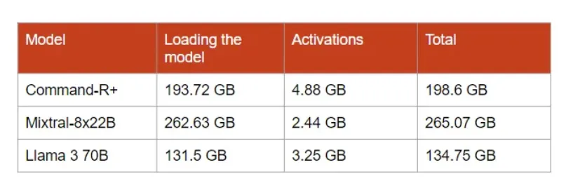
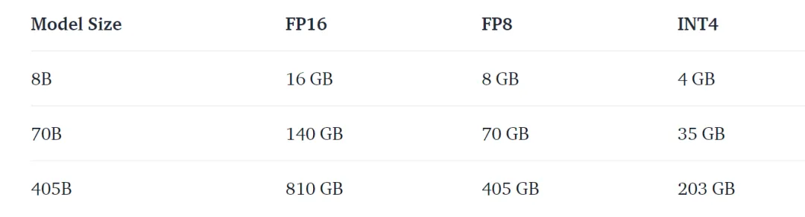
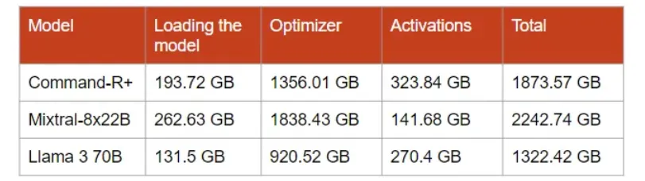
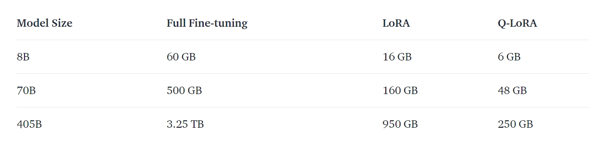
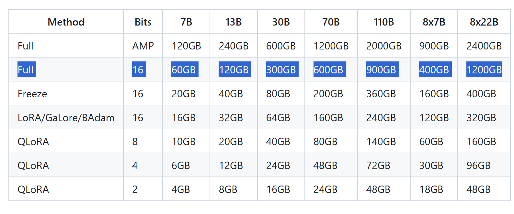
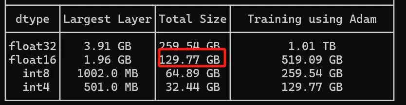
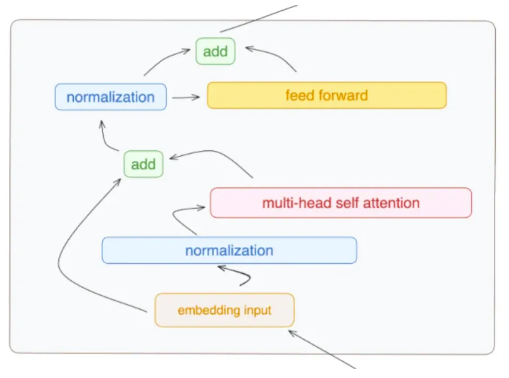
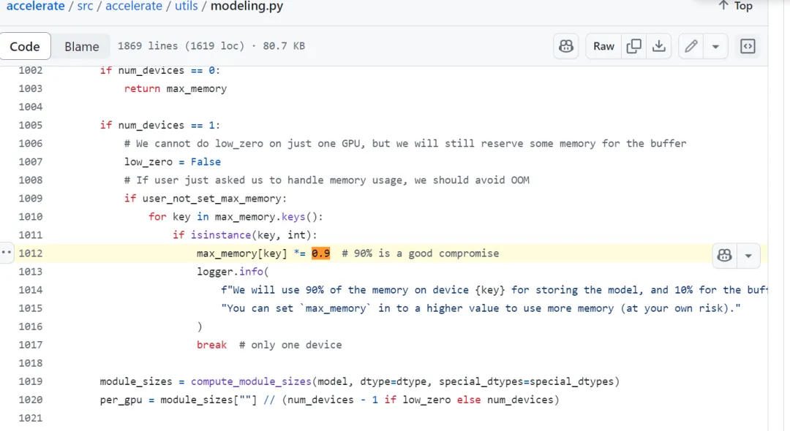

# LLM Inference Memory Estimation Tool

[](https://opensource.org/licenses/MIT)
[](https://www.python.org/downloads/)
[](https://azure.microsoft.com/)

A comprehensive tool for estimating memory consumption of Large Language Models (LLMs) during inference. Supports multiple interfaces (CLI, Web, Notebook) and one-click deployment to Azure.

## Table of Contents

- [Scenario](#scenario)
- [Azure One-Click Deployment](#azure-one-click-deployment)
- [Local Deployment](#local-deployment)
- [Usage Options](#usage-options)
- [Architecture](#architecture)
- [Memory Calculation Formula](#memory-calculation-formula)
- [Memory Consumption in Training and Inference](#memory-consumption-in-training-and-inference)
  - [Model Parameters Loading](#memory-consumption-in-model-parameters-loading)
  - [Optimizer State and Gradients](#memory-consumption-in-optimizer-state-and-gradients)
  - [Activations](#memory-consumption-in-activations)
  - [KV Cache in vLLM](#kv-cache-in-vllm)
  - [DeepSpeed ZeRO Policy](#deepspeed-zero-policy-for-saving-memory)
- [Limitations](#limitations)
- [Contributing](#contributing)

---

## Scenario

When deploying Large Language Models for inference, understanding memory requirements is critical for:

- **Infrastructure Planning**: Determine GPU/CPU memory requirements before deployment
- **Cost Optimization**: Select appropriate hardware configurations to balance performance and cost
- **Performance Tuning**: Evaluate the impact of optimization techniques (FlashAttention, GQA, KV Cache)
- **Batch Size Planning**: Find the optimal batch size for your hardware constraints

This tool provides accurate memory estimates by considering:
- Model parameter memory (FP32, FP16, INT8, INT4, etc.)
- Activation memory (intermediate computations)
- KV Cache memory (for efficient autoregressive generation)
- Optimization techniques (FlashAttention, Grouped Query Attention)

**Example Use Cases**:
- Estimate memory for deploying Llama 3.1 70B with FlashAttention
- Compare memory requirements across different quantization levels
- Plan GPU requirements for batch inference scenarios
- Optimize deployment costs by finding the right precision/hardware balance

---

## Azure One-Click Deployment

### Deploy with Azure Developer CLI (Recommended)

Deploy the Streamlit web application to Azure App Service with a single command.

#### Prerequisites

- **Azure Developer CLI** (azd)
- **Azure CLI** (az) 
- **Azure Subscription**

#### Five-Step Deployment

**On Linux**:

```bash
# 1. Clone only this project directory (sparse checkout)
git clone --filter=blob:none --sparse https://github.com/david-xinyuwei/david-share.git
cd david-share
git sparse-checkout set Deep-Learning/Estimate-Inference-Memory
cd Deep-Learning/Estimate-Inference-Memory

# 2. Install Azure Developer CLI
curl -fsSL https://aka.ms/install-azd.sh | bash

# 3. Login to Azure CLI (device code authentication)
az login --use-device-code

# 4. Login to Azure Developer CLI (device code authentication)
azd auth login --use-device-code

# 5. Deploy!
azd up
```

**On Windows**:

```powershell
# 1. Clone only this project directory (sparse checkout)
git clone --filter=blob:none --sparse https://github.com/david-xinyuwei/david-share.git
cd david-share
git sparse-checkout set Deep-Learning/Estimate-Inference-Memory
cd Deep-Learning\Estimate-Inference-Memory

# 2. Install Azure Developer CLI
winget install microsoft.azd

# 3. Login to Azure CLI (device code authentication)
az login --use-device-code

# 4. Login to Azure Developer CLI (device code authentication)
azd auth login --use-device-code

# 5. Deploy!
azd up
```

**That's it!** 

The deployment will:
- Create Azure resources (App Service Plan, Web App, Application Insights)
- Configure HTTPS and security settings
- Deploy Streamlit web application
- Set up monitoring and logging
- Return the application URL

#### First-Time Deployment

When running `azd up` for the first time, you ll be prompted:

```
? Enter a new environment name: dev
? Select an Azure Subscription: [Select your subscription]
? Select an Azure location: East US
```

**Recommended Configuration**:
- Environment name: `dev` (development) or `prod` (production)
- Location: `eastus`, `westus2`, `eastasia`, or closest to your users

#### Post-Deployment Commands

```powershell
# View application URL
azd env get-value WEB_URI

# Open in browser
azd browse

# View monitoring dashboard
azd monitor

# View real-time logs
azd monitor --logs

# Redeploy after code changes
azd deploy

# Delete all Azure resources
azd down
```

#### What Gets Deployed

The Azure deployment creates:

| Resource | Configuration | Purpose |
|----------|--------------|---------|
| **App Service Plan** | B1 SKU (Basic), Linux | Hosting environment |
| **Web App** | Python 3.11 | Streamlit application |
| **Application Insights** | Standard tier | Monitoring and logging |
| **Log Analytics** | Pay-as-you-go | Log storage (5GB free) |

All resources are:
- **HTTPS only** (TLS 1.2+)
- **Auto-configured** for monitoring
- **Infrastructure as Code** (Bicep templates)
- **Environment isolated** (dev/test/prod)

#### Cost Estimation

**Development (Free Tier - F1 SKU)**:
```
App Service Plan (F1):  $0/month
Application Insights:   $0/month (free tier)
Total:                  $0/month
```
F1 limitations: 60 min/day CPU quota, 1GB disk, no custom domain

**Production (Basic Tier - B1 SKU)**:
```
App Service Plan (B1):  ~$55/month
Application Insights:   ~$5/month
Log Analytics:          $0 (5GB free quota)
Total:                  ~$60/month
```

To use free tier, edit `infra/main.bicep` before deployment:
```bicep
sku: {
  name:  F1
  tier:  Free
}
```

#### Environment Variables

Set environment variables for Hugging Face token (optional):

```powershell
# Using azd
azd env set HF_API_TOKEN "your-huggingface-token"
azd deploy

# Or using Azure CLI
az webapp config appsettings set \
  --name app-<env-name> \
  --resource-group rg-<env-name> \
  --settings HF_API_TOKEN="your-token"
```

---

## Local Deployment

### Prerequisites

- Python 3.8 or higher
- Internet access to Hugging Face Hub
- Hugging Face API token (optional, for accessing gated models)

### Quick Start (Automated Setup)

#### Windows PowerShell

```powershell
# Clone repository
git clone https://github.com/david-xinyuwei/david-share.git
cd david-share/Deep-Learning/Estimate-Inference-Memory

# Run setup script
.\scripts\setup.ps1

# Activate virtual environment
.\venv\Scripts\Activate.ps1

# Run CLI tool
python src/cli_estimator.py
```

#### Linux/Mac

```bash
# Clone repository
git clone https://github.com/david-xinyuwei/david-share.git
cd david-share/Deep-Learning/Estimate-Inference-Memory

# Run setup script
chmod +x scripts/setup.sh
./scripts/setup.sh

# Activate virtual environment
source venv/bin/activate

# Run CLI tool
python src/cli_estimator.py
```

The setup script automatically:
- Checks Python installation
- Creates a virtual environment
- Installs dependencies from `requirements.txt`
- Provides usage instructions

### Manual Installation

If you prefer manual installation:

```bash
# 1. Clone repository
git clone https://github.com/david-xinyuwei/david-share.git
cd david-share/Deep-Learning/Estimate-Inference-Memory

# 2. Create virtual environment (recommended)
python -m venv venv

# 3. Activate virtual environment
# Windows:
venv\Scripts\activate
# Linux/Mac:
source venv/bin/activate

# 4. Install dependencies
pip install -r requirements.txt
```

**Dependencies**:
- `transformers>=4.30.0` - Hugging Face model configurations
- `torch>=2.0.0` - PyTorch (for model calculations)
- `streamlit>=1.28.0` - Web interface framework

### Set Hugging Face Token (Optional)

For accessing gated models or higher rate limits:

```bash
# Windows PowerShell
$env:HF_API_TOKEN="your_huggingface_token_here"

# Linux/Mac
export HF_API_TOKEN="your_huggingface_token_here"
```

Get your token at: https://huggingface.co/settings/tokens

---

## Usage Options

This tool provides three interfaces for different use cases:

### 1. Command Line Interface (Quick Estimates)

Best for: Quick calculations, scripting, CI/CD integration

```bash
python src/cli_estimator.py
```

**Interactive prompts**:
```
Enter the model name from Hugging Face Hub: meta-llama/Meta-Llama-3-70B
Enter the precision (fp32/fp16/int8/int4): fp16
Enable FlashAttention? (yes/no): yes
Enter the number of layers to run: 80
Enter the sequence length: 2048
Enter the batch size: 1
```

**Output**:
```
Model Configuration:
  Model: meta-llama/Meta-Llama-3-70B
  Parameters: 70.55B
  Precision: FP16
  FlashAttention: Enabled

Memory Breakdown:
  Parameters:    141.10 GB
  Activations:   12.58 GB  
  KV Cache:      5.24 GB
  Total:         158.92 GB

Recommendation: Use 2x A100 80GB GPUs with tensor parallelism
```

### 2. Streamlit Web Interface (Interactive Analysis)

Best for: Interactive exploration, parameter tuning, visualization

```bash
streamlit run src/web_estimator.py
```

Opens a web browser with an interactive interface featuring:
- Real-time memory calculations
- Sliders for batch size and sequence length
- Checkboxes for optimization techniques
- Visual memory breakdown
- Export results

**Access**: http://localhost:8501

**Features**:
- Input model names from Hugging Face Hub
- Adjust parameters with sliders
- Toggle FlashAttention, GQA optimizations
- See instant memory updates
- Compare different configurations

### 3. Jupyter Notebook (Educational Deep-Dive)

Best for: Learning, customization, detailed analysis

```bash
jupyter notebook notebooks/memory_estimation.ipynb
```

**Contains**:
- Detailed explanations of formulas
- Step-by-step calculations
- Memory breakdown visualizations
- Customizable calculations
- Optimization recommendations

---

## Architecture

### System Overview

```
User Interface Layer
  CLI Tool      Streamlit      Jupyter
  (Terminal)     Web App       Notebook

Core Calculation Layer
  Memory Estimator Engine
  - Parameter Memory Calculator
  - Activation Memory Calculator
  - KV Cache Calculator
  - Optimization Adjuster (FlashAttention, GQA)

Model Configuration Layer
  Hugging Face Hub Integration
  - AutoConfig loader
  - Model architecture parser
  - Parameter extraction
```

### Project Structure

```
LLM-Memory-Estimation/
 azure.yaml                      # Azure Developer CLI configuration
 infra/                          # Infrastructure as Code (Bicep)
    main.bicep                  # Main Azure resources template
    core/
        host/                   # App Service modules
        monitor/                # Monitoring modules
 src/                            # Application source code
    __init__.py
    cli_estimator.py            # Command-line interface
    web_estimator.py            # Streamlit web interface
 notebooks/
    memory_estimation.ipynb     # Educational Jupyter notebook
 scripts/
    deploy-azd.ps1              # Azure deployment (azd)
    setup.ps1                   # Local setup (Windows)
    setup.sh                    # Local setup (Linux/Mac)
 requirements.txt                # Python dependencies
 startup.sh                      # Azure App Service startup script
 .streamlit/
    config.toml                 # Streamlit configuration
 README.md                       # This file
```

### Technology Stack

- **Python 3.8+**: Core language
- **Transformers**: Hugging Face model configurations
- **PyTorch**: Tensor operations and calculations
- **Streamlit**: Web interface framework
- **Bicep**: Azure infrastructure templates
- **Azure App Service**: Cloud hosting platform

---

## Memory Calculation Formula

### Components

The tool calculates total inference memory as:

```
Total Memory = Parameter Memory + Activation Memory + KV Cache Memory
```

#### 1. Parameter Memory

```
Parameter Memory = Number of Parameters × Bytes per Parameter
```

**Precision mapping**:
- FP32: 4 bytes per parameter
- FP16: 2 bytes per parameter
- INT8: 1 byte per parameter
- INT4: 0.5 bytes per parameter

**Example**:
```
Llama 3.1 70B in FP16:
= 70.55B parameters × 2 bytes
= 141.10 GB
```

#### 2. Activation Memory

Activations are intermediate tensors during forward pass:

```
Activation Memory = Batch Size × Sequence Length × Hidden Size × Number of Layers × Multiplier
```

**Multiplier factors**:
- Standard Attention: ~34 (Q, K, V projections, attention scores, etc.)
- FlashAttention: ~10 (optimized memory access patterns)

**Example**:
```
Llama 3.1 70B, batch=1, seq_len=2048, hidden=8192, 80 layers, FlashAttention:
= 1 × 2048 × 8192 × 80 × 10 × 2 bytes (FP16)
= 26.84 GB
```

#### 3. KV Cache Memory

For autoregressive generation, past key-value pairs are cached:

```
KV Cache = 2 × Batch Size × Sequence Length × Num Layers × Num KV Heads × Head Dim × Precision
```

**With Grouped Query Attention (GQA)**:
```
KV Heads = Total Heads / GQA Groups
```

**Example**:
```
Llama 3.1 70B, batch=1, seq_len=2048, 80 layers, 8 KV heads, head_dim=128, FP16:
= 2 × 1 × 2048 × 80 × 8 × 128 × 2 bytes
= 6.71 GB
```

### Optimization Techniques

| Technique | Memory Reduction | Implementation |
|-----------|------------------|----------------|
| **FlashAttention** | ~70% activation memory | Recompute attention on-the-fly |
| **Grouped Query Attention** | ~60% KV cache | Fewer KV heads than Q heads |
| **INT8 Quantization** | ~50% parameter memory | 8-bit integer precision |
| **INT4 Quantization** | ~75% parameter memory | 4-bit integer precision |
| **Paged Attention** | Dynamic KV cache | Efficient memory paging |

### Accuracy Considerations

This tool provides **estimates** based on standard transformer architectures. Actual memory usage may vary due to:

- Framework overhead (PyTorch, ONNX, TensorRT)
- Gradient checkpointing (if enabled during fine-tuning)
- Custom model architectures
- Batch padding and variable sequence lengths
- CUDA kernel optimizations

**Recommendation**: Add 10-20% buffer for production deployments.

---

## Memory Consumption in Training and Inference

This section provides a detailed theoretical analysis of memory consumption across different components during both training and inference phases.

The specific proportion of model memory consumption can vary greatly under different models and configurations, but a general overview can help understand the relative importance of each part:

- **Model Parameters**: This part usually occupies a relatively fixed amount of memory, depending on the size of the model (number of layers, number of parameters). For larger models, this can take up a significant proportion of memory, especially when there are many model parameters. In inference scenarios, the main memory consumption is the loading of model parameters.
- **Optimizer State**: In inference processes, if there is no model updating, the memory consumption of the optimizer state can be negligible. However, in training scenarios, this part consumes a significant amount of memory, even higher than Model Parameters.
- **Gradients**: In the training phase, gradients are a significant part of memory consumption. Each parameter in the model has an associated gradient which is used to update the parameter during backpropagation. Especially in large models, the memory required to store these gradients can be substantial. This is crucial for understanding the overall memory requirements during model training. It should be noted that the memory consumption of the gradients usually calculate into the optimizer's memory usage.
- **Activations**: During inference, activations are not the main part of memory consumption. However, in training scenarios, especially when the batch size is large or the model depth is significant, this part consumes a lot of memory.
- **KV Cache in vLLM Inference**: During inference with vLLM, when handling long sequences, it will occupy lots of memory. This is the additional memory required beyond the KV cache memory for normal model training and inference.
- **Framework Overhead**: This usually occupies a smaller proportion of memory, but in cases of poor memory management or a complex framework itself, it can also become a non-negligible factor.

**Overall**:
- In training phase: ***Memory need = Model Parameters + Optimizer State + Gradients + Activations***
- In inference phase: ***Memory need = Model Parameters + Activations + vLLM KV Cache (in case you use vLLM)***

For example in Inference:



Take Llama 3.1 as an example to see how much memory it needs for inference:



For example in Training (Gradients are calculated into the optimizer):



Take Llama 3.1 as an example to see how much memory it needs for training:



There is also an example for a quick assessment of the amount of memory needed while the model is being trained, this is a quick reference and may not be 100% accurate. Refer below for the exact steps.




### Memory Consumption in Model Parameters Loading

For training and inference, memory consumption in model parameters loading is the same.

For example, to calculate the GPU RAM needed to load the Llama 3 70B model, we can follow these steps:

- Determine the Number of Parameters: The Llama 3 70B model has 70 billion (i.e., 70 billion or 70,000,000,000) parameters.

- Calculate the Total Memory Required for Parameters: Each parameter uses 16 bits (or 2 bytes) of memory (since the parameters are stored in bfloat16 format, 16 bits equals 2 bytes).

Total Memory = Number of Parameters x Memory per Parameter

- Total Memory = 70,000,000,000 parameters x 2 bytes/parameter = 140,000,000,000 bytes
- Convert Bytes to GB:
1 GB = 1,073,741,824 bytes (note that this uses the binary conversion, i.e., 2^30)
Total Memory (GB) = 140,000,000,000 bytes / 1,073,741,824 bytes/GB ≈ 130.4 GB

This value is very close to the result from the HF (Hugging Face) tool.




### Memory Consumption in Optimizer State and Gradients

The memory increase due to the optimizer during the training process mainly includes the following two parts:
- New parameters created by the optimizer
- Copies of model parameters

#### New Parameters Created by the Optimizer

AdamW is a commonly used optimizer, notable for considering the historical update data of parameters while adjusting the model parameters. This is similar to an experienced engineer who, when tuning a machine, not only considers the current performance but also refers to past adjustment records for more precise tuning. Now, let's examine the memory consumption. When using the AdamW optimizer, each model parameter has two additional pieces of information recorded: momentum and variance.

- **Momentum**: This reflects the trend of parameter changes during previous training processes, helping the optimizer understand how to smoothly change parameters during adjustments.
- **Variance**: This helps the optimizer understand the stability of each parameter at different training stages, making the adjustments more robust.

These two additional pieces of information require extra memory for storage, as the optimizer records both for each model parameter. Next, let's look at the memory consumption during fine-tuning of the model. Taking the Mixtral-8x22B model as an example, the optimizer creates and stores two new parameters (momentum and variance) for each parameter of the model, which requires additional memory. Specifically:

This includes momentum and variance; we have 282 billion of these new parameters, each of which is a float32 type, occupying 4 bytes of memory. Similarly, we can calculate the total memory occupied by the new parameters created by the optimizer using the following formula:

Memory = Number of New Parameters × Memory Size per New Parameter

Substituting the specific values into the formula, we get:


Converted to GB, we find that the new parameters created by the optimizer occupy approximately 1050.53 GB of memory.

#### Copies of Model Parameters by the Optimizer

We have 141 billion (141B) parameters, each of which is a float32 type, occupying 4 bytes of memory. Thus, the total memory occupied by the copies of model parameters can be calculated using the following formula:

Memory = Number of Parameters × Memory Size per Parameter

Substituting the specific values into the formula, we get:


This result is in bytes, and we usually convert it to GB for easier understanding. 1GB equals 1,024^3 bytes, so we can determine that the total memory occupied by the copies of model parameters is approximately 525.27 GB.

#### Memory Consumption in Gradients

We have 141 billion gradients, each of which is of type float16, occupying 2 bytes of memory. Similarly, we can calculate the total memory occupied by the gradients using the following formula:

Memory = Number of Gradients × Memory Size per Gradient

Substituting the specific values into the formula, we get:


Converted to GB, we find that the gradients occupy approximately 262.63 GB of memory.

### Memory Consumption in Activations

***Note:***
In this part when calculating the memory consumption of Activations, the formula does not consider the detailed Data Type. This means that if FP16 is used, the formula below needs to be multiplied by 2.

We need to know the following information to estimate the activation memory consumption:
- **s**: Maximum sequence length (number of tokens in the input)
- **b**: Batch size
- **h**: Model's hidden dimension
- **a**: Number of attention heads

A standard Transformer layer consists of a self-attention block and an MLP block, each connected through two layer normalizations.



#### For Inference

The memory overhead of activations during inference requires storing the activations of a single layer and then passing them to the next layer.

The memory consumption for each component is estimated as follows:

**1. Self-Attention Block**

The attention block includes the self-attention mechanism and linear projections. The memory requirements include:
- Linear Projection: Retains its input activations, with a size of 2sbh.
- Linear Projection and Self-Attention Input Activations: Each requires 2sbh.
- Self-Attention Query (Q) and Key (K) Matrices: Requires a total of 4sbh.
- Softmax: Requires 2as²b.
- Storing the Attention Applied to the Values (V) of Self-Attention: Requires a total of 2as²b + 2sbh.

The total memory required for the attention block is: **10sbh + 4as²b**.

**2. MLP Block**

The MLP block contains two linear layers:
- Linear Layers: Store input, requiring 2sbh and 8sbh respectively.
- GeLU Non-linearity: Also requires 8sbh.

Overall, the MLP block requires **18sbh** of storage.

**3. Layer Normalization**

Each layer normalization stores its input, requiring 2sbh each, totaling **4sbh** for two normalizations.

**Total Memory for a Transformer Layer**

The total memory required to store activations for one Transformer layer is:
- From the attention block: 10sbh + 4as²b
- From the MLP block: 18sbh
- From layer normalization: 4sbh

**Total activation memory per layer = 32sbh + 4as²b**

Conclusion: The memory overhead for activations during inference is:

**Activation memory consumption per Layer in inference = 32sbh + 4as²b**

Depending on the data type used, you will need to adjust the total memory consumption accordingly.

#### For Training

While the activation calculation for training and inference appears similar, training requires storing the activations of all layers to perform backpropagation and gradient computation, which demands more memory. In contrast, during inference, we only need to compute layer by layer and can release the activations of each layer once its computation is complete, thereby saving memory. For the activation overhead of each layer, we also need to consider the dropout masks in the self-attention and MLP modules, which add an additional 2sbh.

**Activation memory consumption per Layer in training = L(34sbh + 5as²b)**


### KV Cache in vLLM

When vLLM performs inference, it utilizes the HF accelerate library, which causes it to pre-allocate 90% of the GPU memory by default when loading the model.



To address this issue, specify `gpu_memory_utilization` during inference. Of course, this percentage must satisfy the model's inference requirements. Based on practical tests, setting `gpu_memory_utilization` does not reduce inference performance as long as the GPU memory can meet the inference needs. Here are the analyses of two test results: in the first test, `gpu_memory_utilization` was set to 0.2, while in the second test, it was not set. The tests were conducted using H100 + vLLM + Phi3 Mini 4K.

However, vLLM team is working on FP8 of KV cache now with AMMO, but it supports limited Models. It is very useful when it supports most of HF models.

#### Model Loading and Memory Allocation

**Model Loading:**
- First Test: Loading model weights occupied 7.1183 GB of memory.
- Second Test: Loading model weights also occupied 7.1183 GB of memory.

**Memory Usage:**
- First Test:
  - Maximum RAM Usage: 6085.128192 MB
  - Maximum Global VRAM Usage: 21886.861312 MB
  - Maximum Process VRAM Usage: 21254.635520 MB
- Second Test:
  - Maximum RAM Usage: 6089.269248 MB
  - Maximum Global VRAM Usage: 91814.297600 MB
  - Maximum Process VRAM Usage: 91182.071808 MB

From the memory usage data, the VRAM usage in the second test is significantly higher than in the first test.

#### Latency and Throughput

**Prefill Latency:**

Prefill latency in both tests is very close, with average latency and standard deviation nearly identical.

| Metric | First Test | Second Test |
|--------|-----------|-------------|
| Total | 9.958572 s | 9.958938 s |
| Average | 0.026276 s | 0.026346 s |
| Std Dev | 0.000201 s (0.77%) | 0.000212 s (0.80%) |
| p50 | 0.026256 s | 0.026328 s |
| p90 | 0.026402 s | 0.026469 s |
| p95 | 0.026436 s | 0.026500 s |
| p99 | 0.027318 s | 0.027580 s |

**Decode Latency:**

Decode latency is also very close, with average latency and standard deviation nearly identical in both tests.

| Metric | First Test | Second Test |
|--------|-----------|-------------|
| Total | 9.272923 s | 9.259893 s |
| Average | 0.299127 s | 0.298706 s |
| Std Dev | 0.000345 s (0.12%) | 0.000405 s (0.14%) |
| p50 | 0.299020 s | 0.298628 s |
| p90 | 0.299618 s | 0.299288 s |
| p95 | 0.299694 s | 0.299376 s |
| p99 | 0.299866 s | 0.299385 s |

**Throughput:**

Throughput in both tests is also very close, with very minimal differences.

| Metric | First Test | Second Test |
|--------|-----------|-------------|
| Prefill Throughput | 19485.523696 tokens/s | 19433.397122 tokens/s |
| Decode Throughput | 163.810265 tokens/s | 164.040766 tokens/s |

#### Summary

- **Memory Usage**: The VRAM usage in the second test is significantly higher than in the first test, possibly due to more GPU resources being used in the second test.
- **Latency and Throughput**: The latency and throughput in both tests are almost identical, showing very stable performance.

Overall, except for the significant difference in VRAM usage, the performance metrics in both tests are very close, indicating that the model's performance is stable under the same testing environment and configuration.


### DeepSpeed ZeRO Policy for Saving Memory

#### DeepSpeed ZeRO Stage

This image is from the DeepSpeed paper, illustrating the memory consumption on each device during different optimization stages (ZeRO-DP optimization). It details how parameters, gradients, and optimizer states are partitioned during the model training process, and the impact of each partitioning method on memory consumption. Memory consumption for each GPU is represented in different colors:

- Blue: Parameters
- Orange: Gradients
- Green: Optimizer State


Several optimization strategies include:
- **Baseline** (unoptimized): All GPUs store complete parameters, gradients, and optimizer states: 120GB in above image.
- **P_os**: Partitioning only the optimizer state, i.e., Stage 1: 31.4GB in above image.
- **P_os+g**: Partitioning both the optimizer state and gradients, i.e., Stage 2: 16.6GB in above image.
- **P_os+g+p**: Partitioning optimizer state, gradients, and parameters, i.e., Stage 3: 1.9GB in above image.

#### Communication in ZeRO Stage

1. **P_os**: After backpropagation, each device calculates local gradients based on local data. Then, local gradients are averaged across all devices. Each device uses the averaged gradient for weight updates. Since all devices have the same averaged gradient, they perform the same updates, thus all devices have a consistent model copy. For efficiency, this all-reduce operation on gradients is implemented in two steps, and for a model with P parameters, it requires a total of 2P communication:
   - reduce-scatter: Each process averages part of the gradients (for a model with P parameters, the communication size of the gradient is O(P)).
   - all-gather: Each process collects all other processes' reduced gradients (also O(P) communication). These two steps are pipelined, so the process is communication-bound, and GPUs are not idle.

2. **P_os+g**: The required communication is the same as classic data parallelism. The reduce-scatter operation needs P communication to reduce the part of the gradients each process owns. Each process only needs to update the part of the parameters it owns. Then it passes the updated parameters to all other devices, a total communication of P in the all-gather operation. The total communication is still 2P.

3. **P_os+g+p**: In this optimization stage, only 1/N of the P model parameters are stored on each device. Thus, each process needs to communicate P/N (part of the parameters) to all N devices for forward and backward propagation. That is, each propagation's communication volume is P/N * N = P, a total of 2P. The gradient's reduce-scatter operation requires P communication. The total communication is 3P, 1.5 times that of classic data parallelism. Communication is distributed, so parameters are only present on nodes when needed and are immediately discarded after use, maintaining the discussed memory-saving characteristics.

Today, when we want to use DeepSpeed to do CPT or FT, we could easily use Axolotl, please refer to:

***https://github.com/davidsajare/david-share/tree/master/Deep-Learning/Fine-tuning-with-Axolotl***

---

## Limitations

### Current Limitations

1. **Training Memory Estimation**
   - The tool estimates **inference-only** memory via its CLI/Web/Notebook interfaces
   - For training memory estimation, refer to the [Memory Consumption in Training and Inference](#memory-consumption-in-training-and-inference) section above for theoretical formulas
   - Training requires additional memory for:
     - Gradients (equal to parameter memory)
     - Optimizer states (2-3x parameter memory for Adam)
     - Intermediate gradients for backpropagation

2. **Standard Transformer Architectures Only**
   - Assumes standard attention mechanisms
   - May not accurately estimate for:
     - Mixture of Experts (MoE) models
     - Sparse attention models
     - Custom architectures

3. **Framework Overhead Not Included**
   - Estimates exclude:
     - PyTorch framework memory (~1-2GB)
     - CUDA context memory (~0.5-1GB)
     - Model loading overhead

4. **Dynamic Batch Sizes**
   - Estimates assume fixed batch size
   - Dynamic batching may have different memory patterns

5. **Model-Specific Optimizations**
   - Some models have custom memory optimizations
   - Verify estimates with actual deployments

### Best Practices

- Add 15-20% buffer for production deployments
- Test with actual models before production
- Monitor memory usage in real deployments
- Use profiling tools (NVIDIA NSight, PyTorch Profiler)
- Consider batch size variability in production

---

## Contributing

Contributions are welcome! Please feel free to submit a Pull Request.

### How to Contribute

1. Fork the repository
2. Create your feature branch (`git checkout -b feature/AmazingFeature`)
3. Commit your changes (`git commit -m 'Add some AmazingFeature'`)
4. Push to the branch (`git push origin feature/AmazingFeature`)
5. Open a Pull Request

### Development Setup

```bash
# Clone your fork
git clone https://github.com/your-username/david-share.git
cd david-share/Deep-Learning/Estimate-Inference-Memory

# Create virtual environment
python -m venv venv
source venv/bin/activate  # or venv\Scripts\activate on Windows

# Install dependencies
pip install -r requirements.txt

# Run tests
python -m pytest tests/
```

### Areas for Contribution

- Bug fixes
- Documentation improvements
- New features (e.g., support for MoE models)
- Additional test cases
- UI/UX improvements
- Internationalization

---

## References

- ***https://kaitchup.substack.com/p/estimate-the-memory-consumption-of***
- ***https://github.com/microsoft/DeepSpeed***

---

## License

This project is licensed under the MIT License - see the LICENSE file for details.

---

## Acknowledgments

- **Hugging Face** for the Transformers library and model hub
- **Streamlit** for the amazing web framework
- **Microsoft Azure** for cloud infrastructure support
- **Open source community** for inspiration and tools

---

## Support

- **Issues**: [GitHub Issues](https://github.com/david-xinyuwei/david-share/issues)
- **Discussions**: [GitHub Discussions](https://github.com/david-xinyuwei/david-share/discussions)
- **Email**: Contact via GitHub profile

---

## Related Resources

- [Hugging Face Model Hub](https://huggingface.co/models)
- [Azure App Service Documentation](https://learn.microsoft.com/azure/app-service/)
- [Azure Developer CLI](https://learn.microsoft.com/azure/developer/azure-developer-cli/)
- [Streamlit Documentation](https://docs.streamlit.io/)
- [Transformers Documentation](https://huggingface.co/docs/transformers/)

---

**Made with ❤ for the AI/ML community**

**Star ⭐ this repository if you find it helpful!**
