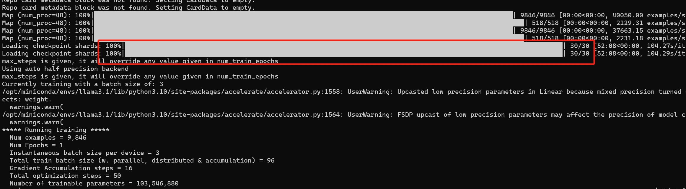

# Llama3.1-8B Fine Tuning
> **Author**: Xinyu Wei (魏新宇) — Microsoft AI GBB Senior System Engineer

Llama 3.1 and Llama 3 do not differ significantly in terms of fine-tuning implementation. In this article, I will first introduce the differences between the two models and then present the code for QLoRA and LoRA


## Running on Azure

All experiments in this project were conducted on an **Azure GPU VM**.

| Item | Details |
|---|---|
| **Azure VM** | [Standard_NC24ads_A100_v4](https://learn.microsoft.com/en-us/azure/virtual-machines/nc-a100-v4-series) |
| **GPU** | NVIDIA A100 80GB PCIe |
| **Frameworks** | DeepSpeed, LoRA/PEFT |


## Detailed Technical Differences Between Llama 3 and Llama 3.1

### 1. Language Support

- **Llama 3.1**: Added official support for German, French, Italian, Portuguese, Hindi, Spanish, and Thai.
- **Llama 3**: Does not have these additional language supports.

### 2. Function Calling

- **Llama 3.1**: Added support for function calling, specifically introducing new special tokens such as “<|eom_id|>” and “<|python_tag|>”.
- **Llama 3**: Does not have this function calling support.

### 3. Long Sequence Processing

- **Llama 3.1**: Underwent post-training on very long sequences (up to 128k tokens), capable of handling longer contexts without significantly reducing accuracy.
- **Llama 3**: Did not undergo such long sequence post-training.

### 4. Training Data

- **Llama 3.1**: Trained on long context data containing 800 billion tokens, accounting for 5% of the total pre-training data.
- **Llama 3**: Was not specifically trained on long context data.

### 5. Tokenizer Updates

- Llama 3.1

  : The tokenizer was modified, and certain special tokens were changed. For example:

  - Added “<|finetune_right_pad_id|>” as a padding token.
  - Added “<|eom_id|>” and “<|python_tag|>” for function calling.

- **Llama 3**: Does not have these new special tokens, using other special tokens such as “<|reserved_special_token_2|>” and “<|reserved_special_token_3|>”.

### 6. Padding Direction

- **Llama 3.1**: Introduced a new padding token “<|finetune_right_pad_id|>”. Experiments show that using right padding during fine-tuning is more effective than left padding.
- **Llama 3**: Does not have a specific padding token, usually using “<|eot_id|>” for padding.

### 7. Fine-Tuning Effectiveness

- **Llama 3.1**: Demonstrates faster learning speed and better effectiveness during fine-tuning. When using QLoRA for fine-tuning, the loss value is lower than when using LoRA for fine-tuning.
- **Llama 3**: Learning speed and effectiveness are not as good as Llama 3.1. The effectiveness is also not as good as Llama 3.1 when using QLoRA for fine-tuning.

### Summary

Llama 3.1 has made significant technical improvements in multilingual support, function calling, long sequence processing, and tokenizer updates. It also shows better learning effectiveness during fine-tuning, especially with the introduction of new special tokens and padding strategies, making the fine-tuning process more efficient.


## Fine Tuning Code of Llama 3.1 8B
QLoRA with right padding
```
model_name = "meta-llama/Meta-Llama-3.1-8B"
#Tokenizer
tokenizer = AutoTokenizer.from_pretrained(model_name, use_fast=True)
tokenizer.pad_token = "<|finetune_right_pad_id|>"
tokenizer.pad_token_id = 128004
tokenizer.padding_side = 'right'

ds = load_dataset("timdettmers/openassistant-guanaco")

#Add the EOS token
def process(row):
    row["text"] = row["text"]+"<|end_of_text|>"
    return row

ds = ds.map(
    process,
    num_proc= multiprocessing.cpu_count(),
    load_from_cache_file=False,
)

bnb_config = BitsAndBytesConfig(
        load_in_4bit=True,
        bnb_4bit_quant_type="nf4",
        bnb_4bit_compute_dtype=compute_dtype,
        bnb_4bit_use_double_quant=True,
)
model = AutoModelForCausalLM.from_pretrained(
          model_name, quantization_config=bnb_config, device_map={"": 0}, attn_implementation=attn_implementation
)

model = prepare_model_for_kbit_training(model, gradient_checkpointing_kwargs={'use_reentrant':True})


peft_config = LoraConfig(
        lora_alpha=16,
        lora_dropout=0.05,
        r=16,
        bias="none",
        task_type="CAUSAL_LM",
        target_modules= ['k_proj', 'q_proj', 'v_proj', 'o_proj', "gate_proj", "down_proj", "up_proj"]
)


training_arguments = SFTConfig(
        output_dir="./Llama3.1_8b_QLoRA_right/",
        eval_strategy="steps",
        do_eval=True,
        optim="paged_adamw_8bit",
        per_device_train_batch_size=8,
        gradient_accumulation_steps=4,
        per_device_eval_batch_size=8,
        log_level="debug",
        save_strategy="epoch",
        logging_steps=25,
        learning_rate=1e-4,
        fp16 = not torch.cuda.is_bf16_supported(),
        bf16 = torch.cuda.is_bf16_supported(),
        eval_steps=25,
        num_train_epochs=1,
        warmup_ratio=0.1,
        lr_scheduler_type="linear",
        dataset_text_field="text",
        max_seq_length=512,
)

trainer = SFTTrainer(
        model=model,
        train_dataset=ds['train'],
        eval_dataset=ds['test'],
        peft_config=peft_config,
        tokenizer=tokenizer,
        args=training_arguments,
)

trainer.train()
```

LoRA with right padding
```
model_name = "meta-llama/Meta-Llama-3.1-8B"
#Tokenizer
tokenizer = AutoTokenizer.from_pretrained(model_name, use_fast=True)
tokenizer.pad_token = "<|finetune_right_pad_id|>"
tokenizer.pad_token_id = 128004
tokenizer.padding_side = 'right'

ds = load_dataset("timdettmers/openassistant-guanaco")

#Add the EOS token
def process(row):
    row["text"] = row["text"]+"<|end_of_text|>"
    return row

ds = ds.map(
    process,
    num_proc= multiprocessing.cpu_count(),
    load_from_cache_file=False,
)


model = AutoModelForCausalLM.from_pretrained(
          model_name, torch_dtype=torch.bfloat16, device_map={"": 0}, attn_implementation=attn_implementation
)

model.gradient_checkpointing_enable(gradient_checkpointing_kwargs={'use_reentrant':True})


peft_config = LoraConfig(
        lora_alpha=16,
        lora_dropout=0.05,
        r=16,
        bias="none",
        task_type="CAUSAL_LM",
        target_modules= ['k_proj', 'q_proj', 'v_proj', 'o_proj', "gate_proj", "down_proj", "up_proj"]
)


training_arguments = SFTConfig(
        output_dir="./Llama3.1_8b_LoRA_right",
        eval_strategy="steps",
        do_eval=True,
        optim="paged_adamw_8bit",
        per_device_train_batch_size=2,
        gradient_accumulation_steps=16,
        per_device_eval_batch_size=2,
        log_level="debug",
        save_strategy="epoch",
        logging_steps=25,
        learning_rate=1e-4,
        bf16 = True,
        eval_steps=25,
        num_train_epochs=1,
        warmup_ratio=0.1,
        lr_scheduler_type="linear",
        dataset_text_field="text",
        max_seq_length=512,
)

trainer = SFTTrainer(
        model=model,
        train_dataset=ds['train'],
        eval_dataset=ds['test'],
        peft_config=peft_config,
        tokenizer=tokenizer,
        args=training_arguments,
)

trainer.train()
```

---

# Part 2: Llama-3.1-70B FSDP Fine-Tuning (Multi-GPU)

> *Merged from the original Llama-3.1-70B-FSDP-Fine-Tuning project.*

How much memory is approximately needed to fine-tune Llama3.1-70B? 

Refer to my previous repo: *https://github.com/davidsajare/david-share/tree/master/Deep-Learning/Memory-comsuption-in-Training-and-Inference*. 

The memory required for fine-tuning a 70B model is:


We see that using QLoRA requires approximately 80GB of VRAM. To further save memory, you can use DeepSpeed's ZeRO policy on top of QLoRA, or use FSDP.


## Difference between Pytorch FSDP and DeepSpeed Zero-3

FSDP is a type of data-parallel training, but unlike traditional data-parallel, which maintains a per-GPU copy of a model’s parameters, gradients and optimizer states, it shards all of these states across data-parallel workers and can optionally offload the sharded model parameters to CPUs.

The figure below shows how FSDP works for 2 data-parallel processes:


*From：https://pytorch.org/blog/introducing-pytorch-fully-sharded-data-parallel-api/*

Usually, model layers are wrapped with FSDP in a nested way, so that only layers in a single FSDP instance need to gather the full parameters to a single device during forward or backward computations. The gathered full parameters will be freed immediately after computation, and the freed memory can be used for the next layer’s computation. In this way, peak GPU memory could be saved and thus training can be scaled to use a larger model size or larger batch size. To further maximize memory efficiency, FSDP can offload the parameters, gradients and optimizer states to CPUs when the instance is not active in the computation.


## Prepare training environment
```
pip install --upgrade accelerate
```
Create a file config_fsdp.yaml
```
config_fsdp.yaml
```
```
compute_environment: LOCAL_MACHINE
debug: false
distributed_type: FSDP
downcast_bf16: 'no'
fsdp_config:
  fsdp_auto_wrap_policy: TRANSFORMER_BASED_WRAP
  fsdp_backward_prefetch: BACKWARD_PRE
  fsdp_cpu_ram_efficient_loading: true
  fsdp_forward_prefetch: false
  fsdp_offload_params: true
  fsdp_sharding_strategy: FULL_SHARD
  fsdp_state_dict_type: SHARDED_STATE_DICT
  fsdp_sync_module_states: true
  fsdp_use_orig_params: false
machine_rank: 0
main_training_function: main
mixed_precision: 'no'
num_machines: 1
num_processes: 2
rdzv_backend: static
same_network: true
tpu_env: []
tpu_use_cluster: false
tpu_use_sudo: false
use_cpu: false
```
- num_processes: 2 specifies the use of two processes for distributed computing, which means two GPUs. 
- fsdp_sharding_strategy: FULL_SHARD specifies the use of a full sharding strategy, meaning that all parameters of the model will be sharded and distributed across different devices. Because of this setting, there will be shards when loading the model, which will alse increase model load time a lot.




Training script: fsdp+QLoRA.py
```
import torch, os, multiprocessing
from datasets import load_dataset
from peft import LoraConfig, prepare_model_for_kbit_training
from transformers import (
    AutoModelForCausalLM,
    AutoTokenizer,
    BitsAndBytesConfig,
    set_seed
)
from trl import SFTTrainer, SFTConfig
from peft.utils.other import fsdp_auto_wrap_policy
from accelerate import Accelerator

accelerator = Accelerator()
set_seed(1234)

#use bf16 and FlashAttention if supported
if torch.cuda.is_bf16_supported():
  os.system('pip install flash_attn')
  compute_dtype = torch.bfloat16
  attn_implementation = 'flash_attention_2'
else:
  compute_dtype = torch.float16
  attn_implementation = 'sdpa'

model_name = "meta-llama/Meta-Llama-3.1-70B"
#Tokenizer
tokenizer = AutoTokenizer.from_pretrained(model_name, use_fast=True)
tokenizer.pad_token = "<|finetune_right_pad_id|>"
tokenizer.pad_token_id = 128004
tokenizer.padding_side = 'right'

ds = load_dataset("timdettmers/openassistant-guanaco")

#Add the EOS token
def process(row):
    row["text"] = row["text"]+"<|end_of_text|>"
    return row

ds = ds.map(
    process,
    num_proc= multiprocessing.cpu_count(),
    load_from_cache_file=False,
)

bnb_config = BitsAndBytesConfig(
        load_in_4bit=True,
        bnb_4bit_quant_type="nf4",
        bnb_4bit_compute_dtype=compute_dtype,
        bnb_4bit_use_double_quant=True,
        bnb_4bit_quant_storage=compute_dtype,
)
model = AutoModelForCausalLM.from_pretrained(
          model_name, quantization_config=bnb_config, torch_dtype=torch.bfloat16, attn_implementation=attn_implementation
)

for name, param in model.named_parameters():
    # freeze base model's layers
    param.requires_grad = False
def make_inputs_require_grad(module, input, output):
    output.requires_grad_(True)

model.get_input_embeddings().register_forward_hook(make_inputs_require_grad)
model.gradient_checkpointing_enable(gradient_checkpointing_kwargs={'use_reentrant':True})
peft_config = LoraConfig(
        lora_alpha=16,
        lora_dropout=0.05,
        r=16,
        bias="none",
        task_type="CAUSAL_LM",
        target_modules= ['k_proj', 'q_proj', 'v_proj', 'o_proj', "gate_proj", "down_proj", "up_proj"]
)

output_dir = "./Llama3.1_70b_QLoRA/"


training_arguments = SFTConfig(
        output_dir=output_dir ,
        eval_strategy="steps",
        do_eval=True,
        optim="adamw_torch",
        per_device_train_batch_size=1,
        gradient_accumulation_steps=16,
        per_device_eval_batch_size=1,
        log_level="debug",
        logging_steps=10,
        learning_rate=1e-4,
        bf16 = True,
        eval_steps=10,
        max_steps=50,
        warmup_ratio=0.1,
        lr_scheduler_type="linear",
        dataset_text_field="text",
        max_seq_length=512,
)

trainer = SFTTrainer(
        model=model,
        train_dataset=ds['train'],
        eval_dataset=ds['test'],
        peft_config=peft_config,
        tokenizer=tokenizer,
        args=training_arguments,
)


fsdp_plugin = trainer.accelerator.state.fsdp_plugin
fsdp_plugin.auto_wrap_policy = fsdp_auto_wrap_policy(trainer.model)

trainer.train()

if trainer.is_fsdp_enabled:
    trainer.accelerator.state.fsdp_plugin.set_state_dict_type("FULL_STATE_DICT")

trainer.save_model(output_dir)

```
Run folling command:
```
(llama3.1) root@xinyu2a100vm:~# accelerate launch --config_file config_fsdp.yaml fsdp+QLoRA.py
```
When I conducted my experiments, I used two card A100, and the CPU memory did not run full during training, indicating that the batchsize can be further increased:


View the fine-tunningg log：


Model files after training:


## Increase batchsize
Use this configuration in fsdp+QLoRA.py
```
training_arguments = SFTConfig(
        output_dir=output_dir ,
        eval_strategy="steps",
        do_eval=True,
        optim="adamw_torch",
        per_device_train_batch_size=8,
        gradient_accumulation_steps=8,
        per_device_eval_batch_size=8,
        log_level="debug",
        logging_steps=10,
        learning_rate=1e-4,
        bf16 = True,
        eval_steps=10,
        max_steps=50,
        warmup_ratio=0.1,
        lr_scheduler_type="linear",
        dataset_text_field="text",
        max_seq_length=512,
)

```
Run training command:
```
(llama3.1) root@xinyu2a100vm:~# accelerate launch --config_file config_fsdp.yaml fsdp+QLoRA.py
```
Observe the GPU memory usage:
<!-- Image not found: ./images/2.png -->


## Reproducing the Results

### Prerequisites

- Python 3.10+
- CUDA-compatible GPU (recommended)

### Setup

```bash
git clone <this-repo-url>
cd <repo-name>
```
