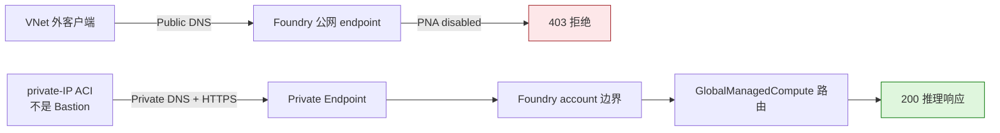

# Microsoft Foundry Managed Compute：Private Endpoint 实测验证

[](https://learn.microsoft.com/azure/foundry/concepts/foundry-models-overview)
[](https://learn.microsoft.com/azure/foundry/how-to/configure-private-link)
[](evidence/connectivity-run.json)
[](https://github.com/david-xinyuwei/david-share/actions/workflows/managed-compute-private-endpoint-ci.yml)
[](LICENSE)

这个 Repo 使用专用 Foundry account 和真实代码调用，验证一个精确结论：同一个
`GlobalManagedCompute` deployment 在公网开放时，公网和私网调用都返回 `200`；关闭
所属 **Foundry account** 的公网后，VNet 外调用返回 `403`，关联 VNet 内的 private-IP
ACI 仍返回 `200`；恢复保存的原始状态后，公网再次返回 `200`。这个结论**只覆盖客户端
到 endpoint 的入站路径**，不涉及 Pod 落点或出站流量。

这不是把 deployment 转换成另一种“private model”。模型 deployment 保持不变，
由父级 Foundry account 的 PNA 和 Private Endpoint 控制访问。可复现的隔离测试必须
使用专用的非生产 Foundry account；只在共享 account 下新建 project 仍会影响该
account 的全部子 project，因此不满足隔离要求。

> Author: 魏新宇 (Xinyu Wei)

[English](README.md) | [中文](README-CN.md)

[实测结果](#实测结果) · [产品证据](#产品证据) · [快速上手](#快速上手) · [证据](#证据) · [官方来源](#官方来源)

---

## 配置归属

| 配置项 | 配置位置 | 责任角色 | 最低权限 | 验收点 |
|---|---|---|---|---|
| Managed Compute deployment | Foundry project | 模型平台负责人 | Foundry project 模型部署权限 | Deployment 为 `Succeeded` |
| 公网访问 | 所属 Foundry account | Foundry 资源负责人 | 该资源的 Contributor | 保存原始 PNA 状态；每次修改后回读目标状态 |
| Private Endpoint 连接 | 客户 VNet + 所属 Foundry 资源 | 网络负责人和 Foundry 资源负责人 | Network Contributor + Contributor | 连接为 `Approved` 且 `Succeeded` |
| Private DNS zone 与 VNet link | 客户 Azure 订阅 | DNS/网络负责人 | Private DNS Zone Contributor 或等价权限 | 业务客户端解析到私有地址 |
| 客户端路由、VPN 或 ExpressRoute | 客户网络 | 企业网络负责人 | 按组织网络规范 | TCP 443 到达 Private Endpoint |
| 私网探测 runner | 关联 VNet 的业务 subnet | 应用/网络负责人 | 能运行 Python，并取得已批准推理身份的 Token | 私网 DNS、TCP 443 和有效 Chat Completions `200` 均通过；临时 runner 有明确清理责任人 |
| 推理调用身份 | Entra ID 和 Foundry 数据面 RBAC | 身份负责人 | 调用实测 deployment 的 Chat Completions 权限 | 同一 principal 在网络策略切换前后均能返回有效 completion |

关键操作点是：网络配置位于**所属 Foundry account 边界**，不在单个 Managed
Compute deployment 创建窗口里。

## 这个 Repo 验证了什么

| 能力 | 实测观测 | 证据 |
|---|---|---|
| 实测对象确为 Global Managed Compute | 专用 run 的 Foundry 页面显示 `qwen--qwen3-32b`、`GlobalManagedCompute`、`Succeeded` 和 `H100_80GB` | [脱敏字段截图](images/product-ui/deployment-facts.png) |
| 所属资源的公网策略覆盖 Managed Compute 路由 | VNet 外使用已通过 Entra 认证的请求调用，返回 `403 Public access is disabled` | [运行证据](evidence/connectivity-run.json) |
| Private Endpoint 承载真实推理请求 | 同一份 probe 源码在 private-IP ACI 中执行，关闭公网前后都解析到私网并返回 Chat Completions `200` | [自动生成的代码记录](evidence/cli-transcript.txt) |
| 测试后网络状态已恢复 | 公网恢复后推理再次返回 `200`，两个私网 ACI probe 都以退出码 `0` 结束 | [测试后状态](evidence/raw/post-test-state.json) |
| 资源和计费边界 | 未获得清理授权，因此临时资源仍保留；Managed Compute 保留期间继续计费 | [测试后状态](evidence/raw/post-test-state.json) |

**这不能证明托管 Pod 被注入客户 VNet。**本次也没有证明 Managed Compute 出站流量
经过客户 VNet、Prompt/Completion 零留存，或者一次 Preview 实测已经达到生产 SLA。
正式结论只覆盖客户端进入推理 endpoint 的入站私网隔离。

## 实测结果

测试期间固定 Foundry 资源、deployment、endpoint、Entra identity 和 request
payload，只改变客户端网络路径和所属 Foundry 资源的公网访问设置。

Run ID：`managed-compute-private-link-dedicated-20260831` · 日期：2026-08-31 · 范围：
单次入站连通性差分测试。

| 场景 | DNS | 已通过 Entra 认证的调用结果 | 状态 | 证据 |
|---|---|---:|---|---|
| VNet 外客户端，公网开放 | 公网地址 | `200`：真实的 Chat Completions 响应 | PASS | [`public-baseline.json`](evidence/raw/public-baseline.json) |
| 关联 VNet 内的 private-IP ACI，公网开放 | 私有地址 | `200`：关闭公网前的安全探测 | PASS | [`private-preflight.json`](evidence/raw/private-preflight.json) |
| VNet 外客户端，公网关闭 | 公网地址 | `403`：公网访问已关闭 | PASS | [`public-blocked.json`](evidence/raw/public-blocked.json) |
| 关联 VNet 内的 private-IP ACI，公网关闭 | 私有地址 | `200`：真实的 Chat Completions 响应 | PASS | [`private-success.json`](evidence/raw/private-success.json) |
| VNet 外客户端，公网恢复 | 公网地址 | `200`：同一模型 endpoint 已响应；未保留 choice 内容 | PASS | [`public-restored.json`](evidence/raw/public-restored.json) |

私网 runner 使用 Azure Container Instances，在关联 VNet 的业务 subnet 中分配私有
IP，并通过 Private Endpoint 直接发出 HTTPS 请求；它**不是 Azure Bastion**。两个 ACI
probe 使用同一个 `probe_endpoint.py` 源码 hash，退出码均为 `0`。公开证据不保存生成
内容和解析后的 IP；Request ID 只保留 SHA-256 摘要。Probe 时间戳只证明执行顺序，
不代表延迟分布。

## 代码调用证据

本次专用 run 直接使用 Repo 中的 Python HTTPS probe 和 Microsoft Entra Token，实际
probe 输出已经保留。下面的 block 由
[`scripts/build_evidence.py`](scripts/build_evidence.py) 从已验证的 live observation
自动生成，便于直接阅读；它不是伪造的终端截图。
五个共同的 SHA-256 指纹把每个阶段绑定到实测 probe 源码、Entra subject、endpoint、
deployment 和序列化请求，同时不公开这些原值。Measured source 指纹与当前 executable
hash 分开保存，因为本次 run 之后又加入了 ACI create-only、原生指纹和 ETag restore guard。

<!-- BEGIN GENERATED CLI EVIDENCE -->
```text
CODE_PATH_EVIDENCE
RUN_ID=managed-compute-private-link-dedicated-20260831
DATE_UTC=2026-08-31
EVIDENCE_CLASS=derived-sanitized-view-of-live-code-observations
ORIGINAL_TERMINAL_CAPTURE=false
CLIENT=Python HTTPS client with Microsoft Entra bearer token
ACTUAL_PROBE_OUTPUT_RETAINED=true
REPRODUCTION_ENTRYPOINT=scripts/probe_endpoint.py
MODEL_DEPLOYMENT_CHANGED=false
PROBE_SOURCE_SHA256=d2d99524ff6a3fd5b37789d0557b9bb0af8155ccffa8fb75c1e382de799ea7f6
IDENTITY_SHA256=887146420b45005bf903fd183eda936b0e3fee00aa6be67a91a47f0546b54e6c
ENDPOINT_SHA256=5e8cfa4be4c9aa5803d351815eceacece53477c04e26695a928e80c93935246b
DEPLOYMENT_SHA256=4d87fdbcba1fe6671069062752306ee4957a40c6ac281803b423c80ddd682776
REQUEST_SHA256=c4c06fac9fe6ed09d3f3117ca538e1f1d9e8be12330d5ef9b36284b6e4120804
NETWORK_CONTROL=parent Foundry account PNA plus Private Endpoint
PRIVATE_RUNNER=private-IP Azure Container Instances in a linked VNet workload subnet (not Bastion)
ENDPOINT=https://<foundry-account>.services.ai.azure.com/openai/v1/chat/completions
DEPLOYMENT=<managed-compute-deployment>
PROMPT="Reply with exactly OK."
MAX_TOKENS=4
TEMPERATURE=0

REPRODUCTION_CLI=python scripts/probe_endpoint.py --endpoint <endpoint> --deployment <deployment> --expect-dns <public|private> --expect-http <status> --prompt "Reply with exactly OK." --max-tokens 4

[1/5] OUTSIDE_VNET_PNA_ENABLED_BASELINE
OBSERVED_AT_UTC=2026-08-31T05:52:07.510094+00:00
DNS_CLASS=public
HTTP_STATUS=200
RESPONSE_OBJECT=chat.completion
RESPONSE_MODEL=qwen--qwen3-32b
RESULT=PASS
SOURCE=evidence/raw/public-baseline.json

[2/5] INSIDE_LINKED_VNET_PNA_ENABLED_PREFLIGHT
OBSERVED_AT_UTC=2026-08-31T05:53:43.009747+00:00
DNS_CLASS=private
HTTP_STATUS=200
RESPONSE_OBJECT=chat.completion
RUNNER_EXIT_CODE=0
PROBE_SOURCE_SHA256=d2d99524ff6a3fd5b37789d0557b9bb0af8155ccffa8fb75c1e382de799ea7f6
RESULT=PASS
SOURCE=evidence/raw/private-preflight.json

[3/5] OUTSIDE_VNET_PNA_DISABLED
OBSERVED_AT_UTC=2026-08-31T06:06:03.530809+00:00
DNS_CLASS=public
HTTP_STATUS=403
ERROR_CATEGORY=public-access-disabled
NETWORK_POLICY_BLOCKED=true
REQUEST_ID_SHA256=0bca43fc944a7328def2b961d977e09767bce02d11a2ea8322a1d6ec3594217b
RESULT=PASS
SOURCE=evidence/raw/public-blocked.json

[4/5] INSIDE_LINKED_VNET_PNA_DISABLED
OBSERVED_AT_UTC=2026-08-31T06:07:39.938843+00:00
DNS_CLASS=private
HTTP_STATUS=200
RESPONSE_OBJECT=chat.completion
RESPONSE_MODEL=qwen--qwen3-32b
PROBE_SOURCE_SHA256=d2d99524ff6a3fd5b37789d0557b9bb0af8155ccffa8fb75c1e382de799ea7f6
TOKENS=prompt:13 completion:4 total:17
RUNNER_EXIT_CODE=0
REQUEST_ID_SHA256=eb511b575cc023ba02e44edcd13e61d578bac32b120f7029eac249dc7f776065
RESULT=PASS
SOURCE=evidence/raw/private-success.json

[5/5] OUTSIDE_VNET_PNA_RESTORED
OBSERVED_AT_UTC=2026-08-31T06:12:14.739435+00:00
DNS_CLASS=public
HTTP_STATUS=200
RESPONSE_MODEL=qwen--qwen3-32b
REQUEST_ID_SHA256=50f4ebab5abb8a5f5c735b8b67ee09b1a301e3edb1cc0ce5cf9d29488c40a0c2
RESULT=PASS
SOURCE=evidence/raw/public-restored.json
```
<!-- END GENERATED CLI EVIDENCE -->

## 产品证据

### 实测对象是 Managed Compute


*Run `managed-compute-private-link-dedicated-20260831`，2026-08-31。四个字段级 crop 保留模型、deployment type、provisioning state 和 accelerator；account、project、deployment、endpoint、identity、tenant 与 subscription 均已移除。UI 用于确认实测对象，自动生成的代码记录用于证明网络行为。*

### 流量路径



*原创解释图，依据本次差分实测和 Foundry Private Link 官方文档。图中只描述客户端入站路径，不描述 Pod 落点。*

## 可执行资产

| 路径 | 契约 |
|---|---|
| [`infra/main.bicep`](infra/main.bicep) | 将已有 PE subnet 接入 group ID=`account`；可创建并链接三套 Foundry Private DNS zone，也可接收完整的客户已有 zone ID object |
| [`scripts/probe_endpoint.py`](scripts/probe_endpoint.py) | 用同一请求断言 DNS 类型和 HTTP 状态，不打印 Token |
| [`scripts/submit_private_aci_probe.py`](scripts/submit_private_aci_probe.py) | 在 private-IP ACI 中运行完全相同的 probe 源码；Entra Token 只通过 ARM `secureValue` 注入；绝不更新同名已有资源 |
| [`scripts/set_public_network_access.py`](scripts/set_public_network_access.py) | 关闭公网前必须检测到 Approved PE 和同次私网 200 证据；ETag precondition 会拒绝并发 account 变更 |
| [`tests/`](tests/) | 执行 CLI 入口、响应语义、零 PATCH 拒绝矩阵、原值恢复、raw evidence mutation 和 Rule Catalog mutation |
| [`evidence/`](evidence/) | 脱敏运行合同、实测结果、官方来源锁和 Level 5 gate 结果 |

## 快速上手

以下命令均使用 **Bash**。账号和部署命令在安装了 Azure CLI 的控制端执行；公网探针
在关联 VNet 外执行；私网探针在独立业务 subnet 中已批准的 runner 上执行。每个探针
runner 都需要取得本 Repo。私网 runner 需要 Python 3.11+、关联 VNet 的 DNS、到
endpoint 的出站 TCP 443，以及已登录的 Azure CLI，或通过安全进程环境传入
`AZURE_ACCESS_TOKEN`。所有探针必须使用同一个 Entra principal、endpoint、
deployment、prompt 和 token 上限。

Azure 前置条件：专用的非生产 Foundry account（其全部子 project 都是可处置测试资产）、
公有云、所属 Foundry account 的 Contributor、目标 VNet/subnet 的
Network Contributor，以及创建 Private DNS zone 所需的 Private DNS Zone Contributor
或等价权限。Private Endpoint subnet 必须预先存在并允许 Private Endpoint。应用/网络
负责人负责业务 runner 的生命周期和清理。

```bash
git clone --filter=blob:none --sparse https://github.com/david-xinyuwei/david-share.git
git -C david-share sparse-checkout set Deep-Learning/Managed-Compute-Private-Endpoint
cd david-share/Deep-Learning/Managed-Compute-Private-Endpoint
python -m unittest discover -s tests -v
```

先锁定 Azure 账号。这两条命令不会修改资源：

```bash
az account set --subscription "<subscription-id>"
az account show --query "{subscription:id,tenant:tenantId,user:user.name}" --output json
```

设置所属 Foundry account 和已有 Private Endpoint subnet 的资源 ID。模板从 subnet ID
派生所属 VNet，从结构上避免 PE 与 DNS link 指向两个 VNet。先做 what-if：

```bash
FOUNDRY_ACCOUNT_ID="/subscriptions/<subscription-id>/resourceGroups/<resource-group>/providers/Microsoft.CognitiveServices/accounts/<foundry-account>"
PE_SUBNET_ID="/subscriptions/<subscription-id>/resourceGroups/<network-resource-group>/providers/Microsoft.Network/virtualNetworks/<vnet>/subnets/<private-endpoint-subnet>"
VNET_ID="${PE_SUBNET_ID%/subnets/*}"
CURRENT_SUBSCRIPTION_ID="$(az account show --query id --output tsv)"
PE_SUBSCRIPTION_ID="${PE_SUBNET_ID#/subscriptions/}"
PE_SUBSCRIPTION_ID="${PE_SUBSCRIPTION_ID%%/*}"
PRIVATE_ENDPOINT_LOCATION="$(az network vnet show --ids "$VNET_ID" --query location --output tsv)"
test "$PE_SUBSCRIPTION_ID" = "$CURRENT_SUBSCRIPTION_ID" || { echo "Private Endpoint and VNet must use the same subscription." >&2; exit 1; }
test -n "$PRIVATE_ENDPOINT_LOCATION" || { echo "Unable to read the VNet region." >&2; exit 1; }

az deployment group what-if \
  --resource-group "<resource-group>" \
  --template-file infra/main.bicep \
  --parameters \
      foundryAccountResourceId="$FOUNDRY_ACCOUNT_ID" \
      privateEndpointSubnetResourceId="$PE_SUBNET_ID" \
      privateEndpointLocation="$PRIVATE_ENDPOINT_LOCATION"
```

确认 what-if 结果后，再创建 Private Endpoint 和 Foundry 支持的 Private DNS zone。
下面的默认模式由本次 deployment 管理三套 zone 及其 VNet link：

```bash
az deployment group create \
  --resource-group "<resource-group>" \
  --template-file infra/main.bicep \
  --parameters \
      foundryAccountResourceId="$FOUNDRY_ACCOUNT_ID" \
      privateEndpointSubnetResourceId="$PE_SUBNET_ID" \
      privateEndpointLocation="$PRIVATE_ENDPOINT_LOCATION"
```

若企业使用 central DNS，应传入完整的 `existingPrivateDnsZoneResourceIds` typed
object，包含 `cognitiveservices`、`openai` 和 `servicesAi` 三个 key。这个模式不会
创建 zone 或 VNet link；DNS 负责人必须预先完成 zone link 或 custom DNS forwarding，
并以私网 probe 作为验收。详见[完整流程](docs/reproduction.md#central-dns-mode)。

先从 VNet 内证明私网 DNS 和推理可用，再关闭公网：

> 这个 pre-disable `200` 既是 fail-closed 安全门，也是五阶段实测的第 2 阶段。

```bash
python scripts/probe_endpoint.py \
  --endpoint "https://<foundry-account>.services.ai.azure.com/openai/v1/chat/completions" \
  --deployment "<managed-compute-deployment>" \
  --expect-dns private \
  --expect-http 200 \
  --prompt "Reply with exactly OK." \
  --max-tokens 4 \
  --output private-probe.json
```

私网通过后，使用带保护的脚本关闭公网，并保存精确原值：

```bash
python scripts/set_public_network_access.py \
  --subscription-id "<subscription-id>" \
  --resource-group "<resource-group>" \
  --account-name "<foundry-account>" \
  --state Disabled \
  --confirm-dedicated-test-account \
  --private-probe-evidence private-probe.json \
  --save-prior-state pna-before.json
```

`pna-before.json` 只保留在受控的操作端，不要提交或手工修改。只有 Azure 回读确认
`Disabled` 后，脚本才把 receipt 标为 `applied`；receipt 不完整或测试期间 PNA 被其他
操作修改时，restore 会拒绝执行。Receipt 保存 disable 前后的 account ETag，两次 PATCH
都使用 `If-Match`。这个文件用于防误操作，不是授权边界；最终权限仍以 Azure RBAC 为准。

从关联 VNet 外证明已认证公网请求由网络策略明确拦截：

```bash
python scripts/probe_endpoint.py \
  --endpoint "https://<foundry-account>.services.ai.azure.com/openai/v1/chat/completions" \
  --deployment "<managed-compute-deployment>" \
  --expect-dns public \
  --expect-http 403 \
  --prompt "Reply with exactly OK." \
  --max-tokens 4 \
  --output public-blocked-probe.json
```

PNA 关闭后，再从关联 VNet 内的业务 runner 执行同一个请求：

```bash
python scripts/probe_endpoint.py \
  --endpoint "https://<foundry-account>.services.ai.azure.com/openai/v1/chat/completions" \
  --deployment "<managed-compute-deployment>" \
  --expect-dns private \
  --expect-http 200 \
  --prompt "Reply with exactly OK." \
  --max-tokens 4 \
  --output private-after-disable-probe.json
```

恢复测试前保存的原值；不要把目标值硬编码为 `Enabled`：

```bash
python scripts/set_public_network_access.py \
  --subscription-id "<subscription-id>" \
  --resource-group "<resource-group>" \
  --account-name "<foundry-account>" \
  --restore-state-from pna-before.json
```

如果 `pna-before.json` 中记录的是 `priorState: Enabled`，用同一个请求证明公网恢复：

```bash
python scripts/probe_endpoint.py \
  --endpoint "https://<foundry-account>.services.ai.azure.com/openai/v1/chat/completions" \
  --deployment "<managed-compute-deployment>" \
  --expect-dns public \
  --expect-http 200 \
  --prompt "Reply with exactly OK." \
  --max-tokens 4 \
  --output public-restored-probe.json
```

完成条件：所属 Foundry account 回到保存的原始 PNA 状态。若原值为 `Enabled`，最后
一次公网探针还必须返回有效 Chat Completions `200`；若原值为 `Disabled`，私网路径
继续返回 `200`，公网继续被拦截。完整验证与清理顺序见
[`docs/reproduction.md`](docs/reproduction.md)。

## 证据

| 资产 | 作用 |
|---|---|
| [`evidence/connectivity-run.json`](evidence/connectivity-run.json) | 脱敏控制面与公网/私网数据面观测 |
| [`evidence/cli-transcript.txt`](evidence/cli-transcript.txt) | 从已认证 Python 200/200/403/200/200 观测自动生成的直读证据 |
| [`evidence/raw/`](evidence/raw/) | 生成 connectivity 结果所使用的脱敏源观测 |
| [`evidence/run-contract.json`](evidence/run-contract.json) | 冻结的问题、验收条件和唯一改变变量 |
| [`evidence/provenance.json`](evidence/provenance.json) | 公开/私有证据边界、时间口径、runner 方式和资源保留状态 |
| [`evidence/ui-evidence.json`](evidence/ui-evidence.json) | 图片 hash、脱敏项和每张图的声明边界 |
| [`evidence/source-lock.json`](evidence/source-lock.json) | 官方 URL 和不可变文档 commit |
| [`evidence/rule-results.json`](evidence/rule-results.json) | 自动生成的 Level 5 逐规则结果 |

`evidence/raw/` 保存的是最早一层**可公开的脱敏观测**，不是 Azure 原始日志的逐字节
副本。Hash 和原生 gate 能发现 Repo 内部漂移，但不能独立认证未公开的私有原始证据；
这个限制已写入 provenance 记录。

## 官方来源

- [配置 Microsoft Foundry 网络隔离](https://learn.microsoft.com/azure/foundry/how-to/configure-private-link)
- [Microsoft Foundry Models 概览](https://learn.microsoft.com/azure/foundry/concepts/foundry-models-overview)
- [使用 Azure CLI 创建 Private Endpoint](https://learn.microsoft.com/azure/private-link/create-private-endpoint-cli)

当前公开 Managed Compute 部署指南明确标为 classic-only。因此本 Repo 不把旧的
managed online endpoint 行为外推到新的 `GlobalManagedCompute`；核心结论来自
2026-08-31 的真实差分测试。
