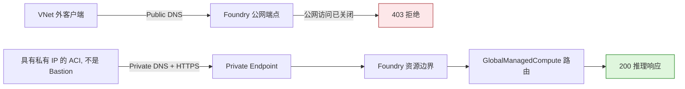

# Microsoft Foundry Managed Compute：Private Endpoint 实测验证

[](https://learn.microsoft.com/azure/foundry/concepts/foundry-models-overview)
[](https://learn.microsoft.com/azure/foundry/how-to/configure-private-link)
[](evidence/connectivity-run.json)
[](https://github.com/david-xinyuwei/david-share/actions/workflows/managed-compute-private-endpoint-ci.yml)
[](LICENSE)

本仓库只回答一个问题：关闭所属 Foundry 资源的 public network access（公网访问）后，
业务客户端是否还能通过 Private Endpoint（私有端点）调用
`GlobalManagedCompute` 模型部署？在一次独立环境实测中，VNet 外的调用从 `200` 变为
`403`，VNet 内的调用保持 `200`；恢复原值后，VNet 外的调用重新返回 `200`。

**结论边界：**本次实测仅验证客户端到推理端点的入站网络路径；并不证明 Managed Compute
托管 Pod 位于客户 VNet，也不证明其出站流量经过客户 VNet；同时不证明 Prompt 或
Completion 零留存，也不证明该 Preview 能力已达到生产要求。

> Author: 魏新宇 (Xinyu Wei)

[English](README.md) | [中文](README-CN.md)

[从这里开始](#从这里开始) · [五阶段实测](#五阶段实测) · [验证原理](#验证原理) · [复现步骤](#复现步骤) · [证据](#证据)

---

## 从这里开始

| 目标 | 入口 |
|---|---|
| 快速了解结论与证据 | [五阶段实测](#五阶段实测)和[证据](#证据) |
| 在本地检查代码与证据 | [测试](#测试) |
| 规划生产环境网络 | [生产环境建议配置](#生产环境建议配置) |
| 在客户环境复现 | [复现步骤](#复现步骤) |

运行脚本要求 Python 3.11+，只使用 Python 标准库。线上复现还需要 Azure CLI，以及一个能
调用模型部署的凭据：Foundry 资源的 API key，或者 Entra 身份，二者任选其一。

执行顺序不能颠倒：先证明私网路径可用，再关闭公网。否则一旦 DNS 或路由配错，操作人员
自己也会被锁在网络之外。

| 阶段 | 客户端位置 | 公网访问 | 必须看到的结果 |
|---:|---|---|---|
| 1 | 关联 VNet 外 | 开启 | Chat Completions 请求返回 `200` |
| 2 | 关联 VNet 内 | 开启 | DNS 解析到私有地址，并返回 `200` |
| 3 | 关联 VNet 外 | 关闭 | 返回 `403 Public access is disabled` |
| 4 | 关联 VNet 内 | 关闭 | DNS 仍解析到私有地址，并返回 `200` |
| 5 | 关联 VNet 外 | 恢复原值 | 若原值为 `Enabled`，请求重新返回 `200` |

完成条件：所属 Foundry 资源回到测试前保存的公网访问状态，五个阶段的公网与私网结果全部
符合预期。

## 平台与客户各负责什么

| Microsoft Foundry 与 Azure 提供 | 客户负责并验收 |
|---|---|
| `GlobalManagedCompute` 模型部署及其所属 Foundry 资源 | 独立的非生产 Foundry 资源；其下所有项目都必须是可处置的测试资产 |
| 所属资源的公网访问设置 | Foundry 资源的 Contributor 权限；修改前保存原值，修改后回读确认 |
| 连接组为 `account` 的 Private Endpoint | Private Endpoint 专用子网、Network Contributor 权限，以及 `Approved`、`Succeeded` 的连接状态 |
| Private DNS Zone 集成 | 所需的私有 DNS 区域、VNet 链接或 DNS 转发，并确认客户端解析到私有地址 |
| 数据面认证：API key（`api-key` 请求头）或 Entra 令牌（`Authorization: Bearer`） | 五个阶段始终使用同一个凭据；如果资源设置了 `disableLocalAuth=true`，就只能用 Entra |
| Azure Container Instances（Azure 容器实例，ACI），如果用它执行探测 | 已委派的工作负载子网、通过 ARM `secureValue` 传入凭据、保存证据，并指定清理负责人 |

**收益：**关闭公网后，模型 URL 和部署本身都不用改。**代价：**每个客户端都要能路由到
VNet，而且 DNS 必须把模型 URL 解析成 Private Endpoint 的私有地址。网络控制是所属
Foundry 资源的事，不在单个 Managed Compute 模型部署上。

## 本仓库证明了什么

| 能力 | 实测观测 | 证据 |
|---|---|---|
| 实测对象确为 Global Managed Compute | Foundry 页面显示 `qwen--qwen3-32b`、`GlobalManagedCompute`、`Succeeded` 和 `H100_80GB` | [脱敏字段截图](images/product-ui/deployment-facts.png) |
| 公网访问设置作用于发往 Managed Compute 模型部署的请求 | VNet 外的已认证请求返回 `403 Public access is disabled`；这只证明请求在 Foundry 资源边界被拒绝，不能定位路由内部的拒绝点 | [运行证据](evidence/connectivity-run.json) |
| Private Endpoint 承载真实推理请求 | 同一份探针源码在具有私有 IP 的 ACI 中执行；关闭公网前后，DNS 都解析到 RFC 1918 私有地址，Chat Completions 都返回 `200`。Private Endpoint 的使用仅凭私网 DNS 解析结果推断，尚未与其网卡地址逐项比对 | [自动生成的调用记录](evidence/cli-transcript.txt) |
| 测试后网络状态已恢复 | 恢复公网后，推理调用重新返回 `200`；两个 ACI 探针均以退出码 `0` 结束 | [测试后状态](evidence/raw/post-test-state.json) |
| 资源和计费边界 | 未获得清理授权，因此临时资源仍然保留；Managed Compute 保留期间继续产生费用 | [测试后状态](evidence/raw/post-test-state.json) |

证据只覆盖所属 Foundry 资源的 `*.services.ai.azure.com` 路由，所以看不出
Managed Compute 是否还暴露其他入站主机名。

## 五阶段实测

测试期间固定 Foundry 资源、模型部署、推理端点、凭据和请求内容，只改变客户端的网络位置
以及所属 Foundry 资源的公网访问设置。

本次实测用的是 Entra 令牌，原因是测试资源关闭了 key 访问（`disableLocalAuth=true`）。
Foundry 资源本身两种认证都支持：`api-key` 请求头传 API key，或者 `Authorization: Bearer`
传 Entra 令牌。脚本两种都支持。公网访问是资源级别的网络设置，跟客户端用哪种凭据无关；
只是本次只实测了 Entra 这一条。

运行 ID：`managed-compute-private-link-dedicated-20260831` · 日期：2026-08-31 · 范围：
单次入站连通性差分测试。

| 场景 | DNS | 已认证调用结果 | 状态 | 证据 |
|---|---|---:|---|---|
| VNet 外客户端，公网开放 | 公网地址 | `200`：真实的 Chat Completions 响应 | PASS | [`public-baseline.json`](evidence/raw/public-baseline.json) |
| 关联 VNet 内具有私有 IP 的 ACI，公网开放 | 私有地址 | `200`：关闭公网前的安全探测 | PASS | [`private-preflight.json`](evidence/raw/private-preflight.json) |
| VNet 外客户端，公网关闭 | 公网地址 | `403`：公网访问已关闭 | PASS | [`public-blocked.json`](evidence/raw/public-blocked.json) |
| 关联 VNet 内具有私有 IP 的 ACI，公网关闭 | 私有地址 | `200`：真实的 Chat Completions 响应 | PASS | [`private-success.json`](evidence/raw/private-success.json) |
| VNet 外客户端，公网恢复 | 公网地址 | `200`：同一推理端点已响应；未保留生成内容 | PASS | [`public-restored.json`](evidence/raw/public-restored.json) |

私网探测使用 ACI，在关联 VNet 的独立工作负载子网中分配私有 IP，再向 DNS 解析出的
私有地址发送 HTTPS 请求；它**不是 Azure Bastion**。两个 ACI 探针使用同一份
`probe_endpoint.py` 源码，退出码均为 `0`。公开证据不保存生成内容和解析后的 IP；
Request ID 只保留 SHA-256 摘要。探针时间戳只证明执行顺序，不代表延迟分布。

[自动生成的调用记录](evidence/cli-transcript.txt)是五个阶段的唯一机器直读入口。
[证据来源记录](evidence/provenance.json)说明哪些字段来自探针、哪些指纹在运行结束后派生，
以及如何取回 `762b6978` 提交中实际执行的探针源码。

## 产品界面与流量路径

### 实测对象


*本地实测，运行 ID `managed-compute-private-link-dedicated-20260831`，2026-08-31。请检查
模型名称、部署类型、预配状态和加速器。截图已移除资源、项目、部署、端点、身份、tenant
与 subscription 标识；[图片证据记录](evidence/ui-evidence.json)保存 SHA-256 和声明边界。*

### 流量路径



*原创说明图，依据本次差分实测和
[Microsoft Foundry 网络隔离文档](https://learn.microsoft.com/azure/foundry/how-to/configure-private-link)。
图中只表示客户端入站路径；证据只能把 `403` 定位到 Foundry 资源边界。*

## 可执行资产

| 路径 | 契约 |
|---|---|
| [`infra/main.bicep`](infra/main.bicep) | 把现有 Private Endpoint 子网连接到 `account` 组；可以创建并链接三个 Foundry Private DNS Zone，也可以使用客户已有的完整区域 ID 对象 |
| [`scripts/probe_endpoint.py`](scripts/probe_endpoint.py) | 用 API key 或 Entra 令牌发送同一请求，检查 DNS 类型和 HTTP 状态，不输出凭据 |
| [`scripts/submit_private_aci_probe.py`](scripts/submit_private_aci_probe.py) | 在具有私有 IP 的 ACI 中运行同一份探针源码；容器对实际执行的字节计算 SHA-256；API key 或 Entra 令牌只通过 ARM `secureValue` 传入；不更新同名资源 |
| [`scripts/set_public_network_access.py`](scripts/set_public_network_access.py) | 关闭公网前，必须存在已批准的 Private Endpoint 和同次私网 `200` 证据；ETag 前置条件用于拒绝并发变更（实测后新增，已有单元测试、没有实测） |
| [`scripts/azure_translator_backtranslate.py`](scripts/azure_translator_backtranslate.py) | 调用 Azure AI Translator 执行中文到英文回译；key 只从进程环境读取，`--check` 无需凭据即可校验已提交证据 |
| [`tests/`](tests/) | 覆盖命令入口、响应语义、零 PATCH 拒绝路径、原值恢复、证据变异和 Level 5 规则变异 |
| [`evidence/`](evidence/) | 保存脱敏运行合同、实测结果、官方来源锁、图片证据账本和 Level 5 规则结果 |

## 验证原理

| 层次 | 实际实现 | 通过条件 | 证据边界 |
|---|---|---|---|
| DNS | [`resolve_addresses`](scripts/probe_endpoint.py) 解析端点，[`classify_addresses`](scripts/probe_endpoint.py) 把全部地址分为公网、私网或混合 | VNet 内客户端输出 `dnsClass=private` | 已保留证据未把解析地址与 Private Endpoint 网卡地址逐项对账 |
| 数据面 | [`run_probe`](scripts/probe_endpoint.py) 用 API key 或 Entra 令牌发送一次 Chat Completions 请求 | `200` 必须包含 `object=chat.completion` 且至少有一个 choice；`403` 必须属于公网已关闭错误 | 网络策略 `403` 不能用 RBAC `403` 代替 |
| 管理面 | [`change_public_network_access`](scripts/set_public_network_access.py) 保存原值、修改、回读并恢复所属资源的公网访问设置 | 回读值等于目标值，资源状态为 `Succeeded` | ETag 保护在实测后加入，目前只有单元测试、没有实测 |

### 客户如何访问 Private Endpoint

关键不在于客户端是 VM 还是容器，而在于两个条件是否同时满足：路由能到 Private Endpoint
所在的 VNet；DNS 能把同一个模型 URL 解析成 Private Endpoint 的私有地址。

| 客户端位置 | 网络路径 | DNS 要求 |
|---|---|---|
| 同一或对等 VNet 内的 VM、ACI、Kubernetes 工作负载 | VNet 内路由或 VNet peering | 把同一组 Foundry Private DNS Zone 链接到每个客户端 VNet，或者统一走企业 DNS 解析器 |
| 本地数据中心应用 | ExpressRoute 或站点到站点 VPN | 把 Foundry 服务域名条件转发到 Azure DNS Private Resolver 的入站端点，或 Azure 内的 DNS 转发器 |
| 开发人员电脑 | 点到站点 VPN，或通过 Azure Bastion 登录 VNet 内的 VM | 使用 VPN/解析器提供的 DNS；Bastion 只是开发时的一种方式，不是必需组件 |

依据：[Azure Private Endpoint DNS 集成场景](https://learn.microsoft.com/azure/private-link/private-endpoint-dns-integration)
和 [Azure DNS Private Resolver](https://learn.microsoft.com/azure/dns/dns-private-resolver-overview)。
本仓库里的 ACI 只是一次性的验证执行端，不代表生产客户端应该长什么样。

### 生产环境建议配置

下面是根据官方文档和本次差分实测给出的建议，这套配置本身没有在本次实测中跑过。

| 层次 | 建议配置 | 原因 |
|---|---|---|
| Foundry 资源 | 保持 `publicNetworkAccess=Disabled`；不要把「选定网络」的 IP 白名单当作生产访问路径 | 实测中的 `403` 就是这个设置产生的；IP 白名单等于重新开了一条公网路径 |
| Private Endpoint 位置 | 采用 hub-spoke 拓扑，在 hub VNet（或共享服务 spoke）里为每个 Foundry 资源建一个 Private Endpoint | 所有对等的 spoke 都能访问到；除非隔离策略要求，不必每个应用单独建 |
| 应用 VNet | 通过 VNet peering 接到 hub；生产客户端就是已经在 spoke 里的工作负载（AKS、启用 VNet 集成的 App Service、Functions、VM） | peering 提供路由，客户端是什么类型不重要 |
| Azure 内部 DNS | 把三个 Foundry Private DNS Zone（`privatelink.cognitiveservices.azure.com`、`privatelink.openai.azure.com`、`privatelink.services.ai.azure.com`）链接到 hub；spoke 统一指向中央 DNS（Azure DNS Private Resolver 入站端点或自建 DNS 转发器），或者把同一组区域也链接到每个 spoke | 每个客户端都必须把模型 URL 解析成 Private Endpoint 地址 |
| 本地数据中心 | 通过 ExpressRoute 私有对等或站点到站点 VPN 接入 hub；把这三个区域条件转发到 Private Resolver 入站端点 | 本地 DNS 服务器看不到 Azure Private DNS Zone |
| 开发与运维人员 | 点到站点 VPN 接入 hub，或通过 Azure Bastion 登录跳板 VM | Bastion 给人用，不承载应用流量 |
| 凭据 | API key 放在 Azure Key Vault 并定期轮换，或者用托管身份加推理角色；按团队的密钥管理策略选 | 推理端点两种都支持，网络隔离效果与选哪种无关 |
| 变更控制 | 每次改网络或 DNS 之前和之后，都从 spoke 跑一次 [`probe_endpoint.py`](scripts/probe_endpoint.py) | 先做第 2 阶段再做第 3 阶段，才不会把自己锁在外面 |

Azure Container Instances 和 Azure Bastion 在本仓库里只是验证工具和运维入口，都不是
生产数据路径。参考：
[Hub-spoke 网络拓扑](https://learn.microsoft.com/azure/architecture/networking/architecture/hub-spoke)、
[Private Endpoint DNS 集成](https://learn.microsoft.com/azure/private-link/private-endpoint-dns-integration)、
[Azure DNS Private Resolver](https://learn.microsoft.com/azure/dns/dns-private-resolver-overview)、
[Azure OpenAI 认证方式](https://learn.microsoft.com/azure/foundry/openai/reference#authentication)、
[关闭本地认证](https://learn.microsoft.com/azure/ai-services/disable-local-auth)。

### 常见误解

| 误解 | 代码和证据说明什么 |
|---|---|
| “Private Endpoint 会复制出一个私有模型。” | 模型部署和 URL 都不变；所属 Foundry 资源只是改变了哪条网络路径可以到达模型。 |
| “DNS 返回私有地址，说明 Managed Compute 的 Pod 在客户 VNet。” | 探针只证明客户端解析到私有地址并收到有效响应，说明不了 Pod 放在哪里。 |
| “只有 ACI 才能访问私网模型。” | ACI 只是本次实测的执行端。任何有私网路由、私网 DNS 和有效凭据（API key 或 Entra 身份）的客户端都能调用。 |

## 复现步骤

以下命令均使用 **Bash**。资源和部署命令在装有 Azure CLI 的控制端执行；公网探针在
关联 VNet 外执行；私网探针在独立工作负载子网中的已授权探测执行端上运行。每个探测执行端
都要取得本仓库。私网探测执行端需要 Python 3.11+、关联 VNet 的 DNS、到推理端点的 TCP 443
出站连接，以及通过进程环境传入的凭据：`AZURE_AI_API_KEY`（资源的 API key）或
`AZURE_ACCESS_TOKEN`（Entra 令牌）；两者都没有时，探针会调用 Azure CLI 获取令牌。
五个阶段必须使用同一个凭据、推理端点、模型部署、提示词和 token 上限。

Azure 前置条件：独立的非生产 Foundry 资源，其下所有项目都是可处置的测试资产；Azure
公有云；所属 Foundry 资源的 Contributor；目标 VNet 和子网的 Network Contributor；
如需创建 Private DNS Zone，还要具备 Private DNS Zone Contributor 或等价权限。
Private Endpoint 专用子网必须已存在。应用或网络负责人负责临时探测执行端的生命周期和清理。

```bash
git clone --filter=blob:none --sparse https://github.com/david-xinyuwei/david-share.git
git -C david-share sparse-checkout set Deep-Learning/Managed-Compute-Private-Endpoint
cd david-share/Deep-Learning/Managed-Compute-Private-Endpoint
```

先锁定 Azure 账号。以下命令不修改 Azure 资源：

```bash
az account set --subscription "<subscription-id>"
az account show --query "{subscription:id,tenant:tenantId,user:user.name}" --output json
```

设置所属 Foundry 资源和现有 Private Endpoint 子网的资源 ID。模板从子网 ID 派生 VNet，
避免 Private Endpoint 与 DNS 链接误指向不同 VNet。先运行 what-if 预览：

```bash
FOUNDRY_ACCOUNT_ID="/subscriptions/<subscription-id>/resourceGroups/<resource-group>/providers/Microsoft.CognitiveServices/accounts/<foundry-account>"
PE_SUBNET_ID="/subscriptions/<subscription-id>/resourceGroups/<network-resource-group>/providers/Microsoft.Network/virtualNetworks/<vnet>/subnets/<private-endpoint-subnet>"
VNET_ID="${PE_SUBNET_ID%/subnets/*}"
CURRENT_SUBSCRIPTION_ID="$(az account show --query id --output tsv)"
PE_SUBSCRIPTION_ID="${PE_SUBNET_ID#/subscriptions/}"
PE_SUBSCRIPTION_ID="${PE_SUBSCRIPTION_ID%%/*}"
PRIVATE_ENDPOINT_LOCATION="$(az network vnet show --ids "$VNET_ID" --query location --output tsv)"
test "$PE_SUBSCRIPTION_ID" = "$CURRENT_SUBSCRIPTION_ID" || { echo "Private Endpoint and VNet must use the same subscription." >&2; exit 1; }
test -n "$PRIVATE_ENDPOINT_LOCATION" || { echo "Unable to read the VNet region." >&2; exit 1; }

az deployment group what-if \
  --resource-group "<resource-group>" \
  --template-file infra/main.bicep \
  --parameters \
      foundryAccountResourceId="$FOUNDRY_ACCOUNT_ID" \
      privateEndpointSubnetResourceId="$PE_SUBNET_ID" \
      privateEndpointLocation="$PRIVATE_ENDPOINT_LOCATION"
```

确认 what-if 结果后，再创建 Private Endpoint 和 Foundry 所需的 Private DNS Zone。
默认模式由本次部署管理三个 DNS 区域及其 VNet 链接：

```bash
az deployment group create \
  --resource-group "<resource-group>" \
  --template-file infra/main.bicep \
  --parameters \
      foundryAccountResourceId="$FOUNDRY_ACCOUNT_ID" \
      privateEndpointSubnetResourceId="$PE_SUBNET_ID" \
      privateEndpointLocation="$PRIVATE_ENDPOINT_LOCATION"
```

如果企业统一管理 DNS，应将完整对象传给 `existingPrivateDnsZoneResourceIds`，其中应
包含 `cognitiveservices`、`openai` 和 `servicesAi`。此模式不会创建 Private DNS Zone 或
VNet 链接；DNS 负责人必须提前配置区域链接或自定义 DNS 转发，并以私网探针作为验收。
详见[完整流程](docs/reproduction.md#central-dns-mode)。

先从 VNet 内证明私网 DNS 和推理可用，再关闭公网：

> 关闭公网前的 `200` 既是防止失联的安全门，也是五阶段实测的第 2 阶段。

```bash
python scripts/probe_endpoint.py \
  --endpoint "https://<foundry-account>.services.ai.azure.com/openai/v1/chat/completions" \
  --deployment "<managed-compute-deployment>" \
  --expect-dns private \
  --expect-http 200 \
  --prompt "Reply with exactly OK." \
  --max-tokens 4 \
  --output private-probe.json
```

私网通过后，使用带保护的脚本关闭公网，并保存精确原值：

```bash
python scripts/set_public_network_access.py \
  --subscription-id "<subscription-id>" \
  --resource-group "<resource-group>" \
  --account-name "<foundry-account>" \
  --state Disabled \
  --confirm-dedicated-test-account \
  --private-probe-evidence private-probe.json \
  --save-prior-state pna-before.json
```

`pna-before.json` 是恢复记录，只保留在受控操作端，不要提交或手工修改。当前脚本只在
Azure 回读确认 `Disabled` 后才把记录标为 `applied`；它会保存关闭前后的资源 ETag，
两次 PATCH 都带 `If-Match`。记录不完整或 ETag 已变化时，脚本会拒绝恢复。
2026-08-31 的实测使用较早的 `762b6978` 版本，该版本保存和恢复原值时没有 ETag 前置
条件；当前 ETag 保护只有单元测试，没有实测。如果记录停在 `prepared`，或其他操作已经
改变资源 ETag，请使用[手工恢复](docs/reproduction.md#manual-restore)。该文件只用于防止
误操作，最终授权仍由 Azure RBAC 决定。

从关联 VNet 外证明已认证公网请求由网络策略明确拦截：

```bash
python scripts/probe_endpoint.py \
  --endpoint "https://<foundry-account>.services.ai.azure.com/openai/v1/chat/completions" \
  --deployment "<managed-compute-deployment>" \
  --expect-dns public \
  --expect-http 403 \
  --prompt "Reply with exactly OK." \
  --max-tokens 4 \
  --output public-blocked-probe.json
```

公网关闭后，再从关联 VNet 内的探测执行端发出同一个请求：

```bash
python scripts/probe_endpoint.py \
  --endpoint "https://<foundry-account>.services.ai.azure.com/openai/v1/chat/completions" \
  --deployment "<managed-compute-deployment>" \
  --expect-dns private \
  --expect-http 200 \
  --prompt "Reply with exactly OK." \
  --max-tokens 4 \
  --output private-after-disable-probe.json
```

恢复测试前保存的原值；不要把目标值硬编码为 `Enabled`：

```bash
python scripts/set_public_network_access.py \
  --subscription-id "<subscription-id>" \
  --resource-group "<resource-group>" \
  --account-name "<foundry-account>" \
  --restore-state-from pna-before.json
```

如果 `pna-before.json` 中记录的是 `priorState: Enabled`，用同一个请求证明公网恢复：

```bash
python scripts/probe_endpoint.py \
  --endpoint "https://<foundry-account>.services.ai.azure.com/openai/v1/chat/completions" \
  --deployment "<managed-compute-deployment>" \
  --expect-dns public \
  --expect-http 200 \
  --prompt "Reply with exactly OK." \
  --max-tokens 4 \
  --output public-restored-probe.json
```

完成条件：所属 Foundry 资源回到保存的原始公网访问状态。若原值为 `Enabled`，最后
一次公网探针还必须返回有效 Chat Completions `200`；若原值为 `Disabled`，私网路径
继续返回 `200`，公网继续被拦截。完整验证与清理顺序见
[`docs/reproduction.md`](docs/reproduction.md)。

## 测试

测试不需要 Azure 凭据、GPU 或线上推理端点。覆盖范围包括 URL 与 DNS 分类、认证响应
语义、ACI 仅创建、不覆盖、零 PATCH 拒绝路径、原值恢复、证据变异、双语读者动线和
Azure Translator 证据，以及 Level 5 规则合同。

```bash
python -m compileall -q scripts tests
python -m unittest discover -s tests -v
python scripts/build_evidence.py --check
python scripts/azure_translator_backtranslate.py --check
python scripts/validate_repo.py --public-content-only
python scripts/validate_repo.py
```

完成条件：全部测试通过，派生证据与源文件一致，并输出 `REPO_VALIDATION=PASS`。

## 兼容性说明

- 实测环境为 Azure 公有云、Python 3.11+、一个 `GlobalManagedCompute` 模型部署，以及
  `*.services.ai.azure.com/openai/v1/chat/completions` 路由。
- Private Endpoint 必须与 VNet 位于同一订阅和区域，连接状态必须为 `Approved`。
- 默认 Bicep 路径管理三个 Foundry Private DNS Zone；企业 DNS 模式要求工作负载网络
  已能解析这些区域。
- 可选 ACI 执行端需要单独的工作负载子网，并委派给
  `Microsoft.ContainerInstance/containerGroups`。
- 当前公开的 Managed Compute 部署指南仍仅适用于 classic 体验。本仓库记录的
  `GlobalManagedCompute` 行为来自 2026-08-31 的单次实测，不是从 classic 文档外推得出。

## 目录说明

| 路径 | 职责 |
|---|---|
| [`infra/`](infra/) | 部署 Private Endpoint 和 Private DNS |
| [`scripts/`](scripts/) | 推理端点探针、ACI 提交、公网访问修改、证据生成、Azure Translator 回译和仓库校验 |
| [`tests/`](tests/) | 离线行为测试、拒绝路径、变异测试和读者动线测试 |
| [`evidence/`](evidence/) | 脱敏观测、派生结果、官方来源锁、图片账本和规则结果 |
| [`images/`](images/) | 已脱敏的产品界面证据 |
| [`docs/`](docs/) | 完整 ACI 复现、手工恢复和金标准对照 |

## 证据

| 资产 | 作用 |
|---|---|
| [`evidence/connectivity-run.json`](evidence/connectivity-run.json) | 脱敏控制面与公网/私网数据面观测 |
| [自动生成的调用记录](evidence/cli-transcript.txt) | 由已认证 Python 200/200/403/200/200 观测生成的直读证据 |
| [`evidence/raw/`](evidence/raw/) | 生成连通性结果所用的脱敏源观测；场景文件只保留探针或 ACI 提交脚本实际输出的字段 |
| [`evidence/run-contract.json`](evidence/run-contract.json) | 冻结的问题、验收条件和唯一改变变量 |
| [`evidence/provenance.json`](evidence/provenance.json) | 公开与私有证据边界、时间口径、执行方式和资源保留状态 |
| [`evidence/ui-evidence.json`](evidence/ui-evidence.json) | 图片 SHA-256、脱敏项和声明边界 |
| [`evidence/translator-back-translation.json`](evidence/translator-back-translation.json) | Azure AI Translator 实际执行的中文到英文回译、输入 SHA-256、计费字符数和数字漂移结果 |
| [`evidence/source-lock.json`](evidence/source-lock.json) | 官方 URL 和固定文档 commit |
| [`evidence/rule-results.json`](evidence/rule-results.json) | 自动生成的 Level 5 逐规则结果 |

`evidence/raw/` 保存最早一层可公开的脱敏观测，不是 Azure 原始日志的逐字节副本。
SHA-256 和仓库校验器可以发现仓库内的证据漂移，但不能独立验证未公开的私有原始证据。
标记为 `derived-post-run` 的指纹是在运行结束后派生，并非探针输出。

| 证据类别 | 资产 | 可支持的结论 |
|---|---|---|
| `LOCAL_MEASUREMENT` | `evidence/raw/*.json`、产品界面截图 | 五阶段实测行为和实测对象 |
| `DERIVED` | `connectivity-run.json`、自动生成的调用记录、规则结果 | 仓库内部一致性、证据血缘和直接阅读；不能独立认证私有原始证据 |
| `SOURCE_FACT` | `source-lock.json` | 固定版本官方文档中的 Private Endpoint、DNS 和 Foundry 配置行为 |

质量状态：`ESSENCE_STATUS=PASS`；2026-08-31 的记录运行满足 `REPRO_STATUS=PASS`。
实测后新增的 ETag 保护和容器内源码 SHA-256 仍为 `LIVE_STATUS=NOT_RUN`，只能声明已有
单元测试，不能声明已经过线上实测。

中文由人工按中文工程写作逻辑起草并独立审校，不把机器翻译直接作为发布稿。随后实际调用
Azure AI Translator 做中文到英文回译检查。已提交证据要求 Translator 返回 HTTP `200`、
只保存 request ID 的 SHA-256、README 输入 SHA-256 与当前文件一致，并且“英文↔中文”与
“中文→回译英文”的语义数字漂移均为 `0`。

## 官方资料

- [配置 Microsoft Foundry 网络隔离](https://learn.microsoft.com/azure/foundry/how-to/configure-private-link)
- [Azure Private Endpoint DNS 集成场景](https://learn.microsoft.com/azure/private-link/private-endpoint-dns-integration)
- [Azure DNS Private Resolver 概览](https://learn.microsoft.com/azure/dns/dns-private-resolver-overview)
- [Azure Hub-spoke 网络拓扑](https://learn.microsoft.com/azure/architecture/networking/architecture/hub-spoke)
- [Azure OpenAI REST API 参考：认证](https://learn.microsoft.com/azure/foundry/openai/reference#authentication)
- [在 Foundry Tools 中关闭本地认证](https://learn.microsoft.com/azure/ai-services/disable-local-auth)
- [Azure AI Translator Translate 方法](https://learn.microsoft.com/azure/ai-services/translator/text-translation/reference/v3/translate)
- [Azure AI Translator 认证](https://learn.microsoft.com/azure/ai-services/translator/text-translation/reference/authentication)
- [Microsoft Foundry Models 概览](https://learn.microsoft.com/azure/foundry/concepts/foundry-models-overview)
- [使用 Azure CLI 创建 Private Endpoint](https://learn.microsoft.com/azure/private-link/create-private-endpoint-cli)

当前公开的 Managed Compute 部署指南明确标为 classic-only。因此，本仓库没有把旧版
`managed online endpoint` 的行为外推到 `GlobalManagedCompute`；核心结论只来自
2026-08-31 的五阶段实测。
