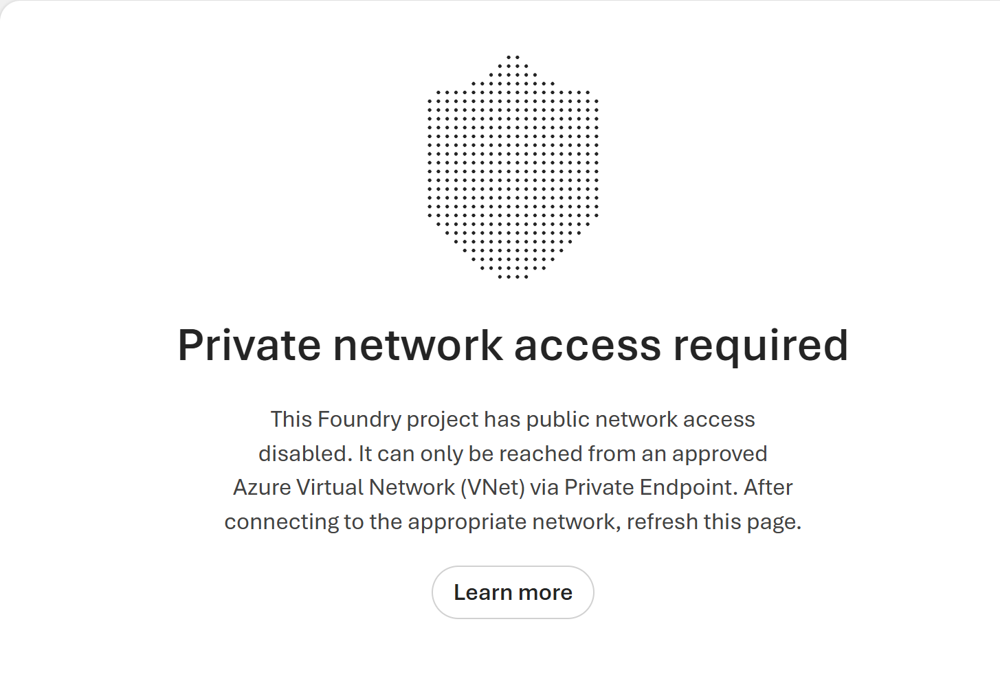
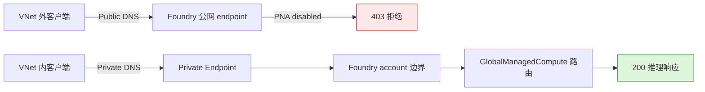

# Microsoft Foundry Managed Compute：Private Endpoint 实测验证

[](https://learn.microsoft.com/azure/foundry/concepts/foundry-models-overview)
[](https://learn.microsoft.com/azure/foundry/how-to/configure-private-link)
[](evidence/connectivity-run.json)
[](https://github.com/david-xinyuwei/david-share/actions/workflows/managed-compute-private-endpoint-ci.yml)
[](LICENSE)

这个 Repo 验证一个精确结论：Microsoft Foundry `GlobalManagedCompute` 的推理路由
遵循所属 **Foundry account** 的公网访问和 Private Endpoint 边界。关闭公网后，VNet
外使用有效身份的请求返回 `403`；同一个 endpoint 在关联 VNet 内解析到私有地址并返回
`200`。测试结束后已恢复公网，并删除全部临时测试资源。这个结论**只覆盖客户端到
endpoint 的入站路径**，不涉及 Pod 落点或出站流量。

> Author: 魏新宇 (Xinyu Wei)

[English](README.md) | [中文](README-CN.md)

[实测结果](#实测结果) · [产品证据](#产品证据) · [快速上手](#快速上手) · [证据](#证据) · [官方来源](#官方来源)

---

## 配置归属

| 配置项 | 配置位置 | 责任角色 | 最低权限 | 验收点 |
|---|---|---|---|---|
| Managed Compute deployment | Foundry project | 模型平台负责人 | Foundry project 模型部署权限 | Deployment 为 `Succeeded` |
| 公网访问 | 所属 Foundry account | Foundry 资源负责人 | 该资源的 Contributor | 保存原始 PNA 状态；每次修改后回读目标状态 |
| Private Endpoint 连接 | 客户 VNet + 所属 Foundry 资源 | 网络负责人和 Foundry 资源负责人 | Network Contributor + Contributor | 连接为 `Approved` 且 `Succeeded` |
| Private DNS zone 与 VNet link | 客户 Azure 订阅 | DNS/网络负责人 | Private DNS Zone Contributor 或等价权限 | 业务客户端解析到私有地址 |
| 客户端路由、VPN 或 ExpressRoute | 客户网络 | 企业网络负责人 | 按组织网络规范 | TCP 443 到达 Private Endpoint |
| 私网探测 runner | 关联 VNet 的业务 subnet | 应用/网络负责人 | 能运行 Python，并取得已批准推理身份的 Token | 私网 DNS、TCP 443 和有效 Chat Completions `200` 均通过；临时 runner 有明确清理责任人 |
| 推理调用身份 | Entra ID 和 Foundry 数据面 RBAC | 身份负责人 | 调用实测 deployment 的 Chat Completions 权限 | 同一 principal 在网络策略切换前后均能返回有效 completion |

关键操作点是：网络配置位于**所属 Foundry account 边界**，不在单个 Managed
Compute deployment 创建窗口里。

## 这个 Repo 验证了什么

| 能力 | 实测观测 | 证据 |
|---|---|---|
| 实测对象确为 Global Managed Compute | Portal 显示 `GlobalManagedCompute`、`Succeeded` 和 `H100_80GB` | [脱敏字段截图](images/product-ui/deployment-facts.png) |
| 所属资源的公网策略覆盖 Managed Compute 路由 | VNet 外使用已通过 Entra 认证的请求调用，返回 `403 Public access is disabled` | [运行证据](evidence/connectivity-run.json) |
| Private Endpoint 承载真实推理请求 | 同一个 endpoint 在 VNet 内解析为私有地址，返回真实的 Chat Completions 响应（`200`） | [运行证据](evidence/connectivity-run.json) |
| Foundry UI 反映网络边界 | VNet 外访问时，Portal 显示 `Private network access required` | [Portal 证据](images/product-ui/private-network-access-required.png) |
| 测试后恢复到安全状态 | 公网恢复后推理再次返回 `200`，临时资源全部删除 | [清理记录](evidence/connectivity-run.json) |

**这不能证明托管 Pod 被注入客户 VNet。**本次也没有证明 Managed Compute 出站流量
经过客户 VNet、Prompt/Completion 零留存，或者一次 Preview 实测已经达到生产 SLA。
正式结论只覆盖客户端进入推理 endpoint 的入站私网隔离。

## 实测结果

测试期间固定 Foundry 资源、deployment、endpoint、Entra identity 和 request
payload，只改变客户端网络路径和所属 Foundry 资源的公网访问设置。

Run ID：`managed-compute-private-link-20260831` · 日期：2026-08-31 · 范围：
单次入站连通性差分测试。

| 场景 | DNS | 已通过 Entra 认证的调用结果 | 状态 | 证据 |
|---|---|---:|---|---|
| VNet 外客户端，公网关闭 | 公网地址 | `403`：公网访问已关闭 | PASS | [`public-blocked.json`](evidence/raw/public-blocked.json) |
| 关联 VNet 内客户端，公网关闭 | 私有地址 | `200`：真实的 Chat Completions 响应 | PASS | [`private-success.json`](evidence/raw/private-success.json) |
| VNet 外客户端，公网恢复 | 公网地址 | `200`：同一模型 endpoint 已响应；未保留 choice 内容 | PASS | [`public-restored.json`](evidence/raw/public-restored.json) |

私网测试容器退出码为 `0`。成功响应标明了开放权重模型和 vLLM runtime；公开
证据不保存生成内容，Request ID 只保留 SHA-256 摘要。三个场景按归档的客户端工具
完成时间排序；没有保留服务端请求时间和各阶段精确时长。

## 产品证据

### 实测对象是 Managed Compute


*Run `managed-compute-private-link-20260831`，2026-08-31。只保留三个与结论有关的字段，账号、项目和身份字段均已移除。字段截图可以确定实测对象，但不能单独证明网络行为。*

### 公网关闭后 Portal 被拦截



*Run `managed-compute-private-link-20260831`，2026-08-31。公网关闭后从 VNet 外采集；项目名称已从画面裁掉。*

### 流量路径



*原创解释图，依据本次差分实测和 Foundry Private Link 官方文档。图中只描述客户端入站路径，不描述 Pod 落点。*

## 可执行资产

| 路径 | 契约 |
|---|---|
| [`infra/main.bicep`](infra/main.bicep) | 将已有 PE subnet 接入 group ID=`account`；可创建并链接三套 Foundry Private DNS zone，也可接收完整的客户已有 zone ID object |
| [`scripts/probe_endpoint.py`](scripts/probe_endpoint.py) | 用同一请求断言 DNS 类型和 HTTP 状态，不打印 Token |
| [`scripts/set_public_network_access.py`](scripts/set_public_network_access.py) | 关闭公网前必须检测到 Approved PE 和同次私网 200 证据，否则默认拒绝执行 |
| [`tests/`](tests/) | 执行 CLI 入口、响应语义、零 PATCH 拒绝矩阵、原值恢复、raw evidence mutation 和 Rule Catalog mutation |
| [`evidence/`](evidence/) | 脱敏运行合同、实测结果、官方来源锁和 Level 5 gate 结果 |

## 快速上手

以下命令均使用 **Bash**。账号和部署命令在安装了 Azure CLI 的控制端执行；公网探针
在关联 VNet 外执行；私网探针在独立业务 subnet 中已批准的 runner 上执行。每个探针
runner 都需要取得本 Repo。私网 runner 需要 Python 3.11+、关联 VNet 的 DNS、到
endpoint 的出站 TCP 443，以及已登录的 Azure CLI，或通过安全进程环境传入
`AZURE_ACCESS_TOKEN`。所有探针必须使用同一个 Entra principal、endpoint、
deployment、prompt 和 token 上限。

Azure 前置条件：公有云、所属 Foundry account 的 Contributor、目标 VNet/subnet 的
Network Contributor，以及创建 Private DNS zone 所需的 Private DNS Zone Contributor
或等价权限。Private Endpoint subnet 必须预先存在并允许 Private Endpoint。应用/网络
负责人负责业务 runner 的生命周期和清理。

```bash
git clone --filter=blob:none --sparse https://github.com/david-xinyuwei/david-share.git
git -C david-share sparse-checkout set Deep-Learning/Managed-Compute-Private-Endpoint
cd david-share/Deep-Learning/Managed-Compute-Private-Endpoint
python -m unittest discover -s tests -v
```

先锁定 Azure 账号。这两条命令不会修改资源：

```bash
az account set --subscription "<subscription-id>"
az account show --query "{subscription:id,tenant:tenantId,user:user.name}" --output json
```

设置所属 Foundry account 和已有 Private Endpoint subnet 的资源 ID。模板从 subnet ID
派生所属 VNet，从结构上避免 PE 与 DNS link 指向两个 VNet。先做 what-if：

```bash
FOUNDRY_ACCOUNT_ID="/subscriptions/<subscription-id>/resourceGroups/<resource-group>/providers/Microsoft.CognitiveServices/accounts/<foundry-account>"
PE_SUBNET_ID="/subscriptions/<subscription-id>/resourceGroups/<network-resource-group>/providers/Microsoft.Network/virtualNetworks/<vnet>/subnets/<private-endpoint-subnet>"
VNET_ID="${PE_SUBNET_ID%/subnets/*}"
CURRENT_SUBSCRIPTION_ID="$(az account show --query id --output tsv)"
PE_SUBSCRIPTION_ID="${PE_SUBNET_ID#/subscriptions/}"
PE_SUBSCRIPTION_ID="${PE_SUBSCRIPTION_ID%%/*}"
PRIVATE_ENDPOINT_LOCATION="$(az network vnet show --ids "$VNET_ID" --query location --output tsv)"
test "$PE_SUBSCRIPTION_ID" = "$CURRENT_SUBSCRIPTION_ID" || { echo "Private Endpoint and VNet must use the same subscription." >&2; exit 1; }
test -n "$PRIVATE_ENDPOINT_LOCATION" || { echo "Unable to read the VNet region." >&2; exit 1; }

az deployment group what-if \
  --resource-group "<resource-group>" \
  --template-file infra/main.bicep \
  --parameters \
      foundryAccountResourceId="$FOUNDRY_ACCOUNT_ID" \
      privateEndpointSubnetResourceId="$PE_SUBNET_ID" \
      privateEndpointLocation="$PRIVATE_ENDPOINT_LOCATION"
```

确认 what-if 结果后，再创建 Private Endpoint 和 Foundry 支持的 Private DNS zone。
下面的默认模式由本次 deployment 管理三套 zone 及其 VNet link：

```bash
az deployment group create \
  --resource-group "<resource-group>" \
  --template-file infra/main.bicep \
  --parameters \
      foundryAccountResourceId="$FOUNDRY_ACCOUNT_ID" \
      privateEndpointSubnetResourceId="$PE_SUBNET_ID" \
      privateEndpointLocation="$PRIVATE_ENDPOINT_LOCATION"
```

若企业使用 central DNS，应传入完整的 `existingPrivateDnsZoneResourceIds` typed
object，包含 `cognitiveservices`、`openai` 和 `servicesAi` 三个 key。这个模式不会
创建 zone 或 VNet link；DNS 负责人必须预先完成 zone link 或 custom DNS forwarding，
并以私网 probe 作为验收。详见[完整流程](docs/reproduction.md#central-dns-mode)。

先从 VNet 内证明私网 DNS 和推理可用，再关闭公网：

> 这一步在可复用流程中新增了 pre-disable `200` 的 fail-closed 安全门。历史实测只
> 保留“实测结果”表中的三个场景，没有把这次 preflight 作为第四条历史观测。

```bash
python scripts/probe_endpoint.py \
  --endpoint "https://<foundry-account>.services.ai.azure.com/openai/v1/chat/completions" \
  --deployment "<managed-compute-deployment>" \
  --expect-dns private \
  --expect-http 200 \
  --prompt "Reply with exactly OK." \
  --max-tokens 4 \
  --output private-probe.json
```

私网通过后，使用带保护的脚本关闭公网，并保存精确原值：

```bash
python scripts/set_public_network_access.py \
  --subscription-id "<subscription-id>" \
  --resource-group "<resource-group>" \
  --account-name "<foundry-account>" \
  --state Disabled \
  --private-probe-evidence private-probe.json \
  --save-prior-state pna-before.json
```

`pna-before.json` 只保留在受控的操作端，不要提交或手工修改。只有 Azure 回读确认
`Disabled` 后，脚本才把 receipt 标为 `applied`；receipt 不完整或测试期间 PNA 被其他
操作修改时，restore 会拒绝执行。这个文件用于防误操作，不是授权边界；最终权限仍以
Azure RBAC 为准。

从关联 VNet 外证明已认证公网请求由网络策略明确拦截：

```bash
python scripts/probe_endpoint.py \
  --endpoint "https://<foundry-account>.services.ai.azure.com/openai/v1/chat/completions" \
  --deployment "<managed-compute-deployment>" \
  --expect-dns public \
  --expect-http 403 \
  --prompt "Reply with exactly OK." \
  --max-tokens 4 \
  --output public-blocked-probe.json
```

PNA 关闭后，再从关联 VNet 内的业务 runner 执行同一个请求：

```bash
python scripts/probe_endpoint.py \
  --endpoint "https://<foundry-account>.services.ai.azure.com/openai/v1/chat/completions" \
  --deployment "<managed-compute-deployment>" \
  --expect-dns private \
  --expect-http 200 \
  --prompt "Reply with exactly OK." \
  --max-tokens 4 \
  --output private-after-disable-probe.json
```

恢复测试前保存的原值；不要把目标值硬编码为 `Enabled`：

```bash
python scripts/set_public_network_access.py \
  --subscription-id "<subscription-id>" \
  --resource-group "<resource-group>" \
  --account-name "<foundry-account>" \
  --restore-state-from pna-before.json
```

如果 `pna-before.json` 中记录的是 `priorState: Enabled`，用同一个请求证明公网恢复：

```bash
python scripts/probe_endpoint.py \
  --endpoint "https://<foundry-account>.services.ai.azure.com/openai/v1/chat/completions" \
  --deployment "<managed-compute-deployment>" \
  --expect-dns public \
  --expect-http 200 \
  --prompt "Reply with exactly OK." \
  --max-tokens 4 \
  --output public-restored-probe.json
```

完成条件：所属 Foundry account 回到保存的原始 PNA 状态。若原值为 `Enabled`，最后
一次公网探针还必须返回有效 Chat Completions `200`；若原值为 `Disabled`，私网路径
继续返回 `200`，公网继续被拦截。完整验证与清理顺序见
[`docs/reproduction.md`](docs/reproduction.md)。

## 证据

| 资产 | 作用 |
|---|---|
| [`evidence/connectivity-run.json`](evidence/connectivity-run.json) | 脱敏控制面与公网/私网数据面观测 |
| [`evidence/raw/`](evidence/raw/) | 生成 connectivity 结果所使用的脱敏源观测 |
| [`evidence/run-contract.json`](evidence/run-contract.json) | 冻结的问题、验收条件和唯一改变变量 |
| [`evidence/provenance.json`](evidence/provenance.json) | 公开/私有证据边界、时间口径，以及历史实测与复现流程的区别 |
| [`evidence/ui-evidence.json`](evidence/ui-evidence.json) | 图片 hash、脱敏项和每张图的声明边界 |
| [`evidence/source-lock.json`](evidence/source-lock.json) | 官方 URL 和不可变文档 commit |
| [`evidence/rule-results.json`](evidence/rule-results.json) | 自动生成的 Level 5 逐规则结果 |

`evidence/raw/` 保存的是最早一层**可公开的脱敏观测**，不是 Azure 原始日志的逐字节
副本。Hash 和原生 gate 能发现 Repo 内部漂移，但不能独立认证未公开的私有原始证据；
这个限制已写入 provenance 记录。

## 官方来源

- [配置 Microsoft Foundry 网络隔离](https://learn.microsoft.com/azure/foundry/how-to/configure-private-link)
- [Microsoft Foundry Models 概览](https://learn.microsoft.com/azure/foundry/concepts/foundry-models-overview)
- [使用 Azure CLI 创建 Private Endpoint](https://learn.microsoft.com/azure/private-link/create-private-endpoint-cli)

当前公开 Managed Compute 部署指南明确标为 classic-only。因此本 Repo 不把旧的
managed online endpoint 行为外推到新的 `GlobalManagedCompute`；核心结论来自
2026-08-31 的真实差分测试。
