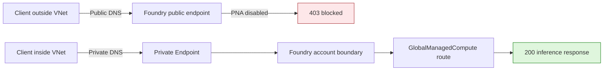

# Microsoft Foundry Managed Compute: Private Endpoint Validation

[](https://learn.microsoft.com/azure/foundry/concepts/foundry-models-overview)
[](https://learn.microsoft.com/azure/foundry/how-to/configure-private-link)
[](evidence/connectivity-run.json)
[](https://github.com/david-xinyuwei/david-share/actions/workflows/managed-compute-private-endpoint-ci.yml)
[](LICENSE)

This repository validates one precise network claim: a Microsoft Foundry
`GlobalManagedCompute` inference route honored the **parent Foundry account's**
public-network-access and Private Endpoint boundary. With public access disabled,
the authenticated public request returned `403`; the same endpoint resolved to
a private address from the linked VNet and returned `200`. Public access was
then restored and every temporary test resource was removed. This is an
**inbound client-to-endpoint result only**; it is not a pod-placement or egress
claim.

> Author: 魏新宇 (Xinyu Wei)

[English](README.md) | [中文](README-CN.md)

[Measured result](#measured-result) · [Product evidence](#product-evidence) · [Quick start](#quick-start) · [Evidence](#evidence) · [Official sources](#official-sources)

---

## Configuration ownership

| Setting | Configuration surface | Responsible role | Minimum permission | Acceptance point |
|---|---|---|---|---|
| Managed Compute deployment | Foundry project | Model platform owner | Foundry project model deployment permission | Deployment is `Succeeded` |
| Public network access | Parent Foundry account | Foundry resource owner | Contributor on the account | Prior PNA state is saved; each requested state is read back |
| Private Endpoint connection | Customer VNet + parent Foundry account | Network owner and Foundry resource owner | Network Contributor + Contributor | Connection is `Approved` and `Succeeded` |
| Private DNS zones and VNet links | Customer Azure subscription | DNS/network owner | Private DNS Zone Contributor or equivalent | Workload client resolves a private address |
| Client route, VPN, or ExpressRoute | Customer network | Enterprise network owner | Organization-specific | Port 443 reaches the private endpoint |
| Private probe runner | Workload subnet in the linked VNet | Application/network owner | Ability to run Python and obtain the approved inference identity's token | Private DNS, TCP 443, and a valid Chat Completions `200` all pass; temporary runner cleanup has an owner |
| Inference identity | Entra ID and Foundry data-plane RBAC | Identity owner | Permission to invoke Chat Completions on the tested deployment | The same principal returns a valid completion before and after the network-policy change |

The key operational point is that networking is configured on the **parent
Foundry account boundary**, not in the individual Managed Compute deployment
dialog.

## What this repository validates

| Capability | Measured observation | Evidence |
|---|---|---|
| Global Managed Compute was the tested deployment type | Portal showed `GlobalManagedCompute`, `Succeeded`, and `H100_80GB` | [Redacted field crops](images/product-ui/deployment-facts.png) |
| Public access enforcement reached the Managed Compute route | Authenticated request outside the VNet returned `403` with `Public access is disabled` | [Run evidence](evidence/connectivity-run.json) |
| Private Endpoint carried a real inference request | The same endpoint resolved privately inside the VNet and returned `200` | [Run evidence](evidence/connectivity-run.json) |
| Foundry UI reflected the network boundary | Outside the VNet, the portal showed `Private network access required` | [Portal evidence](images/product-ui/private-network-access-required.png) |
| Safe post-test state | Public access was restored, public inference returned `200`, and temporary resources were removed | [Cleanup record](evidence/connectivity-run.json) |

**This does not prove that managed pods are injected into the customer VNet.**
It also does not prove that Managed Compute egress traverses the customer VNet,
that prompts or completions have zero retention, or that this single preview run is production
ready. The measured claim is inbound client-to-endpoint isolation only.

## Measured result

The test kept the Foundry account, deployment, endpoint, Entra identity, and
request payload fixed. Only the caller network path and the parent account's
public-network-access setting changed.

Run ID: `managed-compute-private-link-20260831` · Date: 2026-08-31 · Scope:
single-run inbound connectivity differential.

| Scenario | DNS | Authenticated HTTP result | Status | Evidence |
|---|---|---:|---|---|
| Client outside VNet, public access disabled | Public address | `403` — public access disabled | PASS | [`public-blocked.json`](evidence/raw/public-blocked.json) |
| Client inside linked VNet, public access disabled | Private address | `200` — real Chat Completions response | PASS | [`private-success.json`](evidence/raw/private-success.json) |
| Client outside VNet, public access restored | Public address | `200` — same model endpoint responded; choice content was not retained | PASS | [`public-restored.json`](evidence/raw/public-restored.json) |

The private runner exited with code `0`. The successful response identified the
open-weight model and a vLLM runtime; generated content is intentionally omitted
from the public evidence. Request IDs are represented only as SHA-256 digests.
The three scenario rows are ordered by archived client-tool completion time;
exact service-side request timestamps and phase durations were not retained.

## Product evidence

### The deployment was Managed Compute


*Run `managed-compute-private-link-20260831`, 2026-08-31. Only three decision-relevant fields are retained; account and identity fields are omitted. These fields identify the tested deployment but do not prove network behavior by themselves.*

### Public access was blocked in the portal


*Run `managed-compute-private-link-20260831`, 2026-08-31. Measured from outside the VNet after public access was disabled. The project header is cropped out.*

### Traffic paths



*Original explanatory diagram based on the measured differential and the official Foundry Private Link documentation. It describes the client ingress path, not pod placement.*

## Executable assets

| Path | Contract |
|---|---|
| [`infra/main.bicep`](infra/main.bicep) | Connects an existing PE subnet to group `account`; either creates and links all three Foundry Private DNS zones or consumes a complete customer-managed zone-ID object |
| [`scripts/probe_endpoint.py`](scripts/probe_endpoint.py) | Sends the same authenticated request and asserts DNS class plus HTTP status without printing a token |
| [`scripts/set_public_network_access.py`](scripts/set_public_network_access.py) | Fails closed unless an Approved PE exists before disabling public access |
| [`tests/`](tests/) | Exercises the CLI entry point, response semantics, zero-PATCH refusal matrix, saved-state restore, raw evidence mutations, and Rule Catalog mutations |
| [`evidence/`](evidence/) | Sanitized run contract, measurements, source lock, UI hashes, and Level 5 rule results |

## Quick start

All snippets below use **Bash**. Use a control runner with Azure CLI for account
and deployment commands, a client outside the linked VNet for public probes,
and an approved runner in a separate workload subnet for private probes. Make
this repository available on every probe runner. The private runner needs
Python 3.11+, DNS through the linked VNet, outbound TCP 443 to the endpoint, and
either an authenticated Azure CLI session or an `AZURE_ACCESS_TOKEN` supplied
through a secure process environment. Use the same Entra principal, endpoint,
deployment, prompt, and token limit for every probe.

Azure prerequisites: commercial cloud, Contributor on the parent Foundry
account, Network Contributor on the target VNet/subnet, and Private DNS Zone
Contributor (or equivalent) where the zones are created. The Private Endpoint
subnet must already exist and allow Private Endpoints. The application/network
owner is responsible for the workload runner and its cleanup.

```bash
git clone --filter=blob:none --sparse https://github.com/david-xinyuwei/david-share.git
git -C david-share sparse-checkout set Deep-Learning/Managed-Compute-Private-Endpoint
cd david-share/Deep-Learning/Managed-Compute-Private-Endpoint
python -m unittest discover -s tests -v
```

Confirm the intended Azure account. These commands have no resource side effects:

```bash
az account set --subscription "<subscription-id>"
az account show --query "{subscription:id,tenant:tenantId,user:user.name}" --output json
```

Set the parent account and existing Private Endpoint subnet IDs. The template
derives the VNet from the subnet ID, preventing a PE/DNS-link VNet mismatch.
Preview the exact change:

```bash
FOUNDRY_ACCOUNT_ID="/subscriptions/<subscription-id>/resourceGroups/<resource-group>/providers/Microsoft.CognitiveServices/accounts/<foundry-account>"
PE_SUBNET_ID="/subscriptions/<subscription-id>/resourceGroups/<network-resource-group>/providers/Microsoft.Network/virtualNetworks/<vnet>/subnets/<private-endpoint-subnet>"
VNET_ID="${PE_SUBNET_ID%/subnets/*}"
CURRENT_SUBSCRIPTION_ID="$(az account show --query id --output tsv)"
PE_SUBSCRIPTION_ID="${PE_SUBNET_ID#/subscriptions/}"
PE_SUBSCRIPTION_ID="${PE_SUBSCRIPTION_ID%%/*}"
PRIVATE_ENDPOINT_LOCATION="$(az network vnet show --ids "$VNET_ID" --query location --output tsv)"
test "$PE_SUBSCRIPTION_ID" = "$CURRENT_SUBSCRIPTION_ID" || { echo "Private Endpoint and VNet must use the same subscription." >&2; exit 1; }
test -n "$PRIVATE_ENDPOINT_LOCATION" || { echo "Unable to read the VNet region." >&2; exit 1; }

az deployment group what-if \
  --resource-group "<resource-group>" \
  --template-file infra/main.bicep \
  --parameters \
      foundryAccountResourceId="$FOUNDRY_ACCOUNT_ID" \
      privateEndpointSubnetResourceId="$PE_SUBNET_ID" \
      privateEndpointLocation="$PRIVATE_ENDPOINT_LOCATION"
```

After reviewing the what-if output, deploy the Private Endpoint and supported
Foundry Private DNS zones. In the default mode below, the deployment owns the
three zones and their VNet links:

```bash
az deployment group create \
  --resource-group "<resource-group>" \
  --template-file infra/main.bicep \
  --parameters \
      foundryAccountResourceId="$FOUNDRY_ACCOUNT_ID" \
      privateEndpointSubnetResourceId="$PE_SUBNET_ID" \
      privateEndpointLocation="$PRIVATE_ENDPOINT_LOCATION"
```

For enterprise central DNS, pass the complete typed
`existingPrivateDnsZoneResourceIds` object with the three keys
`cognitiveservices`, `openai`, and `servicesAi`. In that mode the template does
not create zones or VNet links; the DNS owner must pre-link the zones or provide
custom DNS forwarding, and the private probe is the acceptance check. See the
[full procedure](docs/reproduction.md#central-dns-mode).

From a client inside the linked VNet, prove private DNS and inference before
disabling public access:

> This pre-disable `200` is a fail-closed safety improvement in the reusable
> procedure. The historical run recorded the three scenarios in the measured
> result table; it did not retain this preflight as a fourth observation.

```bash
python scripts/probe_endpoint.py \
  --endpoint "https://<foundry-account>.services.ai.azure.com/openai/v1/chat/completions" \
  --deployment "<managed-compute-deployment>" \
  --expect-dns private \
  --expect-http 200 \
  --prompt "Reply with exactly OK." \
  --max-tokens 4 \
  --output private-probe.json
```

Only after that passes, disable public access and save the exact prior state:

```bash
python scripts/set_public_network_access.py \
  --subscription-id "<subscription-id>" \
  --resource-group "<resource-group>" \
  --account-name "<foundry-account>" \
  --state Disabled \
  --private-probe-evidence private-probe.json \
  --save-prior-state pna-before.json
```

Keep `pna-before.json` on the trusted control runner and do not commit or edit
it. The script marks the receipt `applied` only after Azure read-back confirms
`Disabled`; restore rejects an incomplete receipt or a concurrently changed PNA
state. The receipt prevents accidental misuse but is not an authorization
boundary: Azure RBAC remains authoritative.

From outside the linked VNet, prove that the authenticated public request is
blocked specifically by the network policy:

```bash
python scripts/probe_endpoint.py \
  --endpoint "https://<foundry-account>.services.ai.azure.com/openai/v1/chat/completions" \
  --deployment "<managed-compute-deployment>" \
  --expect-dns public \
  --expect-http 403 \
  --prompt "Reply with exactly OK." \
  --max-tokens 4 \
  --output public-blocked-probe.json
```

From the workload runner inside the linked VNet, repeat the same request after
PNA is disabled:

```bash
python scripts/probe_endpoint.py \
  --endpoint "https://<foundry-account>.services.ai.azure.com/openai/v1/chat/completions" \
  --deployment "<managed-compute-deployment>" \
  --expect-dns private \
  --expect-http 200 \
  --prompt "Reply with exactly OK." \
  --max-tokens 4 \
  --output private-after-disable-probe.json
```

Restore the value captured before the test; do not hard-code `Enabled`:

```bash
python scripts/set_public_network_access.py \
  --subscription-id "<subscription-id>" \
  --resource-group "<resource-group>" \
  --account-name "<foundry-account>" \
  --restore-state-from pna-before.json
```

If `pna-before.json` records `priorState: Enabled`, prove the restored public
path with the same request:

```bash
python scripts/probe_endpoint.py \
  --endpoint "https://<foundry-account>.services.ai.azure.com/openai/v1/chat/completions" \
  --deployment "<managed-compute-deployment>" \
  --expect-dns public \
  --expect-http 200 \
  --prompt "Reply with exactly OK." \
  --max-tokens 4 \
  --output public-restored-probe.json
```

Done-when: the parent account equals its saved prior PNA state. When that state
was `Enabled`, the final public probe also returns a valid Chat Completions
`200`; when it was `Disabled`, the private path remains `200` and the public
path remains blocked. See
[`docs/reproduction.md`](docs/reproduction.md) for the complete validation and
cleanup sequence.

## Evidence

| Asset | Purpose |
|---|---|
| [`evidence/connectivity-run.json`](evidence/connectivity-run.json) | Sanitized control-plane and public/private data-plane observations |
| [`evidence/raw/`](evidence/raw/) | Sanitized source observations from which the connectivity result is generated |
| [`evidence/run-contract.json`](evidence/run-contract.json) | Frozen question, acceptance conditions, and changed variable |
| [`evidence/provenance.json`](evidence/provenance.json) | Public/private evidence boundary, time basis, and historical-versus-reproduction distinction |
| [`evidence/ui-evidence.json`](evidence/ui-evidence.json) | Image hashes, redactions, and per-image claim boundaries |
| [`evidence/source-lock.json`](evidence/source-lock.json) | Official URLs and immutable documentation commits |
| [`evidence/rule-results.json`](evidence/rule-results.json) | Generated Level 5 rule-by-rule result |

The files under `evidence/raw/` are the earliest **public-safe sanitized
observations**, not byte-for-byte Azure logs. Their hashes and the native gate
detect drift inside this repository; they do not independently authenticate the
withheld private source. This limitation is explicit in the provenance record.

## Official sources

- [Configure network isolation for Microsoft Foundry](https://learn.microsoft.com/azure/foundry/how-to/configure-private-link)
- [Microsoft Foundry Models overview](https://learn.microsoft.com/azure/foundry/concepts/foundry-models-overview)
- [Create a Private Endpoint with Azure CLI](https://learn.microsoft.com/azure/private-link/create-private-endpoint-cli)

The current public Managed Compute deployment how-to is marked classic-only.
This repository therefore does not infer the new `GlobalManagedCompute` behavior
from classic managed online endpoints; the central claim comes from the recorded
2026-08-31 live differential.
