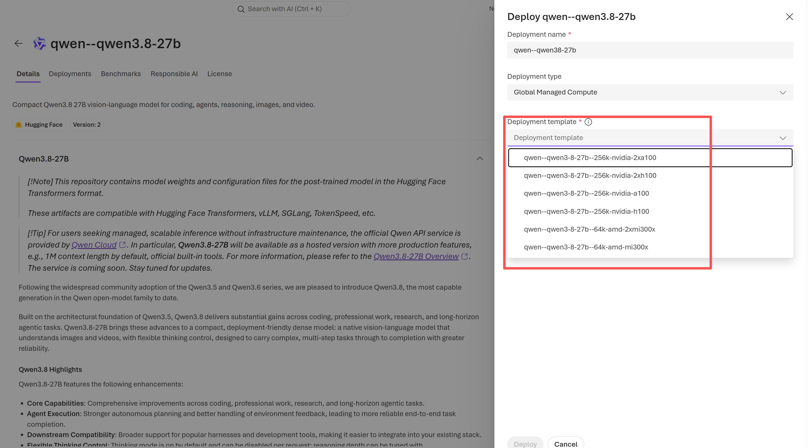
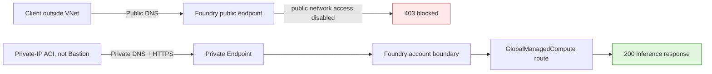
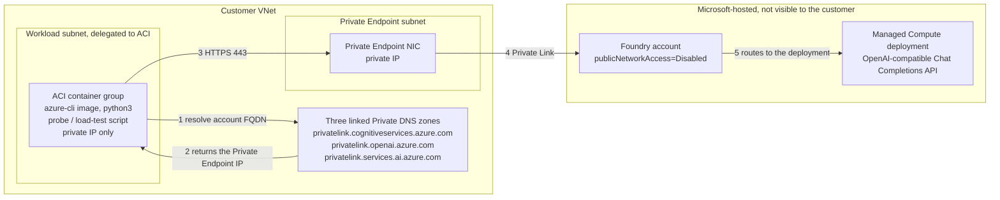

# Microsoft Foundry Managed Compute: Private Endpoint Validation

[](https://learn.microsoft.com/azure/foundry/concepts/foundry-models-overview)
[](https://learn.microsoft.com/azure/foundry/how-to/configure-private-link)
[](evidence/connectivity-run.json)
[](https://github.com/david-xinyuwei/david-share/actions/workflows/managed-compute-private-endpoint-ci.yml)
[](LICENSE)

Can an open model hosted on Microsoft Foundry Managed Compute be locked down so
that it is unreachable from the public internet, callable only from the
customer's own network, and still usable by production workloads? The network
control Microsoft provides for this is the parent Foundry resource's public
network access setting plus a Private Endpoint, so this repository measures the
one thing that decides the answer: after public network access is disabled on
the parent Foundry resource, can a client still call a `GlobalManagedCompute`
deployment through the Private Endpoint? In one dedicated run, the outside
client changed from `200` to `403`, while a client in the linked VNet remained
at `200`; restoring the saved setting returned the outside client to `200`. A
follow-up load test on the same deployment showed the private path is not
slower than the public one (see [Measured performance](#measured-performance-public-path-vs-private-endpoint)).

**Scope:** the measurement covers the inbound path from a client to the
inference endpoint. The model containers themselves run on Microsoft-hosted
compute, not in the customer VNet: throughout the run the customer resource
group held only the Foundry account, the VNet, the Private Endpoint and its
NIC, three Private DNS zones, and the disposable ACI runners
([inventory](evidence/perf/resource-inventory.json)). Pod placement therefore
sits on Microsoft's side of the Private Endpoint and is not observable from the
customer network. The serving container only answers requests; it does not
initiate connections of its own.

> Author: 魏新宇 (Xinyu Wei)

[English](README.md) | [中文](README-CN.md)

[Start here](#start-here) · [Measured run](#measured-run) · [How it works](#how-the-validation-works) · [Quick start](#quick-start) · [Evidence](#evidence)

---

## Start here

| Goal | Go to |
|---|---|
| Understand what was measured | [Measured run](#measured-run) and [Evidence](#evidence) |
| Check the code and evidence locally | [Tests](#tests) |
| Plan the production network | [Recommended production access configuration](#recommended-production-access-configuration) |
| Reproduce against your Foundry resource | [Quick start](#quick-start) |

Runtime scripts require Python 3.11+ and use only the Python standard library.
The live path also requires Azure CLI and a credential that can call the
deployment: either the Foundry resource's API key or an Entra identity.

The acceptance path is deliberately ordered so a broken private path cannot
lock out the operator:

| Stage | Client location | Public network access | Required observation |
|---:|---|---|---|
| 1 | Outside the linked VNet | Enabled | Chat Completions `200` |
| 2 | Inside the linked VNet | Enabled | Private DNS plus `200` |
| 3 | Outside the linked VNet | Disabled | `403` with `Public access is disabled` |
| 4 | Inside the linked VNet | Disabled | Private DNS plus `200` |
| 5 | Outside the linked VNet | Restored | `200` when the saved state was `Enabled` |

Done-when: the parent Foundry resource is back at its saved public network
access setting, and the expected public/private responses all match.

## Responsibility boundary

| Microsoft Foundry and Azure provide | You provide and verify |
|---|---|
| A `GlobalManagedCompute` deployment and its parent Foundry resource | A dedicated non-production Foundry resource; all child projects must be disposable test assets |
| The parent resource's public network access setting | Contributor on the Foundry resource; save and read back the exact prior setting |
| Private Endpoint connection group `account` | A Private Endpoint subnet, Network Contributor, and an `Approved`/`Succeeded` connection |
| Private DNS zone integration | The required zones, VNet links or DNS forwarding, and a client that resolves the endpoint to a private address |
| Data-plane authentication: API key (`api-key` header) or Entra token (`Authorization: Bearer`) | One credential used for every stage; if the resource has `disableLocalAuth=true`, only Entra works |
| Azure Container Instances (ACI), when used as the probe runner | A delegated workload subnet, credential delivery through ARM `secureValue`, evidence capture, and an explicit cleanup owner |

**Benefit:** the model URL and deployment do not change when public access is
disabled. **Trade-off:** every client needs both a route to the VNet and DNS that
returns the Private Endpoint address. Networking belongs to the parent Foundry
resource, not to the individual Managed Compute deployment dialog.

## What this repository proves

| Capability | Measured observation | Evidence |
|---|---|---|
| Global Managed Compute was the tested deployment type | The control-plane readback recorded `qwen--qwen3-32b`, `GlobalManagedCompute`, `Succeeded`, and `H100_80GB` | [Control-plane readback](evidence/raw/control-plane.json) |
| Public access enforcement applied to a request addressed to the Managed Compute deployment | Authenticated request outside the VNet returned `403` with `Public access is disabled`; the rejection is an account-boundary result, not proof of where inside the route it was produced | [Run evidence](evidence/connectivity-run.json) |
| Private Endpoint carried a real inference request | The same probe source ran in private-IP ACI, resolved to a private (RFC 1918) address, and returned Chat Completions `200` before and after public network access was disabled; Private Endpoint use is inferred from the private DNS class, not from an address match against the Private Endpoint NIC | [Generated code transcript](evidence/cli-transcript.txt) |
| Safe post-test network state | Public access was restored, public inference returned `200`, and both private ACI probes terminated with exit code `0` | [Post-test record](evidence/raw/post-test-state.json) |
| Resource and billing boundary | Temporary resources remain because cleanup was not authorized; billing continues while Managed Compute remains deployed | [Post-test record](evidence/raw/post-test-state.json) |

Only the parent Foundry resource's `*.services.ai.azure.com` route was tested.
The run does not show whether the Managed Compute deployment exposes any other
inbound hostname. A `403` proves rejection at the account boundary; it does not
locate the rejection inside the Managed Compute route.

## Measured run

The test kept the Foundry account, deployment, endpoint, credential, and
request payload fixed. Only the caller network path and the parent account's
public-network-access setting changed.

Authentication in this run: an Entra bearer token, because the test resource
had key access disabled (`disableLocalAuth=true`). Foundry resources accept
either an API key in the `api-key` header or an Entra token; the scripts support
both, and public network access is a resource-level network setting that does
not depend on which credential the client presents. Only the Entra path was
measured.

Run ID: `managed-compute-private-link-dedicated-20260831` · Date: 2026-08-31 · Scope:
single-run inbound connectivity differential.

| Scenario | DNS | Authenticated HTTP result | Status | Evidence |
|---|---|---:|---|---|
| Client outside VNet, public access enabled | Public address | `200` — real Chat Completions response | PASS | [`public-baseline.json`](evidence/raw/public-baseline.json) |
| Private-IP ACI in linked VNet, public access enabled | Private address | `200` — pre-disable safety check | PASS | [`private-preflight.json`](evidence/raw/private-preflight.json) |
| Client outside VNet, public access disabled | Public address | `403` — public access disabled | PASS | [`public-blocked.json`](evidence/raw/public-blocked.json) |
| Private-IP ACI in linked VNet, public access disabled | Private address | `200` — real Chat Completions response | PASS | [`private-success.json`](evidence/raw/private-success.json) |
| Client outside VNet, public access restored | Public address | `200` — same model endpoint responded; choice content was not retained | PASS | [`public-restored.json`](evidence/raw/public-restored.json) |

The private runner was Azure Container Instances with a private IP in a linked
VNet workload subnet. It sent HTTPS to the privately resolved address; it
was **not Azure Bastion**. Both ACI probes ran the same `probe_endpoint.py`
source hash and exited with code `0`. Generated content and resolved addresses
are omitted; request IDs are represented only as SHA-256 digests. Probe
timestamps establish order, not a latency distribution.

The [generated transcript](evidence/cli-transcript.txt) is the canonical
direct-reading view of the five observations. [Provenance](evidence/provenance.json)
records which fields came from the probe, which fingerprints were derived after
the run, and how to retrieve the exact `762b6978` probe bytes.

## Product evidence

### The deployment was Managed Compute



*Microsoft Foundry model catalog, Deploy dialog, captured 2026-09-04. Deployment
type is `Global Managed Compute`; the Deployment template dropdown fixes the GPU
SKU for the model container (NVIDIA A100 / H100, single or dual, AMD MI300X). This
is where a customer chooses Managed Compute for an open model. The measured run's
own deployment identity (`qwen--qwen3-32b`, `H100_80GB`, `Succeeded`) is recorded
in the [control-plane readback](evidence/raw/control-plane.json); the
[UI evidence record](evidence/ui-evidence.json) carries the image SHA-256 and claim
boundary.*

### Traffic paths



*Original explanatory diagram based on the measured differential and
[Microsoft's Foundry network-isolation documentation](https://learn.microsoft.com/azure/foundry/how-to/configure-private-link).
It shows client ingress only. The `403` is placed at the account boundary because
the evidence cannot locate it deeper in the route.*

### Test topology



The ACI container group is the client, not the model. It runs
`mcr.microsoft.com/azure-cli:2.77.0` (which ships `python3`), receives the
probe or load-test source as a base64 argument, hashes the bytes it executes,
and exits when the request finishes (`restartPolicy: Never`). It has only a
private IP in a subnet delegated to `Microsoft.ContainerInstance/containerGroups`;
the Private Endpoint lives in a separate, non-delegated subnet. Nothing joins
the two except DNS: the linked zones resolve the account hostname to the Private
Endpoint address, so the request never leaves the VNet. The model container
receives requests and streams tokens back on the same connection; it does not
open connections of its own.

## Executable assets

| Path | Contract |
|---|---|
| [`infra/main.bicep`](infra/main.bicep) | Connects an existing PE subnet to group `account`; either creates and links all three Foundry Private DNS zones or consumes a complete customer-managed zone-ID object |
| [`scripts/probe_endpoint.py`](scripts/probe_endpoint.py) | Sends the same request with an API key or an Entra token and asserts DNS class plus HTTP status without printing the credential |
| [`scripts/submit_private_aci_probe.py`](scripts/submit_private_aci_probe.py) | Runs the exact probe source in a private-IP ACI; the container hashes the bytes it executes; the API key or Entra token is injected only as an ARM `secureValue`; an existing name is never updated |
| [`scripts/set_public_network_access.py`](scripts/set_public_network_access.py) | Fails closed unless an Approved PE exists before disabling public access; ETag preconditions reject concurrent account changes (added after the measured run; unit-tested, no live measurement) |
| [`scripts/load_test_endpoint.py`](scripts/load_test_endpoint.py) | Streaming load test at fixed concurrency levels: TTFT, end-to-end, per-request and aggregate output tokens/s; generated text is discarded, results are emitted as short marker lines so ACI log retention keeps them |
| [`scripts/submit_private_aci_load_test.py`](scripts/submit_private_aci_load_test.py) | Runs the exact load-test bytes in a private-IP ACI; `--collect-log` reassembles a saved container log into the result JSON |
| [`scripts/azure_translator_backtranslate.py`](scripts/azure_translator_backtranslate.py) | Calls Azure AI Translator for Chinese-to-English back-translation; the key is read only from the process environment, while `--check` validates committed evidence without credentials |
| [`tests/`](tests/) | Exercises the CLI entry point, response semantics, zero-PATCH refusal matrix, saved-state restore, raw evidence mutations, and Rule Catalog mutations |
| [`evidence/`](evidence/) | Sanitized run contract, measurements, source lock, UI hashes, and Level 5 rule results |

## How the validation works

| Layer | Actual implementation | Pass condition | Evidence boundary |
|---|---|---|---|
| DNS | [`resolve_addresses`](scripts/probe_endpoint.py) resolves the endpoint; [`classify_addresses`](scripts/probe_endpoint.py) classifies every result as public, private, or mixed | The in-VNet client reports `dnsClass=private` | The retained run did not compare the resolved address with the Private Endpoint NIC |
| Data plane | [`run_probe`](scripts/probe_endpoint.py) sends one Chat Completions request with an API key or an Entra token | `200` requires `object=chat.completion` and at least one choice; `403` requires the public-access-disabled error category | A network `403` is not interchangeable with an RBAC `403` |
| Control plane | [`change_public_network_access`](scripts/set_public_network_access.py) saves, changes, reads back, and restores the parent resource setting | The requested setting and `Succeeded` state are read back | ETag guards were added after the measured run and have unit tests but no live measurement |

### How customers reach the Private Endpoint

The client type is not the deciding factor. A VM, container, Kubernetes pod, or
on-premises application can call the same model URL when it has a route to the
VNet and DNS resolves that URL to the Private Endpoint address.

| Client location | Network path | DNS requirement |
|---|---|---|
| VM, ACI, or Kubernetes workload in the same or a peered VNet | VNet routing or peering | Link the same Foundry Private DNS zones to every client VNet, or use the organization's DNS resolver |
| On-premises application | ExpressRoute or site-to-site VPN | Conditionally forward the Foundry service zone to an Azure DNS Private Resolver inbound endpoint or an Azure DNS forwarder |
| Developer workstation | Point-to-site VPN, or a VM reached through Azure Bastion | Use the VPN/resolver DNS path; a Bastion VM is a development option, not a requirement |

See [Azure Private Endpoint DNS integration scenarios](https://learn.microsoft.com/azure/private-link/private-endpoint-dns-integration)
and [Azure DNS Private Resolver](https://learn.microsoft.com/azure/dns/dns-private-resolver-overview).
The ACI in this repository is a disposable validation runner, not a prescribed
production client.

### Recommended production access configuration

This is a recommendation derived from the official documents linked below and
from the measured differential; it was not itself measured in this run.

| Layer | Recommended configuration | Why |
|---|---|---|
| Foundry resource | Keep `publicNetworkAccess=Disabled`; do not rely on the selected-networks IP allowlist as the production path | The measured `403` is produced by this setting; an IP allowlist reintroduces a public path |
| Private Endpoint placement | One Private Endpoint per Foundry resource in the hub VNet (or a shared-services spoke) of a hub-spoke topology | Every peered spoke reaches it; no per-application Private Endpoint is needed unless segmentation policy requires one |
| Application VNets | Connect through VNet peering to the hub; production clients are the workloads that already live there (AKS, App Service with VNet integration, Functions, VMs) | Peering is the routing path; the client type does not matter |
| DNS inside Azure | Link the three Foundry Private DNS zones (`privatelink.cognitiveservices.azure.com`, `privatelink.openai.azure.com`, `privatelink.services.ai.azure.com`) to the hub; point spokes at central DNS (Azure DNS Private Resolver inbound endpoint or your DNS forwarder) or link the same zones to each spoke | The model URL must resolve to the Private Endpoint address from every client |
| On-premises | ExpressRoute private peering or site-to-site VPN into the hub; conditionally forward the three zones to the Private Resolver inbound endpoint | On-premises resolvers cannot see Azure Private DNS zones directly |
| Developers and operators | Point-to-site VPN into the hub, or a jump VM reached through Azure Bastion | Bastion is for people, not for application traffic |
| Credential | API key stored in Azure Key Vault and rotated, or a managed identity with the inference role; pick by your key-management policy | Both are supported by the endpoint; network isolation does not depend on the choice |
| Change control | Run [`probe_endpoint.py`](scripts/probe_endpoint.py) from a spoke before and after every network or DNS change | Stage 2 before Stage 3 is what prevents a lockout |

Azure Container Instances and Azure Bastion appear in this repository only as
validation and operator tools; neither is the production data path. References:
[Hub-spoke network topology](https://learn.microsoft.com/azure/architecture/networking/architecture/hub-spoke),
[Private Endpoint DNS integration](https://learn.microsoft.com/azure/private-link/private-endpoint-dns-integration),
[Azure DNS Private Resolver](https://learn.microsoft.com/azure/dns/dns-private-resolver-overview),
[Azure OpenAI authentication](https://learn.microsoft.com/azure/foundry/openai/reference#authentication),
[Disable local authentication](https://learn.microsoft.com/azure/ai-services/disable-local-auth).

### Common misunderstandings

| Misunderstanding | What the code and evidence show |
|---|---|
| “Private Endpoint creates a private copy of the model.” | The deployment and URL stay fixed; the parent Foundry resource changes which network path may reach it. |
| “Private DNS proves the Managed Compute pods are in my VNet.” | The probe proves only that the client resolved a private address and received a valid response. Pod placement is outside scope. |
| “ACI is required to use the model privately.” | ACI was the measured runner. Any client with private routing, private DNS, and a valid credential (API key or Entra identity) can use the endpoint. |

### Measured performance: public path vs Private Endpoint

Run ID: `mcpe-perf-20260904` · Date: 2026-09-04 · Same deployment (`GlobalManagedCompute`,
1×H100 80GB, Qwen3-32B), same fixed prompt (332 prompt tokens), `max_tokens=256`,
`stream=true`, `temperature=0`, one Entra token. Only the client location changed:
the public run came from a workstation outside the VNet; the private run came from a
private-IP ACI in the linked VNet. Both ran the same `load_test_endpoint.py` bytes
(SHA-256 `479d03d4…`). 256 requests per path, 0 failures on either path.

| Concurrency | TTFT p50 public → private (s) | TTFT p95 public → private (s) | E2E p50 public → private (s) | Aggregate output tok/s public → private |
|---:|---|---|---|---|
| 1 | 0.53 → 0.39 | 0.70 → 0.41 | 6.80 → 6.66 | 37 → 39 |
| 4 | 0.55 → 0.21 | 0.88 → 0.43 | 6.90 → 6.56 | 140 → 153 |
| 8 | 0.59 → 0.24 | 0.65 → 0.28 | 7.01 → 6.63 | 276 → 304 |
| 16 | 0.66 → 0.23 | 0.83 → 0.55 | 7.06 → 6.64 | 530 → 578 |
| 32 | 0.70 → 0.24 | 1.04 → 0.30 | 7.36 → 6.89 | 957 → 1126 |
| 64 | 0.78 → 0.26 | 1.06 → 0.36 | 7.86 → 7.43 | 1608 → 2003 |

What this does and does not show:

- The Private Endpoint path was **not slower**. TTFT p50 dropped from about 0.5–0.8 s
  to about 0.2–0.4 s and p95 tightened at every level; the difference is consistent with
  the ACI sitting in the same region as the deployment (japaneast) while the workstation
  crossed the public internet from another country. It is a same-region-vs-remote-client
  effect, not a Private Link speed-up.
- Per-request decode speed was identical on both paths (about 40 tok/s at concurrency 1,
  about 36 tok/s at 64): the model, not the network, sets that number.
- Aggregate throughput scaled almost linearly to 64 concurrent streams (about 2,000 tok/s
  on one H100) with no `429` or `5xx`; the saturation point is above 64 and was not
  measured.
- Single run, one prompt shape, one credential. Treat the numbers as one measurement,
  not a distribution. Raw per-request records: [`load-public.json`](evidence/perf/load-public.json),
  [`load-private.json`](evidence/perf/load-private.json), container log
  [`private-container.log`](evidence/perf/private-container.log). The deployment was
  deleted immediately after collection ([before](evidence/perf/deployment-before-delete.json) /
  [after](evidence/perf/deployment-after-delete.json) readbacks).

## Quick start

All snippets below use **Bash**. Use a control runner with Azure CLI for account
and deployment commands, a client outside the linked VNet for public probes,
and an approved runner in a separate workload subnet for private probes. Make
this repository available on every probe runner. The private runner needs
Python 3.11+, DNS through the linked VNet, outbound TCP 443 to the endpoint, and
a credential in the process environment: `AZURE_AI_API_KEY` (the resource's API
key) or `AZURE_ACCESS_TOKEN` (an Entra token; without either, the probe calls
Azure CLI for a token). Use the same credential, endpoint, deployment, prompt,
and token limit for every probe.

Azure prerequisites: a dedicated non-production Foundry account whose child
projects are all disposable test assets, commercial cloud, Contributor on the parent Foundry
account, Network Contributor on the target VNet/subnet, and Private DNS Zone
Contributor (or equivalent) where the zones are created. The Private Endpoint
subnet must already exist and allow Private Endpoints. The application/network
owner is responsible for the workload runner and its cleanup.

```bash
git clone --filter=blob:none --sparse https://github.com/david-xinyuwei/david-share.git
git -C david-share sparse-checkout set Deep-Learning/Managed-Compute-Private-Endpoint
cd david-share/Deep-Learning/Managed-Compute-Private-Endpoint
```

Confirm the intended Azure account. These commands have no resource side effects:

```bash
az account set --subscription "<subscription-id>"
az account show --query "{subscription:id,tenant:tenantId,user:user.name}" --output json
```

Set the parent account and existing Private Endpoint subnet IDs. The template
derives the VNet from the subnet ID, preventing a PE/DNS-link VNet mismatch.
Preview the exact change:

```bash
FOUNDRY_ACCOUNT_ID="/subscriptions/<subscription-id>/resourceGroups/<resource-group>/providers/Microsoft.CognitiveServices/accounts/<foundry-account>"
PE_SUBNET_ID="/subscriptions/<subscription-id>/resourceGroups/<network-resource-group>/providers/Microsoft.Network/virtualNetworks/<vnet>/subnets/<private-endpoint-subnet>"
VNET_ID="${PE_SUBNET_ID%/subnets/*}"
CURRENT_SUBSCRIPTION_ID="$(az account show --query id --output tsv)"
PE_SUBSCRIPTION_ID="${PE_SUBNET_ID#/subscriptions/}"
PE_SUBSCRIPTION_ID="${PE_SUBSCRIPTION_ID%%/*}"
PRIVATE_ENDPOINT_LOCATION="$(az network vnet show --ids "$VNET_ID" --query location --output tsv)"
test "$PE_SUBSCRIPTION_ID" = "$CURRENT_SUBSCRIPTION_ID" || { echo "Private Endpoint and VNet must use the same subscription." >&2; exit 1; }
test -n "$PRIVATE_ENDPOINT_LOCATION" || { echo "Unable to read the VNet region." >&2; exit 1; }

az deployment group what-if \
  --resource-group "<resource-group>" \
  --template-file infra/main.bicep \
  --parameters \
      foundryAccountResourceId="$FOUNDRY_ACCOUNT_ID" \
      privateEndpointSubnetResourceId="$PE_SUBNET_ID" \
      privateEndpointLocation="$PRIVATE_ENDPOINT_LOCATION"
```

After reviewing the what-if output, deploy the Private Endpoint and supported
Foundry Private DNS zones. In the default mode below, the deployment owns the
three zones and their VNet links:

```bash
az deployment group create \
  --resource-group "<resource-group>" \
  --template-file infra/main.bicep \
  --parameters \
      foundryAccountResourceId="$FOUNDRY_ACCOUNT_ID" \
      privateEndpointSubnetResourceId="$PE_SUBNET_ID" \
      privateEndpointLocation="$PRIVATE_ENDPOINT_LOCATION"
```

For enterprise central DNS, pass the complete typed
`existingPrivateDnsZoneResourceIds` object with the three keys
`cognitiveservices`, `openai`, and `servicesAi`. In that mode the template does
not create zones or VNet links; the DNS owner must pre-link the zones or provide
custom DNS forwarding, and the private probe is the acceptance check. See the
[full procedure](docs/reproduction.md#central-dns-mode).

From a client inside the linked VNet, prove private DNS and inference before
disabling public access:

> This pre-disable `200` is both a fail-closed safety gate and stage 2 of the
> five-stage measured run.

```bash
python scripts/probe_endpoint.py \
  --endpoint "https://<foundry-account>.services.ai.azure.com/openai/v1/chat/completions" \
  --deployment "<managed-compute-deployment>" \
  --expect-dns private \
  --expect-http 200 \
  --prompt "Reply with exactly OK." \
  --max-tokens 4 \
  --output private-probe.json
```

Only after that passes, disable public access and save the exact prior state:

```bash
python scripts/set_public_network_access.py \
  --subscription-id "<subscription-id>" \
  --resource-group "<resource-group>" \
  --account-name "<foundry-account>" \
  --state Disabled \
  --confirm-dedicated-test-account \
  --private-probe-evidence private-probe.json \
  --save-prior-state pna-before.json
```

Keep `pna-before.json` on the trusted control runner and do not commit or edit
it. The current script marks the receipt `applied` only after Azure read-back confirms
`Disabled`, records the account ETag before and after disable, sends both PATCH
operations with `If-Match`, and refuses to restore from an incomplete receipt or
after the account ETag has changed. The 2026-08-31 run executed the earlier
`762b6978` version of this script, which saved and restored the prior state
without ETag preconditions; ETag enforcement has unit tests but no live measurement here.
If the receipt is stuck at `prepared` or an unrelated account change moved the ETag,
the script refuses by design; use the
[manual restore](docs/reproduction.md#manual-restore) instead. The receipt prevents
accidental misuse but is not an authorization boundary: Azure RBAC remains authoritative.

From outside the linked VNet, prove that the authenticated public request is
blocked specifically by the network policy:

```bash
python scripts/probe_endpoint.py \
  --endpoint "https://<foundry-account>.services.ai.azure.com/openai/v1/chat/completions" \
  --deployment "<managed-compute-deployment>" \
  --expect-dns public \
  --expect-http 403 \
  --prompt "Reply with exactly OK." \
  --max-tokens 4 \
  --output public-blocked-probe.json
```

From the workload runner inside the linked VNet, repeat the same request after
public network access is disabled:

```bash
python scripts/probe_endpoint.py \
  --endpoint "https://<foundry-account>.services.ai.azure.com/openai/v1/chat/completions" \
  --deployment "<managed-compute-deployment>" \
  --expect-dns private \
  --expect-http 200 \
  --prompt "Reply with exactly OK." \
  --max-tokens 4 \
  --output private-after-disable-probe.json
```

Restore the value captured before the test; do not hard-code `Enabled`:

```bash
python scripts/set_public_network_access.py \
  --subscription-id "<subscription-id>" \
  --resource-group "<resource-group>" \
  --account-name "<foundry-account>" \
  --restore-state-from pna-before.json
```

If `pna-before.json` records `priorState: Enabled`, prove the restored public
path with the same request:

```bash
python scripts/probe_endpoint.py \
  --endpoint "https://<foundry-account>.services.ai.azure.com/openai/v1/chat/completions" \
  --deployment "<managed-compute-deployment>" \
  --expect-dns public \
  --expect-http 200 \
  --prompt "Reply with exactly OK." \
  --max-tokens 4 \
  --output public-restored-probe.json
```

Done-when: the parent account equals its saved prior public network access state. When that state
was `Enabled`, the final public probe also returns a valid Chat Completions
`200`; when it was `Disabled`, the private path remains `200` and the public
path remains blocked. See
[`docs/reproduction.md`](docs/reproduction.md) for the complete validation and
cleanup sequence.

## Tests

No Azure credentials, GPU, or live endpoint are required. The tests cover URL
and DNS classification, authenticated response semantics, create-only ACI,
zero-PATCH refusal paths, saved-state restore, evidence mutations, bilingual
reader flow, Azure Translator evidence, and the Level 5 rule contract.

```bash
python -m compileall -q scripts tests
python -m unittest discover -s tests -v
python scripts/build_evidence.py --check
python scripts/azure_translator_backtranslate.py --check
python scripts/validate_repo.py --public-content-only
python scripts/validate_repo.py
```

Done-when: all tests pass, generated evidence is synchronized, and
`REPO_VALIDATION=PASS`.

## Compatibility notes

- The live run used Azure commercial cloud, Python 3.11+, one
  `GlobalManagedCompute` deployment, and the
  `*.services.ai.azure.com/openai/v1/chat/completions` route.
- The Private Endpoint must be in the same subscription and region as its VNet,
  and its connection must be `Approved` before traffic can pass.
- The default Bicep path manages the three Foundry Private DNS zones. Central
  DNS mode requires pre-existing resolution from the workload network.
- The optional ACI runner requires a separate workload subnet delegated to
  `Microsoft.ContainerInstance/containerGroups`.
- The public Managed Compute deployment how-to remains classic-only. The
  recorded `GlobalManagedCompute` behavior comes from this single 2026-08-31
  run, not from extrapolating the classic endpoint documentation.

## Repository map

| Path | Owner |
|---|---|
| [`infra/`](infra/) | Private Endpoint and Private DNS deployment |
| [`scripts/`](scripts/) | Endpoint probe, ACI submission, public-access change, evidence generation, Azure Translator back-translation, and repository validation |
| [`tests/`](tests/) | Offline behavior, rejection-path, mutation, and reader-flow tests |
| [`evidence/`](evidence/) | Sanitized observations, derived results, source locks, UI ledger, and rule results |
| [`images/`](images/) | Redacted product UI evidence |
| [`docs/`](docs/) | Full ACI reproduction, manual restore, and exemplar alignment |

## Evidence

| Asset | Purpose |
|---|---|
| [`evidence/connectivity-run.json`](evidence/connectivity-run.json) | Sanitized control-plane and public/private data-plane observations |
| [Generated transcript](evidence/cli-transcript.txt) | Derived direct-reading view of the authenticated Python 200/200/403/200/200 observations |
| [`evidence/raw/`](evidence/raw/) | Sanitized source observations from which the connectivity result is generated; scenario files hold only probe- or launcher-emitted fields |
| [`evidence/run-contract.json`](evidence/run-contract.json) | Frozen question, acceptance conditions, and changed variable |
| [`evidence/provenance.json`](evidence/provenance.json) | Public/private evidence boundary, time basis, runner method, and retained-resource state |
| [`evidence/ui-evidence.json`](evidence/ui-evidence.json) | Image hashes, redactions, and per-image claim boundaries |
| [`evidence/translator-back-translation.json`](evidence/translator-back-translation.json) | Live Azure AI Translator Chinese-to-English back-translation, input hashes, metered usage, and numeric-drift result |
| [`evidence/source-lock.json`](evidence/source-lock.json) | Official URLs and immutable documentation commits |
| [`evidence/rule-results.json`](evidence/rule-results.json) | Generated Level 5 rule-by-rule result |

The files under `evidence/raw/` are the earliest public-safe sanitized
observations, not byte-for-byte Azure logs. Their hashes and the repository
validator detect drift inside this repository; they do not independently
authenticate the withheld private source. Fingerprints marked
`derived-post-run` were derived after the run; they are not probe output.

| Evidence class | Assets | What it can support |
|---|---|---|
| `LOCAL_MEASUREMENT` | `evidence/raw/*.json`, product UI image | The recorded five-stage behavior and tested object |
| `DERIVED` | `connectivity-run.json`, generated transcript, rule results | Internal consistency, lineage, and direct reading; not independent source authentication |
| `SOURCE_FACT` | `source-lock.json` | Official Private Endpoint, DNS, and Foundry configuration behavior at the pinned source commits |

Quality status: `ESSENCE_STATUS=PASS`; the recorded run has
`REPRO_STATUS=PASS`. Post-run ETag and in-container hash hardening remain
`LIVE_STATUS=NOT_RUN` and are claimed only as unit-tested code.

The Chinese README is native-authored and independently reviewed; it is not
published machine output. Azure AI Translator was then called for a live
Chinese-to-English back-translation check. The checked-in evidence requires
HTTP `200`, hashed request IDs, current README SHA-256 values, and zero semantic
numeric drift in both English↔Chinese and Chinese→back-translation comparisons.

## Official sources

- [Configure network isolation for Microsoft Foundry](https://learn.microsoft.com/azure/foundry/how-to/configure-private-link)
- [Azure Private Endpoint DNS integration scenarios](https://learn.microsoft.com/azure/private-link/private-endpoint-dns-integration)
- [Azure DNS Private Resolver overview](https://learn.microsoft.com/azure/dns/dns-private-resolver-overview)
- [Hub-spoke network topology in Azure](https://learn.microsoft.com/azure/architecture/networking/architecture/hub-spoke)
- [Azure OpenAI REST API reference: authentication](https://learn.microsoft.com/azure/foundry/openai/reference#authentication)
- [Disable local authentication in Foundry Tools](https://learn.microsoft.com/azure/ai-services/disable-local-auth)
- [Azure AI Translator Translate method](https://learn.microsoft.com/azure/ai-services/translator/text-translation/reference/v3/translate)
- [Azure AI Translator authentication](https://learn.microsoft.com/azure/ai-services/translator/text-translation/reference/authentication)
- [Microsoft Foundry Models overview](https://learn.microsoft.com/azure/foundry/concepts/foundry-models-overview)
- [Create a Private Endpoint with Azure CLI](https://learn.microsoft.com/azure/private-link/create-private-endpoint-cli)

The current public Managed Compute deployment how-to is marked classic-only.
This repository therefore does not infer the new `GlobalManagedCompute` behavior
from classic managed online endpoints; the central claim comes from the recorded
2026-08-31 live differential.
