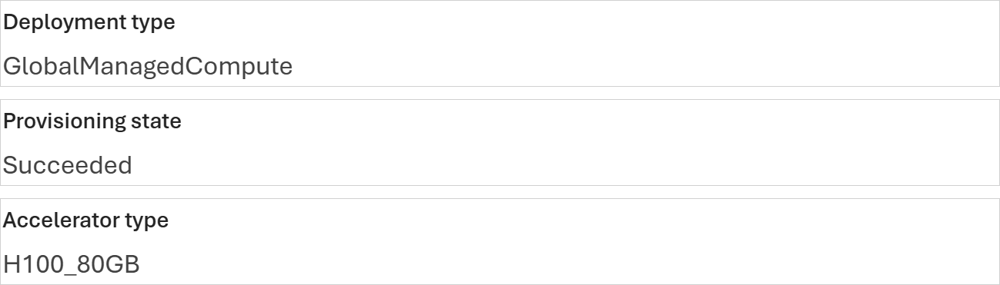
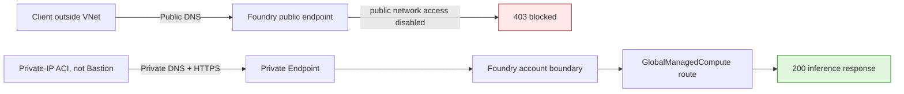

# Microsoft Foundry Managed Compute: Private Endpoint Validation

[](https://learn.microsoft.com/azure/foundry/concepts/foundry-models-overview)
[](https://learn.microsoft.com/azure/foundry/how-to/configure-private-link)
[](evidence/connectivity-run.json)
[](https://github.com/david-xinyuwei/david-share/actions/workflows/managed-compute-private-endpoint-ci.yml)
[](LICENSE)

This repository validates one precise network claim with a dedicated Foundry
account and real authenticated code calls. The same `GlobalManagedCompute`
deployment returned public `200` and private `200` while public access was
enabled. After the **parent Foundry account's** public access was disabled, the
outside request returned `403` while a private-IP ACI in the linked VNet still
returned `200`. Restoring the saved account state returned the public path to
`200`. This is an **inbound client-to-endpoint result only**; it is not a
pod-placement or egress claim.

This does **not** convert a deployment into a different "private model." The
deployment stays the same; the parent Foundry account enforces its public network
access setting and Private Endpoint access. A reproducible isolation test must use a dedicated
non-production Foundry account. Creating only a new project under a shared
account is insufficient because the network controls affect every child project.

> Author: 魏新宇 (Xinyu Wei)

[English](README.md) | [中文](README-CN.md)

[Measured result](#measured-result) · [Product evidence](#product-evidence) · [Quick start](#quick-start) · [Evidence](#evidence) · [Official sources](#official-sources)

---

## Configuration ownership

| Setting | Configuration surface | Responsible role | Minimum permission | Acceptance point |
|---|---|---|---|---|
| Managed Compute deployment | Foundry project | Model platform owner | Foundry project model deployment permission | Deployment is `Succeeded` |
| Public network access | Parent Foundry account | Foundry resource owner | Contributor on the account | Prior public network access state is saved; each requested state is read back |
| Private Endpoint connection | Customer VNet + parent Foundry account | Network owner and Foundry resource owner | Network Contributor + Contributor | Connection is `Approved` and `Succeeded` |
| Private DNS zones and VNet links | Customer Azure subscription | DNS/network owner | Private DNS Zone Contributor or equivalent | Workload client resolves a private address |
| Client route, VPN, or ExpressRoute | Customer network | Enterprise network owner | Organization-specific | Port 443 reaches the private endpoint |
| Private probe runner | Workload subnet in the linked VNet | Application/network owner | Ability to run Python and obtain the approved inference identity's token | Private DNS, TCP 443, and a valid Chat Completions `200` all pass; temporary runner cleanup has an owner |
| Inference identity | Entra ID and Foundry data-plane RBAC | Identity owner | Permission to invoke Chat Completions on the tested deployment | The same principal returns a valid completion before and after the network-policy change |

The key operational point is that networking is configured on the **parent
Foundry account boundary**, not in the individual Managed Compute deployment
dialog.

## What this repository validates

| Capability | Measured observation | Evidence |
|---|---|---|
| Global Managed Compute was the tested deployment type | The dedicated-run Foundry page showed `qwen--qwen3-32b`, `GlobalManagedCompute`, `Succeeded`, and `H100_80GB` | [Redacted field crops](images/product-ui/deployment-facts.png) |
| Public access enforcement applied to a request addressed to the Managed Compute deployment | Authenticated request outside the VNet returned `403` with `Public access is disabled`; the rejection is an account-boundary result, not proof of where inside the route it was produced | [Run evidence](evidence/connectivity-run.json) |
| Private Endpoint carried a real inference request | The same probe source ran in private-IP ACI, resolved to a private (RFC 1918) address, and returned Chat Completions `200` before and after public network access was disabled; Private Endpoint use is inferred from the private DNS class, not from an address match against the Private Endpoint NIC | [Generated code transcript](evidence/cli-transcript.txt) |
| Safe post-test network state | Public access was restored, public inference returned `200`, and both private ACI probes terminated with exit code `0` | [Post-test record](evidence/raw/post-test-state.json) |
| Resource and billing boundary | Temporary resources remain because cleanup was not authorized; billing continues while Managed Compute remains deployed | [Post-test record](evidence/raw/post-test-state.json) |

**This does not prove that managed pods are injected into the customer VNet.**
It also does not prove that Managed Compute egress traverses the customer VNet,
that prompts or completions have zero retention, or that this single preview run is production
ready. Only the parent account's `*.services.ai.azure.com` route was tested; the
run does not show whether the Managed Compute deployment exposes any other inbound hostname.
The measured claim is inbound client-to-endpoint isolation only.

## Measured result

The test kept the Foundry account, deployment, endpoint, Entra identity, and
request payload fixed. Only the caller network path and the parent account's
public-network-access setting changed.

Run ID: `managed-compute-private-link-dedicated-20260831` · Date: 2026-08-31 · Scope:
single-run inbound connectivity differential.

| Scenario | DNS | Authenticated HTTP result | Status | Evidence |
|---|---|---:|---|---|
| Client outside VNet, public access enabled | Public address | `200` — real Chat Completions response | PASS | [`public-baseline.json`](evidence/raw/public-baseline.json) |
| Private-IP ACI in linked VNet, public access enabled | Private address | `200` — pre-disable safety check | PASS | [`private-preflight.json`](evidence/raw/private-preflight.json) |
| Client outside VNet, public access disabled | Public address | `403` — public access disabled | PASS | [`public-blocked.json`](evidence/raw/public-blocked.json) |
| Private-IP ACI in linked VNet, public access disabled | Private address | `200` — real Chat Completions response | PASS | [`private-success.json`](evidence/raw/private-success.json) |
| Client outside VNet, public access restored | Public address | `200` — same model endpoint responded; choice content was not retained | PASS | [`public-restored.json`](evidence/raw/public-restored.json) |

The private runner was Azure Container Instances with a private IP in a linked
VNet workload subnet. It sent HTTPS to the privately resolved address; it
was **not Azure Bastion**. Both ACI probes ran the same `probe_endpoint.py`
source hash and exited with code `0`. Generated content and resolved addresses
are omitted; request IDs are represented only as SHA-256 digests. Probe
timestamps establish order, not a latency distribution.

## Code-path evidence

The dedicated run used this repository's Python HTTPS probe with a Microsoft
Entra token. Its actual sanitized probe outputs were retained. The block below
is generated from those validated live observations by
[`scripts/build_evidence.py`](scripts/build_evidence.py); it is a direct-reading
view, not a fabricated terminal screenshot.

The probe that ran emitted only `hostnameSha256` and `requestIdSha256`. The five
SHA-256 fingerprints in the block were derived after the run, at
`2026-08-31T06:45:33.338213+00:00`, from the five retained command receipts and
the shared Azure CLI profile; they bind the stages to one probe source, Entra
subject, endpoint, deployment, and serialized request without publishing those
values, but they are not probe output. The endpoint, deployment, and request
digests are recomputable from the real argv values; the identity digest needs
the tenant and object IDs. The bytes that ran are not the current
`scripts/probe_endpoint.py`; retrieve them with
`git show 762b69780da73c9f9ca21c28508349755a980820:Deep-Learning/Managed-Compute-Private-Endpoint/scripts/probe_endpoint.py`
(LF `ff0eac11…`; the CRLF Windows checkout that executed hashes to `d2d99524…`).

<!-- BEGIN GENERATED CLI EVIDENCE -->
```text
CODE_PATH_EVIDENCE
RUN_ID=managed-compute-private-link-dedicated-20260831
DATE_UTC=2026-08-31
EVIDENCE_CLASS=derived-sanitized-view-of-live-code-observations
ORIGINAL_TERMINAL_CAPTURE=false
CLIENT=Python HTTPS client with Microsoft Entra bearer token
ACTUAL_PROBE_OUTPUT_RETAINED=true
REPRODUCTION_ENTRYPOINT=scripts/probe_endpoint.py (current version; not the bytes that ran)
MEASURED_PROBE_COMMIT=762b69780da73c9f9ca21c28508349755a980820
MEASURED_PROBE_RETRIEVAL=git show 762b69780da73c9f9ca21c28508349755a980820:Deep-Learning/Managed-Compute-Private-Endpoint/scripts/probe_endpoint.py
MEASURED_PROBE_EXECUTED_BYTES_SHA256=d2d99524ff6a3fd5b37789d0557b9bb0af8155ccffa8fb75c1e382de799ea7f6 (CRLF checkout)
MEASURED_PROBE_LF_SHA256=ff0eac11b956c3b2327402cdf245f9e4cc045688a9cedd4de8a29a4cbe6bb639
MODEL_DEPLOYMENT_CHANGED=false
FINGERPRINT_CLASS=derived-post-run
FINGERPRINTS_EMITTED_BY_MEASURED_PROBE=false
FINGERPRINTS_DERIVED_AT_UTC=2026-08-31T06:45:33.338213+00:00
PROBE_SOURCE_SHA256=d2d99524ff6a3fd5b37789d0557b9bb0af8155ccffa8fb75c1e382de799ea7f6
IDENTITY_SHA256=887146420b45005bf903fd183eda936b0e3fee00aa6be67a91a47f0546b54e6c
ENDPOINT_SHA256=5e8cfa4be4c9aa5803d351815eceacece53477c04e26695a928e80c93935246b
DEPLOYMENT_SHA256=4d87fdbcba1fe6671069062752306ee4957a40c6ac281803b423c80ddd682776
REQUEST_SHA256=c4c06fac9fe6ed09d3f3117ca538e1f1d9e8be12330d5ef9b36284b6e4120804
NETWORK_CONTROL=parent Foundry account public network access plus Private Endpoint
PRIVATE_RUNNER=private-IP Azure Container Instances in a linked VNet workload subnet (not Bastion)
PRIVATE_PATH_EVIDENCE=dnsClass=private only; resolved address not compared with the Private Endpoint NIC
ENDPOINT=https://<foundry-account>.services.ai.azure.com/openai/v1/chat/completions
DEPLOYMENT=<managed-compute-deployment>
PROMPT="Reply with exactly OK."
MAX_TOKENS=4
TEMPERATURE=0

REPRODUCTION_CLI=python scripts/probe_endpoint.py --endpoint <endpoint> --deployment <deployment> --expect-dns <public|private> --expect-http <status> --prompt "Reply with exactly OK." --max-tokens 4

[1/5] OUTSIDE_VNET_PNA_ENABLED_BASELINE
OBSERVED_AT_UTC=2026-08-31T05:52:07.510094+00:00
DNS_CLASS=public
HTTP_STATUS=200
RESPONSE_OBJECT=chat.completion
RESPONSE_MODEL=qwen--qwen3-32b
RESULT=PASS
SOURCE=evidence/raw/public-baseline.json

[2/5] INSIDE_LINKED_VNET_PNA_ENABLED_PREFLIGHT
OBSERVED_AT_UTC=2026-08-31T05:53:43.009747+00:00
DNS_CLASS=private
HTTP_STATUS=200
RESPONSE_OBJECT=chat.completion
RUNNER_EXIT_CODE=0
PROBE_SOURCE_SHA256=d2d99524ff6a3fd5b37789d0557b9bb0af8155ccffa8fb75c1e382de799ea7f6 (launcher receipt)
RESULT=PASS
SOURCE=evidence/raw/private-preflight.json

[3/5] OUTSIDE_VNET_PNA_DISABLED
OBSERVED_AT_UTC=2026-08-31T06:06:03.530809+00:00
DNS_CLASS=public
HTTP_STATUS=403
ERROR_CATEGORY=public-access-disabled
NETWORK_POLICY_BLOCKED=true
REQUEST_ID_SHA256=0bca43fc944a7328def2b961d977e09767bce02d11a2ea8322a1d6ec3594217b
RESULT=PASS
SOURCE=evidence/raw/public-blocked.json

[4/5] INSIDE_LINKED_VNET_PNA_DISABLED
OBSERVED_AT_UTC=2026-08-31T06:07:39.938843+00:00
DNS_CLASS=private
HTTP_STATUS=200
RESPONSE_OBJECT=chat.completion
RESPONSE_MODEL=qwen--qwen3-32b
PROBE_SOURCE_SHA256=d2d99524ff6a3fd5b37789d0557b9bb0af8155ccffa8fb75c1e382de799ea7f6 (launcher receipt)
TOKENS=prompt:13 completion:4 total:17
RUNNER_EXIT_CODE=0
REQUEST_ID_SHA256=eb511b575cc023ba02e44edcd13e61d578bac32b120f7029eac249dc7f776065
RESULT=PASS
SOURCE=evidence/raw/private-success.json

[5/5] OUTSIDE_VNET_PNA_RESTORED
OBSERVED_AT_UTC=2026-08-31T06:12:14.739435+00:00
DNS_CLASS=public
HTTP_STATUS=200
RESPONSE_MODEL=qwen--qwen3-32b
REQUEST_ID_SHA256=50f4ebab5abb8a5f5c735b8b67ee09b1a301e3edb1cc0ce5cf9d29488c40a0c2
RESULT=PASS
SOURCE=evidence/raw/public-restored.json
```
<!-- END GENERATED CLI EVIDENCE -->

## Product evidence

### The deployment was Managed Compute



*Run `managed-compute-private-link-dedicated-20260831`, 2026-08-31. Four field-level crops retain the model, deployment type, provisioning state, and accelerator. Account, project, deployment, endpoint, identity, tenant, and subscription fields are omitted. UI identifies the tested object; the generated code transcript proves network behavior.*

### Traffic paths



*Original explanatory diagram based on the measured differential and the official Foundry Private Link documentation. It describes the client ingress path, not pod placement. The 403 is drawn at the account boundary because that is where the evidence places it.*

## Executable assets

| Path | Contract |
|---|---|
| [`infra/main.bicep`](infra/main.bicep) | Connects an existing PE subnet to group `account`; either creates and links all three Foundry Private DNS zones or consumes a complete customer-managed zone-ID object |
| [`scripts/probe_endpoint.py`](scripts/probe_endpoint.py) | Sends the same authenticated request and asserts DNS class plus HTTP status without printing a token |
| [`scripts/submit_private_aci_probe.py`](scripts/submit_private_aci_probe.py) | Runs the exact probe source in a private-IP ACI; the container hashes the bytes it executes; the Entra token is injected only as an ARM `secureValue`; an existing name is never updated |
| [`scripts/set_public_network_access.py`](scripts/set_public_network_access.py) | Fails closed unless an Approved PE exists before disabling public access; ETag preconditions reject concurrent account changes (added after the measured run; unit-tested, no live measurement) |
| [`tests/`](tests/) | Exercises the CLI entry point, response semantics, zero-PATCH refusal matrix, saved-state restore, raw evidence mutations, and Rule Catalog mutations |
| [`evidence/`](evidence/) | Sanitized run contract, measurements, source lock, UI hashes, and Level 5 rule results |

## Quick start

All snippets below use **Bash**. Use a control runner with Azure CLI for account
and deployment commands, a client outside the linked VNet for public probes,
and an approved runner in a separate workload subnet for private probes. Make
this repository available on every probe runner. The private runner needs
Python 3.11+, DNS through the linked VNet, outbound TCP 443 to the endpoint, and
either an authenticated Azure CLI session or an `AZURE_ACCESS_TOKEN` supplied
through a secure process environment. Use the same Entra principal, endpoint,
deployment, prompt, and token limit for every probe.

Azure prerequisites: a dedicated non-production Foundry account whose child
projects are all disposable test assets, commercial cloud, Contributor on the parent Foundry
account, Network Contributor on the target VNet/subnet, and Private DNS Zone
Contributor (or equivalent) where the zones are created. The Private Endpoint
subnet must already exist and allow Private Endpoints. The application/network
owner is responsible for the workload runner and its cleanup.

```bash
git clone --filter=blob:none --sparse https://github.com/david-xinyuwei/david-share.git
git -C david-share sparse-checkout set Deep-Learning/Managed-Compute-Private-Endpoint
cd david-share/Deep-Learning/Managed-Compute-Private-Endpoint
python -m unittest discover -s tests -v
```

Confirm the intended Azure account. These commands have no resource side effects:

```bash
az account set --subscription "<subscription-id>"
az account show --query "{subscription:id,tenant:tenantId,user:user.name}" --output json
```

Set the parent account and existing Private Endpoint subnet IDs. The template
derives the VNet from the subnet ID, preventing a PE/DNS-link VNet mismatch.
Preview the exact change:

```bash
FOUNDRY_ACCOUNT_ID="/subscriptions/<subscription-id>/resourceGroups/<resource-group>/providers/Microsoft.CognitiveServices/accounts/<foundry-account>"
PE_SUBNET_ID="/subscriptions/<subscription-id>/resourceGroups/<network-resource-group>/providers/Microsoft.Network/virtualNetworks/<vnet>/subnets/<private-endpoint-subnet>"
VNET_ID="${PE_SUBNET_ID%/subnets/*}"
CURRENT_SUBSCRIPTION_ID="$(az account show --query id --output tsv)"
PE_SUBSCRIPTION_ID="${PE_SUBNET_ID#/subscriptions/}"
PE_SUBSCRIPTION_ID="${PE_SUBSCRIPTION_ID%%/*}"
PRIVATE_ENDPOINT_LOCATION="$(az network vnet show --ids "$VNET_ID" --query location --output tsv)"
test "$PE_SUBSCRIPTION_ID" = "$CURRENT_SUBSCRIPTION_ID" || { echo "Private Endpoint and VNet must use the same subscription." >&2; exit 1; }
test -n "$PRIVATE_ENDPOINT_LOCATION" || { echo "Unable to read the VNet region." >&2; exit 1; }

az deployment group what-if \
  --resource-group "<resource-group>" \
  --template-file infra/main.bicep \
  --parameters \
      foundryAccountResourceId="$FOUNDRY_ACCOUNT_ID" \
      privateEndpointSubnetResourceId="$PE_SUBNET_ID" \
      privateEndpointLocation="$PRIVATE_ENDPOINT_LOCATION"
```

After reviewing the what-if output, deploy the Private Endpoint and supported
Foundry Private DNS zones. In the default mode below, the deployment owns the
three zones and their VNet links:

```bash
az deployment group create \
  --resource-group "<resource-group>" \
  --template-file infra/main.bicep \
  --parameters \
      foundryAccountResourceId="$FOUNDRY_ACCOUNT_ID" \
      privateEndpointSubnetResourceId="$PE_SUBNET_ID" \
      privateEndpointLocation="$PRIVATE_ENDPOINT_LOCATION"
```

For enterprise central DNS, pass the complete typed
`existingPrivateDnsZoneResourceIds` object with the three keys
`cognitiveservices`, `openai`, and `servicesAi`. In that mode the template does
not create zones or VNet links; the DNS owner must pre-link the zones or provide
custom DNS forwarding, and the private probe is the acceptance check. See the
[full procedure](docs/reproduction.md#central-dns-mode).

From a client inside the linked VNet, prove private DNS and inference before
disabling public access:

> This pre-disable `200` is both a fail-closed safety gate and stage 2 of the
> five-stage measured run.

```bash
python scripts/probe_endpoint.py \
  --endpoint "https://<foundry-account>.services.ai.azure.com/openai/v1/chat/completions" \
  --deployment "<managed-compute-deployment>" \
  --expect-dns private \
  --expect-http 200 \
  --prompt "Reply with exactly OK." \
  --max-tokens 4 \
  --output private-probe.json
```

Only after that passes, disable public access and save the exact prior state:

```bash
python scripts/set_public_network_access.py \
  --subscription-id "<subscription-id>" \
  --resource-group "<resource-group>" \
  --account-name "<foundry-account>" \
  --state Disabled \
  --confirm-dedicated-test-account \
  --private-probe-evidence private-probe.json \
  --save-prior-state pna-before.json
```

Keep `pna-before.json` on the trusted control runner and do not commit or edit
it. The current script marks the receipt `applied` only after Azure read-back confirms
`Disabled`, records the account ETag before and after disable, sends both PATCH
operations with `If-Match`, and refuses to restore from an incomplete receipt or
after the account ETag has changed. The 2026-08-31 run executed the earlier
`762b6978` version of this script, which saved and restored the prior state
without ETag preconditions; ETag enforcement has unit tests but no live measurement here.
If the receipt is stuck at `prepared` or an unrelated account change moved the ETag,
the script refuses by design; use the
[manual restore](docs/reproduction.md#manual-restore) instead. The receipt prevents
accidental misuse but is not an authorization boundary: Azure RBAC remains authoritative.

From outside the linked VNet, prove that the authenticated public request is
blocked specifically by the network policy:

```bash
python scripts/probe_endpoint.py \
  --endpoint "https://<foundry-account>.services.ai.azure.com/openai/v1/chat/completions" \
  --deployment "<managed-compute-deployment>" \
  --expect-dns public \
  --expect-http 403 \
  --prompt "Reply with exactly OK." \
  --max-tokens 4 \
  --output public-blocked-probe.json
```

From the workload runner inside the linked VNet, repeat the same request after
public network access is disabled:

```bash
python scripts/probe_endpoint.py \
  --endpoint "https://<foundry-account>.services.ai.azure.com/openai/v1/chat/completions" \
  --deployment "<managed-compute-deployment>" \
  --expect-dns private \
  --expect-http 200 \
  --prompt "Reply with exactly OK." \
  --max-tokens 4 \
  --output private-after-disable-probe.json
```

Restore the value captured before the test; do not hard-code `Enabled`:

```bash
python scripts/set_public_network_access.py \
  --subscription-id "<subscription-id>" \
  --resource-group "<resource-group>" \
  --account-name "<foundry-account>" \
  --restore-state-from pna-before.json
```

If `pna-before.json` records `priorState: Enabled`, prove the restored public
path with the same request:

```bash
python scripts/probe_endpoint.py \
  --endpoint "https://<foundry-account>.services.ai.azure.com/openai/v1/chat/completions" \
  --deployment "<managed-compute-deployment>" \
  --expect-dns public \
  --expect-http 200 \
  --prompt "Reply with exactly OK." \
  --max-tokens 4 \
  --output public-restored-probe.json
```

Done-when: the parent account equals its saved prior public network access state. When that state
was `Enabled`, the final public probe also returns a valid Chat Completions
`200`; when it was `Disabled`, the private path remains `200` and the public
path remains blocked. See
[`docs/reproduction.md`](docs/reproduction.md) for the complete validation and
cleanup sequence.

## Evidence

| Asset | Purpose |
|---|---|
| [`evidence/connectivity-run.json`](evidence/connectivity-run.json) | Sanitized control-plane and public/private data-plane observations |
| [`evidence/cli-transcript.txt`](evidence/cli-transcript.txt) | Generated direct-reading view of the authenticated Python 200/200/403/200/200 observations |
| [`evidence/raw/`](evidence/raw/) | Sanitized source observations from which the connectivity result is generated; scenario files hold only probe- or launcher-emitted fields |
| [`evidence/run-contract.json`](evidence/run-contract.json) | Frozen question, acceptance conditions, and changed variable |
| [`evidence/provenance.json`](evidence/provenance.json) | Public/private evidence boundary, time basis, runner method, and retained-resource state |
| [`evidence/ui-evidence.json`](evidence/ui-evidence.json) | Image hashes, redactions, and per-image claim boundaries |
| [`evidence/source-lock.json`](evidence/source-lock.json) | Official URLs and immutable documentation commits |
| [`evidence/rule-results.json`](evidence/rule-results.json) | Generated Level 5 rule-by-rule result |

The files under `evidence/raw/` are the earliest **public-safe sanitized
observations**, not byte-for-byte Azure logs. Their hashes and the native gate
detect drift inside this repository; they do not independently authenticate the
withheld private source. This limitation is explicit in the provenance record.

## Official sources

- [Configure network isolation for Microsoft Foundry](https://learn.microsoft.com/azure/foundry/how-to/configure-private-link)
- [Microsoft Foundry Models overview](https://learn.microsoft.com/azure/foundry/concepts/foundry-models-overview)
- [Create a Private Endpoint with Azure CLI](https://learn.microsoft.com/azure/private-link/create-private-endpoint-cli)

The current public Managed Compute deployment how-to is marked classic-only.
This repository therefore does not infer the new `GlobalManagedCompute` behavior
from classic managed online endpoints; the central claim comes from the recorded
2026-08-31 live differential.
