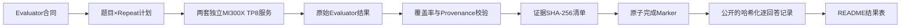

# MiMo-V2.5-Pro 在 AMD MI300X 上的准确率评测

[](https://www.amd.com/en/products/accelerators/instinct/mi300/mi300x.html)
[](https://huggingface.co/XiaomiMiMo/MiMo-V2.5-Pro)
[](https://github.com/sgl-project/sglang)
[](data/results-summary.json)
[](scripts/validate_repo.py)

本仓库记录 **Xiaomi MiMo-V2.5-Pro** 在两台独立8× AMD Instinct MI300X节点上的阶段性准确率评测。仓库逐项对齐MI300X实测环境与H200参考方法，明确列出每个数据集的总题数、已测不同题数、Repeat（重复次数）、有效回答数和覆盖率，并将每项MI300X准确率关联到可独立复算的逐回答审计记录。

> **快照边界：** 截至2026-07-24，共覆盖3,216道不同题、8,080次有效回答。这是阶段性子集快照，不是134,239次回答的最终全量评测。
>
> **H200边界：** H200准确率来自评测指南提供的参考值，本项目没有独立复测H200结果。

[English](README.md) | 中文版 | [参数对齐](docs/parameter-alignment-CN.md) | [机器可读结果](data/results-summary.json) | [证据模型](docs/evidence-and-reproducibility-CN.md)

## 执行摘要

当前快照包含四个有代表性的阶段子集，以及AIME和CMMLU两个较小样本。四行MI300X子集分数高于H200参考值，CMMLU与参考值接近；但AIME只有16次有效回答。这里的差值只表示**阶段子集上的方向性观察**，不能当作硬件排名：双方覆盖范围、部署拓扑、Attention backend（注意力后端）并不相同，H200原始输出也没有在本项目中独立复算。

| 数据集 | 数据集总题数 | 已验证不同题数 | 最终Repeat | 已验证回答数 | MI300X准确率 | H200参考准确率 | 方向性差值 | 回答覆盖率 | 证据阶段 |
|---|---:|---:|---:|---:|---:|---:|---:|---:|---|
| AIME24_25 | 60 | 16 | 32 | 16 | **100.0000%** | 90.30% | +9.70 pp | 0.83% | 已验证Canary（小样本门禁） |
| CMMLU | 11,582 | 128 | 3 | 384 | **89.8438%** | 90.10% | -0.26 pp | 1.11% | 前128题已完成3遍 |
| MinervaMath | 5,000 | 1,536 | 3 | 4,608 | **97.6128%** | 93.60% | +4.01 pp | 30.72% | 已验证阶段子集 |
| MMLU-Pro | 12,032 | 512 | 2 | 1,024 | **89.3555%** | 85.10% | +4.26 pp | 4.26% | 已验证阶段子集 |
| MMLU-Redux | 5,330 | 512 | 6 | 1,536 | **96.2240%** | 94.97% | +1.25 pp | 4.80% | 前512题完成3/6遍 |
| SuperGPQA | 26,529 | 512 | 1 | 512 | **70.3125%** | 62.40% | +7.91 pp | 1.93% | 已验证阶段子集 |

**总体覆盖：** 3,216 / 60,533道不同题（**5.31%**），8,080 / 134,239次回答（**6.02%**）。仓库不计算跨数据集“总准确率”，因为六项任务的题量、Repeat和任务含义不同。

### 如何公平阅读结果表

- **数据集总题数**：最终合同中该数据集的不同题目数量。
- **已验证不同题数**：MI300X已经实际覆盖的不同题目数量。
- **已验证回答数**：包含Repeat。例如MMLU-Pro为512题×2遍=1,024次回答。
- **MI300X准确率**：从[`data/raw-audit/`](data/raw-audit/)中的逐回答二值metric独立复算。
- **H200参考准确率**：评测指南提供的参考值，不是本仓库复测结果。
- **方向性差值**：在覆盖范围不一致时做的简单百分点运算，不能解释为受控的GPU优劣结论。

## 1. 评测范围

六项最终合同共包含60,533道不同题；计入Repeat后，共134,239次回答：

| 数据集 | 最终题数 | Repeat | 最终回答数 | Temperature | Top-p | Max tokens |
|---|---:|---:|---:|---:|---:|---:|
| AIME24_25 | 60 | 32 | 1,920 | 1.0 | 0.95 | 65,536 |
| CMMLU | 11,582 | 3 | 34,746 | 0 | 1 | 16,384 |
| MinervaMath | 5,000 | 3 | 15,000 | 0 | 1 | 16,384 |
| MMLU-Pro | 12,032 | 2 | 24,064 | 0 | 1 | 16,384 |
| MMLU-Redux | 5,330 | 6 | 31,980 | 0 | 1 | 16,384 |
| SuperGPQA | 26,529 | 1 | 26,529 | 0 | 1 | 16,384 |
| **合计** | **60,533** | — | **134,239** | — | — | — |

AIME额外设置`chat_template_kwargs.enable_thinking=true`，最终答案从boxed表达式中提取；其他数据集沿用各自evaluator的选项或数学答案提取逻辑。

## 2. 硬件与Runtime（运行环境）

两台节点分别运行独立服务，没有组合成跨节点TP16。

| 对齐面 | MI300X实测Runtime | H200参考方法 | 可比性 |
|---|---|---|---|
| 硬件 | 两台独立节点，每台8× MI300X | H200多节点参考部署 | 硬件与部署规模不同 |
| 服务拓扑 | 每台Unified TP8 / DP1 / EP1 / PP1 | TP16 / DP2 / EP16 / PP1 | 必要的拓扑适配 |
| Attention backend | AITER | FA3 | 面向不同硬件的后端替换 |
| Quantization | FP8 | FP8 | 对齐 |
| Context length | 1,048,576 | 1,048,576 | 对齐 |
| Page size | 1 | 1 | 对齐 |
| Max running requests | 128 | 128 | 对齐 |
| Speculative decoding | EAGLE，3步、top-k 1、4个draft token、Multi-Layer、自然接受率 | 相同EAGLE控制项 | 控制项对齐，但后端和拓扑仍不同 |
| 采样与评分 | 见上方evaluator合同 | 相同evaluator合同 | 在现有证据范围内对齐 |

完整的39项启动参数映射见[`docs/parameter-alignment-CN.md`](docs/parameter-alignment-CN.md)。

### MI300X Runtime身份

| 组件 | 已验证身份 |
|---|---|
| Runtime代际 | AMD `20260713-final` |
| Image ID | `sha256:ffebe707eed74aa20994b7d0d81a967c65fe18c97e4c4626ccd8eb1dc1f02def` |
| SGLang commit | `2f9b9aedf32977bc5d088a86ec0a73bcf432a4d0` |
| AITER commit | `00e94abf15e1e09ab7cf481e989bca5d19a99b82` |
| 推理dtype | FP8 |
| 接受率方法 | EAGLE自然接受率；未设置模拟接受长度 |

## 3. 方法与验收门禁



只有满足以下门禁的结果才能进入本仓库：

1. 发布子集的题号和回答数完整。
2. response、prediction和metric数组长度一致。
3. metric只能为0或1；准确率必须从逐回答metric重算。
4. 有显式Repeat provenance时必须验证；旧结果只有聚合顺序时，明确披露缺口，不伪造Repeat编号。
5. 空回答只有在evaluator记录`finish_reason=length`、达到配置Token上限且按错题计分时才可接受。
6. Runtime image、evaluator、dataset和结果文件均记录SHA。
7. 失败或中断但没有原子完成Marker的分块不得进入成绩。

## 4. 证据与独立复算

公开审计记录不会重新分发benchmark题目、答案和模型长回答。每条公开记录保留：

- 数据集、题号、Repeat provenance和metric；
- 可用时保留finish reason及Token数量；
- prompt、答案、prediction、response和response ID的SHA-256；
- 私有源文件索引、完整文件SHA和大小。

因此，外部读者可以独立复算准确率、检查重复和覆盖范围，同时不会获得完整题库或模型生成文本。

```bash
python scripts/validate_repo.py .
```

validator会重算六项准确率、核对最终合同总数、验证公开审计文件SHA，并确认README中的数字与`data/results-summary.json`一致。

## 5. Evaluator修改

评测逻辑来自供应方提供的evaluator环境；本快照没有找到允许对外重新分发六个完整evaluator文件的公开许可证，因此仓库不直接复制其完整源码。

[`patches/`](patches/)提供：

- 每个evaluator的原始SHA与修改后SHA；
- 六份统一diff，精确展示修改内容；
- 应用这些控制项的patch工具。

修改内容包括：可选样本窗口、Repeat控制与provenance、请求失败即终止、实时进度、response metadata和严格validator。默认全量采样与评分规则仍由原始evaluator定义。

## 6. 失败与排除记录

失败运行属于方法论证据，但不进入准确率：

- 部分高并发运行触发GPU memory-access fault或scheduler watchdog。
- 只有客户端部分进度、没有完整artifact和完成Marker的运行会被排除。
- 对不稳定任务降低并发只影响耗时和稳定性，不改变temperature、top-p、max tokens、答案提取和评分。
- HTTP失败、缺失回答或中断请求不会被静默改写为错题。

## 7. 限制

1. 当前快照只覆盖最终回答合同的6.02%。
2. AIME只有16次有效回答，不具备统计代表性。
3. MMLU-Redux只覆盖前512题的前3/6遍。
4. MI300X与H200的服务拓扑和Attention backend不同。
5. 本项目没有H200原始输出，无法独立复算H200分数。
6. 子集难度分布可能不等同于完整数据集。
7. 仓库不提供六项总准确率，也不宣布硬件胜负。

## 8. 仓库结构

```text
MiMo-V2.5-Pro-MI300X-Accuracy-Evaluation/
├── README.md / README-CN.md
├── docs/                 # 参数对齐和证据方法
├── data/
│   ├── results-summary.json / .tsv
│   ├── raw-audit/        # 每个数据集一份脱敏审计JSONL
│   ├── evidence/         # 私有源artifact哈希与清单
│   └── *-contract.json
├── patches/              # evaluator原始→修改后diff及SHA
├── scripts/              # 快照生成器、validator、runner和patcher
└── reports/              # 质量门与数字审计
```

## 9. 结果更新流程

新结果不能手工改进README。更新流程为：

1. 分块完成并通过私有validator；
2. 保存原子Marker和证据manifest；
3. 从已验证私有artifact重建公开快照；
4. 运行`python scripts/validate_repo.py .`；
5. 审核覆盖率和phase标签变化；
6. 提交不可变Git快照。

## 来源与数据边界

- 模型：[XiaomiMiMo/MiMo-V2.5-Pro](https://huggingface.co/XiaomiMiMo/MiMo-V2.5-Pro)。
- MI300X硬件信息：[AMD Instinct MI300X](https://www.amd.com/en/products/accelerators/instinct/mi300/mi300x.html)。
- 推理框架：[SGLang](https://github.com/sgl-project/sglang)。
- H200数值：评测指南提供的参考准确率；本仓库不分发原始指南和benchmark语料。

本仓库只报告实测证据和明确限制，不宣称客户验收、生产认证、全量non-inferiority（非劣效性），也不提供受控的H200与MI300X硬件排名。
