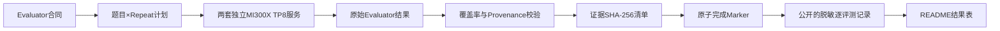

# MiMo-V2.5-Pro 在 AMD MI300X 上的准确率评测

[](https://www.amd.com/en/products/accelerators/instinct/mi300/mi300x.html)
[](https://huggingface.co/XiaomiMiMo/MiMo-V2.5-Pro)
[](https://github.com/sgl-project/sglang)
[](data/results-summary.json)
[](scripts/validate_repo.py)

本仓库以**详细、专业、公平、公正、每个数字有据可查**为目标，记录 Xiaomi MiMo-V2.5-Pro 在两台独立8× AMD Instinct MI300X节点上的阶段性准确率评测，并与评测指南提供的NVIDIA H200参考准确率进行方向性对照。

> **快照边界：** 截至2026-07-24，共覆盖3,216道不同题、8,080条已验证评测记录。这是阶段性子集快照，不是134,239次回答的最终全量评测。
>
> **H200边界：** H200准确率来自评测指南提供的参考值。本项目没有H200原始输出，因此没有独立复算H200分数。
>
> **结论边界：** 本仓库不计算六项“总准确率”，不宣布硬件胜负，不宣称全量non-inferiority（非劣效性）、生产认证或客户验收。

---

## 1. 执行摘要

| 数据集 | 总题数 | 已验证题数 | 最终合同Repeat | 当前Repeat覆盖 | 已验证评测记录 | 长度上限空输出 | 正确数 | MI300X准确率 | H200参考 | 方向性差值 | 记录覆盖率 |
|---|---:|---:|---:|---|---:|---:|---:|---:|---:|---:|---:|
| AIME24_25 | 60 | 16 | 32 | 1遍（Canary） | 16 | 0 | 16 | **100.0000%** | 90.30% | +9.70 pp | 0.83% |
| CMMLU | 11,582 | 128 | 3 | 前128题3/3遍 | 384 | 0 | 345 | **89.8438%** | 90.10% | -0.26 pp | 1.11% |
| MinervaMath | 5,000 | 1,536 | 3 | 前1,536题3/3遍 | 4,608 | 17 | 4,498 | **97.6128%** | 93.60% | +4.01 pp | 30.72% |
| MMLU-Pro | 12,032 | 512 | 2 | 前512题2/2遍 | 1,024 | 28 | 915 | **89.3555%** | 85.10% | +4.26 pp | 4.26% |
| MMLU-Redux | 5,330 | 512 | 6 | 前512题3/6遍 | 1,536 | 4 | 1,478 | **96.2240%** | 94.97% | +1.25 pp | 4.80% |
| SuperGPQA | 26,529 | 512 | 1 | 前512题1/1遍 | 512 | 58 | 360 | **70.3125%** | 62.40% | +7.91 pp | 1.93% |

**总体覆盖：**

- 不同题目：3,216 / 60,533，覆盖率**5.31%**；
- 已验证评测记录：8,080 / 134,239，合同覆盖率**6.02%**；
- 非空输出：7,973；达到16,384 Token上限并按错题计分的空输出：107；
- 正确回答：7,612；
- 六个完整数据集完成数：**0 / 6**。

### 1.1 如何公平阅读结果表

- **数据集总题数**是最终合同中该数据集的不同题目数量。
- **已验证不同题数**是MI300X实际覆盖的不同题目数量。
- **已验证评测记录**包含Repeat。例如MMLU-Pro为512题×2遍=1,024条评测记录。
- 107条空输出均有`finish_reason=length`和16,384 completion tokens，属于Evaluator完成的长度上限错题，不是HTTP/传输失败，因此按原评分规则保留在分母中。
- **MI300X准确率**由[`data/raw-audit/`](data/raw-audit/)中的逐评测二值metric独立复算。
- **H200参考准确率**来自评测指南，不是本仓库复测结果。
- **方向性差值**是覆盖范围不一致时的简单百分点运算，不能解释为受控的GPU优劣结论。
- 子集难度分布可能与完整数据集不同；AIME的16次回答尤其不具备统计代表性。

---

## 2. 为什么不同数据集的Temperature不一样

**Temperature不同是数据集Evaluator（评测器）合同的差异，不是H200与MI300X测试条件不一致。**

| 数据集 | Temperature | Top-p | Repeat | 为什么采用该设置 |
|---|---:|---:|---:|---|
| AIME24_25 | 1.0 | 0.95 | 32 | AIME是开放式数学推理任务，Evaluator要求采样32遍，用多次推理统计模型在随机推理路径下的正确率；同时启用thinking并提取boxed最终答案。 |
| CMMLU | 0 | 1 | 3 | 选择题/知识推理使用确定性解码，避免采样噪声；Repeat用于验证稳定性，而不是制造随机答案。 |
| MinervaMath | 0 | 1 | 3 | 数学答案需要可复现的确定性输出和归一化评分。 |
| MMLU-Pro | 0 | 1 | 2 | 高难选择题采用确定性解码，保证两遍使用相同采样协议。 |
| MMLU-Redux | 0 | 1 | 6 | 清洗版多学科评测使用确定性解码，通过6遍覆盖Evaluator合同。 |
| SuperGPQA | 0 | 1 | 1 | 专家级选择题仅需一遍确定性解码。 |

### 2.1 公平性判断

公平对比要求的是：

> **同一个数据集在H200和MI300X上使用相同Temperature、Top-p、Max tokens、Prompt、答案提取器和评分规则。**

协议层面遵守该原则：H200参考方法与MI300X方法都声明AIME采用`temperature=1.0 / top_p=0.95`，其余五项采用`temperature=0 / top_p=1`。MI300X实际summary的配置和SHA已进入机器可读证据；由于H200原始输出与逐响应metadata不可用，H200执行层一致性标记为`NOT VERIFIED`。如果为了表面统一而把六项强改为同一Temperature，反而会偏离原始Evaluator合同。

Max tokens也遵循同一逻辑：AIME的长链路数学推理上限为65,536，其他五项为16,384；该差异在H200参考方法和MI300X实测方法中按数据集保持一致。

---

## 3. 六项最终评测合同

| 数据集 | 最终题数 | Repeat | 最终回答数 | Temperature | Top-p | Max tokens |
|---|---:|---:|---:|---:|---:|---:|
| AIME24_25 | 60 | 32 | 1,920 | 1.0 | 0.95 | 65,536 |
| CMMLU | 11,582 | 3 | 34,746 | 0 | 1 | 16,384 |
| MinervaMath | 5,000 | 3 | 15,000 | 0 | 1 | 16,384 |
| MMLU-Pro | 12,032 | 2 | 24,064 | 0 | 1 | 16,384 |
| MMLU-Redux | 5,330 | 6 | 31,980 | 0 | 1 | 16,384 |
| SuperGPQA | 26,529 | 1 | 26,529 | 0 | 1 | 16,384 |
| **合计** | **60,533** | — | **134,239** | — | — | — |

AIME额外设置`chat_template_kwargs.enable_thinking=true`，最终答案从boxed表达式中提取。其余数据集沿用各自Evaluator的选项或数学答案提取逻辑。

---

## 4. 硬件、拓扑与Runtime身份

两台MI300X节点分别运行独立Unified服务，没有组合成跨节点TP16。

| 对齐面 | MI300X实测Runtime | H200参考方法 | 可比性 |
|---|---|---|---|
| 硬件 | 两台独立节点，每台8× MI300X | H200多节点参考部署 | 硬件与部署规模不同 |
| 服务拓扑 | 每台Unified TP8 / DP1 / EP1 / PP1 | TP16 / DP2 / EP16 / PP1 | 必要的拓扑适配 |
| Attention backend | AITER | FA3 | 面向不同硬件的后端替换 |
| Quantization | FP8 | FP8 | 对齐 |
| Context length | 1,048,576 | 1,048,576 | 对齐 |
| Page size | 1 | 1 | 对齐 |
| Max running requests | 128 | 128 | 对齐 |
| Speculative decoding | EAGLE，3步、top-k 1、4个draft token、Multi-Layer、自然接受率 | 相同EAGLE控制项 | 控制项对齐，但后端和拓扑仍不同 |
| 采样与评分 | 第3节Evaluator合同 | 相同Evaluator合同 | 在现有证据范围内对齐 |

### 4.1 MI300X Runtime身份

| 组件 | 已验证身份 |
|---|---|
| Runtime代际 | AMD `20260713-final` |
| Image ID | `sha256:ffebe707eed74aa20994b7d0d81a967c65fe18c97e4c4626ccd8eb1dc1f02def` |
| SGLang commit | `2f9b9aedf32977bc5d088a86ec0a73bcf432a4d0` |
| AITER commit | `00e94abf15e1e09ab7cf481e989bca5d19a99b82` |
| 推理dtype | FP8 |
| 接受率方法 | EAGLE自然接受率；未设置模拟接受长度 |

---

## 5. H200参考方法与MI300X启动参数逐项对齐

“对齐”表示参数和值一致；“拓扑适配”和“后端替换”表示公开披露的差异，不会被静默视为等价。

| # | H200参考设置 | MI300X实测设置 | 状态 | 原因 |
|---:|---|---|---|---|
| 1 | `python3 -m sglang.launch_server` | `python3 -u -m sglang.launch_server` | 等价 | `-u`只影响日志缓冲。 |
| 2 | 参考模型路径 | 本地MiMo-V2.5-Pro路径 | 环境适配 | 路径与部署环境相关，不公开内部位置。 |
| 3 | `--trust-remote-code` | 相同 | 对齐 | — |
| 4 | `--pp-size 1` | `--pp-size 1` | 对齐 | — |
| 5 | `--dp-size 2` | `--dp-size 1` | 拓扑适配 | 每台MI300X节点独立运行一套服务。 |
| 6 | `--ep-size 16` | `--ep-size 1` | 拓扑适配 | 本次稳定MI300X实测路径使用EP1。 |
| 7 | `--tp-size 16` | `--tp-size 8` | 拓扑适配 | 每套服务使用本机全部8张MI300X。 |
| 8 | `--moe-dense-tp-size 1` | 相同 | 对齐 | — |
| 9 | `--enable-dp-attention` | 未设置 | 不适用 | DP1不启用DP Attention。 |
| 10 | `--dist-init-addr ...` | 未设置 | 不适用 | 独立单节点服务不组成跨节点group。 |
| 11 | `--node-rank ...` | 未设置 | 不适用 | — |
| 12 | `--nnodes ...` | 未设置 | 不适用 | — |
| 13 | `--page-size 1` | 相同 | 对齐 | — |
| 14 | `--attention-backend fa3` | `--attention-backend aiter` | 后端替换 | FA3面向NVIDIA Hopper；MI300X使用AMD AITER。 |
| 15 | `--quantization fp8` | 相同 | 对齐 | — |
| 16 | `--mem-fraction-static 0.8` | 相同 | 对齐 | — |
| 17 | `--max-running-requests 128` | 相同 | 对齐 | — |
| 18 | `--context-length 1048576` | 相同 | 对齐 | — |
| 19 | `--tokenizer-worker-num 64` | 相同 | 对齐 | — |
| 20 | `--speculative-algorithm EAGLE` | 相同 | 对齐 | — |
| 21 | `--speculative-num-steps 3` | 相同 | 对齐 | — |
| 22 | `--speculative-eagle-topk 1` | 相同 | 对齐 | — |
| 23 | `--speculative-num-draft-tokens 4` | 相同 | 对齐 | — |
| 24 | `--enable-multi-layer-eagle` | 相同 | 对齐 | — |
| 25 | `--host 0.0.0.0` | 节点本地加速网络地址 | 网络适配 | 不公开内部地址。 |
| 26 | 参考端口 | 部署本地端口 | 网络适配 | 端口不改变采样与评分。 |
| 27 | `--reasoning-parser qwen3` | 相同 | 对齐 | — |
| 28 | `--tool-call-parser mimo` | 相同 | 对齐 | — |
| 29 | `--watchdog-timeout 3600` | 相同 | 对齐 | — |
| 30 | 多线程模型加载，64线程 | 相同 | 对齐 | — |
| 31 | `--log-level-http warning` | 相同 | 对齐 | — |
| 32 | `--enable-cache-report` | 相同 | 对齐 | 仅影响观测。 |
| 33 | `--collect-tokens-histogram` | 相同 | 对齐 | 仅影响观测。 |
| 34 | `--enable-metrics` | 相同 | 对齐 | 仅影响观测。 |
| 35 | TTFT bucket：`0.1 ... 7200` | 相同24项数列 | 对齐 | 仅影响观测。 |
| 36 | E2E latency bucket：`0.1 ... 7200` | 相同24项数列 | 对齐 | 仅影响观测。 |
| 37 | `--decode-log-interval 1` | 相同 | 对齐 | 仅影响观测。 |
| 38 | `--enable-metrics-for-all-schedulers` | 相同 | 对齐 | 仅影响观测。 |
| 39 | `SGLANG_ENABLE_SPEC_V2=1` | 相同 | 对齐 | 已在实测Runtime中验证。 |

### 5.1 AMD Runtime附加控制项

| 控制项 | 值 | 用途 |
|---|---|---|
| `SGLANG_USE_AITER` | `1` | 启用AMD AITER kernel路径。 |
| `SGLANG_MOE_PADDING` | `1` | 启用本次实测的AMD MoE padding路径。 |
| `SGLANG_ROCM_FUSED_DECODE_MLA` | `1` | 启用ROCm fused decode MLA。 |
| `SGLANG_SET_CPU_AFFINITY` | `1` | 稳定进程放置。 |
| `HSA_NO_SCRATCH_RECLAIM` | `1` | 固定本次Runtime的HSA scratch行为。 |
| `SGLANG_SPEC_NAN_DETECTION` | `1` | speculative decoding出现NaN时失败关闭。 |
| `SGLANG_SPEC_OOB_DETECTION` | `1` | 检测speculative decoding越界。 |
| `SGLANG_USE_AITER_CK_BLOCKSCALE_BPRESHUFFLE` | `1` | 启用已验证的block-scale B-preshuffle路径。 |
| 模拟接受率变量 | 未设置 | 准确率测试使用EAGLE自然接受率。 |

### 5.2 参数对齐的边界

参数映射对齐了模型、量化、采样合同、speculative decoding控制项、context length和评分路径，但不会把TP8/DP1/EP1/AITER解释为与TP16/DP2/EP16/FA3在性能或通信行为上等价。在双方都没有完整、匹配的原始输出前，准确率差异只能作为方向性观察。

---

## 6. 评测方法与验收门禁



只有满足以下门禁的结果才能进入主结果表：

1. 发布子集的题号和回答数完整；
2. response、prediction和metric数组长度一致；
3. metric只能为0或1，准确率从逐评测metric重算；
4. 有显式Repeat provenance时必须验证；旧结果只有聚合顺序时明确披露，不伪造Repeat编号；
5. 空回答只有在Evaluator记录`finish_reason=length`、达到配置Token上限并按错题计分时才可接受；
6. Runtime image、Evaluator、dataset和结果文件记录SHA-256；
7. 失败或中断但没有原子完成Marker的分块不得进入成绩。

### 6.1 独立复算

```bash
python scripts/validate_repo.py .
```

该命令验证：

- 六个数据集条目；
- 最终合同60,533题、134,239次回答；
- 当前快照3,216道已观察题、8,080条已验证评测记录；
- 审计文件SHA、行数、二值metric、唯一审计键和准确率；
- README关键数字与`data/results-summary.json`一致。

---

## 7. 证据链与公开数据结构

### 7.1 公开逐评测审计记录

[`data/raw-audit/`](data/raw-audit/)中的每条记录保留：

- 数据集、题号、Repeat provenance和二值metric；
- 可用时记录finish reason和Token数量；
- 私有源artifact索引与完整artifact SHA；
- 不公开prompt、答案、prediction、response全文或逐内容哈希。

公开记录不包含原始题目、答案和模型长回答，避免重新分发benchmark语料，同时仍允许外部读者独立复算准确率、检查重复和覆盖范围。

### 7.2 Provenance限制

- AIME有显式Repeat ID；
- CMMLU Repeat 0由已验证的单遍旧Canary推定，Repeat 1–2有显式provenance；
- MMLU-Redux有显式Repeat ID；
- SuperGPQA合同只有1遍，旧单回答记录明确标为推定；
- MinervaMath每题保留3个有序回答slot，但旧artifact没有显式Repeat ID；
- MMLU-Pro可证明配置了2遍并验证聚合结果，但旧artifact无法给出逐Repeat归因。

这些限制不影响当前聚合子集准确率的复算，但不支持更强的逐Repeat结论。

### 7.3 数据文件索引

| 文件/目录 | 用途 |
|---|---|
| [`data/results-summary.json`](data/results-summary.json) | README所有结果数字的机器可读唯一来源 |
| [`data/results-summary.tsv`](data/results-summary.tsv) | 六项扁平结果表 |
| [`data/raw-audit/`](data/raw-audit/) | 8,080条脱敏逐评测记录 |
| [`data/evidence/private-source-manifest.json`](data/evidence/private-source-manifest.json) | 泛化源ID、完整artifact SHA、大小和行数 |
| [`data/evidence/SHA256SUMS.txt`](data/evidence/SHA256SUMS.txt) | Repo证据文件总SHA清单 |
| [`data/xiaomi-final-contract.json`](data/xiaomi-final-contract.json) | 六项最终题数、Repeat和回答合同 |
| [`data/balanced-stage-contract.json`](data/balanced-stage-contract.json) | 阶段子集合同 |

---

## 8. Evaluator修改与公开代码边界

评测逻辑来自供应方提供的Evaluator环境。本快照没有找到允许公开重新分发完整Evaluator或其源码diff的许可证，因此仓库既不复制完整第三方源码，也不公开包含上游源码上下文的diff和patch工具。

### 8.1 原始与修改后SHA

| Evaluator | 原始SHA-256 | 修改后SHA-256 |
|---|---|---|
| AIME | `8fff6f7a13e770247c631e4b1fddec0187bf6dcc74ea80c78b30923346dca284` | `3a037372f04a55dfe57b4db5b4f6ddf56119a36ca413e19cdb4494b87ec1aea5` |
| CMMLU | `dc2d52357e4ecbc84262b38f997446b14454188e6c949e15f0f0bc9d075be0ef` | `f38c3b1ba67a6d4aadc3eceb7309e2461b1e59b43e4d83e2fcd3323d1eea4647` |
| MinervaMath | `d8e483a06f4e3abe6836d3e1f8c817fa841f38be55d0cc2c43cc0d6521c19466` | `198164c64292b4abb6826003f5d9badf09b709dab08dbbd5356d13e9c1a78451` |
| MMLU-Pro | `dacc6416f05e782a1e07716ce7b80499092646d559e3efe9081823d5bbdf54d4` | `c9ea740cab11fbeed576d2e29cfe0bfcaa2e61fea1dfe40827d078a350184542` |
| MMLU-Redux | `69d3538d8b1029e67ac2dd75cfdbb67f40fac14260d1eae4de94829497919989` | `8a818ff989679c075a538eb53830e28f870578fd00bcf83385f6cadd982a6684` |
| SuperGPQA | `88e4afa44af04715db9d9d9c4f7df576657c69fca5f8e7da1498b55e18a3bff8` | `1ff7070b3977b2636d4f8adf5eb3a39b821678b60d63ca5793d7b6e2d8a6f486` |

完整哈希承诺见[`patches/evaluator-hashes.tsv`](patches/evaluator-hashes.tsv)。它证明本次使用的输入与修改后文件身份，但外部读者仍需合法获得上游Evaluator才能复现完整执行。

### 8.2 修改内容

修改只增加可选控制和审计能力：

- sample window与offset；
- Repeat范围与Repeat provenance；
- 请求失败即终止，禁止将传输失败静默计为错题；
- live progress；
- response metadata；
- 严格结果validator；
- 去重补测与原子Marker。

默认全量Prompt、答案提取和评分规则仍由原始Evaluator定义。

### 8.3 自有代码索引

| 文件 | 用途 |
|---|---|
| [`scripts/build_public_snapshot.py`](scripts/build_public_snapshot.py) | 从私有已验证artifact生成公开脱敏快照 |
| [`scripts/validate_repo.py`](scripts/validate_repo.py) | 在公开快照上复算准确率、覆盖率、SHA、安全边界和单README门禁 |

---

## 9. 失败运行与排除规则

失败运行是方法论证据，但不进入准确率：

- 部分高并发尝试触发GPU memory-access fault或scheduler watchdog；
- 只有客户端部分进度、没有完整artifact和完成Marker的运行被排除；
- 对不稳定任务降低并发只影响耗时和稳定性，不改变Temperature、Top-p、Max tokens、答案提取和评分；
- HTTP失败、缺失回答或中断请求不会被静默改写为错题；
- 截止本快照时，所有未完整收口的运行结果均未进入8,080条已验证评测记录。

---

## 10. 局限与禁止过度解读

1. 当前只覆盖最终回答合同的6.02%；
2. AIME只有16条已验证评测记录，不具备统计代表性；
3. MMLU-Redux只覆盖前512题的前3/6遍；
4. MI300X与H200的服务拓扑和Attention backend不同；
5. 本项目没有H200原始输出，无法独立复算H200分数；
6. 子集难度分布可能不等同于完整数据集；
7. 不提供跨六项总准确率；
8. 不声明统计显著性、H200/MI300X硬件胜负、客户验收或生产认证。

---

## 11. SOP-68 Repo质量检查结果

| 质量门 | 状态 | 证据与结论 | 剩余风险 |
|---|---|---|---|
| 通用Repo质量 | PASS | `scripts/validate_repo.py`、Python语法、Markdown fence和链接检查通过 | 当前仍是阶段快照 |
| MI300X采样协议执行证据 | PASS | 私有summary SHA证明六项实际Temperature、Top-p、Max tokens与Evaluator合同一致 | 完整私有summary不公开，仅发布SHA承诺 |
| H200 matched-sample公平性 | NOT VERIFIED / DIRECTIONAL | 参考指南给出协议和分数，但没有H200原始输出、题号子集或逐响应配置可交叉验证 | 不声明严格公平比较或硬件胜负 |
| 数字审计 | PASS | 6项、3,216题、8,080条记录、7,612正确均由逐评测metric复算 | 子集不代表全量分布 |
| Data/Code/Evidence一致性 | PASS | `results-summary.json → raw-audit JSONL → README`链路通过 | MinervaMath/MMLU-Pro旧结果逐Repeat归因有限 |
| Public安全边界 | PASS | 无凭据、IP、内部端口、绝对路径、题目/答案/prediction/回答全文或低熵答案哈希 | 旧公开commit曾含低熵答案哈希；未获授权不执行历史重写 |
| Evaluator身份可审计性 | PASS（身份承诺） | 记录6个原始/修改后SHA，不分发许可证未知的源码、diff或anchor | 完整复现需合法获得上游环境 |
| 单README呈现 | PASS | 仓库仅保留根目录本文件一个Markdown；其他资产为JSON/TSV/JSONL、SHA和代码 | 无 |
| 在线可访问性 | PENDING | 本地质量门通过后，以新commit的GitHub页面、README和结果文件验收 | 当前线上仍是上一版 |
| Push workflow | PENDING | 完成本地全量门后提交到`master` | 当前新版本尚未push |
| GitHub Pages | BLOCKED（与本项目无关） | Monorepo既有子模块缺少`.gitmodules` URL；本项目加入前连续多个commit同样失败 | 不影响GitHub Repo页面访问 |
| AI中文母语/双语审校 | NOT VERIFIED | 本次未调用独立授权语言审校服务 | 不宣称经过独立AI语言审校 |
| 多模型Super Review | N/A | 用户要求SOP Repo质量检查，未要求多模型Review | — |

### 11.1 数字审计表

| 数字声明 | 来源 | 复算 | 判定 |
|---|---|---|---|
| 60,533最终题数 | `data/xiaomi-final-contract.json` | 六项题数求和 | PASS |
| 134,239最终回答数 | 同上 | 题数×Repeat后求和 | PASS |
| 3,216已观察题数 | 六份`data/raw-audit/*.jsonl` | 按数据集统计唯一question ID | PASS |
| 8,080已验证评测记录 | 六份审计JSONL | 行数求和 | PASS |
| 7,973非空输出 / 107长度上限空输出 | 六份审计JSONL | `response_empty`与`finish_reason=length`复算 | PASS |
| 7,612正确回答 | 六份审计JSONL | 二值metric求和 | PASS |
| 六项MI300X准确率 | 六份审计JSONL | correct / responses | PASS |
| 六项H200准确率 | 评测指南 | 作为参考值记录，未独立复算 | SCOPED |
| 5.31%题目覆盖率 | 3,216 / 60,533 | 脚本复算 | PASS |
| 6.02%回答覆盖率 | 8,080 / 134,239 | 脚本复算 | PASS |

---

## 12. Repo结构与结果更新

```text
MiMo-V2.5-Pro-MI300X-Accuracy-Evaluation/
├── README.md                  # 唯一说明文档：结果、方法、参数、证据、质量门
├── data/
│   ├── results-summary.json  # 结果数字唯一机器可读来源
│   ├── results-summary.tsv
│   ├── raw-audit/            # 8,080条脱敏逐评测审计记录
│   ├── evidence/             # 源artifact与Repo总SHA
│   └── *-contract.json
├── patches/                  # 六个Evaluator原始/修改后SHA承诺
└── scripts/                  # 公开快照生成器与Repo validator
```

新结果不能手工修改README。正确更新流程为：

1. 分块完成并通过私有validator；
2. 保存原子Marker和证据manifest；
3. 从已验证私有artifact重建公开快照；
4. 运行`python scripts/validate_repo.py .`；
5. 审核覆盖率、证据阶段和限制标签；
6. 更新本README结果表；
7. 提交不可变Git快照并线上复验。

---

## 13. 来源与数据边界

- 模型：[XiaomiMiMo/MiMo-V2.5-Pro](https://huggingface.co/XiaomiMiMo/MiMo-V2.5-Pro)；
- MI300X硬件信息：[AMD Instinct MI300X](https://www.amd.com/en/products/accelerators/instinct/mi300/mi300x.html)；
- 推理框架：[SGLang](https://github.com/sgl-project/sglang)；
- H200数值：评测指南提供的参考准确率；本仓库不重新分发原始指南和benchmark语料。

本仓库只报告实测证据、公开差异和明确限制。任何后续引用都必须同时保留已测题数、回答数、覆盖率和“阶段性子集”限定。
