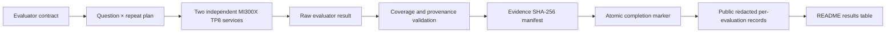

# MiMo-V2.5-Pro Accuracy Evaluation on AMD MI300X

[](https://www.amd.com/en/products/accelerators/instinct/mi300/mi300x.html)
[](https://huggingface.co/XiaomiMiMo/MiMo-V2.5-Pro)
[](https://github.com/sgl-project/sglang)
[](data/results-summary.json)
[](scripts/validate_repo.py)

English | [中文](README-CN.md)

This repository provides a **detailed, professional, fair, impartial, and evidence-backed** interim evaluation of Xiaomi MiMo-V2.5-Pro accuracy on two independent 8× AMD Instinct MI300X nodes. It also presents a directional comparison with NVIDIA H200 reference accuracies supplied in the evaluation guide.

> **Snapshot boundary:** As of 2026-07-24, the snapshot covers 3,216 unique questions and 8,080 validated evaluation records. It is an interim subset snapshot, not the completed 134,239-response evaluation.
>
> **H200 boundary:** H200 accuracies are reference values supplied in the evaluation guide. This project does not have H200 raw outputs and therefore cannot independently recompute the H200 scores.
>
> **Conclusion boundary:** This repository does not calculate a cross-dataset "overall accuracy," declare a hardware winner, or claim full-evaluation non-inferiority, production qualification, or customer acceptance.

---

## 1. Executive Summary

| Dataset | Total questions | Validated questions | Final contract repeats | Current repeat coverage | Validated evaluation records | Length-capped empty outputs | Correct | MI300X accuracy | H200 reference | Directional delta | Record coverage |
|---|---:|---:|---:|---|---:|---:|---:|---:|---:|---:|---:|
| AIME24_25 | 60 | 16 | 32 | 1 pass (canary) | 16 | 0 | 16 | **100.0000%** | 90.30% | +9.70 pp | 0.83% |
| CMMLU | 11,582 | 128 | 3 | First 128 questions, 3/3 passes | 384 | 0 | 345 | **89.8438%** | 90.10% | -0.26 pp | 1.11% |
| MinervaMath | 5,000 | 1,536 | 3 | First 1,536 questions, 3/3 passes | 4,608 | 17 | 4,498 | **97.6128%** | 93.60% | +4.01 pp | 30.72% |
| MMLU-Pro | 12,032 | 512 | 2 | First 512 questions, 2/2 passes | 1,024 | 28 | 915 | **89.3555%** | 85.10% | +4.26 pp | 4.26% |
| MMLU-Redux | 5,330 | 512 | 6 | First 512 questions, 3/6 passes | 1,536 | 4 | 1,478 | **96.2240%** | 94.97% | +1.25 pp | 4.80% |
| SuperGPQA | 26,529 | 512 | 1 | First 512 questions, 1/1 pass | 512 | 58 | 360 | **70.3125%** | 62.40% | +7.91 pp | 1.93% |

**Overall coverage:**

- Unique questions: 3,216 / 60,533, or **5.31%**;
- Validated evaluation records: 8,080 / 134,239, or **6.02%** of the contract;
- Non-empty outputs: 7,973; empty outputs that reached the 16,384-token ceiling and were scored as incorrect: 107;
- Correct responses: 7,612;
- Fully completed datasets: **0 / 6**.

### 1.1 How to Read the Results Fairly

- **Total questions** is the number of unique questions in the final contract for that dataset.
- **Validated questions** is the number of unique questions actually covered on MI300X.
- **Validated evaluation records** includes repeats. For example, MMLU-Pro has 512 questions × 2 passes = 1,024 records.
- All 107 empty outputs have `finish_reason=length` and 16,384 completion tokens. They are evaluator-completed, length-capped incorrect answers rather than HTTP or transport failures, so they remain in the denominator under the original scoring rule.
- **MI300X accuracy** is independently recomputed from per-evaluation binary metrics in [`data/raw-audit/`](data/raw-audit/).
- **H200 reference accuracy** comes from the evaluation guide and was not reproduced by this repository.
- **Directional delta** is simple percentage-point arithmetic over unmatched coverage and cannot be interpreted as a controlled GPU superiority result.
- Subset difficulty can differ from full-dataset difficulty. The 16 AIME responses are especially not statistically representative.

---

## 2. Why Temperature Differs Across Datasets

**The different Temperature values come from each dataset's evaluator contract, not from hardware-specific tuning. H200 execution-level parity remains subject to the `NOT VERIFIED` boundary.**

| Dataset | Temperature | Top-p | Repeats | Why this setting is used |
|---|---:|---:|---:|---|
| AIME24_25 | 1.0 | 0.95 | 32 | AIME is an open-ended mathematical reasoning task. The evaluator requires 32 sampled passes to measure accuracy across stochastic reasoning paths, with thinking enabled and a boxed final answer extracted. |
| CMMLU | 0 | 1 | 3 | Multiple-choice knowledge and reasoning uses deterministic decoding to avoid sampling noise; repeats test stability rather than create random answers. |
| MinervaMath | 0 | 1 | 3 | Mathematical answers require reproducible deterministic output and normalized scoring. |
| MMLU-Pro | 0 | 1 | 2 | Difficult multiple-choice questions use deterministic decoding so both passes follow the same sampling protocol. |
| MMLU-Redux | 0 | 1 | 6 | The cleaned multidisciplinary benchmark uses deterministic decoding and six passes under the evaluator contract. |
| SuperGPQA | 0 | 1 | 1 | The expert-level multiple-choice benchmark requires one deterministic pass. |

### 2.1 Fairness Assessment

A fair comparison requires:

> **For the same dataset, H200 and MI300X must use the same Temperature, Top-p, Max tokens, Prompt, answer extractor, and scoring rule.**

At the protocol level, this principle is followed: both the H200 reference method and the MI300X method specify `temperature=1.0 / top_p=0.95` for AIME and `temperature=0 / top_p=1` for the other five datasets. The MI300X result summaries record the actual configuration and SHA in machine-readable evidence. Because H200 raw outputs and per-response metadata are unavailable, H200 execution-level parity is marked `NOT VERIFIED`. Forcing all six datasets to use one Temperature would deviate from the original evaluator contracts rather than make the comparison fairer.

Max tokens follows the same rule: AIME allows 65,536 tokens for long-chain mathematical reasoning, while the other five datasets allow 16,384. MI300X summaries verify those limits. The H200 reference method declares the same settings, but its execution-level parity remains subject to the boundary above.

---

## 3. Final Six-Dataset Evaluation Contract

| Dataset | Final questions | Repeats | Final responses | Temperature | Top-p | Max tokens |
|---|---:|---:|---:|---:|---:|---:|
| AIME24_25 | 60 | 32 | 1,920 | 1.0 | 0.95 | 65,536 |
| CMMLU | 11,582 | 3 | 34,746 | 0 | 1 | 16,384 |
| MinervaMath | 5,000 | 3 | 15,000 | 0 | 1 | 16,384 |
| MMLU-Pro | 12,032 | 2 | 24,064 | 0 | 1 | 16,384 |
| MMLU-Redux | 5,330 | 6 | 31,980 | 0 | 1 | 16,384 |
| SuperGPQA | 26,529 | 1 | 26,529 | 0 | 1 | 16,384 |
| **Total** | **60,533** | — | **134,239** | — | — | — |

AIME additionally sets `chat_template_kwargs.enable_thinking=true` and extracts the final answer from a boxed expression. The other datasets retain their evaluator-specific option or mathematical-answer extraction logic.

---

## 4. Hardware, Topology, and Runtime Identity

The two MI300X nodes each ran an independent Unified service. They were not combined into a cross-node TP16 deployment.

| Alignment surface | MI300X measured runtime | H200 reference method | Comparability |
|---|---|---|---|
| Hardware | Two independent nodes, each with 8× MI300X | Multi-node H200 reference deployment | Different hardware and deployment scale |
| Service topology | Unified TP8 / DP1 / EP1 / PP1 per node | TP16 / DP2 / EP16 / PP1 | Necessary topology adaptation |
| Attention backend | AITER | FA3 | Hardware-specific backend substitution |
| Quantization | FP8 | FP8 | Aligned |
| Context length | 1,048,576 | 1,048,576 | Aligned |
| Page size | 1 | 1 | Aligned |
| Max running requests | 128 | 128 | Aligned |
| Speculative decoding | EAGLE, 3 steps, top-k 1, 4 draft tokens, Multi-Layer, natural acceptance | Same EAGLE controls | Controls aligned; backend and topology still differ |
| Sampling and scoring | Evaluator contract in Section 3 | Same evaluator contract | Aligned within available evidence |

### 4.1 MI300X Runtime Identity

| Component | Validated identity |
|---|---|
| Runtime generation | AMD `20260713-final` |
| Image ID | `sha256:ffebe707eed74aa20994b7d0d81a967c65fe18c97e4c4626ccd8eb1dc1f02def` |
| SGLang commit | `2f9b9aedf32977bc5d088a86ec0a73bcf432a4d0` |
| AITER commit | `00e94abf15e1e09ab7cf481e989bca5d19a99b82` |
| Inference dtype | FP8 |
| Acceptance method | Natural EAGLE acceptance; no simulated acceptance length |

---

## 5. Line-by-Line Alignment of H200 Reference and MI300X Launch Parameters

"Aligned" means the parameter and value match. "Topology adaptation" and "backend substitution" identify disclosed differences and are not silently treated as equivalent.

| # | H200 reference setting | MI300X measured setting | Status | Reason |
|---:|---|---|---|---|
| 1 | `python3 -m sglang.launch_server` | `python3 -u -m sglang.launch_server` | Equivalent | `-u` only changes log buffering. |
| 2 | Reference model path | Local MiMo-V2.5-Pro path | Environment adaptation | Paths depend on the deployment environment; internal paths are not published. |
| 3 | `--trust-remote-code` | Same | Aligned | — |
| 4 | `--pp-size 1` | `--pp-size 1` | Aligned | — |
| 5 | `--dp-size 2` | `--dp-size 1` | Topology adaptation | Each MI300X node runs an independent service. |
| 6 | `--ep-size 16` | `--ep-size 1` | Topology adaptation | The stable measured MI300X path uses EP1. |
| 7 | `--tp-size 16` | `--tp-size 8` | Topology adaptation | Each service uses all eight local MI300X GPUs. |
| 8 | `--moe-dense-tp-size 1` | Same | Aligned | — |
| 9 | `--enable-dp-attention` | Not set | Not applicable | DP1 does not enable DP Attention. |
| 10 | `--dist-init-addr ...` | Not set | Not applicable | Independent single-node services do not form a cross-node group. |
| 11 | `--node-rank ...` | Not set | Not applicable | — |
| 12 | `--nnodes ...` | Not set | Not applicable | — |
| 13 | `--page-size 1` | Same | Aligned | — |
| 14 | `--attention-backend fa3` | `--attention-backend aiter` | Backend substitution | FA3 targets NVIDIA Hopper; MI300X uses AMD AITER. |
| 15 | `--quantization fp8` | Same | Aligned | — |
| 16 | `--mem-fraction-static 0.8` | Same | Aligned | — |
| 17 | `--max-running-requests 128` | Same | Aligned | — |
| 18 | `--context-length 1048576` | Same | Aligned | — |
| 19 | `--tokenizer-worker-num 64` | Same | Aligned | — |
| 20 | `--speculative-algorithm EAGLE` | Same | Aligned | — |
| 21 | `--speculative-num-steps 3` | Same | Aligned | — |
| 22 | `--speculative-eagle-topk 1` | Same | Aligned | — |
| 23 | `--speculative-num-draft-tokens 4` | Same | Aligned | — |
| 24 | `--enable-multi-layer-eagle` | Same | Aligned | — |
| 25 | `--host 0.0.0.0` | Node-local accelerated-network address | Network adaptation | Internal addresses are not published. |
| 26 | Reference port | Deployment-local port | Network adaptation | The port does not change sampling or scoring. |
| 27 | `--reasoning-parser qwen3` | Same | Aligned | — |
| 28 | `--tool-call-parser mimo` | Same | Aligned | — |
| 29 | `--watchdog-timeout 3600` | Same | Aligned | — |
| 30 | Multi-threaded model loading, 64 threads | Same | Aligned | — |
| 31 | `--log-level-http warning` | Same | Aligned | Observability only. |
| 32 | `--enable-cache-report` | Same | Aligned | Observability only. |
| 33 | `--collect-tokens-histogram` | Same | Aligned | Observability only. |
| 34 | `--enable-metrics` | Same | Aligned | Observability only. |
| 35 | TTFT buckets: `0.1 ... 7200` | Same 24-value sequence | Aligned | Observability only. |
| 36 | E2E latency buckets: `0.1 ... 7200` | Same 24-value sequence | Aligned | Observability only. |
| 37 | `--decode-log-interval 1` | Same | Aligned | Observability only. |
| 38 | `--enable-metrics-for-all-schedulers` | Same | Aligned | Observability only. |
| 39 | `SGLANG_ENABLE_SPEC_V2=1` | Same | Aligned | Verified in the measured runtime. |

### 5.1 Additional AMD Runtime Controls

| Control | Value | Purpose |
|---|---|---|
| `SGLANG_USE_AITER` | `1` | Enables the AMD AITER kernel path. |
| `SGLANG_MOE_PADDING` | `1` | Enables the measured AMD MoE padding path. |
| `SGLANG_ROCM_FUSED_DECODE_MLA` | `1` | Enables ROCm fused decode MLA. |
| `SGLANG_SET_CPU_AFFINITY` | `1` | Stabilizes process placement. |
| `HSA_NO_SCRATCH_RECLAIM` | `1` | Fixes HSA scratch behavior for the measured runtime. |
| `SGLANG_SPEC_NAN_DETECTION` | `1` | Fails closed when speculative decoding produces NaN. |
| `SGLANG_SPEC_OOB_DETECTION` | `1` | Detects speculative-decoding out-of-bounds access. |
| `SGLANG_USE_AITER_CK_BLOCKSCALE_BPRESHUFFLE` | `1` | Enables the validated block-scale B-preshuffle path. |
| Simulated-acceptance variable | Not set | Accuracy evaluation uses natural EAGLE acceptance. |

### 5.2 Alignment Boundary

The parameter mapping aligns the model, quantization, sampling contract, speculative-decoding controls, context length, and scoring path. It does not treat TP8/DP1/EP1/AITER as performance- or communication-equivalent to TP16/DP2/EP16/FA3. Until complete matched raw outputs exist for both systems, accuracy differences remain directional observations.

---

## 6. Evaluation Method and Acceptance Gates



Only results that pass all applicable gates enter the primary results table:

1. The published subset has complete question IDs and response counts;
2. Response, prediction, and metric arrays have matching lengths;
3. Metrics are binary, and accuracy is recomputed from per-evaluation metrics;
4. Explicit repeat provenance is validated when available; legacy aggregate ordering is disclosed rather than assigned invented repeat IDs;
5. An empty response is accepted only when the evaluator records `finish_reason=length`, reaches the configured token ceiling, and scores it as incorrect;
6. Runtime image, evaluator, dataset, and result files have recorded SHA-256 identities;
7. Failed or interrupted chunks without an atomic completion marker are excluded.

### 6.1 Independent Recalculation

```bash
python scripts/validate_repo.py .
```

This command validates:

- entries for all six datasets;
- the final contract of 60,533 questions and 134,239 responses;
- the current snapshot of 3,216 observed questions and 8,080 validated evaluation records;
- audit-file SHA values, line counts, binary metrics, unique audit keys, and accuracy;
- README key numbers against `data/results-summary.json`.

---

## 7. Evidence Chain and Public Data Structure

### 7.1 Public Per-Evaluation Audit Records

Each record in [`data/raw-audit/`](data/raw-audit/) retains:

- dataset, question ID, repeat provenance, and binary metric;
- finish reason and token counts when available;
- private source-artifact index and full artifact SHA;
- no prompt, answer, prediction, response text, or per-content hash.

The public records do not contain raw questions, answer keys, or long model responses. They still allow external readers to independently recompute accuracy and inspect duplicates and coverage without redistributing benchmark content.

### 7.2 Provenance Limitations

- AIME has explicit repeat IDs;
- CMMLU repeat 0 is inferred from a validated legacy single-pass canary, while repeats 1–2 have explicit provenance;
- MMLU-Redux has explicit repeat IDs;
- SuperGPQA has a one-pass contract, and the legacy single-response records are explicitly marked as inferred;
- MinervaMath retains three ordered response slots per question, but the legacy artifact has no explicit repeat IDs;
- MMLU-Pro proves that two passes were configured and validates the aggregate result, but the legacy artifact cannot attribute each response to a repeat.

These limitations do not prevent recomputation of the current aggregate subset accuracies, but they do not support stronger per-repeat conclusions.

### 7.3 Data File Index

| File or directory | Purpose |
|---|---|
| [`data/results-summary.json`](data/results-summary.json) | Machine-readable source of truth for every result number in the READMEs |
| [`data/results-summary.tsv`](data/results-summary.tsv) | Flat six-dataset results table |
| [`data/raw-audit/`](data/raw-audit/) | 8,080 redacted per-evaluation records |
| [`data/evidence/private-source-manifest.json`](data/evidence/private-source-manifest.json) | Generalized source IDs, full artifact SHA values, sizes, and line counts |
| [`data/evidence/SHA256SUMS.txt`](data/evidence/SHA256SUMS.txt) | SHA manifest for repository evidence files |
| [`data/xiaomi-final-contract.json`](data/xiaomi-final-contract.json) | Final question, repeat, and response contract for all six datasets |
| [`data/balanced-stage-contract.json`](data/balanced-stage-contract.json) | Interim balanced-stage contract |

---

## 8. Evaluator Modifications and Public Code Boundary

The evaluation logic comes from a supplier-provided evaluator environment. This snapshot did not find a license that permits redistribution of the complete evaluator or source-context diffs. The repository therefore neither copies the full third-party source nor publishes diffs or patching tools that contain upstream source context.

### 8.1 Original and Modified SHA Values

| Evaluator | Original SHA-256 | Modified SHA-256 |
|---|---|---|
| AIME | `8fff6f7a13e770247c631e4b1fddec0187bf6dcc74ea80c78b30923346dca284` | `3a037372f04a55dfe57b4db5b4f6ddf56119a36ca413e19cdb4494b87ec1aea5` |
| CMMLU | `dc2d52357e4ecbc84262b38f997446b14454188e6c949e15f0f0bc9d075be0ef` | `f38c3b1ba67a6d4aadc3eceb7309e2461b1e59b43e4d83e2fcd3323d1eea4647` |
| MinervaMath | `d8e483a06f4e3abe6836d3e1f8c817fa841f38be55d0cc2c43cc0d6521c19466` | `198164c64292b4abb6826003f5d9badf09b709dab08dbbd5356d13e9c1a78451` |
| MMLU-Pro | `dacc6416f05e782a1e07716ce7b80499092646d559e3efe9081823d5bbdf54d4` | `c9ea740cab11fbeed576d2e29cfe0bfcaa2e61fea1dfe40827d078a350184542` |
| MMLU-Redux | `69d3538d8b1029e67ac2dd75cfdbb67f40fac14260d1eae4de94829497919989` | `8a818ff989679c075a538eb53830e28f870578fd00bcf83385f6cadd982a6684` |
| SuperGPQA | `88e4afa44af04715db9d9d9c4f7df576657c69fca5f8e7da1498b55e18a3bff8` | `1ff7070b3977b2636d4f8adf5eb3a39b821678b60d63ca5793d7b6e2d8a6f486` |

The full hash commitments are in [`patches/evaluator-hashes.tsv`](patches/evaluator-hashes.tsv). They prove the identity of the original and modified files used in this evaluation, but external reproduction still requires lawful access to the upstream evaluator environment.

### 8.2 Modification Scope

The modifications only add optional control and audit capabilities:

- sample windows and offsets;
- repeat ranges and repeat provenance;
- fail-closed request handling so transport failures are not silently scored as incorrect;
- live progress;
- response metadata;
- strict result validation;
- deduplicated repair runs and atomic completion markers.

Default full-evaluation prompts, answer extraction, and scoring rules remain defined by the original evaluators.

### 8.3 First-Party Code Index

| File | Purpose |
|---|---|
| [`scripts/build_public_snapshot.py`](scripts/build_public_snapshot.py) | Builds a public redacted snapshot from private validated artifacts |
| [`scripts/validate_repo.py`](scripts/validate_repo.py) | Recomputes accuracy, coverage, SHA identities, public-safety boundaries, and the dual-README gate |

---

## 9. Failed Runs and Exclusion Rules

Failed runs are methodological evidence but do not enter the accuracy results:

- Some high-concurrency attempts triggered GPU memory-access faults or scheduler watchdog failures;
- Runs with partial client progress but no complete artifact and completion marker are excluded;
- Lower concurrency for unstable workloads changes duration and stability, not Temperature, Top-p, Max tokens, answer extraction, or scoring;
- HTTP failures, missing responses, and interrupted requests are not silently rewritten as incorrect answers;
- At this snapshot boundary, no incomplete run contributes to the 8,080 validated evaluation records.

---

## 10. Limitations and Prohibited Overinterpretation

1. The current snapshot covers only 6.02% of the final response contract;
2. AIME has only 16 validated evaluation records and is not statistically representative;
3. MMLU-Redux covers only the first 3 of 6 passes for the first 512 questions;
4. MI300X and H200 use different service topologies and Attention backends;
5. This project does not have H200 raw outputs and cannot independently recompute H200 scores;
6. Subset difficulty may differ from the complete dataset distribution;
7. No cross-dataset overall accuracy is reported;
8. The repository does not claim statistical significance, an H200/MI300X hardware winner, customer acceptance, or production qualification.

---

## 11. SOP-68 Repository Quality-Gate Results

| Quality gate | Status | Evidence and conclusion | Residual risk |
|---|---|---|---|
| General repository quality | PASS | `scripts/validate_repo.py`, Python syntax, Markdown fences, and link checks pass | This remains an interim snapshot |
| MI300X sampling-protocol execution evidence | PASS | Private summary SHA values prove the measured Temperature, Top-p, and Max tokens for all six datasets match the evaluator contracts | Full private summaries are not published; only SHA commitments are released |
| H200 matched-sample fairness | NOT VERIFIED / DIRECTIONAL | The reference guide provides the protocol and scores, but no H200 raw outputs, matched question subset, or per-response configuration is available | No strict fairness or hardware-superiority claim is made |
| Numeric audit | PASS | All six datasets, 3,216 questions, 8,080 records, and 7,612 correct responses are recomputed from per-evaluation metrics | The subset does not represent the full distribution |
| Data/code/evidence consistency | PASS | The `results-summary.json → raw-audit JSONL → README` chain passes | Legacy MinervaMath and MMLU-Pro results have limited per-repeat attribution |
| Public safety boundary | PASS | No credential, IP address, internal port, absolute path, prompt, answer, prediction, response text, or low-entropy answer hash is published | An older public commit contained low-entropy answer hashes; history is not rewritten without authorization |
| Evaluator identity auditability | PASS (identity commitment) | Six original and modified SHA pairs are recorded without redistributing license-unclear source, diffs, or anchors | Full reproduction requires lawful access to the upstream environment |
| Dual-README presentation | PASS | The repository contains only the root `README.md` and `README-CN.md` as Markdown files; all other assets are JSON, TSV, JSONL, SHA, or code | None |
| Online accessibility | PASS | The GitHub project page, both READMEs, the primary results table, Temperature explanation, and result files were opened and verified | The immutable commit is the final reference |
| Push workflow | PASS | The dual-README safety snapshot is committed and pushed to `master`, and local and remote SHA values match | GitHub Pages is tracked separately and is not required for repository-page availability |
| GitHub Pages | BLOCKED (unrelated to this project) | The monorepo has a pre-existing submodule without a `.gitmodules` URL; multiple commits before this project failed for the same reason | This does not affect GitHub repository-page access |
| AI native-Chinese and bilingual review | NOT VERIFIED | No independent authorized language-review service was invoked for this update | No claim of independent AI language review is made |
| Multi-model Super Review | N/A | The user requested the SOP repository quality gate, not a multi-model review | — |

### 11.1 Numeric Claims Audit

| Numeric claim | Source | Recalculation | Decision |
|---|---|---|---|
| 60,533 final questions | `data/xiaomi-final-contract.json` | Sum of six dataset question counts | PASS |
| 134,239 final responses | Same file | Sum of questions × repeats | PASS |
| 3,216 observed questions | Six `data/raw-audit/*.jsonl` files | Count unique question IDs by dataset | PASS |
| 8,080 validated evaluation records | Six audit JSONL files | Sum line counts | PASS |
| 7,973 non-empty / 107 length-capped empty outputs | Six audit JSONL files | Recompute `response_empty` and `finish_reason=length` | PASS |
| 7,612 correct responses | Six audit JSONL files | Sum binary metrics | PASS |
| Six MI300X accuracy values | Six audit JSONL files | Correct / responses | PASS |
| Six H200 accuracy values | Evaluation guide | Recorded as reference values; not independently recomputed | SCOPED |
| 5.31% question coverage | 3,216 / 60,533 | Recomputed by the validator | PASS |
| 6.02% response coverage | 8,080 / 134,239 | Recomputed by the validator | PASS |

---

## 12. Repository Structure and Result Updates

```text
MiMo-V2.5-Pro-MI300X-Accuracy-Evaluation/
├── README.md                  # English results, method, parameters, evidence, and gates
├── README-CN.md               # Chinese version with equivalent meaning
├── data/
│   ├── results-summary.json  # Machine-readable source of truth for result numbers
│   ├── results-summary.tsv
│   ├── raw-audit/            # 8,080 redacted per-evaluation audit records
│   ├── evidence/             # Source-artifact and repository SHA evidence
│   └── *-contract.json
├── patches/                  # Original and modified SHA commitments for six evaluators
└── scripts/                  # Public snapshot builder and repository validator
```

New results must not be inserted into the READMEs manually. The correct update workflow is:

1. Complete a chunk and pass the private validator;
2. Preserve the atomic marker and evidence manifest;
3. Rebuild the public snapshot from validated private artifacts;
4. Run `python scripts/validate_repo.py .`;
5. Review coverage, evidence phase, and limitation labels;
6. Update the English and Chinese results tables together;
7. Commit an immutable Git snapshot and verify it online.

---

## 13. Sources and Data Boundary

- Model: [XiaomiMiMo/MiMo-V2.5-Pro](https://huggingface.co/XiaomiMiMo/MiMo-V2.5-Pro);
- MI300X hardware: [AMD Instinct MI300X](https://www.amd.com/en/products/accelerators/instinct/mi300/mi300x.html);
- Serving framework: [SGLang](https://github.com/sgl-project/sglang);
- H200 values: reference accuracies supplied in the evaluation guide; this repository does not redistribute the original guide or benchmark corpus.

This repository reports only measured evidence, disclosed differences, and explicit limitations. Any downstream citation must preserve the tested question count, response count, coverage, and "interim subset" qualifier.