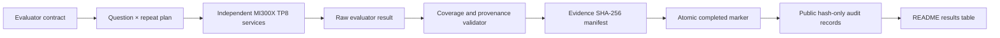

# MiMo-V2.5-Pro Accuracy Evaluation on AMD MI300X

[](https://www.amd.com/en/products/accelerators/instinct/mi300/mi300x.html)
[](https://huggingface.co/XiaomiMiMo/MiMo-V2.5-Pro)
[](https://github.com/sgl-project/sglang)
[](data/results-summary.json)
[](scripts/validate_repo.py)

A transparent, evidence-backed interim accuracy evaluation of **Xiaomi MiMo-V2.5-Pro** on two independent 8× AMD Instinct MI300X nodes. The repository aligns the tested MI300X runtime with the provided H200 reference method, reports exactly how much of each dataset was evaluated, and links every published MI300X score to recomputable per-response audit records.

> **Snapshot boundary:** 3,216 unique questions and 8,080 validated responses as of 2026-07-24. This is an interim subset snapshot, not a completed 134,239-response full evaluation.
>
> **H200 boundary:** H200 accuracies are reference values provided in the evaluation guide. They were not independently reproduced in this project.

English | [中文版](README-CN.md) | [Parameter alignment](docs/parameter-alignment.md) | [Machine-readable results](data/results-summary.json) | [Evidence model](docs/evidence-and-reproducibility.md)

## Executive Summary

The current snapshot validates four meaningful interim subsets plus two small canaries. MI300X subset scores are above the provided H200 reference in four rows, close in CMMLU, and based on only 16 AIME responses in the smallest row. These differences are **directional subset observations**, not statistical hardware rankings: coverage, topology, backend, and independently reproduced H200 raw outputs are not matched.

| Dataset | Dataset questions | Validated unique questions | Final repeats | Validated responses | MI300X accuracy | H200 reference accuracy | Directional delta | Response coverage | Evidence phase |
|---|---:|---:|---:|---:|---:|---:|---:|---:|---|
| AIME24_25 | 60 | 16 | 32 | 16 | **100.0000%** | 90.30% | +9.70 pp | 0.83% | Validated canary |
| CMMLU | 11,582 | 128 | 3 | 384 | **89.8438%** | 90.10% | -0.26 pp | 1.11% | Canary, all 3 repeats for first 128 questions |
| MinervaMath | 5,000 | 1,536 | 3 | 4,608 | **97.6128%** | 93.60% | +4.01 pp | 30.72% | Validated interim subset |
| MMLU-Pro | 12,032 | 512 | 2 | 1,024 | **89.3555%** | 85.10% | +4.26 pp | 4.26% | Validated interim subset |
| MMLU-Redux | 5,330 | 512 | 6 | 1,536 | **96.2240%** | 94.97% | +1.25 pp | 4.80% | First 3 of 6 repeats on 512 questions |
| SuperGPQA | 26,529 | 512 | 1 | 512 | **70.3125%** | 62.40% | +7.91 pp | 1.93% | Validated interim subset |

**Coverage totals:** 3,216 / 60,533 unique questions (**5.31%**) and 8,080 / 134,239 responses (**6.02%**). No cross-dataset aggregate accuracy is reported because dataset sizes, repeat counts, and task semantics differ.

### How to Read the Table Fairly

- **Dataset questions** is the full number of distinct questions in the final contract.
- **Validated unique questions** counts distinct questions observed on MI300X.
- **Validated responses** includes repeats. For example, MMLU-Pro is 512 questions × 2 repeats = 1,024 responses.
- **MI300X accuracy** is independently recomputed from binary per-response metrics in [`data/raw-audit/`](data/raw-audit/).
- **H200 reference accuracy** is copied from the provided guide; it is a reference, not a result reproduced by this repository.
- **Directional delta** is simple percentage-point arithmetic on unmatched coverage. It must not be interpreted as a controlled GPU superiority claim.

## 1. Evaluation Scope

The final six-dataset contract contains 60,533 distinct questions and 134,239 responses after repeats:

| Dataset | Final questions | Repeats | Final responses | Temperature | Top-p | Max tokens |
|---|---:|---:|---:|---:|---:|---:|
| AIME24_25 | 60 | 32 | 1,920 | 1.0 | 0.95 | 65,536 |
| CMMLU | 11,582 | 3 | 34,746 | 0 | 1 | 16,384 |
| MinervaMath | 5,000 | 3 | 15,000 | 0 | 1 | 16,384 |
| MMLU-Pro | 12,032 | 2 | 24,064 | 0 | 1 | 16,384 |
| MMLU-Redux | 5,330 | 6 | 31,980 | 0 | 1 | 16,384 |
| SuperGPQA | 26,529 | 1 | 26,529 | 0 | 1 | 16,384 |
| **Total** | **60,533** | — | **134,239** | — | — | — |

AIME additionally uses `chat_template_kwargs.enable_thinking=true` and extracts a boxed final answer. The other tasks use their evaluator-specific option or mathematical-answer extraction logic.

## 2. Hardware and Runtime

Two independent services ran in parallel; they were not combined into one cross-node TP16 service.

| Surface | MI300X measured runtime | H200 reference method | Comparability |
|---|---|---|---|
| Hardware | 2 independent nodes, each 8× MI300X | Multi-node H200 reference deployment | Different hardware and deployment scale |
| Service topology | Unified TP8 / DP1 / EP1 / PP1 per node | TP16 / DP2 / EP16 / PP1 | Necessary topology adaptation |
| Attention backend | AITER | FA3 | Hardware-specific backend substitution |
| Quantization | FP8 | FP8 | Aligned |
| Context length | 1,048,576 | 1,048,576 | Aligned |
| Page size | 1 | 1 | Aligned |
| Max running requests | 128 | 128 | Aligned |
| Speculative decoding | EAGLE, 3 steps, top-k 1, 4 draft tokens, Multi-Layer, natural acceptance | Same EAGLE controls | Aligned controls; backend/topology still differ |
| Sampling and scoring | Evaluator contract above | Same evaluator contract | Method aligned within available evidence |

The complete 39-line launch-parameter mapping is in [`docs/parameter-alignment.md`](docs/parameter-alignment.md).

### MI300X Runtime Identity

| Component | Validated identity |
|---|---|
| Runtime generation | AMD `20260713-final` |
| Image ID | `sha256:ffebe707eed74aa20994b7d0d81a967c65fe18c97e4c4626ccd8eb1dc1f02def` |
| SGLang commit | `2f9b9aedf32977bc5d088a86ec0a73bcf432a4d0` |
| AITER commit | `00e94abf15e1e09ab7cf481e989bca5d19a99b82` |
| Inference dtype | FP8 |
| Acceptance method | Natural EAGLE acceptance; no simulated acceptance length |

## 3. Methodology and Acceptance Gates



A result enters this repository only after all applicable gates pass:

1. Expected question IDs and response counts are complete for the published subset.
2. Response, prediction, and metric arrays have matching lengths.
3. Metrics are binary and accuracy is recomputed from those metrics.
4. Explicit repeat provenance is checked when available; legacy aggregate-only provenance is disclosed rather than invented.
5. Empty responses are accepted only when the evaluator recorded a length termination at the configured token ceiling and counted the response as incorrect.
6. The runtime image, evaluator, dataset, and result artifacts are hashed.
7. Failed or interrupted chunks without an atomic completion marker are excluded.

## 4. Evidence and Independent Recalculation

The public audit records deliberately omit benchmark prompts, answer keys, and generated response text. Each response row retains:

- dataset, question ID, repeat provenance, and metric;
- finish reason and token counts when available;
- SHA-256 hashes of the prompt, answer key, prediction, response, and response ID;
- source-artifact index and full private-artifact SHA-256.

This supports independent score recalculation and duplicate/coverage auditing without redistributing the benchmark corpus or model generations.

```bash
python scripts/validate_repo.py .
```

The validator recomputes every accuracy, checks the six contract totals, verifies audit-file hashes, and confirms that README values match `data/results-summary.json`.

## 5. Evaluator Modifications

The evaluation logic originated from a supplied evaluator environment whose public redistribution license was not established in this snapshot. The repository therefore does **not** republish those six evaluator files wholesale.

Instead, [`patches/`](patches/) contains:

- the original and patched SHA-256 for every evaluator;
- six unified diffs showing the exact modifications;
- the patching tool used to apply controls reproducibly.

The modifications add opt-in sample windows, repeat controls and provenance, fail-closed request handling, live progress, response metadata, and strict validation. Default full-evaluation sampling and scoring behavior remain evaluator-owned.

## 6. Failures and Excluded Runs

Invalid runs are part of the methodology, but not part of the score:

- High-concurrency attempts produced GPU memory-access faults or scheduler watchdog failures on some runs.
- Partial client progress without a complete artifact and completion marker is excluded.
- Concurrency was reduced for affected workloads; changing concurrency affects duration and stability, not sampling temperature, top-p, max tokens, answer extraction, or scoring.
- No HTTP failure, missing response, or interrupted request is silently converted into a wrong answer.

## 7. Limitations

1. This snapshot covers only 6.02% of the final response contract.
2. AIME has only 16 validated responses and is not statistically representative.
3. MMLU-Redux covers only 3 of the final 6 repeats for the first 512 questions.
4. The MI300X and H200 deployment topologies and attention backends differ.
5. H200 raw outputs were not available for independent recalculation.
6. Dataset subsets may not match the difficulty distribution of each complete dataset.
7. No overall six-dataset accuracy or hardware winner is claimed.

## 8. Repository Layout

```text
MiMo-V2.5-Pro-MI300X-Accuracy-Evaluation/
├── README.md / README-CN.md
├── docs/                 # parameter alignment and evidence method
├── data/
│   ├── results-summary.json / .tsv
│   ├── raw-audit/        # one redacted audit JSONL per dataset
│   ├── evidence/         # source-artifact hashes and manifests
│   └── *-contract.json
├── patches/              # original→patched evaluator diffs and hashes
├── scripts/              # snapshot builder, validators, runners, patcher
└── reports/              # quality-gate and numeric-claim audit
```

## 9. Result Update Workflow

New results must not be appended manually to the README. The update path is:

1. complete a chunk and pass the private validator;
2. preserve its atomic marker and evidence manifest;
3. rebuild the public snapshot from validated private artifacts;
4. run `scripts/validate_repo.py`;
5. review the changed coverage and phase labels;
6. commit the immutable snapshot.

## Attribution and Data Boundary

- Model: [XiaomiMiMo/MiMo-V2.5-Pro](https://huggingface.co/XiaomiMiMo/MiMo-V2.5-Pro).
- MI300X hardware information: [AMD Instinct MI300X](https://www.amd.com/en/products/accelerators/instinct/mi300/mi300x.html).
- Serving framework: [SGLang](https://github.com/sgl-project/sglang).
- H200 values: reference accuracies provided in the evaluation guide; the source guide and benchmark corpus are not redistributed here.

The repository reports measured evidence and explicit limitations. It does not claim customer acceptance, production qualification, full-dataset non-inferiority, or a controlled H200-versus-MI300X hardware ranking.
