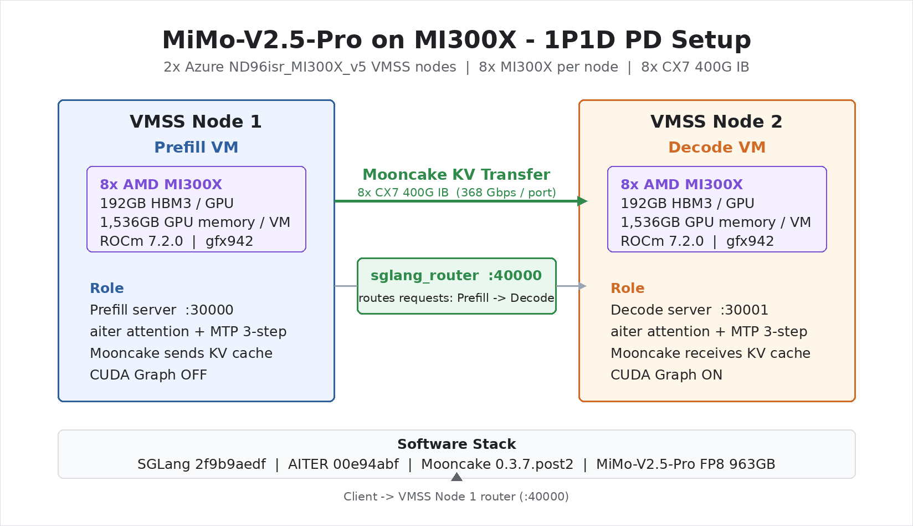

# MiMo-V2.5-Pro 在 AMD MI300X 上的 Benchmark 报告

[](https://www.amd.com/en/products/accelerators/instinct/mi300/mi300x.html)
[](https://huggingface.co/XiaomiMiMo/MiMo-V2.5-Pro)
[](https://github.com/sgl-project/sglang)
[](https://rocm.docs.amd.com/)

在 Azure **AMD Instinct MI300X** 上运行 **小米 MiMo-V2.5-Pro（1.02T MoE / 42B 活跃参数 / FP8）**，使用 SGLang + AMD CK A8W8 blockwise GEMM + AITER + MTP/EAGLE + 模型专用 fused-MoE tuning，并与小米 H200 参考数据并列展示。

本客户版 repo 包含核心对比结果、完整的微软扩展性测试矩阵、唯一一套支持的复现代码和紧凑运行时元数据。PD-separated decode 必须把 RDMA 设备暴露给容器（`--privileged`、`/dev/mem`、`CAP_SYS_ADMIN`），否则 Mooncake 会 fallback 到 TCP，高并发吞吐结果无效。

> Author: 魏新宇 (Xinyu Wei) — Microsoft AI and Apps Global Black Belt (GBB)
>
> 最后测试：2026-07-17

[English](README.md) | 中文 | [验证证据](data/validation/)

> **对比状态：**Input 侧，MI300X 在 64K、concurrency 4 达到 **18,983.91 input tok/s**，客户 H200 饱和吞吐参考为 **27,400 input tok/s**；H200 工作簿没有记录对应的 input concurrency。Output 侧，实际 batch 近似对齐的 8K c16 点达到 **H200 Decode 吞吐参考的 95.6%，且 TPOT 低 6.6%**；但由于 routing 和部署 topology 不同，这仍是方向性观察。更高 concurrency 的 8K 点和全部 64K output 点因实际 Decode batch 与 H200 行不匹配，不计算硬件比率。

---

## 架构



*图 1：最终双节点 MI300X 1P1D 拓扑、Mooncake KV transfer 路径与已验证运行时栈。*

---

## 核心结果 — Input 与 Output 视图

以下展示从 accepted runs 中选出的代表点。每个 MI300X 行内的 client 与 server 指标均来自同一条 measurement record；当 runtime batch 或 metric scope 未对齐时，H200 仅作为独立客户参考展示。

### Input 侧 — 1P1D Prefill

| Context | Concurrency | 微软实测 MI300X input tok/s | 小米 H200 TP8/EP16/DP2 单节点参考 | MI300X / H200 单节点 |
|---:|---:|---:|---:|---:|
| 8K | 4 | **20,305.98** | 31,950 | 63.6% |
| 64K | 4 | **18,983.91** | 27,400 | 69.3% |
| 256K | 4 | **12,864.96** | 17,400 | 73.9% |

这些是方向性单节点 Input 比率。H200 来源没有记录 input concurrency，并使用 balanced `fake_topk_ids`；MI300X 使用真实 expert routing。

### Output 侧 — MI300X 1P1D Decode，8K Input / 1K Output

| Client concurrency | Decode 节点实际 running requests（众数 / 最大值） | E2E output tok/s | Decode 节点 mean gen tok/s | Mean TTFT (s) | Mean TPOT (ms) |
|---:|---:|---:|---:|---:|---:|
| 16 | 15 / 16 | **1,331.98** | 1,319.78 | 1.00 | 10.83 |
| 32 | 31 / 32 | **1,936.24** | 1,861.52 | 2.27 | 13.65 |
| 64 | 53 / 55 | **2,465.01** | 2,324.57 | 7.59 | 16.88 |
| 128 | 51 / 54 | **2,486.89** | 2,333.44 | 27.21 | 16.56 |

Client concurrency 是提交请求上限，不是 Decode 实际 batch。c64 和 c128 时，Decode 节点在约 50–55 个 running requests 附近饱和；这些行不能与 H200 BS64 或 BS128 配对。

#### 客户 H200 8K Output 参考

| H200 per-DP BS | Decode output tok/s | TPOT (ms) | TTFT |
|---:|---:|---:|---|
| 16 | 1,381 | 11.59 | 未提供 |
| 32 | 2,549 | 12.56 | 未提供 |
| 64 | 4,483 | 14.28 | 未提供 |
| 128 | 7,013 | 18.25 | 未提供 |

在实际 batch 近似对齐的 c16 点，MI300X Decode 节点 batch 为众数 15 / 最大 16。其直接 D-node generation rate 为 **1,319.78 tok/s**，达到 H200 BS16 参考的 **95.6%**；同时 MI300X TPOT **低 6.6%**（10.83 vs 11.59 ms）。这是方向性观察，不是硬件 parity 声明：MI300X 使用真实 expert routing 和双节点 1P1D 部署；H200 使用 balanced `fake_topk_ids` 和 TP8/EP32/DP4。

机器可读 batch 审计：[`data/validation/decode-service-log-audit-8k.json`](data/validation/decode-service-log-audit-8k.json)。

### 双节点 DP=2 Prefill — 峰值聚合吞吐

| Context | Concurrency | Aggregate input tok/s |
|---:|---:|---:|
| 8K | 16 | **46,747.01** |
| 64K | 2 | **38,984.45** |

DP=2 的 nominal-length 256K 结果保留在后面的扩展性矩阵中，但不作为 exact-token 核心结果。

### 结果口径

- Headline 数值来自按最终配置和有效性选定的多次 accepted reproduction runs，不是一轮统一矩阵，也不是跨 run 聚合值。机器可读数据中的 `headline_source` 记录来源 run；详细扩展性表是一轮完整矩阵，repeatability 表展示跨 run 波动。
- 核心结果中的 1P1D 256K 使用 `--tokenize-prompt`，每条 request 精确发送 262,144 个 token IDs。
- DP=2 为两台 MI300X 节点的 Prefill-only 聚合容量，不包含 P→D KV-cache transfer。
- H200 Decode `tok/s` 是报告中的 per-DP/单节点口径（`BS × TPS`），不作为 DP=4 aggregate throughput 展示。
- Client concurrency 不会被默认当成 Decode 实际 batch；8K 与 64K scheduler-log 审计都记录了实际众数和最大值。
- H200 数值仍是方向性参考，不是严格 apples-to-apples 硬件 benchmark：MI300X 使用真实 expert routing，H200 参考使用理想均衡 routing。
- 机器可读核心结果：[`data/final-results.tsv`](data/final-results.tsv)；scheduler-log 审计：[`data/validation/decode-service-log-audit-8k.json`](data/validation/decode-service-log-audit-8k.json)。

### H200 参考数据来源

| 字段 | 公开记录 |
|---|---|
| 来源 | 小米提供的 MiMo-V2.5-Pro 性能报告；私有归档，不公开转载 |
| 审阅日期 | 2026-05-18 |
| Prefill 参考 | TP8/EP16/DP2、balanced `fake_topk_ids`、关闭 radix cache、单机/单节点吞吐 |
| Decode 参考 | 8K 和 64K input / 1K output；TP8/EP32/DP4、balanced `fake_topk_ids`、MTP layer 3、报告 accept rate 0.75 |
| Decode TPOT 来源 | 客户工作簿；根据 per-DP Decode 日志输出速率与 local BS 按 `1000 / (tok/s ÷ BS)` 反推 |
| Decode 吞吐口径 | 报告中的 per-DP/单节点 `BS × TPS`；未确认是 DP=4 aggregate throughput |
| 交付用途 | 仅作方向性 per-node/per-DP 参考 |

机器可读 provenance 和全部参考值见 [`data/validation/h200-reference.json`](data/validation/h200-reference.json)。

---

## 微软扩展性测试

AMD 提供了基础启动方法：container image、tuned AITER path、1P1D/DP=2 topology 和 benchmark 入口。微软先严格复现该路径，再独立扩展 context/concurrency 覆盖范围，并加入 fail-closed correctness gates。**以下所有 MI300X 性能数据均为微软实测；H200 TPOT 是记录在 `h200-reference.json` 中的客户提供参考值。不包含 AMD 性能数值。**

### 测试矩阵

| 测试面 | 工作负载 | Concurrency sweep | 每点请求数 |
|---|---|---|---:|
| 1P1D Decode | 8K input / 1K output | 8, 16, 32, 64, 96, 128, 192 | 256 |
| 1P1D 长上下文 Decode | Requested 64K input / 1K output；requested 255K input / 1K output（256K total sequence） | 64K：16, 32, 64, 96；255K：1 | 32, 64, 128, 192；1 |
| 1P1D Prefill | 8K、64K、nominal 256K / 1 output | 1, 2, 4, 8 | 16 |
| 双节点 DP=2 Prefill | 8K、64K、nominal 256K / 1 output | 8K/64K：1, 2, 4, 8, 16；nominal 256K：1, 2, 4, 8 | 32 |

以下表格展示实测扩展性结果。Decode 核心生产并发点另外做了两次 fresh-service 复测。

### Decode 扩展性 — 8K Input / 1K Output

| Concurrency | Output tok/s | Mean TPOT (ms) | Mean TTFT (ms) |
|---:|---:|---:|---:|
| 8 | 930.00 | 7.65 | 863.69 |
| 16 | 1,303.44 | 10.72 | 1,398.73 |
| 32 | 1,930.10 | 13.68 | 2,296.89 |
| 64 | 2,462.83 | 17.08 | 7,406.18 |
| 96 | 2,497.69 | 15.89 | 18,273.38 |
| 128 | 2,468.95 | 16.45 | 27,128.38 |
| 192 | 2,500.54 | 15.98 | 40,956.57 |

实测现象：

- 吞吐从 concurrency 8 的 930.00 tok/s 增长到 concurrency 64 的 2,462.83 tok/s，此后到 concurrency 192 维持在约 2.47–2.50K tok/s 的平台区间。
- concurrency 64 以后吞吐基本不再增长，但 TTFT 显著上升。因此这是容量平台，不是延迟改善。

### Decode 核心点 Fresh-Service 复测

| Concurrency | Fresh run 1 tok/s | Fresh run 2 tok/s | 吞吐差异 | TPOT run 1 / run 2 (ms) |
|---:|---:|---:|---:|---:|
| 16 | 1,331.98 | 1,303.44 | -2.14% | 10.83 / 10.72 |
| 32 | 1,936.24 | 1,930.10 | -0.32% | 13.65 / 13.68 |
| 64 | 2,457.73 | 2,462.83 | +0.21% | 17.00 / 17.08 |
| 128 | 2,486.89 | 2,468.95 | -0.72% | 16.56 / 16.45 |

四个复测点的两次 fresh-service 吞吐最大绝对差异为 **2.14%**。

### 长上下文测试结果 — 最终运行时镜像

以下点于 2026-07-17 使用 Software Stack 章节中的 immutable image 直接拉取并运行得到。每一行是 1 次 measurement run；同一行中的多个 requests 不是独立重复实验。

#### 指标口径

Input 与 Output 指标回答不同问题，不能互相相除或直接比较。

| 侧别 | 指标 | 准确定义 |
|---|---|---|
| Input | Input tok/s | 每秒处理的 aggregate input tokens；越高越好 |
| Input | Input/client concurrency | Benchmark client 允许的最大并发请求数；不一定等于 Decode 实际 batch |
| Output | E2E output tok/s | 请求的 output tokens 除以完整 benchmark 时长，其中包含 Prefill 和 TTFT |
| Output | Decode-node gen tok/s | 该测点期间 Decode scheduler 日志中 `gen throughput` 样本的算术平均值 |
| Output | TTFT | 从请求开始到首个 output token 的时间；越低越好 |
| Output | TPOT | 首 token 之后每个 output token 的时间；越低越好 |

`TPUT` 只是 throughput 的缩写，通常以 tokens/s 表示，不是另一种独立指标。

#### 1. Input 侧 — 64K Prefill

| 字段 | 微软实测 MI300X | 客户 H200 参考 | 对齐状态 |
|---|---:|---:|---|
| Workload | 64K input / 1 output | 64K input / 1 output | 已对齐 |
| Input/client concurrency | 4 | 源工作簿未记录 | 未完全对齐 |
| 报告口径 | 1 个 MI300X Prefill 节点 | 单节点饱和吞吐参考 | 方向性 |
| Input tok/s | 18,983.91 | 27,400 | MI300X 为 H200 参考的 69.3% |

这不是严格硬件对比，因为 H200 的 input concurrency 缺失且 routing 不同。MI300X 使用真实 expert routing；H200 参考使用 balanced `fake_topk_ids`、TP8/EP16/DP2，并关闭 radix cache。

#### 2. Output 侧 — MI300X 64K Input / 1K Output

| Client concurrency | Decode 节点实际 running requests（众数 / 最大值） | E2E output tok/s | Decode 节点 mean gen tok/s | Mean TTFT (s) | Mean TPOT (ms) |
|---:|---:|---:|---:|---:|---:|
| 16 | 4 / 5 | 265.17 | 267.97 | 37.57 | 11.94 |
| 32 | 4 / 4 | 276.59 | 276.74 | 80.23 | 11.76 |
| 64 | 4 / 5 | 284.00 | 282.81 | 165.19 | 11.75 |
| 96 | 4 / 5 | 288.66 | 287.77 | 248.34 | 11.55 |

所有请求均成功。Client concurrency 控制提交的 workload，但 64K KV footprint 把 Decode 节点实际活跃 batch 限制在约 4。E2E output tok/s 包含 Prefill/TTFT；Decode 节点 gen tok/s 是直接的 Decode scheduler 指标。两者数值接近，说明 Decode 节点持续有请求可处理，但它们都不能与不同 per-DP BS 的 H200 行直接比较。

Decode 节点机器可读审计：[`data/validation/decode-service-log-audit.json`](data/validation/decode-service-log-audit.json)。

#### 客户 H200 Output 侧参考 — 未与 MI300X 行对齐

| H200 per-DP BS | Decode output tok/s | TPOT (ms) | TTFT |
|---:|---:|---:|---|
| 16 | 1,333.89 | 11.99 | 未提供 |
| 32 | 2,235.53 | 14.31 | 未提供 |
| 64 | 3,919.78 | 16.33 | 未提供 |
| 96 | 4,891.59 | 19.63 | 未提供 |

H200 来源：客户提供工作簿，TP8/EP32/DP4、balanced `fake_topk_ids`、MTP3、报告 accept rate 0.75。H200 TPOT 按 `1000 / (Decode output tok/s ÷ per-DP BS)` 反推。私有工作簿不在本 Repo 中再分发；公开数值与 provenance 见 [`data/validation/h200-reference.json`](data/validation/h200-reference.json)。

#### 为什么不报告 Output 侧 MI300X/H200 比率

- MI300X Decode 节点实际 batch 为众数 4 / 最大 5；H200 行为 BS16/32/64/96。
- MI300X 使用 2 台节点（1P1D，共 16 张 GPU）；H200 Decode 参考来自 TP8/EP32/DP4（4 台 8-GPU 节点，共 32 张 GPU）。
- MI300X 使用真实 expert routing；H200 使用 balanced `fake_topk_ids`。
- H200 没有提供 TTFT 或匹配的 E2E 结果。

因此当前 Output tok/s 与 TPOT 只能按两个来源表分别展示，不能作为硬件排名。要做严格 NVIDIA 对比，必须对齐实际 D-node batch、topology/routing policy、64K/1K workload，并同时采集相同口径的 D-node output tok/s 和 E2E TTFT。

#### 3. 客户需求适配性

| 客户问题 | 当前证据 | 是否适合 MI300X/H200 排名？ |
|---|---|---|
| 64K Input 容量 | MI300X 18,983.91 input tok/s；H200 27,400 input tok/s | 仅方向性；H200 concurrency 缺失 |
| 64K Output 吞吐 | MI300X 有 E2E 与 D-node output；H200 有 per-DP output | 不适合；实际 D batch 与 topology 不同 |
| Output TTFT | MI300X 已测 | 不适合；H200 未提供 TTFT |
| Decode TPOT | 两份来源都有 TPOT | 不能做严格比率；实际 D batch 与 routing 不同 |
| Near-limit context | MI300X 完成 requested 255K input + 1K output | 只证明能力；无匹配 H200 workload |

#### Requested 255K 能力点

| Workload | Client concurrency | Decode 节点实际 running requests | E2E output tok/s | Decode 节点 mean gen tok/s | Mean TTFT (s) | Mean TPOT (ms) |
|---|---:|---:|---:|---:|---:|---:|
| Requested 255K input / 1K output | 1 | 1 | 31.93 | 80.64 | 20.93 | 10.88 |

该请求实际发送 261,120 input tokens 并生成 1,024 output tokens，总序列为 262,144 tokens。这是能力点，不是 256K-input 或 H200 parity 声明。

机器可读结果：[`data/decode-long-context-results.tsv`](data/decode-long-context-results.tsv)。Runtime identity、测试方法与 source-artifact hashes：[`data/validation/decode-long-context-evidence.json`](data/validation/decode-long-context-evidence.json)。

### 1P1D Prefill 扩展性

| Input | Concurrency | Input tok/s | Mean TTFT (ms) |
|---:|---:|---:|---:|
| 8K | 1 | 16,835.22 | 485.70 |
| 8K | 2 | 19,618.25 | 829.40 |
| 8K | 4 | 18,161.81 | 1,612.03 |
| 8K | 8 | 21,004.97 | 2,817.91 |
| 64K | 1 | 18,057.01 | 3,628.49 |
| 64K | 2 | 19,860.45 | 6,481.41 |
| 64K | 4 | 18,763.17 | 12,970.83 |
| 64K | 8 | 18,765.43 | 22,530.68 |
| Nominal 256K | 1 | 12,381.87 | 21,170.66 |
| Nominal 256K | 2 | 12,378.06 | 41,208.61 |
| Nominal 256K | 4 | 12,389.64 | 77,254.06 |
| Nominal 256K | 8 | 12,402.23 | 133,251.83 |

实测现象：

- 完整矩阵中的 8K Prefill 在 concurrency 8 达到 21,004.97 input tok/s。
- 64K Prefill 在 concurrency 2 达到峰值，此后随着并发增加保持在约 18.76K tok/s。
- nominal 256K 行使用 random-text prompt construction（`tokenize_prompt=false`），只描述扩展趋势。核心 exact-token 结果来自独立 targeted concurrency-4 复测：**12,864.96 input tok/s**。

### 双节点 DP=2 Prefill 扩展性

| Input | Concurrency | Aggregate input tok/s | Mean TTFT (ms) |
|---:|---:|---:|---:|
| 8K | 1 | 20,751.73 | 393.90 |
| 8K | 2 | 41,201.86 | 394.17 |
| 8K | 4 | 43,401.70 | 723.96 |
| 8K | 8 | 46,113.92 | 1,296.43 |
| 8K | 16 | 46,747.01 | 2,276.28 |
| 64K | 1 | 19,695.02 | 3,326.53 |
| 64K | 2 | 38,984.45 | 3,348.49 |
| 64K | 4 | 38,382.03 | 6,615.25 |
| 64K | 8 | 38,204.80 | 12,418.82 |
| 64K | 16 | 38,155.28 | 21,164.99 |
| Nominal 256K | 1 | 12,783.28 | 20,505.88 |
| Nominal 256K | 2 | 25,063.73 | 20,823.01 |
| Nominal 256K | 4 | 24,923.63 | 40,785.01 |
| Nominal 256K | 8 | 24,765.29 | 76,468.09 |

实测现象：

- DP=2 的 8K 和 64K aggregate Prefill throughput 从 concurrency 1 到 2 接近翻倍，随后进入平台区间。
- DP=2 测量通过双节点 router 使用两个 worker。
- 尚未完成 DP=2 256K exact-token rerun。这些行保留为 nominal-length 扩展性观察，不进入核心验证表。
- DP=2 是 Prefill-only capacity，不是 2P1D end-to-end throughput，也不测量 P→D KV-cache transfer。

### 256K 方法口径

| 证据集 | Client framing | 交付用途 |
|---|---|---|
| 完整扩展矩阵 | Random-text construction，`tokenize_prompt=false` | 用于 scaling 和 boundary 观察；nominal 256K 不是 exact-token 核心证据 |
| Targeted 1P1D 256K 复测 | 精确 262,144 token IDs，`--tokenize-prompt` | 核心结果：12,864.96 input tok/s |
| 当前 `scripts/amd-latest/` | 所有 256K-input Prefill benchmark 均使用 exact token IDs | 后续 256K-input Prefill 结果的强制复现路径 |
| 最终 baked image 长上下文 Decode | Random-text framing；requested 64K input 和 requested 255K input + 1K output | 仅作为 MI300X 能力/扩展性结果；不是 256K-input 或 H200 parity 声明 |

### 机器可读证据

- 核心结果点：[`data/final-results.tsv`](data/final-results.tsv)
- 详细扩展性结果：[`data/scalability-results.tsv`](data/scalability-results.tsv)
- Decode 核心点复测：[`data/decode-repeatability.tsv`](data/decode-repeatability.tsv)
- 长上下文 Decode 结果：[`data/decode-long-context-results.tsv`](data/decode-long-context-results.tsv)
- 长上下文 runtime 与 source-artifact evidence：[`data/validation/decode-long-context-evidence.json`](data/validation/decode-long-context-evidence.json)
- Exact-token 与 runtime 验证元数据：[`data/validation/`](data/validation/)
- 唯一支持的复现代码：[`scripts/amd-latest/`](scripts/amd-latest/)
- Repo 质量门：`python3 scripts/validate_repo.py`（预期最后一行：`REPO_VALIDATION=PASS`）

---

## 硬件与软件栈

### 计算 — 双节点 Azure MI300X 集群

| 属性 | 值 |
|------|---|
| Azure SKU | `Standard_ND96isr_MI300X_v5`（每节点 8× MI300X） |
| GPU | AMD Instinct MI300X, `gfx942` (CDNA 3), **192 GB HBM3**，5.3 TB/s max peak theoretical |
| 节点数 | 2（VMSS，相同 placement group — IB 保证） |
| 总 GPU 内存 | **16× 192 GB = 3,072 GB** |
| InfiniBand | 8× CX7 400G NDR/节点，实测 **368 Gbps**/端口 |

### 软件栈

| 组件 | 版本 | 说明 |
|------|------|------|
| 已验证 runtime 镜像 | `mimomi300xacr.azurecr.io/mimo-v2.5-pro-mi300x@sha256:08deabd2f3a4e98e183944048730f560056b0e4dd724c06f74c368645a655910` | 私有 ACR；37 layers；clean Docker pull 已验证 |
| 基础镜像来源 | `rocm/sgl-dev:v0.5.11-rocm720-mi30x-20260510` | Base image ID `sha256:bb9d2e5ab1a6...` |
| SGLang | Package `0.0.0.dev14147+g2f9b9aedf.d20260706`、source HEAD `2f9b9aedf` | 最终测试 runtime |
| AITER | Source HEAD `00e94abf`；tuned CSV SHA-256 `2c87ff1...80ea7` | 最终测试 runtime |
| ROCm | 7.2.0 | |
| GEMM 路径 | **CK A8W8 blockwise bpreshuffle** | `SGLANG_USE_AITER_CK_BLOCKSCALE_BPRESHUFFLE=1` |
| Mooncake | `0.3.7.post2` | PD 分离 KV cache 传输 |
| PyTorch | 2.9.1+rocm7.2.0 | ROCm backend |

### 模型

| 属性 | 值 | 来源 |
|------|---|------|
| 模型 | [XiaomiMiMo/MiMo-V2.5-Pro](https://huggingface.co/XiaomiMiMo/MiMo-V2.5-Pro) | HuggingFace |
| 总参数 | 1.02 T | HF Model Card |
| 活跃参数 | 42 B / token | HF Model Card |
| Routed experts | 384，每 token 8 个活跃 | HF Model Card |
| Attention | 混合：10 Global + 60 SWA (window=128) | HF Model Card |
| MTP | 3 层 multi-layer EAGLE | HF Model Card |
| 量化 | FP8 E4M3 | HF Model Card |
| Checkpoint 大小 | 963 GB (34 safetensors) | 实测 |

---

## 在 Azure 上运行并复现最终结果

使用下面的 immutable baked runtime。它内置已测试的 SGLang/AITER source trees、Python/runtime deltas、tuned fused-MoE 配置、RDMA userspace stack，以及位于 `/opt/mimo-mi300x/scripts/amd-latest` 的 [`scripts/amd-latest/`](scripts/amd-latest/)。

### 前置条件

- 2× Azure `Standard_ND96isr_MI300X_v5` 节点
- 通过私有渠道提供的 repository-scoped ACR pull username 和 password
- 模型：`/data/models/MiMo-V2.5-Pro`
- Benchmark dataset 位于 `/data`；镜像不包含模型权重和 dataset
- PD-separated Decode 容器必须暴露 RDMA devices、`/dev/mem` 和 `CAP_SYS_ADMIN`

### 拉取并启动 Runtime — 两个节点都执行

容器需要较高的 host 权限来完成 RDMA memory registration，只能在专用、可信的 benchmark 节点上运行。

```bash
export ACR_LOGIN_SERVER=mimomi300xacr.azurecr.io
export IMAGE_REF='mimomi300xacr.azurecr.io/mimo-v2.5-pro-mi300x@sha256:08deabd2f3a4e98e183944048730f560056b0e4dd724c06f74c368645a655910'

read -rp 'ACR pull username: ' ACR_USERNAME
read -rsp 'ACR pull password: ' ACR_PASSWORD && printf '\n'
printf '%s' "$ACR_PASSWORD" | docker login "$ACR_LOGIN_SERVER" \
	--username "$ACR_USERNAME" --password-stdin
docker pull "$IMAGE_REF"
docker logout "$ACR_LOGIN_SERVER"
unset ACR_USERNAME ACR_PASSWORD

docker run -d --name mimo-mi300x \
	--privileged --network=host --ipc=host --shm-size=256g \
	--device=/dev/kfd --device=/dev/dri --device=/dev/mem \
	--cap-add=CAP_SYS_ADMIN --cap-add=SYS_PTRACE \
	--security-opt seccomp=unconfined --security-opt label=disable \
	--group-add video -v /data:/data \
	--entrypoint /bin/bash "$IMAGE_REF" -lc 'sleep infinity'

docker exec mimo-mi300x bash -lc '
	set -euo pipefail
	test "$(git -C /sgl-workspace/sglang_0625 rev-parse HEAD)" = 2f9b9aedf32977bc5d088a86ec0a73bcf432a4d0
	test "$(git -C /sgl-workspace/aiter_0625 rev-parse HEAD)" = 00e94abf15e1e09ab7cf481e989bca5d19a99b82
	test "$(sha256sum /sgl-workspace/aiter_0625/aiter/configs/model_configs/mimo_v2_5_pro_b16_tuned_fmoe.csv | cut -d" " -f1)" = 2c87ff1fa062c73e1941962f8630a335ea1e39d2dbb5b0c2d4971bcd55880ea7
	test -e /dev/infiniband/uverbs0
	test -e /dev/mem
	cd /opt/mimo-mi300x/scripts/amd-latest
	sha256sum -c SHA256SUMS.txt
'
```

镜像 identity 与 clean-pull 证据见 [`data/validation/container-image.json`](data/validation/container-image.json)。

### 1P1D

```bash
# 在每个节点进入容器，然后使用内置 bundle。
docker exec -it mimo-mi300x bash
cd /opt/mimo-mi300x/scripts/amd-latest
export MODEL=/data/models/MiMo-V2.5-Pro
export DATASET_PATH=/data/xisun/ShareGPT_V3_unfiltered_cleaned_split.json
read -rp 'Prefill node IB IP: ' PREFILL_IB_IP
read -rp 'Decode node IB IP: ' DECODE_IB_IP
export PREFILL_IB_IP DECODE_IB_IP

# 先在对应节点的独立终端启动两个 worker：
bash launch_pd_prefill.sh
bash launch_pd_decode.sh

# Prefill 节点 capacity gate：
python3 validate_server_info.py http://127.0.0.1:30000/server_info \
	--output /data/mimo-amd-latest/onep/evidence/prefill-server-info.json

# Decode 节点 capacity gate：
python3 validate_server_info.py http://127.0.0.1:30001/server_info \
	--output /data/mimo-amd-latest/onep/evidence/decode-server-info.json

# 两个 capacity gate 都通过后，在 Prefill 节点启动 Router：
bash launch_pd_router.sh

# Router readiness gate：
curl -fsS --max-time 30 http://127.0.0.1:40000/v1/models >/dev/null

# 三个 gate 通过后，在 Router 节点执行：
bash benchmark_1p_prefill.sh
bash benchmark_decode.sh
```

Immutable image 内置的是原 headline bundle；长上下文 Decode 脚本是在该镜像发布后新增到本 Repo 的扩展。它在不修改镜像的前提下使用相同 immutable runtime 执行。将当前 Repo clone 或复制到 `/data` 下，然后运行：

```bash
cd /data/MiMo-V2.5-Pro-on-MI300X-Benchmark/scripts/amd-latest
export MODEL=/data/models/MiMo-V2.5-Pro
export DATASET_PATH=/data/xisun/ShareGPT_V3_unfiltered_cleaned_split.json
export PYTHONPATH="/sgl-workspace/sglang_0625/python${PYTHONPATH:+:$PYTHONPATH}"
bash benchmark_decode_long_context.sh
```

完成后，把 Decode 节点证据复制到 Router 节点，使 3 份 service logs 和 2 份 `server-info.json` 位于同一目录，并保留下列 basename。然后执行：

```bash
cd /opt/mimo-mi300x/scripts/amd-latest
EVIDENCE=/data/mimo-amd-latest/onep/evidence

python3 validate_service_logs.py \
	"$EVIDENCE/prefill_outer.log" \
	"$EVIDENCE/decode_outer.log" \
	"$EVIDENCE/router_outer.log" \
	--profile onep \
	--output "$EVIDENCE/service-validation.json"

python3 validate_exact_256k.py \
	/data/mimo-amd-latest/onep/prefill/benchmark_262144_out1_con4.log \
	--prefill-info "$EVIDENCE/prefill-server-info.json" \
	--decode-info "$EVIDENCE/decode-server-info.json" \
	--service-logs \
		"$EVIDENCE/prefill_outer.log" \
		"$EVIDENCE/decode_outer.log" \
		"$EVIDENCE/router_outer.log" \
	--output "$EVIDENCE/exact-token-256k.json"
```

### DP=2 双节点 Prefill

```bash
cd /opt/mimo-mi300x/scripts/amd-latest
bash launch_dp2_node0.sh
bash launch_dp2_node1.sh

# 启动 Router 前分别直连验证 node0 和 node1：
python3 validate_server_info.py http://127.0.0.1:30000/server_info \
	--output /data/mimo-amd-latest/dp2/evidence/node0-server-info.json
python3 validate_server_info.py http://127.0.0.1:30001/server_info \
	--output /data/mimo-amd-latest/dp2/evidence/node1-server-info.json

read -rp 'Node0 IB IP: ' Node0_IP
read -rp 'Node1 IB IP: ' Node1_IP
export Node0_IP Node1_IP
bash launch_dp2_router.sh
curl -fsS --max-time 30 http://127.0.0.1:40000/v1/models >/dev/null
bash benchmark_dp2_prefill.sh
```

上面的 convenience script 会连续执行三个点。要生成可报告的逐点 distribution 证据，需要启动 fresh DP=2 services，在单个 `run_point` 前后分别统计两个 worker log 中的 `grep -c 'POST /generate'`，再验证记录下来的四个整数。8K、64K、256K 都要分别执行：

```bash
cd /opt/mimo-mi300x/scripts/amd-latest
export LOG_DIR=/data/mimo-amd-latest/dp2
source ./benchmark_common.sh

# 记录两个 before-count 后，在 node0 每次只执行一个点：
run_point 8192 1 16 32 1 900 'Input token throughput'
# run_point 65536 1 2 32 1 900 'Input token throughput'
# run_point 262144 1 2 32 1 1200 'Input token throughput' token_ids

# 分别在 node0 和 node1 记录 before/after count：
grep -c 'POST /generate' /data/mimo-amd-latest/dp2/service/node0_outer.log || true
grep -c 'POST /generate' /data/mimo-amd-latest/dp2/service/node1_outer.log || true

read -rp 'Node0 before count: ' NODE0_BEFORE
read -rp 'Node0 after count: ' NODE0_AFTER
read -rp 'Node1 before count: ' NODE1_BEFORE
read -rp 'Node1 after count: ' NODE1_AFTER
python3 write_distribution.py \
	--node0-before "$NODE0_BEFORE" --node0-after "$NODE0_AFTER" \
	--node1-before "$NODE1_BEFORE" --node1-after "$NODE1_AFTER" \
	--expected-total 33 \
	--output /data/mimo-amd-latest/dp2/benchmark_8192_out1_con16.distribution.tsv
```

汇总 3 份 DP=2 service logs 后执行：

```bash
cd /opt/mimo-mi300x/scripts/amd-latest
EVIDENCE=/data/mimo-amd-latest/dp2/evidence
python3 validate_service_logs.py \
	"$EVIDENCE/node0_outer.log" \
	"$EVIDENCE/node1_outer.log" \
	"$EVIDENCE/router_outer.log" \
	--profile dp2 \
	--output "$EVIDENCE/service-validation.json"
```

只有 client gate 通过、两个 worker delta 都为正且总和为 33（32 measured + 1 warmup）、service-log gate 通过时，该 DP=2 点才可报告。

### 清理

```bash
docker rm -f mimo-mi300x
```

---

## 必要运行设置

| 设置 | 要求 |
|---|---|
| Decode CUDA Graph | 保持启用；Prefill 禁用 CUDA Graph。 |
| 256K request framing | 使用 context length 262151 和 `--tokenize-prompt`；要求 `max_req_input_len>=262145`。 |
| Router health | 使用非生成型 `/server_info` endpoint，timeout 30 秒。 |

---

## 参考资料

- [Azure ND-MI300X-v5 规格系列](https://learn.microsoft.com/azure/virtual-machines/sizes/gpu-accelerated/ndmi300xv5-series)
- [AMD Instinct MI300X datasheet](https://www.amd.com/content/dam/amd/en/documents/instinct-tech-docs/data-sheets/amd-instinct-mi300x-data-sheet.pdf)
- [MiMo-V2.5-Pro Model Card](https://huggingface.co/XiaomiMiMo/MiMo-V2.5-Pro)
- [AMD SGLang Fork — `mimo_aiter_attn` 分支](https://github.com/sammysun0711/sglang/tree/mimo_aiter_attn)
- [AMD aiter (ROCm)](https://github.com/ROCm/aiter)
- [MiMo 模型专用 fused-MoE tuning — `aiter@d725746`](https://github.com/sammysun0711/aiter/commit/d725746a0f8c233d8e46e2771a7c8dbcd06e40d9)
- [SGLang PD Disaggregation Docs](https://docs.sglang.io/docs/advanced_features/pd_disaggregation.md)
