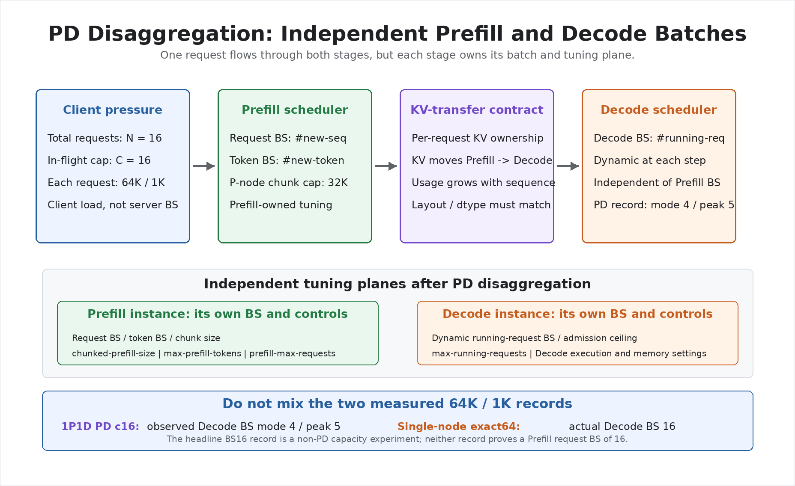
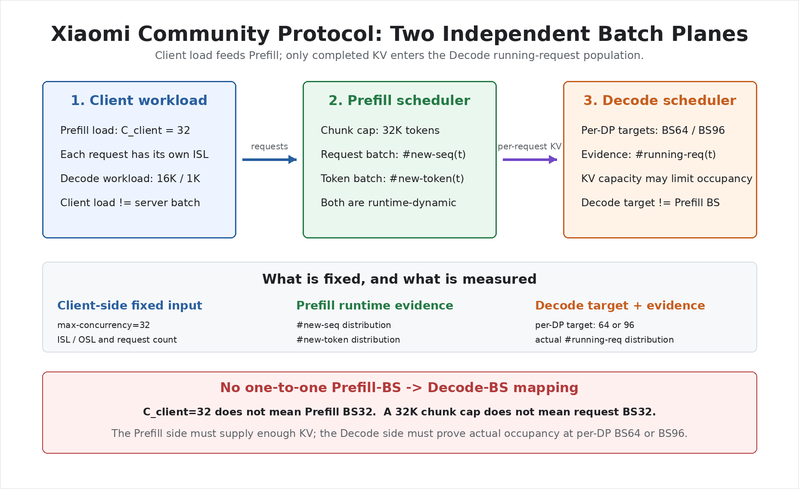
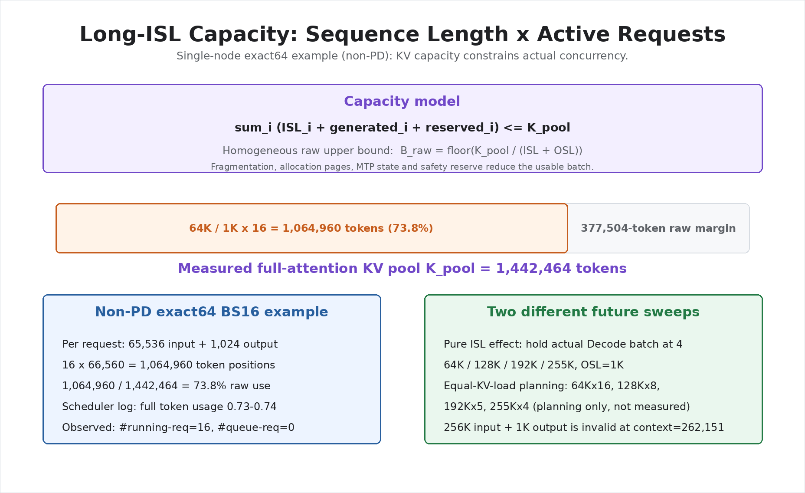

# MiMo-V2.5-Pro on AMD MI300X — Benchmark, Tuning and SWE-bench Report

[](https://www.amd.com/en/products/accelerators/instinct/mi300/mi300x.html)
[](https://huggingface.co/XiaomiMiMo/MiMo-V2.5-Pro)
[](https://github.com/sgl-project/sglang)
[](https://rocm.docs.amd.com/)

**Customer question.** Can Xiaomi's **MiMo-V2.5-Pro (1.02T MoE / 42B active / FP8)** be served on Azure AMD Instinct MI300X nodes at the accuracy of its H200 reference, and how close does long-context throughput get?

**What this repository shows.** With SGLang plus AMD AITER kernels, CK A8W8 blockwise GEMM, FP8 KV cache, FlyDSL Paged Attention and EAGLE multi-token prediction (MTP), two independent single-node TP8 servers completed SWE-bench Verified in the customer's own harness at **366/499 = 73.35%** with MTP on and **370/499 = 74.15%** with MTP off; the customer reports 73.5% for its H200 deployment. On throughput, Prefill reaches 63.6%–73.9% of the customer's per-node H200 reference across 8K–256K input, and the near-aligned 8K Decode point reaches 95.6% of the H200 replica with 6.6% lower TPOT.

**Main limit.** Every H200 percentage is a per-8-GPU-share directional ratio taken from the customer's worksheet, not a same-topology hardware ranking, and each accuracy figure is one run at temperature 1.0. For PD-separated decode, the container must expose RDMA devices (`--privileged`, `/dev/mem`, and `CAP_SYS_ADMIN`); otherwise Mooncake falls back to TCP and high-concurrency throughput results are invalid.

> Author: 魏新宇 (Xinyu Wei) — Microsoft AI and Apps Global Black Belt (GBB)
>
> Last validated: 2026-09-09 (repository checks); measurements 2026-07-13 → 2026-08-10

English | [中文版](README-CN.md) | [Validation Evidence](data/validation/) | [SWE-bench Evidence](data/swebench/) | Optimization evolution deep dive: [English](docs/optimization-evolution.md) / [中文](docs/optimization-evolution-CN.md)

## Start Here

| Goal | Entry |
|---|---|
| Read the final numbers and their boundaries | **Executive Summary** below: accuracy first, then the throughput status table |
| Understand how the stack was tuned and which switch does what | **How We Tuned It: Key Technical Points**, then the ordered evolution map in [docs/optimization-evolution.md](docs/optimization-evolution.md) ([中文](docs/optimization-evolution-CN.md)) |
| Reproduce the throughput benchmark on two MI300X nodes | **Running on Azure and Reproducing Final Results** with the launch and benchmark bundle in [scripts/amd-latest/](scripts/amd-latest/) |
| Reproduce the SWE-bench accuracy run on one MI300X node | **SWE-bench Accuracy Route** with the runtime recipe and launchers in [scripts/swebench/](scripts/swebench/) |
| Check the saved evidence without a GPU | **Test Guide**: `python3 scripts/validate_repo.py` and `python3 scripts/summarize_swebench_swelog.py --check data/swebench` |

## What This Repo Does And Provides

| Party | Responsibility in this work |
|---|---|
| Azure | Two `Standard_ND96isr_MI300X_v5` nodes (8× MI300X, 192 GB HBM3 each) in one VMSS placement group with 8× 400G InfiniBand per node |
| AMD engineering | The ROCm serving stack: SGLang fork, AITER fork, CK A8W8 kernels, FlyDSL Paged Attention kernels, the MiMo tuned fused-MoE table, the EAGLE non-greedy verifier fix, and the sealed launch scripts |
| Microsoft (this repository) | Independent reproduction, the long-context scalability extension, fail-closed correctness gates, the two-node SWE-bench harness engineering, evidence sanitization and the bilingual report |
| Customer (Xiaomi) | The model weights, the H200 reference worksheet, the SWE-bench harness image, `swe_flash.yaml` and the `exp_stats.py` scoring rule; none of these files were modified |

Provided here: the measured Prefill/Decode matrices with per-point hashes, the SWE-bench per-case results and summary, sanitized launch and benchmark scripts, the container recipe that served the accuracy runs, analyzers that recompute every headline offline, and the repository validator.

Not provided: model weights, datasets, the private container image and its pull credentials, the two AMD FlyDSL wheels, the customer's harness image, and any output-quality claim beyond the SWE-bench scores recorded below.


## Executive Summary

Two deliverables are reported: the customer's acceptance benchmark (SWE-bench Verified accuracy) and the long-context throughput matrices. Each headline carries its own input, controlled variable and boundary.

### SWE-bench Verified Accuracy

**Question.** Does the MI300X serving stack preserve MiMo-V2.5-Pro's coding-agent accuracy, with the speculative-decoding path the customer runs in production (MTP) switched on?

**Input, taken from the run record.** The customer's own mini-swe-agent 1.9.0 image (`sha256:72f500dc…830d09`), its `example_configs/swe_flash.yaml` (SHA-256 `859ac49e…26fdb`, `temperature: 1.0`), its `run_batch_flash.sh` driver and `scripts/exp_stats.py` scorer, and the SWE-bench Verified parquet (`d78ad3a2…a2c31`, 500 rows). The driver's fixed exclusion of `sphinx-doc__sphinx-9320` leaves **499 scored cases**. None of these customer files were modified. Each node ran one TP8 server started by the launcher named in the table, the harness was pointed at `http://<node>:30001/v1`, and the cases were split 250 / 249 across the two nodes with 5 harness workers per node.

**What varied.** Only the speculative-decoding path. Both runs share TP8, AITER attention, FP8 E4M3 KV cache, `vectorized_5d` layout, FlyDSL Paged Attention with 16 partitions, page size 64, 1M context and chunked prefill 65,536; INT8 Quick Reduce is disabled in the MTP-on run and no run simulates acceptance.

| Run (one homogeneous pass over 499 cases) | Server launcher | Pass | Fail | Score | Average agent steps | Delivered package |
|---|---|---:|---:|---:|---:|---|
| MTP on — EAGLE 3 steps, top-k 1, HIP non-greedy verifier `878fff156` | [`launch_mtp_nongreedy_wrapper.sh`](scripts/swebench/launch_mtp_nongreedy_wrapper.sh) | **366** | 133 | **73.35%** | 79.10 | `mimo-mi300x-20260809.tar.gz` |
| MTP off — same stack, no `--speculative-*` flags | [`launch_tp8_no_mtp_accuracy.sh`](scripts/swebench/launch_tp8_no_mtp_accuracy.sh) | **370** | 129 | **74.15%** | 77.62 | `mimo-mi300x-swelog.tar.gz` |
| Customer H200 reference (customer-reported, same harness lineage) | — | — | — | 73.5% | — | — |
| AMD MI300X TP8 reference (AMD-reported, mini-swe-agent 2.4.6, 500-case denominator) | — | 359 | — | 71.80% | — | — |

Every case in both runs ended in `Submitted - Pass` or `Submitted - Fail`; there were **0** `LimitsExceeded` outcomes. The MTP-off run took **15 h 41 min 12 s** wall-clock for 499 cases across the two nodes (31.8 cases per hour aggregate) with 37 automatic model recoveries and no completed case lost. Per-case rows, the delivered-package SHA-256 values and the method hashes are in [`data/swebench/summary.json`](data/swebench/summary.json); `python3 scripts/summarize_swebench_swelog.py --check data/swebench` recomputes both scores from the committed per-case TSVs.

**Boundary.** Each score is a single run at temperature 1.0, so the 4-case gap between the two runs is within run-to-run variation and is not an A/B measurement of MTP. The customer's 73.5% and AMD's 71.80% are reported, not measured here; AMD's figure uses a different agent version and a 500-case denominator. The MTP-on run applies the accuracy-safe settings the customer asked for (no INT8 Quick Reduce, real MTP acceptance); the MTP-off run's container-level environment was not captured in the delivered evidence. Neither run measures throughput.

### Throughput Status

> **Comparison status:** on the input side, MI300X reaches **18,983.91 input tok/s** at 64K and concurrency 4 versus the customer H200 saturation reference of **27,400 input tok/s**; the H200 workbook does not record the matching input concurrency. On the output side, the final AMD 7/13-derived AITER/CK path reaches **933.75 scheduler gen tok/s** in a **single-node, non-PD**, exact-64K, fixed-BS16, **fixed-acceptance performance benchmark**, the mean of two fresh-service runs (**931.58 / 935.92 tok/s**, **0.47%** repeat delta), with an implied TPOT of **17.14 ms**. This is a **70.0% worksheet-local directional arithmetic ratio** against the customer workbook's 64K BS16 row and **25.7% above** the same-image exact no-CK baseline. It is not the 1P1D PD c16 record, not a natural-MTP-acceptance result, and not an output-quality result. The H200 workbook has no row-level output length, its Column J scope is ambiguous, and topology, routing, acceptance method, and metric scope differ. Higher batch sizes (BS32–96) still require an EP/multi-node Decode deployment and carry no hardware ratio.

> **ISL=8K coverage:** the independent section below reports Prefill c1/2/4/8 and PD Decode c8/16/32/64/96/128/192, with N=2 Fresh-Service repeats at Decode c16/c32/c64/c128.
>
> **ISL=64K coverage:** the independent section below reports Prefill c1/2/4/8 and PD Decode c16/32/64/96 at observed Decode batch 4–5, plus the N=2 single-node fixed-BS16 fixed-acceptance record.
>
> **ISL=128K coverage:** the independent section below reports Prefill c1/2/4/8, PD Decode c4/8/16/32, and an N=2 Fresh-Service repeat at Decode c4. All matrix points pass their request, token-accounting, and fatal-log gates.
>
> **ISL=192K coverage:** the independent section below reports Prefill c1/2/4/8, PD Decode c2/4/8/16, and an N=2 Fresh-Service repeat at Decode c4. All matrix points pass their request, token-accounting, and fatal-log gates.
>
> **ISL=256K coverage:** the independent section below reports exact-input Prefill c1/c2 as valid and c4 as `REJECTED_BOUNDARY`; the 255K-input/1K-output PD Decode matrix covers c1/c2/c4, with an N=2 Fresh-Service repeat at c1. DP=2 is outside this measurement scope by instruction.

### Relative Status at a Glance

| ISL | Prefill full matrix (peak) | Prefill vs H200 (selected record) | PD Decode full matrix (E2E; actual batch) | Decode vs H200 | Fresh-Service N=2 delta |
|---|---:|---:|---|---|---:|
| 8K | 21,004.97 tok/s (c8) | 20,305.98 vs 31,950 = 63.6% | 930.00–2,500.54 tok/s; audited batch 15–55 | PD c16 audited: 1,319.78 vs 1,381 = 95.6%; TPOT 10.83 vs 11.59 ms (6.6% lower) | max 2.14% (c16–c128) |
| 64K | 19,860.45 tok/s (c2) | 18,983.91 vs 27,400 = 69.3% | 265.17–288.66 tok/s; actual batch 4–5 | PD 20.1% at c16 (batch not aligned); Single-node non-PD BS16 engine potential 933.75 vs 1,333.89 = 70.0% (non-production), TPOT 17.14 vs 11.99 ms (42.9% higher) | 0.27% (single-node BS16) |
| 128K | 16,711.96 tok/s (c2) | — (no H200 reference) | 112.79–122.32 tok/s; batch 1 / 1 | — (no H200 reference) | 0.24% (c4) |
| 192K | 14,402.00 tok/s (c4) | — (no H200 reference) | 63.30–71.34 tok/s; batch 1 / 1 | — (no H200 reference) | 0.47% (c4) |
| 256K | 12,725.25 tok/s (c2 exact; c4 `REJECTED_BOUNDARY`) | 12,864.96 vs 17,400 = 73.9% (separate N=1) | 36.04–162.63 tok/s (255K/1K); batch 1 / 1 | — (no H200 reference) | 0.03% (c1) |

Throughput cells are tok/s (higher is better) and TPOT is ms (lower is better). “—” means the customer worksheet has no row at that ISL. Every H200 percentage remains a worksheet-local directional ratio, and each ISL chapter below carries its own full matrices plus a dedicated vs-H200 subsection. All throughput columns are node-level totals aggregated across all concurrent requests, not per-request rates; per-request Decode speed ≈ 1000 / TPOT.

**Deployment-scale reading:** every MI300X value comes from one node (8 GPUs) per role in the 1P1D pair. The H200 Prefill reference comes from a 2-node TP8/EP16/DP2 deployment quoted per node; the H200 Decode reference comes from a 4-node TP8/EP32/DP4 deployment quoted per DP replica (Column J arithmetic equals local `BS × TPS`). Every H200 percentage in this report is therefore a per-8-GPU-share comparison, not a whole-deployment total-throughput comparison. Read this way, the near-aligned 8K Decode c16 point puts one MI300X node at **95.6%** of one H200 DP replica with **6.6% lower** TPOT, and the 64K PD gap is primarily single-node KV-capacity batch misalignment: **20.1%** not batch-aligned versus **70.0%** batch-aligned at BS16.

**Direct answer:** no tested Prefill-throughput row exceeds its H200 reference, and neither tested Decode-throughput row does. The only metric where MI300X is directionally better is **8K Decode TPOT, 6.6% lower**. The 64K Decode result verifies exact input length and fixed-acceptance scheduler capacity, improving **25.7%** over the same-image MI300X baseline, but it does not exceed the H200 worksheet row and does not validate output quality.

“Directional” is essential: H200 input concurrency is missing; its Decode rows have no explicit output length and ambiguous Column J deployment scope; topology, expert routing, acceptance method, and metric scope also differ. Every percentage against H200 is a worksheet-local directional arithmetic ratio, not a strict hardware ranking.

**Customer-data sharing boundary:** the private source workbook is not redistributed. The repository contains selected numeric excerpts for directional comparison, but evidence of authorization to share those excerpts externally is not recorded in this repository. The repository owner must confirm that authority before external redistribution.

**TPOT metric scope:** the 8K value is the client-reported mean TPOT from the 1P1D c16 run. The 64K value is scheduler-implied TPOT, calculated as `1000 / (mean gen tok/s ÷ BS16)` from the single-node fixed-batch run. They answer different questions and must not be treated as a controlled 8K→64K TPOT curve. The controlled length-scaling signal is the explicitly labeled output8K diagnostic below, where both points use the same method.

**Measured length-scaling anchors (same-method transitions only):**

- Same complete matrix, Prefill c4, 8K → 64K input: 18,161.81 → 18,763.17 tok/s (**+3.3%**). **Prefill remains flat through 64K in the controlled matrix.**
- Same complete matrix, Prefill c4, 64K → nominal 256K input: 18,763.17 → 12,389.64 tok/s (**-34.0%**); the long-input cost becomes material near 256K under nominal random-text framing.
- Independent exact 256K Prefill confirmation: 12,864.96 tok/s, 16/16 requests, **measurement N=1**. **Exact 262,144-token Prefill is confirmed**, but this record is not part of the controlled scaling curve.
- Decode diagnostic: 8K → 64K context, same fixed BS16/output8K method: 1,031.26 → 718.12 gen tok/s (**-30.4%**), 15.52 → 22.28 ms (**+43.6%**). **Decode is more sensitive to long context than Prefill.** This output8K run is diagnostic scaling evidence only, not the H200 headline comparison.
- Exact 64K/1K Decode, no-CK → final AMD 7/13-derived path: 743.12 → 933.75 gen tok/s (**+25.7%**), 21.53 → 17.14 ms (**-20.4%**).

The no-CK and optimized A/B source samples are recorded under `headline_exact.same_image_exact_no_ck` and `headline_exact.points` in [`data/validation/decode-fixed-batch-audit.json`](data/validation/decode-fixed-batch-audit.json); sanitized windows are public in [`data/evidence/exact64-fixed-acceptance/`](data/evidence/exact64-fixed-acceptance/), and `python3 scripts/analyze_exact64_evidence.py` rebuilds both aggregates and the uplift. It does not independently establish the provenance or completeness of the privately archived full logs.

**Evidence scope:** every accepted point passes its request, token-accounting, and fatal-log gates. N=2 Fresh-Service repeats cover 8K c16/c32/c64/c128, the 64K single-node fixed-BS16 record, 128K c4, 192K c4, and 256K c1; all other matrix points are N=1, and 256K Prefill c4 is retained as `REJECTED_BOUNDARY`. The evidence supports **“credible long-ISL performance measurement,” not “H200 parity,” “validated output quality,” or natural-MTP-acceptance claims.**

---

## Architecture


*Figure 1. Final two-node MI300X 1P1D topology, Mooncake KV transfer path, and validated runtime stack.*

### Test Topology

The architecture above is the production-shaped PD deployment. Four measured arrangements produced the numbers in this report; they are not interchangeable.

| Result lineage | Measured arrangement | Load generator | Measurement point | Runtime |
|---|---|---|---|---|
| Throughput matrices, 8K–256K | Two nodes, 1P1D: Prefill server on node A, Decode server on node B, SGLang router on node A, KV moved by Mooncake over 8 InfiniBand ports per node | `sglang.bench_serving` on the router node | Client TTFT / TPOT / E2E tok/s from `bench_serving`; actual Decode batch from `#running-req` and `gen throughput` in the Decode scheduler log; capacity from `/server_info` | Immutable AMD 7/13-derived image: SGLang `2f9b9aedf`, AITER `00e94abf`, ROCm 7.2.0, `launch_pd_*.sh` |
| Single-node fixed-batch Decode; controlled 128K/192K points | One node, TP8, non-PD; batch pinned through `--max-running-requests` | `bench_serving` on the same node | Steady-state scheduler `gen throughput` at full batch; client TPOT | Same image, `launch_single_node_decode.sh` |
| DP=2 Prefill | Two complete TP8 replicas behind one router | `bench_serving` on node0 | Aggregate input tok/s; per-worker request distribution from `POST /generate` counts | Same image, `launch_dp2_*.sh` |
| SWE-bench accuracy | Two independent single-node TP8 servers, no PD, no router, 250 / 249 cases each | The customer's mini-swe-agent containers on the same node, 5 workers per node | `exit_status` per case scored by the customer's `exp_stats.py`; runtime contract read from the server command line and `/proc/<pid>/environ` | `sglang_0625` container: SGLang `878fff156`, AITER `3f4ab482a`, FlyDSL 0.2.4, rebuilt by [scripts/swebench/runtime-recipe/](scripts/swebench/runtime-recipe/) |

---

## How We Tuned It: Key Technical Points

The gains did not come from one flag. They came from making the model path, the operator coverage, the KV-cache organisation, the parallel topology, the KV transport and the test protocol converge, one variable at a time. This section names each switch, what it changes on MI300X and how we confirmed it was live; the causal order between stages is in [docs/optimization-evolution.md](docs/optimization-evolution.md).

### From Bring-Up to Deliverable

| Stage | Runtime change | Prefill vs the customer's per-node H200 reference | Decode vs H200 | What the step actually bought |
|---|---|---|---|---|
| Early May 2026, feasibility | SGLang v0.5.11, Triton attention, TP8, no MiMo-specific recipe | 16K: 16,576 vs 49,767 tok/s (0.33×); 32K: 13,341 vs 48,316 (0.28×) — early customer table, reference model was MiMo-V2-Flash, not method-matched | TPOT 2.77×–3.32× slower at BS32–BS128 | Proved the model runs; numbers not yet comparable |
| Mid May, same-model baseline | Same runtime; customer's MiMo-V2.5-Pro H200 table, per-node scope | 8K and 64K Prefill at 51%–52% of the H200 EP16/DP2 per-node reference | Nearest TPOT point about 4× slower | A methodology gain, not a kernel gain: same model and same per-node scope |
| June, AITER path | AITER attention for hybrid SWA + GQA, FP8 E4M3 KV with `vectorized_5d`, FlyDSL Paged Attention decode, Mooncake RDMA over 8 IB ports, MTP accept length 1.6 → 2.4 | About 42%–53% at the common points | 8K high-batch TPOT 3%–17% below the H200 value | Operator coverage; a mis-set CUDA graph flag that had pushed Decode TPOT to about 120 ms was found and TPOT returned to about 23 ms |
| July, shape-specific kernels | CK A8W8 block-scale GEMM with B preshuffle, MiMo tuned fused-MoE table for token batches 2048–32768, long-context boundary gates | 63.6% (8K), 69.3% (64K), 73.9% (256K) | 8K c16 at 95.6% throughput with 6.6% lower TPOT; exact 64K BS16 743.12 → 933.75 tok/s (+25.7%) | Model-shape tuning became measurable once the operator path was stable |
| Late July to August, long-context Decode and accuracy | FlyDSL PA with 16 partitions, `--swa-full-tokens-ratio 0.01`, overlap schedule, HIP non-greedy EAGLE verifier `878fff156` | 128K / 192K / 256K Prefill 16,711.96 / 14,402.00 / 12,725.25 input tok/s | 128K–256K Decode 125.04–140.72 scheduler gen tok/s at actual batch 1 | SWE-bench 366/499 and 370/499 completed on this stack |

The percentages in this table are per-8-GPU-share directional ratios against the customer worksheet; the reference model and topology changed between the first two rows, so the rows are a history, not a controlled speed-up waterfall.

### The Thirteen Switches in the Serving Command

| # | Layer | Switch | What it changes on MI300X | How we confirmed it was live |
|---:|---|---|---|---|
| 1 | Kernel | `--attention-backend aiter` + `SGLANG_USE_AITER=1` | Replaces the Triton attention, MoE and normalisation paths with AMD AITER kernels written for CDNA3 MFMA; the only path that stayed stable at TP8 for this model | Kernel names in the server log; import root checked against `/sgl-workspace/aiter_0625` — the same package version loaded from a different import root once behaved differently |
| 2 | Kernel | `SGLANG_AITER_PA_DECODE_IMPL=flydsl` + `SGLANG_FLYDSL_PA_NUM_PARTITIONS=16` | FlyDSL Paged Attention decode kernel compiled for MiMo's head layout; 16 partitions fill the MI300X compute units for 64K–1M contexts (AMD reports about 14× on the single kernel and about 1.5× over the Gluon PA kernel) | The two variables are set together; accept length about 2.4; 125.04–140.72 scheduler gen tok/s at batch 1 for 128K–256K |
| 3 | Kernel | `mimo_v2_5_pro_b16_tuned_fmoe.csv` from AITER `d725746` | Per-shape kernel selection for the fused-MoE grouped GEMM at token batches 2048–32768; the model math is unchanged | The start-up log must name the CSV; its SHA-256 `2c87ff1f…80ea7` is part of the runtime identity |
| 4 | Kernel | `SGLANG_USE_AITER_CK_BLOCKSCALE_BPRESHUFFLE=1` | CK A8W8 block-scale GEMM with weights pre-shuffled into an MFMA-friendly layout; Prefill is compute-bound, so this is where 8-bit GEMM pays | `module_gemm_a8w8_blockscale_bpreshuffle` marker in the log; same-image A/B 743.12 → 933.75 tok/s |
| 5 | Memory | `--kv-cache-dtype fp8_e4m3` | Halves KV bytes; the only way TP8 fits the weights plus a 1M context in 192 GB per GPU (live capacity 575,360 tokens at memory fraction 0.90) | `max_total_num_tokens` in `/server_info`; capacity gate at 524,288 tokens |
| 6 | Memory | `SGLANG_AITER_KV_CACHE_LAYOUT=vectorized_5d` | Vectorised 5D KV layout aligned to `global_load_dwordx4` wavefront lanes; prerequisite of the FlyDSL kernel — FP8 KV, the 5D layout and FlyDSL PA always appear together | Changing any one of the three alone fails at start-up or silently falls back |
| 7 | Memory | `--page-size 32` in the PD launchers, `--page-size 64` in the accuracy launchers | Larger pages cut page-table overhead and batch the Mooncake KV transfer; `ck_tile.patch` adds the page-64 / head-192 prefill tile | Same value on both PD roles; tile name in the JIT object list |
| 8 | Algorithm | `--speculative-algorithm EAGLE --speculative-num-steps 3 --speculative-eagle-topk 1 --speculative-num-draft-tokens 4 --enable-multi-layer-eagle` | MiMo's own 3-layer MTP draft; real acceptance in accuracy runs, `SGLANG_SIMULATE_ACC_LEN=3` only in throughput runs | `accept len` in the scheduler log; the simulation variables are unset in the accuracy launchers |
| 9 | Algorithm | `--chunked-prefill-size` 32768 on the Prefill role, 16384 on the Decode role, 65536 in the unified accuracy server | Bounds the Prefill peak so 256K prompts do not run out of memory; the value must satisfy the runtime's dispatch limits — copying the H200 value verbatim failed at start-up | `--max-prefill-tokens` and `/server_info` |
| 10 | System | `--disaggregation-mode prefill` / `decode`, `--disaggregation-transfer-backend mooncake`, `--disaggregation-ib-device mlx5_ib0…mlx5_ib7` | Prefill KV moves to the Decode node over RDMA | Eight `RDMA device: mlx5_ib*` lines and no `fallback` to TCP marker — the TCP fallback cuts throughput to about one third without raising an error |
| 11 | System | `SGLANG_MOE_PADDING=1`, `SGLANG_SET_CPU_AFFINITY=1`, `HSA_NO_SCRATCH_RECLAIM=1`, `MC_GID_INDEX=3` | Expert-dimension padding, NUMA pinning, no HSA scratch reclaim during long runs, Mooncake GID selection | `env` inside the container compared before every differential; a missing variable shows up as "runs but slow" |
| 12 | System | `--disable-overlap-schedule` in the PD launchers; overlap enabled in the accuracy launchers | The overlap path hit a HIP crash on the Prefill role; disabled where it crashed, kept where it was stable | Differential on the Prefill role |
| 13 | System | `SGLANG_SCHEDULER_SKIP_ALL_GATHER=1` in the MTP-on accuracy wrapper | Skips the per-step 7-int scheduler all-gather that timed out near 200K tokens at data-parallel 1; located in SGLang source, not a patch | No `_ALLGATHER_BASE` timeout in the full run |

### Long-Context Method: Five Steps Before a Number Is Reported

1. **Freeze the workload semantics.** Prefill is 262,144 input tokens plus 1 output token; Decode is 261,120 input plus 1,024 output; `--random-range-ratio 1.0`, a fixed seed and `--tokenize-prompt`, and `/server_info` must show `max_req_input_len` at or above 262,145 before the client starts.
2. **Bound the Prefill peak** with chunked prefill sized for the runtime, not copied from the H200 configuration.
3. **Confirm capacity, not concurrency.** Read live `max_total_num_tokens`, record peak KV usage and read the actual Decode batch from `#running-req`; at 256K a client concurrency of 4 still ran at batch 1 because KV was the limit.
4. **Tune both hot spots.** Long inputs raise attention share, so AITER attention and FlyDSL PA matter; large Prefill token batches keep the grouped GEMM share high, so the tuned MoE table still matters.
5. **Separate "kernel runs" from "PD path sustains".** Each context length is tested as one request, then sequential requests, then concurrent requests, then a fresh-service repeat; 256K Prefill c4 failed twice with AMDGPU page faults and is published as `REJECTED_BOUNDARY` instead of an estimate.

### Parallelism Decision: TP8 First

| Situation | Choice made here | Reason |
|---|---|---|
| One node, stability first | TP8 | 8 GPUs per node, `num_key_value_heads=8` maps cleanly, AITER / MTP / Paged Attention were validated most on this shape |
| One node, MoE at high concurrency | TP8 plus local EP8 as an A/B | A May MORI-EP8 probe improved BS32 TPOT from 52.98 ms to 47.87 ms (about 10%), but only under stable routing |
| Two nodes, more Prefill | TP8 per node behind a router (DP=2) | Clear failure domains; no cross-node collective in the hot path |
| Two nodes, cross-node EP | Not a default production route | TCPStore resolution, MORI shared-memory heap, RCCL timeouts and HIP graph capture conflicts were all hit; H200's EP16 / EP32 are global topology fields and do not map to SGLang's local `--ep-size` |

### SWE-bench Engineering: What Broke and What Fixed It

| Failure observed | Root cause | Fix carried into the recorded runs |
|---|---|---|
| Prefill detokenizer stalled after repeated health polling | SGLang defaults `SGLANG_ENABLE_HEALTH_ENDPOINT_GENERATION=True`, so every `/health` probe generated a real token | Set it to `0`; monitor with the non-generating `/server_info` |
| TP ranks stuck in ROCm `wait_on_page_bit_common` during weight load | Multithreaded safetensors loading on HMM; omitting the option does not disable it | `--model-loader-extra-config '{"enable_multithread_load": false}'` on the PD roles |
| HIP illegal address in the overlap scheduler path on the Prefill role | Overlap scheduling on ROCm for this model | `--disable-overlap-schedule` where it crashed (see switch 12) |
| A 351,703-token conversation truncated at `max_req_input_len=348,538` | GPU KV pool too small for one active agent conversation; host-side cache does not enlarge it | Memory fraction 0.85 → 0.90, live capacity 575,360 tokens, start-up gate at 524,288 |
| Scheduler `_ALLGATHER_BASE` timeout near 200K tokens | Per-step 7-int state all-gather at data-parallel 1 | `SGLANG_SCHEDULER_SKIP_ALL_GATHER=1` (switch 13) |
| Requests with `temperature=1.0` were verified greedily on HIP | The HIP EAGLE path had no stochastic verifier and fell back silently | Opt-in Torch stochastic verifier, fork commit `878fff156`, enabled by `SGLANG_MIMO_EAGLE_HIP_NONGREEDY_VERIFY=1` |
| Lossy INT8 collective in accuracy runs | ROCm Quick Reduce defaults to INT8 compression | `ROCM_QUICK_REDUCE_QUANTIZATION=NONE` in the accuracy wrapper |
| Agent loops at the 500-step limit with MTP on before the verifier fix | In a 5-case isolation probe, turning MTP off cut average agent calls from 500 to 95.3 while raw decode throughput fell 40%–54% | Both MTP-off and MTP-on-with-verifier full runs finished with 0 `LimitsExceeded`; agent tasks per hour, not tokens per second, is the metric that matters here |
| Node crash left the run idle for hours | No supervisor; a single shell command owned 499 cases | Per-node systemd guards: restart the model, re-verify the runtime contract, resume from `results.json`, never rescore a completed case — 37 recoveries during the MTP-off run with no case lost |

---

## Scalability & Long-Context Extension

AMD provided the base launch method (container image, tuned AITER path, 1P1D/DP=2 topology, and benchmark entry points); Microsoft reproduced the path and then jointly extended context-length and concurrency coverage with fail-closed correctness gates. **MI300X performance values below are measured on this joint runtime; H200 values are customer-provided references from `h200-reference.json`.**

### Test Matrix

| Surface | Workload | Concurrency sweep | Requests per point |
|---|---|---|---:|
| 1P1D Decode | 8K input / 1K output | 8, 16, 32, 64, 96, 128, 192 | 256 |
| 1P1D long-context Decode | Requested 64K input / 1K output; requested 255K input / 1K output (256K total sequence) | 64K: 16, 32, 64, 96; 255K: 1 | 32, 64, 128, 192; 1 |
| Single-node exact fixed-batch Decode | Exact 64K input / 1K output at fixed batch 16; final AITER/CK path | Two fresh-service repetitions | 16 per repetition |
| Single-node controlled ISL=128K Decode | 128K input / 1K output at actual batch 4; final AITER/CK path | One accepted measurement | 4 |
| Single-node controlled ISL=192K Decode | 192K input / 1K output at actual batch 4; final AITER/CK path | One accepted measurement | 4 |
| Single-node diagnostic fixed-batch Decode | 64K or 8K input / 8K output; retained for internal scaling diagnostics only | One service, fixed batch 4/8/16 | Not used for the H200 headline |
| 1P1D Prefill | 8K, 64K, nominal 256K / 1 output | 1, 2, 4, 8 | 16 |
| 1P1D selected ISL=128K Prefill | 128K input / 1 output | Client concurrency 4; one accepted measurement | 16 |
| 1P1D selected ISL=192K Prefill | 192K input / 1 output | Client concurrency 4; one accepted measurement | 16 |
| 1P1D ISL=64K assembled matrix | 64K input / 1 output; 64K input / 1K output | Prefill: 1, 2, 4, 8; Decode: 16, 32, 64, 96 | Prefill: 16; Decode: 2 × concurrency; Fresh fixed-BS16 single-node: N=2 |
| 1P1D ISL=128K full matrix | 128K input / 1 output; 128K input / 1K output | Prefill: 1, 2, 4, 8; Decode: 4, 8, 16, 32 | Prefill: 16; Decode: 2 × concurrency; Fresh Decode c4: N=2 |
| 1P1D ISL=192K full matrix | 192K input / 1 output; 192K input / 1K output | Prefill: 1, 2, 4, 8; Decode: 2, 4, 8, 16 | Prefill: 16; Decode: 2 × concurrency; Fresh Decode c4: N=2 |
| 1P1D ISL=256K full matrix | Exact 256K input / 1 output; 255K input / 1K output | Prefill: 1, 2, 4; Decode: 1, 2, 4 | Prefill: 16; Decode: 2 × concurrency; Fresh Decode c1: N=2 |
| Two-node DP=2 Prefill | 8K, 64K, nominal 256K / 1 output | 8K/64K: 1, 2, 4, 8, 16; nominal 256K: 1, 2, 4, 8 | 32 |

The tables below present the measured scalability results. The core Decode production points were separately repeated on fresh services.

### ISL=8K

<details open>
<summary><b>ISL=8K — full matrix (Prefill / Decode / Fresh-Service)</b></summary>

#### 1P1D Prefill Scalability — 8K Input / 1 Output

| Input | Client concurrency | Status | Input tok/s | Mean TTFT (ms) | P95 TTFT (ms) |
|---:|---:|---|---:|---:|---:|
| 8K | 1 | VALIDATED | 16,835.22 | 485.70 | — |
| 8K | 2 | VALIDATED | 19,618.25 | 829.40 | — |
| 8K | 4 | VALIDATED | 18,161.81 | 1,612.03 | — |
| 8K | 8 | VALIDATED | 21,004.97 | 2,817.91 | — |

Observed behavior:

- Input throughput peaks at **21,004.97 tok/s** at concurrency 8.
- Mean TTFT rises from **485.70 ms** at concurrency 1 to **2,817.91 ms** at concurrency 8.

#### 1P1D Decode Scalability — 8K Input / 1K Output

| Client concurrency | MI300X Observed Decode batch | Scheduler gen tok/s (aggregate) | E2E Output tok/s (aggregate) | Mean TPOT (ms) | Mean TTFT (ms) | H200 Reference |
|---:|---:|---:|---:|---:|---:|---:|
| 8 | — | — | 930.00 | 7.65 | 863.69 | — |
| 16 | — | — | 1,303.44 | 10.72 | 1,398.73 | 1,381 tok/s / 11.59 ms (H200 BS16) = 94.4% E2E-based, not batch-aligned |
| 32 | — | — | 1,930.10 | 13.68 | 2,296.89 | 2,549 tok/s / 12.56 ms (H200 BS32) = 75.7% E2E-based, not batch-aligned |
| 64 | — | — | 2,462.83 | 17.08 | 7,406.18 | 4,483 tok/s / 14.28 ms (H200 BS64) = 54.9% E2E-based, not batch-aligned |
| 96 | — | — | 2,497.69 | 15.89 | 18,273.38 | — |
| 128 | — | — | 2,468.95 | 16.45 | 27,128.38 | 7,013 tok/s / 18.25 ms (H200 BS128) = 35.2% E2E-based, not batch-aligned |
| 192 | — | — | 2,500.54 | 15.98 | 40,956.57 | — |

Observed behavior:

- Throughput increases from 930.00 tok/s at concurrency 8 to 2,462.83 tok/s at concurrency 64, then plateaus around 2.47–2.50K tok/s through concurrency 192.
- The E2E rows above do not have run-matched scheduler windows, so their actual-batch and scheduler-gen cells remain `—`. Separate audited headline records at c16/c32/c64/c128 have observed Decode batches of 15/16, 31/32, 53/55, and 51/54 respectively; those values are not backfilled into different runs. The per-row H200 percentages are E2E-based directional ratios only; the batch-aligned audited comparison is in the vs-H200 subsection below.
- TTFT rises sharply after concurrency 64 even while throughput stays flat. The plateau is a capacity result, not a latency improvement.

#### 8K Decode Fresh-Service Repeatability

| Client concurrency | MI300X Observed Decode batch | Fresh run 1 Output tok/s | Fresh run 2 Output tok/s | Throughput delta | TPOT run 1 / run 2 (ms) |
|---:|---:|---:|---:|---:|---:|
| 16 | — | 1,331.98 | 1,303.44 | -2.14% | 10.83 / 10.72 |
| 32 | — | 1,936.24 | 1,930.10 | -0.32% | 13.65 / 13.68 |
| 64 | — | 2,457.73 | 2,462.83 | +0.21% | 17.00 / 17.08 |
| 128 | — | 2,486.89 | 2,468.95 | -0.72% | 16.56 / 16.45 |

The maximum absolute two-run throughput delta is **2.14%** across the four repeated points. Actual batch remains `—` because no paired scheduler audit covers both fresh runs at any row.

Machine-readable evidence: [Prefill and Decode](data/scalability-results.tsv), [Fresh-Service](data/decode-repeatability.tsv), and [scheduler audit](data/validation/decode-service-log-audit-8k.json).

#### 8K vs H200 Reference

Selected Prefill record (separate N=1 run from the full matrix above):

| Context | Concurrency | Microsoft-tested MI300X input tok/s | Xiaomi H200 TP8/EP16/DP2 per-node reference | MI300X / H200 per node |
|---:|---:|---:|---:|---:|
| 8K | 4 | **20,305.98** | 31,950 | 63.6% |

Audited Decode headline records vs the customer worksheet:

| Client concurrency | MI300X Observed Decode batch | MI300X gen tok/s | MI300X TPOT (ms) | H200 Reference | MI300X / H200 |
|---:|---:|---:|---:|---:|---:|
| 16 | 15 / 16 | **1,319.78** | **10.83** | 1,381 tok/s / 11.59 ms | **95.6%** throughput; TPOT **6.6% lower** |
| 32 | 31 / 32 | 1,861.52 | 13.65 | 2,549 tok/s / 12.56 ms | 73.0% |
| 64 | 53 / 55 | 2,324.57 | 16.88 | 4,483 tok/s / 14.28 ms (H200 BS64) | 51.9% — MI300X actual BS53 vs H200 BS64 |
| 128 | 51 / 54 | 2,333.44 | 16.56 | 7,013 tok/s / 18.25 ms (H200 BS128) | 33.3% — MI300X actual BS51 vs H200 BS128 |

`15 / 16` denotes steady-state 15 with peak 16. At c64/c128, the MI300X Decode node saturates at batch ~50–55 due to KV capacity, so those rows cannot be paired with H200 BS64/BS128; only the **c16 row** (batch 15–16 vs H200 BS16) is a near-aligned comparison — **1,319.78 tok/s**, **95.6%** of the H200 BS16 worksheet row, with MI300X TPOT **6.6% lower** (10.83 vs 11.59 ms). These audited records come from separate headline runs and are not backfilled into the E2E matrix above. Batch audit: [`data/validation/decode-service-log-audit-8k.json`](data/validation/decode-service-log-audit-8k.json).

Per 8-GPU share, this near-aligned point is effectively at the same level as the H200 DP replica. It is not a 2-node-versus-4-node total-throughput claim: the MI300X figure is one Decode node, and the H200 worksheet row is one DP replica of a 4-node TP8/EP32/DP4 deployment.

</details>

### ISL=64K

<details open>
<summary><b>ISL=64K — full matrix (Prefill / Decode / Fresh-Service)</b></summary>

#### 1P1D Prefill Scalability — 64K Input / 1 Output

| Input | Client concurrency | Status | Input tok/s | Mean TTFT (ms) | P95 TTFT (ms) |
|---:|---:|---|---:|---:|---:|
| 64K | 1 | VALIDATED | 18,057.01 | 3,628.49 | — |
| 64K | 2 | VALIDATED | 19,860.45 | 6,481.41 | — |
| 64K | 4 | VALIDATED | 18,763.17 | 12,970.83 | — |
| 64K | 8 | VALIDATED | 18,765.43 | 22,530.68 | — |

Observed behavior:

- Input throughput peaks at **19,860.45 tok/s** at concurrency 2 and holds between **18,763.17** and **18,765.43 tok/s** at concurrency 4–8.
- Mean TTFT rises from **3,628.49 ms** at concurrency 1 to **22,530.68 ms** at concurrency 8.

#### 1P1D Decode Scalability — 64K Input / 1K Output

| Client concurrency | MI300X Observed Decode batch | Scheduler gen tok/s (aggregate) | E2E Output tok/s (aggregate) | Mean TPOT (ms) | Mean TTFT (ms) | H200 Reference |
|---:|---:|---:|---:|---:|---:|---:|
| 16 | 4 / 5 | 267.97 | 265.17 | 11.94 | 37,571.24 | 1,333.89 tok/s / 11.99 ms (H200 BS16) = 20.1%, not batch-aligned |
| 32 | 4 / 4 | 276.74 | 276.59 | 11.76 | 80,228.37 | 2,235.53 tok/s / 14.31 ms (H200 BS32) = 12.4%, not batch-aligned |
| 64 | 4 / 5 | 282.81 | 284.00 | 11.75 | 165,190.68 | 3,919.78 tok/s / 16.33 ms (H200 BS64) = 7.2%, not batch-aligned |
| 96 | 4 / 5 | 287.77 | 288.66 | 11.55 | 248,339.44 | 4,891.59 tok/s / 19.63 ms (H200 BS96) = 5.9%, not batch-aligned |

Observed behavior:

- The 64K KV footprint caps the observed Decode batch at 4–5 across client concurrency 16–96; client pressure does not raise the active batch.
- E2E Output throughput increases only **8.9%** from concurrency 16 to 96, while mean TTFT grows from **37,571.24 ms** to **248,339.44 ms**.
- The H200 reference rows are at BS16–96 while the MI300X observed batch stays 4–5, so these ratios are not batch-aligned; the batch-aligned BS16 view is the fixed-batch record below.

#### 64K Decode Fresh-Service Repeatability

| Client concurrency | MI300X Observed Decode batch | Fresh run 1 Output tok/s | Fresh run 2 Output tok/s | Throughput delta | TPOT run 1 / run 2 (ms) |
|---:|---:|---:|---:|---:|---:|
| 16 | 16 / 16 | 224.26 | 223.66 | -0.27% | 42.63 / 42.67 |

The two fresh-service runs differ by **0.27%** in client E2E Output throughput. This N=2 record is the single-node, non-PD, exact-64K, fixed-BS16, fixed-acceptance run — not a PD deployment point; its steady scheduler generation is 931.58 / 935.92 tok/s with an implied TPOT of 17.14 ms at BS16. Each PD-mode 64K matrix point above has one accepted measurement.

Machine-readable evidence: [Prefill](data/scalability-results.tsv), [Decode](data/decode-long-context-results.tsv), [Fresh-Service](data/decode-fixed-batch-results.tsv), and [scheduler audit](data/validation/decode-service-log-audit.json).

#### 64K vs H200 Reference

Selected Prefill record (separate N=1 run):

| Context | Concurrency | Microsoft-tested MI300X input tok/s | Xiaomi H200 TP8/EP16/DP2 per-node reference | MI300X / H200 per node |
|---:|---:|---:|---:|---:|
| 64K | 4 | **18,983.91** | 27,400 | 69.3% |

Decode: the PD matrix above runs at actual batch 4–5 while the H200 worksheet rows are BS16–96, quoted per DP replica of a 4-node TP8/EP32/DP4 deployment, so the PD ratios (20.1% at c16 down to 5.9% at c96) are not batch-aligned; see “64K Decode — PD Mode (Actual BS4–5)” below. The batch-aligned view is the single-node fixed-BS16 engine-potential record: **933.75 vs 1,333.89 gen tok/s = 70.0% (non-production)**, implied TPOT **17.14 vs 11.99 ms (42.9% higher)**; see “64K Decode Engine Potential” below.

</details>

### ISL=128K

<details open>
<summary><b>ISL=128K — full matrix (Prefill / Decode / Fresh-Service)</b></summary>

#### 1P1D Prefill Scalability — 128K Input / 1 Output

| Input | Client concurrency | Status | Input tok/s | Mean TTFT (ms) | P95 TTFT (ms) |
|---:|---:|---|---:|---:|---:|
| 128K | 1 | VALIDATED | 16,389.66 | 7,995.96 | 8,387.76 |
| 128K | 2 | VALIDATED | 16,711.96 | 15,280.91 | 16,227.41 |
| 128K | 4 | VALIDATED | 16,667.06 | 28,777.69 | 31,952.15 |
| 128K | 8 | VALIDATED | 16,641.77 | 49,817.65 | 63,576.07 |

Observed behavior:

- Input throughput remains within **2.0%** across client concurrency 1–8 and peaks at **16,711.96 tok/s** at concurrency 2.
- Mean TTFT rises from **7,995.96 ms** at concurrency 1 to **49,817.65 ms** at concurrency 8. Higher client concurrency increases waiting time without increasing Prefill throughput.
- The Prefill scheduler admits one new sequence at a time in every observed sample; client concurrency is not reported as the active Prefill batch.

#### 1P1D Decode Scalability — 128K Input / 1K Output

| Client concurrency | MI300X Observed Decode batch | Scheduler gen tok/s (aggregate) | E2E Output tok/s (aggregate) | Mean TPOT (ms) | Mean TTFT (ms) | H200 Reference |
|---:|---:|---:|---:|---:|---:|---:|
| 4 | 1 / 1 | 140.72 | 112.79 | 5.76 | 24,639.84 | — |
| 8 | 1 / 1 | 137.62 | 117.32 | 5.76 | 49,712.45 | — |
| 16 | 1 / 1 | 138.85 | 121.64 | 5.81 | 98,633.02 | — |
| 32 | 1 / 1 | 138.20 | 122.32 | 5.80 | 198,594.63 | — |

Observed behavior:

- Every point has modal actual Decode batch 1 with peak 1. The Decode scheduler never reaches the configured client concurrency in this 128K matrix.
- E2E Output throughput increases only **8.4%** from concurrency 4 to 32, while mean TTFT increases from **24,639.84 ms** to **198,594.63 ms**.
- Scheduler generation remains near **138–141 tok/s** at the observed batch. Additional client concurrency primarily adds waiting before Decode rather than active Decode batching.

#### 128K Decode Fresh-Service Repeatability

| Client concurrency | MI300X Observed Decode batch | Fresh run 1 Output tok/s | Fresh run 2 Output tok/s | Throughput delta | TPOT run 1 / run 2 (ms) |
|---:|---:|---:|---:|---:|---:|
| 4 | 1 / 1 | 113.64 | 113.37 | -0.24% | 5.84 / 5.86 |

The two fresh-service runs differ by **0.24%** in E2E Output throughput. This repeat confirms the concurrency-4 point only; the other 128K matrix points each have one accepted measurement.

Machine-readable evidence: [Prefill](data/long-isl/128k/prefill-results.tsv), [Decode](data/long-isl/128k/decode-results.tsv), and [Fresh-Service](data/long-isl/128k/decode-repeatability.tsv).

#### 128K vs H200 Reference

The customer H200 worksheet has no 128K row, so no H200 reference exists at this ISL. The 128K Prefill and Decode matrices above stand alone as MI300X evidence; the observed Decode batch stays 1 / 1 at every accepted point.

</details>

### ISL=192K

<details open>
<summary><b>ISL=192K — full matrix (Prefill / Decode / Fresh-Service)</b></summary>

#### 1P1D Prefill Scalability — 192K Input / 1 Output

| Input | Client concurrency | Status | Input tok/s | Mean TTFT (ms) | P95 TTFT (ms) |
|---:|---:|---|---:|---:|---:|
| 192K | 1 | VALIDATED | 13,827.37 | 14,217.14 | 14,906.98 |
| 192K | 2 | VALIDATED | 14,401.79 | 26,537.49 | 27,911.73 |
| 192K | 4 | VALIDATED | 14,402.00 | 49,755.39 | 55,124.70 |
| 192K | 8 | VALIDATED | 14,395.10 | 85,961.99 | 109,824.77 |

Observed behavior:

- Input throughput remains within **4.2%** across client concurrency 1–8 and peaks at **14,402.00 tok/s** at concurrency 4.
- Mean TTFT rises from **14,217.14 ms** at concurrency 1 to **85,961.99 ms** at concurrency 8. Higher client concurrency does not increase the sustained Prefill rate.
- The Prefill scheduler admits one new sequence at a time in every observed sample; client concurrency is not reported as the active Prefill batch.

#### 1P1D Decode Scalability — 192K Input / 1K Output

| Client concurrency | MI300X Observed Decode batch | Scheduler gen tok/s (aggregate) | E2E Output tok/s (aggregate) | Mean TPOT (ms) | Mean TTFT (ms) | H200 Reference |
|---:|---:|---:|---:|---:|---:|---:|
| 2 | 1 / 1 | 129.42 | 63.30 | 6.34 | 22,617.83 | — |
| 4 | 1 / 1 | 126.99 | 68.15 | 6.46 | 43,550.54 | — |
| 8 | 1 / 1 | 126.14 | 70.12 | 6.48 | 86,300.12 | — |
| 16 | 1 / 1 | 125.04 | 71.34 | 6.19 | 171,203.13 | — |

Observed behavior:

- Every point has modal actual Decode batch 1 with peak 1. The Decode scheduler never reaches the configured client concurrency in this 192K matrix.
- E2E Output throughput increases **12.7%** from concurrency 2 to 16, while mean TTFT rises from **22,617.83 ms** to **171,203.13 ms**.
- Scheduler generation remains near **125–129 tok/s** at the observed batch. The higher E2E aggregate comes from request overlap across the full PD path, not a larger active Decode batch.

#### 192K Decode Fresh-Service Repeatability

| Client concurrency | MI300X Observed Decode batch | Fresh run 1 Output tok/s | Fresh run 2 Output tok/s | Throughput delta | TPOT run 1 / run 2 (ms) |
|---:|---:|---:|---:|---:|---:|
| 4 | 1 / 1 | 67.88 | 68.20 | +0.47% | 6.89 / 6.62 |

The two fresh-service runs differ by **0.47%** in E2E Output throughput. This repeat confirms the concurrency-4 point only; the other 192K matrix points each have one accepted measurement.

Machine-readable evidence: [Prefill](data/long-isl/192k/prefill-results.tsv), [Decode](data/long-isl/192k/decode-results.tsv), and [Fresh-Service](data/long-isl/192k/decode-repeatability.tsv).

#### 192K vs H200 Reference

The customer H200 worksheet has no 192K row, so no H200 reference exists at this ISL. The 192K Prefill and Decode matrices above stand alone as MI300X evidence; the observed Decode batch stays 1 / 1 at every accepted point.

</details>

### ISL=256K

<details open>
<summary><b>ISL=256K — full matrix (Prefill / Decode / Fresh-Service)</b></summary>

#### 1P1D Prefill Scalability — Exact 256K Input / 1 Output

| Input | Client concurrency | Status | Input tok/s | Mean TTFT (ms) | P95 TTFT (ms) |
|---:|---:|---|---:|---:|---:|
| Exact 256K | 1 | VALIDATED | 12,631.60 | 20,751.02 | 21,048.17 |
| Exact 256K | 2 | VALIDATED | 12,725.25 | 40,002.62 | 41,913.75 |
| Exact 256K | 4 | `REJECTED_BOUNDARY` | — | — | — |

Observed behavior:

- Both accepted points send exactly 262,144 input token IDs per request. Input throughput differs by **0.7%** between concurrency 1 and 2, while mean TTFT nearly doubles.
- Concurrency 4 was executed repeatedly but produced partial completions. Two independent service lifecycles recorded AMDGPU page faults and fatal worker aborts before Router errors. The point is retained as `REJECTED_BOUNDARY`; no partial throughput is reported as a valid result.
- The earlier standalone exact-256K c4 headline remains a separate N=1 record. It is not used to fill this rejected full-matrix row or to claim current c4 repeatability.
- The concurrency-2 canonical client result passed all request and exact-token gates. Its supplemental scheduler trace is diagnostic only and is not used as a performance result.

#### 1P1D Decode Scalability — 255K Input / 1K Output

| Client concurrency | MI300X Observed Decode batch | Scheduler gen tok/s (aggregate) | E2E Output tok/s (aggregate) | Mean TPOT (ms) | Mean TTFT (ms) | H200 Reference |
|---:|---:|---:|---:|---:|---:|---:|
| 1 | 1 / 1 | 131.15 | 36.04 | 7.16 | 21,076.57 | — |
| 2 | 1 / 1 | 127.64 | 82.19 | 3.61 | 16,441.84 | — |
| 4 | 1 / 1 | 127.84 | 162.63 | 2.65 | 8,351.65 | — |

Observed behavior:

- Every point has modal actual Decode batch 1 with peak 1. The Decode scheduler never reaches client concurrency 2 or 4.
- Scheduler generation remains near **128–131 tok/s** at the observed batch. The higher E2E aggregate at larger client concurrency reflects overlap across the complete PD path, not a larger active Decode batch.
- Each request sends 261,120 input tokens and requests 1,024 output tokens, for a total sequence length of 262,144 tokens. This is a 256K total-sequence test, not a 256K-input Decode test.

#### 256K Decode Fresh-Service Repeatability

| Client concurrency | MI300X Observed Decode batch | Fresh run 1 Output tok/s | Fresh run 2 Output tok/s | Throughput delta | TPOT run 1 / run 2 (ms) |
|---:|---:|---:|---:|---:|---:|
| 1 | 1 / 1 | 35.97 | 35.96 | -0.03% | 7.15 / 7.21 |

The two fresh-service runs differ by **0.03%** in E2E Output throughput. This repeat confirms the concurrency-1 point only; the concurrency-2 and concurrency-4 Decode points each have one accepted measurement.

Machine-readable evidence: [Prefill](data/long-isl/256k/prefill-results.tsv), [Decode](data/long-isl/256k/decode-results.tsv), and [Fresh-Service](data/long-isl/256k/decode-repeatability.tsv).

#### 256K vs H200 Reference

Selected exact-token Prefill record (separate N=1 run; the c1/c2 matrix rows above are the current-matrix evidence):

| Context | Concurrency | Microsoft-tested MI300X input tok/s | Xiaomi H200 TP8/EP16/DP2 per-node reference | MI300X / H200 per node |
|---:|---:|---:|---:|---:|
| 256K | 4 | **12,864.96** | 17,400 | 73.9% |

Decode: the worksheet has no 255K-input/1K-output row, so no H200 Decode reference exists at this ISL.

</details>

### Metric Contract

Input and output metrics answer different questions and must not be divided by each other.

| Side | Metric | Exact meaning |
|---|---|---|
| Input | Input tok/s | Aggregate input tokens processed per second; higher is better |
| Input | Input/client concurrency | Maximum requests admitted by the benchmark client; it is not necessarily the active Decode batch |
| Output | E2E output tok/s | Requested output tokens divided by full benchmark duration, including Prefill and TTFT; a total across all concurrent requests, not per-request |
| Output | Decode-node gen tok/s | Arithmetic mean of the Decode scheduler's `gen throughput` log samples during the point; a node-level total across the active batch, not per-request |
| Output | TTFT | Time from request start to first output token; lower is better |
| Output | TPOT | Time per output token after the first token; lower is better |

`TPUT` is shorthand for throughput, usually reported in tokens/s; it is not a separate metric.

### 64K Prefill

| Field | Microsoft-tested MI300X | Customer H200 reference | Alignment status |
|---|---:|---:|---|
| Workload | 64K input / 1 output | 64K input / 1 output | Aligned |
| Input/client concurrency | 4 | Not recorded in source workbook | Not fully aligned |
| Reported scope | One MI300X Prefill node | Per-node saturation reference | Directional |
| Input tok/s | 18,983.91 | 27,400 | MI300X is 69.3% of H200 reference |

This is not a strict hardware comparison because the H200 input concurrency is absent and routing differs. MI300X uses real expert routing; the H200 reference uses balanced `fake_topk_ids`, TP8/EP16/DP2, and radix cache disabled.

### 64K Decode — PD Mode (Actual BS4–5)

| Client concurrency | MI300X actual Decode BS | MI300X gen tok/s | MI300X TPOT (ms) | H200 reference (per-DP BS) | MI300X / H200 |
|---:|---:|---:|---:|---:|---:|
| 16 | **4–5** | 267.97 | 11.94 | 1,333.89 tok/s (H200 BS16) | 20.1% — MI300X BS4 vs H200 BS16 |
| 32 | **4** | 276.74 | 11.76 | 2,235.53 tok/s (H200 BS32) | 12.4% — MI300X BS4 vs H200 BS32 |
| 64 | **4–5** | 282.81 | 11.75 | 3,919.78 tok/s (H200 BS64) | 7.2% — MI300X BS4 vs H200 BS64 |
| 96 | **4–5** | 287.77 | 11.55 | 4,891.59 tok/s (H200 BS96) | 5.9% — MI300X BS4 vs H200 BS96 |

**Why the ratios are so low:** The 64K KV footprint limits MI300X to actual Decode BS4–5 regardless of client concurrency, while H200 rows are at BS16–96. These numbers are **not a hardware comparison**; they only show that a matched-batch test is required. The exact fixed-batch result below (same BS16) provides the aligned 70.0% directional view.

Machine-readable D-node audit: [`data/validation/decode-service-log-audit.json`](data/validation/decode-service-log-audit.json).

### 64K Decode Engine Potential — Single-Node Fixed BS16 (Non-Production)

> **Positioning:** This is a Decode engine capability test, not a production PD deployment result. MI300X uses 1 node / 8 GPUs (TP8); the H200 reference uses 4 nodes / 32 GPUs (TP8/EP32/DP4). The production PD result above (actual BS4–5) is the customer-facing reality.

Measured on a single MI300X node (TP8, no PD disaggregation) with a workload of exact 64K input / server-accounted 1K output, using the immutable `20260713-final` image derived from AMD's 7/13 tuned-MoE environment. This is a **fixed-acceptance performance benchmark**: `SGLANG_SIMULATE_ACC_LEN=3` with `match-expected` fixes the speculative acceptance length for benchmark comparability. It does not validate natural MTP acceptance or output quality. Raising `--mem-fraction-static` to 0.95 expands the full-attention KV pool from 554,880 to 1,442,464 tokens so 16 64K-context requests decode concurrently. The final path explicitly enables `SGLANG_AITER_UNIFIED_VERIFY=1` and `SGLANG_USE_AITER_CK_BLOCKSCALE_BPRESHUFFLE=1`; both service logs contain the `module_gemm_a8w8_blockscale_bpreshuffle` marker.

| Exact workload | Fixed batch | Fresh-service gen tok/s | Mean gen tok/s | Repeat delta | Implied TPOT | H200 worksheet row | Directional ratio |
|---|---:|---:|---:|---:|---:|---:|---:|
| 64K input / 1K server-accounted output | 16 | 931.58 / 935.92 | **933.75** | **0.47%** | **17.14 ms** | 1,333.89 tok/s, 11.99 ms | **70.0% worksheet-local** |

Each repetition completed 16 requests with exactly 1,048,576 total input tokens, 16,384 server-accounted generated tokens, and 4,112 retokenized generated-text tokens. Retokenized means the length of `tokenizer.encode(generated_text)`; it is not accepted draft-token count. The difference is an explicit method boundary, and this performance run does not validate output quality. The predeclared transition guard excluded only the first full-batch sample because it was below 50% of the subsequent-sample median; each retained window contains 7 batch-16 samples, simulated accept length 3.00, scheduler-reported rate 0.67, and 0 queued requests.

**Measured optimized-path effect.** In a back-to-back controlled A/B on the same host, running container, immutable image, model, TP8 topology, KV-pool setting, benchmark command, and fresh-service protocol, the no-CK two-run baseline averaged 743.12 tok/s. The final AITER verification plus CK blockscale-bpreshuffle bundle averages **933.75 tok/s**, a **25.7% uplift**. Only the two bundle environment flags changed. This establishes the effect of the bundle; it does not isolate either flag as the sole mechanism or prove that the remaining gap is a specific software or hardware limit.

**Reference boundary.** The customer workbook proves the 64K context, BS16, 1,333.89 tok/s, and 11.994992 ms values, but it has no output-length column. Column J is labeled single-machine throughput although its arithmetic equals local `BS × TPS` without a DP4 multiplier. The 70.0% figure is therefore only a worksheet-local directional arithmetic ratio, not an apples-to-apples deployment or exact-workload hardware ranking. MI300X uses real expert routing and fixed simulated acceptance; H200 uses balanced `fake_topk_ids`, TP8/EP32/DP4, and a reported rate of 0.75 with no matching public acceptance method.

The earlier output8K fixed-batch sweep remains in the machine-readable file as `diagnostic_output8k`; it is not used for the H200 headline because output length, repetition count, and optimized-path verification differ. Matching BS32–96 additionally requires an EP/multi-node Decode deployment because 64K BS32 exceeds the measured single-node KV pool.

Machine-readable results: [`data/decode-fixed-batch-results.tsv`](data/decode-fixed-batch-results.tsv); method, runtime identity, and source hashes: [`data/validation/decode-fixed-batch-audit.json`](data/validation/decode-fixed-batch-audit.json); sanitized raw windows: [`data/evidence/exact64-fixed-acceptance/`](data/evidence/exact64-fixed-acceptance/); public analyzer: [`scripts/analyze_exact64_evidence.py`](scripts/analyze_exact64_evidence.py); reproduction: [`scripts/amd-latest/launch_single_node_decode.sh`](scripts/amd-latest/launch_single_node_decode.sh) + [`scripts/amd-latest/benchmark_decode_fixed_batch.sh`](scripts/amd-latest/benchmark_decode_fixed_batch.sh).

### Customer Requirement Assessment

| Customer question | Current evidence | Suitable for MI300X/H200 ranking? |
|---|---|---|
| 64K input capacity | MI300X 18,983.91 input tok/s vs H200 27,400 input tok/s | Directional only; H200 concurrency is missing |
| 64K output throughput | Exact 64K/1K, BS16, N=2: MI300X 933.75 tok/s; H200 worksheet row 1,333.89 tok/s | Directional at matched context/BS (70.0%); H200 output length and Column J deployment scope are not explicit |
| Output TTFT | MI300X measured | No; H200 TTFT is not provided |
| Decode TPOT | Both sources provide a scheduler-derived TPOT view | BS16: 17.14 vs 11.99 ms; output-length, topology, routing, and acceptance still differ |
| Near-limit context | MI300X completed requested 255K input + 1K output | Capability evidence only; no matching H200 workload |

### 255K Capability Point

| Workload | Client concurrency | MI300X Observed Decode batch | E2E output tok/s | D-node mean gen tok/s | Mean TTFT (s) | Mean TPOT (ms) |
|---|---:|---:|---:|---:|---:|---:|
| Requested 255K input / 1K output | 1 | 1 | 31.93 | 80.64 | 20.93 | 10.88 |

The request sends 261,120 input tokens and generates 1,024 output tokens, for 262,144 total sequence tokens. It is a capability point, not a 256K-input or H200-parity claim.

Machine-readable results: [`data/decode-long-context-results.tsv`](data/decode-long-context-results.tsv). Runtime identity, method, and source-artifact hashes: [`data/validation/decode-long-context-evidence.json`](data/validation/decode-long-context-evidence.json).

### 1P1D Prefill Scalability

| Input | Concurrency | Input tok/s | Mean TTFT (ms) |
|---:|---:|---:|---:|
| 8K | 1 | 16,835.22 | 485.70 |
| 8K | 2 | 19,618.25 | 829.40 |
| 8K | 4 | 18,161.81 | 1,612.03 |
| 8K | 8 | 21,004.97 | 2,817.91 |
| 64K | 1 | 18,057.01 | 3,628.49 |
| 64K | 2 | 19,860.45 | 6,481.41 |
| 64K | 4 | 18,763.17 | 12,970.83 |
| 64K | 8 | 18,765.43 | 22,530.68 |
| Nominal 256K | 1 | 12,381.87 | 21,170.66 |
| Nominal 256K | 2 | 12,378.06 | 41,208.61 |
| Nominal 256K | 4 | 12,389.64 | 77,254.06 |
| Nominal 256K | 8 | 12,402.23 | 133,251.83 |

Observed behavior:

- 8K Prefill reached 21,004.97 input tok/s at concurrency 8 in the complete matrix.
- 64K Prefill peaked at concurrency 2 and then stayed around 18.76K tok/s as concurrency increased.
- The nominal 256K rows used random-text prompt construction (`tokenize_prompt=false`). They describe scaling behavior only. The headline exact-token result is the separate targeted concurrency-4 run: **12,864.96 input tok/s**.

### Two-Node DP=2 Prefill Scalability

Peak aggregate headline records:

| Context | Concurrency | Aggregate input tok/s |
|---:|---:|---:|
| 8K | 16 | **46,747.01** |
| 64K | 2 | **38,984.45** |

The nominal-length 256K DP=2 observation is retained in the full matrix below, but it is not an exact-token headline result.

Full matrix:

| Input | Concurrency | Aggregate input tok/s | Mean TTFT (ms) |
|---:|---:|---:|---:|
| 8K | 1 | 20,751.73 | 393.90 |
| 8K | 2 | 41,201.86 | 394.17 |
| 8K | 4 | 43,401.70 | 723.96 |
| 8K | 8 | 46,113.92 | 1,296.43 |
| 8K | 16 | 46,747.01 | 2,276.28 |
| 64K | 1 | 19,695.02 | 3,326.53 |
| 64K | 2 | 38,984.45 | 3,348.49 |
| 64K | 4 | 38,382.03 | 6,615.25 |
| 64K | 8 | 38,204.80 | 12,418.82 |
| 64K | 16 | 38,155.28 | 21,164.99 |
| Nominal 256K | 1 | 12,783.28 | 20,505.88 |
| Nominal 256K | 2 | 25,063.73 | 20,823.01 |
| Nominal 256K | 4 | 24,923.63 | 40,785.01 |
| Nominal 256K | 8 | 24,765.29 | 76,468.09 |

Observed behavior:

- DP=2 nearly doubled 8K and 64K aggregate Prefill throughput from concurrency 1 to 2, then reached a plateau.
- The DP=2 measurements used both workers behind the two-node router.
- No exact-token DP=2 256K rerun was completed. Those rows remain visible as nominal-length scalability observations and are excluded from the headline comparison.
- DP=2 is Prefill-only capacity; it is not 2P1D end-to-end throughput and does not measure P→D KV-cache transfer.

### 256K Methodology

| Evidence set | Client framing | Delivery use |
|---|---|---|
| Complete expanded matrix | Random-text construction, `tokenize_prompt=false` | Scaling and boundary observations; nominal 256K rows are not exact-token headline evidence |
| Targeted 1P1D 256K rerun | Exactly 262,144 token IDs, `--tokenize-prompt` | Headline result: 12,864.96 input tok/s |
| Current `scripts/amd-latest/` | Exact token IDs for every 256K-input Prefill benchmark | Required reproduction path for future 256K-input Prefill results |
| Final baked-image long-context Decode | Random-text framing; requested 64K input and requested 255K input + 1K output | MI300X capability/scalability only; not a 256K-input or H200-parity claim |

### Result Scope

- Headline values come from multiple accepted reproduction runs selected for final configuration and validity, not one single matrix or an across-run aggregate. The `headline_source` field in the machine-readable data records the source run; the detailed scalability table is the complete-matrix view, and the repeatability table shows run-to-run variation.
- The headline 1P1D 256K result sends exactly 262,144 token IDs per request with `--tokenize-prompt`.
- DP=2 values are aggregate Prefill-only capacity across two MI300X nodes; they do not include P→D KV-cache transfer.
- The H200 workbook labels Column J as single-machine Decode throughput, but every value equals local per-DP `BS × TPS` without a DP=4 multiplier. This report treats it as a worksheet-local per-DP-style reference, not a confirmed single-machine or DP=4 aggregate metric.
- The H200 workbook has no output-length column. Machine-readable H200 reference points therefore use `output_tokens=null`; the separate 16K community-image narrative that mentions 1K output does not establish the output length of the 8K/64K workbook rows.
- Client concurrency is never assumed to be the observed Decode batch; the 8K and 64K scheduler-log audits record the steady-state and peak values.
- H200 figures remain directional references, not a strict apples-to-apples hardware benchmark: MI300X uses real expert routing, while the H200 reference uses idealized balanced routing.
- Machine-readable headline results: [`data/final-results.tsv`](data/final-results.tsv); scheduler-log audit: [`data/validation/decode-service-log-audit-8k.json`](data/validation/decode-service-log-audit-8k.json).

### H200 Reference Provenance

| Field | Public record |
|---|---|
| Source | Xiaomi-provided MiMo-V2.5-Pro performance report, privately archived and not redistributed |
| Reviewed | 2026-05-18 |
| Prefill reference | TP8/EP16/DP2, balanced `fake_topk_ids`, radix cache disabled, single-machine/per-node throughput |
| Decode reference | 8K and 64K context rows; TP8/EP32/DP4, balanced `fake_topk_ids`, MTP layer 3, reported accept rate 0.75; workbook has no output-length column |
| Decode TPOT origin | Customer worksheet; derived from per-DP Decode log output rate and local BS as `1000 / (tok/s ÷ BS)` |
| Decode throughput scope | Column J is labeled single-machine throughput, but values equal local `BS × TPS` without a DP4 multiplier; treated here as worksheet-local per-DP-style references |
| Decode output-length evidence | Not explicit per workbook row; a nearby Word narrative mentions 1K output for a separate 16K community-image test only |
| Delivery use | Directional per-node/per-DP reference only |

Machine-readable provenance and all reference values are in [`data/validation/h200-reference.json`](data/validation/h200-reference.json).

### Machine-Readable Evidence

- Headline point set: [`data/final-results.tsv`](data/final-results.tsv)
- Detailed scalability results: [`data/scalability-results.tsv`](data/scalability-results.tsv)
- Core Decode repeatability: [`data/decode-repeatability.tsv`](data/decode-repeatability.tsv)
- Long-context Decode results: [`data/decode-long-context-results.tsv`](data/decode-long-context-results.tsv)
- Sustained fixed-batch Decode results: [`data/decode-fixed-batch-results.tsv`](data/decode-fixed-batch-results.tsv)
- Historical controlled-ISL results bundle: [`data/controlled-isl-results.tsv`](data/controlled-isl-results.tsv)
- Historical controlled-ISL method and source hashes: [`data/validation/controlled-isl-evidence.json`](data/validation/controlled-isl-evidence.json)
- Fixed-batch method and source hashes: [`data/validation/decode-fixed-batch-audit.json`](data/validation/decode-fixed-batch-audit.json)
- Long-context runtime and source-artifact evidence: [`data/validation/decode-long-context-evidence.json`](data/validation/decode-long-context-evidence.json)
- Exact-token and runtime validation metadata: [`data/validation/`](data/validation/)
- Supported reproduction bundle: [`scripts/amd-latest/`](scripts/amd-latest/)
- Repository quality gate: `python3 scripts/validate_repo.py` (expected final line: `REPO_VALIDATION=PASS`)

**Repository CI boundary:** CodeQL passed for the reviewed commit. GitHub Pages remains red before Jekyll because the parent monorepo contains a pre-existing gitlink, `Deep-Learning/Foundry-Managed-Compute-Open-Models`, without a matching `.gitmodules` URL. This checkout failure predates the MI300X Fix Pass and does not affect the GitHub README, fresh-clone validator, or benchmark subtree; remediation is a parent-monorepo owner action.

---

## Why PD Disaggregation Has Independent Batch Sizes and Hyperparameters

**The central point is that “batch size” is not one global number.** A request keeps the same input length (ISL) and requested output length (OSL), but it passes through two different schedulers. The Prefill instance forms batches of new sequences and input-token chunks; the Decode instance forms a dynamic batch of requests that are generating their next token. PD disaggregation lets those two schedulers, their instance counts, and many execution controls be tuned independently.



*Figure 2. Prefill request/token batches and the Decode running-request batch are independent. The bottom row also separates the 1P1D PD c16 record from the non-PD exact64 BS16 capacity experiment.*

### Reading the Xiaomi Community Protocol: Dynamic Prefill Batching, Targeted Decode Occupancy



*Figure 2a. The Prefill side fixes client pressure and the token-chunk cap while the scheduler forms the actual request/token batches dynamically. The Decode side defines per-DP BS64 and BS96 as target operating points; `#running-req` must prove whether the targets were reached. There is no one-to-one mapping between the two sides.*

| Layer | Protocol-fixed input | Runtime evidence | Correct interpretation |
|---|---|---|---|
| Client | Prefill `max-concurrency=32`; each request has its own ISL/OSL | Actual in-flight requests | c32 is applied pressure, not Prefill BS |
| Prefill | `chunked-prefill-size=32768` | Distributions of `#new-seq` and `#new-token` | 32K is the per-request chunk cap, not 32 requests |
| KV handoff | Each request that completes Prefill produces transferable KV | Rate at which completed requests enter Decode | The P side must sustain supply, but its BS need not equal the D-side BS |
| Decode | Per-DP target BS64 or BS96 for the 16K/1K workload | Modal/peak `#running-req`, queue, and KV usage | 64/96 are static target operating points; actual Decode batch remains dynamic |

The protocol can be explained in four steps:

1. `max-concurrency=32` means that the Prefill benchmark client may keep at most 32 requests in flight. It does not mean that the P node processes 32 requests in one batch.
2. `chunked-prefill-size=32768` means that one request may contribute at most 32K input tokens in one chunk. It does not define a Prefill request BS of 32.
3. The P-node scheduler decides how many requests and new tokens enter each step; `#new-seq` and `#new-token` are the evidence. A request's KV becomes available to Decode only after its Prefill work completes.
4. The D node is evaluated separately at per-DP BS64 and BS96. These are predefined target operating points; actual occupancy must be demonstrated with `#running-req`, not inferred from client concurrency, CUDA Graph BS, or `--max-running-requests`.

Consequently, there is no fixed `Prefill BS32 -> Decode BS64/96` mapping. The two surfaces are measured independently: Prefill must demonstrate sufficient input throughput across the required ISLs, while Decode must demonstrate that the actual batch reaches the per-DP target for the 16K/1K workload. A full Cartesian product of every Prefill and Decode point is unnecessary. This diagram explains the customer protocol semantics; it does not claim that the current MI300X path has reached per-DP BS96.

### One Request, Three Batch Concepts

| Layer | Symbol / metric | Exact meaning | What it is not |
|---|---|---|---|
| Workload | `ISL`, `OSL` | Input and requested output tokens **per request** | A batch size |
| Client | `N_prompts`, `C_client` | Total submitted requests and maximum client-side in-flight requests | The server's observed batch |
| Prefill request batch | $B_P^{req}(t)$ | Number of new sequences admitted to one Prefill scheduler batch | Client concurrency or Decode batch |
| Prefill token batch | $T_P(t)$ | Sum of input-token chunks processed in that Prefill batch | Full prompt tokens across the whole run |
| Decode batch | $B_D(t)$ | Number of running requests generating tokens in that Decode scheduler step (`#running-req`) | `--max-running-requests` |
| Admission ceiling | `--max-running-requests` | Maximum requests the server may keep running | A promise that the observed Decode batch reaches that value |

For homogeneous requests, total submitted input work is

$$
T_{input}=N_{prompts}\times ISL.
$$

At Prefill scheduler step $t$, request $i$ contributes only its current chunk $c_i(t)$:

$$
B_P^{req}(t)=|\mathcal{P}(t)|,\qquad
T_P(t)=\sum_{i\in\mathcal{P}(t)}c_i(t).
$$

The three Prefill controls have different units and must not be collapsed into “Prefill BS”:

$$
c_i(t)\le\texttt{chunked-prefill-size},\qquad
T_P(t)\le\texttt{max-prefill-tokens},\qquad
B_P^{req}(t)\le\texttt{prefill-max-requests}
$$

when the corresponding limits are set. In the pinned SGLang source, `--chunked-prefill-size` limits one chunk, `--max-prefill-tokens` limits all new tokens in one Prefill batch, and `--prefill-max-requests` limits the number of requests in that batch. The latter two are not explicitly set by the supported launch scripts, so this report does not invent effective values for them.

Decode has a different dynamic population:

$$
B_D(t)=|\mathcal{D}(t)|\le\texttt{max-running-requests}.
$$

Requests can finish Prefill and Decode at different times, so $C_{client}$, $B_P^{req}(t)$, and $B_D(t)$ need not be equal. This is why a bare label such as “BS16” is insufficient; this repo qualifies it as client concurrency, Prefill request batch, Prefill token batch, or actual Decode batch.

### What PD Separates, and What Must Still Match

| Control surface | Supported 1P1D Prefill instance | Supported 1P1D Decode instance | Relationship |
|---|---|---|---|
| Scheduler batch | Own request batch and token batch | Own dynamic running-request batch | **Independent; they may differ** |
| Scale-out | Prefill instance pool | Decode instance pool | Can scale independently for TTFT versus TPOT/throughput pressure |
| `--chunked-prefill-size` | `32768` | `16384` | Independently configured; only the Prefill-side value controls the main P-stage chunking path |
| `--max-prefill-tokens` | Not explicitly set | Not explicitly set | Prefill token-batch ceiling; no fabricated effective value is claimed |
| `--prefill-max-requests` | Not explicitly set | Not explicitly set | Prefill request-count ceiling; no fabricated effective value is claimed |
| `--max-running-requests` | `128` | `128` | Configured admission ceiling, **not observed Decode BS** |
| `--mem-fraction-static` | `0.85` | `0.85` | Same in this run, but owned by each process and tunable per role |
| CUDA graph | Disabled | Not disabled by the launch script | Example of role-specific execution tuning |
| MTP/EAGLE controls | Fixed acceptance length `3`, `match-expected` | Fixed acceptance length `3`, `match-expected` | Kept aligned for this fixed-acceptance performance methodology; not a natural-acceptance claim |

Independence does **not** mean arbitrary incompatibility. The validated path keeps the same model/checkpoint, TP8 model partition, `context-length=262151`, `kv-cache-dtype=fp8_e4m3`, `page-size=32`, Mooncake transfer backend, and compatible KV layout on both sides. These form the model/KV-transfer contract. Batch formation, scheduler policy, process memory budget, execution graph policy, and instance count are role-specific tuning surfaces; the serialized KV representation and sequence semantics must remain compatible.

### Capacity Connects ISL to the Actual Decode Batch



*Figure 3. The non-PD exact64 worked example shows how sequence length and KV capacity bound actual Decode concurrency. The historical 128K actual-BS4 point and the historical 192K actual-BS4 point are measured separately. A 64K same-method anchor, a 255K actual-BS4 point, and the equal-KV-load combinations remain open or planning-only. The separately measured 255K PD-serving c1 capability point remains valid.*

For the active Decode requests, a useful capacity model is

$$
\sum_{i\in\mathcal{D}(t)}\left(ISL_i+generated_i+reserved_i\right)\le K_{pool}.
$$

Ignoring allocator granularity and runtime reserves gives a raw homogeneous upper bound:

$$
B_{raw}=\left\lfloor\frac{K_{pool}}{ISL+OSL}\right\rfloor.
$$

The usable value can be lower because of allocation pages, fragmentation, MTP state, and safety reserve. Consequently, increasing `--max-running-requests` cannot force a larger actual Decode batch when KV capacity is already the bottleneck.

Two measured 64K/1K records answer different questions:

| Record | Client load | MI300X Observed Decode batch | Correct interpretation |
|---|---|---|---|
| Two-node 1P1D PD, c16 | Client concurrency 16 | Steady-state `4`, peak `5` | PD scheduler/capacity record; not “Decode BS16” and not “Prefill BS16” |
| Single-node exact64 fixed batch | 16 prompts, client concurrency 16 | Actual Decode batch `16`, queue `0` | **Non-PD capacity experiment** used for the fixed-BS16 headline |

For the single-node record, the measured full-attention KV pool was $K_{pool}=1{,}442{,}464$ tokens. The raw sequence positions were

$$
16\times(65{,}536+1{,}024)=1{,}064{,}960,
\qquad
\frac{1{,}064{,}960}{1{,}442{,}464}=73.8\%.
$$

The scheduler reported `full token usage` of `0.73–0.74`, consistent with that arithmetic. This explains why exact64 could retain actual Decode BS16 after increasing the single-node `mem-fraction-static` to `0.95`; it does **not** imply that a Prefill kernel processed sixteen complete 64K prompts at once.

### Historical Controlled ISL=128K Record on the 7/13-Derived Runtime

This historical record uses a different method from the complete 1P1D matrix above and does not replace it. Prefill reports aggregate input tok/s from a two-node 1P1D deployment. Decode reports transition-guarded steady full-BS4 scheduler gen tok/s from a single-node non-PD service. The two metrics must not be divided or treated as one throughput measure.

#### Historical 128K Prefill Point

| Topology | Client concurrency | Requests | Input tok/s | Mean TTFT | Repetitions |
|---|---:|---:|---:|---:|---:|
| 1P1D PD | 4 | 16 | **15,943.02** | 30.17 s | **N=1** |

#### Historical 128K Decode Fixed-BS4 Point

| Topology | Actual Decode batch | Requests | Steady scheduler gen tok/s | Client output tok/s | Mean TTFT | Mean TPOT | Full-token usage | Repetitions |
|---|---:|---:|---:|---:|---:|---:|---:|---:|
| Single-node TP8, non-PD | **4** | 4 | **380.56** | 94.59 | 20.31 s | 22.46 ms | 0.36–0.37 | **N=1** |

The Prefill point came from one accepted service launch after recovery from a metric-parser-only orchestration failure. The Decode point ran later on a single-node service. Both are N=1 records and do not establish same-service or Fresh-Service repeatability.

The Decode point uses `SGLANG_SIMULATE_ACC_LEN=3` with `match-expected`; the scheduler reports accept length `3.00` and rate `0.67`. It measures scheduler capacity under fixed acceptance and does not validate natural MTP acceptance or output quality. The June BS1 boundary diagnostic is not included.

Machine-readable historical evidence: [`data/controlled-isl-results.tsv`](data/controlled-isl-results.tsv); method and runtime audit: [`data/validation/controlled-isl-evidence.json`](data/validation/controlled-isl-evidence.json); sanitized recomputation pack: [`data/evidence/controlled-isl-128k-192k/`](data/evidence/controlled-isl-128k-192k/).

### Historical Controlled ISL=192K Record on the 7/13-Derived Runtime

This historical record also uses a different method from the complete 1P1D matrix above. Prefill and Decode remain separate metrics and are not combined.

#### Historical 192K Prefill Point

| Topology | Client concurrency | Requests | Input tok/s | Mean TTFT | Repetitions |
|---|---:|---:|---:|---:|---:|
| 1P1D PD | 4 | 16 | **13,855.30** | 51.89 s | **N=1** |

#### Historical 192K Decode Fixed-BS4 Point

| Topology | Actual Decode batch | Requests | Steady scheduler gen tok/s | Client output tok/s | Mean TTFT | Mean TPOT | Full-token usage | Repetitions |
|---|---:|---:|---:|---:|---:|---:|---:|---:|
| Single-node TP8, non-PD | **4** | 4 | **319.71** | 58.90 | 35.73 s | 33.03 ms | 0.55 | **N=1** |

The Prefill point came from one accepted service launch under the same immutable runtime and configuration gates. The Decode point ran later on the same single-node service used for the historical 128K Decode point. This 192K record remains N=1 and does not establish same-service or Fresh-Service repeatability.

The Decode point uses `SGLANG_SIMULATE_ACC_LEN=3` with `match-expected`; the scheduler reports accept length `3.00` and rate `0.67`. It measures scheduler capacity under fixed acceptance and does not validate natural MTP acceptance or output quality. The June BS1 boundary diagnostic is not included.

Machine-readable historical evidence: [`data/controlled-isl-results.tsv`](data/controlled-isl-results.tsv); method and runtime audit: [`data/validation/controlled-isl-evidence.json`](data/validation/controlled-isl-evidence.json); sanitized recomputation pack: [`data/evidence/controlled-isl-128k-192k/`](data/evidence/controlled-isl-128k-192k/). Run `python3 scripts/analyze_controlled_isl_evidence.py` to rebuild the historical records and their disclosed cross-length deltas.

### How to Extend the Length Study Without Mixing Variables

| Study objective | Controlled variable | Proposed points | Evidence status |
|---|---|---|---|
| Historical controlled 128K anchor | Hold **actual Decode batch at 4** and OSL at 1K | 128K input | **Measured; N=1**. |
| Historical controlled 192K anchor | Hold **actual Decode batch at 4** and OSL at 1K | 192K input | **Measured; N=1**. This is not yet a complete 64K→192K same-method curve. |
| Equal-KV-load planning: 64K | Keep raw token positions near the exact64 load | 64K×16 | Planning estimate; not measured |
| Equal-KV-load planning: 128K | Keep raw token positions near the exact64 load | 128K×8 | Planning estimate; not measured |
| Equal-KV-load planning: 192K | Keep raw token positions near the exact64 load | 192K×5 | Planning estimate; not measured |
| Equal-KV-load planning: 255K | Keep raw token positions near the exact64 load | 255K×4 | Planning estimate; not measured |

The upper valid input point is **255K input + 1K output**: $261{,}120+1{,}024=262{,}144\le262{,}151$. A **256K input + 1K output** request would require $263{,}168$ positions and is invalid under `context-length=262151`. Any future report must preserve the actual observed Decode batch rather than relabel client concurrency as BS.

The two diagrams are reproducible with `python3 scripts/generate_batching_diagrams.py`; install the pinned documentation dependency from `requirements-diagrams.txt` first.

---

## Hardware & Software Stack

### Compute — Two-Node Azure MI300X Cluster

| Property | Value |
|----------|-------|
| Azure SKU | `Standard_ND96isr_MI300X_v5` (8× MI300X per node) |
| GPU | AMD Instinct MI300X, `gfx942` (CDNA 3), **192 GB HBM3**, 5.3 TB/s max peak theoretical |
| Nodes | 2 (VMSS, same placement group — IB guaranteed) |
| Total GPU Memory | **16× 192 GB = 3,072 GB** |
| InfiniBand | 8× CX7 400G NDR per node, measured **368 Gbps** per port |

### Software Stack

| Component | Version | Notes |
|-----------|---------|-------|
| Validated runtime image | `AMD_20260713_derived_final_image@sha256:08deabd2...5910` | Private image coordinates withheld; immutable digest, image ID, runtime commits, and clean-pull evidence are recorded in `data/validation/` |
| Base image provenance | `rocm/sgl-dev:v0.5.11-rocm720-mi30x-20260510` | Base image ID `sha256:bb9d2e5ab1a6...` |
| SGLang | Package `0.0.0.dev14147+g2f9b9aedf.d20260706`, source HEAD `2f9b9aedf` | Final tested runtime |
| AITER | Source HEAD `00e94abf`; tuned CSV SHA-256 `2c87ff1...80ea7` | Final tested runtime |
| ROCm | 7.2.0 | |
| GEMM path | **CK A8W8 blockwise bpreshuffle** | `SGLANG_USE_AITER_CK_BLOCKSCALE_BPRESHUFFLE=1` |
| Mooncake | `0.3.7.post2` | KV cache transfer for PD disaggregation |
| PyTorch | 2.9.1+rocm7.2.0 | ROCm backend |
| Accuracy runtime (SWE-bench route) | `sglang_0625` container: SGLang fork `878fff156`, AITER fork `3f4ab482a`, FlyDSL `0.2.4`, `mimo-flydsl-kernels 0.1.0+c99d5cd` | Rebuilt from [scripts/swebench/runtime-recipe/](scripts/swebench/runtime-recipe/); base image pinned by digest |

### Model

| Property | Value | Source |
|----------|-------|--------|
| Model | [XiaomiMiMo/MiMo-V2.5-Pro](https://huggingface.co/XiaomiMiMo/MiMo-V2.5-Pro) | HuggingFace |
| Total parameters | 1.02 T | HF Model Card |
| Active parameters | 42 B per token | HF Model Card |
| Routed experts | 384, 8 active per token | HF Model Card |
| Attention | Hybrid: 10 Global + 60 SWA (window=128) | HF Model Card |
| MTP | 3-layer multi-layer EAGLE | HF Model Card |
| Quantization | FP8 E4M3 | HF Model Card |
| Checkpoint size | 963 GB (34 safetensors) | Measured |

---

## Running on Azure and Reproducing Final Results

Use the immutable baked runtime below for the tested SGLang/AITER stack. Use [`scripts/amd-latest/`](scripts/amd-latest/) from a pinned checkout of this repository as the control-plane bundle; the image's embedded copy is historical and may not contain later safety or validation fixes.

### Prerequisites

- 2× Azure `Standard_ND96isr_MI300X_v5` nodes (VMSS, same placement group for IB)
- Authorized access to the private runtime image; its registry coordinates and pull credentials are not published in this repository
- Model: [XiaomiMiMo/MiMo-V2.5-Pro](https://huggingface.co/XiaomiMiMo/MiMo-V2.5-Pro) downloaded to `/data/models/MiMo-V2.5-Pro`
- Benchmark dataset available under `/data`; model weights and datasets are not included in the image
- The PD-separated Decode container must expose RDMA devices, `/dev/mem`, and `CAP_SYS_ADMIN`
- A pinned checkout of this repository available on both nodes under `/data/david-share`

Create the shared checkout before starting the containers, and record the resolved commit SHA with the run evidence:

```bash
git clone --filter=blob:none --sparse https://github.com/david-xinyuwei/david-share.git /data/david-share
git -C /data/david-share sparse-checkout set Deep-Learning/MiMo-V2.5-Pro-on-MI300X-Benchmark
git -C /data/david-share rev-parse HEAD
```

### Pull and Start the Runtime — Both Nodes

The container requires elevated host access for RDMA memory registration. Run it only on dedicated, trusted benchmark nodes.

```bash
read -rp 'Private registry login server: ' ACR_LOGIN_SERVER
read -rp 'Authorized immutable image reference: ' IMAGE_REF

read -rp 'ACR pull username: ' ACR_USERNAME
read -rsp 'ACR pull password: ' ACR_PASSWORD && printf '\n'
printf '%s' "$ACR_PASSWORD" | docker login "$ACR_LOGIN_SERVER" \
	--username "$ACR_USERNAME" --password-stdin
docker pull "$IMAGE_REF"
docker logout "$ACR_LOGIN_SERVER"
unset ACR_USERNAME ACR_PASSWORD

docker run -d --name mimo-mi300x \
	--privileged --network=host --ipc=host --shm-size=256g \
	--device=/dev/kfd --device=/dev/dri --device=/dev/mem \
	--cap-add=CAP_SYS_ADMIN --cap-add=SYS_PTRACE \
	--security-opt seccomp=unconfined --security-opt label=disable \
	--group-add video -v /data:/data \
	--entrypoint /bin/bash "$IMAGE_REF" -lc 'sleep infinity'

docker exec mimo-mi300x bash -lc '
	set -euo pipefail
	test "$(git -C /sgl-workspace/sglang_0625 rev-parse HEAD)" = 2f9b9aedf32977bc5d088a86ec0a73bcf432a4d0
	test "$(git -C /sgl-workspace/aiter_0625 rev-parse HEAD)" = 00e94abf15e1e09ab7cf481e989bca5d19a99b82
	test "$(sha256sum /sgl-workspace/aiter_0625/aiter/configs/model_configs/mimo_v2_5_pro_b16_tuned_fmoe.csv | cut -d" " -f1)" = 2c87ff1fa062c73e1941962f8630a335ea1e39d2dbb5b0c2d4971bcd55880ea7
	test -e /dev/infiniband/uverbs0
	test -e /dev/mem
'
```

The exact image identity and clean-pull evidence are in [`data/validation/container-image.json`](data/validation/container-image.json).

Validate the current source bundle separately inside each container:

```bash
export BUNDLE_DIR=/data/david-share/Deep-Learning/MiMo-V2.5-Pro-on-MI300X-Benchmark/scripts/amd-latest
cd "$BUNDLE_DIR"
sha256sum -c SHA256SUMS.txt
```

### 1P1D

```bash
# Enter the container on each node, then use the pinned repository bundle.
docker exec -it mimo-mi300x bash
cd /data/david-share/Deep-Learning/MiMo-V2.5-Pro-on-MI300X-Benchmark/scripts/amd-latest
export MODEL=/data/models/MiMo-V2.5-Pro
export DATASET_PATH=/data/datasets/ShareGPT_V3_unfiltered_cleaned_split.json
read -rp 'Prefill node IB IP: ' PREFILL_IB_IP
read -rp 'Decode node IB IP: ' DECODE_IB_IP
export PREFILL_IB_IP DECODE_IB_IP

# Start workers in separate terminals on their respective nodes:
SERVER_HOST="$PREFILL_IB_IP" bash launch_pd_prefill.sh
SERVER_HOST="$DECODE_IB_IP" bash launch_pd_decode.sh

# Prefill node capacity gate:
python3 validate_server_info.py "http://${PREFILL_IB_IP}:30000/server_info" \
	--output /data/mimo-amd-latest/onep/evidence/prefill-server-info.json

# Decode node capacity gate:
python3 validate_server_info.py "http://${DECODE_IB_IP}:30001/server_info" \
	--output /data/mimo-amd-latest/onep/evidence/decode-server-info.json

# After both capacity gates pass, start the router on the Prefill node:
export ROUTER_BIND_HOST="$PREFILL_IB_IP"
bash launch_pd_router.sh

# Router readiness gate:
curl -fsS --max-time 30 "http://${ROUTER_BIND_HOST}:40000/v1/models" >/dev/null

# Run on the router node after all three gates pass:
export ROUTER_HOST="$ROUTER_BIND_HOST"
bash benchmark_1p_prefill.sh
bash benchmark_decode.sh
```

The immutable image contains the original headline bundle. The long-context Decode script was added to this repository after that image was published; it is executed against the same immutable runtime without changing the image. Clone or copy the current repository under `/data`, then run:

```bash
cd /data/MiMo-V2.5-Pro-on-MI300X-Benchmark/scripts/amd-latest
export MODEL=/data/models/MiMo-V2.5-Pro
export DATASET_PATH=/data/datasets/ShareGPT_V3_unfiltered_cleaned_split.json
export PYTHONPATH="/sgl-workspace/sglang_0625/python${PYTHONPATH:+:$PYTHONPATH}"
bash benchmark_decode_long_context.sh
```

After the run, copy the Decode node evidence to the router node so the three service logs and two `server-info.json` files are colocated, preserving the basenames below. Then run:

```bash
cd /data/david-share/Deep-Learning/MiMo-V2.5-Pro-on-MI300X-Benchmark/scripts/amd-latest
EVIDENCE=/data/mimo-amd-latest/onep/evidence

python3 validate_service_logs.py \
	"$EVIDENCE/prefill_outer.log" \
	"$EVIDENCE/decode_outer.log" \
	"$EVIDENCE/router_outer.log" \
	--profile onep \
	--output "$EVIDENCE/service-validation.json"

python3 validate_exact_256k.py \
	/data/mimo-amd-latest/onep/prefill/benchmark_262144_out1_con4.log \
	--prefill-info "$EVIDENCE/prefill-server-info.json" \
	--decode-info "$EVIDENCE/decode-server-info.json" \
	--service-logs \
		"$EVIDENCE/prefill_outer.log" \
		"$EVIDENCE/decode_outer.log" \
		"$EVIDENCE/router_outer.log" \
	--output "$EVIDENCE/exact-token-256k.json"
```

### DP=2 Two-Node Prefill

```bash
cd /data/david-share/Deep-Learning/MiMo-V2.5-Pro-on-MI300X-Benchmark/scripts/amd-latest
read -rp 'Node0 IB IP: ' Node0_IP
read -rp 'Node1 IB IP: ' Node1_IP
export Node0_IP Node1_IP

# Start workers in separate terminals on their respective nodes:
SERVER_HOST="$Node0_IP" bash launch_dp2_node0.sh
SERVER_HOST="$Node1_IP" bash launch_dp2_node1.sh

# Validate node0 and node1 directly before starting the router:
python3 validate_server_info.py "http://${Node0_IP}:30000/server_info" \
	--output /data/mimo-amd-latest/dp2/evidence/node0-server-info.json
python3 validate_server_info.py "http://${Node1_IP}:30001/server_info" \
	--output /data/mimo-amd-latest/dp2/evidence/node1-server-info.json

export ROUTER_BIND_HOST="$Node0_IP"
bash launch_dp2_router.sh
curl -fsS --max-time 30 "http://${ROUTER_BIND_HOST}:40000/v1/models" >/dev/null
export ROUTER_HOST="$ROUTER_BIND_HOST"
bash benchmark_dp2_prefill.sh
```

The convenience script above runs all three points. For reportable per-point distribution evidence, start fresh DP=2 services, capture `grep -c 'POST /generate'` from each worker log immediately before and after one `run_point`, then validate the four recorded integers. Repeat this sequence for 8K, 64K, and 256K:

```bash
cd /opt/mimo-mi300x/scripts/amd-latest
export LOG_DIR=/data/mimo-amd-latest/dp2
source ./benchmark_common.sh

# Run one point at a time on node0 after recording both before-counts:
run_point 8192 1 16 32 1 900 'Input token throughput'
# run_point 65536 1 2 32 1 900 'Input token throughput'
# run_point 262144 1 2 32 1 1200 'Input token throughput' token_ids

# On node0 and node1, respectively, record before/after counts from:
grep -c 'POST /generate' /data/mimo-amd-latest/dp2/service/node0_outer.log || true
grep -c 'POST /generate' /data/mimo-amd-latest/dp2/service/node1_outer.log || true

read -rp 'Node0 before count: ' NODE0_BEFORE
read -rp 'Node0 after count: ' NODE0_AFTER
read -rp 'Node1 before count: ' NODE1_BEFORE
read -rp 'Node1 after count: ' NODE1_AFTER
python3 write_distribution.py \
	--node0-before "$NODE0_BEFORE" --node0-after "$NODE0_AFTER" \
	--node1-before "$NODE1_BEFORE" --node1-after "$NODE1_AFTER" \
	--expected-total 33 \
	--output /data/mimo-amd-latest/dp2/benchmark_8192_out1_con16.distribution.tsv
```

After colocating the three DP=2 service logs, run:

```bash
cd /data/david-share/Deep-Learning/MiMo-V2.5-Pro-on-MI300X-Benchmark/scripts/amd-latest
EVIDENCE=/data/mimo-amd-latest/dp2/evidence
python3 validate_service_logs.py \
	"$EVIDENCE/node0_outer.log" \
	"$EVIDENCE/node1_outer.log" \
	"$EVIDENCE/router_outer.log" \
	--profile dp2 \
	--output "$EVIDENCE/service-validation.json"
```

A DP=2 point is reportable only when the client gate passes, both worker deltas are positive and sum to 33 requests (32 measured + 1 warmup), and the service-log gate passes.

### SWE-bench Accuracy Route (Single-Node TP8)

This route reproduces the accuracy runs in the Executive Summary. It needs one MI300X node per server (the recorded runs used two nodes only to halve wall-clock), the model weights under `/data/models/MiMo-V2.5-Pro`, the customer's mini-swe-agent image with its `run_batch_flash.sh`, `swe_flash.yaml` and `exp_stats.py`, and the runtime bundle delivered on 2026-08-10 for the two private FlyDSL wheels and the prebuilt AITER JIT tree. Everything else is in [scripts/swebench/](scripts/swebench/).

**1. Rebuild and start the serving container.** The Dockerfile pins the base image by digest and layers the SGLang fork at `878fff156`, the AITER fork at `3f4ab482a` and the CK page-64 / head-192 tile; `docker-run.sh` applies the host settings the AITER path needs (`--privileged`, `/dev/mem`, `CAP_SYS_ADMIN` — without them throughput drops to roughly one third).

```bash
cd scripts/swebench/runtime-recipe
sha256sum -c ../SHA256SUMS.txt
# Place the delivered runtime/, decode_server_scripts/ and swebench/ trees next to the Dockerfile first.
docker build -t mimo-mi300x:20260810 .
# The /data bind mount hides the image's copy of the AMD scripts; keep a host copy where the wrapper expects it.
mkdir -p /data/xisun && cp -r decode_server_scripts /data/xisun/
IMAGE=mimo-mi300x:20260810 NAME=sglang DATA=/data bash docker-run.sh
docker exec sglang bash -lc 'test "$(git -C /sgl-workspace/sglang_0625 rev-parse --short=9 HEAD)" = 878fff156 && test "$(git -C /sgl-workspace/aiter_0625 rev-parse --short=9 HEAD)" = 3f4ab482a && python3 -c "import importlib.metadata as m; print(m.version(\"flydsl\"), m.version(\"mimo-flydsl-kernels\"))"'
```

Expected: `0.2.4 0.1.0+c99d5cd` on the last line; any failed `test` stops here.

**2. Start the server in the mode you want to reproduce.** Run from the repository root. Both launchers listen on port `30001` and log to `LOG_DIR` / `MODEL_LOG`.

```bash
# MTP on (366/499 run): AMD accuracy launcher behind the wrapper that enables the
# non-greedy verifier and the accuracy-safe collectives.
docker exec -d -e NODE_ID=node-a -e RUN_ID=repro-$(date -u +%Y%m%dT%H%M%SZ) \
  -e MODEL_LOG=/data/logs/mtp-on/server.log sglang \
  /bin/bash /opt/mimo-swebench/launch_mtp_nongreedy_wrapper.sh

# MTP off (370/499 run): same stack without --speculative-* flags.
docker cp scripts/swebench/launch_tp8_no_mtp_accuracy.sh sglang:/opt/mimo-swebench/
docker exec -d -e MODEL_LOG=/data/logs/mtp-off/server.log sglang \
  /bin/bash /opt/mimo-swebench/launch_tp8_no_mtp_accuracy.sh
```

Model load takes about 3 minutes from a warm page cache and longer from cold disk. Wait until `curl -s http://127.0.0.1:30001/v1/models` returns HTTP 200; do not poll `/health` in the MTP-off mode, where health generation is not disabled.

**3. Verify the runtime contract before the harness starts.** Run on the serving host so `/proc` of the server process is visible:

```bash
python3 scripts/swebench/verify_runtime_contract.py --mode mtp-on  --url http://127.0.0.1:30001
python3 scripts/swebench/verify_runtime_contract.py --mode mtp-off --url http://127.0.0.1:30001
```

Expected: `SWEBENCH_RUNTIME_CONTRACT=PASS mode=<mode> port=30001` after the `server_info.*` lines; any `FAIL` line means the running server is not the recorded configuration.

**4. Run the customer's harness unchanged against the endpoint.** Inside the customer's mini-swe-agent container, point the OpenAI-compatible base URL at `http://<node-ip>:30001/v1` with the model name the server reports (`/data/models/MiMo-V2.5-Pro` for the AMD launcher), keep `example_configs/swe_flash.yaml` and `run_batch_flash.sh` as shipped, and give the run a fresh output name. The recorded runs used 5 workers per node and split the 499 instances 250 / 249 across two servers; a single server can take all 499 with the same `--workers 5`. Outputs land in `outputs/<run-name>/<instance_id>/` as `<instance_id>.traj.json`, `<instance_id>.log` and `reward_extra_info.json`.

**5. Score with the customer's rule, then cross-check.**

```bash
# Inside the customer's mini-swe-agent container, from the repository root of that image:
RUN_NAME=my-mi300x-run
python scripts/exp_stats.py "$RUN_NAME"
# Expected shape of the summary block: "Passed: <n> / 499 (<pct>%)" and "Average steps: <x>".

# From this repository, after packing outputs/$RUN_NAME as swelog/$RUN_NAME/... into a tar.gz:
python3 scripts/summarize_swebench_swelog.py --tarball "swelog-$RUN_NAME.tar.gz" --label "$RUN_NAME" --output-dir /tmp/swebench-repro
```

The recorded scorer output for the MTP-off run is in [`data/swebench/exp_stats-output.txt`](data/swebench/exp_stats-output.txt): `Passed: 370 / 499 (74.15%)`, `Average steps: 77.62`. A fresh run at temperature 1.0 will not reproduce these counts case for case; compare your score with both recorded runs and with the 4-case spread between them.

**Stop.** `docker rm -f sglang` stops the server and releases the GPUs; the harness containers exit on their own.

### Cleanup

```bash
docker rm -f mimo-mi300x
```

---

## Required Runtime Settings

| Setting | Requirement |
|---|---|
| Decode CUDA Graph | Keep enabled. Prefill disables CUDA Graph. |
| 256K request framing | Use context length 262151 and `--tokenize-prompt`; require `max_req_input_len>=262145`. |
| Router health | Use the non-generative `/server_info` endpoint with a 30-second timeout. |

---

## Test Guide

All checks below run on a laptop without a GPU, credentials or network access; they verify the committed evidence and the scripts, not live serving. Live serving is verified only by the reproduction routes above. Clone with Git LFS installed (`git lfs install` before `git clone`): the monorepo stores every `*.json` and `*.tsv` evidence file in LFS, and a clone without LFS leaves pointer files that the checks below reject.

| Check | Command (from this directory) | What it proves | Expected terminal line |
|---|---|---|---|
| Repository validator | `python3 scripts/validate_repo.py` | README and README-CN carry the same tables, numbers, links and commands; every throughput headline equals its TSV / JSON source; hash manifests match; bash blocks parse; no private identifiers; unit tests pass | `REPO_VALIDATION=PASS` |
| SWE-bench summary replay | `python3 scripts/summarize_swebench_swelog.py --check data/swebench` | Both scores, fail counts and average steps are recomputed from the committed per-case TSVs and equal `summary.json`; a changed TSV fails the hash check | `SWEBENCH_SUMMARY=PASS` |
| Exact 64K A/B replay | `python3 scripts/analyze_exact64_evidence.py` | Rebuilds 933.75 / 743.12 tok/s and the 25.7% uplift from the sanitized scheduler windows | JSON with `"status": "PASS"` |
| Controlled ISL replay | `python3 scripts/analyze_controlled_isl_evidence.py` | Rebuilds the 128K → 192K deltas from the committed client and scheduler windows | JSON with `"status": "PASS"` |
| Optimization-evolution data | `python3 scripts/validate_optimization_evolution.py` | The evolution documents and diagram are regenerated from `data/optimization-evolution.json` and match the committed files | `OPTIMIZATION_EVOLUTION_DATA=PASS` |
| Unit tests | `python3 -m unittest discover -s tests -p 'test_*.py'` | Hash helper and evolution renderer behave as documented | `OK` |
| Script bundles | `(cd scripts/amd-latest && sha256sum -c SHA256SUMS.txt)` and `(cd scripts/swebench && sha256sum -c SHA256SUMS.txt)` | The launch and benchmark scripts are the published bytes; run on a checkout with LF line endings, because `validate_repo.py` applies the same check with LF normalisation while raw `sha256sum` does not | every line `OK` |

Not covered by these checks: GPU execution, the private container image, the FlyDSL wheels, the customer's harness image, and run-to-run variance of temperature 1.0 sampling. The validator is fail-closed: it exits non-zero on the first assertion that does not hold and must run under normal Python (not `-O`).

---

## Repository Layout

| Path | Role |
|---|---|
| [README.md](README.md) / [README-CN.md](README-CN.md) | This report in English and Chinese, kept in structural and numeric parity by the validator |
| [docs/optimization-evolution.md](docs/optimization-evolution.md), [docs/optimization-evolution-CN.md](docs/optimization-evolution-CN.md) | Ordered evolution map of the serving stack with public source bindings; generated from `data/optimization-evolution.json` |
| [data/final-results.tsv](data/final-results.tsv), [data/scalability-results.tsv](data/scalability-results.tsv), [data/long-isl/](data/long-isl/) | Headline and full-matrix throughput rows with per-point hashes |
| [data/validation/](data/validation/) | Container identity, `/server_info` captures, service-log audits, H200 reference excerpts, exact-token 256K evidence |
| [data/evidence/](data/evidence/) | Sanitized client and scheduler windows behind the exact 64K A/B and the controlled 128K / 192K points |
| [data/swebench/](data/swebench/) | Per-case SWE-bench results for both runs, the aggregate summary with method hashes, and the customer scorer's recorded output |
| [scripts/amd-latest/](scripts/amd-latest/) | Launch, benchmark and validation scripts for the 1P1D, DP=2 and single-node throughput routes |
| [scripts/swebench/](scripts/swebench/) | Container recipe, accuracy launchers and the runtime-contract verifier for the SWE-bench route |
| [scripts/](scripts/) | Analyzers, diagram generators, the evolution renderer and `validate_repo.py` |
| [tests/](tests/) | Unit tests executed by the validator |
| [images/](images/) | Architecture, batching and evolution diagrams |

---

## References

- [Azure ND-MI300X-v5 size series](https://learn.microsoft.com/azure/virtual-machines/sizes/gpu-accelerated/ndmi300xv5-series)
- [AMD Instinct MI300X datasheet](https://www.amd.com/content/dam/amd/en/documents/instinct-tech-docs/data-sheets/amd-instinct-mi300x-data-sheet.pdf)
- [MiMo-V2.5-Pro Model Card](https://huggingface.co/XiaomiMiMo/MiMo-V2.5-Pro)
- [AMD SGLang Fork — `mimo_aiter_attn` branch](https://github.com/sammysun0711/sglang/tree/mimo_aiter_attn)
- [AMD aiter (ROCm)](https://github.com/ROCm/aiter)
- [MiMo model-specific fused-MoE tuning — `aiter@d725746`](https://github.com/sammysun0711/aiter/commit/d725746a0f8c233d8e46e2771a7c8dbcd06e40d9)
- [HIP non-greedy EAGLE verifier fix — `sglang@878fff156`](https://github.com/sammysun0711/sglang/commit/878fff15647fe3dabb32aa3a335b0ad16e3ee878)
- [MiMo SWE-bench evaluation defaults — `sglang@b0f860b8`](https://github.com/sammysun0711/sglang/commit/b0f860b81104eb3e9aae40cce391e56443e2d688)
- [SWE-bench Verified](https://huggingface.co/datasets/princeton-nlp/SWE-bench_Verified)
- [mini-swe-agent](https://github.com/SWE-agent/mini-swe-agent)
- [SGLang PD Disaggregation Docs](https://docs.sglang.io/docs/advanced_features/pd_disaggregation.md)
