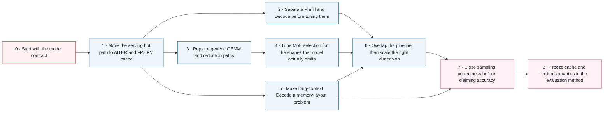

# 从模型约束到 Accuracy Closure：MiMo-V2.5-Pro MI300X 优化演进

[English](optimization-evolution.md) | [Benchmark 主报告](../README-CN.md)

本章解释 MI300X 推理栈为什么按这个顺序演进，以及为什么只有前一层契约稳定之后，后一层优化才有意义。内容把模型架构、Operator kernel、Memory、Scheduling、Parallelism 与 Correctness 分开讨论，不把它们混成一套无法审计的加速配方。

<div align="center"></div>

## 范围与证据边界

这是一张面向公开读者、带来源锚点的演进图。所有阶段并非来自同一轮受控测试，因此不能把时间顺序读成可叠加的加速瀑布。公开 commit 只能证明实现发生变化；只有主 Benchmark 报告链接的脱敏数据，才能支撑其中明确标注的实测结论。

> 面向公开读者、带来源锚点的 MiMo-V2.5-Pro MI300X 推理优化演进说明。它是技术演进图，不表示每个阶段都属于同一条受控 Benchmark lineage。

## 一页看懂演进主线

| 阶段 | 技术层 | 改了什么 | 解锁了什么 |
|---|---|---|---|
| 0 | model | 在选 kernel 或并行方案之前，先冻结架构约束：MoE routing、Hybrid KV layout、MTP verification 与长上下文容量必须同时成立。 | 把后续工作拆成四个明确优化面：Operator、Memory、Scheduling/Parallelism 与 Correctness。 |
| 1 | operators-memory | 启用 AITER backend，并使用 FP8 E4M3 KV Cache，同时保持模型的 Hybrid Attention 语义。 | 为后续 Kernel、长上下文和 Speculative Decoding 调优提供算子基础与 KV 空间。 |
| 2 | architecture | 采用 1P1D PD Disaggregation：Prefill Server、Decode Server、Router 独立部署，并通过 Mooncake 等显式 KV transfer backend 传递状态。 | Prefill 可以围绕 TTFT 调优，Decode 可以围绕 TPOT 与吞吐调优。 |
| 3 | kernels-communication | 采用 CK A8W8 Block-scale Bpreshuffle kernel，并使用 SGLang/AITER Quick All-Reduce 选择机制，不再只依赖通用 Triton GEMM 与默认 Collective。 | 消除算子与通信瓶颈后，模型 shape 调优的收益才可被观察。 |
| 4 | moe | 为 MiMo 增加从 2K 到 32K Token shape 的 tuned fused-MoE configuration。 | 把通用 Kernel Library 变成面向大 Prefill batch 的 workload-aware 执行路径。 |
| 5 | attention-memory | 组合使用 Vectorized 5D KV layout、FlyDSL Paged Attention Decode、Page Size 64、Partition tuning、Chunked Prefill，以及显式 Static-memory/SWA ratio。 | 把 Runtime 从短上下文算子调优扩展到可控的 64K–1M context 容量包络。 |
| 6 | scheduling-parallelism | 启用 Overlap Scheduling；以 TP8 作为单节点模型装载基线；用 DP=2 复制完整 TP group 扩展 Prefill 吞吐；把 EP 视为独立的 MoE All-to-All 设计，而不是免费倍率。 | 把 Operator 效率连接到可持续服务吞吐，并明确每种并行维度消耗的资源。 |
| 7 | correctness | 为 EAGLE top-k=1 增加 opt-in HIP stochastic verifier，并直接验证目标 Non-greedy 路径，不能从吞吐或 Health check 推断正确性。 | 把性能证据与准确率证据分离，并恢复 Temperature sampling 所需的信息流。 |
| 8 | evaluation | 在 MiMo SWE-bench launcher 中把 HIP Non-greedy verifier 与 Radix Cache 设为显式默认，暴露 Custom All-Reduce 控制，并在该 Evaluation lineage 中暂时禁用 Fused RMSNorm + MoE Quant 路径。 | 形成可审查的方法契约，避免性能功能静默改写 Accuracy run。 |

## 精确依赖图

上方 PNG 表示时间顺序；下方图表示因果依赖。一个节点可能同时依赖多条前置路径，而不只依赖紧邻阶段。



## 为什么必须按这个顺序

| 原则 | 原因 |
|---|---|
| 模型契约先于 Kernel | 只有先冻结 MoE routing、Hybrid Attention、MTP 与 context 约束，Kernel 选择才有明确目标。 |
| Backend 集成先于 Shape 调优 | 如果 Runtime 仍绕过 AITER/CK dispatch path，Tuned MoE 配置表不会产生作用。 |
| 先拆分阶段，再分别优化 | PD Disaggregation 才能区分 TTFT 是否由 Prefill 主导、TPOT 是否由 Decode 主导；Unified result 会掩盖瓶颈归属。 |
| 容量证据先于并发结论 | Client concurrency 与配置上限不能证明实际 Decode batch；KV usage 与 Scheduler trace 才能。 |
| Verifier Correctness 先于 Accuracy Score | 服务健康且快速，仍可能采用错误的 Sampling semantics；必须先证明 Verifier path，再解释 Accuracy run。 |

## 逐阶段解释

<!-- stage:model-contract -->
### 0. 先锁定模型契约

| 问题 | 说明 |
|---|---|
| 暴露出的瓶颈 | MiMo-V2.5-Pro 是 1.02T 总参数、42B 活跃参数的 MoE，同时包含 Hybrid SWA/Global Attention、3 层 MTP、非对称 Attention head dimension 和 1M context，不能按普通 Dense Decoder 调优。 |
| 技术改动 | 在选 kernel 或并行方案之前，先冻结架构约束：MoE routing、Hybrid KV layout、MTP verification 与长上下文容量必须同时成立。 |
| 为什么排在这里 | 这是基线契约，没有更早的 Runtime 依赖。 |
| 解锁的能力 | 把后续工作拆成四个明确优化面：Operator、Memory、Scheduling/Parallelism 与 Correctness。 |
| 结论边界 | Model card 只定义 Runtime 必须支持什么，不证明 MI300X 性能。 |
| 这些证据能证明什么 | 小米 Model card 证明模型架构与规模；SGLang cookbook 独立记录面向 Serving 的 MiMo 功能集合。 |
| 公开证据 | [Xiaomi MiMo-V2.5-Pro model card](https://huggingface.co/XiaomiMiMo/MiMo-V2.5-Pro), [SGLang MiMo-V2.5 cookbook](https://docs.sglang.io/cookbook/autoregressive/Xiaomi/MiMo-V2.5) |

**机器可读 Claim 绑定:**

| Claim ID | Statement | 支持类型 | 来源定位 | 来源 |
|---|---|---|---|---|
| C-MODEL-ARCH | MiMo-V2.5-Pro 同时具有 1.02T 总参数、42B 活跃参数、Hybrid SWA/Global Attention、3 层 MTP 和 1M context。 | direct_documentation | Model card: Introduction; Model Architecture & Training Process | [Xiaomi MiMo-V2.5-Pro model card](https://huggingface.co/XiaomiMiMo/MiMo-V2.5-Pro) |
| C-MIMO-SERVING | SGLang MiMo cookbook 记录 MiMo 的 Hybrid Attention、MTP/EAGLE Serving path、1M context 与 topology-sensitive deployment。 | direct_documentation | Cookbook: Model Introduction; Configuration Tips | [SGLang MiMo-V2.5 cookbook](https://docs.sglang.io/cookbook/autoregressive/Xiaomi/MiMo-V2.5) |

<!-- stage:aiter-fp8-kv -->
### 1. 把 Serving 热路径迁移到 AITER 与 FP8 KV Cache

| 问题 | 说明 |
|---|---|
| 暴露出的瓶颈 | 模型适配后的 Runtime 需要 ROCm 上的 Attention、MoE、GEMM、Normalization、Quantization 与 Communication 优化算子；长上下文还会让 KV 容量成为首要约束。 |
| 技术改动 | 启用 AITER backend，并使用 FP8 E4M3 KV Cache，同时保持模型的 Hybrid Attention 语义。 |
| 为什么排在这里 | 依赖 **0 · 先锁定模型契约**。如果这些前置条件不成立，就无法隔离或解释当前阶段。 |
| 解锁的能力 | 为后续 Kernel、长上下文和 Speculative Decoding 调优提供算子基础与 KV 空间。 |
| 结论边界 | 优化 backend 与更小的 KV dtype 本身不能证明高并发稳定性或输出正确性。 |
| 这些证据能证明什么 | AITER 文档证明其 ROCm Operator 覆盖范围；脱敏启动脚本记录本仓库采用的 backend 与 KV Cache 选择。 |
| 公开证据 | [ROCm AITER](https://github.com/ROCm/aiter), [Xiaomi MiMo-V2.5-Pro model card](https://huggingface.co/XiaomiMiMo/MiMo-V2.5-Pro), [`scripts/amd-latest`](../scripts/amd-latest) |

**机器可读 Claim 绑定:**

| Claim ID | Statement | 支持类型 | 来源定位 | 来源 |
|---|---|---|---|---|
| C-AITER-OPS | AITER 为 Attention、MoE、GEMM、Normalization、Quantization 与 Communication 提供 ROCm Operator，并将 MI300X 列为完整支持。 | direct_documentation | README: Key Features; Framework Integration; Operators; Supported Hardware | [ROCm AITER](https://github.com/ROCm/aiter) |
| C-RUNTIME-AITER-FP8 | 仓库脱敏启动路径为本文记录的 MI300X Runtime 选择 AITER backend 与 FP8 KV Cache 设置。 | repository_evidence | scripts/amd-latest launch scripts; model card FP8 model format | [`scripts/amd-latest`](../scripts/amd-latest), [Xiaomi MiMo-V2.5-Pro model card](https://huggingface.co/XiaomiMiMo/MiMo-V2.5-Pro) |

<!-- stage:pd-disaggregation -->
### 2. 先拆开 Prefill 与 Decode，再分别调优

| 问题 | 说明 |
|---|---|
| 暴露出的瓶颈 | Unified Scheduling 把 Compute-intensive Prefill 与 Memory-intensive Decode 混在一起，Prefill 会打断逐 Token 生成，也难以判断瓶颈究竟属于哪一侧。 |
| 技术改动 | 采用 1P1D PD Disaggregation：Prefill Server、Decode Server、Router 独立部署，并通过 Mooncake 等显式 KV transfer backend 传递状态。 |
| 为什么排在这里 | 依赖 **1 · 把 Serving 热路径迁移到 AITER 与 FP8 KV Cache**。如果这些前置条件不成立，就无法隔离或解释当前阶段。 |
| 解锁的能力 | Prefill 可以围绕 TTFT 调优，Decode 可以围绕 TPOT 与吞吐调优。 |
| 结论边界 | PD 是架构，不是自动加速。KV layout 兼容性、传输健康度与实际 batch 仍需 Runtime 证据。 |
| 这些证据能证明什么 | SGLang 文档证明 Compute-bound Prefill 与 Memory-bound Decode 的拆分依据及受支持传输引擎；仓库脚本展示脱敏后的 1P1D 实现。 |
| 公开证据 | [SGLang PD Disaggregation](https://docs.sglang.io/advanced_features/pd_disaggregation.html), [SGLang](https://github.com/sgl-project/sglang), [`scripts/amd-latest`](../scripts/amd-latest) |

**机器可读 Claim 绑定:**

| Claim ID | Statement | 支持类型 | 来源定位 | 来源 |
|---|---|---|---|---|
| C-PD-RATIONALE | SGLang PD Disaggregation 把 Compute-intensive Prefill 与 Memory-intensive Decode 分开，并支持显式 KV transfer backend 与 Router integration。 | direct_documentation | PD docs: Why and What; Router Integration; Mooncake/NIXL | [SGLang PD Disaggregation](https://docs.sglang.io/advanced_features/pd_disaggregation.html), [SGLang](https://github.com/sgl-project/sglang) |
| C-PD-RUNTIME | 本仓库包含实测 1P1D topology 的脱敏 Prefill、Decode 与 Router 启动路径。 | repository_evidence | scripts/amd-latest/launch_pd_*.sh | [`scripts/amd-latest`](../scripts/amd-latest) |

<!-- stage:ck-quick-reduce -->
### 3. 替换通用 GEMM 与 Reduce 路径

| 问题 | 说明 |
|---|---|
| 暴露出的瓶颈 | Attention 迁移到 AITER 之后，A8W8 Blockwise GEMM 与 TP rank 间 Reduce 会成为剩余热路径。 |
| 技术改动 | 采用 CK A8W8 Block-scale Bpreshuffle kernel，并使用 SGLang/AITER Quick All-Reduce 选择机制，不再只依赖通用 Triton GEMM 与默认 Collective。 |
| 为什么排在这里 | 依赖 **1 · 把 Serving 热路径迁移到 AITER 与 FP8 KV Cache**。如果这些前置条件不成立，就无法隔离或解释当前阶段。 |
| 解锁的能力 | 消除算子与通信瓶颈后，模型 shape 调优的收益才可被观察。 |
| 结论边界 | Kernel 替换必须在相同模型 shape 与 topology 下验证；Microkernel 变快不等于端到端一定变快。 |
| 这些证据能证明什么 | CK 与 AITER 文档证明可用 Kernel 层；SGLang commit 证明 Quick All-Reduce 集成；启动脚本记录优化路径的选择。 |
| 公开证据 | [ROCm Composable Kernel](https://github.com/ROCm/composable_kernel), [ROCm AITER](https://github.com/ROCm/aiter), [SGLang quick all-reduce integration](https://github.com/sgl-project/sglang/commit/28d4d4728088f551f13edfcafadf12484b32ee64), [`scripts/amd-latest`](../scripts/amd-latest) |

**机器可读 Claim 绑定:**

| Claim ID | Statement | 支持类型 | 来源定位 | 来源 |
|---|---|---|---|---|
| C-CK-AITER-LAYERS | CK 提供 Tile-based 性能 Kernel；AITER 把 CK、Triton 与 ASM backend 集成为面向 Framework 的 Operator。 | direct_documentation | CK README: programming model; AITER README: Key Features | [ROCm Composable Kernel](https://github.com/ROCm/composable_kernel), [ROCm AITER](https://github.com/ROCm/aiter) |
| C-QUICK-ALLREDUCE | 公开 SGLang commit 集成 Quick All-Reduce，并在可用 All-Reduce 实现之间进行选择。 | public_commit | Commit 28d4d472: integration and selection logic | [SGLang quick all-reduce integration](https://github.com/sgl-project/sglang/commit/28d4d4728088f551f13edfcafadf12484b32ee64) |
| C-CK-RUNTIME-SELECTION | 脱敏 Runtime 脚本为 MI300X 路径选择 CK Block-scale Bpreshuffle 与 Quick Reduce 控制。 | repository_evidence | scripts/amd-latest launch environment | [`scripts/amd-latest`](../scripts/amd-latest) |

<!-- stage:tuned-moe-shapes -->
### 4. 按模型真实 Shape 调整 MoE Kernel 选择

| 问题 | 说明 |
|---|---|
| 暴露出的瓶颈 | 即使已有高性能 Fused-MoE，如果 Dispatcher 对 Prefill 产生的 Token shape 选错 kernel configuration，端到端性能仍会受限。 |
| 技术改动 | 为 MiMo 增加从 2K 到 32K Token shape 的 tuned fused-MoE configuration。 |
| 为什么排在这里 | 依赖 **3 · 替换通用 GEMM 与 Reduce 路径**。如果这些前置条件不成立，就无法隔离或解释当前阶段。 |
| 解锁的能力 | 把通用 Kernel Library 变成面向大 Prefill batch 的 workload-aware 执行路径。 |
| 结论边界 | 公开变更增加的是配置数据，不代表发明了新的 MoE kernel；性能结论仍需原始 Benchmark 日志。 |
| 这些证据能证明什么 | 公开供应方 commit 直接增加 MiMo 2K–32K Token shape 的 tuned/untuned 配置行；其中不包含端到端 Benchmark 结果。 |
| 公开证据 | [MiMo tuned MoE configuration](https://github.com/sammysun0711/aiter/commit/d725746a0f8c233d8e46e2771a7c8dbcd06e40d9), [ROCm AITER](https://github.com/ROCm/aiter) |

**机器可读 Claim 绑定:**

| Claim ID | Statement | 支持类型 | 来源定位 | 来源 |
|---|---|---|---|---|
| C-MOE-CONFIG | 公开供应方 commit 增加 MiMo 2K–32K Token shape 的 Tuned 与 Untuned Fused-MoE 配置行。 | public_commit | Commit d725746: mimo_v2_5_pro_b16_tuned_fmoe.csv and untuned CSV | [MiMo tuned MoE configuration](https://github.com/sammysun0711/aiter/commit/d725746a0f8c233d8e46e2771a7c8dbcd06e40d9), [ROCm AITER](https://github.com/ROCm/aiter) |

<!-- stage:long-context-pa -->
### 5. 把长上下文 Decode 转化为 Memory Layout 问题

| 问题 | 说明 |
|---|---|
| 暴露出的瓶颈 | 进入长上下文后，Decode 往往先受 KV 容量、Page traversal 与 Paged Attention 效率限制，而不是先耗尽计算能力。 |
| 技术改动 | 组合使用 Vectorized 5D KV layout、FlyDSL Paged Attention Decode、Page Size 64、Partition tuning、Chunked Prefill，以及显式 Static-memory/SWA ratio。 |
| 为什么排在这里 | 依赖 **1 · 把 Serving 热路径迁移到 AITER 与 FP8 KV Cache**。如果这些前置条件不成立，就无法隔离或解释当前阶段。 |
| 解锁的能力 | 把 Runtime 从短上下文算子调优扩展到可控的 64K–1M context 容量包络。 |
| 结论边界 | 配置并发不等于实际 Decode batch；必须由 Scheduler log 与 KV usage 证明实际工况。 |
| 这些证据能证明什么 | Model card 证明 1M context 与 Hybrid Attention 约束；公开脚本记录 MI300X layout 与 memory flags；Validation 文件记录实际服务行为。 |
| 公开证据 | [Xiaomi MiMo-V2.5-Pro model card](https://huggingface.co/XiaomiMiMo/MiMo-V2.5-Pro), [ROCm AITER](https://github.com/ROCm/aiter), [`scripts/amd-latest`](../scripts/amd-latest), [`data/validation`](../data/validation) |

**机器可读 Claim 绑定:**

| Claim ID | Statement | 支持类型 | 来源定位 | 来源 |
|---|---|---|---|---|
| C-MODEL-ARCH | MiMo-V2.5-Pro 同时具有 1.02T 总参数、42B 活跃参数、Hybrid SWA/Global Attention、3 层 MTP 和 1M context。 | direct_documentation | Model card: Introduction; Model Architecture & Training Process | [Xiaomi MiMo-V2.5-Pro model card](https://huggingface.co/XiaomiMiMo/MiMo-V2.5-Pro) |
| C-LONG-RUNTIME | 脱敏 Runtime 路径记录 Vectorized 5D KV layout、FlyDSL Paged Attention Decode、Page Size 64、Partition、Chunked Prefill 与 Static-memory/SWA 控制。 | repository_evidence | AITER FlyDSL support; scripts/amd-latest launch flags | [ROCm AITER](https://github.com/ROCm/aiter), [`scripts/amd-latest`](../scripts/amd-latest) |
| C-LONG-OBSERVATION | 仓库 Validation 数据记录长上下文服务行为与实际 batch，而不是从配置并发推断。 | repository_evidence | data/validation scheduler audits; model card long-context contract | [`data/validation`](../data/validation), [Xiaomi MiMo-V2.5-Pro model card](https://huggingface.co/XiaomiMiMo/MiMo-V2.5-Pro) |

<!-- stage:overlap-and-parallelism -->
### 6. 先重叠 Pipeline，再扩展正确的并行维度

| 问题 | 说明 |
|---|---|
| 暴露出的瓶颈 | 即使 Kernel 更快，只要 Scheduling、Transfer 与 Execution 串行，Pipeline 仍有空洞；如果把 TP、DP 与 EP 当成同一种扩展手段，Scale-out 也会失败。 |
| 技术改动 | 启用 Overlap Scheduling；以 TP8 作为单节点模型装载基线；用 DP=2 复制完整 TP group 扩展 Prefill 吞吐；把 EP 视为独立的 MoE All-to-All 设计，而不是免费倍率。 |
| 为什么排在这里 | 依赖 **2 · 先拆开 Prefill 与 Decode，再分别调优**, **4 · 按模型真实 Shape 调整 MoE Kernel 选择**, **5 · 把长上下文 Decode 转化为 Memory Layout 问题**。如果这些前置条件不成立，就无法隔离或解释当前阶段。 |
| 解锁的能力 | 把 Operator 效率连接到可持续服务吞吐，并明确每种并行维度消耗的资源。 |
| 结论边界 | 本文记录的 MI300X 接受路径仍是 TP8/no-EP。DP=2 Prefill 已评估；EP 必须建立独立验证的 topology 与 communication contract。 |
| 这些证据能证明什么 | SGLang 文档证明 Overlap、PD 与 TP/DP/EP 能力；MiMo cookbook 定义 topology 约束；仓库 Validation 记录实际通过验收的 MI300X 路径。 |
| 公开证据 | [SGLang](https://github.com/sgl-project/sglang), [SGLang PD Disaggregation](https://docs.sglang.io/advanced_features/pd_disaggregation.html), [SGLang Speculative Decoding](https://docs.sglang.io/advanced_features/speculative_decoding.html), [SGLang MiMo-V2.5 cookbook](https://docs.sglang.io/cookbook/autoregressive/Xiaomi/MiMo-V2.5), [`data/validation`](../data/validation) |

**机器可读 Claim 绑定:**

| Claim ID | Statement | 支持类型 | 来源定位 | 来源 |
|---|---|---|---|---|
| C-PARALLELISM | SGLang 文档记录 Overlap Scheduling 与 TP/DP/EP/PD 能力；MiMo cookbook 记录 topology-specific constraints。 | direct_documentation | SGLang overview; PD docs; Speculative Decoding V2; MiMo Configuration Tips | [SGLang](https://github.com/sgl-project/sglang), [SGLang PD Disaggregation](https://docs.sglang.io/advanced_features/pd_disaggregation.html), [SGLang Speculative Decoding](https://docs.sglang.io/advanced_features/speculative_decoding.html), [SGLang MiMo-V2.5 cookbook](https://docs.sglang.io/cookbook/autoregressive/Xiaomi/MiMo-V2.5) |
| C-PARALLELISM-ACCEPTED | 公开 Validation 数据把通过验收的 MI300X TP8/no-EP 测量、DP=2 Prefill 探索与未验证外推区分开。 | repository_evidence | data/validation topology and service audits | [`data/validation`](../data/validation) |

<!-- stage:eagle-correctness -->
### 7. 先闭合 Sampling Correctness，再讨论 Accuracy

| 问题 | 说明 |
|---|---|
| 暴露出的瓶颈 | MTP/EAGLE 路径即使很快也可能语义错误：HIP 上 Non-greedy top-k=1 verification 曾被静默送入 Greedy verifier，改变了 Sampling semantics。 |
| 技术改动 | 为 EAGLE top-k=1 增加 opt-in HIP stochastic verifier，并直接验证目标 Non-greedy 路径，不能从吞吐或 Health check 推断正确性。 |
| 为什么排在这里 | 依赖 **5 · 把长上下文 Decode 转化为 Memory Layout 问题**, **6 · 先重叠 Pipeline，再扩展正确的并行维度**。如果这些前置条件不成立，就无法隔离或解释当前阶段。 |
| 解锁的能力 | 把性能证据与准确率证据分离，并恢复 Temperature sampling 所需的信息流。 |
| 结论边界 | 该修复恢复预期 Verifier 语义；只有端到端 Accuracy run 才能给出分数。 |
| 这些证据能证明什么 | 公开修复明确指出 HIP Greedy fallback，增加 opt-in Stochastic verifier，并声明其他默认行为保持不变。 |
| 公开证据 | [HIP non-greedy EAGLE verifier fix](https://github.com/sammysun0711/sglang/commit/878fff15647fe3dabb32aa3a335b0ad16e3ee878), [SGLang Speculative Decoding](https://docs.sglang.io/advanced_features/speculative_decoding.html) |

**机器可读 Claim 绑定:**

| Claim ID | Statement | 支持类型 | 来源定位 | 来源 |
|---|---|---|---|---|
| C-EAGLE-DOCS | SGLang 文档记录通过 EAGLE Speculative Decoding 使用 MTP，包括 Steps、Top-k、Draft-token 控制与 Overlap Scheduler 约束。 | direct_documentation | Speculative Decoding: MTP; EAGLE parameters; V2 Overlap Scheduler | [SGLang Speculative Decoding](https://docs.sglang.io/advanced_features/speculative_decoding.html) |
| C-HIP-VERIFIER-FIX | 公开供应方 commit 指出 HIP Non-greedy top-k=1 路径曾回退到 Greedy verification，并增加 opt-in Stochastic verifier。 | public_commit | Commit 878fff156: environ.py and eagle_utils.py | [HIP non-greedy EAGLE verifier fix](https://github.com/sammysun0711/sglang/commit/878fff15647fe3dabb32aa3a335b0ad16e3ee878) |

<!-- stage:evaluation-closure -->
### 8. 在 Evaluation Method 中冻结 Cache 与 Fusion 语义

| 问题 | 说明 |
|---|---|
| 暴露出的瓶颈 | 即使 Verifier 已修复，只要不同运行间的 Radix Cache、Custom All-Reduce 选择或新引入 Fusion 路径发生变化，Evaluation 仍会漂移。 |
| 技术改动 | 在 MiMo SWE-bench launcher 中把 HIP Non-greedy verifier 与 Radix Cache 设为显式默认，暴露 Custom All-Reduce 控制，并在该 Evaluation lineage 中暂时禁用 Fused RMSNorm + MoE Quant 路径。 |
| 为什么排在这里 | 依赖 **7 · 先闭合 Sampling Correctness，再讨论 Accuracy**。如果这些前置条件不成立，就无法隔离或解释当前阶段。 |
| 解锁的能力 | 形成可审查的方法契约，避免性能功能静默改写 Accuracy run。 |
| 结论边界 | 这是 Evaluation Method 更新，不能追溯性套用到使用其他 Runtime 或 Launcher 的旧结果。 |
| 这些证据能证明什么 | 公开 Evaluation commit 在同一 Launcher 变更中记录 Radix Cache/Verifier 默认值、Custom All-Reduce 控制与临时禁用 Fused RMSNorm + MoE Quant。 |
| 公开证据 | [MiMo SWE-bench evaluation defaults update](https://github.com/sammysun0711/sglang/commit/b0f860b81104eb3e9aae40cce391e56443e2d688), [HIP non-greedy EAGLE verifier fix](https://github.com/sammysun0711/sglang/commit/878fff15647fe3dabb32aa3a335b0ad16e3ee878), [`data/validation`](../data/validation) |

**机器可读 Claim 绑定:**

| Claim ID | Statement | 支持类型 | 来源定位 | 来源 |
|---|---|---|---|---|
| C-EVAL-DEFAULTS | 公开 Evaluation commit 为该 Launcher lineage 显式启用 Radix Cache 与 HIP verifier，暴露 Custom All-Reduce 控制，并禁用 Fused RMSNorm + MoE Quantization。 | public_commit | Commit b0f860b8: evaluation/launch_tp8_noep_aiter_mtp_accuracy.sh | [MiMo SWE-bench evaluation defaults update](https://github.com/sammysun0711/sglang/commit/b0f860b81104eb3e9aae40cce391e56443e2d688), [HIP non-greedy EAGLE verifier fix](https://github.com/sammysun0711/sglang/commit/878fff15647fe3dabb32aa3a335b0ad16e3ee878) |
| C-EVAL-LINEAGE | 仓库 Validation 分离 Runtime identity 与结果 lineage，避免把方法更新追溯性套用到旧结果。 | repository_evidence | data/validation runtime identity and result audit files | [`data/validation`](../data/validation) |

## TP、DP、EP 与 PD 是四个不同维度

这些标签回答的是不同问题。把它们统称为 GPU 数量，会掩盖模型切分、副本数量、Expert 通信以及 Prefill/Decode 阶段分离。

| 维度 | 作用 | 在本项目中的位置 | 边界 |
|---|---|---|---|
| **TP — Tensor Parallelism（张量并行）** | 把一个模型副本切分到多个 rank，使权重、Dense 与 Attention 工作能够装载并协同执行。 | 本仓库接受的 MI300X 单节点模型装载基线是 TP8。 | TP 改变单请求执行与通信方式，不表示副本数量。 |
| **DP — Data Parallelism（数据并行）** | 复制完整执行组，把不同请求分配给不同副本。 | DP=2 Prefill 表示两个完整 TP8 group，总计 16 张 GPU，不是两张 GPU。 | DP 提高聚合容量，不会自动降低单请求时延。 |
| **EP — Expert Parallelism（专家并行）** | 把 MoE expert ownership 分布到参与 rank，并引入 All-to-All Token dispatch。 | EP 是可选 topology，但本文记录的 MI300X 接受路径仍为 no-EP。 | EP size 受参与 rank 与 Expert placement 约束；EP rank 更多并不必然更快，因为通信量也会增加。 |
| **PD — Prefill-Decode Disaggregation（预填充与解码分离）** | 把 Compute-intensive Prefill 与 Memory-intensive Decode 分开，并在两者之间传输 KV state。 | 1P1D 与 TP、DP、EP 正交：Prefill 和 Decode 两侧仍各自需要合法的并行 topology。 | PD 不会消除 Model revision、KV layout、Page size 与传输健康度的一致性要求。 |

## 各技术层如何相互作用

| 技术层 | 主要证据 | 跳过该层的典型后果 |
|---|---|---|
| Operator 与 Kernel | Kernel marker、Operator test、相同 shape Benchmark | Runtime 静默使用通用实现或旧 JIT 产物。 |
| Memory 与 KV layout | KV usage、Page size/Layout identity、实际 batch | 配置并发不断提高，但活跃 batch 没有变化。 |
| Scheduling 与 Parallelism | Scheduler trace、Queue state、Per-rank traffic | 吞吐被错误归因到其他阶段或 topology。 |
| Correctness 与 Evaluation | Sampling-path probe、Trajectory、Scorer output | 服务很快且健康，但得分方法不成立。 |

## 证据与结论纪律

- 架构资料定义支持的行为，不能证明实测提升。
- 公开 commit 证明代码或配置发生变化，不能直接证明端到端效果。
- Microkernel 结果只有经过受控服务测试，才能升级为端到端结论。
- Client concurrency、配置上限与 Scheduler 实际 batch 是三个不同概念。
- Performance closure 与 Accuracy closure 属于不同 lineage，不能相互替代。

## 验证生成产物

文章、图片与依赖数据都是可确定性重建的 Repo 产物：

```bash
python3 -m pip install -r requirements.txt
python3 scripts/validate_optimization_evolution.py
python3 scripts/render_optimization_docs.py --check
python3 scripts/generate_optimization_evolution.py --check
python3 scripts/validate_repo.py
```

**预期门禁摘要:**

```text
OPTIMIZATION_EVOLUTION_DATA=PASS
OPTIMIZATION_DOCS_CURRENT=PASS
DIAGRAM_CURRENT=PASS
REPO_VALIDATION=PASS
```

## 公开参考资料

| ID | 类型 | 来源 |
|---|---|---|
| mimo_model_card | official_model_card | [Xiaomi MiMo-V2.5-Pro model card](https://huggingface.co/XiaomiMiMo/MiMo-V2.5-Pro) |
| sglang_mimo_cookbook | official_framework_documentation | [SGLang MiMo-V2.5 cookbook](https://docs.sglang.io/cookbook/autoregressive/Xiaomi/MiMo-V2.5) |
| sglang_overview | official_repository | [SGLang](https://github.com/sgl-project/sglang) |
| sglang_pd | official_framework_documentation | [SGLang PD Disaggregation](https://docs.sglang.io/advanced_features/pd_disaggregation.html) |
| sglang_speculative | official_framework_documentation | [SGLang Speculative Decoding](https://docs.sglang.io/advanced_features/speculative_decoding.html) |
| aiter | official_repository | [ROCm AITER](https://github.com/ROCm/aiter) |
| ck | official_repository | [ROCm Composable Kernel](https://github.com/ROCm/composable_kernel) |
| quick_allreduce | official_commit | [SGLang quick all-reduce integration](https://github.com/sgl-project/sglang/commit/28d4d4728088f551f13edfcafadf12484b32ee64) |
| mimo_tuned_moe | public_supplier_commit | [MiMo tuned MoE configuration](https://github.com/sammysun0711/aiter/commit/d725746a0f8c233d8e46e2771a7c8dbcd06e40d9) |
| hip_eagle_fix | public_supplier_commit | [HIP non-greedy EAGLE verifier fix](https://github.com/sammysun0711/sglang/commit/878fff15647fe3dabb32aa3a335b0ad16e3ee878) |
| swebench_eval_update | public_supplier_commit | [MiMo SWE-bench evaluation defaults update](https://github.com/sammysun0711/sglang/commit/b0f860b81104eb3e9aae40cce391e56443e2d688) |
| public_runtime_scripts | repository_evidence | [`scripts/amd-latest`](../scripts/amd-latest) |
| public_validation | repository_evidence | [`data/validation`](../data/validation) |
