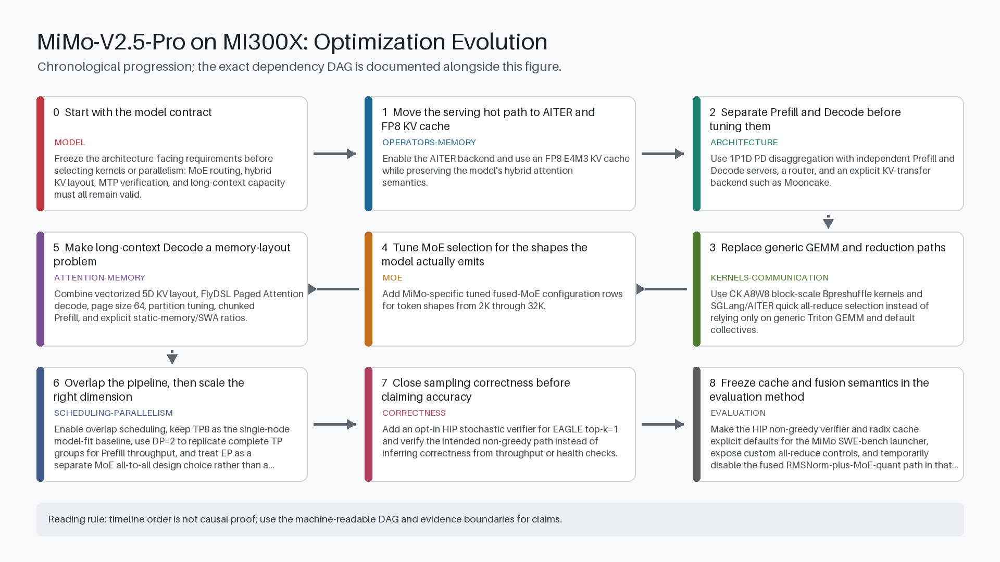
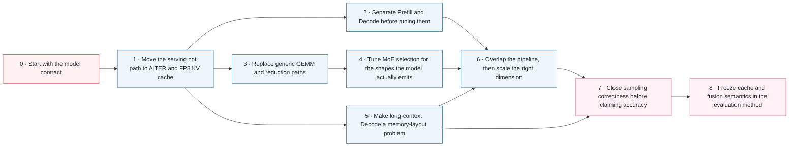

# From Model Constraints to Accuracy Closure: MiMo-V2.5-Pro on MI300X

[中文版](optimization-evolution-CN.md) | [Main benchmark report](../README.md)

This chapter explains the order in which the MI300X serving stack evolved and why later optimizations only become meaningful after earlier contracts are stable. It separates model architecture, operator kernels, memory, scheduling, parallelism, and correctness instead of presenting them as one undifferentiated speed recipe.

<div align="center"></div>

## Scope and evidence boundary

This is a public, source-anchored evolution map. The stages were not all measured in one controlled run, so their sequence must not be read as an additive speedup waterfall. Public commits establish implementation changes; this repository's sanitized data establishes only the measurements explicitly linked from the main benchmark report.

> A public, source-anchored explanation of the MI300X serving optimizations used or evaluated for MiMo-V2.5-Pro. It is an evolution map, not a claim that every stage belongs to one controlled benchmark lineage.

## The evolution in one page

| Stage | Layer | What changed | What it unlocked |
|---|---|---|---|
| 0 | model | Freeze the architecture-facing requirements before selecting kernels or parallelism: MoE routing, hybrid KV layout, MTP verification, and long-context capacity must all remain valid. | Creates four explicit optimization surfaces: operators, memory, scheduling/parallelism, and correctness. |
| 1 | operators-memory | Enable the AITER backend and use an FP8 E4M3 KV cache while preserving the model's hybrid attention semantics. | Provides the operator surface and KV headroom needed by later kernel, long-context, and speculative-decoding work. |
| 2 | architecture | Use 1P1D PD disaggregation with independent Prefill and Decode servers, a router, and an explicit KV-transfer backend such as Mooncake. | Allows separate TTFT-oriented Prefill tuning and TPOT/throughput-oriented Decode tuning. |
| 3 | kernels-communication | Use CK A8W8 block-scale Bpreshuffle kernels and SGLang/AITER quick all-reduce selection instead of relying only on generic Triton GEMM and default collectives. | Removes operator and communication bottlenecks so model-shape tuning becomes measurable. |
| 4 | moe | Add MiMo-specific tuned fused-MoE configuration rows for token shapes from 2K through 32K. | Turns a general kernel library into a workload-aware execution path for large Prefill batches. |
| 5 | attention-memory | Combine vectorized 5D KV layout, FlyDSL Paged Attention decode, page size 64, partition tuning, chunked Prefill, and explicit static-memory/SWA ratios. | Extends the runtime from short-context operator tuning to a controlled 64K–1M context capacity envelope. |
| 6 | scheduling-parallelism | Enable overlap scheduling, keep TP8 as the single-node model-fit baseline, use DP=2 to replicate complete TP groups for Prefill throughput, and treat EP as a separate MoE all-to-all design choice rather than a free multiplier. | Connects operator efficiency to sustainable service throughput and clarifies which resource each parallel dimension consumes. |
| 7 | correctness | Add an opt-in HIP stochastic verifier for EAGLE top-k=1 and verify the intended non-greedy path instead of inferring correctness from throughput or health checks. | Separates performance evidence from accuracy evidence and restores the information flow required by temperature-based sampling. |
| 8 | evaluation | Make the HIP non-greedy verifier and radix cache explicit defaults for the MiMo SWE-bench launcher, expose custom all-reduce controls, and temporarily disable the fused RMSNorm-plus-MoE-quant path in that evaluation lineage. | Produces a reviewable method contract in which speed features cannot silently redefine the accuracy run. |

## Exact dependency graph

The PNG above is chronological. The graph below is causal: a node may depend on more than the stage immediately before it.



## Why the order matters

| Rule | Reason |
|---|---|
| Model contract before kernels | Kernel selection is only meaningful after MoE routing, hybrid attention, MTP, and context requirements are fixed. |
| Backend integration before shape tuning | Tuned MoE rows cannot help if the runtime is still bypassing the AITER/CK dispatch path that consumes them. |
| Separate phases before optimizing each phase | PD disaggregation exposes whether TTFT is Prefill-bound or TPOT is Decode-bound; a unified result hides that ownership. |
| Capacity evidence before concurrency claims | Client concurrency and configured limits do not prove the actual Decode batch; KV usage and scheduler traces do. |
| Verifier correctness before an accuracy score | A healthy, fast server can still apply the wrong sampling semantics. The verifier path must be proven before interpreting an accuracy run. |

## Stage-by-stage explanation

<!-- stage:model-contract -->
### 0. Start with the model contract

| Question | Answer |
|---|---|
| Bottleneck exposed | A 1.02T-parameter MoE with 42B active parameters, hybrid SWA/global attention, three MTP layers, asymmetric attention head dimensions, and a 1M-token context cannot be tuned as a generic dense decoder. |
| Technical change | Freeze the architecture-facing requirements before selecting kernels or parallelism: MoE routing, hybrid KV layout, MTP verification, and long-context capacity must all remain valid. |
| Why this stage comes here | This is the baseline contract; it has no earlier runtime dependency. |
| What it unlocks | Creates four explicit optimization surfaces: operators, memory, scheduling/parallelism, and correctness. |
| Claim boundary | The model card defines what the runtime must support; it does not establish MI300X performance. |
| What the evidence establishes | The Xiaomi model card establishes the architecture and model scale; the SGLang cookbook independently records the serving-facing MiMo feature set. |
| Public evidence | [Xiaomi MiMo-V2.5-Pro model card](https://huggingface.co/XiaomiMiMo/MiMo-V2.5-Pro), [SGLang MiMo-V2.5 cookbook](https://docs.sglang.io/cookbook/autoregressive/Xiaomi/MiMo-V2.5) |

**Machine-readable claim bindings:**

| Claim ID | Statement | Support | Source locator | Sources |
|---|---|---|---|---|
| C-MODEL-ARCH | MiMo-V2.5-Pro combines 1.02T total parameters, 42B active parameters, hybrid SWA/global attention, three MTP layers, and a 1M-token context. | direct_documentation | Model card: Introduction; Model Architecture & Training Process | [Xiaomi MiMo-V2.5-Pro model card](https://huggingface.co/XiaomiMiMo/MiMo-V2.5-Pro) |
| C-MIMO-SERVING | The SGLang MiMo cookbook documents MiMo's hybrid attention, MTP/EAGLE serving path, 1M context, and topology-sensitive deployment options. | direct_documentation | Cookbook: Model Introduction; Configuration Tips | [SGLang MiMo-V2.5 cookbook](https://docs.sglang.io/cookbook/autoregressive/Xiaomi/MiMo-V2.5) |

<!-- stage:aiter-fp8-kv -->
### 1. Move the serving hot path to AITER and FP8 KV cache

| Question | Answer |
|---|---|
| Bottleneck exposed | A model-aware runtime needs optimized ROCm operators for attention, MoE, GEMM, normalization, quantization, and communication; long context also makes KV capacity a first-order constraint. |
| Technical change | Enable the AITER backend and use an FP8 E4M3 KV cache while preserving the model's hybrid attention semantics. |
| Why this stage comes here | Depends on **0 · Start with the model contract**. Without those prerequisites, this stage cannot be isolated or interpreted. |
| What it unlocks | Provides the operator surface and KV headroom needed by later kernel, long-context, and speculative-decoding work. |
| Claim boundary | An optimized backend and smaller KV dtype do not by themselves prove high-concurrency stability or output correctness. |
| What the evidence establishes | AITER documents its ROCm operator coverage, while the sanitized launch scripts record the backend and KV-cache choices used by this repository. |
| Public evidence | [ROCm AITER](https://github.com/ROCm/aiter), [Xiaomi MiMo-V2.5-Pro model card](https://huggingface.co/XiaomiMiMo/MiMo-V2.5-Pro), [`scripts/amd-latest`](../scripts/amd-latest) |

**Machine-readable claim bindings:**

| Claim ID | Statement | Support | Source locator | Sources |
|---|---|---|---|---|
| C-AITER-OPS | AITER provides ROCm operators for attention, MoE, GEMM, normalization, quantization, and communication, with MI300X listed as fully supported. | direct_documentation | README: Key Features; Framework Integration; Operators; Supported Hardware | [ROCm AITER](https://github.com/ROCm/aiter) |
| C-RUNTIME-AITER-FP8 | The sanitized repository launch path selects the AITER backend and FP8 KV-cache settings for the documented MI300X runtime. | repository_evidence | scripts/amd-latest launch scripts; model card FP8 model format | [`scripts/amd-latest`](../scripts/amd-latest), [Xiaomi MiMo-V2.5-Pro model card](https://huggingface.co/XiaomiMiMo/MiMo-V2.5-Pro) |

<!-- stage:pd-disaggregation -->
### 2. Separate Prefill and Decode before tuning them

| Question | Answer |
|---|---|
| Bottleneck exposed | Unified scheduling mixes a compute-intensive Prefill phase with a memory-intensive Decode phase, allowing Prefill work to interrupt token generation and hiding which side owns the bottleneck. |
| Technical change | Use 1P1D PD disaggregation with independent Prefill and Decode servers, a router, and an explicit KV-transfer backend such as Mooncake. |
| Why this stage comes here | Depends on **1 · Move the serving hot path to AITER and FP8 KV cache**. Without those prerequisites, this stage cannot be isolated or interpreted. |
| What it unlocks | Allows separate TTFT-oriented Prefill tuning and TPOT/throughput-oriented Decode tuning. |
| Claim boundary | PD is an architecture, not an automatic speedup. KV layout compatibility, transfer health, and actual batch still require runtime evidence. |
| What the evidence establishes | SGLang documentation establishes the compute-bound Prefill versus memory-bound Decode rationale and supported transfer engines; repository scripts show the sanitized 1P1D realization. |
| Public evidence | [SGLang PD Disaggregation](https://docs.sglang.io/advanced_features/pd_disaggregation.html), [SGLang](https://github.com/sgl-project/sglang), [`scripts/amd-latest`](../scripts/amd-latest) |

**Machine-readable claim bindings:**

| Claim ID | Statement | Support | Source locator | Sources |
|---|---|---|---|---|
| C-PD-RATIONALE | SGLang PD disaggregation separates compute-intensive Prefill from memory-intensive Decode and supports explicit KV-transfer backends and router integration. | direct_documentation | PD docs: Why and What; Router Integration; Mooncake/NIXL | [SGLang PD Disaggregation](https://docs.sglang.io/advanced_features/pd_disaggregation.html), [SGLang](https://github.com/sgl-project/sglang) |
| C-PD-RUNTIME | This repository contains sanitized Prefill, Decode, and router launch paths for the measured 1P1D topology. | repository_evidence | scripts/amd-latest/launch_pd_*.sh | [`scripts/amd-latest`](../scripts/amd-latest) |

<!-- stage:ck-quick-reduce -->
### 3. Replace generic GEMM and reduction paths

| Question | Answer |
|---|---|
| Bottleneck exposed | After attention moves to AITER, A8W8 blockwise GEMM and TP-rank reductions can dominate the remaining hot path. |
| Technical change | Use CK A8W8 block-scale Bpreshuffle kernels and SGLang/AITER quick all-reduce selection instead of relying only on generic Triton GEMM and default collectives. |
| Why this stage comes here | Depends on **1 · Move the serving hot path to AITER and FP8 KV cache**. Without those prerequisites, this stage cannot be isolated or interpreted. |
| What it unlocks | Removes operator and communication bottlenecks so model-shape tuning becomes measurable. |
| Claim boundary | Kernel replacement must be validated at the same model shape and topology; a microkernel win is not automatically an end-to-end win. |
| What the evidence establishes | CK and AITER document the available kernel layers, the SGLang commit establishes quick all-reduce integration, and the launch scripts record selection of the optimized paths. |
| Public evidence | [ROCm Composable Kernel](https://github.com/ROCm/composable_kernel), [ROCm AITER](https://github.com/ROCm/aiter), [SGLang quick all-reduce integration](https://github.com/sgl-project/sglang/commit/28d4d4728088f551f13edfcafadf12484b32ee64), [`scripts/amd-latest`](../scripts/amd-latest) |

**Machine-readable claim bindings:**

| Claim ID | Statement | Support | Source locator | Sources |
|---|---|---|---|---|
| C-CK-AITER-LAYERS | CK exposes tile-based performance kernels, while AITER integrates CK, Triton, and ASM backends into framework-facing operators. | direct_documentation | CK README: programming model; AITER README: Key Features | [ROCm Composable Kernel](https://github.com/ROCm/composable_kernel), [ROCm AITER](https://github.com/ROCm/aiter) |
| C-QUICK-ALLREDUCE | The public SGLang commit integrates quick all-reduce and selects among available all-reduce implementations. | public_commit | Commit 28d4d472: integration and selection logic | [SGLang quick all-reduce integration](https://github.com/sgl-project/sglang/commit/28d4d4728088f551f13edfcafadf12484b32ee64) |
| C-CK-RUNTIME-SELECTION | The sanitized runtime scripts select CK block-scale Bpreshuffle and quick-reduce controls for the MI300X path. | repository_evidence | scripts/amd-latest launch environment | [`scripts/amd-latest`](../scripts/amd-latest) |

<!-- stage:tuned-moe-shapes -->
### 4. Tune MoE selection for the shapes the model actually emits

| Question | Answer |
|---|---|
| Bottleneck exposed | Having a fast fused-MoE implementation is insufficient if the dispatcher selects a suboptimal kernel configuration for the token shapes produced during Prefill. |
| Technical change | Add MiMo-specific tuned fused-MoE configuration rows for token shapes from 2K through 32K. |
| Why this stage comes here | Depends on **3 · Replace generic GEMM and reduction paths**. Without those prerequisites, this stage cannot be isolated or interpreted. |
| What it unlocks | Turns a general kernel library into a workload-aware execution path for large Prefill batches. |
| Claim boundary | The public change adds configuration data; it is not evidence of a newly invented MoE kernel, and performance claims require raw benchmark logs. |
| What the evidence establishes | The public supplier commit directly adds tuned and untuned MiMo configuration rows for the 2K–32K token shapes; it does not contain an end-to-end benchmark result. |
| Public evidence | [MiMo tuned MoE configuration](https://github.com/sammysun0711/aiter/commit/d725746a0f8c233d8e46e2771a7c8dbcd06e40d9), [ROCm AITER](https://github.com/ROCm/aiter) |

**Machine-readable claim bindings:**

| Claim ID | Statement | Support | Source locator | Sources |
|---|---|---|---|---|
| C-MOE-CONFIG | The public supplier commit adds tuned and untuned MiMo fused-MoE configuration rows for token shapes from 2K through 32K. | public_commit | Commit d725746: mimo_v2_5_pro_b16_tuned_fmoe.csv and untuned CSV | [MiMo tuned MoE configuration](https://github.com/sammysun0711/aiter/commit/d725746a0f8c233d8e46e2771a7c8dbcd06e40d9), [ROCm AITER](https://github.com/ROCm/aiter) |

<!-- stage:long-context-pa -->
### 5. Make long-context Decode a memory-layout problem

| Question | Answer |
|---|---|
| Bottleneck exposed | At long context, Decode becomes constrained by KV capacity, page traversal, and Paged Attention efficiency before raw compute is exhausted. |
| Technical change | Combine vectorized 5D KV layout, FlyDSL Paged Attention decode, page size 64, partition tuning, chunked Prefill, and explicit static-memory/SWA ratios. |
| Why this stage comes here | Depends on **1 · Move the serving hot path to AITER and FP8 KV cache**. Without those prerequisites, this stage cannot be isolated or interpreted. |
| What it unlocks | Extends the runtime from short-context operator tuning to a controlled 64K–1M context capacity envelope. |
| Claim boundary | Configured concurrency is not actual Decode batch. Scheduler logs and KV usage must prove the operating point. |
| What the evidence establishes | The model card establishes the 1M context and hybrid attention constraints; public scripts record the MI300X layout and memory flags; validation files record observed service behavior. |
| Public evidence | [Xiaomi MiMo-V2.5-Pro model card](https://huggingface.co/XiaomiMiMo/MiMo-V2.5-Pro), [ROCm AITER](https://github.com/ROCm/aiter), [`scripts/amd-latest`](../scripts/amd-latest), [`data/validation`](../data/validation) |

**Machine-readable claim bindings:**

| Claim ID | Statement | Support | Source locator | Sources |
|---|---|---|---|---|
| C-MODEL-ARCH | MiMo-V2.5-Pro combines 1.02T total parameters, 42B active parameters, hybrid SWA/global attention, three MTP layers, and a 1M-token context. | direct_documentation | Model card: Introduction; Model Architecture & Training Process | [Xiaomi MiMo-V2.5-Pro model card](https://huggingface.co/XiaomiMiMo/MiMo-V2.5-Pro) |
| C-LONG-RUNTIME | The sanitized runtime path records vectorized 5D KV layout, FlyDSL Paged Attention decode, page size 64, partitioning, chunked Prefill, and static-memory/SWA controls. | repository_evidence | AITER FlyDSL support; scripts/amd-latest launch flags | [ROCm AITER](https://github.com/ROCm/aiter), [`scripts/amd-latest`](../scripts/amd-latest) |
| C-LONG-OBSERVATION | Repository validation data records observed long-context service behavior and actual batches rather than inferring them from configured concurrency. | repository_evidence | data/validation scheduler audits; model card long-context contract | [`data/validation`](../data/validation), [Xiaomi MiMo-V2.5-Pro model card](https://huggingface.co/XiaomiMiMo/MiMo-V2.5-Pro) |

<!-- stage:overlap-and-parallelism -->
### 6. Overlap the pipeline, then scale the right dimension

| Question | Answer |
|---|---|
| Bottleneck exposed | Faster kernels still leave bubbles when scheduling, transfer, and execution serialize; scale-out also fails when TP, DP, and EP are treated as interchangeable. |
| Technical change | Enable overlap scheduling, keep TP8 as the single-node model-fit baseline, use DP=2 to replicate complete TP groups for Prefill throughput, and treat EP as a separate MoE all-to-all design choice rather than a free multiplier. |
| Why this stage comes here | Depends on **2 · Separate Prefill and Decode before tuning them**, **4 · Tune MoE selection for the shapes the model actually emits**, **5 · Make long-context Decode a memory-layout problem**. Without those prerequisites, this stage cannot be isolated or interpreted. |
| What it unlocks | Connects operator efficiency to sustainable service throughput and clarifies which resource each parallel dimension consumes. |
| Claim boundary | The accepted MI300X path documented here remains TP8/no-EP. DP=2 Prefill was evaluated; EP requires a separately validated topology and communication contract. |
| What the evidence establishes | SGLang documents overlap, PD, and TP/DP/EP capabilities; the MiMo cookbook defines topology constraints; repository validation records which MI300X paths were actually accepted. |
| Public evidence | [SGLang](https://github.com/sgl-project/sglang), [SGLang PD Disaggregation](https://docs.sglang.io/advanced_features/pd_disaggregation.html), [SGLang Speculative Decoding](https://docs.sglang.io/advanced_features/speculative_decoding.html), [SGLang MiMo-V2.5 cookbook](https://docs.sglang.io/cookbook/autoregressive/Xiaomi/MiMo-V2.5), [`data/validation`](../data/validation) |

**Machine-readable claim bindings:**

| Claim ID | Statement | Support | Source locator | Sources |
|---|---|---|---|---|
| C-PARALLELISM | SGLang documents overlap scheduling and TP/DP/EP/PD capabilities, while the MiMo cookbook records topology-specific constraints. | direct_documentation | SGLang overview; PD docs; Speculative Decoding V2; MiMo Configuration Tips | [SGLang](https://github.com/sgl-project/sglang), [SGLang PD Disaggregation](https://docs.sglang.io/advanced_features/pd_disaggregation.html), [SGLang Speculative Decoding](https://docs.sglang.io/advanced_features/speculative_decoding.html), [SGLang MiMo-V2.5 cookbook](https://docs.sglang.io/cookbook/autoregressive/Xiaomi/MiMo-V2.5) |
| C-PARALLELISM-ACCEPTED | The public validation set distinguishes accepted MI300X TP8/no-EP measurements from DP=2 Prefill exploration and unsupported extrapolation. | repository_evidence | data/validation topology and service audits | [`data/validation`](../data/validation) |

<!-- stage:eagle-correctness -->
### 7. Close sampling correctness before claiming accuracy

| Question | Answer |
|---|---|
| Bottleneck exposed | A fast MTP/EAGLE path can still be wrong: on HIP, non-greedy top-k=1 verification was silently routed through the greedy verifier, changing sampling semantics. |
| Technical change | Add an opt-in HIP stochastic verifier for EAGLE top-k=1 and verify the intended non-greedy path instead of inferring correctness from throughput or health checks. |
| Why this stage comes here | Depends on **5 · Make long-context Decode a memory-layout problem**, **6 · Overlap the pipeline, then scale the right dimension**. Without those prerequisites, this stage cannot be isolated or interpreted. |
| What it unlocks | Separates performance evidence from accuracy evidence and restores the information flow required by temperature-based sampling. |
| Claim boundary | The fix restores the intended verifier semantics; only an end-to-end accuracy run can establish a score. |
| What the evidence establishes | The public fix explicitly identifies the HIP greedy fallback, adds the opt-in stochastic verifier, and states that the default behavior otherwise remains unchanged. |
| Public evidence | [HIP non-greedy EAGLE verifier fix](https://github.com/sammysun0711/sglang/commit/878fff15647fe3dabb32aa3a335b0ad16e3ee878), [SGLang Speculative Decoding](https://docs.sglang.io/advanced_features/speculative_decoding.html) |

**Machine-readable claim bindings:**

| Claim ID | Statement | Support | Source locator | Sources |
|---|---|---|---|---|
| C-EAGLE-DOCS | SGLang documents MTP through EAGLE speculative decoding, including steps, top-k, draft-token controls, and overlap-scheduler constraints. | direct_documentation | Speculative Decoding: MTP; EAGLE parameters; V2 Overlap Scheduler | [SGLang Speculative Decoding](https://docs.sglang.io/advanced_features/speculative_decoding.html) |
| C-HIP-VERIFIER-FIX | The public supplier commit identifies a HIP non-greedy top-k=1 path that had fallen back to greedy verification and adds an opt-in stochastic verifier. | public_commit | Commit 878fff156: environ.py and eagle_utils.py | [HIP non-greedy EAGLE verifier fix](https://github.com/sammysun0711/sglang/commit/878fff15647fe3dabb32aa3a335b0ad16e3ee878) |

<!-- stage:evaluation-closure -->
### 8. Freeze cache and fusion semantics in the evaluation method

| Question | Answer |
|---|---|
| Bottleneck exposed | Even after the verifier is fixed, an evaluation can drift if radix-cache state, custom all-reduce selection, or newly introduced fusion paths change between runs. |
| Technical change | Make the HIP non-greedy verifier and radix cache explicit defaults for the MiMo SWE-bench launcher, expose custom all-reduce controls, and temporarily disable the fused RMSNorm-plus-MoE-quant path in that evaluation lineage. |
| Why this stage comes here | Depends on **7 · Close sampling correctness before claiming accuracy**. Without those prerequisites, this stage cannot be isolated or interpreted. |
| What it unlocks | Produces a reviewable method contract in which speed features cannot silently redefine the accuracy run. |
| Claim boundary | This is an evaluation-method update. It must not be retroactively applied to older results that used a different runtime or launcher. |
| What the evidence establishes | The public evaluation commit records the radix-cache and verifier defaults, custom all-reduce controls, and temporary fused RMSNorm-plus-MoE-quant disablement in one launcher change. |
| Public evidence | [MiMo SWE-bench evaluation defaults update](https://github.com/sammysun0711/sglang/commit/b0f860b81104eb3e9aae40cce391e56443e2d688), [HIP non-greedy EAGLE verifier fix](https://github.com/sammysun0711/sglang/commit/878fff15647fe3dabb32aa3a335b0ad16e3ee878), [`data/validation`](../data/validation) |

**Machine-readable claim bindings:**

| Claim ID | Statement | Support | Source locator | Sources |
|---|---|---|---|---|
| C-EVAL-DEFAULTS | The public evaluation commit makes radix cache and the HIP verifier explicit defaults, exposes custom all-reduce controls, and disables fused RMSNorm-plus-MoE quantization for that launcher lineage. | public_commit | Commit b0f860b8: evaluation/launch_tp8_noep_aiter_mtp_accuracy.sh | [MiMo SWE-bench evaluation defaults update](https://github.com/sammysun0711/sglang/commit/b0f860b81104eb3e9aae40cce391e56443e2d688), [HIP non-greedy EAGLE verifier fix](https://github.com/sammysun0711/sglang/commit/878fff15647fe3dabb32aa3a335b0ad16e3ee878) |
| C-EVAL-LINEAGE | Repository validation keeps runtime identity and result lineage separate so the method update is not retroactively applied to older results. | repository_evidence | data/validation runtime identity and result audit files | [`data/validation`](../data/validation) |

## TP, DP, EP, and PD are different axes

These labels answer different questions. Combining them into a single 'GPU count' hides model placement, replica count, expert communication, and phase separation.

| Axis | Role | How it appears here | Boundary |
|---|---|---|---|
| **TP — Tensor Parallelism** | Shards one model replica across ranks so weights and dense/attention work fit and execute collectively. | TP8 is the accepted single-node MI300X model-fit baseline in this repository. | TP changes per-request execution and communication; it is not a replica count. |
| **DP — Data Parallelism** | Replicates complete execution groups and routes different requests to different replicas. | DP=2 Prefill means two complete TP8 groups: 16 GPUs in total, not two GPUs. | DP raises aggregate capacity; it does not automatically improve single-request latency. |
| **EP — Expert Parallelism** | Distributes MoE expert ownership across participating ranks and introduces all-to-all token dispatch. | EP was a topology option, but the accepted MI300X path documented here remains no-EP. | EP size is constrained by participating ranks and expert placement. More EP ranks are not automatically faster because communication grows. |
| **PD — Prefill-Decode Disaggregation** | Separates compute-intensive Prefill from memory-intensive Decode and transfers KV state between them. | 1P1D is orthogonal to TP, DP, and EP: each side still needs its own valid parallel topology. | PD does not remove compatibility requirements for model revision, KV layout, page size, or transfer health. |

## How the layers interact

| Layer | Primary evidence | Typical failure if skipped |
|---|---|---|
| Operators and kernels | Kernel marker, operator test, matched-shape benchmark | The runtime silently uses a generic or stale implementation. |
| Memory and KV layout | KV usage, page-size/layout identity, actual batch | Configured concurrency rises while the active batch does not. |
| Scheduling and parallelism | Scheduler traces, queue state, per-rank traffic | Throughput is attributed to the wrong phase or topology. |
| Correctness and evaluation | Sampling-path probe, trajectory, scorer output | A fast healthy server produces a methodologically invalid score. |

## Evidence and claim discipline

- Architecture sources define supported behavior; they do not prove a measured uplift.
- A public commit proves that code or configuration changed; it does not prove an end-to-end effect.
- A microkernel result must not be promoted to a service-level result without a controlled run.
- Client concurrency, configured limits, and actual scheduler batch are separate quantities.
- Performance closure and accuracy closure are separate lineages; neither substitutes for the other.

## Verify the generated artifact

The article, diagram, and dependency data are deterministic repository artifacts:

```bash
python3 -m pip install -r requirements.txt
python3 scripts/validate_optimization_evolution.py
python3 scripts/render_optimization_docs.py --check
python3 scripts/generate_optimization_evolution.py --check
python3 scripts/validate_repo.py
```

**Expected gate summary:**

```text
OPTIMIZATION_EVOLUTION_DATA=PASS
OPTIMIZATION_DOCS_CURRENT=PASS
DIAGRAM_CURRENT=PASS
REPO_VALIDATION=PASS
```

## Public references

| ID | Type | Source |
|---|---|---|
| mimo_model_card | official_model_card | [Xiaomi MiMo-V2.5-Pro model card](https://huggingface.co/XiaomiMiMo/MiMo-V2.5-Pro) |
| sglang_mimo_cookbook | official_framework_documentation | [SGLang MiMo-V2.5 cookbook](https://docs.sglang.io/cookbook/autoregressive/Xiaomi/MiMo-V2.5) |
| sglang_overview | official_repository | [SGLang](https://github.com/sgl-project/sglang) |
| sglang_pd | official_framework_documentation | [SGLang PD Disaggregation](https://docs.sglang.io/advanced_features/pd_disaggregation.html) |
| sglang_speculative | official_framework_documentation | [SGLang Speculative Decoding](https://docs.sglang.io/advanced_features/speculative_decoding.html) |
| aiter | official_repository | [ROCm AITER](https://github.com/ROCm/aiter) |
| ck | official_repository | [ROCm Composable Kernel](https://github.com/ROCm/composable_kernel) |
| quick_allreduce | official_commit | [SGLang quick all-reduce integration](https://github.com/sgl-project/sglang/commit/28d4d4728088f551f13edfcafadf12484b32ee64) |
| mimo_tuned_moe | public_supplier_commit | [MiMo tuned MoE configuration](https://github.com/sammysun0711/aiter/commit/d725746a0f8c233d8e46e2771a7c8dbcd06e40d9) |
| hip_eagle_fix | public_supplier_commit | [HIP non-greedy EAGLE verifier fix](https://github.com/sammysun0711/sglang/commit/878fff15647fe3dabb32aa3a335b0ad16e3ee878) |
| swebench_eval_update | public_supplier_commit | [MiMo SWE-bench evaluation defaults update](https://github.com/sammysun0711/sglang/commit/b0f860b81104eb3e9aae40cce391e56443e2d688) |
| public_runtime_scripts | repository_evidence | [`scripts/amd-latest`](../scripts/amd-latest) |
| public_validation | repository_evidence | [`data/validation`](../data/validation) |
