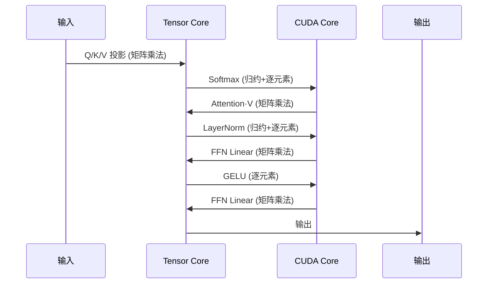
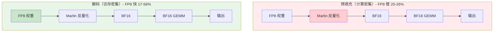
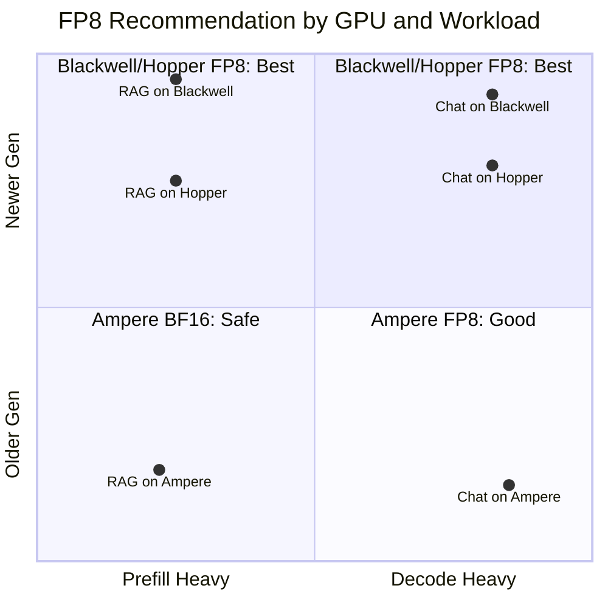

# Azure GPU VM 选型指南与 Performance Benchmark（性能基准测试）

> 全面的 GPU 硬件分析、VM 选型指南和跨 RTX PRO 6000 BSE (Blackwell)、H100 NVL (Hopper)、A100 PCIe (Ampere)、A10 (Ampere) 性能基准测试

**作者**: 魏新宇 (Xinyu Wei) | Microsoft AI and Apps GBB 架构师

---


## 在 Azure 上运行

本基准测试在多个 **Azure GPU 虚拟机** SKU 上进行。

| 项目 | 详情 |
|---|---|
| **Azure VM** | [NC H100 v5](https://learn.microsoft.com/en-us/azure/virtual-machines/nc-h100-v5-series), [NC A100 v4](https://learn.microsoft.com/en-us/azure/virtual-machines/nc-a100-v4-series), [NC RTX Pro 6000V6 BSE](https://learn.microsoft.com/en-us/azure/virtual-machines/sizes/gpu-accelerated/overview) |
| **GPU** | NVIDIA H100、A100、RTX 6000 Ada、GB200 |
| **框架** | vLLM, SGLang, torch.compile, Diffusers |


## 📖 目录

**第一部分：GPU 硬件与选型**
1. [核心理念：GPU 不仅仅是"算力"](#核心理念gpu-不仅仅是算力)
2. [六大硬件单元详解](#六大硬件单元详解)
3. [GPU 硬件配置对比](#gpu-硬件配置对比)
4. [场景 × GPU 支持矩阵](#场景--gpu-支持矩阵)
5. [Azure GPU VM 系列](#azure-gpu-vm-系列)
6. [选型决策树](#选型决策树)

**第二部分：科学计算与数值精度**
7. [精度速查表](#精度速查表fp64fp32tf32bf16fp16fp8fp4)
8. [CUDA Core vs Tensor Core](#cuda-core-vs-tensor-core谁在算什么)

**第三部分：FP8 性能验证**
9. [FP8 技术架构](#fp8-技术架构)
10. [FP8 测试结果](#fp8-测试结果)
11. [FP8 技术分析](#fp8-技术分析)
12. [FP8 使用建议](#fp8-使用建议)

**第四部分：NC RTX Pro 6000 V6 BSE 基准测试**
13. [网络配置测试](#1-网络配置测试)
14. [GPU P2P 互联测试](#2-gpu-p2p-互联测试)
15. [FP32 算力测试](#3-fp32-算力测试)
16. [LLM 推理测试](#4-llm-推理测试)
17. [SFT 全量微调测试](#5-sft-全量微调测试)
18. [FLUX 图像生成测试](#6-flux-图像生成测试)
19. [Blender 渲染测试](#7-blender-渲染测试)
20. [NVENC 视频编码测试](#8-nvenc-视频编码测试)

**第五部分：实用指南**
21. [实际场景选型案例](#实际场景选型案例)
22. [部署指南](#部署指南)
23. [四款 GPU 综合对比](#四款-gpu-综合对比)
24. [仓库结构与快速开始](#-仓库结构与快速开始)
25. [测试环境](#测试环境)
26. [参考资料](#参考资料)

---

# 第一部分：GPU 硬件与选型

## 核心理念：GPU 不仅仅是"算力"

### 常见误区

| 误区 | 真相 |
|---|---|
| "GPU = TFLOPS" | TFLOPS 只衡量 Tensor/CUDA Core 性能，非整体能力 |
| "显存大 = 万能" | 能加载 ≠ 能跑完整 pipeline（可能缺少编码器无法输出） |
| "数据中心 GPU = 万能" | NC H100 无法做视频转码，NV A10 可以 |

### 正确的思维模型

**GPU = 多种专用硬件单元的组合**

```
┌─────────────────────────────────────────────────────────────────┐
│                         NVIDIA GPU                               │
├─────────────────┬─────────────────────┬─────────────────────────┤
│   📥 解码/输入   │     🧠 计算           │      📤 编码/输出        │
├─────────────────┼─────────────────────┼─────────────────────────┤
│  NVDEC (视频)   │  CUDA Core (通用)    │   NVENC (视频)          │
│  NVJPG (图像)   │  Tensor Core (AI)   │   NVJPG (图像)          │
│                 │  RT Core (光追)      │                         │
└─────────────────┴─────────────────────┴─────────────────────────┘
```

> 💡 **说明**: NVDEC/NVENC/NVJPG 既可用于输入（解码）也可用于输出（编码）。

**关键洞察**：不同 GPU 拥有不同的硬件单元组合，这决定了它们能做和不能做什么。

---

## 六大硬件单元详解

### 1. NVDEC - 视频解码器

| 属性 | 说明 |
|---|---|
| **功能** | 将压缩视频（H.264/H.265/AV1）解码为原始帧 |
| **类比** | 相当于解压 ZIP 文件 |
| **应用** | 视频播放、视频 AI 分析的预处理 |

### 2. NVENC - 视频编码器

| 属性 | 说明 |
|---|---|
| **功能** | 将原始帧压缩为视频文件（MP4 等） |
| **类比** | 相当于压缩为 ZIP 文件 |
| **应用** | 直播推流、视频导出、云游戏 |
| **⚠️ 关键** | **NC H100 / NC A100 没有 NVENC！** |

### 3. NVJPG - JPEG 硬件引擎

| 属性 | 说明 |
|---|---|
| **功能** | 硬件加速 JPEG 编解码 |
| **应用** | 图像预处理流水线、批量图像处理 |
| **支持** | NC H100 (7 个单元)、NC A100 (5 个单元)、RTX PRO 6000 BSE (Blackwell) |

> ⚠️ **注意**: A10 不支持 JPEG 硬件加速，虽然它也是 Ampere 架构。nvJPEG 硬件加速仅支持 Ampere (A100, A30)、Hopper、Ada 和 Blackwell。

### 4. Tensor Core

| 属性 | 说明 |
|---|---|
| **功能** | 加速 AI 训练/推理的矩阵乘法 |
| **应用** | LLM、Stable Diffusion、视频生成 AI |
| **代数** | 第3代 (Ampere) → 第4代 (Hopper) → 第5代 (Blackwell) |

### 5. RT Core - 光线追踪核心

| 属性 | 说明 |
|---|---|
| **功能** | 硬件加速光线追踪计算 |
| **应用** | 游戏光追、3D 渲染、CAD 实时预览 |
| **⚠️ 关键** | **NC H100 / NC A100 没有 RT Core！** |
| **说明** | NV A10 有 72 个 RT Core（第2代），RTX PRO 6000 BSE 有 188 个（第4代）|

### 6. CUDA Core

| 属性 | 说明 |
|---|---|
| **功能** | 通用并行计算 |
| **应用** | 所有 GPU 计算任务的基础 |

---

## GPU 硬件配置对比

> 注意：所有规格基于 Azure VM 系列产品。

### 硬件单元配置矩阵

| 硬件单元 | RTX 6000 Pro Blackwell | H100 NVL | A100 PCIe | A10 |
|---|---|---|---|---|
| **NVDEC** (解码器) | ✅ 4 (第6代) | ✅ 7 | ✅ 5 | ✅ 2 |
| **NVENC** (编码器) | ✅ **4 (第9代, AV1)** | ❌ **无** | ❌ **无** | ✅ 1 (第7代) |
| **NVJPG** | ✅ 是 | ✅ 7 | ✅ 5 | ❌ 无 |
| **Tensor Core** | ✅ 第5代 | ✅ 第4代 | ✅ 第3代 | ✅ 第3代 |
| **RT Core** | ✅ **188 (第4代)** | ❌ **无** | ❌ **无** | ✅ 72 (第2代) |
| **NVLink** | ❌ 无 | ✅ 有 | ✅ 有 | ❌ 无 |

> 📝 **数据来源**: RTX PRO 6000 BSE NVENC/NVDEC/RT Core 代数来自 NVIDIA 官方规格。H100/A100 NVDEC 数量来自 Azure VM 规格。

### 基础规格（Azure VM 系列）

| 规格 | NC H100 (NCads_H100_v5) | NC A100 (NC_A100_v4) | RTX PRO 6000 BSE (NCv6) | NV A10 (NVadsA10_v5) |
|---|---|---|---|---|
| **架构** | Hopper | Ampere | Blackwell | Ampere |
| **显存** | 94GB HBM3 | 80GB HBM2e | 96GB GDDR7 | 24GB GDDR6 |
| **GPU 数量** | 1-2 | 1-4 | 1-2 | 1/6 - 2 |
| **最大 vCPU** | 80 | 96 | 320 | 72 |
| **最大内存** | 640 GiB | 880 GiB | 1280 GiB | 880 GiB |

### 定位总结

| GPU | 定位 | 优势 | 局限 |
|---|---|---|---|
| **NC H100** | 纯 AI 计算 | 最强 Tensor Core、94GB HBM3 | 无 NVENC、无 RT Core |
| **NC A100** | AI 训练/推理 | 成熟生态、80GB HBM2e | 无 NVENC、无 RT Core |
| **RTX PRO 6000 BSE** | 全功能专业卡 | 所有硬件单元齐全、完整 pipeline、96GB GDDR7 | 无 NVLink |
| **NV A10** | 推理/图形/VDI | 有 NVENC + RT Core、支持分片 GPU | 显存较小（24GB）|

---

## 场景 × GPU 支持矩阵

### 图例

| 符号 | 含义 |
|---|---|
| ✅ | 完全支持，推荐 |
| ❌ | 不支持 |
| ⚠️ | 可用但有局限 |

### AI 场景

| 场景 | 所需硬件 | NC H100 | NC A100 | RTX PRO 6000 BSE | NV A10 |
|---|---|---|---|---|---|
| LLM 训练（>70B 参数）| Tensor Core + NVLink + 大显存 | ✅ | ✅ | ❌ | ❌ |
| LLM 微调（7B-70B）| Tensor Core + 大显存 | ✅ | ✅ | ✅ | ⚠️ |
| LLM 推理 | Tensor Core | ✅ | ✅ | ✅ | ⚠️ |
| AI 图像生成（SD/FLUX）| Tensor Core | ✅ | ✅ | ✅ | ✅ |
| AI 图像生成（批量输出）| Tensor Core + NVJPG | ✅ | ✅ | ✅ | ⚠️ |
| AI 视频生成（仅生成）| Tensor Core + 大显存 | ✅ | ✅ | ✅ | ⚠️ |
| AI 视频生成（含 MP4 输出）| Tensor Core + NVENC | ❌ | ❌ | ✅ | ✅ |

### 视频/媒体场景

| 场景 | 所需硬件 | NC H100 | NC A100 | RTX PRO 6000 BSE | NV A10 |
|---|---|---|---|---|---|
| 视频转码 | NVDEC + NVENC | ❌ | ❌ | ✅ | ✅ |
| 纯视频解码 | NVDEC | ✅ | ✅ | ✅ | ✅ |
| 直播推流 | NVENC | ❌ | ❌ | ✅ | ✅ |
| 视频会议编码 | NVENC | ❌ | ❌ | ✅ | ✅ |
| 视频 AI 分析 | NVDEC + Tensor Core | ✅ | ✅ | ✅ | ✅ |

### 游戏/渲染场景

| 场景 | 所需硬件 | NC H100 | NC A100 | RTX PRO 6000 BSE | NV A10 |
|---|---|---|---|---|---|
| 云游戏 | RT Core + NVENC | ❌ | ❌ | ✅ | ✅ |
| 3D 游戏（光线追踪）| RT Core | ❌ | ❌ | ✅ | ✅ |
| DLSS 超分辨率 | Tensor Core | ✅ | ✅ | ✅ | ✅ |
| DLSS 帧生成 | Ada/Blackwell | ❌ | ❌ | ✅ | ❌ |
| Blender 渲染 | RT Core | ❌ | ❌ | ✅ | ✅ |
| CAD 实时预览 | RT Core + CUDA | ❌ | ❌ | ✅ | ✅ |
| VDI（虚拟桌面）| NVENC + Graphics | ❌ | ❌ | ✅ | ✅ |

> ⚠️ **DLSS 帧生成说明**: DLSS Frame Generation 仅支持 Ada Lovelace 及更新架构。A10 (Ampere) 不支持帧生成，仅支持 DLSS 超分辨率。RTX PRO 6000 BSE (Blackwell) 支持 DLSS 4 多帧生成。

### 科学计算

| 场景 | 所需硬件 | NC H100 | NC A100 | RTX PRO 6000 BSE | NV A10 |
|---|---|---|---|---|---|
| 通用 CUDA 计算 | CUDA Core | ✅ | ✅ | ✅ | ✅ |
| FP64 双精度 | FP64 Units | ✅ | ✅ | ⚠️ | ⚠️ |
| 分布式训练 | NVLink | ✅ | ✅ | ❌ | ❌ |

---

## Azure GPU VM 系列

### 可用 GPU VM 系列

| VM 系列 | GPU | GPU 数量 | 每卡显存 | 使用场景 |
|---|---|---|---|---|
| **NCads_H100_v5** | H100 NVL (PCIe) | 1-2 | 94GB HBM3 | LLM 训练/推理、HPC |
| **NC_A100_v4** | A100 (PCIe) | 1-4 | 80GB HBM2e | AI 训练/推理 |
| **NC RTX PRO 6000 BSE v6** | RTX PRO 6000 Blackwell Server Edition | 1-2 | 96GB GDDR7 | 专业图形、AI、全 pipeline |
| **NVadsA10_v5** | A10 | 1/6 - 2 | 24GB GDDR6 | 推理、图形、VDI |

### 按场景选型

| 场景 | 推荐 VM 系列 | 原因 |
|---|---|---|
| 训练大 LLM（>70B）| NCads_H100_v5, ND_A100_v4 | 需要大显存 + NVLink |
| 微调 LLM（7B-70B）| NC_A100_v4, NCads_H100_v5 | 需要足够显存 |
| LLM 推理服务 | NC_A100_v4, NVadsA10_v5 | 性能与成本平衡 |
| AI 视频生成 + 输出 | NC RTX PRO 6000 BSE v6, NVadsA10_v5 | 需要 NVENC 输出 MP4 |
| 云游戏 | NC RTX PRO 6000 BSE v6, NVadsA10_v5 | 需要 RT Core + NVENC |
| 3D 渲染 | NC RTX PRO 6000 BSE v6, NVadsA10_v5 | 需要 RT Core |
| 视频转码 | NC RTX PRO 6000 BSE v6, NVadsA10_v5 | 需要 NVDEC + NVENC |
| VDI | NVadsA10_v5, NC RTX PRO 6000 BSE v6 | 支持分片 GPU |

---

## 选型决策树

### 三个关键问题

| # | 问题 | 如果"是" |
|---|---|---|
| 1 | **需要视频编码输出？** | → 排除 NC H100 / NC A100 |
| 2 | **需要光线追踪？** | → 排除 NC H100 / NC A100 |
| 3 | **模型能放进单卡显存？** | 不能 → 需要 NVLink 多卡 |

### 决策流程图

```
                    ┌─────────────────────┐
                    │   你的任务是什么？    │
                    └──────────┬──────────┘
                               │
        ┌──────────────────────┼──────────────────────┐
        │                      │                      │
        ▼                      ▼                      ▼
   ┌─────────┐           ┌─────────┐           ┌─────────┐
   │ AI 训练 │           │ AI 推理 │           │视频/媒体│
   └────┬────┘           └────┬────┘           └────┬────┘
        │                     │                     │
        ▼                     │                     ▼
   需要 NVLink？              │              需要编码？
        │                     │                     │
    ┌───┴───┐                 │               ┌─────┴─────┐
   是      否                 │              是          否
    │       │                 │               │           │
    ▼       ▼                 ▼               ▼           ▼
 ┌───────┐ ┌────────┐   ┌──────────┐  ┌───────────┐ ┌───────┐
 │NC H100│ │RTX PRO │   │检查显存  │  │RTX PRO    │ │NC H100│
 │NC A100│ │6000 BSE│   │与延迟需求│  │6000 BSE   │ │NC A100│
 └───────┘ └────────┘   └──────────┘  │NV A10     │ └───────┘
                                      └───────────┘
```

---

# 第二部分：科学计算与数值精度

## 精度速查表（FP64/FP32/TF32/BF16/FP16/FP8/FP4）

### CUDA Core vs Tensor Core 精度对比

| 精度 | 执行单元 | 主要用途 | RTX 6000 性能 |
|---|---|---|---|
| **FP64** | CUDA Core (FP64 ALU) | HPC 科学计算（双精度）| ~2 TFLOPS |
| **FP32** | CUDA Core (FP32 ALU) | 传统渲染、标量运算、游戏 | **125 TFLOPS** |
| **TF32** | Tensor Core | AI 训练（透明 FP32 API 优化）| ~500 TFLOPS |
| **BF16/FP16** | Tensor Core | AI 训练/推理 Mixed Precision（混合精度） | ~1000 TFLOPS |
| **FP8** | Tensor Core | AI 推理优化 | ~2000 TFLOPS |
| **NVFP4** | Tensor Core (第5代) | AI 推理极致优化 | **4000 TOPS** |

> **关键理解**:
> - FP64 和 FP32 是**物理上独立的 ALU 单元**（数据中心: FP64:FP32 = 1:2，RTX: 1:64）
> - TF32/BF16/FP16/FP8/NVFP4 **共享同一个 Tensor Core 硬件**，只是不同精度配置

### TF32 透明优化

> **一句话**：TF32 不是数据类型，而是 Tensor Core 的"隐身加速模式"——你写 FP32，硬件暗中用 TF32 算，快 8-10 倍，精度损失 <0.1%。

**工作原理**：
```
torch.float32 → Ampere+ 自动截断为 TF32 (19-bit) 做乘法 → 结果回到 FP32
```

| 格式 | 位数 | 说明 |
|---|---|---|
| FP32 | 1+8+23=32 | 用户 API、存储、累加精度 |
| TF32 | 1+8+10=19 | Tensor Core 乘法瞬间完成（指数位同 FP32，截断尾数）|

**PyTorch 默认启用**（Ampere+）:
```python
torch.backends.cuda.matmul.allow_tf32  # 默认 True
torch.backends.cudnn.allow_tf32        # 默认 True
```

### GPU 性能速查表

| 场景 | 关键指标 | RTX 6000 | H100 NVL | 胜者 |
|---|---|---|---|---|
| **AI 推理/训练** | Tensor Core (BF16) | ~504 TFLOPS | **~836 TFLOPS** | H100 |
| **AI 推理 (FP8)** | Tensor Core (FP8) | ~1,010 TFLOPS | **~1,671 TFLOPS** | H100 |
| **AI 推理 (FP4)** | Tensor Core (NVFP4) | **~2,000 TFLOPS** | ❌ 不支持 | RTX 6000 |
| **HPC 科学计算** | CUDA Core (FP64) | ~2 TFLOPS | **30 TFLOPS** | H100 |
| **3D 渲染** | FP32 + RT Core | **125T + 380T RT** | 60T + ❌ | RTX 6000 |

> **快速选型**:
> - AI 性能 → 看 **Tensor Core** (BF16/FP8/FP4)
> - HPC 性能 → 只看 **FP64** — H100 碾压 (30 vs 2 TFLOPS)
> - 渲染 → 看 **FP32 + RT Core** — RTX 6000 独占 (H100 没有 RT Core)

---

## CUDA Core vs Tensor Core：谁在算什么



**简单规则**:
- **矩阵乘法 → Tensor Core**（Linear、Conv、Attention QK 和 V 乘法）
- **其他一切 → CUDA Core**（激活函数、归一化、Softmax）

| 运算类型 | 执行单元 | 示例 |
|---|---|---|
| **矩阵乘法** | Tensor Core | `torch.mm`、`torch.bmm`、`nn.Linear`、`nn.Conv2d` |
| **逐元素运算** | CUDA Core | `torch.add`、`torch.mul`、`torch.exp`、激活函数 |
| **归约运算** | CUDA Core | `torch.sum`、`torch.mean`、`softmax` |
| **内存操作** | CUDA Core | `torch.cat`、`torch.reshape`、索引 |

> **常见误区**: "BF16 训练全部使用 Tensor Core"
>
> **实际**: 即使在 BF16 训练中，也只有约 40-60% 的计算时间在 Tensor Core 上（矩阵乘法），其余是 CUDA Core（逐元素运算、归约）。

---

# 第三部分：FP8 性能验证

## FP8 技术架构

| GPU | 架构 | FP8 执行路径 | 关键特性 |
|---|---|---|---|
| **A100** | Ampere SM80 | FP8 权重 → **Marlin 反量化** → BF16 → BF16 GEMM | ⚠️ 反量化开销 |
| **H100** | Hopper SM90 | FP8 权重 → FP8 激活 → **原生 FP8 GEMM** | ✅ 2倍 FLOPS (1979 TFLOPS) |
| **RTX 6000** | Blackwell SM120 | FP8 权重 → **原生 FP8 GEMM** | ✅ 新一代 + 原生 FP8 |

**执行流程对比**:

```
┌─────────────────────────────────────────────────────────────────────────────┐
│ A100 (Ampere SM80) - 无原生 FP8                                              │
│ FP8 权重 ──→ [Marlin 反量化] ──→ BF16 ──→ [BF16 Tensor Core] ──→ 输出       │
│               ⚠️ 额外步骤                                                   │
├─────────────────────────────────────────────────────────────────────────────┤
│ H100 (Hopper SM90) - 原生 FP8                                               │
│ FP8 权重 ──→ FP8 激活 ──→ [FP8 Tensor Core] ──→ 输出                        │
│                            ✅ 直接执行                                       │
├─────────────────────────────────────────────────────────────────────────────┤
│ RTX 6000 (Blackwell SM120) - 原生 FP8                                       │
│ FP8 权重 ──→ [FP8 Tensor Core] ──→ 输出                                     │
│              ✅ 直接执行，新一代架构                                          │
└─────────────────────────────────────────────────────────────────────────────┘
```

### 🔥 关键发现摘要

| GPU | 架构 | FP8 Prefill vs BF16 | FP8 Decode vs BF16 | 建议 |
|---|---|---|---|---|
| **RTX 6000** | Blackwell SM120 | **+59~65%** ✅ | **+11~26%** ✅ | **所有场景使用 FP8** |
| **H100** | Hopper SM90 | **+29~38%** ✅ | **+36~43%** ✅ | **所有场景使用 FP8** |
| **A100** | Ampere SM80 | **-20~26%** ⚠️ | **+17~56%** ✅ | 仅解码密集型负载使用 FP8 |

> ⚠️ **重大发现**:
> - **RTX 6000 Blackwell** FP8 预填充提升最高 (+65%)，展示了新一代架构的优势
> - **H100 Hopper** 在所有场景均提供稳定的 30-40% 加速，得益于原生 FP8 Tensor Core
> - **A100 Ampere** 缺少原生 FP8，预填充阶段因 Marlin 反量化开销慢 20-26%

---

## FP8 测试结果

### RTX 6000 Blackwell 双向对比 (2026-01-04)

> **测试配置**: NVIDIA RTX PRO 6000 Blackwell (96GB vGPU)，vLLM 0.13.0rc2+cu130，CUDA 13.0
>
> ⚠️ **注意**: vLLM 0.13.0rc2 中运行时 FP8（`--quantization fp8`）尚不支持 Blackwell SM120。仅预量化 FP8 模型可用。

| 场景 | BF16 | FP8 预量化 | FP8 vs BF16 |
|---|---|---|---|
| **预填充 单请求** | 9,860 tok/s | 16,309 tok/s | **+65.4%** ✅ |
| **预填充 50并发** | 12,250 tok/s | 19,461 tok/s | **+58.9%** ✅ |
| **解码 单请求** | 44 tok/s | 48 tok/s | **+10.6%** ✅ |
| **解码 50并发** | 1,777 tok/s | 2,235 tok/s | **+25.8%** ✅ |

**显存使用（RTX 6000）**:
| 配置 | 模型显存 | 说明 |
|---|---|---|
| BF16 | 27.57 GiB | 全精度权重 |
| FP8 预量化 | 15.39 GiB | **减少 44%** |

### H100 三向对比 (2026-01-04)

> **测试配置**: NVIDIA H100 NVL 96GB，vLLM 0.13.0，PyTorch 2.9.0+cu128

| 场景 | BF16 | FP8 运行时 | FP8 预量化 | FP8 vs BF16 |
|---|---|---|---|---|
| **预填充 单请求** | 14,298 tok/s | 19,703 tok/s | 19,655 tok/s | **+37.8%** ✅ |
| **预填充 50并发** | 14,415 tok/s | 18,647 tok/s | 18,720 tok/s | **+29.4%** ✅ |
| **解码 单请求** | 89 tok/s | 127 tok/s | 126 tok/s | **+42.7%** ✅ |
| **解码 50并发** | 3,044 tok/s | 4,140 tok/s | 4,110 tok/s | **+36.0%** ✅ |

**显存使用（H100）**:
| 配置 | 模型显存 | 可用 KV Cache |
|---|---|---|
| BF16 | 27.57 GiB | 50.44 GiB |
| FP8 运行时 | 15.36 GiB | 62.64 GiB |
| FP8 预量化 | 15.39 GiB | 62.62 GiB |

### A100 三向对比 (2026-01-03)

> **测试配置**: NVIDIA A100 80GB PCIe，vLLM 0.11.2

| 场景 | BF16 | FP8 运行时 | FP8 预量化 | FP8 vs BF16 |
|---|---|---|---|---|
| **预填充 单请求** | 6,555 tok/s | 5,251 tok/s | 5,277 tok/s | **-19.8%** ⚠️ |
| **预填充 50并发** | 7,221 tok/s | 5,335 tok/s | 5,352 tok/s | **-26.1%** ⚠️ |
| **解码 单请求** | 47 tok/s | 73 tok/s | 73 tok/s | **+55.3%** ✅ |
| **解码 50并发** | 1,702 tok/s | 1,999 tok/s | 2,031 tok/s | **+17.4%** ✅ |

### 跨 GPU 性能对比

| 场景 | A100 BF16 | H100 BF16 | RTX 6000 BF16 | H100 vs A100 | RTX 6000 vs A100 |
|---|---|---|---|---|---|
| 预填充 单请求 | 6,555 tok/s | 14,298 tok/s | 9,860 tok/s | **2.18x** | **1.50x** |
| 预填充 50并发 | 7,221 tok/s | 14,415 tok/s | 12,250 tok/s | **2.00x** | **1.70x** |
| 解码 单请求 | 47 tok/s | 89 tok/s | 44 tok/s | **1.89x** | 0.94x |
| 解码 50并发 | 1,702 tok/s | 3,044 tok/s | 1,777 tok/s | **1.79x** | **1.04x** |

> 📝 **注意**: RTX 6000 结果来自 vGPU 环境（96GB 分区），性能特征可能与裸金属不同。

<details>
<summary>📋 点击查看 RTX 6000 Blackwell BF16 原始测试输出</summary>

```json
{
  "model": "Qwen/Qwen2.5-14B-Instruct",
  "gpu": "RTX PRO 6000 Blackwell (96GB vGPU)",
  "prefill_single": { "runs": [6248.92, 11655.36, 11676.90], "average": 9860.39, "unit": "tok/s" },
  "prefill_concurrent": { "runs": [12277.02, 12248.91, 12225.47], "average": 12250.47, "unit": "tok/s" },
  "decode_single": { "runs": [43.75, 43.85, 43.43], "average": 43.68, "unit": "tok/s" },
  "decode_concurrent": { "runs": [1775.79, 1779.16, 1775.45], "average": 1776.80, "unit": "tok/s" }
}
```
</details>

<details>
<summary>📋 点击查看 RTX 6000 Blackwell FP8 预量化原始测试输出</summary>

```json
{
  "model": "<your-model-path>/Qwen2.5-14B-Instruct-FP8",
  "gpu": "RTX PRO 6000 Blackwell (96GB vGPU)",
  "prefill_single": { "runs": [12802.21, 17975.23, 18149.01], "average": 16308.82, "unit": "tok/s" },
  "prefill_concurrent": { "runs": [19463.53, 19488.59, 19429.57], "average": 19460.56, "unit": "tok/s" },
  "decode_single": { "runs": [48.47, 48.13, 48.30], "average": 48.30, "unit": "tok/s" },
  "decode_concurrent": { "runs": [2247.93, 2216.13, 2241.57], "average": 2235.21, "unit": "tok/s" }
}
```
</details>

<details>
<summary>📋 点击查看 H100 BF16 / FP8 运行时 / FP8 预量化原始测试输出</summary>

**H100 BF16**:
```json
{
  "prefill_single": { "runs": [11871.30, 15581.87, 15439.46], "average": 14297.55, "unit": "tok/s" },
  "prefill_concurrent": { "runs": [14431.96, 14404.43, 14408.21], "average": 14414.87, "unit": "tok/s" },
  "decode_single": { "runs": [88.92, 89.52, 89.55], "average": 89.33, "unit": "tok/s" },
  "decode_concurrent": { "runs": [3033.34, 3046.80, 3052.26], "average": 3044.13, "unit": "tok/s" }
}
```

**H100 FP8 运行时**:
```json
{
  "prefill_single": { "runs": [18808.08, 20098.74, 20203.42], "average": 19703.41, "unit": "tok/s" },
  "prefill_concurrent": { "runs": [18661.07, 18651.44, 18627.58], "average": 18646.70, "unit": "tok/s" },
  "decode_single": { "runs": [125.58, 127.46, 127.48], "average": 126.84, "unit": "tok/s" },
  "decode_concurrent": { "runs": [4142.20, 4109.55, 4167.08], "average": 4139.61, "unit": "tok/s" }
}
```

**H100 FP8 预量化**:
```json
{
  "model": "RedHatAI/Qwen2.5-14B-Instruct-FP8-dynamic",
  "prefill_single": { "runs": [18878.68, 20060.40, 20026.24], "average": 19655.11, "unit": "tok/s" },
  "prefill_concurrent": { "runs": [18792.58, 18781.51, 18587.15], "average": 18720.41, "unit": "tok/s" },
  "decode_single": { "runs": [124.89, 126.62, 126.67], "average": 126.06, "unit": "tok/s" },
  "decode_concurrent": { "runs": [4094.85, 4129.49, 4107.12], "average": 4110.49, "unit": "tok/s" }
}
```
</details>

<details>
<summary>📋 点击查看 A100 BF16 / FP8 预量化原始测试输出</summary>

**A100 BF16**:
```json
{
  "prefill_single": { "runs": [5354.49, 7137.71, 7172.88], "average": 6555.03, "unit": "tok/s" },
  "prefill_concurrent": { "runs": [7300.52, 7215.19, 7146.24], "average": 7220.65, "unit": "tok/s" },
  "decode_single": { "runs": [46.94, 47.10, 47.13], "average": 47.06, "unit": "tok/s" },
  "decode_concurrent": { "runs": [1703.24, 1704.96, 1697.53], "average": 1701.91, "unit": "tok/s" }
}
```

**A100 FP8 预量化**:
```json
{
  "model": "neuralmagic/Qwen2.5-14B-Instruct-FP8-dynamic",
  "prefill_single": { "runs": [5177.91, 5321.54, 5332.36], "average": 5277.27, "unit": "tok/s" },
  "prefill_concurrent": { "runs": [5426.41, 5344.06, 5285.93], "average": 5352.13, "unit": "tok/s" },
  "decode_single": { "runs": [73.06, 73.26, 73.39], "average": 73.24, "unit": "tok/s" },
  "decode_concurrent": { "runs": [2018.94, 2031.90, 2040.74], "average": 2030.53, "unit": "tok/s" }
}
```
</details>

---

## FP8 技术分析

### 为什么不同 GPU 表现出不同的 FP8 行为？

| 因素 | RTX 6000 (Blackwell) | H100 (Hopper) | A100 (Ampere) |
|---|---|---|---|
| 架构 | SM120 | SM90 | SM80 |
| FP8 Tensor Core | ✅ 原生（第5代）| ✅ 原生（第4代）| ❌ 不支持 |
| CUDA 计算能力 | 13.0 | 12.8 | 12.6 |
| FP8 执行 | 直接 FP8 GEMM | 直接 FP8 GEMM | FP8→BF16 反量化 + BF16 GEMM |
| 预填充（计算密集）| **FP8 快 65%** | FP8 快 38% | FP8 慢 20-26% |
| 解码（访存密集）| FP8 快 26% | FP8 快 36% | FP8 快 17-56% |
| 运行时 FP8 支持 | ❌ vLLM 暂不支持 | ✅ 支持 | ✅ 支持 |

### Marlin 内核：为什么反量化开销很重要

> 📚 **参考文献**: Benjamin Marie,《The Kaitchup: LLMs on a Budget》（第 3.4.3 节）

我们的 A100 测试结果与 LLM 量化社区的理论分析一致：

| 观察 | Benjamin（INT4 量化）| 我们的测试（FP8 量化）| 一致性 |
|---|---|---|---|
| 反量化开销存在 | ✅ batch≥8 时 INT4 比 FP16 慢 | ✅ A100 预填充: FP8 比 BF16 慢 26% | ✅ |
| 访存密集受益 | ✅ Marlin 仍然快 4 倍 | ✅ A100 解码: FP8 快 17-56% | ✅ |
| vLLM 自动优化 | ✅ 自动转换为 Marlin | ✅ 使用 Marlin 做 FP8→BF16 | ✅ |

**A100 在预填充和解码阶段表现不同的原因**:



> **关键区别**: 预填充阶段计算密集，反量化开销超过带宽节省；解码阶段访存密集，50% 的内存减少带来的带宽节省超过反量化成本。

### 为什么运行时和预量化 FP8 速度相同？

```
运行时 FP8:
  BF16 权重 → [运行时 BF16→FP8 量化] → FP8 → [推理内核] → 输出
               ↑ 在模型加载时发生

预量化 FP8:
  FP8 权重 → FP8 → [推理内核] → 输出
             ↑ 在磁盘上已经量化好
                  ║
                  ↓
       相同的推理路径！ ✅
```

**预量化的优势**（不在推理速度上）:
- 🚀 更快的模型加载（文件小 50%）
- 💾 更低的磁盘存储需求
- 🧠 推理时相同的显存使用

---

## FP8 使用建议

### 决策矩阵

| 工作负载类型 | RTX 6000 (Blackwell) | H100 (Hopper) | A100 (Ampere) |
|---|---|---|---|
| **RAG / 长上下文** | ✅ FP8 (+59-65%) | ✅ FP8 (+30%) | ⚠️ BF16（FP8 慢 26%）|
| **聊天机器人 / 流式** | ✅ FP8 (+26%) | ✅ FP8 (+36%) | ✅ FP8 (+17~56%) |
| **批量处理** | ✅ FP8 (+59%) | ✅ FP8 (+29%) | ⚠️ BF16（FP8 慢 26%）|
| **显存受限** | ✅ FP8（少 44% 显存）| ✅ FP8（少 44% 显存）| ✅ FP8（少 50% 显存）|

### GPU 选型指南



---

# 第四部分：NC RTX Pro 6000 V6 BSE 基准测试

> 全面对比：NC RTX 6000 Pro Blackwell / NC H100 NVL / NC A100 PCIe / NV A10。为保证公平性，每项测试在所有四款 GPU 上使用相同的数据类型。

## 1. 网络配置测试

| 项目 | Standard_NC256ds_xl_RTXPRO6000BSE_v6 |
|---|---|
| **网卡型号** | Microsoft Azure Network Adapter (MANA) |
| **Azure 带宽限制** | **100 Gbps** |
| **实测带宽（单流）** | 30 Gbps |
| **实测带宽（16流）** | **50 Gbps** |
| **RDMA/RoCE** | ❌ 无 |
| **InfiniBand** | ❌ 无 |

- RTX 6000 VM 使用 Azure MANA 以太网，最高 100 Gbps
- 不支持 RDMA/InfiniBand，不适合多节点 GPU 通信密集型训练

---

## 2. GPU P2P 互联测试

| 项目 | Standard_NC256ds_xl_RTXPRO6000BSE_v6 |
|---|---|
| `nvidia-smi topo -p2p` | OK（硬件层面支持）|
| **PyTorch can_device_access_peer()** | **False**（仍实现了约 43 GB/s）|
| **GPU0 → GPU1 带宽** | **41.26 GB/s** |
| **GPU1 → GPU0 带宽** | **44.46 GB/s** |
| **NCCL AllReduce** | **~43.5 GB/s** |

### P2P 对比

| GPU 配置 | P2P 带宽 | 说明 |
|---|---|---|
| **RTX 6000** | ~43 GB/s | PCIe Gen5 |
| **H100 NVL** | ~450 GB/s | NVLink 4.0 直连 |
| **A100 PCIe** | ~25 GB/s | PCIe Gen4 |

---

## 3. FP32 算力测试

| 指标 | RTX 6000 Pro Blackwell |
|---|---|
| **理论 FP32** | 116.95 TFLOPS |
| **实测峰值** | **109.20 TFLOPS** |
| **效率** | **93.4%** |
| **SM 数量** | 188 |
| **CUDA Cores** | 24,064 |

---

## 4. LLM 推理测试

### 测试配置

| 参数 | 值 |
|---|---|
| **模型** | microsoft/Phi-3.5-mini-instruct (3.8B) |
| **推理引擎** | vLLM |
| **测试工具** | guidellm |

### 测试结果

| GPU | 输出 Tokens/s | 相对性能 |
|---|---|---|
| **H100 NVL** | **3083.6** | **100%** |
| **RTX 6000** | **2835.4** | **92%** |
| **A100 PCIe** | **2119.6** | **69%** |
| **A10** | **563.1** | **18%** |

### 4.1 NVFP4 量化 - Blackwell 独占功能

> **Blackwell 独占**: NVFP4（4位浮点）需要 SM100/SM120 原生 FP4 Tensor Core
> - **内存节省**: 模型大小比 FP8 小约 35%（14B 模型: 9.9GB vs 15.3GB）

#### 测试结果

| 精度 | 模型 | 输入 Tokens | 输出 Tokens | 时间 | 输出 TPS |
|---|---|---:|---:|---:|---:|
| **NVFP4 (W4A4)** | Qwen3-14B-NVFP4 | 102,400 | 25,600 | 9.22s | **2,777 tok/s** |
| **FP8 (W8A8)** | Qwen3-14B-FP8 | 102,400 | 25,600 | 12.75s | **2,009 tok/s** |

```
NVFP4 vs FP8 输出吞吐量 (Qwen3-14B, RTX PRO 6000 Blackwell)
══════════════════════════════════════════════════════════════════
NVFP4 (W4A4)    ██████████████████████████████████████████  2,777 tok/s (+38%)
FP8 (W8A8)      ██████████████████████████████              2,009 tok/s (基准)
══════════════════════════════════════════════════════════════════
```

| 指标 | NVFP4 (W4A4) | FP8 (W8A8) | 差异 |
|---|---|---|---|
| **输出 TPS** | **2,777** | 2,009 | **+38%** |
| **模型大小** | **9.9 GB** | 15.3 GB | **-35%** |
| **可用 KV Cache** | 65.5 GiB | 60.1 GiB | +9% |
| **推理时间** | **9.22s** | 12.75s | **-28%** |

#### NVFP4 已知问题 ⚠️

| 问题 | 原因 | 解决方案 |
|---|---|---|
| NVFP4 模型以 BF16 加载 | SGLang 0.5.x 不识别 NVFP4 格式 | 使用 vLLM |
| vLLM 0.13.0 提示 "platform does not support cutlass NVFP4" | vLLM 0.13.0 移除了 SM120 NVFP4 支持 | **降级到 vLLM 0.12.0** |
| FlashInfer 0.5.3 没有 fp4 模块 | 版本太旧 | 编译 FlashInfer 0.6.0rc2 |

```bash
# 必须使用 vLLM 0.12.0（0.13.0 不支持 SM120 NVFP4）
pip install vllm==0.12.0

# 验证 NVFP4 支持
python -c "from vllm._custom_ops import cutlass_scaled_mm_supports_fp4; print(f'NVFP4 support: {cutlass_scaled_mm_supports_fp4(120)}')"
# 预期输出: NVFP4 support: True
```

> 💡 **建议**: 在 RTX PRO 6000 Blackwell 上，优先使用 NVFP4 量化模型，比 FP8 **额外提升 38%** 性能。

### 4.2 Tensor Parallelism（张量并行）(TP=1 vs TP=2) 基准测试

> ⚠️ **RTX PRO 6000 双卡**: 测试 TP=2 何时比 TP=1 有优势

#### 小模型结果 (Qwen3-14B-FP8)

| 配置 | Output Throughput（输出吞吐量） | TTFT | TPOT |
|---|---:|---:|---:|
| **TP=1** | **276.02 tok/s** | 1036 ms | 49.40 ms |
| **TP=2** | 266.19 tok/s | 1252 ms | 52.16 ms |
| **差异** | **-3.6%** | 慢 21% | 慢 5.6% |

> ⚠️ **14B 模型太小，TP=2 无收益** — GPU 间通信开销超过了并行计算的收益。

#### 大模型结果 (Qwen2.5-VL-72B-FP8)

| 配置 | Output Throughput（输出吞吐量） | TTFT | TPOT |
|---|---:|---:|---:|
| **TP=1** | 232.02 tok/s | 1695 ms | 62.57 ms |
| **TP=2** | **294.77 tok/s** | 1801 ms | 47.42 ms |
| **差异** | **+27.0%** | 慢 6.3% | **快 24.2%** |

#### TP 建议

| 模型大小 | 推荐配置 | 原因 |
|---|---|---|
| **<30B 参数** | **TP=1** | 通信开销大于并行收益 |
| **30B-70B 参数** | 两种都测试 | 取决于具体模型架构 |
| **>70B 参数** | **TP=2** | 吞吐量提升 25-35% |

> 💡 **经验法则**: 仅当单卡无法舒适容纳模型，或模型够大（>70B）能从并行计算中受益时才使用 TP=2。

### 4.3 SGLang BF16/FP8 三卡对比 (200 并发)

> 测试日期: 2025-12 | 框架: SGLang 0.5.6.post2 + FlashInfer 0.5.3

| GPU | BF16 (tok/s) | FP8 (tok/s) | FP8 vs BF16 | FP8 实现 |
|---|---:|---:|:---:|:---:|
| **H100 NVL 96GB** | 2,197 | 2,681 | **+22%** | 原生 FP8 Tensor Core |
| **RTX PRO 6000 96GB** | 1,579 | 2,353 | **+49%** | 原生 FP8 Tensor Core |
| **A100 80GB PCIe** | 1,196 | - | - | Marlin 回退 |

> ⚠️ **A100 说明**: A100 缺少原生 FP8 Tensor Core，需要 Marlin 内核回退。

#### SGLang 已知问题 ⚠️

| 问题 | 原因 | 解决方案 |
|---|---|---|
| **吞吐量相差 3 倍** | `--random-range-ratio` 默认 1.0（随机长度）| 基准测试使用 **0.0**（固定长度）|
| **运行时量化 OOM** | `--quantization fp8` 启动时 OOM | 必须使用**预量化 FP8 模型** |
| **FlashInfer 版本** | v0.2.0 比 FA2 慢 1.5 倍 | 使用 **v0.5.3+** |

---

## 5. SFT 全量微调测试

| 参数 | 值 |
|---|---|
| **模型** | Qwen/Qwen3-8B-Base (8.19B 参数) |
| **训练类型** | 全量微调 |
| **精度** | BF16 |

| GPU | 训练时间 | 速度 (s/step) | vs H100 |
|---|---|---|---|
| **H100 NVL** | **19.74 min** | **11.84** | **100%** |
| **RTX 6000** | 25.14 min | 15.09 | 78.5% |
| **A100 PCIe** | 36.98 min | 22.19 | 53.4% |

---

## 6. FLUX 图像生成测试

| 参数 | 值 |
|---|---|
| **模型** | FLUX.1 schnell (12B 参数) |
| **分辨率** | 1024×1024 |
| **推理步数** | 4 步 |

| GPU | 平均时间 | 张/分钟 | 相对性能 |
|---|---|---|---|
| **H100 NVL** | **1.25s** | **47.8** | **100%** |
| **RTX 6000** | **1.42s** | **42.3** | **88%** |
| **A100 PCIe** | **2.16s** | **27.8** | **58%** |
| **A10 24GB** | ❌ **OOM** | - | - |

> ⚠️ A10 无法运行 FLUX.1 — 需要约 34GB 显存，A10 仅 24GB

---

## 7. Blender 渲染测试

| GPU | **纯渲染时间** | 相对性能 |
|---|---|---|
| **RTX 6000** | **~2.15s** | **3.76x** ✅ |
| **A10** | **~8.08s** | 1.00x（基准）|

> **注意**: H100/A100 无 RT Core，不适合光线追踪渲染

---

## 8. NVENC 视频编码测试

### 单流测试结果 (H.264)

| 预设 | RTX 6000 | A10 | 胜者 |
|---|---|---|---|
| **P1（最快）** | 167 fps | 197 fps | A10 +18% |
| **P4（平衡）** | **129 fps** | 97 fps | **RTX 6000 +33%** ✅ |
| **P7（高质量）** | **87 fps** | 60 fps | **RTX 6000 +45%** ✅ |

### 多流并行测试

| 并行流数 | RTX 6000 | A10 | 倍率 |
|---|---|---|---|
| 1 流 | 98 fps | 87 fps | 1.13x |
| 4 流 | **313 fps** | 87 fps* | **3.6x** |
| 12 流 | **348 fps** | 87 fps* | **4.0x** |

> *A10 vGPU 模式仅支持单流并行
> **注意**: H100/A100 无 NVENC，无法进行此测试

---

# 第五部分：实用指南

## 实际场景选型案例

### 案例一：AI 视频生成服务（CogVideo / Open-Sora 风格）

**需求**: 搭建文生视频服务，输出 MP4 文件

**流水线**: `文本输入 → DiT 模型推理 (Tensor Core) → 帧序列 (显存) → MP4 输出 (NVENC)`

| GPU | 生成 | 编码 | 结论 |
|---|---|---|---|
| NC H100 | ✅ 强 | ❌ 无 NVENC | 能生成，不能直接输出 |
| NC A100 | ✅ 强 | ❌ 无 NVENC | 能生成，不能直接输出 |
| RTX PRO 6000 BSE | ✅ 强 | ✅ 有 NVENC | **端到端解决方案** |
| NV A10 | ⚠️ 显存有限 | ✅ 有 NVENC | 可能无法加载大模型 |

### 案例二：云游戏平台

**流水线**: `用户输入 → 游戏渲染 (RT Core + CUDA) → 帧捕获 → 推流 (NVENC)`

| GPU | 光线追踪 | 编码 | 结论 |
|---|---|---|---|
| NC H100 | ❌ 无 RT Core | ❌ 无 NVENC | **不适合** |
| NC A100 | ❌ 无 RT Core | ❌ 无 NVENC | **不适合** |
| RTX PRO 6000 BSE | ✅ 第4代 | ✅ 2 个编码器 | **绝佳选择** |
| NV A10 | ✅ 72 RT Cores | ✅ 1 个编码器 | **不错选择** |

### 案例三：LLM 训练（70B 参数）

**显存需求**（BF16）: 模型约 140GB + 优化器约 280GB + 梯度约 140GB = 单卡放不下

| GPU | 显存 | NVLink | 结论 |
|---|---|---|---|
| NC H100 × 2 | 188GB | ✅ | **好选择** |
| NC A100 × 4 | 320GB | ✅ | **好选择** |
| RTX PRO 6000 BSE | 96GB | ❌ 无 | 无法高效做 Tensor Parallelism |
| NV A10 | 24GB | ❌ 无 | **不适合** |

### 案例四：视频监控 AI 分析（100 路摄像头）

**流水线**: `摄像头输入 (H.264/265) → 解码 (NVDEC) → AI 推理 (Tensor Core) → 结果 (JSON)`

**注意**: 不需要 NVENC（输出是 JSON 而非视频）

| GPU | NVDEC 数量 | 推理 | 结论 |
|---|---|---|---|
| NC H100 | 7 | 非常强 | **最适合高并发** |
| NC A100 | 5 | 强 | **不错的平衡** |
| RTX PRO 6000 BSE | 4 | 非常强（第5代）| **好选择** |
| NV A10 | 2 | 中等 | 并发数较低 |

### 案例五：AI 训练数据预处理（批量 JPEG 解码）

**流水线**: `JPEG 图片 (存储) → 硬件解码 (NVJPG) → 原始像素 (GPU 显存) → 数据增强 (CUDA) → 训练 (Tensor Core)`

**为什么 NVJPG 重要**:

| 方法 | 吞吐量 | CPU 使用 | 适用 |
|---|---|---|---|
| CPU 解码 (libjpeg) | ~500 img/s | 高 | 传统系统 |
| GPU 软件解码 | ~2,000 img/s | 低 | 通用 |
| **NVJPG 硬件** | ~10,000+ img/s | 接近零 | 高吞吐训练 |

| GPU | NVJPG 支持 | 单元数 | 结论 |
|---|---|---|---|
| NC H100 | ✅ | 7 | **最适合海量数据集** |
| NC A100 | ✅ | 5 | **绝佳选择** |
| RTX PRO 6000 BSE | ✅ | 有 | **好选择** |
| NV A10 | ❌ | 无 | 回退到 GPU 软件解码 |

> ⚠️ **重要**: A10 虽然也是 Ampere 架构，但没有 NVJPG 硬件。nvJPEG 硬件加速仅支持：**Ampere (A100, A30)、Hopper、Ada、Blackwell**。

**nvJPEG 后端模式**:

| 后端 | 说明 | 使用硬件 |
|---|---|---|
| `NVJPEG_BACKEND_HARDWARE` | 纯硬件解码 | NVJPG 专用单元 |
| `NVJPEG_BACKEND_GPU_HYBRID` | GPU 辅助解码 | CUDA Cores（软件）|
| `NVJPEG_BACKEND_HYBRID` | CPU+GPU 混合 | CPU 做 Huffman，GPU 做其余 |
| `NVJPEG_BACKEND_DEFAULT` | 自动选择 | 由库决定 |

**性能影响**:

| GPU | NVJPG 硬件 | 解码路径 | 相对性能 |
|---|---|---|---|
| H100/A100/RTX PRO 6000 BSE | ✅ 有 | 硬件加速 | **100%** |
| A10 | ❌ 无 | GPU 软件 (HYBRID) | ~20-30% |
| 纯 CPU | - | libjpeg | ~5% |

> 💡 **说明**: NVJPG 用于**数据预处理**，不是用于 **AI 图像生成**。Stable Diffusion / FLUX 使用标准库输出 PNG/JPEG，不需要 NVJPG 硬件。

---

## 部署指南

### Azure vGPU 驱动安装

**关键**: 必须使用 Azure 专用 vGPU 驱动

| 驱动版本 | 类型 | 结果 | 原因 |
|---|---|---|---|
| CUDA 12.6 (560.35.05) | 标准 CUDA | ❌ 失败 | PCI ID 不在支持列表 |
| Tesla 580.105.08 标准版 | 数据中心驱动 | ❌ 失败 | "open nvidia.ko 不支持 vGPU" |
| Azure GRID 550.144.06 | 旧版 vGPU | ❌ 失败 | Blackwell 太新 |
| **580.105.08-grid-azure** | **Azure vGPU** | ✅ **成功** | Azure 定制驱动 |

```bash
# 下载
wget https://download.microsoft.com/download/85beffdc-8361-4df4-a823-dcb1b230a7aa/NVIDIA-Linux-x86_64-580.105.08-grid-azure.run

# 安装
sudo sh NVIDIA-Linux-x86_64-580.105.08-grid-azure.run --silent --dkms

# 验证
nvidia-smi
```

### vGPU 监控方案

**问题**: 标准 `nvidia-smi` 在 vGPU 环境中 GPU 利用率显示 N/A

| 指标 | 标准 nvidia-smi | 原因 |
|---|---|---|
| GPU 利用率 | ❌ **N/A** | vGPU 隔离，无法访问物理 SM |
| 显存使用 | ✅ 正常 | 虚拟化透传 |
| 温度/功耗 | ❌ **N/A** | 物理指标被屏蔽 |

**解决方案**: 使用 GPM（GPU Performance Metrics）

```bash
# 获取 SM 利用率和占用率
nvidia-smi dmon --gpm-metrics 2,3 --gpm-options m -c 4
```

| 指标 ID | 名称 | 说明 |
|---|---|---|
| 2 | SM Activity (smutil) | **SM 利用率** ✅ |
| 3 | SM Occupancy (smocc) | **SM 占用率** ✅ |

### 操作系统兼容性

| 操作系统 | NCv6 状态 | 说明 |
|---|---|---|
| **Ubuntu 24.04** | ✅ 已验证可用 | 推荐 |
| **Rocky Linux 9.6** | ⚠️ 需要验证 | 检查 NVIDIA 驱动支持 |
| **Debian 12** | ⚠️ 未验证 | NV 驱动声称支持，Azure 上未测试 |

---

## 四款 GPU 综合对比

### 🏆 场景推荐

| 使用场景 | 推荐 GPU | 原因 |
|---|---|---|
| **3D 渲染/动画** | 🥇 **RTX 6000** | RT Core 碾压优势，H100/A100 不支持 |
| **AI 图像生成（性能）** | 🥇 H100 > 🥈 RTX 6000 > 🥉 A100 | H100 最快，RTX 6000 比 A100 快 52% |
| **视频转码（多流）** | 🥇 **RTX 6000** > 🥈 A10 | 4 倍吞吐量优势，H100/A100 不支持 |
| **AI 视频生成（含 MP4）** | 🥇 **RTX 6000** > 🥈 A10 | H100/A100 无 NVENC，无法输出视频 |
| **LLM 推理（性能）** | 🥇 H100 > 🥈 RTX 6000 > 🥉 A100 | H100 最快，RTX 6000 达到 92% |
| **LLM 训练（>70B）** | 🥇 H100 > 🥈 A100 | 需要 NVLink 多卡，RTX 6000 不支持 |
| **SFT 微调** | 🥇 H100 > 🥈 RTX 6000 > 🥉 A100 | H100 最快，RTX 6000 是 A100 的 1.47 倍 |
| **云游戏/VDI** | 🥇 **RTX 6000** > 🥈 A10 | RT Core + NVENC，H100/A100 不支持 |
| **直播推流** | 🥇 **RTX 6000** > 🥈 A10 | NVENC 第9代 vs 第7代，H100/A100 无 NVENC |

### 速查 - 按场景

| 场景 | 推荐 | 避免 |
|---|---|---|
| LLM 训练 | NC H100、NC A100 | NV A10 |
| LLM 推理 | NC H100、NC A100、NV A10 | - |
| AI 图像生成 | 所有 GPU | - |
| AI 视频生成（含输出）| RTX PRO 6000 BSE、NV A10 | NC H100、NC A100 |
| 视频转码 | RTX PRO 6000 BSE、NV A10 | NC H100、NC A100 |
| 云游戏 | RTX PRO 6000 BSE、NV A10 | NC H100、NC A100 |
| 3D 渲染（光追）| RTX PRO 6000 BSE、NV A10 | NC H100、NC A100 |
| DLSS 帧生成 | RTX PRO 6000 BSE | NC H100、NC A100、NV A10 |
| VDI | NV A10、RTX PRO 6000 BSE | NC H100、NC A100 |

### 速查 - 按硬件需求

| 需求 | NC H100 | NC A100 | RTX PRO 6000 BSE | NV A10 |
|---|---|---|---|---|
| 仅 Tensor Core | ✅ | ✅ | ✅ | ✅ |
| NVENC（编码）| ❌ | ❌ | ✅ | ✅ |
| RT Core（光追）| ❌ | ❌ | ✅ | ✅ |
| DLSS 帧生成 | ❌ | ❌ | ✅ | ❌ |
| 大显存（>48GB）| ✅ 94GB | ✅ 80GB | ✅ 96GB | ❌ 24GB |
| NVLink 多卡 | ✅ | ✅ | ❌ | ❌ |

### 总结：三个原则

1. **需要视频编码输出？** → 必须有 NVENC → **排除 NC H100 / NC A100**
2. **需要光线追踪？** → 必须有 RT Core → **排除 NC H100 / NC A100**
3. **纯 AI 计算？** → 看 Tensor Core + 显存

---

## 📦 仓库结构与快速开始

```
NC-RTX-Pro-6000V6-BSE-Benchmark/
├── README.md                      # 英文文档
├── README-CN.md                   # 中文文档（本文件）
├── benchmark.py                   # FP8 基准测试脚本
├── benchmark_fair.py              # 公平对比基准测试
├── benchmark_sglang.py            # SGLang 基准测试脚本
├── benchmark_tp_comparison.py     # TP=1 vs TP=2 基准测试
├── compare_results.py             # 结果对比工具
├── gpu_p2p_bandwidth_test.py      # GPU P2P 带宽测试
├── requirements.txt               # Python 依赖
├── images/
│   ├── 1.png                      # NC RTX Pro 基准测试图
│   └── a100_fp8_performance.png   # A100 FP8 性能图表
└── results/                       # 原始基准测试 JSON 数据
    ├── a100_comparison_summary.json
    ├── a100_fair_test_results.json
    ├── a100_fp8_prequant.json
    ├── h100_bf16.json
    ├── h100_comparison_summary.json
    ├── h100_fp8_prequant.json
    ├── h100_fp8_runtime.json
    ├── rtx6000_bf16.json
    └── rtx6000_fp8_prequant.json
```

### 快速开始

```bash
# 创建 conda 环境
conda create -n vllm012 python=3.11
conda activate vllm012

# 安装依赖
pip install -r requirements.txt
```

### 运行 FP8 基准测试

```bash
# 阶段 1: BF16 基准
vllm serve Qwen/Qwen2.5-14B-Instruct --port 8080 --max-model-len 4096
python benchmark_fair.py --output results/bf16_results.json

# 阶段 2: FP8 预量化
pkill -f vllm && sleep 5
vllm serve neuralmagic/Qwen2.5-14B-Instruct-FP8-dynamic --port 8080 --max-model-len 4096
python benchmark_fair.py --model "neuralmagic/Qwen2.5-14B-Instruct-FP8-dynamic" --output results/fp8_prequant_results.json
```

### 运行 TP 基准测试

```bash
# TP=1 测试（单卡）
python benchmark_tp_comparison.py --model Qwen/Qwen2.5-VL-72B-Instruct-FP8 --tp 1 --port 8000

# TP=2 测试（双卡）
python benchmark_tp_comparison.py --model Qwen/Qwen2.5-VL-72B-Instruct-FP8 --tp 2 --port 8001
```

### 测试 GPU P2P 带宽

```bash
python gpu_p2p_bandwidth_test.py
# RTX PRO 6000 预期: ~41-44 GB/s (PCIe Gen5, 无 NVLink)
```

---

## 测试环境

### RTX 6000 Blackwell 测试环境 (2026-01-04)

| 组件 | 规格 |
|---|---|
| GPU | NVIDIA RTX PRO 6000 Blackwell DC-4-96Q (vGPU) |
| 架构 | Blackwell SM120 |
| 显存 | 96 GB（vGPU 分区）|
| 驱动 | 580.105.08 |
| CUDA | 13.0 |
| vLLM | 0.13.0rc2.dev259+cu130 |
| PyTorch | 2.9.0.dev20250526+cu130 |
| 模型 (BF16) | Qwen/Qwen2.5-14B-Instruct |
| 模型 (FP8 预量化) | <your-model-path>/Qwen2.5-14B-Instruct-FP8 |

### H100 测试环境 (2026-01-04)

| 组件 | 规格 |
|---|---|
| GPU | NVIDIA H100 NVL 96GB |
| 架构 | Hopper SM90 |
| 驱动 | 570.195.03 |
| CUDA | 12.8 |
| vLLM | 0.13.0 |
| PyTorch | 2.9.0+cu128 |
| 模型 (BF16) | Qwen/Qwen2.5-14B-Instruct |
| 模型 (FP8 预量化) | RedHatAI/Qwen2.5-14B-Instruct-FP8-dynamic |

### A100 测试环境 (2026-01-03)

| 组件 | 规格 |
|---|---|
| GPU | NVIDIA A100 80GB PCIe |
| 架构 | Ampere SM80 |
| 驱动 | 590.44.01 |
| CUDA | 12.6 |
| vLLM | 0.11.2 |
| 模型 (BF16) | Qwen/Qwen2.5-14B-Instruct |
| 模型 (FP8 预量化) | neuralmagic/Qwen2.5-14B-Instruct-FP8-dynamic |

---

## 参考资料

- [Azure NCads_H100_v5 系列](https://learn.microsoft.com/zh-cn/azure/virtual-machines/sizes/gpu-accelerated/ncadsh100v5-series)
- [Azure NC_A100_v4 系列](https://learn.microsoft.com/zh-cn/azure/virtual-machines/sizes/gpu-accelerated/nca100v4-series)
- [Azure NC RTX PRO 6000 BSE v6 系列](https://learn.microsoft.com/zh-cn/azure/virtual-machines/sizes/gpu-accelerated/nc-rtxpro6000-bse-v6-series)
- [Azure NVadsA10_v5 系列](https://learn.microsoft.com/zh-cn/azure/virtual-machines/sizes/gpu-accelerated/nvadsa10v5-series)
- [NVIDIA Video Codec SDK](https://developer.nvidia.com/video-codec-sdk)
- [NVIDIA H100 数据表](https://www.nvidia.com/en-us/data-center/h100/)
- [NVIDIA A100 数据表](https://www.nvidia.com/en-us/data-center/a100/)
- [NVIDIA A10 数据表](https://www.nvidia.com/en-us/data-center/products/a10-gpu/)
- Benjamin Marie,《The Kaitchup: LLMs on a Budget》（第 3.4.3 节）

---

## 许可证

MIT License - 自由使用和分享。

---

## 文档历史

| 日期 | 变更 |
|---|---|
| 2026-01-24 | NC RTX Pro 6000 V6 BSE 综合基准测试 v2.0: 新增精度理论、torch.compile、vGPU 监控、部署指南 |
| 2026-01-04 | FP8 基准测试: 新增 Marlin 内核分析、RTX 6000 Blackwell (+65% 预填充)、H100 (+30-40% 全场景) |
| 2026-01-03 | FP8 基准测试: A100 三向对比（BF16 vs FP8 运行时 vs FP8 预量化）|
| 2025-12-28 | NC RTX Pro 6000 V6 BSE 基准测试 v1.0: 初始版本 |
| 2025-12 | GPU VM 选型指南: 初始版本 |
