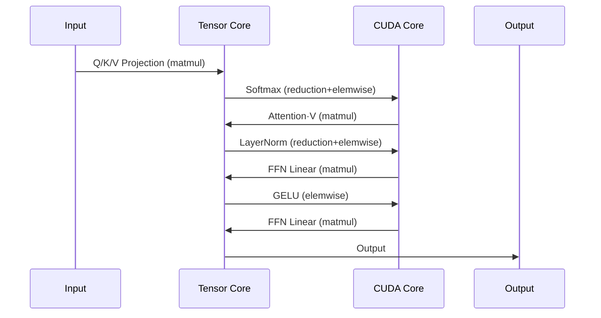
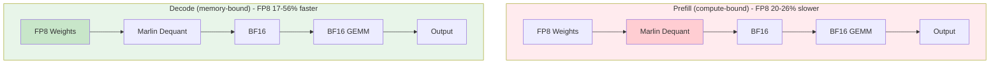
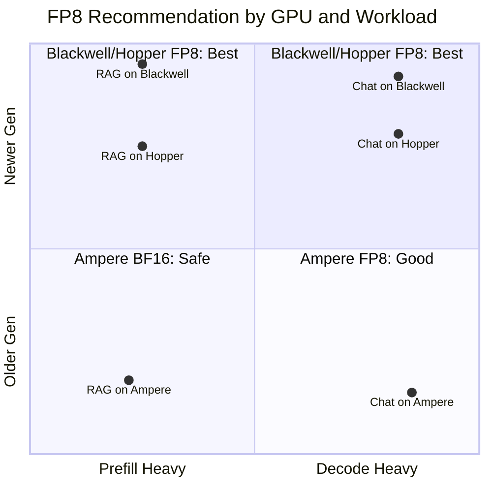

# Azure GPU VM Selection Guide & Performance Benchmark

> Comprehensive GPU hardware analysis, VM selection guide, and performance benchmarks across RTX PRO 6000 BSE (Blackwell), H100 NVL (Hopper), A100 PCIe (Ampere), and A10 (Ampere)

**Author**: Xinyu Wei (魏新宇) | Microsoft AI and Apps GBB Architect

---


## Running on Azure

This benchmark was conducted across multiple **Azure GPU VM** SKUs.

| Item | Details |
|---|---|
| **Azure VMs** | [NC H100 v5](https://learn.microsoft.com/en-us/azure/virtual-machines/nc-h100-v5-series), [NC A100 v4](https://learn.microsoft.com/en-us/azure/virtual-machines/nc-a100-v4-series), [NC RTX Pro 6000V6 BSE](https://learn.microsoft.com/en-us/azure/virtual-machines/sizes/gpu-accelerated/overview) |
| **GPUs** | NVIDIA H100, A100, RTX 6000 Ada, GB200 |
| **Frameworks** | vLLM, SGLang, torch.compile, Diffusers |


## 📖 Table of Contents

**Part I: GPU Hardware & Selection**
1. [Core Concept: GPU Is Not Just "Compute Power"](#core-concept-gpu-is-not-just-compute-power)
2. [Six Hardware Units Explained](#six-hardware-units-explained)
3. [GPU Hardware Configuration Comparison](#gpu-hardware-configuration-comparison)
4. [Scenario × GPU Support Matrix](#scenario--gpu-support-matrix)
5. [Azure GPU VM Series](#azure-gpu-vm-series)
6. [Selection Decision Tree](#selection-decision-tree)

**Part II: Scientific Computing & Numeric Precision**
7. [Precision Quick Reference](#precision-quick-reference-fp64fp32tf32bf16fp16fp8fp4)
8. [CUDA Core vs Tensor Core](#cuda-core-vs-tensor-core-who-computes-what)

**Part III: FP8 Performance Validation**
9. [FP8 Technical Architecture](#fp8-technical-architecture)
10. [FP8 Test Results](#fp8-test-results)
11. [FP8 Technical Analysis](#fp8-technical-analysis)
12. [FP8 Recommendations](#fp8-recommendations)

**Part IV: NC RTX Pro 6000 V6 BSE Benchmark**
13. [Network Configuration Test](#1-network-configuration-test)
14. [GPU P2P Interconnect Test](#2-gpu-p2p-interconnect-test)
15. [FP32 Compute Test](#3-fp32-compute-test)
16. [LLM Inference Test](#4-llm-inference-test)
17. [SFT Full Fine-tuning Test](#5-sft-full-fine-tuning-test)
18. [FLUX Image Generation Test](#6-flux-image-generation-test)
19. [Blender Rendering Test](#7-blender-rendering-test)
20. [NVENC Video Encoding Test](#8-nvenc-video-encoding-test)

**Part V: Practical Guide**
21. [Case Studies](#case-studies)
22. [Deployment Guide](#deployment-guide)
23. [Four GPU Comprehensive Comparison](#four-gpu-comprehensive-comparison)
24. [Repository Structure & Quick Start](#-repository-structure--quick-start)
25. [Test Environments](#test-environments)
26. [References](#references)

---

# Part I: GPU Hardware & Selection

## Core Concept: GPU Is Not Just "Compute Power"

### Common Misconceptions

| Misconception | Reality |
|---|---|
| "GPU = TFLOPS" | TFLOPS only measures Tensor/CUDA Core performance, not overall capability |
| "More VRAM = Can run anything" | Can load ≠ Can complete the full pipeline (may lack encoder for output) |
| "Data center GPU = Best for everything" | NC H100 cannot do video transcoding, NV A10 can |

### The Right Mental Model

**GPU = A combination of specialized hardware units**

```
┌─────────────────────────────────────────────────────────────────┐
│                         NVIDIA GPU                               │
├─────────────────┬─────────────────────┬─────────────────────────┤
│   📥 Decode/In  │     🧠 Compute       │      📤 Encode/Out      │
├─────────────────┼─────────────────────┼─────────────────────────┤
│  NVDEC (Video)  │  CUDA Core (General)│   NVENC (Video)         │
│  NVJPG (Image)  │  Tensor Core (AI)   │   NVJPG (Image)         │
│                 │  RT Core (RayTrace) │                         │
└─────────────────┴─────────────────────┴─────────────────────────┘
```

> 💡 **Note**: NVDEC/NVENC/NVJPG can be used for both input (decode) and output (encode).

**Key Insight**: Different GPUs have different combinations of hardware units, which determines what they can and cannot do.

---

## Six Hardware Units Explained

### 1. NVDEC - Video Decoder

| Attribute | Description |
|---|---|
| **Function** | Decode compressed video (H.264/H.265/AV1) into raw frames |
| **Analogy** | Like unzipping a ZIP file |
| **Use Cases** | Video playback, pre-processing for video AI analysis |

### 2. NVENC - Video Encoder

| Attribute | Description |
|---|---|
| **Function** | Compress raw frames into video files (MP4, etc.) |
| **Analogy** | Like compressing into a ZIP file |
| **Use Cases** | Live streaming, video export, cloud gaming |
| **⚠️ Critical** | **NC H100 / NC A100 do NOT have NVENC!** |

### 3. NVJPG - JPEG Hardware Engine

| Attribute | Description |
|---|---|
| **Function** | Hardware-accelerated JPEG encoding/decoding |
| **Use Cases** | Image preprocessing pipelines, batch image processing |
| **Supported** | NC H100 (7 units), NC A100 (5 units), RTX PRO 6000 BSE (Blackwell) |

> ⚠️ **Note**: A10 does NOT support hardware JPEG acceleration, despite being Ampere architecture. nvJPEG hardware acceleration only supports Ampere (A100, A30), Hopper, Ada, and Blackwell.

### 4. Tensor Core

| Attribute | Description |
|---|---|
| **Function** | Accelerate matrix multiplication for AI training/inference |
| **Use Cases** | LLM, Stable Diffusion, video generation AI |
| **Generations** | 3rd (Ampere) → 4th (Hopper) → 5th (Blackwell) |

### 5. RT Core - Ray Tracing Core

| Attribute | Description |
|---|---|
| **Function** | Hardware-accelerated ray tracing calculations |
| **Use Cases** | Game ray tracing, 3D rendering, CAD real-time preview |
| **⚠️ Critical** | **NC H100 / NC A100 do NOT have RT Core!** |
| **Note** | NV A10 has 72 RT Cores (2nd Gen), RTX PRO 6000 BSE has 188 (4th Gen) |

### 6. CUDA Core

| Attribute | Description |
|---|---|
| **Function** | General-purpose parallel computing |
| **Use Cases** | Foundation of all GPU compute tasks |

---

## GPU Hardware Configuration Comparison

> Note: All specifications are based on Azure VM series offerings.

### Hardware Unit Configuration Matrix

| Hardware Unit | RTX 6000 Pro Blackwell | H100 NVL | A100 PCIe | A10 |
|---|---|---|---|---|
| **NVDEC** (Decoder) | ✅ 4 (Gen6) | ✅ 7 | ✅ 5 | ✅ 2 |
| **NVENC** (Encoder) | ✅ **4 (Gen9, AV1)** | ❌ **None** | ❌ **None** | ✅ 1 (Gen7) |
| **NVJPG** | ✅ Yes | ✅ 7 | ✅ 5 | ❌ No |
| **Tensor Core** | ✅ Gen5 | ✅ Gen4 | ✅ Gen3 | ✅ Gen3 |
| **RT Core** | ✅ **188 (Gen4)** | ❌ **None** | ❌ **None** | ✅ 72 (Gen2) |
| **NVLink** | ❌ None | ✅ Yes | ✅ Yes | ❌ None |

> 📝 **Data Sources**: RTX PRO 6000 BSE NVENC/NVDEC/RT Core generations from NVIDIA official specs. H100/A100 NVDEC counts from Azure VM specifications.

### Basic Specifications (Azure VM Series)

| Spec | NC H100 (NCads_H100_v5) | NC A100 (NC_A100_v4) | RTX PRO 6000 BSE (NCv6) | NV A10 (NVadsA10_v5) |
|---|---|---|---|---|
| **Architecture** | Hopper | Ampere | Blackwell | Ampere |
| **VRAM** | 94GB HBM3 | 80GB HBM2e | 96GB GDDR7 | 24GB GDDR6 |
| **GPU Count** | 1-2 | 1-4 | 1-2 | 1/6 - 2 |
| **Max vCPUs** | 80 | 96 | 320 | 72 |
| **Max Memory** | 640 GiB | 880 GiB | 1280 GiB | 880 GiB |

### Positioning Summary

| GPU | Positioning | Strengths | Limitations |
|---|---|---|---|
| **NC H100** | Pure AI compute | Strongest Tensor Core, 94GB HBM3 | No NVENC, no RT Core |
| **NC A100** | AI training/inference | Mature ecosystem, 80GB HBM2e | No NVENC, no RT Core |
| **RTX PRO 6000 BSE** | Full-featured professional | All hardware units, complete pipeline, 96GB GDDR7 | No NVLink |
| **NV A10** | Inference/graphics/VDI | Has NVENC + RT Core, supports fractional GPU | Smaller VRAM (24GB) |

---

## Scenario × GPU Support Matrix

### Legend

| Symbol | Meaning |
|---|---|
| ✅ | Fully supported, recommended |
| ❌ | Not supported |
| ⚠️ | Works but with limitations |

### AI Scenarios

| Scenario | Required Hardware | NC H100 | NC A100 | RTX PRO 6000 BSE | NV A10 |
|---|---|---|---|---|---|
| LLM Training (>70B params) | Tensor Core + NVLink + Large VRAM | ✅ | ✅ | ❌ | ❌ |
| LLM Fine-tuning (7B-70B) | Tensor Core + Large VRAM | ✅ | ✅ | ✅ | ⚠️ |
| LLM Inference | Tensor Core | ✅ | ✅ | ✅ | ⚠️ |
| AI Image Generation (SD/FLUX) | Tensor Core | ✅ | ✅ | ✅ | ✅ |
| AI Image Generation (batch output) | Tensor Core + NVJPG | ✅ | ✅ | ✅ | ⚠️ |
| AI Video Generation (generation only) | Tensor Core + Large VRAM | ✅ | ✅ | ✅ | ⚠️ |
| AI Video Generation (with MP4 output) | Tensor Core + NVENC | ❌ | ❌ | ✅ | ✅ |

### Video/Media Scenarios

| Scenario | Required Hardware | NC H100 | NC A100 | RTX PRO 6000 BSE | NV A10 |
|---|---|---|---|---|---|
| Video Transcoding | NVDEC + NVENC | ❌ | ❌ | ✅ | ✅ |
| Video Decode Only | NVDEC | ✅ | ✅ | ✅ | ✅ |
| Live Streaming | NVENC | ❌ | ❌ | ✅ | ✅ |
| Video Conferencing Encode | NVENC | ❌ | ❌ | ✅ | ✅ |
| Video AI Analysis | NVDEC + Tensor Core | ✅ | ✅ | ✅ | ✅ |

### Gaming/Rendering Scenarios

| Scenario | Required Hardware | NC H100 | NC A100 | RTX PRO 6000 BSE | NV A10 |
|---|---|---|---|---|---|
| Cloud Gaming | RT Core + NVENC | ❌ | ❌ | ✅ | ✅ |
| 3D Games (Ray Tracing) | RT Core | ❌ | ❌ | ✅ | ✅ |
| DLSS Super Resolution | Tensor Core | ✅ | ✅ | ✅ | ✅ |
| DLSS Frame Generation | Ada/Blackwell | ❌ | ❌ | ✅ | ❌ |
| Blender Rendering | RT Core | ❌ | ❌ | ✅ | ✅ |
| CAD Real-time Preview | RT Core + CUDA | ❌ | ❌ | ✅ | ✅ |
| VDI (Virtual Desktop) | NVENC + Graphics | ❌ | ❌ | ✅ | ✅ |

> ⚠️ **DLSS Frame Generation Note**: DLSS Frame Generation only supports Ada Lovelace and newer architectures. A10 (Ampere) does NOT support Frame Generation, only DLSS Super Resolution. RTX PRO 6000 BSE (Blackwell) supports DLSS 4 Multi Frame Generation.

### Scientific Computing

| Scenario | Required Hardware | NC H100 | NC A100 | RTX PRO 6000 BSE | NV A10 |
|---|---|---|---|---|---|
| General CUDA Computing | CUDA Core | ✅ | ✅ | ✅ | ✅ |
| FP64 Double Precision | FP64 Units | ✅ | ✅ | ⚠️ | ⚠️ |
| Distributed Training | NVLink | ✅ | ✅ | ❌ | ❌ |

---

## Azure GPU VM Series

### Available GPU VM Series

| VM Series | GPU | GPU Count | VRAM per GPU | Use Cases |
|---|---|---|---|---|
| **NCads_H100_v5** | H100 NVL (PCIe) | 1-2 | 94GB HBM3 | LLM training/inference, HPC |
| **NC_A100_v4** | A100 (PCIe) | 1-4 | 80GB HBM2e | AI training/inference |
| **NC RTX PRO 6000 BSE v6** | RTX PRO 6000 Blackwell Server Edition | 1-2 | 96GB GDDR7 | Professional graphics, AI, full pipeline |
| **NVadsA10_v5** | A10 | 1/6 - 2 | 24GB GDDR6 | Inference, graphics, VDI |

### VM Selection by Scenario

| Scenario | Recommended VM Series | Reason |
|---|---|---|
| Train large LLM (>70B) | NCads_H100_v5, ND_A100_v4 | Need large VRAM + NVLink |
| Fine-tune LLM (7B-70B) | NC_A100_v4, NCads_H100_v5 | Need sufficient VRAM |
| LLM Inference service | NC_A100_v4, NVadsA10_v5 | Balance of performance and cost |
| AI Video Generation + Output | NC RTX PRO 6000 BSE v6, NVadsA10_v5 | Need NVENC for MP4 output |
| Cloud Gaming | NC RTX PRO 6000 BSE v6, NVadsA10_v5 | Need RT Core + NVENC |
| 3D Rendering | NC RTX PRO 6000 BSE v6, NVadsA10_v5 | Need RT Core |
| Video Transcoding | NC RTX PRO 6000 BSE v6, NVadsA10_v5 | Need NVDEC + NVENC |
| VDI | NVadsA10_v5, NC RTX PRO 6000 BSE v6 | Supports fractional GPU |

---

## Selection Decision Tree

### Three Key Questions

| # | Question | If Yes |
|---|---|---|
| 1 | **Need video encoding output?** | → Exclude NC H100 / NC A100 |
| 2 | **Need ray tracing?** | → Exclude NC H100 / NC A100 |
| 3 | **Model fits in single GPU VRAM?** | No → Need multi-GPU with NVLink |

### Decision Flowchart

```
                    ┌─────────────────────┐
                    │  What's your task?  │
                    └──────────┬──────────┘
                               │
        ┌──────────────────────┼──────────────────────┐
        │                      │                      │
        ▼                      ▼                      ▼
   ┌─────────┐           ┌─────────┐           ┌─────────┐
   │AI Train │           │AI Infer │           │Video/   │
   └────┬────┘           └────┬────┘           │Media    │
        │                     │                └────┬────┘
        ▼                     │                     ▼
   Need NVLink?               │              Need encoding?
        │                     │                     │
    ┌───┴───┐                 │               ┌─────┴─────┐
   Yes     No                 │              Yes         No
    │       │                 │               │           │
    ▼       ▼                 ▼               ▼           ▼
 ┌───────┐ ┌────────┐   ┌──────────┐  ┌───────────┐ ┌───────┐
 │NC H100│ │RTX PRO │   │Check VRAM│  │RTX PRO    │ │NC H100│
 │NC A100│ │6000 BSE│   │& latency │  │6000 BSE   │ │NC A100│
 └───────┘ └────────┘   └──────────┘  │NV A10     │ └───────┘
                                      └───────────┘
```

---

# Part II: Scientific Computing & Numeric Precision

## Precision Quick Reference (FP64/FP32/TF32/BF16/FP16/FP8/FP4)

### CUDA Core vs Tensor Core Precision Comparison

| Precision | Execution Unit | Primary Use Case | RTX 6000 Performance |
|---|---|---|---|
| **FP64** | CUDA Core (FP64 ALU) | HPC scientific computing (double precision) | ~2 TFLOPS |
| **FP32** | CUDA Core (FP32 ALU) | Traditional rendering, scalar ops, gaming | **125 TFLOPS** |
| **TF32** | Tensor Core | AI training (transparent FP32 API optimization) | ~500 TFLOPS |
| **BF16/FP16** | Tensor Core | AI training/inference mixed precision | ~1000 TFLOPS |
| **FP8** | Tensor Core | AI inference optimization | ~2000 TFLOPS |
| **NVFP4** | Tensor Core (Gen5) | AI inference extreme optimization | **4000 TOPS** |

> **Key Understanding**:
> - FP64 and FP32 are **physically separate ALU units** (Datacenter: FP64:FP32 = 1:2, RTX: 1:64)
> - TF32/BF16/FP16/FP8/NVFP4 **share the same Tensor Core hardware**, just different precision configs

### TF32 Transparent Optimization

> **One-liner**: TF32 is not a data type, it's Tensor Core's "stealth acceleration mode" — you write FP32, hardware secretly computes in TF32, 8-10x faster, <0.1% precision loss.

**How it works**:
```
torch.float32 → Ampere+ auto-truncates to TF32 (19-bit) for multiply → Result back to FP32
```

| Format | Bits | Notes |
|---|---|---|
| FP32 | 1+8+23=32 | User API, storage, accumulation precision |
| TF32 | 1+8+10=19 | Tensor Core multiply instant (same exponent as FP32, truncated mantissa) |

**PyTorch default enabled** (Ampere+):
```python
torch.backends.cuda.matmul.allow_tf32  # True by default
torch.backends.cudnn.allow_tf32        # True by default
```

### GPU Performance Quick Reference

| Scenario | Key Metric | RTX 6000 | H100 NVL | Winner |
|---|---|---|---|---|
| **AI Inference/Training** | Tensor Core (BF16) | ~504 TFLOPS | **~836 TFLOPS** | H100 |
| **AI Inference (FP8)** | Tensor Core (FP8) | ~1,010 TFLOPS | **~1,671 TFLOPS** | H100 |
| **AI Inference (FP4)** | Tensor Core (NVFP4) | **~2,000 TFLOPS** | ❌ N/A | RTX 6000 |
| **HPC Scientific** | CUDA Core (FP64) | ~2 TFLOPS | **30 TFLOPS** | H100 |
| **3D Rendering** | FP32 + RT Core | **125T + 380T RT** | 60T + ❌ | RTX 6000 |

> **Quick Selection Guide**:
> - AI performance → Look at **Tensor Core** (BF16/FP8/FP4)
> - HPC performance → Look at **FP64 only** - H100 dominates (30 vs 2 TFLOPS)
> - Rendering → Look at **FP32 + RT Core** - RTX 6000 exclusive (H100 has no RT Core)

---

## CUDA Core vs Tensor Core: Who Computes What



**Simple Rule**:
- **Matrix multiply → Tensor Core** (Linear, Conv, Attention QK and V multiply)
- **Everything else → CUDA Core** (Activation, Normalization, Softmax)

| Operation Type | Execution Unit | Examples |
|---|---|---|
| **Matrix Multiplication** | Tensor Core | `torch.mm`, `torch.bmm`, `nn.Linear`, `nn.Conv2d` |
| **Element-wise Ops** | CUDA Core | `torch.add`, `torch.mul`, `torch.exp`, activation functions |
| **Reduction Ops** | CUDA Core | `torch.sum`, `torch.mean`, `softmax` |
| **Memory Ops** | CUDA Core | `torch.cat`, `torch.reshape`, indexing |

---

# Part III: FP8 Performance Validation

## FP8 Technical Architecture

| GPU | Architecture | FP8 Execution Path | Key Feature |
|---|---|---|---|
| **A100** | Ampere SM80 | FP8 weights → **Marlin Dequant** → BF16 → BF16 GEMM | ⚠️ Dequantization overhead |
| **H100** | Hopper SM90 | FP8 weights → FP8 activations → **Native FP8 GEMM** | ✅ 2x FLOPS (1979 TFLOPS) |
| **RTX 6000** | Blackwell SM120 | FP8 weights → **Native FP8 GEMM** | ✅ Next-gen + Native FP8 |

**Execution Flow Comparison:**

```
┌─────────────────────────────────────────────────────────────────────────────┐
│ A100 (Ampere SM80) - No Native FP8                                          │
│ FP8 Weights ──→ [Marlin Dequant] ──→ BF16 ──→ [BF16 Tensor Core] ──→ Output │
│                 ⚠️ Extra step                                                │
├─────────────────────────────────────────────────────────────────────────────┤
│ H100 (Hopper SM90) - Native FP8                                             │
│ FP8 Weights ──→ FP8 Activations ──→ [FP8 Tensor Core] ──→ Output            │
│                                     ✅ Direct execution                      │
├─────────────────────────────────────────────────────────────────────────────┤
│ RTX 6000 (Blackwell SM120) - Native FP8                                     │
│ FP8 Weights ──→ [FP8 Tensor Core] ──→ Output                                │
│                 ✅ Direct execution, next-gen architecture                   │
└─────────────────────────────────────────────────────────────────────────────┘
```

### 🔥 Key Findings Summary

| GPU | Architecture | FP8 Prefill vs BF16 | FP8 Decode vs BF16 | Recommendation |
|---|---|---|---|---|
| **RTX 6000** | Blackwell SM120 | **+59~65%** ✅ | **+11~26%** ✅ | **FP8 for ALL scenarios** |
| **H100** | Hopper SM90 | **+29~38%** ✅ | **+36~43%** ✅ | **FP8 for ALL scenarios** |
| **A100** | Ampere SM80 | **-20~26%** ⚠️ | **+17~56%** ✅ | FP8 only for decode-heavy workloads |

> ⚠️ **Key Observations**:
> - **RTX 6000 Blackwell** shows the highest FP8 prefill improvement (+65%)
> - **H100 Hopper** delivers consistent 30-40% speedup across all scenarios
> - **A100 Ampere** shows slowdown on prefill but improvement on decode with FP8

---

## FP8 Test Results

### RTX 6000 Blackwell Two-Way Comparison (2026-01-04)

> **Test Configuration**: NVIDIA RTX PRO 6000 Blackwell (96GB vGPU), vLLM 0.13.0rc2+cu130, CUDA 13.0
>
> ⚠️ **Note**: Runtime FP8 (`--quantization fp8`) is not yet supported on Blackwell SM120 in vLLM 0.13.0rc2. Only pre-quantized FP8 models work.

| Scenario | BF16 | FP8 Pre-quant | FP8 vs BF16 |
|---|---|---|---|
| **Prefill Single** | 9,860 tok/s | 16,309 tok/s | **+65.4%** ✅ |
| **Prefill 50 Concurrent** | 12,250 tok/s | 19,461 tok/s | **+58.9%** ✅ |
| **Decode Single** | 44 tok/s | 48 tok/s | **+10.6%** ✅ |
| **Decode 50 Concurrent** | 1,777 tok/s | 2,235 tok/s | **+25.8%** ✅ |

**Memory Usage (RTX 6000)**:
| Configuration | Model Memory | Notes |
|---|---|---|
| BF16 | 27.57 GiB | Full precision weights |
| FP8 Pre-quant | 15.39 GiB | **44% reduction** |

### H100 Three-Way Comparison (2026-01-04)

> **Test Configuration**: NVIDIA H100 NVL 96GB, vLLM 0.13.0, PyTorch 2.9.0+cu128

| Scenario | BF16 | FP8 Runtime | FP8 Pre-quant | FP8 vs BF16 |
|---|---|---|---|---|
| **Prefill Single** | 14,298 tok/s | 19,703 tok/s | 19,655 tok/s | **+37.8%** ✅ |
| **Prefill 50 Concurrent** | 14,415 tok/s | 18,647 tok/s | 18,720 tok/s | **+29.4%** ✅ |
| **Decode Single** | 89 tok/s | 127 tok/s | 126 tok/s | **+42.7%** ✅ |
| **Decode 50 Concurrent** | 3,044 tok/s | 4,140 tok/s | 4,110 tok/s | **+36.0%** ✅ |

**Memory Usage (H100)**:
| Configuration | Model Memory | Available KV Cache |
|---|---|---|
| BF16 | 27.57 GiB | 50.44 GiB |
| FP8 Runtime | 15.36 GiB | 62.64 GiB |
| FP8 Pre-quant | 15.39 GiB | 62.62 GiB |

### A100 Three-Way Comparison (2026-01-03)

> **Test Configuration**: NVIDIA A100 80GB PCIe, vLLM 0.11.2

| Scenario | BF16 | FP8 Runtime | FP8 Pre-quant | FP8 vs BF16 |
|---|---|---|---|---|
| **Prefill Single** | 6,555 tok/s | 5,251 tok/s | 5,277 tok/s | **-19.8%** ⚠️ |
| **Prefill 50 Concurrent** | 7,221 tok/s | 5,335 tok/s | 5,352 tok/s | **-26.1%** ⚠️ |
| **Decode Single** | 47 tok/s | 73 tok/s | 73 tok/s | **+55.3%** ✅ |
| **Decode 50 Concurrent** | 1,702 tok/s | 1,999 tok/s | 2,031 tok/s | **+17.4%** ✅ |

### Cross-GPU Performance Comparison

| Scenario | A100 BF16 | H100 BF16 | RTX 6000 BF16 | H100 vs A100 | RTX 6000 vs A100 |
|---|---|---|---|---|---|
| Prefill Single | 6,555 tok/s | 14,298 tok/s | 9,860 tok/s | **2.18x** | **1.50x** |
| Prefill 50 Conc | 7,221 tok/s | 14,415 tok/s | 12,250 tok/s | **2.00x** | **1.70x** |
| Decode Single | 47 tok/s | 89 tok/s | 44 tok/s | **1.89x** | 0.94x |
| Decode 50 Conc | 1,702 tok/s | 3,044 tok/s | 1,777 tok/s | **1.79x** | **1.04x** |

> 📝 **Note**: RTX 6000 results are from a vGPU environment (96GB partition), which may have different performance characteristics than bare-metal.

<details>
<summary>📋 Click to view RTX 6000 Blackwell BF16 raw test output</summary>

```json
{
  "model": "Qwen/Qwen2.5-14B-Instruct",
  "gpu": "RTX PRO 6000 Blackwell (96GB vGPU)",
  "prefill_single": { "runs": [6248.92, 11655.36, 11676.90], "average": 9860.39, "unit": "tok/s" },
  "prefill_concurrent": { "runs": [12277.02, 12248.91, 12225.47], "average": 12250.47, "unit": "tok/s" },
  "decode_single": { "runs": [43.75, 43.85, 43.43], "average": 43.68, "unit": "tok/s" },
  "decode_concurrent": { "runs": [1775.79, 1779.16, 1775.45], "average": 1776.80, "unit": "tok/s" }
}
```
</details>

<details>
<summary>📋 Click to view RTX 6000 Blackwell FP8 Pre-quantized raw test output</summary>

```json
{
  "model": "<your-model-path>/Qwen2.5-14B-Instruct-FP8",
  "gpu": "RTX PRO 6000 Blackwell (96GB vGPU)",
  "prefill_single": { "runs": [12802.21, 17975.23, 18149.01], "average": 16308.82, "unit": "tok/s" },
  "prefill_concurrent": { "runs": [19463.53, 19488.59, 19429.57], "average": 19460.56, "unit": "tok/s" },
  "decode_single": { "runs": [48.47, 48.13, 48.30], "average": 48.30, "unit": "tok/s" },
  "decode_concurrent": { "runs": [2247.93, 2216.13, 2241.57], "average": 2235.21, "unit": "tok/s" }
}
```
</details>

<details>
<summary>📋 Click to view H100 BF16 / FP8 Runtime / FP8 Pre-quant raw test output</summary>

**H100 BF16**:
```json
{
  "prefill_single": { "runs": [11871.30, 15581.87, 15439.46], "average": 14297.55, "unit": "tok/s" },
  "prefill_concurrent": { "runs": [14431.96, 14404.43, 14408.21], "average": 14414.87, "unit": "tok/s" },
  "decode_single": { "runs": [88.92, 89.52, 89.55], "average": 89.33, "unit": "tok/s" },
  "decode_concurrent": { "runs": [3033.34, 3046.80, 3052.26], "average": 3044.13, "unit": "tok/s" }
}
```

**H100 FP8 Runtime**:
```json
{
  "prefill_single": { "runs": [18808.08, 20098.74, 20203.42], "average": 19703.41, "unit": "tok/s" },
  "prefill_concurrent": { "runs": [18661.07, 18651.44, 18627.58], "average": 18646.70, "unit": "tok/s" },
  "decode_single": { "runs": [125.58, 127.46, 127.48], "average": 126.84, "unit": "tok/s" },
  "decode_concurrent": { "runs": [4142.20, 4109.55, 4167.08], "average": 4139.61, "unit": "tok/s" }
}
```

**H100 FP8 Pre-quant**:
```json
{
  "model": "RedHatAI/Qwen2.5-14B-Instruct-FP8-dynamic",
  "prefill_single": { "runs": [18878.68, 20060.40, 20026.24], "average": 19655.11, "unit": "tok/s" },
  "prefill_concurrent": { "runs": [18792.58, 18781.51, 18587.15], "average": 18720.41, "unit": "tok/s" },
  "decode_single": { "runs": [124.89, 126.62, 126.67], "average": 126.06, "unit": "tok/s" },
  "decode_concurrent": { "runs": [4094.85, 4129.49, 4107.12], "average": 4110.49, "unit": "tok/s" }
}
```
</details>

<details>
<summary>📋 Click to view A100 BF16 / FP8 Pre-quant raw test output</summary>

**A100 BF16**:
```json
{
  "prefill_single": { "runs": [5354.49, 7137.71, 7172.88], "average": 6555.03, "unit": "tok/s" },
  "prefill_concurrent": { "runs": [7300.52, 7215.19, 7146.24], "average": 7220.65, "unit": "tok/s" },
  "decode_single": { "runs": [46.94, 47.10, 47.13], "average": 47.06, "unit": "tok/s" },
  "decode_concurrent": { "runs": [1703.24, 1704.96, 1697.53], "average": 1701.91, "unit": "tok/s" }
}
```

**A100 FP8 Pre-quant**:
```json
{
  "model": "neuralmagic/Qwen2.5-14B-Instruct-FP8-dynamic",
  "prefill_single": { "runs": [5177.91, 5321.54, 5332.36], "average": 5277.27, "unit": "tok/s" },
  "prefill_concurrent": { "runs": [5426.41, 5344.06, 5285.93], "average": 5352.13, "unit": "tok/s" },
  "decode_single": { "runs": [73.06, 73.26, 73.39], "average": 73.24, "unit": "tok/s" },
  "decode_concurrent": { "runs": [2018.94, 2031.90, 2040.74], "average": 2030.53, "unit": "tok/s" }
}
```
</details>

---

## FP8 Technical Analysis

### Why Different GPUs Show Different FP8 Behavior?

| Factor | RTX 6000 (Blackwell) | H100 (Hopper) | A100 (Ampere) |
|---|---|---|---|
| Architecture | SM120 | SM90 | SM80 |
| FP8 Tensor Core | ✅ Native (5th Gen) | ✅ Native (4th Gen) | ❌ Not available |
| CUDA Compute | 13.0 | 12.8 | 12.6 |
| FP8 Execution | Direct FP8 GEMM | Direct FP8 GEMM | FP8→BF16 dequant + BF16 GEMM |
| Prefill (compute-bound) | **FP8 +65% faster** | FP8 +38% faster | FP8 20-26% slower |
| Decode (memory-bound) | FP8 +26% faster | FP8 +36% faster | FP8 +17-56% faster |
| Runtime FP8 Support | ❌ Not yet in vLLM | ✅ Supported | ✅ Supported |

### Marlin Kernel: Why Dequantization Overhead Matters

> 📚 **Reference**: Benjamin Marie, *"The Kaitchup: LLMs on a Budget"* (Chapter 3.4.3)

Our A100 test results align with theoretical analysis from the LLM quantization community:

| Observation | Benjamin (INT4 Quantization) | Our Test (FP8 Quantization) | Consistency |
|---|---|---|---|
| Dequant overhead exists | ✅ batch≥8: INT4 slower than FP16 | ✅ A100 Prefill: FP8 -26% vs BF16 | ✅ |
| Memory-bound benefits | ✅ Marlin still 4x faster | ✅ A100 Decode: FP8 +17-56% | ✅ |
| vLLM auto-optimization | ✅ Auto-converts to Marlin | ✅ Uses Marlin for FP8→BF16 | ✅ |

**Why A100 shows different behavior for Prefill vs Decode:**



> **Key Difference**: Prefill is compute-bound where dequant overhead exceeds bandwidth savings; Decode is memory-bound where 50% memory reduction provides bandwidth savings that exceed dequant cost.

### Why Runtime and Pre-quantized FP8 Have Same Speed?

```
Runtime FP8:
  BF16 Weights → [Runtime BF16→FP8 Quantization] → FP8 → [Inference Kernel] → Output
                 ↑ Happens at model loading time

Pre-quantized FP8:
  FP8 Weights → FP8 → [Inference Kernel] → Output
               ↑ Already quantized on disk
                    ║
                    ↓
         Same Inference Path! ✅
```

**Pre-quantized advantages** (not inference speed):
- 🚀 Faster model loading (50% smaller files)
- 💾 Lower disk storage requirements
- 🧠 Same VRAM usage during inference

---

## FP8 Recommendations

### Decision Matrix

| Workload Type | RTX 6000 (Blackwell) | H100 (Hopper) | A100 (Ampere) |
|---|---|---|---|
| **RAG / Long Context** | ✅ FP8 (+59-65%) | ✅ FP8 (+30%) | ⚠️ BF16 (FP8 is -26% slower) |
| **Chatbot / Streaming** | ✅ FP8 (+26%) | ✅ FP8 (+36%) | ✅ FP8 (+17~56%) |
| **Batch Processing** | ✅ FP8 (+59%) | ✅ FP8 (+29%) | ⚠️ BF16 (FP8 is -26% slower) |
| **Memory Constrained** | ✅ FP8 (44% less VRAM) | ✅ FP8 (44% less VRAM) | ✅ FP8 (50% less VRAM) |

### GPU Selection Guide



---

# Part IV: NC RTX Pro 6000 V6 BSE Benchmark

> Comprehensive comparison: NC RTX 6000 Pro Blackwell / NC H100 NVL / NC A100 PCIe / NV A10. For fairness, each test uses the same data type across all four GPUs.

## 1. Network Configuration Test

| Item | Standard_NC256ds_xl_RTXPRO6000BSE_v6 |
|---|---|
| **NIC Model** | Microsoft Azure Network Adapter (MANA) |
| **Azure Bandwidth Limit** | **100 Gbps** |
| **Measured Bandwidth (Single Stream)** | 30 Gbps |
| **Measured Bandwidth (16 Streams)** | **50 Gbps** |
| **RDMA/RoCE** | ❌ No |
| **InfiniBand** | ❌ No |

- RTX 6000 VM uses Azure MANA Ethernet, up to 100 Gbps
- No RDMA/InfiniBand support, not suitable for multi-node GPU communication-intensive training

---

## 2. GPU P2P Interconnect Test

| Item | Standard_NC256ds_xl_RTXPRO6000BSE_v6 |
|---|---|
| `nvidia-smi topo -p2p` | OK (Hardware level supported) |
| **PyTorch can_device_access_peer()** | **False** (Still achieves ~43 GB/s) |
| **GPU0 → GPU1 BW** | **41.26 GB/s** |
| **GPU1 → GPU0 BW** | **44.46 GB/s** |
| **NCCL AllReduce** | **~43.5 GB/s** |

### P2P Comparison

| GPU Config | P2P Bandwidth | Notes |
|---|---|---|
| **RTX 6000** | ~43 GB/s | PCIe Gen5 |
| **H100 NVL** | ~450 GB/s | NVLink 4.0 direct |
| **A100 PCIe** | ~25 GB/s | PCIe Gen4 |

---

## 3. FP32 Compute Test

| Metric | RTX 6000 Pro Blackwell |
|---|---|
| **Theoretical FP32** | 116.95 TFLOPS |
| **Measured Peak** | **109.20 TFLOPS** |
| **Efficiency** | **93.4%** |
| **SM Count** | 188 |
| **CUDA Cores** | 24,064 |

---

## 4. LLM Inference Test

### Test Configuration

| Parameter | Value |
|---|---|
| **Model** | microsoft/Phi-3.5-mini-instruct (3.8B) |
| **Inference Engine** | vLLM |
| **Test Tool** | guidellm |

### Test Results

| GPU | Output Tokens/s | Relative Performance |
|---|---|---|
| **H100 NVL** | **3083.6** | **100%** |
| **RTX 6000** | **2835.4** | **92%** |
| **A100 PCIe** | **2119.6** | **69%** |
| **A10** | **563.1** | **18%** |

### 4.1 NVFP4 Quantization - Blackwell Exclusive

> **Blackwell-only feature**: NVFP4 (4-bit floating point) requires SM100/SM120 native FP4 Tensor Core
> - **Memory Savings**: Model size ~35% smaller than FP8 (9.9GB vs 15.3GB for 14B)

#### Test Results

| Precision | Model | Input Tokens | Output Tokens | Time | Output TPS |
|---|---|---:|---:|---:|---:|
| **NVFP4 (W4A4)** | Qwen3-14B-NVFP4 | 102,400 | 25,600 | 9.22s | **2,777 tok/s** |
| **FP8 (W8A8)** | Qwen3-14B-FP8 | 102,400 | 25,600 | 12.75s | **2,009 tok/s** |

```
NVFP4 vs FP8 Output Throughput (Qwen3-14B, RTX PRO 6000 Blackwell)
══════════════════════════════════════════════════════════════════
NVFP4 (W4A4)    ██████████████████████████████████████████  2,777 tok/s (+38%)
FP8 (W8A8)      ██████████████████████████████              2,009 tok/s (baseline)
══════════════════════════════════════════════════════════════════
```

| Metric | NVFP4 (W4A4) | FP8 (W8A8) | Difference |
|---|---|---|---|
| **Output TPS** | **2,777** | 2,009 | **+38%** |
| **Model Size** | **9.9 GB** | 15.3 GB | **-35%** |
| **KV Cache Available** | 65.5 GiB | 60.1 GiB | +9% |
| **Inference Time** | **9.22s** | 12.75s | **-28%** |

#### NVFP4 Known Issues ⚠️

| Issue | Cause | Solution |
|---|---|---|
| NVFP4 model loads as BF16 | SGLang 0.5.x doesn't recognize NVFP4 format | Use vLLM instead |
| vLLM 0.13.0 shows "platform does not support cutlass NVFP4" | vLLM 0.13.0 removed SM120 NVFP4 support | **Downgrade to vLLM 0.12.0** |
| FlashInfer 0.5.3 has no fp4 module | Version too old | Compile FlashInfer 0.6.0rc2 |

```bash
# Must use vLLM 0.12.0 (0.13.0 doesn't support SM120 NVFP4)
pip install vllm==0.12.0

# Verify NVFP4 support
python -c "from vllm._custom_ops import cutlass_scaled_mm_supports_fp4; print(f'NVFP4 support: {cutlass_scaled_mm_supports_fp4(120)}')"
# Expected output: NVFP4 support: True
```

> 💡 **Recommendation**: On RTX PRO 6000 Blackwell, prefer NVFP4 quantized models for **38% extra performance** over FP8.

### 4.2 Tensor Parallel (TP=1 vs TP=2) Benchmark

> ⚠️ **RTX PRO 6000 Dual GPU**: Testing when TP=2 provides benefits over TP=1

#### Small Model Results (Qwen3-14B-FP8)

| Configuration | Output Throughput | TTFT | TPOT |
|---|---:|---:|---:|
| **TP=1** | **276.02 tok/s** | 1036 ms | 49.40 ms |
| **TP=2** | 266.19 tok/s | 1252 ms | 52.16 ms |
| **Difference** | **-3.6%** | +21% slower | +5.6% slower |

> ⚠️ **14B model is too small for TP=2 benefit** - The communication overhead between GPUs outweighs the parallelism benefit.

#### Large Model Results (Qwen2.5-VL-72B-FP8)

| Configuration | Output Throughput | TTFT | TPOT |
|---|---:|---:|---:|
| **TP=1** | 232.02 tok/s | 1695 ms | 62.57 ms |
| **TP=2** | **294.77 tok/s** | 1801 ms | 47.42 ms |
| **Difference** | **+27.0%** | +6.3% slower | **-24.2% faster** |

#### TP Recommendations

| Model Size | Recommended Config | Reason |
|---|---|---|
| **<30B parameters** | **TP=1** | Communication overhead > parallelism benefit |
| **30B-70B parameters** | Test both | Depends on specific model architecture |
| **>70B parameters** | **TP=2** | 25-35% throughput improvement |

> 💡 **Rule of thumb**: Only use TP=2 when a single GPU cannot fit the model comfortably, or when the model is large enough (>70B) to benefit from parallel computation.

### 4.3 SGLang BF16/FP8 Three-GPU Comparison (200 Concurrent)

> Test Date: 2025-12 | Framework: SGLang 0.5.6.post2 + FlashInfer 0.5.3

| GPU | BF16 (tok/s) | FP8 (tok/s) | FP8 vs BF16 | FP8 Implementation |
|---|---:|---:|:---:|:---:|
| **H100 NVL 96GB** | 2,197 | 2,681 | **+22%** | Native FP8 Tensor Core |
| **RTX PRO 6000 96GB** | 1,579 | 2,353 | **+49%** | Native FP8 Tensor Core |
| **A100 80GB PCIe** | 1,196 | - | - | Marlin fallback |

> ⚠️ **A100 Note**: A100 lacks native FP8 Tensor Core, requires Marlin kernel fallback.

#### SGLang Known Issues ⚠️

| Issue | Cause | Solution |
|---|---|---|
| **3x throughput difference** | `--random-range-ratio` defaults to 1.0 (random length) | Use **0.0** for benchmark (fixed length) |
| **Runtime quantization OOM** | `--quantization fp8` OOM at startup | Must use **pre-quantized FP8 model** |
| **FlashInfer version** | v0.2.0 is 1.5x slower than FA2 | Use **v0.5.3+** |

---

## 5. SFT Full Fine-tuning Test

| Parameter | Value |
|---|---|
| **Model** | Qwen/Qwen3-8B-Base (8.19B params) |
| **Training Type** | Full Fine-Tuning |
| **Precision** | BF16 |

| GPU | Training Time | Speed (s/step) | vs H100 |
|---|---|---|---|
| **H100 NVL** | **19.74 min** | **11.84** | **100%** |
| **RTX 6000** | 25.14 min | 15.09 | 78.5% |
| **A100 PCIe** | 36.98 min | 22.19 | 53.4% |

---

## 6. FLUX Image Generation Test

| Parameter | Value |
|---|---|
| **Model** | FLUX.1 schnell (12B params) |
| **Resolution** | 1024×1024 |
| **Inference Steps** | 4 steps |

| GPU | Avg Time | Images/min | Relative Performance |
|---|---|---|---|
| **H100 NVL** | **1.25s** | **47.8** | **100%** |
| **RTX 6000** | **1.42s** | **42.3** | **88%** |
| **A100 PCIe** | **2.16s** | **27.8** | **58%** |
| **A10 24GB** | ❌ **OOM** | - | - |

> ⚠️ A10 cannot run FLUX.1 - requires ~34GB VRAM, A10 only has 24GB

---

## 7. Blender Rendering Test

| GPU | **Pure Render Time** | Relative Performance |
|---|---|---|
| **RTX 6000** | **~2.15s** | **3.76x** ✅ |
| **A10** | **~8.08s** | 1.00x (Baseline) |

> **Note**: H100/A100 have no RT Core, not suitable for ray tracing rendering

---

## 8. NVENC Video Encoding Test

### Single Stream Test Results (H.264)

| Preset | RTX 6000 | A10 | Winner |
|---|---|---|---|
| **P1 (Fastest)** | 167 fps | 197 fps | A10 +18% |
| **P4 (Balance)** | **129 fps** | 97 fps | **RTX 6000 +33%** ✅ |
| **P7 (High quality)** | **87 fps** | 60 fps | **RTX 6000 +45%** ✅ |

### Multi-Stream Parallel Test

| Parallel Streams | RTX 6000 | A10 | Ratio |
|---|---|---|---|
| 1 stream | 98 fps | 87 fps | 1.13x |
| 4 streams | **313 fps** | 87 fps* | **3.6x** |
| 12 streams | **348 fps** | 87 fps* | **4.0x** |

> *A10 vGPU mode only supports single stream parallel
> **Note**: H100/A100 have no NVENC, cannot perform this test

---

# Part V: Practical Guide

## Case Studies

### Case 1: AI Video Generation Service (CogVideo / Open-Sora Style)

**Requirement**: Build a text-to-video generation service, output MP4 files

**Pipeline**: `Text Input → DiT Model Inference (Tensor Core) → Frame Sequence (VRAM) → MP4 Output (NVENC)`

| GPU | Generation | Encoding | Verdict |
|---|---|---|---|
| NC H100 | ✅ Strong | ❌ No NVENC | Can generate, cannot directly output |
| NC A100 | ✅ Strong | ❌ No NVENC | Can generate, cannot directly output |
| RTX PRO 6000 BSE | ✅ Strong | ✅ Has NVENC | **End-to-end solution** |
| NV A10 | ⚠️ Limited VRAM | ✅ Has NVENC | May not fit large models |

### Case 2: Cloud Gaming Platform

**Pipeline**: `User Input → Game Rendering (RT Core + CUDA) → Frame Capture → Stream (NVENC)`

| GPU | Ray Tracing | Encoding | Verdict |
|---|---|---|---|
| NC H100 | ❌ No RT Core | ❌ No NVENC | **Not suitable** |
| NC A100 | ❌ No RT Core | ❌ No NVENC | **Not suitable** |
| RTX PRO 6000 BSE | ✅ 4th Gen | ✅ 2 encoders | **Excellent choice** |
| NV A10 | ✅ 72 RT Cores | ✅ 1 encoder | **Good choice** |

### Case 3: LLM Training (70B Parameters)

**VRAM Requirements** (BF16): Model ~140GB + Optimizer ~280GB + Gradients ~140GB = Cannot fit in single GPU

| GPU | VRAM | NVLink | Verdict |
|---|---|---|---|
| NC H100 × 2 | 188GB | ✅ | **Good choice** |
| NC A100 × 4 | 320GB | ✅ | **Good choice** |
| RTX PRO 6000 BSE | 96GB | ❌ None | Cannot efficiently do tensor parallel |
| NV A10 | 24GB | ❌ None | **Not suitable** |

### Case 4: Video Surveillance AI Analysis (100 Cameras)

**Pipeline**: `Camera Input (H.264/265) → Decode (NVDEC) → AI Inference (Tensor Core) → Results (JSON)`

**Note**: Does NOT need NVENC (output is JSON, not video)

| GPU | NVDEC Count | Inference | Verdict |
|---|---|---|---|
| NC H100 | 7 | Very strong | **Best for high concurrency** |
| NC A100 | 5 | Strong | **Good balance** |
| RTX PRO 6000 BSE | 4 | Very strong (5th) | **Good choice** |
| NV A10 | 2 | Moderate | Lower concurrency |

### Case 5: AI Training Data Preprocessing (Batch JPEG Decoding)

**Pipeline**: `JPEG Images (Storage) → Hardware Decode (NVJPG) → Raw Pixels (GPU Memory) → Data Augmentation (CUDA) → Training (Tensor Core)`

**Why NVJPG Matters**:

| Method | Throughput | CPU Usage | Use Case |
|---|---|---|---|
| CPU decode (libjpeg) | ~500 img/s | High | Legacy systems |
| GPU software decode | ~2,000 img/s | Low | General purpose |
| **NVJPG hardware** | ~10,000+ img/s | Near zero | High-throughput training |

| GPU | NVJPG Support | Units | Verdict |
|---|---|---|---|
| NC H100 | ✅ | 7 | **Best for massive datasets** |
| NC A100 | ✅ | 5 | **Excellent choice** |
| RTX PRO 6000 BSE | ✅ | Yes | **Good choice** |
| NV A10 | ❌ | None | Fallback to GPU software decode |

> ⚠️ **Important**: A10 does NOT have NVJPG hardware despite being Ampere architecture. nvJPEG hardware acceleration only supports: **Ampere (A100, A30), Hopper, Ada, Blackwell**.

**nvJPEG Backend Modes**:

| Backend | Description | Hardware Used |
|---|---|---|
| `NVJPEG_BACKEND_HARDWARE` | Pure hardware decode | NVJPG dedicated unit |
| `NVJPEG_BACKEND_GPU_HYBRID` | GPU-assisted decode | CUDA Cores (software) |
| `NVJPEG_BACKEND_HYBRID` | CPU+GPU hybrid | CPU for Huffman, GPU for rest |
| `NVJPEG_BACKEND_DEFAULT` | Auto-select | Library decides |

**Performance Impact**:

| GPU | NVJPG Hardware | Decode Path | Relative Performance |
|---|---|---|---|
| H100/A100/RTX PRO 6000 BSE | ✅ Yes | Hardware accelerated | **100%** |
| A10 | ❌ No | GPU software (HYBRID) | ~20-30% |
| CPU only | - | libjpeg | ~5% |

> 💡 **Note**: NVJPG is for **data preprocessing**, not for **AI image generation**. Stable Diffusion / FLUX output PNG/JPEG using standard libraries, which does NOT require NVJPG hardware.

---

## Deployment Guide

### Azure vGPU Driver Installation

**Critical**: Must use Azure-specific vGPU driver

| Driver Version | Type | Result | Reason |
|---|---|---|---|
| CUDA 12.6 (560.35.05) | Standard CUDA | ❌ Failed | PCI ID not in support list |
| Tesla 580.105.08 standard | Datacenter driver | ❌ Failed | "vGPU not supported by open nvidia.ko" |
| Azure GRID 550.144.06 | Old vGPU | ❌ Failed | Blackwell too new |
| **580.105.08-grid-azure** | **Azure vGPU** | ✅ **Success** | Azure custom driver |

```bash
# Download
wget https://download.microsoft.com/download/<your-subscription-id>/NVIDIA-Linux-x86_64-580.105.08-grid-azure.run

# Install
sudo sh NVIDIA-Linux-x86_64-580.105.08-grid-azure.run --silent --dkms

# Verify
nvidia-smi
```

### vGPU Monitoring Solution

**Problem**: Standard `nvidia-smi` shows N/A for GPU utilization in vGPU environment

| Metric | Standard nvidia-smi | Reason |
|---|---|---|
| GPU Utilization | ❌ **N/A** | vGPU isolation, cannot access physical SM |
| Memory Usage | ✅ Normal | Virtualization passthrough |
| Temperature/Power | ❌ **N/A** | Physical metrics blocked |

**Solution**: Use GPM (GPU Performance Metrics)

```bash
# Get SM utilization and occupancy
nvidia-smi dmon --gpm-metrics 2,3 --gpm-options m -c 4
```

| Metric ID | Name | Description |
|---|---|---|
| 2 | SM Activity (smutil) | **SM Utilization** ✅ |
| 3 | SM Occupancy (smocc) | **SM Occupancy** ✅ |

### OS Compatibility Status

| OS | NCv6 Status | Notes |
|---|---|---|
| **Ubuntu 24.04** | ✅ Verified Working | Recommended |
| **Rocky Linux 9.6** | ⚠️ Requires validation | Check NVIDIA driver support |
| **Debian 12** | ⚠️ Unverified | NV driver claims support, not tested on Azure |

---

## Four GPU Comprehensive Comparison

### 🏆 Scenario Recommendations

| Use Case | Recommended GPU | Reason |
|---|---|---|
| **3D Rendering/Animation** | 🥇 **RTX 6000** | RT Core crushing advantage, H100/A100 not supported |
| **AI Image Gen (Performance)** | 🥇 H100 > 🥈 RTX 6000 > 🥉 A100 | H100 fastest, RTX 6000 52% faster than A100 |
| **Video Transcode (Multi-stream)** | 🥇 **RTX 6000** > 🥈 A10 | 4x throughput advantage, H100/A100 not supported |
| **AI Video Generation (with MP4)** | 🥇 **RTX 6000** > 🥈 A10 | H100/A100 have no NVENC, cannot output video |
| **LLM Inference (Performance)** | 🥇 H100 > 🥈 RTX 6000 > 🥉 A100 | H100 is fastest, RTX 6000 is 92% |
| **LLM Training (>70B)** | 🥇 H100 > 🥈 A100 | Requires NVLink multi-GPU, RTX 6000 not supported |
| **SFT Fine-tuning** | 🥇 H100 > 🥈 RTX 6000 > 🥉 A100 | H100 fastest, RTX 6000 1.47x faster than A100 |
| **Cloud Gaming/VDI** | 🥇 **RTX 6000** > 🥈 A10 | RT Core + NVENC, H100/A100 not supported |
| **Live Streaming** | 🥇 **RTX 6000** > 🥈 A10 | NVENC Gen9 vs Gen7, H100/A100 no NVENC |

### Quick Reference - By Scenario

| Scenario | Recommended | Avoid |
|---|---|---|
| LLM Training | NC H100, NC A100 | NV A10 |
| LLM Inference | NC H100, NC A100, NV A10 | - |
| AI Image Generation | All GPUs | - |
| AI Video Generation (with output) | RTX PRO 6000 BSE, NV A10 | NC H100, NC A100 |
| Video Transcoding | RTX PRO 6000 BSE, NV A10 | NC H100, NC A100 |
| Cloud Gaming | RTX PRO 6000 BSE, NV A10 | NC H100, NC A100 |
| 3D Rendering (Ray Tracing) | RTX PRO 6000 BSE, NV A10 | NC H100, NC A100 |
| DLSS Frame Generation | RTX PRO 6000 BSE | NC H100, NC A100, NV A10 |
| VDI | NV A10, RTX PRO 6000 BSE | NC H100, NC A100 |

### Quick Reference - By Hardware Requirement

| Requirement | NC H100 | NC A100 | RTX PRO 6000 BSE | NV A10 |
|---|---|---|---|---|
| Tensor Core only | ✅ | ✅ | ✅ | ✅ |
| NVENC (encoding) | ❌ | ❌ | ✅ | ✅ |
| RT Core (ray tracing) | ❌ | ❌ | ✅ | ✅ |
| DLSS Frame Generation | ❌ | ❌ | ✅ | ❌ |
| Large VRAM (>48GB) | ✅ 94GB | ✅ 80GB | ✅ 96GB | ❌ 24GB |
| NVLink multi-GPU | ✅ | ✅ | ❌ | ❌ |

### Summary: Three Principles

1. **Need video encoding output?** → Must have NVENC → **Exclude NC H100 / NC A100**
2. **Need ray tracing?** → Must have RT Core → **Exclude NC H100 / NC A100**
3. **Pure AI compute?** → Look at Tensor Core + VRAM

---

## 📦 Repository Structure & Quick Start

```
NC-RTX-Pro-6000V6-BSE-Benchmark/
├── README.md                      # English documentation (this file)
├── README-CN.md                   # Chinese documentation
├── benchmark.py                   # FP8 benchmark script
├── benchmark_fair.py              # Fair comparison benchmark
├── benchmark_sglang.py            # SGLang benchmark script
├── benchmark_tp_comparison.py     # TP=1 vs TP=2 benchmark
├── compare_results.py             # Results comparison tool
├── gpu_p2p_bandwidth_test.py      # GPU P2P bandwidth test
├── requirements.txt               # Python dependencies
├── images/
│   ├── 1.png                      # NC RTX Pro benchmark image
│   └── a100_fp8_performance.png   # A100 FP8 performance chart
└── results/                       # Raw benchmark JSON data
    ├── a100_comparison_summary.json
    ├── a100_fair_test_results.json
    ├── a100_fp8_prequant.json
    ├── h100_bf16.json
    ├── h100_comparison_summary.json
    ├── h100_fp8_prequant.json
    ├── h100_fp8_runtime.json
    ├── rtx6000_bf16.json
    └── rtx6000_fp8_prequant.json
```

### Quick Start

```bash
# Create conda environment
conda create -n vllm012 python=3.11
conda activate vllm012

# Install dependencies
pip install -r requirements.txt
```

### Run FP8 Benchmark

```bash
# Phase 1: BF16 Baseline
vllm serve Qwen/Qwen2.5-14B-Instruct --port 8080 --max-model-len 4096
python benchmark_fair.py --output results/bf16_results.json

# Phase 2: FP8 Pre-quantized
pkill -f vllm && sleep 5
vllm serve neuralmagic/Qwen2.5-14B-Instruct-FP8-dynamic --port 8080 --max-model-len 4096
python benchmark_fair.py --model "neuralmagic/Qwen2.5-14B-Instruct-FP8-dynamic" --output results/fp8_prequant_results.json
```

### Run TP Benchmark

```bash
# TP=1 test (single GPU)
python benchmark_tp_comparison.py --model Qwen/Qwen2.5-VL-72B-Instruct-FP8 --tp 1 --port 8000

# TP=2 test (dual GPU)
python benchmark_tp_comparison.py --model Qwen/Qwen2.5-VL-72B-Instruct-FP8 --tp 2 --port 8001
```

### Test GPU P2P Bandwidth

```bash
python gpu_p2p_bandwidth_test.py
# RTX PRO 6000 expected: ~41-44 GB/s (PCIe Gen5, no NVLink)
```

---

## Test Environments

### RTX 6000 Blackwell Test Environment (2026-01-04)

| Component | Specification |
|---|---|
| GPU | NVIDIA RTX PRO 6000 Blackwell DC-4-96Q (vGPU) |
| Architecture | Blackwell SM120 |
| VRAM | 96 GB (vGPU partition) |
| Driver | 580.105.08 |
| CUDA | 13.0 |
| vLLM | 0.13.0rc2.dev259+cu130 |
| PyTorch | 2.9.0.dev20250526+cu130 |
| Model (BF16) | Qwen/Qwen2.5-14B-Instruct |
| Model (FP8 Pre-quant) | <your-model-path>/Qwen2.5-14B-Instruct-FP8 |

### H100 Test Environment (2026-01-04)

| Component | Specification |
|---|---|
| GPU | NVIDIA H100 NVL 96GB |
| Architecture | Hopper SM90 |
| Driver | 570.195.03 |
| CUDA | 12.8 |
| vLLM | 0.13.0 |
| PyTorch | 2.9.0+cu128 |
| Model (BF16) | Qwen/Qwen2.5-14B-Instruct |
| Model (FP8 Pre-quant) | RedHatAI/Qwen2.5-14B-Instruct-FP8-dynamic |

### A100 Test Environment (2026-01-03)

| Component | Specification |
|---|---|
| GPU | NVIDIA A100 80GB PCIe |
| Architecture | Ampere SM80 |
| Driver | 590.44.01 |
| CUDA | 12.6 |
| vLLM | 0.11.2 |
| Model (BF16) | Qwen/Qwen2.5-14B-Instruct |
| Model (FP8 Pre-quant) | neuralmagic/Qwen2.5-14B-Instruct-FP8-dynamic |

---

## References

- [Azure NCads_H100_v5 Series](https://learn.microsoft.com/en-us/azure/virtual-machines/sizes/gpu-accelerated/ncadsh100v5-series)
- [Azure NC_A100_v4 Series](https://learn.microsoft.com/en-us/azure/virtual-machines/sizes/gpu-accelerated/nca100v4-series)
- [Azure NC RTX PRO 6000 BSE v6 Series](https://learn.microsoft.com/en-us/azure/virtual-machines/sizes/gpu-accelerated/nc-rtxpro6000-bse-v6-series)
- [Azure NVadsA10_v5 Series](https://learn.microsoft.com/en-us/azure/virtual-machines/sizes/gpu-accelerated/nvadsa10v5-series)
- [NVIDIA Video Codec SDK](https://developer.nvidia.com/video-codec-sdk)
- [NVIDIA H100 Datasheet](https://www.nvidia.com/en-us/data-center/h100/)
- [NVIDIA A100 Datasheet](https://www.nvidia.com/en-us/data-center/a100/)
- [NVIDIA A10 Datasheet](https://www.nvidia.com/en-us/data-center/products/a10-gpu/)
- Benjamin Marie, *"The Kaitchup: LLMs on a Budget"* (Chapter 3.4.3)

---

## License

MIT License - Feel free to use and share.

---

## Document History

| Date | Changes |
|---|---|
| 2026-01-24 | NC RTX Pro 6000 V6 BSE comprehensive benchmark v2.0: Added precision theory, torch.compile, vGPU monitoring, deployment guide |
| 2026-01-04 | FP8 Benchmark: Added Marlin kernel analysis, RTX 6000 Blackwell (+65% prefill), H100 (+30-40% all scenarios) |
| 2026-01-03 | FP8 Benchmark: A100 three-way comparison (BF16 vs FP8 Runtime vs FP8 Pre-quantized) |
| 2025-12-28 | NC RTX Pro 6000 V6 BSE benchmark v1.0: Initial release |
| 2025-12 | GPU VM Selection Guide: Initial release |
