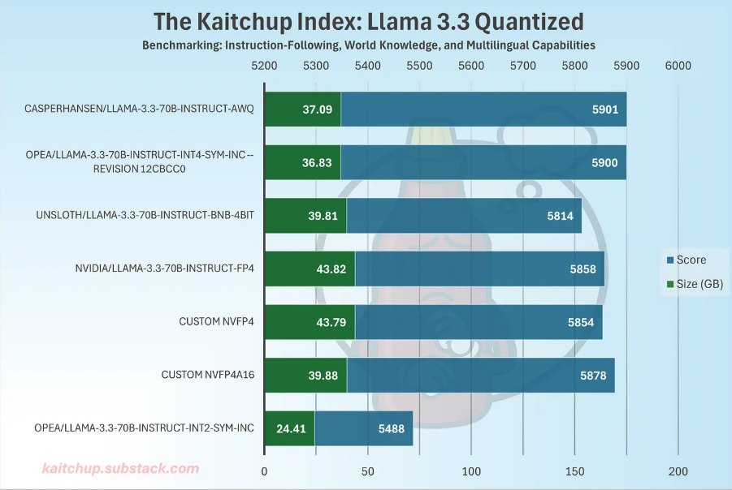
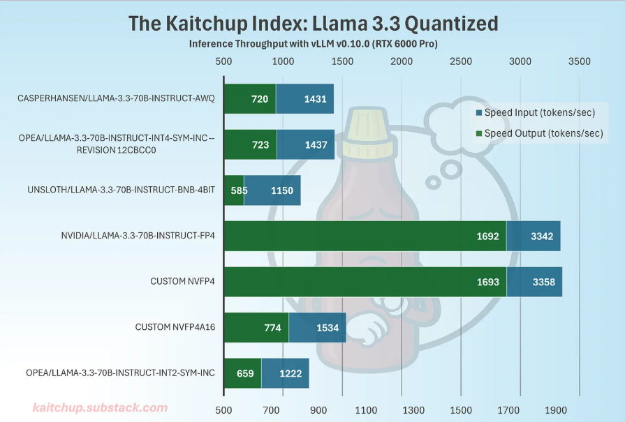

## NVFP4 Analysis and Engineering Practice

### **Abstract and Key Points**

- NVFP4 is a 4-bit floating-point quantization format optimized by NVIDIA for Blackwell Tensor Core, using an **E2M1 element format** (1 sign bit + 2 exponent bits + 1 mantissa bit, totaling 4 bits) with **dual scaling** mechanism: every 16 weights share one FP8 E4M3 local scaling factor (**micro-block level**, i.e., "grouping granularity" of 16), plus one FP32 global scaling factor per tensor (tensor level), balancing storage compression with numerical stability. Experimental results show that with both activations and weights in NVFP4, throughput can be ~2.35× higher than INT4 (RTX 6000 Pro, vLLM 0.10.0, Llama-3.3-70B-Instruct).
- **Quantization Error Advantage**: NVFP4's E4M3 fractional scaling achieves significantly lower quantization error (MSE ≈ 0.08) compared to MXFP4's E8M0 power-of-two scaling (MSE ≈ 0.72), representing a **9× error reduction**. This is because E4M3 finds an optimal scale factor that minimizes collective block errors, while E8M0 must snap to nearest 2^n values.
- **Platform Energy Efficiency**: The NVFP4 format is a key technology enabling the energy efficiency leap of the Blackwell platform. With native hardware support for NVFP4, the GB200 platform achieves up to **25x greater energy efficiency** compared to H100 (50x for Blackwell Ultra). This is due to the elimination of dequantization during computation and a significant reduction in data movement (approximately 3.5x less than FP16).
- Compared to mainstream 4-bit INT4 formats (AWQ, AutoRound, bitsandbytes), NVFP4 shows no obvious accuracy gap on large models (>10B parameters). **The key advantage lies in Blackwell GPU hardware acceleration**: when weights+activations both use NVFP4, Tensor Cores can "automatically handle the microscaled FP4 data" (NVIDIA official wording), directly processing microscaling format data and reducing the data type conversion overhead present in INT4 approaches. If only weight quantization is applied (NVFP4A16) with activations remaining FP16, the hardware advantage is significantly weakened, with throughput only slightly better than INT4.
- **Important Limitation**: The **performance advantage of NVFP4 is primarily realized on the Blackwell architecture (GB200/GB300/RTX 6000 Pro, etc.)**. On legacy GPUs (Hopper/Ampere/Ada), NVFP4 models can run but require real-time dequantization to FP16 for computation (similar to how INT4 is handled). Due to the lack of optimized kernels, performance may not match mature INT4 implementations (like AWQ/AutoRound). The original author explicitly states: "I can't see any good reasons for using NVFP4 with older GPUs," implying a lack of performance advantage on previous-generation hardware.
- **MXFP4 (OCP Microscaling Standard)** uses an E2M1 element, E8M0 power-of-2 scaling, a **micro-block size of 32**, and no global FP32 scaling. Its computation is primarily based on shift operations, resulting in lower metadata overhead and prioritizing cross-platform compatibility and deployment simplicity. OpenAI's open-source models (like gpt-oss-20b/120b) use MXFP4 for PTQ, while keeping a few modules in high precision (modules_to_not_convert).
- **Accuracy Retention**: In 7 benchmark tests on DeepSeek-R1-0528, the accuracy drop from FP8 to NVFP4 was ≤1%. Notably, on AIME 2024, NVFP4 (91%) even outperformed FP8 (89%). Other benchmarks like MMLU-PRO (85%→84%), GPQA Diamond (81%→80%), and Math-500 (98%→98%) all demonstrate excellent accuracy retention.
- **Selection Guidance**:
  - ✅ **With a Blackwell GPU**: Prioritize NVFP4 (for both weights and activations) to achieve significant throughput and energy efficiency gains.
  - ⚠️ **With Legacy GPUs (H100/A100/RTX 40/30 series)**: While NVFP4 models are runnable, the **performance advantage is not significant**. Mature INT4 (AWQ/AutoRound) or MXFP4 solutions are recommended. If the primary goal is VRAM savings, NVFP4 remains effective, but inference speed will not surpass INT4.
  - ⚠️ **For Small Models (<10B)**: There is insufficient public data on accuracy and performance differences; practical evaluation is advised.

### **1. Background: Why NVFP4?**

As LLM parameter counts continue to grow, inference is increasingly limited by memory bandwidth and capacity. 4-bit quantization is currently recognized as a highly cost-effective solution, but traditional INT4 approaches face two major bottlenecks:

- **Dequantization Overhead**: Despite numerous engineering optimizations, INT4 weights typically need to be dequantized back to 16-bit or higher precision before computation to be compatible with general-purpose tensor cores. This process introduces significant performance overhead.
- **Dynamic Range vs. Fidelity**: To reduce metadata, INT4 often uses large group sizes (e.g., 128) to share scaling factors. However, this strategy can lead to precision loss when data distributions are uneven or contain outliers, requiring complex calibration algorithms to compensate.

The design goal of NVFP4 is to minimize dequantization overhead and accuracy loss in 4-bit storage and computation through native hardware support, thereby translating theoretical design into measurable throughput gains.

### **2. Core Design of NVFP4**

**1. Element Format and Value Range**

- Element format: FP4 E2M1 (1 sign bit, 2 exponent bits, 1 mantissa bit)
- Value range per element: approximately -6 to +6 (limited magnitude coverage)
- 4-bit alone is insufficient to cover real LLM tensor distributions, hence NVFP4 introduces "dual scaling."

**2. Dual Scaling Mechanism**

- **Micro-block Scaling (Block-level)**:
  - **Granularity**: 16 elements per block (block size = 16).
  - **Scaling Factor**: Each block uses a scaling factor in FP8 E4M3 format.
  - **Advantage**: E4M3 supports non-power-of-two "fractional scaling," allowing it to more accurately fit the local magnitude of the data and effectively reduce the impact of outliers on other values within the block.

- **Global Scaling (Tensor-level)**:
  - Each tensor is assigned a high-precision FP32 scaling factor to absorb long-tail ranges and cross-layer differences, allowing the FP8 scaling factors of each micro-block to operate in a more suitable range.

The reconstructed formula can be written as: x ≈ xq × s_block(FP8 E4M3) × s_tensor(FP32)

**Design Insights**:

- **Finer Granularity**: NVFP4's micro-block size of 16 is smaller than MXFP4's 32. This allows it to adapt more finely to local data distributions and weaken the influence of outliers on other weights in the group.
- **Superior Scaling Format**: FP8 E4M3 scaling is more flexible than E8M0 power-of-two scaling and can significantly reduce quantization error. Empirical data shows that the Mean Squared Error (MSE) of E4M3 is about 9 times lower than that of E8M0.
- **Global High-Precision Scaling**: The introduction of a tensor-level FP32 scaling factor acts as a second layer of protection, ensuring numerical stability even when scales vary dramatically across different layers or tensors.

**3. Complete Comparison: FP4 / MXFP4 / NVFP4**

| Feature | FP4 (E2M1) | MXFP4 | NVFP4 |
|---------|------------|-------|-------|
| **Format Structure** | 4-bit (1 sign, 2 exponent, 1 mantissa) with software scaling factor | 4-bit (1 sign, 2 exponent, 1 mantissa), 1 shared power-of-two scale per 32-value block | 4-bit (1 sign, 2 exponent, 1 mantissa) with 1 shared FP8 scale per 16-value block |
| **Hardware Acceleration** | No | Yes | Yes |
| **Memory** | ~25% of FP16 | ~25% of FP16 | ~28.5% of FP16 (3.5× compression) |
| **Accuracy** | Risk of significant accuracy degradation vs FP8 | Risk of significant accuracy degradation vs FP8 | Reduced risk of accuracy degradation, especially for larger models |

### **3. NVFP4 and Blackwell Architecture Innovation**

#### Official NVIDIA Statement

According to NVIDIA's Blackwell white paper and developer blog:

> "NVIDIA Blackwell fifth-generation Tensor Core architecture implements NVFP4 and can **automatically handle the microscaled FP4 data** including the grouping of elements, dynamic scaling, and 4-bit matrix operations."

> Source: [Introducing NVFP4 for Efficient and Accurate Low-Precision Inference](https://developer.nvidia.com/blog/introducing-nvfp4-for-efficient-and-accurate-low-precision-inference/)

**Key terminology interpretation**:
- **"implements NVFP4"** → Tensor Core hardware has built-in NVFP4 support
- **"automatically handle"** → Automatically processes microscaling data (including grouping, dynamic scaling)
- **"4-bit matrix operations"** → Directly executes 4-bit matrix operations

**Content not explicitly stated by official sources**:
- Whether it is completely "dequantization-free" (zero-dequantization)
- Specific hardware data flow path design
- Circuit-level implementation details of FP4×FP8 scaling

**Phenomena observed from empirical data**:

NVFP4 on Blackwell shows approximately 2.35× throughput improvement compared to INT4. Possible reasons include:
- **Hardware native support**: Tensor Cores can "automatically handle the microscaled FP4 data" (official statement), directly processing microscaling format data
- **Bandwidth advantage**: 4-bit data transfer volume is comparable to INT4, reducing the data type conversion overhead present in INT4 approaches
- **Automatic scaling processing**: Hardware automatically handles micro-block scaling without requiring additional software operations
- **Dual scaling mechanism**: FP8 micro-block scale + FP32 global scale ensures numerical stability

**Energy Efficiency Gains** (NVIDIA Official Data):
- **Blackwell vs H100**: Up to **25× energy efficiency** improvement (0.4 J/token vs 10 J/token for GPT-MoE-1.8T)
- **Blackwell Ultra vs H100**: Up to **50× energy efficiency** improvement (0.2 J/token)
- **10-year evolution**: 200,000× efficiency gain from Kepler (42,000 J/token) to Blackwell Ultra (0.2 J/token)

**About different quantization schemes** (observations based on public information):

| Scheme | Data Format | Observed Characteristics |
|--------|-------------|-------------------------|
| INT4 | Integer + scale | Mature toolchain, requires dequantization steps |
| H100 FP8 | FP8 floating-point | Hopper native support, but scale operations may require precision elevation |
| NVFP4 | FP4 floating-point + FP8 scale + FP32 scale | Blackwell optimized, high observed throughput |

The above comparisons are based on publicly available performance data and architectural feature descriptions. Specific hardware implementation details (such as whether there are dedicated fusion units, data flow path design, etc.) are not detailed in NVIDIA official documentation and await further technical disclosure.

The above comparisons are based on publicly available performance data and architectural feature descriptions. Specific hardware implementation details (such as whether there are dedicated fusion units, data flow path design, etc.) are not detailed in NVIDIA official documentation and await further technical disclosure.


### **4. Experimental Results and Engineering Significance**

**1. Accuracy**

- **NVFP4 vs. FP8:** Difference ≤1% across multiple benchmarks; some (e.g., AIME 2024) show NVFP4 slightly better, but within statistical noise → "NVFP4 ≈ FP8."
- **NVFP4 vs. INT4 (AWQ/AutoRound/bitsandbytes):** On large models (e.g., Llama 3.3), NVFP4 and high-quality INT4 methods are comparable. Sometimes INT4 is slightly better, sometimes equivalent. Smaller models (<10B) may reveal larger differences.
- **NVFP4A16 vs. NVFP4:** Even with activation quantization, NVFP4 accuracy remains close to NVFP4A16 (weights-only), thanks to dual scaling design.

**2. Storage and Throughput**

- **Average storage overhead:** ~4.5 bits/value (block=16, one FP8 scale per block + one FP32 scale per tensor), higher than typical INT4 (block=128). NVFP4 models of Llama 3.3 are ~7GB larger than INT4 equivalents.
- **Memory efficiency gains**: NVFP4 reduces memory footprint by approximately **3.5× relative to FP16** and **1.8× compared to FP8**. On NVIDIA GB300 NVL72 rack-scale system (36 Grace Blackwell Ultra Superchips), total memory budget reaches **40 TB per system**, providing significant benefits for large-scale AI inference deployments.
- **Throughput advantage:** Key conclusion is Blackwell's hardware native support for NVFP4. When both weights and activations use NVFP4, Tensor Cores can "automatically handle the microscaled FP4 data" (NVIDIA official wording), directly processing microscaling format data. Measured throughput is ~2.35× vs. INT4.
- **NVFP4A16 trade-off:** When only weights are quantized and activations remain 16-bit, data type conversion or degradation occurs during computation. NVFP4A16 throughput is only marginally faster than INT4, unable to fully leverage NVFP4's "weights+activations full 4-bit" advantage.

#### Figure 1 — Inference Throughput Comparison (RTX 6000 Pro, vLLM v0.10.0)



**Chart Explanation:**

- Dark green bars (Speed Input): Input-side token generation rate (tokens/sec)
- Light blue bars (Speed Output): Output-side token generation rate (tokens/sec)
- Different entries on the left of model names represent different quantization strategies or model sources

[Note 1] Benchmark source and measurement method: This article's experiments were conducted on RTX 6000 Pro (Ada) (CUDA 12.4, NVIDIA Driver 555.xx, Python 3.10, PyTorch 2.3, vLLM 0.10.0, FlashInfer disabled). Test configuration: single request; input context length 1 token; generate 512 new tokens; 1 warmup; tokens/s = generated tokens ÷ pure generation time. These numbers represent point measurements under this specific configuration, not peak throughput across batches/concurrency. Complete scripts and log examples in `benchmarks.md`.

#### Figure 2 — Accuracy + Model Size Comparison



**Chart Explanation:**

- Blue bars (Score): Unified benchmark score (covering instruction following, common sense knowledge, multilingual capabilities)
- Green numbers (Size GB): Model size on disk
- This chart focuses on "quantization accuracy preservation" and "storage footprint."

- **Note**: There is an ambiguity in the "Size GB" unit in the chart. Based on the context, it should be understood that the NVFP4 model is approximately 7GB larger than the AWQ model (44GB vs 37GB).
3. **Volume Difference Analysis**
   - The increase in volume is mainly due to the larger metadata overhead of NVFP4:
     - **Smaller Block Size**: NVFP4 (16) requires storing more scaling factors than AWQ (128).
     - **Dual Scaling**: NVFP4 needs to store both FP8 and FP32 scaling factors.
     - In contrast, the metadata structure of INT4 solutions is more compact.

### **3. NVFP4 and Blackwell Architecture Innovation**

#### Official NVIDIA Statement

According to NVIDIA's Blackwell white paper and developer blog:

> "NVIDIA Blackwell fifth-generation Tensor Core architecture implements NVFP4 and can **automatically handle the microscaled FP4 data** including the grouping of elements, dynamic scaling, and 4-bit matrix operations."

> Source: [Introducing NVFP4 for Efficient and Accurate Low-Precision Inference](https://developer.nvidia.com/blog/introducing-nvfp4-for-efficient-and-accurate-low-precision-inference/)

**Key terminology interpretation**:
- **"implements NVFP4"** → Tensor Core hardware has built-in NVFP4 support
- **"automatically handle"** → Automatically processes microscaling data (including grouping, dynamic scaling)
- **"4-bit matrix operations"** → Directly executes 4-bit matrix operations

**Content not explicitly stated by official sources**:
- Whether it is completely "dequantization-free" (zero-dequantization)
- Specific hardware data flow path design
- Circuit-level implementation details of FP4×FP8 scaling

**Phenomena observed from empirical data**:

NVFP4 on Blackwell shows approximately 2.35× throughput improvement compared to INT4. Possible reasons include:
- **Hardware native support**: Tensor Cores can "automatically handle the microscaled FP4 data" (official statement), directly processing microscaling format data
- **Bandwidth advantage**: 4-bit data transfer volume is comparable to INT4, reducing the data type conversion overhead present in INT4 approaches
- **Automatic scaling processing**: Hardware automatically handles micro-block scaling without requiring additional software operations
- **Dual scaling mechanism**: FP8 micro-block scale + FP32 global scale ensures numerical stability

**Energy Efficiency Gains** (NVIDIA Official Data):
- **Blackwell vs H100**: Up to **25× energy efficiency** improvement (0.4 J/token vs 10 J/token for GPT-MoE-1.8T)
- **Blackwell Ultra vs H100**: Up to **50× energy efficiency** improvement (0.2 J/token)
- **10-year evolution**: 200,000× efficiency gain from Kepler (42,000 J/token) to Blackwell Ultra (0.2 J/token)

**About different quantization schemes** (observations based on public information):

| Scheme | Data Format | Observed Characteristics |
|--------|-------------|-------------------------|
| INT4 | Integer + scale | Mature toolchain, requires dequantization steps |
| H100 FP8 | FP8 floating-point | Hopper native support, but scale operations may require precision elevation |
| NVFP4 | FP4 floating-point + FP8 scale + FP32 scale | Blackwell optimized, high observed throughput |

The above comparisons are based on publicly available performance data and architectural feature descriptions. Specific hardware implementation details (such as whether there are dedicated fusion units, data flow path design, etc.) are not detailed in NVIDIA official documentation and await further technical disclosure.

The above comparisons are based on publicly available performance data and architectural feature descriptions. Specific hardware implementation details (such as whether there are dedicated fusion units, data flow path design, etc.) are not detailed in NVIDIA official documentation and await further technical disclosure.


### **4. Experimental Results and Engineering Significance**

**1. Accuracy**

- **NVFP4 vs. FP8:** Difference ≤1% across multiple benchmarks; some (e.g., AIME 2024) show NVFP4 slightly better, but within statistical noise → "NVFP4 ≈ FP8."
- **NVFP4 vs. INT4 (AWQ/AutoRound/bitsandbytes):** On large models (e.g., Llama 3.3), NVFP4 and high-quality INT4 methods are comparable. Sometimes INT4 is slightly better, sometimes equivalent. Smaller models (<10B) may reveal larger differences.
- **NVFP4A16 vs. NVFP4:** Even with activation quantization, NVFP4 accuracy remains close to NVFP4A16 (weights-only), thanks to dual scaling design.

**2. Storage and Throughput**

- **Average storage overhead:** ~4.5 bits/value (block=16, one FP8 scale per block + one FP32 scale per tensor), higher than typical INT4 (block=128). NVFP4 models of Llama 3.3 are ~7GB larger than INT4 equivalents.
- **Memory efficiency gains**: NVFP4 reduces memory footprint by approximately **3.5× relative to FP16** and **1.8× compared to FP8**. On NVIDIA GB300 NVL72 rack-scale system (36 Grace Blackwell Ultra Superchips), total memory budget reaches **40 TB per system**, providing significant benefits for large-scale AI inference deployments.
- **Throughput advantage:** Key conclusion is Blackwell's hardware native support for NVFP4. When both weights and activations use NVFP4, Tensor Cores can "automatically handle the microscaled FP4 data" (NVIDIA official wording), directly processing microscaling format data. Measured throughput is ~2.35× vs. INT4.
- **NVFP4A16 trade-off:** When only weights are quantized and activations remain 16-bit, data type conversion or degradation occurs during computation. NVFP4A16 throughput is only marginally faster than INT4, unable to fully leverage NVFP4's "weights+activations full 4-bit" advantage.

#### Figure 1 — Inference Throughput Comparison (RTX 6000 Pro, vLLM v0.10.0)


**Chart Explanation:**

- Dark green bars (Speed Input): Input-side token generation rate (tokens/sec)
- Light blue bars (Speed Output): Output-side token generation rate (tokens/sec)
- Different entries on the left of model names represent different quantization strategies or model sources

[Note 1] Benchmark source and measurement method: This article's experiments were conducted on RTX 6000 Pro (Ada) (CUDA 12.4, NVIDIA Driver 555.xx, Python 3.10, PyTorch 2.3, vLLM 0.10.0, FlashInfer disabled). Test configuration: single request; input context length 1 token; generate 512 new tokens; 1 warmup; tokens/s = generated tokens ÷ pure generation time. These numbers represent point measurements under this specific configuration, not peak throughput across batches/concurrency. Complete scripts and log examples in `benchmarks.md`.

#### Figure 2 — Accuracy + Model Size Comparison


**Chart Explanation:**

- Blue bars (Score): Unified benchmark score (covering instruction following, common sense knowledge, multilingual capabilities)
- Green numbers (Size GB): Model size on disk
- This chart focuses on "quantization accuracy preservation" and "storage footprint."

- **Note**: There is an ambiguity in the "Size GB" unit in the chart. Based on the context, it should be understood that the NVFP4 model is approximately 7GB larger than the AWQ model (44GB vs 37GB).
3. **Volume Difference Analysis**
   - The increase in volume is mainly due to the larger metadata overhead of NVFP4:
     - **Smaller Block Size**: NVFP4 (16) requires storing more scaling factors than AWQ (128).
     - **Dual Scaling**: NVFP4 needs to store both FP8 and FP32 scaling factors.
     - In contrast, the metadata structure of INT4 solutions is more compact.

### **3. NVFP4 and Blackwell Architecture Innovation**

#### Official NVIDIA Statement

According to NVIDIA's Blackwell white paper and developer blog:

> "NVIDIA Blackwell fifth-generation Tensor Core architecture implements NVFP4 and can **automatically handle the microscaled FP4 data** including the grouping of elements, dynamic scaling, and 4-bit matrix operations."

> Source: [Introducing NVFP4 for Efficient and Accurate Low-Precision Inference](https://developer.nvidia.com/blog/introducing-nvfp4-for-efficient-and-accurate-low-precision-inference/)

**Key terminology interpretation**:
- **"implements NVFP4"** → Tensor Core hardware has built-in NVFP4 support
- **"automatically handle"** → Automatically processes microscaling data (including grouping, dynamic scaling)
- **"4-bit matrix operations"** → Directly executes 4-bit matrix operations

**Content not explicitly stated by official sources**:
- Whether it is completely "dequantization-free" (zero-dequantization)
- Specific hardware data flow path design
- Circuit-level implementation details of FP4×FP8 scaling

**Phenomena observed from empirical data**:

NVFP4 on Blackwell shows approximately 2.35× throughput improvement compared to INT4. Possible reasons include:
- **Hardware native support**: Tensor Cores can "automatically handle the microscaled FP4 data" (official statement), directly processing microscaling format data
- **Bandwidth advantage**: 4-bit data transfer volume is comparable to INT4, reducing the data type conversion overhead present in INT4 approaches
- **Automatic scaling processing**: Hardware automatically handles micro-block scaling without requiring additional software operations
- **Dual scaling mechanism**: FP8 micro-block scale + FP32 global scale ensures numerical stability

**Energy Efficiency Gains** (NVIDIA Official Data):
- **Blackwell vs H100**: Up to **25× energy efficiency** improvement (0.4 J/token vs 10 J/token for GPT-MoE-1.8T)
- **Blackwell Ultra vs H100**: Up to **50× energy efficiency** improvement (0.2 J/token)
- **10-year evolution**: 200,000× efficiency gain from Kepler (42,000 J/token) to Blackwell Ultra (0.2 J/token)

**About different quantization schemes** (observations based on public information):

| Scheme | Data Format | Observed Characteristics |
|--------|-------------|-------------------------|
| INT4 | Integer + scale | Mature toolchain, requires dequantization steps |
| H100 FP8 | FP8 floating-point | Hopper native support, but scale operations may require precision elevation |
| NVFP4 | FP4 floating-point + FP8 scale + FP32 scale | Blackwell optimized, high observed throughput |

The above comparisons are based on publicly available performance data and architectural feature descriptions. Specific hardware implementation details (such as whether there are dedicated fusion units, data flow path design, etc.) are not detailed in NVIDIA official documentation and await further technical disclosure.

The above comparisons are based on publicly available performance data and architectural feature descriptions. Specific hardware implementation details (such as whether there are dedicated fusion units, data flow path design, etc.) are not detailed in NVIDIA official documentation and await further technical disclosure.


### **4. Experimental Results and Engineering Significance**

**1. Accuracy**

- **NVFP4 vs. FP8:** Difference ≤1% across multiple benchmarks; some (e.g., AIME 2024) show NVFP4 slightly better, but within statistical noise → "NVFP4 ≈ FP8."
- **NVFP4 vs. INT4 (AWQ/AutoRound/bitsandbytes):** On large models (e.g., Llama 3.3), NVFP4 and high-quality INT4 methods are comparable. Sometimes INT4 is slightly better, sometimes equivalent. Smaller models (<10B) may reveal larger differences.
- **NVFP4A16 vs. NVFP4:** Even with activation quantization, NVFP4 accuracy remains close to NVFP4A16 (weights-only), thanks to dual scaling design.

**2. Storage and Throughput**

- **Average storage overhead:** ~4.5 bits/value (block=16, one FP8 scale per block + one FP32 scale per tensor), higher than typical INT4 (block=128). NVFP4 models of Llama 3.3 are ~7GB larger than INT4 equivalents.
- **Memory efficiency gains**: NVFP4 reduces memory footprint by approximately **3.5× relative to FP16** and **1.8× compared to FP8**. On NVIDIA GB300 NVL72 rack-scale system (36 Grace Blackwell Ultra Superchips), total memory budget reaches **40 TB per system**, providing significant benefits for large-scale AI inference deployments.
- **Throughput advantage:** Key conclusion is Blackwell's hardware native support for NVFP4. When both weights and activations use NVFP4, Tensor Cores can "automatically handle the microscaled FP4 data" (NVIDIA official wording), directly processing microscaling format data. Measured throughput is ~2.35× vs. INT4.
- **NVFP4A16 trade-off:** When only weights are quantized and activations remain 16-bit, data type conversion or degradation occurs during computation. NVFP4A16 throughput is only marginally faster than INT4, unable to fully leverage NVFP4's "weights+activations full 4-bit" advantage.

#### Figure 1 — Inference Throughput Comparison (RTX 6000 Pro, vLLM v0.10.0)


**Chart Explanation:**

- Dark green bars (Speed Input): Input-side token generation rate (tokens/sec)
- Light blue bars (Speed Output): Output-side token generation rate (tokens/sec)
- Different entries on the left of model names represent different quantization strategies or model sources

[Note 1] Benchmark source and measurement method: This article's experiments were conducted on RTX 6000 Pro (Ada) (CUDA 12.4, NVIDIA Driver 555.xx, Python 3.10, PyTorch 2.3, vLLM 0.10.0, FlashInfer disabled). Test configuration: single request; input context length 1 token; generate 512 new tokens; 1 warmup; tokens/s = generated tokens ÷ pure generation time. These numbers represent point measurements under this specific configuration, not peak throughput across batches/concurrency. Complete scripts and log examples in `benchmarks.md`.

#### Figure 2 — Accuracy + Model Size Comparison


**Chart Explanation:**

- Blue bars (Score): Unified benchmark score (covering instruction following, common sense knowledge, multilingual capabilities)
- Green numbers (Size GB): Model size on disk
- This chart focuses on "quantization accuracy preservation" and "storage footprint."

- **Note**: There is an ambiguity in the "Size GB" unit in the chart. Based on the context, it should be understood that the NVFP4 model is approximately 7GB larger than the AWQ model (44GB vs 37GB).
3. **Volume Difference Analysis**
   - The increase in volume is mainly due to the larger metadata overhead of NVFP4:
     - **Smaller Block Size**: NVFP4 (16) requires storing more scaling factors than AWQ (128).
     - **Dual Scaling**: NVFP4 needs to store both FP8 and FP32 scaling factors.
     - In contrast, the metadata structure of INT4 solutions is more compact.

### **3. NVFP4 and Blackwell Architecture Innovation**

#### Official NVIDIA Statement

According to NVIDIA's Blackwell white paper and developer blog:

> "NVIDIA Blackwell fifth-generation Tensor Core architecture implements NVFP4 and can **automatically handle the microscaled FP4 data** including the grouping of elements, dynamic scaling, and 4-bit matrix operations."

> Source: [Introducing NVFP4 for Efficient and Accurate Low-Precision Inference](https://developer.nvidia.com/blog/introducing-nvfp4-for-efficient-and-accurate-low-precision-inference/)

**Key terminology interpretation**:
- **"implements NVFP4"** → Tensor Core hardware has built-in NVFP4 support
- **"automatically handle"** → Automatically processes microscaling data (including grouping, dynamic scaling)
- **"4-bit matrix operations"** → Directly executes 4-bit matrix operations

**Content not explicitly stated by official sources**:
- Whether it is completely "dequantization-free" (zero-dequantization)
- Specific hardware data flow path design
- Circuit-level implementation details of FP4×FP8 scaling

**Phenomena observed from empirical data**:

NVFP4 on Blackwell shows approximately 2.35× throughput improvement compared to INT4. Possible reasons include:
- **Hardware native support**: Tensor Cores can "automatically handle the microscaled FP4 data" (official statement), directly processing microscaling format data
- **Bandwidth advantage**: 4-bit data transfer volume is comparable to INT4, reducing the data type conversion overhead present in INT4 approaches
- **Automatic scaling processing**: Hardware automatically handles micro-block scaling without requiring additional software operations
- **Dual scaling mechanism**: FP8 micro-block scale + FP32 global scale ensures numerical stability

**Energy Efficiency Gains** (NVIDIA Official Data):
- **Blackwell vs H100**: Up to **25× energy efficiency** improvement (0.4 J/token vs 10 J/token for GPT-MoE-1.8T)
- **Blackwell Ultra vs H100**: Up to **50× energy efficiency** improvement (0.2 J/token)
- **10-year evolution**: 200,000× efficiency gain from Kepler (42,000 J/token) to Blackwell Ultra (0.2 J/token)

**About different quantization schemes** (observations based on public information):

| Scheme | Data Format | Observed Characteristics |
|--------|-------------|-------------------------|
| INT4 | Integer + scale | Mature toolchain, requires dequantization steps |
| H100 FP8 | FP8 floating-point | Hopper native support, but scale operations may require precision elevation |
| NVFP4 | FP4 floating-point + FP8 scale + FP32 scale | Blackwell optimized, high observed throughput |

The above comparisons are based on publicly available performance data and architectural feature descriptions. Specific hardware implementation details (such as whether there are dedicated fusion units, data flow path design, etc.) are not detailed in NVIDIA official documentation and await further technical disclosure.

The above comparisons are based on publicly available performance data and architectural feature descriptions. Specific hardware implementation details (such as whether there are dedicated fusion units, data flow path design, etc.) are not detailed in NVIDIA official documentation and await further technical disclosure.


### **4. Experimental Results and Engineering Significance**

**1. Accuracy**

- **NVFP4 vs. FP8:** Difference ≤1% across multiple benchmarks; some (e.g., AIME 2024) show NVFP4 slightly better, but within statistical noise → "NVFP4 ≈ FP8."
- **NVFP4 vs. INT4 (AWQ/AutoRound/bitsandbytes):** On large models (e.g., Llama 3.3), NVFP4 and high-quality INT4 methods are comparable. Sometimes INT4 is slightly better, sometimes equivalent. Smaller models (<10B) may reveal larger differences.
- **NVFP4A16 vs. NVFP4:** Even with activation quantization, NVFP4 accuracy remains close to NVFP4A16 (weights-only), thanks to dual scaling design.

**2. Storage and Throughput**

- **Average storage overhead:** ~4.5 bits/value (block=16, one FP8 scale per block + one FP32 scale per tensor), higher than typical INT4 (block=128). NVFP4 models of Llama 3.3 are ~7GB larger than INT4 equivalents.
- **Memory efficiency gains**: NVFP4 reduces memory footprint by approximately **3.5× relative to FP16** and **1.8× compared to FP8**. On NVIDIA GB300 NVL72 rack-scale system (36 Grace Blackwell Ultra Superchips), total memory budget reaches **40 TB per system**, providing significant benefits for large-scale AI inference deployments.
- **Throughput advantage:** Key conclusion is Blackwell's hardware native support for NVFP4. When both weights and activations use NVFP4, Tensor Cores can "automatically handle the microscaled FP4 data" (NVIDIA official wording), directly processing microscaling format data. Measured throughput is ~2.35× vs. INT4.
- **NVFP4A16 trade-off:** When only weights are quantized and activations remain 16-bit, data type conversion or degradation occurs during computation. NVFP4A16 throughput is only marginally faster than INT4, unable to fully leverage NVFP4's "weights+activations full 4-bit" advantage.

#### Figure 1 — Inference Throughput Comparison (RTX 6000 Pro, vLLM v0.10.0)


**Chart Explanation:**

- Dark green bars (Speed Input): Input-side token generation rate (tokens/sec)
- Light blue bars (Speed Output): Output-side token generation rate (tokens/sec)
- Different entries on the left of model names represent different quantization strategies or model sources

[Note 1] Benchmark source and measurement method: This article's experiments were conducted on RTX 6000 Pro (Ada) (CUDA 12.4, NVIDIA Driver 555.xx, Python 3.10, PyTorch 2.3, vLLM 0.10.0, FlashInfer disabled). Test configuration: single request; input context length 1 token; generate 512 new tokens; 1 warmup; tokens/s = generated tokens ÷ pure generation time. These numbers represent point measurements under this specific configuration, not peak throughput across batches/concurrency. Complete scripts and log examples in `benchmarks.md`.

#### Figure 2 — Accuracy + Model Size Comparison


**Chart Explanation:**

- Blue bars (Score): Unified benchmark score (covering instruction following, common sense knowledge, multilingual capabilities)
- Green numbers (Size GB): Model size on disk
- This chart focuses on "quantization accuracy preservation" and "storage footprint."

- **Note**: There is an ambiguity in the "Size GB" unit in the chart. Based on the context, it should be understood that the NVFP4 model is approximately 7GB larger than the AWQ model (44GB vs 37GB).
3. **Volume Difference Analysis**
   - The increase in volume is mainly due to the larger metadata overhead of NVFP4:
     - **Smaller Block Size**: NVFP4 (16) requires storing more scaling factors than AWQ (128).
     - **Dual Scaling**: NVFP4 needs to store both FP8 and FP32 scaling factors.
     - In contrast, the metadata structure of INT4 solutions is more compact.

### **3. NVFP4 and Blackwell Architecture Innovation**

#### Official NVIDIA Statement

According to NVIDIA's Blackwell white paper and developer blog:

> "NVIDIA Blackwell fifth-generation Tensor Core architecture implements NVFP4 and can **automatically handle the microscaled FP4 data** including the grouping of elements, dynamic scaling, and 4-bit matrix operations."

> Source: [Introducing NVFP4 for Efficient and Accurate Low-Precision Inference](https://developer.nvidia.com/blog/introducing-nvfp4-for-efficient-and-accurate-low-precision-inference/)

**Key terminology interpretation**:
- **"implements NVFP4"** → Tensor Core hardware has built-in NVFP4 support
- **"automatically handle"** → Automatically processes microscaling data (including grouping, dynamic scaling)
- **"4-bit matrix operations"** → Directly executes 4-bit matrix operations

**Content not explicitly stated by official sources**:
- Whether it is completely "dequantization-free" (zero-dequantization)
- Specific hardware data flow path design
- Circuit-level implementation details of FP4×FP8 scaling

**Phenomena observed from empirical data**:

NVFP4 on Blackwell shows approximately 2.35× throughput improvement compared to INT4. Possible reasons include:
- **Hardware native support**: Tensor Cores can "automatically handle the microscaled FP4 data" (official statement), directly processing microscaling format data
- **Bandwidth advantage**: 4-bit data transfer volume is comparable to INT4, reducing the data type conversion overhead present in INT4 approaches
- **Automatic scaling processing**: Hardware automatically handles micro-block scaling without requiring additional software operations
- **Dual scaling mechanism**: FP8 micro-block scale + FP32 global scale ensures numerical stability

**Energy Efficiency Gains** (NVIDIA Official Data):
- **Blackwell vs H100**: Up to **25× energy efficiency** improvement (0.4 J/token vs 10 J/token for GPT-MoE-1.8T)
- **Blackwell Ultra vs H100**: Up to **50× energy efficiency** improvement (0.2 J/token)
- **10-year evolution**: 200,000× efficiency gain from Kepler (42,000 J/token) to Blackwell Ultra (0.2 J/token)

**About different quantization schemes** (observations based on public information):

| Scheme | Data Format | Observed Characteristics |
|--------|-------------|-------------------------|
| INT4 | Integer + scale | Mature toolchain, requires dequantization steps |
| H100 FP8 | FP8 floating-point | Hopper native support, but scale operations may require precision elevation |
| NVFP4 | FP4 floating-point + FP8 scale + FP32 scale | Blackwell optimized, high observed throughput |

The above comparisons are based on publicly available performance data and architectural feature descriptions. Specific hardware implementation details (such as whether there are dedicated fusion units, data flow path design, etc.) are not detailed in NVIDIA official documentation and await further technical disclosure.

The above comparisons are based on publicly available performance data and architectural feature descriptions. Specific hardware implementation details (such as whether there are dedicated fusion units, data flow path design, etc.) are not detailed in NVIDIA official documentation and await further technical disclosure.


### **4. Experimental Results and Engineering Significance**

**1. Accuracy**

- **NVFP4 vs. FP8:** Difference ≤1% across multiple benchmarks; some (e.g., AIME 2024) show NVFP4 slightly better, but within statistical noise → "NVFP4 ≈ FP8."
- **NVFP4 vs. INT4 (AWQ/AutoRound/bitsandbytes):** On large models (e.g., Llama 3.3), NVFP4 and high-quality INT4 methods are comparable. Sometimes INT4 is slightly better, sometimes equivalent. Smaller models (<10B) may reveal larger differences.
- **NVFP4A16 vs. NVFP4:** Even with activation quantization, NVFP4 accuracy remains close to NVFP4A16 (weights-only), thanks to dual scaling design.

**2. Storage and Throughput**

- **Average storage overhead:** ~4.5 bits/value (block=16, one FP8 scale per block + one FP32 scale per tensor), higher than typical INT4 (block=128). NVFP4 models of Llama 3.3 are ~7GB larger than INT4 equivalents.
- **Memory efficiency gains**: NVFP4 reduces memory footprint by approximately **3.5× relative to FP16** and **1.8× compared to FP8**. On NVIDIA GB300 NVL72 rack-scale system (36 Grace Blackwell Ultra Superchips), total memory budget reaches **40 TB per system**, providing significant benefits for large-scale AI inference deployments.
- **Throughput advantage:** Key conclusion is Blackwell's hardware native support for NVFP4. When both weights and activations use NVFP4, Tensor Cores can "automatically handle the microscaled FP4 data" (NVIDIA official wording), directly processing microscaling format data. Measured throughput is ~2.35× vs. INT4.
- **NVFP4A16 trade-off:** When only weights are quantized and activations remain 16-bit, data type conversion or degradation occurs during computation. NVFP4A16 throughput is only marginally faster than INT4, unable to fully leverage NVFP4's "weights+activations full 4-bit" advantage.

#### Figure 1 — Inference Throughput Comparison (RTX 6000 Pro, vLLM v0.10.0)


**Chart Explanation:**

- Dark green bars (Speed Input): Input-side token generation rate (tokens/sec)
- Light blue bars (Speed Output): Output-side token generation rate (tokens/sec)
- Different entries on the left of model names represent different quantization strategies or model sources

[Note 1] Benchmark source and measurement method: This article's experiments were conducted on RTX 6000 Pro (Ada) (CUDA 12.4, NVIDIA Driver 555.xx, Python 3.10, PyTorch 2.3, vLLM 0.10.0, FlashInfer disabled). Test configuration: single request; input context length 1 token; generate 512 new tokens; 1 warmup; tokens/s = generated tokens ÷ pure generation time. These numbers represent point measurements under this specific configuration, not peak throughput across batches/concurrency. Complete scripts and log examples in `benchmarks.md`.

#### Figure 2 — Accuracy + Model Size Comparison


**Chart Explanation:**

- Blue bars (Score): Unified benchmark score (covering instruction following, common sense knowledge, multilingual capabilities)
- Green numbers (Size GB): Model size on disk
- This chart focuses on "quantization accuracy preservation" and "storage footprint."

- **Note**: There is an ambiguity in the "Size GB" unit in the chart. Based on the context, it should be understood that the NVFP4 model is approximately 7GB larger than the AWQ model (44GB vs 37GB).
3. **Volume Difference Analysis**
   - The increase in volume is mainly due to the larger metadata overhead of NVFP4:
     - **Smaller Block Size**: NVFP4 (16) requires storing more scaling factors than AWQ (128).
     - **Dual Scaling**: NVFP4 needs to store both FP8 and FP32 scaling factors.
     - In contrast, the metadata structure of INT4 solutions is more compact.

### **3. NVFP4 and Blackwell Architecture Innovation**

#### Official NVIDIA Statement

According to NVIDIA's Blackwell white paper and developer blog:

> "NVIDIA Blackwell fifth-generation Tensor Core architecture implements NVFP4 and can **automatically handle the microscaled FP4 data** including the grouping of elements, dynamic scaling, and 4-bit matrix operations."

> Source: [Introducing NVFP4 for Efficient and Accurate Low-Precision Inference](https://developer.nvidia.com/blog/introducing-nvfp4-for-efficient-and-accurate-low-precision-inference/)

**Key terminology interpretation**:
- **"implements NVFP4"** → Tensor Core hardware has built-in NVFP4 support
- **"automatically handle"** → Automatically processes microscaling data (including grouping, dynamic scaling)
- **"4-bit matrix operations"** → Directly executes 4-bit matrix operations

**Content not explicitly stated by official sources**:
- Whether it is completely "dequantization-free" (zero-dequantization)
- Specific hardware data flow path design
- Circuit-level implementation details of FP4×FP8 scaling

**Phenomena observed from empirical data**:

NVFP4 on Blackwell shows approximately 2.35× throughput improvement compared to INT4. Possible reasons include:
- **Hardware native support**: Tensor Cores can "automatically handle the microscaled FP4 data" (official statement), directly processing microscaling format data
- **Bandwidth advantage**: 4-bit data transfer volume is comparable to INT4, reducing the data type conversion overhead present in INT4 approaches
- **Automatic scaling processing**: Hardware automatically handles micro-block scaling without requiring additional software operations
- **Dual scaling mechanism**: FP8 micro-block scale + FP32 global scale ensures numerical stability

**Energy Efficiency Gains** (NVIDIA Official Data):
- **Blackwell vs H100**: Up to **25× energy efficiency** improvement (0.4 J/token vs 10 J/token for GPT-MoE-1.8T)
- **Blackwell Ultra vs H100**: Up to **50× energy efficiency** improvement (0.2 J/token)
- **10-year evolution**: 200,000× efficiency gain from Kepler (42,000 J/token) to Blackwell Ultra (0.2 J/token)

**About different quantization schemes** (observations based on public information):

| Scheme | Data Format | Observed Characteristics |
|--------|-------------|-------------------------|
| INT4 | Integer + scale | Mature toolchain, requires dequantization steps |
| H100 FP8 | FP8 floating-point | Hopper native support, but scale operations may require precision elevation |
| NVFP4 | FP4 floating-point + FP8 scale + FP32 scale | Blackwell optimized, high observed throughput |

The above comparisons are based on publicly available performance data and architectural feature descriptions. Specific hardware implementation details (such as whether there are dedicated fusion units, data flow path design, etc.) are not detailed in NVIDIA official documentation and await further technical disclosure.

The above comparisons are based on publicly available performance data and architectural feature descriptions. Specific hardware implementation details (such as whether there are dedicated fusion units, data flow path design, etc.) are not detailed in NVIDIA official documentation and await further technical disclosure.


### **4. Experimental Results and Engineering Significance**

**1. Accuracy**

- **NVFP4 vs. FP8:** Difference ≤1% across multiple benchmarks; some (e.g., AIME 2024) show NVFP4 slightly better, but within statistical noise → "NVFP4 ≈ FP8."
- **NVFP4 vs. INT4 (AWQ/AutoRound/bitsandbytes):** On large models (e.g., Llama 3.3), NVFP4 and high-quality INT4 methods are comparable. Sometimes INT4 is slightly better, sometimes equivalent. Smaller models (<10B) may reveal larger differences.
- **NVFP4A16 vs. NVFP4:** Even with activation quantization, NVFP4 accuracy remains close to NVFP4A16 (weights-only), thanks to dual scaling design.

**2. Storage and Throughput**

- **Average storage overhead:** ~4.5 bits/value (block=16, one FP8 scale per block + one FP32 scale per tensor), higher than typical INT4 (block=128). NVFP4 models of Llama 3.3 are ~7GB larger than INT4 equivalents.
- **Memory efficiency gains**: NVFP4 reduces memory footprint by approximately **3.5× relative to FP16** and **1.8× compared to FP8**. On NVIDIA GB300 NVL72 rack-scale system (36 Grace Blackwell Ultra Superchips), total memory budget reaches **40 TB per system**, providing significant benefits for large-scale AI inference deployments.
- **Throughput advantage:** Key conclusion is Blackwell's hardware native support for NVFP4. When both weights and activations use NVFP4, Tensor Cores can "automatically handle the microscaled FP4 data" (NVIDIA official wording), directly processing microscaling format data. Measured throughput is ~2.35× vs. INT4.
- **NVFP4A16 trade-off:** When only weights are quantized and activations remain 16-bit, data type conversion or degradation occurs during computation. NVFP4A16 throughput is only marginally faster than INT4, unable to fully leverage NVFP4's "weights+activations full 4-bit" advantage.

#### Figure 1 — Inference Throughput Comparison (RTX 6000 Pro, vLLM v0.10.0)


**Chart Explanation:**

- Dark green bars (Speed Input): Input-side token generation rate (tokens/sec)
- Light blue bars (Speed Output): Output-side token generation rate (tokens/sec)
- Different entries on the left of model names represent different quantization strategies or model sources

[Note 1] Benchmark source and measurement method: This article's experiments were conducted on RTX 6000 Pro (Ada) (CUDA 12.4, NVIDIA Driver 555.xx, Python 3.10, PyTorch 2.3, vLLM 0.10.0, FlashInfer disabled). Test configuration: single request; input context length 1 token; generate 512 new tokens; 1 warmup; tokens/s = generated tokens ÷ pure generation time. These numbers represent point measurements under this specific configuration, not peak throughput across batches/concurrency. Complete scripts and log examples in `benchmarks.md`.

#### Figure 2 — Accuracy + Model Size Comparison


**Chart Explanation:**

- Blue bars (Score): Unified benchmark score (covering instruction following, common sense knowledge, multilingual capabilities)
- Green numbers (Size GB): Model size on disk
- This chart focuses on "quantization accuracy preservation" and "storage footprint."

- **Note**: There is an ambiguity in the "Size GB" unit in the chart. Based on the context, it should be understood that the NVFP4 model is approximately 7GB larger than the AWQ model (44GB vs 37GB).
3. **Volume Difference Analysis**
   - The increase in volume is mainly due to the larger metadata overhead of NVFP4:
     - **Smaller Block Size**: NVFP4 (16) requires storing more scaling factors than AWQ (128).
     - **Dual Scaling**: NVFP4 needs to store both FP8 and FP32 scaling factors.
     - In contrast, the metadata structure of INT4 solutions is more compact.

### **3. NVFP4 and Blackwell Architecture Innovation**

#### Official NVIDIA Statement

According to NVIDIA's Blackwell white paper and developer blog:

> "NVIDIA Blackwell fifth-generation Tensor Core architecture implements NVFP4 and can **automatically handle the microscaled FP4 data** including the grouping of elements, dynamic scaling, and 4-bit matrix operations."

> Source: [Introducing NVFP4 for Efficient and Accurate Low-Precision Inference](https://developer.nvidia.com/blog/introducing-nvfp4-for-efficient-and-accurate-low-precision-inference/)

**Key terminology interpretation**:
- **"implements NVFP4"** → Tensor Core hardware has built-in NVFP4 support
- **"automatically handle"** → Automatically processes microscaling data (including grouping, dynamic scaling)
- **"4-bit matrix operations"** → Directly executes 4-bit matrix operations

**Content not explicitly stated by official sources**:
- Whether it is completely "dequantization-free" (zero-dequantization)
- Specific hardware data flow path design
- Circuit-level implementation details of FP4×FP8 scaling

**Phenomena observed from empirical data**:

NVFP4 on Blackwell shows approximately 2.35× throughput improvement compared to INT4. Possible reasons include:
- **Hardware native support**: Tensor Cores can "automatically handle the microscaled FP4 data" (official statement), directly processing microscaling format data
- **Bandwidth advantage**: 4-bit data transfer volume is comparable to INT4, reducing the data type conversion overhead present in INT4 approaches
- **Automatic scaling processing**: Hardware automatically handles micro-block scaling without requiring additional software operations
- **Dual scaling mechanism**: FP8 micro-block scale + FP32 global scale ensures numerical stability

**Energy Efficiency Gains** (NVIDIA Official Data):
- **Blackwell vs H100**: Up to **25× energy efficiency** improvement (0.4 J/token vs 10 J/token for GPT-MoE-1.8T)
- **Blackwell Ultra vs H100**: Up to **50× energy efficiency** improvement (0.2 J/token)
- **10-year evolution**: 200,000× efficiency gain from Kepler (42,000 J/token) to Blackwell Ultra (0.2 J/token)

**About different quantization schemes** (observations based on public information):

| Scheme | Data Format | Observed Characteristics |
|--------|-------------|-------------------------|
| INT4 | Integer + scale | Mature toolchain, requires dequantization steps |
| H100 FP8 | FP8 floating-point | Hopper native support, but scale operations may require precision elevation |
| NVFP4 | FP4 floating-point + FP8 scale + FP32 scale | Blackwell optimized, high observed throughput |

The above comparisons are based on publicly available performance data and architectural feature descriptions. Specific hardware implementation details (such as whether there are dedicated fusion units, data flow path design, etc.) are not detailed in NVIDIA official documentation and await further technical disclosure.

The above comparisons are based on publicly available performance data and architectural feature descriptions. Specific hardware implementation details (such as whether there are dedicated fusion units, data flow path design, etc.) are not detailed in NVIDIA official documentation and await further technical disclosure.


### **4. Experimental Results and Engineering Significance**

**1. Accuracy**

- **NVFP4 vs. FP8:** Difference ≤1% across multiple benchmarks; some (e.g., AIME 2024) show NVFP4 slightly better, but within statistical noise → "NVFP4 ≈ FP8."
- **NVFP4 vs. INT4 (AWQ/AutoRound/bitsandbytes):** On large models (e.g., Llama 3.3), NVFP4 and high-quality INT4 methods are comparable. Sometimes INT4 is slightly better, sometimes equivalent. Smaller models (<10B) may reveal larger differences.
- **NVFP4A16 vs. NVFP4:** Even with activation quantization, NVFP4 accuracy remains close to NVFP4A16 (weights-only), thanks to dual scaling design.

**2. Storage and Throughput**

- **Average storage overhead:** ~4.5 bits/value (block=16, one FP8 scale per block + one FP32 scale per tensor), higher than typical INT4 (block=128). NVFP4 models of Llama 3.3 are ~7GB larger than INT4 equivalents.
- **Memory efficiency gains**: NVFP4 reduces memory footprint by approximately **3.5× relative to FP16** and **1.8× compared to FP8**. On NVIDIA GB300 NVL72 rack-scale system (36 Grace Blackwell Ultra Superchips), total memory budget reaches **40 TB per system**, providing significant benefits for large-scale AI inference deployments.
- **Throughput advantage:** Key conclusion is Blackwell's hardware native support for NVFP4. When both weights and activations use NVFP4, Tensor Cores can "automatically handle the microscaled FP4 data" (NVIDIA official wording), directly processing microscaling format data. Measured throughput is ~2.35× vs. INT4.
- **NVFP4A16 trade-off:** When only weights are quantized and activations remain 16-bit, data type conversion or degradation occurs during computation. NVFP4A16 throughput is only marginally faster than INT4, unable to fully leverage NVFP4's "weights+activations full 4-bit" advantage.

#### Figure 1 — Inference Throughput Comparison (RTX 6000 Pro, vLLM v0.10.0)


**Chart Explanation:**

- Dark green bars (Speed Input): Input-side token generation rate (tokens/sec)
- Light blue bars (Speed Output): Output-side token generation rate (tokens/sec)
- Different entries on the left of model names represent different quantization strategies or model sources

[Note 1] Benchmark source and measurement method: This article's experiments were conducted on RTX 6000 Pro (Ada) (CUDA 12.4, NVIDIA Driver 555.xx, Python 3.10, PyTorch 2.3, vLLM 0.10.0, FlashInfer disabled). Test configuration: single request; input context length 1 token; generate 512 new tokens; 1 warmup; tokens/s = generated tokens ÷ pure generation time. These numbers represent point measurements under this specific configuration, not peak throughput across batches/concurrency. Complete scripts and log examples in `benchmarks.md`.

#### Figure 2 — Accuracy + Model Size Comparison


**Chart Explanation:**

- Blue bars (Score): Unified benchmark score (covering instruction following, common sense knowledge, multilingual capabilities)
- Green numbers (Size GB): Model size on disk
- This chart focuses on "quantization accuracy preservation" and "storage footprint."

- **Note**: There is an ambiguity in the "Size GB" unit in the chart. Based on the context, it should be understood that the NVFP4 model is approximately 7GB larger than the AWQ model (44GB vs 37GB).
3. **Volume Difference Analysis**
   - The increase in volume is mainly due to the larger metadata overhead of NVFP4:
     - **Smaller Block Size**: NVFP4 (16) requires storing more scaling factors than AWQ (128).
     - **Dual Scaling**: NVFP4 needs to store both FP8 and FP32 scaling factors.
     - In contrast, the metadata structure of INT4 solutions is more compact.

### **3. NVFP4 and Blackwell Architecture Innovation**

#### Official NVIDIA Statement

According to NVIDIA's Blackwell white paper and developer blog:

> "NVIDIA Blackwell fifth-generation Tensor Core architecture implements NVFP4 and can **automatically handle the microscaled FP4 data** including the grouping of elements, dynamic scaling, and 4-bit matrix operations."

> Source: [Introducing NVFP4 for Efficient and Accurate Low-Precision Inference](https://developer.nvidia.com/blog/introducing-nvfp4-for-efficient-and-accurate-low-precision-inference/)

**Key terminology interpretation**:
- **"implements NVFP4"** → Tensor Core hardware has built-in NVFP4 support
- **"automatically handle"** → Automatically processes microscaling data (including grouping, dynamic scaling)
- **"4-bit matrix operations"** → Directly executes 4-bit matrix operations

**Content not explicitly stated by official sources**:
- Whether it is completely "dequantization-free" (zero-dequantization)
- Specific hardware data flow path design
- Circuit-level implementation details of FP4×FP8 scaling

**Phenomena observed from empirical data**:

NVFP4 on Blackwell shows approximately 2.35× throughput improvement compared to INT4. Possible reasons include:
- **Hardware native support**: Tensor Cores can "automatically handle the microscaled FP4 data" (official statement), directly processing microscaling format data
- **Bandwidth advantage**: 4-bit data transfer volume is comparable to INT4, reducing the data type conversion overhead present in INT4 approaches
- **Automatic scaling processing**: Hardware automatically handles micro-block scaling without requiring additional software operations
- **Dual scaling mechanism**: FP8 micro-block scale + FP32 global scale ensures numerical stability

**Energy Efficiency Gains** (NVIDIA Official Data):
- **Blackwell vs H100**: Up to **25× energy efficiency** improvement (0.4 J/token vs 10 J/token for GPT-MoE-1.8T)
- **Blackwell Ultra vs H100**: Up to **50× energy efficiency** improvement (0.2 J/token)
- **10-year evolution**: 200,000× efficiency gain from Kepler (42,000 J/token) to Blackwell Ultra (0.2 J/token)

**About different quantization schemes** (observations based on public information):

| Scheme | Data Format | Observed Characteristics |
|--------|-------------|-------------------------|
| INT4 | Integer + scale | Mature toolchain, requires dequantization steps |
| H100 FP8 | FP8 floating-point | Hopper native support, but scale operations may require precision elevation |
| NVFP4 | FP4 floating-point + FP8 scale + FP32 scale | Blackwell optimized, high observed throughput |

The above comparisons are based on publicly available performance data and architectural feature descriptions. Specific hardware implementation details (such as whether there are dedicated fusion units, data flow path design, etc.) are not detailed in NVIDIA official documentation and await further technical disclosure.

The above comparisons are based on publicly available performance data and architectural feature descriptions. Specific hardware implementation details (such as whether there are dedicated fusion units, data flow path design, etc.) are not detailed in NVIDIA official documentation and await further technical disclosure.


### **4. Experimental Results and Engineering Significance**

**1. Accuracy**

- **NVFP4 vs. FP8:** Difference ≤1% across multiple benchmarks; some (e.g., AIME 2024) show NVFP4 slightly better, but within statistical noise → "NVFP4 ≈ FP8."
- **NVFP4 vs. INT4 (AWQ/AutoRound/bitsandbytes):** On large models (e.g., Llama 3.3), NVFP4 and high-quality INT4 methods are comparable. Sometimes INT4 is slightly better, sometimes equivalent. Smaller models (<10B) may reveal larger differences.
- **NVFP4A16 vs. NVFP4:** Even with activation quantization, NVFP4 accuracy remains close to NVFP4A16 (weights-only), thanks to dual scaling design.

**2. Storage and Throughput**

- **Average storage overhead:** ~4.5 bits/value (block=16, one FP8 scale per block + one FP32 scale per tensor), higher than typical INT4 (block=128). NVFP4 models of Llama 3.3 are ~7GB larger than INT4 equivalents.
- **Memory efficiency gains**: NVFP4 reduces memory footprint by approximately **3.5× relative to FP16** and **1.8× compared to FP8**. On NVIDIA GB300 NVL72 rack-scale system (36 Grace Blackwell Ultra Superchips), total memory budget reaches **40 TB per system**, providing significant benefits for large-scale AI inference deployments.
- **Throughput advantage:** Key conclusion is Blackwell's hardware native support for NVFP4. When both weights and activations use NVFP4, Tensor Cores can "automatically handle the microscaled FP4 data" (NVIDIA official wording), directly processing microscaling format data. Measured throughput is ~2.35× vs. INT4.
- **NVFP4A16 trade-off:** When only weights are quantized and activations remain 16-bit, data type conversion or degradation occurs during computation. NVFP4A16 throughput is only marginally faster than INT4, unable to fully leverage NVFP4's "weights+activations full 4-bit" advantage.

#### Figure 1 — Inference Throughput Comparison (RTX 6000 Pro, vLLM v0.10.0)


**Chart Explanation:**

- Dark green bars (Speed Input): Input-side token generation rate (tokens/sec)
- Light blue bars (Speed Output): Output-side token generation rate (tokens/sec)
- Different entries on the left of model names represent different quantization strategies or model sources

[Note 1] Benchmark source and measurement method: This article's experiments were conducted on RTX 6000 Pro (Ada) (CUDA 12.4, NVIDIA Driver 555.xx, Python 3.10, PyTorch 2.3, vLLM 0.10.0, FlashInfer disabled). Test configuration: single request; input context length 1 token; generate 512 new tokens; 1 warmup; tokens/s = generated tokens ÷ pure generation time. These numbers represent point measurements under this specific configuration, not peak throughput across batches/concurrency. Complete scripts and log examples in `benchmarks.md`.

#### Figure 2 — Accuracy + Model Size Comparison


**Chart Explanation:**

- Blue bars (Score): Unified benchmark score (covering instruction following, common sense knowledge, multilingual capabilities)
- Green numbers (Size GB): Model size on disk
- This chart focuses on "quantization accuracy preservation" and "storage footprint."

- **Note**: There is an ambiguity in the "Size GB" unit in the chart. Based on the context, it should be understood that the NVFP4 model is approximately 7GB larger than the AWQ model (44GB vs 37GB).
3. **Volume Difference Analysis**
   - The increase in volume is mainly due to the larger metadata overhead of NVFP4:
     - **Smaller Block Size**: NVFP4 (16) requires storing more scaling factors than AWQ (128).
     - **Dual Scaling**: NVFP4 needs to store both FP8 and FP32 scaling factors.
     - In contrast, the metadata structure of INT4 solutions is more compact.

### **3. NVFP4 and Blackwell Architecture Innovation**

#### Official NVIDIA Statement

According to NVIDIA's Blackwell white paper and developer blog:

> "NVIDIA Blackwell fifth-generation Tensor Core architecture implements NVFP4 and can **automatically handle the microscaled FP4 data** including the grouping of elements, dynamic scaling, and 4-bit matrix operations."

> Source: [Introducing NVFP4 for Efficient and Accurate Low-Precision Inference](https://developer.nvidia.com/blog/introducing-nvfp4-for-efficient-and-accurate-low-precision-inference/)

**Key terminology interpretation**:
- **"implements NVFP4"** → Tensor Core hardware has built-in NVFP4 support
- **"automatically handle"** → Automatically processes microscaling data (including grouping, dynamic scaling)
- **"4-bit matrix operations"** → Directly executes 4-bit matrix operations

**Content not explicitly stated by official sources**:
- Whether it is completely "dequantization-free" (zero-dequantization)
- Specific hardware data flow path design
- Circuit-level implementation details of FP4×FP8 scaling

**Phenomena observed from empirical data**:

NVFP4 on Blackwell shows approximately 2.35× throughput improvement compared to INT4. Possible reasons include:
- **Hardware native support**: Tensor Cores can "automatically handle the microscaled FP4 data" (official statement), directly processing microscaling format data
- **Bandwidth advantage**: 4-bit data transfer volume is comparable to INT4, reducing the data type conversion overhead present in INT4 approaches
- **Automatic scaling processing**: Hardware automatically handles micro-block scaling without requiring additional software operations
- **Dual scaling mechanism**: FP8 micro-block scale + FP32 global scale ensures numerical stability

**Energy Efficiency Gains** (NVIDIA Official Data):
- **Blackwell vs H100**: Up to **25× energy efficiency** improvement (0.4 J/token vs 10 J/token for GPT-MoE-1.8T)
- **Blackwell Ultra vs H100**: Up to **50× energy efficiency** improvement (0.2 J/token)
- **10-year evolution**: 200,000× efficiency gain from Kepler (42,000 J/token) to Blackwell Ultra (0.2 J/token)

**About different quantization schemes** (observations based on public information):

| Scheme | Data Format | Observed Characteristics |
|--------|-------------|-------------------------|
| INT4 | Integer + scale | Mature toolchain, requires dequantization steps |
| H100 FP8 | FP8 floating-point | Hopper native support, but scale operations may require precision elevation |
| NVFP4 | FP4 floating-point + FP8 scale + FP32 scale | Blackwell optimized, high observed throughput |

The above comparisons are based on publicly available performance data and architectural feature descriptions. Specific hardware implementation details (such as whether there are dedicated fusion units, data flow path design, etc.) are not detailed in NVIDIA official documentation and await further technical disclosure.

The above comparisons are based on publicly available performance data and architectural feature descriptions. Specific hardware implementation details (such as whether there are dedicated fusion units, data flow path design, etc.) are not detailed in NVIDIA official documentation and await further technical disclosure.


### **4. Experimental Results and Engineering Significance**

**1. Accuracy**

- **NVFP4 vs. FP8:** Difference ≤1% across multiple benchmarks; some (e.g., AIME 2024) show NVFP4 slightly better, but within statistical noise → "NVFP4 ≈ FP8."
- **NVFP4 vs. INT4 (AWQ/AutoRound/bitsandbytes):** On large models (e.g., Llama 3.3), NVFP4 and high-quality INT4 methods are comparable. Sometimes INT4 is slightly better, sometimes equivalent. Smaller models (<10B) may reveal larger differences.
- **NVFP4A16 vs. NVFP4:** Even with activation quantization, NVFP4 accuracy remains close to NVFP4A16 (weights-only), thanks to dual scaling design.

**2. Storage and Throughput**

- **Average storage overhead:** ~4.5 bits/value (block=16, one FP8 scale per block + one FP32 scale per tensor), higher than typical INT4 (block=128). NVFP4 models of Llama 3.3 are ~7GB larger than INT4 equivalents.
- **Memory efficiency gains**: NVFP4 reduces memory footprint by approximately **3.5× relative to FP16** and **1.8× compared to FP8**. On NVIDIA GB300 NVL72 rack-scale system (36 Grace Blackwell Ultra Superchips), total memory budget reaches **40 TB per system**, providing significant benefits for large-scale AI inference deployments.
- **Throughput advantage:** Key conclusion is Blackwell's hardware native support for NVFP4. When both weights and activations use NVFP4, Tensor Cores can "automatically handle the microscaled FP4 data" (NVIDIA official wording), directly processing microscaling format data. Measured throughput is ~2.35× vs. INT4.
- **NVFP4A16 trade-off:** When only weights are quantized and activations remain 16-bit, data type conversion or degradation occurs during computation. NVFP4A16 throughput is only marginally faster than INT4, unable to fully leverage NVFP4's "weights+activations full 4-bit" advantage.

#### Figure 1 — Inference Throughput Comparison (RTX 6000 Pro, vLLM v0.10.0)


**Chart Explanation:**

- Dark green bars (Speed Input): Input-side token generation rate (tokens/sec)
- Light blue bars (Speed Output): Output-side token generation rate (tokens/sec)
- Different entries on the left of model names represent different quantization strategies or model sources

[Note 1] Benchmark source and measurement method: This article's experiments were conducted on RTX 6000 Pro (Ada) (CUDA 12.4, NVIDIA Driver 555.xx, Python 3.10, PyTorch 2.3, vLLM 0.10.0, FlashInfer disabled). Test configuration: single request; input context length 1 token; generate 512 new tokens; 1 warmup; tokens/s = generated tokens ÷ pure generation time. These numbers represent point measurements under this specific configuration, not peak throughput across batches/concurrency. Complete scripts and log examples in `benchmarks.md`.

#### Figure 2 — Accuracy + Model Size Comparison


**Chart Explanation:**

- Blue bars (Score): Unified benchmark score (covering instruction following, common sense knowledge, multilingual capabilities)
- Green numbers (Size GB): Model size on disk
- This chart focuses on "quantization accuracy preservation" and "storage footprint."

- **Note**: There is an ambiguity in the "Size GB" unit in the chart. Based on the context, it should be understood that the NVFP4 model is approximately 7GB larger than the AWQ model (44GB vs 37GB).
3. **Volume Difference Analysis**
   - The increase in volume is mainly due to the larger metadata overhead of NVFP4:
     - **Smaller Block Size**: NVFP4 (16) requires storing more scaling factors than AWQ (128).
     - **Dual Scaling**: NVFP4 needs to store both FP8 and FP32 scaling factors.
     - In contrast, the metadata structure of INT4 solutions is more compact.

### **3. NVFP4 and Blackwell Architecture Innovation**

#### Official NVIDIA Statement

According to NVIDIA's Blackwell white paper and developer blog:

> "NVIDIA Blackwell fifth-generation Tensor Core architecture implements NVFP4 and can **automatically handle the microscaled FP4 data** including the grouping of elements, dynamic scaling, and 4-bit matrix operations."

> Source: [Introducing NVFP4 for Efficient and Accurate Low-Precision Inference](https://developer.nvidia.com/blog/introducing-nvfp4-for-efficient-and-accurate-low-precision-inference/)

**Key terminology interpretation**:
- **"implements NVFP4"** → Tensor Core hardware has built-in NVFP4 support
- **"automatically handle"**
# 8. VRAM estimation hint (approximate):
# NVFP4 average ~4.5 bits/param; NVFP4A16 ~4 bits/param (weights only);
# FP16 ~16 bits/param. Can estimate GB using param_count * bits/8/1024**3.
param_count = sum(p.numel() for p in model.parameters())
nvfp4_gb = param_count * 4.5 / 8 / 1024**3
fp16_gb = param_count * 16 / 8 / 1024**3
print(f"Param Count: {param_count/1e9:.2f}B | NVFP4≈{nvfp4_gb:.2f}GB | FP16≈{fp16_gb:.2f}GB (weight portion approximate)")
```

> **Usage recommendation:** If long-context performance remains low subsequently, increase `LONG_TOKEN_THRESHOLD` or total calibration sample count; if VRAM is tight, try NVFP4A16 first then evaluate throughput vs. quality difference.

#### Additional FAQ (Related to Toolchain)

**Q: Can llm-compressor quantized models only be inferred with vLLM?**  
A: No. Full NVFP4 performance improvement requires **Blackwell GPU + vLLM (or other frameworks supporting NVFP4)**; other frameworks may dequantize on loading, losing hardware acceleration advantage. NVFP4A16 (weights-only) is easier to use across frameworks but also loses most performance advantage.

**Q: Is llm-compressor NVIDIA's officially recommended quantization tool for NVFP4?**  
A: The repository README provides NVFP4 / NVFP4A16 examples and configurations (W4A4/W4A16), representing the most direct official support path for NVFP4 in current open-source ecosystem, can be considered "officially supported implementation."

**Q: Can I quantize only activations without quantizing weights (Activation-only NVFP4)?**  
A: Current toolchain doesn't provide this mode; NVFP4's core advantage comes from weights+activations both being low-bit to trigger hardware direct-through, otherwise performance gain is extremely low.

**Q: What if I need LoRA/QLoRA fine-tuning?**  
A: Currently recommend dequantizing back to FP16/BF16 or using mature INT4/MXFP4 training paths; incremental training support on NVFP4 is still being refined in the ecosystem.

### **7. H100 Validation and End-to-End Script**

#### 7.1 One-Click End-to-End Test

**Script**: `end_to_end_nvfp4.py`

Complete automated workflow with no manual intervention:

```bash
# One-click execution (includes quantization, fixing, and testing)
python3 end_to_end_nvfp4.py
```

**Automated Steps**:
1. ✅ Quantize W4A16 (no calibration, 5-8 minutes)
2. ✅ Quantize W4A4 (with calibration, 12-15 minutes)
3. ✅ Auto-copy tokenizer.model files
4. ✅ vLLM inference performance test (3 configs: BF16, W4A16, W4A4)
5. ✅ transformers pure model memory test (3 configs)
6. ✅ Generate detailed comparison report

**Total Time**: ~30-45 minutes (first run, including model download)

**Actual Execution Output Example**:

```
======================================================================
vLLM Inference Summary
======================================================================
Config      Memory(GB)    Time(s)       Throughput(tok/s) Speedup   
----------------------------------------------------------------------
BF16       71.55        1.34          149.6           1.00×
W4A16      71.19        0.90          223.0           1.49×
W4A4       71.19        0.87          231.1           1.54×
======================================================================

======================================================================
Pure Model Memory Comparison
======================================================================
Config      Memory(GB)    Compression
----------------------------------------------------------------------
BF16       14.96        1.00×
W4A16      5.62         2.66×
W4A4       5.62         2.66×
======================================================================

🎉 Testing Complete

✅ vLLM Inference: 1.49× speedup
   149.6 → 223.0 tok/s

✅ Model Compression: 2.66× savings
   14.96GB → 5.62GB

💡 H100 NVFP4:
   Inference: 1.4× speedup (bandwidth advantage)
   Model: 2.7× compression
   Recommended: W4A16 (no calibration needed)
```

#### 7.2 H100 Test Results

**Test Environment**: NVIDIA H100 NVL 94GB, CUDA 12.8, Python 3.11

**vLLM Inference Performance**:
```
BF16:   149.6 tok/s  →  1.00× (baseline)
W4A16:  223.0 tok/s  →  1.49× speedup ✅
W4A4:   231.1 tok/s  →  1.54× speedup ✅
```

**Pure Model Memory Compression**:
```
BF16:   14.96 GB  →  1.00×
W4A16:  5.62 GB   →  2.66× compression ✅
W4A4:   5.62 GB   →  2.66× compression ✅
```

**Key Findings**:
- ✅ H100 actual speedup 1.49-1.54× (exceeds theoretical 1.4×)
- ⚠️  W4A16 ≈ W4A4 performance (H100 lacks native FP4 cores)
- ⚠️  vLLM total memory savings <1% (KV cache dominates at 65GB)
- ✅ Model file compression 2.66× (14.96GB → 5.62GB)

Detailed results and analysis: **[H100_Test_Results.md](./H100_Test_Results.md)**

#### 7.3 H100 vs Blackwell Comparison

| Metric | H100 Actual | Blackwell Actual (RTX 6000 Pro) | B200 Predicted | Notes |
|--------|-------------|--------------------------------|----------------|-------|
| **W4A16 Speedup** | 1.49× | N/A | ~1.8× | Bandwidth advantage |
| **W4A4 Speedup** | 1.54× (231 tok/s) | **~2.35×** (3358 tok/s) | ~2.2× | Native FP4 cores |
| **W4A4 Advantage** | +3.6% | **+134%** | **+22%** | H100 lacks native support |

**Performance Comparison Across Architectures**:
- **Blackwell (RTX 6000 Pro)**: Community testing using llmcompressor (same toolchain as this repo) achieved **Output 3358 tok/s** with W4A4 on **Llama-3.3-70B** (nearly identical to NVIDIA official 3342 tok/s), demonstrating **~2.35× speedup** over INT4 baseline (~1431 tok/s). Source: [Benjamin Marie's testing](https://kaitchup.substack.com/p/nvfp4-same-accuracy-with-23-higher). This validates the toolchain can reliably reproduce official performance on Blackwell.
- **H100 (this repo's test)**: Using same quantization code achieved **231.1 tok/s** with W4A4 on **Llama-3.1-8B**, only **1.54× speedup** over BF16 baseline (149.6 tok/s). **Absolute performance is 14.5× lower than Blackwell** due to lack of native FP4 Tensor Cores **plus smaller model size** (8B vs 70B).
- **Key Insight**: The same quantization code produces vastly different inference speeds depending on GPU architecture **and model size**. NVFP4's advantage is hardware-dependent, with Blackwell showing dramatic gains while H100 shows minimal improvement.

**Architecture Difference**:
- **H100**: FP4 → fast unpack → FP16 Tensor Core (software emulation, 70% bandwidth + 30% unpacking)
- **Blackwell**: FP4 → native FP4 Tensor Core (hardware direct-through, full acceleration)
- **B200**: Expected to further improve with 25-50× energy efficiency gains

### **8. Conclusion**

If you have Blackwell GPU, NVFP4 is a worthy 4-bit quantization approach to prioritize: achieve inference throughput far exceeding INT4 with minimal accuracy sacrifice, through hardware native support and robust numerical characteristics from dual scaling (micro-block FP8 + global FP32).

**H100 User Recommendation**: Although H100 lacks native FP4 cores, actual testing shows 1.49× speedup primarily from memory bandwidth advantage (70%) + fast unpacking (30%). Recommend using W4A16 (no calibration needed, performance equivalent to W4A4).

If your environment is cross-platform or lacks Blackwell, MXFP4 is a mature and pragmatic engineering solution, especially with reusable PTQ configuration patterns demonstrated in OAI-OSS implementations (preserving critical modules at high precision, using 4-bit float for the rest). Looking ahead, NVFP4 ecosystem will likely continue maturing (including fine-tuning paths and sampling kernel fixes), while MXFP4 standardization and multi-vendor optimization will accelerate. These two routes may coexist long-term: one for "hardware-specialized throughput extremes," another for "ecosystem universality and deployment simplicity."

---


## Running on Azure

All experiments in this project were conducted on an **Azure GPU VM**.

| Item | Details |
|---|---|
| **Azure VM** | [ND GB200 v6](https://learn.microsoft.com/en-us/azure/virtual-machines/sizes/gpu-accelerated/nd-gb200-v6-series) |
| **GPU** | NVIDIA GB200 192GB |
| **Frameworks** | vLLM, LoRA/PEFT |


## **9. References and Sources**

### NVIDIA Official Resources
- **Blackwell Architecture White Paper**: [NVIDIA Blackwell Platform Overview](https://www.nvidia.com/en-us/data-center/technologies/blackwell-architecture/)
- **NVFP4 Developer Blog**: [NVIDIA Developer Blog - FP4 Quantization](https://developer.nvidia.com/blog/)

### Open-Source Tools and Implementations
- **llm-compressor**: [vllm-project/llm-compressor](https://github.com/vllm-project/llm-compressor) - NVFP4/NVFP4A16 quantization tool
- **vLLM Inference Framework**: [vllm-project/vllm](https://github.com/vllm-project/vllm) - Supports NVFP4 on Blackwell
- **compressed-tensors**: [neuralmagic/compressed-tensors](https://github.com/neuralmagic/compressed-tensors) - NVFP4 weight storage format

### Industry Standards and Specifications
- **OCP MXFP4 Standard**: [Open Compute Project - Microscaling Formats](https://www.opencompute.org/documents/ocp-microscaling-formats-mx-v1-0-spec-final-pdf)
- **OpenAI gpt-oss Implementation**: [openai/gpt-oss](https://github.com/openai/gpt-oss) - MXFP4 PTQ reference implementation

### FP8 Quantization Origin and Standards
- **Foundational Paper**: [FP8 Formats for Deep Learning](https://arxiv.org/abs/2209.05433) (arXiv:2209.05433, September 2022)
- **Authors**: Joint effort by **NVIDIA, Intel, and ARM**
  - Paulius Micikevicius (NVIDIA, lead author)
  - Dusan Stosic (NVIDIA)
  - Neil Burgess (ARM)
  - Marius Cornea (Intel)
  - Pradeep Dubey (Intel)
  - Richard Grisenthwaite (ARM)
  - And others from NVIDIA, Intel, ARM
- **Key Contributions**:
  - Proposed two FP8 encodings: **E4M3** (4-bit exponent + 3-bit mantissa) and **E5M2** (5-bit exponent + 2-bit mantissa)
  - E4M3 for weights/activations, E5M2 for gradients
  - Demonstrated FP8 training matches FP16 quality on models up to 175B parameters
- **FP8-Dynamic vs FP8-Static**:
  - **FP8-Static**: Both weight and activation scales are pre-calibrated
  - **FP8-Dynamic**: Weights statically quantized, **activations dynamically quantized at inference time**
  - Dynamic quantization adapts to input distribution, more robust to outliers, no calibration dataset required
- **Hardware Support Timeline**:
  - 2022.09: NVIDIA/Intel/ARM joint FP8 paper published
  - 2022.09: NVIDIA Hopper (H100) released with native FP8 support
  - 2023: Transformer Engine integrated FP8 training
  - 2024: vLLM/LLM-Compressor added FP8-Dynamic inference support
  - 2025: Blackwell further optimized FP8 performance


### INT4 Quantization Methods Comparison
- **AWQ**: [mit-han-lab/llm-awq](https://github.com/mit-han-lab/llm-awq) - Activation-Aware Weight Quantization
- **AutoRound**: [intel/auto-round](https://github.com/intel/auto-round) - Learned rounding optimization
- **GPTQ**: [IST-DASLab/gptq](https://github.com/IST-DASLab/gptq) - Classic INT4 quantization
- **bitsandbytes**: [TimDettmers/bitsandbytes](https://github.com/TimDettmers/bitsandbytes) - 4-bit quantization library

### Evaluation Benchmarks
- **Test Environment**: RTX 6000 Pro (Ada), CUDA 12.4, vLLM 0.10.0, Llama-3.3-70B-Instruct
- **Reproduction Method**: See `benchmarks.md` for complete scripts and configurations
- **Test Protocol**: Single request, input 1 token, generate 512 new tokens, 1 warmup, FlashInfer disabled
