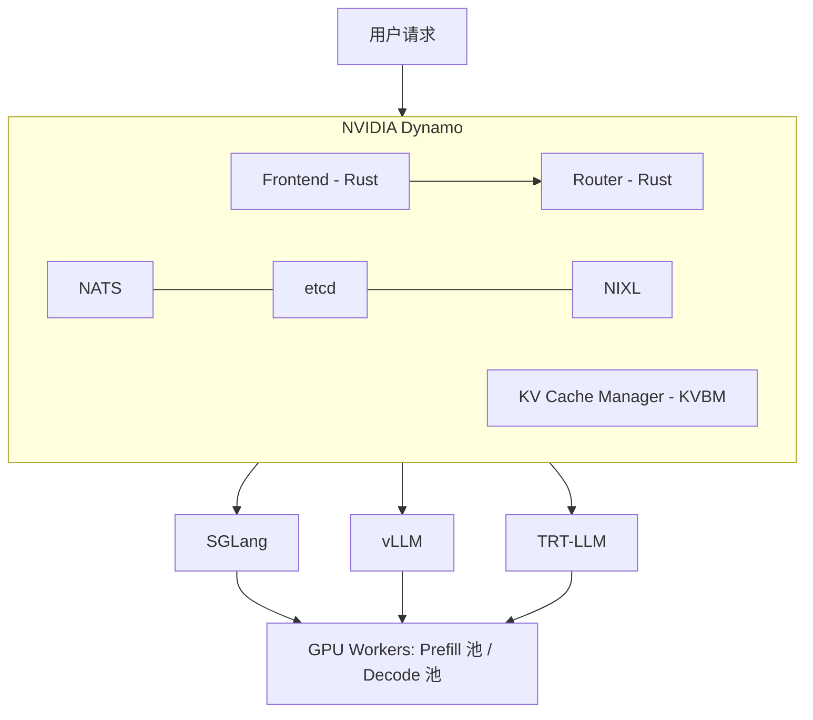

# LLM 推理优化对决：TP vs PD vs Prefix Cache 在 2×H100 NVL 上的实测

> **作者**：魏新宇 (Xinyu Wei)  
> **日期**：2026-04-20  
> **硬件**：Azure NC80adis_H100_v5（2× NVIDIA H100 NVL 95830 MiB，NV12 NVLink）  
> **技术栈**：SGLang 0.5.10.post1 + NVIDIA Dynamo 1.0.1 + NIXL 1.0.1 + NATS v2.11.3 + etcd v3.5.21

---

## 一句话结论

我们在 2×H100 NVL 上用 Qwen3-8B 对比了三种 LLM 推理优化策略：**Tensor Parallel（TP=2）**、**Prefix Cache**、**NVIDIA Dynamo PD 分离（1P1D）**。核心发现：

- **TP=2**：延迟最优 — TTFT -25%，E2E -34%（vs 单卡）。同节点 NVLink 场景的首选。
- **Prefix Cache**：ROI 最高 — 41% TTFT 下降，零配置、零额外硬件。Agent/多轮场景必开。
- **PD 分离**：仅在尾部延迟胜出（P99 ITL -52%），平均指标全输。为大模型多节点设计，不适合小模型 + NVLink。


---

## NVIDIA Dynamo 是什么（30 秒版）

NVIDIA Dynamo 是开源（Apache 2.0）的**分布式推理编排框架**，位于推理引擎（SGLang、vLLM、TRT-LLM）之上。它不是推理引擎——它管理请求路由、KV cache 共享和 Agent 感知调度。



核心能力：**PD 分离** — 将部分 GPU 专用于 prefill（计算 KV cache），其余 GPU 专用于 decode（生成 token）。原理：prefill 是计算密集型，decode 是显存带宽密集型，分开可避免互相干扰。

**来源**：[Dynamo 1.0 Blog](https://developer.nvidia.com/blog/nvidia-dynamo-1-production-ready/) | [Full-Stack Agentic Inference Blog](https://developer.nvidia.com/blog/full-stack-optimizations-for-agentic-inference-with-nvidia-dynamo/) | [GitHub](https://github.com/ai-dynamo/dynamo)

---

## 测试环境

| 项目 | 值 |
|:---|:---|
| **VM** | Azure NC80adis_H100_v5，2× NVIDIA H100 NVL 95830 MiB |
| **互联** | NV12 NVLink（节点内，~900 GB/s 双向） |
| **模型** | Qwen3-8B FP16（16GB，轻松装入单卡 H100 95GB） |
| **引擎** | SGLang 0.5.10.post1，FlashInfer 0.6.7.post3，PyTorch 2.9.1+cu128 |
| **Dynamo** | ai-dynamo 1.0.1，nixl 1.0.1，NATS v2.11.3，etcd v3.5.21 |
| **Benchmark** | `sglang.bench_serving`，random 数据集，1024 输入 / 256 输出 tokens |
| **测试配置** | 单卡、TP=2、Prefix Cache（cold/warm/flush）、Dynamo PD 1P1D |

---

## 结果 1：低并发（50 prompts @ 5 req/s）


| 指标 | 单卡 | TP=2 | Dynamo PD 1P1D |
|:---|:---:|:---:|:---:|
| **Output tok/s** | 541 | **559** | 540 |
| **Mean TTFT** | 43.4 ms | **32.5 ms** | 49.6 ms |
| **Mean E2E** | 871 ms | **576 ms** | 828 ms |
| **P99 ITL** | 35.3 ms | 13.2 ms | **12.5 ms** |

**分析**：
- **TP=2 全面碾压** — 通过 NVLink 将模型切分到 2 张 GPU，每层计算量减半。TTFT 下降 25%，E2E 下降 34%。
- **PD 的 TTFT 甚至比单卡差**（+14%）— 因为 GPU 0 完成 prefill 后，KV cache 必须通过 NIXL 传输到 GPU 1 才能开始 decode，每个请求额外增加 ~6ms 开销。
- **PD 唯一赢的：P99 ITL**（12.5 ms vs 13.2 ms）— decode worker 永不被新请求的 prefill 打断。

**TP=2 为什么赢**：Qwen3-8B 16GB 远低于单卡 H100 的 95GB 容量。模型是计算密集型而非显存密集型。TP=2 直接减半每卡计算量。PD 按角色分（prefill vs decode），但当单卡 prefill 只要 ~30ms 时，用整张卡做 prefill 是浪费。

---

## 结果 2：高并发 — 公平 2 卡对比（200 prompts @ 20 req/s）

公平对比：两种配置都用恰好 2 张 GPU。


| 指标 | TP=2 | Dynamo PD 1P1D | PD vs TP=2 |
|:---|:---:|:---:|:---|
| **Output tok/s** | **2259** | 2179 | -3.5% |
| **Mean TTFT** | **25.3 ms** | 53.0 ms | +109% |
| **Mean E2E** | **849 ms** | 995 ms | +17% |
| **P99 ITL** | 24.6 ms | **11.8 ms** | **-52%** |
| **P95 ITL** | 13.8 ms | **8.2 ms** | **-40%** |

> **公平性说明**：TP=2 使用 `--backend sglang`（原生 `/generate` API），Dynamo PD 使用 `--backend sglang-oai-chat`（`/v1/chat/completions`）。这是结构性限制——Dynamo frontend 只暴露 OpenAI 兼容端点。chat API 的 JSON 解析、chat template、streaming 开销无法与 PD 架构开销分离。

**核心发现**：即使在 4 倍负载下，格局不变——**TP=2 赢平均值，PD 赢尾部延迟**。P99 ITL 差距扩大到 -52%，确认了 PD 的价值主张：decode worker 永不被 prefill 抢占。

---

## 结果 3：Prefix Cache — ROI 最高的优化

不需要额外 GPU，不需要 Dynamo，不需要任何基础设施。只需重复相同的 prompt。


| 指标 | Cold Cache | Warm Cache | Flush 对照 | Cache 收益 |
|:---|:---:|:---:|:---:|:---|
| **Mean TTFT** | 31.9 ms | **18.7 ms** | 31.5 ms | **-41%** |
| **P99 TTFT** | 53.2 ms | **26.1 ms** | 51.6 ms | **-51%** |
| **Max ITL** | 44.0 ms | **17.0 ms** | 43.7 ms | **-61%** |

Flush 对照组（R3）和 Cold（R1）完全一致——证明 Warm cache 的收益来自真实的 cache 命中。SGLang 的 RadixAttention prefix cache 默认开启。

**Agent 场景意义**：多轮对话中，system prompt + 对话历史每轮都重复。Prefix cache 跳过重计算它们的 KV，免费获得 41% TTFT 下降。

---

## 什么时候用（和不用）PD 分离

基于实测数据 + Dynamo 设计意图：

| 场景 | 用 PD？ | 原因 |
|:---|:---:|:---|
| 小模型（8B-13B）+ 同节点 NVLink | **不用** | TP 严格更好。Prefill 不是瓶颈。 |
| 大模型（70B+）+ 多节点 | **用** | Prefill 变成计算密集型，值得专用 GPU。 |
| 严格 P99 ITL SLO（< 15ms） | **可能** | PD 防止 prefill 抢占 decode。 |
| Agent 场景 + tool call（2-30 秒间隔） | **用** | PD + KV cache 钉住防止间隔期驱逐。 |
| 成本敏感，追求最大吞吐/美元 | **不用** | TP 以更简单架构给出相同吞吐。 |

**30ms 法则**：如果单卡 prefill 你的典型输入长度 < 30ms，PD 增加的 KV transfer 开销反而拖后腿。我们的 1024 token prefill 在 H100 上约 ~30ms——正好在临界点。更长 prompt（4K+）或更弱 GPU 上，PD 更有吸引力。

---

## 从 PyPI 部署 Dynamo PD（非 Docker）

我们不用 Docker，纯 pip 包部署了 Dynamo。需要解决三个兼容性问题。

### 基础设施

```bash
# NATS（Dynamo 服务发现的消息总线）
wget -qO nats.tar.gz https://github.com/nats-io/nats-server/releases/download/v2.11.3/nats-server-v2.11.3-linux-amd64.tar.gz
tar xzf nats.tar.gz && cp nats-server-v2.11.3-linux-amd64/nats-server /usr/local/bin/
nats-server -js &

# etcd（分布式配置存储）
wget -qO etcd.tar.gz https://github.com/etcd-io/etcd/releases/download/v3.5.21/etcd-v3.5.21-linux-amd64.tar.gz
tar xzf etcd.tar.gz && cp etcd-v3.5.21-linux-amd64/etcd /usr/local/bin/
etcd &
```

### Dynamo + SGLang 兼容性 Patch

`ai-dynamo==1.0.1` 从 `sglang.srt.utils` 导入 `get_local_ip_auto`、`get_zmq_socket`、`maybe_wrap_ipv6_address`。但 SGLang 0.5.10 将前两者移到了 `sglang.srt.utils.network` 未 re-export，`maybe_wrap_ipv6_address` 则完全不存在。

**修复**：Patch `sglang/srt/utils/__init__.py`：
```python
# 追加到 sglang/srt/utils/__init__.py 末尾
from sglang.srt.utils.network import get_local_ip_auto, get_zmq_socket
def maybe_wrap_ipv6_address(addr):
    return f"[{addr}]" if ":" in addr and not addr.startswith("[") else addr
```

### 启动 PD 分离

```bash
# Frontend（Rust HTTP server + KV 感知路由）
python3 -m dynamo.frontend --router-mode kv --router-reset-states &

# Prefill worker — GPU 0
CUDA_VISIBLE_DEVICES=0 DYN_SYSTEM_PORT=8081 python3 -m dynamo.sglang \
  --model-path /path/to/model --served-model-name Qwen3-8B \
  --page-size 64 --tp 1 --disaggregation-mode prefill --host 0.0.0.0 \
  --kv-events-config '{"publisher":"zmq","topic":"kv-events","endpoint":"tcp://*:5557"}' \
  --disaggregation-transfer-backend nixl &

# Decode worker — GPU 1
CUDA_VISIBLE_DEVICES=1 DYN_SYSTEM_PORT=8083 python3 -m dynamo.sglang \
  --model-path /path/to/model --served-model-name Qwen3-8B \
  --page-size 64 --tp 1 --disaggregation-mode decode --host 0.0.0.0 \
  --kv-events-config '{"publisher":"zmq","topic":"kv-events","endpoint":"tcp://*:5560"}' \
  --disaggregation-transfer-backend nixl &
```

Dynamo 响应中包含 `nvext.worker_id`，分别标明 `prefill_worker_id` 和 `decode_worker_id`——证明这是真正的 PD 分离，不是简单负载均衡。

### 已知问题

| 问题 | 解决方案 |
|:---|:---|
| Dynamo GitHub `main` 需要 `ai-dynamo-runtime==1.1.0`（未发布） | 用 PyPI：`pip install ai-dynamo==1.0.1` |
| SGLang 0.5.10 API 与 Dynamo 1.0.1 不兼容 | Patch `__init__.py`（见上文） |
| `nixl` 不随 `ai-dynamo` 自动安装 | `pip install nixl` 单独安装 |
| Dynamo frontend 只暴露 OpenAI API | benchmark 必须用 `sglang-oai-chat` 后端 |

---

## 复现步骤

```bash
# 1. 搭建环境（安装 SGLang + Dynamo + NATS + etcd + 下载模型）
bash scripts/setup.sh

# 2. 跑全部 benchmark
bash scripts/run_benchmark.sh all

# 3. 生成图表
pip install matplotlib
python3 scripts/generate_charts.py
```

也可以单独跑：`bash scripts/run_benchmark.sh phase1|phase2|phase3|phase5|highload_tp2|highload_pd`

原始 benchmark 日志在 `data/` 目录。

---

## 结论

1. **PD 分离不是万能的** — 它用平均性能换尾部延迟稳定性。小模型 + NVLink 场景下，TP 严格优于 PD。

2. **Prefix Cache 是 Agent/多轮场景下 ROI 最高的优化**：41% TTFT 下降，零配置，零额外硬件。

3. **Dynamo 的价值在于大规模生产**，不在小模型 benchmark。它的真正优势——跨数十个 worker 的 KV 感知路由、Agent 生命周期管理、四层 KV 存储——无法在 2 张 GPU 上展现。

4. **工程挑战是真实的**：从 PyPI 部署 Dynamo 需要 NATS + etcd + NIXL + SGLang 兼容 patch。Docker 路径（`nvcr.io/nvidia/dynamo`）在生产中显著更容易。
