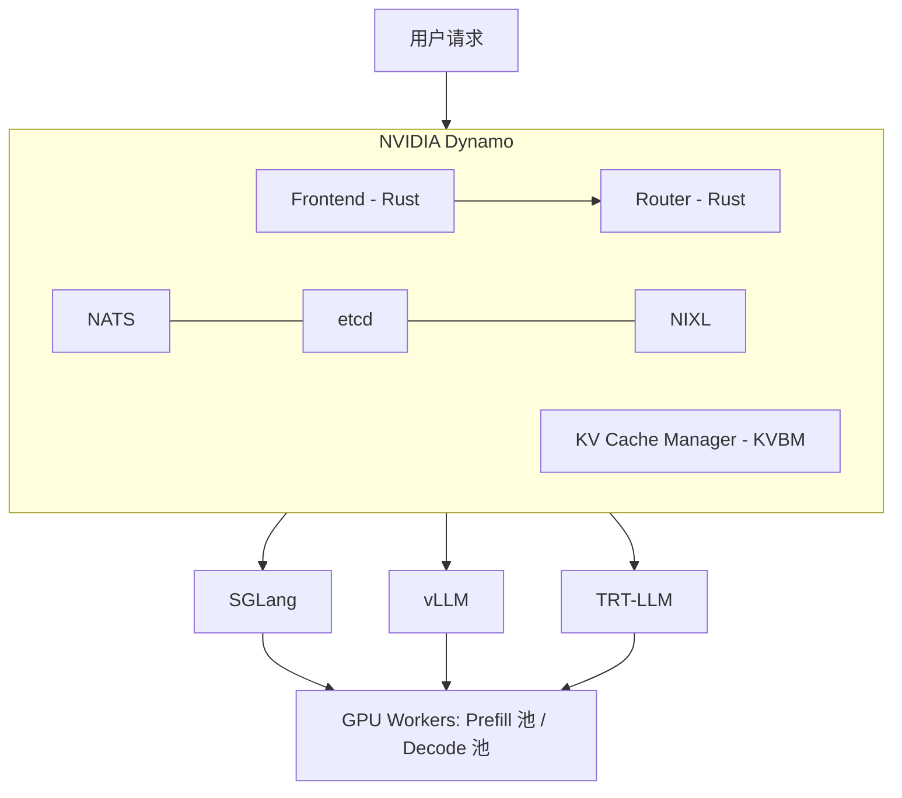
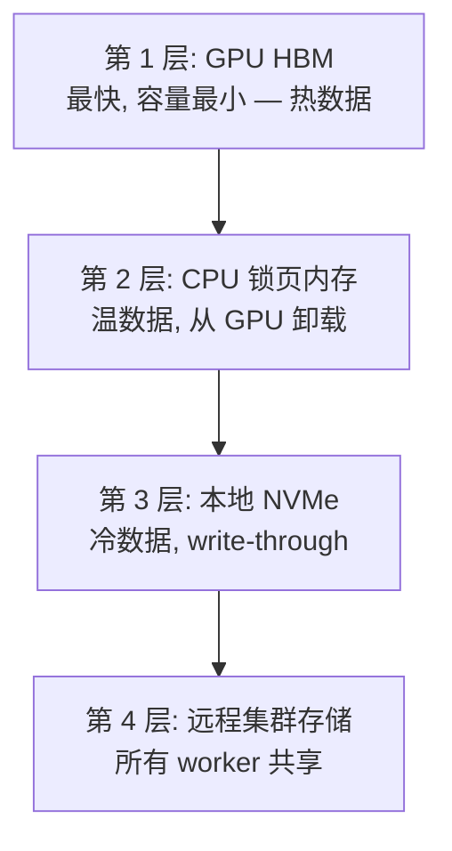
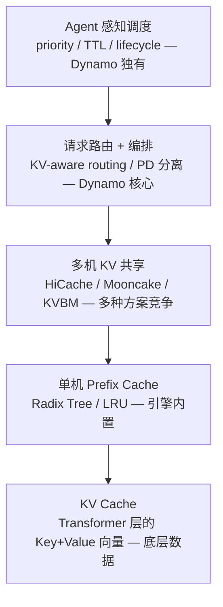

# NVIDIA Dynamo：面向 Agentic AI 的分布式推理编排框架

> **作者**：魏新宇 (Xinyu Wei)
> **日期**：2026-04-19
> **来源**：[Dynamo 1.0 Blog](https://developer.nvidia.com/blog/nvidia-dynamo-1-production-ready/) | [Full-Stack Agentic Inference Blog](https://developer.nvidia.com/blog/full-stack-optimizations-for-agentic-inference-with-nvidia-dynamo/) | [GitHub](https://github.com/ai-dynamo/dynamo)

---

## 概要

NVIDIA Dynamo 是一个**开源的分布式推理编排框架**（Apache 2.0），位于推理引擎（vLLM、SGLang、TRT-LLM）之上，负责协调多 GPU、多节点的 LLM 推理服务。它**不是**推理引擎本身——它管理请求如何路由、KV cache 如何跨 worker 共享、以及 Agent 工作负载如何调度。

| 维度 | 说明 |
|:---|:---|
| **是什么** | 分布式推理编排层 |
| **不是什么** | 推理引擎（它编排 vLLM/SGLang/TRT-LLM） |
| **许可证** | Apache 2.0，完全开源 |
| **GitHub** | https://github.com/ai-dynamo/dynamo |
| **关键指标** | 在 Blackwell 上请求服务量提升 7x（SemiAnalysis InferenceX） |
| **生产用户** | AstraZeneca、字节跳动、Baseten、CoreWeave、Crusoe、DigitalOcean |
| **云平台集成** | Azure AKS、AWS EKS、Google Cloud GKE、阿里云 ACK、Oracle OCI |

---

## 架构总览



### Dynamo vs Ray Serve

Dynamo **不使用 Ray**，有自己的编排栈：

| 组件 | Dynamo | Ray Serve |
|:---|:---|:---|
| 消息总线 | NATS（轻量） | Ray GCS |
| 配置存储 | etcd | Ray Object Store |
| KV 传输 | NIXL（RDMA，零拷贝） | Ray Object Store（共享内存） |
| 路由器 | Rust 实现，KV 感知，170M ops/s | Python Actor |
| K8s 调度 | Grove（拓扑感知） | KubeRay |
| 设计目标 | LLM 推理专用 | 通用分布式计算 |

**注意**：vLLM/SGLang 内部可能仍使用 Ray 做 Tensor Parallel worker 管理。Dynamo 替代的是**外层编排**（请求路由、PD 分离、KV 共享），不替代引擎内部并行。

---

## 核心能力

### 1. Prefill-Decode（PD）分离

将 prefill（处理输入 prompt，构建 KV cache）和 decode（逐 token 生成）拆分到不同 GPU 池，独立扩缩容。

```
                    Dynamo Router
                   （KV-aware 路由）
                    /             \
            Prefill 池            Decode 池
           (GPU Worker 1-N)    (GPU Worker 1-M)
                    \             /
                     NIXL (RDMA)
                   KV Cache 传输
```

- Prefill worker 处理长输入（计算密集型）
- Decode worker 负责 token 生成（显存带宽密集型）
- KV cache 通过 NIXL（RDMA）在池之间传输
- 各池独立扩缩容

**来源**：Dynamo 1.0 Blog — "disaggregated prefill-decode serving"

### 2. KV-Aware Routing（KV 感知路由）+ Flash Indexer

没有缓存感知路由时，多轮对话第 2 轮请求有 ~1/N 的概率落到同一 worker → 其余情况全部重算前缀。

**Flash Indexer**：全局索引，记录哪些 KV cache block 在哪些 worker 上。
- **性能**：170M ops/s（行星级 KV 路由）
- **代价函数**：缓存重叠分数 + decode 队列深度的加权组合
- **可定制**：通过 Python 绑定实现自定义路由策略

**来源**：Full-Stack Agentic Inference Blog — "KV-Aware placement"

### 3. Agent 感知调度（nvext.agent_hints）

传统推理引擎看到的是匿名 token 序列。Agent 框架知道很多推理引擎看不到的上下文。Dynamo 的 `nvext.agent_hints` 打通了这个信息断层：

```json
{
  "nvext": {
    "agent_hints": {
      "priority": 10,
      "osl": 256,
      "speculative_prefill": true
    },
    "cache_control": {
      "type": "ephemeral",
      "ttl": "1h"
    }
  }
}
```

| 字段 | 作用 | 效果 |
|:---|:---|:---|
| `priority` | 请求优先级（越高越重要） | 路由队列排序 + 引擎抢占 |
| `osl` | 预估输出 token 数 | 负载均衡精度提升 |
| `speculative_prefill` | 工具调用快返回时提前预热缓存 | 降低下一轮 TTFT |
| `cache_control.ttl` | 指定时间内保留 KV cache | 防止工具调用间隙缓存被驱逐 |

**餐厅比喻**：
- 没有 Agent 感知 = 后厨收到菜单，不知道 VIP 还是外卖，先来后到
- 有 Agent 感知 = 菜单上写了"VIP 加急"、"客人去打电话 15 分钟回来半成品别扔"、"这 4 个人是一桌前菜一样做一份分四盘"

**来源**：Full-Stack Agentic Inference Blog — "Agent hints: The Harness Orchestrator interface"

### 4. KV Cache 四层存储层级



Block 沿 **write-through 路径**自动流动：GPU → CPU → 磁盘。每个 block 通过**序列哈希去重**注册到全局注册表。一旦注册，block 不可变，任何 worker 可寻址。

**来源**：Full-Stack Agentic Inference Blog — "KV cache as a shared resource"

### 5. 选择性缓存保留（Selective Cache Retention）

不是所有 KV block 都值得保留：

| Block 类型 | 复用频率 | 优先级 |
|:---|:---|:---|
| System prompt + 工具定义 | 每轮都用 | 最高 |
| 对话历史 | 后续轮次 | 高 |
| 推理 token（`<think>`） | 推理结束后零复用（~40% 输出） | 接近零 |
| 子 Agent KV | Agent 终止前使用 | 接近零 |

Dynamo 支持：
- **基于优先级的驱逐**：低优先级 block 先驱逐
- **TTL 固定**：block 在工具调用间隙（2-30 秒）内不被驱逐
- **Token 范围保留**：单请求内分区域控制（TRT-LLM `TokenRangeRetentionConfig`）
- **兼容 Anthropic API**：`cache_control: { type: "ephemeral", ttl: "1h" }`

**来源**：Full-Stack Agentic Inference Blog — "Selective cache retention"

### 6. Agent 生命周期感知

Claude Code session 产生的临时 KV：
- 子 Agent 终止
- 上下文压缩（175K → 40K token）
- 推理循环关闭（`<think>...</think>`）

没有生命周期感知，这些临时 block 和 system prompt 占用同等内存。Dynamo 支持：
- Session 标记 → 子 Agent 终止时优先驱逐
- `<think>` 边界检测 → 跳过 L2 写入，优先于普通 block 驱逐
- 框架驱动的 session 管理

**来源**：Full-Stack Agentic Inference Blog — "Agent lifecycle awareness"

---

## 关键数据（来源：Blog 原文）

### Claude Code KV Cache 指标

| 指标 | 数值 | 来源 |
|:---|:---|:---|
| 单 agent cache hit 率 | 85-97% | Full-Stack Blog Figure 1 |
| 4 个 Opus teammate 聚合 cache hit | 97.2% | Full-Stack Blog |
| Read/write ratio（lead agent 子 agent） | 11.7x | Full-Stack Blog |
| Read/write ratio（teammate） | 5.0x | Full-Stack Blog |
| Teammate vs lead cache hit | 79.4% vs 91.3% | Full-Stack Blog |
| `<think>` token 占输出比例 | ~40% | Full-Stack Blog |

### Dynamo 性能

| 指标 | 数值 | 来源 |
|:---|:---|:---|
| Flash Indexer 吞吐 | 170M ops/s | Full-Stack Blog |
| Agentic 推理 TTFT 降低 | 4x（Hopper，Llama 3.1） | Dynamo 1.0 Blog |
| 吞吐提升 | 1.5x（Hopper，Llama 3.1） | Dynamo 1.0 Blog |
| 优先级标记 TTFT 降低 | 63% p50（中等内存压力下） | Full-Stack Blog |
| 模型启动加速 | 7x（ModelExpress，DeepSeek v3 on H200） | Dynamo 1.0 Blog |
| 请求服务量提升 | 7x（Blackwell，SemiAnalysis InferenceX） | Dynamo 1.0 Blog |
| 多模态 TTFT 改善 | 30%（Qwen3-VL-30B on GB200） | Dynamo 1.0 Blog |

---

## 层级关系：KV Cache → Prefix Cache → Dynamo → Agent 调度



**核心澄清**：
- **KV Cache** 是数据本身（每个 Transformer 层的 Key+Value 向量）
- **Prefix Cache** 是 KV Cache 的复用策略（相同前缀 → 跳过重计算），单机和多机都能做
- **Dynamo** 提供集群级 Prefix Cache（KVBM + Flash Indexer）加上路由 + 调度
- **Agent 感知调度** 在以上基础上加入生命周期上下文（优先级、TTL、session 管理）

---

## Dynamo vs 替代方案

### PD 分离方案对比

| 方案 | 谁在用 | 与 Dynamo 的关系 |
|:---|:---|:---|
| **Dynamo** | Azure/AWS/GCP 企业客户 | NVIDIA 的全栈方案 |
| **Mooncake**（Kimi/月之暗面） | Kimi 生产推理 | 独立开源，向 Dynamo 贡献了 AIConfigurator 代码 |
| **SGLang 原生 disagg** | 学术界 + 中小团队 | SGLang 内置，HiCache 已集成到 Dynamo Router |
| **vLLM 原生 disagg** | 广泛使用 | vLLM 0.6+ 内置，NIXL 已集成 |
| **DeepSeek 自研** | DeepSeek 生产 | 完全自研，未开源 |
| **字节/阿里/腾讯/快手** | 各自平台 | 自研，不依赖开源 |

### 什么时候需要 Dynamo？

| 场景 | 需要 Dynamo？ |
|:---|:---:|
| 单卡跑小模型 | ❌ |
| 单节点 8 卡 TP | ❌ |
| 2-4 个 vLLM 实例 + Nginx | ❌ 基本够用 |
| 8+ 实例生产部署、需要 SLO 保证 | ✅ |
| PD 分离、多节点 | ✅ |
| Agent 场景、KV cache 需要保留/共享 | ✅ |
| K8s 部署 + 自动扩缩容 | ✅ |

---

## 实验计划：NC80 H100 上的 PD 分离实测

### 环境

| 项目 | 详情 |
|:---|:---|
| VM | Azure NC80adis_H100_v5（2× H100 80GB NVLink） |
| 区域 | Spain Central |
| 模型 | Qwen3-8B（FP16 ~16GB/卡） |
| 引擎 | SGLang（首选）或 vLLM |
| 编排器 | NVIDIA Dynamo |

### 测试矩阵

| 阶段 | 测试内容 | 指标 |
|:---:|:---|:---|
| 1 | Baseline：单 GPU，无 Dynamo | TTFT / ITL / TPS |
| 2 | PD 分离：GPU0=Prefill，GPU1=Decode | TTFT / ITL / TPS / KV 传输时间 |
| 3 | Prefix Cache：多轮对话 | Cache hit 率对比 |
| 4 | Agent Hints：priority + TTL | 有/无 hints 的 TTFT 对比 |
| 5 | 工具调用模拟：暂停 15 秒 + 恢复 | 缓存保留率 |

### 状态

- [x] VM resize 到 NC80adis_H100_v5（2026-04-19）
- [x] VM 启动 + GPU 验证（2× H100 NVL 95830 MiB）
- [x] Python venv + SGLang 0.5.10.post1 + PyTorch 2.9.1+cu128 安装完成
- [x] Qwen3-8B 下载完成（16GB，FP16）
- [x] Phase 1：Baseline 单卡 benchmark ✅
- [x] Phase 2：TP=2 双卡 tensor parallel benchmark ✅
- [x] Phase 3：Prefix Cache cold/warm 对比 ✅
- [x] Phase 4：Flush Cache 对照实验 ✅
- [ ] Dynamo 原生 PD 分离（需要从源码安装 Dynamo）
- [ ] Agent Hints / Tool call 模拟（需要 Dynamo）

---

## Benchmark 实测结果（2026-04-20）

### 环境

| 项目 | 值 |
|:---|:---|
| **VM** | Azure NC80adis_H100_v5，Spain Central |
| **GPU** | 2× NVIDIA H100 NVL 95830 MiB（NV12 NVLink） |
| **模型** | Qwen3-8B（FP16，16GB） |
| **引擎** | SGLang 0.5.10.post1 + FlashInfer 0.6.7.post3 |
| **PyTorch** | 2.9.1+cu128 |
| **Benchmark** | `sglang.bench_serving`，random 数据集，50 prompts，rate=5 req/s |
| **输入/输出** | 1024 input tokens / 256 output tokens |

### Phase 1：Baseline（单卡，无 Dynamo）

单 GPU（`CUDA_VISIBLE_DEVICES=0`），SGLang 默认配置。

| 指标 | 值 |
|:---|:---|
| Output 吞吐量 | 541.31 tok/s |
| Total 吞吐量 | 3107.44 tok/s |
| Mean TTFT | 43.42 ms |
| Median TTFT | 38.29 ms |
| P99 TTFT | 199.15 ms |
| Mean TPOT | 7.48 ms |
| Mean ITL | 7.34 ms |
| Mean E2E 延迟 | 870.53 ms |

### Phase 2：TP=2 双卡 Tensor Parallel

两张 GPU 通过 `--tp 2`，模型经 NVLink 分片到 2× H100。

| 指标 | 值 | vs Baseline |
|:---|:---|:---|
| Output 吞吐量 | 559.10 tok/s | +3.3% |
| Total 吞吐量 | 3209.57 tok/s | +3.3% |
| Mean TTFT | 32.47 ms | **-25.2%** |
| Mean TPOT | 4.96 ms | **-33.7%** |
| Mean ITL | 4.82 ms | **-34.3%** |
| Mean E2E 延迟 | 575.51 ms | **-33.9%** |

**分析**：TP=2 显著降低延迟（TTFT -25%，TPOT -34%，E2E -34%），因为模型切成两半 → 每张卡计算量减半。吞吐量仅微增 3.3%，因为 Qwen3-8B 16GB 轻松装入单张 H100 95GB — 单卡不是显存瓶颈，NVLink 通信开销抵消了并行收益。

### Phase 3-4：Prefix Cache（Cold → Warm → Flush 对照）

单卡，相同 seed=42 三轮。SGLang 的 RadixAttention prefix cache 默认开启。

| 指标 | R1: Cold Cache | R2: Warm Cache | R3: Flush Cache | Cache 收益 |
|:---|:---|:---|:---|:---|
| Mean TTFT | 31.89 ms | **18.65 ms** | 31.51 ms | **-41.5%** |
| P99 TTFT | 53.24 ms | **26.11 ms** | 51.59 ms | **-51.0%** |
| Mean E2E | 865.29 ms | **792.04 ms** | 865.57 ms | **-8.5%** |
| Mean TPOT | 7.10 ms | **6.60 ms** | 7.10 ms | -7.0% |
| Max ITL | 44.02 ms | **17.01 ms** | 43.74 ms | **-61.3%** |
| Output tok/s | 523.79 | 526.20 | 523.70 | +0.5% |

**分析**：Prefix Cache 大幅降低 TTFT（-41%），因为缓存命中的 token 前缀跳过 prefill 计算。Flush Cache 对照组（R3）和 Cold（R1）完全一致 — 证明 R2 的提升来自真实的 cache 命中，不是噪声。Max ITL 下降 61%，显示尾部延迟显著改善。

### 核心发现

1. **TP=2 是延迟优化而非吞吐优化**（针对小模型 8B + 大显存 H100 95GB）。模型是计算密集型而非显存密集型，TP 主要减半每 token 延迟。

2. **Prefix Cache 是多轮/Agent 场景下 ROI 最高的优化**。41% TTFT 下降，零配置（SGLang 默认开启）。这验证了 Dynamo 的设计哲学 — KV cache 管理是关键层。

3. **SGLang 原生 PD 分离不支持 CLI 标志**（`--gpu-ids`、`--dp 2 --enable-dp-attention` 均失败）。真正的 PD 分离需要 Dynamo 编排层或 SGLang 的 disaggregated serving 模块。

4. **Dynamo 的价值主张在概念层面得到验证**：benchmark 证明 cache 感知路由（Phase 3-4）和计算分布（Phase 2）分别独立改善不同指标。Dynamo 组合二者 + 加入 Agent 生命周期感知。

### Phase 5：Dynamo PD 分离（1 Prefill + 1 Decode）

使用 NVIDIA Dynamo 编排的真正 PD 分离：Frontend（Rust，KV router）+ Prefill worker（GPU 0）+ Decode worker（GPU 1）+ NATS + etcd + NIXL KV 传输。

**基础设施**：NATS v2.11.3（JetStream）、etcd v3.5.21、ai-dynamo 1.0.1、nixl 1.0.1

**低并发（50 prompts @ 5 req/s）**：

| 指标 | Phase 1: 单卡 | Phase 5: Dynamo PD 1P1D | 变化 |
|:---|:---|:---|:---|
| Output tok/s | 541.31 | 539.70 | -0.3% |
| Mean TTFT | 43.42 ms | 49.61 ms | +14.3% |
| Mean E2E | 870.53 ms | 827.68 ms | -4.9% |
| P99 ITL | 35.25 ms | **12.49 ms** | **-64.6%** |

> **注意**：此对比为 1 卡（Phase 1）vs 2 卡（Phase 5）。公平的 2 卡对 2 卡对比见下方高并发节。

**高并发 — 公平 2 卡对比（200 prompts @ 20 req/s）**：

| 指标 | TP=2（Tensor Parallel） | Dynamo PD 1P1D | PD vs TP=2 |
|:---|:---|:---|:---|
| Output tok/s | **2259.35** | 2179.46 | -3.5% |
| Mean TTFT | **25.29 ms** | 53.01 ms | +109% ❌ |
| Mean E2E | **848.82 ms** | 995.12 ms | +17% ❌ |
| P99 ITL | 24.56 ms | **11.78 ms** | **-52%** ✅ |
| P95 ITL | 13.82 ms | **8.24 ms** | **-40%** ✅ |

> **公平性说明**：TP=2 使用 `--backend sglang`（原生 `/generate` API），Dynamo PD 使用 `--backend sglang-oai-chat`（`/v1/chat/completions`）。这是结构性限制 — Dynamo frontend 只暴露 OpenAI 兼容端点。chat API 额外的 JSON 解析、chat template、streaming 开销无法分离。因此 TTFT/E2E 差异包含 PD 架构开销 + API 层开销两个因素。

**分析**：TP=2 在平均指标（吞吐、TTFT、E2E）上全面胜出，因为 Qwen3-8B 太小 — 单卡 prefill 1024 tokens 仅需 ~30ms，不值得用专门 GPU 来做。但 **PD 唯一的优势 — P95/P99 ITL 下降 40-52%** 是有意义的：decode worker 永不被新请求的 prefill 打断，token 间延迟更稳定。

**PD 分离适用场景**：大模型（70B+）prefill 计算量大、多节点部署无 NVLink、高并发生产环境有严格尾部延迟 SLO。小模型 + 同节点 NVLink 场景下，TP=2 严格优于 PD。

### Dynamo 部署详情

从 PyPI 包成功部署 Dynamo PD 分离（非 Docker）：

```
# 基础设施
nats-server v2.11.3（JetStream 启用）
etcd v3.5.21

# Dynamo 组件
python3 -m dynamo.frontend --router-mode kv --router-reset-states     # Rust frontend，端口 8000
CUDA_VISIBLE_DEVICES=0 python3 -m dynamo.sglang --disaggregation-mode prefill   # GPU 0
CUDA_VISIBLE_DEVICES=1 python3 -m dynamo.sglang --disaggregation-mode decode    # GPU 1
# 两个 worker 都使用 --disaggregation-transfer-backend nixl 做 KV 传输
```

**解决的兼容性问题**：
- `ai-dynamo==1.0.1`（PyPI）需要 `get_local_ip_auto`、`get_zmq_socket`、`maybe_wrap_ipv6_address`，但 SGLang 0.5.10 将它们移到了 `sglang.srt.utils.network` 未 re-export。通过 patch `__init__.py` 修复。
- `nixl` 需单独安装（`pip install nixl`）。
- Dynamo GitHub `main` 分支需要 `ai-dynamo-runtime==1.1.0`（未发布），使用 PyPI `ai-dynamo==1.0.1` 代替。

---

