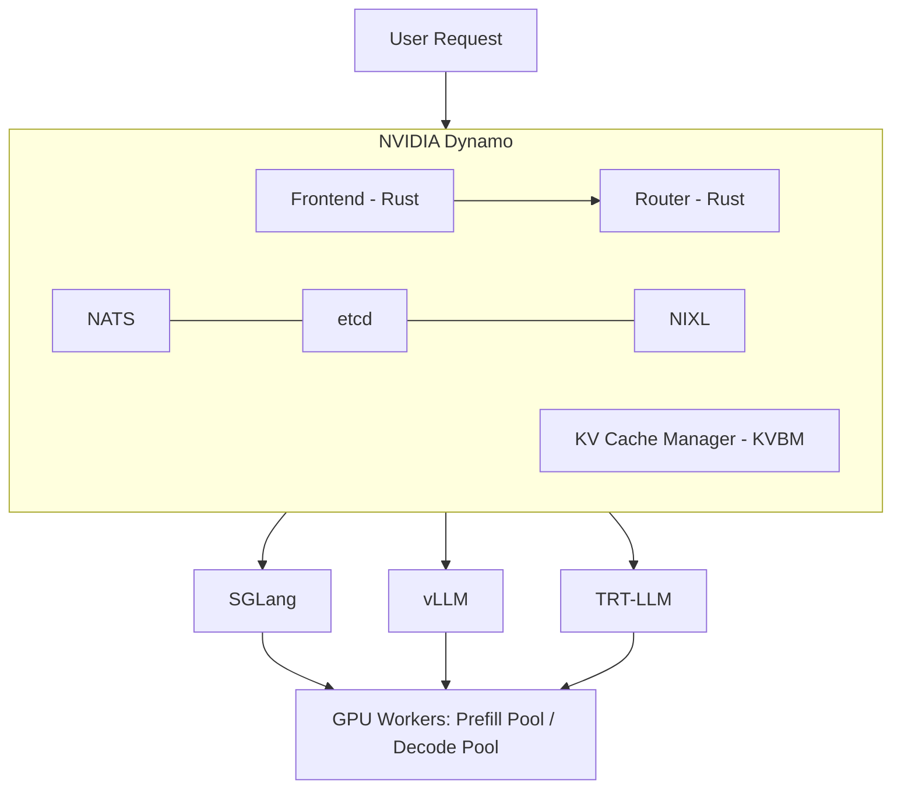
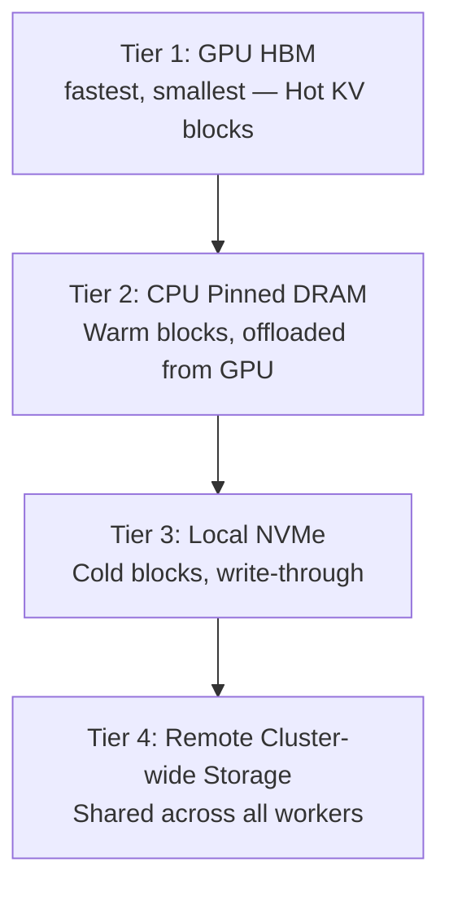
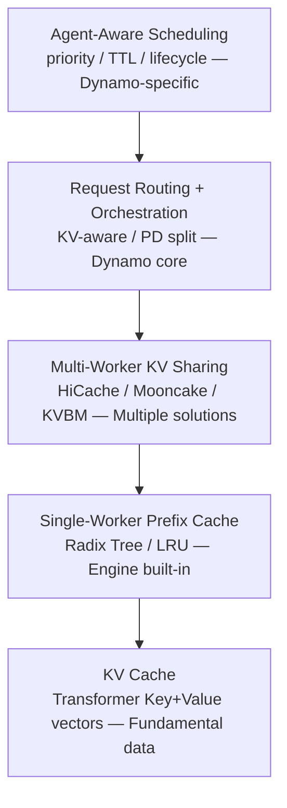

# NVIDIA Dynamo: Distributed Inference Orchestration for Agentic AI

> **Author**: Xinyu Wei (魏新宇)
> **Date**: 2026-04-19
> **Sources**: [Dynamo 1.0 Blog](https://developer.nvidia.com/blog/nvidia-dynamo-1-production-ready/) | [Full-Stack Agentic Inference Blog](https://developer.nvidia.com/blog/full-stack-optimizations-for-agentic-inference-with-nvidia-dynamo/) | [GitHub](https://github.com/ai-dynamo/dynamo)

---

## Executive Summary

NVIDIA Dynamo is an **open-source distributed inference orchestration framework** (Apache 2.0) that sits above inference engines (vLLM, SGLang, TRT-LLM) to coordinate multi-GPU, multi-node LLM serving. It is **not** an inference engine itself — it manages how requests are routed, how KV cache is shared across workers, and how agent workloads are scheduled.

| Aspect | Detail |
|:---|:---|
| **What it is** | Distributed inference orchestration layer |
| **What it is NOT** | An inference engine (it orchestrates vLLM/SGLang/TRT-LLM) |
| **License** | Apache 2.0, fully open-source |
| **GitHub** | https://github.com/ai-dynamo/dynamo |
| **Key metric** | Up to 7x more requests served on Blackwell (SemiAnalysis InferenceX) |
| **Production adopters** | AstraZeneca, ByteDance, Baseten, CoreWeave, Crusoe, DigitalOcean |
| **Cloud integrations** | Azure AKS, AWS EKS, Google Cloud GKE, Alibaba Cloud ACK, Oracle OCI |

---

## Architecture Overview



### Dynamo vs Ray Serve

Dynamo does **not** use Ray. It has its own orchestration stack:

| Component | Dynamo | Ray Serve |
|:---|:---|:---|
| Messaging | NATS (lightweight) | Ray GCS |
| Config store | etcd | Ray Object Store |
| KV transfer | NIXL (RDMA, zero-copy) | Ray Object Store (shared memory) |
| Router | Rust, KV-aware, 170M ops/s | Python Actor-based |
| K8s scheduling | Grove (topology-aware) | KubeRay |
| Design target | LLM inference specialized | General-purpose distributed compute |

**Note**: vLLM/SGLang may still use Ray internally for Tensor Parallel worker management. Dynamo replaces the **outer orchestration layer** (request routing, PD disaggregation, KV sharing), not the engine's internal parallelism.

---

## Core Capabilities

### 1. Prefill-Decode (PD) Disaggregation

Separates prefill (processing input prompt, building KV cache) and decode (token generation) into different GPU pools with independent scaling.

```
                    Dynamo Router
                   (KV-aware routing)
                    /             \
            Prefill Pool        Decode Pool
           (GPU Worker 1-N)    (GPU Worker 1-M)
                    \             /
                     NIXL (RDMA)
                   KV Cache transfer
```

- Prefill workers handle long input processing (compute-bound)
- Decode workers handle token generation (memory-bandwidth-bound)
- KV cache transferred via NIXL (RDMA) between pools
- Each pool scales independently based on workload

**Source**: Dynamo 1.0 Blog — "disaggregated prefill-decode serving"

### 2. KV-Aware Routing + Flash Indexer

Without cache-aware routing, turn 2 of a conversation has a ~1/N chance of landing on the same worker as turn 1. Every miss = full prefix recomputation.

**Flash Indexer**: Global index of which KV cache blocks exist on which workers.
- **Performance**: 170M ops/s (planetary-scale KV routing)
- **Cost function**: Combines cache overlap score + decode queue depth
- **Tunable**: Custom routing strategies via Python bindings

**Source**: Full-Stack Agentic Inference Blog — "KV-Aware placement"

### 3. Agent-Aware Scheduling (nvext.agent_hints)

Traditional inference sees anonymous tokenized requests. Agent harnesses have context that inference never sees. Dynamo's `nvext.agent_hints` bridges this gap:

```json
{
  "nvext": {
    "agent_hints": {
      "priority": 10,
      "osl": 256,
      "speculative_prefill": true
    },
    "cache_control": {
      "type": "ephemeral",
      "ttl": "1h"
    }
  }
}
```

| Field | Purpose | Effect |
|:---|:---|:---|
| `priority` | Request importance (higher = more important) | Router queue ordering + engine preemption |
| `osl` | Expected output sequence length | Load balancing accuracy |
| `speculative_prefill` | Pre-warm cache before tool call returns | Reduces TTFT on next turn |
| `cache_control.ttl` | Pin KV cache for specified duration | Prevents eviction during tool call gaps |

**Source**: Full-Stack Agentic Inference Blog — "Agent hints: The Harness Orchestrator interface"

### 4. KV Cache 4-Tier Storage Hierarchy



Blocks follow a **write-through path**: GPU → CPU → disk automatically. Each block is **deduplicated by sequence hash** in a global registry. Once registered, a block is immutable and addressable by any worker.

**Source**: Full-Stack Agentic Inference Blog — "KV cache as a shared resource"

### 5. Selective Cache Retention

Not all KV blocks are equal:

| Block type | Reuse frequency | Priority |
|:---|:---|:---|
| System prompt + tool definitions | Every turn | Highest |
| Conversation history | Subsequent turns | High |
| Thinking/reasoning tokens (`<think>`) | Zero after reasoning loop closes (~40% of output) | Near-zero |
| Subagent KV | Until agent terminates | Near-zero |

Dynamo supports:
- **Priority-based eviction**: Lower-priority blocks evicted first
- **TTL pinning**: Blocks survive tool call gaps (2-30 seconds)
- **Token-range retention**: Per-region control within a single request (TRT-LLM `TokenRangeRetentionConfig`)
- **Anthropic-compatible API**: `cache_control: { type: "ephemeral", ttl: "1h" }`

**Source**: Full-Stack Agentic Inference Blog — "Selective cache retention"

### 6. Agent Lifecycle Awareness

A Claude Code session generates ephemeral KV from:
- Subagent termination
- Context summarization (175K → 40K tokens)
- Closed reasoning loops (`<think>...</think>`)

Without lifecycle awareness, these blocks occupy the same memory as high-value system prompt blocks. Dynamo enables:
- Session tagging for subagent KV → first to evict on termination
- `<think>` boundary detection → skip L2 write-back, evict before normal blocks
- Harness-driven session management

**Source**: Full-Stack Agentic Inference Blog — "Agent lifecycle awareness"

---

## Key Data Points (from Blog Original Text)

### Claude Code KV Cache Metrics

| Metric | Value | Source |
|:---|:---|:---|
| Single agent cache hit rate | 85-97% | Full-Stack Blog Figure 1 |
| 4 Opus teammates aggregate cache hit | 97.2% | Full-Stack Blog |
| Read/write ratio (lead agent subagents) | 11.7x | Full-Stack Blog |
| Read/write ratio (teammates) | 5.0x | Full-Stack Blog |
| Teammate vs lead cache hit | 79.4% vs 91.3% | Full-Stack Blog |
| `<think>` tokens as % of output | ~40% | Full-Stack Blog |

### Dynamo Performance

| Metric | Value | Source |
|:---|:---|:---|
| Flash Indexer throughput | 170M ops/s | Full-Stack Blog |
| Agentic inference TTFT reduction | 4x (Hopper, Llama 3.1) | Dynamo 1.0 Blog |
| Throughput improvement | 1.5x (Hopper, Llama 3.1) | Dynamo 1.0 Blog |
| Priority tagging TTFT reduction | 63% p50 under memory pressure | Full-Stack Blog |
| Model startup acceleration | 7x (ModelExpress, DeepSeek v3 on H200) | Dynamo 1.0 Blog |
| Requests served improvement | 7x on Blackwell (SemiAnalysis InferenceX) | Dynamo 1.0 Blog |
| Multimodal TTFT improvement | 30% (Qwen3-VL-30B on GB200) | Dynamo 1.0 Blog |

### Industry Agent Adoption

| Company | Agent metric | Source |
|:---|:---|:---|
| Stripe | 1,300+ PRs/week from agents | Full-Stack Blog (citing Stripe blog) |
| Ramp | 30% of merged PRs from agents | Full-Stack Blog (citing InfoQ) |
| Spotify | 650+ agent-generated PRs/month | Full-Stack Blog (citing Spotify Engineering) |

---

## Relationship: KV Cache → Prefix Cache → Dynamo → Agent Scheduling



**Key clarifications**:
- **KV Cache** is the data itself (Key+Value vectors from each Transformer layer)
- **Prefix Cache** is a reuse strategy for KV Cache (same prefix → skip recomputation). Works at single-worker and multi-worker levels
- **Dynamo** provides cluster-level Prefix Cache (KVBM + Flash Indexer) plus routing + scheduling
- **Agent-aware scheduling** adds lifecycle context on top (priority, TTL, session management)

---

## Dynamo vs Alternatives

### For PD Disaggregation

| Solution | Who uses it | Relationship to Dynamo |
|:---|:---|:---|
| **Dynamo** | Azure/AWS/GCP enterprise customers | NVIDIA's full-stack solution |
| **Mooncake** (Kimi/Moonshot) | Kimi production inference | Independent, contributed AIConfigurator code to Dynamo |
| **SGLang native disagg** | Academic + small teams | SGLang built-in, HiCache integrated into Dynamo Router |
| **vLLM native disagg** | Widely adopted | vLLM 0.6+ built-in, NIXL integrated |
| **DeepSeek self-built** | DeepSeek production | Fully proprietary, not open-sourced |
| **ByteDance/Alibaba/Tencent** | Their own platforms | Self-built, not dependent on open-source |

### When Do You Need Dynamo?

| Scenario | Need Dynamo? |
|:---|:---:|
| Single GPU, small model | ❌ |
| Single node, 8-GPU TP | ❌ |
| 2-4 vLLM instances + Nginx | ❌ Probably fine |
| 8+ instances, production SLO requirements | ✅ |
| PD disaggregation, multi-node | ✅ |
| Agent workloads with KV retention/sharing | ✅ |
| K8s deployment with auto-scaling | ✅ |

---

## Experimental Plan: PD Disaggregation on NC80 H100

### Environment

| Item | Detail |
|:---|:---|
| VM | Azure NC80adis_H100_v5 (2× H100 80GB NVLink) |
| Location | Spain Central |
| Model | Qwen3-8B (FP16 ~16GB per card) |
| Engine | SGLang (preferred) or vLLM |
| Orchestrator | NVIDIA Dynamo |

### Test Matrix

| Phase | Test | Metrics |
|:---:|:---|:---|
| 1 | Baseline: Single GPU, no Dynamo | TTFT, ITL, TPS |
| 2 | PD Disaggregation: GPU0=Prefill, GPU1=Decode | TTFT, ITL, TPS, KV transfer time |
| 3 | Prefix Cache: Multi-turn conversation | Cache hit rate comparison |
| 4 | Agent Hints: priority + TTL pinning | TTFT with/without hints |
| 5 | Tool call simulation: 15s pause + resume | Cache retention rate |

### Status

- [x] VM resized to NC80adis_H100_v5 (2026-04-19)
- [x] VM started and GPU verified (2× H100 NVL 95830 MiB each)
- [x] Python venv created + SGLang 0.5.10.post1 + PyTorch 2.9.1+cu128 installed
- [x] Qwen3-8B downloaded (16GB, FP16)
- [x] Phase 1: Baseline single GPU benchmark ✅
- [x] Phase 2: TP=2 dual GPU tensor parallel benchmark ✅
- [x] Phase 3: Prefix Cache cold vs warm benchmark ✅
- [x] Phase 4: Flush Cache control benchmark ✅
- [ ] Dynamo native PD disaggregation (requires Dynamo install from source)
- [ ] Agent Hints / Tool call simulation (requires Dynamo)

---

## Benchmark Results (2026-04-20)

### Environment

| Item | Value |
|:---|:---|
| **VM** | Azure NC80adis_H100_v5, Spain Central |
| **GPUs** | 2× NVIDIA H100 NVL 95830 MiB (NV12 NVLink) |
| **Model** | Qwen3-8B (FP16, 16GB) |
| **Engine** | SGLang 0.5.10.post1 + FlashInfer 0.6.7.post3 |
| **PyTorch** | 2.9.1+cu128 |
| **Benchmark** | `sglang.bench_serving`, random dataset, 50 prompts, rate=5 req/s |
| **Input/Output** | 1024 input tokens / 256 output tokens |

### Phase 1: Baseline (Single GPU, No Dynamo)

Single GPU (GPU 0 only via `CUDA_VISIBLE_DEVICES=0`), SGLang default settings.

| Metric | Value |
|:---|:---|
| Output throughput | 541.31 tok/s |
| Total throughput | 3107.44 tok/s |
| Mean TTFT | 43.42 ms |
| Median TTFT | 38.29 ms |
| P99 TTFT | 199.15 ms |
| Mean TPOT | 7.48 ms |
| Mean ITL | 7.34 ms |
| Mean E2E Latency | 870.53 ms |
| Peak concurrent | 16 |

### Phase 2: TP=2 Dual GPU Tensor Parallel

Both GPUs with `--tp 2`, model sharded across 2× H100 via NVLink.

| Metric | Value | vs Baseline |
|:---|:---|:---|
| Output throughput | 559.10 tok/s | +3.3% |
| Total throughput | 3209.57 tok/s | +3.3% |
| Mean TTFT | 32.47 ms | **-25.2%** |
| Median TTFT | 23.34 ms | -39.0% |
| Mean TPOT | 4.96 ms | **-33.7%** |
| Mean ITL | 4.82 ms | **-34.3%** |
| Mean E2E Latency | 575.51 ms | **-33.9%** |
| Peak concurrent | 16 | — |

**Analysis**: TP=2 significantly reduces latency (TTFT -25%, TPOT -34%, E2E -34%) because model is split across 2 GPUs → each GPU computes half the layers. Throughput gain is minimal (+3.3%) because Qwen3-8B at 16GB easily fits in single H100 95GB — single GPU is not memory-bound. NVLink communication overhead offsets the parallel compute benefit for throughput.

### Phase 3-4: Prefix Cache (Cold → Warm → Flush Control)

Single GPU, same seed=42 across rounds. SGLang's RadixAttention prefix cache is enabled by default.

| Metric | R1: Cold Cache | R2: Warm Cache | R3: Flush Cache | Cache Benefit |
|:---|:---|:---|:---|:---|
| Mean TTFT | 31.89 ms | **18.65 ms** | 31.51 ms | **-41.5%** |
| P99 TTFT | 53.24 ms | **26.11 ms** | 51.59 ms | **-51.0%** |
| Mean E2E | 865.29 ms | **792.04 ms** | 865.57 ms | **-8.5%** |
| Mean TPOT | 7.10 ms | **6.60 ms** | 7.10 ms | -7.0% |
| Max ITL | 44.02 ms | **17.01 ms** | 43.74 ms | **-61.3%** |
| Output tok/s | 523.79 | 526.20 | 523.70 | +0.5% |

**Analysis**: Prefix Cache dramatically reduces TTFT (-41%) by skipping prefill computation for cached token prefixes. The flush-cache control (R3) confirms the improvement is real — R3 matches R1 exactly, proving R2's gains come from cache hits, not noise. Max ITL drops 61%, showing tail latency improvement. Throughput is unchanged (expected — cache saves compute latency, not bandwidth).

### Key Findings

1. **TP=2 is a latency play, not throughput play** for small models (8B) on large GPUs (H100 95GB). The model is compute-bound, not memory-bound, so TP mainly halves per-token latency.

2. **Prefix Cache is the highest-ROI optimization** for multi-turn/agent workloads. 41% TTFT reduction with zero configuration (SGLang default). This validates Dynamo's design philosophy — KV cache management is the critical layer.

3. **SGLang native PD disaggregation is not supported via CLI flags** (`--gpu-ids`, `--dp 2 --enable-dp-attention` both fail). True PD disaggregation requires Dynamo's orchestration layer or SGLang's disaggregated serving module.

4. **Dynamo's value proposition is validated at the concept level**: the benchmarks show that cache-aware routing (Phase 3-4) and compute distribution (Phase 2) each independently improve different metrics. Dynamo combines both + adds agent lifecycle awareness.

### Phase 5: Dynamo PD Disaggregation (1 Prefill + 1 Decode)

True PD disaggregation using NVIDIA Dynamo orchestration: Frontend (Rust, KV router) + Prefill worker (GPU 0) + Decode worker (GPU 1) + NATS + etcd + NIXL KV transfer.

**Infrastructure**: NATS v2.11.3 (JetStream), etcd v3.5.21, ai-dynamo 1.0.1, nixl 1.0.1

**Low concurrency (50 prompts @ 5 req/s)**:

| Metric | Phase 1: Single GPU | Phase 5: Dynamo PD 1P1D | Change |
|:---|:---|:---|:---|
| Output tok/s | 541.31 | 539.70 | -0.3% |
| Mean TTFT | 43.42 ms | 49.61 ms | +14.3% |
| Mean E2E | 870.53 ms | 827.68 ms | -4.9% |
| P99 ITL | 35.25 ms | **12.49 ms** | **-64.6%** |

> **Note**: This comparison is between 1 GPU (Phase 1) and 2 GPUs (Phase 5). See high-concurrency section for fair 2v2 comparison.

**High concurrency — fair 2-GPU comparison (200 prompts @ 20 req/s)**:

| Metric | TP=2 (Tensor Parallel) | Dynamo PD 1P1D | PD vs TP=2 |
|:---|:---|:---|:---|
| Output tok/s | **2259.35** | 2179.46 | -3.5% |
| Mean TTFT | **25.29 ms** | 53.01 ms | +109% ❌ |
| Mean E2E | **848.82 ms** | 995.12 ms | +17% ❌ |
| P99 ITL | 24.56 ms | **11.78 ms** | **-52%** ✅ |
| P95 ITL | 13.82 ms | **8.24 ms** | **-40%** ✅ |

> **Fairness note**: TP=2 uses `--backend sglang` (native `/generate` API), while Dynamo PD uses `--backend sglang-oai-chat` (`/v1/chat/completions`). This is a structural limitation — Dynamo frontend only exposes OpenAI-compatible endpoints. The chat API adds JSON parsing, chat template, and streaming overhead. Therefore TTFT/E2E differences include both PD architecture overhead and API layer overhead, which cannot be separated in this setup.

**Analysis**: TP=2 wins on average metrics (throughput, TTFT, E2E) because Qwen3-8B is too small for PD to shine — single-GPU prefill of 1024 tokens takes only ~30ms, not a bottleneck worth dedicating a separate GPU to. However, **PD's sole advantage — P95/P99 ITL reduction (40-52%)** — is significant: the decode worker is never interrupted by new prefill batches, producing more stable token-to-token latency.

**When PD disaggregation makes sense**: Large models (70B+) where prefill is compute-heavy, multi-node deployments without NVLink, high-concurrency production with strict SLO on tail latency. For small models on same-node NVLink, TP=2 is strictly better.

### Dynamo Deployment Details

Successfully deployed Dynamo PD disaggregation from PyPI packages (not Docker):

```
# Infrastructure
nats-server v2.11.3 (JetStream enabled)
etcd v3.5.21

# Dynamo components
python3 -m dynamo.frontend --router-mode kv --router-reset-states     # Rust frontend, port 8000
CUDA_VISIBLE_DEVICES=0 python3 -m dynamo.sglang --disaggregation-mode prefill   # GPU 0
CUDA_VISIBLE_DEVICES=1 python3 -m dynamo.sglang --disaggregation-mode decode    # GPU 1
# Both workers use --disaggregation-transfer-backend nixl for KV transfer
```

**Compatibility issues resolved**:
- `ai-dynamo==1.0.1` (PyPI) requires `get_local_ip_auto`, `get_zmq_socket`, `maybe_wrap_ipv6_address` from `sglang.srt.utils`, but SGLang 0.5.10 moved them to `sglang.srt.utils.network` without re-exporting. Fixed by patching `__init__.py`.
- `nixl` must be installed separately (`pip install nixl`).
- Dynamo GitHub `main` branch requires `ai-dynamo-runtime==1.1.0` (not yet released). Use PyPI `ai-dynamo==1.0.1` instead.

---

## Three-Layer Architecture Deep Dive

### Layer 1: Frontend

**Multi-protocol support**: Dynamo serves `v1/chat/completions`, `v1/responses`, and `v1/messages` through a common internal representation. A single deployment can act as backend for any agent harness (Claude Code, Codex, OpenClaw).

**Agent hints extension**: `nvext.agent_hints` attaches structured metadata to requests across all three API endpoints. The router and runtime use this context for agent-aware scheduling and caching.

**Source**: Full-Stack Blog — "Layer 1: The frontend"

### Layer 2: Router

**KV-aware placement**: Global Flash Indexer (170M ops/s) tracks per-worker KV block locations. Router selects worker that minimizes combined cost of cache miss + decode load.

**Priority scheduling**: `BinaryHeap<QueueEntry>` ordered by effective arrival time. Higher priority = appears as if arrived earlier. Below load threshold, requests bypass queue entirely.

**Custom routing strategies**: Python bindings expose `best_worker()`, `get_potential_loads()`, and `generate()` for domain-specific routing. NeMo Agent Toolkit built a Thompson Sampling bandit router achieving 4x TTFT reduction.

**Source**: Full-Stack Blog — "Layer 2: The router"

### Layer 3: KV Cache Management

**Problem**: Default LRU eviction treats all blocks identically. A 2-30 second tool call pause can age out an agent's entire prefix.

**Solution stack**:
1. **4-tier storage** (GPU → CPU → NVMe → Remote) with write-through and deduplication
2. **Selective retention** (priority, TTL, token-range control)
3. **Lifecycle awareness** (session tagging, `<think>` detection, subagent eviction)
4. **Prefetch hooks** (harness signals "bring these blocks to GPU ahead of next request")

**Source**: Full-Stack Blog — "Layer 3: KV cache management"

