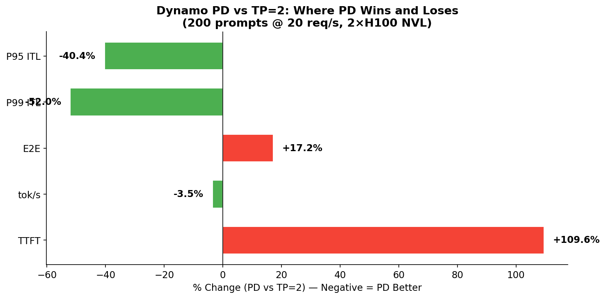
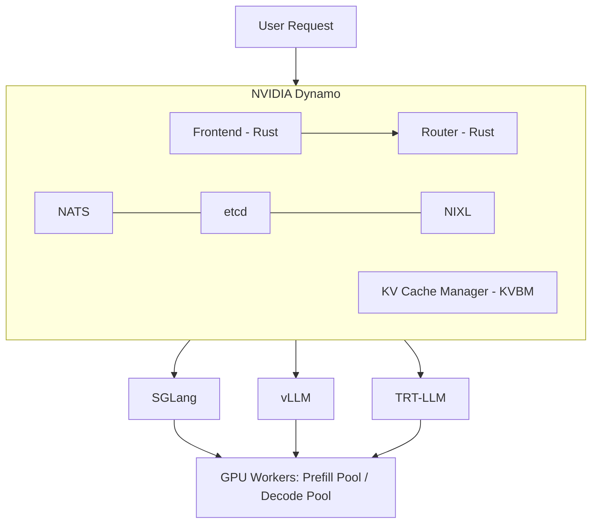
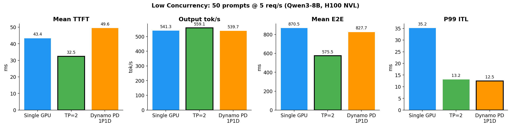
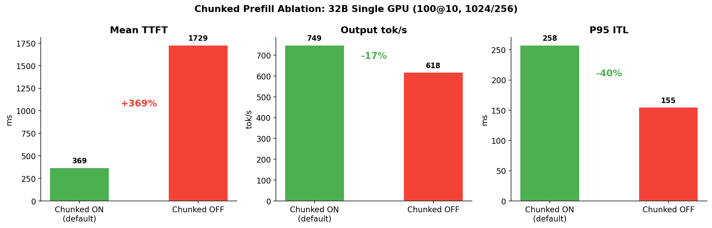
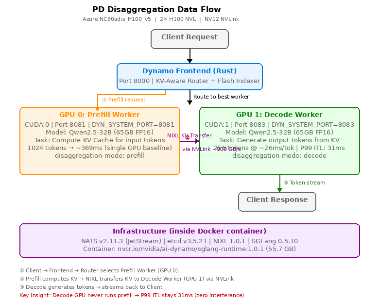

# Disaggregated Inference in Practice: PD Separation Architecture, Benchmarks, and Deployment on NC80 H100

> **Author**: Xinyu Wei (魏新宇)  
> **Date**: 2026-04-20  
> **Hardware**: Azure NC80adis_H100_v5 (2× NVIDIA H100 NVL 95830 MiB, NV12 NVLink)  
> **Stack**: SGLang 0.5.10.post1 + NVIDIA Dynamo 1.0.1 + NIXL 1.0.1 + NATS v2.11.3 + etcd v3.5.21

---

## TL;DR

We benchmarked LLM inference optimization strategies on 2×H100 NVL with two models — **Qwen3-8B** (Results 1-3) and **Qwen2.5-32B** (Results 4-5). Strategies tested: **TP=2**, **Prefix Cache**, **NVIDIA Dynamo PD Disaggregation**, **FP8 KV Cache**, and **Chunked Prefill ON/OFF**.

- **TP=2**: Best throughput and TTFT at all model sizes. The go-to choice for same-node NVLink.
- **Prefix Cache**: Highest ROI — 41% TTFT reduction, zero config, zero extra hardware.
- **PD Disaggregation**: Only wins on tail latency — but the advantage scales with model size: P99 ITL **-52% for 8B**, **-85% for 32B**. Designed for large models where prefill is compute-heavy.
- **FP8 KV Cache**: No benefit at 1024-token context. Matters at 8K+ tokens or memory-constrained setups.
- **Chunked Prefill**: Critical — disabling it explodes TTFT 4.7× while only modestly improving ITL.

Dynamo's value beyond raw benchmarks: **agent hints**, **KV-aware routing**, and **selective cache retention** — features that matter when your workload is a multi-turn agent, not a one-shot prompt.



---

## Why Agentic Inference Needs More Than an Engine

Coding agents are writing production code at scale: [Stripe generates 1,300+ PRs/week](https://stripe.dev/blog/minions-stripes-one-shot-end-to-end-coding-agents), [Ramp attributes 30% of merged PRs to agents](https://www.infoq.com/news/2026/01/ramp-coding-agent-platform/), [Spotify reports 650+ agent-generated PRs/month](https://engineering.atspotify.com/2025/11/spotifys-background-coding-agent-part-1). Behind every one of these workflows is an inference stack under significant KV cache pressure.

NVIDIA analyzed Claude Code sessions and found a **Write-Once-Read-Many (WORM)** access pattern: after the first API call writes the conversation prefix to KV cache, every subsequent call to the same worker hits **85-97% cache**. Agent teams push this further — **97.2% aggregate cache hit rate** across 4 Opus teammates, with an **11.7× read/write ratio**.

But not all KV blocks are equal:

| Block Type | Reuse Pattern | Retention Value |
|:---|:---|:---|
| System prompt + tool definitions | Every turn | **Highest** |
| Conversation history | Subsequent turns, growing | High |
| Thinking/reasoning tokens (`<think>`) | Never reused after loop closes (~40% of output) | **Near-zero** |
| Subagent KV | 1-3 turns then agent dies | **Near-zero** |

Default LRU eviction treats all blocks identically. A 2-30 second tool call pause can age out an agent's entire prefix, forcing full recomputation when it resumes. Traditional inference engines solve kernel scheduling — **Dynamo solves agent-aware cache management**.

*Source: [Full-Stack Optimizations for Agentic Inference with NVIDIA Dynamo](https://developer.nvidia.com/blog/full-stack-optimizations-for-agentic-inference-with-nvidia-dynamo/) — Figure 1, KV reuse tables, Claude Code analysis.*

---

## What is NVIDIA Dynamo (30-second version)

NVIDIA Dynamo is an open-source (Apache 2.0) **distributed inference orchestration framework** that sits above inference engines (SGLang, vLLM, TRT-LLM). It is NOT an inference engine — it manages request routing, KV cache sharing, and agent-aware scheduling across multiple GPU workers.



Key capability: **PD Disaggregation** — dedicate some GPUs to prefill (compute KV cache) and others to decode (generate tokens). The idea: prefill is compute-intensive, decode is memory-bandwidth-intensive. Separating them prevents mutual interference.

**Sources**: [Dynamo 1.0 Blog](https://developer.nvidia.com/blog/nvidia-dynamo-1-production-ready/) | [Full-Stack Agentic Inference Blog](https://developer.nvidia.com/blog/full-stack-optimizations-for-agentic-inference-with-nvidia-dynamo/) | [GTC Tutorial S73042](https://www.nvidia.com/en-us/on-demand/) | [GitHub](https://github.com/ai-dynamo/dynamo)

### Layer 1: Frontend — Agent Hints API

Dynamo serves `v1/chat/completions`, `v1/responses`, and `v1/messages` through a common internal representation. The key extension is `nvext.agent_hints`, which lets any harness attach structured metadata to requests:

```json
{
  "model": "Qwen2.5-32B-Instruct",
  "messages": [...],
  "nvext": {
    "agent_hints": {
      "osl": 256,
      "speculative_prefill": true,
      "priority": 10
    },
    "cache_control": {
      "type": "ephemeral",
      "ttl": "1h"
    }
  }
}
```

| Field | What it does |
|:---|:---|
| `priority` | Controls scheduling at router (queue ordering) and engine (preemption, eviction). Higher = more important. |
| `osl` | Harness's estimate of output tokens. Router uses this to gauge worker occupancy for load balancing. |
| `speculative_prefill` | Begin caching prefix on a likely worker before the full request arrives (warm cache ahead of tool call return). |
| `cache_control` | Pin computed prefix for the specified TTL, protecting it from eviction during tool call gaps. Matches [Anthropic's prompt caching API](https://docs.anthropic.com/en/docs/build-with-claude/prompt-caching) semantics. |

### Layer 2: Router — KV-Aware Placement + Priority Scheduling

Without cache-aware routing, turn 2 of a multi-turn conversation has a ~1/N chance of hitting the same worker as turn 1. Every miss is a full prefix recomputation. Dynamo's router maintains a **global index** of which KV cache blocks exist on which workers via the **Flash Indexer** (170M ops/s — see [Flash Indexer post](https://docs.nvidia.com/dynamo/blog/flash-indexer)). On every request, it selects the worker that maximizes `Score = KV_match_ratio - Load_ratio` (Source: [GTC Tutorial S73042](https://www.nvidia.com/en-us/on-demand/) P51).

**Routing example** (from GTC Tutorial S73042):

| Worker | KV Match | Load | Score | Selected? |
|:---|:---:|:---:|:---:|:---:|
| Worker 1 | 15% | 30% | -0.15 | |
| Worker 2 | 50% | 50% | 0.00 | Best |
| Worker 3 | 75% | 80% | -0.05 | |

For priority scheduling, requests enter a `BinaryHeap<QueueEntry>` ordered by effective arrival time. A higher `priority` makes the request appear as if it arrived earlier. Below a configurable load threshold, requests bypass the queue entirely.

### Layer 3: KV Cache — 4-Tier Hierarchy + Selective Retention

Today's engines treat KV cache as a local, ephemeral resource. Dynamo's KV Block Manager (KVBM) builds toward a **4-tier memory hierarchy**:

| Tier | Medium | Speed | Capacity | Persistence |
|:---|:---|:---|:---|:---|
| L1 | GPU HBM | Fastest | Smallest (95 GB on H100) | Request lifetime |
| L2 | CPU Pinned DRAM | Fast | Depends on host RAM | Configurable TTL |
| L3 | Local NVMe | Moderate | Depends on disk | Session lifetime |
| L4 | Remote Storage | Slowest | Unlimited | Cross-worker shared |

Blocks follow a **write-through** path: GPU → CPU → disk automatically. Each block is **deduplicated by sequence hash** in a global registry — once registered, it's immutable and addressable by any worker.

**Selective retention** replaces uniform LRU. The harness can express: "system prompt blocks are evicted last (`priority: 100`); conversation context survives a 30-second tool call (`duration: 45s`); decode tokens are first to go (`priority: 1`)." The evictor uses a two-structure system: LRU for unprioritized blocks (O(1)) and a priority queue for annotated blocks.

**Agent lifecycle awareness**: when a subagent terminates, its session's KV blocks are the first to reclaim. Thinking tokens (`<think>...</think>`) — ~40% of generated output — are tagged as ephemeral at insertion time, skipping L2 write-back and evicting before normal blocks.

*Source: [Full-Stack Optimizations for Agentic Inference](https://developer.nvidia.com/blog/full-stack-optimizations-for-agentic-inference-with-nvidia-dynamo/) — Layers 1-3. [Dynamo 1.0 Blog](https://developer.nvidia.com/blog/nvidia-dynamo-1-production-ready/) — KVBM section.*

---

## Benchmark Setup

| Item | Value |
|:---|:---|
| **VM** | Azure NC80adis_H100_v5, 2× NVIDIA H100 NVL 95830 MiB |
| **Interconnect** | NV12 NVLink (intra-node, ~900 GB/s bidirectional) |
| **Models** | Qwen3-8B FP16 (16GB) — Results 1-3; Qwen2.5-32B-Instruct FP16 (65GB, 89% of H100 VRAM) — Results 4-5 |
| **Engine** | SGLang 0.5.10.post1, FlashInfer 0.6.7.post3, PyTorch 2.9.1+cu128 |
| **Dynamo** | ai-dynamo 1.0.1, nixl 1.0.1, NATS v2.11.3, etcd v3.5.21 |
| **Benchmark** | `sglang.bench_serving`, random dataset, 1024 input / 256 output tokens |
| **8B load** | 50 prompts @ 5 req/s (low), 200 prompts @ 20 req/s (high) |
| **32B load** | 100 prompts @ 10 req/s |
| **Configs tested** | Single GPU, TP=2, Prefix Cache (cold/warm/flush), Dynamo PD 1P1D, FP8 KV, Chunked ON/OFF |

---

## Result 1: Low Concurrency (50 prompts @ 5 req/s)



| Metric | Single GPU | TP=2 | Dynamo PD 1P1D |
|:---|:---:|:---:|:---:|
| **Output tok/s** | 541 | **559** | 540 |
| **Mean TTFT** | 43.4 ms | **32.5 ms** | 49.6 ms |
| **Mean E2E** | 871 ms | **576 ms** | 828 ms |
| **P99 ITL** | 35.3 ms | 13.2 ms | **12.5 ms** |

**Analysis**:
- **TP=2 dominates** — splits model across 2 GPUs via NVLink, halving per-layer computation. TTFT drops 25%, E2E drops 34%.
- **PD performs worse than single GPU on TTFT** (+14%) — because after prefill completes on GPU 0, the KV cache must be transferred via NIXL to GPU 1 before decode can start. This KV transfer adds ~6ms overhead per request.
- **PD's only win: P99 ITL** (12.5 ms vs 13.2 ms) — the decode worker is never interrupted by incoming prefill batches.

**Why TP=2 wins here**: Qwen3-8B at 16GB is far below a single H100's 95GB capacity. The model is compute-bound, not memory-bound. TP=2 directly halves compute per GPU. PD splits by *role* (prefill vs decode), but when prefill is only ~30ms on a single H100, dedicating a whole GPU to it is wasteful.

---

## Result 2: High Concurrency — Fair 2-GPU Comparison (200 prompts @ 20 req/s)

This is the fair comparison: both configurations use exactly 2 GPUs.


| Metric | TP=2 | Dynamo PD 1P1D | PD vs TP=2 |
|:---|:---:|:---:|:---|
| **Output tok/s** | **2259** | 2179 | -3.5% |
| **Mean TTFT** | **25.3 ms** | 53.0 ms | +109% |
| **Mean E2E** | **849 ms** | 995 ms | +17% |
| **P99 ITL** | 24.6 ms | **11.8 ms** | **-52%** |
| **P95 ITL** | 13.8 ms | **8.2 ms** | **-40%** |

> **Fairness note**: TP=2 uses `--backend sglang` (native `/generate` API), while Dynamo PD uses `--backend sglang-oai-chat` (`/v1/chat/completions`). This is a structural limitation — Dynamo frontend only exposes OpenAI-compatible endpoints. The chat API adds JSON parsing, chat template, and streaming overhead that cannot be separated from PD architecture overhead in this setup.

**Key insight**: Even at 4x higher load, the pattern holds — **TP=2 wins on averages, PD wins on tail latency**. The P99 ITL gap widens (-52%), confirming PD's value proposition: decode workers never get preempted by prefill batches.

---

## Result 3: Prefix Cache — The Highest-ROI Optimization

No extra GPUs, no Dynamo, no infrastructure. Just repeat the same prompts.


| Metric | Cold Cache | Warm Cache | Flush Control | Cache Benefit |
|:---|:---:|:---:|:---:|:---|
| **Mean TTFT** | 31.9 ms | **18.7 ms** | 31.5 ms | **-41%** |
| **P99 TTFT** | 53.2 ms | **26.1 ms** | 51.6 ms | **-51%** |
| **Max ITL** | 44.0 ms | **17.0 ms** | 43.7 ms | **-61%** |

The flush-cache control run (R3) matches cold (R1) exactly — proving warm cache gains are real, not noise. SGLang's RadixAttention prefix cache is enabled by default.

**Why this matters for agents**: In multi-turn conversations, the system prompt + conversation history are repeated every turn. Prefix cache skips recomputing their KV, giving 41% TTFT reduction for free.

---

## Result 4: 32B Model — Does Model Size Change the Story?

All results above used Qwen3-8B (16GB). A natural question: does PD become more valuable with larger models that put more pressure on compute? We tested **Qwen2.5-32B-Instruct** (65GB FP16) — a model that fills 89% of a single H100 NVL's 95GB VRAM.

**Test parameters**: 100 prompts @ 10 req/s, 1024 input / 256 output tokens (same token lengths as 8B; lower request rate because 32B is ~4× slower per token).


| Metric | Baseline (1 GPU) | TP=2 (2 GPU) | PD 1P1D (2 GPU) | PD vs TP=2 |
|:---|:---:|:---:|:---:|:---|
| **Output tok/s** | 749 | **966** | 830 | -14% |
| **Mean TTFT** | 369 ms | **130 ms** | 355 ms | +173% |
| **Mean E2E** | 7548 ms | **3524 ms** | 3559 ms | +1% |
| **P95 ITL** | 258 ms | 82 ms | **29 ms** | **-65%** |
| **P99 ITL** | 680 ms | 201 ms | **31 ms** | **-85%** |

> **Fairness note**: TP=2 uses `--backend sglang` (native `/generate`), PD uses `--backend sglang-oai-chat` (`/v1/chat/completions`). This is a structural limitation — Dynamo frontend only exposes OpenAI-compatible endpoints. The chat API overhead is estimated at 5-20ms, far smaller than the 225ms TTFT gap, so it does not change the direction of any conclusion. See also Result 2.

**TP=2 still wins throughput and TTFT** — same pattern as 8B. Two GPUs each running half the model compute prefill in ~65ms vs ~369ms on one GPU.

**PD's ITL advantage scales with model size** — this is the key finding:

| Model | P99 ITL (TP=2) | P99 ITL (PD) | PD Advantage | Load |
|:---|:---:|:---:|:---|:---|
| Qwen3-8B | 24.6 ms | 11.8 ms | -52% | 200 @ 20 req/s |
| Qwen2.5-32B | 201 ms | 31 ms | **-85%** | 100 @ 10 req/s |


Why does this happen? On TP=2, both GPUs handle prefill AND decode concurrently. With a 4× larger model, each chunked-prefill kernel runs ~4× longer, causing longer decode stalls between chunks. On PD, the decode worker has zero prefill interference regardless of model size — its P99 ITL stays in the 10-30ms range whether the model is 8B or 32B.

**E2E is essentially flat** (3524 vs 3559 ms, +1%). PD's TTFT disadvantage (KV transfer overhead via NIXL) is offset by its superior decode consistency. The ~250 decode steps × ~26ms/token dominate total latency, making E2E insensitive to which architecture is used.

**The 32B model sits at the PD crossover point**: single-GPU TTFT = 369ms means prefill is genuinely compute-heavy (vs 43ms for 8B). For 70B+ models requiring 4+ GPUs, prefill would be even heavier, and PD's value proposition strengthens further.

---

## Result 5: Optimization Ablation — FP8 KV Cache and Chunked Prefill

Two common inference optimizations, tested in isolation on Qwen2.5-32B single-GPU baseline (100 prompts @ 10 req/s, 1024 input / 256 output tokens).

### FP8 KV Cache

| Metric | BF16 KV (default) | FP8 KV | Δ |
|:---|:---:|:---:|:---|
| **Output tok/s** | 749 | 741 | -1% |
| **Mean TTFT** | 369 ms | 393 ms | +6% |
| **Mean E2E** | 7548 ms | 7717 ms | +2% |
| **P99 ITL** | 680 ms | 594 ms | -13% |

FP8 KV cache (`--kv-cache-dtype fp8_e5m2`) compresses KV storage from 16-bit to 8-bit, halving the KV memory footprint. However, it does **not** change the computation precision of attention kernels — the math is still done in BF16/FP16.

**Result**: No measurable throughput or latency benefit at this context length (1024 tokens). The memory saving only matters when KV cache is the bottleneck — typically at very long contexts (8K+ tokens) or very high concurrency where KV fills available VRAM. At 1024 tokens with 100 requests, we never approached the KV capacity limit.

**When FP8 KV matters**: Long-context workloads (8K-128K input), high concurrency on memory-constrained GPUs, or serving 70B+ models where every GB of VRAM counts.

### Chunked Prefill ON vs OFF

| Metric | Chunked ON (default) | Chunked OFF | Δ |
|:---|:---:|:---:|:---|
| **Output tok/s** | 749 | 618 | **-17%** |
| **Mean TTFT** | 369 ms | 1729 ms | **+369% (4.7×)** |
| **Mean E2E** | 7548 ms | 7332 ms | -3% |
| **P95 ITL** | 258 ms | 155 ms | **-40%** |
| **P99 ITL** | 680 ms | 341 ms | **-50%** |



This is the classic **TTFT vs ITL tradeoff**:

- **Without chunked prefill** (`--chunked-prefill-size -1`): Each 1024-token prefill runs as a single uninterruptible kernel (~369ms). While it executes, ALL decode batches are blocked. Subsequent prefills also queue. Result: TTFT explodes to 1729ms (median 601ms — some requests wait behind multiple prefills). But once a request enters decode, it runs uninterrupted — P95 ITL drops to 155ms.

- **With chunked prefill** (default, `--chunked-prefill-size 8192`): Prefill is split into chunks. The scheduler interleaves decode batches between chunks. TTFT stays low because new requests are scheduled quickly. But decode tokens occasionally wait behind a prefill chunk — P95 ITL rises to 258ms.

**Throughput**: Chunked ON gets 749 vs 618 tok/s (+21%) because the scheduler fills GPU utilization gaps between chunks with decode work, instead of leaving decode idle during long prefills.

**E2E is roughly flat** — the TTFT improvement from chunking roughly cancels out the ITL degradation.

---

## How PD Disaggregation Works (Our Setup)



The diagram above shows our actual deployment. The request flow:

1. **Client → Frontend**: Dynamo's Rust-based frontend (port 8000) receives the request. The KV-aware router queries the Flash Indexer to select the best worker.
2. **Prefill Worker (GPU 0)**: Computes KV cache for the input tokens (1024 tokens → ~369ms for 32B). Runs `--disaggregation-mode prefill` with CUDA:0.
3. **NIXL KV Transfer**: The computed KV cache is transferred from GPU 0 to GPU 1 via NIXL over NVLink (~900 GB/s bidirectional). This transfer adds latency to TTFT but enables physical isolation.
4. **Decode Worker (GPU 1)**: Generates output tokens from the transferred KV cache (~26ms/token). Runs `--disaggregation-mode decode` with CUDA:1. **This GPU never executes prefill kernels** — which is why P99 ITL stays at 31ms regardless of incoming request load.

**Conditional Disaggregation**: The VllmWorker does not always send prefill remotely. The `max_local_prefill_length` parameter controls the threshold — requests with token count ≤ threshold are prefilled locally, while longer requests are dispatched to a dedicated PrefillWorker. This avoids NIXL transfer overhead for short prompts. (Source: [GTC Tutorial S73042](https://www.nvidia.com/en-us/on-demand/) P38)

```yaml
# Official disagg config from GTC Tutorial S73042
VllmWorker:
  conditional-disagg: true              # Enable conditional routing
  max_local_prefill_length: 10          # ≤10 tokens: local prefill; >10: remote
  remote_prefill: true
  kv-transfer-config: '{"kv_connector":"DynamoNixlConnector"}'
```

| Component | Role | Why It’s Needed | Our Version |
|:---|:---|:---|:---|
| **Dynamo Frontend** | Rust-based HTTP server. Receives all client requests, applies `nvext.agent_hints`, and routes each request to the optimal worker using the KV-aware router + Flash Indexer. | Without it, clients would need to know which GPU is prefill vs decode. The frontend abstracts this — clients just send to port 8000. | Dynamo 1.0.1 |
| **NATS** | Lightweight publish-subscribe message bus. Components announce their status ("I’m a prefill worker, I’m ready") and the frontend subscribes to discover them. | Workers and frontend need to find each other dynamically. NATS provides real-time service discovery without hardcoding IPs. | v2.11.3 (JetStream) |
| **etcd** | Distributed key-value store. Stores worker metadata (which workers exist, their roles, their endpoints) and Dynamo configuration. Workers register themselves in etcd on startup. | The router needs a consistent, shared registry of all workers. etcd provides this across multiple nodes. On a single node, `--discovery-backend file` can replace etcd. | v3.5.21 |
| **NIXL** | Data transfer library. Moves KV cache blocks between GPUs (or between GPU and CPU/storage). Uses UCX under the hood to auto-select the best transport (NVLink, IB RDMA, RoCE, TCP). | After prefill computes KV on GPU 0, the KV data must physically move to GPU 1 for decode. NIXL handles this transfer with minimal overhead. | nixl 1.0.1 |
| **SGLang Workers** | The actual inference engine. Each worker loads the full model and runs either prefill or decode, controlled by `--disaggregation-mode`. Manages KV cache, attention computation, and token generation. | The "brain" that does the math. Dynamo orchestrates, but SGLang does the actual GPU computation. | SGLang 0.5.10 |

> **Note on KVBM**: Dynamo's KV Block Manager (KVBM) — which enables 4-tier KV storage (GPU → CPU → NVMe → Remote) — is currently only available with the TensorRT-LLM backend (`--kv-transfer-config kvbm`). The SGLang backend uses NIXL for KV transfer in PD mode. KVBM with SGLang is listed as 🚧 (work in progress) in the [Dynamo feature matrix](https://docs.nvidia.com/dynamo/resources/feature-matrix).

### Network Prerequisites for PD Disaggregation

NIXL (the KV transfer library) uses [UCX](https://github.com/openucx/ucx) as its default backend and **automatically selects the best available transport**:

| Deployment | KV Transfer Path | Network Required | Performance |
|:---|:---|:---|:---|
| **Same-node** (our setup) | NVLink via UCX CUDA IPC | No network needed | ~900 GB/s (NVL12) |
| **Cross-node production** | RDMA via UCX verbs | **InfiniBand or RoCE v2** | 100-400 Gbps, zero-copy |
| **AWS cross-node** | EFA via UCX | AWS Elastic Fabric Adapter | AWS-native RDMA |
| **TCP fallback** | TCP via UCX | Standard Ethernet | Functional but **not production-viable** — non-zero-copy, high latency |

> **⚠️ Important: This repo validates PD disaggregation on a single node (2×H100 NVL) where KV transfer uses NVLink — no network fabric is involved.** For production multi-node PD deployments, **RDMA networking (InfiniBand, RoCE v2, or AWS EFA) is required** for acceptable KV transfer latency. TCP-based KV transfer is technically possible via UCX but adds significant overhead (GPU→CPU copy → TCP → CPU→GPU copy) that would negate PD’s latency benefits. All NVIDIA Dynamo multi-node recipes assume RDMA-capable networking.
>
> *Source: [NIXL Blog](https://developer.nvidia.com/blog/enhancing-distributed-inference-performance-with-the-nvidia-inference-transfer-library/) — "supports AWS with EFA networking... Azure with RDMA networking"; [NIXL GitHub](https://github.com/ai-dynamo/nixl) — UCX default backend with `--with-verbs` (IB/RoCE).*

### KV Transfer Stack: How Data Actually Moves

```
Dynamo PD Disaggregation
  │ Prefill worker computes KV cache, needs to send it to Decode worker
  ▼
NIXL (NVIDIA Inference Xfer Library)
  │ Unified data transfer API — abstracts memory types and transports
  │ Source: https://github.com/ai-dynamo/nixl
  ▼
UCX (Unified Communication X)                    [default backend]
  │ Communication framework — auto-selects optimal transport for hardware
  │ Source: https://github.com/openucx/ucx
  ▼
┌─────────────────┬──────────────────────┬──────────────────────┬──────────────┐
│ NVLink          │ IB RDMA              │ RoCE v2              │ TCP (fallback)│
│ Same-node GPU   │ Cross-node           │ Cross-node           │ Cross-node   │
│ ~900 GB/s       │ 100-400 Gbps         │ 100-200 Gbps         │ Slow         │
│ (our setup)     │ zero-copy RDMA       │ lossless Ethernet    │ not for prod │
└─────────────────┴──────────────────────┴──────────────────────┴──────────────┘
```

**Glossary**:

| Abbreviation | Full Name | What It Is |
|:---|:---|:---|
| **NIXL** | NVIDIA Inference Xfer (Transfer) Library | Data transfer library for moving KV cache between GPUs/storage |
| **UCX** | Unified Communication X | Low-level communication framework, auto-selects best transport |
| **NVLink** | NVIDIA NVLink | High-bandwidth GPU-to-GPU interconnect within a single node |
| **IB** | InfiniBand | High-performance networking fabric for cross-node RDMA |
| **RDMA** | Remote Direct Memory Access | Zero-copy data transfer — GPU reads/writes remote memory without CPU involvement |
| **RoCE** | RDMA over Converged Ethernet | RDMA protocol running on lossless Ethernet |
| **EFA** | Elastic Fabric Adapter | AWS-native RDMA networking for EC2 instances |
| **KVBM** | KV Block Manager | Dynamo’s 4-tier KV cache storage manager (GPU→CPU→NVMe→Remote) |
| **NATS** | (not an acronym) | Lightweight message bus for Dynamo service discovery ([nats.io](https://nats.io)) |
| **etcd** | (from "/etc distributed") | Distributed key-value store for worker registration and config |

---

## When to Use (and NOT Use) PD Disaggregation

> **⚠️ Honest assessment**: Our 2×H100 NVL setup is a **proof-of-concept** that validates PD disaggregation works end-to-end. It is NOT a production-representative deployment. On a single node with NVLink, TP is strictly better on every average metric. PD's real value emerges in multi-node deployments (16+ GPUs across 2+ machines) with RDMA networking, where prefill and decode pools can scale independently.

Based on our benchmarks + Dynamo's design intent:

| Scenario | Use PD? | Why |
|:---|:---:|:---|
| Small model (8B-13B) on single node with NVLink | **No** | TP is strictly better. Prefill is not a bottleneck. |
| Medium model (30B-class) on 2 GPUs with NVLink | **No** | PD wins P99 ITL by 85%, but loses 14% throughput. TP + Chunked Prefill is the better tradeoff. |
| Single node 8-GPU (e.g., 8×H100 NVLink) | **No** | TP=8 already minimizes prefill time. 4P4D wastes half the GPUs. Chunked Prefill solves 80% of the ITL problem at zero cost. |
| Large model (70B+) on **multi-node** with RDMA | **Yes** | Prefill becomes compute-heavy, cross-node KV transfer via IB/RoCE is the only option, and independent pool scaling reduces cost. |
| Strict P99 ITL SLO (< 10ms) on multi-node | **Yes** | PD prevents prefill from preempting decode across the cluster. |
| Agent workloads with tool calls (2-30s gaps) | **Yes** | PD + KV cache pinning prevents eviction during tool call gaps. |
| Cost-sensitive, want max throughput per dollar | **No** | TP gives same or better throughput with simpler architecture. |

**The prefill-time rule**: If single-GPU prefill for your typical input length takes < 30ms (our 8B at 1024 tokens), PD adds overhead without benefit. At ~370ms (our 32B at 1024 tokens), you're at the crossover point — but only on multi-node where TP can't help (no NVLink between nodes). On a single node with NVLink, **always prefer TP + Chunked Prefill** over PD.

---

## The Third Option: Chunked Prefill

PD disaggregation solves the prefill-decode interference problem by **physical isolation** (separate GPUs). But there's a cheaper alternative: **Chunked Prefill**, which is enabled by default in SGLang.

### The problem

A GPU can only run **one kernel at a time**. Once a kernel starts, it must run to completion — no pausing, no preemption. If a 32K-token prefill launches as a single kernel, it takes ~2 seconds. During those 2 seconds, every other request's decode is blocked.

### The solution

Split the 32K prefill into chunks (e.g., 1024 tokens each). Each chunk is a separate kernel launch. Between kernel launches, the scheduler can insert other requests:

```
Without chunking:
  kernel: Attention(32K tokens) → 2000ms, nothing else can run

With chunking (chunk=1024):
  kernel 1: Attention(1024 tokens)              → 60ms
  kernel 2: Attention(1024 tokens + new request) → 62ms
  kernel 3: Attention(1024 tokens + decode batch) → 63ms
  ... (32 kernels total, other requests interleave)
```

This is the same principle as OS time-slicing: the GPU can't multitask, but by breaking one long task into many short tasks, the scheduler gets decision points between them.

### KV Cache correctness

Chunked prefill produces **mathematically identical KV Cache** as full prefill. Each token's K and V depend only on the token itself + all preceding tokens + model weights. Whether you compute them in one pass or three passes, the result is the same. Chunk 2 reads chunk 1's KV from the cache (already stored by PagedAttention), so it sees the same context.

### Chunked Prefill vs PD Disaggregation

| | Chunked Prefill | PD Disaggregation |
|:---|:---|:---|
| **How it works** | Time-slicing on one GPU | Physical isolation on separate GPUs |
| **ITL stability** | Good (no long stalls) | Best (zero interference) |
| **Extra hardware** | None | Extra GPU(s) + NATS/etcd/NIXL |
| **TTFT impact** | Slightly higher (chunked) | Higher (KV transfer + queue) |
| **Configuration** | Default in SGLang | Complex deployment |

**Chunked Prefill is "poor man's PD"** — it solves 80% of the problem at 0% of the cost. Our benchmarks used SGLang's default chunked prefill (`--chunked-prefill-size 8192`), which is why TP=2's P99 ITL (24.6ms at high concurrency) was already reasonable. Without chunked prefill, the ITL spikes would be much worse, making PD's advantage more pronounced.

**Measured impact (Result 5)**: On 32B, disabling chunked prefill caused TTFT to explode from 369ms to 1729ms (+4.7×), while P95 ITL improved from 258ms to 155ms (-40%). Throughput dropped 17%. The net E2E was roughly flat — confirming that chunked prefill trades slightly worse ITL for dramatically better TTFT and throughput. See [Result 5](#result-5-optimization-ablation--fp8-kv-cache-and-chunked-prefill) for full data.

---

## Deployment Options

Dynamo supports three deployment methods ([source](https://github.com/ai-dynamo/dynamo#quick-start)):

| Method | Best For | PD Cross-Node? | Our Experience |
|:---|:---|:---:|:---|
| **PyPI** (`pip install ai-dynamo`) | Dev/test, single node, quick iteration | No (single node only) | ✅ Tested — requires SGLang compatibility patches, manual NATS/etcd install |
| **Docker** (`nvcr.io/nvidia/ai-dynamo/sglang-runtime`) | Single node, clean environment, no dependency issues | No (single node only) | ✅ Tested — everything pre-configured, no compatibility patches needed |
| **Kubernetes** (DynamoGraphDeployment CRD + Grove operator) | **Production multi-node**, auto-scaling, fault tolerance | **Yes** — with RDMA networking | ❌ Not tested — requires K8s cluster + GPU operator |

> For production multi-node PD disaggregation, **Kubernetes is the recommended path**. K8s handles worker scheduling, topology-aware placement (via Grove), auto-scaling (via Planner), and fault recovery. See [Dynamo K8s Deployment Guide](https://github.com/ai-dynamo/dynamo/blob/main/docs/kubernetes/README.md) and [production recipes](https://github.com/ai-dynamo/dynamo/tree/main/recipes).

### K8s PD Disaggregation: How It Works

Dynamo uses a `DynamoGraphDeployment` CRD (Custom Resource Definition) to define PD disaggregation on Kubernetes. The YAML defines three services — Frontend, Prefill Worker, and Decode Worker — each with independent replicas and GPU resources.

Ready-to-use SGLang disagg recipe: [`nemotron-3-super-fp8/sglang/disagg/deploy.yaml`](https://github.com/ai-dynamo/dynamo/tree/main/recipes/nemotron-3-super-fp8/sglang/disagg) — the YAML structure is model-agnostic (change `--model-path` to use any model).

**Simplified structure** (from the recipe above, comments added):

```yaml
apiVersion: nvidia.com/v1alpha1
kind: DynamoGraphDeployment
metadata:
  name: my-model-sglang-disagg
spec:
  backendFramework: sglang
  services:
    Frontend:
      componentType: frontend
      replicas: 1
      # KV-aware router selects best worker
      args: python3 -m dynamo.frontend --router-mode kv --http-port 8000
      image: nvcr.io/nvidia/ai-dynamo/sglang-runtime:1.0.0

    prefill:
      componentType: worker
      subComponentType: prefill     # <-- declares this as a prefill worker
      replicas: 1                   # scale independently from decode
      resources:
        limits: { gpu: "2" }       # TP=2 per prefill worker
      args:
        - --model-path <your-model>
        - --tp 2
        - --disaggregation-mode prefill
        - --disaggregation-transfer-backend nixl    # KV transfer via NIXL
        - --disaggregation-bootstrap-port 12345     # cross-node worker discovery

    decode:
      componentType: worker
      subComponentType: decode      # <-- declares this as a decode worker
      replicas: 1
      resources:
        limits: { gpu: "2" }       # TP=2 per decode worker
      args:
        - --model-path <your-model>
        - --tp 2
        - --disaggregation-mode decode
        - --disaggregation-transfer-backend nixl
        - --disaggregation-bootstrap-port 12345
```

**K8s deployment steps** (from [recipes README](https://github.com/ai-dynamo/dynamo/tree/main/recipes#quick-start)):

```bash
# 1. Install Dynamo K8s Platform (~10 min)
# See: https://github.com/ai-dynamo/dynamo/blob/main/docs/kubernetes/README.md

# 2. Download model
kubectl apply -f <model>/model-cache/ -n $NAMESPACE
kubectl wait --for=condition=Complete job/model-download -n $NAMESPACE --timeout=6000s

# 3. Deploy PD disaggregation
kubectl apply -f <model>/sglang/disagg/deploy.yaml -n $NAMESPACE

# 4. Test
kubectl port-forward svc/<name>-frontend 8000:8000 -n $NAMESPACE
curl http://localhost:8000/v1/chat/completions -d '{"model": "<name>", "messages": [{"role": "user", "content": "Hello!"}]}'
```

> **⚠️ We have not tested K8s deployment.** The YAML and steps above are from official Dynamo recipes ([source](https://github.com/ai-dynamo/dynamo/tree/main/recipes/nemotron-3-super-fp8/sglang/disagg)). Our single-node PyPI/Docker deployments use the same `--disaggregation-mode` and `--disaggregation-transfer-backend nixl` parameters.

### Single Container vs Production K8s: Architecture Comparison

Our PoC runs **all components in a single Docker container** — this is a simplification for testing, not how production deployments work:

```
Our PoC (single container):                 Production K8s (multiple Pods):
┌─────────────────────────────────┐       ┌───────────┐  ┌───────────┐  ┌───────────┐
│ One Docker container           │       │ Pod 1     │  │ Pod 2     │  │ Pod 3     │
│  ├─ nats-server                 │       │ Frontend  │  │ Prefill   │  │ Decode    │
│  ├─ etcd                        │       │ + Router  │  │ Worker    │  │ Worker    │
│  ├─ dynamo.frontend             │       │ (CPU)     │  │ (GPU x2)  │  │ (GPU x2)  │
│  ├─ SGLang prefill (GPU 0)      │       └─────┬─────┘  └─────┬─────┘  └─────┬─────┘
│  └─ SGLang decode  (GPU 1)      │             │ etcd/NATS  │           │
│                                 │             └────┬─────┘           │
│  KV transfer: NVLink (same GPU) │             RDMA / InfiniBand / RoCE
└─────────────────────────────────┘       (cross-node KV transfer)
```

| Aspect | Our PoC (Single Container) | Production K8s (Multi-Pod) |
|:---|:---|:---|
| **Components** | All 5 processes in 1 container | Each service = separate Pod |
| **GPU isolation** | `CUDA_VISIBLE_DEVICES=0/1` | K8s GPU resource limits per Pod |
| **KV transfer** | NVLink (same-node, ~900 GB/s) | RDMA via IB/RoCE (cross-node) |
| **Scaling** | Fixed 1 prefill + 1 decode | Independent replica scaling |
| **Fault tolerance** | Container dies = everything dies | Pod restart, request migration |
| **Service discovery** | etcd + NATS inside container | K8s-native or shared etcd cluster |

---

## Official Deployment Path: dynamo CLI

The official Dynamo deployment uses a CLI-driven workflow with Python graph definitions (Source: [GTC Tutorial S73042](https://www.nvidia.com/en-us/on-demand/) P25-P29):

```bash
# Step 1: Install
uv pip install ai-dynamo[all]

# Step 2: Quick test (single command inference)
dynamo run out=vllm deepseek-ai/DeepSeek-R1-Distill-Llama-8B

# Step 3: Serve (build service graph from Python definition)
dynamo serve graphs.disagg:Frontend -f configs/disagg.yaml

# Step 4: Containerize (EA)
dynamo build --containerize hello_world:Frontend

# Step 5: Deploy to K8s (Coming Soon)
dynamo deploy
```

**Graph definition** (Source: GTC Tutorial S73042 P35):
```python
# graphs/disagg.py — defines the PD disaggregation topology
Frontend.link(Processor).link(VllmWorker).link(PrefillWorker)
```

Process management is handled by `circusd` (auto-started by `dynamo serve`). Shutdown: `kill_tree $(pgrep circusd)`.

> **Note**: Our benchmark used low-level component startup (`python3 -m dynamo.*`) because `dynamo serve` with the SGLang backend had compatibility issues with ai-dynamo 1.0.1. The official `dynamo serve` graph approach is recommended for production.

---

## Deploying Dynamo PD from PyPI (Not Docker)

We deployed Dynamo without Docker — pip packages only. This required solving three compatibility issues.

### Infrastructure

```bash
# NATS (message bus for Dynamo service discovery)
wget -qO nats.tar.gz https://github.com/nats-io/nats-server/releases/download/v2.11.3/nats-server-v2.11.3-linux-amd64.tar.gz
tar xzf nats.tar.gz && cp nats-server-v2.11.3-linux-amd64/nats-server /usr/local/bin/
nats-server -js &  # JetStream enabled

# etcd (distributed config store)
wget -qO etcd.tar.gz https://github.com/etcd-io/etcd/releases/download/v3.5.21/etcd-v3.5.21-linux-amd64.tar.gz
tar xzf etcd.tar.gz && cp etcd-v3.5.21-linux-amd64/etcd /usr/local/bin/
etcd &
```

### Dynamo + SGLang Compatibility Patch

`ai-dynamo==1.0.1` imports `get_local_ip_auto`, `get_zmq_socket`, `maybe_wrap_ipv6_address` from `sglang.srt.utils`. But SGLang 0.5.10 moved them to `sglang.srt.utils.network` without re-exporting, and `maybe_wrap_ipv6_address` doesn't exist at all.

**Fix**: Patch `sglang/srt/utils/__init__.py`:
```python
# Add at end of sglang/srt/utils/__init__.py
from sglang.srt.utils.network import get_local_ip_auto, get_zmq_socket
def maybe_wrap_ipv6_address(addr):
    return f"[{addr}]" if ":" in addr and not addr.startswith("[") else addr
```

### Launching PD Disaggregation

```bash
# Frontend (Rust-based HTTP server with KV-aware router)
python3 -m dynamo.frontend --router-mode kv --router-reset-states &

# Prefill worker — GPU 0
CUDA_VISIBLE_DEVICES=0 DYN_SYSTEM_PORT=8081 python3 -m dynamo.sglang \
  --model-path /path/to/model --served-model-name Qwen3-8B \
  --page-size 64 --tp 1 --disaggregation-mode prefill --host 0.0.0.0 \
  --kv-events-config '{"publisher":"zmq","topic":"kv-events","endpoint":"tcp://*:5557"}' \
  --disaggregation-transfer-backend nixl &

# Decode worker — GPU 1
CUDA_VISIBLE_DEVICES=1 DYN_SYSTEM_PORT=8083 python3 -m dynamo.sglang \
  --model-path /path/to/model --served-model-name Qwen3-8B \
  --page-size 64 --tp 1 --disaggregation-mode decode --host 0.0.0.0 \
  --kv-events-config '{"publisher":"zmq","topic":"kv-events","endpoint":"tcp://*:5560"}' \
  --disaggregation-transfer-backend nixl &
```

The Dynamo response includes `nvext.worker_id` with separate `prefill_worker_id` and `decode_worker_id` — proof of real PD disaggregation.

### Known Issues

| Issue | Workaround |
|:---|:---|
| Dynamo GitHub `main` requires `ai-dynamo-runtime==1.1.0` (unreleased) | Use PyPI: `pip install ai-dynamo==1.0.1` |
| SGLang 0.5.10 API incompatibility with Dynamo 1.0.1 | Patch `__init__.py` (see above) |
| `nixl` not auto-installed with `ai-dynamo` | `pip install nixl` separately |
| Dynamo frontend only exposes OpenAI API | Cannot use `sglang` native benchmark backend; use `sglang-oai-chat` |

---

## Deploying Dynamo PD from Docker (Recommended)

The Docker path is significantly simpler — no compatibility patches, no manual NATS/etcd install, everything pre-configured.

```bash
# Pull the pre-built container (55.7 GB)
docker pull nvcr.io/nvidia/ai-dynamo/sglang-runtime:1.0.1

# Start container with GPU access and model mount
docker run -d --name dynamo --runtime=nvidia --network host --ipc=host \
  -v /path/to/models:/models \
  nvcr.io/nvidia/ai-dynamo/sglang-runtime:1.0.1 sleep infinity

# Single-GPU serving (no Dynamo orchestration)
docker exec -d dynamo python3 -m sglang.launch_server \
  --model-path /models/Qwen2.5-32B-Instruct --port 8000 --host 0.0.0.0

# PD Disaggregation (requires NATS + etcd + frontend + 2 workers)
docker exec -d dynamo bash -c "nats-server -js & etcd &"
docker exec -d dynamo python3 -m dynamo.frontend --router-mode kv --router-reset-states --http-port 8000
docker exec -d -e CUDA_VISIBLE_DEVICES=0 -e DYN_SYSTEM_PORT=8081 dynamo python3 -m dynamo.sglang \
  --model-path /models/Qwen2.5-32B-Instruct --served-model-name QWEN32B \
  --page-size 64 --tp 1 --disaggregation-mode prefill --host 0.0.0.0 \
  --kv-events-config '{"publisher":"zmq","topic":"kv-events","endpoint":"tcp://*:5557"}' \
  --disaggregation-transfer-backend nixl
docker exec -d -e CUDA_VISIBLE_DEVICES=1 -e DYN_SYSTEM_PORT=8083 dynamo python3 -m dynamo.sglang \
  --model-path /models/Qwen2.5-32B-Instruct --served-model-name QWEN32B \
  --page-size 64 --tp 1 --disaggregation-mode decode --host 0.0.0.0 \
  --kv-events-config '{"publisher":"zmq","topic":"kv-events","endpoint":"tcp://*:5560"}' \
  --disaggregation-transfer-backend nixl
```

**Docker vs PyPI performance parity**: We verified that the Docker container produces identical performance to the PyPI installation:

| Metric | Docker Baseline (1 GPU) | PyPI Baseline (C1) | Docker PD (2 GPU) | PyPI PD (C6) |
|:---|:---:|:---:|:---:|:---:|
| **Output tok/s** | 750 | 749 | 820 | 830 |
| **Mean TTFT** | 326 ms | 369 ms | 506 ms | 355 ms |
| **Mean E2E** | 7545 ms | 7548 ms | 3774 ms | 3559 ms |
| **P95 ITL** | 259 ms | 258 ms | **30 ms** | 29 ms |
| **P99 ITL** | 391 ms | 680 ms | **47 ms** | 31 ms |

Throughput and ITL are within measurement noise. The Docker path eliminates all PyPI compatibility issues (SGLang API patches, NIXL manual install, NATS/etcd binaries) while delivering the same performance.

> **Note**: Docker uses `--runtime=nvidia` (not `--gpus all`) and requires `--ipc=host` for PyTorch shared memory. The container includes SGLang, Dynamo, NATS, etcd, NIXL, and all dependencies pre-configured.

---

## Reproducing These Results

```bash
# 1. Setup environment (installs SGLang + Dynamo + NATS + etcd + downloads both models)
bash scripts/setup.sh

# 2. Run 8B benchmarks (Results 1-3: single GPU, TP=2, prefix cache, PD, high concurrency)
bash scripts/run_8b.sh

# 3. Run 32B benchmarks (Results 4-5: baseline, FP8 KV, chunked ablation, TP=2, PD)
bash scripts/run_32b.sh
```

Docker deployment commands are in the [Docker section](#deploying-dynamo-pd-from-docker-recommended) above.

Raw benchmark logs are in `data/`.

---

## From Benchmarks to Production

### NVIDIA Official Benchmarks vs Our Results

The [GTC Tutorial S73042](https://www.nvidia.com/en-us/on-demand/) (presented by Neelay Shah, Harry Kim, Tanmay Verma, Ryan Olson) provides NVIDIA's official benchmark data. Comparing with our independent results:

| Source | Feature | Model | Hardware | ISL/OSL | Result |
|:---|:---|:---|:---|:---|:---|
| **NVIDIA** | PD Disagg | Llama 70B FP8 | 1× HGX H100 | 3K/150 | **1.3×** throughput |
| **NVIDIA** | PD Disagg | Llama 70B FP8 | 2× HGX H100 | 3K/150 | **2×** throughput |
| **Ours** | PD Disagg | Qwen3-8B FP16 | 2× H100 NVL | 1K/256 | -0.3% throughput, **-52% P99 ITL** |
| **Ours** | PD Disagg | Qwen2.5-32B FP16 | 2× H100 NVL | 1K/256 | -14% throughput, **-85% P99 ITL** |
| **NVIDIA** | KV Routing | R1 Distilled 70B | 2×8 H100s, 100K req | — | **3× TTFT**, **2× E2E** |
| **Ours** | Prefix Cache | Qwen3-8B | 1× H100 | 1K/256 | **-41% TTFT** |
| **NVIDIA** | Memory Mgmt | 8B, 80 users | 1× H100 | 1K/100 | **1.6× TTFT** |
| **NVIDIA** | NIXL | 8B, 1P:1D | 2×8 H100s | — | **1.8× TTFT**, **1.15× throughput** |

**Reconciliation**: NVIDIA's 1.3-2× throughput gains come from 70B models on dedicated HGX nodes with ISL:OSL=20:1 (3000/150) — a prefill-heavy workload where PD shines. Our 8B/32B models with ISL:OSL=4:1 (1024/256) are less prefill-heavy, so throughput gains are minimal. However, our ITL stability finding (-52% to -85% P99 ITL) is complementary — NVIDIA focused on throughput while we measured decode stability. Together they validate the architecture at both small and large scale.

### Production Feature Mapping

Our benchmarks test Dynamo's PD disaggregation on 2 GPUs — the smallest possible setup. In production, Dynamo's software stack addresses problems that only appear at scale:

| What We Measured | Physical Reason | Dynamo Production Feature |
|:---|:---|:---|
| PD P99 ITL **-85%** (32B) | Decode worker has zero prefill interference | Layer 3: NIXL KV transfer enables physical isolation |
| Prefix Cache **-41%** TTFT | RadixAttention prefix match | Layer 2: KV-Aware routing ensures multi-turn requests hit the same worker |
| Chunked OFF → TTFT **+4.7×** | Prefill kernel is uninterruptible | SGLang scheduling; Layer 1 `priority` hint adds request-level ordering on top |
| FP8 KV no effect @1024 tokens | KV is not the memory bottleneck | Layer 3: 4-Tier hierarchy matters at 8K+ context or memory-constrained GPUs |
| PD ITL advantage grows with model size (-52% → -85%) | Larger prefill kernels cause worse decode stalls | PD + multi-node is designed for 70B+ models |

Running Dynamo with the [NeMo Agent Toolkit](https://github.com/NVIDIA/NeMo-Agent-Toolkit) demonstrated **up to 4× lower TTFT and 1.5× higher throughput** on Llama 3.1 on Hopper, using a Thompson Sampling bandit-style router with priority tagging achieving **63% p50 TTFT reduction** under memory pressure. *(Reported by NVIDIA; not independently verified by us. Source: [Dynamo 1.0 Blog](https://developer.nvidia.com/blog/nvidia-dynamo-1-production-ready/), [NeMo Agent Toolkit integration](https://github.com/NVIDIA/NeMo-Agent-Toolkit/tree/develop/examples/dynamo_integration).)*

---

## Conclusion

1. **PD disaggregation is not universally better** — it trades average performance for tail latency stability. For small models on NVLink, TP is strictly superior on every average metric.

2. **PD's value scales with model size**. For 8B, PD improves P99 ITL by 52%. For 32B, the improvement jumps to 85%. The physical reason: larger models make prefill kernels heavier, causing worse decode stalls on TP — while PD's dedicated decode worker is immune to model size.

3. **Prefix Cache is the highest-ROI optimization** for agent/multi-turn workloads: 41% TTFT reduction, zero config, zero extra hardware.

4. **Chunked Prefill is non-negotiable**: disabling it causes 4.7× TTFT regression on 32B. The ITL improvement from disabling it (40%) is not worth the throughput loss (17%) and TTFT explosion. Keep it on.

5. **FP8 KV Cache is context-length dependent**: no benefit at 1024 tokens, but important for long-context (8K+) or memory-constrained deployments where KV cache fills VRAM.

6. **Dynamo's value is in large-scale production**, not small-model benchmarks. Its real strengths — KV-aware routing across dozens of workers, agent lifecycle management, 4-tier KV storage — cannot be demonstrated on 2 GPUs.

7. **The engineering challenge is real**: deploying Dynamo from PyPI requires NATS + etcd + NIXL + SGLang compatibility patches. The Docker path (`nvcr.io/nvidia/dynamo`) is significantly easier for production.

8. **Dynamo's value is in the software stack, not just PD disaggregation**. Agent hints, KV-aware routing, selective cache retention, and 4-tier KV storage are the features that justify Dynamo over vanilla SGLang for production agent workloads.

9. **For production agent workloads** with multi-turn conversations and tool calls, these features justify the deployment complexity. For one-shot batch inference, vanilla SGLang or vLLM is simpler and equally performant.
