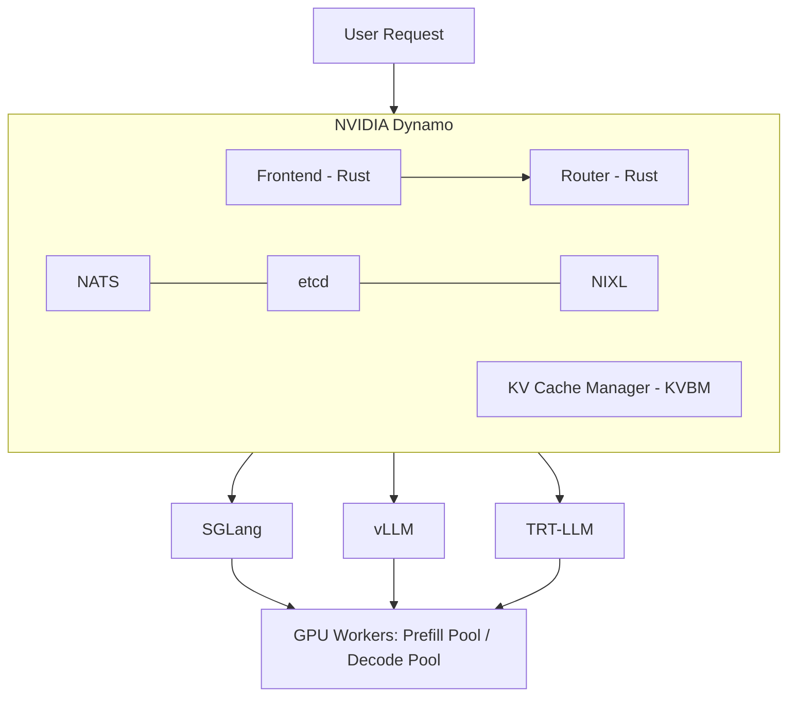

# LLM Inference Optimization Showdown: TP vs PD vs Prefix Cache on 2×H100 NVL

> **Author**: Xinyu Wei (魏新宇)  
> **Date**: 2026-04-20  
> **Hardware**: Azure NC80adis_H100_v5 (2× NVIDIA H100 NVL 95830 MiB, NV12 NVLink)  
> **Stack**: SGLang 0.5.10.post1 + NVIDIA Dynamo 1.0.1 + NIXL 1.0.1 + NATS v2.11.3 + etcd v3.5.21

---

## TL;DR

We benchmarked LLM inference optimization strategies on 2×H100 NVL with two models — **Qwen3-8B** (Results 1-3) and **Qwen2.5-32B** (Results 4-5). Strategies tested: **TP=2**, **Prefix Cache**, **NVIDIA Dynamo PD Disaggregation**, **FP8 KV Cache**, and **Chunked Prefill ON/OFF**.

- **TP=2**: Best throughput and TTFT at all model sizes. The go-to choice for same-node NVLink.
- **Prefix Cache**: Highest ROI — 41% TTFT reduction, zero config, zero extra hardware.
- **PD Disaggregation**: Only wins on tail latency — but the advantage scales with model size: P99 ITL **-52% for 8B**, **-85% for 32B**. Designed for large models where prefill is compute-heavy.
- **FP8 KV Cache**: No benefit at 1024-token context. Matters at 8K+ tokens or memory-constrained setups.
- **Chunked Prefill**: Critical — disabling it explodes TTFT 4.7× while only modestly improving ITL.


---

## What is NVIDIA Dynamo (30-second version)

NVIDIA Dynamo is an open-source (Apache 2.0) **distributed inference orchestration framework** that sits above inference engines (SGLang, vLLM, TRT-LLM). It is NOT an inference engine — it manages request routing, KV cache sharing, and agent-aware scheduling across multiple GPU workers.



Key capability: **PD Disaggregation** — dedicate some GPUs to prefill (compute KV cache) and others to decode (generate tokens). The idea: prefill is compute-intensive, decode is memory-bandwidth-intensive. Separating them prevents mutual interference.

**Sources**: [Dynamo 1.0 Blog](https://developer.nvidia.com/blog/nvidia-dynamo-1-production-ready/) | [Full-Stack Agentic Inference Blog](https://developer.nvidia.com/blog/full-stack-optimizations-for-agentic-inference-with-nvidia-dynamo/) | [GitHub](https://github.com/ai-dynamo/dynamo)

---

## Benchmark Setup

| Item | Value |
|:---|:---|
| **VM** | Azure NC80adis_H100_v5, 2× NVIDIA H100 NVL 95830 MiB |
| **Interconnect** | NV12 NVLink (intra-node, ~900 GB/s bidirectional) |
| **Models** | Qwen3-8B FP16 (16GB) — Results 1-3; Qwen2.5-32B-Instruct FP16 (65GB, 89% of H100 VRAM) — Results 4-5 |
| **Engine** | SGLang 0.5.10.post1, FlashInfer 0.6.7.post3, PyTorch 2.9.1+cu128 |
| **Dynamo** | ai-dynamo 1.0.1, nixl 1.0.1, NATS v2.11.3, etcd v3.5.21 |
| **Benchmark** | `sglang.bench_serving`, random dataset, 1024 input / 256 output tokens |
| **8B load** | 50 prompts @ 5 req/s (low), 200 prompts @ 20 req/s (high) |
| **32B load** | 100 prompts @ 10 req/s |
| **Configs tested** | Single GPU, TP=2, Prefix Cache (cold/warm/flush), Dynamo PD 1P1D, FP8 KV, Chunked ON/OFF |

---

## Result 1: Low Concurrency (50 prompts @ 5 req/s)


| Metric | Single GPU | TP=2 | Dynamo PD 1P1D |
|:---|:---:|:---:|:---:|
| **Output tok/s** | 541 | **559** | 540 |
| **Mean TTFT** | 43.4 ms | **32.5 ms** | 49.6 ms |
| **Mean E2E** | 871 ms | **576 ms** | 828 ms |
| **P99 ITL** | 35.3 ms | 13.2 ms | **12.5 ms** |

**Analysis**:
- **TP=2 dominates** — splits model across 2 GPUs via NVLink, halving per-layer computation. TTFT drops 25%, E2E drops 34%.
- **PD performs worse than single GPU on TTFT** (+14%) — because after prefill completes on GPU 0, the KV cache must be transferred via NIXL to GPU 1 before decode can start. This KV transfer adds ~6ms overhead per request.
- **PD's only win: P99 ITL** (12.5 ms vs 13.2 ms) — the decode worker is never interrupted by incoming prefill batches.

**Why TP=2 wins here**: Qwen3-8B at 16GB is far below a single H100's 95GB capacity. The model is compute-bound, not memory-bound. TP=2 directly halves compute per GPU. PD splits by *role* (prefill vs decode), but when prefill is only ~30ms on a single H100, dedicating a whole GPU to it is wasteful.

---

## Result 2: High Concurrency — Fair 2-GPU Comparison (200 prompts @ 20 req/s)

This is the fair comparison: both configurations use exactly 2 GPUs.


| Metric | TP=2 | Dynamo PD 1P1D | PD vs TP=2 |
|:---|:---:|:---:|:---|
| **Output tok/s** | **2259** | 2179 | -3.5% |
| **Mean TTFT** | **25.3 ms** | 53.0 ms | +109% |
| **Mean E2E** | **849 ms** | 995 ms | +17% |
| **P99 ITL** | 24.6 ms | **11.8 ms** | **-52%** |
| **P95 ITL** | 13.8 ms | **8.2 ms** | **-40%** |

> **Fairness note**: TP=2 uses `--backend sglang` (native `/generate` API), while Dynamo PD uses `--backend sglang-oai-chat` (`/v1/chat/completions`). This is a structural limitation — Dynamo frontend only exposes OpenAI-compatible endpoints. The chat API adds JSON parsing, chat template, and streaming overhead that cannot be separated from PD architecture overhead in this setup.

**Key insight**: Even at 4x higher load, the pattern holds — **TP=2 wins on averages, PD wins on tail latency**. The P99 ITL gap widens (-52%), confirming PD's value proposition: decode workers never get preempted by prefill batches.

---

## Result 3: Prefix Cache — The Highest-ROI Optimization

No extra GPUs, no Dynamo, no infrastructure. Just repeat the same prompts.


| Metric | Cold Cache | Warm Cache | Flush Control | Cache Benefit |
|:---|:---:|:---:|:---:|:---|
| **Mean TTFT** | 31.9 ms | **18.7 ms** | 31.5 ms | **-41%** |
| **P99 TTFT** | 53.2 ms | **26.1 ms** | 51.6 ms | **-51%** |
| **Max ITL** | 44.0 ms | **17.0 ms** | 43.7 ms | **-61%** |

The flush-cache control run (R3) matches cold (R1) exactly — proving warm cache gains are real, not noise. SGLang's RadixAttention prefix cache is enabled by default.

**Why this matters for agents**: In multi-turn conversations, the system prompt + conversation history are repeated every turn. Prefix cache skips recomputing their KV, giving 41% TTFT reduction for free.

---

## Result 4: 32B Model — Does Model Size Change the Story?

All results above used Qwen3-8B (16GB). A natural question: does PD become more valuable with larger models that put more pressure on compute? We tested **Qwen2.5-32B-Instruct** (65GB FP16) — a model that fills 89% of a single H100 NVL's 95GB VRAM.

**Test parameters**: 100 prompts @ 10 req/s, 1024 input / 256 output tokens (same token lengths as 8B; lower request rate because 32B is ~4× slower per token).


| Metric | Baseline (1 GPU) | TP=2 (2 GPU) | PD 1P1D (2 GPU) | PD vs TP=2 |
|:---|:---:|:---:|:---:|:---|
| **Output tok/s** | 749 | **966** | 830 | -14% |
| **Mean TTFT** | 369 ms | **130 ms** | 355 ms | +173% |
| **Mean E2E** | 7548 ms | **3524 ms** | 3559 ms | +1% |
| **P95 ITL** | 258 ms | 82 ms | **29 ms** | **-65%** |
| **P99 ITL** | 680 ms | 201 ms | **31 ms** | **-85%** |

> **Fairness note**: TP=2 uses `--backend sglang` (native `/generate`), PD uses `--backend sglang-oai-chat` (`/v1/chat/completions`). This is a structural limitation — Dynamo frontend only exposes OpenAI-compatible endpoints. The chat API overhead is estimated at 5-20ms, far smaller than the 225ms TTFT gap, so it does not change the direction of any conclusion. See also Result 2.

**TP=2 still wins throughput and TTFT** — same pattern as 8B. Two GPUs each running half the model compute prefill in ~65ms vs ~369ms on one GPU.

**PD's ITL advantage scales with model size** — this is the key finding:

| Model | P99 ITL (TP=2) | P99 ITL (PD) | PD Advantage | Load |
|:---|:---:|:---:|:---|:---|
| Qwen3-8B | 24.6 ms | 11.8 ms | -52% | 200 @ 20 req/s |
| Qwen2.5-32B | 201 ms | 31 ms | **-85%** | 100 @ 10 req/s |


Why does this happen? On TP=2, both GPUs handle prefill AND decode concurrently. With a 4× larger model, each chunked-prefill kernel runs ~4× longer, causing longer decode stalls between chunks. On PD, the decode worker has zero prefill interference regardless of model size — its P99 ITL stays in the 10-30ms range whether the model is 8B or 32B.

**E2E is essentially flat** (3524 vs 3559 ms, +1%). PD's TTFT disadvantage (KV transfer overhead via NIXL) is offset by its superior decode consistency. The ~250 decode steps × ~26ms/token dominate total latency, making E2E insensitive to which architecture is used.

**The 32B model sits at the PD crossover point**: single-GPU TTFT = 369ms means prefill is genuinely compute-heavy (vs 43ms for 8B). For 70B+ models requiring 4+ GPUs, prefill would be even heavier, and PD's value proposition strengthens further.

---

## Result 5: Optimization Ablation — FP8 KV Cache and Chunked Prefill

Two common inference optimizations, tested in isolation on Qwen2.5-32B single-GPU baseline (100 prompts @ 10 req/s, 1024 input / 256 output tokens).

### FP8 KV Cache

| Metric | BF16 KV (default) | FP8 KV | Δ |
|:---|:---:|:---:|:---|
| **Output tok/s** | 749 | 741 | -1% |
| **Mean TTFT** | 369 ms | 393 ms | +6% |
| **Mean E2E** | 7548 ms | 7717 ms | +2% |
| **P99 ITL** | 680 ms | 594 ms | -13% |

FP8 KV cache (`--kv-cache-dtype fp8_e5m2`) compresses KV storage from 16-bit to 8-bit, halving the KV memory footprint. However, it does **not** change the computation precision of attention kernels — the math is still done in BF16/FP16.

**Result**: No measurable throughput or latency benefit at this context length (1024 tokens). The memory saving only matters when KV cache is the bottleneck — typically at very long contexts (8K+ tokens) or very high concurrency where KV fills available VRAM. At 1024 tokens with 100 requests, we never approached the KV capacity limit.

**When FP8 KV matters**: Long-context workloads (8K-128K input), high concurrency on memory-constrained GPUs, or serving 70B+ models where every GB of VRAM counts.

### Chunked Prefill ON vs OFF

| Metric | Chunked ON (default) | Chunked OFF | Δ |
|:---|:---:|:---:|:---|
| **Output tok/s** | 749 | 618 | **-17%** |
| **Mean TTFT** | 369 ms | 1729 ms | **+369% (4.7×)** |
| **Mean E2E** | 7548 ms | 7332 ms | -3% |
| **P95 ITL** | 258 ms | 155 ms | **-40%** |
| **P99 ITL** | 680 ms | 341 ms | **-50%** |


This is the classic **TTFT vs ITL tradeoff**:

- **Without chunked prefill** (`--chunked-prefill-size -1`): Each 1024-token prefill runs as a single uninterruptible kernel (~369ms). While it executes, ALL decode batches are blocked. Subsequent prefills also queue. Result: TTFT explodes to 1729ms (median 601ms — some requests wait behind multiple prefills). But once a request enters decode, it runs uninterrupted — P95 ITL drops to 155ms.

- **With chunked prefill** (default, `--chunked-prefill-size 8192`): Prefill is split into chunks. The scheduler interleaves decode batches between chunks. TTFT stays low because new requests are scheduled quickly. But decode tokens occasionally wait behind a prefill chunk — P95 ITL rises to 258ms.

**Throughput**: Chunked ON gets 749 vs 618 tok/s (+21%) because the scheduler fills GPU utilization gaps between chunks with decode work, instead of leaving decode idle during long prefills.

**E2E is roughly flat** — the TTFT improvement from chunking roughly cancels out the ITL degradation.

---

## When to Use (and NOT Use) PD Disaggregation

Based on our benchmarks + Dynamo's design intent:

| Scenario | Use PD? | Why |
|:---|:---:|:---|
| Small model (8B-13B) on single node with NVLink | **No** | TP is strictly better. Prefill is not a bottleneck. |
| Medium model (30B-class) on 2 GPUs with NVLink | **Maybe** | PD wins P99 ITL by 85%, but loses 14% throughput. Only if strict ITL SLO. |
| Large model (70B+) on multi-node | **Yes** | Prefill becomes compute-heavy, worth dedicating GPUs. |
| Strict P99 ITL SLO (< 15ms) | **Maybe** | PD prevents prefill from preempting decode. |
| Agent workloads with tool calls (2-30s gaps) | **Yes** | PD + KV cache pinning prevents eviction during gaps. |
| Cost-sensitive, want max throughput per dollar | **No** | TP gives same throughput with simpler architecture. |

**The prefill-time rule**: If single-GPU prefill for your typical input length takes < 30ms (our 8B at 1024 tokens), PD adds overhead without benefit. At ~370ms (our 32B at 1024 tokens), you're at the crossover point where PD's ITL advantage (-85%) starts to outweigh its throughput cost (-14%). For longer prompts (4K+), larger models (70B+), or weaker GPUs, PD becomes clearly attractive.

---

## The Third Option: Chunked Prefill

PD disaggregation solves the prefill-decode interference problem by **physical isolation** (separate GPUs). But there's a cheaper alternative: **Chunked Prefill**, which is enabled by default in SGLang.

### The problem

A GPU can only run **one kernel at a time**. Once a kernel starts, it must run to completion — no pausing, no preemption. If a 32K-token prefill launches as a single kernel, it takes ~2 seconds. During those 2 seconds, every other request's decode is blocked.

### The solution

Split the 32K prefill into chunks (e.g., 1024 tokens each). Each chunk is a separate kernel launch. Between kernel launches, the scheduler can insert other requests:

```
Without chunking:
  kernel: Attention(32K tokens) → 2000ms, nothing else can run

With chunking (chunk=1024):
  kernel 1: Attention(1024 tokens)              → 60ms
  kernel 2: Attention(1024 tokens + new request) → 62ms
  kernel 3: Attention(1024 tokens + decode batch) → 63ms
  ... (32 kernels total, other requests interleave)
```

This is the same principle as OS time-slicing: the GPU can't multitask, but by breaking one long task into many short tasks, the scheduler gets decision points between them.

### KV Cache correctness

Chunked prefill produces **mathematically identical KV Cache** as full prefill. Each token's K and V depend only on the token itself + all preceding tokens + model weights. Whether you compute them in one pass or three passes, the result is the same. Chunk 2 reads chunk 1's KV from the cache (already stored by PagedAttention), so it sees the same context.

### Chunked Prefill vs PD Disaggregation

| | Chunked Prefill | PD Disaggregation |
|:---|:---|:---|
| **How it works** | Time-slicing on one GPU | Physical isolation on separate GPUs |
| **ITL stability** | Good (no long stalls) | Best (zero interference) |
| **Extra hardware** | None | Extra GPU(s) + NATS/etcd/NIXL |
| **TTFT impact** | Slightly higher (chunked) | Higher (KV transfer + queue) |
| **Configuration** | Default in SGLang | Complex deployment |

**Chunked Prefill is "poor man's PD"** — it solves 80% of the problem at 0% of the cost. Our benchmarks used SGLang's default chunked prefill (`--chunked-prefill-size 8192`), which is why TP=2's P99 ITL (24.6ms at high concurrency) was already reasonable. Without chunked prefill, the ITL spikes would be much worse, making PD's advantage more pronounced.

**Measured impact (Result 5)**: On 32B, disabling chunked prefill caused TTFT to explode from 369ms to 1729ms (+4.7×), while P95 ITL improved from 258ms to 155ms (-40%). Throughput dropped 17%. The net E2E was roughly flat — confirming that chunked prefill trades slightly worse ITL for dramatically better TTFT and throughput. See [Result 5](#result-5-optimization-ablation--fp8-kv-cache-and-chunked-prefill) for full data.

---

## Deploying Dynamo PD from PyPI (Not Docker)

We deployed Dynamo without Docker — pip packages only. This required solving three compatibility issues.

### Infrastructure

```bash
# NATS (message bus for Dynamo service discovery)
wget -qO nats.tar.gz https://github.com/nats-io/nats-server/releases/download/v2.11.3/nats-server-v2.11.3-linux-amd64.tar.gz
tar xzf nats.tar.gz && cp nats-server-v2.11.3-linux-amd64/nats-server /usr/local/bin/
nats-server -js &  # JetStream enabled

# etcd (distributed config store)
wget -qO etcd.tar.gz https://github.com/etcd-io/etcd/releases/download/v3.5.21/etcd-v3.5.21-linux-amd64.tar.gz
tar xzf etcd.tar.gz && cp etcd-v3.5.21-linux-amd64/etcd /usr/local/bin/
etcd &
```

### Dynamo + SGLang Compatibility Patch

`ai-dynamo==1.0.1` imports `get_local_ip_auto`, `get_zmq_socket`, `maybe_wrap_ipv6_address` from `sglang.srt.utils`. But SGLang 0.5.10 moved them to `sglang.srt.utils.network` without re-exporting, and `maybe_wrap_ipv6_address` doesn't exist at all.

**Fix**: Patch `sglang/srt/utils/__init__.py`:
```python
# Add at end of sglang/srt/utils/__init__.py
from sglang.srt.utils.network import get_local_ip_auto, get_zmq_socket
def maybe_wrap_ipv6_address(addr):
    return f"[{addr}]" if ":" in addr and not addr.startswith("[") else addr
```

### Launching PD Disaggregation

```bash
# Frontend (Rust-based HTTP server with KV-aware router)
python3 -m dynamo.frontend --router-mode kv --router-reset-states &

# Prefill worker — GPU 0
CUDA_VISIBLE_DEVICES=0 DYN_SYSTEM_PORT=8081 python3 -m dynamo.sglang \
  --model-path /path/to/model --served-model-name Qwen3-8B \
  --page-size 64 --tp 1 --disaggregation-mode prefill --host 0.0.0.0 \
  --kv-events-config '{"publisher":"zmq","topic":"kv-events","endpoint":"tcp://*:5557"}' \
  --disaggregation-transfer-backend nixl &

# Decode worker — GPU 1
CUDA_VISIBLE_DEVICES=1 DYN_SYSTEM_PORT=8083 python3 -m dynamo.sglang \
  --model-path /path/to/model --served-model-name Qwen3-8B \
  --page-size 64 --tp 1 --disaggregation-mode decode --host 0.0.0.0 \
  --kv-events-config '{"publisher":"zmq","topic":"kv-events","endpoint":"tcp://*:5560"}' \
  --disaggregation-transfer-backend nixl &
```

The Dynamo response includes `nvext.worker_id` with separate `prefill_worker_id` and `decode_worker_id` — proof of real PD disaggregation.

### Known Issues

| Issue | Workaround |
|:---|:---|
| Dynamo GitHub `main` requires `ai-dynamo-runtime==1.1.0` (unreleased) | Use PyPI: `pip install ai-dynamo==1.0.1` |
| SGLang 0.5.10 API incompatibility with Dynamo 1.0.1 | Patch `__init__.py` (see above) |
| `nixl` not auto-installed with `ai-dynamo` | `pip install nixl` separately |
| Dynamo frontend only exposes OpenAI API | Cannot use `sglang` native benchmark backend; use `sglang-oai-chat` |

---

## Reproducing These Results

```bash
# 1. Setup environment (installs SGLang + Dynamo + NATS + etcd + model)
bash scripts/setup.sh

# 2. Run all benchmarks
bash scripts/run_benchmark.sh all

# 3. Generate charts
pip install matplotlib
python3 scripts/generate_charts.py
```

Or run individual phases: `bash scripts/run_benchmark.sh phase1|phase2|phase3|phase5|highload_tp2|highload_pd`

Raw benchmark logs are in `data/`.

---

## Conclusion

1. **PD disaggregation is not universally better** — it trades average performance for tail latency stability. For small models on NVLink, TP is strictly superior on every average metric.

2. **PD's value scales with model size**. For 8B, PD improves P99 ITL by 52%. For 32B, the improvement jumps to 85%. The physical reason: larger models make prefill kernels heavier, causing worse decode stalls on TP — while PD's dedicated decode worker is immune to model size.

3. **Prefix Cache is the highest-ROI optimization** for agent/multi-turn workloads: 41% TTFT reduction, zero config, zero extra hardware.

4. **Chunked Prefill is non-negotiable**: disabling it causes 4.7× TTFT regression on 32B. The ITL improvement from disabling it (40%) is not worth the throughput loss (17%) and TTFT explosion. Keep it on.

5. **FP8 KV Cache is context-length dependent**: no benefit at 1024 tokens, but important for long-context (8K+) or memory-constrained deployments where KV cache fills VRAM.

6. **Dynamo's value is in large-scale production**, not small-model benchmarks. Its real strengths — KV-aware routing across dozens of workers, agent lifecycle management, 4-tier KV storage — cannot be demonstrated on 2 GPUs.

7. **The engineering challenge is real**: deploying Dynamo from PyPI requires NATS + etcd + NIXL + SGLang compatibility patches. The Docker path (`nvcr.io/nvidia/dynamo`) is significantly easier for production.
