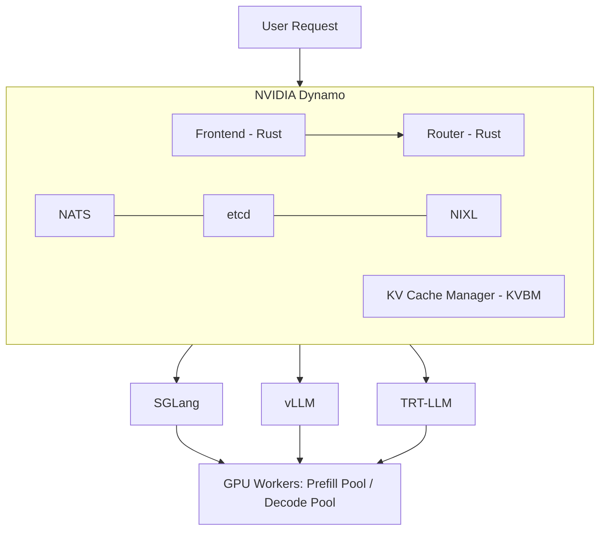

# LLM Inference Optimization Showdown: TP vs PD vs Prefix Cache on 2×H100 NVL

> **Author**: Xinyu Wei (魏新宇)  
> **Date**: 2026-04-20  
> **Hardware**: Azure NC80adis_H100_v5 (2× NVIDIA H100 NVL 95830 MiB, NV12 NVLink)  
> **Stack**: SGLang 0.5.10.post1 + NVIDIA Dynamo 1.0.1 + NIXL 1.0.1 + NATS v2.11.3 + etcd v3.5.21

---

## TL;DR

We benchmarked three LLM inference optimization strategies on 2×H100 NVL with Qwen3-8B: **Tensor Parallel (TP=2)**, **Prefix Cache**, and **NVIDIA Dynamo PD Disaggregation (1P1D)**. Key findings:

- **TP=2**: Best for latency — TTFT -25%, E2E -34% vs single GPU. The go-to choice for same-node NVLink.
- **Prefix Cache**: Highest ROI — 41% TTFT reduction with zero config, zero extra hardware. Essential for agent/multi-turn workloads.
- **PD Disaggregation**: Only wins on tail latency (P99 ITL -52%) but loses on every average metric. Designed for large models on multi-node, not small models on NVLink.


---

## What is NVIDIA Dynamo (30-second version)

NVIDIA Dynamo is an open-source (Apache 2.0) **distributed inference orchestration framework** that sits above inference engines (SGLang, vLLM, TRT-LLM). It is NOT an inference engine — it manages request routing, KV cache sharing, and agent-aware scheduling across multiple GPU workers.



Key capability: **PD Disaggregation** — dedicate some GPUs to prefill (compute KV cache) and others to decode (generate tokens). The idea: prefill is compute-intensive, decode is memory-bandwidth-intensive. Separating them prevents mutual interference.

**Sources**: [Dynamo 1.0 Blog](https://developer.nvidia.com/blog/nvidia-dynamo-1-production-ready/) | [Full-Stack Agentic Inference Blog](https://developer.nvidia.com/blog/full-stack-optimizations-for-agentic-inference-with-nvidia-dynamo/) | [GitHub](https://github.com/ai-dynamo/dynamo)

---

## Benchmark Setup

| Item | Value |
|:---|:---|
| **VM** | Azure NC80adis_H100_v5, 2× NVIDIA H100 NVL 95830 MiB |
| **Interconnect** | NV12 NVLink (intra-node, ~900 GB/s bidirectional) |
| **Model** | Qwen3-8B FP16 (16GB, fits easily in single H100 95GB) |
| **Engine** | SGLang 0.5.10.post1, FlashInfer 0.6.7.post3, PyTorch 2.9.1+cu128 |
| **Dynamo** | ai-dynamo 1.0.1, nixl 1.0.1, NATS v2.11.3, etcd v3.5.21 |
| **Benchmark** | `sglang.bench_serving`, random dataset, 1024 input / 256 output tokens |
| **Configs tested** | Single GPU, TP=2, Prefix Cache (cold/warm/flush), Dynamo PD 1P1D |

---

## Result 1: Low Concurrency (50 prompts @ 5 req/s)


| Metric | Single GPU | TP=2 | Dynamo PD 1P1D |
|:---|:---:|:---:|:---:|
| **Output tok/s** | 541 | **559** | 540 |
| **Mean TTFT** | 43.4 ms | **32.5 ms** | 49.6 ms |
| **Mean E2E** | 871 ms | **576 ms** | 828 ms |
| **P99 ITL** | 35.3 ms | 13.2 ms | **12.5 ms** |

**Analysis**:
- **TP=2 dominates** — splits model across 2 GPUs via NVLink, halving per-layer computation. TTFT drops 25%, E2E drops 34%.
- **PD performs worse than single GPU on TTFT** (+14%) — because after prefill completes on GPU 0, the KV cache must be transferred via NIXL to GPU 1 before decode can start. This KV transfer adds ~6ms overhead per request.
- **PD's only win: P99 ITL** (12.5 ms vs 13.2 ms) — the decode worker is never interrupted by incoming prefill batches.

**Why TP=2 wins here**: Qwen3-8B at 16GB is far below a single H100's 95GB capacity. The model is compute-bound, not memory-bound. TP=2 directly halves compute per GPU. PD splits by *role* (prefill vs decode), but when prefill is only ~30ms on a single H100, dedicating a whole GPU to it is wasteful.

---

## Result 2: High Concurrency — Fair 2-GPU Comparison (200 prompts @ 20 req/s)

This is the fair comparison: both configurations use exactly 2 GPUs.


| Metric | TP=2 | Dynamo PD 1P1D | PD vs TP=2 |
|:---|:---:|:---:|:---|
| **Output tok/s** | **2259** | 2179 | -3.5% |
| **Mean TTFT** | **25.3 ms** | 53.0 ms | +109% |
| **Mean E2E** | **849 ms** | 995 ms | +17% |
| **P99 ITL** | 24.6 ms | **11.8 ms** | **-52%** |
| **P95 ITL** | 13.8 ms | **8.2 ms** | **-40%** |

> **Fairness note**: TP=2 uses `--backend sglang` (native `/generate` API), while Dynamo PD uses `--backend sglang-oai-chat` (`/v1/chat/completions`). This is a structural limitation — Dynamo frontend only exposes OpenAI-compatible endpoints. The chat API adds JSON parsing, chat template, and streaming overhead that cannot be separated from PD architecture overhead in this setup.

**Key insight**: Even at 4x higher load, the pattern holds — **TP=2 wins on averages, PD wins on tail latency**. The P99 ITL gap widens (-52%), confirming PD's value proposition: decode workers never get preempted by prefill batches.

---

## Result 3: Prefix Cache — The Highest-ROI Optimization

No extra GPUs, no Dynamo, no infrastructure. Just repeat the same prompts.


| Metric | Cold Cache | Warm Cache | Flush Control | Cache Benefit |
|:---|:---:|:---:|:---:|:---|
| **Mean TTFT** | 31.9 ms | **18.7 ms** | 31.5 ms | **-41%** |
| **P99 TTFT** | 53.2 ms | **26.1 ms** | 51.6 ms | **-51%** |
| **Max ITL** | 44.0 ms | **17.0 ms** | 43.7 ms | **-61%** |

The flush-cache control run (R3) matches cold (R1) exactly — proving warm cache gains are real, not noise. SGLang's RadixAttention prefix cache is enabled by default.

**Why this matters for agents**: In multi-turn conversations, the system prompt + conversation history are repeated every turn. Prefix cache skips recomputing their KV, giving 41% TTFT reduction for free.

---

## When to Use (and NOT Use) PD Disaggregation

Based on our benchmarks + Dynamo's design intent:

| Scenario | Use PD? | Why |
|:---|:---:|:---|
| Small model (8B-13B) on single node with NVLink | **No** | TP is strictly better. Prefill is not a bottleneck. |
| Large model (70B+) on multi-node | **Yes** | Prefill becomes compute-heavy, worth dedicating GPUs. |
| Strict P99 ITL SLO (< 15ms) | **Maybe** | PD prevents prefill from preempting decode. |
| Agent workloads with tool calls (2-30s gaps) | **Yes** | PD + KV cache pinning prevents eviction during gaps. |
| Cost-sensitive, want max throughput per dollar | **No** | TP gives same throughput with simpler architecture. |

**The 30ms rule**: If single-GPU prefill for your typical input length takes < 30ms, PD adds overhead (KV transfer) without benefit. Our 1024-token prefill took ~30ms on H100 — right at the threshold. For longer prompts (4K+) or weaker GPUs, PD becomes more attractive.

---

## The Third Option: Chunked Prefill

PD disaggregation solves the prefill-decode interference problem by **physical isolation** (separate GPUs). But there's a cheaper alternative: **Chunked Prefill**, which is enabled by default in SGLang.

### The problem

A GPU can only run **one kernel at a time**. Once a kernel starts, it must run to completion — no pausing, no preemption. If a 32K-token prefill launches as a single kernel, it takes ~2 seconds. During those 2 seconds, every other request's decode is blocked.

### The solution

Split the 32K prefill into chunks (e.g., 1024 tokens each). Each chunk is a separate kernel launch. Between kernel launches, the scheduler can insert other requests:

```
Without chunking:
  kernel: Attention(32K tokens) → 2000ms, nothing else can run

With chunking (chunk=1024):
  kernel 1: Attention(1024 tokens)              → 60ms
  kernel 2: Attention(1024 tokens + new request) → 62ms
  kernel 3: Attention(1024 tokens + decode batch) → 63ms
  ... (32 kernels total, other requests interleave)
```

This is the same principle as OS time-slicing: the GPU can't multitask, but by breaking one long task into many short tasks, the scheduler gets decision points between them.

### KV Cache correctness

Chunked prefill produces **mathematically identical KV Cache** as full prefill. Each token's K and V depend only on the token itself + all preceding tokens + model weights. Whether you compute them in one pass or three passes, the result is the same. Chunk 2 reads chunk 1's KV from the cache (already stored by PagedAttention), so it sees the same context.

### Chunked Prefill vs PD Disaggregation

| | Chunked Prefill | PD Disaggregation |
|:---|:---|:---|
| **How it works** | Time-slicing on one GPU | Physical isolation on separate GPUs |
| **ITL stability** | Good (no long stalls) | Best (zero interference) |
| **Extra hardware** | None | Extra GPU(s) + NATS/etcd/NIXL |
| **TTFT impact** | Slightly higher (chunked) | Higher (KV transfer + queue) |
| **Configuration** | Default in SGLang | Complex deployment |

**Chunked Prefill is "poor man's PD"** — it solves 80% of the problem at 0% of the cost. Our benchmarks used SGLang's default chunked prefill (`--chunked-prefill-size 8192`), which is why TP=2's P99 ITL (24.6ms at high concurrency) was already reasonable. Without chunked prefill, the ITL spikes would be much worse, making PD's advantage more pronounced.

---

## Deploying Dynamo PD from PyPI (Not Docker)

We deployed Dynamo without Docker — pip packages only. This required solving three compatibility issues.

### Infrastructure

```bash
# NATS (message bus for Dynamo service discovery)
wget -qO nats.tar.gz https://github.com/nats-io/nats-server/releases/download/v2.11.3/nats-server-v2.11.3-linux-amd64.tar.gz
tar xzf nats.tar.gz && cp nats-server-v2.11.3-linux-amd64/nats-server /usr/local/bin/
nats-server -js &  # JetStream enabled

# etcd (distributed config store)
wget -qO etcd.tar.gz https://github.com/etcd-io/etcd/releases/download/v3.5.21/etcd-v3.5.21-linux-amd64.tar.gz
tar xzf etcd.tar.gz && cp etcd-v3.5.21-linux-amd64/etcd /usr/local/bin/
etcd &
```

### Dynamo + SGLang Compatibility Patch

`ai-dynamo==1.0.1` imports `get_local_ip_auto`, `get_zmq_socket`, `maybe_wrap_ipv6_address` from `sglang.srt.utils`. But SGLang 0.5.10 moved them to `sglang.srt.utils.network` without re-exporting, and `maybe_wrap_ipv6_address` doesn't exist at all.

**Fix**: Patch `sglang/srt/utils/__init__.py`:
```python
# Add at end of sglang/srt/utils/__init__.py
from sglang.srt.utils.network import get_local_ip_auto, get_zmq_socket
def maybe_wrap_ipv6_address(addr):
    return f"[{addr}]" if ":" in addr and not addr.startswith("[") else addr
```

### Launching PD Disaggregation

```bash
# Frontend (Rust-based HTTP server with KV-aware router)
python3 -m dynamo.frontend --router-mode kv --router-reset-states &

# Prefill worker — GPU 0
CUDA_VISIBLE_DEVICES=0 DYN_SYSTEM_PORT=8081 python3 -m dynamo.sglang \
  --model-path /path/to/model --served-model-name Qwen3-8B \
  --page-size 64 --tp 1 --disaggregation-mode prefill --host 0.0.0.0 \
  --kv-events-config '{"publisher":"zmq","topic":"kv-events","endpoint":"tcp://*:5557"}' \
  --disaggregation-transfer-backend nixl &

# Decode worker — GPU 1
CUDA_VISIBLE_DEVICES=1 DYN_SYSTEM_PORT=8083 python3 -m dynamo.sglang \
  --model-path /path/to/model --served-model-name Qwen3-8B \
  --page-size 64 --tp 1 --disaggregation-mode decode --host 0.0.0.0 \
  --kv-events-config '{"publisher":"zmq","topic":"kv-events","endpoint":"tcp://*:5560"}' \
  --disaggregation-transfer-backend nixl &
```

The Dynamo response includes `nvext.worker_id` with separate `prefill_worker_id` and `decode_worker_id` — proof of real PD disaggregation.

### Known Issues

| Issue | Workaround |
|:---|:---|
| Dynamo GitHub `main` requires `ai-dynamo-runtime==1.1.0` (unreleased) | Use PyPI: `pip install ai-dynamo==1.0.1` |
| SGLang 0.5.10 API incompatibility with Dynamo 1.0.1 | Patch `__init__.py` (see above) |
| `nixl` not auto-installed with `ai-dynamo` | `pip install nixl` separately |
| Dynamo frontend only exposes OpenAI API | Cannot use `sglang` native benchmark backend; use `sglang-oai-chat` |

---

## Reproducing These Results

```bash
# 1. Setup environment (installs SGLang + Dynamo + NATS + etcd + model)
bash scripts/setup.sh

# 2. Run all benchmarks
bash scripts/run_benchmark.sh all

# 3. Generate charts
pip install matplotlib
python3 scripts/generate_charts.py
```

Or run individual phases: `bash scripts/run_benchmark.sh phase1|phase2|phase3|phase5|highload_tp2|highload_pd`

Raw benchmark logs are in `data/`.

---

## Conclusion

1. **PD disaggregation is not universally better** — it trades average performance for tail latency stability. For small models on NVLink, TP is strictly superior.

2. **Prefix Cache is the highest-ROI optimization** for agent/multi-turn workloads: 41% TTFT reduction, zero config, zero extra hardware.

3. **Dynamo's value is in large-scale production**, not small-model benchmarks. Its real strengths — KV-aware routing across dozens of workers, agent lifecycle management, 4-tier KV storage — cannot be demonstrated on 2 GPUs.

4. **The engineering challenge is real**: deploying Dynamo from PyPI requires NATS + etcd + NIXL + SGLang compatibility patches. The Docker path (`nvcr.io/nvidia/dynamo`) is significantly easier for production.
