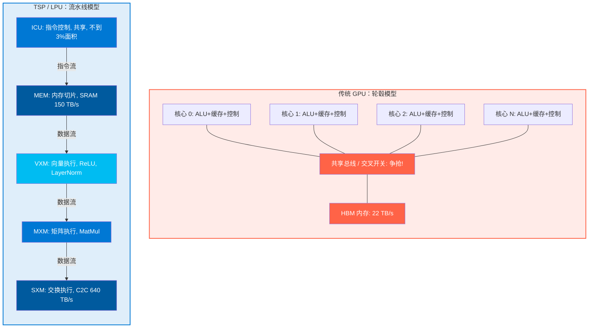
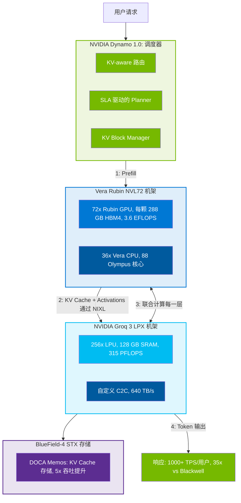

# NVIDIA Groq LPU — 架构深度解析：从 TSP 到 Vera Rubin 平台

> **最后更新**: 2026-04-10
> **分类**: AI 基础设施 — 芯片架构分析
> **作者**: 魏新宇 (Xinyu Wei) | Microsoft AI GBB

---

## 概要总结

| 维度 | 详情 |
|-----------|--------|
| **是什么** | NVIDIA Groq 3 LPU (Language Processing Unit) — an ASIC inference accelerator acquired by NVIDIA for ~$20B in 2025 |
| **核心创新** | Tensor Streaming Processor (TSP): functional slicing + deterministic execution + on-chip SRAM as primary weight storage |
| **关键规格（单芯片）** | 500 MB SRAM, 150 TB/s bandwidth, 1.2 PFLOPS (FP8), 98B transistors |
| **关键规格（LPX 机架）** | 256 LPUs, 128 GB SRAM, 315 PFLOPS, 640 TB/s scale-up bandwidth |
| **定位** | Decode accelerator paired with Vera Rubin NVL72 GPU rack for disaggregated serving |
| **性能** | GPU + LPU = 35× throughput for trillion-parameter models (vs Blackwell alone) |
| **运作方式** | Compiler pre-computes entire execution graph down to individual clock cycles; SRAM stores weights statically; zero dynamic scheduling at runtime |
| **代价** | No training capability; limited SRAM capacity; model changes require recompilation; no CUDA ecosystem |

---

## 1. 背景：为什么 NVIDIA 花 200 亿买 Groq

### 1.1 推理瓶颈

LLM 推理有两个计算特征截然不同的阶段：

| 阶段 | 做什么 | 瓶颈 | GPU 利用率 |
|-------|-------------|-----------|:---------------:|
| **Prefill** | Process entire input prompt in parallel | Compute-bound (high FLOPS needed) | High |
| **Decode** | Generate tokens one-by-one, each requiring full weight read | **Memory bandwidth-bound** | Low |

在 decode 阶段，GPU 巨大的算力（50 PFLOPS）闲置等待从 HBM 中读取权重（22 TB/s）。这就是 LPU 要解决的根本低效问题。

### 1.2 Groq 的解决方案

Groq 由前 Google TPU 工程师于 2016 年创立，从零设计了一款针对 decode 瓶颈优化的芯片：
- **用片上 SRAM 替代 HBM**：150 TB/s 带宽（是 GPU HBM 的 7 倍）
- **用静态调度替代动态调度**：编译器在编译时确定一切
- **用流水线替代多核轮毂模型**：数据像生产线上的零件一样流过功能切片

### 1.3 收购与集成

- **收购**：2025 年，NVIDIA 以约 200 亿美元收购
- **GTC 2026 发布**：Groq 3 LPU 作为七颗新芯片之一集成到 Vera Rubin 平台
- **产品**：NVIDIA Groq 3 LPX 机架（每机架 256 颗 LPU）
- **下一代**：LP40（Feynman 架构，GTC 2026 已公布）

> **来源**: Cenyu Zhang GTC 2026 报告；NVIDIA Post Keynote Customer Deck（44 页）；nvidianews.nvidia.com Vera Rubin 新闻稿

---

## 2. TSP 架构深度解析

### 2.1 功能分片 — 核心创新

传统芯片（CPU/GPU）将所有功能打包到每个核心：指令控制、内存、整数 ALU、浮点 ALU 和网络。多个相同核心通过二维网格互联。

TSP（Tensor Streaming Processor，张量流处理器）反其道而行 — **按功能切片，而非按核心**：

| 切片 | 全称 | 功能 |
|-------|-----------|----------|
| **ICU** | Instruction Control Unit | Instruction decode and dispatch (shared, <3% chip area) |
| **MEM** | Memory Slice | SRAM read/write, data routing |
| **VXM** | Vector Execution Module | Vector operations (ReLU, LayerNorm, etc.) |
| **MXM** | Matrix Execution Module | Matrix multiplication (the main compute) |
| **SXM** | Switch Execution Module | Inter-chip networking and data routing |

**架构对比图：**



<details>
<summary>ASCII 文本版（点击展开）</summary>

```
传统设计 (GPU)：每个核心都有全套功能 → 核心之间争抢共享资源

  ┌──────┐ ┌──────┐ ┌──────┐ ┌──────┐
  │Core 0│ │Core 1│ │Core 2│ │Core 3│  ← 每个都有 ALU+缓存+控制
  └──┬───┘ └──┬───┘ └──┬───┘ └──┬───┘
     └────────┴────────┴────────┘
              Shared Bus / Crossbar         ← 争抢！

TSP (LPU)：按功能分离成切片 → 数据像流水线一样流过

  指令流 ↓ (Y轴)
  ┌─────┬─────┬─────┬─────┬─────┐
  │ ICU │ ICU │ ICU │ ICU │ ICU │  ← 指令控制（只需一份）
  ├─────┼─────┼─────┼─────┼─────┤
  │ MEM │ MEM │ MEM │ MEM │ MEM │  ← 内存（读权重）
  ├─────┼─────┼─────┼─────┼─────┤
  │ VXM │ VXM │ VXM │ VXM │ VXM │  ← 向量计算
  ├─────┼─────┼─────┼─────┼─────┤
  │ MXM │ MXM │ MXM │ MXM │ MXM │  ← 矩阵计算
  ├─────┼─────┼─────┼─────┼─────┤
  │ SXM │ SXM │ SXM │ SXM │ SXM │  ← 网络
  └─────┴─────┴─────┴─────┴─────┘
  数据流 → (X轴)
```

</details>

### 2.2 这种设计为什么有效

| 优势 | 说明 |
|-----------|-------------|
| **ICU shared once** | All tiles of the same function execute the same instruction → decode logic needed only once (<3% area) |
| **Natural pipeline** | Instructions flow vertically, data flows horizontally → instruction and data paths decouple completely |
| **No resource contention** | Each functional slice has dedicated resources → no fighting for shared buses or caches |
| **Memory-compute colocation** | MEM slices feed data directly to VXM/MXM slices → no register file intermediary |

> **来源**: Groq 2020 ISCA 论文 (TSP)；EETOP 微信文章「深度拆解Groq LPU架构」(2026-03-30)

### 2.3 硬件规格（第一代 → Groq 3）

| 规格 | 第一代 (2020 ISCA) | Groq 3 (2026 GTC) |
|------|:-:|:-:|
| SRAM | 220 MB | **500 MB** |
| Process | 14nm | Not disclosed (likely 4nm) |
| Clock | 900 MHz | Not disclosed |
| Transistors | Not disclosed | **98B** |
| SRAM Bandwidth | 80 TB/s (per Groq official 2025) | **150 TB/s** |
| Compute (FP8) | Not disclosed | **1.2 PFLOPS** |
| Parallel Lanes | 320 (20 tiles × 16 lanes) | Not disclosed |
| Logical Streams | 64 (32 east + 32 west) | Not disclosed |
| Interconnect | Custom C2C | **Custom Chip-to-Chip** |
| HBM | None | **⚠️ Unconfirmed** (see note below) |

> **⚠️ Important Note on HBM4**: The Post Keynote Deck (Page 11) chip comparison photo shows 288 GB HBM4 on the **left side (GPU)**, not the right side (LPU). The LPU side shows only 500 MB SRAM. **Whether Groq 3 LPU has HBM4 is NOT confirmed** — the 288 GB HBM4 specification belongs to the Vera Rubin GPU. Groq's official architecture page (groq.com/lpu-architecture) describes only on-chip SRAM, consistent with the original SRAM-only design philosophy.

> **来源**: Post Keynote GTC 2026 Customer Deck 第 11 页；Groq 官方 (groq.com/lpu-architecture; groq.com/blog/inside-the-lpu-deconstructing-groq-speed)

---

## 3. 数据处理方式：权重、激活、KV Cache

### 3.1 权重 — SRAM 作为主要权重存储

Groq 官方声明（☠2 级来源）：
> **"The LPU integrates hundreds of MB of SRAM as primary weight storage (not cache)"**
> — groq.com/lpu-architecture

权重如何分布在 256 颗 LPU 上：

```
模型：70B 参数 (FP8) = 约 70 GB 总权重

第一步 — 编译：Groq 编译器切分每个权重矩阵（概念性示例）
  ⚠️ 注意：具体切分机制未被公开。以下为概念性说明。
  W (4096 × 4096) → 分布到 256 颗 LPU（类似 Tensor Parallelism）
  LPU 0:   W 的一个切片 → 存储在预定义的 SRAM 地址
  LPU 1:   W 的另一个切片 → 存储在预定义的 SRAM 地址
  ...
  LPU 255: W 的最后一个切片 → 存储在预定义的 SRAM 地址

第二步 — 加载：服务启动时，权重加载到每颗 LPU 的 SRAM 中

第三步 — 运行：每颗 LPU 计算自己的切片，结果通过 640 TB/s 互联合并
```

### 3.2 激活 — 静态形状、动态值

Groq 官方声明：
> **"FP8 storage for activations in error-tolerant layers"**
> — groq.com/blog/inside-the-lpu-deconstructing-groq-speed

关键洞察：激活的**值**是动态的（每次推理不同），但激活的**形状**是静态的（由模型架构决定）。编译器为激活预分配固定的 SRAM 区域。

### 3.3 KV Cache — 官方未公开

**⚠️ Groq 尚未公开 LPU 上的 KV Cache 管理机制。**

搜索了三个官方来源（groq.com/lpu-architecture、inside-the-lpu 博客、from-speed-to-scale 博客）— 均未提及 KV Cache 管理机制。

在 NVIDIA Vera Rubin 平台语境下，KV Cache 管理涉及：
- **NVIDIA Dynamo KVBM**：将 KV Cache 跨 GPU → CPU → SSD → 远程存储卸载
- **BlueField-4 STX**：专用 KV Cache 存储机架，配备 DOCA Memos 框架
- **NIXL**：GPU 与 LPU 之间的低延迟数据传输协议

> **来源**: Dynamo GitHub README (github.com/ai-dynamo/dynamo)；Post Keynote Deck 第 42 页；NVIDIA Vera Rubin 新闻稿

---

## 4. 确定性执行 —「无缓存、无仲裁」哲学

### 4.1 编译到时钟周期级别的内容

Groq 编译器预计算**整个执行图**，包括：

| 编译时确定的内容 | GPU 等价（运行时） |
|-----------------------------------|-------------------------|
| Which SRAM address to read from | Runtime: cache hit or miss? Unknown |
| Which SRAM address to write to | Runtime: memory controller decides |
| Which data stream to use (east #5, west #3) | Runtime: router arbitration |
| Which clock cycle each operation executes | Runtime: thread scheduler assigns |
| Which functional slice does the computation | Runtime: SM availability check |
| When inter-chip communication happens | Runtime: collective operation sync |
| How long the entire inference takes | Runtime: varies every time |

Groq 官方声明：
> **"Our compiler pre-computes the entire execution graph, including inter-chip communication patterns, down to the individual clock cycles."**
> — groq.com/blog/inside-the-lpu-deconstructing-groq-speed

### 4.2 从硬件中移除的组件

来自 TSP 原始论文：
> **"We eliminated all reactive hardware, such as arbiters and caches."**

| 移除项 | 为什么存在 | 为什么 LPU 不需要 |
|---------|---------------|------------------------|
| **Cache** | Handles unpredictable data access patterns | All accesses are statically scheduled → no unpredictability |
| **Arbiters** | Resolves resource contention between cores | Functional slicing → no shared resources → no contention |
| **Reorder buffers** | Handles out-of-order execution | Static scheduling → always in-order |
| **Speculative execution** | Guesses branch outcomes | No branches in linear algebra → no speculation needed |
| **Dynamic thread scheduler** | Assigns work to available cores | Compiler assigns work at compile-time |

### 4.3 对比：推理优化的四个层次

```
层级（上浅下深）：

应用层       │  Python 代码 (model.generate())
               │
───────────    │  ① torch.compile ← Optimizes here (Python → static graph)
               │     ~1.5× speedup, near-zero cost
CPU 调度层   │  CPU 逐个发 kernel 给 GPU
               │
───────────    │  ② CUDA Graph ← Optimizes here (record & replay, skip CPU)
               │     ~1.2× speedup, requires fixed input shapes
GPU 计算层   │  GPU 运行 kernel（MatMul/Attention/LayerNorm）
               │
───────────    │  ③ TensorRT ← Optimizes here (operator fusion + quantization)
               │     ~2-3× speedup, slow compilation, less flexibility
硬件执行层   │  内存访问、缓存行为、线程调度、总线仲裁
               │
───────────    │  ④ Groq Compiler ← Optimizes here (everything static, zero dynamic)
               │     ~4-7× speedup, requires dedicated LPU hardware
物理层       │  晶体管、电信号
```

> **来源**: Groq 2020 ISCA 论文；Groq 官方博客；内部技术讨论

---

## 5. Vera Rubin 平台集成：GPU + LPU 联合计算

### 5.1 官方架构声明

来自 NVIDIA 官方新闻稿（☠1 级 — 最高权威）：
> **"Deployed with Vera Rubin NVL72, Rubin GPUs and LPUs boost decode by jointly computing every layer of the AI model for every output token."**
> — nvidianews.nvidia.com/news/nvidia-vera-rubin-platform

关键短语：**"jointly computing every layer"** — GPU 和 LPU 不是简单地分割 prefill/decode。它们在 decode 阶段联合计算。

### 5.2 系统架构

**系统架构图：**



<details>
<summary>ASCII 文本版（点击展开）</summary>

```
Vera Rubin SuperPOD：

  ┌───────────────────────────────────┐
  │ Vera Rubin NVL72 机架              │  72 颗 Rubin GPU + 36 颗 Vera CPU
  │  • 每 GPU 288 GB HBM4              │  NVLink 6 (3600 GB/s)
  │  • 3.6 EFLOPS (NVFP4)              │  Prefill + 联合 Decode
  │  • NVLink 6 互联                    │
  └─────────────┬─────────────────────┘
                │ Activations + KV Cache (via NIXL)
                │
  ┌─────────────┴─────────────────────┐
  │ NVIDIA Groq 3 LPX 机架             │  256 颗 LPU
  │  • 128 GB SRAM（总计）              │  自定义 C2C (640 TB/s)
  │  • 315 PFLOPS (FP8)                │  联合 Decode
  │  • 150 TB/s SRAM 带宽              │
  └─────────────┬─────────────────────┘
                │
  ┌─────────────┴─────────────────────┐
  │ BlueField-4 STX 存储机架            │  KV Cache 存储层
  │  • DOCA Memos 框架                  │  推理吞吐量提升 5×
  │  • POD 级上下文内存                  │
  └───────────────────────────────────┘

  调度器：NVIDIA Dynamo 1.0
    • KV-aware routing
    • KV Block Manager (GPU → CPU → SSD → remote)
    • ModelExpress (weight streaming via NIXL)
    • SLA-based Planner (auto-scaling prefill/decode pools)
    • Grove (K8s topology-aware gang scheduling)
```

</details>

### 5.3 LPX 机架规格

| 规格 | 值 | 来源 |
|------|-------|--------|
| LPUs per rack | 256 | Post Keynote Deck Page 12 |
| AI Inference Compute | 315 PFLOPS | Post Keynote Deck Page 12 |
| SRAM Capacity | 128 GB | Post Keynote Deck Page 12 |
| Memory Bandwidth | 40 PB/s | Post Keynote Deck Page 12 |
| Scale-Up Density | 256 Chips | Post Keynote Deck Page 12 |
| Scale-Up Bandwidth | 640 TB/s | Post Keynote Deck Page 12 |
| Scale-Out Density | 1000+ LPUs | Post Keynote Deck Page 12 |
| Per-node (compute tray) | 8× LPU, 1.2 PB/s SRAM BW | Post Keynote Deck Page 12 |
| Security | BlueField-4 AI Runtime | Post Keynote Deck Page 12 |
| Cooling | 100% Liquid-Cooled | Post Keynote Deck Page 12 |

### 5.4 联合性能

| 指标 | Blackwell NVL72 单独 | VR NVL72 + LPX | 提升 |
|--------|:----:|:----:|:----:|
| Throughput (trillion-param) | Baseline | **35×** | Post Keynote Deck Page 13 |
| Revenue $/sec/MW | $1 (Blackwell), $4 (Rubin) | **$10** | Post Keynote Deck Page 13 |
| TPS/User (1T param, 400K context) | ~30 | **1000+** | Post Keynote Deck Page 13 |
| $/Mtok | $150 (Blackwell), $45 (Rubin) | **$3** | Post Keynote Deck Page 13 |

> **来源**: Post Keynote GTC 2026 Customer Deck 第 11-14、42-43 页

---

## 6. TruePoint 数值格式 — 无质量损失的精度优化

Groq 的专有数值格式：

| 特性 | 详情 |
|---------|--------|
| Intermediate accumulation | **100 bits** — sufficient for lossless accumulation regardless of input bit width |
| Weight storage | Lower precision (FP8, Block Floating Point) |
| Attention logits | **FP32** — where 1-bit errors propagate |
| MoE expert weights | Block Floating Point — robustness studies show no degradation |
| Activations | FP8 in error-tolerant layers |
| Result | 2-4× speedup over BF16 with no accuracy loss on MMLU/HumanEval |

> **来源**: groq.com/blog/inside-the-lpu-deconstructing-groq-speed

---

## 7. 代价与局限性

| 局限 | 详情 | 缓解方式 |
|-----------|--------|------------|
| **No training** | LPU is inference-only ASIC | Use GPU for training |
| **Small SRAM** | 500 MB per chip, 128 GB per rack | Scale-out to 1000+ LPUs; MoE sparse activation |
| **Model change = recompile** | Static scheduling means new model needs full recompilation | Groq compiler optimized for fast compilation |
| **No CUDA** | Custom compiler, not PyTorch-native | Higher barrier to adoption |
| **SRAM cost** | Estimated ~$100/GB vs HBM ~$15/GB vs GDDR ~$3/GB (industry estimates, not officially confirmed) | Trade-off: bandwidth for capacity |
| **SRAM area** | Estimated ~400 mm²/GB (6 transistors/bit vs 1 for DRAM, industry rule of thumb) | Chip size constrained by lithography limits |
| **KV Cache management** | Officially undisclosed mechanism | NVIDIA mitigates with BlueField-4 STX + Dynamo KVBM |
| **Low utilization at short context** | Pre-allocated max context wastes SRAM when context is short | Multi-level KV offloading |

---

## 8. NVIDIA GPU 路线图 — LPU 演进

| 代际 | GPU | LPU | CPU | 网络 | 时间线 |
|-----------|-----|-----|-----|-----------|---------|
| Blackwell | Blackwell / Blackwell Ultra (HBM3e) | — | Grace | NVLink 5 (1800 GB/s) | 2024-2026 |
| **Vera Rubin** | **Rubin (HBM4)** | **Groq 3** | **Vera (88 Olympus)** | **NVLink 6 (3600 GB/s)** | **2026-2028** |
| Feynman | Feynman (Die Stacking + Custom HBM) | **LP40** | Rosa | NVLink 8 CPO | 2028+ |

> **来源**: Post Keynote GTC 2026 Customer Deck 第 29 页；GTC Blog Keynote 报道（"LP40, NVIDIA's next-generation LPU"）

---

## 9. 关键引用 — 一手来源

| 引用 | 来源 | 权威级别 |
|-------|--------|:---------:|
| "Rubin GPUs and LPUs boost decode by jointly computing every layer of the AI model for every output token." | nvidianews.nvidia.com | ☠1 |
| "The LPU integrates hundreds of MB of SRAM as primary weight storage (not cache)" | groq.com/lpu-architecture | ☠2 |
| "Our compiler pre-computes the entire execution graph, including inter-chip communication patterns, down to the individual clock cycles." | groq.com/blog/inside-the-lpu | ☠2 |
| "We eliminated all reactive hardware, such as arbiters and caches." | Groq 2020 ISCA paper | ☠2 |
| "A fleet of LPUs function as a giant single processor for fast, deterministic inference acceleration." | nvidianews.nvidia.com | ☠1 |
| "At scale...128GB of on-chip SRAM and 640 TB/s of scale-up bandwidth." | nvidianews.nvidia.com | ☠1 |
| "FP8 storage for activations in error-tolerant layers" | groq.com/blog/inside-the-lpu | ☠2 |
| "Individual Groq LPU chips are designed to interconnect and create one shared resource fabric for models to run on" | groq.com/blog/from-speed-to-scale | ☠2 |

---

## 10. 术语速查表

| 术语 | 全称 | 含义 |
|------|-----------|-----------|
| **LPU** | Language Processing Unit | Single ASIC inference chip (500 MB SRAM, 1.2 PFLOPS) |
| **LPX** | (Full name not publicly disclosed) | Rack system: 256 LPUs (128 GB SRAM, 315 PFLOPS) |
| **TSP** | Tensor Streaming Processor | Groq's chip architecture (functional slicing + deterministic execution) |
| **ICU** | Instruction Control Unit | Shared instruction decode (<3% chip area) |
| **MEM** | Memory Slice | SRAM read/write and data routing |
| **VXM** | Vector Execution Module | Vector operations (ReLU, LayerNorm) |
| **MXM** | Matrix Execution Module | Matrix multiplication |
| **SXM** | Switch Execution Module | Inter-chip networking |
| **TruePoint** | TruePoint Numerics | 100-bit intermediate accumulation for lossless precision |
| **RealScale** | RealScale Interconnect | Plesiosynchronous chip-to-chip protocol |
| **NIXL** | NVIDIA Inference Xfer Library | Low-latency data transfer between GPU and LPU |
| **KVBM** | KV Block Manager | Multi-tier KV cache offloading (Dynamo) |
| **STX** | Storage (BlueField-4) | Dedicated KV cache storage rack |
| **NVL72** | NVLink 72 | 72-GPU rack with NVLink 6 interconnect |
| **Dynamo** | NVIDIA Dynamo 1.0 | Open-source datacenter-scale inference orchestrator |

---

## 来源材料

| # | 来源 | 类型 | 权威级别 |
|---|--------|------|:---------:|
| 1 | Post Keynote GTC 2026 Customer Deck — Accelerated Computing (44 pages) | PDF | ☠2 |
| 2 | nvidianews.nvidia.com/news/nvidia-vera-rubin-platform | Press Release | ☠1 |
| 3 | blogs.nvidia.com/blog/gtc-2026-news (Keynote live blog) | Blog | ☠2 |
| 4 | groq.com/lpu-architecture | Official Product Page | ☠2 |
| 5 | groq.com/blog/inside-the-lpu-deconstructing-groq-speed | Technical Blog | ☠2 |
| 6 | groq.com/blog/from-speed-to-scale-how-groq-is-optimized-for-moe-other-large-models | Technical Blog | ☠2 |
| 7 | groq.com/blog/the-groq-lpu-explained (LPU 4 Design Principles) | Technical Blog | ☠2 |
| 8 | Groq TSP ISCA 2020 Paper | Academic Paper | ☠2 |
| 9 | github.com/ai-dynamo/dynamo (NVIDIA Dynamo 1.0) | Open Source Repo | ☠2 |
| 11 | Cenyu Zhang GTC 2026 Conference Report | Internal Report | ☠3 |
| 12 | Session discussion with commander (multi-round Q&A, 2026-03-29~30) | Session | ☠1 |

---
