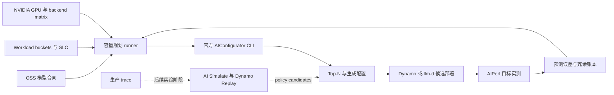
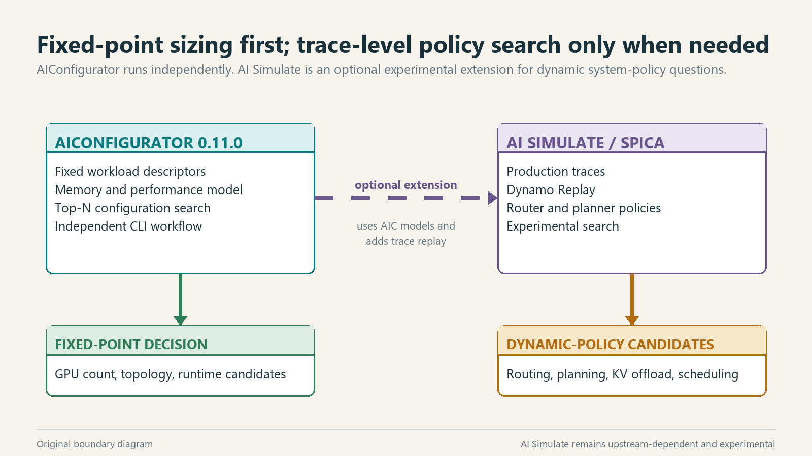
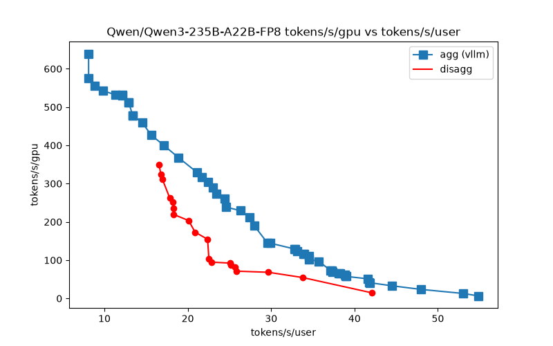

# 面向 NVIDIA GPU 的 OSS 模型容量规划

[](https://github.com/ai-dynamo/aiconfigurator/tree/v0.11.0)
[](evidence/)
[](https://ai-dynamo.org/aiconfigurator/support-matrix/)
[](requirements.txt)
[](../../LICENSE)

> 建立一套可复用的开源工作流：输入模型、workload、服务目标、推理 runtime 和 NVIDIA 平台，得到排序后的部署候选，再用少量目标 GPU benchmark 校准预测。

> Author: 魏新宇 (Xinyu Wei)

[English](README.md) | [中文](README-CN.md)

[官方项目](#2-官方开源项目) · [容量规划方法](#3-容量规划合同) · [预测与实测](#4-预测与实测如何衔接) · [开源结合计划](#5-拟议的开源结合与贡献计划) · [实施路线图](#6-拟议实施路线图) · [示例](#7-完整示例) · [证据](#附录-b-证据与参考资料)

---

## 1. 执行摘要

OSS 模型（包括 open-weight 模型）的容量规划，不能只根据参数量查一个 GPU 数字。模型架构与量化、workload 形状、时延目标、GPU 拓扑、推理后端和服务模式都会改变答案。

这套工作流从版本化的模型、workload 和平台合同开始。NVIDIA AIConfigurator 负责生成排序后的部署候选；只有最能区分方案的少量候选才进入目标 GPU benchmark；最终容量由实测预测误差和运维冗余共同决定。AI Simulate 只在需要分析 trace 级动态系统策略时作为实验性扩展，不是固定 workload 容量规划的前置条件。

第 7 节用两个 Qwen 案例完整走一遍工作流。它们只是示例，不限定通用工具的模型范围。其中的 50 req/s 是人为设定的容量场景，不是通用吞吐目标。

## 2. 官方开源项目

### 2.1 上游项目与职责

| 项目 | 官方地址 | 在容量规划中的职责 | 本报告使用状态 |
|---|---|---|---|
| NVIDIA AIConfigurator | [GitHub repository](https://github.com/ai-dynamo/aiconfigurator) · [v0.11.0](https://github.com/ai-dynamo/aiconfigurator/tree/v0.11.0) · [CLI guide](https://github.com/ai-dynamo/aiconfigurator/blob/v0.11.0/docs/cli_user_guide.md) | 性能建模、配置搜索、候选排序和部署配置生成 | 主要 sizing engine；版本 `0.11.0`，commit `614b9c8c8725332533616786e2eb049df48935f0` |
| NVIDIA Dynamo | [GitHub repository](https://github.com/ai-dynamo/dynamo) | 分布式推理编排，也是生成配置的部署目标 | 集成目标；本次研究未执行部署 |
| NVIDIA AI Simulate | [Dynamo v1.4.2 source](https://github.com/ai-dynamo/dynamo/tree/v1.4.2/aisimulate) | 对 engine 与 Dynamo 配置进行实验性 trace replay 和参数搜索 | 未来可选集成；本次研究未执行 |
| NVIDIA AIPerf | [GitHub repository](https://github.com/ai-dynamo/aiperf) | 生成 benchmark 负载并测量目标 runtime | 拟议的校准路径；本项目未执行 |
| llm-d | [GitHub repository](https://github.com/llm-d/llm-d) | Kubernetes 分布式推理 serving stack，也是生成配置的部署目标 | 集成目标；本次研究未执行部署 |
| vLLM | [GitHub repository](https://github.com/vllm-project/vllm) | 开源推理后端 | 一个本地示例使用其性能数据库；未启动模型服务 |
| SGLang | [GitHub repository](https://github.com/sgl-project/sglang) | 开源推理后端 | 上游支持的集成目标；本项目未执行 |
| TensorRT-LLM | [GitHub repository](https://github.com/NVIDIA/TensorRT-LLM) | NVIDIA 优化的推理后端 | 一个本地示例使用其性能数据库；未启动模型服务 |

AIConfigurator 采用 Apache-2.0 许可证。它的内置性能数据围绕 NVIDIA GPU 平台和特定 framework 实现构建，因此“软件开源”不等于“容量模型与硬件厂商无关”。

**方法依据：** [AIConfigurator: Lightning-Fast Configuration Optimization for Multi-Framework LLM Serving, arXiv:2601.06288v1](https://arxiv.org/abs/2601.06288v1) 定义方法、预测保真度评估、搜索效率证据和设计边界。论文是方法来源，不是可集成的软件组件。

### 2.2 建议采用的端到端目标工作流

后续所有章节都引用下面这一条工作流：

| 阶段 | 责任方 | 输入 | 输出与证据 |
|---|---|---|---|
| 1. 定义问题 | 本项目开源结合层 | 固定 revision 的模型、workload buckets、SLO、NVIDIA GPU 拓扑、后端版本 | 不可变的模型/workload/平台合同 |
| 2. 生成预测 | AIConfigurator | 三类合同与有数据覆盖的性能数据库 | Top-N 配置、预测指标、Pareto 数据和生成的部署候选 |
| 3. 部署候选 | NVIDIA Dynamo 或 llm-d | 选定候选，并对齐真实 runtime 版本 | 可运行的候选服务与部署身份 |
| 4. 目标实测 | 目标 GPU 上的 AIPerf | 固定请求合同与候选 endpoint | 实际显存、时延、吞吐、goodput、错误率和 telemetry |
| 5. 校准容量 | 本项目开源结合层 | 同一 tuple 下的预测与实测记录 | 预测误差账本、运维冗余和修订后的容量 |
| 6. 按需扩展 | AI Simulate / Dynamo Replay | 脱敏后的生产 trace 与动态策略搜索空间 | 实验性的 router、planner 或 policy 候选，仍需独立 benchmark |

本地两个示例覆盖阶段 1–2。阶段 3–5 属于拟议集成，需要目标 GPU。阶段 6 依赖上游，且仍是实验性能力。

### 2.3 AIConfigurator 提供什么

输入模型、NVIDIA system、推理后端、workload 描述和时延约束后，AIConfigurator 可以：

- 判断候选拓扑能否容纳模型；
- 按模型能力搜索 Tensor、Pipeline、Data、Expert 和 MoE Tensor Parallelism；
- 比较 Static、Aggregated 和 Disaggregated serving model；
- 预测 TTFT、TPOT、请求时延、显存和吞吐；
- 在指定约束下排序 Pareto-efficient candidates；
- 按请求率或并发目标计算副本数与总 GPU 数；
- 为支持的 runtime 和平台生成启动与部署候选。

普通配置搜索不会执行模型、优化 kernel、操作集群、自动发现生产 workload，也不能替代物理 GPU benchmark。

## 3. 容量规划合同

容量问题需要同时冻结四组输入和一个决策目标。


**图 1：原创解释图。** 模型、workload、服务目标、后端和硬件共同决定配置搜索。依据：[AIConfigurator CLI guide](https://github.com/ai-dynamo/aiconfigurator/blob/v0.11.0/docs/cli_user_guide.md) 与 [paper Section 4](https://arxiv.org/html/2601.06288v1)。图片 SHA-256：`42e48e0571826eb2f5f8457fe0d84e5b28df05f4da1acf2b2b0ab2616cdf868b`。

### 3.1 模型合同

| 字段 | 必须明确的内容 |
|---|---|
| 模型身份 | 精确 Hugging Face ID 或本地模型路径，以及 revision |
| 架构 | Dense 或 MoE、层数、hidden dimensions、Attention 与 expert 结构 |
| 精度 | BF16、FP8、FP4、INT8 或其他精确量化配置 |
| 上下文行为 | 原生 context、RoPE/YaRN、多模态 encoder 输入，以及启用时的 MTP depth |

### 3.2 Workload 合同

| 字段 | 必须明确的内容 |
|---|---|
| 请求形状 | ISL、OSL、适用时的图片尺寸/数量，以及 Prefix Cache 适用比例 |
| 到达负载 | 请求率曲线或并发、峰值持续时间和突发行为 |
| 用户行为 | Thinking/Non-thinking 占比、chat template、sampling 和输出 token 计数口径 |
| 服务目标 | TTFT、TPOT、端到端时延、goodput 和错误率目标 |

生产分析至少应拆分正常、峰值和长上下文尾部等代表性 bucket。单个平均 ISL/OSL 只是一个示例点，不能代表生产流量分布。

### 3.3 平台合同

| 字段 | 必须明确的内容 |
|---|---|
| GPU | 精确 NVIDIA system 名称与显存容量 |
| 节点拓扑 | 每节点 GPU 数、NVLink/NVSwitch domain 和节点间 fabric |
| 后端 | TensorRT-LLM、vLLM 或 SGLang，以及精确版本 |
| 部署目标 | NVIDIA Dynamo、llm-d、bare metal 或其他受支持目标 |
| 运维冗余 | 副本故障、滚动升级、启动、流量突发和尾时延余量 |

### 3.4 搜索空间与输出

搜索空间可包括 serving mode、TP/PP/DP/EP/ETP、worker 数、副本数、batch size、KV Cache 分配、chunked prefill 和受支持的 runtime flags。输出是一组带预测指标和生成配置的排序候选，不是一个脱离上下文的 GPU 数字。

```text
capacity input  = model contract + workload contract + platform contract
candidate       = serving mode + parallelism + workers + batch/runtime settings
capacity output = ranked candidates + predicted metrics + generated artifacts
```

## 4. 预测与实测如何衔接

### 4.1 GPU 用于构建上游性能数据库

AIConfigurator 的上游 data collection 会在目标 GPU 与 backend 组合上采集 GEMM、Attention、MoE、AllReduce、AllGather、AllToAll 和点对点通信等操作的执行时间。采集结果被打包为后续配置搜索使用的性能数据。

### 4.2 普通配置搜索在 CPU 上运行

对于已有数据覆盖的 model/system/backend 组合，用户侧搜索读取模型 metadata，查询打包后的性能数据，对受支持 shape 做插值，组合 iteration 与 serving 行为，过滤不可行候选，再对剩余候选排序。该路径不会加载模型权重。


**图 2：AIConfigurator 官方工作流，来源为 arXiv:2601.06288v1 Figure 2。** 图中从 PerfDatabase 与 TaskRunner，经过 InferenceSession 和 Pareto Analyzer，最终进入 Generator。[公开来源](https://arxiv.org/html/2601.06288v1/AIC_assets/AIC-Workflow.png)。图片 SHA-256：`ee1db977c816218ca0cb6b8e3eff6237c1dd55051d507f0e5579d5b08012bc0f`。

### 4.3 物理 benchmark 用于校准预测

生成的候选仍需部署到目标 runtime 和硬件。AIPerf 或等价 load generator 负责测量实际显存、TTFT、TPOT、请求时延、吞吐、goodput 和错误率。预测与实测的差值按模型、workload bucket、后端版本和 GPU 拓扑保存。

| 证据层 | 是否使用 GPU | 能证明什么 |
|---|:---:|---|
| 上游性能数据采集 | 是 | 指定 system/backend/version 的操作级或 forward-pass 实测 |
| AIConfigurator 搜索 | 不需要 | 输入合同下的候选配置预测排名 |
| 生成部署配置 | 不需要 | 指定目标版本的候选配置语法 |
| 目标 runtime benchmark | 是 | 一个精确 model/workload/runtime/hardware tuple 的实际行为 |
| 生产校准 | 是 | 包含实测误差与运维冗余的容量 |

## 5. 拟议的开源结合与贡献计划

### 5.1 目标

拟议结合层的目标，是在不替代 AIConfigurator 的前提下，把专家操作的 CLI 变成可重复执行的容量规划工作流。每条建议都应从输入合同追溯到预测、生成配置、目标 benchmark 和容量校准。

已提交证据记录了两个 OSS 模型示例的官方 AIConfigurator CLI 结果。当前仓库**不包含**独立 adapter、上游 pull request、通用 schema 或 benchmark calibration service。下面是拟议实施计划，不是已完成功能清单。

### 5.2 集成架构



结合层负责输入规范化、运行标识、证据打包、校准和预测误差策略。AIConfigurator 仍是配置搜索权威；Dynamo/llm-d 负责部署；AIPerf 负责实测负载；AI Simulate 负责其实验性 trace-search 路径。

### 5.3 拟议仓库契约

| 拟议目录 | 合同 | 状态 |
|---|---|---|
| `configs/models/` | 模型 ID、revision、架构、精度和 context 设置 | 拟议 |
| `configs/workloads/` | 命名的 normal/peak/tail buckets，包含 ISL/OSL、负载、cache 与 SLO | 拟议 |
| `configs/platforms/` | NVIDIA GPU、节点拓扑、后端/数据库版本与部署目标 | 拟议 |
| `runs/<run-id>/inputs/` | 所有合同的不可变副本与来源哈希 | 拟议 |
| `runs/<run-id>/prediction/` | 官方 CLI argv、日志、Top-N CSV、Pareto 输出与生成配置 | 已捕获本地示例；通用合同仍为拟议 |
| `runs/<run-id>/benchmark/` | runtime/image identity、AIPerf 命令、原始测量与遥测 | 拟议；本项目尚未执行 GPU |
| `runs/<run-id>/calibration.json` | 按指标记录预测/实测差值与批准的冗余 | 拟议 |
| `adapters/` | 官方 CLI 与部署目标的薄调用适配器 | 拟议；不得重新实现 AIConfigurator 搜索逻辑 |

## 6. 拟议实施路线图

| 阶段 | 交付物 | 判断依据 | 当前状态 |
|---|---|---|---|
| 0. 参考证据 | 保存官方 CLI、logs、Top-N CSV、生成配置与 hashes | 至少一个 Dense 和一个 MoE/open-weight 示例可在本地审计 | 已提交示例 Top-N 证据；可复用 run manifest 尚未实现 |
| 1. 合同层 | 模型/workload/平台/目标的 JSON Schema 或 YAML 合同 | 无效或不完整的问题在搜索前失败 | 拟议 |
| 2. 通用 runner | 原样调用上游 `support`、`default`、`recommend` 与选定的 `exp` | 一个命令生成隔离运行目录和证据清单 | 拟议 |
| 3. 矩阵与比较 | 扫描模型 x NVIDIA GPU x 后端 x workload bucket 并保留 Top-N | 结果按精确版本与证据类型隔离 | 拟议 |
| 4. Benchmark 校准 | 部署选定候选，在预测工作点附近运行 AIPerf | 预测/实测差值和冗余可由机器读取 | 拟议；需要目标 GPU |
| 5. 社区贡献 | 通过 upstream issue、data collection 或 pull request 增加可复现覆盖 | 上游接受产物，或贡献可公开 review | 拟议；当前没有 PR |
| 6. Trace-level 扩展 | 把脱敏 trace 输入 AI Simulate/Dynamo Replay，搜索 router、planner 与 policy | 实验固定版本并完成独立 benchmark | 依赖上游，且处于实验阶段 |

第一个公开里程碑应止于 Phase 2：发布 schemas、两个示例合同，以及一个不重写搜索逻辑的官方 CLI thin runner。矩阵自动化、GPU 校准、上游贡献和 AI Simulate 分别作为后续里程碑，并保留独立证据。



**图 3：根据公开 AIConfigurator v0.11.0 与 Dynamo v1.4.2 源码绘制的原创边界图。** AIConfigurator 可以针对固定 workload 独立运行；AI Simulate/Spica 使用 Dynamo Replay 扩展动态搜索，仍处于实验阶段。[AI Simulate source](https://github.com/ai-dynamo/dynamo/tree/v1.4.2/aisimulate)。图片 SHA-256：`0b7c56f3dc0b18504a09c20864ae371b6e097b9057497e10cfbcbea301fbb3ab`。

## 7. 完整示例

下面两个示例说明同一容量规划方法可以处理不同模型规模、架构、NVIDIA GPU 和推理后端。它们不为通用工作流定义固定服务目标。

| 示例 | 模型 | 目标平台 | 后端性能数据库 | 人为设定的 workload | 主要预测结果 |
|---|---|---|---|---|---|
| Dense 模型示例 | `Qwen/Qwen3-32B-FP8` | H200 SXM | TensorRT-LLM | ISL 4,000；OSL 1,000；TTFT <=2,000 ms；TPOT <=30 ms；50 req/s | Aggregated 需要 32 张 H200；Disaggregated 需要 34 张 H200 |
| 大型 MoE 案例 | `Qwen/Qwen3-235B-A22B-FP8` | H100 SXM | vLLM `0.24.0` | ISL 4,000；OSL 1,000；TTFT <=2,000 ms；TPOT <=30 ms；50 req/s | 四卡 `TP4/ETP4` worker；Aggregated 示例容量为 428 张 H100 |

### 7.1 Qwen3-32B-FP8 on H200 SXM

上游 `support` 和 `recommend` 路径在 CPU 上完成。在示例 workload 下，Aggregated Top-1 使用 32 个单卡副本；Disaggregated Top-1 使用 17 个副本，每个副本由 1 张 Prefill GPU 与 1 张 Decode GPU 组成，共 34 张 GPU。


**图 4：本地 CPU-offline prediction，不是 H200 benchmark。** AIConfigurator v0.11.0、Qwen3-32B-FP8、H200 SXM、TensorRT-LLM，人为设定 50 req/s workload。[Aggregated CSV](evidence/qwen3-32b-h200-agg-topn.csv) · [Disaggregated CSV](evidence/qwen3-32b-h200-disagg-topn.csv)。图片 SHA-256：`b290bbd126594ca3ac923591b567f6b4cd5e838de6c73ef512405aa3caa08690`。

### 7.2 Qwen3-235B-A22B-FP8 on H100 SXM

同一工作流被用于 235B total / 22B active、128 experts、8 activated experts 的 MoE 模型。两卡预算在这次搜索中没有得到可行候选。最小预测 worker 使用 4 张 H100 SXM，拓扑为 `TP4/PP1/DP1/ETP4/EP1`。在人为设定的 50 req/s 工作点，Aggregated Top-1 使用 107 个四卡副本，共 428 张 GPU。

```text
107 replicas x 4 H100 SXM GPUs = 428 H100 SXM GPUs
```



**图 5：本地 CPU-offline prediction，不是 H100 benchmark。** AIConfigurator v0.11.0、Qwen3-235B-A22B-FP8、H100 SXM、vLLM 0.24.0，人为设定 50 req/s workload。428 来自排序后的 CSV，不是从图中读取。[Aggregated CSV](evidence/qwen3-235b-h100-agg-topn.csv) · [Disaggregated CSV](evidence/qwen3-235b-h100-disagg-topn.csv)。图片 SHA-256：`2f0aef7b052857e3084b518a29a159bf9ab6a1e47e380a3c59d3126756a8c352`。

运行日志还显示，vLLM `0.24.0` 在 H100 SXM 上缺少 FP8 `context_attention` 性能数据，因此 AIConfigurator 回退使用 BF16 FMHA 数据。235B/H100 数字应按带有该数据库回退边界的版本特定预测解读。

428 不是 Qwen3-235B 的通用容量要求。它只属于特定模型版本系列、目标系统、后端性能数据库、workload point 和 SLA。改变输出长度分布、请求率、cache profile、backend 或 GPU，结果都会变化。

## 8. 边界与风险

| 边界 | 对容量决策的影响 |
|---|---|
| Support matrix 按版本生效 | 不支持的组合需要更换 backend/system、明确降级为研究模式，或补充新的实测数据 |
| `SILICON` 表示数据库输入来自实测 | 端到端 TTFT、TPOT、显存和吞吐在 benchmark 前仍是预测输出 |
| 上游 Known Issues 仍提示 vLLM 与 SGLang 的对齐工作 | 生产使用必须测量目标版本 |
| Search、generator 与 runtime 版本可能不同 | 生成 YAML 只是候选，直到真实 runtime 接受并成功 serving |
| 单个 workload point 不是流量分布 | 正常、峰值和尾部 bucket 必须分别重算容量 |
| 预测误差不等于运维冗余 | 尾时延、突发、故障、启动和升级需要单独预留 |
| AI Simulate 仍是实验能力 | 不提供 SLA、准确率或全局最优保证 |
| 已提交证据只有 CPU-offline predictions | 已提交结果不能证明 H100/H200 实际性能或生产容量 |

## 附录 A. 通用上游入口

```bash
aiconfigurator cli support \
  --model-path <model-id-or-path> \
  --system <nvidia-system> \
  --backend <trtllm-vllm-or-sglang>

aiconfigurator cli recommend \
  --model-path <model-id-or-path> \
  --system <nvidia-system> \
  --backend <trtllm-vllm-or-sglang> \
  --target-concurrency <concurrent-requests> \
  --isl <input-tokens> \
  --osl <output-tokens> \
  --ttft <milliseconds> \
  --tpot <milliseconds> \
  --database-mode SILICON \
  --strict-sla \
  --save-dir <isolated-run-directory>
```

`--target-request-rate <req/s>` 可以替代 `--target-concurrency`，两种负载目标互斥。参数值来自 workload 合同，不是项目内写死的默认值。

### 重建原创图片

制图脚本需要 Python 3.11、Pillow 12.3.0，以及 Windows 自带的 Segoe UI 字体。脚本根据已提交源码和 CSV 证据重新生成图 1、图 3 和图 4。

```powershell
python -m pip install -r requirements.txt
python tools/make_report_figures.py
```

## 附录 B. 证据与参考资料

### 已提交证据

- [Qwen3-32B/H200 Aggregated Top-N CSV](evidence/qwen3-32b-h200-agg-topn.csv)
- [Qwen3-32B/H200 Disaggregated Top-N CSV](evidence/qwen3-32b-h200-disagg-topn.csv)
- [Qwen3-235B/H100 Aggregated Top-N CSV](evidence/qwen3-235b-h100-agg-topn.csv)
- [Qwen3-235B/H100 Disaggregated Top-N CSV](evidence/qwen3-235b-h100-disagg-topn.csv)
- [原创制图脚本](tools/make_report_figures.py)

### 公开参考资料

- [AIConfigurator repository](https://github.com/ai-dynamo/aiconfigurator)
- [AIConfigurator v0.11.0 CLI guide](https://github.com/ai-dynamo/aiconfigurator/blob/v0.11.0/docs/cli_user_guide.md)
- [AIConfigurator paper](https://arxiv.org/abs/2601.06288v1)
- [AIConfigurator support matrix](https://ai-dynamo.org/aiconfigurator/support-matrix/)
- [NVIDIA Dynamo](https://github.com/ai-dynamo/dynamo)
- [llm-d](https://github.com/llm-d/llm-d)
- [AI Simulate v1.4.2](https://github.com/ai-dynamo/dynamo/tree/v1.4.2/aisimulate)
- [NVIDIA AIPerf](https://github.com/ai-dynamo/aiperf)