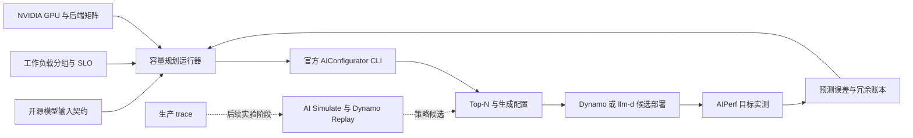

# 面向 NVIDIA GPU 的开源与开放权重模型容量规划

[](https://github.com/ai-dynamo/aiconfigurator/tree/v0.11.0)
[](evidence/)
[](https://ai-dynamo.org/aiconfigurator/support-matrix/)
[](requirements-repro.txt)
[](../../LICENSE)

> 建立一套可复用的开源容量规划流程：输入模型、工作负载、服务目标、推理运行时和 NVIDIA 平台，得到排序后的部署候选，再用少量目标 GPU 实测校准预测。

> Author: 魏新宇 (Xinyu Wei)

[English](README.md) | [中文](README-CN.md)

[详细操作](#5-完整复现一次-cpu-离线预测) · [官方项目](#2-官方开源项目) · [容量规划方法](#3-容量规划输入契约) · [开源集成计划](#6-拟议的开源集成与贡献计划) · [示例](#8-完整示例) · [证据](#附录-b-证据与参考资料)

---

## 1. 执行摘要

开源模型和开放权重模型的容量规划，不能只按参数量查一个 GPU 数。模型架构与量化、工作负载形状、时延目标、GPU 拓扑、推理后端和服务形态都会改变答案。

这套流程先冻结带版本的模型、工作负载和平台输入契约。NVIDIA AIConfigurator 负责生成排序后的部署候选；只有最能区分方案的少量候选才进入目标 GPU 实测；最终容量由目标 GPU 实测得到的预测误差和运维冗余共同决定。只有在分析 trace 级动态系统策略时，才需要把 AI Simulate 作为实验性扩展；固定工作负载的容量规划不依赖它。

第 8 节用两个 Qwen 案例说明同一套方法如何处理不同模型。它们只是示例，不限定工具的模型范围。其中的 50 req/s 是人为设定的容量场景，不是通用吞吐目标。

## 2. 官方开源项目

### 2.1 上游项目与职责

| 项目 | 官方地址 | 在容量规划中的职责 | 本项目使用方式 |
|---|---|---|---|
| NVIDIA AIConfigurator | [GitHub repository](https://github.com/ai-dynamo/aiconfigurator) · [v0.11.0](https://github.com/ai-dynamo/aiconfigurator/tree/v0.11.0) · [CLI guide](https://github.com/ai-dynamo/aiconfigurator/blob/v0.11.0/docs/cli_user_guide.md) | 性能建模、配置搜索、候选排序和部署配置生成 | 核心容量估算引擎；版本 `0.11.0`，commit `614b9c8c8725332533616786e2eb049df48935f0` |
| NVIDIA Dynamo | [GitHub repository](https://github.com/ai-dynamo/dynamo) | 分布式推理编排，也是生成配置的部署目标 | 集成目标；本次研究未执行部署 |
| NVIDIA AI Simulate | [Dynamo v1.4.2 source](https://github.com/ai-dynamo/dynamo/tree/v1.4.2/aisimulate) | 对 engine 与 Dynamo 配置进行实验性 trace replay 和参数搜索 | 未来可选集成；本次研究未执行 |
| NVIDIA AIPerf | [GitHub repository](https://github.com/ai-dynamo/aiperf) | 生成基准测试负载并测量目标运行时 | 拟议的校准路径；本项目未执行 |
| llm-d | [GitHub repository](https://github.com/llm-d/llm-d) | Kubernetes 分布式推理 serving stack，也是生成配置的部署目标 | 集成目标；本次研究未执行部署 |
| vLLM | [GitHub repository](https://github.com/vllm-project/vllm) | 开源推理后端 | 一个本地示例使用其性能数据库；未启动模型服务 |
| SGLang | [GitHub repository](https://github.com/sgl-project/sglang) | 开源推理后端 | 上游支持的集成目标；本项目未执行 |
| TensorRT-LLM | [GitHub repository](https://github.com/NVIDIA/TensorRT-LLM) | NVIDIA 优化的推理后端 | 一个本地示例使用其性能数据库；未启动模型服务 |

AIConfigurator 采用 Apache-2.0 许可证。它的内置性能画像围绕 NVIDIA GPU 平台和特定框架实现建立，因此“软件开源”不等于“容量模型与硬件厂商无关”。

**方法依据：** [AIConfigurator: Lightning-Fast Configuration Optimization for Multi-Framework LLM Serving, arXiv:2601.06288v1](https://arxiv.org/abs/2601.06288v1) 定义方法、预测保真度评估、搜索效率证据和设计边界。论文是方法来源，不是可集成的软件组件。

### 2.2 建议采用的端到端目标工作流

后续所有章节都引用下面这一条工作流：

| 阶段 | 责任方 | 输入 | 输出与证据 |
|---|---|---|---|
| 1. 定义问题 | 本项目集成层 | 固定 revision 的模型、工作负载分组、SLO、NVIDIA GPU 拓扑和后端版本 | 不可变的模型、工作负载和平台输入契约 |
| 2. 生成预测 | AIConfigurator | 上述输入契约与已有数据覆盖的性能数据库 | Top-N 配置、预测指标、Pareto 数据和生成的部署候选 |
| 3. 部署候选服务 | NVIDIA Dynamo 或 llm-d | 选定候选，并对齐真实运行时版本 | 可运行的候选服务及其部署身份 |
| 4. 目标实测 | AIPerf 或等价负载发生器 | 固定请求契约与候选服务端点 | 实际显存、时延、吞吐、goodput、错误率和运行时/GPU 遥测 |
| 5. 校准容量 | 本项目集成层 | 同一模型、工作负载、后端版本和 GPU 拓扑组合下的预测与实测记录 | 预测误差账本、运维冗余和修订后的容量 |
| 6. 按需扩展 | AI Simulate / Dynamo Replay | 脱敏后的生产 trace 与动态策略搜索空间 | 实验性的路由器、规划器或策略候选，仍需独立基准测试 |

本地两个示例覆盖阶段 1–2。阶段 3–5 属于拟议集成，需要目标 GPU。阶段 6 依赖上游，且仍是实验性能力。

### 2.3 AIConfigurator 提供什么

输入模型、NVIDIA 系统型号、推理后端、工作负载描述和时延约束后，AIConfigurator 可以：

- 判断候选拓扑能否容纳模型；
- 在适用时搜索张量并行、流水线并行、数据并行、专家并行（EP）和专家张量并行（ETP）；
- 比较 Static、Aggregated 和 Disaggregated 等服务形态；
- 预测 TTFT、TPOT、请求时延、显存和吞吐；
- 在指定约束下对 Pareto 有效候选进行排序；
- 按请求率或并发目标计算副本数与总 GPU 数；
- 为支持的 runtime 和平台生成启动与部署候选。

普通配置搜索不会真正运行模型、优化内核、管理集群，也不会自动识别生产负载画像；它不能替代物理 GPU 实测。

## 3. 容量规划输入契约

容量问题需要同时冻结四组输入和一个决策目标。


**图 1：原创解释图。** 模型、workload、服务目标、后端和硬件共同决定配置搜索。依据：[AIConfigurator CLI guide](https://github.com/ai-dynamo/aiconfigurator/blob/v0.11.0/docs/cli_user_guide.md) 与 [paper Section 4](https://arxiv.org/html/2601.06288v1)。图片 SHA-256：`42e48e0571826eb2f5f8457fe0d84e5b28df05f4da1acf2b2b0ab2616cdf868b`。

### 3.1 模型输入契约

| 字段 | 必须明确的内容 |
|---|---|
| 模型身份 | 精确 Hugging Face ID 或本地模型路径，以及 revision |
| 架构 | Dense 或 MoE、层数、hidden dimensions、Attention 与 expert 结构 |
| 精度 | BF16、FP8、FP4、INT8 或其他精确量化配置 |
| 上下文行为 | 原生 context、RoPE/YaRN、多模态 encoder 输入，以及启用时的 MTP depth |

### 3.2 工作负载输入契约

| 字段 | 必须明确的内容 |
|---|---|
| 请求形状 | ISL、OSL、适用时的图片尺寸/数量，以及 Prefix Cache 适用比例 |
| 到达负载 | 请求率曲线或并发、峰值持续时间和突发行为 |
| 用户行为 | Thinking/Non-thinking 占比、chat template、sampling 和输出 token 计数口径 |
| 服务目标 | TTFT、TPOT、端到端时延、goodput 和错误率目标 |

生产分析至少应拆分正常、峰值和长上下文尾部等代表性 bucket。单个平均 ISL/OSL 只是一个示例点，不能代表生产流量分布。

### 3.3 平台输入契约

| 字段 | 必须明确的内容 |
|---|---|
| GPU | 精确的 NVIDIA 系统型号与显存容量 |
| 节点拓扑 | 每节点 GPU 数、NVLink/NVSwitch domain 和节点间 fabric |
| 后端 | TensorRT-LLM、vLLM 或 SGLang，以及精确版本 |
| 部署目标 | NVIDIA Dynamo、llm-d、bare metal 或其他受支持目标 |
| 运维冗余 | 副本故障、滚动升级、启动、流量突发和尾时延余量 |

### 3.4 搜索空间与输出

搜索空间可包括 serving mode、TP/PP/DP/EP/ETP、worker 数、副本数、batch size、KV Cache 分配、chunked prefill 和受支持的 runtime flags。输出是一组带预测指标和生成配置的排序候选，不是一个脱离上下文的 GPU 数字。

```text
capacity input  = model contract + workload contract + platform contract
candidate       = serving mode + parallelism + workers + batch/runtime settings
capacity output = ranked candidates + predicted metrics + generated artifacts
```

## 4. 预测与实测如何衔接

### 4.1 上游性能数据库需要在 GPU 上采集

AIConfigurator 的上游数据采集会在目标 GPU 与后端组合上采集 GEMM、Attention、MoE、AllReduce、AllGather、AllToAll 和点对点通信等算子与通信路径的执行时间。采集结果会打包成后续配置搜索使用的性能数据。

### 4.2 普通配置搜索在 CPU 上运行

对于已有性能数据覆盖的模型、系统型号和后端组合，搜索过程会读取模型元数据，查询打包后的性能数据，对受支持的张量形状做插值，并把单步迭代开销与服务行为组合成端到端预测；随后过滤不可行候选并排序。该路径不会加载模型权重。


**图 2：AIConfigurator 官方工作流，取自 arXiv:2601.06288v1。** 图中从 PerfDatabase 与 TaskRunner，经过 InferenceSession 和 Pareto Analyzer，最终进入 Generator。[公开来源](https://arxiv.org/html/2601.06288v1/AIC_assets/AIC-Workflow.png)。图片 SHA-256：`ee1db977c816218ca0cb6b8e3eff6237c1dd55051d507f0e5579d5b08012bc0f`。

### 4.3 物理 benchmark 用于校准预测

生成的候选仍需部署到目标运行时和硬件。在目标环境中运行 AIPerf 或等价负载发生器，并结合运行时与 GPU telemetry 记录实际显存、TTFT、TPOT、请求时延、吞吐、goodput 和错误率。预测与实测的差值按模型、工作负载分组、后端版本和 GPU 拓扑保存。

| 证据层 | 是否使用 GPU | 能证明什么 |
|---|:---:|---|
| 上游性能数据采集 | 是 | 指定 system/backend/version 下的算子级或单次 forward pass 实测耗时 |
| AIConfigurator 搜索 | 不需要 | 输入合同下的候选配置预测排名 |
| 生成部署配置 | 不需要 | 指定目标版本的候选配置语法 |
| 目标运行时实测 | 是 | 一个精确 model/workload/runtime/hardware 组合的实际行为 |
| 生产校准 | 是 | 包含实测误差与运维冗余的容量 |

## 5. 完整复现一次 CPU 离线预测

本节从仓库检出开始，完整复现 Qwen3-32B/H200 示例，直到结果校验结束。全程调用真实 AIConfigurator CLI，并保存 stdout/stderr；不需要 GPU。命令中的 H200 system 只用于选择已打包的 H200 性能数据，不会创建或占用 H200。

### 5.1 先看参考运行的完整过程

参考运行没有隐藏首次失败：

| 阶段 | 实际结果 | 完整 CLI 记录 | 完成标准 |
|---|---|---|---|
| 支持性预检 | PASS，退出码 `0` | [`01-support.log`](evidence/runs/qwen3-32b-h200-trtllm-50rps/logs/01-support.log) | Aggregated 和 Disaggregated 都返回 `YES` |
| 第一次容量搜索 | FAIL，退出码 `1`，归类为 `ENVIRONMENT` | [`02-recommend-plotext6-failure.log`](evidence/runs/qwen3-32b-h200-trtllm-50rps/logs/02-recommend-plotext6-failure.log) | 候选搜索完成，随后在 `plotext.plot_size` 处生成报告失败 |
| 局部修复 | 固定 `plotext==5.3.2`；模型、工作负载、后端和 SLA 均不变 | [`requirements-repro.txt`](requirements-repro.txt) | 安装后版本输出为 `5.3.2` |
| 原命令重跑 | PASS，退出码 `0` | [`03-recommend-success.log`](evidence/runs/qwen3-32b-h200-trtllm-50rps/logs/03-recommend-success.log) | Top-1 为 Aggregated 32 张 H200、Disaggregated 34 张 H200 |

[`run-manifest.json`](evidence/runs/qwen3-32b-h200-trtllm-50rps/run-manifest.json) 记录了每个阶段的完整 argv、时间戳、源文件 SHA、公开文件 SHA 和脱敏次数。

### 5.2 第 0 步：确认执行环境

使用 Linux x86-64、glibc 2.28 或更高版本，以及 Python 3.11。参考运行的环境是 Ubuntu 24.04、glibc 2.39、Python 3.11.15。首次安装软件包和解析未缓存的模型 metadata 时需要网络；不需要 CUDA、模型服务或 GPU。

```bash
uname -m
ldd --version | head -n 1
python3.11 --version
```

输出形态应为：

```text
x86_64
ldd (Ubuntu GLIBC ...) 2.39
Python 3.11.x
```

**完成标准：** 架构为 `x86_64`，glibc 不低于 2.28，Python 为 3.11。

### 5.3 第 1 步：检出仓库并拉取证据文件

CSV 证据由 Git LFS 管理。运行 validator 前，必须先取回 LFS 实体。

```bash
git lfs version
git clone --filter=blob:none --sparse https://github.com/david-xinyuwei/david-share.git
git -C david-share sparse-checkout set \
  Deep-Learning/OSS-Model-Capacity-Planning-on-NVIDIA-GPUs
git -C david-share lfs pull \
  --include="Deep-Learning/OSS-Model-Capacity-Planning-on-NVIDIA-GPUs/evidence/**"
cd david-share/Deep-Learning/OSS-Model-Capacity-Planning-on-NVIDIA-GPUs
```

**完成标准：** `README.md`、`requirements-repro.txt`、`tools/` 和 `evidence/runs/` 下的两个 run 目录都存在；打开 CSV 时看到实际表格内容，而不是 LFS pointer 文本。

### 5.4 第 2 步：创建固定版本的 Python 环境

```bash
python3.11 -m venv .venv
source .venv/bin/activate
python -m pip install --no-input -r requirements-repro.txt
python - <<'PY'
from importlib.metadata import version

for package in ("aiconfigurator", "aiconfigurator-core", "plotext"):
    print(f"{package}={version(package)}")
PY
```

版本输出必须是：

```text
aiconfigurator=0.11.0
aiconfigurator-core=0.11.0
plotext=5.3.2
```

为什么必须固定 `plotext`：参考运行最初自动安装了 6.0.0。候选搜索已经完成，但生成报告时失败：

```text
AttributeError: module 'plotext' has no attribute 'plot_size'
EXIT_CODE=1
```

这不是假设的故障排查说明，而是已经保存的[`首次失败日志`](evidence/runs/qwen3-32b-h200-trtllm-50rps/logs/02-recommend-plotext6-failure.log)。干净复现直接使用修正后的依赖，不需要故意重现失败。

**完成标准：** 三个软件包版本与上方输出逐项一致。

### 5.5 第 3 步：执行支持性预检并保存日志

```bash
set -o pipefail
mkdir -p run-output/logs
support_log=run-output/logs/01-support.log
printf 'START_UTC=%s\n' "$(date -u +%Y-%m-%dT%H:%M:%SZ)" | tee "$support_log"
aiconfigurator cli support \
  --model-path Qwen/Qwen3-32B-FP8 \
  --system h200_sxm \
  --backend trtllm \
  --no-color 2>&1 | tee -a "$support_log"
support_rc=${PIPESTATUS[0]}
printf 'EXIT_CODE=%s\nEND_UTC=%s\n' \
  "$support_rc" "$(date -u +%Y-%m-%dT%H:%M:%SZ)" | tee -a "$support_log"
test "$support_rc" -eq 0
```

参考输出：

```text
Model:           Qwen/Qwen3-32B-FP8
System:          h200_sxm
Backend:         trtllm
Aggregated Support:    YES
Disaggregated Support: YES
EXIT_CODE=0
```

完整输出见[`支持性预检日志`](evidence/runs/qwen3-32b-h200-trtllm-50rps/logs/01-support.log)。

**完成标准：** 两种服务形态都返回 `YES`，捕获的退出码为 `0`。如果返回 `NO`，应在这里停止；换后端或换数据库模式属于另一组实验，不能冒充同一次复现。

### 5.6 第 4 步：执行容量搜索并保存日志

```bash
recommend_log=run-output/logs/02-recommend.log
printf 'START_UTC=%s\n' "$(date -u +%Y-%m-%dT%H:%M:%SZ)" | tee "$recommend_log"
aiconfigurator cli recommend \
  --model-path Qwen/Qwen3-32B-FP8 \
  --system h200_sxm \
  --backend trtllm \
  --target-request-rate 50 \
  --isl 4000 \
  --osl 1000 \
  --ttft 2000 \
  --tpot 30 \
  --database-mode SILICON \
  --strict-sla \
  --top-n 5 \
  --save-dir ./run-output/results \
  --no-color 2>&1 | tee -a "$recommend_log"
recommend_rc=${PIPESTATUS[0]}
printf 'EXIT_CODE=%s\nEND_UTC=%s\n' \
  "$recommend_rc" "$(date -u +%Y-%m-%dT%H:%M:%SZ)" | tee -a "$recommend_log"
test "$recommend_rc" -eq 0
```

参考结果：

```text
Target Load: 50.0 req/s
agg GPUs needed: 32 (replicas: 32)
disagg GPUs needed: 34 (replicas: 17)
Best Experiment Chosen: agg
Request Rate: 50.53 req/s
TTFT: 1114.22ms
TPOT: 29.66ms
EXIT_CODE=0
```

完整的[`成功日志`](evidence/runs/qwen3-32b-h200-trtllm-50rps/logs/03-recommend-success.log)还保留了所有 Top-N 行和版本告警。本次搜索使用 TensorRT-LLM `1.3.0rc10` 性能数据库；生成配置通过 Dynamo 1.2.0 默认映射到 TensorRT-LLM `1.3.0rc14`，工具还提示缺少该版本专用的 CLI 模板。因此，在对齐版本并让真实运行时成功读取之前，YAML 只能作为候选配置。

**完成标准：** 命令退出码为 `0`，同时生成 `agg/` 和 `disagg/` 结果，所选候选满足请求率、TTFT 与 TPOT 约束。

### 5.7 第 5 步：检查 Top-1 数据与容量算术

AIConfigurator 会在 `run-output/results` 下再生成一层包含模型名的目录。下面的检查会找到这层目录，读取两种模式的 Top-1，并重新计算总 GPU 数：

```bash
python - <<'PY'
import csv
from pathlib import Path

root = Path("run-output/results")
expected = {"agg": 32, "disagg": 34}
for mode, expected_gpus in expected.items():
    paths = list(root.rglob(f"{mode}/best_config_topn.csv"))
    assert len(paths) == 1, (mode, paths)
    with paths[0].open(newline="") as handle:
        row = next(csv.DictReader(handle))
    replicas = int(row["replicas_needed"])
    gpus_per_replica = int(row["num_total_gpus"])
    total_gpus = int(row["total_gpus_needed"])
    cluster_rate = float(row["request_rate"]) * replicas
    assert replicas * gpus_per_replica == total_gpus == expected_gpus
    assert cluster_rate >= 50
    assert float(row["ttft"]) <= 2000
    assert float(row["tpot"]) <= 30
    print(
        f"{mode}: GPUs={total_gpus}, replicas={replicas}, "
        f"GPUs/replica={gpus_per_replica}, cluster_req_s={cluster_rate:.2f}, "
        f"TTFT={float(row['ttft']):.2f}ms, TPOT={float(row['tpot']):.2f}ms"
    )
PY
```

预期输出：

```text
agg: GPUs=32, replicas=32, GPUs/replica=1, cluster_req_s=50.53, TTFT=1114.22ms, TPOT=29.66ms
disagg: GPUs=34, replicas=17, GPUs/replica=2, cluster_req_s=51.20, TTFT=537.83ms, TPOT=29.94ms
```

将新结果与仓库中的参考证据逐项比较：

- Aggregated：[`Top-N`](evidence/runs/qwen3-32b-h200-trtllm-50rps/results/agg/best_config_topn.csv)、[`Pareto 数据`](evidence/runs/qwen3-32b-h200-trtllm-50rps/results/agg/pareto.csv)、[`实验配置`](evidence/runs/qwen3-32b-h200-trtllm-50rps/results/agg/exp_config.yaml)、[`Top-1 候选配置`](evidence/runs/qwen3-32b-h200-trtllm-50rps/results/agg/top1/agg_config.yaml)
- Disaggregated：[`Top-N`](evidence/runs/qwen3-32b-h200-trtllm-50rps/results/disagg/best_config_topn.csv)、[`Pareto 数据`](evidence/runs/qwen3-32b-h200-trtllm-50rps/results/disagg/pareto.csv)、[`实验配置`](evidence/runs/qwen3-32b-h200-trtllm-50rps/results/disagg/exp_config.yaml)、[`Prefill 候选配置`](evidence/runs/qwen3-32b-h200-trtllm-50rps/results/disagg/top1/prefill_config.yaml)、[`Decode 候选配置`](evidence/runs/qwen3-32b-h200-trtllm-50rps/results/disagg/top1/decode_config.yaml)

**完成标准：** 检查脚本打印出上面两行结果，且所有参考证据链接均可打开。

### 5.8 第 6 步：校验仓库中的完整证据链

```bash
python tools/validate_evidence.py
```

预期终端输出：

```text
RUN qwen3-235b-h100-vllm-50rps PASS files=16
RUN qwen3-32b-h200-trtllm-50rps PASS files=15
README_VALIDATION=PASS LOG_LINKS=7 COMMAND_BLOCKS=9
EVIDENCE_VALIDATION=PASS RUNS=2 PUBLIC_BOUNDARY=PASS
```

校验器会重新计算每个公开文件的 SHA-256，检查日志退出码，拒绝私有路径，复算 32/34 与 428/920，核对四卡 MoE topology，并检查记录的 CPU 内存峰值。

**完成标准：** 最后一行必须严格等于 `EVIDENCE_VALIDATION=PASS RUNS=2 PUBLIC_BOUNDARY=PASS`。

## 6. 拟议的开源集成与贡献计划

### 6.1 目标

拟议集成层的目标，是在不替代 AIConfigurator 的前提下，把专家操作的 CLI 变成可重复执行的容量规划流程。每条建议都应从输入契约追溯到预测、生成配置、目标实测和容量校准。

已提交证据记录了两个开源模型示例的官方 AIConfigurator CLI 结果。当前仓库**不包含**独立适配器、上游 pull request、通用 schema 或基准测试校准服务。下面是拟议实施计划，不是已完成功能清单。

### 6.2 集成架构



集成层负责输入规范化、运行标识、证据打包、校准和预测误差策略。AIConfigurator 仍是配置搜索权威；Dynamo/llm-d 负责部署；AIPerf 负责生成实测负载；AI Simulate 负责实验性的 trace 级搜索路径。

### 6.3 拟议仓库约定

| 拟议目录 | 内容约定 | 状态 |
|---|---|---|
| `configs/models/` | 模型 ID、revision、架构、精度和 context 设置 | 拟议 |
| `configs/workloads/` | 命名的 normal/peak/tail buckets，包含 ISL/OSL、负载、cache 与 SLO | 拟议 |
| `configs/platforms/` | NVIDIA GPU、节点拓扑、后端/数据库版本与部署目标 | 拟议 |
| `runs/<run-id>/inputs/` | 所有合同的不可变副本与来源哈希 | 拟议 |
| `runs/<run-id>/prediction/` | 官方 CLI argv、日志、Top-N CSV、Pareto 输出与生成配置 | 已捕获本地示例；通用输入契约仍属拟议 |
| `runs/<run-id>/benchmark/` | 运行时和镜像身份、AIPerf 命令、原始测量与遥测 | 拟议；本项目尚未执行 GPU |
| `runs/<run-id>/calibration.json` | 按指标记录预测/实测差值与批准的冗余 | 拟议 |
| `adapters/` | 官方 CLI 与部署目标的轻量适配器 | 拟议；不得重新实现 AIConfigurator 搜索逻辑 |

## 7. 拟议实施路线图

| 阶段 | 交付物 | 判断依据 | 当前状态 |
|---|---|---|---|
| 0. 参考证据 | 保存官方 CLI、logs、Top-N CSV、生成配置与 hashes | 至少一个稠密模型和一个 MoE/开放权重模型示例可在本地审计 | 已提交示例 Top-N 证据和 run manifest；通用 runner 的可复用 manifest 生成机制尚未实现 |
| 1. 合同层 | 模型/workload/平台/目标的 JSON Schema 或 YAML 合同 | 无效或不完整的问题在搜索前失败 | 拟议 |
| 2. 通用 runner | 原样调用上游 `support`、`default`、`recommend` 与选定的 `exp` | 一个命令生成隔离运行目录和证据清单 | 拟议 |
| 3. 矩阵与比较 | 扫描模型 x NVIDIA GPU x 后端 x 工作负载分组，并保留 Top-N | 结果按精确版本与证据类型隔离 | 拟议 |
| 4. 基准测试校准 | 部署选定候选，在预测工作点附近运行 AIPerf | 预测/实测差值和冗余可由机器读取 | 拟议；需要目标 GPU |
| 5. 社区贡献 | 通过上游 issue、数据采集或 pull request 增加可复现覆盖 | 上游接受产物，或贡献内容可公开评审 | 拟议；当前没有 PR |
| 6. Trace-level 扩展 | 把脱敏 trace 输入 AI Simulate/Dynamo Replay，搜索路由器、规划器与策略 | 实验固定版本并完成独立基准测试 | 依赖上游，且处于实验阶段 |

第一个公开里程碑应止于 Phase 2：发布 schemas、两个示例输入契约，以及一个只做轻量封装、直接调用官方 CLI 的 runner。矩阵自动化、GPU 校准、上游贡献和 AI Simulate 分别作为后续里程碑，并保留独立证据。


**图 3：根据公开 AIConfigurator v0.11.0 与 Dynamo v1.4.2 源码绘制的原创边界图。** AIConfigurator 可以针对固定 workload 独立运行；AI Simulate/Spica 使用 Dynamo Replay 扩展动态搜索，仍处于实验阶段。[AI Simulate source](https://github.com/ai-dynamo/dynamo/tree/v1.4.2/aisimulate)。图片 SHA-256：`0b7c56f3dc0b18504a09c20864ae371b6e097b9057497e10cfbcbea301fbb3ab`。

## 8. 完整示例

下面两个示例说明同一容量规划方法可以处理不同模型规模、架构、NVIDIA GPU 和推理后端。它们不代表通用流程的固定服务目标。

| 示例 | 模型 | 目标平台 | 后端性能数据库 | 人为设定的 workload | 主要预测结果 |
|---|---|---|---|---|---|
| Dense 模型示例 | `Qwen/Qwen3-32B-FP8` | H200 SXM | TensorRT-LLM | ISL 4,000；OSL 1,000；TTFT <=2,000 ms；TPOT <=30 ms；50 req/s | Aggregated 需要 32 张 H200；Disaggregated 需要 34 张 H200 |
| 大规模 MoE 模型示例 | `Qwen/Qwen3-235B-A22B-FP8` | H100 SXM | vLLM `0.24.0` | ISL 4,000；OSL 1,000；TTFT <=2,000 ms；TPOT <=30 ms；50 req/s | 四卡 `TP4/ETP4` worker；Aggregated 示例容量为 428 张 H100 |

### 8.1 Qwen3-32B-FP8 on H200 SXM

上游 `support` 和 `recommend` 路径在 CPU 上完成。在示例 workload 下，Aggregated Top-1 使用 32 个单卡副本；Disaggregated Top-1 使用 17 个副本，每个副本由 1 张 Prefill GPU 与 1 张 Decode GPU 组成，共 34 张 GPU。


**图 4：本地 CPU 离线预测，不是 H200 实机基准测试。** AIConfigurator v0.11.0、Qwen3-32B-FP8、H200 SXM、TensorRT-LLM，人为设定 50 req/s 工作负载。[完整 CLI 日志](evidence/runs/qwen3-32b-h200-trtllm-50rps/logs/03-recommend-success.log) · [Aggregated CSV](evidence/runs/qwen3-32b-h200-trtllm-50rps/results/agg/best_config_topn.csv) · [Disaggregated CSV](evidence/runs/qwen3-32b-h200-trtllm-50rps/results/disagg/best_config_topn.csv)。图片 SHA-256：`b290bbd126594ca3ac923591b567f6b4cd5e838de6c73ef512405aa3caa08690`。

### 8.2 Qwen3-235B-A22B-FP8 on H100 SXM

同一流程被用于这个 MoE 模型：总参数 235B、每次推理激活 22B、共有 128 个 experts、每次激活 8 个 experts。在本次搜索中，2 张 H100 的 GPU 预算没有找到可行候选。最小预测 worker 使用 4 张 H100 SXM，拓扑为 `TP4/PP1/DP1/ETP4/EP1`。在人为设定的 50 req/s 工作点，Aggregated Top-1 使用 107 个四卡副本，共 428 张 GPU。

```text
107 replicas x 4 H100 SXM GPUs = 428 H100 SXM GPUs
```


**图 5：本地 CPU 离线预测，不是 H100 实机基准测试。** AIConfigurator v0.11.0、Qwen3-235B-A22B-FP8、H100 SXM、vLLM 0.24.0，人为设定 50 req/s 工作负载。428 来自排序后的 CSV，不是从图中读取。[完整容量日志](evidence/runs/qwen3-235b-h100-vllm-50rps/logs/03-capacity-50rps.log) · [Aggregated CSV](evidence/runs/qwen3-235b-h100-vllm-50rps/results/agg/best_config_topn.csv) · [Disaggregated CSV](evidence/runs/qwen3-235b-h100-vllm-50rps/results/disagg/best_config_topn.csv)。图片 SHA-256：`2f0aef7b052857e3084b518a29a159bf9ab6a1e47e380a3c59d3126756a8c352`。

补充 run bundle 保留了完整的判断过程：

| 步骤 | 结果 | 证据 |
|---|---|---|
| 以 2×H100 为 GPU 预算做可行性测试 | 符合预期的边界失败，退出码 `1`；没有候选能容纳模型 | [`01-two-gpu-infeasible.log`](evidence/runs/qwen3-235b-h100-vllm-50rps/logs/01-two-gpu-infeasible.log) |
| 查找最小 worker | 四卡 Aggregated worker，`TP4/PP1/DP1/ETP4/EP1`，退出码 `0` | [`02-four-gpu-worker.log`](evidence/runs/qwen3-235b-h100-vllm-50rps/logs/02-four-gpu-worker.log) · [`Top-N CSV`](evidence/runs/qwen3-235b-h100-vllm-50rps/results/worker-4g/agg/best_config_topn.csv) |
| 估算人为设定的 50 req/s 工作点 | Aggregated 428 张 H100；Disaggregated 920 张 H100，退出码 `0` | [`03-capacity-50rps.log`](evidence/runs/qwen3-235b-h100-vllm-50rps/logs/03-capacity-50rps.log) · [`run manifest`](evidence/runs/qwen3-235b-h100-vllm-50rps/run-manifest.json) |
| 测量规划进程开销 | 运行 12.27 秒，峰值 RSS 为 496,100 KiB，退出码 `0` | [`04-cpu-memory-profile.log`](evidence/runs/qwen3-235b-h100-vllm-50rps/logs/04-cpu-memory-profile.log) |

运行日志还显示，vLLM `0.24.0` 在 H100 SXM 上没有 FP8 `context_attention` 性能数据，因此 AIConfigurator 回退到 BF16 FMHA 数据。235B/H100 数字应按带有该数据库回退边界的版本特定预测解读。

同一组日志还提示：运行时没有传入 `--generated-config-version`。搜索阶段使用 vLLM `0.24.0` 性能数据库，而生成配置通过 Dynamo 1.2.0 默认映射到 vLLM `0.20.1`。因此，在按目标版本重新生成配置，或由版本对齐的运行时实际接受之前，这些 YAML 只能作为候选配置。

428 不是 Qwen3-235B 的通用容量要求。它只属于特定模型版本系列、目标系统、后端性能数据库、一个工作负载点和一组 SLA。改变输出长度分布、请求率、缓存命中画像、后端或 GPU，结果都会变化。

## 9. 边界与风险

| 边界 | 对容量决策的影响 |
|---|---|
| 支持矩阵随版本变化 | 不支持的组合需要更换后端或 NVIDIA 系统型号；如果继续探索，必须明确标注为研究模式，或补充新的实测数据 |
| `SILICON` 表示数据库输入来自实测 | 端到端 TTFT、TPOT、显存和吞吐在 benchmark 前仍是预测输出 |
| 上游已知问题仍提示 vLLM 与 SGLang 存在对齐工作 | 生产使用必须测量目标版本 |
| 搜索器、配置生成器和运行时版本可能不一致 | 生成的 YAML 只是候选，直到真实运行时接受并成功提供服务 |
| 单个工作负载点不是流量分布 | 正常、峰值和尾部流量分组必须分别重算容量 |
| 预测误差不等于运维冗余 | 尾时延、突发、故障、启动和升级需要单独预留 |
| AI Simulate 仍是实验能力 | 不提供 SLA、准确率或全局最优保证 |
| 已提交证据仅包含 CPU 离线预测 | 已提交结果不能证明 H100/H200 实际性能或生产容量 |

## 附录 A. 通用上游入口

```bash
aiconfigurator cli support \
  --model-path <model-id-or-path> \
  --system <nvidia-system> \
  --backend <trtllm-vllm-or-sglang>

aiconfigurator cli recommend \
  --model-path <model-id-or-path> \
  --system <nvidia-system> \
  --backend <trtllm-vllm-or-sglang> \
  --target-concurrency <concurrent-requests> \
  --isl <input-tokens> \
  --osl <output-tokens> \
  --ttft <milliseconds> \
  --tpot <milliseconds> \
  --database-mode SILICON \
  --strict-sla \
  --save-dir <isolated-run-directory>
```

`--target-request-rate <req/s>` 可以替代 `--target-concurrency`，两种负载目标互斥。参数值来自 workload 合同，不是项目内写死的默认值。

### 重建原创图片

制图脚本需要 Python 3.11、Pillow 12.3.0，以及 Windows 自带的 Segoe UI 字体。脚本根据已提交源码和 CSV 证据重新生成图 1、图 3 和图 4。这个环境与第 5 节的 Linux AIConfigurator 环境相互独立。

```powershell
python -m pip install -r requirements.txt
python tools/make_report_figures.py
```

## 附录 B. 证据与参考资料

### 已提交证据

- [证据索引](evidence/README.md)
- [Qwen3-32B/H200 完整 run bundle](evidence/runs/qwen3-32b-h200-trtllm-50rps/)
- [Qwen3-235B/H100 补充 run bundle](evidence/runs/qwen3-235b-h100-vllm-50rps/)
- [证据发布与脱敏追溯工具](tools/publish_run_evidence.py)
- [确定性证据 validator](tools/validate_evidence.py)
- [原创制图脚本](tools/make_report_figures.py)

### 公开参考资料

- [AIConfigurator repository](https://github.com/ai-dynamo/aiconfigurator)
- [AIConfigurator v0.11.0 CLI guide](https://github.com/ai-dynamo/aiconfigurator/blob/v0.11.0/docs/cli_user_guide.md)
- [AIConfigurator paper](https://arxiv.org/abs/2601.06288v1)
- [AIConfigurator support matrix](https://ai-dynamo.org/aiconfigurator/support-matrix/)
- [NVIDIA Dynamo](https://github.com/ai-dynamo/dynamo)
- [llm-d](https://github.com/llm-d/llm-d)
- [AI Simulate v1.4.2](https://github.com/ai-dynamo/dynamo/tree/v1.4.2/aisimulate)
- [NVIDIA AIPerf](https://github.com/ai-dynamo/aiperf)