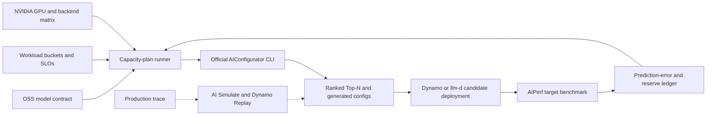

# OSS Model Capacity Planning on Azure ND/NC H100

[](https://github.com/ai-dynamo/aiconfigurator/tree/v0.11.0)
[](evidence/)
[](https://ai-dynamo.org/aiconfigurator/support-matrix/)
[](requirements-repro.txt)
[](../../LICENSE)

> A reusable open-source workflow that turns a model, workload, service objectives, inference runtime, and NVIDIA platform into ranked deployment candidates, then calibrates those predictions with targeted GPU benchmarks.

> Author: 魏新宇 (Xinyu Wei)

[English](README.md) | [中文](README-CN.md)

[Detailed steps](#5-reproduce-the-complete-cpu-offline-run) · [Official projects](#2-official-oss-foundation) · [Planning method](#3-capacity-planning-contract) · [Integration plan](#6-proposed-oss-integration-and-contribution-plan) · [Examples](#8-worked-examples) · [Evidence](#appendix-b-evidence-and-references)

---

## 1. Executive overview

Capacity planning for open-source and open-weight models is not a lookup from parameter count to GPU count. The answer changes with model architecture and quantization, workload shape, latency objectives, target GPU topology, inference backend, and serving mode.

The workflow starts with versioned model, workload, and platform contracts. It uses NVIDIA AIConfigurator to produce ranked deployment candidates, sends only the discriminating candidates to a target-GPU benchmark, and carries measured prediction error plus operational reserve into the capacity decision. AI Simulate is an optional experimental extension for trace-level system-policy questions; it is not required for fixed-point sizing.

The Qwen cases in Section 8 demonstrate the workflow. They are examples, not the scope of the tool. Their workload descriptors are the inputs that decide the answer: the same model on the same GPUs differs by 4.8x in predicted per-GPU throughput between a long-context coding-agent shape and a short-context chat shape.

## 2. Official OSS foundation

### 2.1 Upstream projects

| Project | Official source | Role in capacity planning | Status used here |
|---|---|---|---|
| NVIDIA AIConfigurator | [GitHub repository](https://github.com/ai-dynamo/aiconfigurator) · [v0.11.0](https://github.com/ai-dynamo/aiconfigurator/tree/v0.11.0) · [CLI guide](https://github.com/ai-dynamo/aiconfigurator/blob/v0.11.0/docs/cli_user_guide.md) | Performance modeling, configuration search, ranking, and deployment-config generation | Primary sizing engine; version `0.11.0`, commit `614b9c8c8725332533616786e2eb049df48935f0` |
| NVIDIA Dynamo | [GitHub repository](https://github.com/ai-dynamo/dynamo) | Distributed inference orchestration and a deployment target for generated configurations | Integration target; no deployment executed in this study |
| NVIDIA AI Simulate | [Dynamo v1.4.2 source](https://github.com/ai-dynamo/dynamo/tree/v1.4.2/aisimulate) | Experimental trace replay and search over engine and Dynamo deployment settings | Future integration option; not executed in this study |
| NVIDIA AIPerf | [GitHub repository](https://github.com/ai-dynamo/aiperf) | Load generation and measured runtime validation | Proposed calibration path; not executed here |
| llm-d | [GitHub repository](https://github.com/llm-d/llm-d) | Kubernetes distributed inference serving stack and generated deployment target | Integration target; no deployment executed in this study |
| vLLM | [GitHub repository](https://github.com/vllm-project/vllm) | Open-source inference backend | Used as a performance-database target in one local example; no model server was launched |
| SGLang | [GitHub repository](https://github.com/sgl-project/sglang) | Open-source inference backend | Supported upstream integration target; not executed here |
| TensorRT-LLM | [GitHub repository](https://github.com/NVIDIA/TensorRT-LLM) | NVIDIA-optimized inference backend | Used as a performance-database target in one local example; no model server was launched |

AIConfigurator is Apache-2.0 software. Its built-in performance profiles are centered on NVIDIA GPU platforms and framework-specific implementations, so an open software path does not make the capacity model hardware-vendor neutral.

**Method reference:** [AIConfigurator: Lightning-Fast Configuration Optimization for Multi-Framework LLM Serving, arXiv:2601.06288v1](https://arxiv.org/abs/2601.06288v1) defines the method, fidelity evaluation, search-efficiency evidence, and design boundaries. It is a method source, not an integration component.

### 2.2 Canonical end-to-end workflow

This is the single workflow used throughout the report:

| Stage | Owner | Input | Output and evidence |
|---|---|---|---|
| 1. Define | OSS integration layer | Pinned model, workload buckets, SLOs, NVIDIA GPU topology, backend version | Immutable model/workload/platform contracts |
| 2. Predict | AIConfigurator | Contracts plus supported performance database | Ranked Top-N configurations, predicted metrics, Pareto data, generated candidates |
| 3. Deploy | NVIDIA Dynamo or llm-d | Selected generated candidate with runtime-version alignment | Running candidate service and deployment identity |
| 4. Measure | AIPerf on target GPUs | Frozen request contract and candidate endpoint | Actual memory, latency, throughput, goodput, errors, and telemetry |
| 5. Calibrate | OSS integration layer | Predicted and measured records for the same tuple | Prediction-error ledger, operational reserve, and revised capacity |
| 6. Extend when needed | AI Simulate / Dynamo Replay | Sanitized production trace and dynamic-policy search space | Experimental router, planner, or policy candidates requiring independent benchmark validation |

Stages 1–2 are represented by the local examples. Stages 3–5 are proposed integration work and require target GPUs. Stage 6 is upstream-dependent and experimental.

### 2.3 What AIConfigurator contributes

Given a model, NVIDIA system, inference backend, workload descriptor, and latency constraints, AIConfigurator can:

- determine whether candidate topologies fit in GPU memory;
- search Tensor, Pipeline, Data, Expert, and MoE Tensor Parallelism where applicable;
- compare Static, Aggregated, and Disaggregated serving models;
- estimate TTFT, TPOT, request latency, memory, and throughput;
- rank Pareto-efficient candidates under the specified constraints;
- calculate replicas and total GPUs for a request-rate or concurrency target;
- generate candidate launch and deployment artifacts for supported runtimes and platforms.

It does not execute the model during ordinary configuration search, optimize kernels, operate the cluster, discover the production workload automatically, or replace a physical benchmark.

## 3. Capacity planning contract

The capacity question must be expressed as four input groups and one decision objective.


**Figure 1. Original explanatory diagram.** Model, workload, service objective, backend, and hardware are joint inputs to configuration search. Source basis: [AIConfigurator CLI guide](https://github.com/ai-dynamo/aiconfigurator/blob/v0.11.0/docs/cli_user_guide.md) and [paper Section 4](https://arxiv.org/html/2601.06288v1). Image SHA-256: `42e48e0571826eb2f5f8457fe0d84e5b28df05f4da1acf2b2b0ab2616cdf868b`.

### 3.1 Model contract

| Field | Required detail |
|---|---|
| Model identity | Exact Hugging Face or local model ID plus revision |
| Architecture | Dense or MoE, layer count, hidden dimensions, attention and expert structure |
| Precision | BF16, FP8, FP4, INT8, or another exact quantization configuration |
| Context behavior | Native context, RoPE/YaRN settings, multimodal encoder inputs, MTP depth if used |

### 3.2 Workload contract

| Field | Required detail |
|---|---|
| Request shape | ISL, OSL, image shape/count when applicable, and prefix-cache eligibility |
| Arrival demand | Request-rate curve or concurrency, peak duration, and burst behavior |
| User behavior | Thinking/non-thinking mix, chat template, sampling, and output-token accounting |
| Service objectives | TTFT, TPOT, end-to-end latency, goodput, and error-rate targets |

A production analysis should use representative buckets such as normal traffic, peak traffic, and long-context tail traffic. A single average ISL/OSL pair is an example point, not a production distribution.

### 3.3 Platform contract

| Field | Required detail |
|---|---|
| GPU | Exact NVIDIA system name and memory capacity |
| Node topology | GPUs per node, NVLink/NVSwitch domain, and inter-node fabric |
| Backend | TensorRT-LLM, vLLM, or SGLang plus exact version |
| Deployment target | NVIDIA Dynamo, llm-d, bare metal, or another supported target |
| Operational reserve | Replica loss, rolling upgrade, startup, traffic burst, and tail-latency allowance |

### 3.4 Search and output

The search space can include serving mode, TP/PP/DP/EP/ETP, worker count, replica count, batch size, KV-cache allocation, chunked prefill, and supported runtime flags. The output is a ranked candidate set with predicted metrics and generated artifacts, not one context-free GPU number.

```text
capacity input  = model contract + workload contract + platform contract
candidate       = serving mode + parallelism + workers + batch/runtime settings
capacity output = ranked candidates + predicted metrics + generated artifacts
```

### 3.5 Serving mode: Aggregated versus Disaggregated

Serving mode is the first dimension of the search space and the one that most often surprises planners, so it is worth stating precisely what the two modes are.

LLM inference has two phases with opposite hardware characteristics:

| Phase | Work | Bottleneck | Compute pattern |
|---|---|---|---|
| Prefill | Process the whole input prompt, emit the first token | Compute | Large matrix multiplications, high GPU utilization from a single request |
| Decode | Generate each subsequent token | Memory bandwidth | One token per step, needs batching to fill the GPU |

The conflict follows directly: a long Prefill occupies the GPU and stalls requests that are already decoding, which shows up as TPOT jitter.

**Aggregated** runs both phases in the same worker and relies on continuous (in-flight) batching to interleave new prefills with ongoing decodes.

**Disaggregated** splits them into separate worker pools. Prefill workers process inputs and hand the KV cache to decode workers, which own token generation.

The two modes compute GPU counts differently. Upstream states the arithmetic as:

```text
Aggregated:    gpus/replica = gpus/worker

Disaggregated: gpus/replica = (p)gpus/worker x (p)workers
                            + (d)gpus/worker x (d)workers
```

A Disaggregated replica is the smallest scalable `xPyD` unit, meaning `x` prefill plus `y` decode workers. It is therefore larger and less divisible than an Aggregated worker.

Disaggregated throughput is limited by whichever pool is slower, and upstream applies silicon-calibrated rate-matching degradation factors when pairing the pools:

```text
seq/s = min( prefill seq/s x (p)workers x 0.90,
             decode  seq/s x (d)workers x 0.92 )
```

Per the upstream docstrings, `0.90` accounts for pipeline bubbles on the prefill side and `0.92` for decode batch-size under-saturation. Both are configurable. The practical consequence is that a badly proportioned `xPyD` layout wastes the GPUs on the faster side.

| Property | Aggregated | Disaggregated |
|---|---|---|
| Architectural complexity | Lower | Higher: KV-cache transfer plus two-pool scheduling |
| KV-cache transfer | None | Required between pools |
| Independent scaling | No, phases are coupled | Yes, prefill and decode scale separately |
| TPOT stability | Long prefills interfere with decodes | Decode pool is not interrupted |
| Smallest deployable unit | Small worker, easy to replicate | Whole `xPyD` replica |
| Pool-ratio tuning | Not applicable | Required, otherwise the faster pool idles |

Neither mode is universally better. Section 8.2 shows the same model and the same GPU count reaching opposite conclusions once the workload shape changes, which is why the mode is a search result rather than a standing preference.

## 4. How estimation and measurement fit together

### 4.1 GPU work happens when the performance database is built

AIConfigurator's upstream data-collection process profiles operations such as GEMM, attention, MoE, AllReduce, AllGather, AllToAll, and point-to-point communication on target GPU and backend combinations. The resulting performance data is packaged for later search.

### 4.2 Ordinary configuration search runs on CPU

For a supported model/system/backend combination, the user-side search reads model metadata, queries the packaged performance data, interpolates supported shapes, composes iteration and serving behavior, filters infeasible candidates, and ranks the remainder. Model weights are not loaded during this path.


**Figure 2. Official AIConfigurator workflow from arXiv:2601.06288v1.** Inspect the progression from PerfDatabase and TaskRunner through InferenceSession and Pareto Analyzer to Generator. [Public source](https://arxiv.org/html/2601.06288v1/AIC_assets/AIC-Workflow.png). Image SHA-256: `ee1db977c816218ca0cb6b8e3eff6237c1dd55051d507f0e5579d5b08012bc0f`.

### 4.3 Physical benchmarks calibrate the prediction

The generated candidate must still be deployed on the target runtime and hardware. AIPerf or an equivalent load generator measures actual memory, TTFT, TPOT, request latency, throughput, goodput, and error rate. The difference between predicted and measured values is retained by model, workload bucket, backend version, and GPU topology.

| Evidence layer | Uses GPUs? | What it proves |
|---|:---:|---|
| Upstream performance-data collection | Yes | Operation-level or forward-pass measurements for a declared system/backend/version |
| AIConfigurator search | No GPU required | Predicted candidate ranking for the supplied contracts |
| Generated deployment artifacts | No GPU required | Candidate configuration syntax for a selected target version |
| Target-runtime benchmark | Yes | Observed behavior for one exact model, workload, runtime, and hardware tuple |
| Production calibration | Yes | Capacity with measured error and operational reserve |

## 5. Reproduce the complete CPU-offline run

This section reproduces the Qwen3-32B/H200 example from checkout through validation. It uses the real AIConfigurator CLI, preserves stdout/stderr, and requires no GPU. The target system name selects the packaged H200 performance data; it does not allocate an H200.

### 5.1 Reference-run chronology

The published reference run did not hide its failed first attempt:

| Stage | Actual result | Full CLI record | Done-When |
|---|---|---|---|
| Support preflight | PASS, exit `0` | [`01-support.log`](evidence/runs/qwen3-32b-h200-trtllm-50rps/logs/01-support.log) | Both Aggregated and Disaggregated report `YES` |
| Initial recommendation | FAIL, exit `1`, classified `ENVIRONMENT` | [`02-recommend-plotext6-failure.log`](evidence/runs/qwen3-32b-h200-trtllm-50rps/logs/02-recommend-plotext6-failure.log) | Candidate search completes, then report rendering fails at `plotext.plot_size` |
| Local repair | Pin `plotext==5.3.2`; model, workload, backend, and SLA stay unchanged | [`requirements-repro.txt`](requirements-repro.txt) | Installed version prints `5.3.2` |
| Unchanged recommendation retry | PASS, exit `0` | [`03-recommend-success.log`](evidence/runs/qwen3-32b-h200-trtllm-50rps/logs/03-recommend-success.log) | Top results are 32 H200 Aggregated and 34 H200 Disaggregated |

The complete stage argv, timestamps, source hashes, published hashes, and redaction counts are in the [`run-manifest.json`](evidence/runs/qwen3-32b-h200-trtllm-50rps/run-manifest.json).

### 5.2 Step 0: confirm the execution boundary

Use Linux x86-64 with glibc 2.28 or newer and Python 3.11. The recorded run used Ubuntu 24.04, glibc 2.39, and Python 3.11.15. Network access is needed for package installation and uncached model-metadata resolution. CUDA, a model server, and GPU access are not required.

```bash
uname -m
ldd --version | head -n 1
python3.11 --version
```

Expected shape:

```text
x86_64
ldd (Ubuntu GLIBC ...) 2.39
Python 3.11.x
```

**Done-When:** architecture is `x86_64`, glibc is at least 2.28, and Python is 3.11.

### 5.3 Step 1: check out the repo and hydrate evidence

The CSV evidence is stored with Git LFS. Hydrate it before running the validator.

```bash
git lfs version
git clone --filter=blob:none --sparse https://github.com/david-xinyuwei/david-share.git
git -C david-share sparse-checkout set \
  Deep-Learning/OSS-Model-Capacity-Planning-on-NVIDIA-GPUs
git -C david-share lfs pull \
  --include="Deep-Learning/OSS-Model-Capacity-Planning-on-NVIDIA-GPUs/evidence/**"
cd david-share/Deep-Learning/OSS-Model-Capacity-Planning-on-NVIDIA-GPUs
```

**Done-When:** `README.md`, `requirements-repro.txt`, `tools/`, and both directories under `evidence/runs/` exist; the CSVs contain data rather than LFS pointer text.

### 5.4 Step 2: create the pinned environment

```bash
python3.11 -m venv .venv
source .venv/bin/activate
python -m pip install --no-input -r requirements-repro.txt
python - <<'PY'
from importlib.metadata import version

for package in ("aiconfigurator", "aiconfigurator-core", "plotext"):
    print(f"{package}={version(package)}")
PY
```

Expected versions:

```text
aiconfigurator=0.11.0
aiconfigurator-core=0.11.0
plotext=5.3.2
```

Why the `plotext` pin matters: the unconstrained installation selected 6.0.0. Search completed, but rendering then failed:

```text
AttributeError: module 'plotext' has no attribute 'plot_size'
EXIT_CODE=1
```

That is the captured [`initial failure`](evidence/runs/qwen3-32b-h200-trtllm-50rps/logs/02-recommend-plotext6-failure.log), not a hypothetical troubleshooting note. The clean reproduction starts with the corrected pin and does not intentionally recreate the failure.

**Done-When:** all three package versions exactly match the block above.

### 5.5 Step 3: run the support preflight and capture its log

```bash
set -o pipefail
mkdir -p run-output/logs
support_log=run-output/logs/01-support.log
printf 'START_UTC=%s\n' "$(date -u +%Y-%m-%dT%H:%M:%SZ)" | tee "$support_log"
aiconfigurator cli support \
  --model-path Qwen/Qwen3-32B-FP8 \
  --system h200_sxm \
  --backend trtllm \
  --no-color 2>&1 | tee -a "$support_log"
support_rc=${PIPESTATUS[0]}
printf 'EXIT_CODE=%s\nEND_UTC=%s\n' \
  "$support_rc" "$(date -u +%Y-%m-%dT%H:%M:%SZ)" | tee -a "$support_log"
test "$support_rc" -eq 0
```

Reference CLI output:

```text
Model:           Qwen/Qwen3-32B-FP8
System:          h200_sxm
Backend:         trtllm
Aggregated Support:    YES
Disaggregated Support: YES
EXIT_CODE=0
```

See the complete [`support log`](evidence/runs/qwen3-32b-h200-trtllm-50rps/logs/01-support.log).

**Done-When:** both support modes are `YES` and the captured exit code is `0`. Stop here if support is `NO`; do not reinterpret a different backend or database mode as the same run.

### 5.6 Step 4: run the recommendation and capture its log

```bash
recommend_log=run-output/logs/02-recommend.log
printf 'START_UTC=%s\n' "$(date -u +%Y-%m-%dT%H:%M:%SZ)" | tee "$recommend_log"
aiconfigurator cli recommend \
  --model-path Qwen/Qwen3-32B-FP8 \
  --system h200_sxm \
  --backend trtllm \
  --target-request-rate 50 \
  --isl 4000 \
  --osl 1000 \
  --ttft 2000 \
  --tpot 30 \
  --database-mode SILICON \
  --strict-sla \
  --top-n 5 \
  --save-dir ./run-output/results \
  --no-color 2>&1 | tee -a "$recommend_log"
recommend_rc=${PIPESTATUS[0]}
printf 'EXIT_CODE=%s\nEND_UTC=%s\n' \
  "$recommend_rc" "$(date -u +%Y-%m-%dT%H:%M:%SZ)" | tee -a "$recommend_log"
test "$recommend_rc" -eq 0
```

Reference CLI result:

```text
Target Load: 50.0 req/s
agg GPUs needed: 32 (replicas: 32)
disagg GPUs needed: 34 (replicas: 17)
Best Experiment Chosen: agg
Request Rate: 50.53 req/s
TTFT: 1114.22ms
TPOT: 29.66ms
EXIT_CODE=0
```

The full [`successful recommendation log`](evidence/runs/qwen3-32b-h200-trtllm-50rps/logs/03-recommend-success.log) also preserves every Top-N row and the version warnings. The search used TensorRT-LLM performance DB `1.3.0rc10`; generated configuration defaulted through Dynamo 1.2.0 to TensorRT-LLM `1.3.0rc14`, and the tool reported no version-specific CLI template. Treat the YAML as a candidate until versions are aligned and the runtime accepts it.

**Done-When:** the command exits `0`, both `agg/` and `disagg/` results exist, and the selected candidate meets the declared request-rate, TTFT, and TPOT constraints.

### 5.7 Step 5: inspect the generated evidence

AIConfigurator creates a model-specific directory below `run-output/results`. This check discovers that directory, validates both Top-1 rows, and prints the capacity arithmetic:

```bash
python - <<'PY'
import csv
from pathlib import Path

root = Path("run-output/results")
expected = {"agg": 32, "disagg": 34}
for mode, expected_gpus in expected.items():
    paths = list(root.rglob(f"{mode}/best_config_topn.csv"))
    assert len(paths) == 1, (mode, paths)
    with paths[0].open(newline="") as handle:
        row = next(csv.DictReader(handle))
    replicas = int(row["replicas_needed"])
    gpus_per_replica = int(row["num_total_gpus"])
    total_gpus = int(row["total_gpus_needed"])
    cluster_rate = float(row["request_rate"]) * replicas
    assert replicas * gpus_per_replica == total_gpus == expected_gpus
    assert cluster_rate >= 50
    assert float(row["ttft"]) <= 2000
    assert float(row["tpot"]) <= 30
    print(
        f"{mode}: GPUs={total_gpus}, replicas={replicas}, "
        f"GPUs/replica={gpus_per_replica}, cluster_req_s={cluster_rate:.2f}, "
        f"TTFT={float(row['ttft']):.2f}ms, TPOT={float(row['tpot']):.2f}ms"
    )
PY
```

Expected output:

```text
agg: GPUs=32, replicas=32, GPUs/replica=1, cluster_req_s=50.53, TTFT=1114.22ms, TPOT=29.66ms
disagg: GPUs=34, replicas=17, GPUs/replica=2, cluster_req_s=51.20, TTFT=537.83ms, TPOT=29.94ms
```

Compare the new files with the committed reference bundle:

- [`Aggregated Top-N`](evidence/runs/qwen3-32b-h200-trtllm-50rps/results/agg/best_config_topn.csv), [`Pareto data`](evidence/runs/qwen3-32b-h200-trtllm-50rps/results/agg/pareto.csv), [`experiment config`](evidence/runs/qwen3-32b-h200-trtllm-50rps/results/agg/exp_config.yaml), and [`Top-1 candidate`](evidence/runs/qwen3-32b-h200-trtllm-50rps/results/agg/top1/agg_config.yaml)
- [`Disaggregated Top-N`](evidence/runs/qwen3-32b-h200-trtllm-50rps/results/disagg/best_config_topn.csv), [`Pareto data`](evidence/runs/qwen3-32b-h200-trtllm-50rps/results/disagg/pareto.csv), [`experiment config`](evidence/runs/qwen3-32b-h200-trtllm-50rps/results/disagg/exp_config.yaml), [`prefill candidate`](evidence/runs/qwen3-32b-h200-trtllm-50rps/results/disagg/top1/prefill_config.yaml), and [`decode candidate`](evidence/runs/qwen3-32b-h200-trtllm-50rps/results/disagg/top1/decode_config.yaml)

**Done-When:** the script prints both expected lines and every linked reference artifact opens.

### 5.8 Step 6: validate the committed run lineage

```bash
python tools/validate_evidence.py
```

Expected terminal output:

```text
RUN qwen3-235b-h100-vllm-50rps PASS files=16
RUN qwen3-32b-h200-trtllm-50rps PASS files=15
README_VALIDATION=PASS LOG_LINKS=9 COMMAND_BLOCKS=9
EVIDENCE_VALIDATION=PASS RUNS=3 PUBLIC_BOUNDARY=PASS
```

The validator recomputes every published SHA-256, checks each log's exit marker, rejects private paths, verifies the 32/34 H200 capacity arithmetic, confirms the four-GPU MoE topology, checks the recorded CPU memory peak, and verifies the real-workload replica arithmetic and SLA compliance.

**Done-When:** the final line is exactly `EVIDENCE_VALIDATION=PASS RUNS=3 PUBLIC_BOUNDARY=PASS`.

## 6. Proposed OSS integration and contribution plan

### 6.1 Objective

The proposed OSS integration should turn AIConfigurator from an expert-operated CLI into a repeatable capacity-planning workflow without replacing the upstream product. Its objective is to make every recommendation traceable from input contracts to prediction, generated configuration, target benchmark, and calibration.

The committed evidence captures official AIConfigurator CLI results for two OSS model examples. This repository does **not** contain a standalone adapter, upstream pull request, generic schema, or benchmark-calibration service. The items below are a proposed implementation plan.

### 6.2 Integration architecture



The integration layer owns input normalization, run identity, evidence packaging, calibration, and policy around acceptable prediction error. AIConfigurator remains the configuration-search authority; Dynamo/llm-d own deployment; AIPerf owns measured load generation; AI Simulate owns its experimental trace-search path.

### 6.3 Proposed repository contracts

| Proposed surface | Contract | Status |
|---|---|---|
| `configs/models/` | Model ID, revision, architecture, precision, and context settings | Proposed |
| `configs/workloads/` | Named normal/peak/tail buckets with ISL/OSL, load, cache, and SLO fields | Proposed |
| `configs/platforms/` | NVIDIA GPU, node topology, backend/database version, and deployment target | Proposed |
| `runs/<run-id>/inputs/` | Immutable copies of all contracts plus source hashes | Proposed |
| `runs/<run-id>/prediction/` | Official CLI argv, logs, Top-N CSVs, Pareto output, and generated configs | Example artifacts captured locally; generic contract proposed |
| `runs/<run-id>/benchmark/` | Runtime/image identity, AIPerf command, raw measurements, and telemetry | Proposed; GPU execution not yet performed here |
| `runs/<run-id>/calibration.json` | Prediction/measurement delta and approved reserve by metric | Proposed |
| `adapters/` | Thin, versioned invocation adapters for official CLI and deployment targets | Proposed; must not reimplement AIConfigurator logic |

## 7. Proposed implementation roadmap

| Phase | Deliverable | Completion signal | Current status |
|---|---|---|---|
| 0. Reference evidence | Preserve official CLI commands, logs, Top-N CSVs, generated configs, and hashes | At least one Dense and one MoE/open-weight example can be audited locally | Example Top-N evidence and run manifests committed; reusable manifest generation in the generic runner is not implemented |
| 1. Contract layer | JSON Schema or YAML contracts for model, workload, platform, and objective | Invalid or incomplete capacity questions fail before search | Proposed |
| 2. Generic runner | Invoke upstream `support`, `default`, `recommend`, and selected `exp` workflows without changing their semantics | One command produces an isolated run directory and evidence manifest | Proposed |
| 3. Matrix and comparison | Sweep model x NVIDIA GPU x backend x workload bucket and retain Top-N | Results remain separated by exact version and evidence class | Proposed |
| 4. Benchmark calibration | Deploy selected candidates and run AIPerf near predicted operating points | Predicted-versus-observed deltas and reserve are machine-readable | Proposed; requires target GPUs |
| 5. Community contribution | Add reproducible model/backend coverage through upstream issues, data collection, or pull requests | Accepted upstream artifact or publicly reviewable contribution | Proposed; no PR exists yet |
| 6. Trace-level extension | Feed sanitized traces into AI Simulate/Dynamo Replay for router, planner, and policy search | Trace experiment is version-pinned and independently benchmarked | Upstream-dependent and experimental |

The first public milestone should stop after Phase 2: publish the schemas, two example contracts, and a thin runner that invokes the official CLI without reimplementing search logic. Matrix automation, GPU calibration, upstream contributions, and AI Simulate remain later milestones with separate evidence.


**Figure 3. Original boundary diagram based on public AIConfigurator v0.11.0 and Dynamo v1.4.2 sources.** AIConfigurator can run independently for fixed workload descriptors. AI Simulate/Spica extends the search with Dynamo Replay and remains experimental. [AI Simulate source](https://github.com/ai-dynamo/dynamo/tree/v1.4.2/aisimulate). Image SHA-256: `0b7c56f3dc0b18504a09c20864ae371b6e097b9057497e10cfbcbea301fbb3ab`.

## 8. Worked examples

The examples below prove that the same planning method can represent different model sizes, architectures, NVIDIA GPUs, inference backends, and workload shapes. Every number is an AIConfigurator prediction, which is what the tool is designed to produce; none of them is a GPU benchmark.

| Example | Model | Target platform | Backend database | Workload | Main predicted result |
|---|---|---|---|---|---|
| Dense-model canary | `Qwen/Qwen3-32B-FP8` | H200 SXM | TensorRT-LLM | ISL 4,000; OSL 1,000; TTFT <=2,000 ms; TPOT <=30 ms; 50 req/s procurement target | 32 H200 Aggregated versus 34 H200 Disaggregated |
| MoE workload comparison | `Qwen/Qwen3-235B-A22B-FP8` | H100 SXM | vLLM `0.24.0` | Fixed 16/32 GPU budgets; coding-agent and chat shapes | Same model, same GPUs: 4.8x difference in per-GPU throughput between workloads |

### 8.1 Qwen3-32B-FP8 on H200 SXM

The upstream `support` and `recommend` paths completed on CPU. Under the example workload, the top Aggregated result uses 32 one-GPU replicas, while the top Disaggregated result uses 17 replicas with one prefill and one decode GPU each, for 34 GPUs total.


**Figure 4. Local CPU-offline prediction, not an H200 benchmark.** AIConfigurator v0.11.0, Qwen3-32B-FP8, H200 SXM, TensorRT-LLM, 50 req/s procurement-sizing target. [Full CLI log](evidence/runs/qwen3-32b-h200-trtllm-50rps/logs/03-recommend-success.log) · [Aggregated CSV](evidence/runs/qwen3-32b-h200-trtllm-50rps/results/agg/best_config_topn.csv) · [Disaggregated CSV](evidence/runs/qwen3-32b-h200-trtllm-50rps/results/disagg/best_config_topn.csv). Image SHA-256: `b290bbd126594ca3ac923591b567f6b4cd5e838de6c73ef512405aa3caa08690`.

### 8.2 Qwen3-235B-A22B-FP8 on H100 SXM: workload shape decides capacity

This example answers the question a capacity planner actually asks: for a fixed GPU budget, what can this model serve? It uses two workload shapes reported by inference practitioners rather than one invented request-rate target.

| Workload shape | ISL | OSL | Prefix cache | TTFT limit | TPOT limit |
|---|---:|---:|---:|---:|---:|
| Long-context coding agent | 32,000 | 500 | 28,000 (87.5% reuse) | 4,000 ms | 50 ms |
| Interactive chat | 1,000 | 500 | 0 | 500 ms | 50 ms |

The coding-agent shape follows the pattern practitioners describe for agent workloads: very long accumulated context where most of the prefix is already cached and only a small tail needs incremental prefill. Both shapes are representative descriptors, not a captured trace from a named customer.

All runs used `--strict-sla`, so every reported candidate satisfies both latency limits.

| Scenario | GPU budget | Best mode | Replica layout | tokens/s/GPU | Cluster req/s | TTFT | TPOT |
|---|---:|---|---|---:|---:|---:|---:|
| Coding agent | 16 | Disaggregated | 1 x 16-GPU replica | 120.15 | 3.85 | 2,037.14 ms | 49.87 ms |
| Coding agent | 32 | Aggregated | 8 x 4-GPU replicas | 99.75 | 6.40 | 602.91 ms | 48.91 ms |
| Interactive chat | 16 | Aggregated | 2 x 8-GPU replicas | 570.50 | 18.29 | 466.36 ms | 48.15 ms |

Three planning conclusions follow from the same model and the same hardware:

1. **Workload shape dominates capacity.** At an identical 16-GPU budget, the chat shape predicts 570.50 tokens/s/GPU while the coding-agent shape predicts 120.15 tokens/s/GPU, a 4.8x difference. Quoting a single capacity number for a model without naming the workload is meaningless.
2. **Disaggregation earns its complexity only when prefill dominates.** With 32,000-token inputs on 16 GPUs, Disaggregated wins by 1.20x. In the short-context chat shape, Aggregated wins by 1.08x.
3. **Adding GPUs buys throughput, not per-GPU efficiency.** Going from 16 to 32 GPUs on the coding-agent shape raises cluster throughput from 3.85 to 6.40 req/s because the planner replicates a smaller 4-GPU worker; per-GPU efficiency does not improve.

Comparing both serving modes at the same 16-GPU budget shows why the mode cannot be chosen by preference. The winner and the reason change with the workload shape:

| Workload | Mode | Replica layout | tokens/s/GPU | Cluster req/s | TTFT | TPOT |
|---|---|---|---:|---:|---:|---:|
| Chat | Aggregated | 2 x 8-GPU | **570.50** | **18.29** | 466.36 ms | 48.15 ms |
| Chat | Disaggregated | 1 x 16-GPU | 528.54 | 16.91 | **292.60 ms** | **41.86 ms** |
| Coding agent | Aggregated | 4 x 4-GPU | 99.75 | 3.20 | **602.91 ms** | 48.91 ms |
| Coding agent | Disaggregated | 1 x 16-GPU | **120.15** | **3.85** | 2,037.14 ms | 49.87 ms |

In the chat shape, Disaggregated cuts TTFT by 37% but gives up 7% of per-GPU throughput: with only 1,000 input tokens, prefill is not heavy enough for the split to pay for its KV-cache transfer. In the coding-agent shape, Disaggregated gains 20% per-GPU throughput while TTFT gets worse, because the ranking objective is throughput and the selected layout still fits inside the 4,000 ms TTFT limit.

```text
16 GPUs, chat shape         : 570.50 tokens/s/GPU
16 GPUs, coding-agent shape : 120.15 tokens/s/GPU
ratio                       : 4.75x
```


**Figure 5. Candidate Pareto frontier from an AIConfigurator search, not an H100 benchmark.** The plot shows the trade-off between per-user generation speed (`tokens/s/user`) and per-GPU efficiency (`tokens/s/gpu`) across candidate configurations. It is retained as an illustration of that trade-off and is not the source of the capacity table above; it was produced by an earlier run without `--strict-sla`, so some plotted points exceed a 30 ms TPOT limit. Image SHA-256: `2f0aef7b052857e3084b518a29a159bf9ab6a1e47e380a3c59d3126756a8c352`.

Evidence for the capacity table:

| Scenario | Full CLI log | Ranked candidates |
|---|---|---|
| Coding agent, 16 GPU | [`coding-agent-16gpu.log`](evidence/runs/qwen3-235b-h100-vllm-real-workloads/logs/coding-agent-16gpu.log) | [Disaggregated CSV](evidence/runs/qwen3-235b-h100-vllm-real-workloads/results/coding-agent-16gpu/disagg/best_config_topn.csv) |
| Coding agent, 32 GPU | [`coding-agent-32gpu.log`](evidence/runs/qwen3-235b-h100-vllm-real-workloads/logs/coding-agent-32gpu.log) | [Aggregated CSV](evidence/runs/qwen3-235b-h100-vllm-real-workloads/results/coding-agent-32gpu/agg/best_config_topn.csv) |
| Interactive chat, 16 GPU | [`chat-16gpu.log`](evidence/runs/qwen3-235b-h100-vllm-real-workloads/logs/chat-16gpu.log) | [Aggregated CSV](evidence/runs/qwen3-235b-h100-vllm-real-workloads/results/chat-16gpu/agg/best_config_topn.csv) |

Stage commands, argv, source hashes, and published hashes are in the [`run manifest`](evidence/runs/qwen3-235b-h100-vllm-real-workloads/run-manifest.json).

A separate supplemental bundle records the model's feasibility boundary and the planner's own resource cost:

| Step | Result | Evidence |
|---|---|---|
| Test a two-GPU budget | Expected boundary failure, exit `1`; no candidate fits | [`01-two-gpu-infeasible.log`](evidence/runs/qwen3-235b-h100-vllm-50rps/logs/01-two-gpu-infeasible.log) |
| Find the minimum worker | Four-GPU Aggregated worker, `TP4/PP1/DP1/ETP4/EP1`, exit `0` | [`02-four-gpu-worker.log`](evidence/runs/qwen3-235b-h100-vllm-50rps/logs/02-four-gpu-worker.log) · [`Top-N CSV`](evidence/runs/qwen3-235b-h100-vllm-50rps/results/worker-4g/agg/best_config_topn.csv) |
| Measure planning-process footprint | 12.27 s wall time and 496,100 KiB peak RSS, exit `0` | [`04-cpu-memory-profile.log`](evidence/runs/qwen3-235b-h100-vllm-50rps/logs/04-cpu-memory-profile.log) |

Two prediction boundaries are recorded in the run logs. vLLM `0.24.0` has no FP8 `context_attention` performance data for H100 SXM, so the search fell back to BF16 FMHA data. `--generated-config-version` was not provided, so generated configuration defaulted through Dynamo 1.2.0 to vLLM `0.20.1` while the search used the vLLM `0.24.0` database; the generated YAML stays a candidate until regenerated for the deployed runtime.

None of these numbers is a capacity requirement for Qwen3-235B in general. Each belongs to one model revision family, target system, backend database, workload shape, and SLA pair.

## 9. Boundaries and risks

| Boundary | Implication |
|---|---|
| Support matrix coverage is version-specific | Unsupported combinations require a different backend/system, explicit research-mode downgrade, or new measured data |
| `SILICON` refers to measured database inputs | End-to-end TTFT, TPOT, memory, and throughput remain modeled outputs until benchmarked |
| vLLM and SGLang alignment is still called out in upstream known issues | Production use requires target-version measurement |
| Search, generator, and runtime versions can differ | Generated YAML is a candidate until the actual runtime accepts and serves it |
| One workload point is not a traffic distribution | Capacity must be recomputed for normal, peak, and tail buckets |
| Prediction error is not operational reserve | Tail latency, bursts, failures, startup, and upgrades require separate allowance |
| AI Simulate is experimental | It provides no SLA, accuracy, or global-optimality guarantee |
| The committed evidence contains CPU-offline predictions only | No committed result proves physical H100/H200 performance or production capacity |

## Appendix A. Generic upstream entry points

```bash
aiconfigurator cli support \
  --model-path <model-id-or-path> \
  --system <nvidia-system> \
  --backend <trtllm-vllm-or-sglang>

aiconfigurator cli recommend \
  --model-path <model-id-or-path> \
  --system <nvidia-system> \
  --backend <trtllm-vllm-or-sglang> \
  --target-concurrency <concurrent-requests> \
  --isl <input-tokens> \
  --osl <output-tokens> \
  --ttft <milliseconds> \
  --tpot <milliseconds> \
  --database-mode SILICON \
  --strict-sla \
  --save-dir <isolated-run-directory>
```

`--target-request-rate <req/s>` can replace `--target-concurrency`; the two load targets are mutually exclusive. These values come from the workload contract, not from a hard-coded project default.

### Rebuild the original figures

The figure generator requires Python 3.11, Pillow 12.3.0, and the Segoe UI fonts included with Windows. It regenerates Figures 1, 3, and 4 from the committed source and CSV evidence. This is separate from the Linux AIConfigurator environment in Section 5.

```powershell
python -m pip install -r requirements.txt
python tools/make_report_figures.py
```

## Appendix B. Evidence and references

### Committed evidence

- [Evidence index](evidence/README.md)
- [Qwen3-32B/H200 complete run bundle](evidence/runs/qwen3-32b-h200-trtllm-50rps/)
- [Qwen3-235B/H100 supplemental run bundle](evidence/runs/qwen3-235b-h100-vllm-50rps/)
- [Evidence publisher and redaction lineage](tools/publish_run_evidence.py)
- [Deterministic evidence validator](tools/validate_evidence.py)
- [Original figure generator](tools/make_report_figures.py)

### Public references

- [AIConfigurator repository](https://github.com/ai-dynamo/aiconfigurator)
- [AIConfigurator v0.11.0 CLI guide](https://github.com/ai-dynamo/aiconfigurator/blob/v0.11.0/docs/cli_user_guide.md)
- [AIConfigurator paper](https://arxiv.org/abs/2601.06288v1)
- [AIConfigurator support matrix](https://ai-dynamo.org/aiconfigurator/support-matrix/)
- [NVIDIA Dynamo](https://github.com/ai-dynamo/dynamo)
- [llm-d](https://github.com/llm-d/llm-d)
- [AI Simulate v1.4.2](https://github.com/ai-dynamo/dynamo/tree/v1.4.2/aisimulate)
- [NVIDIA AIPerf](https://github.com/ai-dynamo/aiperf)