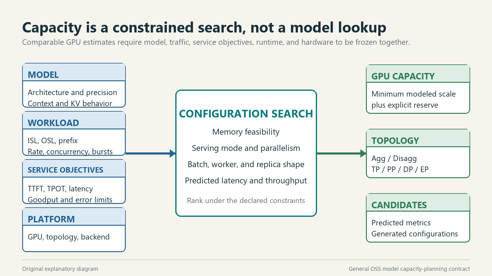
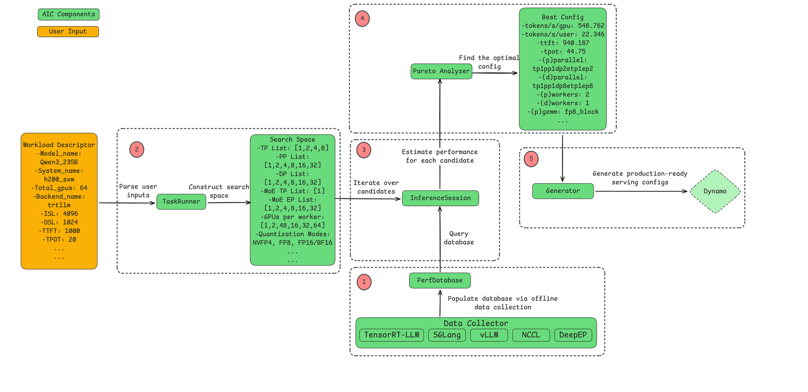
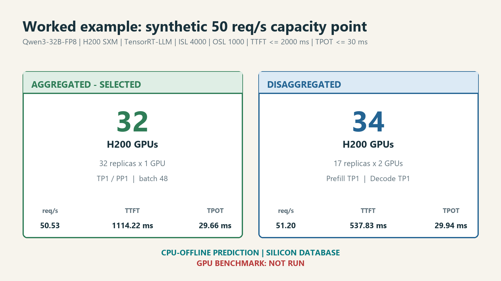

# OSS Model Capacity Planning on Azure ND/NC H100

[](https://github.com/ai-dynamo/aiconfigurator/tree/v0.11.0)
[](evidence/)
[](https://ai-dynamo.org/aiconfigurator/support-matrix/)
[](requirements-repro.txt)
[](../../LICENSE)

> A reproducible AIConfigurator capacity study: define the model, workload, service objectives, runtime, and NVIDIA platform; run the official CPU-side search; preserve its ranked predictions and full evidence.

> Author: 魏新宇 (Xinyu Wei)

[English](README.md) | [中文](README-CN.md)

[Detailed steps](#5-reproduce-the-complete-cpu-offline-run) · [Tools used](#2-tools-and-method-used) · [Planning inputs](#3-capacity-planning-inputs) · [Examples](#6-worked-examples) · [Evidence](#appendix-a-evidence-and-references)

---

## 1. Executive overview

Capacity planning for open-source and open-weight models is not a lookup from parameter count to GPU count. The answer changes with model architecture and quantization, workload shape, latency objectives, target GPU topology, inference backend, and serving mode.

This repository freezes the model, workload, platform, and SLO inputs; runs NVIDIA AIConfigurator 0.11.0 in `SILICON` mode on CPU; preserves the complete logs, Top-N CSVs, Pareto data, and generated candidates; and verifies their hashes and arithmetic. The results are AIConfigurator capacity predictions, which is the intended output of the tool.

The Qwen cases in Section 6 demonstrate the method. They are examples, not the scope of the tool. In a same-model, same-GPU-budget comparison, workload inputs materially change the prediction: per-GPU throughput differs by 4.75x between the long-context coding-agent and short-context chat scenarios. Section 4.4 reads the pinned source to show exactly what arithmetic produced those numbers and lists twelve modeling limitations that bound their use.

## 2. Tools and method used

### 2.1 Software used in the published runs

| Software | Official source | Role in this repository | Exact use here |
|---|---|---|---|
| NVIDIA AIConfigurator | [GitHub repository](https://github.com/ai-dynamo/aiconfigurator) · [v0.11.0](https://github.com/ai-dynamo/aiconfigurator/tree/v0.11.0) · [CLI guide](https://github.com/ai-dynamo/aiconfigurator/blob/v0.11.0/docs/cli_user_guide.md) | Performance modeling, configuration search, ranking, and deployment-config generation | Primary sizing engine; version `0.11.0`, commit `614b9c8c8725332533616786e2eb049df48935f0` |
| vLLM | [GitHub repository](https://github.com/vllm-project/vllm) | Open-source inference backend | Performance-database target for the Qwen3-235B/H100 runs in Section 6.2; no model server was launched |
| TensorRT-LLM | [GitHub repository](https://github.com/NVIDIA/TensorRT-LLM) | NVIDIA-optimized inference backend | Performance-database target for the Qwen3-32B/H200 run in Section 6.1; no model server was launched |

AIConfigurator is Apache-2.0 software. Its built-in performance profiles are centered on NVIDIA GPU platforms and framework-specific implementations, so an open software path does not make the capacity model hardware-vendor neutral.

**Method reference:** [AIConfigurator: Lightning-Fast Configuration Optimization for Multi-Framework LLM Serving, arXiv:2601.06288v1](https://arxiv.org/abs/2601.06288v1) defines the modeling method, fidelity evaluation, search-efficiency evidence, and design boundaries.

### 2.2 What this repository actually executes

Every published result follows this path:

| Stage | Executed action | Output and evidence |
|---|---|---|
| 1. Define inputs | Record the exact model, ISL/OSL, prefix reuse, SLOs, target GPU, backend, version, and GPU budget or load target | Command argv and experiment configuration |
| 2. Check support | Run the official `aiconfigurator cli support` where the scenario uses that preflight | Complete support log |
| 3. Evaluate capacity | Run the official `default` or `recommend` command in `SILICON` mode | Ranked Top-N predictions, Pareto data, and generated candidate configurations |
| 4. Publish evidence | Copy the allowlisted logs and machine-readable outputs while recording source and published SHA-256 values | Versioned run bundle and manifest |
| 5. Validate | Recompute hashes, result arithmetic, SLA compliance, public-data boundaries, links, and bilingual invariants | Deterministic validator output |

This repository stops at capacity evaluation and evidence validation. It does not claim that a model server was deployed or benchmarked.

### 2.3 What AIConfigurator contributes

Given a model, NVIDIA system, inference backend, workload descriptor, and latency constraints, AIConfigurator can:

- determine whether candidate topologies fit in GPU memory;
- search Tensor, Pipeline, Data, Expert, and MoE Tensor Parallelism where applicable;
- compare Aggregated and Disaggregated serving; `cli default` builds exactly these two tasks, and the SDK's single-step Static mode is not searched;
- estimate TTFT, TPOT, request latency, memory, and throughput;
- filter candidates by the declared TTFT and TPOT limits and rank them by tokens/s/GPU; the Pareto frontier is emitted as a plotting output (Section 4.4);
- calculate replicas and total GPUs for a request-rate or concurrency target;
- generate candidate launch and deployment artifacts for supported runtimes and platforms.

It does not execute the model during ordinary configuration search, optimize kernels, operate a cluster, or discover the workload automatically. In this repository, its modeled values are the final evaluation result.

### 2.4 Executable assets in this repository

| Path | Contract |
|---|---|
| [`tools/validate_evidence.py`](tools/validate_evidence.py) | Deterministic gate. Recomputes every published SHA-256 and byte count, checks each log's exit marker, rejects private paths, re-derives the H200 32/34 arithmetic, the four-GPU MoE topology, the three workload rows, the selected 16-GPU layout, the 4.75x ratio, and the idle-GPU arithmetic on every Disaggregated row, and compares both READMEs for required links, command blocks, mechanism tokens, and retired phrases. No network or GPU; the exit code is the verdict |
| [`tests/test_validate_evidence.py`](tests/test_validate_evidence.py) | Fail-closed proof. Copies this directory to a temporary location, applies one tampering per test, and asserts that the validator exits non-zero with the expected message |
| [`tools/publish_run_evidence.py`](tools/publish_run_evidence.py) · [`tools/publish_real_scenario_evidence.py`](tools/publish_real_scenario_evidence.py) | Allowlisted copy from the run host into `evidence/runs/<run-id>/`. Replaces host identity and absolute paths, records source and published hashes. Needed only to publish a new run |
| [`tools/make_report_figures.py`](tools/make_report_figures.py) | Regenerates Figures 1 and 3 from committed source and CSV evidence; Windows fonts and Pillow |
| [`requirements-repro.txt`](requirements-repro.txt) | The three direct pins that reproduced the Linux runs. Transitive packages are not locked; see Section 5.4 |
| [`evidence/runs/<run-id>/run-manifest.json`](evidence/README.md) | Per-run identity, workload, exact argv, stage status, source and published SHA-256 for every published file |

## 3. Capacity planning inputs

The capacity question must be expressed as four input groups and one decision objective.



**Figure 1. Original explanatory diagram.** Model, workload, service objective, backend, and hardware are joint inputs to configuration search. Source basis: [AIConfigurator CLI guide](https://github.com/ai-dynamo/aiconfigurator/blob/v0.11.0/docs/cli_user_guide.md) and [paper Section 4](https://arxiv.org/html/2601.06288v1). Image SHA-256: `42e48e0571826eb2f5f8457fe0d84e5b28df05f4da1acf2b2b0ab2616cdf868b`.

### 3.1 Model input

| Field | Required detail |
|---|---|
| Model identity | Exact Hugging Face or local model ID plus revision |
| Architecture | Dense or MoE, layer count, hidden dimensions, attention and expert structure |
| Precision | BF16, FP8, FP4, INT8, or another exact quantization configuration |
| Context behavior | Native context, RoPE/YaRN settings, multimodal encoder inputs, MTP depth if used |

### 3.2 Workload input

| Field | Required detail |
|---|---|
| Request shape | ISL, OSL, image shape/count when applicable, and prefix-cache eligibility |
| Arrival demand | Request-rate curve or concurrency, peak duration, and burst behavior |
| User behavior | Thinking/non-thinking mix, chat template, sampling, and output-token accounting |
| Service objectives | TTFT, TPOT, end-to-end latency, goodput, and error-rate targets |

A production analysis should use representative buckets such as normal traffic, peak traffic, and long-context tail traffic. A single average ISL/OSL pair is an example point, not a production distribution.

### 3.3 Platform input

| Field | Required detail |
|---|---|
| GPU | Exact NVIDIA system name and memory capacity |
| Node topology | GPUs per node, NVLink/NVSwitch domain, and inter-node fabric |
| Backend | TensorRT-LLM, vLLM, or SGLang plus exact version |
| Performance database | `SILICON`, `HYBRID`, or another mode, plus the exact database version |

The Azure sizes named in the title map to AIConfigurator system profiles as follows. The mapping compares the v0.11.0 system YAML files with the Microsoft Learn size pages; it is a specification match, not a benchmark.

| Azure size series | GPU per Microsoft Learn | AIConfigurator v0.11.0 system profile | Used by a published run |
|---|---|---|---|
| [ND H100 v5](https://learn.microsoft.com/azure/virtual-machines/sizes/gpu-accelerated/ndh100v5-series) | 8 x H100 80 GB, NVLink 4.0, 400 Gb/s InfiniBand per GPU; the page does not name the form factor, SXM is implied by the eight-GPU NVLink domain | `h100_sxm`: 80 GiB, 3,350 GB/s, 8 GPUs per node, 450 GB/s intra-node, 400 Gb/s inter-node | Yes, every H100 result in Section 6.2 |
| [ND H200 v5](https://learn.microsoft.com/azure/virtual-machines/sizes/gpu-accelerated/nd-h200-v5-series) | 8 x H200 141 GB, 900 GB/s NVLink, 400 Gb/s InfiniBand per GPU | `h200_sxm` | Yes, Section 6.1 |
| [NCads H100 v5](https://learn.microsoft.com/azure/virtual-machines/sizes/gpu-accelerated/ncadsh100v5-series) | 1 to 2 x H100 NVL 94 GB, PCIe form factor, no InfiniBand | None. The shipped `h100_pcie` profile describes an 80 GB PCIe part, and its YAML states that no silicon performance database is provided for it | No. No published number in this repository applies to NC-series sizes |

### 3.4 Search and output

The search space can include serving mode, TP/PP/DP/EP/ETP, worker count, replica count, batch size, KV-cache allocation, chunked prefill, and supported runtime flags. The output is a ranked candidate set with predicted metrics and generated artifacts, not one context-free GPU number.

```text
capacity input  = model definition + workload definition + platform definition
candidate       = serving mode + parallelism + workers + batch/runtime settings
capacity output = ranked candidates + predicted metrics + generated artifacts
```

The throughput columns count output tokens only. A Disaggregated row's `tokens/s` is `seq/s x OSL`; an Aggregated row's is `b x (OSL - 1)` per step; prefill tokens, cached or not, never enter the numerator. `tokens/s/gpu` divides by the GPUs of one replica, `tokens/s/gpu_cluster` by the whole budget, so the two differ whenever the replica size does not divide the budget and GPUs sit idle. `tokens/s/user` is `1000 / TPOT` and `concurrency` is the number of in-flight sequences; reading them next to `tokens/s/gpu` shows whether a throughput difference comes from per-user speed or from how many sequences run at once.

### 3.5 Serving mode: Aggregated versus Disaggregated

Serving mode is the first dimension of the search space and the one that most often surprises planners, so it is worth stating precisely what the two modes are.

LLM inference has two phases with opposite hardware characteristics:

| Phase | Work | Bottleneck | Compute pattern |
|---|---|---|---|
| Prefill | Process a request's full input and emit the first token | Usually compute | Large matrix multiplications; utilization depends on input length and batching |
| Decode | Generate subsequent tokens for each active sequence | Usually memory bandwidth | Each active sequence produces one token per step; batching improves GPU utilization |

The conflict follows directly: a long Prefill occupies the GPU and stalls requests that are already decoding, which shows up as TPOT jitter.

**Aggregated** runs both phases in the same worker and relies on continuous (in-flight) batching to interleave new prefills with ongoing decodes.

**Disaggregated** splits them into separate worker pools. Prefill workers process inputs and hand the KV cache to decode workers, which own token generation.

The two modes count GPUs differently. An Aggregated replica is one worker. A Disaggregated replica is the smallest scalable `xPyD` unit, `x` prefill plus `y` decode workers, so its GPU count is the sum of both pools and the unit is larger and less divisible than an Aggregated worker. Its throughput is limited by whichever pool is slower; Section 4.4 gives the rate-matching arithmetic and the calibration constants that upstream applies when pairing the pools. The practical consequence is that a badly proportioned `xPyD` layout wastes the GPUs on the faster side.

| Property | Aggregated | Disaggregated |
|---|---|---|
| Architectural complexity | Lower | Higher: KV-cache transfer plus two-pool scheduling |
| KV-cache transfer | None | Required between pools |
| Independent scaling | No, phases are coupled | Yes, prefill and decode scale separately |
| TPOT stability | Long prefills interfere with decodes | Decode pool is not interrupted |
| Smallest deployable unit | Small worker, easy to replicate | Whole `xPyD` replica |
| Pool-ratio tuning | Not applicable | Required, otherwise the faster pool idles |

Neither mode is universally better. Section 6.2 shows the same model and the same GPU count reaching opposite conclusions once the workload shape changes, which is why the mode is a search result rather than a standing preference.

## 4. How AIConfigurator produces an estimate

### 4.1 GPU work happens when the performance database is built

AIConfigurator's upstream data-collection process profiles operations such as GEMM, attention, MoE, AllReduce, AllGather, AllToAll, and point-to-point communication on target GPU and backend combinations. The resulting performance data is packaged for later search.

### 4.2 Ordinary configuration search runs on CPU

For a supported model/system/backend combination, the user-side search reads model metadata, queries the packaged performance data, interpolates supported shapes, composes iteration and serving behavior, filters infeasible candidates, and ranks the remainder. Model weights are not loaded during this path.



**Figure 2. Official AIConfigurator workflow from arXiv:2601.06288v1.** Inspect the progression from PerfDatabase and TaskRunner through InferenceSession and Pareto Analyzer to Generator. [Public source](https://arxiv.org/html/2601.06288v1/AIC_assets/AIC-Workflow.png). Image SHA-256: `ee1db977c816218ca0cb6b8e3eff6237c1dd55051d507f0e5579d5b08012bc0f`.

### 4.3 Which values are measured and which are predicted

The packaged performance database contains measurements collected upstream on the named GPU and backend. The TTFT, TPOT, throughput, memory, replica count, and total-GPU values published here are AIConfigurator outputs computed from those database measurements and the declared inputs. No model weights or target GPUs are required for this evaluation path.

### 4.4 Exact executed control path, objective, and calibration constants

The statements below were read from the pinned tag [`v0.11.0`](https://github.com/ai-dynamo/aiconfigurator/tree/v0.11.0), commit `614b9c8c8725332533616786e2eb049df48935f0`, including the `aiconfigurator-core` package that ships in the same repository under `aic-core/`. They were not read from the default branch. Every `cli default` run in this repository executes:

```text
aiconfigurator cli default
  -> Task.run()                                        sdk/task_v2.py; autoscale stays False, cli/main.py never sets it
  -> sweep_agg() / sweep_disagg()                      sdk/sweep.py
  -> predict_agg_worker() / predict_disagg_worker()    sdk/predict.py
  -> AnalyticPredictor                                 sdk/predictor.py; the only implementation
  -> backend.run_agg() / backend.run_static()          aic-core/.../backends/base_backend.py
  -> per-operation PerfDatabase lookups summed per step
  -> SLA filter -> sort by tokens/s/gpu
```

`AnalyticPredictor` describes itself as "steady-state analytic predictions (zero-queue)". The `sweep.py` module docstring states that the sweep returns the SLA-feasible candidate set, not a Pareto frontier, and that the frontier is a downstream plotting view; selection is sorting plus group-by. There is no discrete-event simulation, queueing solver, or learned model on this path. `cli recommend`, used by Sections 5 and 6.1, runs the same sweeps and differs only in the picker: `picking.pick_load_match` chooses the candidate that needs the fewest GPUs to reach the target request rate under the SLA and adds the `replicas_needed` and `total_gpus_needed` columns, whereas `cli default` uses `pick_default`, which maximizes throughput for a fixed budget. The two serving modes take different branches:

| Published row | Branch | Per-point predictor call |
|---|---|---|
| Interactive chat 16 GPU, coding agent 32 GPU | `sweep_agg` | `run_agg`, the analytic in-flight-batching step model |
| Coding agent 16 GPU | `sweep_disagg` | `run_static(mode="static_ctx")` for prefill and `run_static(mode="static_gen")` for decode, then rate matching |

**Aggregated branch.** For each enumerated parallel layout, batch size `b`, and chunk size `ctx_tokens`, `run_agg` sums per-operation latencies into a mixed prefill-plus-decode step and a decode-only step, then:

```text
ttft = (prefill_step_ms x ceil(isl / ctx_tokens) + dispatch_overhead_ms) x queuing_factor(b, steps_to_finish_ctx)
tpot = step-count-weighted mean of the mixed-step and decode-only-step latencies
keep the point only if tpot <= TPOT_SLA and ttft <= TTFT_SLA           sweep.py, sweep_agg
rank kept points by tokens/s/gpu
```

`dispatch_overhead_ms`, `queuing_factor`, and the throughput cap are backend hooks in `base_backend.py`; the vLLM and TensorRT-LLM subclasses override them with the constants listed below.

**Disaggregated branch.** For a candidate with `n_p` prefill workers, `n_d` decode workers, per-worker request rates `R_p`, `R_d`, and per-worker GPU counts `G_p`, `G_d`, `sweep.py` (`_match_workers`, `_rate_match_dict`, `_find_best_disagg_under_constraint`) computes:

```text
seq_s        = min(0.90 x n_p x R_p, 0.92 x n_d x R_d)
total_gpus   = n_p x G_p + n_d x G_d
tokens/s/gpu = seq_s x OSL / total_gpus

objective:   max tokens/s/gpu
subject to:  1.8 x (1.1 x operation-level prefill TTFT) < TTFT_SLA
             1.08 x operation-level decode TPOT < TPOT_SLA
             total_gpus in the allowed budget
             weights and KV cache fit GPU memory
```

Every constant that touches the published rows, grouped by the layer it belongs to:

| Layer | Constant | Source path and symbol | What the source says |
|---|---|---|---|
| Disaggregated rate matching | `0.9`, `0.92` | `sdk/picking.py` `_RATE_MATCHING_PREFILL_DEGRADATION_FACTOR`, `_RATE_MATCHING_DECODE_DEGRADATION_FACTOR`; mirrored in `sdk/sweep.py`; defaults `rate_match_prefill_degradation`, `rate_match_decode_degradation` in `sdk/task_v2.py` | Prefill pipeline bubble; decode batch slots not saturated; `task_v2.py` calls them "Calibrated against silicon (V1 default)" |
| Disaggregated TTFT pre-filter | `1.8` | `sdk/picking.py` `_AUTOSCALE_TTFT_CORRECTION_FACTOR`; `sdk/task_v2.py` `autoscale_ttft_correction_factor` | Concurrent prefill queueing, `lc/20 + 0.95` for local concurrency 15 to 20 |
| Disaggregated per-phase latency | `1.1`, `1.08` | `sdk/task_v2.py` `prefill_latency_correction`, `decode_latency_correction`, passed to `run_static(latency_correction_scale)` | Multiplies every operation latency of that phase |
| Aggregated TTFT, vLLM | `1 + log2(b) / 8`, capped at `2.0` | `aic-core/.../backends/vllm_backend.py` `_ttft_queuing_factor` | Calibrated on the silicon corpus; "improves MAPE from 26.4% to 18.0%" |
| Aggregated TTFT, vLLM | `0.8 ms x num_layers` | `vllm_backend.py` `_prefill_dispatch_overhead_ms` | CPU-side dispatch cost absent from kernel measurements |
| Aggregated throughput, vLLM | `min(step throughput, b x (OSL - 1) x 1000 / request_latency)` | `vllm_backend.py` `_throughput_cap` | Little's-law cap on operating points that cannot be sustained |
| Aggregated TTFT, TensorRT-LLM | `min(2 + (steps_to_finish_ctx - 3) / 20, 4)` | `base_backend.py` `_ttft_queuing_factor`, not overridden by `trtllm_backend.py` | "Legacy heuristic formula" |
| Aggregated TPOT, TensorRT-LLM | `max(1, num_mix_steps - 3)` | `trtllm_backend.py` `_tpot_mix_steps` | Pipeline-drain bubble of about three steps; "empirical correction" |
| Memory fit, H100 profile | `mem_bw x 0.8`, `3 us`, `other_mem` 3.5 GB, NCCL 342 to 392 MB | `aic-core/.../systems/h100_sxm.yaml` | Marked in the YAML as "nonofficial correction based on observations" |

Despite its name, `autoscale_ttft_correction_factor` is applied by the ordinary non-autoscale search: `_find_best_disagg_under_constraint` assigns `ttft = ttft * 1.8` before the SLA comparison, and the overwritten column is what the Disaggregated result table reports. The two modes therefore do not pass through the same arithmetic before meeting the same limit. A vLLM Aggregated candidate is filtered on its step TTFT times `1 + log2(b)/8` plus the 0.8 ms-per-layer dispatch overhead, and its throughput is capped by Little's law; a Disaggregated candidate is filtered on `1.98 x` its operation-level prefill TTFT with no dispatch overhead and no throughput cap, because `run_static` applies neither hook. The branches even define `tokens/s` differently, `OSL - 1` output tokens per request for Aggregated and `OSL` for Disaggregated, a 0.2% tilt toward Disaggregated at OSL 500. The mode comparison in Section 6.2 compares two calibrated heuristics.

**Selected 16-GPU rows, reconciled with the logs and CSVs:**

| Step | Log line, CSV field, or arithmetic |
|---|---|
| Rows retained | [`coding-agent-16gpu.log`](evidence/runs/qwen3-235b-h100-vllm-real-workloads/logs/coding-agent-16gpu.log): "agg completed with 211 results", "disagg completed with 35 results". These are not feasible-set sizes: `pareto_sweep` evaluates 75 TPOT thresholds from 1 to 295 ms, keeps the top 10 rows per layout per threshold (top 5 per constraint pair for Disaggregated), and deduplicates; the 50 ms limit is applied afterwards by the picker |
| Skipped points | The four `moe_tp=8` layouts (`tp1dp8`, `tp2dp4`, `tp4dp2`, `tp8dp1`) are rejected in each of the agg, prefill, and decode enumerations, 12 log lines: `(moe_intermediate_size=1536 / moe_tp_size=8) % weight_block_size=128 != 0` |
| Selected Disaggregated layout | `(p)workers=2` x 4 GPUs (`tp1pp1dp4etp4ep1`, `(p)bs=1`) + `(d)workers=1` x 8 GPUs (`tp1pp1dp8etp1ep8`, `(d)bs=13`) = 16 GPUs |
| Throughput | 1,922.34 tokens/s / 16 = 120.15 tokens/s/gpu; 3.85 req/s x 500 OSL |
| Reported TTFT | 2,037.14 ms already includes the 1.1 and 1.8 corrections; 2,037.14 / 1.98 = 1,029 ms is the operation-level estimate by arithmetic inversion, not a logged value |
| Request latency | 2,037.14 + 49.874 x 499 = 26,924.27 ms, matching the CSV; the README rounds TPOT to 49.87 |
| SLA | Passes because `2037.14 < 4000`; OSL does not enter the TTFT filter |
| Chat Aggregated row | `bs=28`, `num_ctx_reqs=1`, `num_gen_reqs=27` in the CSV match vLLM's one-partial-prefill scheduling; its 466.36 ms TTFT includes a queuing factor of `1 + log2(28)/8`, about 1.60, and a dispatch overhead of 94 layers x 0.8 ms, about 75 ms. Both values are derived from the formulas and the public model config, not logged |
| FP8 fallback | `(p)fmha=bfloat16` in the Disaggregated CSV and `fmha=bfloat16` in the Aggregated CSV record the BF16 fallback named in the log warning |

**Modeling limitations confirmed from the source and the logs:**

1. Composition assumption: system latency is approximated by adding and interpolating operation measurements; fusion, overlap, contention, and scheduler interactions are only partly represented.
2. Zero-queue base predictor with heuristic corrections: `AnalyticPredictor` is steady-state; queueing enters only through `_ttft_queuing_factor` on the Aggregated branch and the 1.8 factor on the Disaggregated branch, and neither is a queueing-model solution.
3. Asymmetric mode arithmetic: the branches apply different TTFT corrections, only Aggregated carries the dispatch overhead and the Little's-law cap, and `tokens/s` uses `OSL - 1` versus `OSL`, so a mode ranking is a ranking of two heuristics.
4. Finite search grid: "best" means best among the enumerated TP/DP/ETP/EP/batch/worker choices.
5. Skipped candidates: `sweep_agg` and `_get_disagg_worker_candidates` catch `Exception`, log, and continue; the log shows the same four `moe_tp=8` layouts removed from all three enumerations.
6. Data coverage gap: H100/vLLM 0.24.0 has no FP8 `context_attention` data and falls back to BF16 FMHA.
7. Version split: the search used vLLM perf DB 0.24.0; `--generated-config-version` was not passed, so the generator defaulted through the Dynamo 1.2.0 mapping to vLLM 0.20.1.
8. `SILICON` constrains the input data class, not per-point row provenance; the published bundle does not record which sampled rows the selected point used.
9. Pareto is not the picker: the frontier is a plotting view; selection is SLA filtering plus sort and group-by.
10. Narrow objective and memory budget: tokens/s/gpu excludes purchase price, power, failures, rollout capacity, and operational reserve. The vLLM memory check is `total <= 80 GiB` with the profile's 3.5 GB reserve and `free_gpu_memory_fraction: 1.0`; `VLLMBackend` states it has "no KV-cache-aware OOM accounting yet". The selected rows sit at 78.15 GiB (32-GPU Aggregated) and 75.37 GiB (16-GPU decode worker), above the 72 GiB that vLLM's default `gpu_memory_utilization=0.9` would allow, and the generated `generator_config.yaml` carries `max_batch_size` and `memory` but no utilization setting.
11. Disaggregated worker counts optimize the replica, not the budget: `_match_workers` returns one `(prefill workers, decode workers)` pair per worker combination, the pair with the highest per-replica `tokens/s/gpu` among the allowed replica sizes; `tokens/s/gpu_cluster` is computed afterwards and drops when the replica does not divide the budget. Section 6.2 shows the 32-GPU consequence.
12. No KV-cache transfer term: `_rate_match_dict` sets `request_latency = ttft + tpot x (OSL - 1)` and neither `sweep.py` nor `base_backend.py` charges time or bandwidth for moving KV from prefill to decode workers. For a 32,500-token FP8 context that is about 3.1 GB per request, or 0.39 GB if only the 4,000-token suffix moves, and the 16-GPU replica spans two eight-GPU nodes; the 1.8 factor is the only place this cost could be hiding.

## 5. Reproduce the complete CPU-offline run

This section reproduces the Qwen3-32B/H200 example from checkout through validation. It uses the real AIConfigurator CLI, preserves stdout/stderr, and requires no GPU. The target system name selects the packaged H200 performance data; it does not allocate an H200.

### 5.1 Reference-run chronology

The first run completed the search stage: the log contains `Experiment disagg completed with 32 results`. The next step, rendering the terminal Pareto plot, failed at `plotext.plot_size`, so the CLI exited with code `1` before it wrote a complete reproducible result bundle. That run is diagnostic evidence, not the formal capacity result.

The failure was caused by dependency drift: an unpinned install pulled `plotext 6.0.0`, while AIConfigurator 0.11.0 calls the 5.x API. After pinning `plotext==5.3.2`, the same model, workload, backend, and SLA command completed with exit code `0`; only that rerun supplies the formal result.

| Stage | Actual result | Full CLI record | Done-When |
|---|---|---|---|
| Support preflight | PASS, exit `0` | [`01-support.log`](evidence/runs/qwen3-32b-h200-trtllm-50rps/logs/01-support.log) | Both Aggregated and Disaggregated report `YES` |
| First run: search completes, terminal plot fails | FAIL, exit `1`, classified `ENVIRONMENT` | [`02-recommend-plotext6-failure.log`](evidence/runs/qwen3-32b-h200-trtllm-50rps/logs/02-recommend-plotext6-failure.log) | Log shows `Experiment disagg completed with 32 results`, then the error at `plotext.plot_size` |
| Dependency pin only | Pin `plotext==5.3.2`; model, workload, backend, and SLA all stay unchanged | [`requirements-repro.txt`](requirements-repro.txt) | Installed version prints `5.3.2` |
| Same command, rerun verbatim | PASS, exit `0` | [`03-recommend-success.log`](evidence/runs/qwen3-32b-h200-trtllm-50rps/logs/03-recommend-success.log) | Top results are 32 H200 Aggregated and 34 H200 Disaggregated |

The complete stage argv, timestamps, source hashes, published hashes, and redaction counts are in the [`run-manifest.json`](evidence/runs/qwen3-32b-h200-trtllm-50rps/run-manifest.json).

### 5.2 Step 0: confirm the execution boundary

Use Linux x86-64 with glibc 2.28 or newer and Python 3.11. The recorded run used Ubuntu 24.04, glibc 2.39, and Python 3.11.15. Network access is needed for package installation and uncached model-metadata resolution. CUDA, a model server, and GPU access are not required.

```bash
uname -m
ldd --version | head -n 1
python3.11 --version
```

Expected shape:

```text
x86_64
ldd (Ubuntu GLIBC ...) 2.39
Python 3.11.x
```

**Done-When:** architecture is `x86_64`, glibc is at least 2.28, and Python is 3.11.

### 5.3 Step 1: check out the repo and hydrate evidence

The CSV evidence is stored with Git LFS. Hydrate it before running the validator.

```bash
git lfs version
git clone --filter=blob:none --sparse https://github.com/david-xinyuwei/david-share.git
git -C david-share sparse-checkout set \
  Deep-Learning/OSS-Model-Capacity-Planning-on-NVIDIA-GPUs
git -C david-share lfs pull \
  --include="Deep-Learning/OSS-Model-Capacity-Planning-on-NVIDIA-GPUs/evidence/**"
cd david-share/Deep-Learning/OSS-Model-Capacity-Planning-on-NVIDIA-GPUs
```

**Done-When:** `README.md`, `requirements-repro.txt`, `tools/`, and all three directories under `evidence/runs/` exist; the CSVs contain data rather than LFS pointer text.

### 5.4 Step 2: create the pinned environment

```bash
python3.11 -m venv .venv
source .venv/bin/activate
python -m pip install --no-input -r requirements-repro.txt
python - <<'PY'
from importlib.metadata import version

for package in ("aiconfigurator", "aiconfigurator-core", "plotext"):
    print(f"{package}={version(package)}")
PY
```

Expected versions:

```text
aiconfigurator=0.11.0
aiconfigurator-core=0.11.0
plotext=5.3.2
```

Why the `plotext` pin matters: the unconstrained installation selected 6.0.0. Search completed, but rendering then failed:

```text
AttributeError: module 'plotext' has no attribute 'plot_size'
EXIT_CODE=1
```

That is the captured [`initial failure`](evidence/runs/qwen3-32b-h200-trtllm-50rps/logs/02-recommend-plotext6-failure.log), not a hypothetical troubleshooting note. The clean reproduction starts with the corrected pin and does not intentionally recreate the failure.

Only these three direct pins are recorded. Transitive packages resolve at install time, so a later upstream release could shift them; capture `pip freeze` next to your logs if you need a complete lock.

**Done-When:** all three package versions exactly match the block above.

### 5.5 Step 3: run the support preflight and capture its log

```bash
set -o pipefail
mkdir -p run-output/logs
support_log=run-output/logs/01-support.log
printf 'START_UTC=%s\n' "$(date -u +%Y-%m-%dT%H:%M:%SZ)" | tee "$support_log"
aiconfigurator cli support \
  --model-path Qwen/Qwen3-32B-FP8 \
  --system h200_sxm \
  --backend trtllm \
  --no-color 2>&1 | tee -a "$support_log"
support_rc=${PIPESTATUS[0]}
printf 'EXIT_CODE=%s\nEND_UTC=%s\n' \
  "$support_rc" "$(date -u +%Y-%m-%dT%H:%M:%SZ)" | tee -a "$support_log"
test "$support_rc" -eq 0
```

Reference CLI output:

```text
Model:           Qwen/Qwen3-32B-FP8
System:          h200_sxm
Backend:         trtllm
Aggregated Support:    YES
Disaggregated Support: YES
EXIT_CODE=0
```

See the complete [`support log`](evidence/runs/qwen3-32b-h200-trtllm-50rps/logs/01-support.log).

**Done-When:** both support modes are `YES` and the captured exit code is `0`. Stop here if support is `NO`; do not reinterpret a different backend or database mode as the same run.

### 5.6 Step 4: run the recommendation and capture its log

```bash
recommend_log=run-output/logs/02-recommend.log
printf 'START_UTC=%s\n' "$(date -u +%Y-%m-%dT%H:%M:%SZ)" | tee "$recommend_log"
aiconfigurator cli recommend \
  --model-path Qwen/Qwen3-32B-FP8 \
  --system h200_sxm \
  --backend trtllm \
  --target-request-rate 50 \
  --isl 4000 \
  --osl 1000 \
  --ttft 2000 \
  --tpot 30 \
  --database-mode SILICON \
  --strict-sla \
  --top-n 5 \
  --save-dir ./run-output/results \
  --no-color 2>&1 | tee -a "$recommend_log"
recommend_rc=${PIPESTATUS[0]}
printf 'EXIT_CODE=%s\nEND_UTC=%s\n' \
  "$recommend_rc" "$(date -u +%Y-%m-%dT%H:%M:%SZ)" | tee -a "$recommend_log"
test "$recommend_rc" -eq 0
```

Reference CLI result:

```text
Target Load: 50.0 req/s
agg GPUs needed: 32 (replicas: 32)
disagg GPUs needed: 34 (replicas: 17)
Best Experiment Chosen: agg
Request Rate: 50.53 req/s
TTFT: 1114.22ms
TPOT: 29.66ms
EXIT_CODE=0
```

The full [`successful recommendation log`](evidence/runs/qwen3-32b-h200-trtllm-50rps/logs/03-recommend-success.log) also preserves every Top-N row and the version warnings. The search used TensorRT-LLM performance DB `1.3.0rc10`; generated configuration defaulted through Dynamo 1.2.0 to TensorRT-LLM `1.3.0rc14`, and the tool reported no version-specific CLI template. Treat the YAML as a candidate until versions are aligned and the runtime accepts it.

**Done-When:** the command exits `0`, both `agg/` and `disagg/` results exist, and the selected candidate meets the declared request-rate, TTFT, and TPOT constraints.

### 5.7 Step 5: inspect the generated evidence

AIConfigurator creates a model-specific directory below `run-output/results`. This check discovers that directory, validates both Top-1 rows, and prints the capacity arithmetic:

```bash
python - <<'PY'
import csv
from pathlib import Path

root = Path("run-output/results")
expected = {"agg": 32, "disagg": 34}
for mode, expected_gpus in expected.items():
    paths = list(root.rglob(f"{mode}/best_config_topn.csv"))
    assert len(paths) == 1, (mode, paths)
    with paths[0].open(newline="") as handle:
        row = next(csv.DictReader(handle))
    replicas = int(row["replicas_needed"])
    gpus_per_replica = int(row["num_total_gpus"])
    total_gpus = int(row["total_gpus_needed"])
    cluster_rate = float(row["request_rate"]) * replicas
    assert replicas * gpus_per_replica == total_gpus == expected_gpus
    assert cluster_rate >= 50
    assert float(row["ttft"]) <= 2000
    assert float(row["tpot"]) <= 30
    print(
        f"{mode}: GPUs={total_gpus}, replicas={replicas}, "
        f"GPUs/replica={gpus_per_replica}, cluster_req_s={cluster_rate:.2f}, "
        f"TTFT={float(row['ttft']):.2f}ms, TPOT={float(row['tpot']):.2f}ms"
    )
PY
```

Expected output:

```text
agg: GPUs=32, replicas=32, GPUs/replica=1, cluster_req_s=50.53, TTFT=1114.22ms, TPOT=29.66ms
disagg: GPUs=34, replicas=17, GPUs/replica=2, cluster_req_s=51.20, TTFT=537.83ms, TPOT=29.94ms
```

Compare the new files with the committed reference bundle:

- [`Aggregated Top-N`](evidence/runs/qwen3-32b-h200-trtllm-50rps/results/agg/best_config_topn.csv), [`Pareto data`](evidence/runs/qwen3-32b-h200-trtllm-50rps/results/agg/pareto.csv), [`experiment config`](evidence/runs/qwen3-32b-h200-trtllm-50rps/results/agg/exp_config.yaml), and [`Top-1 candidate`](evidence/runs/qwen3-32b-h200-trtllm-50rps/results/agg/top1/agg_config.yaml)
- [`Disaggregated Top-N`](evidence/runs/qwen3-32b-h200-trtllm-50rps/results/disagg/best_config_topn.csv), [`Pareto data`](evidence/runs/qwen3-32b-h200-trtllm-50rps/results/disagg/pareto.csv), [`experiment config`](evidence/runs/qwen3-32b-h200-trtllm-50rps/results/disagg/exp_config.yaml), [`prefill candidate`](evidence/runs/qwen3-32b-h200-trtllm-50rps/results/disagg/top1/prefill_config.yaml), and [`decode candidate`](evidence/runs/qwen3-32b-h200-trtllm-50rps/results/disagg/top1/decode_config.yaml)

**Done-When:** the script prints both expected lines and every linked reference artifact opens.

### 5.8 Step 6: validate the committed run lineage

```bash
python tools/validate_evidence.py
```

Expected terminal output:

```text
RUN qwen3-235b-h100-vllm-50rps PASS files=16
RUN qwen3-235b-h100-vllm-real-workloads PASS files=27
RUN qwen3-32b-h200-trtllm-50rps PASS files=15
README_VALIDATION=PASS LOG_LINKS=9 COMMAND_BLOCKS=10
EVIDENCE_VALIDATION=PASS RUNS=3 PUBLIC_BOUNDARY=PASS
```

The validator recomputes every published SHA-256, checks each log's exit marker, rejects private paths, verifies the 32/34 H200 capacity arithmetic, confirms the four-GPU MoE topology, checks the recorded CPU memory peak, verifies the real-workload replica arithmetic and SLA compliance, re-derives the 4.75x ratio, compares the Section 4.4 retained-row counts and selected 16-GPU layout against the log and CSV, and recomputes `tokens/s/gpu_cluster` from `tokens/s/gpu` and the idle-GPU count on every Disaggregated row, including the 24-GPU row behind the 32-GPU result. It then checks both READMEs for the required log links, identical command blocks, mechanism tokens, and retired phrases.

**Done-When:** the final line is exactly `EVIDENCE_VALIDATION=PASS RUNS=3 PUBLIC_BOUNDARY=PASS`.

### 5.9 Step 7: prove the validator fails closed

```bash
python -m unittest discover -s tests -v
```

The suite copies this directory to a temporary location, applies one tampering per test, and expects `validate_evidence.py` to exit non-zero with the matching message: a flipped log byte, a forged manifest hash that hides a changed CSV value, a forged manifest hash that hides an inflated `tokens/s/gpu_cluster` on the 24-GPU row, a drifted README ratio, a drifted selected-layout token, a missing log link, a drifted bilingual command block, a retired Chinese phrase, and a private path inside a log. The untampered copy must still pass. No GPU, credentials, or network are needed.

**Done-When:** all 10 tests report `ok` and the summary line is `OK`.

## 6. Worked examples

The examples below prove that the same planning method can represent different model sizes, architectures, NVIDIA GPUs, inference backends, and workload shapes. Every number is an AIConfigurator prediction, which is what the tool is designed to produce; none of them is a GPU benchmark.

| Example | Model | Target platform | Backend database | Workload | Main predicted result |
|---|---|---|---|---|---|
| Dense-model canary | `Qwen/Qwen3-32B-FP8` | H200 SXM | TensorRT-LLM | ISL 4,000; OSL 1,000; TTFT <=2,000 ms; TPOT <=30 ms; 50 req/s procurement target | 32 H200 Aggregated versus 34 H200 Disaggregated |
| MoE workload comparison | `Qwen/Qwen3-235B-A22B-FP8` | H100 SXM | vLLM `0.24.0` | Fixed 16/32 GPU budgets; coding-agent and chat shapes | Same model, same GPUs: 4.75x difference in per-GPU throughput between workloads |

### 6.1 Qwen3-32B-FP8 on H200 SXM

The upstream `support` and `recommend` paths completed on CPU. Under the example workload, the top Aggregated result uses 32 one-GPU replicas, while the top Disaggregated result uses 17 replicas with one prefill and one decode GPU each, for 34 GPUs total.



**Figure 3. Local CPU-offline prediction, not an H200 benchmark.** AIConfigurator v0.11.0, Qwen3-32B-FP8, H200 SXM, TensorRT-LLM, 50 req/s procurement-sizing target. [Full CLI log](evidence/runs/qwen3-32b-h200-trtllm-50rps/logs/03-recommend-success.log) · [Aggregated CSV](evidence/runs/qwen3-32b-h200-trtllm-50rps/results/agg/best_config_topn.csv) · [Disaggregated CSV](evidence/runs/qwen3-32b-h200-trtllm-50rps/results/disagg/best_config_topn.csv). Image SHA-256: `b290bbd126594ca3ac923591b567f6b4cd5e838de6c73ef512405aa3caa08690`.

### 6.2 Qwen3-235B-A22B-FP8 on H100 SXM: workload materially changes the capacity prediction

This example answers the question a capacity planner actually asks: for a fixed GPU budget, what can this model serve? It uses two author-defined workload shapes at a fixed budget instead of one invented request-rate target.

| Workload shape | ISL | OSL | Prefix cache | TTFT limit | TPOT limit |
|---|---:|---:|---:|---:|---:|
| Long-context coding agent | 32,000 | 500 | 28,000 (87.5% reuse) | 4,000 ms | 50 ms |
| Interactive chat | 1,000 | 500 | 0 | 500 ms | 50 ms |

The coding-agent shape models an agent loop whose accumulated context is mostly cached, so only a short tail needs incremental prefill. The chat shape uses the short ISL/OSL pair found in public AIPerf examples. Both are representative descriptors defined for this study, not a captured trace from a named customer.

All runs used `--strict-sla`, so every reported candidate satisfies both latency limits.

| Scenario | GPU budget | Best mode | Replica layout | tokens/s/GPU | Cluster req/s | TTFT | TPOT |
|---|---:|---|---|---:|---:|---:|---:|
| Coding agent | 16 | Disaggregated | 1 x 16-GPU replica | 120.15 | 3.85 | 2,037.14 ms | 49.87 ms |
| Coding agent | 32 | Aggregated | 8 x 4-GPU replicas | 99.75 | 6.40 | 602.91 ms | 48.91 ms |
| Interactive chat | 16 | Aggregated | 2 x 8-GPU replicas | 570.50 | 18.29 | 466.36 ms | 48.15 ms |

Three conclusions stay within what these predictions establish:

1. **In this same-model, same-budget comparison, workload inputs materially change the capacity result.** At an identical 16-GPU budget, the chat scenario predicts 570.50 output tokens/s/GPU while the coding-agent scenario predicts 120.15, a 4.75x difference. Per-user decode speed is almost the same in both rows (`tokens/s/user` 20.77 versus 20.05); the gap is concurrency, 448 versus 104 in-flight sequences on the same 16 GPUs, set by KV-cache room for 32,000-token contexts and by the Disaggregated layout spending 8 of its 16 GPUs on prefill. The 4,000 uncached prefill tokens that every coding-agent request also processes are not in the numerator (Section 3.4). A capacity result must therefore name its workload, its SLA inputs, and its metric definition.
2. **The recommended serving mode changes with the declared workload.** Under these inputs, Disaggregated predicts 1.20x higher per-GPU throughput for the 16-GPU coding-agent scenario, while Aggregated predicts 1.08x higher per-GPU throughput for the 16-GPU chat scenario. The serving mode must remain a search variable rather than a fixed preference.
3. **The 32-GPU coding-agent row is the tool's output, not the best deployment inside its own search space.** Its Disaggregated search returned a 24-GPU replica (2 prefill workers x 4 GPUs + 2 decode workers x 8 GPUs) with 132.53 tokens/s/gpu per replica; 24 does not divide 32, 8 GPUs idle, and `tokens/s/gpu_cluster` falls to 99.39, so Aggregated won by 0.36%. Two copies of the 16-GPU Disaggregated replica would use all 32 GPUs at 120.15 tokens/s/gpu and 7.69 req/s, 20% above the reported best, with the same TTFT and TPOT. The tool never emitted that layout because `_match_workers` keeps only the per-replica optimum for each worker pair (Section 4.4, limitation 11); at 16 GPUs the 24-GPU option was outside the allowed replica sizes, at 32 GPUs it was inside. The 16-GPU and 32-GPU rows are therefore not a scaling experiment, and the 32-GPU mode flip is a search artifact rather than a property of the workload.

| 32-GPU coding-agent candidate | Source | Replica | tokens/s/gpu | tokens/s/gpu_cluster | Cluster req/s |
|---|---|---|---:|---:|---:|
| Aggregated, reported best | [Aggregated CSV](evidence/runs/qwen3-235b-h100-vllm-real-workloads/results/coding-agent-32gpu/agg/best_config_topn.csv) rank 1 | 4 GPUs (`tp4pp1dp1etp4ep1`, bs 20) x 8 replicas | 99.75 | 99.75 | 6.40 |
| Disaggregated, tool's rank 3 | [Disaggregated CSV](evidence/runs/qwen3-235b-h100-vllm-real-workloads/results/coding-agent-32gpu/disagg/best_config_topn.csv) rank 3 | 24 GPUs (2 x `tp1pp1dp4etp4ep1` + 2 x `tp1pp1dp8etp1ep8`) x 1 replica, 8 idle | 132.53 | 99.39 | 6.36 |
| Disaggregated, not emitted | Arithmetic from the 16-GPU Disaggregated rank-1 row | 16 GPUs (2 x `tp1pp1dp4etp4ep1` + 1 x `tp1pp1dp8etp1ep8`) x 2 replicas | 120.15 | 120.15 | 7.69 |

Comparing both serving modes at the same 16-GPU budget shows why the mode cannot be chosen by preference. The winner and the reason change with the workload shape:

| Workload | Mode | Replica layout | tokens/s/GPU | Cluster req/s | TTFT | TPOT |
|---|---|---|---:|---:|---:|---:|
| Chat | Aggregated | 2 x 8-GPU | **570.50** | **18.29** | 466.36 ms | 48.15 ms |
| Chat | Disaggregated | 1 x 16-GPU | 528.54 | 16.91 | **292.60 ms** | **41.86 ms** |
| Coding agent | Aggregated | 4 x 4-GPU | 99.75 | 3.20 | **602.91 ms** | 48.91 ms |
| Coding agent | Disaggregated | 1 x 16-GPU | **120.15** | **3.85** | 2,037.14 ms | 49.87 ms |

In the chat scenario, Disaggregated predicts 37% lower TTFT and 7% lower per-GPU throughput. In the coding-agent scenario, it predicts 20% higher per-GPU throughput and a higher TTFT that remains within the 4,000 ms limit. These results are consistent with the Prefill/Decode trade-offs in Section 3.5, but they do not isolate one causal mechanism because the selected replica topologies and scheduling configurations also differ.

Evidence for the capacity table:

| Scenario | Full CLI log | Ranked candidates |
|---|---|---|
| Coding agent, 16 GPU | [`coding-agent-16gpu.log`](evidence/runs/qwen3-235b-h100-vllm-real-workloads/logs/coding-agent-16gpu.log) | [Disaggregated CSV](evidence/runs/qwen3-235b-h100-vllm-real-workloads/results/coding-agent-16gpu/disagg/best_config_topn.csv) |
| Coding agent, 32 GPU | [`coding-agent-32gpu.log`](evidence/runs/qwen3-235b-h100-vllm-real-workloads/logs/coding-agent-32gpu.log) | [Aggregated CSV](evidence/runs/qwen3-235b-h100-vllm-real-workloads/results/coding-agent-32gpu/agg/best_config_topn.csv) · [Disaggregated CSV](evidence/runs/qwen3-235b-h100-vllm-real-workloads/results/coding-agent-32gpu/disagg/best_config_topn.csv) |
| Interactive chat, 16 GPU | [`chat-16gpu.log`](evidence/runs/qwen3-235b-h100-vllm-real-workloads/logs/chat-16gpu.log) | [Aggregated CSV](evidence/runs/qwen3-235b-h100-vllm-real-workloads/results/chat-16gpu/agg/best_config_topn.csv) |

Stage commands, argv, source hashes, and published hashes are in the [`run manifest`](evidence/runs/qwen3-235b-h100-vllm-real-workloads/run-manifest.json). Each scenario was executed in its own working directory inside the Section 5 environment; the coding-agent 16-GPU argv, verbatim from the manifest, is:

```bash
aiconfigurator cli default \
  --model-path Qwen/Qwen3-235B-A22B-FP8 \
  --total-gpus 16 \
  --system h100_sxm \
  --backend vllm \
  --isl 32000 \
  --osl 500 \
  --prefix 28000 \
  --ttft 4000 \
  --tpot 50 \
  --strict-sla \
  --database-mode SILICON \
  --top-n 3 \
  --save-dir ./results \
  --no-color
```

The other two scenarios change only `--total-gpus 32` for the 32-GPU coding-agent run, and `--isl 1000 --prefix 0 --ttft 500` for the chat run. `--strict-sla` keeps only candidates that satisfy both latency limits; `--top-n 3` sets the number of ranked rows written to `best_config_topn.csv`.

A separate supplemental bundle records the model's feasibility boundary and the planner's own resource cost:

| Step | Result | Evidence |
|---|---|---|
| Test a two-GPU budget | Expected boundary failure, exit `1`; no candidate fits | [`01-two-gpu-infeasible.log`](evidence/runs/qwen3-235b-h100-vllm-50rps/logs/01-two-gpu-infeasible.log) |
| Find the minimum worker | Four-GPU Aggregated worker, `TP4/PP1/DP1/ETP4/EP1`, exit `0` | [`02-four-gpu-worker.log`](evidence/runs/qwen3-235b-h100-vllm-50rps/logs/02-four-gpu-worker.log) · [`Top-N CSV`](evidence/runs/qwen3-235b-h100-vllm-50rps/results/worker-4g/agg/best_config_topn.csv) |
| Measure planning-process footprint | 12.27 s wall time and 496,100 KiB peak RSS, exit `0` | [`04-cpu-memory-profile.log`](evidence/runs/qwen3-235b-h100-vllm-50rps/logs/04-cpu-memory-profile.log) |

The FP8 context-attention fallback and the 0.24.0 versus 0.20.1 version split recorded in these logs are analysed as limitations 6 and 7 in Section 4.4; the generated YAML stays a candidate until regenerated for the deployed runtime.

None of these numbers is a capacity requirement for Qwen3-235B in general. Each belongs to one model revision family, target system, backend database, workload shape, and SLA pair.

## 7. Boundaries and risks

| Boundary | Implication |
|---|---|
| Support matrix coverage is version-specific | Unsupported combinations require a different backend/system, explicit research-mode downgrade, or new measured data |
| `SILICON` refers to measured database inputs | End-to-end TTFT, TPOT, memory, and throughput remain modeled outputs until benchmarked |
| vLLM alignment is still called out in upstream known issues | Treat the result as a version-specific estimate |
| Search, generator, and runtime versions can differ | Generated YAML is a candidate until the actual runtime accepts and serves it |
| One workload point is not a traffic distribution | Capacity must be recomputed for normal, peak, and tail buckets |
| Prediction error is not operational reserve | Tail latency, bursts, failures, startup, and upgrades require separate allowance |
| Azure size coverage is partial | `h100_sxm` matches ND H100 v5; NCads H100 v5 uses H100 NVL 94 GB, which has no v0.11.0 profile, so no published number applies to NC-series sizes |
| The serving-mode comparison is heuristic against heuristic | Aggregated and Disaggregated candidates pass through different TTFT, overhead, cap, and `tokens/s` arithmetic before the same limit (Section 4.4) |
| Disaggregated worker counts are chosen per replica, not per budget | A replica size that does not divide the budget leaves GPUs idle; compare `tokens/s/gpu_cluster` with `tokens/s/gpu` on every Disaggregated row before accepting a mode ranking (Section 6.2) |
| The vLLM memory check uses the whole card | Selected rows sit at 94% to 98% of 80 GiB; vLLM's default `gpu_memory_utilization=0.9` would not grant the predicted KV blocks, and the generated config does not set the utilization |
| The committed evidence contains CPU-offline predictions only | No committed result proves physical H100/H200 performance or production capacity |

## Appendix A. Evidence and references

### Rebuild the original figures

The figure generator requires Python 3.11, Pillow 12.3.0, and the Segoe UI fonts included with Windows. It regenerates Figures 1 and 3 from the committed source and CSV evidence. This is separate from the Linux AIConfigurator environment in Section 5.

```powershell
python -m pip install -r requirements.txt
python tools/make_report_figures.py
```

### Committed evidence

- [Evidence index](evidence/README.md)
- [Qwen3-32B/H200 complete run bundle](evidence/runs/qwen3-32b-h200-trtllm-50rps/)
- [Qwen3-235B/H100 supplemental run bundle](evidence/runs/qwen3-235b-h100-vllm-50rps/)
- [Qwen3-235B/H100 workload-comparison run bundle](evidence/runs/qwen3-235b-h100-vllm-real-workloads/)

The validator, tests, publishers, and figure generator are described with their contracts in Section 2.4.

### Public references

- [AIConfigurator repository](https://github.com/ai-dynamo/aiconfigurator)
- [AIConfigurator v0.11.0 CLI guide](https://github.com/ai-dynamo/aiconfigurator/blob/v0.11.0/docs/cli_user_guide.md)
- [AIConfigurator v0.11.0 source files read for Section 4.4](https://github.com/ai-dynamo/aiconfigurator/tree/v0.11.0/src/aiconfigurator/sdk): `sweep.py`, `picking.py`, `task_v2.py`, `predict.py`, `predictor.py`; and under [`aic-core`](https://github.com/ai-dynamo/aiconfigurator/tree/v0.11.0/aic-core/src/aiconfigurator_core): `sdk/backends/base_backend.py`, `sdk/backends/vllm_backend.py`, `sdk/backends/trtllm_backend.py`, `systems/h100_sxm.yaml`, `systems/h100_pcie.yaml`
- [AIConfigurator paper](https://arxiv.org/abs/2601.06288v1)
- [AIConfigurator support matrix](https://ai-dynamo.org/aiconfigurator/support-matrix/)
- [Qwen3-235B-A22B-FP8 model configuration](https://huggingface.co/Qwen/Qwen3-235B-A22B-FP8/blob/main/config.json)
- Microsoft Learn size pages: [ND H100 v5](https://learn.microsoft.com/azure/virtual-machines/sizes/gpu-accelerated/ndh100v5-series), [ND H200 v5](https://learn.microsoft.com/azure/virtual-machines/sizes/gpu-accelerated/nd-h200-v5-series), [NCads H100 v5](https://learn.microsoft.com/azure/virtual-machines/sizes/gpu-accelerated/ncadsh100v5-series)
