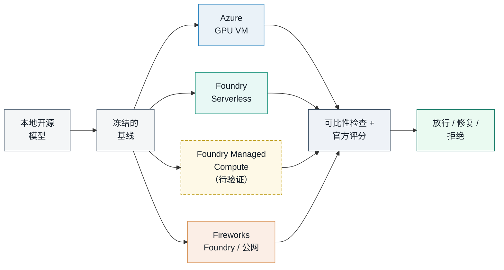
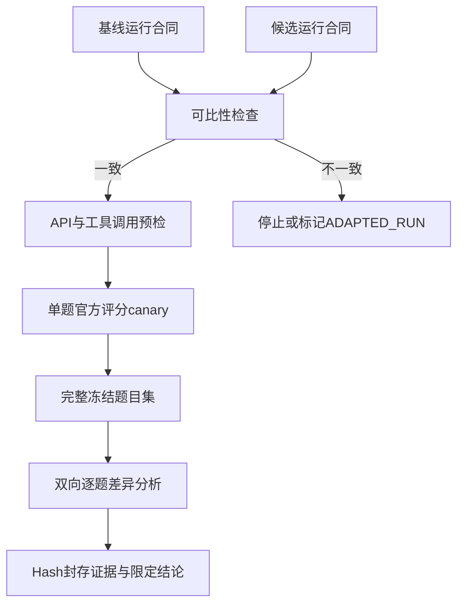
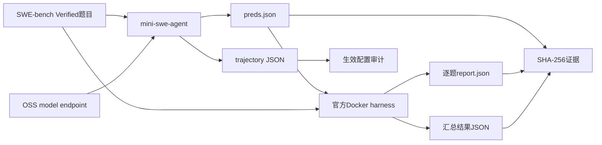
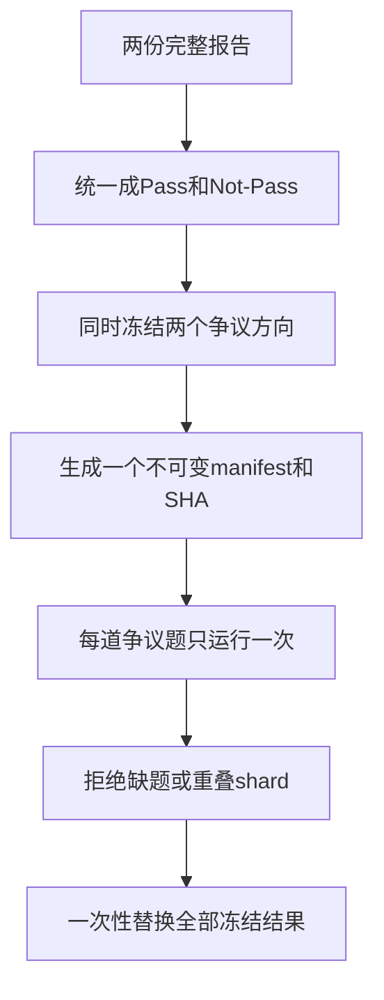

# 开源模型 SWE-bench 评测实战指南

[](https://huggingface.co/datasets/princeton-nlp/SWE-Bench_Verified)
[](https://github.com/SWE-agent/mini-swe-agent/tree/v2.4.6)
[](https://github.com/SWE-bench/SWE-bench/commit/f7bbbb2ccdf479001d6467c9e34af59e44a840f9)
[](https://www.python.org/)
[](https://github.com/david-xinyuwei/david-share/actions/workflows/oss-model-swebench-playbook-ci.yml)

本指南提供一套可审计的生产迁移评测方法。它使用同一份冻结的SWE-bench评测方案，衡量开源代码模型迁移到Microsoft Foundry Serverless API、Microsoft Foundry Managed Compute、Fireworks或Azure GPU VM前后的软件工程准确率，也可用于比较模型微调前后的准确率。

> **作者**：魏新宇 (Xinyu Wei) — Microsoft AI and Apps Global Black Belt (GBB)

[English](README.md) | 中文版

[客户决策](#这套方法回答什么问题) | [快速开始](#3-快速开始与azure运行) | [当前证据](#当前证据能够说明什么)

<div align="center">
  
</div>

## 概览

SWE-bench不是把一道题发给模型后比较文本答案，而是评测一套完整的**软件工程Agent系统**：

1. mini-swe-agent把issue和代码仓库交给被测模型。
2. 模型通过shell工具查看并修改代码，最终生成Git patch。
3. 官方SWE-bench harness（评分器）恢复每道题对应的Docker环境。
4. Harness应用候选patch和官方test patch。
5. 只有目标测试通过且原有测试不回退，这道题才算Resolved。

无论模型运行在本地机房、其他云、Microsoft Foundry还是Fireworks，本Repo都使用同一条证据链产出可审计的官方评测结果：

| 阶段 | 输入 | 输出 | 通过条件 |
|---|---|---|---|
| 接口预检 | 模型URL、实际部署名称 | Chat Completions工具调用响应 | HTTP成功，且至少返回1个有效的`ping`函数调用 |
| Agent生成 | Issue、代码仓库、Agent YAML | `preds.json`和trajectory（执行轨迹） | 题目ID覆盖完整、状态合法 |
| 生效配置审计 | Trajectory中的`info.config` | 标准化配置hash | 去除允许的逐题差异后，只剩一套目标配置 |
| 官方评测 | 候选patch | 逐题报告和汇总JSON | Docker harness正常退出 |
| 差异复测 | 两份完整报告 | 一次冻结的双向争议清单 | 禁止动态缩小集合或保留最佳结果 |
| 证据封存 | 已完成的运行文件 | `SHA256SUMS.txt` | 所有写入进程已经停止，manifest（文件清单）可复验 |

核心脚本尽量只依赖Python标准库；一旦发现缺题、重复题或分片重叠，就立即终止，不生成看似完整的结果。公开仓库不包含私有endpoint（模型服务接口）、凭据、VM信息、客户数据或内部测试结果。

## 业务价值与适用场景

模型接口能够返回HTTP 200，并不代表迁移后的软件工程能力没有下降。本指南把“迁移后准确率是否保持”转化为一套可复验的放行标准。

### 这套方法回答什么问题

客户已经在本地环境运行并认可一个开源模型，现在希望把**同一个模型**迁移到Azure GPU VM、Microsoft Foundry Serverless API、Microsoft Foundry Managed Compute或Fireworks，同时保持软件工程准确率。四条路径使用同一份评测方案，但每条路径分别记录自己的证据状态。客户真正需要回答的是：

> 在模型、Agent、SWE-bench题目集和官方评分器保持一致的前提下，迁移后准确率是否保持？



因此，本Repo不只是一个评测脚本集合：

- **验证准确率是否保持：** 判断同一个开源模型迁移后，解决软件工程问题的能力是否发生变化。
- **保证四条路径可比：** 使用同一个Agent、题目集、评分器和证据格式进行比较。
- **区分问题所在层级：** 将模型能力回退、API兼容问题、服务容量不足、Agent配置变化和评分环境故障分开记录。
- **支持可审计的迁移决策：** 提供完整分母、逐题变化、机器可读配置和不可变证据，而不是只给一个总分。

如果目标平台无法提供客户使用的精确模型，只能改测另一个模型，这套流程仍然有价值，但结论必须改为`MODEL_SELECTION_METHOD_ALIGNED`，不能继续声称只比较了平台迁移。

| 业务决策 | 基线环境 | 候选环境 | 能证明什么 |
|---|---|---|---|
| 本地开源模型迁移到托管平台 | 本地环境或基于AMD GPU的OpenAI-compatible endpoint | Azure GPU VM、Foundry Serverless、Foundry Managed Compute或Fireworks | 同一模型和版本迁移后，SWE-bench准确率是否保持 |
| 从其他云迁移到Azure | 现有云端endpoint | 四条候选路径中的任意一条 | 目标平台是否达到事先冻结的准确率门槛 |
| 验证微调效果 | Base model（基础模型） | 同一平台上的fine-tuned deployment（微调模型部署） | 哪些题提升、回退、保持不变或出现运行故障 |
| 选择生产模型 | 现有生产模型 | 另一个候选模型 | 比较不同模型的质量；不能解释为单纯的平台迁移效果 |

**单变量原则：** 如果要得出平台迁移结论，模型family、weight revision、Agent配置、题目集、并发度和harness都必须保持一致。如果基线模型与Fireworks上的候选模型不同，那么模型和平台同时发生了变化，结果只能用于模型选择，不能把准确率差异归因给Fireworks平台。

### 当前证据能够说明什么

- **基线方法已经验证：** 本方法已在基于AMD GPU、形态接近本地部署的OpenAI-compatible endpoint上运行。
- **Azure GPU VM：** `openai_compatible`运行入口、精确复现要求和官方评分流程均已实现并通过测试；当前尚未发布Azure GPU VM全量迁移分数。
- **Microsoft Foundry Serverless：** `2026-07-31`，非Fireworks的`DeepSeek-V4-Flash`部署通过HTTP 200函数调用预检。mini-swe-agent `2.4.6`随后为`astropy__astropy-7166`生成1个非空patch；固定版本的官方harness将其判为Resolved，error为0，且没有遗留container。详见[脱敏证据](examples/live-foundry-direct-deepseek-v4-flash-scored-canary.yaml)。
- **Fireworks（通过Foundry）：** 单独部署的`FW-GLM-5.1`也通过了同一套单题生成和官方评分canary。这只证明Fireworks经Foundry的调用路径，不代表直接Foundry模型路径。详见[脱敏证据](examples/live-foundry-fw-glm51-scored-canary.yaml)。
- **Fireworks公网API：** `fireworks`模式已经实现，并针对固定LiteLLM provider完成请求与响应格式测试；请求发送到`api.fireworks.ai`，密钥值不会进入进程参数。当前尚未发布Fireworks公网API的官方评分结果。
- **Microsoft Foundry Managed Compute：** 当前不发布分数，也不宣称数据面已经验证。实测部署的控制面达到`Succeeded`，但认证后的`/openai/v1` chat route仍返回HTTP 500 `Model service is unavailable`，因此保持`PENDING / NOT VERIFIED`。详见[脱敏的待验证证据](examples/live-foundry-managed-compute-pending.yaml)。
- **结论边界：** 四条候选路径都必须完成声明的全量评测后，才能发布迁移准确率。每个单题结果都只是兼容性canary（单题全链路验证），不能写成`1/500`准确率或模型对比结论。

### 接入模式

| `ENDPOINT_MODE` | 适用平台 | 模型名称写法 | 认证来源 |
|---|---|---|---|
| `openai_compatible` | 本地、AMD验证环境或其他OpenAI-compatible云服务 | `hosted_vllm/<served-name>`；未写前缀时自动添加 | `HOSTED_VLLM_API_KEY`或`MODEL_API_KEY`；无需认证的本地endpoint可用`EMPTY` |
| `azure_foundry` | Microsoft Foundry Models v1 endpoint，包括直接Serverless API deployment和通过Azure售卖的Fireworks模型；Managed Compute的数据面仍待验证 | Deployment name通过OpenAI-compatible route发送；内部自动加`hosted_vllm/` | `AZURE_API_KEY`、`AZURE_OPENAI_API_KEY`、`AZURE_AD_TOKEN`或`MODEL_API_KEY`；映射为Bearer且不进入argv |
| `fireworks` | Fireworks serverless、account model或direct-route deployment | `fireworks_ai/<exact-model-id>`；未写前缀时自动添加 | `FIREWORKS_AI_API_KEY`或`MODEL_API_KEY` |

每次生成都会写入`provider-contract.json`，记录接入模式、业务场景、运行标签、模型名称、API基地址、非秘密认证变量名、worker数、题目集和配置；不会保存凭据值。

`EVALUATION_SCENARIO`用于标识比较场景，支持`single_endpoint`、`onprem_to_managed`、`cloud_to_managed`和`base_vs_finetuned`。

## 如何保证迁移前后的结果可比

迁移评测必须先对齐所有可能影响结果的因素。两个endpoint都返回HTTP 200，只能证明接口可访问；两边都标注mini-swe-agent 2.4.6，也只能证明版本标签相同。模型权重、prompt、默认参数、实际导入的源码或重试规则只要有一项不同，就不能把分数变化简单归因于平台迁移。

### 必须保持一致的要素

| 对齐层面 | 必须记录或验证的内容 | 目的 |
|---|---|---|
| 比较目标 | 平台迁移、模型微调或模型选择 | 明确哪些差异是有意改变的变量 |
| 模型身份 | Family、revision、模型权重SHA-256、tokenizer SHA-256、precision | 防止把不同权重误写成单纯的平台迁移对比 |
| Agent身份 | Package hash、生效配置、system prompt、tool schema和运行限制 | 避免Agent变化影响多轮执行轨迹 |
| API语义 | Protocol、tool schema、finish reason和对话重放格式 | OpenAI-compatible不代表所有provider（模型服务提供方）都接受相同metadata |
| 题目与执行方式 | 题目集revision、执行镜像manifest、分片、完整分母、sampling、worker数和重试规则 | 防止选题偏差、环境漂移和并发差异 |
| 评分环境 | Harness源码、dependency lock、image、timeout、cache和清理规则 | 同一个patch在不同评分环境中也可能得到不同结果 |
| 证据 | Trajectory、逐题报告、实际进程命令、hash和各阶段血缘关系 | 让每条结论都能独立复核 |

在平台迁移对比中，endpoint、认证方式、推理runtime、accelerator、topology和deployment name可以不同，因为它们共同构成被测的**平台与推理服务栈**。但模型身份、Agent行为、题目集、sampling、并发度和评分环境必须保持不变。即使结果出现差异，也不能进一步把差异单独归因于某种hardware或runtime，除非另做单变量实验。

### 结论强度由证据计算，不由作者选择

| 结论等级 | 证据要求 | 可以宣称什么 |
|---|---|---|
| `MODEL_AND_METHOD_ALIGNED` | 模型和tokenizer身份已验证，所有方法约束一致 | 同一模型的端到端迁移对比 |
| `FINETUNING_METHOD_ALIGNED` | Base与fine-tuned weights有意不同，平台和方法约束一致 | 受控的微调前后对比 |
| `MODEL_SELECTION_METHOD_ALIGNED` | 模型可以不同，但Agent、题目集和评分约束一致 | 模型选择对比；不能写成只改变平台的结论 |
| `METHOD_ALIGNED` | 方法约束一致，但至少一个身份hash为`UNVERIFIED` | 带来源限制的方法级对比 |
| `ADAPTED_RUN` | 显式允许了一个会影响行为的差异 | 适配后的实测结果；不能称为精确复现 |
| `NOT_COMPARABLE` | 未经批准的约束发生变化 | 不得计算或发布迁移差值 |

比较脚本默认采用严格拒绝策略。即使通过`--allow-difference`声明例外，结果仍会标为`ADAPTED_RUN`并停止；只有显式增加`--accept-adapted`，流程才会继续。

```bash
python scripts/compare_run_contracts.py \
  --reference examples/parity-reference.toml \
  --candidate examples/parity-candidate.toml \
  --scenario platform_migration \
  --output runs/parity-report.json
```

Repo内置的合成示例应输出：

```text
PARITY_GATE=PASS scenario=platform_migration classification=MODEL_AND_METHOD_ALIGNED
```

### 从基线到候选环境的验证流程



### 多节点实测中发现的工程问题

| 现象 | 可能造成的影响 | 验证与处理要求 |
|---|---|---|
| 包版本相同，但实际import的源码不同 | Editable install、mount或path precedence可能改变行为 | 记录实际import path，并对影响评分的源码生成hash |
| Preview文档示例与实时控制面不一致 | 文档中的asset reference或API field可能已经过时 | 固定API version，保存服务端错误，只修改实时响应已经证明的字段 |
| Provisioning明显超过典型时长 | 仍在执行的create LRO可能看起来像停滞；allocation活跃时delete可能冲突 | 联合检查provisioning state、quota usage、Activity Log和delete response；禁止盲目重复创建 |
| 明明存在基线launcher，实际却运行了重写版本 | 参数看似一致，environment和control flow却已经变化 | 记录实际进程命令，并对launcher生成SHA-256 |
| 生效配置一致，trajectory仍然不同 | Temperature 0不能让多轮Agent完全确定 | 保存每一轮trajectory，把波动写成实测现象 |
| 第一个tool call成功，后续turn失败 | Provider metadata可能被重放到更严格的schema | 必须完成multi-turn canary，不能只看HTTP health |
| Endpoint健康，但产物不再增长 | Health只能证明服务存活，不能证明评测在推进 | 使用无副作用health probe，同时检查prediction、report、log和runtime活动 |
| Worker数或重试规则变化 | Request交错顺序会改变tool observation和后续Agent决策 | Generation前冻结concurrency、queueing、timeout和retry语义 |
| 长请求超过active context | Silent truncation或stall可能被误判为模型失败 | 记录required context；模型服务容量不足时在运行前终止 |
| 已启用host cache | Secondary cache不一定增加active sequence可用的GPU容量 | 按每层memory实际控制的限制分别验收 |
| 基础设施异常被计入模型失败 | 既压低accuracy，也掩盖reliability问题 | Resolved、Unresolved、Empty和Error必须互斥且完整覆盖 |
| 相同patch得到不同分数 | Harness源码、image、timing或timeout可能已经变化 | 固定评分源码，保留逐题test output |
| 只复测有利于候选分数的争议题 | Optional stopping会形成隐藏的best-of | 一次冻结两个争议方向，再统一替换结果 |
| 把单题总耗时当成模型速度 | Shell tool、repository test和官方评分属于不同阶段 | 分开报告API延迟、工具执行时间、生成总耗时和harness耗时 |

### 迁移验收顺序

1. **保存基线：** 记录客户实际使用的server launcher、Agent配置、dependency lock、模型与tokenizer身份，以及原始逐题产物。
2. **检查可比性：** 比较机器可读的运行合同；一旦发现未经批准的约束变化，立即停止。
3. **验证完整调用链：** 检查tool call、多轮对话重放、一个生成patch和一份官方评分报告。
4. **形成全量证据：** 跑完冻结分母，分类每道题，封存产物，最后只发布证据等级允许的结论。

这套顺序允许客户灵活选择Microsoft侧的deployment，同时让每个不可避免的差异保持可见。托管服务不需要逐字节复刻客户的GPU topology，但必须证明模型、Agent、题目集、评分合同、API行为和证据含义保持一致。

### 推理拓扑：P/D分离还是两个独立Endpoint？

Prefill/decode（P/D）disaggregation与两个独立replica解决的是不同问题。P/D对外提供一个统一接口，prefill和decode可以运行在不同worker上；两个独立endpoint则各自加载完整模型，并分别处理互不重叠的SWE-bench题目。

| 拓扑 | 适用条件 | 主要风险 |
|---|---|---|
| P/D disaggregation | 模型或KV workload需要角色分工，且prefill/decode不均衡带来的收益足以抵消协调成本 | 跨节点通信、head-of-line blocking、角色恢复耦合和更大的failure domain |
| 双独立endpoint | 每个endpoint都能容纳完整模型，题目彼此独立，目标是提高整体cases/hour和故障隔离能力 | 重复占用模型显存，必须建立严格的互斥分片和合并合同 |

在一次大型开源代码模型评测中，一个cross-node P/D endpoint比两个各处理一半冻结manifest的独立endpoint更慢，稳定性也更差。这只是特定workload下的实测结果，不能泛化为“P/D永远更慢”。选择拓扑时应按以下步骤执行：

1. 冻结一份有代表性的calibration manifest，以及完整的模型、Agent和sampling合同。
2. 分别使用P/D endpoint和双独立endpoint运行同一批题目。
3. 比较每小时有效生成题数、逐题生成耗时、API延迟分布、Error rate、restart count和GPU utilization。Official scoring time必须单独列出，因为它不衡量模型推理服务。
4. 在全量评测前选定topology。中途切换topology意味着进入新的runtime epoch；不同epoch不能合并成一个同质分数。
5. 如果双独立endpoint胜出，对**同一份冻结的完整题目清单**做确定性分片，最终只合并互不重叠的官方报告。

```bash
python scripts/shard_instance_manifest.py \
  --manifest examples/instance-manifest.tsv \
  --shards 2 \
  --output-dir outputs/two-endpoint-shards

# Node A
export INSTANCE_MANIFEST="outputs/two-endpoint-shards/shard-000.tsv"
bash scripts/run_generation.sh

# Node B
export INSTANCE_MANIFEST="outputs/two-endpoint-shards/shard-001.tsv"
bash scripts/run_generation.sh
```

预期sharding marker：

```text
SHARD_MANIFEST=PASS cases=6 shards=2 counts=3,3
```

每次生成都会把选中manifest的SHA-256写入`provider-contract.json`。官方评分完成后，使用`merge_official_reports.py`合并两份aggregate report；只要发现题目重叠、ID重复或合并集合不完整，脚本就会立即终止。

### Agent版本和Sampling属于评测合同

SWE-bench评测的是一套完整系统，而不是裸模型。分数由模型、Agent版本、instructions、tool schema、sampling、推理服务行为和评分器共同决定。较新的Agent可能改善provider compatibility和tool-call handling，但静默升级会破坏可比性。

- **选择足够新的Agent版本，然后精确固定。** 本Repo验证的是mini-swe-agent `2.4.6`。禁止使用可变的`latest` image，也不能仅凭另一台机器的package label相同就认为源码一致。
- **迁移对比两侧必须使用同一Agent。** 固定package SHA-256、实际导入源码、生效配置、system prompt、tool schema、step/cost/wall-time limits和output/status semantics。
- **显式冻结sampling参数。** Temperature、top-p、maximum output tokens、seed、parallel-tool policy、服务端sampling backend和生成worker数都会改变trajectory。
- **Agent升级必须作为新实验。** 先跑scored canary，使用新的run ID，再单独比较版本；不能把新旧Agent结果拼成一个accuracy score。
- **Temperature zero不代表端到端确定。** 多轮tool observation、backend scheduling和tied token choice仍可能改变call和patch；必须保留所有trajectory并分析成对的逐题差异。

可比性检查会拒绝平台迁移对比中的Agent version、sampling、partition和retry-policy drift。如果客户明确接受其中某项变化，必须显式声明适配项，最终结果标为`ADAPTED_RUN`。

## 四条部署路径与测试合同

四条路径使用同一套评测流程：保存基线运行合同、检查可比性、验证多轮工具调用、完成scored canary、运行完整冻结题目集，并分析两个方向的逐题差异。各路径的实现方式和当前证据状态仍然彼此独立。

| 候选路径 | `ENDPOINT_MODE` | 必须保存的平台证据 | 满足条件后可得出的结论 |
|---|---|---|---|
| Azure GPU VM | `openai_compatible` | 容器image、model/tokenizer hash、实际launcher、runtime commit、driver、GPU topology和context capacity | 同一模型权重和评测方法均验证后，可标`MODEL_AND_METHOD_ALIGNED` |
| Foundry Serverless API | `azure_foundry` | 精确的model format/name/version、deployment SKU和scope、TPM capacity、RAI policy、region和API capabilities | 只有提供客户使用的精确model/revision时，才属于同模型迁移；否则标`MODEL_SELECTION_METHOD_ALIGNED` |
| Foundry Managed Compute | `azure_foundry`客户端规范；数据面待验证 | Registry model/version、解析后的deployment template、accelerator family/count、context capacity、runtime route和upgrade policy | 当前为`NOT VERIFIED`；只有数据面和scored canary通过后，才可能标`MODEL_AND_METHOD_ALIGNED` |
| Fireworks（通过Foundry或公网API） | `azure_foundry`或`fireworks` | 精确的Foundry deployment或account/direct-route model ID、provider format、API version、context、rate limit和replay schema | 只有部署客户使用的精确model/revision时，才属于同模型迁移；否则标`MODEL_SELECTION_METHOD_ALIGNED` |

### 如何测试 Azure GPU VM

Azure GPU VM提供最高的环境控制力，通常也是复现客户现有模型服务栈最直接的路径。

1. **从基线环境复现，不凭记忆重写。** 使用客户现有的模型权重、tokenizer、precision、model revision、runtime源码、container image和launcher；启动后记录实际进程命令行。
2. **固定推理服务配置。** 保存GPU SKU和数量、tensor/pipeline parallelism、context和active KV capacity、quantization、tool parser、sampling backend、deterministic flag、driver/runtime版本和environment hash。
3. **验证OpenAI-compatible接口。** 使用`ENDPOINT_MODE=openai_compatible`，验证`/v1/chat/completions`、函数参数、finish reason和多轮对话重放。
4. **保持评测方法一致。** Agent package/config、tool schema、题目集manifest、生成并发度、重试规则和官方harness必须与本地基线一致。
5. **单独记录基础设施故障。** GPU故障、服务崩溃、上下文截断、Docker故障和endpoint超时属于Error或重试证据，不得计为模型失败。

这条路径最容易出现“无意适配”：重写launcher后，参数看起来相同，但继承的环境变量、import顺序、缓存状态、binding、默认值或进程生命周期已经变化。可比性合同会记录launcher和environment identity，防止把这种变化误写成精确迁移。

### 如何测试 Foundry Serverless API

这条路径直接从Microsoft Foundry catalog部署模型，可使用Standard、Global Standard、Data Zone Standard或其他支持的按token计费部署类型。推理基础设施由Azure管理，客户通过统一的Foundry endpoint调用模型。

| 组件 | 运行位置 | 职责 |
|---|---|---|
| 模型推理 | Microsoft Foundry Serverless | 托管模型权重，返回chat和tool-call响应 |
| mini-swe-agent | 客户控制的评测主机 | 把issue和tool observation发送给远端模型，并生成候选patch |
| SWE-bench题目环境 | 评测主机上的Docker | Checkout代码仓库，并向Agent提供shell tool |
| 官方评分器 | 评测主机上的Docker harness | 应用patch，执行`FAIL_TO_PASS`和`PASS_TO_PASS`测试 |

评测主机不会加载Foundry模型权重；它只运行Agent和评分器，模型推理始终发生在托管的Serverless service中。

1. **固定部署身份。** 保存model `format`、`name`、`version`、deployment name、SKU、capacity、processing scope、region和provisioning state。只有deployment name不足以证明模型身份。
2. **固定策略配置。** 记录RAI/content-filter policy、API capabilities、context window、tool support、rate limit和version-upgrade setting。即使模型权重相同，filter或policy差异也可能改变结果。
3. **选择正确的比较类型。** Foundry能提供客户使用的精确model/revision时，使用`platform_migration`；如果只能使用另一个模型，则使用`model_selection`，结果只能支持模型选择，不能冒充同模型迁移。
4. **调用统一Foundry接口。** 设置`ENDPOINT_MODE=azure_foundry`，调用`/openai/v1/chat/completions`，并在`model`字段传deployment name。
5. **不要让配额问题污染准确率。** HTTP 429、容量耗尽和临时网关故障属于Error或重试证据，不能变成Unresolved模型结果。
6. **保持SWE-bench流程不变。** 工具调用预检、多轮scored canary、完整冻结分母、官方harness和双向逐题差异分析全部保持一致。

Foundry Serverless API是运维门槛最低的Azure原生路径，按token而不是accelerator-hour计费。它能否用于同模型迁移验证，取决于catalog是否提供客户使用的精确模型身份；否则只能回答模型选择问题。

### 如何测试 Fireworks

本Repo支持两种Fireworks接入方式：通过Microsoft Foundry售卖的Fireworks模型使用`ENDPOINT_MODE=azure_foundry`和`/openai/v1/chat/completions`；Fireworks公网API使用`ENDPOINT_MODE=fireworks`和`/inference/v1/chat/completions`。

1. **部署前确认模型身份。** 保存精确的account model或Foundry deployment ID、upstream revision、tokenizer、precision和context；display name不足以作为证据。
2. **运行前确定比较类型。** Fireworks托管客户使用的同一模型权重和revision时使用`platform_migration`；如果使用不同catalog model，则使用`model_selection`，不能把分数差异单独归因给Fireworks。
3. **验证provider语义。** 检查function-tool JSON、`finish_reason`、parallel-tool behavior、token limit、rate limit和response metadata。第一次请求返回HTTP 200仍不够，因为provider metadata可能在后续turn重放时破坏schema。
4. **不要让限流污染准确率。** Throttling、临时网关错误和服务故障属于基础设施结果，只能按冻结的重试规则处理。
5. **全量评测前完成scored canary。** 先取得合法的执行轨迹、完整的prediction文件和官方报告，再投入完整分母。

Fireworks的运维负担最低，但模型是否可用决定它回答的是迁移问题还是模型选择问题。

### 待验证：Managed Compute

**状态：`PENDING / NOT VERIFIED`。** Managed Compute是四条目标路径之一，但本Repo当前不发布其分数，也不宣称数据面已经通过canary。下面列出它进入已验证路径集合前必须补齐的证据。

1. **固定模型与部署模板。** 保存完整registry model ID和version；保存deployment template ID、resolved version、runtime、context、accelerator count和`versionUpgradeOption`。只记录可变的`labels/latest`不足以支持benchmark复现。
2. **创建前确认容量。** Managed Compute quota与Azure VM quota彼此独立。保存accelerator-family quota、current usage、live capacity、SKU、model instance数和total accelerator数。
3. **同时验证control plane（控制面）和data plane（数据面）。** `provisioningState=Succeeded`只是必要条件，不代表数据面可用。先读取deployment返回的route，再要求认证请求得到HTTP 200；如果返回500 `Model service is unavailable`，就不能开始canary。
4. **使用Portal给出的客户端调用方式。** OpenAI SDK的`base_url`应指向资源的`/openai/v1` endpoint，并在`model`字段传Managed Compute deployment name。Management plane返回的deployment-specific route可用于诊断，但不能替代Portal sample。实测中`models.list()`成功，而chat completion仍返回HTTP 500，说明当前故障位于模型服务层，而不是endpoint认证。
5. **保持准确率验收要求不变。** 继续执行可比性检查、scored canary、完整冻结题目集、完整结果分类和双向差异分析。
6. **完整记录计费与资源释放。** Managed Compute按accelerator-hour计费。本次有限范围验证完成后，先保存证据，再删除deployment，确认资源已经释放，并记录最终usage和cost scope。

#### Managed Compute接口规范（仅定义，不执行）

下面的接入规范不会自动执行。示例只定义client和request function，只有调用方显式调用时才会发送流量。所有placeholder都必须通过环境变量替换；真实key、endpoint和deployment identifier不能进入source control。

| 接口面 | 规范 |
|---|---|
| 资源基地址 | `https://<account>.services.ai.azure.com` |
| OpenAI-compatible基地址 | `https://<account>.services.ai.azure.com/openai/v1` |
| Managed deployment基地址 | `https://<account>.services.ai.azure.com/managed-deployments/<deployment-name>/v1` |
| Project SDK endpoint | `https://<account>.services.ai.azure.com/api/projects/<project-name>` |
| 请求中的model | `model=<deployment-name>` |
| Chat操作 | `POST /chat/completions` |
| 工具类型 | `function`，arguments使用JSON Schema |

```bash
export FOUNDRY_ACCOUNT_NAME="<account>"
export FOUNDRY_DEPLOYMENT_NAME="<deployment-name>"
export FOUNDRY_PROJECT_ENDPOINT="https://<account>.services.ai.azure.com/api/projects/<project-name>"
export FOUNDRY_TOKEN_SCOPE="https://ai.azure.com/.default"
export FOUNDRY_API_KEY="<read-from-a-secure-store>"
```

Portal当前生成的Entra示例使用`https://ai.azure.com/.default`。Managed Compute官方操作指南还提供使用`https://cognitiveservices.azure.com/.default`的bearer-header写法。必须固定当前deployment的Portal或官方示例所示scope；禁止把切换audience当作隐式重试。

**Microsoft Entra ID客户端工厂：**

```python
import os
from collections.abc import Iterator
from contextlib import contextmanager

from azure.identity import DefaultAzureCredential, get_bearer_token_provider
from openai import OpenAI


@contextmanager
def create_entra_client() -> Iterator[OpenAI]:
  credential = DefaultAzureCredential()
  token_provider = get_bearer_token_provider(
    credential,
    os.getenv("FOUNDRY_TOKEN_SCOPE", "https://ai.azure.com/.default"),
  )
  client = OpenAI(
    base_url=(
      f"https://{os.environ['FOUNDRY_ACCOUNT_NAME']}"
      ".services.ai.azure.com/openai/v1"
    ),
    api_key=token_provider,
    timeout=120.0,
    max_retries=0,
  )
  try:
    yield client
  finally:
    client.close()
    credential.close()
```

**API Key客户端工厂：**

```python
import os
from collections.abc import Iterator
from contextlib import contextmanager

from openai import OpenAI


@contextmanager
def create_api_key_client() -> Iterator[OpenAI]:
  client = OpenAI(
    base_url=(
      f"https://{os.environ['FOUNDRY_ACCOUNT_NAME']}"
      ".services.ai.azure.com/openai/v1"
    ),
    api_key=os.environ["FOUNDRY_API_KEY"],
    timeout=120.0,
    max_retries=0,
  )
  try:
    yield client
  finally:
    client.close()
```

Project endpoint属于`AIProjectClient`；它不是chat请求的base URL，也不能替代资源级OpenAI route：

```python
import os
from collections.abc import Iterator
from contextlib import contextmanager

from azure.ai.projects import AIProjectClient
from azure.identity import DefaultAzureCredential


@contextmanager
def create_project_client() -> Iterator[AIProjectClient]:
  credential = DefaultAzureCredential()
  client = AIProjectClient(
    endpoint=os.environ["FOUNDRY_PROJECT_ENDPOINT"],
    credential=credential,
    allow_preview=True,
  )
  try:
    yield client
  finally:
    client.close()
    credential.close()
```

**Chat与function-tool请求规范：**

```python
import os

from openai import OpenAI


def create_tool_probe(client: OpenAI):
  return client.chat.completions.create(
    model=os.environ["FOUNDRY_DEPLOYMENT_NAME"],
    messages=[
      {
        "role": "user",
        "content": "Call the ping tool once with value ok.",
      }
    ],
    tools=[
      {
        "type": "function",
        "function": {
          "name": "ping",
          "description": "Return a value",
          "parameters": {
            "type": "object",
            "properties": {"value": {"type": "string"}},
            "required": ["value"],
          },
        },
      }
    ],
    tool_choice="auto",
    temperature=0,
    max_tokens=128,
  )
```

响应必须包含response ID、`finish_reason`，以及message content或可解析的`tool_calls`。Provider返回request ID时必须保留。多轮工具调用需要重放assistant tool call，再使用匹配的`tool_call_id`返回tool answer；禁止把provider专用的transport metadata带入下一次请求。

调用方负责真正发送请求；调用`create_tool_probe`前必须进入选定的client context。规范本身不会在import或module加载阶段发起网络请求。

| 结果 | 分类 | 必须采取的动作 |
|---|---|---|
| HTTP `200`且content/tool call合法 | 可以继续验证能力 | 继续multi-turn replay和scored canary |
| HTTP `401`或`403` | 认证或RBAC失败 | 修复credential、audience、role或key source |
| HTTP `404` / `DeploymentNotFound` | Route或deployment注册失败 | 核对精确deployment name、runtime route和数据面发布状态 |
| HTTP `429` | Quota、throttling或capacity问题 | 只按冻结的infrastructure retry policy处理，不能计入model accuracy |
| HTTP `500` / `Model service is unavailable` | 外部模型服务失败 | 在Agent生成前停止，并把结果保留为`NOT VERIFIED` |
| Timeout | 基础设施失败 | 保存耗时和请求证据，只按冻结策略重试 |

就绪性验证顺序固定为：控制面身份 -> 认证后的chat请求 -> 有效的function tool call -> 多轮对话重放 -> 单题官方评分canary。Control-plane `Succeeded`、model-list response、generated code sample或HTTP health result都不能跳过后续步骤。

Managed Compute当前处于Preview，data path不内置Content Safety。这不会改变离线SWE-bench评分，但它是独立的生产就绪要求，不能被准确率结果掩盖。

## 1. SWE-bench 原理

### 1.1 每道题包含什么

[SWE-bench Verified](https://huggingface.co/datasets/princeton-nlp/SWE-Bench_Verified)包含500道由工程师确认可以解决的issue–pull request题目。每道题常见字段如下：

| 字段 | 在评测中的作用 |
|---|---|
| `instance_id` | 稳定题目ID，例如`owner__repo-1234` |
| `problem_statement` | Agent能看到的GitHub issue标题和正文 |
| `base_commit` | 修复PR之前的仓库状态 |
| `test_patch` | 从标准答案PR中提取的权威测试 |
| `FAIL_TO_PASS` | 修复前失败、修复后应该通过的测试 |
| `PASS_TO_PASS` | 修复前后都必须保持通过的已有测试 |
| `environment_setup_commit` | Harness创建环境时使用的环境版本标识 |

标准答案patch用于定义和验证题目，但不会提供给被测模型。

### 1.2 阶段A：Agent生成

mini-swe-agent创建题目容器，把代码切到`base_commit`，再把issue交给模型，并提供`bash`工具。模型会多轮查看代码、修改文件、运行测试，最后提交patch。

生成阶段主要产生两类文件：

- `preds.json`：每道题对应一个候选patch。
- `<instance_id>/<instance_id>.traj.json`：messages、tool observations、生效配置、exit status、调用统计和patch来源。

生成完成不代表题目已经通过。

### 1.3 阶段B：官方Docker评测

官方harness会在每道题自己的evaluation image中运行候选patch。逻辑上包括：

1. 恢复仓库和依赖环境。
2. 应用候选patch。
3. 应用官方test patch。
4. 执行该题指定的测试命令。
5. 解析`FAIL_TO_PASS`和`PASS_TO_PASS`。

候选patch能够应用，并且要求修复的测试全部通过、已有测试没有回退，才算Resolved。Empty和Error必须单独保留，不能静默并入Unresolved。

### 1.4 为什么必须用Docker

每道题可能依赖不同的仓库版本、Python版本、系统包和测试命令。官方harness通过Docker隔离环境。SWE-bench官方建议本地评测使用x86_64主机，并预留约120GB可用磁盘、16GB RAM和8个CPU core。

### 1.5 为什么Generation和Evaluation必须分开

两个阶段的失败含义完全不同：

| 生成阶段失败 | 评分阶段失败 |
|---|---|
| 模型endpoint不可用 | 候选patch无法应用 |
| Tool call格式错误 | 要求修复的测试仍然失败 |
| Agent达到step或cost限制 | 已有测试发生回退 |
| 题目Docker容器无法启动 | 测试执行超时 |
| Empty patch | Harness或Docker执行错误 |

如果混在一起统计，准确率会失真，后续也无法判断应该修模型、Agent还是基础设施。

## 2. 架构与产物



建议的运行目录：

```text
runs/<run-id>/
├── generation/
│   ├── preds.json
│   ├── <instance-id>/<instance-id>.traj.json
│   ├── generation-summary.json
│   └── generation.log
├── official-eval/
│   ├── logs/run_evaluation/.../report.json
│   ├── aggregate.json
│   └── harness.log
├── contract.json
└── SHA256SUMS.txt
```

## 3. 快速开始与Azure运行

### 3.1 前置条件

- Linux x86_64主机
- Docker Engine，以及足够存放SWE-bench题目镜像的磁盘
- Python 3.12（已经过干净环境验证）
- 通过`/v1/models`和`/v1/chat/completions`提供服务，并支持OpenAI风格function tool call的开源代码模型
- 与模型规模匹配的GPU资源

### 3.2 安装固定版本工具链

```bash
git clone https://github.com/david-xinyuwei/david-share.git
cd david-share/Deep-Learning/OSS-Model-SWE-bench-Evaluation-Playbook

python3 -m venv .venv
source .venv/bin/activate
python -m pip install --upgrade pip
bash scripts/setup_environment.sh
```

默认安装使用`requirements-lock.txt`，它来自Linux x86_64 / Python 3.12.3干净环境。`requirements.txt`只记录维护者需要关注的Agent直接依赖。工具链固定为：

- mini-swe-agent `v2.4.6`
- SWE-bench commit `f7bbbb2ccdf479001d6467c9e34af59e44a840f9`

这个SWE-bench commit修复了一个评分问题：当test patch只新增文件时，旧逻辑可能误重置整个working tree。

安装脚本会保留固定commit的SWE-bench checkout，并使用editable install。有些revision直接构建VCS wheel时，可能漏掉harness运行需要的非Python fixture；保留源码checkout可以避开这个打包问题。
只有在明确需要重新解析依赖时，才设置`REQUIREMENTS_FILE=./requirements.txt`；之后必须重新保存并审计`pip freeze`，不能直接比较新旧依赖环境的分数。

### 3.3 选择接入模式

所有平台都使用同一套生成和评分命令，只替换与provider有关的环境变量。

**本地、AMD GPU或其他OpenAI-compatible基线：**

```bash
export ENDPOINT_MODE="openai_compatible"
export EVALUATION_SCENARIO="single_endpoint"
export RUN_LABEL="onprem-baseline"
export MODEL_API_BASE="http://127.0.0.1:8000/v1"
export MODEL_NAME="your-served-model"
export MODEL_API_KEY="EMPTY"
```

**Microsoft Foundry候选环境：**

```bash
export ENDPOINT_MODE="azure_foundry"
export EVALUATION_SCENARIO="onprem_to_managed"
export RUN_LABEL="foundry-candidate"
export MODEL_API_BASE="https://<resource-name>.services.ai.azure.com"
export MODEL_NAME="<deployment-name>"
: "${AZURE_API_KEY:?Set AZURE_API_KEY securely}"
```

脚本会把endpoint规范化为`/openai/v1`，并使用Azure Foundry跨provider部署要求的OpenAI-compatible route。固定LiteLLM的`azure/`deployment route访问真实Fireworks deployment时会返回`Resource not found`，因此这里明确不使用。

在重放assistant message前，最小adapter只删除LiteLLM顶层的`provider_specific_fields` transport metadata；Foundry会拒绝这个非标准字段，用户content和tool calls保持不变。也可以使用`AZURE_AD_TOKEN`，但静态token不适合作为持久的生产认证。无人值守的生产运行应在托管runtime或上游proxy中使用可自动刷新的Managed Identity或Service Principal；禁止依赖用户`az login`缓存。

**Fireworks公网API候选环境：**

```bash
export ENDPOINT_MODE="fireworks"
export EVALUATION_SCENARIO="onprem_to_managed"
export RUN_LABEL="fireworks-glm-candidate"
export MODEL_API_BASE="https://api.fireworks.ai/inference/v1"
export MODEL_NAME="accounts/<account>/models/<exact-glm-model-id>"
: "${FIREWORKS_AI_API_KEY:?Set FIREWORKS_AI_API_KEY securely}"
```

Fireworks默认使用`https://api.fireworks.ai/inference/v1`。必须从Fireworks account复制精确的model ID，不能根据display name猜测ID。Direct-route deployment可以覆盖`MODEL_API_BASE`。

不要把真实key写进YAML、shell history或CLI override。`run_generation.sh`会根据接入模式映射provider环境变量，密钥值不会进入子进程参数。

开始全量benchmark前，先验证所选provider，再跑完1道题的生成和官方评分：

```bash
python scripts/preflight_provider.py \
  --mode "$ENDPOINT_MODE" \
  --api-base "$MODEL_API_BASE" \
  --model "$MODEL_NAME"

export OUTPUT_ROOT="runs/${RUN_LABEL}-scored-canary"
bash scripts/run_scored_canary.sh
```

预检必须返回`state=PASS`，且至少有1个有效的`ping` tool call，arguments包含`{"value":"ok"}`。Provider返回request ID时，成功和失败的预检结果都会保留该ID。Scored canary用于验证完整调用链，不是准确率估计；这1道题可以是Resolved、Unresolved或Empty，但官方汇总必须包含四类结果计数，且不能出现Error。

### 3.4 运行单题canary

```bash
export OUTPUT_DIR="runs/canary/generation"
export WORKERS=1
export INSTANCE_FILTER='^astropy__astropy-7166$'

bash scripts/run_generation.sh 2>&1 | tee runs/canary/generation.log

python scripts/validate_predictions.py \
  --run-dir "$OUTPUT_DIR" \
  --expected-count 1 \
  --summary runs/canary/generation-summary.json

python scripts/audit_effective_configs.py --run-dir "$OUTPUT_DIR"
```

随后运行官方评分：

```bash
export PREDICTIONS_PATH="$OUTPUT_DIR/preds.json"
export RUN_ID="oss-model-canary"
export REPORT_DIR="runs/canary/official-eval"
export MAX_WORKERS=1

bash scripts/run_official_harness.sh 2>&1 | tee runs/canary/harness.log
```

生成阶段和官方评分阶段都产出有效文件后，才能开始全量评测。

### 3.5 运行SWE-bench Verified

```bash
unset INSTANCE_FILTER
export OUTPUT_DIR="runs/full/generation"
export WORKERS=8

bash scripts/run_generation.sh 2>&1 | tee runs/full/generation.log

python scripts/validate_predictions.py \
  --run-dir "$OUTPUT_DIR" \
  --expected-count 500 \
  --summary runs/full/generation-summary.json

python scripts/audit_effective_configs.py --run-dir "$OUTPUT_DIR"
```

500题生成结果全部通过校验后，再运行官方harness：

```bash
export PREDICTIONS_PATH="$OUTPUT_DIR/preds.json"
export RUN_ID="oss-model-swebench-verified"
export REPORT_DIR="runs/full/official-eval"
export MAX_WORKERS=4
export TIMEOUT_SECONDS=1800

bash scripts/run_official_harness.sh 2>&1 | tee runs/full/harness.log
```

这里的worker数只是示例，不是所有环境的通用默认值。实际取值需要根据模型容量、Docker存储、CPU、内存和磁盘吞吐通过canary验证。

## 4. 完整执行流程

### 步骤1：冻结运行资产清单

生成开始前先保存机器可读合同：

```json
{
  "dataset": "princeton-nlp/SWE-Bench_Verified",
  "split": "test",
  "expected_cases": 500,
  "mini_swe_agent": "2.4.6",
  "agent_config_sha256": "<sha256>",
  "agent_step_limit": 250,
  "agent_cost_limit": 3.0,
  "python_packages_sha256": "<sha256>",
  "endpoint_mode": "<openai_compatible|azure_foundry|fireworks>",
  "evaluation_scenario": "<scenario>",
  "provider_contract_sha256": "<sha256>",
  "model_revision": "<public-model-revision>",
  "generation_workers": 8,
  "swe_bench_commit": "f7bbbb2ccdf479001d6467c9e34af59e44a840f9",
  "harness_workers": 4,
  "harness_timeout_seconds": 1800
}
```

对所有可执行输入生成hash：

```bash
python scripts/hash_assets.py configs --output runs/full/config-SHA256SUMS.txt
python -m pip freeze > runs/full/python-packages.txt
sha256sum runs/full/python-packages.txt
```

### 步骤2：检查实际生效配置

YAML和`provider-contract.json`只是配置输入，trajectory里的`info.config`才代表实际生效的配置。生成结束后执行：

```bash
python scripts/audit_effective_configs.py \
  --run-dir runs/full/generation \
  --ignore environment.image \
  --ignore agent.output_path
```

如果去除允许的逐题差异后仍有多个config hash，脚本会返回非零退出码。

### 步骤3：归类Agent生成结果

| 状态 | 含义 | 处理方式 |
|---|---|---|
| `Submitted` | Agent提交了patch | 进入官方harness |
| `LimitsExceeded` | Agent达到声明的限制 | 保留；patch可能为空也可能非空 |
| `TimeExceeded` | Agent达到wall-time限制 | 作为明确的Agent结果保留 |
| `RepeatedFormatError` | Tool/response格式持续失败 | 通常是Empty；必须保留trajectory |
| Infrastructure exception | 题目环境没有正确启动 | 单独隔离；只在冻结配置下补测该ID |

### 步骤4：运行官方评分

以下参数必须固定并记录：

- Dataset和split
- SWE-bench源码commit
- Namespace
- 单题timeout
- Docker cache level
- `--clean true`
- Worker数量
- Run ID和working directory

部分版本会把汇总JSON写到当前工作目录，而不是`--report_dir`。`run_official_harness.sh`会先进入解析后的报告目录，再启动harness，使日志和汇总JSON保存在同一处；最终只接受一份汇总结果。

### 步骤5：合并互斥分片

如果生成或评分分布在多台机器：

```bash
python scripts/merge_official_reports.py \
  --report runs/node-a/aggregate.json \
  --report runs/node-b/aggregate.json \
  --expected-count 500 \
  --output runs/merged/aggregate.json
```

只要同一题出现在两个分片中，脚本就会立即终止。目标文件已经存在时也会停止，避免原地覆盖之前的汇总结果。

### 步骤6：封存证据

确认所有写入进程已经退出后，再生成manifest：

```bash
python scripts/hash_assets.py runs/full --output runs/full/SHA256SUMS.txt
(cd runs/full && sha256sum -c SHA256SUMS.txt)
```

## 5. 最佳实践与错误做法

面向客户的评测要求全部放在本README，不再拆到配套文档。每条最佳实践都对应一种常见错误，并给出明确的验证方法。

| 最佳实践 | 错误做法 | 为什么会失败 | 验证方法 |
|---|---|---|---|
| 冻结完整执行合同 | 认为版本号相同就足够 | 源码、默认值、限制或并发仍可能不同 | 对配置和输入生成hash，并保存`pip freeze` |
| 分离生成与评分 | 把生成patch当成通过 | 只有官方测试能判定Resolved | Canary必须走完两个阶段并完成评分 |
| 校验每个计划产物 | 只统计`preds.json`条目 | Trajectory、内嵌ID、配置或patch仍可能无效 | 运行`validate_predictions.py`和`audit_effective_configs.py` |
| 只重试基础设施失败 | 把模型或测试失败重试到通过 | 会形成未披露的best-of结果 | 运行前固定重试规则 |
| 同时冻结两个争议方向 | 只复测能提高候选分数的一边 | 会引入selection bias（选择偏差） | 使用`--expected-count`强制完整分母 |
| 隔离canary、全量评测、基础设施补测和差异复测 | 不同阶段覆盖同一输出 | 会破坏数据血缘并导致结果混用 | 使用独立的run ID和空目录；launcher会拒绝非空输出目录 |
| 写入停止后再hash | 对仍在写入的log或report做hash | Manifest会立即失效 | 文件静止后执行`sha256sum -c`；已有manifest不会被覆盖 |
| 先写范围，再写分数 | 把子集命中率写成全量准确率 | 会隐藏分母和覆盖范围 | 同时报告Resolved、Unresolved、Empty、Error和total |
| 用产物判断进度 | 把服务进程处于active当成评测进展 | 健康进程也可能已经stall | 检查predictions、reports、logs、containers和runtime活动 |
| 明确公开边界 | 发布内部路径、endpoint或客户产物 | 会泄露私有基础设施，也无法通用复现 | Stage前运行Public validator |

### 执行合同清单

| 范围 | 生成前必须冻结的内容 |
|---|---|
| Dataset | 仓库、split、题目数、revision和完整instance-manifest SHA-256 |
| Agent | mini-swe-agent版本、实际安装package的SHA-256和实际导入的源码身份 |
| Agent config | YAML SHA-256、system prompt SHA-256、tool schema SHA-256、配置合并顺序和limits |
| Python environment | `pip freeze`输出及其SHA-256 |
| Model | 公开model ID、模型权重和tokenizer SHA-256、precision、served model name |
| Endpoint | API格式、非秘密base URL pattern、认证方式和replay adapter |
| Serving | 实际launcher和environment、runtime、deployment template及resolved version、upgrade policy、accelerator、topology和context capacity |
| Sampling | Temperature、top-p、maximum output tokens、seed和parallel tool-call policy |
| Orchestration | 生成worker数、分片manifest、队列顺序和重试规则 |
| Harness | SWE-bench commit、dependency lock、执行镜像manifest、namespace、timeout、cache、clean mode和worker数 |

Secret必须走provider的环境变量合同。使用`hosted_vllm`时，应设置`HOSTED_VLLM_API_KEY`；不能把真实key写进YAML或`-c key=value`进程参数。

### 5.1 固定源码，不只看版本号

同一package version仍可能对应不同源码。记录mini-swe-agent tag和SWE-bench commit；评分逻辑依赖特定修复时，要安装或挂载目标checkout，并验证实际import path。

### 5.2 Canary必须同时通过生成和评分

只生成patch不算canary完成；必须拿到官方report。

### 5.3 明确重试规则

只重试基础设施失败。模型失败和测试失败属于benchmark结果，不能因为分数不好就重试。

### 5.4 冻结双向争议集

不能只测有利于候选模型的一边：

```bash
python scripts/build_dispute_manifest.py \
  --reference-report reference-full.json \
  --candidate-report candidate-full.json \
  --reference-label onprem-baseline \
  --candidate-label managed-platform-candidate \
  --expected-count 500 \
  --output runs/differential/frozen-disputes.tsv
```

生成的summary会同时报告两份准确率、Resolved题数差、百分点差值和两个争议方向。验证微调时，可将label写成`base-model`和`fine-tuned-model`。

争议清单脚本拒绝覆盖已有的manifest或summary。冻结集合需要使用新的输出路径，不能在原文件上重新生成。

### 5.5 禁止动态缩小复测集合

某题在中间轮次碰巧一致后就停止，只给剩余题额外机会，会形成optional stopping（可选停止）和隐藏的best-of。

必须等冻结争议集每道题恰好有一个复测结果后统一替换：

```bash
python scripts/finalize_frozen_disputes.py \
  --reference-report reference-full.json \
  --baseline-report candidate-full.json \
  --expected-count 500 \
  --dispute-manifest runs/differential/frozen-disputes.tsv \
  --retest-report runs/differential/node-a.json \
  --retest-report runs/differential/node-b.json \
  --output-dir runs/differential/final
```

### 5.6 实测效果不等于内部机制

分数变化只证明本次评测观察到了效果，不能单凭分数断言是某个kernel、prompt、scheduler或依赖导致。

平台迁移对比只改变endpoint mode，model revision保持不变；微调对比固定平台，只改变base与fine-tuned deployment。如果模型和平台同时变化，必须标为combined model-selection comparison。

### 5.7 用产物判断进度

检查predictions、trajectories、reports、test output和日志是否增长。PID存在、服务处于active或endpoint health通过，都不能单独证明评测正在推进。

### 5.8 只对静止文件生成SHA

所有写入进程停止后再生成 manifest。对还在增长的日志做 hash，manifest 会立即失效。

### 5.9 保留各阶段血缘关系

Canary、全量评测、基础设施补测和差异复测不能互相覆盖。通过source hash和run ID记录各阶段的血缘关系。

### 5.10 Public Repo只放占位符和公开资产

示例使用loopback endpoint、公开model ID和合成fixture。私有endpoint、VM、凭据、本地绝对路径和客户数据不能进入Public Repo。

## 6. 冻结争议集复测

定向复测必须建立在两份完整报告之上。

### 正确流程



### 无效流程

- 只复测Reference Pass / Candidate Fail方向。
- Empty或Fail一直重试到Pass，再保留Pass。
- 每轮结束后继续缩小争议集。
- 不记录lineage，混用canary、full、基础设施补测和差异复测结果。

## 7. 常见故障与排查

下表汇总了构建和验证本流程时真实遇到的问题，并把症状、第一检查项和安全处理放在一起，便于直接定位。

| 现象 | 第一检查项 | 处理方法 |
|---|---|---|
| 生成阶段明显变慢 | Agent版本、limits、prompt和worker数 | 对比实际生效配置和canary调用数 |
| YAML看起来正确，但实际配置不同 | 配置合并顺序、CLI override和global config | 以trajectory中的`info.config`为实际生效值 |
| Docker返回exit 125 | Image pull、磁盘空间和stale container | 保存错误；预拉精确image；只补基础设施失败 |
| Root disk写满 | Docker layer、stopped container和core dump | 检查占用；只删除已证明不再使用的产物 |
| Empty patch | Format error或Agent limit | 保留Empty；检查trajectory |
| Temperature 0仍不一致 | 多轮Agent和runtime并非完全确定 | 报告波动，不承诺字节级一致 |
| 相同patch得到不同结果 | Harness源码、image、timeout和host timing | 固定commit并保留测试日志 |
| 版本相同但评分不同 | 实际安装的源码发生漂移 | 安装或挂载精确commit |
| 固定VCS安装后import失败 | Wheel漏掉非Python fixture | 保留精确checkout并使用editable install |
| Foundry拒绝`provider_specific_fields` | LiteLLM重放了非标准response metadata | 使用Foundry adapter，并保留content和tool calls |
| 汇总结果位置异常 | Harness版本行为 | 在独立cwd运行，只接受一份汇总结果 |
| 官方测试timeout | 慢测试或host load | 保留Error，除非事先冻结了重试规则 |
| 只复测单向争议 | Selection bias | 同时冻结两个方向 |
| 每轮缩小争议集 | Optional stopping / 隐藏best-of | 回到最初的冻结集合 |
| Shard重叠 | Partition错误 | 停止合并并修复manifest |
| Service active但无产物 | 只有生命周期信号，没有评测进展 | 同时检查产物、容器、日志和runtime活动 |
| SHA生成后立刻失效 | 写入进程仍在运行 | 停止写入后重新生成manifest |

### 7.1 实际生效配置发生漂移

**症状：** YAML看起来正确，但trajectory实际使用了不同的endpoint、model、prompt、timeout、image或limit。

**原因：** 多个`-c`输入会按顺序合并；CLI和global config也可能覆盖当前文件。

**修复与验证：** 以trajectory `info.config`为权威值。运行`audit_effective_configs.py`，只忽略task image等有意存在的逐题字段。

### 7.2 Docker启动和存储故障

**症状：** `docker run`返回exit 125，没有Agent messages，或者host报告`no space left on device`。

**原因：** Image pull中断、stale container name、Docker daemon异常、题目镜像layer积累、stopped container或core dump。

**修复：** 保留原始错误，检查可用空间和`docker system df`，预拉精确image，只重试模型执行开始前失败的ID。保持`--clean true`；其他评测仍在运行时禁止prune。

### 7.3 候选patch为空

**症状：** Prediction存在，但`model_patch`为空，常见exit status是`RepeatedFormatError`、`LimitsExceeded`或`TimeExceeded`。

**原因：** Agent没有提交patch、tool格式持续失败，或者达到了已声明的limit。

**修复：** 保留trajectory，并在当前冻结运行中计为Empty。任何重试都属于独立阶段，不能静默并入隐藏的best-of。

### 7.4 Temperature 0仍出现结果波动

**症状：** 相同的高层配置产生不同的call、patch或结果；有时patch字节完全相同，官方评分仍然不同。

**原因：** Temperature 0不能保证多轮tool Agent端到端确定。Backend scheduling、tied choices、tool observation、题目image、harness source、host load和timeout都可能改变后续turn或测试执行。

**修复：** 固定评测方法，并保留逐题trajectory、`report.json`和test output。把波动写成实测效果；没有独立证据时，不能直接推断内部机制。

### 7.5 固定Commit构建出的Wheel缺少文件

**症状：** 直接VCS install成功，但import harness时，因为缺少`Cargo.lock`等非Python fixture而抛出`FileNotFoundError`。

**原因：** 该revision构建出的wheel没有包含运行时需要的全部文件。

**修复：** 保留精确的source checkout，验证commit和clean worktree，检查已知fixture，再使用editable install：

```bash
bash scripts/setup_environment.sh
python -m swebench.harness.run_evaluation --help
```

### 7.6 Optional Stopping与分片不完整

**症状：** 只复测有利方向、每轮继续缩小争议集，或者合并后的分母异常变小或变大。

**原因：** 单向selection、动态缩小集合、分片缺失或分区重叠。

**修复：** 回到两份完整报告，只冻结一次双向binary dispute，通过`--expected-count`传入声明分母，并要求每道冻结题恰好出现一次。Repo脚本会拒绝missing、extra、duplicate和overlapping case。

### 7.7 Foundry拒绝重放的Provider Metadata

**症状：** Tool call 1成功，后续turn针对`provider_specific_fields`返回`Extra inputs are not permitted`。

**原因：** LiteLLM把provider response metadata保留在assistant message中，下一轮又把它发送给严格的Foundry v1 schema。

**修复：** `FoundryOpenAIModel`只在下一次API请求前删除顶层`provider_specific_fields`，role、content、tool calls、tool-call ID和observation全部保留。Adapter只在`azure_foundry`模式下启用，并有regression test覆盖。

## 8. 证据与报告

最小报告字段：

```json
{
  "dataset": "princeton-nlp/SWE-Bench_Verified",
  "split": "test",
  "total": 500,
  "comparison_scenario": "platform_migration",
  "parity_classification": "MODEL_AND_METHOD_ALIGNED",
  "reference_contract_sha256": "<sha256>",
  "candidate_contract_sha256": "<sha256>",
  "partition_manifest_sha256": "<sha256>",
  "agent_config_sha256": "<sha256>",
  "reference_resolved": 0,
  "candidate_resolved": 0,
  "reference_errors": 0,
  "candidate_errors": 0,
  "reference_pass_candidate_not": 0,
  "candidate_pass_reference_not": 0,
  "delta_percentage_points": 0.0,
  "reference_generation_run_id": "<run-id>",
  "candidate_generation_run_id": "<run-id>",
  "reference_harness_run_id": "<run-id>",
  "candidate_harness_run_id": "<run-id>",
  "agent_version": "2.4.6",
  "harness_commit": "f7bbbb2ccdf479001d6467c9e34af59e44a840f9"
}
```

即使上面的compact example只展示decision fields，也必须分别报告两侧的Resolved、Unresolved、Empty和Error。准确率使用完整声明分母；如果另算completed-only比例，必须明确标为辅助诊断指标，不能替代正式准确率。

## 9. 验证

```bash
make validate
make test
```

当前确定性测试覆盖：

- 双向争议识别。
- 按scenario计算parity classification，并对invariant drift fail closed。
- 拒绝Agent sampling、partition和context-capacity mismatch。
- 确定性均衡sharding、duplicate拒绝和exact-union检查。
- 完整冻结集合替换。
- 缺题拒绝。
- 重叠shard拒绝。
- 检查单题canary和Managed Compute待验证证据的结论边界。
- 使用`generate_workflow_diagram.py`重新生成工作流图，并执行字节级一致性检查。
- 检查`requirements-lock.txt`的依赖一致性和已知漏洞。
- Python和Shell语法。
- 公开边界和双语文档检查。

### 离线合成示例

`examples/`下的6道合成case无需模型endpoint或Docker，就能验证冻结争议集的计算流程。它们只是测试fixture，不是模型实测结果。

```bash
python scripts/build_dispute_manifest.py \
  --reference-report examples/reference-report.json \
  --candidate-report examples/candidate-report.json \
  --expected-count 6 \
  --output outputs/example/frozen-disputes.tsv

python scripts/finalize_frozen_disputes.py \
  --reference-report examples/reference-report.json \
  --baseline-report examples/candidate-report.json \
  --expected-count 6 \
  --dispute-manifest outputs/example/frozen-disputes.tsv \
  --retest-report examples/retest-shard-a.json \
  --retest-report examples/retest-shard-b.json \
  --output-dir outputs/example/final
```

预期结果：冻结4道双向争议题，最终合成分数为3/6 = 50.00%。

本地质量门应以这些marker结束：

```text
REPO_VALIDATION=PASS
...
OK
```

### Clean-Environment验证

```bash
python3 -m venv .venv
source .venv/bin/activate
python -m pip install --upgrade pip
bash scripts/setup_environment.sh
python -m pip check
python -m minisweagent.run.benchmarks.swebench --help
python -m swebench.harness.run_evaluation --help
make validate
make test
```

### 清理边界

- 保持`--clean true`，让harness在评测后清理逐题资源。
- 回收存储前，先保存reports、logs、运行合同以及验证通过的SHA manifest。
- 执行prune前先查看`docker system df`；其他评测仍在运行时，不要做大范围Docker清理。
- 只有在归档文件及其外层hash验证通过后，才能删除本地`runs/<run-id>/`目录。

## 10. 安全与公开边界

- API key从环境变量或安全本地来源读取。
- 不打印、不提交token。
- 使用公开model ID和占位endpoint。
- 不公开客户题目子集、私有benchmark产物、VM地址、内部registry或本地绝对路径。
- 发布前逐个检查日志和截图。

## 11. 官方来源

- [mini-swe-agent v2.4.6](https://github.com/SWE-agent/mini-swe-agent/tree/v2.4.6)
- [mini-swe-agent文档](https://mini-swe-agent.com/latest/)
- [SWE-bench官方Repo](https://github.com/SWE-bench/SWE-bench)
- [SWE-bench evaluation guide](https://www.swebench.com/SWE-bench/guides/evaluation/)
- [SWE-bench Docker setup guide](https://www.swebench.com/SWE-bench/guides/docker_setup/)
- [固定SWE-bench commit](https://github.com/SWE-bench/SWE-bench/commit/f7bbbb2ccdf479001d6467c9e34af59e44a840f9)
- [SWE-bench Verified dataset](https://huggingface.co/datasets/princeton-nlp/SWE-Bench_Verified)
- [SWE-bench论文](https://arxiv.org/abs/2310.06770)
- [Microsoft Foundry Models v1 API](https://learn.microsoft.com/en-us/azure/ai-foundry/model-inference/how-to/use-chat-completions)
- [Deploy Foundry Models with Azure CLI and Bicep](https://learn.microsoft.com/en-us/azure/foundry/foundry-models/how-to/create-model-deployments)
- [Deployment types for Foundry Models](https://learn.microsoft.com/en-us/azure/foundry/foundry-models/concepts/deployment-types)
- [Managed compute in Microsoft Foundry](https://learn.microsoft.com/en-us/azure/foundry/concepts/managed-compute-overview)
- [Deploy open-source models with Managed Compute](https://learn.microsoft.com/en-us/azure/foundry/how-to/deploy-models-managed)
- [Fireworks OpenAI compatibility](https://docs.fireworks.ai/tools-sdks/openai-compatibility)
- [LiteLLM Azure provider](https://docs.litellm.ai/docs/providers/azure)
- [LiteLLM Fireworks provider](https://docs.litellm.ai/docs/providers/fireworks_ai)

## 12. 相关项目

| Repo | 关系 |
|---|---|
| [OAI-OSS-on-Azure](../OAI-OSS-on-Azure/) | Azure上的open-weight model serving和tuning |
| [MiMo-V2.5-Pro-on-MI300X-Benchmark](../MiMo-V2.5-Pro-on-MI300X-Benchmark/) | 大模型inference与benchmark证据规范 |
| [Qwen3-VL-Product-Tagging-on-Azure](../Qwen3-VL-Product-Tagging-on-Azure/) | Schema-first validation和evidence-rich benchmark结构 |
