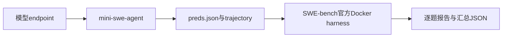
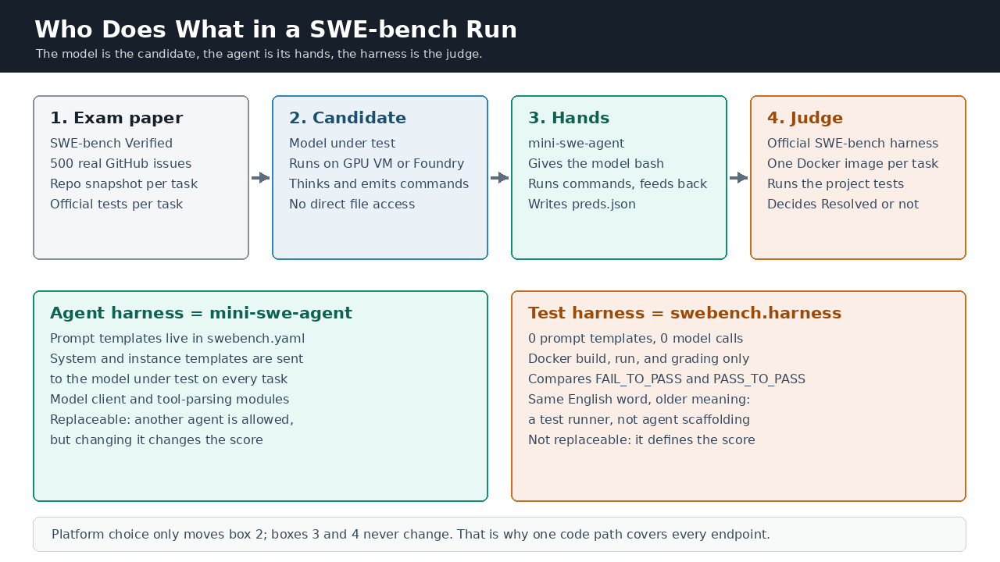
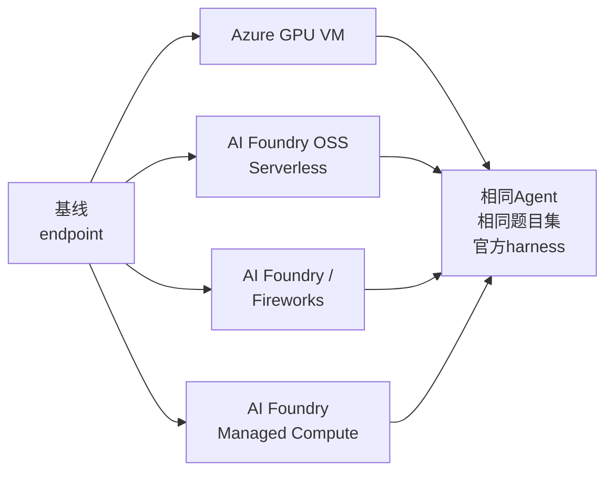
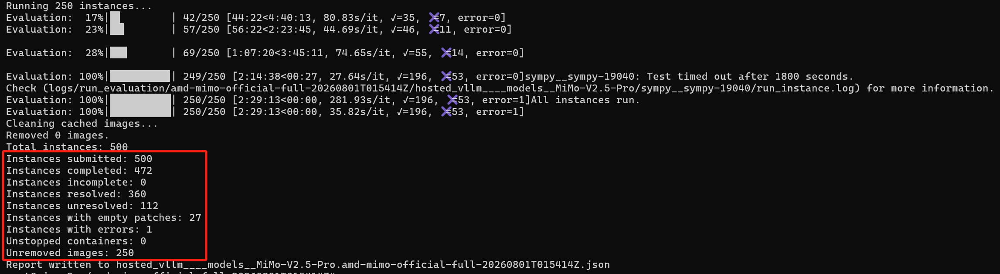

# 开源模型 SWE-bench 评测实战指南

[](https://huggingface.co/datasets/princeton-nlp/SWE-Bench_Verified)
[](https://github.com/SWE-agent/mini-swe-agent/tree/v2.4.6)
[](https://github.com/SWE-bench/SWE-bench/commit/f7bbbb2ccdf479001d6467c9e34af59e44a840f9)
[](https://www.python.org/)
[](https://github.com/david-xinyuwei/david-share/actions/workflows/oss-model-swebench-playbook-ci.yml)

本Repo用于测量运行在微软平台上的OSS模型（开源权重或微调后模型）的SWE-bench Verified准确率，覆盖四条部署路径：Azure GPU VM、AI Foundry OSS Serverless、AI Foundry Managed Compute和AI Foundry / Fireworks。Repo本身只提供endpoint配置和可审计的缝合层：Agent循环来自官方mini-swe-agent，评分走官方SWE-bench Docker harness，因此结果可与公开发表的SWE-bench分数直接对比。

> **作者**：魏新宇 (Xinyu Wei) — Microsoft AI and Apps Global Black Belt (GBB)

[English](README.md) | 中文版

<div align="center">
  
</div>

## 概览

SWE-bench评测的是软件工程Agent，而不是单次文本回答：



生成与评分必须分开：

| 阶段 | 产物 | 权威依据 |
|---|---|---|
| Agent生成 | 候选patch和trajectory | 冻结的模型、Agent、prompt、tools、sampling与重试合同 |
| 官方评测 | `Resolved`、`Unresolved`、`Empty`和`Error` | 生产方文档规定的`swebench.harness.run_evaluation` CLI |

空patch仍计入完整分母，但不会贡献Resolved。只有基础设施Error为零或已明确限定范围，分数才可用于结论。

## 组件角色

<div align="center">
  
</div>

| 组件 | 角色 | 做什么 |
|---|---|---|
| SWE-bench Verified | 考卷 | 提供每道题的issue文本、代码库快照和官方测试 |
| 被测模型 | 考生 | 跑在你的endpoint上，思考任务并输出shell命令和最终patch |
| mini-swe-agent | 手脚 | 给模型一个`bash`工具，执行每条命令并回传输出，最后写出`preds.json` |
| SWE-bench harness | 裁判 | 为每道题恢复一个Docker镜像，应用patch，跑项目测试，判定结果 |

`harness`在这条流水线里指两件不同的事，混淆它们是最常见的误解来源：

| | Agent harness | Test harness |
|---|---|---|
| 实现 | `mini-swe-agent` | `swebench.harness` |
| 提示词模板 | 它拥有，并会发给被测模型 | 没有 |
| 模型调用 | 有，它就是调用方 | 没有 |
| Docker用途 | 模型跑命令的工作台 | 跑测试判分的考场 |
| 可替换吗 | 可以，但分数会随之变化 | 不可以，它定义了分数 |

裁判只读`preds.json`，因此它无法分辨patch来自哪个endpoint。平台选择只影响考生这一环。

## 当前证据



| 路径 | 证据 | 状态 |
|---|---|---|
| Azure GPU VM / 本地部署 | MiMo-V2.5-Pro：本Repo真实Agent生成链路，加上冻结500条predictions的官方评分 | [Live pipeline：1 Resolved / 0 Error](examples/live-azure-gpu-vm-mimo-v25-pro-scored-canary.yaml)；[冻结predictions全量评分：360 Resolved / 500 submitted（72.00%），27个Empty，1个harness timeout](examples/live-azure-gpu-vm-mimo-v25-pro-full500.yaml) |
| AI Foundry OSS Serverless | DeepSeek-V4-Flash、tool预检、单题Agent运行与官方harness | [1 Resolved / 0 Error](examples/live-foundry-direct-deepseek-v4-flash-scored-canary.yaml) |
| AI Foundry / Fireworks | FW-GLM-5.1 deployment、tool预检、单题Agent运行与官方harness | [1 Resolved / 0 Error](examples/live-foundry-fw-glm51-scored-canary.yaml) |
| AI Foundry Managed Compute | 单卡A100上的Qwen3-4B、Entra认证、非空patch与官方aggregate | [0 Resolved / 1 Unresolved / 0 Empty / 0 Error；流水线已验证，不声明准确率](examples/live-foundry-managed-compute-scored-canary.yaml) |

四条路径现在都有真实Agent生成和官方aggregate canary。Pipeline canary只证明兼容性，不代表模型达到全量准确率。MiMo同时保留完整结果示例：360/500来自对现有predictions的官方评测，该全量结果没有重跑生成阶段。


该次官方harness运行的原始终端输出，作为一手证据保留。末尾那段就是上方数字的出处：

<div align="center">
  
</div>

## 安装

前置条件：

| 要求 | 最低配置 |
|---|---|
| 主机 | Linux `x86_64`与Docker |
| Python | `3.12` |
| 本地评测资源 | `120GB`可用磁盘、`16GB`内存、`8`个CPU core |

```bash
git clone --filter=blob:none --sparse --branch master \
  https://github.com/david-xinyuwei/david-share.git david-share
cd david-share
git sparse-checkout set --no-cone \
  '/Deep-Learning/OSS-Model-SWE-bench-Evaluation-Playbook/'
cd Deep-Learning/OSS-Model-SWE-bench-Evaluation-Playbook
python3 -m venv .venv
source .venv/bin/activate
python -m pip install --upgrade pip
bash scripts/setup_environment.sh
```

Setup脚本会固定本Repo使用的mini-swe-agent与SWE-bench源码commit。两个上游项目都没有被修改：SWE-bench保持为固定commit的editable checkout，生成调用官方mini-swe-agent模块，评分调用官方harness CLI。本Repo只提供配置和缝合。

按平台设置变量；之后的命令完全相同：

| 平台 | `ENDPOINT_MODE` | 认证 |
|---|---|---|
| Azure GPU VM / 本地部署 | `openai_compatible` | `MODEL_API_KEY`或`EMPTY` |
| AI Foundry OSS Serverless | `azure_foundry` | `MODEL_API_KEY` |
| AI Foundry Managed Compute | `azure_foundry` | 默认`MODEL_API_KEY`；禁用local auth时使用`AZURE_AD_TOKEN` |
| AI Foundry / Fireworks | `azure_foundry` | `MODEL_API_KEY` |

### Azure GPU VM / 本地部署

```bash
export ENDPOINT_MODE="openai_compatible"
export MODEL_API_BASE="http://<host>:8000/v1"
export MODEL_NAME="<served-model>"
export MODEL_API_KEY="<model-api-key-or-EMPTY>"
export RUN_LABEL="azure-gpu-vm-$(date -u +%Y%m%dT%H%M%SZ)"
```

### AI Foundry OSS Serverless

```bash
export ENDPOINT_MODE="azure_foundry"
export MODEL_API_BASE="https://<resource-name>.services.ai.azure.com"
export MODEL_NAME="<deployment-name>"
unset AZURE_AD_TOKEN
export MODEL_API_KEY="<deployment-key>"
export RUN_LABEL="foundry-oss-serverless-$(date -u +%Y%m%dT%H%M%SZ)"
```

封存的AI Foundry OSS Serverless与AI Foundry / Fireworks canary都使用Key认证。Deployment key应保存在secret manager中并定期轮换，禁止写入Repo或证据。

### AI Foundry Managed Compute

客户资源若启用了local authentication，直接使用access key。Microsoft Learn明确说明数据面推理可以使用access key或Microsoft Entra ID；只有设置`disableLocalAuth=true`才会禁用Key路径。详见[Microsoft Learn](https://learn.microsoft.com/en-us/azure/foundry/foundry-models/how-to/configure-entra-id)。

```bash
export ENDPOINT_MODE="azure_foundry"
export MODEL_API_BASE="https://<resource-name>.services.ai.azure.com/managed-deployments/<deployment-name>/v1"
export MODEL_NAME="<deployment-name>"
unset AZURE_AD_TOKEN
export MODEL_API_KEY="<resource-key>"
export RUN_LABEL="foundry-managed-compute-$(date -u +%Y%m%dT%H%M%SZ)"
```

如果目标资源设置了`disableLocalAuth=true`，Key认证不可用，必须改用Microsoft Entra ID：每个订阅使用独立Azure CLI profile，再获取短期token。`AZURE_CONFIG_DIR`属于Azure CLI，不属于SWE-bench：

```bash
export AZURE_CONFIG_DIR="$HOME/.azure-<isolated-profile>"
az account show --query '{subscription:id,tenant:tenantId,user:user.name}' -o json
az provider show --namespace Microsoft.CognitiveServices --query registrationState -o tsv
unset MODEL_API_KEY AZURE_API_KEY AZURE_OPENAI_API_KEY HOSTED_VLLM_API_KEY
export AZURE_AD_TOKEN="$(az account get-access-token \
  --resource https://cognitiveservices.azure.com \
  --query accessToken -o tsv)"
```

Azure CLI用户token有效期较短，适合本地开发或canary。长时间full run应使用Managed Identity或Service Principal，或在每个独立分片前刷新token；禁止把token保存到Repo或证据中。

### AI Foundry / Fireworks

```bash
export ENDPOINT_MODE="azure_foundry"
export MODEL_API_BASE="https://<resource-name>.services.ai.azure.com"
export MODEL_NAME="<deployment-name>"
unset AZURE_AD_TOKEN
export MODEL_API_KEY="<deployment-key>"
export RUN_LABEL="foundry-fireworks-$(date -u +%Y%m%dT%H%M%SZ)"
```

这几个变量属于`scripts/run_generation.sh`，不属于SWE-bench。Wrapper把它们翻译成官方mini-swe-agent参数`-c model.model_name`和`-c model.model_kwargs.api_base`，导出对应的LiteLLM凭据变量，并把映射记录在`provider-contract.json`。SWE-bench本身不接受任何endpoint环境变量，只接受CLI参数。

## 运行

先完成provider预检和单题生成加评分pipeline canary：

```bash
python scripts/preflight_provider.py \
  --mode "$ENDPOINT_MODE" \
  --api-base "$MODEL_API_BASE" \
  --model "$MODEL_NAME"

export OUTPUT_ROOT="runs/${RUN_LABEL}-scored-canary"
bash scripts/run_scored_canary.sh
```

最终marker会分开报告流水线状态和模型结果，例如：`PIPELINE_CANARY=PASS outcome=Unresolved ...`。

如果模型较慢或能力较弱，可以设置`AGENT_STEP_LIMIT=12`，但它只用于限制兼容性canary的成本。该值会写入`provider-contract.json`；`Empty`结果仍可证明transport与官方aggregate链路可用，但不能作为准确率估计。全量运行前必须取消该变量。

生成冻结的SWE-bench Verified完整题目集：

```bash
unset INSTANCE_FILTER
export OUTPUT_DIR="runs/${RUN_LABEL}-full/generation"
export WORKERS=8
mkdir -p "runs/${RUN_LABEL}-full"

bash scripts/run_generation.sh 2>&1 | tee "runs/${RUN_LABEL}-full/generation.log"
python scripts/validate_predictions.py \
  --run-dir "$OUTPUT_DIR" \
  --expected-count 500 \
  --summary "runs/${RUN_LABEL}-full/generation-summary.json"
python scripts/audit_effective_configs.py --run-dir "$OUTPUT_DIR"
```

使用SWE-bench生产方文档规定的CLI评分：

```bash
PREDICTIONS_PATH="$(realpath "$OUTPUT_DIR/preds.json")"
REPORT_DIR="$(pwd)/runs/${RUN_LABEL}-full/official-eval"
mkdir -p "$REPORT_DIR"

(
  cd "$REPORT_DIR"
  python -m swebench.harness.run_evaluation \
    --dataset_name princeton-nlp/SWE-Bench_Verified \
    --predictions_path "$PREDICTIONS_PATH" \
    --max_workers 4 \
    --run_id "${RUN_LABEL}-verified" \
    2>&1 | tee harness.log
)
```

`scripts/run_official_harness.sh`只是`exec`同一官方模块的可选启动器，不是替代评分器。

使用同一working directory和run ID监控或恢复：

```bash
tail -F "runs/${RUN_LABEL}-full/official-eval/harness.log"
```

Harness会跳过已有逐题report。恢复运行前不要删除有效report。

只允许通过相同wrapper、report目录、predictions和run ID续跑：

```bash
export PREDICTIONS_PATH="$(realpath "$OUTPUT_DIR/preds.json")"
export REPORT_DIR="$(pwd)/runs/${RUN_LABEL}-full/official-eval"
export RUN_ID="${RUN_LABEL}-verified"
RESUME=true bash scripts/run_official_harness.sh 2>&1 \
  | tee -a "$REPORT_DIR/harness-resume.log"
```

### 运行时长预期

墙钟时间主要由模型服务吞吐决定，而不是harness：生成时间 ≈ 任务数 × 每题Agent轮次 × 每轮tokens ÷ 服务吞吐。官方Docker评分与模型无关。

本Repo封存运行的实测参考点：

| 阶段 | 实测墙钟 |
|---|---|
| 单题pipeline canary（任一平台） | 约10分钟 |
| 500题生成：MiMo-V2.5-Pro（MoE，约1TB FP8权重）在单节点8×MI300X、TP8 | 约5小时 |

更小的模型或更高服务吞吐会大致线性缩短生成时间。官方Docker评分耗时取决于评测主机的CPU核数、磁盘速度、镜像缓存和worker数，本Repo未做基准测量。

## 对比合同

比较不同endpoint前必须冻结：

| 必须保持一致 | 作为被测变量时可以不同 |
|---|---|
| 数据集revision与分母 | Endpoint与认证方式 |
| 模型family与weight revision | Serving runtime与accelerator |
| Agent源码、prompt、tools、limits与sampling | Deployment topology |
| 生成并发与重试规则 | 明确声明的fine-tuned weights |
| Harness commit、image、timeout、cache与clean策略 | 其他内容都不能变化 |

使用Repo内置比较器：

```bash
python scripts/compare_run_contracts.py \
  --reference examples/parity-reference.toml \
  --candidate examples/parity-candidate.toml \
  --scenario platform_migration \
  --output runs/parity-report.json
```

| 分类 | 含义 |
|---|---|
| `MODEL_AND_METHOD_ALIGNED` | 同一模型的迁移对比 |
| `FINETUNING_METHOD_ALIGNED` | 受控的base与fine-tuned对比 |
| `MODEL_SELECTION_METHOD_ALIGNED` | 模型不同，但评测方法一致 |
| `METHOD_ALIGNED` | 方法一致，但至少一个identity hash未验证 |
| `ADAPTED_RUN` | 显式接受了会影响行为的差异 |
| `NOT_COMPARABLE` | 不得发布迁移差值 |

## 超大自托管模型的Serving Topology

对特别大的自托管模型（数百B参数、MoE），serving topology对评测总耗时和稳定性的影响，往往超过加速卡本身的速度差异。

Agentic评测流量不同于在线服务流量：

| 特征 | Agentic评测 | 高并发在线服务 |
|---|---|---|
| 请求模式 | Bursty的多轮tool循环 | 稳定的混合prompt流 |
| 序列形态 | 每次调用中短context | 长prompt且有严格TTFT目标 |
| 失败代价 | 一道题卡死会占住一个worker槽位 | 短暂的延迟毛刺 |

来自一个私有双节点GPU评测项目的方向性实测经验：

- 在这种负载下，每节点一个unified tensor-parallel服务比跨节点prefill/decode disaggregation（PD分离）更快完成全量评测，故障面也更小。
- 跨节点PD分离会引入KV-cache传输、路由和第二个runtime故障域；它的设计收益面向高并发长context在线服务，而不是bursty的Agent循环。
- 扩容方式是先用`scripts/shard_instance_manifest.py`把题目分片到多节点，再用`scripts/merge_official_reports.py`只合并互不重叠的官方report。
- Topology是冻结的运行合同字段：对比运行之间不得更改。

本节不发布任何客户具体数字。全量评测前，先用scored canary验证你的topology。

## 产物

| 产物 | 用途 |
|---|---|
| `preds.json` | 官方harness消费的候选patch |
| `*.traj.json` | Agent消息、生效配置、状态与usage |
| `logs/run_evaluation/.../report.json` | 官方逐题结果 |
| Aggregate JSON | 完整分母与各状态ID |
| `provider-contract.json` | 不含秘密的endpoint与运行合同 |
| `SHA256SUMS.txt` | 不可变证据manifest |

分片执行时使用`scripts/shard_instance_manifest.py`，并且只能合并互不重叠的官方report。禁止把有利重试保留为隐藏best-of结果。

## 问题排查

| 现象 | 处理 |
|---|---|
| clone或sparse checkout时出现`git-lfs filter-process: git-lfs: not found`与`fatal: the remote end hung up unexpectedly` | 该主机声明了LFS filter但缺少二进制，导致checkout中途停止、本子树文件不完整。安装后重跑即可（`apt-get install -y git-lfs`），随后重新执行`git sparse-checkout set`和`git checkout HEAD -- <subtree>/`。本子树不存放LFS对象，只要求filter可被解析 |
| Docker Hub `429 Too Many Requests` | 执行`docker login`，降低workers，保持同一run ID恢复；已有report会被跳过 |
| 磁盘压力或image pull中断 | 检查`docker system df`；其他评测运行时禁止prune |
| 空patch | 保留为`Empty`；不得补造patch或从分母删除 |
| 相同patch得到不同结果 | 对比harness commit、image、timeout、host load、cache与clean策略 |
| 生效配置漂移 | 以trajectory `info.config`为执行事实，并运行`audit_effective_configs.py` |
| 子集或单向复测 | 复测前冻结两个方向的争议题 |

官方默认是`--clean false`。只有在冻结的运行合同中才可覆盖。可选启动器支持`CACHE_LEVEL`和`CLEAN`，用于明确的恢复策略。

## 验证

```bash
make validate
make test
```

Validator检查双语一致性、链接、必要资产、秘密、固定依赖、endpoint覆盖和官方harness入口。

## 官方来源

- [SWE-bench repository](https://github.com/SWE-bench/SWE-bench)
- [SWE-bench documentation](https://swebench.com/SWE-bench/)
- [SWE-bench Verified dataset](https://huggingface.co/datasets/princeton-nlp/SWE-Bench_Verified)
- [mini-swe-agent](https://github.com/SWE-agent/mini-swe-agent)
- [Microsoft Foundry Models](https://learn.microsoft.com/azure/ai-foundry/foundry-models/)

## 安全

- 凭据必须保存在环境变量或批准的secret store中。
- 禁止提交客户数据集、私有benchmark产物、endpoint、token、VM地址或内部registry名称。
- 只能发布有hash证据支持、边界明确的结论。
