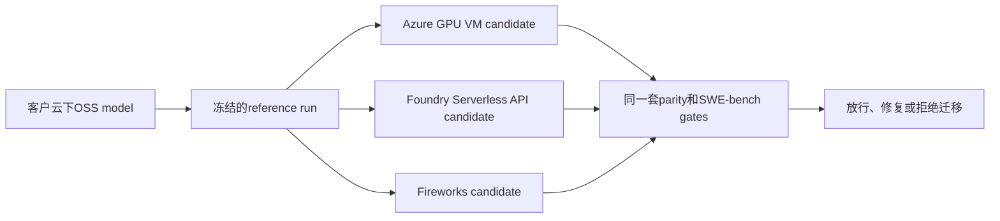
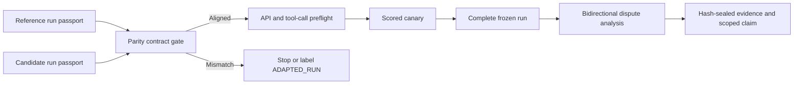
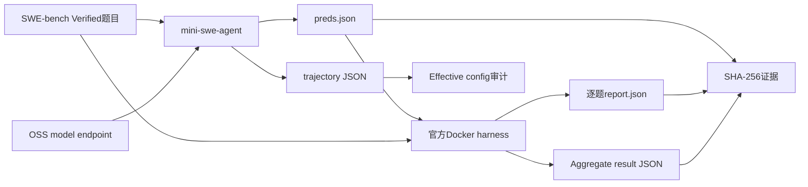
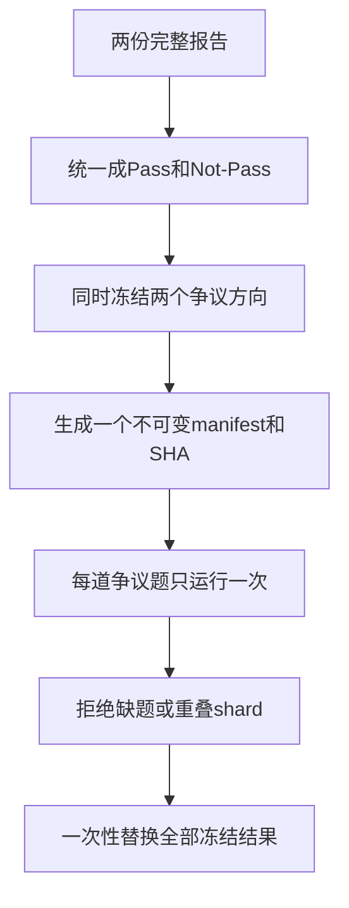

# OSS 模型 SWE-bench 评测实战手册

[](https://huggingface.co/datasets/princeton-nlp/SWE-Bench_Verified)
[](https://github.com/SWE-agent/mini-swe-agent/tree/v2.4.6)
[](https://github.com/SWE-bench/SWE-bench/commit/f7bbbb2ccdf479001d6467c9e34af59e44a840f9)
[](https://www.python.org/)

一套面向生产迁移的工程流程：使用同一份冻结的SWE-bench合同，测量OSS coding model迁移到Azure GPU VM、Microsoft Foundry Serverless API或Fireworks前后的准确度，以及微调前后的准确度。

> **作者**：魏新宇 (Xinyu Wei) — Microsoft AI and Apps Global Black Belt (GBB)

[English](README.md) | 中文版

<div align="center">
  
</div>

## 概览

SWE-bench 不是把一道题发给模型，再比较一段文本答案。它评测的是一个完整的**软件工程 Agent 系统**：

1. mini-swe-agent 把 issue 和代码仓库交给 OSS model。
2. 模型通过 shell 工具查看和修改代码，生成 Git patch。
3. 官方 SWE-bench harness 恢复每道题对应的 Docker 环境。
4. Harness 应用候选 patch 和官方 test patch。
5. 只有要求修复的测试通过、原有测试不回退，这道题才算 Resolved。

本 Repo 支持从云下、其他云、Microsoft Foundry或Fireworks model endpoint开始，产出可审计的官方评测结果：

| 阶段 | 输入 | 输出 | 验收门 |
|---|---|---|---|
| Endpoint 预检 | 模型 URL、served model | Chat-completions tool-call响应 | HTTP成功且至少返回1个有效的`ping` function tool call |
| Agent generation | Issue、仓库、Agent YAML | `preds.json` + trajectories | ID 全覆盖、状态合法 |
| Effective config 审计 | Trajectory `info.config` | Canonical config hash | 去除允许的逐题字段后只剩目标配置 |
| 官方评测 | 候选 patches | 逐题 report + aggregate JSON | Docker harness 正常退出 |
| 差异复测 | 两份完整报告 | 冻结的双向争议清单 | 禁止动态缩小或best-of（只保留最好结果） |
| 证据封存 | 已完成文件 | `SHA256SUMS.txt` | 写入进程已停止，manifest 可验证 |

核心脚本尽量只依赖 Python 标准库；一旦发现缺题、重复题或 shard 重叠，就直接终止，不生成看似完整的结果。Repo 不包含模型私有 endpoint、凭据、VM、客户数据或内部测试结果。

## 业务价值与生产模式

客户对OSS model迁移或微调后的准确度不放心时，endpoint健康并不能证明软件工程能力没有下降。本手册把这类顾虑转成可复验的go/no-go测量。

### 本Repo解决的客户决策

客户已经在云下运行并认可一个open-source model。现在他们希望把**同一个model**迁到Azure GPU VM、Microsoft Foundry直接Serverless API deployment或Fireworks，同时不损失软件工程准确率。Managed Compute单独作为pending path管理，只有data plane通过同一套canary后才纳入。客户首先关心的不是新endpoint能否返回HTTP 200，甚至也不是速度是否更快，而是：

> 在model、Agent、SWE-bench workload和official scorer相同的前提下，迁移后准确率是否保持？



因此，本Repo的价值不只是提供一个benchmark runner：

- **Accuracy-preservation contract：** 证明同一个OSS model迁移后，工程能力是否保持。
- **Substrate-neutral decision：** 使用同一个Agent、dataset、scorer和evidence model比较三条主要承载路径。
- **Root-cause separation：** 区分model regression、provider/API incompatibility、serving-capacity limit、Agent drift和harness fault。
- **Auditable go/no-go：** 交付完整分母、逐题回退、机器可读合同和不可变证据，而不是只给一个dashboard分数。

如果candidate platform无法提供客户的精确model，只能改测另一个model，流程仍然有价值，但结论必须从platform migration改成`MODEL_SELECTION_METHOD_ALIGNED`。Repo会阻止这两种结论被混在一起。

| 业务决策 | Reference run | Candidate run | 能证明什么 |
|---|---|---|---|
| 云下OSS model迁移到托管平台 | 云下或基于AMD的OpenAI-compatible endpoint | Microsoft Foundry或Fireworks deployment | 同一model和revision迁移平台后，SWE-bench准确度是否保持 |
| 从其他云迁移到托管平台 | 现有cloud endpoint | Microsoft Foundry或Fireworks deployment | 目标平台是否达到客户事先冻结的准确度门槛 |
| 验证微调效果 | Base model | 同一平台上的fine-tuned deployment | 哪些题提升、回退、保持不变或出现运行故障 |
| 选择生产模型 | 现有production model | 另一个候选，例如Azure Foundry中的Fireworks GLM deployment | 比较不同模型质量；这不是单纯的平台迁移结论 |

**单变量原则：** 平台迁移结论要求model family、weight revision、Agent config、dataset、concurrency和harness保持一致。如果AMD平台上的baseline model与Fireworks GLM不是同一模型，那么model和platform同时变化，结果只能叫model-selection comparison，不能把差异归因给Fireworks平台。

### 证据边界

- **已验证的reference path：** 本方法来自并已运行于基于AMD、形态接近云下部署的OpenAI-compatible endpoint。
- **Azure GPU VM路径：** `openai_compatible` runner、exact-reproduction contract和official-scoring workflow均已实现并通过测试；当前不发布Azure GPU VM full migration score。
- **直接Microsoft Foundry Serverless路径：** `2026-07-31`，非Fireworks的`DeepSeek-V4-Flash` deployment通过HTTP 200 function-tool preflight。随后mini-swe-agent `2.4.6`为`astropy__astropy-7166`提交1个非空patch；固定版本的official harness将其判为Resolved，0个error、0个未停止container。详见[脱敏的直接Foundry证据](examples/live-foundry-direct-deepseek-v4-flash-scored-canary.yaml)。
- **Fireworks through Foundry路径：** 单独部署的`FW-GLM-5.1`也通过了同一套1题generation和official-scoring canary。这证明的是Fireworks经Foundry的route，不是直接Foundry catalog path。详见[脱敏的Fireworks-through-Foundry证据](examples/live-foundry-fw-glm51-scored-canary.yaml)。
- **Fireworks公网API路径：** `fireworks` mode已实现，并针对固定LiteLLM provider完成shape test；请求路由到`api.fireworks.ai`，secret不会进入process arguments。当前不发布Fireworks公网API scored result。
- **Managed Compute待验证：** 当前不发布Managed Compute分数，也不宣称data plane已验证。一个live deployment的control plane已经达到`Succeeded`，但经过认证的`/openai/v1` chat route仍返回HTTP 500 `Model service is unavailable`；只有Portal给出的client route通过同一套tool-call和scored-canary gate后，才能解除`PENDING / NOT VERIFIED`。
- **尚未宣称的结果：** 三条主要路径都必须等声明的full run完成后才能公布full migration score。每个1-case结果都只是compatibility gate，不能写成`1/500`准确率，也不能当作model comparison。

### 支持的Endpoint模式

| `ENDPOINT_MODE` | 目标平台 | Model naming | Authentication source |
|---|---|---|---|
| `openai_compatible` | 云下、AMD验证环境或其他OpenAI-compatible cloud | `hosted_vllm/<served-name>`；未写prefix时自动添加 | `HOSTED_VLLM_API_KEY`或`MODEL_API_KEY`；无认证local endpoint可用`EMPTY` |
| `azure_foundry` | Microsoft Foundry Models v1 endpoint，包括直接Serverless API deployment和Azure中售卖的Fireworks模型；Managed Compute仍待live data-plane验证 | Deployment name通过OpenAI-compatible route发送；内部自动加`hosted_vllm/` | `AZURE_API_KEY`、`AZURE_OPENAI_API_KEY`、`AZURE_AD_TOKEN`或`MODEL_API_KEY`，映射为Bearer且不进入argv |
| `fireworks` | Fireworks serverless、account model或direct-route deployment | `fireworks_ai/<exact-model-id>`；未写prefix时自动添加 | `FIREWORKS_AI_API_KEY`或`MODEL_API_KEY` |

每次generation都会写入`provider-contract.json`，记录endpoint mode、业务scenario、run label、model name、API base、非秘密auth变量名、workers、dataset和config；不会保存credential value。

`EVALUATION_SCENARIO`支持`single_endpoint`、`onprem_to_managed`、`cloud_to_managed`和`base_vs_finetuned`。

## 云下到微软侧的对齐框架

只有reference与candidate在所有可能改变结果的层面都完成对齐，迁移benchmark才站得住脚。“两个endpoint都返回HTTP 200”只能证明API可访问，不能证明模型一致。“两边都是mini-swe-agent 2.4.6”也只是version label相同，不能证明prompt、defaults、源码和retry语义一致。

### 对齐阶梯

| 层面 | 必须冻结或证明什么 | 为什么重要 |
|---|---|---|
| Claim | Platform migration、fine-tuning或model selection | 决定哪些差异是有意引入的变量 |
| Model identity | Family、revision、weight SHA-256、tokenizer SHA-256、precision | 防止把不同权重包装成单纯的平台迁移对比 |
| Agent identity | Package hash、effective config、system prompt、tool schema、limits | 任一字段漂移都可能改变multi-turn行为 |
| API semantics | Protocol、tool schema、finish reasons、replayed messages | OpenAI-compatible不等于所有provider都接受相同metadata |
| Workload | Dataset revision、execution-image manifest、partition、denominator、sampling、workers和retry policy | 防止隐藏的selection、环境漂移和concurrency bias |
| Scoring | Harness源码、dependency lock、images、timeout、cache和clean policy | 同一个patch在不同评测环境中也可能得到不同结果 |
| Evidence | Trajectories、reports、实际process command line、hash和phase lineage | 让每条结论都能被独立审计 |

在platform-migration comparison中，endpoint、authentication、serving runtime、accelerator、topology和deployment name可以不同。这些差异共同构成被测的**platform plus serving stack**，不能再把结果单独归因给hardware或runtime。Model identity、Agent行为、workload、sampling、concurrency和scoring仍必须保持不变。

### 结论强度由证据计算，不由作者选择

| Classification | Evidence contract | 可以宣称什么 |
|---|---|---|
| `MODEL_AND_METHOD_ALIGNED` | Model和tokenizer identity已验证，所有method invariants一致 | 同一model的端到端迁移对比 |
| `FINETUNING_METHOD_ALIGNED` | Base和fine-tuned weights有意不同，platform和method invariants一致 | 受控的base-versus-fine-tuned comparison |
| `MODEL_SELECTION_METHOD_ALIGNED` | Models可以不同，Agent、workload和scoring invariants一致 | Combined model-selection comparison，不能写成platform-only claim |
| `METHOD_ALIGNED` | Method invariants一致，但至少一个identity hash是`UNVERIFIED` | 带明确provenance caveat的方法级对比 |
| `ADAPTED_RUN` | 显式允许了一个会影响行为的差异 | 真实的adapted run，不是exact或fully aligned replay |
| `NOT_COMPARABLE` | 未经批准的invariant发生变化 | 不得计算或公布migration delta |

Comparator默认fail closed。即使通过`--allow-difference`显式声明例外，仍会标为`ADAPTED_RUN`并退出等待review；只有再显式增加`--accept-adapted`才继续。

```bash
python scripts/compare_run_contracts.py \
  --reference examples/parity-reference.toml \
  --candidate examples/parity-candidate.toml \
  --scenario platform_migration \
  --output runs/parity-report.json
```

Repo内置的合成示例最终输出：

```text
PARITY_GATE=PASS scenario=platform_migration classification=MODEL_AND_METHOD_ALIGNED
```

### Reference到Candidate的执行链



### 从真实多节点评测中泛化出的坑位

| Failure pattern | 隐藏风险 | 通用Gate |
|---|---|---|
| Package version相同，实际import的源码不同 | Editable install、mount或path precedence改变行为 | 记录imported file path并hash评分敏感源码 |
| Preview sample与live control plane不一致 | 文档中的asset reference或API field已经过时 | 固定API version，保存服务端error，只修改live response已经证明的字段 |
| Provisioning超过典型时长 | 仍在执行的create LRO看起来像stall；allocation活跃时delete可能返回conflict | 联合provisioning state、quota usage、Activity Log和delete response判断；禁止盲目重复创建 |
| Reference launcher明明存在，实际却运行了重写版本 | 参数看起来一致，但environment和control flow已变化 | 把实际process command line和executable SHA-256绑定到run |
| Effective config一致，trajectory仍不同 | Temperature zero无法让multi-turn Agent变成确定性系统 | 保存逐turn trajectory，把variability写成observed effect |
| 第一个tool call成功，后续turn失败 | Provider metadata被重放到更严格的schema | 必须跑multi-turn scored canary，不能只看HTTP health |
| Endpoint健康，但artifact不再增长 | Health只是lifecycle signal，不代表workload推进 | 使用无副作用health probe，同时检查prediction、report、log和runtime activity |
| Worker count或retry policy变化 | Request interleaving会改变tool observation和后续Agent决策 | Generation前冻结concurrency、queueing、timeout和retry语义 |
| 长请求超过active-context limit | Silent truncation或stall会伪装成model failure | 记录required context；serving capacity不足时在run前失败 |
| 存在host cache | Secondary cache不一定扩大active-sequence GPU capacity | 按每层memory实际控制的limit分别验收 |
| Infrastructure exception被计入model fail | 既压低accuracy，也掩盖reliability问题 | Resolved、Unresolved、Empty和Error必须是互斥且穷尽的分类 |
| 相同patch bytes得到不同分数 | Harness源码、image、timing或timeout发生变化 | 固定evaluator源码，保存逐题test output |
| 只复测有利于候选分数的争议题 | Optional stopping形成隐藏的best-of | 一次冻结两个争议方向，再统一替换 |
| 把端到端task time叫作model speed | Shell tool、repository test和official scoring属于不同阶段 | 分开报告API latency、tool time、generation wall time和harness time |

### 客户迁移验收门

1. **Reference gate：** 保存客户实际使用的server launcher、Agent config、dependency lock、model/tokenizer identity和原始逐题artifact。
2. **Parity gate：** 比较机器可读的run passport；一旦出现未经批准的invariant drift，立即停止。
3. **Capability gate：** 验证tool-call correctness、multi-turn replay、一个generated patch和一份official report。
4. **Full evidence gate：** 跑完冻结分母，分类每道题，封存artifact，最后只发布computed classification支持的结论。

这套顺序既允许微软侧灵活选择deployment，也让所有不可避免的差异保持可见。Managed service不需要逐字节复刻客户GPU topology，但必须证明model、Agent、workload、scoring contract、API behavior和evidence semantics保持对齐。

### Serving Topology：P/D分离还是双独立Endpoint？

Prefill/decode（P/D）disaggregation与independent replica解决的是不同问题。P/D提供一个logical endpoint，prefill和decode role可以运行在不同worker上；双独立endpoint则在每个endpoint上加载完整model，再把彼此独立的SWE-bench题目拆开执行。

| Topology | 适用条件 | 主要风险 |
|---|---|---|
| P/D disaggregation | Model或KV workload需要role specialization，且实测prefill/decode imbalance足以抵消额外协调成本 | Cross-node communication、head-of-line blocking、role recovery耦合和更大的failure domain |
| 双独立endpoint | Model能完整放进每个endpoint，任务彼此独立，更关注aggregate cases/hour和fault isolation | 重复占用model memory，必须建立严格的disjoint-shard/merge contract |

在一次大型OSS coding-model评测中，一个cross-node P/D endpoint比两个各跑一半冻结manifest的独立endpoint更慢、稳定性也更差。这是特定workload的observed result，不能泛化成“P/D永远更慢”。正确决策方式是：

1. 冻结一份有代表性的calibration manifest，以及完整model/Agent/sampling contract。
2. 用P/D endpoint跑一次，再用双独立endpoint跑一次。
3. 比较valid generation cases/hour、逐题generation wall time、API latency distribution、Error rate、restart count和GPU utilization。Official scoring time必须单独列出，因为它不衡量model serving。
4. Full run之前选定topology。只要中途切换topology，就进入新的runtime epoch；不同epoch不能合并成一个homogeneous score。
5. 如果双独立endpoint胜出，对**同一份冻结full manifest**做确定性分片，最终只合并互斥的official reports。

```bash
python scripts/shard_instance_manifest.py \
  --manifest examples/instance-manifest.tsv \
  --shards 2 \
  --output-dir outputs/two-endpoint-shards

# Node A
export INSTANCE_MANIFEST="outputs/two-endpoint-shards/shard-000.tsv"
bash scripts/run_generation.sh

# Node B
export INSTANCE_MANIFEST="outputs/two-endpoint-shards/shard-001.tsv"
bash scripts/run_generation.sh
```

预期sharding marker：

```text
SHARD_MANIFEST=PASS cases=6 shards=2 counts=3,3
```

每次generation都会把选中manifest的SHA-256写入`provider-contract.json`。Official scoring完成后，使用`merge_official_reports.py`合并两份aggregate report；只要出现overlap、duplicate ID或union不完整，就直接fail closed。

### Agent版本和Sampling也是Benchmark的一部分

SWE-bench评测的是一个system，不是裸model。Score由model、Agent version、instructions、tool schema、sampling、serving behavior和scorer共同决定。较新的Agent可能改善provider compatibility和tool-call handling，但静默升级会破坏可比性。

- **Agent版本要足够新，然后精确固定。** 本Repo验证的是mini-swe-agent `2.4.6`。禁止使用可变的`latest` image，也不能仅凭另一台机器package label相同就认为源码一致。
- **迁移对比两侧使用同一Agent。** 固定package SHA-256、imported source、effective config、system prompt、tool schema、step/cost/wall-time limits和output/status semantics。
- **显式冻结sampling。** Temperature、top-p、maximum output tokens、seed、parallel-tool policy、server sampling backend和generation worker count都会改变trajectory。
- **Agent升级必须作为新实验。** 先跑scored canary，使用新run ID，再单独比较版本；不能把新旧Agent结果拼成一个accuracy score。
- **Temperature zero不等于确定性。** Multi-turn tool observations、backend scheduling和tied token choices仍可能改变calls和patches；必须保留所有trajectory并分析paired disagreement。

Parity comparator会拒绝platform-migration claim中的Agent version、sampling、partition和retry-policy drift。如果客户明确接受其中某项变化，就必须显式声明adaptation，最终结果标为`ADAPTED_RUN`。

## 三条部署路径的测试手册

三条主要路径共用同一条主链：保存客户reference passport、通过parity gate、验证multi-turn tool calling、完成scored canary、运行冻结的SWE-bench分母、分析双向逐题差异。变化的只是各平台的部署方式和专属证据。

| Candidate path | `ENDPOINT_MODE` | 平台专属证据 | 最强可用结论 |
|---|---|---|---|
| Azure GPU VM | `openai_compatible` | Image、model/tokenizer hashes、实际launcher、runtime commit、driver、GPU topology和context capacity | 同一weights和method均验证后可标`MODEL_AND_METHOD_ALIGNED` |
| Foundry Serverless API | `azure_foundry` | 精确model format/name/version、deployment SKU和scope、TPM capacity、RAI policy、region和API capabilities | 只有精确客户model/revision可用时才是same-model migration；否则标`MODEL_SELECTION_METHOD_ALIGNED` |
| Fireworks through Azure或public API | `azure_foundry`或`fireworks` | 精确Foundry deployment或account/direct-route model ID、provider format、API version、context、rate limits和replay schema | 只有部署了客户精确model/revision才是same-model migration；否则标`MODEL_SELECTION_METHOD_ALIGNED` |

### 如何测试 Azure GPU VM

Azure GPU VM控制力最高，通常也是复刻客户精确model stack最直接的路径。

1. **从reference重建，不靠记忆重写。** 使用客户精确的weights、tokenizer、precision、model revision、runtime源码、container image和launcher；启动后记录实际process command line。
2. **冻结serving contract。** 保存GPU SKU和数量、tensor/pipeline parallelism、context和active KV capacity、quantization、tool parser、sampling backend、deterministic flags、driver/runtime版本和environment hash。
3. **统一为OpenAI-compatible contract。** 使用`ENDPOINT_MODE=openai_compatible`；验证`/v1/chat/completions`、正确function arguments、finish reasons和multi-turn replay。
4. **运行同一套evaluation path。** Agent package/config、tool schema、dataset manifest、generation concurrency、retry policy和official harness必须与云下reference一致。
5. **把infrastructure failure单独分类。** GPU fault、server crash、context truncation、Docker failure和endpoint timeout属于Error/retry evidence，不得计成model Fail。

这条路径最大的风险是accidental adaptation：重写launcher后，参数看起来相同，但inherited environment、import、cache state、binding、defaults或process lifecycle已经改变。Parity contract会绑定launcher和environment identity，防止它被静默写成exact migration。

### 如何测试 Foundry Serverless API

这条路径直接从Microsoft Foundry catalog部署model，使用Standard、Global Standard、Data Zone Standard或其他支持的pay-per-token deployment。Serving infrastructure由Azure管理，客户通过统一Foundry endpoint调用deployment。

| 组件 | 在哪里运行 | 职责 |
|---|---|---|
| Model inference | Microsoft Foundry Serverless | 托管model weights，返回chat与tool-call response |
| mini-swe-agent | 客户控制的evaluation host | 把issue和tool observation发送给远端model，并生成candidate patch |
| SWE-bench题目环境 | Evaluation host上的Docker | Checkout代码仓库，并向Agent提供shell tool |
| Official scorer | Evaluation host上的Docker harness | 应用patch，评测`FAIL_TO_PASS`和`PASS_TO_PASS`测试 |

Evaluation host不会加载Foundry model weights；它只运行Agent和scorer，真正的model inference始终发生在托管的Serverless service中。

1. **冻结management-plane identity。** 保存model `format`、`name`、`version`、deployment name、SKU、capacity、processing scope、region和provisioning state。只有deployment name不能证明model identity。
2. **冻结policy surfaces。** 记录RAI/content-filter policy、API capabilities、context window、tool support、rate limits和version-upgrade setting。即使model weights相同，filter或policy差异也可能改变观察到的failure。
3. **选择正确claim。** Foundry能提供客户精确model/revision时，使用`platform_migration`；如果只能使用另一个model，则使用`model_selection`，结果只支持model choice，不能冒充same-model migration。
4. **复用统一Foundry route。** 设置`ENDPOINT_MODE=azure_foundry`，调用`/openai/v1/chat/completions`，并在`model`字段传deployment name。
5. **Quota不能污染accuracy。** HTTP 429、capacity exhaustion和transient gateway fault属于Error/retry evidence，不能变成Unresolved model outcome。
6. **运行不变的SWE-bench路径。** Tool-call preflight、multi-turn scored canary、frozen full denominator、official harness和双向regression analysis全部保持一致。

Foundry Serverless API是运维门槛最低的Azure-native路径，按token而不是accelerator-hour计费。它验证迁移时的核心限制仍是model availability：如果不能部署客户的精确model identity，它回答的是model-selection问题。

### 如何测试 Fireworks

本Repo支持两个Fireworks入口：Azure中售卖的Fireworks模型使用`ENDPOINT_MODE=azure_foundry`和`/openai/v1/chat/completions`；Fireworks公网API使用`ENDPOINT_MODE=fireworks`和`/inference/v1/chat/completions`。

1. **部署前先锁定model identity。** 保存精确account model或Foundry deployment ID、upstream revision、tokenizer、precision和context；display name不够。
2. **运行前先决定claim。** Fireworks托管同一个客户weights/revision时使用`platform_migration`；如果使用不同catalog model，则使用`model_selection`，不能把score delta单独归因给Fireworks。
3. **验证provider semantics。** 检查function-tool JSON、`finish_reason`、parallel-tool behavior、token limits、rate limits和response metadata。First-turn HTTP 200不够，因为provider metadata可能在后续turn重放时破坏schema。
4. **Rate limit不能污染accuracy。** Throttling、transient gateway error和service incident属于infrastructure outcome，只能按冻结的retry policy处理。
5. **Full run之前必须过scored canary。** 先拿到合法trajectory、未损坏prediction和official report，再投入完整分母。

Fireworks运维负担最低，但model availability决定它回答的是migration问题，还是model-selection问题。

### 待验证：Managed Compute

**状态：`PENDING / NOT VERIFIED`。** 本Repo当前不发布Managed Compute分数，也不宣称其data plane已经通过canary。Managed Compute保留为后续路径；下面的checklist定义了它加入前三条测试手册前必须补齐的证据。

1. **绑定catalog assets。** 保存完整registry model ID和version；保存deployment template ID、resolved version、runtime、context、accelerator count和`versionUpgradeOption`。只记录可变的`labels/latest`不足以支撑benchmark复现。
2. **创建前验证capacity。** Managed Compute quota与Azure VM quota互相独立。保存accelerator-family quota、current usage、live capacity、SKU、model instances和total accelerators。
3. **同时验证control plane和data plane。** `provisioningState=Succeeded`只是必要条件，不代表data plane可用。先读取deployment返回的routes，再要求认证请求得到HTTP 200；如果返回500 `Model service is unavailable`，就还不能开始canary。
4. **使用Portal给出的client contract。** OpenAI SDK的`base_url`应指向资源的`/openai/v1` endpoint，并在`model`字段传Managed Compute deployment name。Management plane返回的deployment-specific route可用于诊断，但不能替代Portal client sample。Live probe中`models.list()`成功，而chat completion仍返回HTTP 500，因此当前故障位于model serving层，不是endpoint authentication。
5. **准确率Gate保持不变。** 继续执行parity contract、scored canary、frozen full run、穷尽outcome分类和双向dispute analysis。
6. **闭合billing lifecycle。** Managed Compute按accelerator-hour计费。Bounded test完成后先保存证据，再删除deployment，验证资源消失，并记录最终usage/cost scope。

Managed Compute当前处于Preview，data path不内置Content Safety。这不会改变离线SWE-bench评分，但它是独立的production-readiness requirement，不能被accuracy结果掩盖。

## 1. SWE-bench 原理

### 1.1 每道题包含什么

[SWE-bench Verified](https://huggingface.co/datasets/princeton-nlp/SWE-Bench_Verified)包含500道由工程师确认可解决的issue–pull request题目。每道题常见字段如下：

| 字段 | 在评测中的作用 |
|---|---|
| `instance_id` | 稳定题目ID，例如`owner__repo-1234` |
| `problem_statement` | Agent能看到的GitHub issue标题和正文 |
| `base_commit` | 修复PR之前的仓库状态 |
| `test_patch` | 从标准答案PR中提取的权威测试 |
| `FAIL_TO_PASS` | 修复前失败、修复后应该通过的测试 |
| `PASS_TO_PASS` | 修复前后都必须保持通过的已有测试 |
| `environment_setup_commit` | Harness创建环境时使用的环境版本标识 |

Gold patch用于定义和验证题目，但不会提供给被测模型。

### 1.2 阶段A：Agent Generation

mini-swe-agent创建题目容器，把代码切到`base_commit`，再把issue交给模型，并提供`bash`工具。模型会多轮查看代码、修改文件、运行测试，最后提交patch。

Generation主要产生两类文件：

- `preds.json`：每道题对应一个候选patch。
- `<instance_id>/<instance_id>.traj.json`：messages、tool observations、effective config、exit status、调用统计和patch来源。

Generation完成不代表题目已经通过。

### 1.3 阶段B：官方Docker评测

官方harness会在每道题自己的evaluation image中运行候选patch。逻辑上包括：

1. 恢复仓库和依赖环境。
2. 应用候选patch。
3. 应用官方test patch。
4. 执行该题指定的测试命令。
5. 解析`FAIL_TO_PASS`和`PASS_TO_PASS`。

候选patch能够应用，并且要求修复的测试全部通过、已有测试没有回退，才算Resolved。Empty和Error必须单独保留，不能静默并入Unresolved。

### 1.4 为什么必须用Docker

每道题可能依赖不同的仓库版本、Python版本、系统包和测试命令。官方harness通过Docker隔离环境。SWE-bench官方建议本地评测使用x86_64主机，并预留约120GB可用磁盘、16GB RAM和8个CPU core。

### 1.5 为什么Generation和Evaluation必须分开

两个阶段的失败含义完全不同：

| Generation失败 | Evaluation失败 |
|---|---|
| 模型endpoint不可用 | 候选patch无法应用 |
| Tool call格式错误 | 要求修复的测试仍失败 |
| Agent达到step/cost限制 | 已有测试发生回退 |
| 题目Docker容器无法启动 | 测试执行超时 |
| Empty patch | Harness或Docker执行错误 |

如果混在一起统计，准确率会失真，后续也无法判断应该修模型、Agent还是基础设施。

## 2. 架构与产物



建议的run目录：

```text
runs/<run-id>/
├── generation/
│   ├── preds.json
│   ├── <instance-id>/<instance-id>.traj.json
│   ├── generation-summary.json
│   └── generation.log
├── official-eval/
│   ├── logs/run_evaluation/.../report.json
│   ├── aggregate.json
│   └── harness.log
├── contract.json
└── SHA256SUMS.txt
```

## 3. Quick Start 与在 Azure 上运行

### 3.1 前置条件

- Linux x86_64主机
- Docker Engine，以及足够存放SWE-bench题目镜像的磁盘
- Python 3.12（已经过clean-room验证）
- 通过`/v1/models`和`/v1/chat/completions`提供服务、并支持OpenAI-style function tool calls的OSS coding model
- 与模型规模匹配的GPU资源

### 3.2 安装固定版本工具链

```bash
git clone https://github.com/david-xinyuwei/david-share.git
cd david-share/Deep-Learning/OSS-Model-SWE-bench-Evaluation-Playbook

python3 -m venv .venv
source .venv/bin/activate
python -m pip install --upgrade pip
bash scripts/setup_environment.sh
```

默认安装使用`requirements-lock.txt`，它来自Linux x86_64 / Python 3.12.3 clean-room环境。`requirements.txt`只记录维护者需要关注的Agent直接依赖。工具链固定了：

- mini-swe-agent `v2.4.6`
- SWE-bench commit `f7bbbb2ccdf479001d6467c9e34af59e44a840f9`

这个 SWE-bench commit 修复了一个评分问题：当 test patch 只新增文件时，旧逻辑可能误重置整个 working tree。

安装脚本会保留固定 commit 的 SWE-bench checkout，并使用 editable install。部分 revision 直接构建 VCS wheel 时，可能漏掉 harness 运行需要的非 Python fixture；保留源码 checkout 可以避开这个打包问题。
只有在明确要重新解析依赖时，才设置`REQUIREMENTS_FILE=./requirements.txt`；之后必须重新保存并审计`pip freeze`，不能把新旧依赖环境的分数直接比较。

### 3.3 选择Endpoint模式

所有平台都使用同一套generation和scoring命令，只替换provider相关环境变量。

**云下 / AMD / 通用OpenAI-compatible baseline：**

```bash
export ENDPOINT_MODE="openai_compatible"
export EVALUATION_SCENARIO="single_endpoint"
export RUN_LABEL="onprem-baseline"
export MODEL_API_BASE="http://127.0.0.1:8000/v1"
export MODEL_NAME="your-served-model"
export MODEL_API_KEY="EMPTY"
```

**Microsoft Foundry candidate：**

```bash
export ENDPOINT_MODE="azure_foundry"
export EVALUATION_SCENARIO="onprem_to_managed"
export RUN_LABEL="foundry-candidate"
export MODEL_API_BASE="https://<resource-name>.services.ai.azure.com"
export MODEL_NAME="<deployment-name>"
: "${AZURE_API_KEY:?Set AZURE_API_KEY securely}"
```

脚本会把endpoint规范化为`/openai/v1`，并使用Azure Foundry cross-provider deployment要求的OpenAI-compatible route。固定LiteLLM的`azure/`deployment route对真实Fireworks deployment返回`Resource not found`，因此明确不使用。最小adapter还会在重放assistant message前，只删除LiteLLM顶层`provider_specific_fields` transport metadata；Foundry会拒绝这个非标准字段，用户content和tool calls保持不变。也可以使用`AZURE_AD_TOKEN`，但静态token不是持久的生产认证。无人值守的生产run应在managed runtime或上游proxy中使用可自动刷新的Managed Identity或Service Principal；禁止依赖用户`az login`cache。

**Fireworks公网API candidate：**

```bash
export ENDPOINT_MODE="fireworks"
export EVALUATION_SCENARIO="onprem_to_managed"
export RUN_LABEL="fireworks-glm-candidate"
export MODEL_API_BASE="https://api.fireworks.ai/inference/v1"
export MODEL_NAME="accounts/<account>/models/<exact-glm-model-id>"
: "${FIREWORKS_AI_API_KEY:?Set FIREWORKS_AI_API_KEY securely}"
```

Fireworks默认使用`https://api.fireworks.ai/inference/v1`。必须从Fireworks account复制精确model ID，不能根据display name猜ID。Direct-route deployment可以覆盖`MODEL_API_BASE`。

不要把真实key写进YAML、shell history或CLI override。`run_generation.sh`会按mode映射provider环境变量，secret value不会进入child-process arguments。

开始full benchmark前，先验证所选provider，再跑完1题generation加official scoring：

```bash
python scripts/preflight_provider.py \
  --mode "$ENDPOINT_MODE" \
  --api-base "$MODEL_API_BASE" \
  --model "$MODEL_NAME"

export OUTPUT_ROOT="runs/${RUN_LABEL}-scored-canary"
bash scripts/run_scored_canary.sh
```

Preflight必须返回`state=PASS`，且至少有1个有效的`ping` tool call，arguments包含`{"value":"ok"}`。Scored canary是pipeline gate，不是准确率估计；这1道题可以是Resolved、Unresolved或Empty，但必须由official harness产出，且不能有infrastructure error。

### 3.4 运行单题Canary

```bash
export OUTPUT_DIR="runs/canary/generation"
export WORKERS=1
export INSTANCE_FILTER='^astropy__astropy-7166$'

bash scripts/run_generation.sh 2>&1 | tee runs/canary/generation.log

python scripts/validate_predictions.py \
  --run-dir "$OUTPUT_DIR" \
  --expected-count 1 \
  --summary runs/canary/generation-summary.json

python scripts/audit_effective_configs.py --run-dir "$OUTPUT_DIR"
```

随后运行官方评分：

```bash
export PREDICTIONS_PATH="$OUTPUT_DIR/preds.json"
export RUN_ID="oss-model-canary"
export REPORT_DIR="runs/canary/official-eval"
export MAX_WORKERS=1

bash scripts/run_official_harness.sh 2>&1 | tee runs/canary/harness.log
```

Generation和official scoring都产出有效文件后，才能开始全量run。

### 3.5 运行SWE-bench Verified

```bash
unset INSTANCE_FILTER
export OUTPUT_DIR="runs/full/generation"
export WORKERS=8

bash scripts/run_generation.sh 2>&1 | tee runs/full/generation.log

python scripts/validate_predictions.py \
  --run-dir "$OUTPUT_DIR" \
  --expected-count 500 \
  --summary runs/full/generation-summary.json

python scripts/audit_effective_configs.py --run-dir "$OUTPUT_DIR"
```

500题generation全部通过校验后，再运行官方harness：

```bash
export PREDICTIONS_PATH="$OUTPUT_DIR/preds.json"
export RUN_ID="oss-model-swebench-verified"
export REPORT_DIR="runs/full/official-eval"
export MAX_WORKERS=4
export TIMEOUT_SECONDS=1800

bash scripts/run_official_harness.sh 2>&1 | tee runs/full/harness.log
```

这里的workers只是示例，不是所有环境的通用默认值。需要根据模型容量、Docker存储、CPU、内存和磁盘吞吐做canary验证。

## 4. 完整执行流程

### 步骤1：冻结Asset Matrix

Generation开始前先保存机器可读合同：

```json
{
  "dataset": "princeton-nlp/SWE-Bench_Verified",
  "split": "test",
  "expected_cases": 500,
  "mini_swe_agent": "2.4.6",
  "agent_config_sha256": "<sha256>",
  "agent_step_limit": 250,
  "agent_cost_limit": 3.0,
  "python_packages_sha256": "<sha256>",
  "endpoint_mode": "<openai_compatible|azure_foundry|fireworks>",
  "evaluation_scenario": "<scenario>",
  "provider_contract_sha256": "<sha256>",
  "model_revision": "<public-model-revision>",
  "generation_workers": 8,
  "swe_bench_commit": "f7bbbb2ccdf479001d6467c9e34af59e44a840f9",
  "harness_workers": 4,
  "harness_timeout_seconds": 1800
}
```

对所有可执行输入生成hash：

```bash
python scripts/hash_assets.py configs --output runs/full/config-SHA256SUMS.txt
python -m pip freeze > runs/full/python-packages.txt
sha256sum runs/full/python-packages.txt
```

### 步骤2：检查Effective Config

YAML和`provider-contract.json`只是输入，trajectory里的`info.config`才代表实际生效的配置。Generation结束后执行：

```bash
python scripts/audit_effective_configs.py \
  --run-dir runs/full/generation \
  --ignore environment.image \
  --ignore agent.output_path
```

如果去除允许的逐题差异后仍有多个config hash，脚本会返回非零退出码。

### 步骤3：分类Generation结果

| 状态 | 含义 | 处理方式 |
|---|---|---|
| `Submitted` | Agent提交了patch | 进入官方harness |
| `LimitsExceeded` | Agent达到声明的限制 | 保留；patch可能为空也可能非空 |
| `TimeExceeded` | Agent达到wall-time限制 | 作为明确的Agent结果保留 |
| `RepeatedFormatError` | Tool/response格式持续失败 | 通常是Empty；必须保留trajectory |
| Infrastructure exception | 题目环境没有正确启动 | 单独隔离，只在冻结配置下补测该ID |

### 步骤4：运行官方评分

以下参数必须固定并记录：

- Dataset和split
- SWE-bench源码commit
- Namespace
- 单题timeout
- Docker cache level
- `--clean true`
- Worker数量
- Run ID和working directory

部分版本会把aggregate JSON写到当前working directory，而不是`--report_dir`。`run_official_harness.sh`会先进入解析后的report目录，再启动harness，让日志和aggregate留在同一处；最终只接受一份aggregate。

### 步骤5：合并互斥Shard

如果generation或scoring分布在多台机器：

```bash
python scripts/merge_official_reports.py \
  --report runs/node-a/aggregate.json \
  --report runs/node-b/aggregate.json \
  --expected-count 500 \
  --output runs/merged/aggregate.json
```

只要同一题出现在两个shard中，脚本就会fail closed。

### 步骤6：封存证据

确认所有写入进程已经退出后再生成manifest：

```bash
python scripts/hash_assets.py runs/full --output runs/full/SHA256SUMS.txt
(cd runs/full && sha256sum -c SHA256SUMS.txt)
```

## 5. 最佳实践与错误做法

面向客户的评测合同全部放在本 README，不再拆到配套文档。每条最佳实践都对应一种错误做法，并给出能够拦住它的验证门。

| 最佳实践 | 错误做法 | 为什么会失败 | 验证门 |
|---|---|---|---|
| 冻结完整执行合同 | 认为版本号相同就足够 | 源码、默认值、限制或并发仍可能不同 | 对配置和输入生成hash，保存`pip freeze` |
| 分离generation与scoring | 把生成patch当成通过 | 只有官方测试能判定Resolved | Canary必须走完两个阶段并完成评分 |
| 校验每个计划产物 | 只统计`preds.json`条目 | Trajectory、内嵌ID、config或patch仍可能无效 | 运行`validate_predictions.py`和`audit_effective_configs.py` |
| 只重试基础设施失败 | 把模型或测试失败重试到通过 | 会形成未披露的best-of结果 | Run前冻结retry policy |
| 同时冻结两个争议方向 | 只复测能提高候选分数的一边 | 会引入selection bias | 使用`--expected-count`强制完整分母 |
| 隔离canary、full、retry和retest | 不同阶段覆盖同一输出 | 会破坏provenance并导致结果混用 | 使用独立run ID和目录 |
| Writer停止后再hash | 对仍在写入的log或report做hash | Manifest会立即失效 | 文件静止后执行`sha256sum -c` |
| 先写范围，再写分数 | 把子集命中率写成全量准确率 | 会隐藏分母和覆盖范围 | 同时报告Resolved、Unresolved、Empty、Error和total |
| 用产物判断进度 | 把service active当成工作负载进展 | 健康进程也可能已经stall | 检查predictions、reports、logs、containers和runtime活动 |
| 明确Public边界 | 发布内部路径、endpoint或客户产物 | 会泄露私有基础设施，也无法通用复现 | Stage前运行Public validator |

### 执行合同清单

| 范围 | Generation前必须冻结 |
|---|---|
| Dataset | Repository、split、row count、revision和完整instance-manifest SHA-256 |
| Agent | mini-swe-agent版本、实际安装package SHA-256和imported source identity |
| Agent config | YAML SHA-256、system prompt SHA-256、tool schema SHA-256、config顺序和limits |
| Python environment | `pip freeze`输出和SHA-256 |
| Model | Public model ID、weight和tokenizer SHA-256、precision、served model name |
| Endpoint | API shape、非秘密base URL pattern、authentication mode和replay adapter |
| Serving | 实际launcher/environment、runtime、deployment template及resolved version、upgrade policy、accelerator、topology和context capacity |
| Sampling | Temperature、top-p、maximum output tokens、seed和parallel tool-call policy |
| Orchestration | Generation worker count、partition manifest、queue order和retry policy |
| Harness | SWE-bench commit、dependency lock、execution-image manifest、namespace、timeout、cache、clean mode和workers |

Secret必须走provider的环境变量合同。使用`hosted_vllm`时，应设置`HOSTED_VLLM_API_KEY`；不能把真实key写进YAML或`-c key=value`进程参数。

### BP1：固定源码，不只看版本号

同一package version仍可能包含不同源码。记录mini-swe-agent tag和SWE-bench commit；评分逻辑依赖特定修复时，要安装或挂载目标checkout，并验证实际import path。

### BP2：Canary必须同时通过Generation和Scoring

只生成patch不算canary完成；必须拿到官方report。

### BP3：明确Retry语义

只重试基础设施失败。模型失败和测试失败属于benchmark结果，不能因为分数不好就重试。

### BP4：冻结双向争议集

不能只测有利于候选模型的一边：

```bash
python scripts/build_dispute_manifest.py \
  --reference-report reference-full.json \
  --candidate-report candidate-full.json \
  --reference-label onprem-baseline \
  --candidate-label managed-platform-candidate \
  --expected-count 500 \
  --output runs/differential/frozen-disputes.tsv
```

生成的summary会同时报告两份准确率、resolved-case delta、percentage-point delta和两个争议方向。验证微调时，可将label写成`base-model`和`fine-tuned-model`。

### BP5：禁止动态缩小复测集合

某题在中间轮次碰巧一致后就停止，只给剩余题额外机会，会形成 optional stopping（可选停止）和隐藏的 best-of。

必须等冻结争议集每道题恰好有一个复测结果后统一替换：

```bash
python scripts/finalize_frozen_disputes.py \
  --reference-report reference-full.json \
  --baseline-report candidate-full.json \
  --expected-count 500 \
  --dispute-manifest runs/differential/frozen-disputes.tsv \
  --retest-report runs/differential/node-a.json \
  --retest-report runs/differential/node-b.json \
  --output-dir runs/differential/final
```

### BP6：Effect不等于Mechanism

分数变化只证明当前run观察到了效果，不能单凭分数断言是某个kernel、prompt、scheduler或依赖导致。

平台迁移对比只改变endpoint mode，model revision保持不变；微调对比固定platform，只改变base与fine-tuned deployment。如果model和platform同时变化，必须标为combined model-selection comparison。

### BP7：用产物判断进度

看predictions、trajectories、reports、test output和日志是否增长。PID、service active或endpoint healthy本身不等于workload在推进。

### BP8：只对静止文件生成SHA

所有写入进程停止后再生成 manifest。对还在增长的日志做 hash，manifest 会立即失效。

### BP9：保留Phase Lineage

Canary、full、infrastructure retry和differential retest不能互相覆盖。通过source hash和run ID记录血缘关系。

### BP10：Public Repo只放占位符和公开资产

示例使用loopback endpoint、公开model ID和合成fixture。私有endpoint、VM、凭据、本地绝对路径和客户数据不能进入Public Repo。

## 6. 冻结争议集复测

定向复测必须建立在两份完整报告之上。

### 正确流程



### 无效流程

- 只复测Reference Pass / Candidate Fail方向。
- Empty或Fail一直重试到Pass，再保留Pass。
- 每轮结束后继续缩小争议集。
- 不记录lineage，混用canary、full、基础设施补测和差异复测结果。

## 7. 遇到的问题与排查

下面都是构建和验证本流程时真实遇到的故障模式。症状、第一检查项和安全处理放在同一张表里，读者不需要跳到另一份文档。

| 问题 | 第一检查项 | 正确处理 |
|---|---|---|
| Generation明显更慢 | Agent版本、limits、prompt、workers | 对比effective config和canary调用数 |
| YAML看起来正确但runtime不同 | Config merge顺序、CLI overrides、global config | 以trajectory `info.config`为runtime truth |
| Docker exit 125 | Image pull、磁盘、stale container | 保存错误；预拉精确image；只补基础设施失败 |
| Root disk写满 | Docker layers、stopped containers、core dumps | 检查占用；只删除已证明不活跃的产物 |
| Empty patch | Format error或Agent limit | 保留Empty；检查trajectory |
| Temperature 0仍不一致 | 多轮Agent/runtime非确定性 | 报告波动，不承诺字节一致 |
| 相同patch、不同结果 | Harness源码、image、timeout、host timing | 固定commit并保留测试日志 |
| 同版本、评分不同 | Installed source漂移 | 安装或挂载精确commit |
| 固定VCS安装后import失败 | Wheel漏掉非Python fixture | 保留精确checkout并使用editable install |
| Foundry拒绝`provider_specific_fields` | LiteLLM重放了非标准response metadata | 使用Foundry adapter，保留content和tool calls |
| Aggregate位置异常 | Harness版本行为 | 独立cwd运行，只接受一份aggregate |
| 官方测试timeout | 慢测试或host load | 保留Error，除非事先冻结了重试规则 |
| 只复测单向争议 | Selection bias | 同时冻结两个方向 |
| 每轮缩小争议集 | Optional stopping / 隐藏best-of | 回到最初的冻结集合 |
| Shard重叠 | Partition错误 | 合并fail closed，修manifest |
| Service active但无产物 | 只有生命周期信号，没有工作负载进展 | 同时检查产物、容器、日志和runtime活动 |
| SHA生成后立刻失效 | 写入进程仍在运行 | 停止写入后重新生成manifest |

### 7.1 Effective Config漂移

**症状：** YAML看起来正确，但trajectory使用了不同的endpoint、model、prompt、timeout、image或limit。

**原因：** 多个`-c`输入会按顺序merge；CLI和global config也可能覆盖眼前的文件。

**修复与验证：** 以trajectory `info.config`为权威值。运行`audit_effective_configs.py`，只忽略task image等有意存在的逐题字段。

### 7.2 Docker启动和存储故障

**症状：** `docker run`返回exit 125，没有Agent messages，或者host报告`no space left on device`。

**原因：** Image pull中断、stale container name、Docker daemon异常、task layers积累、stopped containers或core dumps。

**修复：** 保留原始错误，检查free space和`docker system df`，预拉精确image，只重试model execution开始前失败的ID。保持`--clean true`；其他评测运行时禁止prune。

### 7.3 Empty Patch

**症状：** Prediction存在，但`model_patch`为空，常见exit status是`RepeatedFormatError`、`LimitsExceeded`或`TimeExceeded`。

**原因：** Agent没有提交，tool格式持续失败，或者达到了已声明的limit。

**修复：** 保留trajectory，并在冻结run中计为Empty。任何retry都属于独立phase，不能静默并入隐藏best-of。

### 7.4 Temperature 0与相同Patch波动

**症状：** 相同高层config产生不同calls、patches或outcomes；有时patch字节完全相同，官方结果仍不同。

**原因：** Temperature 0不能保证多轮tool Agent端到端确定。Backend scheduling、tied choices、tool observations、task image、harness source、host load和timeout都可能改变后续turn或测试执行。

**修复：** 冻结方法，并保留逐题trajectory、`report.json`和test output。把波动写成实测effect；没有独立证据时，不能直接推断mechanism。

### 7.5 固定Commit构建出的Wheel缺文件

**症状：** 直接VCS install成功，但import harness时因`Cargo.lock`等非Python fixture缺失而抛出`FileNotFoundError`。

**原因：** 该revision构建出的wheel没有包含runtime需要的全部文件。

**修复：** 保留精确source checkout，验证commit和clean worktree，检查已知fixture，再使用editable install：

```bash
bash scripts/setup_environment.sh
python -m swebench.harness.run_evaluation --help
```

### 7.6 Optional Stopping与Shard不完整

**症状：** 只复测有利方向、每轮继续缩小争议集，或者合并后的分母异常变小或变大。

**原因：** 单向selection、dynamic narrowing、missing shards或overlapping partitions。

**修复：** 回到两份完整报告，只冻结一次双向binary disputes，通过`--expected-count`传入声明分母，并要求每道冻结题恰好出现一次。Repo脚本会拒绝missing、extra、duplicate和overlapping cases。

### 7.7 Foundry拒绝重放的Provider Metadata

**症状：** Tool call 1成功，后续turn针对`provider_specific_fields`返回`Extra inputs are not permitted`。

**原因：** LiteLLM把provider response metadata保留在assistant message中，下一轮又发给严格的Foundry v1 schema。

**修复：** `FoundryOpenAIModel`只在下一次API请求前删除顶层`provider_specific_fields`，role、content、tool calls、tool-call IDs和observations全部保留。Adapter只在`azure_foundry`mode启用，并有regression test覆盖。

## 8. 证据与报告

最小报告字段：

```json
{
  "dataset": "princeton-nlp/SWE-Bench_Verified",
  "split": "test",
  "total": 500,
  "comparison_scenario": "platform_migration",
  "parity_classification": "MODEL_AND_METHOD_ALIGNED",
  "reference_contract_sha256": "<sha256>",
  "candidate_contract_sha256": "<sha256>",
  "partition_manifest_sha256": "<sha256>",
  "agent_config_sha256": "<sha256>",
  "reference_resolved": 0,
  "candidate_resolved": 0,
  "reference_errors": 0,
  "candidate_errors": 0,
  "reference_pass_candidate_not": 0,
  "candidate_pass_reference_not": 0,
  "delta_percentage_points": 0.0,
  "reference_generation_run_id": "<run-id>",
  "candidate_generation_run_id": "<run-id>",
  "reference_harness_run_id": "<run-id>",
  "candidate_harness_run_id": "<run-id>",
  "agent_version": "2.4.6",
  "harness_commit": "f7bbbb2ccdf479001d6467c9e34af59e44a840f9"
}
```

即使上面的compact example只展示decision fields，也必须分别报告两侧的Resolved、Unresolved、Empty和Error。准确率使用完整声明分母；如果另算completed-only比例，必须明确标为辅助诊断指标，不能替代正式准确率。

## 9. 验证

```bash
make validate
make test
```

当前确定性测试覆盖：

- 双向争议识别。
- 按scenario计算parity classification，并对invariant drift fail closed。
- 拒绝Agent sampling、partition和context-capacity mismatch。
- 确定性均衡sharding、duplicate拒绝和exact-union检查。
- 完整冻结集合替换。
- 缺题拒绝。
- 重叠shard拒绝。
- Python和Shell语法。
- 公开边界和双语文档检查。

### 离线合成示例

`examples/`下的6道合成case无需模型endpoint或Docker，就能验证冻结争议集的计算流程。它们只是测试fixture，不是模型实测结果。

```bash
python scripts/build_dispute_manifest.py \
  --reference-report examples/reference-report.json \
  --candidate-report examples/candidate-report.json \
  --expected-count 6 \
  --output outputs/example/frozen-disputes.tsv

python scripts/finalize_frozen_disputes.py \
  --reference-report examples/reference-report.json \
  --baseline-report examples/candidate-report.json \
  --expected-count 6 \
  --dispute-manifest outputs/example/frozen-disputes.tsv \
  --retest-report examples/retest-shard-a.json \
  --retest-report examples/retest-shard-b.json \
  --output-dir outputs/example/final
```

预期结果：冻结4道双向争议题，最终合成分数为3/6 = 50.00%。

本地质量门应以这些marker结束：

```text
REPO_VALIDATION=PASS
...
OK
```

### Clean-Environment验证

```bash
python3 -m venv .venv
source .venv/bin/activate
python -m pip install --upgrade pip
bash scripts/setup_environment.sh
python -m pip check
python -m minisweagent.run.benchmarks.swebench --help
python -m swebench.harness.run_evaluation --help
make validate
make test
```

### 清理边界

- 保持`--clean true`，让harness在评测后清理逐题资源。
- 回收存储前，先保存reports、logs、运行合同以及验证通过的SHA manifest。
- 执行prune前先查看`docker system df`；其他评测仍在运行时，不要做大范围Docker清理。
- 只有在归档文件及其外层hash验证通过后，才能删除本地`runs/<run-id>/`目录。

## 10. 安全与公开边界

- API key从环境变量或安全本地来源读取。
- 不打印、不提交token。
- 使用公开model ID和占位endpoint。
- 不公开客户题目子集、私有benchmark产物、VM地址、内部registry或本地绝对路径。
- 发布前逐个检查日志和截图。

## 11. 官方来源

- [mini-swe-agent v2.4.6](https://github.com/SWE-agent/mini-swe-agent/tree/v2.4.6)
- [mini-swe-agent文档](https://mini-swe-agent.com/latest/)
- [SWE-bench官方Repo](https://github.com/SWE-bench/SWE-bench)
- [SWE-bench evaluation guide](https://www.swebench.com/SWE-bench/guides/evaluation/)
- [SWE-bench Docker setup guide](https://www.swebench.com/SWE-bench/guides/docker_setup/)
- [固定SWE-bench commit](https://github.com/SWE-bench/SWE-bench/commit/f7bbbb2ccdf479001d6467c9e34af59e44a840f9)
- [SWE-bench Verified dataset](https://huggingface.co/datasets/princeton-nlp/SWE-Bench_Verified)
- [SWE-bench论文](https://arxiv.org/abs/2310.06770)
- [Microsoft Foundry Models v1 API](https://learn.microsoft.com/en-us/azure/ai-foundry/model-inference/how-to/use-chat-completions)
- [Deploy Foundry Models with Azure CLI and Bicep](https://learn.microsoft.com/en-us/azure/foundry/foundry-models/how-to/create-model-deployments)
- [Deployment types for Foundry Models](https://learn.microsoft.com/en-us/azure/foundry/foundry-models/concepts/deployment-types)
- [Managed compute in Microsoft Foundry](https://learn.microsoft.com/en-us/azure/foundry/concepts/managed-compute-overview)
- [Deploy open-source models with Managed Compute](https://learn.microsoft.com/en-us/azure/foundry/how-to/deploy-models-managed)
- [Fireworks OpenAI compatibility](https://docs.fireworks.ai/tools-sdks/openai-compatibility)
- [LiteLLM Azure provider](https://docs.litellm.ai/docs/providers/azure)
- [LiteLLM Fireworks provider](https://docs.litellm.ai/docs/providers/fireworks_ai)

## 12. 相关项目

| Repo | 关系 |
|---|---|
| [OAI-OSS-on-Azure](../OAI-OSS-on-Azure/) | Azure上的open-weight model serving和tuning |
| [MiMo-V2.5-Pro-on-MI300X-Benchmark](../MiMo-V2.5-Pro-on-MI300X-Benchmark/) | 大模型inference与benchmark证据规范 |
| [Qwen3-VL-Product-Tagging-on-Azure](../Qwen3-VL-Product-Tagging-on-Azure/) | Schema-first validation和evidence-rich benchmark结构 |
