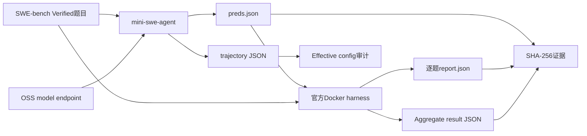
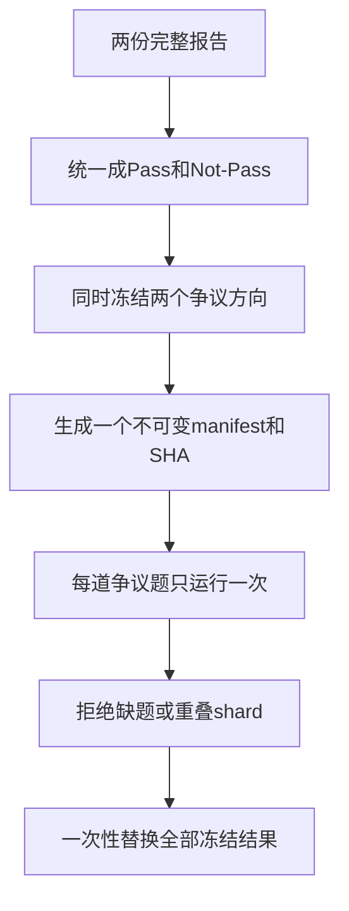

# OSS 模型 SWE-bench 评测实战手册

[](https://huggingface.co/datasets/princeton-nlp/SWE-Bench_Verified)
[](https://github.com/SWE-agent/mini-swe-agent/tree/v2.4.6)
[](https://github.com/SWE-bench/SWE-bench/commit/f7bbbb2ccdf479001d6467c9e34af59e44a840f9)
[](https://www.python.org/)

一套完整的工程流程：使用 mini-swe-agent 和官方 SWE-bench Docker harness，评测通过 OpenAI-compatible endpoint 提供服务、并支持 function tool calls 的 OSS coding model。

> **作者**：魏新宇 (Xinyu Wei) — Microsoft AI and Apps Global Black Belt (GBB)

[English](README.md) | 中文版

<div align="center">
  
</div>

## 概览

SWE-bench 不是把一道题发给模型，再比较一段文本答案。它评测的是一个完整的**软件工程 Agent 系统**：

1. mini-swe-agent 把 issue 和代码仓库交给 OSS model。
2. 模型通过 shell 工具查看和修改代码，生成 Git patch。
3. 官方 SWE-bench harness 恢复每道题对应的 Docker 环境。
4. Harness 应用候选 patch 和官方 test patch。
5. 只有要求修复的测试通过、原有测试不回退，这道题才算 Resolved。

本 Repo 从已验证的本地 OpenAI-compatible model endpoint 开始，覆盖到官方评测结果的完整流程：

| 阶段 | 输入 | 输出 | 验收门 |
|---|---|---|---|
| Endpoint 预检 | 模型 URL、served model | `/v1/models` 响应 | 能看到目标模型 |
| Agent generation | Issue、仓库、Agent YAML | `preds.json` + trajectories | ID 全覆盖、状态合法 |
| Effective config 审计 | Trajectory `info.config` | Canonical config hash | 去除允许的逐题字段后只剩目标配置 |
| 官方评测 | 候选 patches | 逐题 report + aggregate JSON | Docker harness 正常退出 |
| 差异复测 | 两份完整报告 | 冻结的双向争议清单 | 禁止动态缩小或best-of（只保留最好结果） |
| 证据封存 | 已完成文件 | `SHA256SUMS.txt` | 写入进程已停止，manifest 可验证 |

核心脚本尽量只依赖 Python 标准库；一旦发现缺题、重复题或 shard 重叠，就直接终止，不生成看似完整的结果。Repo 不包含模型私有 endpoint、凭据、VM、客户数据或内部测试结果。

## 1. SWE-bench 原理

### 1.1 每道题包含什么

[SWE-bench Verified](https://huggingface.co/datasets/princeton-nlp/SWE-Bench_Verified)包含500道由工程师确认可解决的issue–pull request题目。每道题常见字段如下：

| 字段 | 在评测中的作用 |
|---|---|
| `instance_id` | 稳定题目ID，例如`owner__repo-1234` |
| `problem_statement` | Agent能看到的GitHub issue标题和正文 |
| `base_commit` | 修复PR之前的仓库状态 |
| `test_patch` | 从标准答案PR中提取的权威测试 |
| `FAIL_TO_PASS` | 修复前失败、修复后应该通过的测试 |
| `PASS_TO_PASS` | 修复前后都必须保持通过的已有测试 |
| `environment_setup_commit` | Harness创建环境时使用的环境版本标识 |

Gold patch用于定义和验证题目，但不会提供给被测模型。

### 1.2 阶段A：Agent Generation

mini-swe-agent创建题目容器，把代码切到`base_commit`，再把issue交给模型，并提供`bash`工具。模型会多轮查看代码、修改文件、运行测试，最后提交patch。

Generation主要产生两类文件：

- `preds.json`：每道题对应一个候选patch。
- `<instance_id>/<instance_id>.traj.json`：messages、tool observations、effective config、exit status、调用统计和patch来源。

Generation完成不代表题目已经通过。

### 1.3 阶段B：官方Docker评测

官方harness会在每道题自己的evaluation image中运行候选patch。逻辑上包括：

1. 恢复仓库和依赖环境。
2. 应用候选patch。
3. 应用官方test patch。
4. 执行该题指定的测试命令。
5. 解析`FAIL_TO_PASS`和`PASS_TO_PASS`。

候选patch能够应用，并且要求修复的测试全部通过、已有测试没有回退，才算Resolved。Empty和Error必须单独保留，不能静默并入Unresolved。

### 1.4 为什么必须用Docker

每道题可能依赖不同的仓库版本、Python版本、系统包和测试命令。官方harness通过Docker隔离环境。SWE-bench官方建议本地评测使用x86_64主机，并预留约120GB可用磁盘、16GB RAM和8个CPU core。

### 1.5 为什么Generation和Evaluation必须分开

两个阶段的失败含义完全不同：

| Generation失败 | Evaluation失败 |
|---|---|
| 模型endpoint不可用 | 候选patch无法应用 |
| Tool call格式错误 | 要求修复的测试仍失败 |
| Agent达到step/cost限制 | 已有测试发生回退 |
| 题目Docker容器无法启动 | 测试执行超时 |
| Empty patch | Harness或Docker执行错误 |

如果混在一起统计，准确率会失真，后续也无法判断应该修模型、Agent还是基础设施。

## 2. 架构与产物



建议的run目录：

```text
runs/<run-id>/
├── generation/
│   ├── preds.json
│   ├── <instance-id>/<instance-id>.traj.json
│   ├── generation-summary.json
│   └── generation.log
├── official-eval/
│   ├── logs/run_evaluation/.../report.json
│   ├── aggregate.json
│   └── harness.log
├── contract.json
└── SHA256SUMS.txt
```

## 3. Quick Start

### 3.1 前置条件

- Linux x86_64主机
- Docker Engine，以及足够存放SWE-bench题目镜像的磁盘
- Python 3.12（已经过clean-room验证）
- 通过`/v1/models`和`/v1/chat/completions`提供服务、并支持OpenAI-style function tool calls的OSS coding model
- 与模型规模匹配的GPU资源

### 3.2 安装固定版本工具链

```bash
git clone https://github.com/david-xinyuwei/david-share.git
cd david-share/Deep-Learning/OSS-Model-SWE-bench-Evaluation-Playbook

python3 -m venv .venv
source .venv/bin/activate
python -m pip install --upgrade pip
bash scripts/setup_environment.sh
```

默认安装使用`requirements-lock.txt`，它来自Linux x86_64 / Python 3.12.3 clean-room环境。`requirements.txt`只记录维护者需要关注的Agent直接依赖。工具链固定了：

- mini-swe-agent `v2.4.6`
- SWE-bench commit `f7bbbb2ccdf479001d6467c9e34af59e44a840f9`

这个 SWE-bench commit 修复了一个评分问题：当 test patch 只新增文件时，旧逻辑可能误重置整个 working tree。

安装脚本会保留固定 commit 的 SWE-bench checkout，并使用 editable install。部分 revision 直接构建 VCS wheel 时，可能漏掉 harness 运行需要的非 Python fixture；保留源码 checkout 可以避开这个打包问题。
只有在明确要重新解析依赖时，才设置`REQUIREMENTS_FILE=./requirements.txt`；之后必须重新保存并审计`pip freeze`，不能把新旧依赖环境的分数直接比较。

### 3.3 验证模型Endpoint

```bash
export MODEL_API_BASE="http://127.0.0.1:8000/v1"
export MODEL_NAME="hosted_vllm/your-model"
export MODEL_API_KEY="EMPTY"

curl --fail --silent "$MODEL_API_BASE/models" | python -m json.tool
```

`MODEL_NAME`要符合当前LiteLLM provider的命名约定。不要把真实key写进YAML或shell history，应从安全环境变量或本地凭据源读取。
`run_generation.sh`会把`MODEL_API_KEY`映射到LiteLLM的`HOSTED_VLLM_API_KEY`环境变量，不会把key放进子进程参数。

### 3.4 运行单题Canary

```bash
export OUTPUT_DIR="runs/canary/generation"
export WORKERS=1
export INSTANCE_FILTER='^astropy__astropy-7166$'

bash scripts/run_generation.sh 2>&1 | tee runs/canary/generation.log

python scripts/validate_predictions.py \
  --run-dir "$OUTPUT_DIR" \
  --expected-count 1 \
  --summary runs/canary/generation-summary.json

python scripts/audit_effective_configs.py --run-dir "$OUTPUT_DIR"
```

随后运行官方评分：

```bash
export PREDICTIONS_PATH="$OUTPUT_DIR/preds.json"
export RUN_ID="oss-model-canary"
export REPORT_DIR="runs/canary/official-eval"
export MAX_WORKERS=1

bash scripts/run_official_harness.sh 2>&1 | tee runs/canary/harness.log
```

Generation和official scoring都产出有效文件后，才能开始全量run。

### 3.5 运行SWE-bench Verified

```bash
unset INSTANCE_FILTER
export OUTPUT_DIR="runs/full/generation"
export WORKERS=8

bash scripts/run_generation.sh 2>&1 | tee runs/full/generation.log

python scripts/validate_predictions.py \
  --run-dir "$OUTPUT_DIR" \
  --expected-count 500 \
  --summary runs/full/generation-summary.json

python scripts/audit_effective_configs.py --run-dir "$OUTPUT_DIR"
```

500题generation全部通过校验后，再运行官方harness：

```bash
export PREDICTIONS_PATH="$OUTPUT_DIR/preds.json"
export RUN_ID="oss-model-swebench-verified"
export REPORT_DIR="runs/full/official-eval"
export MAX_WORKERS=4
export TIMEOUT_SECONDS=1800

bash scripts/run_official_harness.sh 2>&1 | tee runs/full/harness.log
```

这里的workers只是示例，不是所有环境的通用默认值。需要根据模型容量、Docker存储、CPU、内存和磁盘吞吐做canary验证。

## 4. 完整执行流程

### 步骤1：冻结Asset Matrix

Generation开始前先保存机器可读合同：

```json
{
  "dataset": "princeton-nlp/SWE-Bench_Verified",
  "split": "test",
  "expected_cases": 500,
  "mini_swe_agent": "2.4.6",
  "agent_config_sha256": "<sha256>",
  "agent_step_limit": 250,
  "agent_cost_limit": 3.0,
  "python_packages_sha256": "<sha256>",
  "model_revision": "<public-model-revision>",
  "generation_workers": 8,
  "swe_bench_commit": "f7bbbb2ccdf479001d6467c9e34af59e44a840f9",
  "harness_workers": 4,
  "harness_timeout_seconds": 1800
}
```

对所有可执行输入生成hash：

```bash
python scripts/hash_assets.py configs --output runs/full/config-SHA256SUMS.txt
python -m pip freeze > runs/full/python-packages.txt
sha256sum runs/full/python-packages.txt
```

### 步骤2：检查Effective Config

YAML 只是输入，trajectory 里的`info.config`才代表实际生效的配置。Generation 结束后执行：

```bash
python scripts/audit_effective_configs.py \
  --run-dir runs/full/generation \
  --ignore environment.image \
  --ignore agent.output_path
```

如果去除允许的逐题差异后仍有多个config hash，脚本会返回非零退出码。

### 步骤3：分类Generation结果

| 状态 | 含义 | 处理方式 |
|---|---|---|
| `Submitted` | Agent提交了patch | 进入官方harness |
| `LimitsExceeded` | Agent达到声明的限制 | 保留；patch可能为空也可能非空 |
| `TimeExceeded` | Agent达到wall-time限制 | 作为明确的Agent结果保留 |
| `RepeatedFormatError` | Tool/response格式持续失败 | 通常是Empty；必须保留trajectory |
| Infrastructure exception | 题目环境没有正确启动 | 单独隔离，只在冻结配置下补测该ID |

### 步骤4：运行官方评分

以下参数必须固定并记录：

- Dataset和split
- SWE-bench源码commit
- Namespace
- 单题timeout
- Docker cache level
- `--clean true`
- Worker数量
- Run ID和working directory

部分版本会把aggregate JSON写到当前working directory，而不是`--report_dir`。`run_official_harness.sh`会先进入解析后的report目录，再启动harness，让日志和aggregate留在同一处；最终只接受一份aggregate。

### 步骤5：合并互斥Shard

如果generation或scoring分布在多台机器：

```bash
python scripts/merge_official_reports.py \
  --report runs/node-a/aggregate.json \
  --report runs/node-b/aggregate.json \
  --expected-count 500 \
  --output runs/merged/aggregate.json
```

只要同一题出现在两个shard中，脚本就会fail closed。

### 步骤6：封存证据

确认所有写入进程已经退出后再生成manifest：

```bash
python scripts/hash_assets.py runs/full --output runs/full/SHA256SUMS.txt
(cd runs/full && sha256sum -c SHA256SUMS.txt)
```

## 5. 最佳实践与错误做法

面向客户的评测合同全部放在本 README，不再拆到配套文档。每条最佳实践都对应一种错误做法，并给出能够拦住它的验证门。

| 最佳实践 | 错误做法 | 为什么会失败 | 验证门 |
|---|---|---|---|
| 冻结完整执行合同 | 认为版本号相同就足够 | 源码、默认值、限制或并发仍可能不同 | 对配置和输入生成hash，保存`pip freeze` |
| 分离generation与scoring | 把生成patch当成通过 | 只有官方测试能判定Resolved | Canary必须走完两个阶段并完成评分 |
| 校验每个计划产物 | 只统计`preds.json`条目 | Trajectory、内嵌ID、config或patch仍可能无效 | 运行`validate_predictions.py`和`audit_effective_configs.py` |
| 只重试基础设施失败 | 把模型或测试失败重试到通过 | 会形成未披露的best-of结果 | Run前冻结retry policy |
| 同时冻结两个争议方向 | 只复测能提高候选分数的一边 | 会引入selection bias | 使用`--expected-count`强制完整分母 |
| 隔离canary、full、retry和retest | 不同阶段覆盖同一输出 | 会破坏provenance并导致结果混用 | 使用独立run ID和目录 |
| Writer停止后再hash | 对仍在写入的log或report做hash | Manifest会立即失效 | 文件静止后执行`sha256sum -c` |
| 先写范围，再写分数 | 把子集命中率写成全量准确率 | 会隐藏分母和覆盖范围 | 同时报告Resolved、Unresolved、Empty、Error和total |
| 用产物判断进度 | 把service active当成工作负载进展 | 健康进程也可能已经stall | 检查predictions、reports、logs、containers和runtime活动 |
| 明确Public边界 | 发布内部路径、endpoint或客户产物 | 会泄露私有基础设施，也无法通用复现 | Stage前运行Public validator |

### 执行合同清单

| 范围 | Generation前必须冻结 |
|---|---|
| Dataset | Repository、split、row count、revision和完整instance-manifest SHA-256 |
| Agent | mini-swe-agent版本和实际安装产物身份 |
| Agent config | YAML SHA-256、config顺序、prompt、step/cost/wall-time limits |
| Python environment | `pip freeze`输出和SHA-256 |
| Model | Public model ID、weight revision、served model name |
| Endpoint | API shape和非秘密base URL pattern |
| Sampling | Temperature、top-p、maximum output tokens |
| Concurrency | Generation worker count |
| Harness | SWE-bench commit、namespace、timeout、cache level、clean mode、worker count |

Secret必须走provider的环境变量合同。使用`hosted_vllm`时，应设置`HOSTED_VLLM_API_KEY`；不能把真实key写进YAML或`-c key=value`进程参数。

### BP1：固定源码，不只看版本号

同一package version仍可能包含不同源码。记录mini-swe-agent tag和SWE-bench commit；评分逻辑依赖特定修复时，要安装或挂载目标checkout，并验证实际import path。

### BP2：Canary必须同时通过Generation和Scoring

只生成patch不算canary完成；必须拿到官方report。

### BP3：明确Retry语义

只重试基础设施失败。模型失败和测试失败属于benchmark结果，不能因为分数不好就重试。

### BP4：冻结双向争议集

不能只测有利于候选模型的一边：

```bash
python scripts/build_dispute_manifest.py \
  --reference-report reference-full.json \
  --candidate-report candidate-full.json \
  --expected-count 500 \
  --output runs/differential/frozen-disputes.tsv
```

### BP5：禁止动态缩小复测集合

某题在中间轮次碰巧一致后就停止，只给剩余题额外机会，会形成 optional stopping（可选停止）和隐藏的 best-of。

必须等冻结争议集每道题恰好有一个复测结果后统一替换：

```bash
python scripts/finalize_frozen_disputes.py \
  --reference-report reference-full.json \
  --baseline-report candidate-full.json \
  --expected-count 500 \
  --dispute-manifest runs/differential/frozen-disputes.tsv \
  --retest-report runs/differential/node-a.json \
  --retest-report runs/differential/node-b.json \
  --output-dir runs/differential/final
```

### BP6：Effect不等于Mechanism

分数变化只证明当前run观察到了效果，不能单凭分数断言是某个kernel、prompt、scheduler或依赖导致。

### BP7：用产物判断进度

看predictions、trajectories、reports、test output和日志是否增长。PID、service active或endpoint healthy本身不等于workload在推进。

### BP8：只对静止文件生成SHA

所有写入进程停止后再生成 manifest。对还在增长的日志做 hash，manifest 会立即失效。

### BP9：保留Phase Lineage

Canary、full、infrastructure retry和differential retest不能互相覆盖。通过source hash和run ID记录血缘关系。

### BP10：Public Repo只放占位符和公开资产

示例使用loopback endpoint、公开model ID和合成fixture。私有endpoint、VM、凭据、本地绝对路径和客户数据不能进入Public Repo。

## 6. 冻结争议集复测

定向复测必须建立在两份完整报告之上。

### 正确流程



### 无效流程

- 只复测Reference Pass / Candidate Fail方向。
- Empty或Fail一直重试到Pass，再保留Pass。
- 每轮结束后继续缩小争议集。
- 不记录lineage，混用canary、full、基础设施补测和差异复测结果。

## 7. 遇到的问题与排查

下面都是构建和验证本流程时真实遇到的故障模式。症状、第一检查项和安全处理放在同一张表里，读者不需要跳到另一份文档。

| 问题 | 第一检查项 | 正确处理 |
|---|---|---|
| Generation明显更慢 | Agent版本、limits、prompt、workers | 对比effective config和canary调用数 |
| YAML看起来正确但runtime不同 | Config merge顺序、CLI overrides、global config | 以trajectory `info.config`为runtime truth |
| Docker exit 125 | Image pull、磁盘、stale container | 保存错误；预拉精确image；只补基础设施失败 |
| Root disk写满 | Docker layers、stopped containers、core dumps | 检查占用；只删除已证明不活跃的产物 |
| Empty patch | Format error或Agent limit | 保留Empty；检查trajectory |
| Temperature 0仍不一致 | 多轮Agent/runtime非确定性 | 报告波动，不承诺字节一致 |
| 相同patch、不同结果 | Harness源码、image、timeout、host timing | 固定commit并保留测试日志 |
| 同版本、评分不同 | Installed source漂移 | 安装或挂载精确commit |
| 固定VCS安装后import失败 | Wheel漏掉非Python fixture | 保留精确checkout并使用editable install |
| Aggregate位置异常 | Harness版本行为 | 独立cwd运行，只接受一份aggregate |
| 官方测试timeout | 慢测试或host load | 保留Error，除非事先冻结了重试规则 |
| 只复测单向争议 | Selection bias | 同时冻结两个方向 |
| 每轮缩小争议集 | Optional stopping / 隐藏best-of | 回到最初的冻结集合 |
| Shard重叠 | Partition错误 | 合并fail closed，修manifest |
| Service active但无产物 | 只有生命周期信号，没有工作负载进展 | 同时检查产物、容器、日志和runtime活动 |
| SHA生成后立刻失效 | 写入进程仍在运行 | 停止写入后重新生成manifest |

### 7.1 Effective Config漂移

**症状：** YAML看起来正确，但trajectory使用了不同的endpoint、model、prompt、timeout、image或limit。

**原因：** 多个`-c`输入会按顺序merge；CLI和global config也可能覆盖眼前的文件。

**修复与验证：** 以trajectory `info.config`为权威值。运行`audit_effective_configs.py`，只忽略task image等有意存在的逐题字段。

### 7.2 Docker启动和存储故障

**症状：** `docker run`返回exit 125，没有Agent messages，或者host报告`no space left on device`。

**原因：** Image pull中断、stale container name、Docker daemon异常、task layers积累、stopped containers或core dumps。

**修复：** 保留原始错误，检查free space和`docker system df`，预拉精确image，只重试model execution开始前失败的ID。保持`--clean true`；其他评测运行时禁止prune。

### 7.3 Empty Patch

**症状：** Prediction存在，但`model_patch`为空，常见exit status是`RepeatedFormatError`、`LimitsExceeded`或`TimeExceeded`。

**原因：** Agent没有提交，tool格式持续失败，或者达到了已声明的limit。

**修复：** 保留trajectory，并在冻结run中计为Empty。任何retry都属于独立phase，不能静默并入隐藏best-of。

### 7.4 Temperature 0与相同Patch波动

**症状：** 相同高层config产生不同calls、patches或outcomes；有时patch字节完全相同，官方结果仍不同。

**原因：** Temperature 0不能保证多轮tool Agent端到端确定。Backend scheduling、tied choices、tool observations、task image、harness source、host load和timeout都可能改变后续turn或测试执行。

**修复：** 冻结方法，并保留逐题trajectory、`report.json`和test output。把波动写成实测effect；没有独立证据时，不能直接推断mechanism。

### 7.5 固定Commit构建出的Wheel缺文件

**症状：** 直接VCS install成功，但import harness时因`Cargo.lock`等非Python fixture缺失而抛出`FileNotFoundError`。

**原因：** 该revision构建出的wheel没有包含runtime需要的全部文件。

**修复：** 保留精确source checkout，验证commit和clean worktree，检查已知fixture，再使用editable install：

```bash
bash scripts/setup_environment.sh
python -m swebench.harness.run_evaluation --help
```

### 7.6 Optional Stopping与Shard不完整

**症状：** 只复测有利方向、每轮继续缩小争议集，或者合并后的分母异常变小或变大。

**原因：** 单向selection、dynamic narrowing、missing shards或overlapping partitions。

**修复：** 回到两份完整报告，只冻结一次双向binary disputes，通过`--expected-count`传入声明分母，并要求每道冻结题恰好出现一次。Repo脚本会拒绝missing、extra、duplicate和overlapping cases。

## 8. 证据与报告

最小报告字段：

```json
{
  "dataset": "princeton-nlp/SWE-Bench_Verified",
  "split": "test",
  "resolved": 0,
  "unresolved": 0,
  "empty": 0,
  "errors": 0,
  "total": 500,
  "accuracy_pct": 0.0,
  "generation_run_id": "<run-id>",
  "harness_run_id": "<run-id>",
  "agent_version": "2.4.6",
  "harness_commit": "f7bbbb2ccdf479001d6467c9e34af59e44a840f9"
}
```

Empty 和 Error 必须显式列出。准确率使用完整声明分母；如果另算 completed-only 比例，必须明确标为辅助诊断指标，不能替代正式准确率。

## 9. 验证

```bash
make validate
make test
```

当前确定性测试覆盖：

- 双向争议识别。
- 完整冻结集合替换。
- 缺题拒绝。
- 重叠shard拒绝。
- Python和Shell语法。
- 公开边界和双语文档检查。

[离线合成示例](examples/README.md)无需模型endpoint或Docker，就能验证冻结争议集的计算流程；它只是测试fixture，不是模型实测结果。

本地质量门应以这些marker结束：

```text
REPO_VALIDATION=PASS
...
OK
```

### Clean-Environment验证

```bash
python3 -m venv .venv
source .venv/bin/activate
python -m pip install --upgrade pip
bash scripts/setup_environment.sh
python -m pip check
python -m minisweagent.run.benchmarks.swebench --help
python -m swebench.harness.run_evaluation --help
make validate
make test
```

### 清理边界

- 保持`--clean true`，让harness在评测后清理逐题资源。
- 回收存储前，先保存reports、logs、运行合同以及验证通过的SHA manifest。
- 执行prune前先查看`docker system df`；其他评测仍在运行时，不要做大范围Docker清理。
- 只有在归档文件及其外层hash验证通过后，才能删除本地`runs/<run-id>/`目录。

## 10. 安全与公开边界

- API key从环境变量或安全本地来源读取。
- 不打印、不提交token。
- 使用公开model ID和占位endpoint。
- 不公开客户题目子集、私有benchmark产物、VM地址、内部registry或本地绝对路径。
- 发布前逐个检查日志和截图。

## 11. 官方来源

- [mini-swe-agent v2.4.6](https://github.com/SWE-agent/mini-swe-agent/tree/v2.4.6)
- [mini-swe-agent文档](https://mini-swe-agent.com/latest/)
- [SWE-bench官方Repo](https://github.com/SWE-bench/SWE-bench)
- [SWE-bench evaluation guide](https://www.swebench.com/SWE-bench/guides/evaluation/)
- [SWE-bench Docker setup guide](https://www.swebench.com/SWE-bench/guides/docker_setup/)
- [固定SWE-bench commit](https://github.com/SWE-bench/SWE-bench/commit/f7bbbb2ccdf479001d6467c9e34af59e44a840f9)
- [SWE-bench Verified dataset](https://huggingface.co/datasets/princeton-nlp/SWE-Bench_Verified)
- [SWE-bench论文](https://arxiv.org/abs/2310.06770)

## 12. 相关项目

| Repo | 关系 |
|---|---|
| [OAI-OSS-on-Azure](../OAI-OSS-on-Azure/) | Azure上的open-weight model serving和tuning |
| [MiMo-V2.5-Pro-on-MI300X-Benchmark](../MiMo-V2.5-Pro-on-MI300X-Benchmark/) | 大模型inference与benchmark证据规范 |
| [Qwen3-VL-Product-Tagging-on-Azure](../Qwen3-VL-Product-Tagging-on-Azure/) | Schema-first validation和evidence-rich benchmark结构 |
