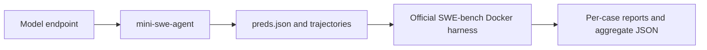
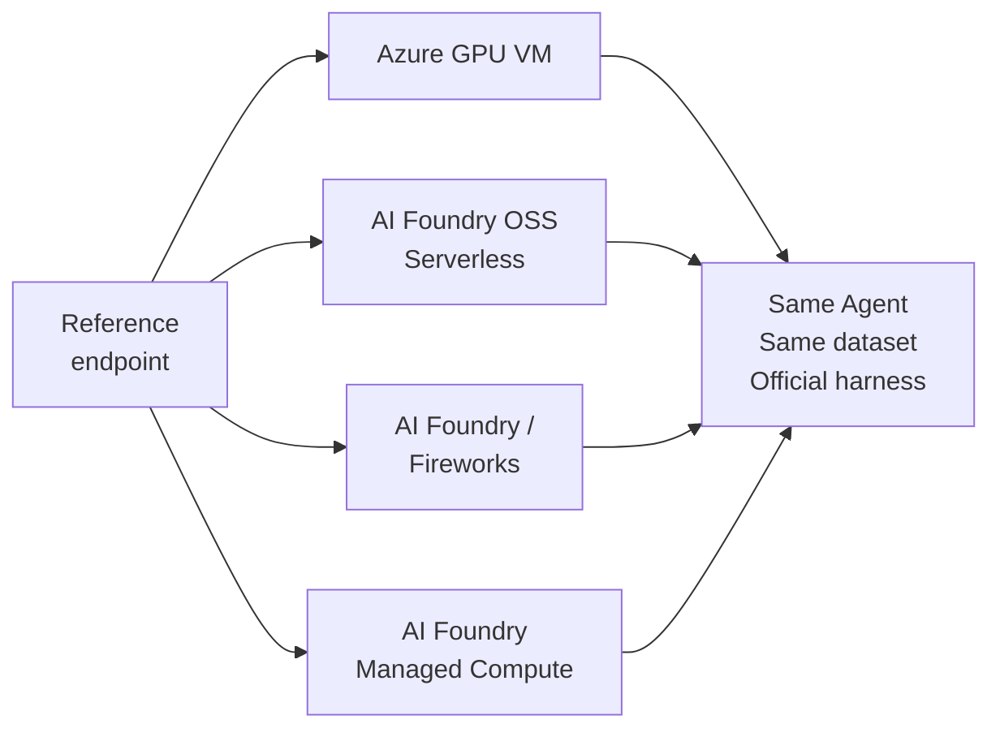
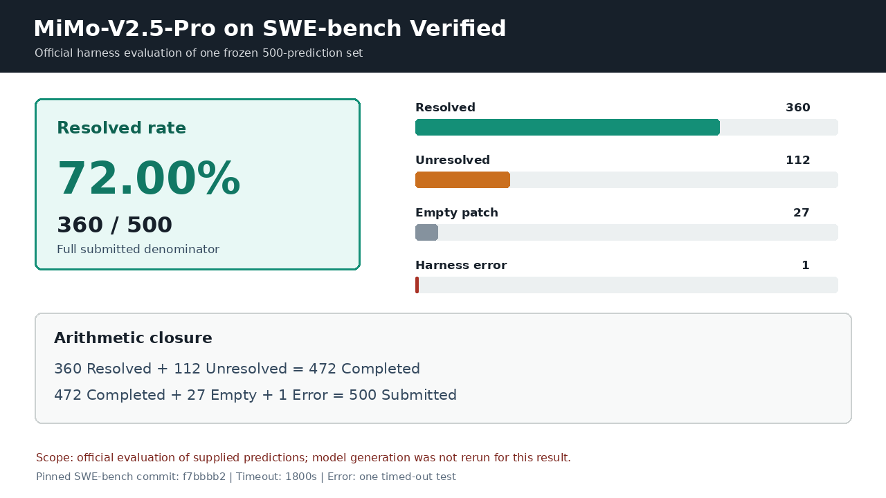

# OSS Model SWE-bench Evaluation Playbook

[](https://huggingface.co/datasets/princeton-nlp/SWE-Bench_Verified)
[](https://github.com/SWE-agent/mini-swe-agent/tree/v2.4.6)
[](https://github.com/SWE-bench/SWE-bench/commit/f7bbbb2ccdf479001d6467c9e34af59e44a840f9)
[](https://www.python.org/)
[](https://github.com/david-xinyuwei/david-share/actions/workflows/oss-model-swebench-playbook-ci.yml)

Measure the SWE-bench Verified accuracy of OSS models running on Microsoft platforms — open-weight or fine-tuned — across four deployment paths: Azure GPU VM, AI Foundry OSS Serverless, AI Foundry Managed Compute, and AI Foundry / Fireworks. This Repo supplies the endpoint configuration and auditable glue only; the agent loop comes from official mini-swe-agent and scoring runs through the official SWE-bench Docker harness, so results are comparable with published SWE-bench numbers.

> **Author**: 魏新宇 (Xinyu Wei) — Microsoft AI and Apps Global Black Belt (GBB)

English | [中文版](README-CN.md)

<div align="center">
  
</div>

## Overview

SWE-bench evaluates a software-engineering Agent, not a single text response:



The two planes stay separate:

| Plane | Produces | Authority |
|---|---|---|
| Generation | Candidate patches and trajectories | Frozen model, Agent, prompt, tools, sampling, and retry contract |
| Evaluation | `Resolved`, `Unresolved`, `Empty`, and `Error` | Producer-documented `swebench.harness.run_evaluation` CLI |

An empty patch remains in the full denominator and contributes no resolved case. A score is valid only when infrastructure errors are zero or explicitly scoped.

## Component Roles

<div align="center">
  
</div>

| Component | Role | What it does |
|---|---|---|
| SWE-bench Verified | Exam paper | Supplies the issue text, the repository snapshot, and the official tests for each task |
| Model under test | Candidate | Runs on your endpoint, reasons about the task, and emits shell commands and a final patch |
| mini-swe-agent | Hands | Gives the model a `bash` tool, executes each command, returns the output, and writes `preds.json` |
| SWE-bench harness | Judge | Restores one Docker image per task, applies the patch, runs the project tests, and decides the outcome |

`harness` means two different things in this pipeline, and mixing them up is the most common source of confusion:

| | Agent harness | Test harness |
|---|---|---|
| Implementation | `mini-swe-agent` | `swebench.harness` |
| Prompt templates | Owns them; they are sent to the model under test | None |
| Model calls | Yes, it is the caller | None |
| Docker used for | A workbench where the model runs commands | An exam room where tests are graded |
| Replaceable | Yes, but the score changes with it | No, it defines the score |

Because the judge only reads `preds.json`, it cannot tell which endpoint produced a patch. Platform choice therefore affects the candidate only.

## Current Evidence



| Path | Evidence | Status |
|---|---|---|
| Azure GPU VM / on-premises | MiMo-V2.5-Pro: live Agent generation through this Repo plus official scoring of the frozen 500 predictions | [Live pipeline: 1 Resolved / 0 Error](examples/live-azure-gpu-vm-mimo-v25-pro-scored-canary.yaml); [full frozen-prediction score: 360 Resolved / 500 submitted (72.00%), 27 Empty, 1 harness timeout](examples/live-azure-gpu-vm-mimo-v25-pro-full500.yaml) |
| AI Foundry OSS Serverless | DeepSeek-V4-Flash, tool preflight, one-task Agent run, and official harness | [1 Resolved / 0 Error](examples/live-foundry-direct-deepseek-v4-flash-scored-canary.yaml) |
| AI Foundry / Fireworks | FW-GLM-5.1 deployment, tool preflight, one-task Agent run, and official harness | [1 Resolved / 0 Error](examples/live-foundry-fw-glm51-scored-canary.yaml) |
| AI Foundry Managed Compute | Qwen3-4B on one A100, Entra authentication, nonempty patch, and official aggregate | [0 Resolved / 1 Unresolved / 0 Empty / 0 Error; pipeline verified, accuracy not claimed](examples/live-foundry-managed-compute-scored-canary.yaml) |

All four paths now have live Agent-generation and official-aggregate canaries. A pipeline canary proves compatibility only; it does not establish per-model accuracy. MiMo also remains the complete-result example: its 360/500 score is an official evaluation of existing predictions, and generation was not rerun for that full result.

<div align="center">
  
</div>

Raw console output of that official harness run, kept as first-hand evidence. The tail block is the harness summary the numbers above are read from:

<div align="center">
  
</div>

## Setup

Prerequisites:

| Requirement | Minimum |
|---|---|
| Host | Linux `x86_64` with Docker |
| Python | `3.12` |
| Local evaluation capacity | `120GB` free disk, `16GB` RAM, `8` CPU cores |

```bash
git clone --filter=blob:none --sparse --branch master \
  https://github.com/david-xinyuwei/david-share.git david-share
cd david-share
git sparse-checkout set --no-cone \
  '/Deep-Learning/OSS-Model-SWE-bench-Evaluation-Playbook/'
cd Deep-Learning/OSS-Model-SWE-bench-Evaluation-Playbook
python3 -m venv .venv
source .venv/bin/activate
python -m pip install --upgrade pip
bash scripts/setup_environment.sh
```

The setup script pins mini-swe-agent and the SWE-bench source commit used by this Repo. Neither upstream project is patched: SWE-bench stays an editable checkout at a fixed commit, generation calls the official mini-swe-agent module, and scoring calls the official harness CLI. This Repo supplies configuration and glue only.

Set the platform variables; every command after this point is identical:

| Platform | `ENDPOINT_MODE` | Authentication |
|---|---|---|
| Azure GPU VM / on-premises | `openai_compatible` | `MODEL_API_KEY` or `EMPTY` |
| AI Foundry OSS Serverless | `azure_foundry` | `MODEL_API_KEY` |
| AI Foundry Managed Compute | `azure_foundry` | `MODEL_API_KEY`; use `AZURE_AD_TOKEN` when local auth is disabled |
| AI Foundry / Fireworks | `azure_foundry` | `MODEL_API_KEY` |

### Azure GPU VM / on-premises

```bash
export ENDPOINT_MODE="openai_compatible"
export MODEL_API_BASE="http://<host>:8000/v1"
export MODEL_NAME="<served-model>"
export MODEL_API_KEY="<model-api-key-or-EMPTY>"
export RUN_LABEL="azure-gpu-vm-$(date -u +%Y%m%dT%H%M%SZ)"
```

### AI Foundry OSS Serverless

```bash
export ENDPOINT_MODE="azure_foundry"
export MODEL_API_BASE="https://<resource-name>.services.ai.azure.com"
export MODEL_NAME="<deployment-name>"
unset AZURE_AD_TOKEN
export MODEL_API_KEY="<deployment-key>"
export RUN_LABEL="foundry-oss-serverless-$(date -u +%Y%m%dT%H%M%SZ)"
```

The sealed AI Foundry OSS Serverless and AI Foundry / Fireworks canaries both used key authentication. Store deployment keys in a secret manager, rotate them, and never persist them in the Repo or evidence.

### AI Foundry Managed Compute

For a customer resource with local authentication enabled, use its access key. Microsoft Learn documents that developer inference operations accept either access keys or Microsoft Entra ID; setting `disableLocalAuth=true` disables the key path. See [Microsoft Learn](https://learn.microsoft.com/en-us/azure/foundry/foundry-models/how-to/configure-entra-id).

```bash
export ENDPOINT_MODE="azure_foundry"
export MODEL_API_BASE="https://<resource-name>.services.ai.azure.com/managed-deployments/<deployment-name>/v1"
export MODEL_NAME="<deployment-name>"
unset AZURE_AD_TOKEN
export MODEL_API_KEY="<resource-key>"
export RUN_LABEL="foundry-managed-compute-$(date -u +%Y%m%dT%H%M%SZ)"
```

If the target resource has `disableLocalAuth=true`, Key authentication is unavailable. Use Microsoft Entra ID instead: isolate Azure CLI state per subscription and acquire a short-lived token. `AZURE_CONFIG_DIR` belongs to Azure CLI, not to SWE-bench:

```bash
export AZURE_CONFIG_DIR="$HOME/.azure-<isolated-profile>"
az account show --query '{subscription:id,tenant:tenantId,user:user.name}' -o json
az provider show --namespace Microsoft.CognitiveServices --query registrationState -o tsv
unset MODEL_API_KEY AZURE_API_KEY AZURE_OPENAI_API_KEY HOSTED_VLLM_API_KEY
export AZURE_AD_TOKEN="$(az account get-access-token \
  --resource https://cognitiveservices.azure.com \
  --query accessToken -o tsv)"
```

Azure CLI user tokens are short-lived and fit local development or canaries. For a long full run, use Managed Identity or a Service Principal, or refresh the token before each isolated shard; never persist the token in the Repo or evidence.

### AI Foundry / Fireworks

```bash
export ENDPOINT_MODE="azure_foundry"
export MODEL_API_BASE="https://<resource-name>.services.ai.azure.com"
export MODEL_NAME="<deployment-name>"
unset AZURE_AD_TOKEN
export MODEL_API_KEY="<deployment-key>"
export RUN_LABEL="foundry-fireworks-$(date -u +%Y%m%dT%H%M%SZ)"
```

These variables belong to `scripts/run_generation.sh`, not to SWE-bench. The wrapper translates them into the official mini-swe-agent arguments `-c model.model_name` and `-c model.model_kwargs.api_base`, exports the matching LiteLLM credential variable, and records the mapping in `provider-contract.json`. SWE-bench itself accepts no endpoint variables; it takes CLI flags only.

## Run

Run the provider preflight and a full generation-plus-scoring pipeline canary first:

```bash
python scripts/preflight_provider.py \
  --mode "$ENDPOINT_MODE" \
  --api-base "$MODEL_API_BASE" \
  --model "$MODEL_NAME"

export OUTPUT_ROOT="runs/${RUN_LABEL}-scored-canary"
bash scripts/run_scored_canary.sh
```

The final marker reports the pipeline state and the model outcome separately, for example: `PIPELINE_CANARY=PASS outcome=Unresolved ...`.

For a slow or weak model, set `AGENT_STEP_LIMIT=12` only to bound this compatibility canary. The value is recorded in `provider-contract.json`; an `Empty` result still proves transport and official aggregation, but it is not an accuracy estimate. Unset it before a full run.

Generate the frozen SWE-bench Verified set:

```bash
unset INSTANCE_FILTER
export OUTPUT_DIR="runs/${RUN_LABEL}-full/generation"
export WORKERS=8
mkdir -p "runs/${RUN_LABEL}-full"

bash scripts/run_generation.sh 2>&1 | tee "runs/${RUN_LABEL}-full/generation.log"
python scripts/validate_predictions.py \
  --run-dir "$OUTPUT_DIR" \
  --expected-count 500 \
  --summary "runs/${RUN_LABEL}-full/generation-summary.json"
python scripts/audit_effective_configs.py --run-dir "$OUTPUT_DIR"
```

Score the generated patches with the SWE-bench producer-documented CLI:

```bash
PREDICTIONS_PATH="$(realpath "$OUTPUT_DIR/preds.json")"
REPORT_DIR="$(pwd)/runs/${RUN_LABEL}-full/official-eval"
mkdir -p "$REPORT_DIR"

(
  cd "$REPORT_DIR"
  python -m swebench.harness.run_evaluation \
    --dataset_name princeton-nlp/SWE-Bench_Verified \
    --predictions_path "$PREDICTIONS_PATH" \
    --max_workers 4 \
    --run_id "${RUN_LABEL}-verified" \
    2>&1 | tee harness.log
)
```

`scripts/run_official_harness.sh` is an optional launcher that `exec`s the same official module. It is not a replacement scorer.

Monitor or resume with the same working directory and run ID:

```bash
tail -F "runs/${RUN_LABEL}-full/official-eval/harness.log"
```

The harness skips existing per-case reports. Do not delete valid reports before a recovery run.

Resume only through the same wrapper, report directory, predictions, and run ID:

```bash
export PREDICTIONS_PATH="$(realpath "$OUTPUT_DIR/preds.json")"
export REPORT_DIR="$(pwd)/runs/${RUN_LABEL}-full/official-eval"
export RUN_ID="${RUN_LABEL}-verified"
RESUME=true bash scripts/run_official_harness.sh 2>&1 \
  | tee -a "$REPORT_DIR/harness-resume.log"
```

### Runtime expectations

Wall-clock time is dominated by model serving throughput, not by the harness: generation time ≈ tasks × agent turns per task × tokens per turn ÷ serving throughput. Official Docker scoring is model-independent.

Observed reference points from the sealed runs behind this Repo:

| Stage | Observed wall clock |
|---|---|
| Single-task pipeline canary, any platform | ~10 minutes |
| 500-task generation: MiMo-V2.5-Pro (MoE, ~1 TB FP8 weights) on one 8 × MI300X node, TP8 | ~5 hours |

A smaller model or higher serving throughput shortens generation roughly linearly. Official Docker scoring time depends on the evaluation host — CPU cores, disk speed, image cache, and worker count — and is not benchmarked here.

## Comparison Contract

Freeze these fields before comparing endpoints:

| Keep fixed | May differ when it is the tested variable |
|---|---|
| Dataset revision and denominator | Endpoint and authentication |
| Model family and weight revision | Serving runtime and accelerator |
| Agent source, prompt, tools, limits, and sampling | Deployment topology |
| Generation concurrency and retry policy | Explicitly declared fine-tuned weights |
| Harness commit, images, timeout, cache, and clean policy | Nothing else |

Use the checked-in comparator:

```bash
python scripts/compare_run_contracts.py \
  --reference examples/parity-reference.toml \
  --candidate examples/parity-candidate.toml \
  --scenario platform_migration \
  --output runs/parity-report.json
```

| Classification | Meaning |
|---|---|
| `MODEL_AND_METHOD_ALIGNED` | Same-model migration comparison |
| `FINETUNING_METHOD_ALIGNED` | Controlled base-versus-fine-tuned comparison |
| `MODEL_SELECTION_METHOD_ALIGNED` | Different models with aligned evaluation method |
| `METHOD_ALIGNED` | Method aligned; at least one identity hash is unverified |
| `ADAPTED_RUN` | A behavior-affecting difference was explicitly accepted |
| `NOT_COMPARABLE` | Do not publish a migration delta |

## Serving Topology for Large Self-Hosted Models

For very large self-hosted models (hundreds of billions of parameters, MoE), serving topology often dominates evaluation wall-clock time and stability more than raw accelerator speed.

Agentic evaluation traffic is not online-serving traffic:

| Property | Agentic evaluation | High-concurrency online serving |
|---|---|---|
| Request pattern | Bursty multi-turn tool loops | Steady mixed prompt streams |
| Sequence shape | Short-to-medium context per call | Long prompts with strict TTFT targets |
| Failure cost | One stalled case blocks a worker slot | Brief latency spike |

Directional field experience from a private two-node GPU evaluation project:

- One unified tensor-parallel server per node finished the full evaluation faster and with a smaller failure surface than cross-node prefill/decode disaggregation under this workload.
- Cross-node disaggregation adds KV-cache transfer, routing, and a second runtime failure domain; its design benefits target high-concurrency long-context serving, not bursty agent loops.
- Scale out by sharding instances across nodes with `scripts/shard_instance_manifest.py`, then merge only disjoint official reports with `scripts/merge_official_reports.py`.
- Topology is a frozen run-contract field: never change it between compared runs.

No customer-specific numbers are published here. Validate your topology with a scored canary before committing the full set.

## Outputs

| Artifact | Purpose |
|---|---|
| `preds.json` | Candidate patches consumed by the official harness |
| `*.traj.json` | Agent messages, effective config, status, and usage |
| `logs/run_evaluation/.../report.json` | Per-case official result |
| Aggregate JSON | Full denominator and outcome IDs |
| `provider-contract.json` | Non-secret endpoint and run contract |
| `SHA256SUMS.txt` | Immutable evidence manifest |

For sharded execution, use `scripts/shard_instance_manifest.py` and merge only disjoint official reports. Never retain favorable retries as a hidden best-of result.

## Troubleshooting

| Symptom | Action |
|---|---|
| `git-lfs filter-process: git-lfs: not found` and `fatal: the remote end hung up unexpectedly` during clone or sparse checkout | The host declares an LFS filter but the binary is missing, so checkout stops midway and this subtree lands incomplete. Install it (`apt-get install -y git-lfs`), then rerun `git sparse-checkout set` and `git checkout HEAD -- <subtree>/`. This subtree stores no LFS objects; the filter only has to be resolvable |
| Docker Hub `429 Too Many Requests` | Run `docker login`, reduce workers, keep the same run ID, and resume; completed reports are skipped |
| Disk pressure or interrupted image pull | Inspect `docker system df`; do not prune while another evaluation is active |
| Empty patch | Preserve it as `Empty`; do not manufacture a patch or remove it from the denominator |
| Same patch, different result | Compare harness commit, image, timeout, host load, cache, and clean policy |
| Effective config drift | Treat trajectory `info.config` as executed truth and run `audit_effective_configs.py` |
| Partial or one-direction retest | Freeze both disagreement directions before any retest |

The official default is `--clean false`. Override it only as a frozen run-contract choice. The optional launcher supports `CACHE_LEVEL` and `CLEAN` for explicit recovery policies.

## Validation

```bash
make validate
make test
```

The validator checks bilingual parity, links, required assets, secrets, pinned dependencies, endpoint-mode coverage, and the official harness entry point.

## Official Sources

- [SWE-bench repository](https://github.com/SWE-bench/SWE-bench)
- [SWE-bench documentation](https://swebench.com/SWE-bench/)
- [SWE-bench Verified dataset](https://huggingface.co/datasets/princeton-nlp/SWE-Bench_Verified)
- [mini-swe-agent](https://github.com/SWE-agent/mini-swe-agent)
- [Microsoft Foundry Models](https://learn.microsoft.com/azure/ai-foundry/foundry-models/)

## Security

- Keep credentials in environment variables or an approved secret store.
- Never commit customer datasets, private benchmark outputs, endpoints, tokens, VM addresses, or internal registry names.
- Publish only scoped claims backed by hash-sealed evidence.
